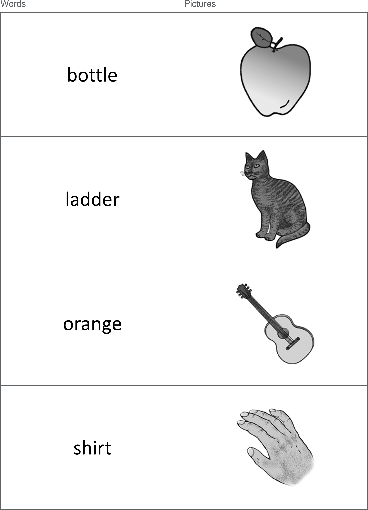
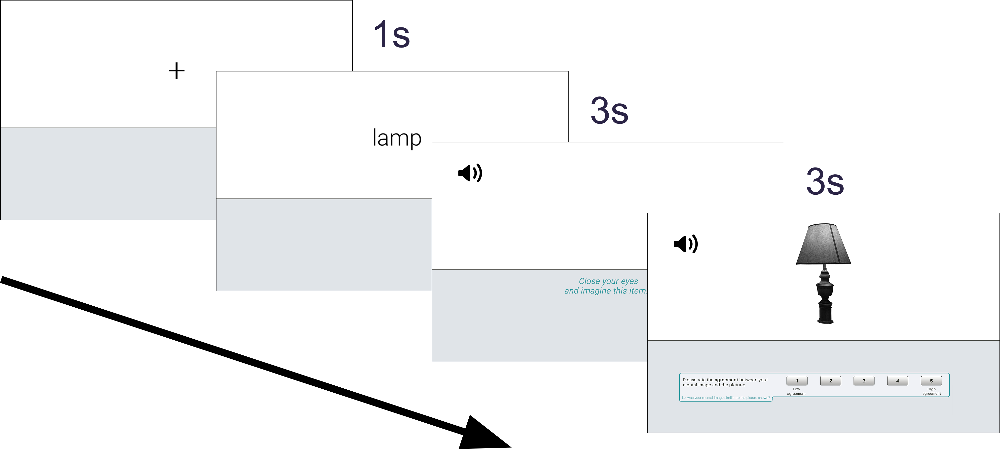
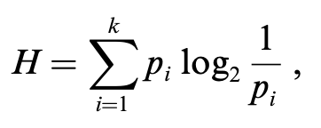
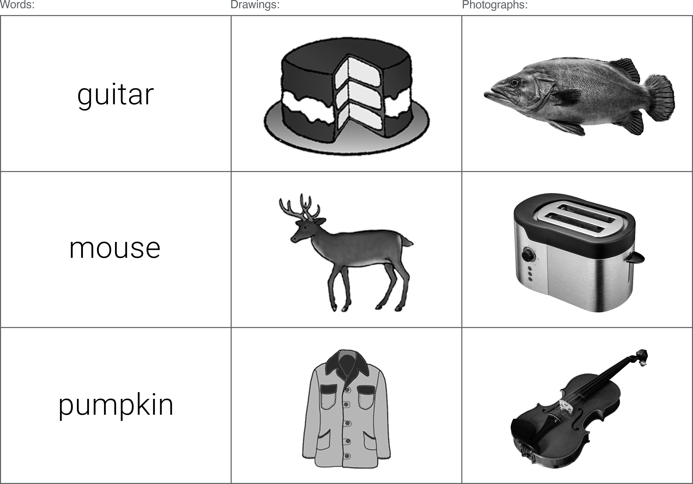

---
output:
  #word_document:
  #  toc: yes
  #  toc_depth: '4'
  pdf_document:
    toc: yes
    toc_depth: 4
    number_sections: no
    fig_caption: yes
    latex_engine: xelatex
mainfont: Helvetica
font-family: Helvetica Neue
fontsize: 11pt
geometry: left=35mm, right=20mm, top=30mm, bottom=30mm
bibliography: resources/refs.bib
csl: resources/apa-6th-edition.csl
subparagraph: yes
header-includes:
- \usepackage{setspace}
- \doublespacing
- \usepackage{fancyhdr}
- \pagestyle{fancy}
- \renewcommand{\headrulewidth}{1.5pt}
- \setlength{\headheight}{25.66263pt}
- \renewcommand{\href}[2]{#2\footnote{\url{#1}}}
- \usepackage{pdflscape}
- \newcommand{\blandscape}{\begin{landscape}}
- \newcommand{\elandscape}{\end{landscape}}
- \usepackage{titlesec}
- \titlespacing{\section}{0pt}{12pt plus 2pt minus 1pt}{0pt plus 1pt minus 1pt}
- \titlespacing{\subsection}{0pt}{12pt plus 2pt minus 1pt}{0pt plus 1pt minus 1pt}
- \titlespacing{\subsubsection}{0pt}{12pt plus 2pt minus 1pt}{0pt plus 1pt minus 1pt}
---

```{r load-packages, include=FALSE, cache=FALSE}
##    Clear environment and list required packages:
      rm(list=ls())  
      packages <- c("tidyverse", "dplyr", "captioner", "tinytex", "kableExtra", "formattable", "readr", "irr",
                    "psycho", "afex", "emmeans", "janitor", "psych", "rstatix", "ggpubr", "ggridges", "grid",
                    "gridExtra", "bibtex", "apa")
      packages_to_install <- packages[!(packages %in% installed.packages()[,"Package"])]
      if(length(packages_to_install)) install.packages(packages_to_install)
      invisible(suppressPackageStartupMessages(lapply(packages, library, character.only = TRUE)))
      devtools::install_github("crsh/papaja")
      library(papaja)
##    Write references file for all of the packages used, and general R ref:
      #write.bib(packages, "resources/packages.bib")
      #write.bib(citation(), "resources/base.bib")
#------------------------------------------------------------------------------------------------------------------
##  Define function to get package version: 
    packages_versions <- function(p) {
        paste(packageDescription(p)$Package, packageDescription(p)$Version, sep = " ")}    
##  Define function used in data tidying:
    coalesce_by_column <- function(df) {return(dplyr::coalesce(!!! as.list(df)))}
##  Define function to format t-test results:
    ttest.writeup <- function(i){
        paste0("*t*(", i$df, ") = ",
            round(i$statistic, 2), ", *p* ",
                ifelse(i$p.adj < .001, "< .001",
                       paste0("= ", round(i$p.adj, 2))))}
##  Captioner:
    figure_numbering <- captioner()
    table_numbering <- captioner(prefix = "Table")
    appendix_numbering <- captioner(prefix = "Appendix", type = "C")
    appendix_numbering("spelling.corrections", "Spelling corrections / manipulations to naming responses.", 
                       display = FALSE)
    appendix_numbering("exp2.full.norms", "Normative data for all photograph items.", 
                       display = FALSE)
```

\newpage
# Chapter 1
## Lit Review


Hamilton and Geraci (2006)

IMPLICIT MEMORY: 
PSE results from conceptual processing of a picture’s distinctive features (rather than semantic information). 
General semantic task:
‘‘What is a used car sometimes called?’’
No PSE.
Distinctive conceptual information task:
‘‘What fruit is egg shaped?’’
PSE. 

EXPLICIT RECOGNITION:
PSE always evident? 


############

aMCI
Show larger PSE effects than controls. 

Impaired REC, so this PSE must rely on FAM? 

Mixed findings whether fam is intact in aMCI.
Intact - generally use picture stim.
Impaired - generally use verbal stim. 

Is PSE in aMCI driven by intact FAM for pictures, but impaired FAM for words?
Yes (Embree, Budson, & Ally, 2012):
aMCI - Picture FAM - same as healthy OAs
aMCI - Word FAM - impaired compared to healthy OAs 

Ally, McKeever, 2009:
Examined early frontal old/new effect (FAM) in aMCI:
Intact for pictures.
Impaired for words.
BUT, P did not provide subjective Rec/Fam reports. 

Embree, Budson, & Ally, 2012:
Deep encoding (verbal like/dislike response). 
Modified Old/New (6-point rating scale):
6. Certain the item is old - to -  1. Certain the item is new.
	

Both used the same picture stim - colour photos.

###----------------------------------------

\newpage
# Chapter 2
Dual-process theories of recognition memory suggest that two independent processes - recollection and familiarity - are implicated in the successful recognition of previously encountered material [@paivio1971; @paivio1972]. Recollection typically refers to the conscious recall of encoded information, whereby contextual details (usually obtained by mentally re-experiencing a previous encounter with the stimulus) facilitate successful recognition. Familiarity, on the other hand, describes the unsubstantiated *feeling* of having encountered the stimulus before, and despite the inability to retrieve any associated diagnostic information, is still able to produce accurate recognition [@schoemaker2014]. While single-process accounts of recognition memory have been proposed, with the view that such experiences can be understood simply as varying levels of memory strength [@squire2007; @dunn2008], the majority of memory researchers agree that multiple processes are necessary to account for a range of dissociable experimental findings [@yonelinas2002]. Evidence from studies utilising event related potentials [ERPs; @curran2011], functional magnetic resonance imaging [fMRI; @scalici2017] and comparisons between healthy and clinical subject groups [e.g. Mild Cognitive Impairment; @belleville2011] all implicate the existence of two functionally distinct processes. Despite this consensus, disagreement persists in the literature regarding the extent to which recollection and familiarity are independent, and the methods that should be used to measure them most effectively [@schoemaker2014; @yonelinas2002].

&nbsp;

Experiments into recognition memory often focus on obtaining separate estimates of recollection and familiarity using process-estimation methods [@yonelinas2002]. The most commonly used process-estimation method is the Remember/Know (RK) paradigm [@tulving1985] - a task endorsed by a wide body of literature [@yonelinas1995a; @gardiner2000; @jacoby1991; @jacoby1997]. In a typical RK procedure, participants are generally tasked with making ‘old’ vs. ‘new’ recognition decisions toward a randomised list of items, many of which were presented during an earlier encoding phase (targets) amongst novel items with highly similar characteristics (lures). When a subject recognises an item, and thus selects *Old*, a follow-up judgement probes how they arrived at this decision (*Remember* or *Know*). If the subject was able to recognise the item based on recollection (i.e. conscious recall of some diagnostic information: "I remember seeing this item earlier"), they should classify their recognition as *Remember*. If the subject arrived at their recognition decision due to familiarity (i.e. a feeling of certainty that the item was studied in the encoding phase, but unable to recall and details: "I know I saw this item earlier, but cannot determine why"), they should classify their recognition as *Know*. In addition to the literature endorsing the task in healthy samples, a large body of research also reports that the RK procedure produces reliable estimations of recollection and familiarity in clinical populations [@lombardi2016]; for example, those with Mild Cognitive Impairment (MCI) typically produce results to suggest recollection impairments but intact familiarity compared to healthy older adults [@belleville2011; @wang2013; @lombardi2016; @hudon2009; @serra2010].

&nbsp;

The RK procedure has been modified in a number of ways since its conception, and continues to adapt as understandings of recollection and familiarity processes evolve. An early development was the "independence correction" - a formula devised to 'correct' the inherent underestimation of familiarity processes within the mutually exclusive paradigm [@yonelinas1995a]. Participants are generally only instructed to select *Know* (a reflection of familiarity) when there is an absence of recollection, however, this approach does not allow for the possibility of recollection and familiarity co-occurring. Proportions of *Know* responses will likely always be lower than *Remember* if subjects do indeed perceive to experience both processes simultaneously, since the presence of recollection necessitates that they select the *Remember* option among the two choices. When the @yonelinas1995a independence correction is applied, estimates of familiarity are determined by also taking into account the number of times *Remember* was selected when calculating the proportion of *Know* responses [@schoemaker2014]. An alternative to this correction is to modify the response options available to subjects, so they are able to individually determine the relative contributions of each process. @higham2004 proposed an independent ratings methodology whereby, instead of the binary *Remember*/*Know* options, subjects are provided with one rating scale to report the contribution of recollection and another to report the contribution of familiarity (RF-Ratings). Participants rate their recognition experience for each process accordingly: 1 = *definitely no*, 2 = *probably no*, 3 = *probably yes*, 4 = *definitely yes*. Such options allow for great variability in the way participants are able to respond, and for the possibility of both processes occuring conjointly: i) Recollection without Familiarity (high rating on R, low rating on F); ii) Familiarity without Recollection (high rating on F, low rating on R); iii) both Recollection *and* Familiarity (high rating on R and F); iv) neither R or F, i.e. a guess (*1* rating on R and F). The methodology of @higham2004 has been used in numerous studies [@brown2011; @tousignant2012; @kurilla2008], however, it could be argued that this rating task is somewhat removed from the original *judgement* task, and the extent to which the increased task complexity affects reports of recognition is unknown [@tousignant2015].

&nbsp;

Further modifications retain the original two binary response options, but avoid the mutual exclusivity issue by simply including a *Both* option [@tousignant2015]. When calculating proportions of recollection and familiarity, the total proportion of *Both* responses can then be separately added to the totals for each process. Recent adaptations of the RK paradigm have also begun to include a *Guess* response option, allowing participants to report uncertainty in their recognition decision [@belleville2011; @eldridge2002; @larsson2006; @tunney2007; @williams2019]. Previous studies have found that subjects may falsely assign guesses to the *Know* option when there is no explicit *Guess* option available [@gardiner1996; @gardiner1998; @gardiner2002a], on the assumption that this option more closely resembles their state of low confidence [@tunney2007]. Responding in this manner may artificially inflate obtained estimates of familiarity [@tunney2007]. By including *Guess*, the likelihood of obtaining false *Know* responses (i.e. those that do not reflect underlying familiarity processes) is reduced [@migo2012]. 

&nbsp;

Despite its widespread use, the RK procedure has been criticized for its reliance on participants’ subjective understanding of the provided instructions [@schoemaker2014], and the introspective nature of recognition judgements make it difficult to confirm whether all participants have understood the definitions (and thus responded) similarly [@lombardi2016]. It is also difficult to determine whether subjects interpret the *Remember* and *Know* labels in the same way that researchers intend [@umanath2020], especially as there is evidence to suggest participants struggle to understand the distinction between the terms [@geraci2009a; @rubin2015; @williams2014]. @williams2019 assessed the ways in which non-recollective subjective experiences were defined to participants, and found a great deal of inconsistency across a range of RK experiments. Some studies even changed the *Remember* and *Know* labels altogether; many exchanged the *Know* label with *Familiar* in an effort to reduce subjects defaulting to colloquial understandings of the word "know" which typically indicate high certainty; e.g. "I **know** I saw this item in the study phase" [@donaldson1996; @dobbins1998; @bastin2004; @ingram2012]. Others also substitute *Remember* for *Recollection* [@harlow2010]. Labels that accurately match the processes they intend to measure - *Recollection* and *Familiarity* - have been proposed in an effort to reduce the potentially misleading effects of the more colloquial *Remember* and *Know*, and thus make it easier for participants to 'map on' the definitions provided by researchers [@mayes2007; @harlow2010]. 

&nbsp;

In addition to the availability of different response options, and the labels used to describe the underlying processes, there is evidence to suggest that the format of to-be-remembered stimuli also plays a role in obtained estimates of recollection and familiarity. The Picture Superiority Effect (PSE) refers to a robust phenomenon whereby stimuli presented as pictures are markedly better remembered on tests of recall or recognition than stimuli presented as words [@shepard1967]. There is general agreement that, in recognition memory paradigms, picture superiority manifests as enhanced recollection rather than familiarity [@rajaram1996a; @curran2011]. Word stimuli, on the other hand, appear to produce increased familiarity ratings at test [@ally2007]. Understanding this phenomenon could help to conceptualise how memory breaks down in healthy ageing, and in the earliest stages of
amnestic Mild Cognitive Impairment (aMCI). For example, @ally2008 demonstrated that, despite similar levels of overall performance on a recognition task, healthy older adults showed greater picture superiority effects than younger adults. The memorial benefit of pictures was indeed evident in both the young and older groups, but the magnitude of this effect was greater in older adults, who only showed worse performance when responding to word stimuli. Interestingly, picture superiority also allows those with aMCI to show performance that is comparable to healthy older adult controls; despite exhibiting impaired performance overall, those with aMCI often show intact familiarity processes when pictures are utilised in recognition memory paradigms (and impaired familiarity when word stimuli are utilised; @embree2012; @ally2009; @ally2009a; @wolk2008; @algarabel2009; @anderson2008; @hudon2009; @oconnor2010; @serra2010; @westerberg2006]. 

&nbsp;

The objective of the current programme of research is to better understand how different methodologies inform understandings about the underlying processes of recollection and familiarity. Across a number of experiments, the distinctiveness of to-be-remembered stimuli will be systematically examined to determine the level at which successful recognition is impacted, and which process(es) are most susceptible. The aim of the first experiment, outlined below, is to establish baseline PSE response patterns in a novel, modified RK paradigm. In a 2x3 mixed factorial design, a within-subjects variable of stimulus type (words / simple pictures) will be used to determine whether the magnitude of picture superiority effects (PSEs) is mediated by the particular response options available at test (between-subjects variable of response option: RFG, RFBG, RF-Ratings). In each condition, the labels *Recollection*/*Familiarity* will be used in place of the standard *Remember*/*Know*, in an effort to reduce the impact of colloquial understandings on the current experimental definitions. To avoid guesses biasing estimations of familiarity [@belleville2011; @eldridge2002; @larsson2006; @tunney2007; @williams2019], participants in all response-option conditions are also given the option to report that they are merely *Guessing* that an item is old. At test, subjects will be presented with either i) three response options (RFG); ii) four response options (RFBG; where a *Both* response option allows subjects to report the co-occurance of R and F; iii) separate 0-5 rating scales for R and F (where subjects could report either process occurring alone, both processes occurring conjointly, or that they are guessing by providing a '0' rating on both scales). To establish whether a PSE is evident in the current paradigm, *d'* (d-prime) scores will be calculated for each participant. *d'* is a signal detection statistic, calculated by taking the standardised difference between the signal (i.e. correct hits) and signal+noise (i.e. false alarms); in other words, *d'* offers a representation of global recognition performance and participants' ability to distinguish target items from lures [@doi:https://doi.org/10.1002/9781118445112.stat06743]. Higher *d'* scores demonstrate better overall performance on the memory task. Based on the discussed research, the following results are hypothesised:

1. **Overall PSE**: a PSE will be evident within the current paradigm, manifesting as:
    + i) higher overall *d'* scores for pictures compared to words;
    + ii) higher proportion of correct hits; 
    + ii) lower proportion of false alarms; 
    + iv) better overall recognition.
2. **PSE in rates of Recollection and Familiarity**:
    + i) pictures will produce a higher proportion of R hits and a lower proportion of R FAs than words. 
    + ii) words will produce a higher proportion of F hits and a higher proportion of F FAs than pictures. 
3. **PSE and the availability of different response options**:
    + i) comparable PSEs will be evident in each of the response option conditions (RFG, RFBG, RF-Ratings).
    + ii) the availability of different response options will affect whether a PSE manifests as increased recollection, increased familiarity, or both (RFBG, RF-Ratings).

## Experiment 1: Establishing PSEs in novel Remember/Know paradigm
```{r experiment-1-main, include=FALSE, warning = FALSE, message=FALSE, cache=TRUE}
###################################################################################################################
##    Experiment 1 - Data processing:                                                                            ##
###################################################################################################################
##    Import unique image URLs (to identify each stim):
      exp1__image_urls <- read_csv("./resources/experiment_1/image_urls.csv") %>%
          mutate(url = str_replace(url,
                            "https:\\/\\/keelepsych.co1.qualtrics.com\\/ControlPanel\\/Graphic.php\\?IM=IM_", ""))
##    Import study data (which contains demographics info):                            
      exp1__participant_info <- read_csv(
        "./resources/experiment_1/experiment_1_data/Jamie - RFG Images (1) - STUDY_January 13, 2021_08.21.csv") %>%
          select(-"StartDate", -"EndDate", -"Status", -"Duration (in seconds)", -"Finished",
                 -"RecipientLastName", -"RecipientFirstName", -"RecipientEmail", -"ExternalReference",
                 -"LocationLatitude", -"LocationLongitude", -"DistributionChannel", -"UserLanguage", -"Q1.3",
                 -"Q1.4", -"Q100", -"Q101", -contains("Last Click"), -contains("Page Submit"), 
                 -contains("Click Count"), -contains("Q4.5"), -contains("Q5.5"), -contains("Q6.5"),
                 -contains("Q7.5"), -contains("Q8.5"), -contains("Q9.5"), -contains("Q10.5"), -contains("Q11.5"),
                 -contains("Q12.5"), -contains("Q13.5"), -contains("Q14.5"), -contains("Q15.5"), 
                 -contains("Q16.5"), -contains("Q17.5")) %>%
          row_to_names(row_number = 1) %>%
          slice(-1) %>%
          rename(ip = "IP Address", progress = "Progress", recorded_date = "Recorded Date", 
                 study_id = "Response ID", age = "Your age:", gender = "Your gender:",
                 eng_first_lang = "Is English your first language?", source = "Source") %>%
          select(study_id, ip, recorded_date, progress, age, gender, eng_first_lang, source, 8:143, 164:571) %>%
          mutate(study_id = str_remove_all(study_id, "R_")) %>%
          mutate_all(tolower) %>%
          group_by(study_id) %>%
          gather(., "question", "response", -study_id) %>%
          arrange(study_id) %>%
          drop_na(response) %>%
          mutate(question = str_remove(question, 
                 "Timing - https:\\/\\/keelepsych.co1.qualtrics.com\\/ControlPanel\\/Graphic.php\\?IM=IM_")) %>%
          mutate(question = str_remove(question, "- Timing - First Click")) %>%
          mutate(question = str_remove(question, 
                  "https:\\/\\/keelepsych.co1.qualtrics.com\\/ControlPanel\\/Graphic.php\\?IM=IM_")) %>%
          mutate(question = str_remove(question, "\ .+")) %>%
          mutate(question = str_trim(question))
##  Temporarily extract demographics info:
      exp1__demographics <- exp1__participant_info %>%
          filter(question == "ip" | question == "recorded_date" | question == "progress" |
                 question == "age" | question == "gender" | question == "eng_first_lang" |
                 question == "source") %>%
          spread(question, response) %>%
##    Tidy exp1__demographics a bit:
          rename(study_end_time = "recorded_date") %>%
          mutate(study_end_time = str_replace_all(study_end_time, "-", "_")) %>%
          mutate(study_end_time = str_replace_all(study_end_time, " ", "_")) %>%
          mutate(gender = str_replace(gender, "^f$", "female")) %>%
          mutate(gender = str_replace(gender, "woman", "female")) %>%
          mutate(gender = str_replace(gender, "^m$", "male")) %>%
          mutate(gender = str_replace(gender, "5a6f51ec46f0230001ce445f", "unspecified")) %>%
          mutate(gender = replace_na(gender, "unspecified")) %>%
          mutate(age = as.double(age)) %>%
          mutate(age = na_if(age, 100))

##    Temporarily extract study data (so we can reshape and put RTs on the same row as responses).
      exp1__study_data <- exp1__participant_info %>%
          filter(question != "ip" & question != "recorded_date" & question != "progress" &
                 question != "age" & question != "gender" & question != "eng_first_lang" &
                 question != "source") %>%
          mutate(temp_index = as.double(response)) %>%
          mutate(index = ifelse(is.na(temp_index),'response','rt')) %>%
          select(-temp_index) %>%
          as.data.frame()
      exp1__study_data <- reshape(exp1__study_data, idvar=c('study_id','question'), timevar='index',
                                  direction="wide") %>%
          as_tibble(exp1__study_data, .name_repair) %>%
          rename(study_rt = "response.rt", study_response = "response.response") %>%
          group_by(study_id) %>%
##    We also do study calculations here, as it's easier when separated from exp1__demographics.
##    First we merge with 'exp1__image_urls' to get proper item names:
          merge(., exp1__image_urls, by.x="question", by.y="url") %>%
          group_by(study_id) %>%
          select(-question) %>%
          arrange(study_id, study_list, stim) %>%
          filter(!str_detect(study_list, 'FILLER')) %>%
##    Split the 'stim' column up, so item name and stimuli format are seperate:
          separate(stim, c("item_name", "stim_format")) %>%
##    Clearly show which lists were studied as words and pics: 
          mutate(studied_words = ifelse(stim_format == "word", study_list, NA)) %>%
          mutate(studied_pics = ifelse(stim_format == "picture", study_list, NA)) %>%
          select(-study_list) %>%
##    Count total study responses (should be 60):
          add_tally(stim_format == "word" | stim_format == "picture", sort = FALSE, 
                    name = "study_responses_total") %>%
##    Count total study responses by stim-format (should be 30 each):
          add_tally(stim_format == "word", sort = FALSE, name = "study_total_word_resp") %>%
          add_tally(stim_format == "picture", sort = FALSE, name = "study_total_pic_resp") %>%
##    Count total *correct* word responses (should be 30):
          add_tally(stim_format == "word" & study_response == "word", sort = FALSE, 
                    name = "study_correct_word") %>%
##    Count total *correct* pic responses (should be 30):
          add_tally(stim_format == "picture" & study_response == "picture", sort = FALSE, 
                    name = "study_correct_pic") %>%
##    Count total *correct* responses (should be 60):
          mutate(study_correct = study_correct_word + study_correct_pic) %>%
##    Convert total *correct* responses to proportion:
          mutate(study_correct_percent = study_correct*(100/study_responses_total)) %>%
##    Calculate mean overall reaction time:
          mutate(study_rt = as.double(study_rt)) %>%
          mutate(mean_study_rt_total = mean(study_rt)) %>%
##    Calculate mean word reaction time (correct responses):
          mutate(mean_study_rt_corr_word = mean(study_rt[stim_format == "word" & study_response == "word"])) %>%
##    Calculate mean pic reaction time (correct responses):
          mutate(mean_study_rt_corr_pic = mean(study_rt[stim_format == "picture" & 
                                                        study_response == "picture"])) %>%
##    Remove columns with multiple unique values now we've done the totals:
          select(-study_rt, -study_response, -item_name, -stim_format) %>%
##    Reduce data so we have one row per participant:
          summarise_all(coalesce_by_column)
##    Overwrite 'exp1__participant_info' with 'exp1__study_data' joined with 'exp1__demographics':
      exp1__participant_info <- right_join(exp1__demographics, exp1__study_data, by = "study_id") %>%
##    Remove participants that have no study total (ie, did exp1__demographics but did not start study):
          drop_na("study_responses_total") %>%
          mutate_all(tolower)
###################################################################################################################
##    Import and tidy test data:                                                                                 ##
###################################################################################################################
##    Import test data files (output from Qualtrics was too big and would fail, so has to be in 2 parts!).
##    We have to do some quick tidying to each before joining (colnames are the same right now (e.g. Q1.1),
##    but are different after we use row_to_names.
      exp1__full_data1 <- read_csv(
        "./resources/experiment_1/experiment_1_data/ AC_P_January 13, 2021_08.23.csv") %>%
          select(-"EndDate", -"Status", -"Duration (in seconds)", -"Finished", -"RecipientLastName", 
                 -"RecipientFirstName", -"RecipientEmail", -"ExternalReference", -"LocationLatitude",
                 -"LocationLongitude", -"DistributionChannel", -"UserLanguage", -contains("Last Click"),
                 -contains("Page Submit"), -contains("Click Count"), -contains("Q3.8"), -contains("Q4.8"),
                 -contains("Q5.8"), -contains("Q6.8"), -contains("Q7.8"), -contains("Q8.8"), 
                 -contains("Q11.9"), -contains("Q12.9")) %>%
##    Merge justification columns from across the three response option conditions:
          unite("rec_justification", "Q5.2_1", "Q9.2_1", "Q13.2_1", na.rm = TRUE, remove = TRUE) %>%
          unite("fam_justification", "Q5.2_2", "Q9.2_2", "Q13.2_2", na.rm = TRUE, remove = TRUE) %>%
          unite("both_justification", "Q9.2_3", "Q13.2_3", na.rm = TRUE, remove = TRUE) %>%
          unite("guess_justification", "Q5.2_3", "Q9.2_4", "Q13.2_4", na.rm = TRUE, remove = TRUE)
##    Add column identifiers to the lower rows (since we still have the Qualtrics 3x header rows here):
      exp1__full_data1$rec_justification[1:2] <- "rec_justification"
      exp1__full_data1$fam_justification[1:2] <- "fam_justification"
      exp1__full_data1$both_justification[1:2] <- "both_justification"
      exp1__full_data1$guess_justification[1:2] <- "guess_justification"
##    Set correct row for rownames (Qualtrics outputs with 3 header rows - we only want one): 
      exp1__full_data1 <- exp1__full_data1 %>% row_to_names(row_number = 1) %>% clean_names() %>% slice(-1) %>%
##    Rename some columns:       
          rename(ip = "ip_address", test_id = "response_id", 
                 comments = "if_you_have_any_comments_about_this_experiment_please_include_them_below") %>%
##    Reorder columns:    
          select(test_id, ip, start_date, rec_justification, fam_justification, 
                 both_justification, guess_justification, comments, 5:516, 520:1031, 1033:1672) %>%
##    Set ID as the grouping variable:
          mutate(test_id = str_remove_all(test_id, "R_")) %>%
          mutate_all(tolower) %>%
          group_by(test_id) %>%
##    Reformat from long to wide:
          gather(., "question", "response", -test_id) %>%
          arrange(test_id)
#------------------------------------------------------------------------------------------------------------------
      exp1__full_data2 <- 
        read_csv("./resources/experiment_1/experiment_1_data/ BD_P_January 13, 2021_08.22.csv") %>%
          select(-"EndDate", -"Status", -"Duration (in seconds)", -"Finished", -"RecipientLastName", 
                 -"RecipientFirstName", -"RecipientEmail", -"ExternalReference", -"LocationLatitude",
                 -"LocationLongitude", -"DistributionChannel", -"UserLanguage", -contains("Last Click"),
                  -contains("Page Submit"), -contains("Click Count"), -contains("Q3.8"), -contains("Q4.8"),
                 -contains("Q5.8"), -contains("Q6.8"), -contains("Q7.8"), -contains("Q8.8"), 
                 -contains("Q11.9"), -contains("Q12.9")) %>%
##    Merge justification columns from across the three response option conditions:
          unite("rec_justification", "Q5.2_1", "Q9.2_1", "Q13.2_1", na.rm = TRUE, remove = TRUE) %>%
          unite("fam_justification", "Q5.2_2", "Q9.2_2", "Q13.2_2", na.rm = TRUE, remove = TRUE) %>%
          unite("both_justification", "Q9.2_3", "Q13.2_3", na.rm = TRUE, remove = TRUE) %>%
          unite("guess_justification", "Q5.2_3", "Q9.2_4", "Q13.2_4", na.rm = TRUE, remove = TRUE)
##    Add column identifiers to the lower rows (since we still have the Qualtrics 3x header rows here):
      exp1__full_data2$rec_justification[1:2] <- "rec_justification"
      exp1__full_data2$fam_justification[1:2] <- "fam_justification"
      exp1__full_data2$both_justification[1:2] <- "both_justification"
      exp1__full_data2$guess_justification[1:2] <- "guess_justification"
##    Set correct row for rownames (Qualtrics outputs with 3 header rows - we only want one): 
      exp1__full_data2 <- exp1__full_data2 %>% row_to_names(row_number = 1) %>% 
          clean_names() %>% slice(-1) %>%
##    Rename some columns:       
          rename(ip = "ip_address", test_id = "response_id",
                 comments = "if_you_have_any_comments_about_this_experiment_please_include_them_below") %>%
##    Reorder columns:    
          select(test_id, ip, start_date, rec_justification, fam_justification, 
                 both_justification, guess_justification, comments, 5:516, 520:1031, 1033:1672) %>%
##    Set ID as the grouping variable:
          mutate(test_id = str_remove_all(test_id, "R_")) %>%
          mutate_all(tolower) %>%
          group_by(test_id) %>%
##    Reformat from long to wide:
          gather(., "question", "response", -test_id) %>%
          arrange(test_id)
#------------------------------------------------------------------------------------------------------------------
      exp1__full_data <- exp1__full_data1 %>%
          bind_rows(exp1__full_data2) %>%
          drop_na(response)
##    Temporarily extract justifications:
      exp1__justifications <- exp1__full_data %>%
          filter(question == "ip" | question == "start_date" | question == "progress" |
                   question == "rec_justification" | question == "fam_justification" |
                   question == "both_justification" | question == "guess_justification" |
                   question == "comments") %>%
          spread(question, response)
##    Tidy test data:
      exp1__full_data <- exp1__full_data %>%
          filter(question != "ip" & question != "start_date" & question != "progress" &
                   question != "rec_justification" & question != "fam_justification" &
                   question != "both_justification" & question != "guess_justification" & 
                   question != "comments") %>%
          mutate(rfr_resp_type = question) %>%
          mutate(rfr_resp_type = str_remove(rfr_resp_type, ".*_")) %>%
          mutate(rfr_resp_type = ifelse(rfr_resp_type == "recollection" | rfr_resp_type == "familiarity",
                                        rfr_resp_type, "")) %>%
          mutate(question = str_remove(question,
                                "timing_https_keelepsych_co1_qualtrics_com_control_panel_graphic_php_im_im_")) %>%
          mutate(question = str_remove(question,
                                "https_keelepsych_co1_qualtrics_com_control_panel_graphic_php_im_im_")) %>%
          mutate(question = str_remove_all(question, "_")) %>%
          mutate(question_number = question) %>%
          mutate(question = str_remove(question, "(?<=.{15}).+")) %>%
          mutate(question_number = str_remove(question_number, "^.{0,15}")) %>%
          mutate(question = str_trim(question)) %>%
          mutate(resp_option = case_when(str_detect(question_number, "q3") ~ "rfg",
                                         str_detect(question_number, "q4") ~ "rfg",
                                         str_detect(question_number, "q7") ~ "rfbg",
                                         str_detect(question_number, "q8") ~ "rfbg",
                                         str_detect(question_number, "q11") ~ "rf_ratings",
                                         str_detect(question_number, "q12") ~ "rf_ratings",
                                         str_detect(question_number, "recollection") ~ "rf_ratings",
                                         str_detect(question_number, "familiarity") ~ "rf_ratings")) %>%
          fill(resp_option, .direction = "updown") %>%
##    Reshape to put RTs on the same row as responses):
          mutate(temp_index = as.double(response)) %>%
          mutate(index = ifelse((is.na(temp_index) & resp_option == "rfg") & 
                                  (response == "old" | response == "new"), 'rfg_old_new','rt')) %>%
          mutate(index = ifelse((is.na(temp_index) & resp_option == "rfbg") & 
                                  (response == "old" | response == "new"), 'rfbg_old_new', index)) %>%
          mutate(index = ifelse((is.na(temp_index) & resp_option == "rf_ratings") & 
                                  (response == "old" | response == "new"), 'rf_ratings_old_new', index)) %>%
          mutate(index = ifelse((is.na(temp_index) & resp_option == "rfg") & 
                                  (response != "old" & response != "new"), 'rfg', index)) %>%
          mutate(index = ifelse((is.na(temp_index) & resp_option == "rfbg") & 
                                  (response != "old" & response != "new"), 'rfbg', index)) %>%
          mutate(index = ifelse((is.na(temp_index) & 
                                   resp_option == "rf_ratings" & rfr_resp_type == "recollection") & 
                                  (response != "old" & response != "new"), 'rec_rating', index)) %>%
          mutate(index = ifelse((is.na(temp_index) & 
                                   resp_option == "rf_ratings" & rfr_resp_type == "familiarity") & 
                                  (response != "old" & response != "new"), 'fam_rating', index)) %>%
          select(-rfr_resp_type, -temp_index, -question_number) %>%
          as.data.frame()
#------------------------------------------------------------------------------------------------------------------
      exp1__full_data <- reshape(exp1__full_data, idvar=c('test_id','question'), timevar='index', 
                                 direction="wide") %>%
          as_tibble(exp1__study_data, .name_repair) %>%
          unite("old_new", response.rfg_old_new, response.rfbg_old_new, 
                response.rf_ratings_old_new, remove = TRUE, na.rm = TRUE) %>%
          select(-resp_option.rfg_old_new, -resp_option.rfg, -resp_option.rf_ratings_old_new, 
                 -resp_option.rec_rating, -resp_option.fam_rating, -resp_option.rfbg_old_new, 
                 -resp_option.rfbg) %>%
##    Recode RF-Ratings responses to better show rec/fam:
          mutate(response.rec_rating = str_remove_all(response.rec_rating, " ")) %>%
          mutate(response.rec_rating = str_remove_all(response.rec_rating, "(?<=.{1}).+")) %>%
          mutate(response.rec_rating = str_c("rec_", response.rec_rating)) %>%
          mutate(response.fam_rating = str_remove_all(response.fam_rating, " ")) %>%
          mutate(response.fam_rating = str_remove_all(response.fam_rating, "(?<=.{1}).+")) %>%
          mutate(response.fam_rating = str_c("fam_", response.fam_rating)) %>%
##    Unite columns of the same response type:
          unite("recfam_1", response.rfg, response.rfbg, response.rec_rating, remove = TRUE, na.rm = TRUE) %>%
          mutate(recfam_1 = na_if(recfam_1, "")) %>%
          rename(recfam_2 = "response.fam_rating")
##    Merge with 'exp1__image_urls' to get proper item names:
      exp1__image_urls <- exp1__image_urls %>%
          mutate_all(tolower)
      exp1__full_data <- exp1__full_data %>%
          merge(., exp1__image_urls, by.x="question", by.y="url") %>%
          group_by(test_id) %>%
          select(-question) %>%
          arrange(test_id, study_list, stim) %>%
          rename(old_new_rt = "response.rt", resp_option = "resp_option.rt", 
                 belong_to_study_list = "study_list") %>%
##    Remove filler items:
          filter(!str_detect(belong_to_study_list, 'filler')) %>%
##    Split the 'stim' column up, so item name and stimuli format are seperate:
          separate(stim, c("item_name", "stim_format")) %>%
##    Count total test responses (should be 120):
          add_tally(stim_format == "word" | stim_format == "picture", sort = FALSE, name = "test_total_resp") %>%
##    Count total test responses by stim-format (should be 60 each):
          add_tally(stim_format == "word", sort = FALSE, name = "test_total_word_resp") %>%
          add_tally(stim_format == "picture", sort = FALSE, name = "test_total_pic_resp") %>%
##    Calculate mean overall reaction time:
          mutate(old_new_rt = as.double(old_new_rt)) %>%
          mutate(mean_old_new_rt_total = mean(old_new_rt)) %>%
##    Calculate mean word reaction time (all responses):
          mutate(mean_test_rt_word = mean(old_new_rt[stim_format == "word"])) %>%
##    Calculate mean pic reaction time (all responses):
          mutate(mean_test_rt_pic = mean(old_new_rt[stim_format == "picture"]))
##    Add justifications back in: 
      exp1__full_data <- exp1__full_data %>%
          merge(., exp1__justifications, by = "test_id") %>%
          select(test_id, ip, start_date, rec_justification, fam_justification, both_justification,
                 guess_justification, comments, resp_option, item_name, stim_format, belong_to_study_list, 
                 old_new, old_new_rt, recfam_1, recfam_2, test_total_resp, test_total_word_resp, 
                 test_total_pic_resp, mean_old_new_rt_total, mean_test_rt_word, mean_test_rt_pic) %>%
          mutate_if(is.character, list(~na_if(., ""))) %>%
          rename( test_start_time = "start_date")
##    Remove Ps with incomplete test data:
      exp1__incomplete_exp1__full_data <- exp1__full_data %>%
          select(test_id, test_total_resp) %>%
          distinct(test_id, .keep_all = TRUE) %>%
          filter(test_total_resp != 120) %>%
          pull(test_id)
      exp1__full_data <- exp1__full_data %>%
          filter(!test_id %in% exp1__incomplete_exp1__full_data)
###################################################################################################################
##    Match study across seperate study and test files:                                                          ##
###################################################################################################################
##    List all the unique participants we have in 'participant info': 
      exp1__unique_p_at_study <- exp1__participant_info %>%
          select(study_id, ip, study_end_time) %>%
          rename(time = "study_end_time") %>%
          mutate(time = str_remove(time , "...$")) %>%
          arrange(ip, time)
##    List all unique participants we have in 'exp1__full_data', and format test_start_time to simplified version:
      exp1__unique_p_at_test <- exp1__full_data %>%
          select(test_id, ip, test_start_time) %>%
          distinct(test_id, .keep_all = TRUE) %>%
          rename(time = "test_start_time") %>%
          mutate(time = as.character(time)) %>%
##    Remove seconds precision from time data. Study and test times won't match *exactly* because it took a 
##    couple of seconds for them to redirect from the study project to the test project on Qualtrics, so here 
##    we remove some precision:
          mutate(time = str_remove(time , "...$")) %>%        
          mutate(time = str_replace(time , " ", "_")) %>%
          mutate(time = str_replace_all(time , "-", "_")) %>%
          arrange(ip, time)
##    Here we join 'exp1__unique_p_at_study' with 'exp1__unique_p_at_test' by ip and time. 
      exp1__all_participants <- exp1__unique_p_at_study %>%
          full_join(exp1__unique_p_at_test, by = c("ip", "time"))
##    However, we're left with a few NA rows where no match was found. We now separate those P to investigate,
##    and determine whether they do match or not (i.e. did the time change by 1-minute whilst P were 
##    transferring from study > test, hence why a match was not found. 
      exp1__unmatched <- exp1__all_participants %>%
          filter(is.na(study_id) | is.na(test_id))
##    First we see which IPs match (if theres an IP match between a 'study_id' NA row and a 'test_id' NA row,
##    and their times look similar, it's almost certainly the same person). 
      exp1__duplicate_ips <- exp1__unmatched %>%
          group_by(ip) %>% 
          filter(n()>1)
##    4 out of 5 duplicate IPs have a very similar times between study and test, and are therefore almost 
##    certainly the same people. We'll join these rows in 'exp1__all_participants':
      exp1__all_participants <- exp1__all_participants %>%
          mutate(test_id = replace(test_id, study_id == "3sbkutkpbz0t7y1", "uenhxpj5gjopn4t")) %>%
          mutate(test_id = replace(test_id, study_id == "1i3sv43b6k977mc", "3p3jpgswhnvaycz")) %>%
          mutate(test_id = replace(test_id, study_id == "3i69jnaz1wrx4fq", "247estlk1nx9ljy")) %>%
          mutate(test_id = replace(test_id, study_id == "pfexrfarjkpsygf", "2fwc8n0fuonvta3")) %>%
##    After removing the no-longer-needed duplicate rows (because we copied the relevant test_ids into one row), 
##    we're left with 11 participants that cannot be reconciled. We will exclude these participants, as they are
##    either missing test data or study data. 
          drop_na() %>%
          select(-ip, -time) %>%
##    Assign new, simpler P ids:
          rowid_to_column(., "id") %>%
          mutate(id = as.character(id))
      exp1__all_participants$id <- str_pad(exp1__all_participants$id, width=3, side="left", pad="0")
##    Join study and test data for our 'complete' participants:
      exp1__participant_info <- exp1__participant_info %>%
          filter(study_id %in% exp1__all_participants$study_id)
      exp1__full_data <- exp1__full_data %>%
          filter(test_id %in% exp1__all_participants$test_id)
      exp1__full_data <- exp1__all_participants %>%
          full_join(exp1__participant_info, by = "study_id") %>%
          full_join(exp1__full_data, by = "test_id") %>%    
###################################################################################################################
##    Calculations:                                                                                              ##
###################################################################################################################
##    Total hits and misses:
          add_tally(studied_words == belong_to_study_list & stim_format == "word" & old_new == "old",
                    name = "word_hit") %>%
          add_tally(studied_words == belong_to_study_list & stim_format == "word" & old_new == "new", 
                    name = "word_miss") %>%
          add_tally(studied_pics == belong_to_study_list & stim_format == "picture" & old_new == "old", 
                    name = "pic_hit") %>%
          add_tally(studied_pics == belong_to_study_list & stim_format == "picture" & old_new == "new", 
                    name = "pic_miss") %>%
          mutate(total_hit = word_hit + pic_hit) %>%
          mutate(total_miss = word_miss + pic_miss) %>%
##    Total FA and CR:
          add_tally(studied_words != belong_to_study_list & stim_format == "word" & old_new == "old",
                    name = "word_FA") %>%
          add_tally(studied_words != belong_to_study_list & stim_format == "word" & old_new == "new", 
                    name = "word_CR") %>%
          add_tally(studied_pics != belong_to_study_list & stim_format == "picture" & old_new == "old", 
                    name = "pic_FA") %>%
          add_tally(studied_pics != belong_to_study_list & stim_format == "picture" & old_new == "new", 
                    name = "pic_CR") %>%
          mutate(total_FA = word_FA + pic_FA) %>%
          mutate(total_CR = word_CR + pic_CR) %>%
##    Rec/fam hits: 
          add_tally((studied_words == belong_to_study_list & stim_format == "word") & 
                      ((resp_option != "rf_ratings" & recfam_1 == "recollection") |
                         (resp_option == "rf_ratings" & recfam_1 == "rec_3" | 
                            recfam_1 == "rec_4" | recfam_1 == "rec_5")), name = "word_hit_rec") %>%
          add_tally((studied_words == belong_to_study_list & stim_format == "word") & 
                      ((resp_option != "rf_ratings" & recfam_1 == "familiarity") |
                         (resp_option == "rf_ratings" & recfam_2 == "fam_3" | 
                            recfam_2 == "fam_4" | recfam_2 == "fam_5")), name = "word_hit_fam") %>%
          add_tally((studied_words == belong_to_study_list & stim_format == "word") & 
                      recfam_1 == "both", name = "word_hit_both") %>%
          add_tally((studied_words == belong_to_study_list & stim_format == "word") & 
                      ((resp_option != "rf_ratings" & recfam_1 == "guessing") |
                         (resp_option == "rf_ratings" & (recfam_1 == "rec_0" & recfam_2 == "fam_0"))),
                            name = "word_hit_guess") %>%
          add_tally((studied_pics == belong_to_study_list & stim_format == "picture") & 
                      ((resp_option != "rf_ratings" & recfam_1 == "recollection") |
                         (resp_option == "rf_ratings" & recfam_1 == "rec_3" | 
                            recfam_1 == "rec_4" | recfam_1 == "rec_5")), name = "pic_hit_rec") %>%
          add_tally((studied_pics == belong_to_study_list & stim_format == "picture") & 
                      ((resp_option != "rf_ratings" & recfam_1 == "familiarity") |
                         (resp_option == "rf_ratings" & recfam_2 == "fam_3" | 
                            recfam_2 == "fam_4" | recfam_2 == "fam_5")), name = "pic_hit_fam") %>%
          add_tally((studied_pics == belong_to_study_list & stim_format == "picture") & 
                      recfam_1 == "both", name = "pic_hit_both") %>%
          add_tally((studied_pics == belong_to_study_list & stim_format == "picture") & 
                      ((resp_option != "rf_ratings" & recfam_1 == "guessing") |
                         (resp_option == "rf_ratings" & (recfam_1 == "rec_0" & recfam_2 == "fam_0"))),
                            name = "pic_hit_guess") %>%
##    Rec/fam FA: 
          add_tally((studied_words != belong_to_study_list & stim_format == "word") & 
                      ((resp_option != "rf_ratings" & recfam_1 == "recollection") |
                         (resp_option == "rf_ratings" & recfam_1 == "rec_3" | 
                            recfam_1 == "rec_4" | recfam_1 == "rec_5")), name = "word_FA_rec") %>%
          add_tally((studied_words != belong_to_study_list & stim_format == "word") & 
                      ((resp_option != "rf_ratings" & recfam_1 == "familiarity") |
                         (resp_option == "rf_ratings" & recfam_2 == "fam_3" | 
                            recfam_2 == "fam_4" | recfam_2 == "fam_5")), name = "word_FA_fam") %>%
          add_tally((studied_words != belong_to_study_list & stim_format == "word") & 
                      recfam_1 == "both", name = "word_FA_both") %>%
          add_tally((studied_words != belong_to_study_list & stim_format == "word") & 
                      ((resp_option != "rf_ratings" & recfam_1 == "guessing") |
                         (resp_option == "rf_ratings" & (recfam_1 == "rec_0" & recfam_2 == "fam_0"))),
                            name = "word_FA_guess") %>%
          add_tally((studied_pics != belong_to_study_list & stim_format == "picture") & 
                      ((resp_option != "rf_ratings" & recfam_1 == "recollection") |
                         (resp_option == "rf_ratings" & recfam_1 == "rec_3" | 
                            recfam_1 == "rec_4" | recfam_1 == "rec_5")), name = "pic_FA_rec") %>%
          add_tally((studied_pics != belong_to_study_list & stim_format == "picture") & 
                      ((resp_option != "rf_ratings" & recfam_1 == "familiarity") |
                         (resp_option == "rf_ratings" & recfam_2 == "fam_3" | 
                            recfam_2 == "fam_4" | recfam_2 == "fam_5")), name = "pic_FA_fam") %>%
          add_tally((studied_pics != belong_to_study_list & stim_format == "picture") & 
                      recfam_1 == "both", name = "pic_FA_both") %>%
          add_tally((studied_pics != belong_to_study_list & stim_format == "picture") & 
                      ((resp_option != "rf_ratings" & recfam_1 == "guessing") |
                         (resp_option == "rf_ratings" & (recfam_1 == "rec_0" & recfam_2 == "fam_0"))),
                            name = "pic_FA_guess") %>%
          na_if(., 0) %>%
          select(-item_name, -old_new, -old_new_rt, -recfam_1, -recfam_2) %>%
          summarise_all(coalesce_by_column) %>%
          mutate_all(~replace_na(., 0)) %>%
          arrange(id) %>%
##    Total prop hits and misses:
          mutate(prop_word_hit = word_hit / (word_hit + word_miss)) %>%
          mutate(prop_word_miss = word_miss / (word_hit + word_miss)) %>%
          mutate(prop_pic_hit = pic_hit / (pic_hit + pic_miss)) %>% 
          mutate(prop_pic_miss = pic_miss / (pic_hit + pic_miss)) %>%
##    Total prop FA and CR:
          mutate(prop_word_FA = word_FA / (word_FA + word_CR)) %>%
          mutate(prop_word_CR = word_CR / (word_FA + word_CR)) %>%
          mutate(prop_pic_FA = pic_FA / (pic_FA + pic_CR)) %>% 
          mutate(prop_pic_CR = pic_CR / (pic_FA + pic_CR)) %>% 
##    Prop rec/fam hits:
          mutate(prop_word_hit_rec = word_hit_rec / word_hit) %>%
          mutate(prop_word_hit_fam = word_hit_fam / word_hit) %>%
          mutate(prop_word_hit_both = word_hit_both / word_hit) %>%
          mutate(prop_word_hit_guess = word_hit_guess / word_hit) %>%
          mutate(prop_pic_hit_rec = pic_hit_rec / pic_hit) %>%
          mutate(prop_pic_hit_fam = pic_hit_fam / pic_hit) %>%
          mutate(prop_pic_hit_both = pic_hit_both / pic_hit) %>%
          mutate(prop_pic_hit_guess = pic_hit_guess / pic_hit) %>%
##    TOTAL prop: 
          mutate(total_prop_word_hit_rec = ifelse(resp_option == "rfbg", prop_word_hit_rec + prop_word_hit_both, 
                                                  prop_word_hit_rec)) %>%
          mutate(total_prop_word_hit_fam = ifelse(resp_option == "rfbg", prop_word_hit_fam + prop_word_hit_both, 
                                                  prop_word_hit_fam)) %>%
          mutate(total_prop_pic_hit_rec = ifelse(resp_option == "rfbg", prop_pic_hit_rec + prop_pic_hit_both, 
                                                 prop_pic_hit_rec)) %>%
          mutate(total_prop_pic_hit_fam = ifelse(resp_option == "rfbg", prop_pic_hit_fam + prop_pic_hit_both, 
                                                 prop_pic_hit_fam)) %>%
##    Prop rec/fam FA:
          mutate(prop_word_FA_rec = word_FA_rec / word_FA) %>%
          mutate(prop_word_FA_fam = word_FA_fam / word_FA) %>%
          mutate(prop_word_FA_both = word_FA_both / word_FA) %>%
          mutate(prop_word_FA_guess = word_FA_guess / word_FA) %>%
          mutate(prop_pic_FA_rec = pic_FA_rec / pic_FA) %>%
          mutate(prop_pic_FA_fam = pic_FA_fam / pic_FA) %>%
          mutate(prop_pic_FA_both = pic_FA_both / pic_FA) %>%
          mutate(prop_pic_FA_guess = pic_FA_guess / pic_FA) %>%
##    TOTAL prop: 
          mutate(total_prop_word_FA_rec = ifelse(resp_option == "rfbg", prop_word_FA_rec + prop_word_FA_both, 
                                                 prop_word_FA_rec)) %>%
          mutate(total_prop_word_FA_fam = ifelse(resp_option == "rfbg", prop_word_FA_fam + prop_word_FA_both, 
                                                 prop_word_FA_fam)) %>%
          mutate(total_prop_pic_FA_rec = ifelse(resp_option == "rfbg", prop_pic_FA_rec + prop_pic_FA_both, 
                                                prop_pic_FA_rec)) %>%
          mutate(total_prop_pic_FA_fam = ifelse(resp_option == "rfbg", prop_pic_FA_fam + prop_pic_FA_both, 
                                                prop_pic_FA_fam)) %>%
##    Recog: 
          mutate(word_recog = prop_word_hit - prop_word_FA) %>%
          mutate(pic_recog = prop_pic_hit - prop_pic_FA) %>%
##    Classic z-score calculations (take Ps score, subtract the mean, and divide the difference by the SD): 
##    mutate(classic_z_hit_word = (word_hit - mean(word_hit)) / sd(word_hit)) %>%
##    mutate(classic_z_FA_word = (word_FA - mean(word_FA)) / sd(word_FA)) %>%
##    mutate(classic_z_hit_picture = (pic_hit - mean(pic_hit)) / sd(pic_hit)) %>%
##    mutate(classic_z_FA_picture = (pic_FA - mean(pic_FA)) / sd(pic_FA)) %>%
##    z-scores (how we previously calculated them in Excel:                                                     
##    (=NORMSINV((ES8+0.5) / SUM(ES8:ET8,1)). "qnorm" is the r equivelant of "=NORMSINV": Inverse of the 
##    standard normal cumulative distribution, with a probability of x (the value we calculated).)
          mutate("z_word_hit" = qnorm((word_hit + 0.5) / (word_hit + word_miss + 1))) %>%
          mutate("z_word_FA" = qnorm((word_FA + 0.5) / (word_FA + word_CR + 1))) %>%  
          mutate("z_pic_hit" = qnorm((pic_hit + 0.5) / (pic_hit + pic_miss + 1))) %>%
          mutate("z_pic_FA" = qnorm((pic_FA + 0.5) / (pic_FA + pic_CR + 1))) %>%
##    Accuracy:
          mutate(word_accuracy_rec_raw = word_hit_rec / (word_hit_rec + word_FA_rec)) %>%
          mutate(word_accuracy_fam_raw = word_hit_fam / (word_hit_fam + word_FA_fam)) %>%
          mutate(word_accuracy_both_raw = word_hit_both / (word_hit_both + word_FA_both)) %>%
          mutate(word_accuracy_guessing_raw = word_hit_guess / (word_hit_guess + word_FA_guess)) %>%
          mutate(pic_accuracy_rec_raw = pic_hit_rec / (pic_hit_rec + pic_FA_rec)) %>%
          mutate(pic_accuracy_fam_raw = pic_hit_fam / (pic_hit_fam + pic_FA_fam)) %>%
          mutate(pic_accuracy_both_raw = pic_hit_both / (pic_hit_both + pic_FA_both)) %>%
          mutate(pic_accuracy_guessing_raw = pic_hit_guess / (pic_hit_guess + pic_FA_guess)) %>%
##    Accuracy totals:
          mutate(total_acc_word_hit_rec = ifelse(resp_option == "rfbg", ((word_hit_rec + word_hit_both) /
                                                                           (word_hit_rec + word_hit_both +
                                                                              word_FA_rec + word_FA_both)),
                                                                                word_accuracy_rec_raw)) %>%
          mutate(total_acc_word_hit_fam = ifelse(resp_option == "rfbg", ((word_hit_fam + word_hit_both) / 
                                                                           (word_hit_fam + word_hit_both +
                                                                              word_FA_fam + word_FA_both)),
                                                                                word_accuracy_fam_raw)) %>%
          mutate(total_acc_pic_hit_rec = ifelse(resp_option == "rfbg", ((pic_hit_rec + pic_hit_both) / 
                                                                          (pic_hit_rec + pic_hit_both + 
                                                                             pic_FA_rec + pic_FA_both)),
                                                                                pic_accuracy_rec_raw)) %>%
          mutate(total_acc_pic_hit_fam = ifelse(resp_option == "rfbg", ((pic_hit_fam + pic_hit_both) /
                                                                          (pic_hit_fam + pic_hit_both + 
                                                                             pic_FA_fam + pic_FA_both)),
                                                                                pic_accuracy_fam_raw)) %>%
##    d'prime (calculated in the same way we did in Excel):
          mutate("old_word_d_prime" = z_word_hit - z_word_FA) %>%
          mutate("old_picture_d_prime" = z_pic_hit - z_pic_FA)
##    d'prime (calculated by R package):
      exp1__participant_IDs <- unique(exp1__full_data$id)
##    word d'prime (calculated by R package):
      exp1__word_d_prime <- tibble()
          for (i in exp1__participant_IDs) {
              exp1__temp <- exp1__full_data %>%
                  filter(id == i) %>%
                  select(id, word_hit, word_FA, word_miss, word_CR)
              exp1__temp_d_prime <- (as.tibble(dprime(n_hit = exp1__temp$word_hit,
                                                      n_fa = exp1__temp$word_FA,
                                                      n_miss = exp1__temp$word_miss,
                                                      n_cr = exp1__temp$word_CR,
                                                      n_targets = 60,
                                                      n_distractors = 60,
                                                      adjusted = TRUE))) %>%
##    Adjustments for extreme values are made following the recommandations of Hautus (1995).
                  mutate("id" = i)
              exp1__temp <- exp1__temp %>% inner_join(exp1__temp_d_prime, by = "id")
              exp1__word_d_prime <- bind_rows(exp1__word_d_prime, exp1__temp) }
              exp1__word_d_prime <- exp1__word_d_prime %>%
                  select(id, dprime, beta, aprime, bppd, c) %>%
                  rename(exp1__word_d_prime = "dprime", word_beta = "beta", word_a_prime = "aprime",
                         word_bppd = "bppd", word_c = "c")
##    Picture d'prime (calculated by R package):
      exp1__pic_d_prime <- tibble()
          for (i in exp1__participant_IDs) {
              exp1__temp <- exp1__full_data %>%
                  filter(id == i) %>%
                  select(id, pic_hit, pic_FA, pic_miss, pic_CR)
              exp1__temp_d_prime <- (as.tibble(dprime(n_hit = exp1__temp$pic_hit,
                                                      n_fa = exp1__temp$pic_FA,
                                                      n_miss = exp1__temp$pic_miss,
                                                      n_cr = exp1__temp$pic_CR,
                                                      n_targets = 60,
                                                      n_distractors = 60,
                                                      adjusted = TRUE))) %>%                                      
                  mutate("id" = i)                                                                          
              exp1__temp <- exp1__temp %>% inner_join(exp1__temp_d_prime, by = "id")
              exp1__pic_d_prime <- bind_rows(exp1__pic_d_prime, exp1__temp) }
              exp1__pic_d_prime <- exp1__pic_d_prime %>%
                  select(id, dprime, beta, aprime, bppd, c) %>%
                  rename(exp1__pic_d_prime = "dprime", pic_beta = "beta", pic_a_prime = "aprime",
                         pic_bppd = "bppd", pic_c = "c")

##    Add new d'prime calculations to "exp1__full_data" df: 
      exp1__full_data <- exp1__full_data %>%
          right_join(exp1__word_d_prime, by = "id") %>%
          right_join(exp1__pic_d_prime, by = "id") %>%
          rename(ResponseOption = "resp_option") %>%
          mutate(ResponseOption = toupper(ResponseOption)) %>%
          mutate(ResponseOption = str_replace(ResponseOption, "RF_RATINGS", "RF_Ratings")) %>%
          mutate(age = na_if(age, 0)) %>%
          mutate_at(vars(age, study_responses_total, study_total_word_resp, study_total_pic_resp,
                         study_correct_word, study_correct_pic, study_correct, study_correct_percent,
                         mean_study_rt_total, mean_study_rt_corr_word, mean_study_rt_corr_pic), as.numeric)
###################################################################################################################
##    Apply exclusion criteria:                                                                                  ##
###################################################################################################################
##    Anyone with less than 90% toward encoding questions:
      exp1__exclude1 <- exp1__full_data %>%
          filter(study_correct_percent < 90)
##    Anyone + or - 3.0 z-score for total hits:
      exp1__exclude2 <- exp1__full_data %>%
          mutate("z_total_hit" = qnorm((total_hit + 0.5) / (total_hit + total_miss + 1))) %>%
          filter(z_total_hit >= 3.0 | z_total_hit <= -3.0)
##    Anyone + or - 3.0 z-score for total FAs:
      exp1__exclude3 <- exp1__full_data %>%
          mutate("z_total_FA" = qnorm((total_FA + 0.5) / (total_FA + total_CR + 1))) %>%
          filter(z_total_FA >= 3.0 | z_total_FA <= -3.0)
##    Anyone + or - 3.0 z-score for total recognition:
      exp1__exclude4 <- exp1__full_data %>%
          mutate("prop_total_hit" = total_hit / (total_hit + total_miss)) %>%
          mutate("prop_total_FA" = total_FA / (total_FA + total_CR)) %>%
          mutate("total_recog" = prop_total_hit - prop_total_FA) %>%
          mutate("z_recog" = (total_recog - mean(total_recog)) / sd(total_recog)) %>%
          filter(z_recog >= 3.0 | z_recog <= -3.0)
##    Join all to-be-excluded participants into single df:
      exp1__all_exclude <- exp1__exclude1 %>%
          bind_rows(exp1__exclude2, exp1__exclude3, exp1__exclude4)
##    Extract just the id's of to-be-excluded participants:
      exp1__p_to_exclude <- exp1__all_exclude$id
##    Remove these participants from 'exp1__full_data':
      exp1__full_data <- exp1__full_data %>%
          filter(!id %in% exp1__p_to_exclude) %>%
          mutate(age = na_if(age, 0))
```


```{r, echo=FALSE, cache=TRUE}
###################################################################################################################
##    Experiment 1 - Demographics:                                                                               ##
###################################################################################################################
    exp1__age_gender <- exp1__full_data %>% select (age, gender)
    exp1__age_gender_table <- tribble(
          ~"Gender", ~N, ~Age, ~"",
          "Female", 
          exp1__age_gender %>% filter(gender == "female") %>% nrow(),
          exp1__age_gender %>% filter(gender == "female") %>% summarise(mean(age, na.rm = TRUE)) %>% 
              pull() %>% round (2),
          str_c("(",exp1__age_gender %>% filter(gender == "female") %>% summarise(sd(age, na.rm = TRUE)) %>% 
                  pull() %>% round (2) %>% as.character(), ")"),
          "Male",
          exp1__age_gender %>% filter(gender == "male") %>% nrow(),
          exp1__age_gender %>% filter(gender == "male") %>% summarise(mean(age, na.rm = TRUE)) %>% 
            pull() %>% round (2),
          str_c("(",exp1__age_gender %>% filter(gender == "male") %>% summarise(sd(age, na.rm = TRUE))
                %>% pull() %>% round (2) %>% as.character(), ")"),
          "Non-binary",
          exp1__age_gender %>% filter(gender == "non-binary") %>% nrow(),
          exp1__age_gender %>% filter(gender == "non-binary") %>% summarise(mean(age, na.rm = TRUE)) %>% 
            pull() %>% round (2),
          str_c("(",exp1__age_gender %>% filter(gender == "non-binary") %>% summarise(sd(age, na.rm = TRUE))
                %>% pull() %>% round (2) %>% as.character(), ")"),
          "Unspecified",
          exp1__age_gender %>% filter(gender == "unspecified") %>% nrow(),
          exp1__age_gender %>% filter(gender == "unspecified") %>% summarise(mean(age, na.rm = TRUE)) %>% 
            pull() %>% round (2),
          str_c("(0)"),
          "Total",
          exp1__age_gender %>% nrow(),
          exp1__age_gender %>% summarise(mean(age, na.rm = TRUE)) %>% pull() %>% round (2),
          str_c("(",exp1__age_gender %>% summarise(sd(age, na.rm = TRUE)) %>% pull() %>% round (2) %>%
                  as.character(),")"))

  exp1__age.sd <- exp1__age_gender %>% summarise(sd(age, na.rm = TRUE)) %>% pull() %>% round (2)
  exp1__min.age <- min(exp1__full_data$age, na.rm = TRUE)
  exp1__max.age <- max(exp1__full_data$age, na.rm = TRUE)
  exp1__n_prolific <- nrow(exp1__full_data %>% filter(source == "pa"))
  exp1__n_prolific <- round((exp1__n_prolific / nrow(exp1__full_data)) * 100, 2)
  exp1__n_rpt <- 
    nrow(exp1__full_data %>% filter(source == "rpt-a" | source == "rpt-b" | source == "rpt-c" | source == "rpt-d"))
  exp1__n_rpt <- round((exp1__n_rpt / nrow(exp1__full_data)) * 100, 2)
  exp1__n_facebook <- nrow(exp1__full_data %>% filter(source == "fb"))
  exp1__n_facebook <- round((exp1__n_facebook / nrow(exp1__full_data)) * 100, 2)
  exp1__n_reddit <- nrow(exp1__full_data %>% filter(source == "rdt"))
  exp1__n_reddit <- round((exp1__n_reddit / nrow(exp1__full_data)) * 100, 2)
  exp1__n_c4p <- nrow(exp1__full_data %>% filter(source == "c4p"))
  exp1__n_c4p <- round((exp1__n_c4p / nrow(exp1__full_data)) * 100, 2)
  exp1__n_unspecified <- nrow(exp1__full_data %>% filter(source == "0"))
  exp1__n_unspecified <- round((exp1__n_unspecified / nrow(exp1__full_data)) * 100, 2)
  exp1__n_eng_lang <- nrow(exp1__full_data %>% filter(eng_first_lang == "yes"))
  exp1__n_eng_lang <- round((exp1__n_eng_lang / nrow(exp1__full_data)) * 100, 2)
```

### Method

```{r, echo=FALSE, results = FALSE, cache=FALSE}
    table_numbering(name = "exp1--age-gender--tablecaption", 
                     caption = "Gender and age (*SD*) of the current sample.")
```
#### Participants
A total of `r nrow(exp1__full_data)` subjects completed the online experiment (*M* = `r exp1__age_gender_table[5,3]` years (*SD* = `r exp1__age.sd` years; see `r table_numbering("exp1--age-gender--tablecaption", display = "cite")` for a comprehensive breakdown of the sample). The current sample was primarily comprised of participants sourced from voluntary participation websites such as \href{https://www.prolific.co/}{Prolific Academic} (`r exp1__n_prolific`%)
(where they received payment at the rate of £5/hr) and via the in-school \href{https://keelepsychology.sona-systems.com/}{research participation system} (where they received course participation credits; `r exp1__n_rpt`%). A small number of participants were also recruited from social media and other online sources (Facebook: `r exp1__n_facebook`%; Call For Participants: `r exp1__n_c4p`%; Reddit: `r exp1__n_reddit`%; unspecified: `r exp1__n_unspecified`%). To meet our YA requirements, all participants were required to be between 18-59 years of age (actual range: `r exp1__min.age`-`r exp1__max.age`). As our experiment involved English word stimuli, we also asked subjects whether English was their first language; the vast majority (`r exp1__n_eng_lang`%) reported that English was indeed their first language.  

`r table_numbering("exp1--age-gender--tablecaption")`
```{r, echo=FALSE, cache=TRUE}
    exp1__age_gender_table %>%
        kable("latex", booktabs = T) %>%
        kable_styling(latex_options = "hold_position") %>%
        column_spec(2, italic = TRUE) %>%
        column_spec(4, italic = TRUE) %>%
        row_spec(5, bold = TRUE)
```

#### Materials

Pictures of innocuous, everyday objects (e.g. clock, rabbit, shoe) and their written-word names were sourced from @rossion2004. The picture stimuli consisted of greyscale line-drawn illustrations (containing shaded surface details), while word stimuli were simply the written-word names of each object presented in a clear Sans-serif typeface. A total of 136 unique items were randomly selected for use in the current experiment, from a pool consisting of: i) items with a written name between 4 and 7 letters; ii) items that would conjure the same intended concept in our UK-based sample (e.g. "ladder" should be universally understood across English-speaking cultures, whereas "wagon" or "pants" can be interpreted differently); iii) items that were not unknown, or uncommon, for our sample (e.g. Americanisms such as "wrench"); and iv) non-specific concepts such as "bird" (since the pool of items already contained specific exemplars of birds, such as "peacock" and "penguin"). As the current experiment involved memorising word stimuli, a single item ("glass") was also removed as it shared too many letters with another item ("glasses"). Selected items were split into four separate lists for counterbalancing purposes; using the normative data provided by @rossion2004, each list was balanced based on the length of the written name, as well as scores of naming accuracy, familiarity, visual complexity, and mental imagery agreement. A series of independent samples t-tests confirmed that no list was significantly different from another on any of the aforementioned criteria. 

The picture stimuli utilised in the current study were created in Photoshop CC (20.0.04 Release), by importing the greyscale, surface-shaded, line-drawings onto a plain 250x250px white canvas. Written word stimuli were created using the Calibri sans-serif typeface on the same size canvas (see `r figure_numbering("exp1__stim_examples", display = "cite")` for example stimuli). All items were exported as .pngs files for presentation by the online survey platform.

```{r, echo=FALSE, results = FALSE, cache=FALSE}
    figure_numbering(name = "exp1__stim_examples",
                     caption = "Example word and picture stimuli from the current study.")
```
&nbsp;
&nbsp;
```{r echo=FALSE, out.width = '100%', cache=TRUE}
    
```
&nbsp;
&nbsp;
`r figure_numbering("exp1__stim_examples")`
&nbsp;
&nbsp;


#### Design
The current study utilised a mixed design, with a 2-level within-subjects factor of stimuli format (words, drawings), and a 3-level between-subjects factor of response option (RFG, RFBG, RF-Ratings). Subjects completed two study blocks - one consisting only of word stimuli, the other consisting only of picture stimuli - before completing a single mixed format recognition test, where previously studied word and picture items were randomly shown among new, unseen items. Subjects passed through 2 levels of blocked randomization during the experiment (equally sized, predetermined blocks). First, subjects were randomly allocated into one of two study block orders, which determined the order in which they were presented with the picture and word blocks at study. Second, subjects were assigned into one of three possible recognition tests (identical aside from the response options available when categorising recognition experiences): 1) RFG: “Recollection”, “Familiarity”,“Guessing”; 2) RFBG: “Recollection”, “Familiarity”, “Guessing”, “Both”, or 3) RF-Ratings: two independent 0-5 rating scales to separately report the contribution of Recollection and Familiarity. These randomisation processes were completed automatically by the experiment software using balanced methods.

#### Procedure
Data collection was conducted via the online survey platform \href{https://www.qualtrics.com/uk/}{Qualtrics}. Subjects initially completed an encoding block, where target words and pictures were randomly presented one-at-a-time on-screen. To ensure attention was directed to the presented stimuli, participants were required to respond to a simple encoding question toward each item at study: "Is this a picture or a word?". This question allowed for the assessment of performance during the study block (to determine whether participants were concentrating at study), whilst also avoiding potential levels-of-processing effects that can accompany deeper encoding judgements (e.g. pleasantness ratings). The encoding phase was followed by a short distractor task comprised of 20 multiplication sums. Finally, subjects completed the recognition task, where they were again randomly presented with word and picture items one-at-a-time on-screen, and were required to respond *Old*/*New* depending on whether they recognised the item or not. *Old* responses were succeeded by a follow-up screen whereby participants were asked to report their recognition experience for the current item; the response options available during this follow-up response page differed between participants, with random allocation into either the RFG, RFBG, or RF-Ratings response option conditions. Recollection and Familiarity were defined identically across conditions, and the only deviations in instructions were: i) to define the additional "Both" response option in the RFBG condition; and ii) explain how certain responses should be reported in the RF-Ratings condition (i.e. subjects could still report a "Guess" in this condition by providing a 0-rating on both of the scales). 

#### Data processing
Measured variables included the total number of hits and FAs, and the total number of hits and FAs assigned to each of the available response options (RFG, RFBG, and RF Ratings). In order to create a common dependant variable, proportions were calculated from these variables in slightly different ways depending on the response option group. In the RFG-judgement group, simple proportions were created from the total number of R responses and the total number of F responses. In the RFBG condition, similar proportions were calculated by separately adding the proportion of Both responses to the proportion of R and proportion of F responses. In the RF-Ratings group, proportions of R and F were calculated based on the number of responses scoring +>3; a response was classified R when subjects rated between 3-5 on the "Recollection" scale (regardless of the Familiarity rating), and a response was classified F when subjects rated between 3-5 on the "Familiarity" scale (regardless of the Recollection rating). The scales therefore allowed for pure R responses (R=3-5 + F=0-2), pure F responses (F=3-5 + R=0-2), both responses (R=3-5 + F=3-5) and Guessing responses (R=0 + F=0). Additional DVs included: i) d’ (d-prime, a signal detection measure of sensitivity); ii) c-value (a measure of response bias); iii) overall accuracy (hits / (hits + FAs)); iv) reaction times for all responses.

All analyses were conducted using R [@rcoreteam2020]. *d'* (sensitivity) and *c* (bias) scores were calculated using the 'psycho' package [`r str_c("v", str_remove(packages_versions("psycho"), "([^\\s]+)\\s"))`; @psycho]. *d'* scores were calculated via: z-scores for correct hits minus z-scores for false alarms [@hautus1995 adjustments for extreme values were applied]. *c* scores were calculated 

A series of exclusion criteria were defined before analysis. First, subjects were to be excluded from analysis if they showed poor performance during the encoding task; the relative ease of reporting whether each item was shown as a word or picture prompted a performance cut off of 90% accuracy. This would allow for some accidental clicks, though subjects scoring less than 90% were to be excluded on the assumption they did not dedicate their full attention to the task. Second, subjects would be considered outliers (and thus excluded from analysis) if they presented extreme z-scores of +/- 3 for total hits, total FAs, or overall recognition (hits minus FAs). However, no subjects were found to meet any of these criteria. 

### Results
```{r, include=FALSE, warning = FALSE, message=FALSE, cache=TRUE}
        RFG__totals <- exp1__full_data %>% 
            filter (ResponseOption == "RFG") %>% 
            select(total_hit, total_miss, total_FA, total_CR, 
                   exp1__word_d_prime, exp1__pic_d_prime, word_c, pic_c) %>%
            mutate(prop_RFG_hit = total_hit / (total_hit + total_miss)) %>%
            mutate(prop_RFG_FA = total_FA / (total_FA + total_CR)) %>%
            mutate(prop_RFG_recog = prop_RFG_hit - prop_RFG_FA) %>%
            mutate(total_d_prime = exp1__word_d_prime + exp1__pic_d_prime) %>%
            mutate(total_c = word_c + pic_c)
        RFBG__totals <- exp1__full_data %>% 
            filter (ResponseOption == "RFBG") %>% 
            select(total_hit, total_miss, total_FA, total_CR, 
                   exp1__word_d_prime, exp1__pic_d_prime, word_c, pic_c) %>%
            mutate(prop_RFBG_hit = total_hit / (total_hit + total_miss)) %>%
            mutate(prop_RFBG_FA = total_FA / (total_FA + total_CR)) %>%
            mutate(prop_RFBG_recog = prop_RFBG_hit - prop_RFBG_FA) %>%
            mutate(total_d_prime = exp1__word_d_prime + exp1__pic_d_prime) %>%
            mutate(total_c = word_c + pic_c)
        RFR__totals <- exp1__full_data %>% 
            filter (ResponseOption == "RF_Ratings") %>% 
            select(total_hit, total_miss, total_FA, total_CR,
                   exp1__word_d_prime, exp1__pic_d_prime, word_c, pic_c) %>%
            mutate(prop_RFR_hit = total_hit / (total_hit + total_miss)) %>%
            mutate(prop_RFR_FA = total_FA / (total_FA + total_CR)) %>%
            mutate(prop_RFR_recog = prop_RFR_hit - prop_RFR_FA) %>%
            mutate(total_d_prime = exp1__word_d_prime + exp1__pic_d_prime) %>%
            mutate(total_c = word_c + pic_c)
        
        exp1__hit.FA.recog.table <- tribble(
          ~"Stim", ~"d'", ~"c", ~"Hits",  ~"FAs", ~"Overall recognition",
          "Words",      mean(exp1__full_data$exp1__word_d_prime),
                            mean(exp1__full_data$word_c),
                                mean(exp1__full_data$prop_word_hit), 
                                    mean(exp1__full_data$prop_word_FA),
                                        mean(exp1__full_data$word_recog),
          "Pictures",   mean(exp1__full_data$exp1__pic_d_prime),
                            mean(exp1__full_data$pic_c),
                                mean(exp1__full_data$prop_pic_hit), 
                                    mean(exp1__full_data$prop_pic_FA),
                                        mean(exp1__full_data$pic_recog),
          "RFG",        mean(RFG__totals$total_d_prime),
                            mean(RFG__totals$total_c),
                                mean(RFG__totals$prop_RFG_hit), 
                                    mean(RFG__totals$prop_RFG_FA),
                                        mean(RFG__totals$prop_RFG_recog),
          "RFBG",       mean(RFBG__totals$total_d_prime),
                            mean(RFBG__totals$total_c),
                                mean(RFBG__totals$prop_RFBG_hit), 
                                    mean(RFBG__totals$prop_RFBG_FA),
                                        mean(RFBG__totals$prop_RFBG_recog),
          "RF Ratings", mean(RFR__totals$total_d_prime),
                            mean(RFR__totals$total_c),
                                mean(RFR__totals$prop_RFR_hit), 
                                    mean(RFR__totals$prop_RFR_FA),
                                        mean(RFR__totals$prop_RFR_recog)) %>%
          mutate_if(is.numeric, round, 2) %>%
          column_to_rownames(var = "Stim")
```

```{r, echo=FALSE, results = FALSE, cache=FALSE}
      table_numbering("exp1__hit.FA.recog.table", "Mean *d'* (sensitivity), *c* (decision criterion), proportion of hits, FAs, and overall recognition by stimuli-format and response-option condition.", display = FALSE)
```

#### Picture superiority
To establish baseline picture superiority effects in the current paradigm, and assess whether there were any interactions with the availability of different response options at test, a series of 2 (stimuli format: words, pictures) x 3 (response option condition: RFG-judgements, RFBG-judgements, RF-ratings) mixed ANOVAs were conducted on a number of outcome variables. Namely, the signal detection measures of *d'* (sensitivity) and *c* (decision criterion), as well as the proportion of overall hits, false alarms (FAs), and overall recognition (hits - FAs) [see `r table_numbering("exp1__hit.FA.recog.table", display = "cite")`]. Significant main effects and interaction effects were followed-up with Bonferroni-adjusted pairwise comparisons.

\newpage
`r table_numbering("exp1__hit.FA.recog.table")`
```{r, echo=FALSE, cache=TRUE}
    exp1__hit.FA.recog.table %>%
        kable("latex", booktabs = T, align = "lccccc") %>%
        kable_styling(latex_options = "hold_position") %>%
        pack_rows("Stimuli-format", 1, 2) %>%
        pack_rows("Response-option", 3, 5) %>%
        column_spec(1, width = "3.6cm") %>%
        column_spec(2:5, width = "1.2cm") %>%
        column_spec(6, width = "2cm")
```

```{r, include=FALSE, warning = FALSE, message=FALSE, cache=TRUE}
###################################################################################################################
##    Analysis - d':                                                                                             ##
###################################################################################################################
      exp1__dprime_anova_data <- exp1__full_data %>%
          select(id, ResponseOption, exp1__pic_d_prime, exp1__word_d_prime) %>%
          rename(picture = "exp1__pic_d_prime", word = "exp1__word_d_prime") %>%
          gather(key = "StimuliFormat", value = "dprime", picture, word) %>%
          ungroup() %>%
          mutate_at(vars("id", "ResponseOption", "StimuliFormat"), factor) %>%
          mutate(StimuliFormat = str_replace(StimuliFormat, "word", "Words")) %>%
          mutate(StimuliFormat = str_replace(StimuliFormat, "picture", "Pictures")) %>%
          transform(StimuliFormat = factor(StimuliFormat, levels=c("Words","Pictures"))) %>%
          transform(ResponseOption = factor(ResponseOption, levels=c("RFG","RFBG", "RF_Ratings")))
##    2-way mixed ANOVA:
      exp1__anova_prop_dprime <- aov_ez("id", "dprime", exp1__dprime_anova_data, 
                                        between = "ResponseOption", within = "StimuliFormat")
##    Post-hoc contrasts:
##    Stimuli-format:
      exp1__anova_prop_dprime_stim_format_emmeans <- emmeans(exp1__anova_prop_dprime, ~ StimuliFormat)
      exp1__anova_prop_dprime_stim_format_pairwise <- pairs(exp1__anova_prop_dprime_stim_format_emmeans)
       exp1__c_anova_data <- exp1__full_data %>%
          select(id, ResponseOption, pic_c, word_c) %>%
          rename(picture = "pic_c", word = "word_c") %>%
          gather(key = "StimuliFormat", value = "c", picture, word) %>%
          ungroup() %>%
          mutate_at(vars("id", "ResponseOption", "StimuliFormat"), factor) %>%
          mutate(StimuliFormat = str_replace(StimuliFormat, "word", "Words")) %>%
          mutate(StimuliFormat = str_replace(StimuliFormat, "picture", "Pictures")) %>%
          transform(StimuliFormat = factor(StimuliFormat, levels=c("Words","Pictures"))) %>%
          transform(ResponseOption = factor(ResponseOption, levels=c("RFG","RFBG", "RF_Ratings")))
#------------------------------------------------------------------------------------------------------------------
#   Format results for report:
#------------------------------------------------------------------------------------------------------------------
      exp1__apa_anova_prop_dprime <- papaja:::apa_print.afex_aov(exp1__anova_prop_dprime)
##    Main effects:
      exp1__apa_anova_prop_dprime$full$StimuliFormat <- exp1__apa_anova_prop_dprime$full$StimuliFormat
      exp1__apa_anova_prop_dprime$full$ResponseOption <- exp1__apa_anova_prop_dprime$full$ResponseOption
      exp1__apa_anova_prop_dprime$full$ResponseOption_StimuliFormat <- 
          exp1__apa_anova_prop_dprime$full$ResponseOption_StimuliFormat
##    Pairwise (stim-format):
      exp1__apa_anova_prop_dprime_stim_format_emmeans <- 
          papaja:::apa_print.emmGrid(exp1__anova_prop_dprime_stim_format_emmeans)
      exp1__pics_prop_dprime_mean <- exp1__apa_anova_prop_dprime_stim_format_emmeans$estimate$Pictures %>% 
          str_remove("\\,.*")
      exp1__words_prop_dprime_mean <- exp1__apa_anova_prop_dprime_stim_format_emmeans$estimate$Words %>% 
          str_remove("\\,.*")
      exp1__apa_anova_prop_dprime_stim_format_pairwise <- 
          papaja:::apa_print.emmGrid(exp1__anova_prop_dprime_stim_format_pairwise)
      exp1__pics_words_dprime_ttest <- exp1__apa_anova_prop_dprime_stim_format_pairwise$full %>% 
          str_remove("^[\\w\\W]+?(?=\\$t)")
###################################################################################################################
##    Analysis - C:                                                                                             ##
###################################################################################################################
##    2-way mixed ANOVA:
      exp1__anova_prop_c <- aov_ez("id", "c", exp1__c_anova_data, 
                                   between = "ResponseOption", within = "StimuliFormat")
##    Post-hoc contrasts:
##    Stimuli-format:
      exp1__anova_prop_c_resp_option_emmeans <- emmeans(exp1__anova_prop_c, ~ ResponseOption)
      exp1__anova_prop_c_resp_option_pairwise <- pairs(exp1__anova_prop_c_resp_option_emmeans)
#------------------------------------------------------------------------------------------------------------------
#   Format results for report:
#------------------------------------------------------------------------------------------------------------------
      exp1__apa_anova_prop_c <- papaja:::apa_print.afex_aov(exp1__anova_prop_c)
##    Main effects:
      exp1__apa_anova_prop_c$full$StimuliFormat <- exp1__apa_anova_prop_c$full$StimuliFormat
      exp1__apa_anova_prop_c$full$ResponseOption <- exp1__apa_anova_prop_c$full$ResponseOption
      exp1__apa_anova_prop_c$full$ResponseOption_StimuliFormat <- 
          exp1__apa_anova_prop_c$full$ResponseOption_StimuliFormat
##    Pairwise (resp-option):
      exp1__apa_anova_prop_c_resp_option_emmeans <- 
          papaja:::apa_print.emmGrid(exp1__anova_prop_c_resp_option_emmeans)
      exp1__rfg_c_mean <- exp1__apa_anova_prop_c_resp_option_emmeans$estimate$RFG %>% str_remove("\\,.*")
      exp1__rfbg_c_mean <- exp1__apa_anova_prop_c_resp_option_emmeans$estimate$RFBG %>% str_remove("\\,.*")
      exp1__rfr_c_mean <- exp1__apa_anova_prop_c_resp_option_emmeans$estimate$RF_Ratings %>% str_remove("\\,.*")
      exp1__apa_anova_prop_c_resp_option_pairwise <- 
          papaja:::apa_print.emmGrid(exp1__anova_prop_c_resp_option_pairwise)
      exp1__rfg_rfr_c_ttest <- exp1__apa_anova_prop_c_resp_option_pairwise$full$RFG_RF_Ratings %>% 
          str_remove("^[\\w\\W]+?(?=\\$t)")
###################################################################################################################
##    Analysis - Prop Hits ANOVA:                                                                                ##
###################################################################################################################
      exp1__hit_anova_data <- exp1__full_data %>%
          select(id, ResponseOption, prop_pic_hit, prop_word_hit) %>%
          rename(picture = "prop_pic_hit", word = "prop_word_hit") %>%
          gather(key = "StimuliFormat", value = "hit", picture, word) %>%
          ungroup() %>%
          mutate_at(vars("id", "ResponseOption", "StimuliFormat"), factor) %>%
          mutate(StimuliFormat = str_replace(StimuliFormat, "word", "Words")) %>%
          mutate(StimuliFormat = str_replace(StimuliFormat, "picture", "Pictures")) %>%
          transform(StimuliFormat = factor(StimuliFormat, levels=c("Words","Pictures"))) %>%
          transform(ResponseOption = factor(ResponseOption, levels=c("RFG","RFBG", "RF_Ratings")))
##    2-way mixed ANOVA:
      exp1__anova_prop_hit <- aov_ez("id", "hit", exp1__hit_anova_data, 
                                     between = "ResponseOption", within = "StimuliFormat")
##    Post-hoc contrasts:
##    Stimuli-format:
      exp1__anova_prop_hit_stim_format_emmeans <- emmeans(exp1__anova_prop_hit, ~ StimuliFormat)
      exp1__anova_prop_hit_stim_format_pairwise <- pairs(exp1__anova_prop_hit_stim_format_emmeans)
##    Response option:
      exp1__anova_prop_hit_resp_option_emmeans <- emmeans(exp1__anova_prop_hit, ~ ResponseOption)
      exp1__anova_prop_hit_resp_option_pairwise <- pairs(exp1__anova_prop_hit_resp_option_emmeans)
##    Interaction means (for figure): 
      exp1__anova_prop_hit_interaction_emmeans <- 
        emmeans(exp1__anova_prop_hit, c("ResponseOption", "StimuliFormat"))
#------------------------------------------------------------------------------------------------------------------
#   Format results for report:
#------------------------------------------------------------------------------------------------------------------
      exp1__apa_anova_prop_hit <- papaja:::apa_print.afex_aov(exp1__anova_prop_hit)
##    Main effects:
      exp1__apa_anova_prop_hit$full$StimuliFormat <- exp1__apa_anova_prop_hit$full$StimuliFormat
      exp1__apa_anova_prop_hit$full$ResponseOption <- exp1__apa_anova_prop_hit$full$ResponseOption
      exp1__apa_anova_prop_hit$full$ResponseOption_StimuliFormat <-
          exp1__apa_anova_prop_hit$full$ResponseOption_StimuliFormat
##    Pairwise (stim-format):
      exp1__apa_anova_prop_hit_stim_format_emmeans <- 
          papaja:::apa_print.emmGrid(exp1__anova_prop_hit_stim_format_emmeans)
      exp1__pics_prop_hit_mean <- exp1__apa_anova_prop_hit_stim_format_emmeans$estimate$Pictures %>%
          str_remove("\\,.*")
      exp1__words_prop_hit_mean <- exp1__apa_anova_prop_hit_stim_format_emmeans$estimate$Words %>%
          str_remove("\\,.*")
      exp1__apa_anova_prop_hit_stim_format_pairwise <- 
          papaja:::apa_print.emmGrid(exp1__anova_prop_hit_stim_format_pairwise)
      exp1__pics_words_hit_ttest <- exp1__apa_anova_prop_hit_stim_format_pairwise$full %>%
          str_remove("^[\\w\\W]+?(?=\\$t)")      
##    Pairwise (resp-option):
      exp1__apa_anova_prop_hit_resp_option_emmeans <-
          papaja:::apa_print.emmGrid(exp1__anova_prop_hit_resp_option_emmeans)
      exp1__rfg_prop_hit_mean <- exp1__apa_anova_prop_hit_resp_option_emmeans$estimate$RFG %>%
          str_remove("\\,.*")
      exp1__rfbg_prop_hit_mean <- exp1__apa_anova_prop_hit_resp_option_emmeans$estimate$RFBG %>%
          str_remove("\\,.*")
      exp1__rfratings_prop_hit_mean <- exp1__apa_anova_prop_hit_resp_option_emmeans$estimate$RF_Ratings %>%
          str_remove("\\,.*")
      exp1__apa_anova_prop_hit_resp_option_pairwise <- 
          papaja:::apa_print.emmGrid(exp1__anova_prop_hit_resp_option_pairwise)
      exp1__rfg_rfr_hit_ttest <- exp1__apa_anova_prop_hit_resp_option_pairwise$full$RFG_RF_Ratings %>%
          str_remove("^[\\w\\W]+?(?=\\$t)")      
###################################################################################################################
##    Analysis - Prop FA ANOVA:                                                                                  ##
###################################################################################################################
      exp1__FA_anova_data <- exp1__full_data %>%
          select(id, ResponseOption, prop_pic_FA, prop_word_FA) %>%
          rename(picture = "prop_pic_FA", word = "prop_word_FA") %>%
          gather(key = "StimuliFormat", value = "FA", picture, word) %>%
          ungroup() %>%
          mutate_at(vars("id", "ResponseOption", "StimuliFormat"), factor) %>% 
          mutate(StimuliFormat = str_replace(StimuliFormat, "word", "Words")) %>%
          mutate(StimuliFormat = str_replace(StimuliFormat, "picture", "Pictures")) %>%
          transform(StimuliFormat = factor(StimuliFormat, levels=c("Words","Pictures"))) %>%
          transform(ResponseOption = factor(ResponseOption, levels=c("RFG","RFBG", "RF_Ratings")))
##    2-way mixed ANOVA:
      exp1__anova_prop_FA <- aov_ez("id", "FA", exp1__FA_anova_data, 
                                    between = "ResponseOption", within = "StimuliFormat")
##    Post-hoc contrasts:
##    Stimuli-format:
      exp1__anova_prop_FA_stim_format_emmeans <- emmeans(exp1__anova_prop_FA, ~ StimuliFormat)
      exp1__anova_prop_FA_stim_format_pairwise <- pairs(exp1__anova_prop_FA_stim_format_emmeans)
#------------------------------------------------------------------------------------------------------------------
#   Format results for report:
#------------------------------------------------------------------------------------------------------------------
      exp1__apa_anova_prop_FA <- papaja:::apa_print.afex_aov(exp1__anova_prop_FA)
##    Main effects:
      exp1__apa_anova_prop_FA$full$StimuliFormat <- exp1__apa_anova_prop_FA$full$StimuliFormat
      exp1__apa_anova_prop_FA$full$ResponseOption <- exp1__apa_anova_prop_FA$full$ResponseOption
      exp1__apa_anova_prop_FA$full$ResponseOption_StimuliFormat <- 
          exp1__apa_anova_prop_FA$full$ResponseOption_StimuliFormat
##    Pairwise (stim-format):
      exp1__apa_anova_prop_FA_stim_format_emmeans <- 
          papaja:::apa_print.emmGrid(exp1__anova_prop_FA_stim_format_emmeans)
      exp1__pics_prop_FA_mean <- exp1__apa_anova_prop_FA_stim_format_emmeans$estimate$Pictures %>% 
          str_remove("\\,.*")
      exp1__words_prop_FA_mean <- exp1__apa_anova_prop_FA_stim_format_emmeans$estimate$Words %>% 
          str_remove("\\,.*")
      exp1__apa_anova_prop_FA_stim_format_pairwise <- 
          papaja:::apa_print.emmGrid(exp1__anova_prop_FA_stim_format_pairwise)
      exp1__pics_words_FA_ttest <- exp1__apa_anova_prop_FA_stim_format_pairwise$full %>% 
          str_remove("^[\\w\\W]+?(?=\\$t)")      
###################################################################################################################
##    Analysis - Overall recognition:                                                                            ##
###################################################################################################################
      exp1__overall_recog_anova_data <- exp1__full_data %>%
          select(id, ResponseOption, pic_recog, word_recog) %>%
          rename(picture = "pic_recog", word = "word_recog") %>%
          gather(key = "StimuliFormat", value = "recog", picture, word) %>%
          ungroup() %>%
          mutate_at(vars("id", "ResponseOption", "StimuliFormat"), factor) %>%
          mutate(StimuliFormat = str_replace(StimuliFormat, "word", "Words")) %>%
          mutate(StimuliFormat = str_replace(StimuliFormat, "picture", "Pictures")) %>%
          transform(StimuliFormat = factor(StimuliFormat, levels=c("Words","Pictures"))) %>%
          transform(ResponseOption = factor(ResponseOption, levels=c("RFG","RFBG", "RF_Ratings")))
##    2-way mixed ANOVA:
      exp1__anova_prop_recog <- aov_ez("id", "recog", exp1__overall_recog_anova_data, 
                                       between = "ResponseOption", within = "StimuliFormat")
##    Post-hoc contrasts:
##    Stimuli-format:
      exp1__anova_prop_recog_stim_format_emmeans <- emmeans(exp1__anova_prop_recog, ~ StimuliFormat)
      exp1__anova_prop_recog_stim_format_pairwise <- pairs(exp1__anova_prop_recog_stim_format_emmeans)
#------------------------------------------------------------------------------------------------------------------
#   Format results for report:
#------------------------------------------------------------------------------------------------------------------
      exp1__apa_anova_prop_recog <- papaja:::apa_print.afex_aov(exp1__anova_prop_recog)
##    Main effects:
      exp1__apa_anova_prop_recog$full$StimuliFormat <- exp1__apa_anova_prop_recog$full$StimuliFormat
      exp1__apa_anova_prop_recog$full$ResponseOption <- exp1__apa_anova_prop_recog$full$ResponseOption
      exp1__apa_anova_prop_recog$full$ResponseOption_StimuliFormat <- 
          exp1__apa_anova_prop_recog$full$ResponseOption_StimuliFormat

##    Pairwise (stim-format):
      exp1__apa_anova_prop_recog_stim_format_emmeans <- 
          papaja:::apa_print.emmGrid(exp1__anova_prop_recog_stim_format_emmeans)
      exp1__pics_prop_recog_mean <- exp1__apa_anova_prop_recog_stim_format_emmeans$estimate$Pictures %>% 
          str_remove("\\,.*")
      exp1__words_prop_recog_mean <- exp1__apa_anova_prop_recog_stim_format_emmeans$estimate$Words %>% 
          str_remove("\\,.*")
      exp1__apa_anova_prop_recog_stim_format_pairwise <- 
          papaja:::apa_print.emmGrid(exp1__anova_prop_recog_stim_format_pairwise)
      exp1__pics_words_recog_ttest <- exp1__apa_anova_prop_recog_stim_format_pairwise$full %>% 
          str_remove("^[\\w\\W]+?(?=\\$t)")
```
&nbsp;
&nbsp;

The ANOVA on *d'* scores demonstrated a significant main effect of stimuli-format, `r exp1__apa_anova_prop_dprime$full$StimuliFormat`; a PSE was evident, with pictures (`r exp1__pics_prop_dprime_mean`) producing significantly better discrimination between hits and FAs than words (`r exp1__words_prop_dprime_mean`), `r exp1__pics_words_dprime_ttest`. The ANOVAs on the proportion of hits, FAs, and overall recognition also produced findings consistent with a PSE. For hits, there was a significant main effect of stimuli-format, `r exp1__apa_anova_prop_hit$full$StimuliFormat`, with pictures (`r exp1__pics_prop_hit_mean`) showing a higher number of overall hits compared to words (`r exp1__words_prop_hit_mean`), `r exp1__pics_words_hit_ttest`. Similarly, the ANOVA on the proportion of FAs showed a significant main effect of stimuli-format `r exp1__apa_anova_prop_FA$full$StimuliFormat`, with words (`r exp1__words_prop_FA_mean`) producing more FAs than pictures (`r exp1__pics_prop_FA_mean`), `r exp1__pics_words_FA_ttest`. Overall recognition performance (a measure that takes into account both hits and FAs) offered further support for a PSE in the current paradigm; a significant main effect of stimuli-format `r exp1__apa_anova_prop_recog$full$StimuliFormat` showed pictures (`r exp1__pics_prop_recog_mean`) produced better overall recognition on the task compared to words (`r exp1__words_prop_recog_mean`), `r exp1__pics_words_recog_ttest`. Finally, *c* scores showed no significant main effect of stimuli-format, `r exp1__apa_anova_prop_c$full$StimuliFormat`, suggesting response biases were similarly conservative between pictures and words. No interaction effects were found between stimuli format and response option for any of the variables. 

Taken together, the findings demonstrate a replication of the PSE in the current memory paradigm, and suggest stimuli format plays a key role in memorability that is independent from the particular response options available to participants. The current findings support the hypotheses of a PSE manifesting as i) higher overall d’ scores for pictures compared to words, ii) a higher proportion of correct hits, iii) lower proportion of false alarms, and iv) better overall recognition.
 
```{r, include=FALSE, warning = FALSE, message=FALSE, cache=TRUE}
###################################################################################################################
##    Analysis - Prop Rec hits ANOVA:                                                                            ##
###################################################################################################################
      exp1__rec_hit_anova_data <- exp1__full_data %>%
          select(id, ResponseOption, total_prop_pic_hit_rec, total_prop_word_hit_rec) %>%
          rename(picture = "total_prop_pic_hit_rec", word = "total_prop_word_hit_rec") %>%
          gather(key = "StimuliFormat", value = "rec_hit", picture, word) %>%
          ungroup() %>%
          mutate_at(vars("id", "ResponseOption", "StimuliFormat"), factor) %>%
          mutate(StimuliFormat = str_replace(StimuliFormat, "word", "Words")) %>%
          mutate(StimuliFormat = str_replace(StimuliFormat, "picture", "Pictures")) %>%
          transform(StimuliFormat = factor(StimuliFormat, levels=c("Words","Pictures"))) %>%
          transform(ResponseOption = factor(ResponseOption, levels=c("RFG","RFBG", "RF_Ratings")))
##    2-way mixed ANOVA:
      exp1__anova_prop_rec_hit <- aov_ez("id", "rec_hit", exp1__rec_hit_anova_data, between = "ResponseOption",
                                         within = "StimuliFormat")
##    Post-hoc contrasts:
##    Stimuli-format:
      exp1__anova_prop_rec_hit_stim_format_emmeans <- emmeans(exp1__anova_prop_rec_hit, ~ StimuliFormat)
      exp1__anova_prop_rec_hit_stim_format_pairwise <- pairs(exp1__anova_prop_rec_hit_stim_format_emmeans)
##    Response-options:
      exp1__anova_prop_rec_hit_resp_option_emmeans <- emmeans(exp1__anova_prop_rec_hit, ~ ResponseOption)
      exp1__anova_prop_rec_hit_resp_option_pairwise <- pairs(exp1__anova_prop_rec_hit_resp_option_emmeans)
##    Interaction: 
      exp1__anova_prop_rec_hit_interaction_emmeans <- 
        emmeans(exp1__anova_prop_rec_hit, c("ResponseOption", "StimuliFormat"))
      exp1__anova_prop_rec_hit_interaction_pairwise_respoption <- 
          emmeans(exp1__anova_prop_rec_hit, "ResponseOption", by = "StimuliFormat")
      exp1__anova_prop_rec_hit_interaction_pairwise_respoption <- 
          pairs(exp1__anova_prop_rec_hit_interaction_pairwise_respoption)
      exp1__anova_prop_rec_hit_interaction_pairwise_stimformat <- 
          emmeans(exp1__anova_prop_rec_hit, "StimuliFormat", by = "ResponseOption")
      exp1__anova_prop_rec_hit_interaction_pairwise_stimformat <- 
          pairs(exp1__anova_prop_rec_hit_interaction_pairwise_stimformat)
#------------------------------------------------------------------------------------------------------------------
#   Format results for report:
#------------------------------------------------------------------------------------------------------------------
      exp1__apa_anova_prop_rec_hit <- papaja:::apa_print.afex_aov(exp1__anova_prop_rec_hit)
##    Main effects:
      exp1__apa_anova_prop_rec_hit$full$StimuliFormat <- exp1__apa_anova_prop_rec_hit$full$StimuliFormat
      exp1__apa_anova_prop_rec_hit$full$ResponseOption <- exp1__apa_anova_prop_rec_hit$full$ResponseOption
      exp1__apa_anova_prop_rec_hit$full$ResponseOption_StimuliFormat <-
          exp1__apa_anova_prop_rec_hit$full$ResponseOption_StimuliFormat
##    Pairwise (stim-format):
      exp1__apa_anova_prop_rec_hit_stim_format_emmeans <- 
          papaja:::apa_print.emmGrid(exp1__anova_prop_rec_hit_stim_format_emmeans)
      exp1__pics_prop_rec_hit_mean <- exp1__apa_anova_prop_rec_hit_stim_format_emmeans$estimate$Pictures %>% 
          str_remove("\\,.*")
      exp1__words_prop_rec_hit_mean <- exp1__apa_anova_prop_rec_hit_stim_format_emmeans$estimate$Words %>% 
          str_remove("\\,.*")
      exp1__apa_anova_prop_rec_hit_stim_format_pairwise <- 
          papaja:::apa_print.emmGrid(exp1__anova_prop_rec_hit_stim_format_pairwise)
      exp1__pics_words_rec_hit_ttest <- exp1__apa_anova_prop_rec_hit_stim_format_pairwise$full %>% 
          str_remove("^(?:[^\\$]*\\$){6}([^\\$]*)")
##    Pairwise (resp-option):
      exp1__apa_anova_prop_rec_hit_resp_option_emmeans <- 
          papaja:::apa_print.emmGrid(exp1__anova_prop_rec_hit_resp_option_emmeans)
      exp1__rfg_rec_hit_mean <- exp1__apa_anova_prop_rec_hit_resp_option_emmeans$estimate$RFG %>% 
          str_remove("\\,.*")
      exp1__rfbg_rec_hit_mean <- exp1__apa_anova_prop_rec_hit_resp_option_emmeans$estimate$RFBG %>% 
          str_remove("\\,.*")
      exp1__rfr_rec_hit_mean <- exp1__apa_anova_prop_rec_hit_resp_option_emmeans$estimate$RF_Ratings %>% 
          str_remove("\\,.*")
      exp1__apa_anova_prop_rec_hit_resp_option_pairwise <- 
          papaja:::apa_print.emmGrid(exp1__anova_prop_rec_hit_resp_option_pairwise)
      exp1__rfg_rfbg_rec_hit_ttest <- exp1__apa_anova_prop_rec_hit_resp_option_pairwise$full$RFG_RFBG %>%
          str_remove("^(?:[^\\$]*\\$){6}([^\\$]*)")
      exp1__rfg_rfr_rec_hit_ttest <- exp1__apa_anova_prop_rec_hit_resp_option_pairwise$full$RFG_RF_Ratings %>%
          str_remove("^(?:[^\\$]*\\$){6}([^\\$]*)")
      exp1__rfbg_rfr_rec_hit_ttest <- exp1__apa_anova_prop_rec_hit_resp_option_pairwise$full$RFBG_RF_Ratings %>%
          str_remove("^(?:[^\\$]*\\$){6}([^\\$]*)")
      exp1__rec_hit_figure_data <- as.tibble(exp1__anova_prop_rec_hit_interaction_emmeans) %>%
          select(-df, -lower.CL, -upper.CL)
###################################################################################################################
##    Analysis - Prop Fam hits ANOVA:                                                                            ##
###################################################################################################################
      exp1__fam_hit_anova_data <- exp1__full_data %>%
          select(id, ResponseOption, total_prop_pic_hit_fam, total_prop_word_hit_fam) %>%
          rename(picture = "total_prop_pic_hit_fam", word = "total_prop_word_hit_fam") %>%
          gather(key = "StimuliFormat", value = "fam_hit", picture, word) %>%
          ungroup() %>%
          mutate_at(vars("id", "ResponseOption", "StimuliFormat"), factor) %>%
          mutate(StimuliFormat = str_replace(StimuliFormat, "word", "Words")) %>%
          mutate(StimuliFormat = str_replace(StimuliFormat, "picture", "Pictures")) %>%
          transform(StimuliFormat = factor(StimuliFormat, levels=c("Words","Pictures"))) %>%
          transform(ResponseOption = factor(ResponseOption, levels=c("RFG","RFBG", "RF_Ratings")))
##    2-way mixed ANOVA:
      exp1__anova_prop_fam_hit <- aov_ez("id", "fam_hit", exp1__fam_hit_anova_data, 
                                         between = "ResponseOption", within = "StimuliFormat")
##    Post-hoc contrasts:
##    Stimuli-format:
      exp1__anova_prop_fam_hit_stim_format_emmeans <- emmeans(exp1__anova_prop_fam_hit, ~ StimuliFormat)
      exp1__anova_prop_fam_hit_stim_format_pairwise <- pairs(exp1__anova_prop_fam_hit_stim_format_emmeans)
##    Response-options:
      exp1__anova_prop_fam_hit_resp_option_emmeans <- emmeans(exp1__anova_prop_fam_hit, ~ ResponseOption)
      exp1__anova_prop_fam_hit_resp_option_pairwise <- pairs(exp1__anova_prop_fam_hit_resp_option_emmeans)
##    Interaction: 
      exp1__anova_prop_fam_hit_interaction_emmeans <- 
          emmeans(exp1__anova_prop_fam_hit, c("ResponseOption", "StimuliFormat"))
      exp1__anova_prop_fam_hit_interaction_pairwise_respoption <- 
          emmeans(exp1__anova_prop_fam_hit, "ResponseOption", by = "StimuliFormat")
      exp1__anova_prop_fam_hit_interaction_pairwise_respoption <- 
          pairs(exp1__anova_prop_fam_hit_interaction_pairwise_respoption)
      exp1__anova_prop_fam_hit_interaction_pairwise_stimformat <- 
          emmeans(exp1__anova_prop_fam_hit, "StimuliFormat", by = "ResponseOption")
      exp1__anova_prop_fam_hit_interaction_pairwise_stimformat <- 
          pairs(exp1__anova_prop_fam_hit_interaction_pairwise_stimformat)
#------------------------------------------------------------------------------------------------------------------
#   Format results for report:
#------------------------------------------------------------------------------------------------------------------
      exp1__apa_anova_prop_fam_hit <- papaja:::apa_print.afex_aov(exp1__anova_prop_fam_hit)
##    Main effects:
      exp1__apa_anova_prop_fam_hit$full$StimuliFormat <- exp1__apa_anova_prop_fam_hit$full$StimuliFormat
      exp1__apa_anova_prop_fam_hit$full$ResponseOption <- exp1__apa_anova_prop_fam_hit$full$ResponseOption
      exp1__apa_anova_prop_fam_hit$full$ResponseOption_StimuliFormat <- 
          exp1__apa_anova_prop_fam_hit$full$ResponseOption_StimuliFormat
##    Pairwise (stim-format):
      exp1__apa_anova_prop_fam_hit_stim_format_emmeans <- 
          papaja:::apa_print.emmGrid(exp1__anova_prop_fam_hit_stim_format_emmeans)
      exp1__pics_prop_fam_hit_mean <- exp1__apa_anova_prop_fam_hit_stim_format_emmeans$estimate$Pictures %>% 
          str_remove("\\,.*")
      exp1__words_prop_fam_hit_mean <- exp1__apa_anova_prop_fam_hit_stim_format_emmeans$estimate$Words %>% 
          str_remove("\\,.*")
      exp1__apa_anova_prop_fam_hit_stim_format_pairwise <- 
          papaja:::apa_print.emmGrid(exp1__anova_prop_fam_hit_stim_format_pairwise)
      exp1__pics_words_fam_hit_ttest <- exp1__apa_anova_prop_fam_hit_stim_format_pairwise$full %>% 
          str_remove("^(?:[^\\$]*\\$){6}([^\\$]*)")
##    Pairwise (resp-option):
      exp1__apa_anova_prop_fam_hit_resp_option_emmeans <- 
          papaja:::apa_print.emmGrid(exp1__anova_prop_fam_hit_resp_option_emmeans)
      exp1__rfg_fam_hit_mean <- exp1__apa_anova_prop_fam_hit_resp_option_emmeans$estimate$RFG %>% 
          str_remove("\\,.*")
      exp1__rfbg_fam_hit_mean <- exp1__apa_anova_prop_fam_hit_resp_option_emmeans$estimate$RFBG %>% 
          str_remove("\\,.*")
      exp1__rfr_fam_hit_mean <- exp1__apa_anova_prop_fam_hit_resp_option_emmeans$estimate$RF_Ratings %>% 
          str_remove("\\,.*")
      exp1__apa_anova_prop_fam_hit_resp_option_pairwise <- 
          papaja:::apa_print.emmGrid(exp1__anova_prop_fam_hit_resp_option_pairwise)
      exp1__rfg_rfbg_fam_hit_ttest <- exp1__apa_anova_prop_fam_hit_resp_option_pairwise$full$RFG_RFBG %>%
          str_remove("^(?:[^\\$]*\\$){6}([^\\$]*)")
      exp1__rfg_rfr_fam_hit_ttest <- exp1__apa_anova_prop_fam_hit_resp_option_pairwise$full$RFG_RF_Ratings %>%
          str_remove("^(?:[^\\$]*\\$){6}([^\\$]*)")
      exp1__rfbg_rfr_fam_hit_ttest <- exp1__apa_anova_prop_fam_hit_resp_option_pairwise$full$RFBG_RF_Ratings %>%
          str_remove("^(?:[^\\$]*\\$){6}([^\\$]*)")  
##    Pairwise (interaction):
      exp1__apa_anova_prop_fam_hit_interaction_emmeans <- 
          papaja:::apa_print.emmGrid(exp1__anova_prop_fam_hit_interaction_emmeans)
      exp1__rfg_words_fam_hit_mean <- exp1__apa_anova_prop_fam_hit_interaction_emmeans$estimate$RFG_Words %>% 
          str_remove("\\,.*")
      exp1__rfg_pics_fam_hit_mean <- exp1__apa_anova_prop_fam_hit_interaction_emmeans$estimate$RFG_Pictures %>% 
          str_remove("\\,.*")
      exp1__rfbg_words_fam_hit_mean <- exp1__apa_anova_prop_fam_hit_interaction_emmeans$estimate$RFBG_Words %>% 
          str_remove("\\,.*")
      exp1__rfbg_pics_fam_hit_mean <- exp1__apa_anova_prop_fam_hit_interaction_emmeans$estimate$RFBG_Pictures %>% 
          str_remove("\\,.*")
      exp1__rfr_words_fam_hit_mean <- 
          exp1__apa_anova_prop_fam_hit_interaction_emmeans$estimate$RF_Ratings_Words %>% 
          str_remove("\\,.*")
      exp1__rfr_pics_fam_hit_mean <- 
          exp1__apa_anova_prop_fam_hit_interaction_emmeans$estimate$RF_Ratings_Pictures %>% 
          str_remove("\\,.*")
      exp1__apa_anova_prop_fam_hit_interaction_pairwise_stimformat <-
          papaja:::apa_print.emmGrid(exp1__anova_prop_fam_hit_interaction_pairwise_stimformat)
      exp1__apa_anova_prop_fam_hit_interaction_pairwise_respoption <-
          papaja:::apa_print.emmGrid(exp1__anova_prop_fam_hit_interaction_pairwise_respoption)
#------------------------------------------------------------------------------------------------------------------
#   Interaction figure:
#------------------------------------------------------------------------------------------------------------------
      exp1__fam_hit_figure_data <- as.tibble(exp1__anova_prop_fam_hit_interaction_emmeans) %>%
          select(-df, -lower.CL, -upper.CL)
##    Labels (replaces plot legend):
      exp1__fam_hit_interaction_figure_labels <- exp1__fam_hit_figure_data %>%
          select(StimuliFormat, ResponseOption, emmean) %>%
          filter(StimuliFormat == "Pictures") %>%
          mutate(label = case_when(
              ResponseOption == "RFG" ~ "RFG",
              ResponseOption == "RFBG" ~ "RFBG",
              ResponseOption == "RF_Ratings" ~ "RF Ratings")) %>%
          group_by(StimuliFormat, ResponseOption, label)
##    Figure:
      exp1__fam_hit_interaction_figure <- exp1__fam_hit_figure_data %>%
          ggplot() +
          aes(x = StimuliFormat, color = ResponseOption, group = ResponseOption, y = emmean) +
          stat_summary(fun.y = mean, geom = "point", size = 2.4, shape = 15) +
          stat_summary(fun.y = mean, geom = "line", size = 1.2) +
          geom_text(size = 4, aes(label = label, color = ResponseOption), nudge_x = 0.08, hjust = 0,
                    data = exp1__fam_hit_interaction_figure_labels) +
          scale_color_manual(values = c('#8ec6c5', '#7d9ab5', '#8566aa')) +
          labs(x = "Stimuli-format", y = "Mean proportion of hits assigned:  'Familiarity'") +
          scale_y_continuous(limits = c(0, 1),
                             breaks = c(0, 0.10, 0.20, 0.30, 0.40, 0.50, 0.60, 0.70, 0.80, 0.90, 1),
                             expand = c(0, 0)) +
          theme_classic() +
          theme(legend.position = "none",
                axis.title.x = element_text(size = 10, vjust = -4),
                axis.text.x = element_text(size = 10),
                axis.title.y = element_text(size = 10, vjust = 6),
                axis.text.y = element_text(size = 10),
                plot.background = element_rect(size = 0.5, linetype = 'solid', colour = "black"),
                plot.margin = margin(20, 20, 24, 30))
###################################################################################################################
##    Analysis - Prop Guess hits ANOVA:                                                                          ##
###################################################################################################################
      exp1__guess_hit_anova_data <- exp1__full_data %>%
          select(id, ResponseOption, prop_pic_hit_guess, prop_word_hit_guess) %>%
          rename(picture = "prop_pic_hit_guess", word = "prop_word_hit_guess") %>%
          gather(key = "StimuliFormat", value = "guess_hit", picture, word) %>%
          ungroup() %>%
          mutate_at(vars("id", "ResponseOption", "StimuliFormat"), factor) %>%
          mutate(StimuliFormat = str_replace(StimuliFormat, "word", "Words")) %>%
          mutate(StimuliFormat = str_replace(StimuliFormat, "picture", "Pictures")) %>%
          transform(StimuliFormat = factor(StimuliFormat, levels=c("Words","Pictures"))) %>%
          transform(ResponseOption = factor(ResponseOption, levels=c("RFG","RFBG", "RF_Ratings")))
##    2-way mixed ANOVA:
      exp1__anova_prop_guess_hit <- aov_ez("id", "guess_hit", exp1__guess_hit_anova_data, 
                                           between = "ResponseOption", within = "StimuliFormat")
##    Post-hoc contrasts:
##    Stimuli-format:
      exp1__anova_prop_guess_hit_stim_format_emmeans <- emmeans(exp1__anova_prop_guess_hit, ~ StimuliFormat)
      exp1__anova_prop_guess_hit_stim_format_pairwise <- pairs(exp1__anova_prop_guess_hit_stim_format_emmeans)
##    Response-options:
      exp1__anova_prop_guess_hit_resp_option_emmeans <- emmeans(exp1__anova_prop_guess_hit, ~ ResponseOption)
      exp1__anova_prop_guess_hit_resp_option_pairwise <- pairs(exp1__anova_prop_guess_hit_resp_option_emmeans)
##    Interaction (not significant, but used in bar chart):
      exp1__anova_prop_guess_hit_interaction_emmeans <- 
          emmeans(exp1__anova_prop_guess_hit, c("ResponseOption", "StimuliFormat"))
      exp1__anova_prop_guess_hit_interaction_pairwise_respoption <- 
          emmeans(exp1__anova_prop_guess_hit, "ResponseOption", by = "StimuliFormat")
      exp1__anova_prop_guess_hit_interaction_pairwise_respoption <- 
          pairs(exp1__anova_prop_guess_hit_interaction_pairwise_respoption)
      exp1__anova_prop_guess_hit_interaction_pairwise_stimformat <- 
          emmeans(exp1__anova_prop_guess_hit, "StimuliFormat", by = "ResponseOption")
      exp1__anova_prop_guess_hit_interaction_pairwise_stimformat <- 
          pairs(exp1__anova_prop_guess_hit_interaction_pairwise_stimformat)
#------------------------------------------------------------------------------------------------------------------
#   Format results for report:
#------------------------------------------------------------------------------------------------------------------
      exp1__apa_anova_prop_guess_hit <- papaja:::apa_print.afex_aov(exp1__anova_prop_guess_hit)
##    Main effects:
      exp1__apa_anova_prop_guess_hit$full$StimuliFormat <- exp1__apa_anova_prop_guess_hit$full$StimuliFormat
      exp1__apa_anova_prop_guess_hit$full$ResponseOption <- exp1__apa_anova_prop_guess_hit$full$ResponseOption
      exp1__apa_anova_prop_guess_hit$full$ResponseOption_StimuliFormat <- 
          exp1__apa_anova_prop_guess_hit$full$ResponseOption_StimuliFormat
##    Pairwise (stim-format):
      exp1__apa_anova_prop_guess_hit_stim_format_emmeans <- 
          papaja:::apa_print.emmGrid(exp1__anova_prop_guess_hit_stim_format_emmeans)
      exp1__pics_prop_guess_hit_mean <- exp1__apa_anova_prop_guess_hit_stim_format_emmeans$estimate$Pictures %>%
          str_remove("\\,.*")
      exp1__words_prop_guess_hit_mean <- exp1__apa_anova_prop_guess_hit_stim_format_emmeans$estimate$Words %>%
          str_remove("\\,.*")
      exp1__apa_anova_prop_guess_hit_stim_format_pairwise <- 
          papaja:::apa_print.emmGrid(exp1__anova_prop_guess_hit_stim_format_pairwise)
      exp1__pics_words_guess_hit_ttest <- exp1__apa_anova_prop_guess_hit_stim_format_pairwise$full %>%
          str_remove("^(?:[^\\$]*\\$){6}([^\\$]*)")
##    Pairwise (resp-option):
      exp1__apa_anova_prop_guess_hit_resp_option_emmeans <- 
          papaja:::apa_print.emmGrid(exp1__anova_prop_guess_hit_resp_option_emmeans)
      exp1__rfg_guess_hit_mean <- exp1__apa_anova_prop_guess_hit_resp_option_emmeans$estimate$RFG %>% 
          str_remove("\\,.*")
      exp1__rfbg_guess_hit_mean <- exp1__apa_anova_prop_guess_hit_resp_option_emmeans$estimate$RFBG %>% 
          str_remove("\\,.*")
      exp1__rfr_guess_hit_mean <- exp1__apa_anova_prop_guess_hit_resp_option_emmeans$estimate$RF_Ratings %>% 
          str_remove("\\,.*")
      exp1__apa_anova_prop_guess_hit_resp_option_pairwise <- 
          papaja:::apa_print.emmGrid(exp1__anova_prop_guess_hit_resp_option_pairwise)
      exp1__rfg_rfbg_guess_hit_ttest <- exp1__apa_anova_prop_guess_hit_resp_option_pairwise$full$RFG_RFBG %>%
          str_remove("^(?:[^\\$]*\\$){6}([^\\$]*)")
      exp1__rfg_rfr_guess_hit_ttest <- exp1__apa_anova_prop_guess_hit_resp_option_pairwise$full$RFG_RF_Ratings %>%
          str_remove("^(?:[^\\$]*\\$){6}([^\\$]*)")
      exp1__rfbg_rfr_guess_hit_ttest <- 
          exp1__apa_anova_prop_guess_hit_resp_option_pairwise$full$RFBG_RF_Ratings %>% 
          str_remove("^(?:[^\\$]*\\$){6}([^\\$]*)")  
##    Pairwise (interaction):
      exp1__apa_anova_prop_guess_hit_interaction_emmeans <- 
          papaja:::apa_print.emmGrid(exp1__anova_prop_guess_hit_interaction_emmeans)
      exp1__rfg_words_guess_hit_mean <- exp1__apa_anova_prop_guess_hit_interaction_emmeans$estimate$RFG_Words %>% 
          str_remove("\\,.*")
      exp1__rfg_pics_guess_hit_mean <- exp1__apa_anova_prop_guess_hit_interaction_emmeans$estimate$RFG_Pictures %>% 
          str_remove("\\,.*")
      exp1__rfbg_words_guess_hit_mean <- exp1__apa_anova_prop_guess_hit_interaction_emmeans$estimate$RFBG_Words %>% 
          str_remove("\\,.*")
      exp1__rfbg_pics_guess_hit_mean <- 
          exp1__apa_anova_prop_guess_hit_interaction_emmeans$estimate$RFBG_Pictures %>% str_remove("\\,.*")
      exp1__rfr_words_guess_hit_mean <- 
          exp1__apa_anova_prop_guess_hit_interaction_emmeans$estimate$RF_Ratings_Words %>% str_remove("\\,.*")
      exp1__rfr_pics_guess_hit_mean <- 
          exp1__apa_anova_prop_guess_hit_interaction_emmeans$estimate$RF_Ratings_Pictures %>% str_remove("\\,.*")
      exp1__apa_anova_prop_guess_hit_interaction_pairwise_stimformat <-
          papaja:::apa_print.emmGrid(exp1__anova_prop_guess_hit_interaction_pairwise_stimformat)
      exp1__apa_anova_prop_guess_hit_interaction_pairwise_respoption <-
          papaja:::apa_print.emmGrid(exp1__anova_prop_guess_hit_interaction_pairwise_respoption)
#------------------------------------------------------------------------------------------------------------------
#   Interaction figure:
#------------------------------------------------------------------------------------------------------------------
      exp1__guess_hit_figure_data <- as.tibble(exp1__anova_prop_guess_hit_interaction_emmeans) %>%
          select(-df, -lower.CL, -upper.CL)
##    Labels (replaces plot legend):
      exp1__guess_hit_interaction_figure_labels <- exp1__guess_hit_figure_data %>%
          select(StimuliFormat, ResponseOption, emmean) %>%
          filter(StimuliFormat == "Pictures") %>%
          mutate(label = case_when(
              ResponseOption == "RFG" ~ "RFG",
              ResponseOption == "RFBG" ~ "RFBG",
              ResponseOption == "RF_Ratings" ~ "RF Ratings")) %>%
          group_by(StimuliFormat, ResponseOption, label)
##    Figure:
      exp1__guess_hit_interaction_figure <- exp1__guess_hit_figure_data %>%
          ggplot() +
          aes(x = StimuliFormat, color = ResponseOption, group = ResponseOption, y = emmean) +
          stat_summary(fun.y = mean, geom = "point", size = 2.4, shape = 15) +
          stat_summary(fun.y = mean, geom = "line", size = 1.2) +
          geom_text(size = 4, aes(label = label, color = ResponseOption), nudge_x = 0.08, hjust = 0,
                    data = exp1__guess_hit_interaction_figure_labels) +
          scale_color_manual(values = c('#8ec6c5', '#7d9ab5', '#8566aa')) +
          labs(x = "Stimuli-format", y = "Mean proportion of hits assigned:  'Guessing'") +
          scale_y_continuous(limits = c(0, 1),
                             breaks = c(0, 0.10, 0.20, 0.30, 0.40, 0.50, 0.60, 0.70, 0.80, 0.90, 1),
                             expand = c(0, 0)) +
          theme_classic() +
          theme(legend.position = "none",
                axis.title.x = element_text(size = 10, vjust = -4),
                axis.text.x = element_text(size = 10),
                axis.title.y = element_text(size = 10, vjust = 6),
                axis.text.y = element_text(size = 10),
                plot.background = element_rect(size = 0.5, linetype = 'solid', colour = "black"),
                plot.margin = margin(20, 20, 24, 30))
###################################################################################################################
##    Analysis - Prop Rec FA ANOVA:                                                                              ##
###################################################################################################################
      exp1__anova_prop_rec_FA <- exp1__full_data %>%
          select(id, ResponseOption, total_prop_pic_FA_rec, total_prop_word_FA_rec) %>%
          rename(picture = "total_prop_pic_FA_rec", word = "total_prop_word_FA_rec") %>%
          gather(key = "StimuliFormat", value = "rec_FA", picture, word) %>%
          ungroup() %>%
          mutate_at(vars("id", "ResponseOption", "StimuliFormat"), factor) %>%
          mutate(StimuliFormat = str_replace(StimuliFormat, "word", "Words")) %>%
          mutate(StimuliFormat = str_replace(StimuliFormat, "picture", "Pictures")) %>%
          transform(StimuliFormat = factor(StimuliFormat, levels=c("Words","Pictures"))) %>%
          transform(ResponseOption = factor(ResponseOption, levels=c("RFG","RFBG", "RF_Ratings")))
##    2-way mixed ANOVA:
      exp1__anova_prop_rec_FA <- aov_ez("id", "rec_FA", exp1__anova_prop_rec_FA, 
                                        between = "ResponseOption", within = "StimuliFormat")
##    Post-hoc contrasts:
##    Response-options:
      exp1__anova_prop_rec_FA_resp_option_emmeans <- emmeans(exp1__anova_prop_rec_FA, ~ ResponseOption)
      exp1__anova_prop_rec_FA_resp_option_pairwise <- pairs(exp1__anova_prop_rec_FA_resp_option_emmeans)
##    Interaction:
      exp1__anova_prop_rec_FA_interaction_emmeans <- 
          emmeans(exp1__anova_prop_rec_FA, c("ResponseOption", "StimuliFormat"))
      exp1__anova_prop_rec_FA_interaction_pairwise <- pairs(exp1__anova_prop_rec_FA_interaction_emmeans)
      exp1__anova_prop_rec_FA_interaction_emmeans <- 
          emmeans(exp1__anova_prop_rec_FA, c("ResponseOption", "StimuliFormat"))
      exp1__anova_prop_rec_FA_interaction_pairwise_respoption <- 
          emmeans(exp1__anova_prop_rec_FA, "ResponseOption", by = "StimuliFormat")
      exp1__anova_prop_rec_FA_interaction_pairwise_respoption <-
          pairs(exp1__anova_prop_rec_FA_interaction_pairwise_respoption)
      exp1__anova_prop_rec_FA_interaction_pairwise_stimformat <- 
          emmeans(exp1__anova_prop_rec_FA, "StimuliFormat", by = "ResponseOption")
      exp1__anova_prop_rec_FA_interaction_pairwise_stimformat <-
          pairs(exp1__anova_prop_rec_FA_interaction_pairwise_stimformat)
#------------------------------------------------------------------------------------------------------------------
#   Format results for report:
#------------------------------------------------------------------------------------------------------------------
      exp1__apa_anova_prop_rec_FA <- papaja:::apa_print.afex_aov(exp1__anova_prop_rec_FA)
##    Main effects:
      exp1__apa_anova_prop_rec_FA$full$StimuliFormat <- exp1__apa_anova_prop_rec_FA$full$StimuliFormat
      exp1__apa_anova_prop_rec_FA$full$ResponseOption <- exp1__apa_anova_prop_rec_FA$full$ResponseOption
      exp1__apa_anova_prop_rec_FA$full$ResponseOption_StimuliFormat <- 
          exp1__apa_anova_prop_rec_FA$full$ResponseOption_StimuliFormat
##    Pairwise (resp-option):
      exp1__apa_anova_prop_rec_FA_resp_option_emmeans <- 
          papaja:::apa_print.emmGrid(exp1__anova_prop_rec_FA_resp_option_emmeans)
      exp1__rfg_rec_FA_mean <- exp1__apa_anova_prop_rec_FA_resp_option_emmeans$estimate$RFG %>% str_remove("\\,.*")
      exp1__rfbg_rec_FA_mean <- exp1__apa_anova_prop_rec_FA_resp_option_emmeans$estimate$RFBG %>% 
          str_remove("\\,.*")
      exp1__rfr_rec_FA_mean <- exp1__apa_anova_prop_rec_FA_resp_option_emmeans$estimate$RF_Ratings %>% 
          str_remove("\\,.*")
      exp1__apa_anova_prop_rec_FA_resp_option_pairwise <- 
          papaja:::apa_print.emmGrid(exp1__anova_prop_rec_FA_resp_option_pairwise)
    
      exp1__rfg_rfbg_rec_FA_ttest <- exp1__apa_anova_prop_rec_FA_resp_option_pairwise$full$RFG_RFBG %>%
          str_remove("^(?:[^\\$]*\\$){6}([^\\$]*)")  # T-test.
      exp1__rfg_rfr_rec_FA_ttest <- exp1__apa_anova_prop_rec_FA_resp_option_pairwise$full$RFG_RF_Ratings %>%
          str_remove("^(?:[^\\$]*\\$){6}([^\\$]*)")
      exp1__rfbg_rfr_rec_FA_ttest <- exp1__apa_anova_prop_rec_FA_resp_option_pairwise$full$RFBG_RF_Ratings %>%
          str_remove("^(?:[^\\$]*\\$){6}([^\\$]*)")      
###################################################################################################################
##    Analysis - Prop Fam FA ANOVA:                                                                              ##
###################################################################################################################
      exp1__anova_prop_fam_FA <- exp1__full_data %>%
          select(id, ResponseOption, total_prop_pic_FA_fam, total_prop_word_FA_fam) %>%
          rename(picture = "total_prop_pic_FA_fam", word = "total_prop_word_FA_fam") %>%
          gather(key = "StimuliFormat", value = "fam_FA", picture, word) %>%
          ungroup() %>%
          mutate_at(vars("id", "ResponseOption", "StimuliFormat"), factor) %>%
          mutate(StimuliFormat = str_replace(StimuliFormat, "word", "Words")) %>%
          mutate(StimuliFormat = str_replace(StimuliFormat, "picture", "Pictures")) %>%
          transform(StimuliFormat = factor(StimuliFormat, levels=c("Words","Pictures"))) %>%
          transform(ResponseOption = factor(ResponseOption, levels=c("RFG","RFBG", "RF_Ratings")))
##    2-way mixed ANOVA:
      exp1__anova_prop_fam_FA <- aov_ez("id", "fam_FA", exp1__anova_prop_fam_FA, 
                                        between = "ResponseOption", within = "StimuliFormat")
##    Interaction:
      exp1__anova_prop_fam_FA_interaction_emmeans <- 
          emmeans(exp1__anova_prop_fam_FA, c("ResponseOption", "StimuliFormat"))
      exp1__anova_prop_fam_FA_interaction_pairwise <- pairs(exp1__anova_prop_fam_FA_interaction_emmeans)
#------------------------------------------------------------------------------------------------------------------
#   Format results for report:
#------------------------------------------------------------------------------------------------------------------
      exp1__apa_anova_prop_fam_FA <- papaja:::apa_print.afex_aov(exp1__anova_prop_fam_FA)
##    Main effects:
      exp1__apa_anova_prop_fam_FA$full$StimuliFormat <- exp1__apa_anova_prop_fam_FA$full$StimuliFormat
      exp1__apa_anova_prop_fam_FA$full$ResponseOption <- exp1__apa_anova_prop_fam_FA$full$ResponseOption
      exp1__apa_anova_prop_fam_FA$full$ResponseOption_StimuliFormat <-
          exp1__apa_anova_prop_fam_FA$full$ResponseOption_StimuliFormat
###################################################################################################################
##    Analysis - Prop Guess FA ANOVA:                                                                            ##
###################################################################################################################
      exp1__anova_prop_guess_FA <- exp1__full_data %>%
          select(id, ResponseOption, prop_pic_FA_guess, prop_word_FA_guess) %>%
          rename(picture = "prop_pic_FA_guess", word = "prop_word_FA_guess") %>% 
          gather(key = "StimuliFormat", value = "guess_FA", picture, word) %>%
          ungroup() %>%
          mutate_at(vars("id", "ResponseOption", "StimuliFormat"), factor) %>%
          mutate(StimuliFormat = str_replace(StimuliFormat, "word", "Words")) %>%
          mutate(StimuliFormat = str_replace(StimuliFormat, "picture", "Pictures")) %>%
          transform(StimuliFormat = factor(StimuliFormat, levels=c("Words","Pictures"))) %>%
          transform(ResponseOption = factor(ResponseOption, levels=c("RFG","RFBG", "RF_Ratings"))) 

##    2-way mixed ANOVA:
      exp1__anova_prop_guess_FA <- aov_ez("id", "guess_FA", exp1__anova_prop_guess_FA,
                                          between = "ResponseOption", within = "StimuliFormat")
##    Post-hoc contrasts:
##    Response-option:
      exp1__anova_prop_guess_FA_resp_option_emmeans <- emmeans(exp1__anova_prop_guess_FA, ~ ResponseOption)
      exp1__anova_prop_guess_FA_resp_option_pairwise <- pairs(exp1__anova_prop_guess_FA_resp_option_emmeans)
##    Interaction:
      exp1__anova_prop_guess_FA_interaction_emmeans <- 
          emmeans(exp1__anova_prop_guess_FA, c("ResponseOption", "StimuliFormat"))
      exp1__anova_prop_guess_FA_interaction_pairwise <- pairs(exp1__anova_prop_guess_FA_interaction_emmeans)
#------------------------------------------------------------------------------------------------------------------
#   Format results for report:
#------------------------------------------------------------------------------------------------------------------
      exp1__apa_anova_prop_guess_FA <- papaja:::apa_print.afex_aov(exp1__anova_prop_guess_FA)
##    Main effects:
      exp1__apa_anova_prop_guess_FA$full$StimuliFormat <- exp1__apa_anova_prop_guess_FA$full$StimuliFormat
      exp1__apa_anova_prop_guess_FA$full$ResponseOption <- exp1__apa_anova_prop_guess_FA$full$ResponseOption
      exp1__apa_anova_prop_guess_FA$full$ResponseOption_StimuliFormat <- 
          exp1__apa_anova_prop_guess_FA$full$ResponseOption_StimuliFormat
##    Pairwise (resp-option):
      exp1__apa_anova_prop_guess_FA_resp_option_emmeans <- 
          papaja:::apa_print.emmGrid(exp1__anova_prop_guess_FA_resp_option_emmeans)
      exp1__rfg_guess_FA_mean <- exp1__apa_anova_prop_guess_FA_resp_option_emmeans$estimate$RFG %>% 
          str_remove("\\,.*")
      exp1__rfbg_guess_FA_mean <- exp1__apa_anova_prop_guess_FA_resp_option_emmeans$estimate$RFBG %>% 
          str_remove("\\,.*")
      exp1__rfr_guess_FA_mean <- exp1__apa_anova_prop_guess_FA_resp_option_emmeans$estimate$RF_Ratings %>% 
          str_remove("\\,.*")
      exp1__apa_anova_prop_guess_FA_resp_option_pairwise <- 
          papaja:::apa_print.emmGrid(exp1__anova_prop_guess_FA_resp_option_pairwise)               
      exp1__rfg_rfbg_guess_FA_ttest <- exp1__apa_anova_prop_guess_FA_resp_option_pairwise$full$RFG_RFBG %>%
          str_remove("^(?:[^\\$]*\\$){6}([^\\$]*)")
      exp1__rfg_rfr_guess_FA_ttest <- exp1__apa_anova_prop_guess_FA_resp_option_pairwise$full$RFG_RF_Ratings %>%
          str_remove("^(?:[^\\$]*\\$){6}([^\\$]*)")
      exp1__rfbg_rfr_guess_FA_ttest <- exp1__apa_anova_prop_guess_FA_resp_option_pairwise$full$RFBG_RF_Ratings %>%
          str_remove("^(?:[^\\$]*\\$){6}([^\\$]*)")
      
###################################################################################################################
##    Rec / Fam / Guess hits figure:                                                                             ##
###################################################################################################################
      exp1__hit_figure_data <- tribble(~"ResponseOption", ~"StimuliFormat", ~"rfg", ~"emmean", ~"SE",
          as.character(pull(exp1__rec_hit_figure_data[1,1])), 
          as.character(pull(exp1__rec_hit_figure_data[1,2])), "Recollection",
          as.double(pull(exp1__rec_hit_figure_data[1,3])), as.double(pull(exp1__rec_hit_figure_data[1,4])),
          as.character(pull(exp1__rec_hit_figure_data[2,1])), 
          as.character(pull(exp1__rec_hit_figure_data[2,2])), "Recollection",
          as.double(pull(exp1__rec_hit_figure_data[2,3])), as.double(pull(exp1__rec_hit_figure_data[2,4])),
          as.character(pull(exp1__rec_hit_figure_data[3,1])), 
          as.character(pull(exp1__rec_hit_figure_data[3,2])), "Recollection",
          as.double(pull(exp1__rec_hit_figure_data[3,3])), as.double(pull(exp1__rec_hit_figure_data[3,4])),
          as.character(pull(exp1__rec_hit_figure_data[4,1])), 
          as.character(pull(exp1__rec_hit_figure_data[4,2])), "Recollection",
          as.double(pull(exp1__rec_hit_figure_data[4,3])), as.double(pull(exp1__rec_hit_figure_data[4,4])),
          as.character(pull(exp1__rec_hit_figure_data[5,1])), 
          as.character(pull(exp1__rec_hit_figure_data[5,2])), "Recollection",
          as.double(pull(exp1__rec_hit_figure_data[5,3])), as.double(pull(exp1__rec_hit_figure_data[5,4])),
          as.character(pull(exp1__rec_hit_figure_data[6,1])), 
          as.character(pull(exp1__rec_hit_figure_data[6,2])), "Recollection",
          as.double(pull(exp1__rec_hit_figure_data[6,3])), as.double(pull(exp1__rec_hit_figure_data[6,4])),
          as.character(pull(exp1__fam_hit_figure_data[1,1])), 
          as.character(pull(exp1__fam_hit_figure_data[1,2])), "Familiarity",
          as.double(pull(exp1__fam_hit_figure_data[1,3])), as.double(pull(exp1__fam_hit_figure_data[1,4])),
          as.character(pull(exp1__fam_hit_figure_data[2,1])), 
          as.character(pull(exp1__fam_hit_figure_data[2,2])), "Familiarity",
          as.double(pull(exp1__fam_hit_figure_data[2,3])), as.double(pull(exp1__fam_hit_figure_data[2,4])),
          as.character(pull(exp1__fam_hit_figure_data[3,1])), 
          as.character(pull(exp1__fam_hit_figure_data[3,2])), "Familiarity",
          as.double(pull(exp1__fam_hit_figure_data[3,3])), as.double(pull(exp1__fam_hit_figure_data[3,4])),
          as.character(pull(exp1__fam_hit_figure_data[4,1])), 
          as.character(pull(exp1__fam_hit_figure_data[4,2])), "Familiarity",
          as.double(pull(exp1__fam_hit_figure_data[4,3])), as.double(pull(exp1__fam_hit_figure_data[4,4])),
          as.character(pull(exp1__fam_hit_figure_data[5,1])), 
          as.character(pull(exp1__fam_hit_figure_data[5,2])), "Familiarity",
          as.double(pull(exp1__fam_hit_figure_data[5,3])), as.double(pull(exp1__fam_hit_figure_data[5,4])),
          as.character(pull(exp1__fam_hit_figure_data[6,1])), 
          as.character(pull(exp1__fam_hit_figure_data[6,2])), "Familiarity",
          as.double(pull(exp1__fam_hit_figure_data[6,3])), as.double(pull(exp1__fam_hit_figure_data[6,4])),
          as.character(pull(exp1__guess_hit_figure_data[1,1])),
          as.character(pull(exp1__guess_hit_figure_data[1,2])), "Guessing",
          as.double(pull(exp1__guess_hit_figure_data[1,3])), as.double(pull(exp1__guess_hit_figure_data[1,4])),
          as.character(pull(exp1__guess_hit_figure_data[2,1])),
          as.character(pull(exp1__guess_hit_figure_data[2,2])), "Guessing",
          as.double(pull(exp1__guess_hit_figure_data[2,3])), as.double(pull(exp1__guess_hit_figure_data[2,4])),
          as.character(pull(exp1__guess_hit_figure_data[3,1])),
          as.character(pull(exp1__guess_hit_figure_data[3,2])), "Guessing",
          as.double(pull(exp1__guess_hit_figure_data[3,3])), as.double(pull(exp1__guess_hit_figure_data[3,4])),
          as.character(pull(exp1__guess_hit_figure_data[4,1])),
          as.character(pull(exp1__guess_hit_figure_data[4,2])), "Guessing",
          as.double(pull(exp1__guess_hit_figure_data[4,3])), as.double(pull(exp1__guess_hit_figure_data[4,4])),
          as.character(pull(exp1__guess_hit_figure_data[5,1])),
          as.character(pull(exp1__guess_hit_figure_data[5,2])), "Guessing",
          as.double(pull(exp1__guess_hit_figure_data[5,3])), as.double(pull(exp1__guess_hit_figure_data[5,4])),
          as.character(pull(exp1__guess_hit_figure_data[6,1])),
          as.character(pull(exp1__guess_hit_figure_data[6,2])), "Guessing",
          as.double(pull(exp1__guess_hit_figure_data[6,3])), as.double(pull(exp1__guess_hit_figure_data[6,4]))) %>%
          transform(ResponseOption = factor(ResponseOption, levels=c("RFG","RFBG","RF_Ratings"))) %>%
          transform(rfg = factor(rfg, levels=c("Recollection","Familiarity","Guessing"))) %>%
          transform(StimuliFormat = factor(StimuliFormat, levels=c("Words","Pictures")))
##    Hit figure:
      exp1__hit_figure <- ggplot(exp1__hit_figure_data, aes(x = StimuliFormat, y = emmean, fill = rfg)) +
          scale_fill_manual("legend", values = c("Recollection" = "#1B4251", "Familiarity" = "#6A6C93",
                                                 "Guessing" = "#D491CA")) + 
          geom_col(position = position_dodge()) +
          geom_errorbar(aes(ymin = pmax(emmean-SE, 0), ymax = emmean+SE), width = 0.2, size = 0.3, 
                        position = position_dodge(0.9)) +
          facet_wrap(~ResponseOption, strip.position = "bottom") +
          labs(x = "Response-option condition", y = "Mean proportion of hits") +
          scale_y_continuous(expand = c(0, 0), limits = c(0, 1)) +
          theme_classic() +    # Removes grey background and grid lines. 
          theme(
              strip.placement = "outside",
              strip.background = element_rect(fill = "white", size = 0.5, linetype = "solid", colour = "black"),
              axis.title.x = element_text(vjust=-4),    # Move x-axis label further away from the figure.
              axis.title.y = element_text(vjust=6),     # Move y-axis label further away from the figure.
              axis.text.x = element_text(size = 9),
              axis.text.y = element_text(size = 9),
              legend.background = element_rect(fill = "white", size = 0.2, linetype = "solid", colour = "black"),
              legend.title = element_blank(),
              legend.position = c(0.5, 0.896),
              legend.margin = margin(6, 6, 6, 6),
              legend.spacing.y = unit(-1, "pt"),
              plot.background = element_rect(size = 0.5, linetype = 'solid', colour = "black"),
              plot.margin = margin(20, 20, 24, 30))
###################################################################################################################
##    Rec / Fam / Guess FAs figure:                                                                              ##
###################################################################################################################
      exp1__rec_FA_figure_data <- as.tibble(exp1__anova_prop_rec_FA_interaction_emmeans) %>%
          select(-df, -lower.CL, -upper.CL)
      exp1__fam_FA_figure_data <- as.tibble(exp1__anova_prop_fam_FA_interaction_emmeans) %>%
          select(-df, -lower.CL, -upper.CL)
      exp1__guess_FA_figure_data <- as.tibble(exp1__anova_prop_guess_FA_interaction_emmeans) %>%
          select(-df, -lower.CL, -upper.CL)
  
      exp1__FA_figure_data <- tribble(~"ResponseOption", ~"StimuliFormat", ~"rfg", ~"emmean", ~"SE",
          as.character(pull(exp1__rec_FA_figure_data[1,1])), 
          as.character(pull(exp1__rec_FA_figure_data[1,2])), "Recollection",
          as.double(pull(exp1__rec_FA_figure_data[1,3])), as.double(pull(exp1__rec_FA_figure_data[1,4])),
          as.character(pull(exp1__rec_FA_figure_data[2,1])), 
          as.character(pull(exp1__rec_FA_figure_data[2,2])), "Recollection",
          as.double(pull(exp1__rec_FA_figure_data[2,3])), as.double(pull(exp1__rec_FA_figure_data[2,4])),
          as.character(pull(exp1__rec_FA_figure_data[3,1])), 
          as.character(pull(exp1__rec_FA_figure_data[3,2])), "Recollection",
          as.double(pull(exp1__rec_FA_figure_data[3,3])), as.double(pull(exp1__rec_FA_figure_data[3,4])),
          as.character(pull(exp1__rec_FA_figure_data[4,1])), 
          as.character(pull(exp1__rec_FA_figure_data[4,2])), "Recollection",
          as.double(pull(exp1__rec_FA_figure_data[4,3])), as.double(pull(exp1__rec_FA_figure_data[4,4])),
          as.character(pull(exp1__rec_FA_figure_data[5,1])), 
          as.character(pull(exp1__rec_FA_figure_data[5,2])), "Recollection",
          as.double(pull(exp1__rec_FA_figure_data[5,3])), as.double(pull(exp1__rec_FA_figure_data[5,4])),
          as.character(pull(exp1__rec_FA_figure_data[6,1])), 
          as.character(pull(exp1__rec_FA_figure_data[6,2])), "Recollection",
          as.double(pull(exp1__rec_FA_figure_data[6,3])), as.double(pull(exp1__rec_FA_figure_data[6,4])),
          as.character(pull(exp1__fam_FA_figure_data[1,1])), 
          as.character(pull(exp1__fam_FA_figure_data[1,2])), "Familiarity",
          as.double(pull(exp1__fam_FA_figure_data[1,3])), as.double(pull(exp1__fam_FA_figure_data[1,4])),
          as.character(pull(exp1__fam_FA_figure_data[2,1])), 
          as.character(pull(exp1__fam_FA_figure_data[2,2])), "Familiarity",
          as.double(pull(exp1__fam_FA_figure_data[2,3])), as.double(pull(exp1__fam_FA_figure_data[2,4])),
          as.character(pull(exp1__fam_FA_figure_data[3,1])), 
          as.character(pull(exp1__fam_FA_figure_data[3,2])), "Familiarity",
          as.double(pull(exp1__fam_FA_figure_data[3,3])), as.double(pull(exp1__fam_FA_figure_data[3,4])),
          as.character(pull(exp1__fam_FA_figure_data[4,1])), 
          as.character(pull(exp1__fam_FA_figure_data[4,2])), "Familiarity",
          as.double(pull(exp1__fam_FA_figure_data[4,3])), as.double(pull(exp1__fam_FA_figure_data[4,4])),
          as.character(pull(exp1__fam_FA_figure_data[5,1])), 
          as.character(pull(exp1__fam_FA_figure_data[5,2])), "Familiarity",
          as.double(pull(exp1__fam_FA_figure_data[5,3])), as.double(pull(exp1__fam_FA_figure_data[5,4])),
          as.character(pull(exp1__fam_FA_figure_data[6,1])), 
          as.character(pull(exp1__fam_FA_figure_data[6,2])), "Familiarity",
          as.double(pull(exp1__fam_FA_figure_data[6,3])), as.double(pull(exp1__fam_FA_figure_data[6,4])),
          as.character(pull(exp1__guess_FA_figure_data[1,1])), 
          as.character(pull(exp1__guess_FA_figure_data[1,2])), "Guessing",
          as.double(pull(exp1__guess_FA_figure_data[1,3])), as.double(pull(exp1__guess_FA_figure_data[1,4])),
          as.character(pull(exp1__guess_FA_figure_data[2,1])), 
          as.character(pull(exp1__guess_FA_figure_data[2,2])), "Guessing",
          as.double(pull(exp1__guess_FA_figure_data[2,3])), as.double(pull(exp1__guess_FA_figure_data[2,4])),
          as.character(pull(exp1__guess_FA_figure_data[3,1])), 
          as.character(pull(exp1__guess_FA_figure_data[3,2])), "Guessing",
          as.double(pull(exp1__guess_FA_figure_data[3,3])), as.double(pull(exp1__guess_FA_figure_data[3,4])),
          as.character(pull(exp1__guess_FA_figure_data[4,1])), 
          as.character(pull(exp1__guess_FA_figure_data[4,2])), "Guessing",
          as.double(pull(exp1__guess_FA_figure_data[4,3])), as.double(pull(exp1__guess_FA_figure_data[4,4])),
          as.character(pull(exp1__guess_FA_figure_data[5,1])), 
          as.character(pull(exp1__guess_FA_figure_data[5,2])), "Guessing",
          as.double(pull(exp1__guess_FA_figure_data[5,3])), as.double(pull(exp1__guess_FA_figure_data[5,4])),
          as.character(pull(exp1__guess_FA_figure_data[6,1])), 
          as.character(pull(exp1__guess_FA_figure_data[6,2])), "Guessing",
          as.double(pull(exp1__guess_FA_figure_data[6,3])), as.double(pull(exp1__guess_FA_figure_data[6,4]))) %>%
          transform(ResponseOption = factor(ResponseOption, levels=c("RFG","RFBG","RF_Ratings"))) %>%
          transform(rfg = factor(rfg, levels=c("Recollection","Familiarity","Guessing"))) %>%
          transform(StimuliFormat = factor(StimuliFormat, levels=c("Words","Pictures")))
              
      exp1__FA_figure <- ggplot(exp1__FA_figure_data, aes(x = StimuliFormat, y = emmean, fill = rfg)) +
          scale_fill_manual("legend", values = c("Recollection" = "#1B4251", "Familiarity" = "#6A6C93", 
                                                 "Guessing" = "#D491CA")) + 
          geom_col(position = position_dodge()) +
          geom_errorbar(aes(ymin = emmean-SE, ymax = emmean+SE), width = 0.2, size = 0.3, 
                        position = position_dodge(0.9)) +
          facet_wrap(~ResponseOption, strip.position = "bottom") +
          labs(x = "Response-option condition", y = "Mean proportion of FAs") +
          scale_y_continuous(expand = c(0, 0), limits = c(0, 1)) + 
          theme_classic() +
          theme(
              strip.placement = "outside",
              strip.background = element_rect(fill = "white", size = 0.5, linetype = "solid", colour = "black"),
              axis.title.x = element_text(vjust=-4),    # Move x-axis label further away from the figure.
              axis.title.y = element_text(vjust=6),     # Move y-axis label further away from the figure.
              axis.text.x = element_text(size = 9),
              axis.text.y = element_text(size = 9),
              legend.background = element_rect(fill = "white", size = 0.2, linetype = "solid", colour = "black"),
              legend.title = element_blank(),
              legend.position = c(0.5, 0.896),
              legend.margin = margin(6, 6, 6, 6),
              legend.spacing.y = unit(-1, "pt"),
              plot.background = element_rect(size = 0.5, linetype = 'solid', colour = "black"),
              plot.margin = margin(20, 20, 24, 30))
```

#### PSE in rates of Recollection and Familiarity:
To determine the impact of stimuli format on the rates of R and F, additional 2 (words, pictures) x 3 (RFG-judgements, RFBG-judgements, RF-ratings) mixed ANOVAs were conducted on the mean proportion of hits (see `r figure_numbering("exp1__prop_hit_caption", display = "cite")`) and FAs (see `r figure_numbering("exp1__prop_FA_caption", display = "cite")`) assigned R, F, and G. 

\newpage
```{r echo=FALSE, results = FALSE, cache=FALSE}
      figure_numbering("exp1__prop_hit_caption", "Proportion of hits assigned 
                       *Recollection*, *Familiarity*, and *Guessing*, by stimuli-format and 
                       response-option condition.", display = FALSE)
```

```{r, fig.height=3.6, echo=FALSE}
      exp1__hit_figure
```
`r figure_numbering("exp1__prop_hit_caption")`

```{r echo=FALSE, results = FALSE, cache=FALSE}
      figure_numbering("exp1__prop_FA_caption", "Proportion of FAs assigned 
                       *Recollection*, *Familiarity*, and *Guessing*, by stimuli-format and 
                       response-option condition.", display = FALSE)
```

```{r, fig.height=3.6, echo=FALSE}
      exp1__FA_figure
```
`r figure_numbering("exp1__prop_FA_caption")`
\newpage

***Recollection:*** For R hits, there was a significant main effect of stimuli-format, `r exp1__apa_anova_prop_rec_hit$full$StimuliFormat`; pictures (`r exp1__pics_prop_rec_hit_mean`) showed a higher proportion of Recollected hits than words (`r exp1__words_prop_rec_hit_mean`), `r exp1__pics_words_rec_hit_ttest`. 
For R FAs, there was no significant main effect of stimuli-format, `r exp1__apa_anova_prop_rec_FA$full$StimuliFormat`. There were no significant interaction effects between stimuli format and response option condition for R hits or FAs. 

***Familiarity:*** For F hits, there was a significant interaction between stimuli format and response option, 
`r exp1__apa_anova_prop_fam_hit$full$ResponseOption_StimuliFormat` (see `r figure_numbering("exp1__fam_hit_interaction_figure_caption", display = "cite")`). Words resulted in more Familiarity hits than pictures in both the RFG group (words: `r exp1__rfg_words_fam_hit_mean`; pictures: `r exp1__rfg_pics_fam_hit_mean`, `r exp1__apa_anova_prop_fam_hit_interaction_pairwise_stimformat$statistic$RFG_Words_Pictures`) and RFBG group (words: `r exp1__rfbg_words_fam_hit_mean`; pictures: `r exp1__rfbg_pics_fam_hit_mean`, `r exp1__apa_anova_prop_fam_hit_interaction_pairwise_stimformat$statistic$RFBG_Words_Pictures`). Conversely, pictures (`r exp1__rfr_pics_fam_hit_mean`) resulted in more Familiarity hits than words (`r exp1__rfr_words_fam_hit_mean`) in the RF-Ratings group, `r exp1__apa_anova_prop_fam_hit_interaction_pairwise_stimformat$statistic$RF_Ratings_Words_Pictures`. The ANOVA on Familiarity FAs did not yield any significant results; with no significant main effect of stimuli-format, `r exp1__apa_anova_prop_fam_FA$full$StimuliFormat` or significant interaction effects, `r exp1__apa_anova_prop_fam_FA$full$ResponseOption_StimuliFormat`. 

```{r echo=FALSE, results = FALSE, cache=FALSE}
    figure_numbering("exp1__fam_hit_interaction_figure_caption", "Interaction plot 
                     between stimuli-format and response-option condition for the 
                     mean proportion of hits assigned *Familiarity*.", 
                     display = FALSE)
```

```{r fig.width=7, fig.height=5.5, echo=FALSE}
    exp1__fam_hit_interaction_figure
```
`r figure_numbering("exp1__fam_hit_interaction_figure_caption")`

***Guessing:*** The ANOVA on Guessing hits also showed a significant interaction between stimuli format and response option,`r exp1__apa_anova_prop_guess_hit$full$ResponseOption_StimuliFormat`, (see `r figure_numbering("exp1__guess_hit_interaction_figure_caption", display = "cite")`). Words resulted in more Guessing hits than pictures in both the RFG group (words: `r exp1__rfg_words_guess_hit_mean`; pictures: `r exp1__rfg_pics_guess_hit_mean`), `r exp1__apa_anova_prop_guess_hit_interaction_pairwise_stimformat$statistic$RFG_Words_Pictures`; and the RFBG group (words: `r exp1__rfbg_words_guess_hit_mean`; pictures: `r exp1__rfbg_pics_guess_hit_mean`), `r exp1__apa_anova_prop_guess_hit_interaction_pairwise_stimformat$statistic$RFBG_Words_Pictures`. There was no difference in the number of Guessing hits between words `r exp1__rfr_words_guess_hit_mean` and pictures `r exp1__rfr_pics_guess_hit_mean` in the RF-Ratings group, `r exp1__apa_anova_prop_guess_hit_interaction_pairwise_stimformat$statistic$RF_Ratings_Words_Pictures`. For Guessing FAs, there was no significant main effect of stimuli-format or significant interaction effects.

```{r echo=FALSE, results = FALSE, cache=FALSE}
    figure_numbering("exp1__guess_hit_interaction_figure_caption", "Interaction plot
                     between stimuli-format and response-option condition for the 
                     mean proportion of hits assigned 'Guessing'.", display = FALSE)
```

```{r fig.width=7, fig.height=5.5, echo=FALSE}
    exp1__guess_hit_interaction_figure
```
`r figure_numbering("exp1__guess_hit_interaction_figure_caption")`

Such findings mostly support the proposed hypotheses. Pictures indeed produced a higher proportion of R hits in comparison to words, though no picture superiority was evident in the number of R FAs. This suggests that, despite words showing a decreased level of memorability compared to pictures, they do not elicit high certainty false recognition at any higher rate. Words also produced a higher proportion of F hits compared to pictures, as predicted, but only in the RFG and RFBG conditions. It is unclear why the same pattern was not evident in the RF-Ratings group, aside from the possibility that participants avoided the more complex ratings screen (and instead more often chose *New*, inaccurately), unless they had a high certainty of their recognition (as evidenced for R hits). Again, there was no evidence of picture superiority in regard to the number of F FAs. The hypotheses put forward for G responses were again mostly supported; there were more guesses made toward words than pictures, however, this again only applied to the RFG and RFBG conditions. Such findings align with the possible explanation outlined above, whereby participants avoided having to provide two separate ratings unless they were very certain they recognised the item. 

#### PSE and the availability of different response options:
To determine whether the availability of different options had an impact on picture superiority within the current paradigm, the main effects of response option were also examined in the aforementioned ANOVAs. Discriminability (*d'*) between hits and FAs showed no significant main effect of response option, supporting the hypothesis that a PSE would be evident in each of the response option conditions. Response bias (*c*) scores did show a main effect of response option though, `r exp1__apa_anova_prop_c$full$ResponseOption`; those in the RF-Ratings condition (`r exp1__rfr_c_mean`) showed higher c-scores (and thus a more conservative response bias) than those in the RFG condition (`r exp1__rfg_c_mean`), `r exp1__rfg_rfr_c_ttest`. This indicates subjects were less likely to respond *Old* when they were required to provide more detailed follow-up recognition judgements (i.e., using separate 0-5 scales for R and F), compared to simply selecting one of three options (R,F, or G). This again supports the notion of avoidance from participants when they were required to provide two separate ratings. The ANOVAs on the proportion of hits, FAs, and overall recognition also mostly supported our hypothesis that a PSE would be evident in each of the response option conditions. While the ANOVAs on the proportion of FAs and overall recognition showed no significant main effects of response option, there was a significant main effect for the proportion of hits, `r exp1__apa_anova_prop_hit$full$ResponseOption`, with the RFG group (`r exp1__rfg_prop_hit_mean`) showing more hits than the RF-Ratings group (`r exp1__rfratings_prop_hit_mean`), `r exp1__rfg_rfr_hit_ttest`. This unexpected result may also reflect the conservative response bias of those in the RF-Ratings group, whereby fewer total *Old* responses necessitates fewer hits as a result. However, a lack of differences between groups for FAs and overall recognition indicates a comparable PSE across each of the response option groups. 

With regard to rates of R and F, there was a significant main effect of response-option for R hits, `r exp1__apa_anova_prop_rec_hit$full$ResponseOption`; the RF-Ratings group (`r exp1__rfr_rec_hit_mean`) showed significantly more R hits compared to both the RFG-group (`r exp1__rfg_rec_hit_mean`), `r exp1__rfg_rfr_rec_hit_ttest`, and the RFBG-group (`r exp1__rfbg_rec_hit_mean`), `r exp1__rfbg_rfr_rec_hit_ttest`. R FA's also exhibited an identical pattern; a significant main effect of response-option, `r exp1__apa_anova_prop_rec_FA$full$ResponseOption`, showed that those in the RF-Ratings group (`r exp1__rfr_rec_FA_mean`) produced more Recollection FAs than both the RFG-group (`r exp1__rfg_rec_FA_mean`), `r exp1__rfg_rfr_rec_FA_ttest`, and RFBG-group (`r exp1__rfbg_rec_FA_mean`), `r exp1__rfbg_rfr_rec_FA_ttest`). 
These findings align with those above to suggest a more conservative response bias in the RF-Ratings group; participants were more likely to respond *Old* in the RF-Ratings condition when they experienced high certainty in their recognition - regardless of whether or not that recognition was accurate or false. 

&nbsp;

The significant interaction for F hits showed that word stimuli produced significantly more F hits in the RF-Ratings group (`r exp1__rfr_words_fam_hit_mean`) compared to the RFG group (`r exp1__rfg_words_fam_hit_mean`), `r exp1__apa_anova_prop_fam_hit_interaction_pairwise_respoption$statistic$Words_RFG_RF_Ratings`. An identical pattern was also observed for pictures between the RF-Ratings group (`r exp1__rfr_pics_fam_hit_mean`) and RFG group (`r exp1__rfg_pics_fam_hit_mean`), `r exp1__apa_anova_prop_fam_hit_interaction_pairwise_respoption$statistic$Pictures_RFG_RF_Ratings`, however, F hits in the RF-Ratings group were also higher than the RFBG group (`r exp1__rfbg_pics_fam_hit_mean`) when the stimuli were pictures, `r exp1__apa_anova_prop_fam_hit_interaction_pairwise_respoption$statistic$Pictures_RFBG_RF_Ratings`. The RFBG group (`r exp1__rfbg_pics_fam_hit_mean`) also showed a significantly higher number of F hits compared to the RFG group (`r exp1__rfg_pics_fam_hit_mean`), `r exp1__apa_anova_prop_fam_hit_interaction_pairwise_respoption$statistic$Pictures_RFG_RFBG`. There was no significant main effect of response-option for F FAs. Such findings suggest that the proportion of F responses increases when participants are given the option to report *Both* - either explicitly, or from rating high on both rating scales. 

&nbsp;

Finally, the significant interaction for G hits demonstrated that word stimuli produced significantly fewer G hits in the RF-Ratings group (`r exp1__rfr_words_guess_hit_mean`) compared to both the RFG group (`r exp1__rfg_words_guess_hit_mean`), `r exp1__apa_anova_prop_guess_hit_interaction_pairwise_respoption$statistic$Words_RFG_RF_Ratings`, and the RFBG group (`r exp1__rfbg_words_guess_hit_mean`), `r exp1__apa_anova_prop_guess_hit_interaction_pairwise_respoption$statistic$Words_RFBG_RF_Ratings`. Likewise, pictures also produced significantly fewer G hits in the RF-Ratings group (`r exp1__rfr_pics_guess_hit_mean`) compared to both the RFG group (`r exp1__rfg_pics_guess_hit_mean`), `r exp1__apa_anova_prop_guess_hit_interaction_pairwise_respoption$statistic$Pictures_RFG_RF_Ratings` and RFBG group (`r exp1__rfbg_pics_guess_hit_mean`), `r exp1__apa_anova_prop_guess_hit_interaction_pairwise_respoption$statistic$Pictures_RFBG_RF_Ratings`. For G FAs, a significant main effect of response-option, `r exp1__apa_anova_prop_guess_FA$full$ResponseOption` revealed that the RF-ratings group (`r exp1__rfr_guess_FA_mean`) again showed significantly fewer G FAs than both the RFG (`r exp1__rfg_guess_FA_mean`), `r exp1__rfg_rfr_guess_FA_ttest`, and RFBG groups (`r exp1__rfbg_guess_FA_mean`), `r exp1__rfbg_rfr_guess_FA_ttest`. These findings again align with the previous results that suggest those in the RF-Ratings group responded conservatively overall, and were less likely to respond *Old* than the other groups unless they felt a high level of certainty. 

### Discussion
The aim of the current study was to establish baseline PSE response patterns in a novel, modified RK paradigm. Substituting the classic *Remember* / *Know* labels for *Recollection* / *Familiarity*, recognition for words and pictures was tested across three separate response option conditions (RFG, RFBG, RF-Ratings). Analysis of the behavioural data demonstrated a clear Picture Superiority Effect (PSE) in the current paradigm, with picture stimuli showing better discrimination, a higher number of overall hits, lower number of FAs, and better overall recognition performance than words. Taken together, these findings are consistent with the notion that pictures offer an enhanced memorability in comparison to words. When word stimuli were correctly identified, they were not recognised in the the same context-rich nature as pictures, evidenced by a higher proportion of F responses. The current findings also align with those from previous studies, with pictures showing enhanced recollection [@rajaram1996a; @curran2011] and words showing enhanced familiarity [@ally2007]. While most of the proposed hypotheses were supported, there were some unexpected results. Stimuli format had no effect on the obtained proportions of FAs; regardless of whether FAs were assigned R or F, there was no evidence of picture superiority. This finding does not refute the notion of a PSE in the current paradigm - the memorial advantage of pictures over words is evident, but it instead indicates that stimuli without this advantage (i.e. words) may produce more misses, but not increased levels of false recognition. 

Many of the unexpected results are centred around the RF-Ratings response option condition. Word stimuli were hypothesised to produce more Familiarity and Guessing hits than pictures, since it was expected that they would not be recognised in the the same context-rich nature as pictures. This result was indeed obtained in both the RFG and RFBG response-option conditions, however, the RF-Ratings did not produce the same finding (no difference between stimuli formats was observed). Similarly, while the RFG and RFBG conditions showed comparable proportions of hits and levels of response bias (*c* scores), the RF-Ratings group again produced different findings, showing significantly fewer hits and significantly higher *c* scores (and thus a more conservative response bias) compared to the RFG group. As the proportion of hits and mean *c* scores were not significantly different between the RF-Ratings and RFBG response option groups, it indicates that these results may be attributable to participants having the ability to report that they experience *Both* recollection and familiarity processes conjointly. However, as performance differences were most notable in the RF-Ratings condition, it suggests these findings are attributable to the increased task complexity from RFG to RFBG, and RFBG to RF-Ratings. The option to report *Both* may be confusing to participants, especially to those who struggle to understand the distinction between recollection and familiarity to begin with [@geraci2009a; @rubin2015; @williams2014]. Providing the *Both* option in the form of two scales may exacerbate this confusion further, and thus lead to results that are significantly different from the condition with the least complexity (RFG). Such a hypothesis is supported by a number of other findings. First, the more conservative response bias exhibited by those in the RF-Ratings group demonstrates how subjects were less likely to respond *Old* when they were required to provide more detailed follow-up recognition judgements (i.e., using separate 0-5 scales for R and F), compared to simply selecting one of three options (R,F, or G). Second, despite *Guessing* responses being permissible in any of the response-option groups, participants were significantly less likely to report a guess when two independent ratings were required - a finding evident from the reduced number of *Guessing* hits and FAs compared to the other response option conditions. Third, the RF-Ratings group showed significantly more R hits and R FAs compared to both the RFG-group and the RFBG-groups, 
indicating participants were more likely to respond *Old* in the RF-Ratings condition when they experienced high certainty in their recognition - regardless of whether or not that recognition was accurate or false. Taken together, these findings all support the notion of a certain level of avoidance from participants when they were required to provide more detailed reports of their recognition. 

Establishing baseline PSEs in the current paradigm is important for allowing further experimental manipulations in the experiments that follow. While the independent ratings paradigm proposed by @higham2004 is undoubtedly useful in the discussion around the most effective methods of measuring recollection and familiarity, it does not suit the needs of current programme of research going forward, where comparisons between different stimuli formats is the primary concern. In the current experiment, picture stimuli consisted of simple greyscale illustrations [@rossion2004], though the extent to which stimuli of increasing levels of detail impacts recognition is unclear. The distinctiveness of to-be-remembered stimuli will be systematically compared across a number of experiments, following the conception of a new set of detailed realistic photograph stimuli. Following the unique results obtained from the RF-Ratings group in the current experiment, it is likely that this condition would exhibit further differences if included in the proposed experiments, which may become difficult to interpret when further stimuli formats are introduced. The current findings to suggest avoidant response patterns in the RF-Ratings group further highlight the unique results this condition might produce. Therefore, only the RFG and RFBG response option conditions will be taken forward into the proposed recognition experiments that focus on comparisons of stimuli distinctiveness. 

######----------------------------------------

\newpage
# Chapter 3
The Picture Superiority Effect (PSE) is a highly robust and replicable phenomenon. In recognition memory paradigms, the PSE has been shown to manifest as both increased recollection and familiarity [@rajaram1993; @rajaram1996; @dewhurst1994; @wagner1997; @yonelinas2002]. The effect is present in children, adolescents and healthy older adults [@whitehouse2006], though perhaps more striking is the fact that patients with Alzheimer’s disease or those presenting early isolated memory impairments, known as amnestic mild cognitive impairment (aMCI), also show memorial benefits toward pictures [@ally2012]. This is supported by ERP studies demonstrating comparable enhancements to recollection-based ERP components between healthy older and aMCI groups when pictures, rather than words, are utilised [@ally2009]. There is debate within the literature attempting to characterise the nature of memory deficits in aMCI, whereby despite general agreement that recollection processes are impaired in such individuals, findings show great inconsistency with regard to familiarity [@algarabel2012; @belleville2011; @pitarque2016; @wolk2013; @wolk2011]. The PSE may have been largely overlooked as an area for further research in an effort to help settle this debate, despite recent reviews highlighting methodological differences across studies as the potential source of inconsistent findings [@koen2014; @migo2012; @schoemaker2014]. The level at which stimuli distinctiveness impacts successful recognition is currently unclear, and there is little consistency across studies with regard to what is considered a 'picture'.

Many experiments utilise illustrations for their picture stimuli [@vandermeulen2012; @westerberg2013; @wolk2011], with a standardised set of items published by @snodgrass1980 among the most-used illustrated picture stimuli within the domain of memory research [@weldon1987; @weldon1989; @wagner1997; @mcbride2002; @martins2006; @whitehouse2006; @hockley2008; @schmitter-edgecombe2009; @vandermeulen2012; @deason2015; @wammes2016; @bermudez-margaretto2018; @meade2019]. The set consists of 260 line drawings of common, everyday objects (in black ink), along with their written word counterpart (e.g. "shoe"). Items were selected on the basis of exemplifying a number of semantic categories, including animals, furniture, fruit, etc., and a range of normative data was collected for each item; indices of naming agreement, mental imagery agreement, visual complexity, and familiarity were all recorded for each drawing. The normative data for the @snodgrass1980 items has been continually revisited, with a number of studies gathering culturally-appropriate norms (e.g. in Spanish [@sanfeliu1996], Chinese [@yoon2004], and Russian [@tsaparina2011], and additional testing of the relationship between reaction time and naming agreement [@szekely2003]. There are multiple theories of object recognition; the recognition-by-components theory proposed by @biederman1987 identifies shape as the most crucial factor for successful recognition, in which case, the object outlines found in the set by @snodgrass1980 should be more than sufficient for experimental cognitive research. Other theories, however, posit that surface details such as colour and texture are just as crucial in forming object representations [@tanaka2001; @tarr1998]. The wide-ranging applicability of the @snodgrass1980 items throughout a number of cognitive disciplines has led to a more recent revision of the items by @rossion2004. This revision consists of the exact same objects, digitally re-drawn to include surface textures and shading. Additionally, this set provides greyscale and colour versions for all items, as opposed to the greyscale-only items found in the @snodgrass1980 set (see `r figure_numbering("stim-examples--caption", display = "cite")` for example items contained in the @snodgrass1980 and @rossion2004 stimuli sets). The @rossion2004 revision now appears to be favoured over the original @snodgrass1980 set among many cognitive researchers [@stenberg2006; @wolk2008; @rollins2018, @ensor2019b], almost certainly attributable to the increased detail and ability to choose whether colour is a necessary condition.

Despite their widespread use, line drawings have been criticised for their relative simplicity and lack of realism (@viggiano2004), with many researchers favouring the use of photographs as experimental stimuli [@embree2012; @pitarque2016; @troyer2012; @troyer2016; @wang2013a]. Photographs of faces are especially useful in research examining emotion and face recognition [@bowen2019; @cui2016; @herzmann2018; @barba1997], though a number of common-object photograph sets have also emerged as ecological alternatives to line-drawn items [@viggiano2004; @moreno-martinez2012; @adlington2009]. While the published sets of photographs are undoubtedly useful in a range of cognitive domains, they do not allow us to specifically examine stimuli format as a factor on its own, as the concepts depicted are unique to the set they derive from. In order to make such comparisons, and ensure any differences in performance (e.g. recognition memory ability) are indeed attributable to stimuli format, the objects depicted must be consistent across stimuli formats. The current study presents a new set of photographic stimuli that extend the set of words and drawings provided by @rossion2004, wherein each of the concepts depicted has been carefully matched across formats. These new stimuli will be utilised throughout a number of planned recognition experiments that aim to systematically compare measures of recognition against different ‘levels’ of stimuli. The curation of a new set of photographs - carefully matched to other formats - allows investigation into whether picture superiority magnitudes are mediated by the format pictures are presented in. The inconsistent use of different formats across studies has previously made it difficult to reconcile effects obtained in response to drawings with those obtained in response to photographs - an inherent problem when concepts are not matched across format. Normative data for the new set of photographs is also presented, allowing others who also wish to use our photograph stimuli to filter items by measures of naming agreement, mental imagery agreement, familiarity, visual complexity, and colour diagnosticity. 

```{r exp2--stim-examples--caption, echo=FALSE, results = FALSE, cache=FALSE}
    figure_numbering(name = "exp2__stim_examples",
                     caption = "Examples of matching pictures across @snodgrass1980, @rossion2004, and 
                     photographs from the current study. Greyscale versions of the drawings and photographs are 
                     not presented in this example.")
```
&nbsp;
&nbsp;
```{r echo=FALSE, out.width = '100%', cache=TRUE}
    knitr::include_graphics("./resources/images/exp2__stim_examples.png")
```
&nbsp;
&nbsp;
`r figure_numbering("exp2__stim_examples")`
&nbsp;
&nbsp;

## Experiment: Development of a new set of standardised photographic stimuli
```{r experiment-2-main, include=FALSE, warning = FALSE, message=FALSE, cache=TRUE}
#################################################################################################################
##    EXPERIMENT 2:                                                                                            ##
#################################################################################################################
    exp2__raw_data_files <- list.files(path = "./resources/experiment_2/experiment_2_data/")
##  Create 'do not import' list: 
    exp2__do_not_import <-
##  Experimenter test files: 
        c("PARTICIPANT_Subjective judgements for Photographic Stimuli --- 06_2019-08-31_17h24.58.448.csv",
          "PARTICIPANT_Subjective judgements for Photographic Stimuli --- 05_2019-08-31_13h50.57.226.csv",
          "PARTICIPANT_Subjective judgements for Photographic Stimuli --- 05_2019-08-31_09h35.46.685.csv",
          "PARTICIPANT_Subjective judgements for Photographic Stimuli --- 04_2019-08-30_20h05.24.009.csv",
          "PARTICIPANT_Subjective judgements for Photographic Stimuli --- 04_2019-08-30_17h30.37.570.csv",
          "PARTICIPANT_Subjective judgements for Photographic Stimuli --- 04_2019-08-30_13h36.33.493.csv",
          "PARTICIPANT_Subjective judgements for Photographic Stimuli --- 03_2019-08-29_14h09.45.628.csv",
          "PARTICIPANT_Subjective judgements for Photographic Stimuli --- 03_2019-08-29_07h36.38.588.csv",
          "PARTICIPANT_Subjective judgements for Photographic Stimuli --- 03_2019-08-28_20h37.19.421.csv",
          "PARTICIPANT_Subjective judgements for Photographic Stimuli --- 03_2019-08-28_18h14.42.370.csv",
          "PARTICIPANT_Subjective judgements for Photographic Stimuli --- 02_2019-08-28_14h09.34.697.csv",
          "PARTICIPANT_Subjective judgements for Photographic Stimuli --- 02_2019-08-28_10h10.14.072.csv",
          "PARTICIPANT_Subjective judgements for Photographic Stimuli --- 02_2019-08-27_15h57.08.388.csv",
          "PARTICIPANT_Subjective judgements for Photographic Stimuli --- 01_2019-08-27_10h48.32.252.csv",
          "PARTICIPANT_Subjective judgements for Photographic Stimuli --- 01_2019-08-26_12h12.26.753.csv",
          "PARTICIPANT_Subjective judgements for Photographic Stimuli --- 05_2019-08-30_21h07.28.268.csv",
          "PARTICIPANT_Subjective judgements for Photographic Stimuli --- 02_2019-08-28_08h22.14.369.csv",
          "PARTICIPANT_Subjective judgements for Photographic Stimuli --- 06_2019-09-27_16h13.04.980.csv",
          "PARTICIPANT_Subjective judgements for Photographic Stimuli --- 02_2019-11-22_09h27.37.994.csv",
          "PARTICIPANT_Subjective judgements for Photographic Stimuli --- 06_2019-09-27_16h09.53.591.csv",
          "PARTICIPANT_Subjective judgements for Photographic Stimuli --- 06_2019-09-27_16h03.22.229.csv",
          "PARTICIPANT_Subjective judgements for Photographic Stimuli --- 06_2019-09-27_15h43.07.191.csv",
          "PARTICIPANT_Subjective judgements for Photographic Stimuli --- 06_2019-09-27_15h40.03.881.csv",
          "PARTICIPANT_Subjective judgements for Photographic Stimuli --- 06_2019-09-27_15h35.42.080.csv",
          "PARTICIPANT_Subjective judgements for Photographic Stimuli --- 06_2019-09-27_14h57.35.053.csv",
          "PARTICIPANT_Subjective judgements for Photographic Stimuli --- 06_2019-09-27_14h53.19.091.csv",
          "PARTICIPANT_Subjective judgements for Photographic Stimuli --- 06_2019-09-27_14h48.27.823.csv",
          "PARTICIPANT_Subjective judgements for Photographic Stimuli --- 06_2019-09-27_14h33.54.515.csv",
          "PARTICIPANT_Subjective judgements for Photographic Stimuli --- 06_2019-09-27_14h03.09.719.csv",
          "PARTICIPANT_Subjective judgements for Photographic Stimuli --- 06_2019-09-27_13h22.22.702.csv",
          "PARTICIPANT_Subjective judgements for Photographic Stimuli --- 06_2019-09-27_12h52.34.761.csv",
          "PARTICIPANT_Subjective judgements for Photographic Stimuli --- 06_2019-09-27_12h47.34.512.csv",
          "PARTICIPANT_Subjective judgements for Photographic Stimuli --- 06_2019-09-27_12h43.06.244.csv",
          "PARTICIPANT_Subjective judgements for Photographic Stimuli --- 06_2019-09-27_12h40.35.211.csv",
##  Empty / incomplete data (not even a single block fully completed):
          "PARTICIPANT_Subjective judgements for Photographic Stimuli --- 06_2019-10-01_09h15.14.507.csv",
          "PARTICIPANT_Subjective judgements for Photographic Stimuli --- 05_2019-08-31_11h18.21.623.csv",   
##  Experimental error: image stim P were responding to not recorded:
          "PARTICIPANT_Subjective judgements for Photographic Stimuli --- 06_2019-09-25_17h56.51.111.csv",
          "PARTICIPANT_Subjective judgements for Photographic Stimuli --- 06_2019-09-26_13h36.14.194.csv",
          "PARTICIPANT_Subjective judgements for Photographic Stimuli --- 06_2019-09-27_02h30.16.689.csv",
##  2nd datasets of participants who took part more than once: 
          "PARTICIPANT_Subjective judgements for Photographic Stimuli --- 06_2019-08-31_22h19.30.823.csv",
          "PARTICIPANT_Subjective judgements for Photographic Stimuli --- 06_2019-08-31_20h34.25.233.csv",  
          "PARTICIPANT_Subjective judgements for Photographic Stimuli --- 06_2019-08-31_13h14.17.240.csv",
          "PARTICIPANT_Subjective judgements for Photographic Stimuli --- 06_2019-08-31_20h34.56.054.csv",
          "PARTICIPANT_Subjective judgements for Photographic Stimuli --- 06_2019-08-31_20h34.37.530.csv",
          "PARTICIPANT_Subjective judgements for Photographic Stimuli --- 06_2019-08-31_16h52.46.376.csv",
          "PARTICIPANT_Subjective judgements for Photographic Stimuli --- 06_2019-08-31_20h34.56.887.csv",
          "PARTICIPANT_Subjective judgements for Photographic Stimuli --- 05_2019-08-31_14h23.39.423.csv")
##  Remove 'do not import' items from the to-be-imported "csv_file_list".
    exp2__raw_data_files <- exp2__raw_data_files[!(exp2__raw_data_files %in% exp2__do_not_import)] %>%
##  Add folder location to the start of each file name:
        str_replace("PARTICIPANT", "./resources/experiment_2/experiment_2_data/PARTICIPANT")    
##  Create raw df from the above files, but only get the following columns:
    exp2__raw_data <- map_dfr(exp2__raw_data_files,~read_csv(.x, col_types = cols_only("date"='c',"expName"='c',
                        "Prolific_ID"='c',"Age"='c',"Gender"='c',"EnglishFirstLang"='c',"Ethnicity"='c',
                        "EthnicityOther"='c',"UsingMac"='c',"RetinaScreen"='c',"DidYouHearBeep"='c',
                        "Debrief_Comments"='c',"B1__DoYouUnderstand"='c',"B2__DoYouUnderstand"='c',
                        "B3__DoYouUnderstand"='c',"Order"='c',"images1"='c',"images2"='c',"images3"='c',
                        "images4"='c',"images5"='c',"images6"='c',"Naming_Response"='c',"Naming_RT"='c',
                        "Familiarity"='c',"FamResp__Mouse.time"='c',"VisualComplexity"='c',
                        "VisCom__Mouse.time"='c',"ColourDiagnosticity"='c',"ColDia__Mouse.time"='c',
                        "MentalImageryAgreement"='c',"MenIma__Mouse.time"='c'))) %>%
##  Merge columns containing the same type of data, but were originally split into different columns:
        unite(stim,  "images1", "images2", "images3", "images4", "images5", "images6", remove = TRUE,
              na.rm = TRUE) %>%
        rename_with(., tolower) %>%
        mutate_all(tolower) %>%
        rename(id = "prolific_id", exp_ver = "expname", fam_rt = "famresp__mouse.time", 
             viscom_rt = "viscom__mouse.time", coldia_rt = "coldia__mouse.time", 
             menima_rt = "menima__mouse.time") %>%
        select(id, date, exp_ver, usingmac,	retinascreen, age, gender, englishfirstlang, ethnicity,
               ethnicityother, didyouhearbeep, debrief_comments, b1__doyouunderstand,b2__doyouunderstand,
               b3__doyouunderstand,order, stim, naming_response, familiarity, visualcomplexity, 
               colourdiagnosticity,mentalimageryagreement, naming_rt, fam_rt, viscom_rt, coldia_rt, 
               menima_rt) %>%
        group_by(id) %>%
        arrange(id) %>%
        mutate(id = str_remove_all(id, "<br /><br /><span style=\"font-size:16px;\">")) %>%
        mutate(id = str_remove_all(id, "<br><br><span style=\"font-size:16px;\">")) %>%
        mutate(id = str_remove_all(id, "<(.*)")) %>%
        mutate(exp_ver = str_remove_all(exp_ver, "subjective judgements for photographic stimuli --- 0")) %>%
        mutate(usingmac = str_remove_all(usingmac, " (.*)")) %>%
        mutate(retinascreen = str_remove_all(retinascreen, " (.*)")) %>%
        mutate(retinascreen = str_replace(retinascreen, "not", "not_sure"))%>%
        mutate(ethnicity = str_remove_all(ethnicity, "<span style=\"font-size:16px;\"><strong>")) %>%
        mutate(ethnicity = str_remove_all(ethnicity, "<(.*)")) %>%
        mutate(ethnicityother = str_remove_all(ethnicityother, "<span style=\"font-size:16px;\"><strong>")) %>%
        mutate(ethnicityother = str_remove_all(ethnicityother, "<(.*)")) %>%
        mutate(stim = str_remove_all(stim, "images/stimuli/photos/")) %>%
        mutate(stim = str_remove_all(stim, ".png")) %>%
        mutate(gender = str_replace(gender, "^m$", "male")) %>%
        mutate(gender = str_replace(gender, "^cis male$", "male")) %>%
        mutate(gender = str_replace(gender, "^f$", "female")) %>%
        mutate(gender = str_replace(gender, "^femal$", "female")) %>%
        mutate(gender = str_replace(gender, "^nonbinary$", "non-binary")) %>%
##  When P did not provide gender, the software populated this column with their age instead:
        mutate(gender = str_replace(gender, "^21$", "unspecified")) %>%
        mutate(gender = str_replace(gender, "^28$", "unspecified")) %>%
        mutate(gender = str_replace(gender, "^28$", "unspecified")) %>%
        mutate(gender = str_replace(gender, "^29$", "unspecified")) %>%
        mutate(gender = str_replace(gender, "^31$", "unspecified")) %>%
        mutate(gender = str_replace(gender, "^38$", "unspecified")) %>%
##  Some P were not automatically assigned an id. Populate with another subject-unique value (date):
        mutate(id = str_replace(id, "\\{\\{%prolific_pid%\\}\\}", date)) %>%
##  Two items had a number at the end of their name in some conditions, remove this: 
        mutate(stim = str_replace(stim, "skunk3-photo-grey1.png", "skunk3-photo-grey.png")) %>%
        mutate(stim = str_replace(stim, "skunk3-photo-colour1.png", "skunk3-photo-colour")) %>%
##  An error in the experiment meant 'Order' column was not created for first 20p (all of whom did 'A'): 
        mutate(order = ifelse(id == "5cd3a546fe890a00014dedd1" | id == "5ba2de5c962418000113e3c8" |
                              id == "5d5ef53ea55e6a0016d2cae4" | id == "5d2945a4bc573b00185c8eed" |
                              id == "56e6a66af6ed900006a5867c" | id == "5d39c8b48087000019f3e573" |
                              id == "5bddd72b18f1b9000174109e" | id == "5aca4e27a3ba7a0001b4d415" |
                              id == "5d3302e067a8ff0015dbff86" | id == "56ce42d9465e580006846f57" |
                              id == "5bd2ddf325b7190001553305" | id == "5c81872942ff490016c7dc3f" |
                              id == "5b9f7e3d00815d00010323f6" | id == "595e7974af78da0001a21c3a" |
                              id == "5c90bb590d21a20017ec455d" | id == "593533d4ed2e9a0001d37c0b" |
                              id == "5cd9dd09c8e37500018ab627" | id == "59d11f1519d3170001b1d679" |
                              id == "59d65ad8e2762800015eb51b" | id == "5c03b6681a20110001e996a5" , 
                              "A", order)) %>%
##  Remove empty / unimportant rows:
        mutate(stim = na_if(stim, "")) %>%
        drop_na(stim) %>%
        distinct(stim, .keep_all = TRUE) %>%
        arrange(id, stim) %>%
##  Add response counts (so we can exclude people that didn't finish a section):
        mutate(naming_count = sum(!is.na(naming_response))) %>%
        mutate(familiarity_count = sum(!is.na(familiarity))) %>%
        mutate(viscom_count = sum(!is.na(visualcomplexity))) %>%
        mutate(coldia_count = sum(!is.na(colourdiagnosticity))) %>%
        mutate(menima_count = sum(!is.na(mentalimageryagreement)))
    
################################################################################################################
##    Participant summary:                                                                                    ##
################################################################################################################
    exp2__participants <- exp2__raw_data %>%
        select(id, age, gender, englishfirstlang, ethnicity, ethnicityother) %>%
        summarise_all(coalesce_by_column)
    
################################################################################################################
##    RTs for all vars except naming:                                                                         ##
################################################################################################################
    exp2__all_rts <- exp2__raw_data %>%
        ungroup() %>%
        select(stim, fam_rt, viscom_rt, coldia_rt, menima_rt) %>%
        mutate(fam_rt = str_remove(fam_rt, "\\[")) %>%
        mutate(fam_rt = str_remove(fam_rt, "\\]")) %>%
        mutate(viscom_rt = str_remove(viscom_rt, "\\[")) %>%
        mutate(viscom_rt = str_remove(viscom_rt, "\\]")) %>%
        mutate(coldia_rt = str_remove(coldia_rt, "\\[")) %>%
        mutate(coldia_rt = str_remove(coldia_rt, "\\]")) %>%
        mutate(menima_rt = str_remove(menima_rt, "\\[")) %>%
        mutate(menima_rt = str_remove(menima_rt, "\\]")) %>%
        mutate_at(vars(fam_rt, viscom_rt, coldia_rt, menima_rt), as.numeric) %>%
        group_by(stim) %>%
        arrange(stim)
    
################################################################################################################
##    NAMING:                                                                                                 ##
################################################################################################################
    exp2__naming <- exp2__raw_data %>%
        filter(naming_count == 44 | naming_count == 48) %>%
        ungroup() %>%
        select(stim, naming_response, naming_rt) %>%
        drop_na(naming_response) %>%
        group_by(stim) %>%                      
        arrange (stim, naming_response) %>%
        mutate(correct_name = str_remove_all(stim, "[1-3](.*)")) %>%
##  Spelling corrections:
##  "No" responses:
        mutate(naming_response = str_replace(naming_response, "^idk$", "no")) %>%
        mutate(naming_response = str_replace(naming_response, "^none$", "no")) %>%
        mutate(naming_response = str_replace(naming_response, "^a$", "no")) %>%
##  General spelling errors:
        mutate(naming_response = str_replace(naming_response, "^anker$", "anchor")) %>%         
        mutate(naming_response = str_replace(naming_response, "^ancher$", "anchor")) %>%
        mutate(naming_response = str_replace(naming_response, "^anchore$", "anchor")) %>%
        mutate(naming_response = str_replace(naming_response, "^ancor$", "anchor")) %>%
        mutate(naming_response = str_replace(naming_response, "^ashtry$", "ashtray")) %>%
        mutate(naming_response = str_replace(naming_response, "^;ashtray$", "ashtray")) %>%
        mutate(naming_response = str_replace(naming_response, "^aparagus$", "asparagus")) %>%
        mutate(naming_response = str_replace(naming_response, "^ballon$", "balloon")) %>%
        mutate(naming_response = str_replace(naming_response, "^baloon$", "balloon")) %>%
        mutate(naming_response = str_replace(naming_response, "^ballone$", "balloon")) %>%
        mutate(naming_response = str_replace(naming_response, "^ballun$", "balloon")) %>%
        mutate(naming_response = str_replace(naming_response, "^balloone$", "balloon")) %>%
        mutate(naming_response = str_replace(naming_response, "^bannan$", "banana")) %>%
        mutate(naming_response = str_replace(naming_response, "^bamnna$", "banana")) %>%
        mutate(naming_response = str_replace(naming_response, "^bananna$", "banana")) %>%
        mutate(naming_response = str_replace(naming_response, "^bannana$", "banana")) %>%
        mutate(naming_response = str_replace(naming_response, "^bananaa$", "banana")) %>%
        mutate(naming_response = str_replace(naming_response, "^barrell$", "barrel")) %>%
        mutate(naming_response = str_replace(naming_response, "^barrle$", "barrel")) %>%
        mutate(naming_response = str_replace(naming_response, "^barel$", "barrel")) %>%
        mutate(naming_response = str_replace(naming_response, "^barrow$", "barrel")) %>%
        mutate(naming_response = str_replace(naming_response, "^busket$", "basket")) %>%
        mutate(naming_response = str_replace(naming_response, "^bellpepp34$", "bellpepper")) %>%
        mutate(naming_response = str_replace(naming_response, "^beatle$", "beetle")) %>%
        mutate(naming_response = str_replace(naming_response, "^bettle$", "beetle")) %>%
        mutate(naming_response = str_replace(naming_response, "^blueberrys$", "blueberries")) %>%
        mutate(naming_response = str_replace(naming_response, "^bycycle$", "bicycle")) %>%
        mutate(naming_response = str_replace(naming_response, "^bicucle$", "bicycle")) %>%
        mutate(naming_response = str_replace(naming_response, "^bicyle$", "bicycle")) %>%
        mutate(naming_response = str_replace(naming_response, "^bootle$", "bottle")) %>%
        mutate(naming_response = str_replace(naming_response, "^bolw$", "bowl")) %>%
        mutate(naming_response = str_replace(naming_response, "^broon$", "broom")) %>%
        mutate(naming_response = str_replace(naming_response, "^broon$", "broom")) %>%
        mutate(naming_response = str_replace(naming_response, "^brum$", "broom")) %>%
        mutate(naming_response = str_replace(naming_response, "^camal$", "camel")) %>%
        mutate(naming_response = str_replace(naming_response, "^canddle$", "candle")) %>%
        mutate(naming_response = str_replace(naming_response, "^canle$", "candle")) %>%
        mutate(naming_response = str_replace(naming_response, "^canon$", "cannon")) %>%
        mutate(naming_response = str_replace(naming_response, "^carrott$", "carrot")) %>%
        mutate(naming_response = str_replace(naming_response, "^carott$", "carrot")) %>%
        mutate(naming_response = str_replace(naming_response, "^cerlery$", "celery")) %>%
        mutate(naming_response = str_replace(naming_response, "^celary$", "celery")) %>%
        mutate(naming_response = str_replace(naming_response, "^cellary$", "celery")) %>%
        mutate(naming_response = str_replace(naming_response, "^celeary$", "celery")) %>%
        mutate(naming_response = str_replace(naming_response, "^chain2$", "chain")) %>%
        mutate(naming_response = str_replace(naming_response, "^cockrel$", "cockerel")) %>%
        mutate(naming_response = str_replace(naming_response, "^cockaroach$", "cockroach")) %>%
        mutate(naming_response = str_replace(naming_response, "^cochroach$", "cockroach")) %>%
        mutate(naming_response = str_replace(naming_response, "^chissel$", "chisel")) %>%
        mutate(naming_response = str_replace(naming_response, "^chizel$", "chisel")) %>%
        mutate(naming_response = str_replace(naming_response, "^chestofdraws$", "chestofdrawers")) %>%
        mutate(naming_response = str_replace(naming_response, "^chestofdrawerserss$", "chestofdrawers")) %>%
        mutate(naming_response = str_replace(naming_response, "^chisle$", "chisel")) %>%
        mutate(naming_response = str_replace(naming_response, "^claranet$", "clarinet")) %>%
        mutate(naming_response = str_replace(naming_response, "^combe$", "comb")) %>%
        mutate(naming_response = str_replace(naming_response, "^dear$", "deer")) %>%
        mutate(naming_response = str_replace(naming_response, "^deere$", "deer")) %>%
        mutate(naming_response = str_replace(naming_response, "^draws$", "drawers")) %>%
        mutate(naming_response = str_replace(naming_response, "^doormouse$", "dormouse")) %>%
        mutate(naming_response = str_replace(naming_response, "^eagal$", "eagle")) %>%
        mutate(naming_response = str_replace(naming_response, "^eeagle$", "eagle")) %>%
        mutate(naming_response = str_replace(naming_response, "^eclipses$", "eclipse")) %>%
        mutate(naming_response = str_replace(naming_response, "^eclipes$", "eclipse")) %>%
        mutate(naming_response = str_replace(naming_response, "^eclipsse$", "eclipse")) %>%
        mutate(naming_response = str_replace(naming_response, "^falg$", "flag")) %>%
        mutate(naming_response = str_replace(naming_response, "^footstall$", "footstool")) %>%
        mutate(naming_response = str_replace(naming_response, "^fott$", "foot")) %>%
        mutate(naming_response = str_replace(naming_response, "^frog/$", "frog")) %>%
        mutate(naming_response = str_replace(naming_response, "^girafffe$", "giraffe")) %>%
        mutate(naming_response = str_replace(naming_response, "^giraffee$", "giraffe")) %>%
        mutate(naming_response = str_replace(naming_response, "^girrafe$", "giraffe")) %>%
        mutate(naming_response = str_replace(naming_response, "^girafe$", "giraffe")) %>%
        mutate(naming_response = str_replace(naming_response, "^giraff$", "giraffe")) %>%
        mutate(naming_response = str_replace(naming_response, "^giaffee$", "giraffe")) %>%
        mutate(naming_response = str_replace(naming_response, "^girraffe$", "giraffe")) %>%
        mutate(naming_response = str_replace(naming_response, "^giaraffe$", "giraffe")) %>%
        mutate(naming_response = str_replace(naming_response, "^glases$", "glasses")) %>%
        mutate(naming_response = str_replace(naming_response, "^gutair$", "guitar")) %>%
        mutate(naming_response = str_replace(naming_response, "^gitaur$", "guitar")) %>%
        mutate(naming_response = str_replace(naming_response, "^gitter$", "guitar")) %>%
        mutate(naming_response = str_replace(naming_response, "^hemmar$", "hammer")) %>%
        mutate(naming_response = str_replace(naming_response, "^hand5$", "hand")) %>%
        mutate(naming_response = str_replace(naming_response, "^hamp$", "harp")) %>%
        mutate(naming_response = str_replace(naming_response, "^kacket$", "jacket")) %>%
        mutate(naming_response = str_replace(naming_response, "^kangroo$", "kangaroo")) %>%
        mutate(naming_response = str_replace(naming_response, "^lader$", "ladder")) %>%
        mutate(naming_response = str_replace(naming_response, "^latter$", "ladder")) %>%
        mutate(naming_response = str_replace(naming_response, "^leafe$", "leaf")) %>%
        mutate(naming_response = str_replace(naming_response, "^lettace$", "lettuce")) %>%
        mutate(naming_response = str_replace(naming_response, "^leamon$", "lemon")) %>%
        mutate(naming_response = str_replace(naming_response, "^leema$", "lemur")) %>%
        mutate(naming_response = str_replace(naming_response, "^olobster$", "lobster")) %>%
        mutate(naming_response = str_replace(naming_response, "^maledear$", "maledeer")) %>%
        mutate(naming_response = str_replace(naming_response, "^mortle$", "mortar")) %>%        
        mutate(naming_response = str_replace(naming_response, "^monkeybut$", "monkeynut")) %>%  
        mutate(naming_response = str_replace(naming_response, "^mousse$", "moose")) %>%
        mutate(naming_response = str_replace(naming_response, "^neddle$", "needle")) %>%
        mutate(naming_response = str_replace(naming_response, "^nectarinee$", "nectarine")) %>%
        mutate(naming_response = str_replace(naming_response, "^ostrage$", "ostrich")) %>%
        mutate(naming_response = str_replace(naming_response, "^osterich$", "ostrich")) %>%
        mutate(naming_response = str_replace(naming_response, "^ostrige$", "ostrich")) %>%
        mutate(naming_response = str_replace(naming_response, "^ostrisge$", "ostrich")) %>%
        mutate(naming_response = str_replace(naming_response, "^ostritch$", "ostrich")) %>%
        mutate(naming_response = str_replace(naming_response, "^ostridge$", "ostrich")) %>%
        mutate(naming_response = str_replace(naming_response, "^apricorte$", "apricot")) %>%
        mutate(naming_response = str_replace(naming_response, "^nectarin$", "nectarine")) %>%
        mutate(naming_response = str_replace(naming_response, "^nectrine$", "nectarine")) %>%
        mutate(naming_response = str_replace(naming_response, "^pecock$", "peacock")) %>%
        mutate(naming_response = str_replace(naming_response, "^peacck$", "peacock")) %>%
        mutate(naming_response = str_replace(naming_response, "^pair$", "pear")) %>%
        mutate(naming_response = str_replace(naming_response, "^oencil$", "pencil")) %>%
        mutate(naming_response = str_replace(naming_response, "^pengiuin$", "penguin")) %>%
        mutate(naming_response = str_replace(naming_response, "^pengiun$", "penguin")) %>%
        mutate(naming_response = str_replace(naming_response, "^penguine$", "penguin")) %>%
        mutate(naming_response = str_replace(naming_response, "^penquin$", "penguin")) %>%
        mutate(naming_response = str_replace(naming_response, "^peguin$", "penguin")) %>%
        mutate(naming_response = str_replace(naming_response, "^peper$", "pepper")) %>%
        mutate(naming_response = str_replace(naming_response, "^pestleandmorter$", "pestleandmortar")) %>%
        mutate(naming_response = str_replace(naming_response, "^tabaccopipe$", "tobaccopipe")) %>%
        mutate(naming_response = str_replace(naming_response, "^piccalo$", "piccolo")) %>%
        mutate(naming_response = str_replace(naming_response, "^pliars$", "pliers")) %>%
        mutate(naming_response = str_replace(naming_response, "^plier$", "pliers")) %>%
        mutate(naming_response = str_replace(naming_response, "^plyers$", "pliers")) %>%
        mutate(naming_response = str_replace(naming_response, "^pilers$", "pliers")) %>%
        mutate(naming_response = str_replace(naming_response, "^pliyers$", "pliers")) %>%
        mutate(naming_response = str_replace(naming_response, "^vicescripts$", "vicegrips")) %>%
        mutate(naming_response = str_replace(naming_response, "^usplug$", "plug")) %>%  ##  United States plug? 
        mutate(naming_response = str_replace(naming_response, "^potatoe$", "potato")) %>%
        mutate(naming_response = str_replace(naming_response, "^pottato$", "potato")) %>%
        mutate(naming_response = str_replace(naming_response, "^pumkin$", "pumpkin")) %>%
        mutate(naming_response = str_replace(naming_response, "^pumpkim$", "pumpkin")) %>%
        mutate(naming_response = str_replace(naming_response, "^punpkin$", "pumpkin")) %>%
        mutate(naming_response = str_replace(naming_response, "^rabit$", "rabbit")) %>%
        mutate(naming_response = str_replace(naming_response, "^racoon$", "raccoon")) %>%
        mutate(naming_response = str_replace(naming_response, "^mercat$", "meerkat")) %>%
        mutate(naming_response = str_replace(naming_response, "^meercat$", "meerkat")) %>%
        mutate(naming_response = str_replace(naming_response, "^acoop$", "scoop")) %>%
        mutate(naming_response = str_replace(naming_response, "^eele$", "seal")) %>%
        mutate(naming_response = str_replace(naming_response, "^seel$", "seal")) %>%
        mutate(naming_response = str_replace(naming_response, "^snakw$", "snake")) %>%
        mutate(naming_response = str_replace(naming_response, "^ssnowman$", "snowman")) %>%
        mutate(naming_response = str_replace(naming_response, "^showel$", "shovel")) %>%
        mutate(naming_response = str_replace(naming_response, "^soak$", "socks")) %>%
        mutate(naming_response = str_replace(naming_response, "^spon$", "spoon")) %>%
        mutate(naming_response = str_replace(naming_response, "^steplader$", "stepladder")) %>%
        mutate(naming_response = str_replace(naming_response, "^sterss$", "step")) %>%
        mutate(naming_response = str_replace(naming_response, "^sweetcirn$", "sweetcorn")) %>%
        mutate(naming_response = str_replace(naming_response, "^rubarb$", "rhubarb")) %>%
        mutate(naming_response = str_replace(naming_response, "^thinbell$", "thimble")) %>%
        mutate(naming_response = str_replace(naming_response, "^thmble$", "thimble")) %>%
        mutate(naming_response = str_replace(naming_response, "^timble$", "thimble")) %>%
        mutate(naming_response = str_replace(naming_response, "^timbil$", "thimble")) %>%
        mutate(naming_response = str_replace(naming_response, "^thunb$", "thumb")) %>%
        mutate(naming_response = str_replace(naming_response, "^toitouse$", "tortoise")) %>%
        mutate(naming_response = str_replace(naming_response, "^tomatoe$", "tomato")) %>%
        mutate(naming_response = str_replace(naming_response, "^tomoato$", "tomato")) %>%
        mutate(naming_response = str_replace(naming_response, "^tortiste$", "tortoise")) %>%
        mutate(naming_response = str_replace(naming_response, "^tortise$", "tortoise")) %>%
        mutate(naming_response = str_replace(naming_response, "^tortus$", "tortoise")) %>%
        mutate(naming_response = str_replace(naming_response, "^volion$", "violin")) %>%
        mutate(naming_response = str_replace(naming_response, "^vioin$", "violin")) %>%
        mutate(naming_response = str_replace(naming_response, "^violen$", "violin")) %>%
        mutate(naming_response = str_replace(naming_response, "^valture$", "vulture")) %>%
        mutate(naming_response = str_replace(naming_response, "^waistcoast$", "waistcoat")) %>%
        mutate(naming_response = str_replace(naming_response, "^wastecoat$", "waistcoat")) %>%
        mutate(naming_response = str_replace(naming_response, "^wale$", "well")) %>%
        mutate(naming_response = str_replace(naming_response, "^whistel$", "whistle")) %>%
        mutate(naming_response = str_replace(naming_response, "^whsitle$", "whistle")) %>%
        mutate(naming_response = str_replace(naming_response, "^whisell$", "whistle")) %>%
        mutate(naming_response = str_replace(naming_response, "^whitle$", "whistle")) %>%
        mutate(naming_response = str_replace(naming_response, "^windown$", "window")) %>%
        mutate(naming_response = str_replace(naming_response, "^peneut$", "peanut")) %>%
##  Sensible word responses, but based on the picture P were responding to, were probably typos: 
        mutate(naming_response = str_replace(naming_response, "^beer$", "bear")) %>%
        mutate(naming_response = str_replace(naming_response, "^dock$", "duck")) %>%        ## Item: swan.
        mutate(naming_response = str_replace(naming_response,  "^frock$", "frog")) %>%
        mutate(naming_response = str_replace(naming_response,  "^glass$", "glasses")) %>%
        mutate(naming_response = str_replace(naming_response,  "^glassesbottle$", "bottle")) %>%
        mutate(naming_response = str_replace(naming_response,  "^hose$", "house")) %>%
        mutate(naming_response = str_replace(naming_response,  "^noise$", "nose")) %>%
        mutate(naming_response = str_replace(naming_response,  "^paper$", "pepper")) %>%
        mutate(naming_response = str_replace(naming_response,  "^harper$", "hamper")) %>%
        mutate(naming_response = str_replace(naming_response,  "^muscat$", "muskrat")) %>%  ## Item: raccoon.
##  'bittle' appeared for both beetle and bottle. Check which item P were responding to before correcting:
        mutate(naming_response = ifelse(naming_response == "bittle" & correct_name == "bottle", "bottle",
                                 ifelse(naming_response == "bittle" & correct_name == "beetle", "beetle",
                                        naming_response))) %>%   
##  Plural to singular: 
        mutate(naming_response = str_replace(naming_response,  "^carrots$", "carrot")) %>%   
        mutate(naming_response = str_replace(naming_response,  "^clouds$", "cloud")) %>%
        mutate(naming_response = str_replace(naming_response,  "^draw$", "drawers")) %>%
        mutate(naming_response = str_replace(naming_response,  "^drawer$", "drawers")) %>%
        mutate(naming_response = str_replace(naming_response,  "^drums$", "drum")) %>%
        mutate(naming_response = str_replace(naming_response,  "^feet$", "foot")) %>%
        mutate(naming_response = str_replace(naming_response,  "^geese$", "goose")) %>%
        mutate(naming_response = str_replace(naming_response,  "^gloves$", "glove")) %>%
        mutate(naming_response = str_replace(naming_response,  "^grape$", "grapes")) %>%
        mutate(naming_response = str_replace(naming_response,  "^ladders$", "ladder")) %>%
        mutate(naming_response = str_replace(naming_response,  "^lip$", "lips")) %>%
        mutate(naming_response = str_replace(naming_response,  "^mice$", "mouse")) %>%
        mutate(naming_response = str_replace(naming_response,  "^mittens$", "mitten")) %>%
        mutate(naming_response = str_replace(naming_response,  "^onions$", "onion")) %>%
        mutate(naming_response = str_replace(naming_response,  "^onions$", "onion")) %>%
        mutate(naming_response = str_replace(naming_response,  "^peanuts$", "peanut")) %>%
        mutate(naming_response = str_replace(naming_response,  "^pears$", "pear")) %>%
        mutate(naming_response = str_replace(naming_response,  "^peppers$", "pepper")) %>%
        mutate(naming_response = str_replace(naming_response,  "^pumpkins$", "pumpkin")) %>%
        mutate(naming_response = str_replace(naming_response,  "^shoes$", "shoe")) %>%
        mutate(naming_response = str_replace(naming_response,  "^sock$", "socks")) %>%
        mutate(naming_response = str_replace(naming_response,  "^steps$", "step")) %>%
        mutate(naming_response = str_replace(naming_response,  "^babydoll$", "doll")) %>%
        mutate(naming_response = str_replace(naming_response,  "^broomstick$", "broom")) %>%
        mutate(naming_response = str_replace(naming_response,  "^cock$", "cockerel")) %>%
        mutate(naming_response = str_replace(naming_response,  "^cycle$", "bicycle")) %>%
        mutate(naming_response = str_replace(naming_response,  "^dolly$", "doll")) %>%
        mutate(naming_response = str_replace(naming_response,  "^eyeglass$", "eyeglasses")) %>%
        mutate(naming_response = str_replace(naming_response,  "^fencing$", "fence")) %>%
        mutate(naming_response = str_replace(naming_response,  "^haircomb$", "comb")) %>%
        mutate(naming_response = str_replace(naming_response,  "^longdress$", "dress")) %>%
        mutate(naming_response = str_replace(naming_response,  "^mit$", "mitten")) %>%
        mutate(naming_response = str_replace(naming_response,  "^plugin$", "plug")) %>%
        mutate(naming_response = str_replace(naming_response,  "^rule$", "ruler")) %>%
        mutate(naming_response = str_replace(naming_response,  "^specs$", "spectacles")) %>%
        mutate(naming_response = str_replace(naming_response,  "^teakettle$", "kettle")) %>%
          
################################################################################################################
##    Naming totals:                                                                                          ##
################################################################################################################
        add_count(stim, name = "total_responses") %>%
        add_count(naming_response, name = "resp_count") %>%
        mutate(naming_rt = as.double(naming_rt)) %>%
        mutate(mean_rt = mean(naming_rt)) %>%
        mutate(prop_resp = (resp_count / total_responses)) %>%
        mutate(no_count = sum(naming_response == "no")) %>%    
        mutate(prop_no = (no_count / total_responses)) %>%
        mutate(correct_count = sum(naming_response == correct_name)) %>%
        mutate(prop_correct = (correct_count / total_responses)) %>%
        mutate(incorrect_count = sum(naming_response != correct_name)) %>%
        mutate(prop_incorrect = (incorrect_count / total_responses)) %>%
        select(-total_responses) %>%
        distinct(naming_response, .keep_all = TRUE)
    exp2__naming_rt <- exp2__naming %>%
        select(stim, mean_rt) %>%
        distinct(stim, .keep_all = TRUE)
##  - - - - - - - - - - - - - - - - - - - - - - - - - - - - - - - - - - - - - - - - - - - - - - - - - - - - - - -
##  Selecting items to take forward:
##  - - - - - - - - - - - - - - - - - - - - - - - - - - - - - - - - - - - - - - - - - - - - - - - - - - - - - - -
##  Criteria 1: items with a “don’t know” score over 20%:
    exp2__exclusion_1 <- exp2__naming %>% 
        filter(prop_no >= 0.2) %>%    
        distinct(stim, .keep_all = TRUE)
##  Criteria 2: items incorrectly named by the majority of subjects (prop_correct equals .50 or lower).
    exp2__exclusion_2 <- exp2__naming %>%
        filter(prop_correct <= 0.5) %>%
        distinct(stim, .keep_all = TRUE)
##  Criteria 3: items where only 20% (or fewer) subjects named the object similarly (poor naming agreement). 
    exp2__exclusion_3 <- exp2__naming %>%                                              
        filter(prop_resp == max(prop_resp)) %>%     ##  Get the highest agreed upon name for each object.
        filter(prop_resp <= 0.2)                    ##  Filter to see if any items received <20% agreement.
##  Combine all to-be-excluded items into a single df:
    exp2__all_exclusion <- bind_rows(exp2__exclusion_1, exp2__exclusion_2, exp2__exclusion_3) %>%
        arrange(stim)                                                                 
##  Simplified list of to-be-excluded item names (colour/greyscale taken out):       
    exp2__items_to_exclude <- c(exp2__all_exclusion$stim) %>%
##  It's not really important whether the grey or colour version of an item did not meet the inclusion criteria.
##  Regardless of which is flagged, we remove both grey and colour (we need both versions going forward).
        str_remove_all("[-](.*)") %>%
        unique()
##  Drop these items from naming data:
    exp2__naming <- exp2__naming %>%
        mutate(temp_stim = str_remove_all(stim, "[-](.*)")) %>%
        filter(!temp_stim %in% exp2__items_to_exclude) %>%
        select(-temp_stim)
##  - - - - - - - - - - - - - - - - - - - - - - - - - - - - - - - - - - - - - - - - - - - - - - - - - - - - - - -
##  Identify items with least difference between colour and grey:
##  - - - - - - - - - - - - - - - - - - - - - - - - - - - - - - - - - - - - - - - - - - - - - - - - - - - - - - -
    exp2__grey <- exp2__naming %>%
        select(stim, prop_correct) %>%
        filter(str_detect(stim, "grey$")) %>%
        distinct(stim, .keep_all = TRUE) %>%
        rename(grey_correct = prop_correct) %>%
        mutate(stim = str_remove_all(stim, "[-](.*)"))
    exp2__col <- exp2__naming %>%
        select(stim, prop_correct) %>%
        filter(str_detect(stim, "colour$")) %>%
        distinct(stim, .keep_all = TRUE) %>%
        rename(col_correct = prop_correct) %>%
        mutate(stim = str_remove_all(stim, "[-](.*)"))
    exp2__col_and_grey <- right_join(exp2__grey, exp2__col, by = 'stim') %>%
        mutate(difference = abs(col_correct - grey_correct))
##  For each of the object names, give us the version with the least 'difference' (of % correct) between colour ##  and greyscale.
##  List all object names to loop through:
    exp2__item_names <- exp2__col_and_grey %>%
        select(stim) %>%
        mutate(stim = str_remove_all(stim, "[0-3]")) %>%
        distinct(stim) %>%
        pull()
    exp2__selected_stimuli <- tibble()                ##  Create empty df to store results of for loop. 
 
##  Define function that selects appropriate row(s), depending on whether items share the same difference value.
    my_function <- function(i){
        if (i[1,5] == 1) {        ##  If top row of "tally_difference_values" == 1,
            i %>% .[1,] }         ##  that's the lowest difference, so only keep only that row.
        else if (i[1,5] == 2) {   ##  If top row of "tally_difference_values" == 2,
            i %>% .[1:2,] }       ##  then the lowest difference is shared by two rows, so keep both.
        else if (i[1,5] == 3) {   ##  If top row of "tally_difference_values" == 3,
            i %>% .[1:3,] }}      ##  then the lowest difference is shared by all 3 rows, so keep all.
##  Run loop: 
    for (i in exp2__item_names) {                                   ##  For each item (i) in exp2__item_names;
        i <- exp2__col_and_grey %>%                                 ##  i equals the data from exp2__col_and_grey;
            filter(str_detect(stim, i)) %>%                   ##  filter by each item separately;
            group_by(difference) %>%                          ##  group by 'difference' col;
            add_count(difference, 
                      name = "tally_difference_values") %>%   ##  add column counting unique difference values;
            arrange(difference) %>%                           ##  sort difference values (ascending);
            my_function()                                     ##  Run above function.
        exp2__selected_stimuli <- bind_rows(exp2__selected_stimuli, i) }  ##  Add row to exp2__selected_stimuli df before looping.
    exp2__selected_stimuli <- exp2__selected_stimuli %>%
        distinct(stim, .keep_all = TRUE) %>%
        arrange(stim)
##  - - - - - - - - - - - - - - - - - - - - - - - - - - - - - - - - - - - - - - - - - - - - - - - - - - - - - - -
##  Inter-rater selections:
##  - - - - - - - - - - - - - - - - - - - - - - - - - - - - - - - - - - - - - - - - - - - - - - - - - - - - - - -
##  For objects where >1 variation remains (no difference between col/greyscale variations), we must manually
##  select the variation we think is the best to be taken forward to the final stimuli set. 
    exp2__inter_rater <- exp2__selected_stimuli %>%
        select(stim, tally_difference_values) %>%
        filter(tally_difference_values >1)
##  The "exp2__inter_rater" df was exported here so each rater could give their independent rankings for each object.
##  Import rating data: 
    exp2__rater_1 <- read_csv("./resources/experiment_2/rater_1.csv", col_types = list(col_character(), col_double())) %>%
        rename(exp2__rater_1 = rating)
    exp2__rater_2 <- read_csv("./resources/experiment_2/rater_2.csv", col_types = list(col_character(), col_double())) %>%
        rename(exp2__rater_2 = rating)
    exp2__agreements <- merge(exp2__rater_1, exp2__rater_2) %>%
        group_by(stim) %>%
        filter(exp2__rater_1 == 1 & exp2__rater_2 == 1) %>%
        mutate(stim_raw = str_remove(stim, "[1-3]"))
##  For all the items where there was disagreement, we need to just select one of the options at random:
        exp2__agree_items <- exp2__agreements %>%
        pull(stim_raw)
    exp2__disagreements <- merge(exp2__rater_1, exp2__rater_2) %>%
        rename(disagreed = "stim") %>%
        mutate(stim_raw = str_remove(disagreed, "[1-3]")) %>%
        filter(!stim_raw %in% exp2__agree_items) %>%
        filter(exp2__rater_1 != exp2__rater_2) %>%
        group_by(stim_raw)
##  The following code as used to randomise (but running this again would give different results!):
        #exp2__randomised_disagree_items <- sample_n(disagreements, 1) %>%
            #ungroup() %>%
            #select(disagreed) %>%
            #rename(stim = "disagreed")
        # write.csv(exp2__randomised_disagree_items,'~/Desktop/exp2__randomised_disagree_items.csv', 
        # row.names = FALSE)
##  Since we wrote our original randomised selection to .csv, we import that to get the same results.
    exp2__randomised_disagree_items <- read_csv("./resources/experiment_2/randomised_disagree_items.csv", 
                                          col_types = list(col_character()))
    exp2__inter_rater_items <- exp2__agreements %>%
        select(stim) %>%
        bind_rows(exp2__randomised_disagree_items) %>%
        arrange(stim) 

##  We want to add these items back into the "exp2__selected_stimuli" df, so we have a complete list of final stim.
##  First remove all variations of these items from "exp2__selected_stimuli" before adding 
##  "exp2__inter_rater_items" back in.
    exp2__inter_rater_items_raw <- exp2__inter_rater_items %>%
        pull(stim) %>%
        str_remove("[1-3]")
    exp2__final_stim_list <- exp2__selected_stimuli %>%
        select(stim) %>%
        mutate(stim_raw = str_remove(stim, "[1-3]")) %>%
        filter(!stim_raw %in% exp2__inter_rater_items_raw) %>%
        select(-stim_raw) %>%
        bind_rows(exp2__inter_rater_items) %>%
        arrange(stim)
##  - - - - - - - - - - - - - - - - - - - - - - - - - - - - - - - - - - - - - - - - - - - - - - - - - - - - - - -
##  H stat (naming agreement):
##  - - - - - - - - - - - - - - - - - - - - - - - - - - - - - - - - - - - - - - - - - - - - - - - - - - - - - - -
    exp2__H_stat_all_items <- exp2__naming %>%
        select(stim, naming_response, prop_resp, prop_correct) %>% 
        filter(!naming_response == "no") %>%    ##  "Don't know" responses cannot be included in H calculations.
        rename(pi = "prop_resp") %>%            ##  pi = proportion of subjects producing the i-th name.
        mutate(one_divided_by_pi = 1 / pi) %>%
        mutate(log_two = log2(one_divided_by_pi)) %>%     ##  Log of base 2 of 1 / prop.
        mutate(multiplied = pi*log_two) %>%               ##  pi multiplied by 'log of base 2' of 1 / prop.
        mutate(H = sum(multiplied)) %>%                   ##  Sum multiplied values for each item = H. 
        arrange(stim, desc(pi)) %>%
        select(stim, naming_response, prop_correct, H)%>%
        distinct(stim, .keep_all = TRUE) %>%
        rename(most_freq_name = naming_response) %>%
        mutate_at(c("prop_correct", "H"), round, 2) %>%
##  Two items still had a number at the end of their name in some conditions, remove this: 
        mutate(stim = str_replace(stim, "skunk3-photo-grey1", "skunk3-photo-grey")) %>%
        mutate(stim = str_replace(stim, "skunk3-photo-colour1", "skunk3-photo-colour"))
##  - - - - - - - - - - - - - - - - - - - - - - - - - - - - - - - - - - - - - - - - - - - - - - - - - - - - - - -
##  Krippendorff's alpha (reliability coefficient) stat:
##  - - - - - - - - - - - - - - - - - - - - - - - - - - - - - - - - - - - - - - - - - - - - - - - - - - - - - - -
    exp2__kripp_exp2__rater_1 <- exp2__rater_1 %>%
        spread(stim, exp2__rater_1)
    exp2__kripp_exp2__rater_2 <- exp2__rater_2 %>%
        spread(stim, exp2__rater_2)
    exp2__kripp_ratings <- bind_rows(exp2__kripp_exp2__rater_1, exp2__kripp_exp2__rater_2)
##  Loop that runs through each of the rated objects and individually calculates kripps alpha: 
    exp2__kripps_alpha <- tibble()                  ##  Create empty df to store results of for loop. 
    for (i in exp2__inter_rater_items_raw) {
        exp2__kripp_calc <- exp2__kripp_ratings %>%
            select(contains(i)) %>%                           ##  Select all ratings for each item in turn (i).
            as.matrix() %>%                                   ##  Tibble to matrix, so "kripp.alpha" can run.
            kripp.alpha("ordinal")                            ##  Run Krippendorff's Alpha calculation.
        exp2__kripp_calc <- as.tibble(exp2__kripp_calc[c(2,3,5)]) %>%     ##  Convert result from "irrlist" to tibble. 
            mutate(object = i)                                ##  Re-insert the object name.
        exp2__kripps_alpha <- bind_rows(exp2__kripps_alpha, exp2__kripp_calc) }
##  Final edits: 
    exp2__kripps_alpha <- exp2__kripps_alpha %>%
        mutate_at(c("value"), round, 2) %>%
        select(object, subjects, value) %>%
        rename("krippendorffs_alpha" = value, "variations" = subjects, "concept" = object)
##  - - - - - - - - - - - - - - - - - - - - - - - - - - - - - - - - - - - - - - - - - - - - - - - - - - - - - - -
##  Naming norms:
##  - - - - - - - - - - - - - - - - - - - - - - - - - - - - - - - - - - - - - - - - - - - - - - - - - - - - - - - 
##  Naming accuracy:    
    exp2__naming_acc <- exp2__H_stat_all_items %>%
        select(stim, prop_correct) %>%
        ungroup()
    exp2__grey_naming_acc <- exp2__naming_acc %>%
        filter(str_detect(stim, "grey")) %>%
        mutate(stim = str_remove_all(stim, "[-](.*)")) %>%
        rename("grey_naming_acc" = "prop_correct") %>%
        select(-stim)
    exp2__col_naming_acc <- exp2__naming_acc %>%
        filter(str_detect(stim, "colour")) %>%
        mutate(stim = str_remove_all(stim, "[-](.*)")) %>%
        rename("col_naming_acc" = "prop_correct") %>%
        select(-stim)
    exp2__naming_acc__ttest <- t.test(exp2__grey_naming_acc, exp2__col_naming_acc)
    exp2__apa__naming_acc__ttest <- papaja:::apa_print(exp2__naming_acc__ttest)
    exp2__mean_naming_acc <- exp2__naming_acc %>% pull() %>% mean() %>% round(2) 
    exp2__mean_grey_naming_acc <- exp2__grey_naming_acc %>% pull() %>% mean() %>% round(2) 
    exp2__mean_col_naming_acc <- exp2__col_naming_acc %>% pull() %>% mean() %>% round(2)
    
##  H stat:
    exp2__H_stat <- exp2__H_stat_all_items %>%
        select(stim, H) %>%
        ungroup()
    exp2__grey_H_stat <- exp2__H_stat %>%
        filter(str_detect(stim, "grey")) %>%
        mutate(stim = str_remove_all(stim, "[-](.*)")) %>%
        rename("grey_H" = "H") %>%
        select(-stim)
    exp2__col_H_stat <- exp2__H_stat %>%
        filter(str_detect(stim, "colour")) %>%
        mutate(stim = str_remove_all(stim, "[-](.*)")) %>%
        rename("col_H" = "H") %>%
        select(-stim)
    exp2__H_stat__ttest <- t.test(exp2__grey_H_stat, exp2__col_H_stat)
    exp2__apa__H_stat__ttest <- papaja:::apa_print(exp2__H_stat__ttest)
    exp2__mean_H_stat <- exp2__H_stat %>% pull() %>% mean() %>% round(2) 
    exp2__mean_grey_H_stat <- exp2__grey_H_stat %>% pull() %>% mean() %>% round(2) 
    exp2__mean_col_H_stat <- exp2__col_H_stat %>% pull() %>% mean() %>% round(2)

##  Naming RTs:    
    exp2__grey_naming_rt <- exp2__naming_rt %>%
        filter(str_detect(stim, "grey")) %>%
        ungroup() %>%
        select(-stim)
    exp2__col_naming_rt <- exp2__naming_rt %>%
        filter(str_detect(stim, "colour")) %>%
        ungroup() %>%
        select(-stim)
    exp2__naming_rt__ttest <- t.test(exp2__grey_naming_rt, exp2__col_naming_rt)
    exp2__apa__naming_rt__ttest <- papaja:::apa_print(exp2__naming_rt__ttest)
    exp2__mean_naming_rt <- exp2__naming_rt$mean_rt %>% mean(., na.rm = TRUE) %>% round(2)
    exp2__mean_grey_naming_rt <- exp2__grey_naming_rt %>% pull() %>% mean(., na.rm = TRUE) %>% round(2) 
    exp2__mean_col_naming_rt <- exp2__col_naming_rt %>% pull() %>% mean(., na.rm = TRUE) %>% round(2)
    
    exp2__grey_naming_norms <- exp2__H_stat_all_items %>%
        ungroup() %>%
        filter(str_detect(stim, "grey")) %>%
        mutate(grey_naming_acc_mean = mean(prop_correct)) %>%
        mutate(grey_naming_acc_sd = sd(prop_correct)) %>%
        mutate(grey_H_mean = mean(H)) %>%
        mutate(grey_H_sd = sd(H)) %>%
        select(grey_naming_acc_mean, grey_naming_acc_sd, grey_H_mean, grey_H_sd) %>%
        distinct()
    exp2__col_naming_norms <- exp2__H_stat_all_items %>%
        ungroup() %>%
        filter(str_detect(stim, "colour")) %>%
        mutate(exp2__col_naming_acc_mean = mean(prop_correct)) %>%
        mutate(exp2__col_naming_acc_sd = sd(prop_correct)) %>%
        mutate(col_H_mean = mean(H)) %>%
        mutate(col_H_sd = sd(H)) %>%
        select(exp2__col_naming_acc_mean, exp2__col_naming_acc_sd, col_H_mean, col_H_sd) %>%
        distinct()
    
################################################################################################################
##   Familiarity:                                                                                             ##
################################################################################################################
    exp2__fam_norms <- exp2__raw_data %>%
        ungroup() %>%
        mutate(stim = str_replace(stim, "colour1", "colour")) %>%
        mutate(stim = str_replace(stim, "grey1", "grey")) %>%
        select(stim, familiarity, fam_rt) %>%
        drop_na(familiarity) %>%
        group_by(stim) %>%                      
        arrange (stim, familiarity) %>%
        mutate(fam_rt = str_remove(fam_rt, "\\[")) %>%
        mutate(fam_rt = str_remove(fam_rt, "\\]")) %>%
        mutate(fam_rt = str_remove(fam_rt, "\\,.*")) %>%
        mutate(familiarity = str_remove(familiarity, "fam_")) %>%
        mutate_at(vars(familiarity, fam_rt), as.numeric) %>%
        group_by(stim) %>%
        summarise_all(tibble::lst(mean), na.rm = TRUE)
##  Grey photographs:
    exp2__grey_fam_means <- exp2__fam_norms %>%
        filter(str_detect(stim, "grey")) %>%
        mutate(grey_fam_mean = mean(familiarity_mean)) %>%
        mutate(grey_fam_sd = sd(familiarity_mean)) %>%
        mutate(grey_fam_mean_rt = mean(fam_rt_mean)) %>%
        mutate(grey_fam_sd_rt = sd(fam_rt_mean)) %>%
        select(grey_fam_mean, grey_fam_sd, grey_fam_mean_rt, grey_fam_sd_rt) %>%
        distinct()
##  Colour photographs:
    exp2__col_fam_means <- exp2__fam_norms %>%
        filter(str_detect(stim, "col")) %>%
        mutate(col_fam_mean = mean(familiarity_mean)) %>%
        mutate(col_fam_sd = sd(familiarity_mean)) %>%
        mutate(col_fam_mean_rt = mean(fam_rt_mean)) %>%
        mutate(col_fam_sd_rt = sd(fam_rt_mean)) %>%
        select(col_fam_mean, col_fam_sd, col_fam_mean_rt, col_fam_sd_rt) %>%
        distinct()
##  - - - - - - - - - - - - - - - - - - - - - - - - - - - - - - - - - - - - - - - - - - - - - - - - - - - - - - -
##  Familiarity analysis:
##  - - - - - - - - - - - - - - - - - - - - - - - - - - - - - - - - - - - - - - - - - - - - - - - - - - - - - - -
    exp2__fam <- exp2__fam_norms %>%
        select(stim, familiarity_mean, fam_rt_mean) %>%
        ungroup()
    exp2__mean_fam <- exp2__fam$familiarity_mean %>% mean() %>% round(2)
    exp2__mean_fam_rt <- exp2__fam$fam_rt_mean %>% mean() %>% round(2)

    exp2__grey_fam <- exp2__fam_norms %>%
        filter(str_detect(stim, "grey")) %>%
        mutate(stim = str_remove_all(stim, "[-](.*)")) %>%
        rename("grey_fam" = "familiarity_mean") %>%
        rename("grey_fam_rt" = "fam_rt_mean") %>%
        select(-stim)
    exp2__mean_grey_fam <- exp2__grey_fam$grey_fam %>% mean() %>% round(2) 
    exp2__mean_grey_fam_rt <- exp2__grey_fam$grey_fam_rt %>% mean() %>% round(2) 

    exp2__col_fam <- exp2__fam_norms %>%
        filter(str_detect(stim, "colour")) %>%
        mutate(stim = str_remove_all(stim, "[-](.*)")) %>%
        rename("col_fam" = "familiarity_mean") %>%
        rename("col_fam_rt" = "fam_rt_mean") %>%
        select(-stim)
    exp2__mean_col_fam <- exp2__col_fam$col_fam %>% mean() %>% round(2)
    exp2__mean_col_fam_rt <- exp2__col_fam$col_fam_rt %>% mean() %>% round(2)

    exp2__fam__ttest <- t.test(exp2__grey_fam$grey_fam, exp2__col_fam$col_fam)
    exp2__apa__fam__ttest <- papaja:::apa_print(exp2__fam__ttest)
    exp2__fam_rt__ttest <- t.test(exp2__grey_fam$grey_fam_rt, exp2__col_fam$col_fam_rt)
    exp2__apa__fam_rt__ttest <- papaja:::apa_print(exp2__fam_rt__ttest)
################################################################################################################
##   Visual Complexity:                                                                                       ##
################################################################################################################
    exp2__vis_com_norms <- exp2__raw_data %>%
        ungroup() %>%
        mutate(stim = str_replace(stim, "colour1", "colour")) %>%
        mutate(stim = str_replace(stim, "grey1", "grey")) %>%
        select(stim, visualcomplexity, viscom_rt) %>%
        drop_na(visualcomplexity) %>%
        group_by(stim) %>%                      
        arrange (stim, visualcomplexity) %>%
        mutate(viscom_rt = str_remove(viscom_rt, "\\[")) %>%
        mutate(viscom_rt = str_remove(viscom_rt, "\\]")) %>%
        mutate(viscom_rt = str_remove(viscom_rt, "\\,.*")) %>%
        mutate(visualcomplexity = str_remove(visualcomplexity, "viscom_")) %>%
        mutate_at(vars(visualcomplexity, viscom_rt), as.numeric) %>%
        group_by(stim) %>%
        summarise_all(tibble::lst(mean), na.rm = TRUE)
##  Grey photographs:
    exp2__grey_vis_com_means <- exp2__vis_com_norms %>%
        filter(str_detect(stim, "grey")) %>%
        mutate(exp2__grey_vis_com_mean = mean(visualcomplexity_mean)) %>%
        mutate(exp2__grey_vis_com_sd = sd(visualcomplexity_mean)) %>%
        mutate(exp2__grey_vis_com_mean_rt = mean(viscom_rt_mean)) %>%
        mutate(exp2__grey_vis_com_sd_rt = sd(viscom_rt_mean)) %>%
        select(exp2__grey_vis_com_mean, exp2__grey_vis_com_sd, exp2__grey_vis_com_mean_rt, exp2__grey_vis_com_sd_rt) %>%
        distinct()
##  Colour photographs:
    exp2__col_vis_com_means <- exp2__vis_com_norms %>%
        filter(str_detect(stim, "col")) %>%
        mutate(exp2__col_vis_com_mean = mean(visualcomplexity_mean)) %>%
        mutate(exp2__col_vis_com_sd = sd(visualcomplexity_mean)) %>%
        mutate(exp2__col_vis_com_mean_rt = mean(viscom_rt_mean)) %>%
        mutate(exp2__col_vis_com_sd_rt = sd(viscom_rt_mean)) %>%
        select(exp2__col_vis_com_mean, exp2__col_vis_com_sd, exp2__col_vis_com_mean_rt, exp2__col_vis_com_sd_rt) %>%
        distinct()
##  - - - - - - - - - - - - - - - - - - - - - - - - - - - - - - - - - - - - - - - - - - - - - - - - - - - - - - -
##  Visual Complexity analysis:
##  - - - - - - - - - - - - - - - - - - - - - - - - - - - - - - - - - - - - - - - - - - - - - - - - - - - - - - -
    exp2__vis_com <- exp2__vis_com_norms %>%
        select(stim, visualcomplexity_mean, viscom_rt_mean) %>%
        ungroup()
    exp2__mean_viscom_rt <- exp2__vis_com$visualcomplexity_mean %>% mean() %>% round(2)
    exp2__mean_viscom_rt <- exp2__vis_com$viscom_rt_mean %>% mean() %>% round(2)

    exp2__grey_vis_com <- exp2__vis_com_norms %>%
        filter(str_detect(stim, "grey")) %>%
        mutate(stim = str_remove_all(stim, "[-](.*)")) %>%
        rename("exp2__grey_vis_com" = "visualcomplexity_mean") %>%
        rename("grey_viscom_rt" = "viscom_rt_mean") %>%
        select(-stim)
    exp2__mean_grey_vis_com <- exp2__grey_vis_com$exp2__grey_vis_com %>% mean() %>% round(2) 
    exp2__mean_grey_viscom_rt <- exp2__grey_vis_com$grey_viscom_rt %>% mean() %>% round(2) 

    exp2__col_vis_com <- exp2__vis_com_norms %>%
        filter(str_detect(stim, "colour")) %>%
        mutate(stim = str_remove_all(stim, "[-](.*)")) %>%
        rename("exp2__col_vis_com" = "visualcomplexity_mean") %>%
        rename("col_viscom_rt" = "viscom_rt_mean") %>%
        select(-stim)
    exp2__mean_col_vis_com <- exp2__col_vis_com$exp2__col_vis_com %>% mean() %>% round(2)
    exp2__mean_col_viscom_rt <- exp2__col_vis_com$col_viscom_rt %>% mean() %>% round(2)

    exp2__vis_com__ttest <- t.test(exp2__grey_vis_com$exp2__grey_vis_com,
                                   exp2__col_vis_com$exp2__col_vis_com)
    exp2__apa__vis_com__ttest <- papaja:::apa_print(exp2__vis_com__ttest)
    exp2__vis_com_rt__ttest <- t.test(exp2__grey_vis_com$grey_viscom_rt, exp2__col_vis_com$col_viscom_rt)
    exp2__apa__vis_com_rt__ttest <- papaja:::apa_print(exp2__vis_com_rt__ttest)    
    
################################################################################################################
##   Mental imagery agreement:                                                                                ##
################################################################################################################
    exp2__men_ima_norms <- exp2__raw_data %>%
##  Software error: these participants were asked ColDia question for grey and colour stim. This must have been
##  confusing, so we remove their ColDia data completely.  
        filter(id != "56a3211edbe850000bfcedc6" | id != "55b567fbfdf99b4a11df33b9" |
               id != "59b59d59f69f340001867454" | id != "59e46feb16ecc200016fef61" |
               id != "5bebd4111296920001d55c5a" | id != "5c6205a724b1fc00019db2de" |
               id != "5d0651c57c37bf001a987dc2" | id != "5d29c671bc573b00165c9014" |
               id != "5d51c0efbbb1aa00170db6c8" | id != "5d542c3a5af5900019bc80c4") %>%
        ungroup() %>%
        mutate(stim = str_replace(stim, "colour1", "colour")) %>%
        mutate(stim = str_replace(stim, "grey1", "grey")) %>%
        select(stim, mentalimageryagreement, menima_rt) %>%
        drop_na(mentalimageryagreement) %>%
        group_by(stim) %>%                      
        arrange (stim, mentalimageryagreement) %>%
        mutate(menima_rt = str_remove(menima_rt, "\\[")) %>%
        mutate(menima_rt = str_remove(menima_rt, "\\]")) %>%
        mutate(menima_rt = str_remove(menima_rt, "\\,.*")) %>%
        mutate(mentalimageryagreement = str_remove(mentalimageryagreement, "menima_")) %>%
        mutate_at(vars(mentalimageryagreement, menima_rt), as.numeric) %>%
        group_by(stim) %>%
        summarise_all(tibble::lst(mean), na.rm = TRUE)
##  Grey photographs:
    exp2__grey_men_ima_means <- exp2__men_ima_norms %>%
        filter(str_detect(stim, "grey")) %>%
        mutate(grey_menima_mean = mean(mentalimageryagreement_mean)) %>%
        mutate(grey_menima_sd = sd(mentalimageryagreement_mean)) %>%
        mutate(grey_menima_mean_rt = mean(menima_rt_mean)) %>%
        mutate(grey_menima_sd_rt = sd(menima_rt_mean)) %>%
        select(grey_menima_mean, grey_menima_sd, grey_menima_mean_rt, grey_menima_sd_rt) %>%
        distinct()
##  Colour photographs:
    exp2__col_exp2__men_ima_means <- exp2__men_ima_norms %>%
        filter(str_detect(stim, "colour")) %>%
        mutate(col_menima_mean = mean(mentalimageryagreement_mean)) %>%
        mutate(col_menima_sd = sd(mentalimageryagreement_mean)) %>%
        mutate(col_menima_mean_rt = mean(menima_rt_mean)) %>%
        mutate(col_menima_sd_rt = sd(menima_rt_mean)) %>%
        select(col_menima_mean, col_menima_sd, col_menima_mean_rt, col_menima_sd_rt) %>%
        distinct()
##  - - - - - - - - - - - - - - - - - - - - - - - - - - - - - - - - - - - - - - - - - - - - - - - - - - - - - - -
##  Mental imagery analysis:
##  - - - - - - - - - - - - - - - - - - - - - - - - - - - - - - - - - - - - - - - - - - - - - - - - - - - - - - -
    exp2__men_ima <- exp2__men_ima_norms %>%
        select(stim, mentalimageryagreement_mean, menima_rt_mean) %>%
        ungroup()
    exp2__mean_men_ima <- exp2__men_ima$mentalimageryagreement_mean %>% mean() %>% round(2)
    exp2__mean_men_ima_rt <- exp2__men_ima$menima_rt_mean %>% mean() %>% round(2)

    exp2__grey_men_ima <- exp2__men_ima_norms %>%
        filter(str_detect(stim, "grey")) %>%
        mutate(stim = str_remove_all(stim, "[-](.*)")) %>%
        rename("exp2__grey_men_ima" = "mentalimageryagreement_mean") %>%
        rename("exp2__grey_men_ima_rt" = "menima_rt_mean") %>%
        select(-stim)
    exp2__mean_grey_men_ima <- exp2__grey_men_ima$exp2__grey_men_ima %>% mean() %>% round(2) 
    exp2__mean_grey_men_ima_rt <- exp2__grey_men_ima$exp2__grey_men_ima_rt %>% mean() %>% round(2) 

    exp2__col_exp2__men_ima <- exp2__men_ima_norms %>%
        filter(str_detect(stim, "colour")) %>%
        mutate(stim = str_remove_all(stim, "[-](.*)")) %>%
        rename("col_exp2__men_ima" = "mentalimageryagreement_mean") %>%
        rename("col_exp2__men_ima_rt" = "menima_rt_mean") %>%
        select(-stim)
    exp2__mean_col_men_ima <- exp2__col_exp2__men_ima$col_exp2__men_ima %>% mean() %>% round(2)
    exp2__mean_col_men_ima_rt <- exp2__col_exp2__men_ima$col_exp2__men_ima_rt %>% mean() %>% round(2)

    exp2__men_ima__ttest <- t.test(exp2__grey_men_ima$exp2__grey_men_ima, exp2__col_exp2__men_ima$col_exp2__men_ima)
    exp2__apa__exp2__men_ima__ttest <- papaja:::apa_print(exp2__men_ima__ttest)
    exp2__men_ima_rt__ttest <- t.test(exp2__grey_men_ima$exp2__grey_men_ima_rt, exp2__col_exp2__men_ima$col_exp2__men_ima_rt)
    exp2__apa__exp2__men_ima_rt__ttest <- papaja:::apa_print(exp2__men_ima_rt__ttest)
    
################################################################################################################
##   Colour diagnosticity:                                                                                    ##
################################################################################################################
    exp2__col_dia_norms <- exp2__raw_data %>%
        ungroup() %>%
        mutate(stim = str_replace(stim, "colour1", "colour")) %>%
        mutate(stim = str_replace(stim, "grey1", "grey")) %>%
        select(stim, colourdiagnosticity, coldia_rt) %>%
        drop_na(colourdiagnosticity) %>%
        group_by(stim) %>%                      
        arrange (stim, colourdiagnosticity) %>%
        mutate(coldia_rt = str_remove(coldia_rt, "\\[")) %>%
        mutate(coldia_rt = str_remove(coldia_rt, "\\]")) %>%
        mutate(coldia_rt = str_remove(coldia_rt, "\\,.*")) %>%
        mutate(colourdiagnosticity = str_remove(colourdiagnosticity, "coldia_")) %>%
        mutate_at(vars(colourdiagnosticity, coldia_rt), as.numeric) %>%
        group_by(stim) %>%
        summarise_all(tibble::lst(mean), na.rm = TRUE)
##  Colour photographs:
    exp2__col_dia_means <- exp2__col_dia_norms %>%
        filter(str_detect(stim, "colour")) %>%
        mutate(col_coldia_mean = mean(colourdiagnosticity_mean)) %>%
        mutate(col_coldia_sd = sd(colourdiagnosticity_mean)) %>%
        mutate(col_coldia_mean_rt = mean(coldia_rt_mean)) %>%
        mutate(col_coldia_sd_rt = sd(coldia_rt_mean)) %>%
        select(col_coldia_mean, col_coldia_sd, col_coldia_mean_rt, col_coldia_sd_rt) %>%
        distinct()
##  - - - - - - - - - - - - - - - - - - - - - - - - - - - - - - - - - - - - - - - - - - - - - - - - - - - - - - -
##  Colour diagnosticity analysis:
##  - - - - - - - - - - - - - - - - - - - - - - - - - - - - - - - - - - - - - - - - - - - - - - - - - - - - - - -
    exp2__col_dia <- exp2__col_dia_norms %>%
        select(stim, colourdiagnosticity_mean, coldia_rt_mean) %>%
        ungroup()
    exp2__mean_col_dia <- exp2__col_dia$colourdiagnosticity_mean %>% mean() %>% round(2)
    exp2__mean_col_dia_rt <- exp2__col_dia$coldia_rt_mean %>% mean() %>% round(2)
```

\newpage
### Method
```{r exp2--age-gender--tablecaption, echo=FALSE, results = FALSE, cache=FALSE}
    table_numbering(name = "exp2--age-gender--tablecaption", 
                     caption = "Gender and age (*SD*) of the current sample.")
```
#### Participants
A total of `r nrow(exp2__participants)` subjects completed the online experiment (see `r table_numbering("exp2--age-gender--tablecaption", display = "cite")` for a breakdown of the gender and age of the sample). This sample size provided 20 data points for each of the five response types, while also ensuring the experiment did not last too long for participants (approx 25-mins). Subjects were recruited from both voluntary participation websites such as \href{https://www.prolific.co/}{Prolific Academic} (where they received payment at the rate of £5/hr), and via the in-school \href{https://keelepsychology.sona-systems.com/}{research participation system} (where they received course participation credits).

```{r exp2-age-gend-table-data, include=FALSE, cache=TRUE}
    exp2__age_gender <- exp2__participants %>%
        select(age, gender) %>%
        mutate(age = as.double(age))

    exp2__age_gender_table <- tribble(
        ~"Gender", ~N, ~Age, ~"",
        "Female",
        exp2__age_gender %>% filter(gender == "female") %>% nrow(),
        exp2__age_gender %>% filter(gender == "female") %>% summarise(mean(age)) %>% pull() %>% round (2),
        str_c("(",exp2__age_gender %>% filter(gender == "female") %>% summarise(sd(age)) %>% pull()
              %>% round (2) %>% as.character(), ")"),
        "Male",
        exp2__age_gender %>% filter(gender == "male") %>% nrow(),
        exp2__age_gender %>% filter(gender == "male") %>% summarise(mean(age)) %>% pull() %>% round (2),
        str_c("(",exp2__age_gender %>% filter(gender == "male") %>% summarise(sd(age)) %>% pull()
              %>% round (2) %>% as.character(), ")"),
        "Non-binary",
        exp2__age_gender %>% filter(gender == "non-binary") %>% nrow(),
        exp2__age_gender %>% filter(gender == "non-binary") %>% summarise(mean(age)) %>% pull(),
        "(-)",
        "Unspecified",
        exp2__age_gender %>% filter(gender == "unspecified") %>% nrow(),
        exp2__age_gender %>% filter(gender == "unspecified") %>% summarise(mean(age)) %>% pull(),
        str_c("(",exp2__age_gender %>% filter(gender == "unspecified") %>% summarise(sd(age)) %>% pull()
              %>% round (2) %>% as.character(), ")"),
        "Total",
        exp2__age_gender %>% nrow(),
        exp2__age_gender %>% summarise(mean(age)) %>% pull() %>% round (2),
        str_c("(",exp2__age_gender %>% summarise(sd(age)) %>% pull() %>% round (2) %>% as.character(),")"))
    
    exp2__n_eng_lang <- nrow(exp2__participants %>% filter(englishfirstlang == "yes"))
    exp2__n_eng_lang <- round((exp2__n_eng_lang / nrow(exp2__participants)) * 100, 2)
```

`r table_numbering("exp2--age-gender--tablecaption")`
```{r exp2-age-gend-table, echo=FALSE, cache=TRUE}
    exp2__age_gender_table %>%
        kable("latex", booktabs = T) %>%
        kable_styling(latex_options = "hold_position") %>%
        column_spec(2, italic = TRUE) %>%
        column_spec(4, italic = TRUE) %>%
        row_spec(5, bold = TRUE)
```

To meet our YA requirements, all participants were required to be aged between 18-59 years (actual obtained range: `r min(exp2__participants$age, na.rm = TRUE)`-`r max(exp2__participants$age, na.rm = TRUE)` years). As our experiment involved typing the English labels for a range of image stimuli, subjects were also asked whether English was their first language; all but one participant indicated that English was indeed their first language (`r exp2__n_eng_lang`%). 

#### Materials
A pool of 136 line drawings [@rossion2004] - depicting common, everyday objects - were brought forward from the previous experiment. These items (along with their written-word labels) would form two of the unique stimuli formats that would be used in future recognition experiments (words and drawings). In this study, the drawings from @rossion2004 were simply used as a reference in the photograph matching process. Corresponding photographs were obtained online with the aim of depicting the everyday objects in a similar manner to the drawings. The inherent subjectivity involved in this process may have led to images that were not a reliable ‘match’ to the concepts they were selected to depict (for example, the photograph chosen to depict the concept “bottle” may inadvertently provoke the majority of participants to give the label "wine", thus indicating that this particular photograph fails to accurately depict the intended concept). To address this issue, and ensure all photographs more objectively depict the same concepts as the line drawings, three different photograph variations were found for each everyday object, with the aim of taking the best ‘match’ forward. An emphasis was placed on variety across these variations, with the aim of obtaining at least one photograph that very closely resembled the line-drawn depiction, and another offering a more modern depiction. Some items were substituted due to unique restrictions that meant they could not easily be translated into photographic format (for example, the shapes "arrow" and "star" can not be represented similarly as photographs). Photo stimuli were obtained by searching open-source, copyright-free image websites (e.g. \href{https://unsplash.com/}{Unsplash}; \href{https://www.pexels.com/}{Pexels}) for photographs that depicted the same everyday objects as the line drawings (see `r appendix_numbering("exp2.full.norms", display = "cite")` for the full list of image references). 

The matching process produced a total of 408 unique photographs. All were imported into Adobe Photoshop (20.0.04 Release), where the background was removed to isolate the object of interest from other potentially distracting visual details. This was completed manually using the magnetic lasso and polygonal lasso tools (edges were either feathered by 1px or left un-feathered). The orientation of isolated objects was adjusted to ensure they matched as closely as possible with their line-drawn counterpart (e.g. all photograph variations of the item 'boot' were adjusted so the toe was facing left and the heel facing right, as in the line drawing); this was often achieved by flipping or mirroring the object to 'correct' the direction.

```{r define-photo-manipulation-caption, echo=FALSE, results = FALSE, cache=FALSE}
    figure_numbering(name = "photo-manipulation-examples",
                     caption = "Examples of background and text removal in photograph items.")
```

Despite isolating objects from their background, a small number of photographs still contained irrelevant and potentially distracting details. For example, in one photograph variation of the item 'piano', there was a sign on the object that may have impacted how the item was named or rated. Such details were removed as best as possible using the clone stamp and content-aware fill tools. Any obvious text (e.g. brand names) and numbers were also removed from photographs using the same method (see `r figure_numbering("photo-manipulation-examples", display = "cite")`). The primary aim of the current study was to obtain photographs that could be clearly distinguished as a unique stimuli format among words and line drawings; it is conceivable that combining these formats (i.e. inadvertently including photographs that also contain written words) might affect recognition performance in ways that are not directly comparable to items defined only by a single category. Any text in our photographs was therefore removed, apart from a couple of exceptions whereby such details happened to be integral to the depiction of the object (e.g. the numbers found on a ruler or clock).

All photographs were exported from Photoshop in “.png” format in both their original colour and in greyscale (by setting saturation levels to 0). Final edits were completed in Adobe Lightroom (Classic, 8.2 Release): exposure (brightness) adjustments were made on images that appeared too light or too dark; highlights were decreased if some areas were too bright compared to the rest of the photograph; shadows were raised if some areas were too dark compared to the rest of the photograph; noise reduction was applied to some items after isolating the subject had inadvertently made unwanted noise/grain more visible. The changes made to each image were systematically applied to both the colour and greyscale versions (e.g. if one variation of "shoe" had an exposure increase of .010 for the colour version, the greyscale version also received an exposure increase of .010). Some colour-specific adjustments were made to the colour photographs only, however; common photo artefacts such as chromatic aberration (purple fringing) were corrected, along with white balance normalisation. Finally, all photographs were placed on a 600x600 pixel white background, and made to fill this frame as much as possible (i.e. some items were restrained by height, whilst others were restrained by width).

&nbsp;
&nbsp;
```{r photo-manipulation-examples-image, echo=FALSE, out.width = '100%', cache=TRUE}
    knitr::include_graphics("./resources/images/photo-manipulation-examples.png")
#\begin{figure}[H]
#\centering
#\includegraphics[width=\textwidth]{photo-manipulation-exmaples}
#\caption{`r figure_numbering("photo-manipulation-examples")`}\label{photo-manipulation-exmaples}
#\end{figure}
```
&nbsp;
&nbsp;
`r figure_numbering("photo-manipulation-examples")`
&nbsp;
&nbsp;

#### Design
This was a descriptive study; a mix of qualitative and quantitative data were gathered. Across three blocks, all participants provided five types of response toward photograph stimuli: i) Naming; ii) Familiarity; iii) Visual Complexity, iv) Colour Diagnosticity; and v) Mental Imagery Agreement. Excluding the Naming task (consisting of a typed single-word answer), all responses were provided on a 5-point ordinal scale. Within participants, the maximum number of response type provided for any one item was two; Naming and Familiarity responses were paired in one block, Visual Complexity and Colour Diagnosticity responses were paired in another, and Mental Imagery Agreement responses were always presented in a separate block. The order of these three blocks was counterbalanced across participants. Toward each individual photograph, participants made only one or two types of response before moving on to the next item, and the same items were not repeated to participants. For each photograph, the five types of required data were obtained by counterbalancing between participants (e.g. for the first variation of the "cat" photograph, the Naming and Familiarity data was obtained from one participant, the Visual Complexity and Colour Diagnosticity data was obtained from another, and the Mental Imagery Agreement data was obtained from another). 

#### Procedure
Data collection was conducted via two online platforms; i) \href{https://www.qualtrics.com/uk/}{Qualtrics} - a survey platform that allowed for straightforward collection of consent, demographics, and computer compatibility data, and ii) \href{https://pavlovia.org/}{Pavlovia} - an open-source experiment hosting platform for studies programmed in Javascript [@peirce2019].

In the Naming and Familiarity block, participants were first asked "What is the name of the item depicted?". Subjects were instructed to name each photograph as briefly and unambiguously as possible, with one name only, and respond by typing their answer into the response box. If they did not know the name of an item, or had a tip-of-the-tongue experience, participants were instructed to type "no" for their answer (the term "don't know" was avoided so as not to encourage subjects to deviate from single-word responses, as instructed).Following the naming judgement, with the same photograph still present on-screen, participants were next asked "How familiar is the item depicted?". Subjects were instructed to judge each photo according to how usual or unusual the item was in their realm of experience; specifically, familiarity was defined as "the degree to which you come in contact with, or think about, the concept", and encouraged participants to rate the concept itself rather than the particular way it was currently shown. Participants selected one value from the 5-point scale, ranging from very unfamiliar (1) to very familiar (5), and were encouraged to use the full range of the scale throughout the set of photographs. 

In the Visual Complexity and Colour Diagnosticity block, participants were first instructed to respond to the question "How visually complex is this picture?" using a 5-point scale that ranged from "very simple" (1) to "very complex" (5). Complexity was defined to subjects as "the amount of detail in the picture"; in contrast to the familiarity ratings, participants were encouraged here to rate the complexity of the picture itself, rather than the real-life item. If the photograph shown was greyscale, subjects would simply move on to the next item. If the item shown was in colour, however, participants were also required to make a colour diagnosticity judgement. This concept was defined as "how typical / normal the colour of the item is", instructing subjects to rate on a 5-point scale ranging from "Not at all diagnostic (i.e. this item could be in any other colour equally well)" (1) to "Highly diagnostic (i.e. this item appears only in this colour in real life). Participants were instructed to utilise the full range of options on the scale when making visual complexity and colour diagnosticity judgements. After making these ratings, a fixation cross was presented during a 1s interstimulus interval. 
 
Due to the slight change in procedure and increased task complexity, Mental Imagery Agreement ratings were always acquired in an individual block (i.e. not alongside any other response types). First, participants were presented with a written label for 3s (e.g. "cat") and told to focus their attention on the word. Once the written word disappeared, a beep tone was played alongside the instruction "close your eyes and imagine this item" (subjects were encouraged to close their eyes and begin imagining the item as soon as they heard the tone, but the written instruction were included as a further prompt). After 3s a second beep tone sounded to alert subjects to open their eyes, where they were presented with a photograph of the item they had been instructed to imagine. On a 5-point scale, participants were asked to "rate the agreement between your mental image and the picture", from "low agreement" (1) to "high agreement" (5). The degree of agreement was defined as "how similar your mental image of the item is to the picture shown". A fixation cross was displayed for 1s before the next word item was shown.

All responses were self-paced; the timing was only controlled during the study/imagine section of the Mental Imagery Agreement block.

```{r define-men-ima-procedure-caption, echo=FALSE, results = FALSE, cache=FALSE}
    figure_numbering(name = "exp2__men_ima_procedure",
                     caption = "Data collection procedure for Mental Imagery Agreement responses.")
```

&nbsp;
&nbsp;
```{r men-ima-procedure-image, echo=FALSE, out.width = '100%', cache=TRUE}
    
```
&nbsp;
&nbsp;
`r figure_numbering("exp2__men_ima_procedure")`
&nbsp;
&nbsp;

#### Data processing
The naming responses for each photograph item were manually assessed for spelling and typing errors. Automatic spell checking software was avoided in an effort to avoid inadvertently introducing unique names that were not actually given by participants. The vast majority of errors were unambiguous and easy to correct (e.g. "anker" = "anchor", "peguin" = "penguin", "ssnowman" = "snowman"), or consisted of transforming plural words to singular (or vice versa, depending on the form of the intended label - e.g. "sock" to "socks"). Some responses were a little more ambiguous, and necessitated comparison to the photographs they were in response to for additional clarity (e.g. a photograph depicting a plug that would fit into North American electrical sockets was labelled as "usplug" - given the nature of our UK-based sample, it's likely the subject was responding: "U.S. (i.e. United States) plug". 

There were instances where subjects provided a sensible and correctly spelled English word, but that were clearly typos when examined against the photograph they were in response to (e.g. "dock" for a photograph depicting a duck, "frock" for a frog, and "beer" for a "bear", etc). The most ambiguous spelling error to correct was "bittle", which was provided by more than one participant and to more than one item; separate inspections of the photographs participants were responding to made this easy to correct though, with one participant clearly meaning to respond "bottle", whilst the other meant to respond "beetle". Though participants were instructed to only give a single label for each item, some multiple word responses were found (without spaces) during the spell checking process. On such occasions, a judgement was made regarding whether multiple words were retained, or whether the response could be shortened into a single word. A general rule was applied whereby if the other words provided additional information, they were retained (e.g."maledear" - presumably "male deer" - was kept as a two-word answer). Multiple word responses were generally shortened into a single word when the intended label for the item was clearly present, and no information was lost in the process (e.g. "haircomb" was shortened to the intended answer "comb"). It is noted that there was some inherent subjectivity in this process, though as such items were not common among straightforward responses, their overall effects are estimated to be negligible.

Finally, there were some responses that were changed to "no" as they were clearly intended to signify that the responder did not know the name of the item shown; the experiment instructed participants to type "no" in these instances, though the labels "none" and "idk" (common abbreviation for "I don't know) were provided instead. There was also a single response that was manually changed to "no", as the provided label was a single letter and thus entirely unclear what the intended answer should be (see `r appendix_numbering("spelling.corrections", display = "cite")` for full list of manipulations to naming responses). This process yielded data that could be used to determine which photograph variation best matched the intended concepts (e.g. 100% of participants labelled the object “bottle”, indicating a perfect match), and which did not (e.g. only 50% of participants labelled the item “bottle”, whilst the other 50% gave the label “wine”, indicating a poor match). Photographs showing poor agreement across participant-generated labels, or those where the majority of labels differed from the intended concept, could be replaced with the variation demonstrating the most accurate depiction. 

#### Analysis preperation
A number of variables were calculated prior to analysis. For familiarity, visual complexity, colour diagnosticity, and mental imagery agreement, mean ratings were calculated for each (see `r appendix_numbering("exp2.full.norms", display = "cite")`). Mean reaction times (RTs) were also calculated for each photograph / response variable, including naming responses. For naming responses, accuracy was defined as the proportion of subjects reporting the correct/intended label for any given item (e.g. 80% of subjects correctly labelled a photograph of the moon as "moon"). Percentage agreement was also calculated (i.e. the proportion of subjects providing the most frequent name, regardless of whether it matched the correct/intended label) in order to compute *H* values for each item. The *H* statistic also reflects naming agreement, but it takes into account the total number of unique labels given for an item. This is especially useful for comparing similar items, as it captures information not provided by simple agreement proportions. For instance, if the first variation of the photo moon ('moon-1') demonstrated 90% naming agreement among subjects, and the second variation ('moon-2') also demonstrated 90% naming agreement, it would appear as if both versions offer the same level of agreement among participants. However, 'moon-1' may have received a total of 2 unique names (e.g. moon, planet), while 'moon-2' received a total of 4 unique names (e.g. moon, planet, earth, comet). *H* values utilise this useful information to determine which item shows the best naming agreement (in other words, the item with the least number of unique names). The original formula by @snodgrass1980 was used to calculate *H* values:

```{r echo=FALSE, out.width = '50%', fig.pos="h"}
    
```

A *H* value of 0 indicates perfect naming agreement (all subjects responded with the same label for that item). Items showing a *H* value of 1 signify two unique names were provided, with identical proportions (e.g. 10 subjects responded "moon" and 10 subjects responded "planet"). As the *H* value increases, overall naming agreement decreases.

```{r naming-data, include=FALSE, cache=TRUE}
##  Create norms table:
    exp2__colvsgreynorms <- tribble(
        ~"Variable", ~"lines", ~"grey_shaded", ~"col_shaded", ~"grey_photo", ~"col_photo",
            "Naming accuracy", 88.2, 89.2, 90.3, exp2__grey_naming_norms$grey_naming_acc_mean,
                exp2__col_naming_norms$exp2__col_naming_acc_mean,
            "SD - Naming accuracy", 17.1, 17.2, 16.9, exp2__grey_naming_norms$grey_naming_acc_sd, 
                exp2__col_naming_norms$exp2__col_naming_acc_sd,
            "Naming agreement (H)", 0.44, 0.38, 0.32, exp2__grey_naming_norms$grey_H_mean, 
                exp2__col_naming_norms$col_H_mean,
            "SD - Naming agreement (H)", 0.56, 0.52, 0.46, exp2__grey_naming_norms$grey_H_sd, 
                exp2__col_naming_norms$col_H_sd,
            "padding",NA, NA, NA, NA, NA,
            "Mental imagery agreement", 3.73, 3.76, 3.74, exp2__grey_men_ima_means$grey_menima_mean, 
                exp2__col_exp2__men_ima_means$col_menima_mean,
            "SD - Mental imagery agreement", 0.48, 0.55, 0.63, exp2__grey_men_ima_means$grey_menima_sd, 
                exp2__col_exp2__men_ima_means$col_menima_sd,
            "padding2", NA, NA, NA, NA, NA,
            "Familiarity", 3.59, 3.52, 3.44, exp2__grey_fam_means$grey_fam_mean, exp2__col_fam_means$col_fam_mean,
            "SD - Familiarity", 0.94, 1.01, 1.01, exp2__grey_fam_means$grey_fam_sd, exp2__col_fam_means$col_fam_sd,
            "padding3", NA, NA, NA, NA, NA,
            "Visual complexity", 2.76, 2.88, 2.70, exp2__grey_vis_com_means$exp2__grey_vis_com_mean, 
                exp2__col_vis_com_means$exp2__col_vis_com_mean,
            "SD - Visual complexity", 1.03, 1.03, 0.94, exp2__grey_vis_com_means$exp2__grey_vis_com_sd, 
                exp2__col_vis_com_means$exp2__col_vis_com_sd,
            "padding4", NA, NA, NA, NA, NA,
            "Colour diagnosticity", NA, NA, NA, NA, exp2__col_dia_means$col_coldia_mean,
            "SD - Colour diagnosticity", NA, NA, NA, NA, exp2__col_dia_means$col_coldia_sd)
    
    exp2__colvsgreynorms_table <- exp2__colvsgreynorms %>%
        mutate_if(is.numeric, ~round(., 2)) %>%
        mutate_all(as.character) %>%
        mutate(lines = 
            ifelse(Variable == "SD - Naming accuracy", str_c("(", lines, ")"),
            ifelse(Variable == "SD - Naming agreement (H)", str_c("(", lines, ")"), 
            ifelse(Variable == "SD - Mental imagery agreement", str_c("(", lines, ")"), 
            ifelse(Variable == "SD - Familiarity", str_c("(", lines, ")"), 
            ifelse(Variable == "SD - Visual complexity", str_c("(", lines, ")"), 
            ifelse(Variable == "SD - Colour diagnosticity", str_c("(", lines, ")"), lines))))))) %>%
        mutate(grey_shaded = 
            ifelse(Variable == "SD - Naming accuracy", str_c("(", grey_shaded, ")"),
            ifelse(Variable == "SD - Naming agreement (H)", str_c("(", grey_shaded, ")"), 
            ifelse(Variable == "SD - Mental imagery agreement", str_c("(", grey_shaded, ")"), 
            ifelse(Variable == "SD - Familiarity", str_c("(", grey_shaded, ")"), 
            ifelse(Variable == "SD - Visual complexity", str_c("(", grey_shaded, ")"), 
            ifelse(Variable == "SD - Colour diagnosticity", str_c("(", grey_shaded, ")"), grey_shaded))))))) %>%
        mutate(col_shaded = 
            ifelse(Variable == "SD - Naming accuracy", str_c("(", col_shaded, ")"),
            ifelse(Variable == "SD - Naming agreement (H)", str_c("(", col_shaded, ")"), 
            ifelse(Variable == "SD - Mental imagery agreement", str_c("(", col_shaded, ")"), 
            ifelse(Variable == "SD - Familiarity", str_c("(", col_shaded, ")"), 
            ifelse(Variable == "SD - Visual complexity", str_c("(", col_shaded, ")"), 
            ifelse(Variable == "SD - Colour diagnosticity", str_c("(", col_shaded, ")"), col_shaded))))))) %>%
        mutate(grey_photo = 
            ifelse(Variable == "SD - Naming accuracy", str_c("(", grey_photo, ")"),
            ifelse(Variable == "SD - Naming agreement (H)", str_c("(", grey_photo, ")"), 
            ifelse(Variable == "SD - Mental imagery agreement", str_c("(", grey_photo, ")"), 
            ifelse(Variable == "SD - Familiarity", str_c("(", grey_photo, ")"), 
            ifelse(Variable == "SD - Visual complexity", str_c("(", grey_photo, ")"), 
            ifelse(Variable == "SD - Colour diagnosticity", str_c("(", grey_photo, ")"), grey_photo))))))) %>%
        mutate(col_photo = 
            ifelse(Variable == "SD - Naming accuracy", str_c("(", col_photo, ")"),
            ifelse(Variable == "SD - Naming agreement (H)", str_c("(", col_photo, ")"), 
            ifelse(Variable == "SD - Mental imagery agreement", str_c("(", col_photo, ")"), 
            ifelse(Variable == "SD - Familiarity", str_c("(", col_photo, ")"), 
            ifelse(Variable == "SD - Visual complexity", str_c("(", col_photo, ")"), 
            ifelse(Variable == "SD - Colour diagnosticity", str_c("(", col_photo, ")"), col_photo))))))) %>%
        mutate(lines = replace_na(lines, "-")) %>%
        mutate(grey_shaded = replace_na(grey_shaded, "-")) %>%
        mutate(col_shaded = replace_na(col_shaded, "-")) %>%
        mutate(grey_photo = replace_na(grey_photo, "-")) %>%
        mutate(col_photo = replace_na(col_photo, "-")) %>%
        mutate(Variable = 
            ifelse(Variable == "SD - Naming accuracy" | Variable == "SD - Naming agreement (H)" |
                   Variable == "SD - Mental imagery agreement" | Variable == "SD - Familiarity" |
                   Variable == "SD - Visual complexity" | Variable == "SD - Colour diagnosticity" |
                   Variable == "padding" | Variable == "padding2" | Variable == "padding3" |
                   Variable == "padding4","", Variable)) %>%
        rename(" " = "Variable", "S&V lines" = "lines", "Grey shaded" = "grey_shaded",
               "Colour shaded" = "col_shaded", "Grey photos" = "grey_photo", 
               "Colour photos" = "col_photo") %>%
        mutate("  " = "") %>%
        select(" ", "S&V lines", "Grey shaded", "Colour shaded", "  ", "Grey photos", "Colour photos")
    
    exp2__colvsgreynorms_table[5,2] <- ""
    exp2__colvsgreynorms_table[5,3] <- ""
    exp2__colvsgreynorms_table[5,4] <- ""
    exp2__colvsgreynorms_table[5,6] <- ""
    exp2__colvsgreynorms_table[5,7] <- ""
    
    exp2__colvsgreynorms_table[8,2] <- ""
    exp2__colvsgreynorms_table[8,3] <- ""
    exp2__colvsgreynorms_table[8,4] <- ""
    exp2__colvsgreynorms_table[8,6] <- ""
    exp2__colvsgreynorms_table[8,7] <- ""
    
    exp2__colvsgreynorms_table[11,2] <- ""
    exp2__colvsgreynorms_table[11,3] <- ""
    exp2__colvsgreynorms_table[11,4] <- ""
    exp2__colvsgreynorms_table[11,6] <- ""
    exp2__colvsgreynorms_table[11,7] <- ""
    
```

### Results
Summary statistics (mean and *SD*) for each of the measured variables are shown in `r table_numbering("exp2__colvsgreynorms--tablecaption", display = "cite")`. Data for the grey and colour photographs are presented alongside previously obtained normative values for a number of other stimuli formats (all obtained from @rossion2004, who published revised norms for @snodgrass1980's (S&V) original line drawings, as well as their own re-drawn versions that contained shading and texture detail). The data from previous studies were not used in any statistical analyses. To examine whether the grey and colour photographs from the current study demonstrated any differences, a series of independent samples t-tests were run on each variable, as well as their corresponding reaction times (excluding scores of colour diagnosticity, which were obtained only in response to the colour items and thus cannot be compared). Mean (and *SD*) values for all x816 unique photograph items are presented in  `r appendix_numbering("exp2.full.norms", display = "cite")`. 

```{r , echo=FALSE, results = FALSE, cache=FALSE}
    table_numbering(name = "exp2__colvsgreynorms--tablecaption",
                    caption = "Summary statistics for each of the measured variables. Mean values are presented 
                              in bold (SDs are shown in parentheses).")
```

#### *Naming*
Naming accuracy was very high for all photographs (*M* = `r exp2__mean_naming_acc`), indicating that overall, the selected items closely depicted the intended concepts. Compared with the other stimuli formats, there appears to be a steady increase in accuracy as items become more distinctive (see `r table_numbering("exp2__colvsgreynorms--tablecaption", display = "cite")`). Accuracy rates did not differ between the grey (*M* = `r exp2__mean_grey_naming_acc`) and colour (*M* = `r exp2__mean_col_naming_acc`) versions of the photographs [`r exp2__apa__naming_acc__ttest$statistic`].

*H* values were also low across all items (*M* = `r exp2__mean_H_stat`), showing that subjects generally agreed on how the items should be named. Similar to naming accuracy, naming agreement also appears to steadily increase as items become more distinctive (as indicated by decreasing H values - see `r table_numbering("exp2__colvsgreynorms--tablecaption", display = "cite")`. While @rossion2004 observed significantly better naming agreement for their colour - rather than greyscale - items, this pattern did not reach significance with the current set of photographs; *H* values did not differ between the grey (*M* = `r exp2__mean_grey_H_stat`) and colour (*M* = `r exp2__mean_col_H_stat`) photographs [`r exp2__apa__H_stat__ttest$statistic`].

A mean reaction time (RT) of (`r exp2__mean_naming_rt`s) was observed for naming responses. While this was of little interest on its own, and could not be compared to those obtained in response to the other stimuli formats as our methodology was slightly different (RTs were only recorded when subjects had typed their response *and* clicked the mouse to signify they had finished), they were useful for marking comparisons between the grey and colour items (though no difference was observed [*M* grey = `r exp2__mean_grey_naming_rt`s, *M* colour = `r exp2__mean_col_naming_rt`s, `r exp2__apa__naming_rt__ttest$statistic`]). Overall, these analyses suggest that the current photographs closely resemble the drawings they were designed to match, with high levels of naming accuracy and agreement among subjects. The absence of any colour differences indicates there were no naming advantages when photographs were made even more distinctive through the addition of colour. 

`r table_numbering("exp2__colvsgreynorms--tablecaption")`
```{r, echo=FALSE, cache=TRUE}
  exp2__colvsgreynorms_table %>%
      kable("latex", booktabs = T, align = "lcccccc") %>%
      kable_styling(latex_options = c("hold_position", "condensed")) %>%
      add_header_above(c(" " = 1, "Rossion & Pourtois (2004)" = 3, " " = 1, "Current study" = 2)) %>%
      column_spec(1, width = "13em") %>%
      column_spec(2:4, width = "3.8em") %>%
      column_spec(5, width = "2em") %>%
      column_spec(6:7, width = "3.8em") %>%
      row_spec(c(1,3,6,9,12,15), bold = TRUE) %>%
      row_spec(c(2,4,7,10,13,16), italic = TRUE)
```

#### *Mental imagery agreement*
Scores of mental imagery agreement were moderate across all items (*M* = `r exp2__mean_men_ima`). While no colour differences were previously observed between stimuli formats, the grey (*M* = `r exp2__mean_grey_men_ima`) photographs in the current study showed significantly lower mental imagery agreement scores than the colour (*M* = `r exp2__mean_col_men_ima`) items [`r exp2__apa__exp2__men_ima__ttest$statistic`]. Comparisons with previous normative data also highlight how the grey photographs exhibited uniquely poorer mental imagery agreement scores than any of the other stimuli formats (see `r table_numbering("exp2__colvsgreynorms--tablecaption", display = "cite")`). RTs between the grey (*M* = `r exp2__mean_grey_men_ima_rt`) and colour (*M* = `r exp2__mean_col_men_ima_rt`) items did not significantly differ [`r exp2__apa__exp2__men_ima_rt__ttest$statistic`].

#### *Familiarity*
Familiarity scores were high overall (*M* = `r exp2__mean_fam`), and like previous findings, there was no difference between the grey (*M* = `r exp2__mean_grey_fam`) and colour (*M* = `r exp2__mean_col_fam`) items [`r exp2__apa__fam__ttest$statistic`]. However, familiarity scores for the current set of photographs were higher than those obtained for any of the other stimuli formats, and while there previously appeared to be a decline in familiarity as stimuli become more distinctive (from line drawings, to grey shaded, to colour shaded), such a pattern was not evident with the current photographs (see `r table_numbering("exp2__colvsgreynorms--tablecaption", display = "cite")`). RTs between the grey (*M* = `r exp2__mean_grey_fam_rt`) and colour (*M* = `r exp2__mean_col_fam_rt`) items did not significantly differ [`r exp2__apa__fam_rt__ttest$statistic`].

#### *Visual complexity*
Visual complexity ratings were moderate across all of the items (*M* = `r exp2__mean_viscom_rt`). Colour (*M* = `r exp2__mean_col_vis_com`) photographs showed significantly higher scores of visual complexity than grey (*M* = `r exp2__mean_grey_vis_com`) photographs [`r exp2__apa__vis_com__ttest$statistic`]. This finding is further demonstrated when compared to the scores from the other stimuli formats (see `r table_numbering("exp2__colvsgreynorms--tablecaption", display = "cite")`); where grey photographs show comparable levels of visual complexity, the colour photographs show higher scores than all of the other formats. There was no significant difference between the RTs of grey (*M* = `r exp2__mean_grey_viscom_rt`) and colour (*M* = `r exp2__mean_col_viscom_rt`) items [`r exp2__apa__vis_com_rt__ttest$statistic`].

#### *Selection of final items*
For each concept represented in the photographs, one variation (e.g. shoe-1, shoe-2, or shoe-3) was selected for inclusion in a final list of stimuli that would be taken forward into subsequent recognition experiments. The normative naming data was assessed to establish which version best matched the existing line-drawn depictions of the concepts [@rossion2004]. Naming was favoured over all of the other variables as, if an item was found to primarily convey a different concept than was intended during the naming task (e.g. if a photograph of the fruit 'orange' was labelled 'grapefruit' by the majority of subjects), then it could not be sufficiently compared to its line-drawn (and written-word) counterpart during recognition studies. 

At least 20 unique naming responses were collected for each of the 816 photographs (408 grey items and 408 colour items). The proportion of 'correct' responses (i.e. names that were congruent with the intended concept) and the proportion of 'don't know' responses were calculated for each item. Photographs were excluded if they:

1. received a high proportion of "don't know" responses (20%; all of the photographs depicted common, everyday objects, and so if a number of subjects were unable to name the item, that particular photograph was considered to be a poor representation of the item);
2. were incorrectly named by the majority of subjects (i.e. if the proportion of correct responses equalled ≤ 50%, since it was essential for the photographs to depict the same concepts as those found in the line drawings and word stimuli);
3. had particularly poor naming agreement (≤ 20% subjects named the object similarly). Items may not have been flagged by the second criteria (e.g. if it received 4 different names, each with a 25% ratio), but could still be considered poor representations of the intended concepts.

54 photographs were found to meet at least one of the above criteria, and therefore excluded. Regardless of whether these items were grey or colour, it was also necessary to remove its grey or colour partner (since both versions were needed to make comparisons across recognition experiments). Thus, a total of 64 items (32 grey / 32 colour) were excluded at this stage (many items already had both grey and colour versions flagged by the original criteria). 

Next, the proportion of correct responses were compared between grey and colour photographs in order to identify items showing the lowest difference. In order to manipulate colour in later recognition experiments, it was important to select items where naming was congruent across colour/grey items; in other words, it would be difficult to attribute particular recognition response patterns to the addition of colour (if a difference were found) when the grey version could not be identified (or encoded) similarly. Variations exhibiting the least difference between colour and grey items (for the proportion of correct responses) were taken forward, while the rest were excluded. In a number of instances, multiple variations for the same object had the same 'difference' score. For example, all three variations of the item "balloon" exhibited perfect naming agreement, irrespective of whether they were presented in colour or grey (and thus "balloon1", "balloon2", and "balloon3" had a difference score of 0). For items where more than 1 variation remained, manual rankings were obtained from two of the researchers to determine which variation best depicted the intended concept. For each item, the researchers independently studied the remaining variations and provided a rank of which they thought was best (1) to worst (2 or 3, depending on the number of variations that remained). The ratings from both researchers were collated; items where there was agreement as to which variation best depicted the intended concept were selected for inclusion in the final stimuli list. For all the items where there was disagreement between the researchers rankings, one of the variations was simply selected at random.

### Discussion
#### *The role of colour*
For naming responses (accuracy, agreement [*H*], and RTs), no differences were observed between the grey and colour photographs. Such a result was expected for accuracy and agreement scores; the addition/absence of colour should not alter how participants identify (and thus label) items, except in rare instances whereby a lack of colour may lead to the misidentification of an object (e.g. incorrectly labelling a greyscale photograph of an orange as 'grapefruit'). The data indicates, however, that this was not common, with the grey set of photographs exhibiting equally high levels of naming accuracy as the colour photographs. The absence of RT differences between the colour and greyscale sets was not expected for naming responses. It is reasonable to assume that colour photographs - with an additional layer of contextual information compared to grey items - would be identified (and therefore named) quicker than grey photographs (e.g. a colour photograph of an orange should avoid the potential ambiguity that might accompany a greyscale depiction, which could initially be confused for another type of fruit). Indeed, @rossion2004 demonstrated RTs consistent with this hypotheses, with colour drawings showing significantly quicker RTs than grey items. The lack of difference in the current data could be attributable to ceiling effects, whereby all photographs were sufficiently unambiguous, and were quickly identified irrespective of whether they were presented in greyscale or colour. Examination of the other naming data, showing similarly high levels of accuracy and agreement across grey and colour, supports this notion.

Scores of mental imagery agreement produced particularly interesting results between the grey and colour items. 
Grey photographs exhibited a significantly poorer match with subjects imagined presentation of the objects than the colour items. Colour differences were not observed previously between drawings [@rossion2004], and comparing the current data with that obtained in other studies (see `r table_numbering("exp2__colvsgreynorms--tablecaption", display = "cite")`) demonstrates how the greyscale photographs show uniquely lower mental imagery agreement scores compared with any of the other stimuli formats. To imagine the objects, it seems likely that subjects would conjure an image of how they naturally see the item in their everyday lives - which for the majority of subjects, would presumably be a colour representation. Therefore, when presented with greyscale depictions, subjects may have been more inclined to report that that item did not align quite as well as those presented in colour. However, it is unclear why a similar pattern is not also evident when comparing grey and colour drawings [@rossion2004]. It may be that photographs promote stricter internal criteria when subjects must decide whether an item is a good match to their mental image. With line-drawn / illustrated items, subjects may simply accept that the items are baseline depictions, and that they will only able to match their real-world mental images to a certain degree - thus leading to a generally more liberal response bias throughout. The addition of colour may therefore do very little to further reconcile the match between the drawing and real-world mental representation. When subjects are responding only to photographs, the ecological nature of the items may facilitate deeper critical evaluation of whether they offer a good match to mental images, and thus promote a more conservative response bias. Colour may therefore be a far more important factor in photographs than it is in line drawings for allowing participants to decide whether an item matches well with their mental image. 

There were no colour differences in familiarity scores. This result was expected - participants were asked to rate the degree to which they came in contact with, or think about, the concept itself rather than the particular depiction shown, and there is no apparent reason why colour should influence such ratings. Visual complexity, on the other hand, where participants were required to directly rate the amount of detail in the picture, did show an expected difference. Colour photographs were rated as significantly more visually complex than grey items, presumably due to their additional layer of contextual information. When compared to the previous data obtained for drawings, the greyscale photographs showed comparable levels of visual complexity, while the colour photographs showed higher levels than any of the other formats. It is unclear why the photographs of the current study showed colour differences, when grey and colour drawings did not differ, though it may tie in with the hypotheses proposed to explain the mental imagery agreement data. Subjects may apply stricter internal criteria when rating stimuli that are perceived as being closer to how they would be experienced in real life - when viewing a colour photograph of a rabbit, it is difficult to see how we could make the item any more visually complex than it already is (at least in a 2D medium). It's probable that subjects notice the absence of colour when viewing the greyscale items, since they depict the items in a way that they are not usually seen, and thus determine that these items could be made more complex if they were shown in colour (and so give lower visual complexity ratings as a result). 

#### *Establishing a new set of stimuli*
The objective of the current study was to establish a new set of ecological photograph stimuli to be taken forward into subsequent recognition memory experiments. Matching items with previously established drawings (and words) would allow for the effects of stimuli-format on recognition response patterns to be directly examined. A range of normative data was collected for 816 unique photograph items. These items may prove useful for a range of cognitive researchers that wish to utilise a set of high quality and realistic object stimuli, especially given the flexibility of items that can be filtered based on colour, naming agreement, familiarity, etc. For the needs of the current body of research, the naming data was used to determine which photographs best matched the intended concepts among a number of possible variations. This allowed for the systematic comparison of recognition memory performance toward three distinct stimuli formats (words, drawings, and photographs) in the following study, in an effort to establish how stimuli of varying perceptual distinctiveness may affect recognition response patterns. Such comparisons might help to reconcile the inconsistencies present across recognition memory research, such as those attempted to determine whether familiarity processes are preserved in those with amnestic Mild Cognitive Impairment (aMCI).

## Experiment: Effect of stimuli format (greyscale) and response option on recognition memory judgements.

For the recognition memory experiment, everyday objects were presented in three stimuli formats: i) words (written in simple, black ink); ii) drawings (shaded line-drawn illustrations); and iii) photographs (detail rich exemplars of the real world object). @rossion2004 demonstrated that naming agreement could be improved by adding surface texture and shading to the original @snodgrass1980 items; however, it is unclear how manipulations to distinctiveness actually impact performance in recognition memory paradigms. As well as general inconsistencies regarding the type of stimuli used in recognition memory experiments, there is also much variability in the response options available to participants when reporting their recognition, for example: Remember/Know (@lombardi2016), Recollection/Familiarity (???), or Low/Med/High confidence (???). In the current experiment, the availability of different response options when reporting recognition will also be examined by randomly assigning participants into a paradigm with three response options (Recollection / Familiarity / Guessing) or four response options (RFG + Both). 

Based on the results of Experiment 1, which compared recognition to for words and drawings only, a number of hypotheses are proposed as to the potential effects of adding a third stimuli format (highly distinctive photograph stimuli). As stimuli become increasingly distinctive (from words, to drawings, to photographs), it seems likely that the number of hits (correctly recognised items) will increase, and the number of false alarms (FAs) will decrease. RFG responses are expected to show a similar pattern, with the most detailed stimuli showing the highest number of hits assigned  “Recollection”, while the less detailed formats show increasing levels of "Familiarity" and "Guessing" hits. Whilst we expect the overall number of FAs to increase as stimuli become less distinctive (i.e. words will show the highest rate of FAs), there is no reason to believe that these FAs will be biased toward any particular RFG judgement across formats. It is also hypothesised that the rates of reported Recollection and Familiarity will differ across response option conditions (RFG / RFBG), though the direction of this difference is currently unclear. 

```{r include=FALSE, warning = FALSE, message=FALSE, cache=TRUE}
##################################################################################################################
##    EXPERIMENT 3 (AND 4) DATA PROCESSING:                                                                     ##
##################################################################################################################
##  Import demographics, RFG justifications, and RFBG justifications:                       
    exp3and4__p_info_files <-
    ##  SONA - colour + grey (v123):
        c("./resources/experiment_3_and_4/experiment_3_and_4_data/data_exp_10169-v123_questionnaire-hq4r.csv",
          "./resources/experiment_3_and_4/experiment_3_and_4_data/data_exp_10169-v123_questionnaire-aaj1.csv",
          "./resources/experiment_3_and_4/experiment_3_and_4_data/data_exp_10169-v123_questionnaire-n6oe.csv",
    ##  Prolific - colour (v127):
          "./resources/experiment_3_and_4/experiment_3_and_4_data/data_exp_10169-v127_questionnaire-hq4r.csv",
          "./resources/experiment_3_and_4/experiment_3_and_4_data/data_exp_10169-v127_questionnaire-aaj1.csv",
          "./resources/experiment_3_and_4/experiment_3_and_4_data/data_exp_10169-v127_questionnaire-n6oe.csv",
    ##  Prolific - colour (v128):
          "./resources/experiment_3_and_4/experiment_3_and_4_data/data_exp_10169-v128_questionnaire-hq4r.csv",
          "./resources/experiment_3_and_4/experiment_3_and_4_data/data_exp_10169-v128_questionnaire-aaj1.csv",
          "./resources/experiment_3_and_4/experiment_3_and_4_data/data_exp_10169-v128_questionnaire-n6oe.csv",
    ##  Prolific - grey (v131):
          "./resources/experiment_3_and_4/experiment_3_and_4_data/data_exp_10169-v131_questionnaire-hq4r.csv",
          "./resources/experiment_3_and_4/experiment_3_and_4_data/data_exp_10169-v131_questionnaire-aaj1.csv",
          "./resources/experiment_3_and_4/experiment_3_and_4_data/data_exp_10169-v131_questionnaire-n6oe.csv",
    ##  Hanover - grey (v4):
          "./resources/experiment_3_and_4/experiment_3_and_4_data/data_exp_19134-v4_questionnaire-hq4r.csv",
          "./resources/experiment_3_and_4/experiment_3_and_4_data/data_exp_19134-v4_questionnaire-aaj1.csv",
          "./resources/experiment_3_and_4/experiment_3_and_4_data/data_exp_19134-v4_questionnaire-n6oe.csv")

##  Create raw df from the above files, but only get the following columns:
    exp3and4__participant_info <- 
        map_dfr(exp3and4__p_info_files,~read_csv(.x, col_types = cols_only("Participant Private ID"='c',
        "Participant Public ID"='c',"UTC Date"='c',"Participant OS"='c',"Participant Browser"='c',
        "Participant Monitor Size"='c',"randomiser-hr2x"='c',"randomiser-r7fb"='c',"randomiser-hr9o"='c',
        "randomiser-8myq"='c',"randomiser-uhe4"='c',"randomiser-z5ou"='c',"randomiser-kdpl"='c',
        "randomiser-fslx"='c',"randomiser-1ls2"='c',"checkpoint-cks2"='c',"checkpoint-lpef"='c',
        "checkpoint-n8cs"='c',"checkpoint-8p6q"='c',"checkpoint-jk6r"='c',"checkpoint-j7fq"='c',
        "checkpoint-n8cs"='c', "Question Key"='c',"Response"='c'))) %>%
      ##  Merge columns that contain the same type of data, but were originally split into different columns:
          unite(study_list, "randomiser-r7fb", "randomiser-hr9o", remove = TRUE, na.rm = TRUE) %>%
          unite(test_list, "checkpoint-cks2", "checkpoint-lpef", "checkpoint-n8cs", "checkpoint-8p6q",
                "checkpoint-jk6r", "checkpoint-j7fq", "checkpoint-n8cs", remove = TRUE,
                na.rm = TRUE) %>%
          unite(resp_option, "randomiser-kdpl", "randomiser-8myq", "randomiser-z5ou", "randomiser-uhe4",
                "randomiser-fslx", "randomiser-1ls2", remove = TRUE, na.rm = TRUE) %>%
      ##  Rename some columns:    
          rename(id = "Participant Private ID", prolific_id = "Participant Public ID", date = "UTC Date", 
                 system = "Participant OS", browser = "Participant Browser", monitor = "Participant Monitor Size", 
                 col_or_grey = "randomiser-hr2x", question = "Question Key", response = "Response") %>%   
      ##  Reorder columns:    
          select(id, prolific_id, date, system, browser, monitor, col_or_grey, resp_option, study_list, 
                 test_list, question, response) %>%
      ##  Set participant ID as the grouping variable, and arrange data by participant ID:
          group_by(id) %>%
          arrange(id) %>%
      ##  Remove empty / unimportant rows:
          drop_na(id) %>%
          filter(question != "BEGIN QUESTIONNAIRE") %>%    
          filter(question != "END QUESTIONNAIRE") %>%
      ##  Reformat from long to wide:
          spread(key = question, value = response) %>%
      ##  Remove unimportant columns:    
          select(-"age-quantised", -"attention_check-quantised", -"EngFirstLang-quantised", -"ethnicity-quantised",
                 -"ethnicity2-quantised", -"ethnicity3-quantised", -"mem_skills_1-quantised",
                 -"mem_skills_2-quantised", -"response-6-quantised", -"response-9-quantised") %>%
      ##  Merge multiple rows into one (per participant):
          summarise_all(coalesce_by_column) %>%
      ##  Rename more columns:
          rename(white = "ethnicity", mixed = "ethnicity2", asian = "ethnicity3", 
                 eng_first_lang = "EngFirstLang",mixed_other = "response-4", asian_other = "response-15",
                 black = "response-6", black_other = "response-7", other_ethnic = "response-9",
                 other_ethnic_specified = "response-4") %>%
      ##  Reorder columns again:   
          select(id, prolific_id, date, system, browser, monitor, col_or_grey, resp_option, study_list,
                 test_list, age, gender, eng_first_lang, white, white_other, mixed, mixed_other, asian, 
                 asian_other, black, black_other, other_ethnic, other_ethnic_specified, rec_justification,
                 fam_justification,both_justification, guess_justification, mem_skills_1, mem_skills_2,
                 attention_check) %>%
      ##  Recode attention check to show pass or fail:
          mutate(attention_check = str_replace(attention_check, "a lot better", "pass")) %>%
          mutate(attention_check = str_replace_all(attention_check, c("a lot worse" = "fail", 
              "a little worse" = "fail", "the same" = "fail", "a little better" = "fail"))) %>%
      ##  Tidy up responses for clarity:
          mutate_all(., tolower) %>%
          mutate(col_or_grey = str_remove_all(col_or_grey, "^(.*?)__")) %>%
          mutate(resp_option = str_remove_all(resp_option, "^(.*?)_")) %>%
          mutate(study_list = str_remove_all(study_list, "[^0-9]+")) %>%
          mutate(test_list = str_remove_all(test_list, "\\_.+")) %>%
          mutate(system = str_remove_all(system, "\\ .+")) %>%
          mutate(browser = str_remove_all(browser, "\\ .+")) %>%
          mutate(mixed = str_remove_all(mixed, "\\ .+")) %>%
          mutate(asian = str_remove_all(asian, "\\ .+")) %>%
          mutate(black = str_remove_all(black, "\\ .+")) %>%
          mutate(gender = str_replace(gender, "^f$", "female")) %>%
          mutate(gender = str_replace(gender, "femle", "female")) %>%
          mutate(gender = str_replace(gender, "femal", "female")) %>%
          mutate(gender = str_replace(gender, "femalee", "female")) %>%
          mutate(gender = str_replace(gender, "woman", "female")) %>%
          mutate(gender = str_replace(gender, "^m$", "male")) %>%
          mutate(gender = str_replace(gender, "malw", "male")) %>%
          mutate(gender = str_replace(gender, "mle", "male")) %>%
          mutate(gender = str_replace(gender, "^[0-9]*$", "unspecified")) %>%
          mutate(gender = replace_na(gender, "unspecified")) %>%
          arrange(col_or_grey, desc(resp_option), study_list, test_list)
    
##  Calculate how many items P got correct during study:
##  Import study data:
    exp3and4__study_files <- 
        c("./resources/experiment_3_and_4/experiment_3_and_4_data/data_exp_10169-v123_task-hqih.csv", # 1_Grey
          "./resources/experiment_3_and_4/experiment_3_and_4_data/data_exp_10169-v123_task-iwo1.csv", # 2_Grey
          "./resources/experiment_3_and_4/experiment_3_and_4_data/data_exp_10169-v123_task-zde5.csv", # 3_Grey
          "./resources/experiment_3_and_4/experiment_3_and_4_data/data_exp_10169-v123_task-gb72.csv", # 4_Grey
          "./resources/experiment_3_and_4/experiment_3_and_4_data/data_exp_10169-v123_task-6xh1.csv", # 5_Grey
          "./resources/experiment_3_and_4/experiment_3_and_4_data/data_exp_10169-v123_task-6t6c.csv", # 6_Grey
          "./resources/experiment_3_and_4/experiment_3_and_4_data/data_exp_10169-v123_task-hjvs.csv", # 1_Col
          "./resources/experiment_3_and_4/experiment_3_and_4_data/data_exp_10169-v123_task-ijsc.csv", # 2_Col
          "./resources/experiment_3_and_4/experiment_3_and_4_data/data_exp_10169-v123_task-rxq8.csv", # 3_Col
          "./resources/experiment_3_and_4/experiment_3_and_4_data/data_exp_10169-v123_task-41u6.csv", # 4_Col
          "./resources/experiment_3_and_4/experiment_3_and_4_data/data_exp_10169-v123_task-xfbn.csv", # 5_Col
          "./resources/experiment_3_and_4/experiment_3_and_4_data/data_exp_10169-v123_task-qw7d.csv", # 6_Col

          "./resources/experiment_3_and_4/experiment_3_and_4_data/data_exp_10169-v127_task-hjvs.csv", # 1_Grey
          "./resources/experiment_3_and_4/experiment_3_and_4_data/data_exp_10169-v127_task-ijsc.csv", # 2_Grey
          "./resources/experiment_3_and_4/experiment_3_and_4_data/data_exp_10169-v127_task-rxq8.csv", # 3_Grey
          "./resources/experiment_3_and_4/experiment_3_and_4_data/data_exp_10169-v127_task-41u6.csv", # 4_Grey
          "./resources/experiment_3_and_4/experiment_3_and_4_data/data_exp_10169-v127_task-xfbn.csv", # 5_Grey
          "./resources/experiment_3_and_4/experiment_3_and_4_data/data_exp_10169-v127_task-qw7d.csv", # 6_Grey

          "./resources/experiment_3_and_4/experiment_3_and_4_data/data_exp_10169-v128_task-hjvs.csv", # 1_Col
          "./resources/experiment_3_and_4/experiment_3_and_4_data/data_exp_10169-v128_task-ijsc.csv", # 2_Col
          "./resources/experiment_3_and_4/experiment_3_and_4_data/data_exp_10169-v128_task-rxq8.csv", # 3_Col
          "./resources/experiment_3_and_4/experiment_3_and_4_data/data_exp_10169-v128_task-41u6.csv", # 4_Col
          "./resources/experiment_3_and_4/experiment_3_and_4_data/data_exp_10169-v128_task-xfbn.csv", # 5_Col
          "./resources/experiment_3_and_4/experiment_3_and_4_data/data_exp_10169-v128_task-qw7d.csv", # 6_Col

          "./resources/experiment_3_and_4/experiment_3_and_4_data/data_exp_10169-v131_task-hqih.csv", # 1_Grey
          "./resources/experiment_3_and_4/experiment_3_and_4_data/data_exp_10169-v131_task-iwo1.csv", # 2_Grey
          "./resources/experiment_3_and_4/experiment_3_and_4_data/data_exp_10169-v131_task-zde5.csv", # 3_Grey
          "./resources/experiment_3_and_4/experiment_3_and_4_data/data_exp_10169-v131_task-gb72.csv", # 4_Grey
          "./resources/experiment_3_and_4/experiment_3_and_4_data/data_exp_10169-v131_task-6xh1.csv", # 5_Grey
          "./resources/experiment_3_and_4/experiment_3_and_4_data/data_exp_10169-v131_task-6t6c.csv", # 6_Grey 

          "./resources/experiment_3_and_4/experiment_3_and_4_data/data_exp_19134-v4_task-hqih.csv",   # 1_Grey
          "./resources/experiment_3_and_4/experiment_3_and_4_data/data_exp_19134-v4_task-iwo1.csv",   # 2_Grey
          "./resources/experiment_3_and_4/experiment_3_and_4_data/data_exp_19134-v4_task-zde5.csv",   # 3_Grey
          "./resources/experiment_3_and_4/experiment_3_and_4_data/data_exp_19134-v4_task-gb72.csv",   # 4_Grey
          "./resources/experiment_3_and_4/experiment_3_and_4_data/data_exp_19134-v4_task-6xh1.csv",   # 5_Grey
          "./resources/experiment_3_and_4/experiment_3_and_4_data/data_exp_19134-v4_task-6t6c.csv")   # 6_Grey

##  Create raw df from the above files, but only get the following columns:
    exp3and4__study_data <- map_dfr(exp3and4__study_files,~read_csv(.x, col_types = cols_only(
        "Participant Private ID" = 'c',"Participant Public ID"='c',"Experiment Version" = 'c',
        "Screen Name" = 'c',"stim" = 'c',"correct_answer" = 'c',"Response" = 'c',
        "Reaction Time" = col_double()))) %>%
    ##  Rename some columns:
        rename(id = "Participant Private ID", prolific_id = "Participant Public ID", 
               exp_ver = "Experiment Version",screen = "Screen Name", rt = "Reaction Time", 
               response = "Response") %>%
    ##  Reorder columns:    
        select(id, prolific_id, exp_ver, screen, stim, correct_answer, response, rt) %>%
    ##  Set participant ID as the grouping variable, and arrange data by participant ID:
        group_by(id) %>%
        arrange(id) %>%  
    ##  Remove empty / unimportant rows:
        drop_na(screen) %>%
        filter(screen != "check") %>%
        filter(screen != "fixation") %>%
        filter(screen != "filler_start_fixation") %>%
        filter(screen != "filler_start_stim") %>%
        filter(screen != "filler_end_fixation") %>%
        filter(screen != "filler_end_stim") %>%
        add_count(screen, name = "total_resp")
    
##  Calculate how many responses were correct for each stimuli format, then join these together:
    exp3and4__word <- exp3and4__study_data %>%
        filter(correct_answer == "word.png") %>%
        add_count(screen, name = "study_word_resps") %>%
        filter(response == "word.png") %>%
        add_count(screen, name = "study_word_correct") %>%
        distinct(id, .keep_all = TRUE) %>%
        select(id, exp_ver, study_word_resps, study_word_correct)
    exp3and4__drawing <- exp3and4__study_data %>%
        filter(correct_answer == "line-drawing.png") %>%
        add_count(screen, name = "study_drawing_resps") %>%
        filter(response == "line-drawing.png") %>%
        add_count(screen, name = "study_drawing_correct") %>%
        distinct(id, .keep_all = TRUE) %>%
        select(id, exp_ver, study_drawing_resps, study_drawing_correct)
    exp3and4__photo <- exp3and4__study_data %>%
        filter(correct_answer == "photograph.png") %>%
        add_count(screen, name = "study_photo_resps") %>%
        filter(response == "photograph.png") %>%
        add_count(screen, name = "study_photo_correct") %>%
        distinct(id, .keep_all = TRUE) %>%
        select(id, exp_ver, study_photo_resps, study_photo_correct)
    exp3and4__study_totals <- right_join(exp3and4__word, exp3and4__drawing, by = "id") %>%
        right_join(exp3and4__photo, by = "id")
      
##  Add 'exp3and4__study_totals' to 'exp3and4__participant_info' df:
    exp3and4__participant_info <- exp3and4__participant_info %>%
        right_join(exp3and4__study_totals, by = "id") %>%
        mutate(study_responses_total = study_word_resps + study_drawing_resps + study_photo_resps) %>%
        mutate(study_correct = study_word_correct + study_drawing_correct + study_photo_correct) %>%
        mutate(study_correct_percent = study_correct*(100/study_responses_total)) %>%
        mutate(study_error = study_responses_total - study_correct) %>%
        mutate(study_error_percent = study_error*(100/study_responses_total)) %>%
        arrange(col_or_grey, desc(resp_option), study_list, test_list) %>%
        mutate(col_or_grey = str_replace(col_or_grey, "greyscale", "grey")) %>%
        mutate(col_or_grey = str_replace(col_or_grey, "colour", "col")) %>%
        select(-exp_ver.x, -exp_ver.y) %>%
        select(id, prolific_id, exp_ver, everything())
      
##################################################################################################################
##  Define study lists:                                                                                         ##
##################################################################################################################
##  Define all possible study lists, so we can later calculate Hits, Misses, FA, CRs.  
    exp3__study.list1 <- c("grey_photo_ashtray3","grey_photo_balloon3","grey_photo_barrel3",
        "grey_photo_bear2","grey_photo_bowl2","grey_photo_brush2","grey_photo_camel3","grey_photo_clock3",
        "grey_photo_deer2","grey_photo_door3","grey_photo_drum1","grey_photo_fence3","grey_photo_nail3",
        "grey_photo_needle3","grey_photo_nose3","grey_photo_pear1","grey_photo_pliers2","grey_photo_rabbit3",
        "grey_photo_skunk2","grey_photo_table2","grey_photo_watch1","word_banana","word_boot","word_celery",
        "word_chair","word_cloud","word_ladder","word_lips","word_peach","word_peacock","word_pencil",
        "word_pepper","word_piano","word_pipe","word_pumpkin","word_ring","word_seal","word_sheep","word_snail",
        "word_spider","word_tiger","word_train","grey_drawing_basket","grey_drawing_book","grey_drawing_bottle",
        "grey_drawing_broom","grey_drawing_cherry","grey_drawing_chicken","grey_drawing_comb",
        "grey_drawing_eagle","grey_drawing_flute","grey_drawing_goat","grey_drawing_iron","grey_drawing_moon",
        "grey_drawing_mouse","grey_drawing_ostrich","grey_drawing_socks","grey_drawing_stool",
        "grey_drawing_thumb","grey_drawing_toaster","grey_drawing_tree","grey_drawing_violin",
        "grey_drawing_well")
    exp3__study.list2 <- c("word_ashtray","word_balloon","word_barrel","word_bear","word_bowl",
        "word_brush","word_camel","word_clock","word_deer","word_door","word_drum","word_fence","word_nail",
        "word_needle","word_nose","word_pear","word_pliers","word_rabbit","word_skunk","word_table","word_watch",
        "grey_drawing_banana","grey_drawing_boot","grey_drawing_celery","grey_drawing_chair",
        "grey_drawing_cloud","grey_drawing_ladder","grey_drawing_lips","grey_drawing_peach",
        "grey_drawing_peacock","grey_drawing_pencil","grey_drawing_pepper","grey_drawing_piano",
        "grey_drawing_pipe","grey_drawing_pumpkin","grey_drawing_ring","grey_drawing_seal","grey_drawing_sheep",
        "grey_drawing_snail","grey_drawing_spider","grey_drawing_tiger","grey_drawing_train",
        "grey_photo_basket2","grey_photo_book1","grey_photo_bottle2","grey_photo_broom2","grey_photo_cherry1",
        "grey_photo_chicken2","grey_photo_comb2","grey_photo_eagle1","grey_photo_flute1","grey_photo_goat2",
        "grey_photo_iron2","grey_photo_moon3","grey_photo_mouse2","grey_photo_ostrich3","grey_photo_socks1",
        "grey_photo_stool2","grey_photo_thumb1","grey_photo_toaster1","grey_photo_tree1","grey_photo_violin1",
        "grey_photo_well2")
    exp3__study.list3 <- c("grey_drawing_ashtray","grey_drawing_balloon","grey_drawing_barrel",
        "grey_drawing_bear","grey_drawing_bowl","grey_drawing_brush","grey_drawing_camel","grey_drawing_clock",
        "grey_drawing_deer","grey_drawing_door","grey_drawing_drum","grey_drawing_fence","grey_drawing_nail",
        "grey_drawing_needle","grey_drawing_nose","grey_drawing_pear","grey_drawing_pliers",
        "grey_drawing_rabbit","grey_drawing_skunk","grey_drawing_table","grey_drawing_watch",
        "grey_photo_banana1","grey_photo_boot3","grey_photo_celery1","grey_photo_chair3","grey_photo_cloud2",
        "grey_photo_ladder2","grey_photo_lips2","grey_photo_peach1","grey_photo_peacock3","grey_photo_pencil1",
        "grey_photo_pepper2","grey_photo_piano3","grey_photo_pipe1","grey_photo_pumpkin3","grey_photo_ring1",
        "grey_photo_seal2","grey_photo_sheep1","grey_photo_snail3","grey_photo_spider3","grey_photo_tiger2",
        "grey_photo_train1","word_basket","word_book","word_bottle","word_broom","word_cherry","word_chicken",
        "word_comb","word_eagle","word_flute","word_goat","word_iron","word_moon","word_mouse","word_ostrich",
        "word_socks","word_stool","word_thumb","word_toaster","word_tree","word_violin","word_well")
    exp3__study.list4 <- c("grey_photo_anchor3","grey_photo_apple3","grey_photo_bell1",
        "grey_photo_bread1","grey_photo_button3","grey_photo_carrot3","grey_photo_chain1","grey_photo_corn1",
        "grey_photo_crown2","grey_photo_fish2","grey_photo_glasses1","grey_photo_hammer2","grey_photo_horse3",
        "grey_photo_house3","grey_photo_jacket2","grey_photo_lion2","grey_photo_orange2","grey_photo_raccoon2",
        "grey_photo_swing2","grey_photo_thimble1","grey_photo_zebra3","word_doll","word_foot","word_frog",
        "word_hand","word_kettle","word_kite","word_knife","word_lemon","word_lobster","word_lock",
        "word_penguin","word_plug","word_potato","word_shirt","word_shoe","word_skirt","word_snake",
        "word_snowman","word_spoon","word_tomato","word_trumpet","grey_drawing_belt","grey_drawing_cake",
        "grey_drawing_candle","grey_drawing_cannon","grey_drawing_duck","grey_drawing_flag",
        "grey_drawing_flower","grey_drawing_giraffe","grey_drawing_grapes","grey_drawing_guitar",
        "grey_drawing_harp","grey_drawing_lamp","grey_drawing_leaf","grey_drawing_mitten","grey_drawing_monkey",
        "grey_drawing_onion","grey_drawing_peanut","grey_drawing_screw","grey_drawing_swan",
        "grey_drawing_whistle","grey_drawing_window")
    exp3__study.list5 <- c("word_anchor","word_apple","word_bell","word_bread","word_button",
        "word_carrot","word_chain","word_corn","word_crown","word_fish","word_glasses","word_hammer",
        "word_horse","word_house","word_jacket","word_lion","word_orange","word_raccoon","word_swing",
        "word_thimble","word_zebra","grey_drawing_doll","grey_drawing_foot","grey_drawing_frog",
        "grey_drawing_hand","grey_drawing_kettle","grey_drawing_kite","grey_drawing_knife","grey_drawing_lemon",
        "grey_drawing_lobster","grey_drawing_lock","grey_drawing_penguin","grey_drawing_plug",
        "grey_drawing_potato","grey_drawing_shirt","grey_drawing_shoe","grey_drawing_skirt","grey_drawing_snake",
        "grey_drawing_snowman","grey_drawing_spoon","grey_drawing_tomato","grey_drawing_trumpet",
        "grey_photo_belt2","grey_photo_cake3","grey_photo_candle2","grey_photo_cannon2","grey_photo_duck2",
        "grey_photo_flag3","grey_photo_flower3","grey_photo_giraffe1","grey_photo_grapes1","grey_photo_guitar1",
        "grey_photo_harp2","grey_photo_lamp2","grey_photo_leaf2","grey_photo_mitten2","grey_photo_monkey1",
        "grey_photo_onion1","grey_photo_peanut3","grey_photo_screw3","grey_photo_swan3","grey_photo_whistle1",
        "grey_photo_window3")
    exp3__study.list6 <- c("grey_drawing_anchor","grey_drawing_apple","grey_drawing_bell",
        "grey_drawing_bread","grey_drawing_button","grey_drawing_carrot","grey_drawing_chain",
        "grey_drawing_corn","grey_drawing_crown","grey_drawing_fish","grey_drawing_glasses",
        "grey_drawing_hammer","grey_drawing_horse","grey_drawing_house","grey_drawing_jacket",
        "grey_drawing_lion","grey_drawing_orange","grey_drawing_raccoon","grey_drawing_swing",
        "grey_drawing_thimble","grey_drawing_zebra","grey_photo_doll1","grey_photo_foot1","grey_photo_frog2",
        "grey_photo_hand1","grey_photo_kettle2","grey_photo_kite1","grey_photo_knife2","grey_photo_lemon3",
        "grey_photo_lobster2","grey_photo_lock3","grey_photo_penguin1","grey_photo_plug2","grey_photo_potato1",
        "grey_photo_shirt1","grey_photo_shoe1","grey_photo_skirt3","grey_photo_snake3","grey_photo_snowman3",
        "grey_photo_spoon2","grey_photo_tomato1","grey_photo_trumpet3","word_belt","word_cake","word_candle",
        "word_cannon","word_duck","word_flag","word_flower","word_giraffe","word_grapes","word_guitar",
        "word_harp","word_lamp","word_leaf","word_mitten","word_monkey","word_onion","word_peanut","word_screw",
        "word_swan","word_whistle","word_window")    
    exp4__study.list1 <- c("col_photo_ashtray3","col_photo_balloon3","col_photo_barrel3",
        "col_photo_bear2","col_photo_bowl2","col_photo_brush2","col_photo_camel3","col_photo_clock3",
        "col_photo_deer2","col_photo_door3","col_photo_drum1","col_photo_fence3","col_photo_nail3",
        "col_photo_needle3","col_photo_nose3","col_photo_pear1","col_photo_pliers2","col_photo_rabbit3",
        "col_photo_skunk2","col_photo_table2","col_photo_watch1","word_banana","word_boot","word_celery",
        "word_chair","word_cloud","word_ladder","word_lips","word_peach","word_peacock","word_pencil",
        "word_pepper","word_piano","word_pipe","word_pumpkin","word_ring","word_seal","word_sheep","word_snail",
        "word_spider","word_tiger","word_train","col_drawing_basket","col_drawing_book","col_drawing_bottle",
        "col_drawing_broom","col_drawing_cherry","col_drawing_chicken","col_drawing_comb","col_drawing_eagle",
        "col_drawing_flute","col_drawing_goat","col_drawing_iron","col_drawing_moon","col_drawing_mouse",
        "col_drawing_ostrich","col_drawing_socks","col_drawing_stool","col_drawing_thumb","col_drawing_toaster",
        "col_drawing_tree","col_drawing_violin","col_drawing_well")
    exp4__study.list2 <- c("word_ashtray","word_balloon","word_barrel","word_bear","word_bowl",
        "word_brush","word_camel","word_clock","word_deer","word_door","word_drum","word_fence","word_nail",
        "word_needle","word_nose","word_pear","word_pliers","word_rabbit","word_skunk","word_table","word_watch",
        "col_drawing_banana","col_drawing_boot","col_drawing_celery","col_drawing_chair","col_drawing_cloud",
        "col_drawing_ladder","col_drawing_lips","col_drawing_peach","col_drawing_peacock","col_drawing_pencil",
        "col_drawing_pepper","col_drawing_piano","col_drawing_pipe","col_drawing_pumpkin","col_drawing_ring",
        "col_drawing_seal","col_drawing_sheep","col_drawing_snail","col_drawing_spider","col_drawing_tiger",
        "col_drawing_train","col_photo_basket2","col_photo_book1","col_photo_bottle2","col_photo_broom2",
        "col_photo_cherry1","col_photo_chicken2","col_photo_comb2","col_photo_eagle1","col_photo_flute1",
        "col_photo_goat2","col_photo_iron2","col_photo_moon3","col_photo_mouse2","col_photo_ostrich3",
        "col_photo_socks1","col_photo_stool2","col_photo_thumb1","col_photo_toaster1","col_photo_tree1",
        "col_photo_violin1","col_photo_well2")
    exp4__study.list3 <- c("col_drawing_ashtray","col_drawing_balloon","col_drawing_barrel",
        "col_drawing_bear","col_drawing_bowl","col_drawing_brush","col_drawing_camel","col_drawing_clock",
        "col_drawing_deer","col_drawing_door","col_drawing_drum","col_drawing_fence","col_drawing_nail",
        "col_drawing_needle","col_drawing_nose","col_drawing_pear","col_drawing_pliers","col_drawing_rabbit",
        "col_drawing_skunk","col_drawing_table","col_drawing_watch","col_photo_banana1","col_photo_boot3",
        "col_photo_celery1","col_photo_chair3","col_photo_cloud2","col_photo_ladder2","col_photo_lips2",
        "col_photo_peach1","col_photo_peacock3","col_photo_pencil1","col_photo_pepper2","col_photo_piano3",
        "col_photo_pipe1","col_photo_pumpkin3","col_photo_ring1","col_photo_seal2","col_photo_sheep1",
        "col_photo_snail3","col_photo_spider3","col_photo_tiger2","col_photo_train1","word_basket","word_book",
        "word_bottle","word_broom","word_cherry","word_chicken","word_comb","word_eagle","word_flute",
        "word_goat","word_iron","word_moon","word_mouse","word_ostrich","word_socks","word_stool","word_thumb",
        "word_toaster","word_tree","word_violin","word_well")
    exp4__study.list4 <- c("col_photo_anchor3","col_photo_apple3","col_photo_bell1","col_photo_bread1",
        "col_photo_button3","col_photo_carrot3","col_photo_chain1","col_photo_corn1","col_photo_crown2",
        "col_photo_fish2","col_photo_glasses1","col_photo_hammer2","col_photo_horse3","col_photo_house3",
        "col_photo_jacket2","col_photo_lion2","col_photo_orange2","col_photo_raccoon2","col_photo_swing2",
        "col_photo_thimble1","col_photo_zebra3","word_doll","word_foot","word_frog","word_hand","word_kettle",
        "word_kite","word_knife","word_lemon","word_lobster","word_lock","word_penguin","word_plug",
        "word_potato","word_shirt","word_shoe","word_skirt","word_snake","word_snowman","word_spoon",
        "word_tomato","word_trumpet","col_drawing_belt","col_drawing_cake","col_drawing_candle",
        "col_drawing_cannon","col_drawing_duck","col_drawing_flag","col_drawing_flower","col_drawing_giraffe",
        "col_drawing_grapes","col_drawing_guitar","col_drawing_harp","col_drawing_lamp","col_drawing_leaf",
        "col_drawing_mitten","col_drawing_monkey","col_drawing_onion","col_drawing_peanut","col_drawing_screw",
        "col_drawing_swan","col_drawing_whistle","col_drawing_window")
    exp4__study.list5 <- c("word_anchor","word_apple","word_bell","word_bread","word_button",
        "word_carrot","word_chain","word_corn","word_crown","word_fish","word_glasses","word_hammer",
        "word_horse","word_house","word_jacket","word_lion","word_orange","word_raccoon","word_swing",
        "word_thimble","word_zebra","col_drawing_doll","col_drawing_foot","col_drawing_frog","col_drawing_hand",
        "col_drawing_kettle","col_drawing_kite","col_drawing_knife","col_drawing_lemon","col_drawing_lobster",
        "col_drawing_lock","col_drawing_penguin","col_drawing_plug","col_drawing_potato","col_drawing_shirt",
        "col_drawing_shoe","col_drawing_skirt","col_drawing_snake","col_drawing_snowman","col_drawing_spoon",
        "col_drawing_tomato","col_drawing_trumpet","col_photo_belt2","col_photo_cake3","col_photo_candle2",
        "col_photo_cannon2","col_photo_duck2","col_photo_flag3","col_photo_flower3","col_photo_giraffe1",
        "col_photo_grapes1","col_photo_guitar1","col_photo_harp2","col_photo_lamp2","col_photo_leaf2",
        "col_photo_mitten2","col_photo_monkey1","col_photo_onion1","col_photo_peanut3","col_photo_screw3",
        "col_photo_swan3","col_photo_whistle1","col_photo_window3")
    exp4__study.list6 <- c("col_drawing_anchor","col_drawing_apple","col_drawing_bell",
        "col_drawing_bread","col_drawing_button","col_drawing_carrot","col_drawing_chain","col_drawing_corn",
        "col_drawing_crown","col_drawing_fish","col_drawing_glasses","col_drawing_hammer","col_drawing_horse",
        "col_drawing_house","col_drawing_jacket","col_drawing_lion","col_drawing_orange","col_drawing_raccoon",
        "col_drawing_swing","col_drawing_thimble","col_drawing_zebra","col_photo_doll1","col_photo_foot1",
        "col_photo_frog2","col_photo_hand1","col_photo_kettle2","col_photo_kite1","col_photo_knife2",
        "col_photo_lemon3","col_photo_lobster2","col_photo_lock3","col_photo_penguin1","col_photo_plug2",
        "col_photo_potato1","col_photo_shirt1","col_photo_shoe1","col_photo_skirt3","col_photo_snake3",
        "col_photo_snowman3","col_photo_spoon2","col_photo_tomato1","col_photo_trumpet3","word_belt","word_cake",
        "word_candle","word_cannon","word_duck","word_flag","word_flower","word_giraffe","word_grapes",
        "word_guitar","word_harp","word_lamp","word_leaf","word_mitten","word_monkey","word_onion","word_peanut",
        "word_screw","word_swan","word_whistle","word_window")
      
#################################################################################################################
##  Test data:                                                                                               ##
#################################################################################################################
##  Import test data:
##  SONA - colour + grey (v123):
    exp3and4__test_files <- 
        c("./resources/experiment_3_and_4/experiment_3_and_4_data/data_exp_10169-v123_task-7jjs.csv", # Gr-A-RFG
          "./resources/experiment_3_and_4/experiment_3_and_4_data/data_exp_10169-v123_task-z4vm.csv", # Gr-A-RFBG
          "./resources/experiment_3_and_4/experiment_3_and_4_data/data_exp_10169-v123_task-7l32.csv", # Gr-B-RFG
          "./resources/experiment_3_and_4/experiment_3_and_4_data/data_exp_10169-v123_task-fniu.csv", # Gr-B-RFBG
          "./resources/experiment_3_and_4/experiment_3_and_4_data/data_exp_10169-v123_task-3bwq.csv", # Gr-C-RFG
          "./resources/experiment_3_and_4/experiment_3_and_4_data/data_exp_10169-v123_task-zkjc.csv", # Gr-C-RFBG
          "./resources/experiment_3_and_4/experiment_3_and_4_data/data_exp_10169-v123_task-q6iu.csv", # Co-A-RFG
          "./resources/experiment_3_and_4/experiment_3_and_4_data/data_exp_10169-v123_task-elbt.csv", # Co-A-RFBG
          "./resources/experiment_3_and_4/experiment_3_and_4_data/data_exp_10169-v123_task-xfoj.csv", # Co-B-RFG
          "./resources/experiment_3_and_4/experiment_3_and_4_data/data_exp_10169-v123_task-hkci.csv", # Co-B-RFBG
          "./resources/experiment_3_and_4/experiment_3_and_4_data/data_exp_10169-v123_task-kckb.csv", # Co-C-RFG
          "./resources/experiment_3_and_4/experiment_3_and_4_data/data_exp_10169-v123_task-6jyy.csv", # Co-C-RFBG
##  Prolific - colour (v127):
          "./resources/experiment_3_and_4/experiment_3_and_4_data/data_exp_10169-v127_task-q6iu.csv", # Co-A-RFG
          "./resources/experiment_3_and_4/experiment_3_and_4_data/data_exp_10169-v127_task-elbt.csv", # Co-A-RFBG
          "./resources/experiment_3_and_4/experiment_3_and_4_data/data_exp_10169-v127_task-xfoj.csv", # Co-B-RFG
          "./resources/experiment_3_and_4/experiment_3_and_4_data/data_exp_10169-v127_task-hkci.csv", # Co-B-RFBG
          "./resources/experiment_3_and_4/experiment_3_and_4_data/data_exp_10169-v127_task-kckb.csv", # Co-C-RFG
          "./resources/experiment_3_and_4/experiment_3_and_4_data/data_exp_10169-v127_task-6jyy.csv", # Co-C-RFBG
##  Prolific - colour (v128):
          "./resources/experiment_3_and_4/experiment_3_and_4_data/data_exp_10169-v128_task-q6iu.csv", # Co-A-RFG
          "./resources/experiment_3_and_4/experiment_3_and_4_data/data_exp_10169-v128_task-elbt.csv", # Co-A-RFBG
          "./resources/experiment_3_and_4/experiment_3_and_4_data/data_exp_10169-v128_task-xfoj.csv", # Co-B-RFG
          "./resources/experiment_3_and_4/experiment_3_and_4_data/data_exp_10169-v128_task-hkci.csv", # Co-B-RFBG
          "./resources/experiment_3_and_4/experiment_3_and_4_data/data_exp_10169-v128_task-kckb.csv", # Co-C-RFG
          "./resources/experiment_3_and_4/experiment_3_and_4_data/data_exp_10169-v128_task-6jyy.csv", # Co-C-RFBG
##  Prolific - grey (v131):
          "./resources/experiment_3_and_4/experiment_3_and_4_data/data_exp_10169-v131_task-7jjs.csv", # Gr-A-RFG
          "./resources/experiment_3_and_4/experiment_3_and_4_data/data_exp_10169-v131_task-z4vm.csv", # Gr-A-RFBG
          "./resources/experiment_3_and_4/experiment_3_and_4_data/data_exp_10169-v131_task-7l32.csv", # Gr-B-RFG
          "./resources/experiment_3_and_4/experiment_3_and_4_data/data_exp_10169-v131_task-fniu.csv", # Gr-B-RFBG
          "./resources/experiment_3_and_4/experiment_3_and_4_data/data_exp_10169-v131_task-3bwq.csv", # Gr-C-RFG
          "./resources/experiment_3_and_4/experiment_3_and_4_data/data_exp_10169-v131_task-zkjc.csv", # Gr-C-RFBG
##  Hanover - grey (v4):
          "./resources/experiment_3_and_4/experiment_3_and_4_data/data_exp_19134-v4_task-7jjs.csv",   # Gr-A-RFG
          "./resources/experiment_3_and_4/experiment_3_and_4_data/data_exp_19134-v4_task-z4vm.csv",   # Gr-A-RFBG
          "./resources/experiment_3_and_4/experiment_3_and_4_data/data_exp_19134-v4_task-7l32.csv",   # Gr-B-RFG
          "./resources/experiment_3_and_4/experiment_3_and_4_data/data_exp_19134-v4_task-fniu.csv",   # Gr-B-RFBG
          "./resources/experiment_3_and_4/experiment_3_and_4_data/data_exp_19134-v4_task-3bwq.csv",   # Gr-C-RFG
          "./resources/experiment_3_and_4/experiment_3_and_4_data/data_exp_19134-v4_task-zkjc.csv")   # Gr-C-RFBG
      
##  Create raw df from the above files, but only get the following columns:
    exp3and4__test_data <- map_dfr(exp3and4__test_files,~read_csv(.x, col_types = cols_only(
        "Participant Private ID" = 'c',"Participant Public ID"='c',"Experiment Version"='c',"Task Name" = 'c',
        "Screen Name" = 'c',"randomiser-hr9o" = 'c',"randomiser-r7fb" = 'c',"stim" = 'c',"Response" = 'c',
        "Reaction Time" = col_double()))) %>%
    ##  Merge columns that contain the same type of data, but were originally split into different columns:
        unite(study_list,  "randomiser-hr9o", "randomiser-r7fb", remove = TRUE, na.rm = TRUE) %>% 
    ##  Rename some columns:    
        rename(id = "Participant Private ID", prolific_id = "Participant Public ID", 
               exp_ver = "Experiment Version", test_list = "Task Name", screen = "Screen Name", 
               response = "Response", rt = "Reaction Time") %>%
    ##  Reorder columns:    
        select(id, prolific_id, exp_ver, study_list, test_list, screen, stim, response, rt) %>%
    ##  Set participant ID as the grouping variable, and arrange data by participant ID:
        group_by(id) %>%
        arrange(id) %>%
    ##  Remove empty / unimportant rows:
        drop_na(screen) %>%
        filter(screen != "check") %>% 
        filter(screen != "Screen 1") %>% 
        filter(screen != "Fixation") %>% 
        filter(response != "old.png") %>%
    ##  Tidy up responses for clarity:
        mutate_all(., tolower) %>%
        mutate(study_list = str_remove_all(study_list, "[^0-9]+")) %>%
        mutate(stim = str_remove_all(stim, ".png")) %>%
        mutate(response = str_remove_all(response, ".png")) %>%
        mutate(test_list = str_remove_all(test_list, "^(.*?) ")) %>%
        mutate(stim = str_replace(stim, "line", "drawing")) %>%
        separate(test_list, c("resp_option", "test_list", "col_or_grey"), sep = "([_?:])") %>%
        arrange(id, response, stim)
    
##  Remove filler responses, and add participant info:
      exp3and4__filler_stim <- c("word_chisel", "word_dress", "grey_drawing_pitcher", "col_drawing_pitcher",
          "grey_drawing_ruler", "col_drawing_ruler", "grey_drawing_turtle","col_drawing_turtle",
          "grey_photo_bicycle1", "col_photo_bicycle1", "grey_photo_donkey3", "col_photo_donkey3",
          "grey_photo_dresser3","col_photo_dresser3")
      exp3and4__test_data <- exp3and4__test_data %>%
          filter(!stim %in% exp3and4__filler_stim) %>%
          right_join(exp3and4__test_data) %>%
          arrange(col_or_grey, resp_option, prolific_id, study_list, test_list)

##################################################################################################################
##  Define our own function that calculates hit and miss totals:                                                ##
##################################################################################################################
      exp3and4__hit_and_miss_calc_function <- function(x){
##    Count general totals:
      x <- x %>%
          add_tally(response != "new", sort = FALSE, name = "total_hits") %>%
          add_tally(response == "new", sort = FALSE, name = "total_miss") %>%
          add_tally(response == "recollection", sort = FALSE, name = "r_hit") %>%
          add_tally(response == "familiarity", sort = FALSE, name = "f_hit") %>%
          add_tally(response == "both", sort = FALSE, name = "b_hit") %>%
          add_tally(response == "guessing", sort = FALSE, name = "g_hit") %>%
##    Count stim-format totals:
          add_tally(str_detect(stim, "^word") & response != "new", sort = FALSE, name = "hit__word") %>%
          add_tally(str_detect(stim, "^word") & response == "new", sort = FALSE, name = "miss__word") %>%
          add_tally((str_detect(stim, "^grey_drawing") | str_detect(stim, "^col_drawing")) & response != "new",
                    sort = FALSE, name = "hit__drawing") %>%
          add_tally((str_detect(stim, "^grey_drawing") | str_detect(stim, "^col_drawing")) & response == "new",
                    sort = FALSE, name = "miss__drawing") %>%
          add_tally((str_detect(stim, "^grey_photo") | str_detect(stim, "^col_photo")) & response != "new",
                    sort = FALSE, name = "hit__photo") %>%
          add_tally((str_detect(stim, "^grey_photo") | str_detect(stim, "^col_photo")) & response == "new",
                    sort = FALSE, name = "miss__photo") %>%
##    Count stim-format totals by response option: 
          add_tally(str_detect(stim, "^word") & response == "recollection", sort = FALSE, 
                    name = "hit.R__word") %>%
          add_tally(str_detect(stim, "^word") & response == "familiarity", sort = FALSE, 
                    name = "hit.F__word") %>%
          add_tally(str_detect(stim, "^word") & response == "both", sort = FALSE, 
                    name = "hit.B__word") %>%
          add_tally(str_detect(stim, "^word") & response == "guessing", sort = FALSE, 
                    name = "hit.G__word") %>%
          add_tally((str_detect(stim, "^grey_drawing") | str_detect(stim, "^col_drawing")) 
                    & response == "recollection", sort = FALSE, name = "hit.R__drawing") %>%
          add_tally((str_detect(stim, "^grey_drawing") | str_detect(stim, "^col_drawing"))
                    & response == "familiarity", sort = FALSE, name = "hit.F__drawing") %>%
          add_tally((str_detect(stim, "^grey_drawing") | str_detect(stim, "^col_drawing"))
                    & response == "both", sort = FALSE, name = "hit.B__drawing") %>%
          add_tally((str_detect(stim, "^grey_drawing") | str_detect(stim, "^col_drawing"))
                    & response == "guessing", sort = FALSE, name = "hit.G__drawing") %>%
          add_tally((str_detect(stim, "^grey_photo") | str_detect(stim, "^col_photo"))
                    & response == "recollection", sort = FALSE, name = "hit.R__photo") %>%
          add_tally((str_detect(stim, "^grey_photo") | str_detect(stim, "^col_photo"))
                    & response == "familiarity", sort = FALSE, name = "hit.F__photo") %>%
          add_tally((str_detect(stim, "^grey_photo") | str_detect(stim, "^col_photo"))
                    & response == "both", sort = FALSE, name = "hit.B__photo") %>%
          add_tally((str_detect(stim, "^grey_photo") | str_detect(stim, "^col_photo"))
                    & response == "guessing", sort = FALSE, name = "hit.G__photo")}
      
##################################################################################################################
##  Define our own function that calculates FA and CR totals:                                                   ##
##################################################################################################################
    exp3and4__FA_and_CR_calc_function <- function(x){
##  Count general totals:
    x <- x %>%
    ##  Count general totals:
        add_tally(response != "new", sort = FALSE, name = "total_FA") %>%
        add_tally(response == "new", sort = FALSE, name = "total_CR") %>%
        add_tally(response == "recollection", sort = FALSE, name = "r_FA") %>%
        add_tally(response == "familiarity", sort = FALSE, name = "f_FA") %>%
        add_tally(response == "both", sort = FALSE, name = "b_FA") %>%
        add_tally(response == "guessing", sort = FALSE, name = "g_FA") %>%   
    ##  Count stim-format totals:
        add_tally(str_detect(stim, "^word") & response != "new", sort = FALSE, name = "FA__word") %>%
        add_tally(str_detect(stim, "^word") & response == "new", sort = FALSE, name = "CR__word") %>%
        add_tally((str_detect(stim, "^grey_drawing") | str_detect(stim, "^col_drawing")) & response != "new",
                  sort = FALSE, name = "FA__drawing") %>%
        add_tally((str_detect(stim, "^grey_drawing") | str_detect(stim, "^col_drawing")) & response == "new",
                  sort = FALSE, name = "CR__drawing") %>%
        add_tally((str_detect(stim, "^grey_photo") | str_detect(stim, "^col_photo")) & response != "new",
                  sort = FALSE, name = "FA__photo") %>%
        add_tally((str_detect(stim, "^grey_photo") | str_detect(stim, "^col_photo")) & response == "new",
                  sort = FALSE, name = "CR__photo") %>%
    ##  Count stim-format totals by response option: 
        add_tally(str_detect(stim, "^word") & response == "recollection", sort = FALSE, name = "FA.R__word") %>%
        add_tally(str_detect(stim, "^word") & response == "familiarity", sort = FALSE, name = "FA.F__word") %>%
        add_tally(str_detect(stim, "^word") & response == "both", sort = FALSE, name = "FA.B__word") %>%
        add_tally(str_detect(stim, "^word") & response == "guessing", sort = FALSE, name = "FA.G__word") %>%
        add_tally((str_detect(stim, "^grey_drawing") | str_detect(stim, "^col_drawing"))
                  & response == "recollection", sort = FALSE, name = "FA.R__drawing") %>%
        add_tally((str_detect(stim, "^grey_drawing") | str_detect(stim, "^col_drawing"))
                  & response == "familiarity", sort = FALSE, name = "FA.F__drawing") %>%
        add_tally((str_detect(stim, "^grey_drawing") | str_detect(stim, "^col_drawing"))
                  & response == "both", sort = FALSE, name = "FA.B__drawing") %>%
        add_tally((str_detect(stim, "^grey_drawing") | str_detect(stim, "^col_drawing"))
                  & response == "guessing", sort = FALSE, name = "FA.G__drawing") %>%
        add_tally((str_detect(stim, "^grey_photo") | str_detect(stim, "^col_photo"))
                  & response == "recollection", sort = FALSE, name = "FA.R__photo") %>%
        add_tally((str_detect(stim, "^grey_photo") | str_detect(stim, "^col_photo"))
                  & response == "familiarity", sort = FALSE, name = "FA.F__photo") %>%
        add_tally((str_detect(stim, "^grey_photo") | str_detect(stim, "^col_photo"))
                  & response == "both", sort = FALSE, name = "FA.B__photo") %>%
        add_tally((str_detect(stim, "^grey_photo") | str_detect(stim, "^col_photo"))
                  & response == "guessing", sort = FALSE, name = "FA.G__photo")}
##################################################################################################################
##  Separate Exp 3 and 4 data into separate dfs:                                                                ##
################################################################################################################## 
##  Experiment 3 (grey):
    exp3__data <- exp3and4__test_data %>%
        filter(col_or_grey == "grey")
##  Experiment 4 (colour):
    exp4__data <- exp3and4__test_data %>%
        filter(col_or_grey == "col")
```

### Method
```{r include=FALSE, warning = FALSE, message=FALSE, cache=TRUE}
##################################################################################################################
##    EXPERIMENT 3 FINAL DATA PREP:                                                                             ##
##################################################################################################################
##  Study 1 Grey:
    exp3__hit.miss1 <- exp3__data %>%
        filter(study_list == "1") %>%               ##  Lures are still here at this point.
        filter(stim %in% exp3__study.list1) %>%     ##  Remove lures (new) items.
        exp3and4__hit_and_miss_calc_function()
##  Study 2 Grey:
    exp3__hit.miss2 <- exp3__data %>%
        filter(study_list == "2") %>%
        filter(stim %in% exp3__study.list2) %>%
        exp3and4__hit_and_miss_calc_function()
##  Study 3 Grey:
    exp3__hit.miss3 <- exp3__data %>%
        filter(study_list == "3") %>%
        filter(stim %in% exp3__study.list3) %>%
        exp3and4__hit_and_miss_calc_function()
##  Study 4 Grey:
    exp3__hit.miss4 <- exp3__data %>%
        filter(study_list == "4") %>%
        filter(stim %in% exp3__study.list4) %>%
        exp3and4__hit_and_miss_calc_function()
##  Study 5 Grey:
    exp3__hit.miss5 <- exp3__data %>%
        filter(study_list == "5") %>%
        filter(stim %in% exp3__study.list5) %>%
        exp3and4__hit_and_miss_calc_function()
##  Study 6 Grey:
    exp3__hit.miss6 <- exp3__data %>%
        filter(study_list == "6") %>%
        filter(stim %in% exp3__study.list6) %>%
        exp3and4__hit_and_miss_calc_function()
##################################################################################################################
##    Calculate FA + CR                                                                                         ##
##################################################################################################################
##    Study 1 Grey:
      exp3__FA.CR1 <- exp3__data %>%
          filter(study_list == "1" & col_or_grey == "grey") %>%
          filter(stim %in% exp3__study.list4) %>%
          exp3and4__FA_and_CR_calc_function()
##    Study 2 Grey:
      exp3__FA.CR2 <- exp3__data %>%
          filter(study_list == "2" & col_or_grey == "grey") %>%
          filter(stim %in% exp3__study.list5) %>%
          exp3and4__FA_and_CR_calc_function()
##    Study 3 Grey:
      exp3__FA.CR3 <- exp3__data %>%
          filter(study_list == "3" & col_or_grey == "grey") %>%
          filter(stim %in% exp3__study.list6) %>%
          exp3and4__FA_and_CR_calc_function()
##    Study 4 Grey:
      exp3__FA.CR4 <- exp3__data %>%
          filter(study_list == "4" & col_or_grey == "grey") %>%
          filter(stim %in% exp3__study.list1) %>%
          exp3and4__FA_and_CR_calc_function()
##    Study 5 Grey:
      exp3__FA.CR5 <- exp3__data %>%
          filter(study_list == "5" & col_or_grey == "grey") %>%
          filter(stim %in% exp3__study.list2) %>%
          exp3and4__FA_and_CR_calc_function()
##    Study 6 Grey:
      exp3__FA.CR6 <- exp3__data %>%
          filter(study_list == "6" & col_or_grey == "grey") %>%
          filter(stim %in% exp3__study.list3) %>%
          exp3and4__FA_and_CR_calc_function()   
###################################################################################################################
##  Combine into one df:                                                                                         ##
###################################################################################################################
    exp3__test.stats <- bind_rows(exp3__hit.miss1, exp3__hit.miss2, exp3__hit.miss3, exp3__hit.miss4,
                                  exp3__hit.miss5, exp3__hit.miss6, exp3__FA.CR1, exp3__FA.CR2, exp3__FA.CR3,
                                  exp3__FA.CR4, exp3__FA.CR5, exp3__FA.CR6) %>%
    ##  Merge multiple rows into one (per participant):
        summarise_all(coalesce_by_column) %>%
    ##  Remove redundant rows: 
        select(-screen, -stim, -response, -rt) %>%
##################################################################################################################
##  Calculate hit proportions:                                                                                  ##
##################################################################################################################
    ##  Words:
        mutate(prop.hit__word = hit__word / (hit__word + miss__word)) %>%
        mutate(prop.miss__word = miss__word / (hit__word + miss__word)) %>%
        mutate(prop.hit.R__word = hit.R__word / hit__word) %>% 
            mutate(prop.hit.R__word = replace_na(prop.hit.R__word, 0)) %>%
        mutate(prop.hit.F__word = hit.F__word / hit__word) %>% 
            mutate(prop.hit.F__word = replace_na(prop.hit.F__word, 0)) %>%
        mutate(prop.hit.B__word = hit.B__word / hit__word) %>% 
            mutate(prop.hit.B__word = replace_na(prop.hit.B__word, 0)) %>%
        mutate(prop.hit.G__word = hit.G__word / hit__word) %>% 
            mutate(prop.hit.G__word = replace_na(prop.hit.G__word, 0)) %>%
        mutate(prop.hit.R.total__word = prop.hit.R__word + prop.hit.B__word) %>%
        mutate(prop.hit.F.total__word = prop.hit.F__word + prop.hit.B__word) %>%
    ##  Grey drawings:
        mutate(prop.hit__grey.drawing = hit__drawing / (hit__drawing + miss__drawing)) %>%
        mutate(prop.miss__grey.drawing = miss__drawing / (hit__drawing + miss__drawing)) %>%
        mutate(prop.hit.R__grey.drawing = hit.R__drawing / hit__drawing) %>% 
            mutate(prop.hit.R__grey.drawing = replace_na(prop.hit.R__grey.drawing, 0)) %>%
        mutate(prop.hit.F__grey.drawing = hit.F__drawing / hit__drawing) %>% 
            mutate(prop.hit.F__grey.drawing = replace_na(prop.hit.F__grey.drawing, 0)) %>%
        mutate(prop.hit.B__grey.drawing = hit.B__drawing / hit__drawing) %>% 
            mutate(prop.hit.B__grey.drawing = replace_na(prop.hit.B__grey.drawing, 0)) %>%
        mutate(prop.hit.G__grey.drawing = hit.G__drawing / hit__drawing) %>% 
            mutate(prop.hit.G__grey.drawing = replace_na(prop.hit.G__grey.drawing, 0)) %>%
        mutate(prop.hit.R.total__grey.drawing = prop.hit.R__grey.drawing + prop.hit.B__grey.drawing) %>%
        mutate(prop.hit.F.total__grey.drawing = prop.hit.F__grey.drawing + prop.hit.B__grey.drawing) %>%
    ##  Grey photos:
        mutate(prop.hit__grey.photo = hit__photo / (hit__photo + miss__photo)) %>%
        mutate(prop.miss__grey.photo = miss__photo / (hit__photo + miss__photo)) %>%
        mutate(prop.hit.R__grey.photo = hit.R__photo / hit__photo) %>% 
            mutate(prop.hit.R__grey.photo = replace_na(prop.hit.R__grey.photo, 0)) %>%
        mutate(prop.hit.F__grey.photo = hit.F__photo / hit__photo) %>% 
            mutate(prop.hit.F__grey.photo = replace_na(prop.hit.F__grey.photo, 0)) %>%
        mutate(prop.hit.B__grey.photo = hit.B__photo / hit__photo) %>% 
            mutate(prop.hit.B__grey.photo = replace_na(prop.hit.B__grey.photo, 0)) %>%
        mutate(prop.hit.G__grey.photo = hit.G__photo / hit__photo) %>% 
            mutate(prop.hit.G__grey.photo = replace_na(prop.hit.G__grey.photo, 0)) %>%
        mutate(prop.hit.R.total__grey.photo = prop.hit.R__grey.photo + prop.hit.B__grey.photo) %>%
        mutate(prop.hit.F.total__grey.photo = prop.hit.F__grey.photo + prop.hit.B__grey.photo) %>%
#################################################################################################################
##    Calculate FA proportions:                                                                                ##
#################################################################################################################
    ##  Words:
        mutate(prop.FA__word = FA__word / (FA__word + CR__word)) %>%
        mutate(prop.CR__word = CR__word / (FA__word + CR__word)) %>%
        mutate(prop.FA.R__word = FA.R__word / FA__word) %>% 
            mutate(prop.FA.R__word = replace_na(prop.FA.R__word, 0)) %>%
        mutate(prop.FA.F__word = FA.F__word / FA__word) %>% 
            mutate(prop.FA.F__word = replace_na(prop.FA.F__word, 0)) %>%
        mutate(prop.FA.B__word = FA.B__word / FA__word) %>% 
            mutate(prop.FA.B__word = replace_na(prop.FA.B__word, 0)) %>%
        mutate(prop.FA.G__word = FA.G__word / FA__word) %>% 
            mutate(prop.FA.G__word = replace_na(prop.FA.G__word, 0)) %>%
        mutate(prop.FA.R.total__word = prop.FA.R__word + prop.FA.B__word) %>%
        mutate(prop.FA.F.total__word = prop.FA.F__word + prop.FA.B__word) %>%
    ##  Grey drawings:
        mutate(prop.FA__grey.drawing = FA__drawing / (FA__drawing + CR__drawing)) %>%
        mutate(prop.CR__grey.drawing = CR__drawing / (FA__drawing + CR__drawing)) %>%
        mutate(prop.FA.R__grey.drawing = FA.R__drawing / FA__drawing) %>% 
            mutate(prop.FA.R__grey.drawing = replace_na(prop.FA.R__grey.drawing, 0)) %>%
        mutate(prop.FA.F__grey.drawing = FA.F__drawing / FA__drawing) %>% 
            mutate(prop.FA.F__grey.drawing = replace_na(prop.FA.F__grey.drawing, 0)) %>%
        mutate(prop.FA.B__grey.drawing = FA.B__drawing / FA__drawing) %>% 
            mutate(prop.FA.B__grey.drawing = replace_na(prop.FA.B__grey.drawing, 0)) %>%
        mutate(prop.FA.G__grey.drawing = FA.G__drawing / FA__drawing) %>% 
            mutate(prop.FA.G__grey.drawing = replace_na(prop.FA.G__grey.drawing, 0)) %>%
        mutate(prop.FA.R.total__grey.drawing = prop.FA.R__grey.drawing + prop.FA.B__grey.drawing) %>%
        mutate(prop.FA.F.total__grey.drawing = prop.FA.F__grey.drawing + prop.FA.B__grey.drawing) %>%
    ##  Grey photos:
        mutate(prop.FA__grey.photo = FA__photo / (FA__photo + CR__photo)) %>%
        mutate(prop.CR__grey.photo = CR__photo / (FA__photo + CR__photo)) %>%
        mutate(prop.FA.R__grey.photo = FA.R__photo / FA__photo) %>% 
            mutate(prop.FA.R__grey.photo = replace_na(prop.FA.R__grey.photo, 0)) %>%
        mutate(prop.FA.F__grey.photo = FA.F__photo / FA__photo) %>% 
            mutate(prop.FA.F__grey.photo = replace_na(prop.FA.F__grey.photo, 0)) %>%
        mutate(prop.FA.B__grey.photo = FA.B__photo / FA__photo) %>% 
            mutate(prop.FA.B__grey.photo = replace_na(prop.FA.B__grey.photo, 0)) %>%
        mutate(prop.FA.G__grey.photo = FA.G__photo / FA__photo) %>% 
            mutate(prop.FA.G__grey.photo = replace_na(prop.FA.G__grey.photo, 0)) %>%
        mutate(prop.FA.R.total__grey.photo = prop.FA.R__grey.photo + prop.FA.B__grey.photo) %>%
        mutate(prop.FA.F.total__grey.photo = prop.FA.F__grey.photo + prop.FA.B__grey.photo) %>%
##################################################################################################################
##    Accuracy:                                                                                                 ##
##################################################################################################################
    ##  Word accuracy:
        mutate(acc.R__word = hit.R__word / (hit.R__word + FA.R__word)) %>% 
            mutate(acc.R__word = replace_na(acc.R__word, 0)) %>%
        mutate(acc.F__word = hit.F__word / (hit.F__word + FA.F__word)) %>% 
            mutate(acc.F__word = replace_na(acc.F__word, 0)) %>%
        mutate(acc.B__word = hit.B__word / (hit.B__word + FA.B__word)) %>% 
            mutate(acc.B__word = replace_na(acc.B__word, 0)) %>%
        mutate(acc.G__word = hit.G__word / (hit.G__word + FA.G__word)) %>% 
            mutate(acc.G__word = replace_na(acc.G__word, 0)) %>%
    ##  Drawing accuracy:
        mutate(acc.R__grey.drawing = hit.R__drawing / (hit.R__drawing + FA.R__drawing)) %>% 
            mutate(acc.R__grey.drawing = replace_na(acc.R__grey.drawing, 0)) %>%
        mutate(acc.F__grey.drawing = hit.F__drawing / (hit.F__drawing + FA.F__drawing)) %>% 
            mutate(acc.F__grey.drawing = replace_na(acc.F__grey.drawing, 0)) %>%
        mutate(acc.B__grey.drawing = hit.B__drawing / (hit.B__drawing + FA.B__drawing)) %>% 
            mutate(acc.B__grey.drawing = replace_na(acc.B__grey.drawing, 0)) %>%
        mutate(acc.G__grey.drawing = hit.G__drawing / (hit.G__drawing + FA.G__drawing)) %>% 
            mutate(acc.G__grey.drawing = replace_na(acc.G__grey.drawing, 0)) %>%
    ##  Photo accuracy:
        mutate(acc.R__grey.photo = hit.R__photo / (hit.R__photo + FA.R__photo)) %>% 
            mutate(acc.R__grey.photo = replace_na(acc.R__grey.photo, 0)) %>%
        mutate(acc.F__grey.photo = hit.F__photo / (hit.F__photo + FA.F__photo)) %>% 
            mutate(acc.F__grey.photo = replace_na(acc.F__grey.photo, 0)) %>%
        mutate(acc.B__grey.photo = hit.B__photo / (hit.B__photo + FA.B__photo)) %>% 
            mutate(acc.B__grey.photo = replace_na(acc.B__grey.photo, 0)) %>%
        mutate(acc.G__grey.photo = hit.G__photo / (hit.G__photo + FA.G__photo)) %>%
            mutate(acc.G__grey.photo = replace_na(acc.G__grey.photo, 0)) %>%
##################################################################################################################
##    Recog:                                                                                                    ##
################################################################################################################## 
        mutate(recog__word = prop.hit__word - prop.FA__word) %>%      
        mutate(recog__grey.drawing = prop.hit__grey.drawing - prop.FA__grey.drawing) %>%
        mutate(recog__grey.photo = prop.hit__grey.photo - prop.FA__grey.photo)
#################################################################################################################
##    Calculate d-prime:                                                                                       ##
#################################################################################################################
##  Words:  ------------------------------------------------------------------------------------------------------
##  Overall:
    exp3__word.d.prime <- exp3__test.stats %>%
        select(id, prop.hit__word, prop.FA__word) %>%
        mutate(prop.hit__word = replace(prop.hit__word, prop.hit__word == 1, .99)) %>%
        mutate(prop.hit__word = replace(prop.hit__word, prop.hit__word == 0, .01)) %>%
        mutate(prop.FA__word = replace(prop.FA__word, prop.FA__word == 1, .99)) %>%
        mutate(prop.FA__word = replace(prop.FA__word, prop.FA__word == 0, .01)) %>%
        mutate(d.prime__word = qnorm(prop.hit__word) - qnorm(prop.FA__word)) %>%
        select(id, d.prime__word)
##  Rec:
    exp3__word.d.prime__rec <- exp3__test.stats %>%
        select(id, prop.hit.R__word, prop.FA.R__word) %>%
        mutate(prop.hit.R__word = replace(prop.hit.R__word, prop.hit.R__word == 1, .99)) %>%
        mutate(prop.hit.R__word = replace(prop.hit.R__word, prop.hit.R__word == 0, .01)) %>%
        mutate(prop.FA.R__word = replace(prop.FA.R__word, prop.FA.R__word == 1, .99)) %>%
        mutate(prop.FA.R__word = replace(prop.FA.R__word, prop.FA.R__word == 0, .01)) %>%
        mutate(d.prime.R__word = qnorm(prop.hit.R__word) - qnorm(prop.FA.R__word)) %>%
        select(id, d.prime.R__word)
##  Fam:
    exp3__word.d.prime__fam <- exp3__test.stats %>%
        select(id, prop.hit.F__word, prop.FA.F__word) %>%
        mutate(prop.hit.F__word = replace(prop.hit.F__word, prop.hit.F__word == 1, .99)) %>%
        mutate(prop.hit.F__word = replace(prop.hit.F__word, prop.hit.F__word == 0, .01)) %>%
        mutate(prop.FA.F__word = replace(prop.FA.F__word, prop.FA.F__word == 1, .99)) %>%
        mutate(prop.FA.F__word = replace(prop.FA.F__word, prop.FA.F__word == 0, .01)) %>%
        mutate(d.prime.F__word = qnorm(prop.hit.F__word) - qnorm(prop.FA.F__word)) %>%
        select(id, d.prime.F__word)
##  Both:
    exp3__word.d.prime__both <- exp3__test.stats %>%
        select(id, prop.hit.B__word, prop.FA.B__word) %>%
        mutate(prop.hit.B__word = replace(prop.hit.B__word, prop.hit.B__word == 1, .99)) %>%
        mutate(prop.hit.B__word = replace(prop.hit.B__word, prop.hit.B__word == 0, .01)) %>%
        mutate(prop.FA.B__word = replace(prop.FA.B__word, prop.FA.B__word == 1, .99)) %>%
        mutate(prop.FA.B__word = replace(prop.FA.B__word, prop.FA.B__word == 0, .01)) %>%
        mutate(d.prime.B__word = qnorm(prop.hit.B__word) - qnorm(prop.FA.B__word)) %>%
        select(id, d.prime.B__word)      
##  Guess:
    exp3__word.d.prime__guess <- exp3__test.stats %>%
        select(id, prop.hit.G__word, prop.FA.G__word) %>%
        mutate(prop.hit.G__word = replace(prop.hit.G__word, prop.hit.G__word == 1, .99)) %>%
        mutate(prop.hit.G__word = replace(prop.hit.G__word, prop.hit.G__word == 0, .01)) %>%
        mutate(prop.FA.G__word = replace(prop.FA.G__word, prop.FA.G__word == 1, .99)) %>%
        mutate(prop.FA.G__word = replace(prop.FA.G__word, prop.FA.G__word == 0, .01)) %>%
        mutate(d.prime.G__word = qnorm(prop.hit.G__word) - qnorm(prop.FA.G__word)) %>%
        select(id, d.prime.G__word)
##  Grey drawings:  ----------------------------------------------------------------------------------------------
##  Overall:
    exp3__grey.drawing.d.prime <- exp3__test.stats %>%
        select(id, prop.hit__grey.drawing, prop.FA__grey.drawing) %>%
        mutate(prop.hit__grey.drawing = replace(prop.hit__grey.drawing, prop.hit__grey.drawing == 1, .99)) %>%
        mutate(prop.hit__grey.drawing = replace(prop.hit__grey.drawing, prop.hit__grey.drawing == 0, .01)) %>%
        mutate(prop.FA__grey.drawing = replace(prop.FA__grey.drawing, prop.FA__grey.drawing == 1, .99)) %>%
        mutate(prop.FA__grey.drawing = replace(prop.FA__grey.drawing, prop.FA__grey.drawing == 0, .01)) %>%
        mutate(d.prime__grey.drawing = qnorm(prop.hit__grey.drawing) - qnorm(prop.FA__grey.drawing)) %>%
        select(id, d.prime__grey.drawing)
##  Rec:
    exp3__grey.drawing.d.prime__rec <- exp3__test.stats %>%
        select(id, prop.hit.R__grey.drawing, prop.FA.R__grey.drawing) %>%
        mutate(prop.hit.R__grey.drawing = replace(prop.hit.R__grey.drawing, 
                                                  prop.hit.R__grey.drawing == 1, .99)) %>%
        mutate(prop.hit.R__grey.drawing = replace(prop.hit.R__grey.drawing, 
                                                  prop.hit.R__grey.drawing == 0, .01)) %>%
        mutate(prop.FA.R__grey.drawing = replace(prop.FA.R__grey.drawing, prop.FA.R__grey.drawing == 1, .99)) %>%
        mutate(prop.FA.R__grey.drawing = replace(prop.FA.R__grey.drawing, prop.FA.R__grey.drawing == 0, .01)) %>%
        mutate(d.prime.R__grey.drawing = qnorm(prop.hit.R__grey.drawing) - qnorm(prop.FA.R__grey.drawing)) %>%
        select(id, d.prime.R__grey.drawing)
##  Fam:
    exp3__grey.drawing.d.prime__fam <- exp3__test.stats %>%
        select(id, prop.hit.F__grey.drawing, prop.FA.F__grey.drawing) %>%
        mutate(prop.hit.F__grey.drawing = replace(prop.hit.F__grey.drawing, 
                                                  prop.hit.F__grey.drawing == 1, .99)) %>%
        mutate(prop.hit.F__grey.drawing = replace(prop.hit.F__grey.drawing, 
                                                  prop.hit.F__grey.drawing == 0, .01)) %>%
        mutate(prop.FA.F__grey.drawing = replace(prop.FA.F__grey.drawing,
                                                 prop.FA.F__grey.drawing == 1, .99)) %>%
        mutate(prop.FA.F__grey.drawing = replace(prop.FA.F__grey.drawing, 
                                                 prop.FA.F__grey.drawing == 0, .01)) %>%
        mutate(d.prime.F__grey.drawing = qnorm(prop.hit.F__grey.drawing) - qnorm(prop.FA.F__grey.drawing)) %>%
        select(id, d.prime.F__grey.drawing)
##  Both:
    exp3__grey.drawing.d.prime__both <- exp3__test.stats %>%
        select(id, prop.hit.B__grey.drawing, prop.FA.B__grey.drawing) %>%
        mutate(prop.hit.B__grey.drawing = replace(prop.hit.B__grey.drawing, 
                                                  prop.hit.B__grey.drawing == 1, .99)) %>%
        mutate(prop.hit.B__grey.drawing = replace(prop.hit.B__grey.drawing, 
                                                  prop.hit.B__grey.drawing == 0, .01)) %>%
        mutate(prop.FA.B__grey.drawing = replace(prop.FA.B__grey.drawing, 
                                                 prop.FA.B__grey.drawing == 1, .99)) %>%
        mutate(prop.FA.B__grey.drawing = replace(prop.FA.B__grey.drawing, 
                                                 prop.FA.B__grey.drawing == 0, .01)) %>%
        mutate(d.prime.B__grey.drawing = qnorm(prop.hit.B__grey.drawing) - qnorm(prop.FA.B__grey.drawing)) %>%
        select(id, d.prime.B__grey.drawing)      
##  Guess:
    exp3__grey.drawing.d.prime__guess <- exp3__test.stats %>%
        select(id, prop.hit.G__grey.drawing, prop.FA.G__grey.drawing) %>%
        mutate(prop.hit.G__grey.drawing = replace(prop.hit.G__grey.drawing, 
                                                  prop.hit.G__grey.drawing == 1, .99)) %>%
        mutate(prop.hit.G__grey.drawing = replace(prop.hit.G__grey.drawing, 
                                                  prop.hit.G__grey.drawing == 0, .01)) %>%
        mutate(prop.FA.G__grey.drawing = replace(prop.FA.G__grey.drawing, 
                                                 prop.FA.G__grey.drawing == 1, .99)) %>%
        mutate(prop.FA.G__grey.drawing = replace(prop.FA.G__grey.drawing, 
                                                 prop.FA.G__grey.drawing == 0, .01)) %>%
        mutate(d.prime.G__grey.drawing = qnorm(prop.hit.G__grey.drawing) - qnorm(prop.FA.G__grey.drawing)) %>%
        select(id, d.prime.G__grey.drawing)
##  Grey photos:  ------------------------------------------------------------------------------------------------
##  Overall:
    exp3__grey.photo.d.prime <- exp3__test.stats %>%
        select(id, prop.hit__grey.photo, prop.FA__grey.photo) %>%
        mutate(prop.hit__grey.photo = replace(prop.hit__grey.photo, prop.hit__grey.photo == 1, .99)) %>%
        mutate(prop.hit__grey.photo = replace(prop.hit__grey.photo, prop.hit__grey.photo == 0, .01)) %>%
        mutate(prop.FA__grey.photo = replace(prop.FA__grey.photo, prop.FA__grey.photo == 1, .99)) %>%
        mutate(prop.FA__grey.photo = replace(prop.FA__grey.photo, prop.FA__grey.photo == 0, .01)) %>%
        mutate(d.prime__grey.photo = qnorm(prop.hit__grey.photo) - qnorm(prop.FA__grey.photo)) %>%
        select(id, d.prime__grey.photo)
##  Rec:
    exp3__grey.photo.d.prime__rec <- exp3__test.stats %>%
        select(id, prop.hit.R__grey.photo, prop.FA.R__grey.photo) %>%
        mutate(prop.hit.R__grey.photo = replace(prop.hit.R__grey.photo, prop.hit.R__grey.photo == 1, .99)) %>%
        mutate(prop.hit.R__grey.photo = replace(prop.hit.R__grey.photo, prop.hit.R__grey.photo == 0, .01)) %>%
        mutate(prop.FA.R__grey.photo = replace(prop.FA.R__grey.photo, prop.FA.R__grey.photo == 1, .99)) %>%
        mutate(prop.FA.R__grey.photo = replace(prop.FA.R__grey.photo, prop.FA.R__grey.photo == 0, .01)) %>%
        mutate(d.prime.R__grey.photo = qnorm(prop.hit.R__grey.photo) - qnorm(prop.FA.R__grey.photo)) %>%
        select(id, d.prime.R__grey.photo)
##  Fam:
    exp3__grey.photo.d.prime__fam <- exp3__test.stats %>%
        select(id, prop.hit.F__grey.photo, prop.FA.F__grey.photo) %>%
        mutate(prop.hit.F__grey.photo = replace(prop.hit.F__grey.photo, prop.hit.F__grey.photo == 1, .99)) %>%
        mutate(prop.hit.F__grey.photo = replace(prop.hit.F__grey.photo, prop.hit.F__grey.photo == 0, .01)) %>%
        mutate(prop.FA.F__grey.photo = replace(prop.FA.F__grey.photo, prop.FA.F__grey.photo == 1, .99)) %>%
        mutate(prop.FA.F__grey.photo = replace(prop.FA.F__grey.photo, prop.FA.F__grey.photo == 0, .01)) %>%
        mutate(d.prime.F__grey.photo = qnorm(prop.hit.F__grey.photo) - qnorm(prop.FA.F__grey.photo)) %>%
        select(id, d.prime.F__grey.photo)
##  Both:
    exp3__grey.photo.d.prime__both <- exp3__test.stats %>%
        select(id, prop.hit.B__grey.photo, prop.FA.B__grey.photo) %>%
        mutate(prop.hit.B__grey.photo = replace(prop.hit.B__grey.photo, prop.hit.B__grey.photo == 1, .99)) %>%
        mutate(prop.hit.B__grey.photo = replace(prop.hit.B__grey.photo, prop.hit.B__grey.photo == 0, .01)) %>%
        mutate(prop.FA.B__grey.photo = replace(prop.FA.B__grey.photo, prop.FA.B__grey.photo == 1, .99)) %>%
        mutate(prop.FA.B__grey.photo = replace(prop.FA.B__grey.photo, prop.FA.B__grey.photo == 0, .01)) %>%
        mutate(d.prime.B__grey.photo = qnorm(prop.hit.B__grey.photo) - qnorm(prop.FA.B__grey.photo)) %>%
        select(id, d.prime.B__grey.photo)      
##  Guess:
    exp3__grey.photo.d.prime__guess <- exp3__test.stats %>%
        select(id, prop.hit.G__grey.photo, prop.FA.G__grey.photo) %>%
        mutate(prop.hit.G__grey.photo = replace(prop.hit.G__grey.photo, prop.hit.G__grey.photo == 1, .99)) %>%
        mutate(prop.hit.G__grey.photo = replace(prop.hit.G__grey.photo, prop.hit.G__grey.photo == 0, .01)) %>%
        mutate(prop.FA.G__grey.photo = replace(prop.FA.G__grey.photo, prop.FA.G__grey.photo == 1, .99)) %>%
        mutate(prop.FA.G__grey.photo = replace(prop.FA.G__grey.photo, prop.FA.G__grey.photo == 0, .01)) %>%
        mutate(d.prime.G__grey.photo = qnorm(prop.hit.G__grey.photo) - qnorm(prop.FA.G__grey.photo)) %>%
        select(id, d.prime.G__grey.photo)

##  Add new d'prime calculations to 'exp3__test.stats' df:  ------------------------------------------------------ 
    exp3__test.stats <- exp3__test.stats %>%
        right_join(exp3__word.d.prime) %>% right_join(exp3__grey.drawing.d.prime) %>%
        right_join(exp3__grey.photo.d.prime) %>% right_join(exp3__word.d.prime__rec) %>%
        right_join(exp3__grey.drawing.d.prime__rec) %>% right_join(exp3__grey.photo.d.prime__rec) %>%
        right_join(exp3__word.d.prime__fam) %>% right_join(exp3__grey.drawing.d.prime__fam) %>%
        right_join(exp3__grey.photo.d.prime__fam) %>% right_join(exp3__word.d.prime__both) %>%
        right_join(exp3__grey.drawing.d.prime__both) %>% right_join(exp3__grey.photo.d.prime__both) %>%
        right_join(exp3__word.d.prime__guess) %>% right_join(exp3__grey.drawing.d.prime__guess) %>%
        right_join(exp3__grey.photo.d.prime__guess) %>%
##################################################################################################################
##    Calculate z-scores:                                                                                       ##
##################################################################################################################
    ##  z-scores:
        mutate("z.hit__word" = qnorm((hit__word + 0.5) / (hit__word + miss__word + 1))) %>%
        mutate("z.FA__word" = qnorm((FA__word + 0.5) / (FA__word + CR__word + 1))) %>%
        mutate("z.hit__grey.drawing" = qnorm((hit__drawing + 0.5) / (hit__drawing + miss__drawing + 1))) %>%
        mutate("z.FA__grey.drawing" = qnorm((FA__drawing + 0.5) / (FA__drawing + CR__drawing + 1))) %>%
        mutate("z.hit__grey.photo" = qnorm((hit__photo + 0.5) / (hit__photo + miss__photo + 1))) %>%
        mutate("z.FA__grey.photo" = qnorm((FA__photo + 0.5) / (FA__photo + CR__photo + 1)))
##################################################################################################################
##    Final data:                                                                                               ##
##################################################################################################################
##    Merge 'exp3__participant.info' and 'exp3__test.stats' to create final tidy df:  ---------------------------- 
      exp3__participant.info <- exp3and4__participant_info %>%
          filter(col_or_grey == "grey")
      exp3__final.data <- exp3__participant.info %>%
          right_join(exp3__test.stats) %>%
          arrange(prolific_id, study_list, test_list)
#################################################################################################################
##    Apply exclusion criteria:                                                                                ##
#################################################################################################################
##  1. Anyone with less than 90% toward encoding questions:
    exp3__exclude1 <- exp3__final.data %>%
        filter(study_correct_percent < 90)
##  2. Anyone + or - 3.0 z-score for total hits:
    exp3__exclude2 <- exp3__final.data %>%
        mutate("z.hit__total" = qnorm((total_hits + 0.5) / (total_hits + total_miss + 1))) %>%
        filter(z.hit__total >= 3.0 | z.hit__total <= -3.0)
##  3. Anyone + or - 3.0 z-score for total FAs:
    exp3__exclude3 <- exp3__final.data %>%
        mutate("z.FA__total" = qnorm((total_FA + 0.5) / (total_FA + total_CR + 1))) %>%
        filter(z.FA__total >= 3.0 | z.FA__total <= -3.0)    
##  4. Anyone + or - 3.0 z-score for total recognition:
    exp3__exclude4 <- exp3__final.data %>%
        mutate("prop.hit__total" = total_hits / (total_hits + total_miss)) %>%
        mutate("prop.FA__total" = total_FA / (total_FA + total_CR)) %>%
        mutate("recog__total" = prop.hit__total - prop.FA__total) %>%
        mutate("z.recog__total" = (recog__total - mean(recog__total)) / sd(recog__total)) %>%
        filter(z.recog__total >= 3.0 | z.recog__total <= -3.0)
##  Join all to-be-excluded participants into single df:
    exp3__all.exclude <- exp3__exclude1 %>%
        bind_rows(exp3__exclude2, exp3__exclude3, exp3__exclude4)
##  Just get the id's for the to-be-excluded participants:
    exp3__p.id.exclude <- exp3__all.exclude$id
##  Remove these participants from 'exp3and4__final_data':
    exp3__final.data <- exp3__final.data %>%
        filter(!id %in% exp3__p.id.exclude) %>%
        mutate(resp_option = toupper(resp_option)) %>%
        mutate(age = na_if(age, 0))

##----------------------------------------------------------------------------------------------------------------
##  Prep key data for analysis:
##----------------------------------------------------------------------------------------------------------------
    exp3__d.prime <- exp3__final.data %>%
        select(id, resp_option, d.prime__word, d.prime__grey.drawing, d.prime__grey.photo) %>%
        gather(key = "stim", value = "d.prime", d.prime__word, d.prime__grey.drawing, d.prime__grey.photo) %>%
        mutate(stim = str_remove(stim, "d.prime__"))
      
    exp3__d.prime.R <- exp3__final.data %>%
        select(id, resp_option, d.prime.R__word, d.prime.R__grey.drawing, d.prime.R__grey.photo) %>%
        gather(key = "stim", value = "d.prime.R", d.prime.R__word, d.prime.R__grey.drawing, 
               d.prime.R__grey.photo) %>%
        mutate(stim = str_remove(stim, "d.prime.R__"))
      
    exp3__d.prime.F <- exp3__final.data %>%
        select(id, resp_option, d.prime.F__word, d.prime.F__grey.drawing, d.prime.F__grey.photo) %>%
        gather(key = "stim", value = "d.prime.F", d.prime.F__word, d.prime.F__grey.drawing, 
               d.prime.F__grey.photo) %>%
        mutate(stim = str_remove(stim, "d.prime.F__"))
            
    exp3__d.prime.G <- exp3__final.data %>%
        select(id, resp_option, d.prime.G__word, d.prime.G__grey.drawing, d.prime.G__grey.photo) %>%
        gather(key = "stim", value = "d.prime.G", d.prime.G__word, d.prime.G__grey.drawing,
               d.prime.G__grey.photo) %>%
        mutate(stim = str_remove(stim, "d.prime.G__"))
      
    exp3__prop.hit <- exp3__final.data %>%
        select(id, resp_option, prop.hit__word, prop.hit__grey.drawing, prop.hit__grey.photo) %>%
        gather(key = "stim", value = "prop.hit", prop.hit__word, prop.hit__grey.drawing, prop.hit__grey.photo) %>%
        mutate(stim = str_remove(stim, "prop.hit__"))
    
    exp3__prop.FA <- exp3__final.data %>%
        select(id, resp_option, prop.FA__word, prop.FA__grey.drawing, prop.FA__grey.photo) %>%
        gather(key = "stim", value = "prop.FA", prop.FA__word, prop.FA__grey.drawing, prop.FA__grey.photo) %>%
        mutate(stim = str_remove(stim, "prop.FA__"))
    
    exp3__prop.hit.R <- exp3__final.data %>%
        select(id, resp_option, prop.hit.R__word, prop.hit.R__grey.drawing, prop.hit.R__grey.photo) %>%
        gather(key = "stim", value = "prop.hit.R", prop.hit.R__word, prop.hit.R__grey.drawing, 
               prop.hit.R__grey.photo) %>%
        mutate(stim = str_remove(stim, "prop.hit.R__"))
    
    exp3__prop.hit.F <- exp3__final.data %>%
        select(id, resp_option, prop.hit.F__word, prop.hit.F__grey.drawing, prop.hit.F__grey.photo) %>%
        gather(key = "stim", value = "prop.hit.F", prop.hit.F__word, prop.hit.F__grey.drawing, 
               prop.hit.F__grey.photo) %>%
        mutate(stim = str_remove(stim, "prop.hit.F__"))
    
    exp3__prop.hit.G <- exp3__final.data %>%
        select(id, resp_option, prop.hit.G__word, prop.hit.G__grey.drawing, prop.hit.G__grey.photo) %>%
        gather(key = "stim", value = "prop.hit.G", prop.hit.G__word, prop.hit.G__grey.drawing, 
               prop.hit.G__grey.photo) %>%
        mutate(stim = str_remove(stim, "prop.hit.G__"))
    
    exp3__prop.FA.R <- exp3__final.data %>%
        select(id, resp_option, prop.FA.R__word, prop.FA.R__grey.drawing, prop.FA.R__grey.photo) %>%
        gather(key = "stim", value = "prop.FA.R", prop.FA.R__word, prop.FA.R__grey.drawing, 
               prop.FA.R__grey.photo) %>%
        mutate(stim = str_remove(stim, "prop.FA.R__"))
    
    exp3__prop.FA.F <- exp3__final.data %>%
        select(id, resp_option, prop.FA.F__word, prop.FA.F__grey.drawing, prop.FA.F__grey.photo) %>%
        gather(key = "stim", value = "prop.FA.F", prop.FA.F__word, prop.FA.F__grey.drawing,
               prop.FA.F__grey.photo) %>%
        mutate(stim = str_remove(stim, "prop.FA.F__"))
    
    exp3__prop.FA.G <- exp3__final.data %>%
        select(id, resp_option, prop.FA.G__word, prop.FA.G__grey.drawing, prop.FA.G__grey.photo) %>%
        gather(key = "stim", value = "prop.FA.G", prop.FA.G__word, prop.FA.G__grey.drawing, 
               prop.FA.G__grey.photo) %>%
        mutate(stim = str_remove(stim, "prop.FA.G__"))
    
##----------------------------------------------------------------------------------------------------------------
##  Prep data for participants section:
##----------------------------------------------------------------------------------------------------------------
    exp3__age.gender <- exp3__participant.info %>%
        select(age, gender) %>%
        mutate(age = as.double(age))

    exp3__age.gender__table <- tribble(~"Gender", ~N, ~Age, ~SD,
        "Female", exp3__age.gender %>% filter(gender == "female") %>% nrow(),
        exp3__age.gender %>% filter(gender == "female") %>% summarise(mean(age)) %>% pull() %>% round (2),
        exp3__age.gender %>% filter(gender == "female") %>% summarise(sd(age)) %>% pull() %>% round (2),
        "Male", exp3__age.gender %>% filter(gender == "male") %>% nrow(),
        exp3__age.gender %>% filter(gender == "male") %>% summarise(mean(age)) %>% pull() %>% round (2),
        exp3__age.gender %>% filter(gender == "male") %>% summarise(sd(age)) %>% pull() %>% round (2),
        "Questioning", exp3__age.gender %>% filter(gender == "questioning") %>% nrow(),
        exp3__age.gender %>% filter(gender == "questioning") %>% summarise(mean(age)) %>% pull(),
        0,
        "Unspecified", exp3__age.gender %>% filter(gender == "unspecified") %>% nrow(),
        exp3__age.gender %>% filter(gender == "unspecified") %>% summarise(mean(age)) %>% pull(),
        exp3__age.gender %>% filter(gender == "unspecified") %>% summarise(sd(age)) %>% pull() %>% round (2),
        "Total", exp3__age.gender %>% nrow(),
        exp3__age.gender %>% summarise(mean(age)) %>% pull() %>% round (2),
        exp3__age.gender %>% summarise(sd(age)) %>% pull() %>% round (2))

    exp3__source <- as_tibble(exp3__participant.info$prolific_id)
    exp3__source <- exp3__source %>% mutate(length = str_length(value)) %>%
        mutate(source = ifelse(length == 4, "sona", ifelse(length == 5, "sona", ifelse(length == 6, "sona",
                        ifelse(length == 8, "hanover", ifelse(length == 24, "prolific", value))))))
    
    exp3__n.prolific <- nrow(exp3__source %>% filter(source == "prolific"))
    exp3__n.prolific <- round((exp3__n.prolific / nrow(exp3__source)) * 100, 2)
    
    exp3__n.sona <- nrow(exp3__source %>% filter(source == "sona"))
    exp3__n.sona <- round((exp3__n.sona / nrow(exp3__source)) * 100, 2)
    
    exp3__n.hanover <- nrow(exp3__source %>% filter(source == "hanover"))
    exp3__n.hanover <- round((exp3__n.hanover / nrow(exp3__source)) * 100, 2)
    
    exp3__n.eng.lang <- nrow(exp3__participant.info %>% filter(eng_first_lang == "yes"))
    exp3__n.eng.lang <- round((exp3__n.eng.lang / nrow(exp3__participant.info)) * 100, 2)
```

```{r exp3__age-gender--tablecaption, echo=FALSE, results = FALSE, cache=FALSE}
    table_numbering(name = "exp3__age.gender__table.caption", 
                     caption = "Gender and age (*SD*) of the current sample.")
```

#### Participants
A total of `r nrow(exp3__participant.info)` subjects completed the online experiment (see `r table_numbering("exp3__age.gender__table.caption", display = "cite")` for a breakdown of the gender and age of the sample). To meet our YA requirements, all participants were required to be between 18-59 years of age (actual range: `r min(exp3__participant.info$age, na.rm = TRUE)`-`r max(exp3__participant.info$age, na.rm = TRUE)`). As our experiment involved English word stimuli, we also asked subjects whether English was their first language; the vast majority (`r exp3__n.eng.lang`%) reported that English was indeed their first language. Subjects were recruited from voluntary participation websites such as \href{https://www.prolific.co/}{Prolific Academic} (`r exp3__n.prolific`%), where payment at the rate of £5/hr was given, and via the in-school \href{https://keelepsychology.sona-systems.com/}{research participation system} (`r exp3__n.sona`%), where they received course participation credits. A small number of participants were also recruited from \href{https://psych.hanover.edu/research/exponnet.html}{Psychological Research on the Net} (`r exp3__n.hanover`%). In order to detect a medium effect size of Cohen’s *f* = 0.25 with 80% power (*α* = .05, two-tailed), G*Power indicated that we would need 79 participants per group (*N* = 158) in a 3x2 mixed ANOVA.

`r table_numbering("exp3__age.gender__table.caption")`
```{r, echo=FALSE, cache=TRUE}
    exp3__age.gender__table %>%
        mutate(Age = round(Age,2)) %>%
        mutate(SD = round(SD,2)) %>%
        mutate(" " = str_c("(", SD, ")")) %>%
        select(-SD) %>%
        kable("latex", booktabs = T) %>%
        kable_styling(latex_options = "hold_position") %>%
        column_spec(2, italic = TRUE) %>%
        column_spec(4, italic = TRUE) %>%
        row_spec(5, bold = TRUE)
```

#### Materials
A total of 126 innocuous, everyday objects (e.g. clock, rabbit, shoe) were presented across three individual stimuli formats: written words, line drawings, and photographs. The line drawings were obtained from @rossion2004, and consisted of greyscale shaded illustrations that contained some surface details. The word stimuli were simply the written word names of the line-drawn objects, presented in a clear Sans-serif typeface. The photograph stimuli were curated in the previous study; high quality photographs were sourced to similarly depict the same everyday objects as the line drawings. All objects in the photographs were isolated from their original background, converted to greyscale, and rotated to match the orientations shown in the line-drawn items.

#### Design
The current study utilised a mixed design, with a 3-level within-subjects factor of stimuli format (words, drawings, photographs), and a 2-level between-subjects factor of response option (RFG, RFBG). Subjects passed through 2 levels of blocked randomization (equally sized, predetermined blocks); first, participants were randomly assigned one of six possible study lists (of equal length, and containing an even number of word, drawing, and photograph items) for counterbalancing purposes. Subjects were then either assigned into a recognition test with three possible response options (RFG: “Recollection”, “Familiarity”,“Guessing”), or four possible response options (RFBG: “Recollection”, “Familiarity”, “Guessing”, “Both”). These randomisation processes were completed automatically by the experiment software using balanced methods.

```{r echo=FALSE, results = FALSE, cache=FALSE}
    figure_numbering(name = "exp3__stim.examples",
                     caption = "Examples of the word, greyscale drawing, and greyscale photograph stimuli utilised in the current experiment.")
```

&nbsp;
&nbsp;
```{r echo=FALSE, out.width = '100%', cache=TRUE}
    
```
&nbsp;
&nbsp;
`r figure_numbering("exp3__stim.examples")`
&nbsp;
&nbsp;

#### Procedure
Data was collected online using \href{https://gorilla.sc/}{Gorilla} - a platform for the building and hosting of online experiments. The experiment consisted of three self-paced phases: i) study phase, ii) distractor task, and iii) recognition test. In the study phase, an even mix of word, drawing, and photograph stimuli were presented one-at-a-time on the computer screen. Subjects were instructed to learn the items in preparation for a later memory test. To ensure attention was directed to the presented stimuli, subjects were required to report whether each item was shown as a word, drawing, or photograph using the computer mouse. Following the study phase, participants completed some simple multiple choice mathematical questions (e.g. 6 x 4 = ?) as a distractor. Finally, participants memory of the previously studied items was testing in the recognition task. An even mix of word, drawing, and photograph stimuli were again presented one-at-a-time on the screen; half of the test items had been shown previously in the study phase, while the other half were new (and were not on the study list). For each item, subjects were instructed to press *Old* if they believed it was an item they had studied earlier, and *New* if they had not. *Old* responses led to a follow-up judgement, where participants reported whether they had experienced recognition through "Recollection", "Familiarity", or were simply taking an uninformed "Guess". Participants that had been randomised into the RFBG test condition had a fourth option here, whereby they could report that they had experienced Recollection and Familiarity simultaneously ("Both"). Stimuli format was congruent across the study and test blocks (e.g. items presented as photos at study were also presented as photos at test). For each concept depicted across the three stimuli formats, subjects were only presented with one variation (in other words, if a subject saw a photograph for the item "shoe", they did not see the word or line-drawn version of "shoe"). 

#### Data processing
Measured variables included the total number of hits and FAs, and the total number of hits and FAs assigned to each of the available response options (R/F/G and R/F/B/G). In order to create a common dependant variable, proportions were calculated from these variables slightly differently depending on the response option group. In the RFG-judgement group, simple proportions were created from the total number of R responses and the total number of F responses. In the RFBG condition, however, the proportion of Both responses was separately added to R proportions and F proportions. Additional DVs included: i) d’ (d-prime, a signal detection measure of sensitivity); ii) c-value (a measure of response bias); iii) overall accuracy (hits / (hits + FAs)); iv) reaction times for all responses.

Participants were excluded from analysis if they showed poor performance during the encoding task; the relative ease of reporting whether each item was shown as a word, drawing, or photograph prompted a performance cut off of 90% accuracy. This allowed for some accidental clicks / incorrect responses toward potentially ambiguous items, though subjects scoring less than 90% were excluded on the assumption they did not dedicate their full attention to the task. Subjects with extreme z-scores were also excluded from analysis; those presenting z-scores of +/- 3 (for total hits, total FAs, or overall recognition [hits minus FAs]) were considered outliers. These criteria resulted in the exclusion of `r exp3__all.exclude %>% nrow()` datasets, leaving a total of `r exp3__final.data %>% nrow()`
in analyses. 

### Results
A series of 3x2 mixed ANOVAs were conducted on each of the DVs, using a within-subjects factor of stimuli format (words / grey drawings / grey photos) and a between-subjects factor of response option (RFG / RFBG). Significant main effects and interaction effects were followed-up with Bonferroni-adjusted pairwise comparisons. The Greenhouse-Geisser correction was applied when data was found to violate the assumption of sphericity (assessed using Mauchlys test statistic). 

#### Stimuli distinctiveness
```{r, echo=FALSE, results = FALSE, message=FALSE, warning=FALSE, cache=TRUE, fig.show='hide'}
##################################################################################################################
##  Exp3 Hits:                                                                                                  ##
##################################################################################################################
##  Two-way mixed ANOVA:
    exp3__prop.hit.aov <- afex::aov_ez('id', 'prop.hit', fun_aggregate = mean, exp3__prop.hit, 
                                       between = "resp_option", within = 'stim',
                                       anova_table=list(correction = "none", es = "ges"))
##  Mauchlys test of sphericity:
    exp3__prop.hit.aov__sphericity <- test_sphericity(exp3__prop.hit.aov)
##  Assumption of sphericity violated (p<.05), so apply Greenhouse-Geisser correction:
    exp3__prop.hit.aov <- afex::aov_ez('id', 'prop.hit', fun_aggregate = mean, exp3__prop.hit, 
                                       between = "resp_option", within = 'stim',
                                       anova_table=list(correction = "GG", es = "ges"))
    
##  Significant main effect of RESPONSE OPTION, so perform independent samples (Welch's) t-test: 
    exp3__prop.hit__ttest__rfg.rfbg <- exp3__prop.hit %>% t.test(prop.hit~resp_option, paired=FALSE, data = .)
    
##  Significant main effect of STIMULI FORMAT, so perform paired contrasts:
    exp3__prop.hit__pairwise__stim.format <- exp3__prop.hit %>% 
        pairwise_t_test(prop.hit ~ stim, paired = TRUE, p.adjust.method = "bonferroni")
##  t-test - grey photos vs. words:
    temp <- exp3__prop.hit__pairwise__stim.format %>% filter(group1 == "grey.photo" & group2 == "word")
    exp3__prop.hit__ttest__grey.photo.vs.word <- ttest.writeup(temp)
##  t-test - grey drawings vs. words:    
    temp <- exp3__prop.hit__pairwise__stim.format %>% filter(group1 == "grey.drawing" & group2 == "word")
    exp3__prop.hit__ttest__grey.drawing.vs.word <- ttest.writeup(temp)    
##  t-test - grey drawings vs. grey photos:    
    temp <- exp3__prop.hit__pairwise__stim.format %>% filter(group1 == "grey.drawing" & group2 == "grey.photo")
    exp3__prop.hit__ttest__grey.photo.vs.grey.drawing <- ttest.writeup(temp)
    
##  Get all means:
    exp3__prop.hit__stim.means <- as.tibble(summary(emmeans(exp3__prop.hit.aov, ~stim)))
    exp3__prop.hit__resp.option.means <- as.tibble(summary(emmeans(exp3__prop.hit.aov, ~resp_option)))
    
##################################################################################################################
##  Exp3 Prop FAs:                                                                                             ##
##################################################################################################################
##  Two-way mixed ANOVA:
    exp3__prop.FA.aov <- afex::aov_ez('id', 'prop.FA', fun_aggregate = mean, exp3__prop.FA, 
                                       between = "resp_option", within = 'stim',
                                       anova_table=list(correction = "none", es = "ges"))
##  Mauchlys test of sphericity:
    exp3__prop.FA.aov__sphericity <- test_sphericity(exp3__prop.FA.aov)
##  Assumption of sphericity violated (p<.05), so apply Greenhouse-Geisser correction:
    exp3__prop.FA.aov <- afex::aov_ez('id', 'prop.FA', fun_aggregate = mean, exp3__prop.FA, 
                                       between = "resp_option", within = 'stim',
                                       anova_table=list(correction = "GG", es = "ges"))
##  No significant main effect of RESPONSE OPTION. 
##  Significant main effect of STIMULI FORMAT, so perform paired contrasts:
    exp3__prop.FA__pairwise__stim.format <- exp3__prop.FA %>% 
        pairwise_t_test(prop.FA ~ stim, paired = TRUE, p.adjust.method = "bonferroni")    
##  t-test - grey photos vs. words:
    temp <- exp3__prop.FA__pairwise__stim.format %>% filter(group1 == "grey.photo" & group2 == "word")
    exp3__prop.FA__ttest__grey.photo.vs.word <- ttest.writeup(temp)
##  t-test - grey drawings vs. words:    
    temp <- exp3__prop.FA__pairwise__stim.format %>% filter(group1 == "grey.drawing" & group2 == "word")
    exp3__prop.FA__ttest__grey.drawing.vs.word <- ttest.writeup(temp)    
##  t-test - grey drawings vs. grey photos:    
    temp <- exp3__prop.FA__pairwise__stim.format %>% filter(group1 == "grey.drawing" & group2 == "grey.photo")
    exp3__prop.FA__ttest__grey.photo.vs.grey.drawing <- ttest.writeup(temp)
##  Get all means:
    exp3__prop.FA__stim.means <- as.tibble(summary(emmeans(exp3__prop.FA.aov, ~stim)))
    exp3__prop.FA__resp.option.means <- as.tibble(summary(emmeans(exp3__prop.FA.aov, ~resp_option)))
 
##################################################################################################################
##  Exp3 d':                                                                                                    ##
##################################################################################################################
##  Two-way mixed ANOVA:
    exp3__d.prime.aov <- afex::aov_ez('id', 'd.prime', fun_aggregate = mean, exp3__d.prime, 
                                       between = "resp_option", within = 'stim',
                                       anova_table=list(correction = "none", es = "ges"))
##  Mauchlys test of sphericity:
    exp3__d.prime.aov__sphericity <- test_sphericity(exp3__d.prime.aov)
##  Assumption of sphericity NOT violated (p>.05), so Greenhouse-Geisser correction NOT applied.
##  Significant INTERACTION, so perform paired contrasts:
    exp3__d.prime__pairs__interaction <- 
        pairs(emmeans(exp3__d.prime.aov, ~ resp_option:stim), adjust = "bonferroni")
##  Get all means:
    exp3__d.prime__stim.means <- as.tibble(summary(emmeans(exp3__d.prime.aov, ~stim)))
    exp3__d.prime__resp.option.means <- as.tibble(summary(emmeans(exp3__d.prime.aov, ~resp_option)))    
    exp3__d.prime__interaction.means <- as.tibble(summary(emmeans(exp3__d.prime.aov, ~stim:resp_option)))
##################################################################################################################
##  d' interaction figure:                                                                                      ##
################################################################################################################## ##  Create labels for figure (replaces plot legend):
    exp3__d.prime__interaction.figure.labels <- exp3__d.prime__interaction.means %>%
        select(stim, resp_option, emmean) %>%
        filter(stim == "grey.photo") %>%  # Because we want the label to be next to photo data, on the right. 
        mutate(label = case_when(
                  resp_option == "RFG" ~ "RFG",
                  resp_option == "RFBG" ~ "RFBG")) %>%
        group_by(stim, resp_option, label)  
##  Interaction figure:
    exp3__d.prime__interaction.figure <- exp3__d.prime__interaction.means %>%
        select(stim, resp_option, emmean) %>%
        ggplot() +
            aes(x = stim, color = resp_option, group = resp_option, y = emmean) +
            stat_summary(fun.y = mean, geom = "point", size = 2.4, shape = 15) +
            stat_summary(fun.y = mean, geom = "line", size = 1.2) +
            geom_text(size = 4, aes(label = label, color = resp_option), nudge_x = 0.08, hjust = 0,
                      data = exp3__d.prime__interaction.figure.labels) +
            scale_color_manual(values = c('#8ec6c5', '#7d9ab5', '#8566aa')) +
            labs(x = "Stimuli format", y = "Mean d' scores") +
            scale_y_continuous(limits = c(0, 3.5),
                               breaks = c(0, 0.5, 1.0, 1.5, 2.0, 2.5, 3.0, 3.5),
                               expand = c(0, 0)) +
            theme_classic() +
            theme(legend.position = "none",
                  axis.title.x = element_text(size = 10, vjust = -4),
                  axis.text.x = element_text(size = 10),
                  axis.title.y = element_text(size = 10, vjust = 6),
                  axis.text.y = element_text(size = 10),
                  plot.background = element_rect(size = 0.5, linetype = 'solid', colour = "black"),
                  plot.margin = margin(20, 20, 24, 30))
##################################################################################################################
##  Exp3 Hits, FAs, d' table:                                                                                   ##
##################################################################################################################
    exp3__prop.hit.FA.d.prime__table <- tribble(
        ~"Stim", ~Hits,  ~FAs, ~"d'",
        "Words",
            round(exp3__prop.hit__stim.means %>% filter(stim == "word") %>% pull(emmean),2),
            round(exp3__prop.FA__stim.means %>% filter(stim == "word") %>% pull(emmean),2),
            round(exp3__d.prime__stim.means %>% filter(stim == "word") %>% pull(emmean),2),
        "Grey drawings",  
            round(exp3__prop.hit__stim.means %>% filter(stim == "grey.drawing") %>% pull(emmean),2),
            round(exp3__prop.FA__stim.means %>% filter(stim == "grey.drawing") %>% pull(emmean),2),
            round(exp3__d.prime__stim.means %>% filter(stim == "grey.drawing") %>% pull(emmean),2),
        "Grey photographs",  
            round(exp3__prop.hit__stim.means %>% filter(stim == "grey.photo") %>% pull(emmean),2),
            round(exp3__prop.FA__stim.means %>% filter(stim == "grey.photo") %>% pull(emmean),2),
            round(exp3__d.prime__stim.means %>% filter(stim == "grey.photo") %>% pull(emmean),2),
        "RFG",
            round(exp3__prop.hit__resp.option.means %>% filter(resp_option == "RFG") %>% pull(emmean),2),
            round(exp3__prop.FA__resp.option.means %>% filter(resp_option == "RFG") %>% pull(emmean),2),
            round(exp3__d.prime__resp.option.means %>% filter(resp_option == "RFG") %>% pull(emmean),2),
        "RFBG",
            round(exp3__prop.hit__resp.option.means %>% filter(resp_option == "RFBG") %>% pull(emmean),2),
            round(exp3__prop.FA__resp.option.means %>% filter(resp_option == "RFBG") %>% pull(emmean),2),
            round(exp3__d.prime__resp.option.means %>% filter(resp_option == "RFBG") %>% pull(emmean),2)) %>%
        column_to_rownames(var = "Stim")
```

```{r echo=FALSE, results = FALSE, cache=FALSE}
table_numbering(name = "exp3__prop.hit.FA.d.prime__table", caption = "Mean proportion of hits, FAs, and mean *d'* scores, by stimuli format and response option condition.")
```

&nbsp;
`r table_numbering("exp3__prop.hit.FA.d.prime__table")`
```{r, echo=FALSE, cache=TRUE}
    exp3__prop.hit.FA.d.prime__table %>%
        kable("latex", booktabs = T) %>%
        kable_styling(latex_options = "hold_position") %>%
        pack_rows("Stimuli format", 1, 3) %>%
        pack_rows("Response option", 4, 5) %>%
        column_spec(1, width = "4cm")
```

The mean proportion of hits and FAs, and mean *d'* scores are presented in `r table_numbering("exp3__prop.hit.FA.d.prime__table", display = "cite")`. ANOVA results demonstrated a significant main effect of stimuli format for the mean proportion of hits, `r apa::anova_apa(exp3__prop.hit.aov, effect = "stim", format = "rmarkdown", print = FALSE)`. Paired samples t-tests showed that grey photographs (*M*= `r round(exp3__prop.hit__stim.means %>% filter(stim == "grey.photo") %>% pull(emmean),2)`) produced a significantly higher proportion of hits than both words (*M*= `r round(exp3__prop.hit__stim.means %>% filter(stim == "word") %>% pull(emmean),2)`; `r exp3__prop.hit__ttest__grey.photo.vs.word`) and grey drawings (*M*= `r round(exp3__prop.hit__stim.means %>% filter(stim == "grey.drawing") %>% pull(emmean),2)`; `r exp3__prop.hit__ttest__grey.photo.vs.grey.drawing`). A significantly higher proportion of hits was also evident for grey drawings (*M*= `r round(exp3__prop.hit__stim.means %>% filter(stim == "grey.drawing") %>% pull(emmean),2)`) compared to words (*M*= `r round(exp3__prop.hit__stim.means %>% filter(stim == "word") %>% pull(emmean),2)`; `r exp3__prop.hit__ttest__grey.drawing.vs.word`). There were no significant interaction effects between stimuli format and response option condition `r apa::anova_apa(exp3__prop.hit.aov, effect = "resp_option:stim", format = "rmarkdown", print = FALSE)`.

The ANOVA on the mean proportion of FAs also demonstrated a significant main effect of stimuli format `r apa::anova_apa(exp3__prop.FA.aov, effect = "stim", format = "rmarkdown", print = FALSE)`. Grey photographs (*M*= `r round(exp3__prop.FA__stim.means %>% filter(stim == "grey.photo") %>% pull(emmean),2)`) produced significantly fewer FAs in comparison to both words (*M*= `r round(exp3__prop.FA__stim.means %>% filter(stim == "word") %>% pull(emmean),2)`; `r exp3__prop.FA__ttest__grey.photo.vs.word`) and grey drawings (*M*= `r round(exp3__prop.FA__stim.means %>% filter(stim == "grey.drawing") %>% pull(emmean),2)`; `r exp3__prop.FA__ttest__grey.photo.vs.grey.drawing`). The grey drawings (*M*= `r round(exp3__prop.FA__stim.means %>% filter(stim == "grey.drawing") %>% pull(emmean),2)`) also showed a significantly lower proportion of FAs compared to words (*M*= `r round(exp3__prop.FA__stim.means %>% filter(stim == "word") %>% pull(emmean),2)`; `r exp3__prop.FA__ttest__grey.drawing.vs.word`. There were no significant interaction effects between stimuli format and response option condition `r apa::anova_apa(exp3__prop.FA.aov, effect = "resp_option:stim", format = "rmarkdown", print = FALSE)`.

```{r echo=FALSE, results = FALSE, cache=FALSE}
figure_numbering(name = "exp3__d.prime__interaction.figure", caption = "Interaction plot between stimuli format and response option for d' scores.")
```
```{r fig.width=7, fig.height=5.5, echo=FALSE, cache=TRUE}
    exp3__d.prime__interaction.figure
```
`r figure_numbering("exp3__d.prime__interaction.figure")`
&nbsp;&nbsp;

Results from the ANOVA on mean *d'* scores showed a significant interaction between stimuli format and response option condition, `r apa::anova_apa(exp3__d.prime.aov, effect = "resp_option:stim", format = "rmarkdown", print = FALSE)` (see `r figure_numbering("exp3__d.prime__interaction.figure", display = "cite")`). While *d'* scores were numerically higher for words and grey photographs in the RFG group (words *M* = `r round(exp3__d.prime__interaction.means %>% filter(resp_option == "RFG" & stim == "word") %>% pull(emmean),2)`; grey photographs *M* = `r round(exp3__d.prime__interaction.means %>% filter(resp_option == "RFG" & stim == "grey.photo") %>% pull(emmean),2)`) compared to the RFBG group (words *M* = `r round(exp3__d.prime__interaction.means %>% filter(resp_option == "RFBG" & stim == "word") %>% pull(emmean),2)`; grey photographs *M* = `r round(exp3__d.prime__interaction.means %>% filter(resp_option == "RFBG" & stim == "grey.photo") %>% pull(emmean),2)`), neither were significantly different from one another (words: `r papaja::apa_print(exp3__d.prime__pairs__interaction)$statistic$RFBGword_RFGword %>% str_remove_all("[$*]") %>% str_replace("t", "*t*") %>% str_replace("p", "*p*")`; grey photographs: `r papaja::apa_print(exp3__d.prime__pairs__interaction)$statistic$RFBGgreyphoto_RFGgreyphoto %>% str_remove_all("[$*]") %>% str_replace("t", "*t*") %>% str_replace("p", "*p*")`. For grey drawings, however, this pattern was reversed; *d'* scores were numerically higher in the RFBG condition (*M* = `r round(exp3__d.prime__interaction.means %>% filter(resp_option == "RFBG" & stim == "grey.drawing") %>% pull(emmean),2)`) rather than the RFG condition (*M* = `r round(exp3__d.prime__interaction.means %>% filter(resp_option == "RFBG" & stim == "grey.drawing") %>% pull(emmean),2)`); though again, these means were not significantly different from one another (grey drawings: `r papaja::apa_print(exp3__d.prime__pairs__interaction)$statistic$RFBGgreydrawing_RFGgreydrawing %>% str_remove_all("[$*]") %>% str_replace("t", "*t*") %>% str_replace("p", "*p*")`). 


#### Recollection and Familiarity
```{r, echo=FALSE, results = FALSE, message=FALSE, warning=FALSE, cache=TRUE, fig.show='hide'}
##################################################################################################################
##  Exp3 Prop R Hits:                                                                                           ##
##################################################################################################################
##  Two-way mixed ANOVA:
    exp3__prop.hit.R.aov <- afex::aov_ez('id', 'prop.hit.R', fun_aggregate = mean, exp3__prop.hit.R, 
                                       between = "resp_option", within = 'stim',
                                       anova_table=list(correction = "none", es = "ges"))
##  Mauchlys test of sphericity:
    exp3__prop.hit.R.aov__sphericity <- test_sphericity(exp3__prop.hit.R.aov)
##  Assumption of sphericity violated (p<.05), so apply Greenhouse-Geisser correction:
    exp3__prop.hit.R.aov <- afex::aov_ez('id', 'prop.hit.R', fun_aggregate = mean, exp3__prop.hit.R, 
                                       between = "resp_option", within = 'stim',
                                       anova_table=list(correction = "GG", es = "ges"))
##  Significant INTERACTION, so perform paired contrasts:
    exp3__prop.hit.R__pairs__interaction <- 
        pairs(emmeans(exp3__prop.hit.R.aov, ~ resp_option:stim), adjust = "bonferroni")
##  Get all means:
    exp3__prop.hit.R__stim.means <- as.tibble(summary(emmeans(exp3__prop.hit.R.aov, ~stim)))
    exp3__prop.hit.R__resp.option.means <- as.tibble(summary(emmeans(exp3__prop.hit.R.aov, ~resp_option)))    
    exp3__prop.hit.R__interaction.means <- as.tibble(summary(emmeans(exp3__prop.hit.R.aov, ~stim:resp_option)))
##################################################################################################################
##  Prop R Hits interaction figure:                                                                             ##
################################################################################################################## ##  Create labels for figure (replaces plot legend):
    exp3__prop.hit.R__interaction.figure.labels <- exp3__prop.hit.R__interaction.means %>%
        select(stim, resp_option, emmean) %>%
        filter(stim == "grey.photo") %>%  # Because we want the label to be next to photo data, on the right. 
        mutate(label = case_when(
                  resp_option == "RFG" ~ "RFG",
                  resp_option == "RFBG" ~ "RFBG")) %>%
        group_by(stim, resp_option, label)  
##  Interaction figure:
    exp3__prop.hit.R__interaction.figure <- exp3__prop.hit.R__interaction.means %>%
        select(stim, resp_option, emmean) %>%
        ggplot() +
            aes(x = stim, color = resp_option, group = resp_option, y = emmean) +
            stat_summary(fun.y = mean, geom = "point", size = 2.4, shape = 15) +
            stat_summary(fun.y = mean, geom = "line", size = 1.2) +
            geom_text(size = 4, aes(label = label, color = resp_option), nudge_x = 0.08, hjust = 0,
                      data = exp3__prop.hit.R__interaction.figure.labels) +
            scale_color_manual(values = c('#8ec6c5', '#7d9ab5', '#8566aa')) +
            labs(x = "Stimuli format", y = "Mean proportion of hits assigned Recollection") +
            scale_y_continuous(limits = c(0, 3.5),
                               breaks = c(0, 0.5, 1.0, 1.5, 2.0, 2.5, 3.0, 3.5),
                               expand = c(0, 0)) +
            theme_classic() +
            theme(legend.position = "none",
                  axis.title.x = element_text(size = 10, vjust = -4),
                  axis.text.x = element_text(size = 10),
                  axis.title.y = element_text(size = 10, vjust = 6),
                  axis.text.y = element_text(size = 10),
                  plot.background = element_rect(size = 0.5, linetype = 'solid', colour = "black"),
                  plot.margin = margin(20, 20, 24, 30))
```    
```{r echo=FALSE, results = FALSE, cache=FALSE}
figure_numbering(name = "exp3__prop.hit.R__interaction.figure", caption = "Interaction plot between stimuli format and response option for the mean proportion of hits assigned Recollection.")
```

##### Recollection (hits)
Results from the ANOVA on the mean proportion of hits assigned Recollection showed a significant interaction between stimuli format and response option condition, `r apa::anova_apa(exp3__prop.hit.R.aov, effect = "resp_option:stim", format = "rmarkdown", print = FALSE)` (see `r figure_numbering("exp3__prop.hit.R__interaction.figure", display = "cite")`).

```{r fig.width=7, fig.height=5.5, echo=FALSE, cache=TRUE}
    exp3__prop.hit.R__interaction.figure
```
`r figure_numbering("exp3__prop.hit.R__interaction.figure")`
&nbsp;&nbsp;

Comparisons across stimuli formats showed an expected pattern. Grey photographs produced a significantly higher proportion of R hits than words and grey drawings in both the RFG group (grey photographs [*M*= `r round(exp3__prop.hit.R__interaction.means %>% filter(resp_option == "RFG" & stim == "grey.photo") %>% pull(emmean),2)`] vs. words [*M*= `r round(exp3__prop.hit.R__interaction.means %>% filter(resp_option == "RFG" & stim == "word") %>% pull(emmean),2)`], `r papaja::apa_print(exp3__prop.hit.R__pairs__interaction)$statistic$RFGword_RFGgreyphoto%>% str_remove_all("[$*]") %>% str_replace("t", "*t*") %>% str_replace("p", "*p*")`; grey photographs [*M*= `r round(exp3__prop.hit.R__interaction.means %>% filter(resp_option == "RFG" & stim == "grey.photo") %>% pull(emmean),2)`] vs. grey drawings [*M*= `r round(exp3__prop.hit.R__interaction.means %>% filter(resp_option == "RFG" & stim == "grey.drawing") %>% pull(emmean),2)`], `r papaja::apa_print(exp3__prop.hit.R__pairs__interaction)$statistic$RFGgreydrawing_RFGgreyphoto%>% str_remove_all("[$*]") %>% str_replace("t", "*t*") %>% str_replace("p", "*p*")`) and the RFBG group (grey photographs [*M*= `r round(exp3__prop.hit.R__interaction.means %>% filter(resp_option == "RFBG" & stim == "grey.photo") %>% pull(emmean),2)`] vs. words [*M*= `r round(exp3__prop.hit.R__interaction.means %>% filter(resp_option == "RFBG" & stim == "word") %>% pull(emmean),2)`], `r papaja::apa_print(exp3__prop.hit.R__pairs__interaction)$statistic$RFBGword_RFBGgreyphoto%>% str_remove_all("[$*]") %>% str_replace("t", "*t*") %>% str_replace("p", "*p*")`; grey photographs [*M*= `r round(exp3__prop.hit.R__interaction.means %>% filter(resp_option == "RFBG" & stim == "grey.photo") %>% pull(emmean),2)`] vs. grey drawings [*M*= `r round(exp3__prop.hit.R__interaction.means %>% filter(resp_option == "RFBG" & stim == "grey.drawing") %>% pull(emmean),2)`], `r papaja::apa_print(exp3__prop.hit.R__pairs__interaction)$statistic$RFBGgreydrawing_RFBGgreyphoto%>% str_remove_all("[$*]") %>% str_replace("t", "*t*") %>% str_replace("p", "*p*")`). Likewise, grey drawings produced a significantly higher proportion of R hits in comparison to words in both the RFG (grey drawings [*M*= `r round(exp3__prop.hit.R__interaction.means %>% filter(resp_option == "RFG" & stim == "grey.drawing") %>% pull(emmean),2)`] vs. words [*M*= `r round(exp3__prop.hit.R__interaction.means %>% filter(resp_option == "RFG" & stim == "word") %>% pull(emmean),2)`], `r papaja::apa_print(exp3__prop.hit.R__pairs__interaction)$statistic$RFGword_RFGgreydrawing%>% str_remove_all("[$*]") %>% str_replace("t", "*t*") %>% str_replace("p", "*p*")`) and RFBG conditions (grey drawings [*M*= `r round(exp3__prop.hit.R__interaction.means %>% filter(resp_option == "RFBG" & stim == "grey.drawing") %>% pull(emmean),2)`] vs. words [*M*= `r round(exp3__prop.hit.R__interaction.means %>% filter(resp_option == "RFBG" & stim == "word") %>% pull(emmean),2)`], `r papaja::apa_print(exp3__prop.hit.R__pairs__interaction)$statistic$RFBGword_RFBGgreydrawing%>% str_remove_all("[$*]") %>% str_replace("t", "*t*") %>% str_replace("p", "*p*")`).

The interaction is evident following comparisons of the same stimuli format across response option conditions. The RFG group produced a significantly higher proportion of R hits than the RFBG group for grey photographs (RFG [*M* = `r round(exp3__prop.hit.R__interaction.means %>% filter(resp_option == "RFG" & stim == "grey.photo") %>% pull(emmean),2)`] vs. RFBG [*M* = `r round(exp3__prop.hit.R__interaction.means %>% filter(resp_option == "RFBG" & stim == "grey.photo") %>% pull(emmean),2)`], `r papaja::apa_print(exp3__prop.hit.R__pairs__interaction)$statistic$RFBGgreyphoto_RFGgreyphoto %>% str_remove_all("[$*]") %>% str_replace("t", "*t*") %>% str_replace("p", "*p*")`) and for grey drawings (RFG [*M* = `r round(exp3__prop.hit.R__interaction.means %>% filter(resp_option == "RFG" & stim == "grey.drawing") %>% pull(emmean),2)`] vs. RFBG [*M* = `r round(exp3__prop.hit.R__interaction.means %>% filter(resp_option == "RFBG" & stim == "grey.drawing") %>% pull(emmean),2)`], `r papaja::apa_print(exp3__prop.hit.R__pairs__interaction)$statistic$RFBGgreydrawing_RFGgreydrawing %>% str_remove_all("[$*]") %>% str_replace("t", "*t*") %>% str_replace("p", "*p*")`). However, this was not the case for words, where there was no difference in the proportion of R hits between the RFG (*M* = `r round(exp3__prop.hit.R__interaction.means %>% filter(resp_option == "RFG" & stim == "word") %>% pull(emmean),2)`) and RFBG groups (*M* = `r round(exp3__prop.hit.R__interaction.means %>% filter(resp_option == "RFBG" & stim == "word") %>% pull(emmean),2)`; `r papaja::apa_print(exp3__prop.hit.R__pairs__interaction)$statistic$RFBGword_RFGword %>% str_remove_all("[$*]") %>% str_replace("t", "*t*") %>% str_replace("p", "*p*")`).

```{r, echo=FALSE, results = FALSE, message=FALSE, warning=FALSE, cache=TRUE, fig.show='hide'}
##################################################################################################################
##  Exp3 Prop F Hits:                                                                                           ##
##################################################################################################################
##  Two-way mixed ANOVA:
    exp3__prop.hit.F.aov <- afex::aov_ez('id', 'prop.hit.F', fun_aggregate = mean, exp3__prop.hit.F, 
                                       between = "resp_option", within = 'stim',
                                       anova_table=list(correction = "none", es = "ges"))
##  Mauchlys test of sphericity:
    exp3__prop.hit.F.aov__sphericity <- test_sphericity(exp3__prop.hit.F.aov)
##  Assumption of sphericity violated (p<.05), so apply Greenhouse-Geisser correction:
    exp3__prop.hit.F.aov <- afex::aov_ez('id', 'prop.hit.F', fun_aggregate = mean, exp3__prop.hit.F, 
                                       between = "resp_option", within = 'stim',
                                       anova_table=list(correction = "GG", es = "ges"))
##  Significant INTERACTION, so perform paired contrasts:
    exp3__prop.hit.F__pairs__interaction <- 
        pairs(emmeans(exp3__prop.hit.F.aov, ~ resp_option:stim), adjust = "bonferroni")
##  Get all means:
    exp3__prop.hit.F__stim.means <- as.tibble(summary(emmeans(exp3__prop.hit.F.aov, ~stim)))
    exp3__prop.hit.F__resp.option.means <- as.tibble(summary(emmeans(exp3__prop.hit.F.aov, ~resp_option)))    
    exp3__prop.hit.F__interaction.means <- as.tibble(summary(emmeans(exp3__prop.hit.F.aov, ~stim:resp_option)))
##################################################################################################################
##  Prop F Hits interaction figure:                                                                             ##
################################################################################################################## ##  Create labels for figure (replaces plot legend):
    exp3__prop.hit.F__interaction.figure.labels <- exp3__prop.hit.F__interaction.means %>%
        select(stim, resp_option, emmean) %>%
        filter(stim == "grey.drawing") %>%  # Because we want the label to be next to photo data, on the right. 
        mutate(label = case_when(
                  resp_option == "RFG" ~ "RFG",
                  resp_option == "RFBG" ~ "RFBG")) %>%
        group_by(stim, resp_option, label)  
##  Interaction figure:
    exp3__prop.hit.F__interaction.figure <- exp3__prop.hit.F__interaction.means %>%
        select(stim, resp_option, emmean) %>%
        ggplot() +
            aes(x = stim, color = resp_option, group = resp_option, y = emmean) +
            stat_summary(fun.y = mean, geom = "point", size = 2.4, shape = 15) +
            stat_summary(fun.y = mean, geom = "line", size = 1.2) +
            geom_text(size = 4, aes(label = label, color = resp_option), 
                      position=position_jitter(width = 0.1,height = 0.04),
                      data = exp3__prop.hit.F__interaction.figure.labels) +
            scale_color_manual(values = c('#8ec6c5', '#7d9ab5', '#8566aa')) +
            labs(x = "Stimuli format", y = "Mean proportion of hits assigned Familiarity") +
            scale_y_continuous(limits = c(0, 3.5),
                               breaks = c(0, 0.5, 1.0, 1.5, 2.0, 2.5, 3.0, 3.5),
                               expand = c(0, 0)) +
            theme_classic() +
            theme(legend.position = "none",
                  axis.title.x = element_text(size = 10, vjust = -4),
                  axis.text.x = element_text(size = 10),
                  axis.title.y = element_text(size = 10, vjust = 6),
                  axis.text.y = element_text(size = 10),
                  plot.background = element_rect(size = 0.5, linetype = 'solid', colour = "black"),
                  plot.margin = margin(20, 20, 24, 30))
```    
```{r echo=FALSE, results = FALSE, cache=FALSE}
figure_numbering(name = "exp3__prop.hit.F__interaction.figure", caption = "Interaction plot between stimuli format and response option for the mean proportion of hits assigned Familiarity")
```    
    
##### Familiarity (hits)
Results from the ANOVA on the mean proportion of hits assigned Familiarity showed a significant interaction between stimuli format and response option condition, `r apa::anova_apa(exp3__prop.hit.F.aov, effect = "resp_option:stim", format = "rmarkdown", print = FALSE)` (see `r figure_numbering("exp3__prop.hit.F__interaction.figure", display = "cite")`).

```{r fig.width=7, fig.height=5.5, echo=FALSE, cache=TRUE}
    exp3__prop.hit.F__interaction.figure
```
`r figure_numbering("exp3__prop.hit.F__interaction.figure")`
&nbsp;&nbsp;

In the RFG group, grey photographs (*M*= `r round(exp3__prop.hit.F__interaction.means %>% filter(resp_option == "RFG" & stim == "grey.photo") %>% pull(emmean),2)`) produced a significantly lower proportion of F hits than both words (*M*= `r round(exp3__prop.hit.F__interaction.means %>% filter(resp_option == "RFG" & stim == "word") %>% pull(emmean),2)`; `r papaja::apa_print(exp3__prop.hit.F__pairs__interaction)$statistic$RFGword_RFGgreyphoto%>% str_remove_all("[$*]") %>% str_replace("t", "*t*") %>% str_replace("p", "*p*")`) and grey drawings (*M*= `r round(exp3__prop.hit.F__interaction.means %>% filter(resp_option == "RFG" & stim == "grey.drawing") %>% pull(emmean),2)`; `r papaja::apa_print(exp3__prop.hit.F__pairs__interaction)$statistic$RFGgreydrawing_RFGgreyphoto%>% str_remove_all("[$*]") %>% str_replace("t", "*t*") %>% str_replace("p", "*p*")`). Grey drawings (*M*= `r round(exp3__prop.hit.F__interaction.means %>% filter(resp_option == "RFG" & stim == "grey.drawing") %>% pull(emmean),2)`) in the RFG group similarly produced significantly fewer F hits compared to words (*M*= `r round(exp3__prop.hit.F__interaction.means %>% filter(resp_option == "RFG" & stim == "word") %>% pull(emmean),2)`; `r papaja::apa_print(exp3__prop.hit.F__pairs__interaction)$statistic$RFGword_RFGgreydrawing%>% str_remove_all("[$*]") %>% str_replace("t", "*t*") %>% str_replace("p", "*p*")`). In the RFBG group, however, while grey photographs (*M*= `r round(exp3__prop.hit.F__interaction.means %>% filter(resp_option == "RFBG" & stim == "grey.photo") %>% pull(emmean),2)`) again produced a significantly lower proportion of F hits compared to words (*M*= `r round(exp3__prop.hit.F__interaction.means %>% filter(resp_option == "RFBG" & stim == "word") %>% pull(emmean),2)`;  `r papaja::apa_print(exp3__prop.hit.F__pairs__interaction)$statistic$RFBGword_RFBGgreyphoto%>% str_remove_all("[$*]") %>% str_replace("t", "*t*") %>% str_replace("p", "*p*")`), the difference in comparison to grey drawings (*M*= `r round(exp3__prop.hit.F__interaction.means %>% filter(resp_option == "RFBG" & stim == "grey.drawing") %>% pull(emmean),2)`) was no longer evident, `r papaja::apa_print(exp3__prop.hit.F__pairs__interaction)$statistic$RFBGgreydrawing_RFBGgreyphoto%>% str_remove_all("[$*]") %>% str_replace("t", "*t*") %>% str_replace("p", "*p*")`). Grey drawings (*M*= `r round(exp3__prop.hit.F__interaction.means %>% filter(resp_option == "RFBG" & stim == "grey.drawing") %>% pull(emmean),2)`) in the RFBG group did continue to produce significantly fewer F hits compared to words (*M*= `r round(exp3__prop.hit.F__interaction.means %>% filter(resp_option == "RFBG" & stim == "word") %>% pull(emmean),2)`; `r papaja::apa_print(exp3__prop.hit.F__pairs__interaction)$statistic$RFBGword_RFBGgreydrawing%>% str_remove_all("[$*]") %>% str_replace("t", "*t*") %>% str_replace("p", "*p*")`).

Response option condition had no effect on the proportion of F hits obtained, for either grey photographs (RFG [*M* = `r round(exp3__prop.hit.F__interaction.means %>% filter(resp_option == "RFG" & stim == "grey.photo") %>% pull(emmean),2)`] vs. RFBG [*M* = `r round(exp3__prop.hit.F__interaction.means %>% filter(resp_option == "RFBG" & stim == "grey.photo") %>% pull(emmean),2)`], `r papaja::apa_print(exp3__prop.hit.F__pairs__interaction)$statistic$RFBGgreyphoto_RFGgreyphoto %>% str_remove_all("[$*]") %>% str_replace("t", "*t*") %>% str_replace("p", "*p*")`), grey drawings (RFG [*M* = `r round(exp3__prop.hit.F__interaction.means %>% filter(resp_option == "RFG" & stim == "grey.drawing") %>% pull(emmean),2)`] vs. RFBG [*M* = `r round(exp3__prop.hit.F__interaction.means %>% filter(resp_option == "RFBG" & stim == "grey.drawing") %>% pull(emmean),2)`], `r papaja::apa_print(exp3__prop.hit.F__pairs__interaction)$statistic$RFBGgreydrawing_RFGgreydrawing %>% str_remove_all("[$*]") %>% str_replace("t", "*t*") %>% str_replace("p", "*p*")`), or words (RFG [*M* = `r round(exp3__prop.hit.F__interaction.means %>% filter(resp_option == "RFG" & stim == "word") %>% pull(emmean),2)`] vs. RFBG  (*M* = `r round(exp3__prop.hit.F__interaction.means %>% filter(resp_option == "RFBG" & stim == "word") %>% pull(emmean),2)`, `r papaja::apa_print(exp3__prop.hit.F__pairs__interaction)$statistic$RFBGword_RFGword %>% str_remove_all("[$*]") %>% str_replace("t", "*t*") %>% str_replace("p", "*p*")`).

```{r, echo=FALSE, results = FALSE, message=FALSE, warning=FALSE, cache=TRUE, fig.show='hide'}
##################################################################################################################
##  Exp3 Prop G Hits:                                                                                           ##
##################################################################################################################
##  Two-way mixed ANOVA:
    exp3__prop.hit.G.aov <- afex::aov_ez('id', 'prop.hit.G', fun_aggregate = mean, exp3__prop.hit.G, 
                                       between = "resp_option", within = 'stim',
                                       anova_table=list(correction = "none", es = "ges"))
##  Mauchlys test of sphericity:
    exp3__prop.hit.G.aov__sphericity <- test_sphericity(exp3__prop.hit.G.aov)
##  Assumption of sphericity violated (p<.05), so apply Greenhouse-Geisser correction:
    exp3__prop.hit.G.aov <- afex::aov_ez('id', 'prop.hit.G', fun_aggregate = mean, exp3__prop.hit.G, 
                                       between = "resp_option", within = 'stim',
                                       anova_table=list(correction = "GG", es = "ges"))
##  No significant main effect of RESPONSE OPTION. 
##  Significant main effect of STIMULI FORMAT, so perform paired contrasts:
    exp3__prop.hit.G__pairwise__stim.format <- exp3__prop.hit.G %>% 
        pairwise_t_test(prop.hit.G ~ stim, paired = TRUE, p.adjust.method = "bonferroni")    
##  t-test - grey photos vs. words:
    temp <- exp3__prop.hit.G__pairwise__stim.format %>% filter(group1 == "grey.photo" & group2 == "word")
    exp3__prop.hit.G__ttest__grey.photo.vs.word <- ttest.writeup(temp)
##  t-test - grey drawings vs. words:    
    temp <- exp3__prop.hit.G__pairwise__stim.format %>% filter(group1 == "grey.drawing" & group2 == "word")
    exp3__prop.hit.G__ttest__grey.drawing.vs.word <- ttest.writeup(temp)    
##  t-test - grey drawings vs. grey photos:    
    temp <- exp3__prop.hit.G__pairwise__stim.format %>% filter(group1 == "grey.drawing" & group2 == "grey.photo")
    exp3__prop.hit.G__ttest__grey.photo.vs.grey.drawing <- ttest.writeup(temp)
##  Get all means:
    exp3__prop.hit.G__stim.means <- as.tibble(summary(emmeans(exp3__prop.hit.G.aov, ~stim)))
    exp3__prop.hit.G__resp.option.means <- as.tibble(summary(emmeans(exp3__prop.hit.G.aov, ~resp_option)))
```

##### Guessing (hits)
The ANOVA on the mean proportion of hits assigned Guessing demonstrated a significant main effect of stimuli format `r apa::anova_apa(exp3__prop.hit.G.aov, effect = "stim", format = "rmarkdown", print = FALSE)`. Grey photographs (*M*= `r round(exp3__prop.hit.G__stim.means %>% filter(stim == "grey.photo") %>% pull(emmean),2)`) produced significantly fewer G hits in comparison to both words (*M*= `r round(exp3__prop.hit.G__stim.means %>% filter(stim == "word") %>% pull(emmean),2)`; `r exp3__prop.hit.G__ttest__grey.photo.vs.word`) and grey drawings (*M*= `r round(exp3__prop.hit.G__stim.means %>% filter(stim == "grey.drawing") %>% pull(emmean),2)`; `r exp3__prop.hit.G__ttest__grey.photo.vs.grey.drawing`). The grey drawings (*M*= `r round(exp3__prop.hit.G__stim.means %>% filter(stim == "grey.drawing") %>% pull(emmean),2)`) also showed a significantly lower proportion of FAs compared to words (*M*= `r round(exp3__prop.hit.G__stim.means %>% filter(stim == "word") %>% pull(emmean),2)`; `r exp3__prop.hit.G__ttest__grey.drawing.vs.word`. There were no significant interaction effects between stimuli format and response option condition `r apa::anova_apa(exp3__prop.hit.G.aov, effect = "resp_option:stim", format = "rmarkdown", print = FALSE)`.

```{r, echo=FALSE, results = FALSE, message=FALSE, warning=FALSE, cache=TRUE, fig.show='hide'}
##################################################################################################################
##  Exp3 Prop R FAs:                                                                                            ##
##################################################################################################################
##  Two-way mixed ANOVA:
    exp3__prop.FA.R.aov <- afex::aov_ez('id', 'prop.FA.R', fun_aggregate = mean, exp3__prop.FA.R, 
                                       between = "resp_option", within = 'stim',
                                       anova_table=list(correction = "none", es = "ges"))
##  Mauchlys test of sphericity:
    exp3__prop.FA.R.aov__sphericity <- test_sphericity(exp3__prop.FA.R.aov)
##  Assumption of sphericity violated (p<.05), so apply Greenhouse-Geisser correction:
    exp3__prop.FA.R.aov <- afex::aov_ez('id', 'prop.FA.R', fun_aggregate = mean, exp3__prop.FA.R, 
                                       between = "resp_option", within = 'stim',
                                       anova_table=list(correction = "GG", es = "ges"))
##  No significant main effect of RESPONSE OPTION. 
##  No significant main effect of STIMULI FORMAT.
##  Get all means:
    exp3__prop.FA.R__stim.means <- as.tibble(summary(emmeans(exp3__prop.FA.R.aov, ~stim)))
    exp3__prop.FA.R__resp.option.means <- as.tibble(summary(emmeans(exp3__prop.FA.R.aov, ~resp_option)))
```

##### Recollection (FAs)

For FAs assigned Recollection, there was no significant main effect of stimuli format [`r apa::anova_apa(exp3__prop.FA.R.aov, effect = "stim", format = "rmarkdown", print = FALSE)` or interaction [`r apa::anova_apa(exp3__prop.FA.R.aov, effect = "resp_option:stim", format = "rmarkdown", print = FALSE)`].

######----------------------------------------

\newpage
# Chapter 4 (The role of colour)

In *Experiment 3*, this was demonstrated by comparing recognition toward stimuli of increasing levels of distinctiveness: words, line-drawn illustrated pictures, and detailed real-world photographs. 

Indeed, colour images have previously been linked to enhanced memory performance in recognition tasks [@ally2009], though it was difficult to disentangle the specific effects of colour from the complexity of detail featured. 

&nbsp;

Another inconsistency across recognition studies relates to whether picture stimuli are presented in greyscale or colour. The extent to which colour alters the distinctiveness of stimuli is unclear, though there is evidence to suggest it may play an important role in the memorability of stimuli. In a two-alternative forced choice recognition paradigm, @suzuki1997 demonstrated that black & white images may not facilitate successful recognition in the same way as colour images. In an initial study phase, subjects were instructed to passively memorise a number of picture stimuli consisting of detailed real-world photographs of scenes (e.g. train stations, city streets etc.). At test, participants were presented with two images side-by-side (one target + one similar lure) and asked to select the item shown during the study phase. Manipulations were also made with regard to the congruency; photos were either presented in the same colour modality across study and test (1. b&w + b&w; 2. colour + colour) or different (3. b&w + colour; 4. colour + b&w). Participants were informed that old photos may be presented in a different colour format (e.g. a colour item shown at study might not be shown in b&w), and were also asked to make a source judgement about whether the colour format for each item was the same or different. Results showed that, of the four possible congruency conditions, recognition performance was best when items were congruently shown in colour at both study and test. This finding indicates colour information provided a recognition benefit at encoding and retrieval, though interestingly, this benefit was *only* evident in the congruent colour condition; if colour images were shown only at study, or only at test, there were no recognition benefits. Performance on the source judgement question - regarding whether the the colour of the item had changed since the study phase - was similar across all four conditions, but performance was particularly poor for items that had been presented in colour. This indicates recognition benefits were not a result of accessing memory for the colour information itself; @suzuki1997 instead hypothesised that colour indirectly highlighted certain features within the photographs that were not otherwise noticed as prominently in b&w, and as a result, the colour photographs were overall more distinctive. 

(colour = no effect)
Stróżak

&nbsp;

The current experiment aims to establish whether colour information facilitates recognition irrespective of the level of detail present in an image. The methodology of *Experiment 3* will be repeated using colour versions of both types of picture; a a set of simple, line-drawn illustrations sourced from @rossion2004, and a set of detailed real-world photographs established in *Experiment 2*. A secondary aim is to determine whether these response patterns are differentially affected by the availability of different response options at test (*Recollection*/*Familiarity*/*Guessing* or *Recollection*/*Familiarity*/*Both*/*Guessing*). 

It is hypothesised that:

1. **Distinctiveness**: colour photographs will be more distinctive than colour drawings, and produce improved recognition performance manifesting as:
    + i) higher overall *d'* scores;
    + ii) higher proportion of correct hits; 
    + ii) lower proportion of false alarms; 
    + iv) better overall recognition.
2. **The availability of different response options**:
    + i) 

```{r, echo=FALSE, results = FALSE, cache=FALSE}
    table_numbering(name = "exp4__age-gender--tablecaption", 
                     caption = "Gender and age (*SD*) of the current sample.")
```

## Experiment: Effect of stimuli format (colour) and response option on recognition memory judgements.

```{r include=FALSE, warning = FALSE, message=FALSE, cache=TRUE}
##################################################################################################################
##    EXPERIMENT 4 FINAL DATA PREP:                                                                             ##
##################################################################################################################
##  Study 1 Col:
    exp4__hit.miss1 <- exp4__data %>%
        filter(study_list == "1") %>%               ##  Lures are still here at this point.
        filter(stim %in% exp4__study.list1) %>%     ##  Remove lures (new) items.
        exp3and4__hit_and_miss_calc_function()
##  Study 2 Col:
    exp4__hit.miss2 <- exp4__data %>%
        filter(study_list == "2") %>%
        filter(stim %in% exp4__study.list2) %>%
        exp3and4__hit_and_miss_calc_function()
##  Study 3 Col:
    exp4__hit.miss3 <- exp4__data %>%
        filter(study_list == "3") %>%
        filter(stim %in% exp4__study.list3) %>%
        exp3and4__hit_and_miss_calc_function()
##  Study 4 Col:
    exp4__hit.miss4 <- exp4__data %>%
        filter(study_list == "4") %>%
        filter(stim %in% exp4__study.list4) %>%
        exp3and4__hit_and_miss_calc_function()
##  Study 5 Col:
    exp4__hit.miss5 <- exp4__data %>%
        filter(study_list == "5") %>%
        filter(stim %in% exp4__study.list5) %>%
        exp3and4__hit_and_miss_calc_function()
##  Study 6 Col:
    exp4__hit.miss6 <- exp4__data %>%
        filter(study_list == "6") %>%
        filter(stim %in% exp4__study.list6) %>%
        exp3and4__hit_and_miss_calc_function()
##################################################################################################################
##    Calculate FA + CR                                                                                         ##
##################################################################################################################
##    Study 1 Col:
      exp4__FA.CR1 <- exp4__data %>%
          filter(study_list == "1" & col_or_grey == "col") %>%
          filter(stim %in% exp4__study.list4) %>%
          exp3and4__FA_and_CR_calc_function()
##    Study 2 Col:
      exp4__FA.CR2 <- exp4__data %>%
          filter(study_list == "2" & col_or_grey == "col") %>%
          filter(stim %in% exp4__study.list5) %>%
          exp3and4__FA_and_CR_calc_function()
##    Study 3 Col:
      exp4__FA.CR3 <- exp4__data %>%
          filter(study_list == "3" & col_or_grey == "col") %>%
          filter(stim %in% exp4__study.list6) %>%
          exp3and4__FA_and_CR_calc_function()
##    Study 4 Col:
      exp4__FA.CR4 <- exp4__data %>%
          filter(study_list == "4" & col_or_grey == "col") %>%
          filter(stim %in% exp4__study.list1) %>%
          exp3and4__FA_and_CR_calc_function()
##    Study 5 Col:
      exp4__FA.CR5 <- exp4__data %>%
          filter(study_list == "5" & col_or_grey == "col") %>%
          filter(stim %in% exp4__study.list2) %>%
          exp3and4__FA_and_CR_calc_function()
##    Study 6 Col:
      exp4__FA.CR6 <- exp4__data %>%
          filter(study_list == "6" & col_or_grey == "col") %>%
          filter(stim %in% exp4__study.list3) %>%
          exp3and4__FA_and_CR_calc_function()   
###################################################################################################################
##  Combine into one df:                                                                                         ##
###################################################################################################################
    exp4__test.stats <- bind_rows(exp4__hit.miss1, exp4__hit.miss2, exp4__hit.miss3, exp4__hit.miss4,
                                  exp4__hit.miss5, exp4__hit.miss6, exp4__FA.CR1, exp4__FA.CR2, exp4__FA.CR3,
                                  exp4__FA.CR4, exp4__FA.CR5, exp4__FA.CR6) %>%
    ##  Merge multiple rows into one (per participant):
        summarise_all(coalesce_by_column) %>%
    ##  Remove redundant rows: 
        select(-screen, -stim, -response, -rt) %>%
##################################################################################################################
##  Calculate hit proportions:                                                                                  ##
##################################################################################################################
    ##  Words:
        mutate(prop.hit__word = hit__word / (hit__word + miss__word)) %>%
        mutate(prop.miss__word = miss__word / (hit__word + miss__word)) %>%
        mutate(prop.hit.R__word = hit.R__word / hit__word) %>% 
            mutate(prop.hit.R__word = replace_na(prop.hit.R__word, 0)) %>%
        mutate(prop.hit.F__word = hit.F__word / hit__word) %>% 
            mutate(prop.hit.F__word = replace_na(prop.hit.F__word, 0)) %>%
        mutate(prop.hit.B__word = hit.B__word / hit__word) %>% 
            mutate(prop.hit.B__word = replace_na(prop.hit.B__word, 0)) %>%
        mutate(prop.hit.G__word = hit.G__word / hit__word) %>% 
            mutate(prop.hit.G__word = replace_na(prop.hit.G__word, 0)) %>%
        mutate(prop.hit.R.total__word = prop.hit.R__word + prop.hit.B__word) %>%
        mutate(prop.hit.F.total__word = prop.hit.F__word + prop.hit.B__word) %>%
    ##  Col drawings:
        mutate(prop.hit__col.drawing = hit__drawing / (hit__drawing + miss__drawing)) %>%
        mutate(prop.miss__col.drawing = miss__drawing / (hit__drawing + miss__drawing)) %>%
        mutate(prop.hit.R__col.drawing = hit.R__drawing / hit__drawing) %>% 
            mutate(prop.hit.R__col.drawing = replace_na(prop.hit.R__col.drawing, 0)) %>%
        mutate(prop.hit.F__col.drawing = hit.F__drawing / hit__drawing) %>% 
            mutate(prop.hit.F__col.drawing = replace_na(prop.hit.F__col.drawing, 0)) %>%
        mutate(prop.hit.B__col.drawing = hit.B__drawing / hit__drawing) %>% 
            mutate(prop.hit.B__col.drawing = replace_na(prop.hit.B__col.drawing, 0)) %>%
        mutate(prop.hit.G__col.drawing = hit.G__drawing / hit__drawing) %>% 
            mutate(prop.hit.G__col.drawing = replace_na(prop.hit.G__col.drawing, 0)) %>%
        mutate(prop.hit.R.total__col.drawing = prop.hit.R__col.drawing + prop.hit.B__col.drawing) %>%
        mutate(prop.hit.F.total__col.drawing = prop.hit.F__col.drawing + prop.hit.B__col.drawing) %>%
    ##  Col photos:
        mutate(prop.hit__col.photo = hit__photo / (hit__photo + miss__photo)) %>%
        mutate(prop.miss__col.photo = miss__photo / (hit__photo + miss__photo)) %>%
        mutate(prop.hit.R__col.photo = hit.R__photo / hit__photo) %>% 
            mutate(prop.hit.R__col.photo = replace_na(prop.hit.R__col.photo, 0)) %>%
        mutate(prop.hit.F__col.photo = hit.F__photo / hit__photo) %>% 
            mutate(prop.hit.F__col.photo = replace_na(prop.hit.F__col.photo, 0)) %>%
        mutate(prop.hit.B__col.photo = hit.B__photo / hit__photo) %>% 
            mutate(prop.hit.B__col.photo = replace_na(prop.hit.B__col.photo, 0)) %>%
        mutate(prop.hit.G__col.photo = hit.G__photo / hit__photo) %>% 
            mutate(prop.hit.G__col.photo = replace_na(prop.hit.G__col.photo, 0)) %>%
        mutate(prop.hit.R.total__col.photo = prop.hit.R__col.photo + prop.hit.B__col.photo) %>%
        mutate(prop.hit.F.total__col.photo = prop.hit.F__col.photo + prop.hit.B__col.photo) %>%
#################################################################################################################
##    Calculate FA proportions:                                                                                ##
#################################################################################################################
    ##  Words:
        mutate(prop.FA__word = FA__word / (FA__word + CR__word)) %>%
        mutate(prop.CR__word = CR__word / (FA__word + CR__word)) %>%
        mutate(prop.FA.R__word = FA.R__word / FA__word) %>% 
            mutate(prop.FA.R__word = replace_na(prop.FA.R__word, 0)) %>%
        mutate(prop.FA.F__word = FA.F__word / FA__word) %>% 
            mutate(prop.FA.F__word = replace_na(prop.FA.F__word, 0)) %>%
        mutate(prop.FA.B__word = FA.B__word / FA__word) %>% 
            mutate(prop.FA.B__word = replace_na(prop.FA.B__word, 0)) %>%
        mutate(prop.FA.G__word = FA.G__word / FA__word) %>% 
            mutate(prop.FA.G__word = replace_na(prop.FA.G__word, 0)) %>%
        mutate(prop.FA.R.total__word = prop.FA.R__word + prop.FA.B__word) %>%
        mutate(prop.FA.F.total__word = prop.FA.F__word + prop.FA.B__word) %>%
    ##  Col drawings:
        mutate(prop.FA__col.drawing = FA__drawing / (FA__drawing + CR__drawing)) %>%
        mutate(prop.CR__col.drawing = CR__drawing / (FA__drawing + CR__drawing)) %>%
        mutate(prop.FA.R__col.drawing = FA.R__drawing / FA__drawing) %>% 
            mutate(prop.FA.R__col.drawing = replace_na(prop.FA.R__col.drawing, 0)) %>%
        mutate(prop.FA.F__col.drawing = FA.F__drawing / FA__drawing) %>% 
            mutate(prop.FA.F__col.drawing = replace_na(prop.FA.F__col.drawing, 0)) %>%
        mutate(prop.FA.B__col.drawing = FA.B__drawing / FA__drawing) %>% 
            mutate(prop.FA.B__col.drawing = replace_na(prop.FA.B__col.drawing, 0)) %>%
        mutate(prop.FA.G__col.drawing = FA.G__drawing / FA__drawing) %>% 
            mutate(prop.FA.G__col.drawing = replace_na(prop.FA.G__col.drawing, 0)) %>%
        mutate(prop.FA.R.total__col.drawing = prop.FA.R__col.drawing + prop.FA.B__col.drawing) %>%
        mutate(prop.FA.F.total__col.drawing = prop.FA.F__col.drawing + prop.FA.B__col.drawing) %>%
    ##  Col photos:
        mutate(prop.FA__col.photo = FA__photo / (FA__photo + CR__photo)) %>%
        mutate(prop.CR__col.photo = CR__photo / (FA__photo + CR__photo)) %>%
        mutate(prop.FA.R__col.photo = FA.R__photo / FA__photo) %>% 
            mutate(prop.FA.R__col.photo = replace_na(prop.FA.R__col.photo, 0)) %>%
        mutate(prop.FA.F__col.photo = FA.F__photo / FA__photo) %>% 
            mutate(prop.FA.F__col.photo = replace_na(prop.FA.F__col.photo, 0)) %>%
        mutate(prop.FA.B__col.photo = FA.B__photo / FA__photo) %>% 
            mutate(prop.FA.B__col.photo = replace_na(prop.FA.B__col.photo, 0)) %>%
        mutate(prop.FA.G__col.photo = FA.G__photo / FA__photo) %>% 
            mutate(prop.FA.G__col.photo = replace_na(prop.FA.G__col.photo, 0)) %>%
        mutate(prop.FA.R.total__col.photo = prop.FA.R__col.photo + prop.FA.B__col.photo) %>%
        mutate(prop.FA.F.total__col.photo = prop.FA.F__col.photo + prop.FA.B__col.photo) %>%
##################################################################################################################
##    Accuracy:                                                                                                 ##
##################################################################################################################
    ##  Word accuracy:
        mutate(acc.R__word = hit.R__word / (hit.R__word + FA.R__word)) %>% 
            mutate(acc.R__word = replace_na(acc.R__word, 0)) %>%
        mutate(acc.F__word = hit.F__word / (hit.F__word + FA.F__word)) %>% 
            mutate(acc.F__word = replace_na(acc.F__word, 0)) %>%
        mutate(acc.B__word = hit.B__word / (hit.B__word + FA.B__word)) %>% 
            mutate(acc.B__word = replace_na(acc.B__word, 0)) %>%
        mutate(acc.G__word = hit.G__word / (hit.G__word + FA.G__word)) %>% 
            mutate(acc.G__word = replace_na(acc.G__word, 0)) %>%
    ##  Drawing accuracy:
        mutate(acc.R__col.drawing = hit.R__drawing / (hit.R__drawing + FA.R__drawing)) %>% 
            mutate(acc.R__col.drawing = replace_na(acc.R__col.drawing, 0)) %>%
        mutate(acc.F__col.drawing = hit.F__drawing / (hit.F__drawing + FA.F__drawing)) %>% 
            mutate(acc.F__col.drawing = replace_na(acc.F__col.drawing, 0)) %>%
        mutate(acc.B__col.drawing = hit.B__drawing / (hit.B__drawing + FA.B__drawing)) %>% 
            mutate(acc.B__col.drawing = replace_na(acc.B__col.drawing, 0)) %>%
        mutate(acc.G__col.drawing = hit.G__drawing / (hit.G__drawing + FA.G__drawing)) %>% 
            mutate(acc.G__col.drawing = replace_na(acc.G__col.drawing, 0)) %>%
    ##  Photo accuracy:
        mutate(acc.R__col.photo = hit.R__photo / (hit.R__photo + FA.R__photo)) %>% 
            mutate(acc.R__col.photo = replace_na(acc.R__col.photo, 0)) %>%
        mutate(acc.F__col.photo = hit.F__photo / (hit.F__photo + FA.F__photo)) %>% 
            mutate(acc.F__col.photo = replace_na(acc.F__col.photo, 0)) %>%
        mutate(acc.B__col.photo = hit.B__photo / (hit.B__photo + FA.B__photo)) %>% 
            mutate(acc.B__col.photo = replace_na(acc.B__col.photo, 0)) %>%
        mutate(acc.G__col.photo = hit.G__photo / (hit.G__photo + FA.G__photo)) %>%
            mutate(acc.G__col.photo = replace_na(acc.G__col.photo, 0)) %>%
##################################################################################################################
##    Recog:                                                                                                    ##
################################################################################################################## 
        mutate(recog__word = prop.hit__word - prop.FA__word) %>%      
        mutate(recog__col.drawing = prop.hit__col.drawing - prop.FA__col.drawing) %>%
        mutate(recog__col.photo = prop.hit__col.photo - prop.FA__col.photo)
#################################################################################################################
##    Calculate d-prime:                                                                                       ##
#################################################################################################################
##  Words:  ------------------------------------------------------------------------------------------------------
##  Overall:
    exp4__word.d.prime <- exp4__test.stats %>%
        select(id, prop.hit__word, prop.FA__word) %>%
        mutate(prop.hit__word = replace(prop.hit__word, prop.hit__word == 1, .99)) %>%
        mutate(prop.hit__word = replace(prop.hit__word, prop.hit__word == 0, .01)) %>%
        mutate(prop.FA__word = replace(prop.FA__word, prop.FA__word == 1, .99)) %>%
        mutate(prop.FA__word = replace(prop.FA__word, prop.FA__word == 0, .01)) %>%
        mutate(d.prime__word = qnorm(prop.hit__word) - qnorm(prop.FA__word)) %>%
        select(id, d.prime__word)
##  Rec:
    exp4__word.d.prime__rec <- exp4__test.stats %>%
        select(id, prop.hit.R__word, prop.FA.R__word) %>%
        mutate(prop.hit.R__word = replace(prop.hit.R__word, prop.hit.R__word == 1, .99)) %>%
        mutate(prop.hit.R__word = replace(prop.hit.R__word, prop.hit.R__word == 0, .01)) %>%
        mutate(prop.FA.R__word = replace(prop.FA.R__word, prop.FA.R__word == 1, .99)) %>%
        mutate(prop.FA.R__word = replace(prop.FA.R__word, prop.FA.R__word == 0, .01)) %>%
        mutate(d.prime.R__word = qnorm(prop.hit.R__word) - qnorm(prop.FA.R__word)) %>%
        select(id, d.prime.R__word)
##  Fam:
    exp4__word.d.prime__fam <- exp4__test.stats %>%
        select(id, prop.hit.F__word, prop.FA.F__word) %>%
        mutate(prop.hit.F__word = replace(prop.hit.F__word, prop.hit.F__word == 1, .99)) %>%
        mutate(prop.hit.F__word = replace(prop.hit.F__word, prop.hit.F__word == 0, .01)) %>%
        mutate(prop.FA.F__word = replace(prop.FA.F__word, prop.FA.F__word == 1, .99)) %>%
        mutate(prop.FA.F__word = replace(prop.FA.F__word, prop.FA.F__word == 0, .01)) %>%
        mutate(d.prime.F__word = qnorm(prop.hit.F__word) - qnorm(prop.FA.F__word)) %>%
        select(id, d.prime.F__word)
##  Both:
    exp4__word.d.prime__both <- exp4__test.stats %>%
        select(id, prop.hit.B__word, prop.FA.B__word) %>%
        mutate(prop.hit.B__word = replace(prop.hit.B__word, prop.hit.B__word == 1, .99)) %>%
        mutate(prop.hit.B__word = replace(prop.hit.B__word, prop.hit.B__word == 0, .01)) %>%
        mutate(prop.FA.B__word = replace(prop.FA.B__word, prop.FA.B__word == 1, .99)) %>%
        mutate(prop.FA.B__word = replace(prop.FA.B__word, prop.FA.B__word == 0, .01)) %>%
        mutate(d.prime.B__word = qnorm(prop.hit.B__word) - qnorm(prop.FA.B__word)) %>%
        select(id, d.prime.B__word)      
##  Guess:
    exp4__word.d.prime__guess <- exp4__test.stats %>%
        select(id, prop.hit.G__word, prop.FA.G__word) %>%
        mutate(prop.hit.G__word = replace(prop.hit.G__word, prop.hit.G__word == 1, .99)) %>%
        mutate(prop.hit.G__word = replace(prop.hit.G__word, prop.hit.G__word == 0, .01)) %>%
        mutate(prop.FA.G__word = replace(prop.FA.G__word, prop.FA.G__word == 1, .99)) %>%
        mutate(prop.FA.G__word = replace(prop.FA.G__word, prop.FA.G__word == 0, .01)) %>%
        mutate(d.prime.G__word = qnorm(prop.hit.G__word) - qnorm(prop.FA.G__word)) %>%
        select(id, d.prime.G__word)
##  Col drawings:  ----------------------------------------------------------------------------------------------
##  Overall:
    exp4__col.drawing.d.prime <- exp4__test.stats %>%
        select(id, prop.hit__col.drawing, prop.FA__col.drawing) %>%
        mutate(prop.hit__col.drawing = replace(prop.hit__col.drawing, prop.hit__col.drawing == 1, .99)) %>%
        mutate(prop.hit__col.drawing = replace(prop.hit__col.drawing, prop.hit__col.drawing == 0, .01)) %>%
        mutate(prop.FA__col.drawing = replace(prop.FA__col.drawing, prop.FA__col.drawing == 1, .99)) %>%
        mutate(prop.FA__col.drawing = replace(prop.FA__col.drawing, prop.FA__col.drawing == 0, .01)) %>%
        mutate(d.prime__col.drawing = qnorm(prop.hit__col.drawing) - qnorm(prop.FA__col.drawing)) %>%
        select(id, d.prime__col.drawing)
##  Rec:
    exp4__col.drawing.d.prime__rec <- exp4__test.stats %>%
        select(id, prop.hit.R__col.drawing, prop.FA.R__col.drawing) %>%
        mutate(prop.hit.R__col.drawing = replace(prop.hit.R__col.drawing, prop.hit.R__col.drawing == 1, .99)) %>%
        mutate(prop.hit.R__col.drawing = replace(prop.hit.R__col.drawing, prop.hit.R__col.drawing == 0, .01)) %>%
        mutate(prop.FA.R__col.drawing = replace(prop.FA.R__col.drawing, prop.FA.R__col.drawing == 1, .99)) %>%
        mutate(prop.FA.R__col.drawing = replace(prop.FA.R__col.drawing, prop.FA.R__col.drawing == 0, .01)) %>%
        mutate(d.prime.R__col.drawing = qnorm(prop.hit.R__col.drawing) - qnorm(prop.FA.R__col.drawing)) %>%
        select(id, d.prime.R__col.drawing)
##  Fam:
    exp4__col.drawing.d.prime__fam <- exp4__test.stats %>%
        select(id, prop.hit.F__col.drawing, prop.FA.F__col.drawing) %>%
        mutate(prop.hit.F__col.drawing = replace(prop.hit.F__col.drawing, prop.hit.F__col.drawing == 1, .99)) %>%
        mutate(prop.hit.F__col.drawing = replace(prop.hit.F__col.drawing, prop.hit.F__col.drawing == 0, .01)) %>%
        mutate(prop.FA.F__col.drawing = replace(prop.FA.F__col.drawing, prop.FA.F__col.drawing == 1, .99)) %>%
        mutate(prop.FA.F__col.drawing = replace(prop.FA.F__col.drawing, prop.FA.F__col.drawing == 0, .01)) %>%
        mutate(d.prime.F__col.drawing = qnorm(prop.hit.F__col.drawing) - qnorm(prop.FA.F__col.drawing)) %>%
        select(id, d.prime.F__col.drawing)
##  Both:
    exp4__col.drawing.d.prime__both <- exp4__test.stats %>%
        select(id, prop.hit.B__col.drawing, prop.FA.B__col.drawing) %>%
        mutate(prop.hit.B__col.drawing = replace(prop.hit.B__col.drawing, prop.hit.B__col.drawing == 1, .99)) %>%
        mutate(prop.hit.B__col.drawing = replace(prop.hit.B__col.drawing, prop.hit.B__col.drawing == 0, .01)) %>%
        mutate(prop.FA.B__col.drawing = replace(prop.FA.B__col.drawing, prop.FA.B__col.drawing == 1, .99)) %>%
        mutate(prop.FA.B__col.drawing = replace(prop.FA.B__col.drawing, prop.FA.B__col.drawing == 0, .01)) %>%
        mutate(d.prime.B__col.drawing = qnorm(prop.hit.B__col.drawing) - qnorm(prop.FA.B__col.drawing)) %>%
        select(id, d.prime.B__col.drawing)      
##  Guess:
    exp4__col.drawing.d.prime__guess <- exp4__test.stats %>%
        select(id, prop.hit.G__col.drawing, prop.FA.G__col.drawing) %>%
        mutate(prop.hit.G__col.drawing = replace(prop.hit.G__col.drawing, prop.hit.G__col.drawing == 1, .99)) %>%
        mutate(prop.hit.G__col.drawing = replace(prop.hit.G__col.drawing, prop.hit.G__col.drawing == 0, .01)) %>%
        mutate(prop.FA.G__col.drawing = replace(prop.FA.G__col.drawing, prop.FA.G__col.drawing == 1, .99)) %>%
        mutate(prop.FA.G__col.drawing = replace(prop.FA.G__col.drawing, prop.FA.G__col.drawing == 0, .01)) %>%
        mutate(d.prime.G__col.drawing = qnorm(prop.hit.G__col.drawing) - qnorm(prop.FA.G__col.drawing)) %>%
        select(id, d.prime.G__col.drawing)
##  Col photos:  ------------------------------------------------------------------------------------------------
##  Overall:
    exp4__col.photo.d.prime <- exp4__test.stats %>%
        select(id, prop.hit__col.photo, prop.FA__col.photo) %>%
        mutate(prop.hit__col.photo = replace(prop.hit__col.photo, prop.hit__col.photo == 1, .99)) %>%
        mutate(prop.hit__col.photo = replace(prop.hit__col.photo, prop.hit__col.photo == 0, .01)) %>%
        mutate(prop.FA__col.photo = replace(prop.FA__col.photo, prop.FA__col.photo == 1, .99)) %>%
        mutate(prop.FA__col.photo = replace(prop.FA__col.photo, prop.FA__col.photo == 0, .01)) %>%
        mutate(d.prime__col.photo = qnorm(prop.hit__col.photo) - qnorm(prop.FA__col.photo)) %>%
        select(id, d.prime__col.photo)
##  Rec:
    exp4__col.photo.d.prime__rec <- exp4__test.stats %>%
        select(id, prop.hit.R__col.photo, prop.FA.R__col.photo) %>%
        mutate(prop.hit.R__col.photo = replace(prop.hit.R__col.photo, prop.hit.R__col.photo == 1, .99)) %>%
        mutate(prop.hit.R__col.photo = replace(prop.hit.R__col.photo, prop.hit.R__col.photo == 0, .01)) %>%
        mutate(prop.FA.R__col.photo = replace(prop.FA.R__col.photo, prop.FA.R__col.photo == 1, .99)) %>%
        mutate(prop.FA.R__col.photo = replace(prop.FA.R__col.photo, prop.FA.R__col.photo == 0, .01)) %>%
        mutate(d.prime.R__col.photo = qnorm(prop.hit.R__col.photo) - qnorm(prop.FA.R__col.photo)) %>%
        select(id, d.prime.R__col.photo)
##  Fam:
    exp4__col.photo.d.prime__fam <- exp4__test.stats %>%
        select(id, prop.hit.F__col.photo, prop.FA.F__col.photo) %>%
        mutate(prop.hit.F__col.photo = replace(prop.hit.F__col.photo, prop.hit.F__col.photo == 1, .99)) %>%
        mutate(prop.hit.F__col.photo = replace(prop.hit.F__col.photo, prop.hit.F__col.photo == 0, .01)) %>%
        mutate(prop.FA.F__col.photo = replace(prop.FA.F__col.photo, prop.FA.F__col.photo == 1, .99)) %>%
        mutate(prop.FA.F__col.photo = replace(prop.FA.F__col.photo, prop.FA.F__col.photo == 0, .01)) %>%
        mutate(d.prime.F__col.photo = qnorm(prop.hit.F__col.photo) - qnorm(prop.FA.F__col.photo)) %>%
        select(id, d.prime.F__col.photo)
##  Both:
    exp4__col.photo.d.prime__both <- exp4__test.stats %>%
        select(id, prop.hit.B__col.photo, prop.FA.B__col.photo) %>%
        mutate(prop.hit.B__col.photo = replace(prop.hit.B__col.photo, prop.hit.B__col.photo == 1, .99)) %>%
        mutate(prop.hit.B__col.photo = replace(prop.hit.B__col.photo, prop.hit.B__col.photo == 0, .01)) %>%
        mutate(prop.FA.B__col.photo = replace(prop.FA.B__col.photo, prop.FA.B__col.photo == 1, .99)) %>%
        mutate(prop.FA.B__col.photo = replace(prop.FA.B__col.photo, prop.FA.B__col.photo == 0, .01)) %>%
        mutate(d.prime.B__col.photo = qnorm(prop.hit.B__col.photo) - qnorm(prop.FA.B__col.photo)) %>%
        select(id, d.prime.B__col.photo)      
##  Guess:
    exp4__col.photo.d.prime__guess <- exp4__test.stats %>%
        select(id, prop.hit.G__col.photo, prop.FA.G__col.photo) %>%
        mutate(prop.hit.G__col.photo = replace(prop.hit.G__col.photo, prop.hit.G__col.photo == 1, .99)) %>%
        mutate(prop.hit.G__col.photo = replace(prop.hit.G__col.photo, prop.hit.G__col.photo == 0, .01)) %>%
        mutate(prop.FA.G__col.photo = replace(prop.FA.G__col.photo, prop.FA.G__col.photo == 1, .99)) %>%
        mutate(prop.FA.G__col.photo = replace(prop.FA.G__col.photo, prop.FA.G__col.photo == 0, .01)) %>%
        mutate(d.prime.G__col.photo = qnorm(prop.hit.G__col.photo) - qnorm(prop.FA.G__col.photo)) %>%
        select(id, d.prime.G__col.photo)

##  Add new d'prime calculations to 'exp4__test.stats' df:  ------------------------------------------------------ 
    exp4__test.stats <- exp4__test.stats %>%
        right_join(exp4__word.d.prime) %>% right_join(exp4__col.drawing.d.prime) %>%
        right_join(exp4__col.photo.d.prime) %>% right_join(exp4__word.d.prime__rec) %>%
        right_join(exp4__col.drawing.d.prime__rec) %>% right_join(exp4__col.photo.d.prime__rec) %>%
        right_join(exp4__word.d.prime__fam) %>% right_join(exp4__col.drawing.d.prime__fam) %>%
        right_join(exp4__col.photo.d.prime__fam) %>% right_join(exp4__word.d.prime__both) %>%
        right_join(exp4__col.drawing.d.prime__both) %>% right_join(exp4__col.photo.d.prime__both) %>%
        right_join(exp4__word.d.prime__guess) %>% right_join(exp4__col.drawing.d.prime__guess) %>%
        right_join(exp4__col.photo.d.prime__guess) %>%
##################################################################################################################
##    Calculate z-scores:                                                                                       ##
##################################################################################################################
    ##  z-scores:
        mutate("z.hit__word" = qnorm((hit__word + 0.5) / (hit__word + miss__word + 1))) %>%
        mutate("z.FA__word" = qnorm((FA__word + 0.5) / (FA__word + CR__word + 1))) %>%
        mutate("z.hit__col.drawing" = qnorm((hit__drawing + 0.5) / (hit__drawing + miss__drawing + 1))) %>%
        mutate("z.FA__col.drawing" = qnorm((FA__drawing + 0.5) / (FA__drawing + CR__drawing + 1))) %>%
        mutate("z.hit__col.photo" = qnorm((hit__photo + 0.5) / (hit__photo + miss__photo + 1))) %>%
        mutate("z.FA__col.photo" = qnorm((FA__photo + 0.5) / (FA__photo + CR__photo + 1)))
##################################################################################################################
##    Final data:                                                                                               ##
##################################################################################################################
##    Merge 'exp4__participant.info' and 'exp4__test.stats' to create final tidy df:  ---------------------------- 
      exp4__participant.info <- exp3and4__participant_info %>%
          filter(col_or_grey == "col")
      exp4__final.data <- exp4__participant.info %>%
          right_join(exp4__test.stats) %>%
          arrange(prolific_id, study_list, test_list)
#################################################################################################################
##    Apply exclusion criteria:                                                                                ##
#################################################################################################################
##  1. Anyone with less than 90% toward encoding questions:
    exp4__exclude1 <- exp4__final.data %>%
        filter(study_correct_percent < 90)
##  2. Anyone + or - 3.0 z-score for total hits:
    exp4__exclude2 <- exp4__final.data %>%
        mutate("z.hit__total" = qnorm((total_hits + 0.5) / (total_hits + total_miss + 1))) %>%
        filter(z.hit__total >= 3.0 | z.hit__total <= -3.0)
##  3. Anyone + or - 3.0 z-score for total FAs:
    exp4__exclude3 <- exp4__final.data %>%
        mutate("z.FA__total" = qnorm((total_FA + 0.5) / (total_FA + total_CR + 1))) %>%
        filter(z.FA__total >= 3.0 | z.FA__total <= -3.0)    
##  4. Anyone + or - 3.0 z-score for total recognition:
    exp4__exclude4 <- exp4__final.data %>%
        mutate("prop.hit__total" = total_hits / (total_hits + total_miss)) %>%
        mutate("prop.FA__total" = total_FA / (total_FA + total_CR)) %>%
        mutate("recog__total" = prop.hit__total - prop.FA__total) %>%
        mutate("z.recog__total" = (recog__total - mean(recog__total)) / sd(recog__total)) %>%
        filter(z.recog__total >= 3.0 | z.recog__total <= -3.0)
##  Join all to-be-excluded participants into single df:
    exp4__all.exclude <- exp4__exclude1 %>%
        bind_rows(exp4__exclude2, exp4__exclude3, exp4__exclude4)
##  Just get the id's for the to-be-excluded participants:
    exp4__p.id.exclude <- exp4__all.exclude$id
##  Remove these participants from 'exp3and4__final_data':
    exp4__final.data <- exp4__final.data %>%
        filter(!id %in% exp4__p.id.exclude) %>%
        mutate(resp_option = toupper(resp_option)) %>%
        mutate(age = na_if(age, 0))
    
##----------------------------------------------------------------------------------------------------------------
##  Prep key data for analysis:
##----------------------------------------------------------------------------------------------------------------
    exp4__d.prime <- exp4__final.data %>%
        select(id, resp_option, d.prime__word, d.prime__col.drawing, d.prime__col.photo) %>%
        gather(key = "stim", value = "d.prime", d.prime__word, d.prime__col.drawing, d.prime__col.photo) %>%
        mutate(stim = str_remove(stim, "d.prime__"))
      
    exp4__d.prime.R <- exp4__final.data %>%
        select(id, resp_option, d.prime.R__word, d.prime.R__col.drawing, d.prime.R__col.photo) %>%
        gather(key = "stim", value = "d.prime.R", d.prime.R__word, d.prime.R__col.drawing, 
               d.prime.R__col.photo) %>%
        mutate(stim = str_remove(stim, "d.prime.R__"))
      
    exp4__d.prime.F <- exp4__final.data %>%
        select(id, resp_option, d.prime.F__word, d.prime.F__col.drawing, d.prime.F__col.photo) %>%
        gather(key = "stim", value = "d.prime.F", d.prime.F__word, d.prime.F__col.drawing, 
               d.prime.F__col.photo) %>%
        mutate(stim = str_remove(stim, "d.prime.F__"))
            
    exp4__d.prime.G <- exp4__final.data %>%
        select(id, resp_option, d.prime.G__word, d.prime.G__col.drawing, d.prime.G__col.photo) %>%
        gather(key = "stim", value = "d.prime.G", d.prime.G__word, d.prime.G__col.drawing,
               d.prime.G__col.photo) %>%
        mutate(stim = str_remove(stim, "d.prime.G__"))
      
    exp4__prop.hit <- exp4__final.data %>%
         select(id, resp_option, prop.hit__word, prop.hit__col.drawing, prop.hit__col.photo) %>%
        gather(key = "stim", value = "prop.hit", prop.hit__word, prop.hit__col.drawing, prop.hit__col.photo) %>%
        mutate(stim = str_remove(stim, "prop.hit__"))
    
    exp4__prop.FA <- exp4__final.data %>%
        select(id, resp_option, prop.FA__word, prop.FA__col.drawing, prop.FA__col.photo) %>%
        gather(key = "stim", value = "prop.FA", prop.FA__word, prop.FA__col.drawing, prop.FA__col.photo) %>%
        mutate(stim = str_remove(stim, "prop.FA__"))
    
    exp4__prop.hit.R <- exp4__final.data %>%
        select(id, resp_option, prop.hit.R__word, prop.hit.R__col.drawing, prop.hit.R__col.photo) %>%
        gather(key = "stim", value = "prop.hit.R", prop.hit.R__word, prop.hit.R__col.drawing, 
               prop.hit.R__col.photo) %>%
        mutate(stim = str_remove(stim, "prop.hit.R__"))
    
    exp4__prop.hit.F <- exp4__final.data %>%
        select(id, resp_option, prop.hit.F__word, prop.hit.F__col.drawing, prop.hit.F__col.photo) %>%
        gather(key = "stim", value = "prop.hit.F", prop.hit.F__word, prop.hit.F__col.drawing, 
               prop.hit.F__col.photo) %>%
        mutate(stim = str_remove(stim, "prop.hit.F__"))
    
    exp4__prop.hit.G <- exp4__final.data %>%
        select(id, resp_option, prop.hit.G__word, prop.hit.G__col.drawing, prop.hit.G__col.photo) %>%
        gather(key = "stim", value = "prop.hit.G", prop.hit.G__word, prop.hit.G__col.drawing, 
               prop.hit.G__col.photo) %>%
        mutate(stim = str_remove(stim, "prop.hit.G__"))
    
    exp4__prop.FA.R <- exp4__final.data %>%
        select(id, resp_option, prop.FA.R__word, prop.FA.R__col.drawing, prop.FA.R__col.photo) %>%
        gather(key = "stim", value = "prop.FA.R", prop.FA.R__word, prop.FA.R__col.drawing, 
               prop.FA.R__col.photo) %>%
        mutate(stim = str_remove(stim, "prop.FA.R__"))
    
    exp4__prop.FA.F <- exp4__final.data %>%
        select(id, resp_option, prop.FA.F__word, prop.FA.F__col.drawing, prop.FA.F__col.photo) %>%
        gather(key = "stim", value = "prop.FA.F", prop.FA.F__word, prop.FA.F__col.drawing,
               prop.FA.F__col.photo) %>%
        mutate(stim = str_remove(stim, "prop.FA.F__"))
    
    exp4__prop.FA.G <- exp4__final.data %>%
        select(id, resp_option, prop.FA.G__word, prop.FA.G__col.drawing, prop.FA.G__col.photo) %>%
        gather(key = "stim", value = "prop.FA.G", prop.FA.G__word, prop.FA.G__col.drawing, 
               prop.FA.G__col.photo) %>%
        mutate(stim = str_remove(stim, "prop.FA.G__"))
##----------------------------------------------------------------------------------------------------------------
##  Prep data for participants section:
##----------------------------------------------------------------------------------------------------------------
    exp4__age.gender <- exp4__participant.info %>%
        select(age, gender) %>%
        mutate(age = as.double(age))

    exp4__age.gender__table <- tribble(~"Gender", ~N, ~Age, ~SD,
        "Female", exp4__age.gender %>% filter(gender == "female") %>% nrow(),
        exp4__age.gender %>% filter(gender == "female") %>% summarise(mean(age)) %>% pull() %>% round (2),
        exp4__age.gender %>% filter(gender == "female") %>% summarise(sd(age)) %>% pull() %>% round (2),
        "Male", exp4__age.gender %>% filter(gender == "male") %>% nrow(),
        exp4__age.gender %>% filter(gender == "male") %>% summarise(mean(age)) %>% pull() %>% round (2),
        exp4__age.gender %>% filter(gender == "male") %>% summarise(sd(age)) %>% pull() %>% round (2),
        "Non-binary", exp4__age.gender %>% filter(gender == "non-binary") %>% nrow(),
        exp4__age.gender %>% filter(gender == "non-binary") %>% summarise(mean(age)) %>% pull(),
        0,
        "Transgender", exp4__age.gender %>% filter(gender == "transgender") %>% nrow(),
        exp4__age.gender %>% filter(gender == "transgender") %>% summarise(mean(age)) %>% pull(),
        0,
        "Unspecified", exp4__age.gender %>% filter(gender == "unspecified") %>% nrow(),
        exp4__age.gender %>% filter(gender == "unspecified") %>% summarise(mean(age)) %>% pull(),
        exp4__age.gender %>% filter(gender == "unspecified") %>% summarise(sd(age)) %>% pull() %>% round (2),
        "Total", exp4__age.gender %>% nrow(),
        exp4__age.gender %>% summarise(mean(age)) %>% pull() %>% round (2),
        exp4__age.gender %>% summarise(sd(age)) %>% pull() %>% round (2))

    exp4__source <- as_tibble(exp4__participant.info$prolific_id)
    exp4__source <- exp4__source %>% mutate(length = str_length(value)) %>%
        mutate(source = ifelse(length == 4, "sona", ifelse(length == 5, "sona", ifelse(length == 6, "sona",
                        ifelse(length == 8, "hanover", ifelse(length == 24, "prolific", value))))))
    
    exp4__n.prolific <- nrow(exp4__source %>% filter(source == "prolific"))
    exp4__n.prolific <- round((exp4__n.prolific / nrow(exp4__source)) * 100, 2)
    
    exp4__n.sona <- nrow(exp4__source %>% filter(source == "sona"))
    exp4__n.sona <- round((exp4__n.sona / nrow(exp4__source)) * 100, 2)
    
    exp4__n.eng.lang <- nrow(exp4__participant.info %>% filter(eng_first_lang == "yes"))
    exp4__n.eng.lang <- round((exp4__n.eng.lang / nrow(exp4__participant.info)) * 100, 2)    
```

### Method
#### Participants
`r nrow(exp4__final.data)` participants completed the experiment online (see `r table_numbering("exp4__age-gender--tablecaption", display = "cite")` for a breakdown of the age/gender of the current sample). All participants were required to be between the age of 18-59 years in order to meet our YA criteria (actual range: `r min(exp4__final.data$age, na.rm = TRUE)`-`r max(exp4__final.data$age, na.rm = TRUE)`). As our experiment involved written words as to-be-remembered stimuli, we also asked that subjects first language be English; the vast majority (`r exp4__n.eng.lang`%) reported that English was indeed their first language. Subjects were recruited from the voluntary participation website \href{https://www.prolific.co/}{Prolific Academic} (`r exp4__n.prolific`%), where payment at the rate of £5/hr was given, and via the in-school \href{https://keelepsychology.sona-systems.com/}{research participation system} (`r exp4__n.sona`%), where they received course participation credits. *G\*Power* software was used to calculate an appropriate sample size; to detect a medium effect size of Cohen’s *f* = 0.25 with 80% power (*α* = .05, two-tailed), 79 subjects were necessary per group (*N* = 158) in a 3x2 mixed ANOVA.

#### Materials
Stimuli were the same as those utilised in *Experiment 3*, except the greyscale drawings and photographs were substituted for their colour versions. Items consisted of 126 innocuous, everyday objects (e.g. clock, rabbit, shoe), presented across three individual stimuli formats: written words, line drawings, and photographs. Words and line drawings were sourced from @rossion2004; the drawings consisted of shaded, colour illustrations, and the words were simply the written names of the depicted objects (these were presented in a clear Sans-serif typeface in the current experiment). A matching set of photograph stimuli were curated in *Experiment 2*; high quality photographs were sourced to similarly depict the same everyday objects as those found in the @rossion2004 line drawings. In each photograph, the object of interest was isolated from its original background and rotated to match the orientations shown in the line-drawn items. See `r figure_numbering("exp4__stim_examples", display = "cite")` for examples of each stimuli format. 

#### Design
A mixed 3x2 design was utilised, consisting of a within-subjects factor of stimuli format (words, drawings, photographs) and a between-subjects factor of response option (RFG, RFBG). Blocked randomisation presented participants with: 1) one of six possible study lists (equal length, with the same number of words, drawings, and photographs); 2) one of two possible recognition tests (either RFG: “Recollection”, “Familiarity”, “Guessing”), or RFBG: “Recollection”, “Familiarity”, “Guessing”, “Both”). All routes were of equal length, and subjects were randomly assigned into blocks via balanced methods.

```{r echo=FALSE, results = FALSE, cache=FALSE}
    figure_numbering(name = "exp4__stim_examples",
                     caption = "Examples of the word, colour drawing, and colour photograph stimuli utilised in the current experiment.")
```

&nbsp;
&nbsp;
```{r echo=FALSE, out.width = '100%', cache=TRUE}
    knitr::include_graphics("./resources/images/exp4__stim_examples.png")
```
&nbsp;
&nbsp;
`r figure_numbering("exp4__stim_examples")`
&nbsp;
&nbsp;

#### Procedure
The procedure was identical to that of *Experiment 3*; data collection was conducted online using the experiment platform \href{https://gorilla.sc/}{Gorilla}. All subjects completed three self-paced phases: i) study phase, ii) distractor task, and iii) recognition test. At study, subjects were instructed to learn each of the word, drawing, and photograph items (shown at random, one-at-a-time) in preparation for a later memory test. For each item, participants were required to report whether the current format was a word, drawing, or photograph - an encoding judgement that ensured attention was directed toward the to-be-remembered stimuli. Next, subjects completed some simple multiple choice mathematical questions (e.g. 6 x 4 = ?) as a distractor task. Finally, participants were presented with the recognition test; word, drawing, and photograph items were once again shown one-at-a-time at random. Half of the test items had been shown previously in the study phase, while the other half were new (not shown at study). Subjects were first required to make an *Old*/*New* judgement, based on whether they believed they had studied the item earlier or not. While *New* judgements simply led to the next item, *Old* judgements led to a follow-up screen where participants were asked whether they had recognised the item via *Recollection*, *Familiarity*, or were simply *Guessing* that it was old. Those in the RFBG response option condition had an additional *Both* option at this stage, where they could report that they had experienced recollection and familiarity simultaneously. Stimuli format stayed the same across study and test (e.g. if the item "penguin" was shown in word format at study, it was also shown as a word at test), and the same concepts were not repeated across the other formats within-subjects (e.g. if the item "penguin" was shown as a word, that subject would not view the drawing or photo version). 

#### Data processing
The primary DVs consisted of *d’* (d-prime, a signal detection measure of sensitivity), the proportion of hits and false alarms (FAs), overall performance accuracy (hits / (hits + FAs)), and the total number of hits and FAs assigned to each of the available response options (R/F/G and R/F/B/G). Proportions of Recollection and Familiarity were calculated slightly differently depending on the response option condition; in the RFG-judgement group, simple proportions were created from the total number of R responses and the total number of F responses. In the RFBG condition, Both responses was separately added to R proportions and F proportions. Additional DVs included: *c* scores (a measure of response bias), and reaction times for all responses.

&nbsp;

All analyses were conducted using R [@rcoreteam2020]. *d'* (sensitivity) and *c* (bias) scores were calculated using the 'psycho' package [`r str_c("v", str_remove(packages_versions("psycho"), "([^\\s]+)\\s"))`; @psycho]. *d'* scores were calculated via: z-scores for correct hits minus z-scores for false alarms [@hautus1995 adjustments for extreme values were applied].

&nbsp;

Subjects were excluded according to two key criteria; 1) less than 90% accuracy during the encoding task ("Is this a word, drawing, or photograph?"); 2) extreme z-scores (those presenting z-scores of +/- 3 for total hits, total FAs, or overall recognition [hits minus FAs]). A total of `r nrow(exp4__all.exclude)` participants were found to meet (at least) one of these criteria, and were thus considered outliers and excluded from analysis.

### Results
A series of 3x2 mixed ANOVAs were conducted on each of the DVs, with a within-subjects factor of stimuli format (words / colour drawings / colour photos) and a between-subjects factor of response option (RFG / RFBG). Significant main effects and interaction effects were followed-up with Bonferroni-adjusted pairwise comparisons. The Greenhouse-Geisser correction was applied when data was found to violate the assumption of sphericity (assesed using Mauchlys test statistic). 


#### Distinctiveness
Since *Experiment 3* already established the current set of photograph stimuli as being more distinctive than words when presented in greyscale, in seemed unnecessary to make this comparison again. Instead, the following analyses specifically aimed to determine whether colour photographs were more distinctive than colour drawings, or if distinctiveness 'peaked' such that colour drawings and photographs resulted in comparable recognition performance. A series of 2 (stimuli format: words, pictures) x 3 (response option condition: RFG-judgements, RFBG-judgements, RF-ratings) mixed ANOVAs were conducted on the signal detection measures of *d'* (sensitivity) and *c* (decision criterion), as well as the proportion of overall hits, false alarms (FAs), and overall recognition (hits - FAs) [see `r table_numbering("exp4__hit.FA.recog.table", display = "cite")`]. Significant main effects and interaction effects were followed-up with Bonferroni-adjusted pairwise comparisons.

Visual inspection of the data (`r table_numbering("exp4__hit.FA.recog.table", display = "cite")`) shows some expected patterns with regard to stimuli distinctiveness. As the intended distinctiveness increases across the formats (from words, to drawings, to photographs), *d'* scores also increase, along with the mean proportion of hits and overall scores of recognition (hits - FAs), while the mean proportion of FAs decreases. 

```{r echo=FALSE, results = FALSE, cache=FALSE}
      table_numbering(name = "exp4__ANOVA.table",
                      caption = "ANOVA results for the main effects of stimuli format on a number of outcome variables.", display = FALSE)
```

In determining whether the colour photos were more distinctive than the colour drawings, all of these variables showed significant main effects of stimuli format (see `r table_numbering("exp4__ANOVA.table", display = "cite")`). Photos showed significantly higher *d'* scores (thus better discrimination between hits and FAs), proportion of hits, and overall recognition than drawings. Photos also produced significantly fewer FAs and showed lower *c* scores (and thus a more liberal response bias) than drawings. 

`r table_numbering("exp4__ANOVA.table")`

Taken together, the findings indicate that the colour photographs were indeed more distinctive than the colour drawings, and that the current set of stimuli appear to effectively capture different 'levels' of stimuli distinctiveness. 

#### Response option
In each of the aforementioned ANOVAs, the role of response option was also examined to determine whether there would be any differential effects as a result of using colour stimuli, as opposed to the greyscale items used in *Experiment 3*. The results showed no significant interaction effects between stimuli format and response option for any of the above variables. The only main effects of response option were in the ANOVA on the mean proportion of FAs, `r #exp4__apa_anova_prop_FA__resp_option` (with the RFG group showing more FAs than the RFBG group, RFG: `r #exp4__RFG_prop_FA_mean`, RFBG: `r #exp4__RFBG_prop_FA_mean`, `r #exp4__RFG_RFBG_FA_ttest`) and the ANOVA on *c* scores, `r #exp4__apa_anova_c__resp_option` (with the RFG group showing a more liberal response bias than the RFBG group, RFG: `r #exp4__RFG_c_mean`, RFBG: `r #exp4__RFBG_c_mean`, `r #exp4__RFG_RFBG_c_ttest`). 


```{r echo=FALSE, results = FALSE, cache=FALSE}
      figure_numbering(name = "exp3.and.exp4__figure",
                       caption = "Grey vs. colour")
```

#### Role of colour
Visual comparison of the data from *Experiment 3* (greyscale drawings and photographs) and that obtained in the current study indicates that colour has a negligible impact on stimuli distinctiveness (see `r figure_numbering("exp3.and.exp4__figure", display = "cite")`). While there were clear performance differences between the different levels of stimuli distinctiveness in both studies, 

Performance, in terms of the proportion of hits, FAs, and overall recognition accuracy, appears the same irrespective of whether greyscale or colour pictures were used.

In turn, this further implicates the stimuli format as the 


### Discussion


######----------------------------------------

\newpage
# Chapter 5

## Experiment: Manipulating word distinctiveness

```{r, echo=FALSE, results = FALSE, message=FALSE, warning=FALSE, cache=TRUE, fig.show='hide'}
##################################################################################################################
##  EXPERIMENT 5 DATA PROCESSING:                                                                               ##
##################################################################################################################
##  Import demographics, RFG justifications, and RFBG justifications:
    exp5__p_info_files <- c(
        "./resources/experiment_5/experiment_5_data/data_exp_30809-v11_questionnaire-z6yh.csv", # Demog (v11)
        "./resources/experiment_5/experiment_5_data/data_exp_30809-v12_questionnaire-z6yh.csv", # Demog (v12)
        "./resources/experiment_5/experiment_5_data/data_exp_30809-v14_questionnaire-z6yh.csv", # Demog (v14)
        "./resources/experiment_5/experiment_5_data/data_exp_30809-v15_questionnaire-z6yh.csv", # Demog (v15)
        "./resources/experiment_5/experiment_5_data/data_exp_30809-v16_questionnaire-z6yh.csv", # Demog (v16)
        "./resources/experiment_5/experiment_5_data/data_exp_30809-v18_questionnaire-z6yh.csv", # Demog (v18/)
        "./resources/experiment_5/experiment_5_data/data_exp_37334-v2_questionnaire-z6yh.csv",  # Demog (v2)
        "./resources/experiment_5/experiment_5_data/data_exp_37334-v3_questionnaire-z6yh.csv",  # Demog (v3)
        "./resources/experiment_5/experiment_5_data/data_exp_30809-v11_questionnaire-h32i.csv", # RFG just (v11)
        "./resources/experiment_5/experiment_5_data/data_exp_30809-v12_questionnaire-h32i.csv", # RFG just (v12)
        "./resources/experiment_5/experiment_5_data/data_exp_30809-v14_questionnaire-h32i.csv", # RFG just (v14)
        "./resources/experiment_5/experiment_5_data/data_exp_30809-v15_questionnaire-h32i.csv", # RFG just (v15)
        "./resources/experiment_5/experiment_5_data/data_exp_30809-v16_questionnaire-h32i.csv", # RFG just (v16)
        "./resources/experiment_5/experiment_5_data/data_exp_30809-v18_questionnaire-h32i.csv", # RFG just (v18)
        "./resources/experiment_5/experiment_5_data/data_exp_37334-v2_questionnaire-h32i.csv",  # RFG just (v2)
        "./resources/experiment_5/experiment_5_data/data_exp_37334-v3_questionnaire-h32i.csv")  # RFG just (v3)

##  Create raw df from the above files, but only get the following columns:
    exp5__participant_info <- map_dfr(exp5__p_info_files,~read_csv(.x, col_types = cols_only(
        "Participant Private ID"='c', "Participant Public ID"='c', "UTC Date"='c', "Participant OS"='c',
        "Participant Browser"='c', "Participant Monitor Size"='c', "branch-ebg9"='c', "randomiser-6j1g"='c',
        "randomiser-rj7w"='c', "randomiser-enay"='c', "randomiser-gw7n"='c', "randomiser-uc11"='c',
        "randomiser-hpp5"='c', "Question Key"='c', "Response"='c'))) %>%
    ##  Merge columns that contain the same type of data, but were originally split into different columns:
        unite(study_list, "randomiser-6j1g", "randomiser-rj7w", "randomiser-enay", "randomiser-gw7n",
              "randomiser-uc11", "randomiser-hpp5", remove = TRUE, na.rm = TRUE) %>%
    ##  Rename some columns:    
        rename(id = "Participant Private ID", prolific_id = "Participant Public ID", date = "UTC Date",
               system = "Participant OS", browser = "Participant Browser", monitor = "Participant Monitor Size",
               test_list = "branch-ebg9", question = "Question Key", response = "Response") %>%
    ##  Reorder columns:    
        select(id, prolific_id, date, system, browser, monitor, study_list, test_list, question, response) %>%
    ##  Set participant ID as the grouping variable, and arrange data by participant ID:
        group_by(id) %>%
        arrange(id) %>%
    ##  Remove empty / unimportant rows:
        drop_na(id) %>%
        filter(question != "BEGIN QUESTIONNAIRE") %>%    
        filter(question != "END QUESTIONNAIRE") %>%
    ##  Reformat from long to wide:
        spread(key = question, value = response) %>%
    ##  Remove unimportant columns:    
        select(-"age-quantised", -"attention_check-quantised", -"EngFirstLang-quantised", -"ethnicity-quantised",
               -"ethnicity2-quantised", -"ethnicity3-quantised", -"mem_skills_1-quantised",
               -"mem_skills_2-quantised", -"response-6-quantised", -"response-9-quantised") %>%
    ##  Merge multiple rows into one (per participant):
        summarise_all(coalesce_by_column) %>%
    ##  Rename more columns:
        rename(white = "ethnicity", mixed = "ethnicity2", asian = "ethnicity3", eng_first_lang = "EngFirstLang",
               mixed_other = "response-4", asian_other = "response-15", black = "response-6", 
               black_other = "response-7", other_ethnic = "response-9", other_ethnic_specified = "response-4") %>%
    ##  Reorder columns again:   
        select(id, prolific_id, date, system, browser, monitor, study_list, test_list, age, gender, 
                 eng_first_lang, white, white_other, mixed, mixed_other, asian, asian_other, black, 
                 black_other, other_ethnic, other_ethnic_specified, rec_justification, fam_justification,
                 guess_justification, mem_skills_1, mem_skills_2, attention_check) %>%
    ##  Recode attention check to show pass or fail:
        mutate(attention_check = str_replace(attention_check, "a lot better", "pass")) %>%
        mutate(attention_check = str_replace_all(attention_check, c("a lot worse" = "fail",
                                                                    "a little worse" = "fail", "the same" = "fail",
                                                                    "a little better" = "fail"))) %>%
    ##  Tidy up responses for clarity:
        mutate_all(., tolower) %>%
        mutate(system = str_remove_all(system, "\\ .+")) %>%
        mutate(browser = str_remove_all(browser, "\\ .+")) %>%
        mutate(mixed = str_remove_all(mixed, "\\ .+")) %>%
        mutate(asian = str_remove_all(asian, "\\ .+")) %>%
        mutate(black = str_remove_all(black, "\\ .+")) %>%
        mutate(gender = str_replace(gender, "^f$", "female")) %>%
        mutate(gender = str_replace(gender, "femle", "female")) %>%
        mutate(gender = str_replace(gender, "femal", "female")) %>%
        mutate(gender = str_replace(gender, "femalee", "female")) %>%
        mutate(gender = str_replace(gender, "woman", "female")) %>%
        mutate(gender = str_replace(gender, "^m$", "male")) %>%
        mutate(gender = str_replace(gender, "malw", "male")) %>%
        mutate(gender = str_replace(gender, "mle", "male")) %>%
        mutate(gender = str_replace(gender, "^[0-9]*$", "unspecified")) %>%
        mutate(gender = replace_na(gender, "unspecified")) %>%
        arrange(study_list, test_list)

##    Calculate how many items P got correct during study:
##    Import study data:
      exp5__study_files <- c(
          "./resources/experiment_5/experiment_5_data/data_exp_37334-v2_task-4uo8.csv",# Study Red A (v2)
          "./resources/experiment_5/experiment_5_data/data_exp_37334-v3_task-4uo8.csv",  # Study Red A (v3)
          "./resources/experiment_5/experiment_5_data/data_exp_30809-v11_task-4uo8.csv", # Study Red A (v11)
          "./resources/experiment_5/experiment_5_data/data_exp_30809-v12_task-4uo8.csv", # Study Red A (v12)
          "./resources/experiment_5/experiment_5_data/data_exp_30809-v14_task-4uo8.csv", # Study Red A (v14)
          "./resources/experiment_5/experiment_5_data/data_exp_30809-v15_task-4uo8.csv", # Study Red A (v15)
          "./resources/experiment_5/experiment_5_data/data_exp_30809-v16_task-4uo8.csv", # Study Red A (v16)
          "./resources/experiment_5/experiment_5_data/data_exp_30809-v18_task-4uo8.csv", # Study Red A (v18)
          
          "./resources/experiment_5/experiment_5_data/data_exp_37334-v2_task-j366.csv",  # Study Red B (v2)
          "./resources/experiment_5/experiment_5_data/data_exp_37334-v3_task-j366.csv",  # Study Red B (v3)
          "./resources/experiment_5/experiment_5_data/data_exp_30809-v11_task-j366.csv", # Study Red B (v11)
          "./resources/experiment_5/experiment_5_data/data_exp_30809-v12_task-j366.csv", # Study Red B (v12)
          "./resources/experiment_5/experiment_5_data/data_exp_30809-v14_task-j366.csv", # Study Red B (v14)
          "./resources/experiment_5/experiment_5_data/data_exp_30809-v15_task-j366.csv", # Study Red B (v15)
          "./resources/experiment_5/experiment_5_data/data_exp_30809-v16_task-j366.csv", # Study Red B (v16)
          "./resources/experiment_5/experiment_5_data/data_exp_30809-v18_task-j366.csv", # Study Red B (v18)
          
          "./resources/experiment_5/experiment_5_data/data_exp_37334-v2_task-25hn.csv",  # Study Green A (v2)
          "./resources/experiment_5/experiment_5_data/data_exp_37334-v3_task-25hn.csv",  # Study Green A (v3)
          "./resources/experiment_5/experiment_5_data/data_exp_30809-v11_task-25hn.csv", # Study Green A (v11)
          "./resources/experiment_5/experiment_5_data/data_exp_30809-v12_task-25hn.csv", # Study Green A (v12)
          "./resources/experiment_5/experiment_5_data/data_exp_30809-v14_task-25hn.csv", # Study Green A (v14)
          "./resources/experiment_5/experiment_5_data/data_exp_30809-v15_task-25hn.csv", # Study Green A (v15)
          "./resources/experiment_5/experiment_5_data/data_exp_30809-v16_task-25hn.csv", # Study Green A (v16)
          "./resources/experiment_5/experiment_5_data/data_exp_30809-v18_task-25hn.csv", # Study Green A (v18)

          "./resources/experiment_5/experiment_5_data/data_exp_37334-v2_task-qamv.csv",  # Study Green B (v2)
          "./resources/experiment_5/experiment_5_data/data_exp_37334-v3_task-qamv.csv",  # Study Green B (v3)
          "./resources/experiment_5/experiment_5_data/data_exp_30809-v11_task-qamv.csv", # Study Green B (v11)
          "./resources/experiment_5/experiment_5_data/data_exp_30809-v12_task-qamv.csv", # Study Green B (v12)
          "./resources/experiment_5/experiment_5_data/data_exp_30809-v14_task-qamv.csv", # Study Green B (v14)
          "./resources/experiment_5/experiment_5_data/data_exp_30809-v15_task-qamv.csv", # Study Green B (v15)
          "./resources/experiment_5/experiment_5_data/data_exp_30809-v16_task-qamv.csv", # Study Green B (v16)
          "./resources/experiment_5/experiment_5_data/data_exp_30809-v18_task-qamv.csv", # Study Green B (v18)
  
          "./resources/experiment_5/experiment_5_data/data_exp_37334-v2_task-wynt.csv",  # Study Blue A (v2)
          "./resources/experiment_5/experiment_5_data/data_exp_37334-v3_task-wynt.csv",  # Study Blue A (v3)
          "./resources/experiment_5/experiment_5_data/data_exp_30809-v11_task-wynt.csv", # Study Blue A (v11)
          "./resources/experiment_5/experiment_5_data/data_exp_30809-v12_task-wynt.csv", # Study Blue A (v12)
          "./resources/experiment_5/experiment_5_data/data_exp_30809-v14_task-wynt.csv", # Study Blue A (v14)
          "./resources/experiment_5/experiment_5_data/data_exp_30809-v15_task-wynt.csv", # Study Blue A (v15)
          "./resources/experiment_5/experiment_5_data/data_exp_30809-v16_task-wynt.csv", # Study Blue A (v16)
          "./resources/experiment_5/experiment_5_data/data_exp_30809-v18_task-wynt.csv", # Study Blue A (v18)
  
          "./resources/experiment_5/experiment_5_data/data_exp_37334-v2_task-x6zh.csv",  # Study Blue B (v2)
          "./resources/experiment_5/experiment_5_data/data_exp_37334-v3_task-x6zh.csv",  # Study Blue B (v3)
          "./resources/experiment_5/experiment_5_data/data_exp_30809-v11_task-x6zh.csv", # Study Blue B (v11)
          "./resources/experiment_5/experiment_5_data/data_exp_30809-v12_task-x6zh.csv", # Study Blue B (v12)
          "./resources/experiment_5/experiment_5_data/data_exp_30809-v14_task-x6zh.csv", # Study Blue B (v14)
          "./resources/experiment_5/experiment_5_data/data_exp_30809-v15_task-x6zh.csv", # Study Blue B (v15)
          "./resources/experiment_5/experiment_5_data/data_exp_30809-v16_task-x6zh.csv", # Study Blue B (v16)
          "./resources/experiment_5/experiment_5_data/data_exp_30809-v18_task-x6zh.csv", # Study Blue B (v18)
  
          "./resources/experiment_5/experiment_5_data/data_exp_37334-v2_task-peds.csv",  # Study Purple A (v2)
          "./resources/experiment_5/experiment_5_data/data_exp_37334-v3_task-peds.csv",  # Study Purple A (v3)
          "./resources/experiment_5/experiment_5_data/data_exp_30809-v11_task-peds.csv", # Study Purple A (v11)
          "./resources/experiment_5/experiment_5_data/data_exp_30809-v12_task-peds.csv", # Study Purple A (v12)
          "./resources/experiment_5/experiment_5_data/data_exp_30809-v14_task-peds.csv", # Study Purple A (v14)
          "./resources/experiment_5/experiment_5_data/data_exp_30809-v15_task-peds.csv", # Study Purple A (v15)
          "./resources/experiment_5/experiment_5_data/data_exp_30809-v16_task-peds.csv", # Study Purple A (v16)
          "./resources/experiment_5/experiment_5_data/data_exp_30809-v18_task-peds.csv", # Study Purple A (v18)
  
          "./resources/experiment_5/experiment_5_data/data_exp_37334-v2_task-tk6j.csv",  # Study Purple B (v2)
          "./resources/experiment_5/experiment_5_data/data_exp_37334-v3_task-tk6j.csv",  # Study Purple B (v3)
          "./resources/experiment_5/experiment_5_data/data_exp_30809-v11_task-tk6j.csv", # Study Purple B (v11)
          "./resources/experiment_5/experiment_5_data/data_exp_30809-v12_task-tk6j.csv", # Study Purple B (v12)
          "./resources/experiment_5/experiment_5_data/data_exp_30809-v14_task-tk6j.csv", # Study Purple B (v14)
          "./resources/experiment_5/experiment_5_data/data_exp_30809-v15_task-tk6j.csv", # Study Purple B (v15)
          "./resources/experiment_5/experiment_5_data/data_exp_30809-v16_task-tk6j.csv", # Study Purple B (v16)
          "./resources/experiment_5/experiment_5_data/data_exp_30809-v18_task-tk6j.csv", # Study Purple B (v18)
  
          "./resources/experiment_5/experiment_5_data/data_exp_37334-v2_task-u4ig.csv",  # Study Orange A (v2)
          "./resources/experiment_5/experiment_5_data/data_exp_37334-v3_task-u4ig.csv",  # Study Orange A (v3)
          "./resources/experiment_5/experiment_5_data/data_exp_30809-v11_task-u4ig.csv", # Study Orange A (v11)
          "./resources/experiment_5/experiment_5_data/data_exp_30809-v12_task-u4ig.csv", # Study Orange A (v12)
          "./resources/experiment_5/experiment_5_data/data_exp_30809-v14_task-u4ig.csv", # Study Orange A (v14)
          "./resources/experiment_5/experiment_5_data/data_exp_30809-v15_task-u4ig.csv", # Study Orange A (v15)
          "./resources/experiment_5/experiment_5_data/data_exp_30809-v16_task-u4ig.csv", # Study Orange A (v16)
          "./resources/experiment_5/experiment_5_data/data_exp_30809-v18_task-u4ig.csv", # Study Orange A (v18)
  
          "./resources/experiment_5/experiment_5_data/data_exp_37334-v2_task-d4d8.csv",  # Study Orange B (v2)
          "./resources/experiment_5/experiment_5_data/data_exp_37334-v3_task-d4d8.csv",  # Study Orange B (v3)
          "./resources/experiment_5/experiment_5_data/data_exp_30809-v11_task-d4d8.csv", # Study Orange B (v11)
          "./resources/experiment_5/experiment_5_data/data_exp_30809-v12_task-d4d8.csv", # Study Orange B (v12)
          "./resources/experiment_5/experiment_5_data/data_exp_30809-v14_task-d4d8.csv", # Study Orange B (v14)
          "./resources/experiment_5/experiment_5_data/data_exp_30809-v15_task-d4d8.csv", # Study Orange B (v15)
          "./resources/experiment_5/experiment_5_data/data_exp_30809-v16_task-d4d8.csv", # Study Orange B (v16)
          "./resources/experiment_5/experiment_5_data/data_exp_30809-v18_task-d4d8.csv", # Study Orange B (v18)
  
          "./resources/experiment_5/experiment_5_data/data_exp_37334-v2_task-t98p.csv",  # Study Yellow A (v2)
          "./resources/experiment_5/experiment_5_data/data_exp_37334-v3_task-t98p.csv",  # Study Yellow A (v3)
          "./resources/experiment_5/experiment_5_data/data_exp_30809-v11_task-t98p.csv", # Study Yellow A (v11)
          "./resources/experiment_5/experiment_5_data/data_exp_30809-v12_task-t98p.csv", # Study Yellow A (v12)
          "./resources/experiment_5/experiment_5_data/data_exp_30809-v14_task-t98p.csv", # Study Yellow A (v14)
          "./resources/experiment_5/experiment_5_data/data_exp_30809-v15_task-t98p.csv", # Study Yellow A (v15)
          "./resources/experiment_5/experiment_5_data/data_exp_30809-v16_task-t98p.csv", # Study Yellow A (v16)
          "./resources/experiment_5/experiment_5_data/data_exp_30809-v18_task-t98p.csv", # Study Yellow A (v18)
  
          "./resources/experiment_5/experiment_5_data/data_exp_37334-v2_task-u43z.csv",  # Study Yellow B (v2)
          "./resources/experiment_5/experiment_5_data/data_exp_37334-v3_task-u43z.csv",  # Study Yellow B (v3)
          "./resources/experiment_5/experiment_5_data/data_exp_30809-v11_task-u43z.csv", # Study Yellow B (v11)
          "./resources/experiment_5/experiment_5_data/data_exp_30809-v12_task-u43z.csv", # Study Yellow B (v12)
          "./resources/experiment_5/experiment_5_data/data_exp_30809-v14_task-u43z.csv", # Study Yellow B (v14)
          "./resources/experiment_5/experiment_5_data/data_exp_30809-v15_task-u43z.csv", # Study Yellow B (v15)
          "./resources/experiment_5/experiment_5_data/data_exp_30809-v16_task-u43z.csv", # Study Yellow B (v16)
          "./resources/experiment_5/experiment_5_data/data_exp_30809-v18_task-u43z.csv") # Study Yellow B (v18)

##  Create raw df from the above files, but only get the following columns:
    exp5__study_data <- map_dfr(exp5__study_files,~read_csv(.x, col_types = cols_only(
        "Participant Private ID" = 'c', "Participant Public ID"='c', "Screen Name" = 'c', "stim" = 'c',
        "correct_answer" = 'c', "Response" = 'c',"Reaction Time" = col_double()))) %>%
    ##  Rename some columns:
        rename(id = "Participant Private ID", prolific_id = "Participant Public ID", screen = "Screen Name",
               rt = "Reaction Time", response = "Response") %>%
    ##  Reorder columns:    
        select(id, prolific_id, screen, stim, correct_answer, response, rt) %>%
    ##  Set participant ID as the grouping variable, and arrange data by participant ID:
        group_by(id) %>%
        arrange(id) %>%         
    ##  Remove empty / unimportant rows:
        drop_na(screen) %>%
        filter(screen != "check") %>%
        filter(screen != "fixation") %>%
        filter(screen != "filler_start_fixation") %>%
        filter(screen != "filler_start_stim") %>%
        filter(screen != "filler_end_fixation") %>%
        filter(screen != "filler_end_stim") %>%
        add_count(screen, name = "total_resp")
    
##  Calculate how many responses were correct for each stimuli format, then join these together:
    exp5__grey_word <- exp5__study_data %>%
        filter(str_detect(stim, "grey-word") & correct_answer == "word.png") %>%
        add_count(screen, name = "study_grey_word_resps") %>%
        filter(response == "word.png") %>%
        add_count(screen, name = "study_grey_word_correct") %>%
        distinct(id, .keep_all = TRUE) %>%
        select(id, study_grey_word_resps, study_grey_word_correct)
    exp5__distinctive_word <- exp5__study_data %>%
        filter(str_detect(stim, "distinctive-word") & correct_answer == "word.png") %>%
        add_count(screen, name = "study_distinctive_word_resps") %>%
        filter(response == "word.png") %>%
        add_count(screen, name = "study_distinctive_word_correct") %>%
        distinct(id, .keep_all = TRUE) %>%
        select(id, study_distinctive_word_resps, study_distinctive_word_correct)
    exp5__grey_drawing <- exp5__study_data %>%
        filter(str_detect(stim, "grey-drawing") & correct_answer == "drawing.png") %>%
        add_count(screen, name = "study_grey_drawing_resps") %>%
        filter(response == "drawing.png") %>%
        add_count(screen, name = "study_grey_drawing_correct") %>%
        distinct(id, .keep_all = TRUE) %>%
        select(id, study_grey_drawing_resps, study_grey_drawing_correct)
    exp5__col_drawing <- exp5__study_data %>%
        filter(str_detect(stim, "col-drawing") & correct_answer == "drawing.png") %>%
        add_count(screen, name = "study_col_drawing_resps") %>%
        filter(response == "drawing.png") %>%
        add_count(screen, name = "study_col_drawing_correct") %>%
        distinct(id, .keep_all = TRUE) %>%
        select(id, study_col_drawing_resps, study_col_drawing_correct)
    exp5__grey_photo <- exp5__study_data %>%
        filter(str_detect(stim, "grey-photo") & correct_answer == "photo.png") %>%
        add_count(screen, name = "study_grey_photo_resps") %>%
        filter(response == "photo.png") %>%
        add_count(screen, name = "study_grey_photo_correct") %>%
        distinct(id, .keep_all = TRUE) %>%
        select(id, study_grey_photo_resps, study_grey_photo_correct)
    exp5__col_photo <- exp5__study_data %>%
        filter(str_detect(stim, "col-photo") & correct_answer == "photo.png") %>%
        add_count(screen, name = "study_col_photo_resps") %>%
        filter(response == "photo.png") %>%
        add_count(screen, name = "study_col_photo_correct") %>%
        distinct(id, .keep_all = TRUE) %>%
        select(id, study_col_photo_resps, study_col_photo_correct)
    exp5__study_totals <- right_join(exp5__grey_word, exp5__distinctive_word, by = "id") %>%
        right_join(exp5__grey_drawing, by = "id") %>%
        right_join(exp5__col_drawing, by = "id") %>%
        right_join(exp5__grey_photo, by = "id") %>%
        right_join(exp5__col_photo, by = "id")
      
##  Add 'exp5__study_totals' to 'exp5__participant_info' df:
    exp5__participant_info <- exp5__participant_info %>%
        right_join(exp5__study_totals, by = "id") %>%
        mutate(study_responses_total = study_grey_word_resps + study_distinctive_word_resps +
                 study_grey_drawing_resps + study_col_drawing_resps +
                 study_grey_photo_resps + study_col_photo_resps) %>%
        mutate(study_correct = study_grey_word_correct + study_distinctive_word_correct +
                 study_grey_drawing_correct + study_col_drawing_correct +
                 study_grey_photo_correct + study_col_photo_correct) %>%
        mutate(study_correct_percent = study_correct*(100/study_responses_total)) %>%
        mutate(study_error = study_responses_total - study_correct) %>%
        mutate(study_error_percent = study_error*(100/study_responses_total)) %>%
        arrange(study_list, test_list) %>%
        select(id, prolific_id, everything())
      
#################################################################################################################
##  Define study lists:                                                                                       ##
#################################################################################################################
    exp5__red_a_study_list <- c("ashtray--grey-drawing","balloon--distinctive-word","banana--grey-photo",
        "bear--grey-photo","belt--col-photo","bottle--col-photo","broom--col-photo","brush--grey-word",
        "cake--grey-word","cannon--col-drawing","carrot--grey-drawing","celery--col-photo","chair--col-drawing",
        "cloud--grey-photo","crown--col-photo","deer--col-drawing","drum--distinctive-word","duck--grey-photo",
        "eagle--grey-word","fence--col-drawing","flower--grey-photo","flute--col-photo","foot--col-photo",
        "frog--grey-word","goat--grey-drawing","grapes--grey-drawing","guitar--grey-photo","hammer--col-photo",
        "horse--grey-drawing","iron--grey-drawing","jacket--grey-drawing","kettle--grey-word",
        "knife--distinctive-word","ladder--col-photo","lion--grey-photo","lips--col-photo","lobster--grey-word",
        "moon--grey-word","mouse--grey-word","needle--distinctive-word","nose--grey-drawing",
        "orange--grey-drawing","ostrich--col-drawing","peach--col-drawing","peanut--col-drawing",
        "pencil--col-drawing","penguin--grey-photo","pipe--grey-word","pliers--col-drawing",
        "plug--distinctive-word","pumpkin--grey-drawing","rabbit--col-drawing","ring--distinctive-word",
        "skunk--grey-word","spoon--distinctive-word","stool--distinctive-word","swing--grey-drawing",
        "thimble--distinctive-word","toaster--grey-photo","tomato--distinctive-word","train--grey-photo",
        "tree--col-photo","trumpet--distinctive-word","window--grey-word")
    exp5__red_b_study_list <- c("anchor--col-drawing","ashtray--grey-drawing","barrel--grey-drawing",
        "basket--distinctive-word","bell--grey-word","book--col-photo","boot--grey-photo","bowl--grey-word",
        "bread--col-drawing","broom--col-photo","button--grey-drawing","cake--grey-word","camel--grey-word",
        "chain--col-drawing","cherry--col-drawing","chicken--grey-word","clock--distinctive-word",
        "comb--grey-photo","corn--col-photo","doll--distinctive-word","door--col-drawing","fish--col-drawing",
        "flag--col-photo","giraffe--col-photo","glasses--col-photo","hand--grey-drawing","harp--col-drawing",
        "house--grey-word","kite--distinctive-word","lamp--grey-photo","leaf--col-drawing","lemon--col-photo",
        "lock--grey-drawing","mitten--grey-photo","monkey--grey-word","nail--grey-photo","onion--col-drawing",
        "peacock--grey-photo","pear--col-photo","pepper--grey-photo","piano--grey-drawing",
        "potato--distinctive-word","racoon--grey-word","screw--grey-drawing","seal--grey-photo","sheep--grey-word",
        "shirt--distinctive-word","shoe--grey-drawing","skirt--distinctive-word","snail--grey-drawing",
        "snake--grey-photo","snowman--col-photo","socks--grey-word","spider--grey-photo","stool--distinctive-word",
        "swan--distinctive-word","table--grey-drawing","thumb--col-drawing","tiger--col-photo",
        "violin--distinctive-word","watch--grey-word","well--distinctive-word","whistle--grey-drawing",
        "zebra--col-photo")
    exp5__green_a_study_list <- c("ashtray--col-drawing","barrel--distinctive-word","bell--col-photo",
        "belt--grey-photo","book--grey-photo","boot--col-drawing","broom--grey-word","brush--col-photo",
        "cake--distinctive-word","camel--col-photo","cannon--grey-photo", "chain--grey-drawing",
        "chair--grey-drawing","cherry--grey-drawing", "clock--grey-photo","comb--col-drawing","corn--grey-photo",
        "crown--grey-photo","doll--grey-word","door--grey-drawing","eagle--col-photo","fence--grey-drawing",
        "fish--grey-drawing","flower--col-drawing","foot--grey-photo","goat--distinctive-word",
        "hand--distinctive-word","horse--distinctive-word","iron--distinctive-word","kettle--col-photo",
        "kite--grey-word","knife--grey-word","ladder--grey-photo","lamp--col-drawing","leaf--grey-drawing",
        "lobster--col-photo","lock--distinctive-word","mouse--col-photo","onion--grey-drawing",
        "peach--grey-drawing","penguin--col-drawing","pepper--col-drawing","piano--distinctive-word",
        "pipe--col-photo","plug--grey-word","potato--grey-word","rabbit--grey-drawing","screw--distinctive-word",
        "seal--col-drawing","sheep--col-photo","shirt--grey-word","shoe--distinctive-word","skirt--grey-word",
        "snail--distinctive-word","snake--col-drawing","spider--col-drawing","spoon--grey-word",
        "stool--grey-drawing","tiger--grey-photo","toaster--col-drawing","tomato--grey-word","well--grey-word",
        "whistle--col-photo","zebra--grey-photo")
    exp5__green_b_study_list <- c("anchor--grey-drawing","ashtray--col-drawing","balloon--grey-word",
        "banana--col-drawing","basket--grey-word","bear--col-drawing","bottle--grey-photo","bowl--col-photo",
        "bread--grey-drawing","broom--grey-word","button--distinctive-word","cake--distinctive-word",
        "carrot--distinctive-word","celery--grey-photo","chicken--col-photo","cloud--col-drawing",
        "deer--grey-drawing","drum--grey-word","duck--col-drawing","flag--grey-photo","flute--grey-word",
        "frog--distinctive-word","giraffe--grey-photo","glasses--grey-photo","grapes--distinctive-word",
        "guitar--col-drawing","hammer--grey-photo","harp--grey-drawing","house--col-photo",
        "jacket--distinctive-word","lemon--grey-photo","lion--col-drawing","lips--grey-photo",
        "mitten--col-drawing","monkey--col-photo","moon--col-photo","nail--col-drawing","needle--grey-word",
        "nose--distinctive-word","orange--distinctive-word","ostrich--grey-drawing","peacock--col-drawing",
        "peanut--grey-drawing","pear--grey-photo","pencil--grey-drawing","pliers--grey-drawing",
        "pumpkin--distinctive-word","racoon--col-photo","ring--grey-word","skunk--col-photo","snowman--grey-photo",
        "socks--col-photo","stool--grey-drawing","swan--grey-word","swing--distinctive-word",
        "table--distinctive-word","thimble--grey-word","thumb--grey-drawing","train--col-drawing",
        "tree--grey-drawing","trumpet--grey-word","violin--grey-word","watch--col-photo","window--col-photo")
    exp5__blue_a_study_list <- c("anchor--distinctive-word","ashtray--grey-photo","balloon--col-photo",
        "bell--grey-photo","boot--grey-drawing","bottle--col-drawing","bowl--grey-photo","broom--distinctive-word",
        "cake--grey-drawing","camel--grey-photo","cannon--grey-word","cherry--distinctive-word","clock--col-photo",
        "cloud--grey-drawing","comb--grey-drawing","corn--col-drawing","doll--col-photo","door--distinctive-word",
        "eagle--grey-photo","fence--distinctive-word","fish--distinctive-word","flag--col-drawing",
        "flower--grey-drawing","flute--grey-photo","frog--col-photo","giraffe--col-drawing","grapes--grey-word",
        "guitar--grey-drawing","hand--grey-word","house--grey-photo","jacket--grey-word","knife--col-photo",
        "lamp--grey-drawing","leaf--distinctive-word","lemon--col-drawing","lips--col-drawing",
        "lobster--grey-photo","lock--grey-word","mitten--grey-drawing","nail--grey-drawing","needle--col-photo",
        "orange--grey-word","peach--distinctive-word","pear--grey-word","pencil--distinctive-word",
        "penguin--grey-drawing","piano--grey-word","pipe--grey-photo","pliers--distinctive-word",
        "pumpkin--col-drawing","rabbit--distinctive-word","shirt--col-photo","skirt--col-photo","snail--grey-word",
        "snowman--col-drawing","spider--grey-drawing","stool--col-drawing","swan--col-photo","tiger--col-drawing",
        "tree--col-drawing","violin--col-photo","watch--grey-photo","whistle--grey-word","window--grey-photo")
    exp5__blue_b_study_list <- c("ashtray--grey-photo","banana--grey-drawing","barrel--grey-word",
        "basket--col-photo","bear--grey-drawing","belt--col-drawing","book--col-drawing","bread--distinctive-word",
        "broom--distinctive-word","brush--grey-photo","button--grey-word","cake--grey-drawing","carrot--grey-word",
        "celery--col-drawing","chain--distinctive-word","chair--distinctive-word","chicken--grey-photo",
        "crown--col-drawing","deer--distinctive-word","drum--col-photo","duck--grey-drawing","foot--col-drawing",
        "glasses--col-drawing","goat--grey-word","hammer--col-drawing","harp--distinctive-word","horse--grey-word",
        "iron--col-drawing","kettle--grey-photo","kite--col-photo","ladder--col-drawing","lion--grey-drawing",
        "monkey--grey-photo","moon--grey-photo","mouse--grey-photo","nose--grey-word","onion--distinctive-word",
        "ostrich--distinctive-word","peacock--grey-drawing","peanut--distinctive-word","pepper--grey-drawing",
        "plug--col-photo","potato--col-photo","racoon--distinctive-word","ring--grey-photo","screw--grey-word",
        "seal--grey-drawing","sheep--grey-photo","shoe--grey-word","skunk--grey-photo","snake--grey-drawing",
        "socks--grey-photo","spoon--col-photo","stool--col-drawing","swing--grey-word","table--grey-word",
        "thimble--col-photo","thumb--distinctive-word","toaster--grey-drawing","tomato--col-photo",
        "train--grey-drawing","trumpet--col-photo","well--col-photo","zebra--col-drawing")
    exp5__purple_a_study_list <- c("ashtray--col-photo","balloon--grey-photo","banana--distinctive-word",
        "barrel--col-photo","basket--grey-photo","bottle--grey-drawing","broom--grey-drawing","brush--col-drawing",
        "cake--col-drawing","cannon--grey-drawing","carrot--col-photo","celery--grey-drawing","chain--grey-word",
        "chicken--col-drawing","comb--col-photo","corn--grey-drawing","crown--grey-drawing","deer--grey-word",
        "door--grey-word","drum--grey-photo","duck--distinctive-word","fish--grey-word","flag--grey-drawing",
        "flute--col-drawing","giraffe--grey-drawing","glasses--grey-drawing","grapes--col-photo",
        "guitar--distinctive-word","harp--grey-word","horse--col-photo","iron--col-photo","kettle--col-drawing",
        "kite--grey-photo","knife--grey-photo","ladder--grey-drawing","lamp--distinctive-word",
        "lion--distinctive-word","nail--distinctive-word","needle--grey-photo","nose--col-photo",
        "onion--grey-word","orange--col-photo","ostrich--grey-word","peach--grey-word","pepper--distinctive-word",
        "pipe--col-drawing","pliers--grey-word","potato--grey-photo","pumpkin--col-photo","ring--col-drawing",
        "sheep--col-drawing","skunk--col-drawing","snake--distinctive-word","snowman--grey-drawing",
        "socks--col-drawing","spider--distinctive-word","spoon--grey-photo","stool--grey-photo","swing--col-photo",
        "toaster--distinctive-word","train--grey-word","violin--grey-photo","watch--col-drawing",
        "well--grey-photo")
    exp5__purple_b_study_list <- c("anchor--grey-word","ashtray--col-photo","bear--distinctive-word",
        "bell--col-drawing","belt--grey-drawing","book--grey-drawing","boot--distinctive-word","bowl--col-drawing",
        "bread--grey-word","broom--grey-drawing","button--col-photo","cake--col-drawing","camel--col-drawing",
        "chair--grey-word","cherry--grey-word","clock--grey-drawing","cloud--distinctive-word","doll--grey-photo",
        "eagle--col-drawing","fence--grey-word","flower--distinctive-word","foot--grey-drawing","frog--grey-photo",
        "goat--col-photo","hammer--grey-drawing","hand--col-photo","house--col-drawing","jacket--col-photo",
        "leaf--grey-word","lemon--grey-drawing","lips--grey-drawing","lobster--col-drawing","lock--col-photo",
        "mitten--distinctive-word","monkey--col-drawing","moon--col-drawing","mouse--col-drawing",
        "peacock--distinctive-word","peanut--grey-word","pear--grey-drawing","pencil--grey-word",
        "penguin--distinctive-word","piano--col-photo","plug--grey-photo","rabbit--grey-word","racoon--grey-photo",
        "screw--col-photo","seal--distinctive-word","shirt--grey-photo","shoe--col-photo","skirt--grey-photo",
        "snail--col-photo","stool--grey-photo","swan--grey-photo","table--col-photo","thimble--grey-photo",
        "thumb--grey-word","tiger--grey-drawing","tomato--grey-photo","tree--distinctive-word",
        "trumpet--grey-photo","whistle--distinctive-word","window--col-drawing","zebra--grey-drawing")
    exp5__orange_a_study_list <- c("anchor--col-photo","ashtray--grey-word","barrel--grey-photo",
        "belt--distinctive-word","boot--grey-word","broom--col-drawing","brush--grey-drawing","button--grey-photo",
        "cake--grey-photo","camel--grey-drawing","celery--distinctive-word","chain--col-photo","chair--col-photo",
        "chicken--grey-drawing","corn--distinctive-word","crown--distinctive-word","deer--col-photo",
        "doll--col-drawing","duck--grey-word","fence--col-photo","fish--col-photo","flag--distinctive-word",
        "flower--grey-word","flute--grey-drawing","frog--col-drawing","giraffe--distinctive-word",
        "goat--grey-photo","hand--grey-photo","horse--grey-photo","house--grey-drawing","iron--grey-photo",
        "kettle--grey-drawing","knife--col-drawing","ladder--distinctive-word","lamp--grey-word","lion--grey-word",
        "lips--distinctive-word","lock--grey-photo","monkey--grey-drawing","moon--grey-drawing","nail--grey-word",
        "onion--col-photo","ostrich--col-photo","peacock--grey-word","peanut--col-photo","pear--distinctive-word",
        "penguin--grey-word","pipe--grey-drawing","plug--col-drawing","pumpkin--grey-photo","snake--grey-word",
        "snowman--distinctive-word","socks--grey-drawing","spoon--col-drawing","stool--col-photo",
        "swan--col-drawing","table--grey-photo","thimble--col-drawing","thumb--col-photo","tomato--col-drawing",
        "tree--grey-word","trumpet--col-drawing","violin--col-drawing","whistle--grey-photo")
    exp5__orange_b_study_list <- c("ashtray--grey-word","balloon--col-drawing","banana--grey-word",
        "basket--col-drawing","bear--grey-word","bell--grey-drawing","book--distinctive-word",
        "bottle--distinctive-word","bowl--grey-drawing","bread--col-photo","broom--col-drawing","cake--grey-photo",
        "cannon--distinctive-word","carrot--grey-photo","cherry--col-photo","clock--grey-word","cloud--grey-word",
        "comb--distinctive-word","door--col-photo","drum--col-drawing","eagle--grey-drawing",
        "foot--distinctive-word","glasses--distinctive-word","grapes--grey-photo","guitar--grey-word",
        "hammer--distinctive-word","harp--col-photo","jacket--grey-photo","kite--col-drawing","leaf--col-photo",
        "lemon--distinctive-word","lobster--grey-drawing","mitten--grey-word","mouse--grey-drawing",
        "needle--col-drawing","nose--grey-photo","orange--grey-photo","peach--col-photo","pencil--col-photo",
        "pepper--grey-word","piano--grey-photo","pliers--col-photo","potato--col-drawing","rabbit--col-photo",
        "racoon--col-drawing","ring--grey-drawing","screw--grey-photo","seal--grey-word","sheep--grey-drawing",
        "shirt--col-drawing","shoe--grey-photo","skirt--col-drawing","skunk--grey-drawing","snail--grey-photo",
        "spider--grey-word","stool--col-photo","swing--grey-photo","tiger--distinctive-word","toaster--grey-word",
        "train--col-photo","watch--grey-drawing","well--col-drawing","window--grey-drawing",
        "zebra--distinctive-word")
    exp5__yellow_a_study_list <- c("anchor--grey-photo","ashtray--distinctive-word","banana--col-photo",
        "bell--distinctive-word","boot--col-photo","bottle--grey-word","bread--grey-photo","broom--grey-photo",
        "cake--col-photo","cannon--col-photo","carrot--col-drawing","chair--grey-photo",
        "chicken--distinctive-word","corn--grey-word","crown--grey-word","deer--grey-photo","doll--grey-drawing",
        "door--grey-photo","drum--grey-drawing","duck--col-photo","fence--grey-photo","flute--distinctive-word",
        "foot--grey-word","frog--grey-drawing","giraffe--grey-word","goat--col-drawing","guitar--col-photo",
        "hammer--grey-word","hand--col-drawing","harp--grey-photo","house--distinctive-word","iron--grey-word",
        "jacket--col-drawing","kettle--distinctive-word","knife--grey-drawing","ladder--grey-word",
        "lamp--col-photo","monkey--distinctive-word","nail--col-photo","needle--grey-drawing","peach--grey-photo",
        "peacock--col-photo","pepper--col-photo","piano--col-drawing","pipe--distinctive-word",
        "plug--grey-drawing","pumpkin--grey-word","racoon--grey-drawing","screw--col-drawing",
        "shirt--grey-drawing","shoe--col-drawing","skunk--distinctive-word","snail--col-drawing",
        "socks--distinctive-word","spider--col-photo","spoon--grey-drawing","stool--grey-word",
        "swing--col-drawing","table--col-drawing","thumb--grey-photo","train--distinctive-word","tree--grey-photo",
        "trumpet--grey-drawing","zebra--grey-word")
    exp5__yellow_b_study_list <- c("ashtray--distinctive-word","balloon--grey-drawing","barrel--col-drawing",
        "basket--grey-drawing","bear--col-photo","belt--grey-word","book--grey-word","bowl--distinctive-word",
        "broom--grey-photo","brush--distinctive-word","button--col-drawing","cake--col-photo",
        "camel--distinctive-word","celery--grey-word","chain--grey-photo","cherry--grey-photo",
        "clock--col-drawing","cloud--col-photo","comb--grey-word","eagle--distinctive-word","fish--grey-photo",
        "flag--grey-word","flower--col-photo","glasses--grey-word","grapes--col-drawing","horse--col-drawing",
        "kite--grey-drawing","leaf--grey-photo","lemon--grey-word","lion--col-photo","lips--grey-word",
        "lobster--distinctive-word","lock--col-drawing","mitten--col-photo","moon--distinctive-word",
        "mouse--distinctive-word","nose--col-drawing","onion--grey-photo","orange--col-drawing",
        "ostrich--grey-photo","peanut--grey-photo","pear--col-drawing","pencil--grey-photo","penguin--col-photo",
        "pliers--grey-photo","potato--grey-drawing","rabbit--grey-photo","ring--col-photo","seal--col-photo",
        "sheep--distinctive-word","skirt--grey-drawing","snake--col-photo","snowman--grey-word","stool--grey-word",
        "swan--grey-drawing","thimble--grey-drawing","tiger--grey-word","toaster--col-photo",
        "tomato--grey-drawing","violin--grey-drawing","watch--distinctive-word","well--grey-drawing",
        "whistle--col-drawing","window--distinctive-word")
    
#################################################################################################################
##  Test data:                                                                                               ##
#################################################################################################################
##  Import test data:
    exp5__test_files <- c("./resources/experiment_5/experiment_5_data/data_exp_37334-v2_task-yxhp.csv", # Red
                          "./resources/experiment_5/experiment_5_data/data_exp_37334-v3_task-yxhp.csv",
                          "./resources/experiment_5/experiment_5_data/data_exp_30809-v11_task-yxhp.csv",
                          "./resources/experiment_5/experiment_5_data/data_exp_30809-v12_task-yxhp.csv",
                          "./resources/experiment_5/experiment_5_data/data_exp_30809-v14_task-yxhp.csv",
                          "./resources/experiment_5/experiment_5_data/data_exp_30809-v15_task-yxhp.csv",
                          "./resources/experiment_5/experiment_5_data/data_exp_30809-v16_task-yxhp.csv",
                          "./resources/experiment_5/experiment_5_data/data_exp_30809-v18_task-yxhp.csv",
                      
                          "./resources/experiment_5/experiment_5_data/data_exp_37334-v2_task-6vny.csv", # Green
                          "./resources/experiment_5/experiment_5_data/data_exp_37334-v3_task-6vny.csv",
                          "./resources/experiment_5/experiment_5_data/data_exp_30809-v11_task-6vny.csv",
                          "./resources/experiment_5/experiment_5_data/data_exp_30809-v12_task-6vny.csv",
                          "./resources/experiment_5/experiment_5_data/data_exp_30809-v14_task-6vny.csv",
                          "./resources/experiment_5/experiment_5_data/data_exp_30809-v15_task-6vny.csv",
                          "./resources/experiment_5/experiment_5_data/data_exp_30809-v16_task-6vny.csv",
                          "./resources/experiment_5/experiment_5_data/data_exp_30809-v18_task-6vny.csv",
                      
                          "./resources/experiment_5/experiment_5_data/data_exp_37334-v2_task-kh1z.csv", # Blue
                          "./resources/experiment_5/experiment_5_data/data_exp_37334-v3_task-kh1z.csv",
                          "./resources/experiment_5/experiment_5_data/data_exp_30809-v11_task-kh1z.csv",
                          "./resources/experiment_5/experiment_5_data/data_exp_30809-v12_task-kh1z.csv",
                          "./resources/experiment_5/experiment_5_data/data_exp_30809-v14_task-kh1z.csv",
                          "./resources/experiment_5/experiment_5_data/data_exp_30809-v15_task-kh1z.csv",
                          "./resources/experiment_5/experiment_5_data/data_exp_30809-v16_task-kh1z.csv",
                          "./resources/experiment_5/experiment_5_data/data_exp_30809-v18_task-kh1z.csv",
                      
                          "./resources/experiment_5/experiment_5_data/data_exp_37334-v2_task-267u.csv", # Purple
                          "./resources/experiment_5/experiment_5_data/data_exp_37334-v3_task-267u.csv",
                          "./resources/experiment_5/experiment_5_data/data_exp_30809-v11_task-267u.csv",
                          "./resources/experiment_5/experiment_5_data/data_exp_30809-v12_task-267u.csv",
                          "./resources/experiment_5/experiment_5_data/data_exp_30809-v14_task-267u.csv",
                          "./resources/experiment_5/experiment_5_data/data_exp_30809-v15_task-267u.csv",
                          "./resources/experiment_5/experiment_5_data/data_exp_30809-v16_task-267u.csv",
                          "./resources/experiment_5/experiment_5_data/data_exp_30809-v18_task-267u.csv",
                      
                          "./resources/experiment_5/experiment_5_data/data_exp_37334-v2_task-fzx3.csv", # Orange
                          "./resources/experiment_5/experiment_5_data/data_exp_37334-v3_task-fzx3.csv",
                          "./resources/experiment_5/experiment_5_data/data_exp_30809-v11_task-fzx3.csv",
                          "./resources/experiment_5/experiment_5_data/data_exp_30809-v12_task-fzx3.csv",
                          "./resources/experiment_5/experiment_5_data/data_exp_30809-v14_task-fzx3.csv",
                          "./resources/experiment_5/experiment_5_data/data_exp_30809-v15_task-fzx3.csv",
                          "./resources/experiment_5/experiment_5_data/data_exp_30809-v16_task-fzx3.csv",
                          "./resources/experiment_5/experiment_5_data/data_exp_30809-v18_task-fzx3.csv",
                      
                          "./resources/experiment_5/experiment_5_data/data_exp_37334-v2_task-vyg3.csv", # Yellow
                          "./resources/experiment_5/experiment_5_data/data_exp_37334-v3_task-vyg3.csv",
                          "./resources/experiment_5/experiment_5_data/data_exp_30809-v11_task-vyg3.csv",
                          "./resources/experiment_5/experiment_5_data/data_exp_30809-v12_task-vyg3.csv",
                          "./resources/experiment_5/experiment_5_data/data_exp_30809-v14_task-vyg3.csv",
                          "./resources/experiment_5/experiment_5_data/data_exp_30809-v15_task-vyg3.csv",
                          "./resources/experiment_5/experiment_5_data/data_exp_30809-v16_task-vyg3.csv",
                          "./resources/experiment_5/experiment_5_data/data_exp_30809-v18_task-vyg3.csv")

##  Create raw df from the above files, but only get the following columns:
    exp5__test_data <- map_dfr(exp5__test_files,~read_csv(.x, col_types = cols_only(
        "Participant Private ID" = 'c', "Participant Public ID"='c', "Task Name" = 'c', "Screen Name" = 'c',
        "randomiser-6j1g"='c', "randomiser-rj7w"='c', "randomiser-enay"='c', "randomiser-gw7n"='c',
        "randomiser-uc11"='c', "randomiser-hpp5"='c', "stim" = 'c', "Response" = 'c', 
        "Reaction Time" = col_double()))) %>%
    ##  Merge columns that contain the same type of data, but were originally split into different columns:
        unite(study_list,  "randomiser-6j1g", "randomiser-rj7w", "randomiser-enay",
              "randomiser-gw7n", "randomiser-uc11", "randomiser-hpp5", remove = TRUE, na.rm = TRUE) %>% 
    ##  Rename some columns:    
        rename(id = "Participant Private ID", prolific_id = "Participant Public ID", test_list = "Task Name",
               screen = "Screen Name", response = "Response", rt = "Reaction Time") %>%
    ##  Reorder columns:    
        select(id, prolific_id, study_list, test_list, screen, stim, response, rt) %>%
    ##  Set participant ID as the grouping variable, and arrange data by participant ID:
        group_by(id) %>%
        arrange(id) %>%
    ##  Remove empty / unimportant rows:
        drop_na(screen) %>%
        filter(screen != "check") %>% 
        filter(screen != "Screen 1") %>% 
        filter(screen != "Fixation") %>% 
        filter(response != "old.png") %>%
    ##  Tidy up responses for clarity:
        mutate_all(., tolower) %>%
        mutate(stim = str_remove_all(stim, ".png")) %>%
        mutate(response = str_remove_all(response, ".png")) %>%
        arrange(id, response, stim) %>%
        mutate(test_list= str_remove_all(test_list, " test"))

##  Remove filler responses:
    exp5__filler_stim <- c("apple--col-drawing","apple--col-photo","apple--distinctive-word","apple--grey-drawing",
        "apple--grey-photo","apple--grey-word","ashtray--col-drawing","ashtray--col-photo",
        "ashtray--distinctive-word","ashtray--grey-drawing","ashtray--grey-photo","ashtray--grey-word",
        "bicycle--col-drawing","bicycle--col-photo","bicycle--distinctive-word","bicycle--grey-drawing",
        "bicycle--grey-photo","bicycle--grey-word","broom--col-drawing","broom--col-photo",
        "broom--distinctive-word","broom--grey-drawing","broom--grey-photo","broom--grey-word","cake--col-drawing",
        "cake--col-photo","cake--distinctive-word","cake--grey-drawing","cake--grey-photo","cake--grey-word",
        "candle--col-drawing","candle--col-photo","candle--distinctive-word","candle--grey-drawing",
        "candle--grey-photo","candle--grey-word","dresser--col-drawing","dresser--col-photo",
        "dresser--distinctive-word","dresser--grey-drawing","dresser--grey-photo","dresser--grey-word",
        "stool--col-drawing","stool--col-photo","stool--distinctive-word","stool--grey-drawing",
        "stool--grey-photo","stool--grey-word")
    exp5__test_data <- exp5__test_data %>%
        filter(!stim %in% exp5__filler_stim)

#################################################################################################################
##    Hit and miss calculations:                                                                               ##
#################################################################################################################
##    Define our own function that calculates hit and miss totals. 
      exp5__hit_and_miss_calc_function <- function(x){
##    Count general totals:
      x <- x %>%
          add_tally(response != "new", sort = FALSE, name = "hit__total") %>%
          add_tally(response == "new", sort = FALSE, name = "miss__total") %>%
          add_tally(response == "recollection", sort = FALSE, name = "hit.R__total") %>%
          add_tally(response == "familiarity", sort = FALSE, name = "hit.F__total") %>%
          add_tally(response == "guessing", sort = FALSE, name = "hit.G__total") %>%
    ##  Count stim-format totals:
    ##  Grey words:
          add_tally(str_detect(stim, "grey-word") & response != "new", sort = FALSE, name = "hit__grey.word") %>%
          add_tally(str_detect(stim, "grey-word") & response == "new", sort = FALSE, name = "miss__grey.word") %>%
    ##  Distinctive words:
          add_tally(str_detect(stim, "distinctive-word") & response != "new",sort = FALSE, 
                    name = "hit__col.word") %>%
          add_tally(str_detect(stim, "distinctive-word") & response == "new",sort = FALSE, 
                    name = "miss__col.word") %>%
    ##  Grey drawings:
          add_tally(str_detect(stim, "grey-drawing") & response != "new",sort = FALSE, 
                    name = "hit__grey.drawing") %>%
          add_tally(str_detect(stim, "grey-drawing") & response == "new",sort = FALSE, 
                    name = "miss__grey.drawing") %>%
    ##  Col drawings:
          add_tally(str_detect(stim, "col-drawing") & response != "new",sort = FALSE, 
                    name = "hit__col.drawing") %>%
          add_tally(str_detect(stim, "col-drawing") & response == "new",sort = FALSE, 
                    name = "miss__col.drawing") %>%
    ##  Grey photos:
          add_tally(str_detect(stim, "grey-photo") & response != "new",sort = FALSE, name = "hit__grey.photo") %>%
          add_tally(str_detect(stim, "grey-photo") & response == "new",sort = FALSE, name = "miss__grey.photo") %>%
    ##  Col photos:
          add_tally(str_detect(stim, "col-photo") & response != "new",sort = FALSE, name = "hit__col.photo") %>%
          add_tally(str_detect(stim, "col-photo") & response == "new",sort = FALSE, name = "miss__col.photo") %>%
    
##  Count stim-format totals by response option:
    ##  Grey words:
          add_tally(str_detect(stim, "grey-word") & response == "recollection", sort = FALSE, 
                    name = "hit.R__grey.word") %>%
          add_tally(str_detect(stim, "grey-word") & response == "familiarity", sort = FALSE, 
                    name = "hit.F__grey.word") %>%
          add_tally(str_detect(stim, "grey-word") & response == "guessing", sort = FALSE, 
                    name = "hit.G__grey.word") %>%
    ##  Distinctive words:
          add_tally(str_detect(stim, "distinctive-word") & response == "recollection", sort = FALSE, 
                    name = "hit.R__col.word") %>%
          add_tally(str_detect(stim, "distinctive-word") & response == "familiarity", sort = FALSE, 
                    name = "hit.F__col.word") %>%
          add_tally(str_detect(stim, "distinctive-word") & response == "guessing", sort = FALSE, 
                    name = "hit.G__col.word") %>%
    ##  Grey drawings:
          add_tally(str_detect(stim, "grey-drawing") & response == "recollection", sort = FALSE, 
                    name = "hit.R__grey.drawing") %>%
          add_tally(str_detect(stim, "grey-drawing") & response == "familiarity", sort = FALSE, 
                    name = "hit.F__grey.drawing") %>%
          add_tally(str_detect(stim, "grey-drawing") & response == "guessing", sort = FALSE, 
                    name = "hit.G__grey.drawing") %>%
    ##  Col drawings:
          add_tally(str_detect(stim, "col-drawing") & response == "recollection", sort = FALSE, 
                    name = "hit.R__col.drawing") %>%
          add_tally(str_detect(stim, "col-drawing") & response == "familiarity", sort = FALSE, 
                    name = "hit.F__col.drawing") %>%
          add_tally(str_detect(stim, "col-drawing") & response == "guessing", sort = FALSE, 
                    name = "hit.G__col.drawing") %>%
    ##  Grey photos:
          add_tally(str_detect(stim, "grey-photo") & response == "recollection", sort = FALSE, 
                    name = "hit.R__grey.photo") %>%
          add_tally(str_detect(stim, "grey-photo") & response == "familiarity", sort = FALSE, 
                    name = "hit.F__grey.photo") %>%
          add_tally(str_detect(stim, "grey-photo") & response == "guessing", sort = FALSE, 
                    name = "hit.G__grey.photo") %>%
    ##  Col photos:
          add_tally(str_detect(stim, "col-photo") & response == "recollection", sort = FALSE, 
                    name = "hit.R__col.photo") %>%
          add_tally(str_detect(stim, "col-photo") & response == "familiarity", sort = FALSE, 
                    name = "hit.F__col.photo") %>%
          add_tally(str_detect(stim, "col-photo") & response == "guessing", sort = FALSE, 
                    name = "hit.G__col.photo")}

##################################################################################################################
##  Filter 'exp5__test_data' by each study list, one-at-a-time, resulting in x12 df (x2 red, green, blue,       ##
##  purple, orange, yellow). For each, run our function that calculates the hit and miss totals, then rejoin    ##
##  into one df.                                                                                                ##
##################################################################################################################
##  Study Red A:
    exp5__hit_miss_study_red_a <- exp5__test_data %>%
        filter(study_list == "red_a") %>%               # Lures are still here after this step.
        filter(stim %in% exp5__red_a_study_list) %>%    # Remove lures (new) items.
        exp5__hit_and_miss_calc_function
##  Study Red B:
    exp5__hit_miss_study_red_b <- exp5__test_data %>%
        filter(study_list == "red_b") %>%
        filter(stim %in% exp5__red_b_study_list) %>%
        exp5__hit_and_miss_calc_function()    
##  Study Green A:
    exp5__hit_miss_study_green_a <- exp5__test_data %>%
        filter(study_list == "green_a") %>%
        filter(stim %in% exp5__green_a_study_list) %>%
        exp5__hit_and_miss_calc_function()    
##  Study Green B:
    exp5__hit_miss_study_green_b <- exp5__test_data %>%
        filter(study_list == "green_b") %>%
        filter(stim %in% exp5__green_b_study_list) %>%
        exp5__hit_and_miss_calc_function()        
##  Study Blue A:
    exp5__hit_miss_study_blue_a <- exp5__test_data %>%
        filter(study_list == "blue_a") %>%
        filter(stim %in% exp5__blue_a_study_list) %>%
        exp5__hit_and_miss_calc_function()       
##  Study Blue B:
    exp5__hit_miss_study_blue_b <- exp5__test_data %>%
        filter(study_list == "blue_b") %>%
        filter(stim %in% exp5__blue_b_study_list) %>%
        exp5__hit_and_miss_calc_function()         
##  Study Purple A:
    exp5__hit_miss_study_purple_a <- exp5__test_data %>%
        filter(study_list == "purple_a") %>%
        filter(stim %in% exp5__purple_a_study_list) %>%
        exp5__hit_and_miss_calc_function()     
##  Study Purple B:
    exp5__hit_miss_study_purple_b <- exp5__test_data %>%
        filter(study_list == "purple_b") %>%
        filter(stim %in% exp5__purple_b_study_list) %>%
        exp5__hit_and_miss_calc_function()       
##  Study Orange A:
    exp5__hit_miss_study_orange_a <- exp5__test_data %>%
        filter(study_list == "orange_a") %>%
        filter(stim %in% exp5__orange_a_study_list) %>%
        exp5__hit_and_miss_calc_function()   
##  Study Orange B:
    exp5__hit_miss_study_orange_b <- exp5__test_data %>%
        filter(study_list == "orange_b") %>%
        filter(stim %in% exp5__orange_b_study_list) %>%
        exp5__hit_and_miss_calc_function()       
##  Study Yellow A:
    exp5__hit_miss_study_yellow_a <- exp5__test_data %>%
        filter(study_list == "yellow_a") %>%
        filter(stim %in% exp5__yellow_a_study_list) %>%
        exp5__hit_and_miss_calc_function()
##  Study Yellow B:
    exp5__hit_miss_study_yellow_b <- exp5__test_data %>%
        filter(study_list == "yellow_b") %>%
        filter(stim %in% exp5__yellow_b_study_list) %>%
        exp5__hit_and_miss_calc_function()

#################################################################################################################
##  Combine into one df:                                                                                     ##
#################################################################################################################
    exp5__hit_and_miss <- bind_rows(exp5__hit_miss_study_red_a, exp5__hit_miss_study_red_b,
                                    exp5__hit_miss_study_green_a, exp5__hit_miss_study_green_b,
                                    exp5__hit_miss_study_blue_a, exp5__hit_miss_study_blue_b,
                                    exp5__hit_miss_study_purple_a, exp5__hit_miss_study_purple_b,
                                    exp5__hit_miss_study_orange_a, exp5__hit_miss_study_orange_b,
                                    exp5__hit_miss_study_yellow_a, exp5__hit_miss_study_yellow_b) %>%
    ##  Merge multiple rows into one (per participant):
        summarise_all(coalesce_by_column) %>%
    ##  Remove redundant rows: 
        select(-screen, -stim, -response, -rt)
    
#################################################################################################################
##  FA and CR calculations:                                                                                    ##
#################################################################################################################
##  Define our own function that calculates FA and CR totals. 
    exp5__FA_and_CR_calc_function <- function(x){
##  Count general totals:
    x <- x %>%
        add_tally(response != "new", sort = FALSE, name = "FA__total") %>%
        add_tally(response == "new", sort = FALSE, name = "CR__total") %>%
        add_tally(response == "recollection", sort = FALSE, name = "FA.R__total") %>%
        add_tally(response == "familiarity", sort = FALSE, name = "FA.F__total") %>%
        add_tally(response == "guessing", sort = FALSE, name = "FA.G__total") %>%   
    ##  Count stim-format totals:
    ##  Grey words:
        add_tally(str_detect(stim, "grey-word") & response != "new", sort = FALSE, name = "FA__grey.word") %>%
        add_tally(str_detect(stim, "grey-word") & response == "new", sort = FALSE, name = "CR__grey.word") %>%
    ##  Distinctive words:
        add_tally(str_detect(stim, "distinctive-word") & response != "new",sort = FALSE, name = "FA__col.word") %>%
        add_tally(str_detect(stim, "distinctive-word") & response == "new",sort = FALSE, name = "CR__col.word") %>%
    ##  Grey drawings:
        add_tally(str_detect(stim, "grey-drawing") & response != "new",sort = FALSE, name = "FA__grey.drawing") %>%
        add_tally(str_detect(stim, "grey-drawing") & response == "new",sort = FALSE, name = "CR__grey.drawing") %>%
    ##  Col drawings:
        add_tally(str_detect(stim, "col-drawing") & response != "new",sort = FALSE, name = "FA__col.drawing") %>%
        add_tally(str_detect(stim, "col-drawing") & response == "new",sort = FALSE, name = "CR__col.drawing") %>%
    ##  Grey photos:
        add_tally(str_detect(stim, "grey-photo") & response != "new",sort = FALSE, name = "FA__grey.photo") %>%
        add_tally(str_detect(stim, "grey-photo") & response == "new",sort = FALSE, name = "CR__grey.photo") %>%
    ##  Col photos:
        add_tally(str_detect(stim, "col-photo") & response != "new",sort = FALSE, name = "FA__col.photo") %>%
        add_tally(str_detect(stim, "col-photo") & response == "new",sort = FALSE, name = "CR__col.photo") %>%
##  Count stim-format totals by response option:
    ##  Grey words:
        add_tally(str_detect(stim, "grey-word") & response == "recollection", sort = FALSE, 
                  name = "FA.R__grey.word") %>%
        add_tally(str_detect(stim, "grey-word") & response == "familiarity", sort = FALSE,
                  name = "FA.F__grey.word") %>%
        add_tally(str_detect(stim, "grey-word") & response == "guessing", sort = FALSE,
                  name = "FA.G__grey.word") %>%
    ##  Distinctive words:
        add_tally(str_detect(stim, "distinctive-word") & response == "recollection", sort = FALSE,
                  name = "FA.R__col.word") %>%
        add_tally(str_detect(stim, "distinctive-word") & response == "familiarity", sort = FALSE,
                  name = "FA.F__col.word") %>%
        add_tally(str_detect(stim, "distinctive-word") & response == "guessing", sort = FALSE,
                  name = "FA.G__col.word") %>%
    ##  Grey drawings:
        add_tally(str_detect(stim, "grey-drawing") & response == "recollection", sort = FALSE,
                  name = "FA.R__grey.drawing") %>%
        add_tally(str_detect(stim, "grey-drawing") & response == "familiarity", sort = FALSE,
                  name = "FA.F__grey.drawing") %>%
        add_tally(str_detect(stim, "grey-drawing") & response == "guessing", sort = FALSE,
                  name = "FA.G__grey.drawing") %>%
    ##  Col drawings:
        add_tally(str_detect(stim, "col-drawing") & response == "recollection", sort = FALSE,
                  name = "FA.R__col.drawing") %>%
        add_tally(str_detect(stim, "col-drawing") & response == "familiarity", sort = FALSE,
                  name = "FA.F__col.drawing") %>%
        add_tally(str_detect(stim, "col-drawing") & response == "guessing", sort = FALSE,
                  name = "FA.G__col.drawing") %>%
    ##  Grey photos:
        add_tally(str_detect(stim, "grey-photo") & response == "recollection", sort = FALSE,
                  name = "FA.R__grey.photo") %>%
        add_tally(str_detect(stim, "grey-photo") & response == "familiarity", sort = FALSE,
                  name = "FA.F__grey.photo") %>%
        add_tally(str_detect(stim, "grey-photo") & response == "guessing", sort = FALSE,
                  name = "FA.G__grey.photo") %>%
    ##  Col photos:
        add_tally(str_detect(stim, "col-photo") & response == "recollection", sort = FALSE,
                  name = "FA.R__col.photo") %>%
        add_tally(str_detect(stim, "col-photo") & response == "familiarity", sort = FALSE,
                  name = "FA.F__col.photo") %>%
        add_tally(str_detect(stim, "col-photo") & response == "guessing", sort = FALSE,
                  name = "FA.G__col.photo")}  
    
##################################################################################################################
##  Filter 'exp5__test_data' by each study list, one-at-a-time, resulting in x12 df (x2 red, green, blue,       ##
##  purple, orange, yellow). For each, run our function that calculates the FA and CR totals, then rejoin       ##
##  into one df.                                                                                                ##
##################################################################################################################
##  Study Red A:
    exp5__FA_CR_study_red_a <- exp5__test_data %>%
        filter(study_list == "red_a") %>%         # Lures are still here after this step.
        filter(stim %in% exp5__red_b_study_list) %>%    # Remove lures (new) items.
        exp5__FA_and_CR_calc_function()
##  Study Red B:
    exp5__FA_CR_study_red_b <- exp5__test_data %>%
        filter(study_list == "red_b") %>%         # Lures are still here after this step.
        filter(stim %in% exp5__red_a_study_list) %>%    # Remove lures (new) items.
        exp5__FA_and_CR_calc_function()
##  Study Green A:
    exp5__FA_CR_study_green_a <- exp5__test_data %>%
        filter(study_list == "green_a") %>%         # Lures are still here after this step.
        filter(stim %in% exp5__green_b_study_list) %>%    # Remove lures (new) items.
        exp5__FA_and_CR_calc_function()    
##  Study Green B:
    exp5__FA_CR_study_green_b <- exp5__test_data %>%
        filter(study_list == "green_b") %>%         # Lures are still here after this step.
        filter(stim %in% exp5__green_a_study_list) %>%    # Remove lures (new) items.
        exp5__FA_and_CR_calc_function()        
##  Study Blue A:
    exp5__FA_CR_study_blue_a <- exp5__test_data %>%
        filter(study_list == "blue_a") %>%         # Lures are still here after this step.
        filter(stim %in% exp5__blue_b_study_list) %>%    # Remove lures (new) items.
        exp5__FA_and_CR_calc_function()       
##  Study Blue B:
    exp5__FA_CR_study_blue_b <- exp5__test_data %>%
        filter(study_list == "blue_b") %>%         # Lures are still here after this step.
        filter(stim %in% exp5__blue_a_study_list) %>%    # Remove lures (new) items.
        exp5__FA_and_CR_calc_function()         
##  Study Purple A:
    exp5__FA_CR_study_purple_a <- exp5__test_data %>%
        filter(study_list == "purple_a") %>%         # Lures are still here after this step.
        filter(stim %in% exp5__purple_b_study_list) %>%    # Remove lures (new) items.
        exp5__FA_and_CR_calc_function()     
##  Study Purple B:
    exp5__FA_CR_study_purple_b <- exp5__test_data %>%
        filter(study_list == "purple_b") %>%         # Lures are still here after this step.
        filter(stim %in% exp5__purple_a_study_list) %>%    # Remove lures (new) items.
        exp5__FA_and_CR_calc_function()       
##  Study Orange A:
    exp5__FA_CR_study_orange_a <- exp5__test_data %>%
        filter(study_list == "orange_a") %>%         # Lures are still here after this step.
        filter(stim %in% exp5__orange_b_study_list) %>%    # Remove lures (new) items.
        exp5__FA_and_CR_calc_function()   
##  Study Orange B:
    exp5__FA_CR_study_orange_b <- exp5__test_data %>%
        filter(study_list == "orange_b") %>%         # Lures are still here after this step.
        filter(stim %in% exp5__orange_a_study_list) %>%    # Remove lures (new) items.
        exp5__FA_and_CR_calc_function()       
##  Study Yellow A:
    exp5__FA_CR_study_yellow_a <- exp5__test_data %>%
        filter(study_list == "yellow_a") %>%         # Lures are still here after this step.
        filter(stim %in% exp5__yellow_b_study_list) %>%    # Remove lures (new) items.
        exp5__FA_and_CR_calc_function()
##  Study Yellow B:
    exp5__FA_CR_study_yellow_b <- exp5__test_data %>%
        filter(study_list == "yellow_b") %>%         # Lures are still here after this step.
        filter(stim %in% exp5__yellow_a_study_list) %>%    # Remove lures (new) items.
        exp5__FA_and_CR_calc_function()
    
##################################################################################################################
##  Combine into one df:                                                                                        ##
##################################################################################################################
    exp5__FA_and_CR <- bind_rows(exp5__FA_CR_study_red_a, exp5__FA_CR_study_red_b,exp5__FA_CR_study_green_a,
                                 exp5__FA_CR_study_green_b,exp5__FA_CR_study_blue_a, exp5__FA_CR_study_blue_b,
                                 exp5__FA_CR_study_purple_a, exp5__FA_CR_study_purple_b,exp5__FA_CR_study_orange_a,
                                 exp5__FA_CR_study_orange_b,exp5__FA_CR_study_yellow_a, 
                                 exp5__FA_CR_study_yellow_b) %>%
  ##  Merge multiple rows into one (per participant):
      summarise_all(coalesce_by_column) %>%
  ##  Remove redundant rows: 
      select(-screen, -stim, -response, -rt)
    
##################################################################################################################
##  Proportions, z-scores, d', c:                                                                               ##
##################################################################################################################
##  Join 'exp5__hit_and_miss' and 'exp5__FA_and_CR' dfs:
    exp5__test.stats <- exp5__hit_and_miss %>%
        right_join(exp5__FA_and_CR) %>%
##################################################################################################################
##  Calculate hit proportions:                                                                                  ##
##################################################################################################################
    ##  Grey words:
        mutate(prop.hit__grey.word = hit__grey.word / (hit__grey.word + miss__grey.word)) %>%
        mutate(prop.miss__grey.word = miss__grey.word / (hit__grey.word + miss__grey.word)) %>%
        mutate(prop.hit.R__grey.word = hit.R__grey.word / hit__grey.word) %>% 
            mutate(prop.hit.R__grey.word = replace_na(prop.hit.R__grey.word, 0)) %>%
        mutate(prop.hit.F__grey.word = hit.F__grey.word / hit__grey.word) %>% 
            mutate(prop.hit.F__grey.word = replace_na(prop.hit.F__grey.word, 0)) %>%
        mutate(prop.hit.G__grey.word = hit.G__grey.word / hit__grey.word) %>% 
            mutate(prop.hit.G__grey.word = replace_na(prop.hit.G__grey.word, 0)) %>%
    ##  Distinctive words:
        mutate(prop.hit__col.word = hit__col.word / (hit__col.word + miss__col.word)) %>%
        mutate(prop.miss__col.word = miss__col.word / (hit__col.word + miss__col.word)) %>%
        mutate(prop.hit.R__col.word = hit.R__col.word / hit__col.word) %>% 
            mutate(prop.hit.R__col.word = replace_na(prop.hit.R__col.word, 0)) %>%
        mutate(prop.hit.F__col.word = hit.F__col.word / hit__col.word) %>% 
            mutate(prop.hit.F__col.word = replace_na(prop.hit.F__col.word, 0)) %>%
        mutate(prop.hit.G__col.word = hit.G__col.word / hit__col.word) %>% 
            mutate(prop.hit.G__col.word = replace_na(prop.hit.G__col.word, 0)) %>%
    ##  Grey drawings:
        mutate(prop.hit__grey.drawing = hit__grey.drawing / (hit__grey.drawing + miss__grey.drawing)) %>%
        mutate(prop.miss__grey.drawing = miss__grey.drawing / (hit__grey.drawing + miss__grey.drawing)) %>%
        mutate(prop.hit.R__grey.drawing = hit.R__grey.drawing / hit__grey.drawing) %>% 
            mutate(prop.hit.R__grey.drawing = replace_na(prop.hit.R__grey.drawing, 0)) %>%
        mutate(prop.hit.F__grey.drawing = hit.F__grey.drawing / hit__grey.drawing) %>% 
            mutate(prop.hit.F__grey.drawing = replace_na(prop.hit.F__grey.drawing, 0)) %>%
        mutate(prop.hit.G__grey.drawing = hit.G__grey.drawing / hit__grey.drawing) %>% 
            mutate(prop.hit.G__grey.drawing = replace_na(prop.hit.G__grey.drawing, 0)) %>%
    ##  Col drawings:
        mutate(prop.hit__col.drawing = hit__col.drawing / (hit__col.drawing + miss__col.drawing)) %>%
        mutate(prop.miss__col.drawing = miss__col.drawing / (hit__col.drawing + miss__col.drawing)) %>%
        mutate(prop.hit.R__col.drawing = hit.R__col.drawing / hit__col.drawing) %>% 
            mutate(prop.hit.R__col.drawing = replace_na(prop.hit.R__col.drawing, 0)) %>%
        mutate(prop.hit.F__col.drawing = hit.F__col.drawing / hit__col.drawing) %>% 
            mutate(prop.hit.F__col.drawing = replace_na(prop.hit.F__col.drawing, 0)) %>%
        mutate(prop.hit.G__col.drawing = hit.G__col.drawing / hit__col.drawing) %>% 
            mutate(prop.hit.G__col.drawing = replace_na(prop.hit.G__col.drawing, 0)) %>%
    ##  Grey photos:
        mutate(prop.hit__grey.photo = hit__grey.photo / (hit__grey.photo + miss__grey.photo)) %>%
        mutate(prop.miss__grey.photo = miss__grey.photo / (hit__grey.photo + miss__grey.photo)) %>%
        mutate(prop.hit.R__grey.photo = hit.R__grey.photo / hit__grey.photo) %>% 
            mutate(prop.hit.R__grey.photo = replace_na(prop.hit.R__grey.photo, 0)) %>%
        mutate(prop.hit.F__grey.photo = hit.F__grey.photo / hit__grey.photo) %>% 
            mutate(prop.hit.F__grey.photo = replace_na(prop.hit.F__grey.photo, 0)) %>%
        mutate(prop.hit.G__grey.photo = hit.G__grey.photo / hit__grey.photo) %>%   
            mutate(prop.hit.G__grey.photo = replace_na(prop.hit.G__grey.photo, 0)) %>% 
    ##  Col photos:
        mutate(prop.hit__col.photo = hit__col.photo / (hit__col.photo + miss__col.photo)) %>%
        mutate(prop.miss__col.photo = miss__col.photo / (hit__col.photo + miss__col.photo)) %>%
        mutate(prop.hit.R__col.photo = hit.R__col.photo / hit__col.photo) %>%   
            mutate(prop.hit.R__col.photo = replace_na(prop.hit.R__col.photo, 0)) %>% 
        mutate(prop.hit.F__col.photo = hit.F__col.photo / hit__col.photo) %>%   
            mutate(prop.hit.F__col.photo = replace_na(prop.hit.F__col.photo, 0)) %>% 
        mutate(prop.hit.G__col.photo = hit.G__col.photo / hit__col.photo) %>%   
            mutate(prop.hit.G__col.photo = replace_na(prop.hit.G__col.photo, 0)) %>%
#################################################################################################################
##    Calculate FA proportions:                                                                                ##
#################################################################################################################
    ##  Grey words:
        mutate(prop.FA__grey.word = FA__grey.word / (FA__grey.word + CR__grey.word)) %>%
        mutate(prop.CR__grey.word = CR__grey.word / (FA__grey.word + CR__grey.word)) %>%
        mutate(prop.FA.R__grey.word = FA.R__grey.word / FA__grey.word) %>%
            mutate(prop.FA.R__grey.word = replace_na(prop.FA.R__grey.word, 0)) %>%
        mutate(prop.FA.F__grey.word = FA.F__grey.word / FA__grey.word) %>%
            mutate(prop.FA.F__grey.word = replace_na(prop.FA.F__grey.word, 0)) %>%
        mutate(prop.FA.G__grey.word = FA.G__grey.word / FA__grey.word) %>%
            mutate(prop.FA.G__grey.word = replace_na(prop.FA.G__grey.word, 0)) %>%
    ##  Distinctive words:
        mutate(prop.FA__col.word = FA__col.word / (FA__col.word + CR__col.word)) %>%
        mutate(prop.CR__col.word = CR__col.word / (FA__col.word + CR__col.word)) %>%
        mutate(prop.FA.R__col.word = FA.R__col.word / FA__col.word) %>%
            mutate(prop.FA.R__col.word = replace_na(prop.FA.R__col.word, 0)) %>%
        mutate(prop.FA.F__col.word = FA.F__col.word / FA__col.word) %>%
            mutate(prop.FA.F__col.word = replace_na(prop.FA.F__col.word, 0)) %>%
        mutate(prop.FA.G__col.word = FA.G__col.word / FA__col.word) %>%
            mutate(prop.FA.G__col.word = replace_na(prop.FA.G__col.word, 0)) %>%
    ##  Grey drawings:
        mutate(prop.FA__grey.drawing = FA__grey.drawing / (FA__grey.drawing + CR__grey.drawing)) %>%
        mutate(prop.CR__grey.drawing = CR__grey.drawing / (FA__grey.drawing + CR__grey.drawing)) %>%
        mutate(prop.FA.R__grey.drawing = FA.R__grey.drawing / FA__grey.drawing) %>%
            mutate(prop.FA.R__grey.drawing = replace_na(prop.FA.R__grey.drawing, 0)) %>%
        mutate(prop.FA.F__grey.drawing = FA.F__grey.drawing / FA__grey.drawing) %>%
            mutate(prop.FA.F__grey.drawing = replace_na(prop.FA.F__grey.drawing, 0)) %>%
        mutate(prop.FA.G__grey.drawing = FA.G__grey.drawing / FA__grey.drawing) %>%
            mutate(prop.FA.G__grey.drawing = replace_na(prop.FA.G__grey.drawing, 0)) %>%
    ##  Col drawings:
        mutate(prop.FA__col.drawing = FA__col.drawing / (FA__col.drawing + CR__col.drawing)) %>%
        mutate(prop.CR__col.drawing = CR__col.drawing / (FA__col.drawing + CR__col.drawing)) %>%
        mutate(prop.FA.R__col.drawing = FA.R__col.drawing / FA__col.drawing) %>%
            mutate(prop.FA.R__col.drawing = replace_na(prop.FA.R__col.drawing, 0)) %>%
        mutate(prop.FA.F__col.drawing = FA.F__col.drawing / FA__col.drawing) %>%
            mutate(prop.FA.F__col.drawing = replace_na(prop.FA.F__col.drawing, 0)) %>%
        mutate(prop.FA.G__col.drawing = FA.G__col.drawing / FA__col.drawing) %>%
            mutate(prop.FA.G__col.drawing = replace_na(prop.FA.G__col.drawing, 0)) %>%
    ##  Grey photos:
        mutate(prop.FA__grey.photo = FA__grey.photo / (FA__grey.photo + CR__grey.photo)) %>%
        mutate(prop.CR__grey.photo = CR__grey.photo / (FA__grey.photo + CR__grey.photo)) %>%
        mutate(prop.FA.R__grey.photo = FA.R__grey.photo / FA__grey.photo) %>%
            mutate(prop.FA.R__grey.photo = replace_na(prop.FA.R__grey.photo, 0)) %>%
        mutate(prop.FA.F__grey.photo = FA.F__grey.photo / FA__grey.photo) %>%
            mutate(prop.FA.F__grey.photo = replace_na(prop.FA.F__grey.photo, 0)) %>%
        mutate(prop.FA.G__grey.photo = FA.G__grey.photo / FA__grey.photo) %>%
            mutate(prop.FA.G__grey.photo = replace_na(prop.FA.G__grey.photo, 0)) %>%
    ##  Col photos:
        mutate(prop.FA__col.photo = FA__col.photo / (FA__col.photo + CR__col.photo)) %>%
        mutate(prop.CR__col.photo = CR__col.photo / (FA__col.photo + CR__col.photo)) %>%
        mutate(prop.FA.R__col.photo = FA.R__col.photo / FA__col.photo) %>%
            mutate(prop.FA.R__col.photo = replace_na(prop.FA.R__col.photo, 0)) %>%
        mutate(prop.FA.F__col.photo = FA.F__col.photo / FA__col.photo) %>%
            mutate(prop.FA.F__col.photo = replace_na(prop.FA.F__col.photo, 0)) %>%
        mutate(prop.FA.G__col.photo = FA.G__col.photo / FA__col.photo) %>%
            mutate(prop.FA.G__col.photo = replace_na(prop.FA.G__col.photo, 0)) %>%
#################################################################################################################
##    Accuracy:                                                                                                ##
#################################################################################################################
    ##  Grey words:
        mutate(acc.R__grey.word = hit.R__grey.word / (hit.R__grey.word + FA.R__grey.word)) %>%
            mutate(acc.R__grey.word = replace_na(acc.R__grey.word, 0)) %>%
        mutate(acc.F__grey.word = hit.R__grey.word / (hit.R__grey.word + FA.R__grey.word)) %>%
            mutate(acc.F__grey.word = replace_na(acc.F__grey.word, 0)) %>%
        mutate(acc.G__grey.word = hit.R__grey.word / (hit.R__grey.word + FA.R__grey.word)) %>%
            mutate(acc.G__grey.word = replace_na(acc.G__grey.word, 0)) %>%
    ##  Colour words:
        mutate(acc.R__col.word = hit.R__col.word / (hit.R__col.word + FA.R__col.word)) %>%
            mutate(acc.R__col.word = replace_na(acc.R__col.word, 0)) %>%
        mutate(acc.F__col.word = hit.R__col.word / (hit.R__col.word + FA.R__col.word)) %>%
            mutate(acc.F__col.word = replace_na(acc.F__col.word, 0)) %>%
        mutate(acc.G__col.word = hit.R__col.word / (hit.R__col.word + FA.R__col.word)) %>%
            mutate(acc.G__col.word = replace_na(acc.G__col.word, 0)) %>%
    ##  Grey drawings:
        mutate(acc.R__grey.drawing = hit.R__grey.drawing / (hit.R__grey.drawing + FA.R__grey.drawing)) %>%
            mutate(acc.R__grey.drawing = replace_na(acc.R__grey.drawing, 0)) %>%
        mutate(acc.F__grey.drawing = hit.R__grey.drawing / (hit.R__grey.drawing + FA.R__grey.drawing)) %>%
            mutate(acc.F__grey.drawing = replace_na(acc.F__grey.drawing, 0)) %>%
        mutate(acc.G__grey.drawing = hit.R__grey.drawing / (hit.R__grey.drawing + FA.R__grey.drawing)) %>% 
            mutate(acc.G__grey.drawing = replace_na(acc.G__grey.drawing, 0)) %>% 
    ##  Colour drawings:
        mutate(acc.R__col.drawing = hit.R__col.drawing / (hit.R__col.drawing + FA.R__col.drawing)) %>% 
            mutate(acc.R__col.drawing = replace_na(acc.R__col.drawing, 0)) %>% 
        mutate(acc.F__col.drawing = hit.R__col.drawing / (hit.R__col.drawing + FA.R__col.drawing)) %>% 
            mutate(acc.F__col.drawing = replace_na(acc.F__col.drawing, 0)) %>% 
        mutate(acc.G__col.drawing = hit.R__col.drawing / (hit.R__col.drawing + FA.R__col.drawing)) %>% 
            mutate(acc.G__col.drawing = replace_na(acc.G__col.drawing, 0)) %>% 
    ##  Grey photos:
        mutate(acc.R__grey.photo = hit.R__grey.photo / (hit.R__grey.photo + FA.R__grey.photo)) %>% 
            mutate(acc.R__grey.photo = replace_na(acc.R__grey.photo, 0)) %>% 
        mutate(acc.F__grey.photo = hit.R__grey.photo / (hit.R__grey.photo + FA.R__grey.photo)) %>% 
            mutate(acc.F__grey.photo = replace_na(acc.F__grey.photo, 0)) %>% 
        mutate(acc.G__grey.photo = hit.R__grey.photo / (hit.R__grey.photo + FA.R__grey.photo)) %>% 
            mutate(acc.G__grey.photo = replace_na(acc.G__grey.photo, 0)) %>% 
    ##  Colour words:
        mutate(acc.R__col.photo = hit.R__col.photo / (hit.R__col.photo + FA.R__col.photo)) %>% 
            mutate(acc.R__col.photo = replace_na(acc.R__col.photo, 0)) %>% 
        mutate(acc.F__col.photo = hit.R__col.photo / (hit.R__col.photo + FA.R__col.photo)) %>% 
            mutate(acc.F__col.photo = replace_na(acc.F__col.photo, 0)) %>% 
        mutate(acc.G__col.photo = hit.R__col.photo / (hit.R__col.photo + FA.R__col.photo)) %>% 
            mutate(acc.G__col.photo = replace_na(acc.G__col.photo, 0)) %>% 
##################################################################################################################
##    Recog:                                                                                                    ##
################################################################################################################## 
        mutate(recog__grey.word = prop.hit__grey.word - prop.FA__grey.word) %>%
        mutate(recog__col.word = prop.hit__col.word - prop.FA__col.word) %>%
        mutate(recog__grey.drawing = prop.hit__grey.drawing - prop.FA__grey.drawing) %>%
        mutate(recog__col.drawing = prop.hit__col.drawing - prop.FA__col.drawing) %>%
        mutate(recog__grey.photo = prop.hit__grey.photo - prop.FA__grey.photo) %>%
        mutate(recog__col.photo = prop.hit__col.photo - prop.FA__col.photo)
#################################################################################################################
##    Calculate d-prime:                                                                                       ##
#################################################################################################################
##  Grey words:      
##  Overall:
    exp5__grey.word.d.prime <- exp5__test.stats %>%
        select(id, prop.hit__grey.word, prop.FA__grey.word) %>%
        mutate(prop.hit__grey.word = replace(prop.hit__grey.word, prop.hit__grey.word == 1, .99)) %>%
        mutate(prop.hit__grey.word = replace(prop.hit__grey.word, prop.hit__grey.word == 0, .01)) %>%
        mutate(prop.FA__grey.word = replace(prop.FA__grey.word, prop.FA__grey.word == 1, .99)) %>%
        mutate(prop.FA__grey.word = replace(prop.FA__grey.word, prop.FA__grey.word == 0, .01)) %>%
        mutate(d.prime__grey.word = qnorm(prop.hit__grey.word) - qnorm(prop.FA__grey.word)) %>%
        select(id, d.prime__grey.word)
##  Rec:
    exp5__grey.word.d.prime__rec <- exp5__test.stats %>%
        select(id, prop.hit.R__grey.word, prop.FA.R__grey.word) %>%
        mutate(prop.hit.R__grey.word = replace(prop.hit.R__grey.word, prop.hit.R__grey.word == 1, .99)) %>%
        mutate(prop.hit.R__grey.word = replace(prop.hit.R__grey.word, prop.hit.R__grey.word == 0, .01)) %>%
        mutate(prop.FA.R__grey.word = replace(prop.FA.R__grey.word, prop.FA.R__grey.word == 1, .99)) %>%
        mutate(prop.FA.R__grey.word = replace(prop.FA.R__grey.word, prop.FA.R__grey.word == 0, .01)) %>%
        mutate(d.prime.R__grey.word = qnorm(prop.hit.R__grey.word) - qnorm(prop.FA.R__grey.word)) %>%
        select(id, d.prime.R__grey.word)
##  Fam:
    exp5__grey.word.d.prime__fam <- exp5__test.stats %>%
        select(id, prop.hit.F__grey.word, prop.FA.F__grey.word) %>%
        mutate(prop.hit.F__grey.word = replace(prop.hit.F__grey.word, prop.hit.F__grey.word == 1, .99)) %>%
        mutate(prop.hit.F__grey.word = replace(prop.hit.F__grey.word, prop.hit.F__grey.word == 0, .01)) %>%
        mutate(prop.FA.F__grey.word = replace(prop.FA.F__grey.word, prop.FA.F__grey.word == 1, .99)) %>%
        mutate(prop.FA.F__grey.word = replace(prop.FA.F__grey.word, prop.FA.F__grey.word == 0, .01)) %>%
        mutate(d.prime.F__grey.word = qnorm(prop.hit.F__grey.word) - qnorm(prop.FA.F__grey.word)) %>%
        select(id, d.prime.F__grey.word)
##  Guess:
    exp5__grey.word.d.prime__guess <- exp5__test.stats %>%
        select(id, prop.hit.G__grey.word, prop.FA.G__grey.word) %>%
        mutate(prop.hit.G__grey.word = replace(prop.hit.G__grey.word, prop.hit.G__grey.word == 1, .99)) %>%
        mutate(prop.hit.G__grey.word = replace(prop.hit.G__grey.word, prop.hit.G__grey.word == 0, .01)) %>%
        mutate(prop.FA.G__grey.word = replace(prop.FA.G__grey.word, prop.FA.G__grey.word == 1, .99)) %>%
        mutate(prop.FA.G__grey.word = replace(prop.FA.G__grey.word, prop.FA.G__grey.word == 0, .01)) %>%
        mutate(d.prime.G__grey.word = qnorm(prop.hit.G__grey.word) - qnorm(prop.FA.G__grey.word)) %>%
        select(id, d.prime.G__grey.word)    
#---------------------------------------------------------------------------------------------------------------- 
##  Colour words:      
##  Overall:      
    exp5__col.word.d.prime <- exp5__test.stats %>%
        select(id, prop.hit__col.word, prop.FA__col.word) %>%
        mutate(prop.hit__col.word = replace(prop.hit__col.word, prop.hit__col.word == 1, .99)) %>%
        mutate(prop.hit__col.word = replace(prop.hit__col.word, prop.hit__col.word == 0, .01)) %>%
        mutate(prop.FA__col.word = replace(prop.FA__col.word, prop.FA__col.word == 1, .99)) %>%
        mutate(prop.FA__col.word = replace(prop.FA__col.word, prop.FA__col.word == 0, .01)) %>%
        mutate(d.prime__col.word = qnorm(prop.hit__col.word) - qnorm(prop.FA__col.word)) %>%
        select(id, d.prime__col.word)
##  Rec:      
    exp5__col.word.d.prime__rec <- exp5__test.stats %>%
        select(id, prop.hit.R__col.word, prop.FA.R__col.word) %>%
        mutate(prop.hit.R__col.word = replace(prop.hit.R__col.word, prop.hit.R__col.word == 1, .99)) %>%
        mutate(prop.hit.R__col.word = replace(prop.hit.R__col.word, prop.hit.R__col.word == 0, .01)) %>%
        mutate(prop.FA.R__col.word = replace(prop.FA.R__col.word, prop.FA.R__col.word == 1, .99)) %>%
        mutate(prop.FA.R__col.word = replace(prop.FA.R__col.word, prop.FA.R__col.word == 0, .01)) %>%
        mutate(d.prime.R__col.word = qnorm(prop.hit.R__col.word) - qnorm(prop.FA.R__col.word)) %>%
        select(id, d.prime.R__col.word)
##  Fam:
    exp5__col.word.d.prime__fam <- exp5__test.stats %>%
        select(id, prop.hit.F__col.word, prop.FA.F__col.word) %>%
        mutate(prop.hit.F__col.word = replace(prop.hit.F__col.word, prop.hit.F__col.word == 1, .99)) %>%
        mutate(prop.hit.F__col.word = replace(prop.hit.F__col.word, prop.hit.F__col.word == 0, .01)) %>%
        mutate(prop.FA.F__col.word = replace(prop.FA.F__col.word, prop.FA.F__col.word == 1, .99)) %>%
        mutate(prop.FA.F__col.word = replace(prop.FA.F__col.word, prop.FA.F__col.word == 0, .01)) %>%
        mutate(d.prime.F__col.word = qnorm(prop.hit.F__col.word) - qnorm(prop.FA.F__col.word)) %>%
        select(id, d.prime.F__col.word)
##  Guess:
    exp5__col.word.d.prime__guess <- exp5__test.stats %>%
        select(id, prop.hit.G__col.word, prop.FA.G__col.word) %>%
        mutate(prop.hit.G__col.word = replace(prop.hit.G__col.word, prop.hit.G__col.word == 1, .99)) %>%
        mutate(prop.hit.G__col.word = replace(prop.hit.G__col.word, prop.hit.G__col.word == 0, .01)) %>%
        mutate(prop.FA.G__col.word = replace(prop.FA.G__col.word, prop.FA.G__col.word == 1, .99)) %>%
        mutate(prop.FA.G__col.word = replace(prop.FA.G__col.word, prop.FA.G__col.word == 0, .01)) %>%
        mutate(d.prime.G__col.word = qnorm(prop.hit.G__col.word) - qnorm(prop.FA.G__col.word)) %>%
        select(id, d.prime.G__col.word)
#---------------------------------------------------------------------------------------------------------------- 
##  Grey drawings:      
##  Overall:
    exp5__grey.drawing.d.prime <- exp5__test.stats %>%
        select(id, prop.hit__grey.drawing, prop.FA__grey.drawing) %>%
        mutate(prop.hit__grey.drawing = replace(prop.hit__grey.drawing, prop.hit__grey.drawing == 1, .99)) %>%
        mutate(prop.hit__grey.drawing = replace(prop.hit__grey.drawing, prop.hit__grey.drawing == 0, .01)) %>%
        mutate(prop.FA__grey.drawing = replace(prop.FA__grey.drawing, prop.FA__grey.drawing == 1, .99)) %>%
        mutate(prop.FA__grey.drawing = replace(prop.FA__grey.drawing, prop.FA__grey.drawing == 0, .01)) %>%
        mutate(d.prime__grey.drawing = qnorm(prop.hit__grey.drawing) - qnorm(prop.FA__grey.drawing)) %>%
        select(id, d.prime__grey.drawing)
##  Rec:      
    exp5__grey.drawing.d.prime__rec <- exp5__test.stats %>%
        select(id, prop.hit.R__grey.drawing, prop.FA.R__grey.drawing) %>%
        mutate(prop.hit.R__grey.drawing = replace(prop.hit.R__grey.drawing, 
                                                  prop.hit.R__grey.drawing == 1, .99)) %>%
        mutate(prop.hit.R__grey.drawing = replace(prop.hit.R__grey.drawing,
                                                  prop.hit.R__grey.drawing == 0, .01)) %>%
        mutate(prop.FA.R__grey.drawing = replace(prop.FA.R__grey.drawing, prop.FA.R__grey.drawing == 1, .99)) %>%
        mutate(prop.FA.R__grey.drawing = replace(prop.FA.R__grey.drawing, prop.FA.R__grey.drawing == 0, .01)) %>%
        mutate(d.prime.R__grey.drawing = qnorm(prop.hit.R__grey.drawing) - qnorm(prop.FA.R__grey.drawing)) %>%
        select(id, d.prime.R__grey.drawing)
##  Fam:
    exp5__grey.drawing.d.prime__fam <- exp5__test.stats %>%
        select(id, prop.hit.F__grey.drawing, prop.FA.F__grey.drawing) %>%
        mutate(prop.hit.F__grey.drawing = replace(prop.hit.F__grey.drawing, 
                                                  prop.hit.F__grey.drawing == 1, .99)) %>%
        mutate(prop.hit.F__grey.drawing = replace(prop.hit.F__grey.drawing, 
                                                  prop.hit.F__grey.drawing == 0, .01)) %>%
        mutate(prop.FA.F__grey.drawing = replace(prop.FA.F__grey.drawing, prop.FA.F__grey.drawing == 1, .99)) %>%
        mutate(prop.FA.F__grey.drawing = replace(prop.FA.F__grey.drawing, prop.FA.F__grey.drawing == 0, .01)) %>%
        mutate(d.prime.F__grey.drawing = qnorm(prop.hit.F__grey.drawing) - qnorm(prop.FA.F__grey.drawing)) %>%
        select(id, d.prime.F__grey.drawing)
##  Guess:
    exp5__grey.drawing.d.prime__guess <- exp5__test.stats %>%
        select(id, prop.hit.G__grey.drawing, prop.FA.G__grey.drawing) %>%
        mutate(prop.hit.G__grey.drawing = replace(prop.hit.G__grey.drawing, 
                                                  prop.hit.G__grey.drawing == 1, .99)) %>%
        mutate(prop.hit.G__grey.drawing = replace(prop.hit.G__grey.drawing, 
                                                  prop.hit.G__grey.drawing == 0, .01)) %>%
        mutate(prop.FA.G__grey.drawing = replace(prop.FA.G__grey.drawing, prop.FA.G__grey.drawing == 1, .99)) %>%
        mutate(prop.FA.G__grey.drawing = replace(prop.FA.G__grey.drawing, prop.FA.G__grey.drawing == 0, .01)) %>%
        mutate(d.prime.G__grey.drawing = qnorm(prop.hit.G__grey.drawing) - qnorm(prop.FA.G__grey.drawing)) %>%
        select(id, d.prime.G__grey.drawing)
#---------------------------------------------------------------------------------------------------------------- 
##  Colour drawings:      
##  Overall:     
    exp5__col.drawing.d.prime <- exp5__test.stats %>%
        select(id, prop.hit__col.drawing, prop.FA__col.drawing) %>%
        mutate(prop.hit__col.drawing = replace(prop.hit__col.drawing, prop.hit__col.drawing == 1, .99)) %>%
        mutate(prop.hit__col.drawing = replace(prop.hit__col.drawing, prop.hit__col.drawing == 0, .01)) %>%
        mutate(prop.FA__col.drawing = replace(prop.FA__col.drawing, prop.FA__col.drawing == 1, .99)) %>%
        mutate(prop.FA__col.drawing = replace(prop.FA__col.drawing, prop.FA__col.drawing == 0, .01)) %>%
        mutate(d.prime__col.drawing = qnorm(prop.hit__col.drawing) - qnorm(prop.FA__col.drawing)) %>%
        select(id, d.prime__col.drawing)
##  Rec:      
    exp5__col.drawing.d.prime__rec <- exp5__test.stats %>%
        select(id, prop.hit.R__col.drawing, prop.FA.R__col.drawing) %>%
        mutate(prop.hit.R__col.drawing = replace(prop.hit.R__col.drawing, 
                                                  prop.hit.R__col.drawing == 1, .99)) %>%
        mutate(prop.hit.R__col.drawing = replace(prop.hit.R__col.drawing, 
                                                  prop.hit.R__col.drawing == 0, .01)) %>%
        mutate(prop.FA.R__col.drawing = replace(prop.FA.R__col.drawing, prop.FA.R__col.drawing == 1, .99)) %>%
        mutate(prop.FA.R__col.drawing = replace(prop.FA.R__col.drawing, prop.FA.R__col.drawing == 0, .01)) %>%
        mutate(d.prime.R__col.drawing = qnorm(prop.hit.R__col.drawing) - qnorm(prop.FA.R__col.drawing)) %>%
        select(id, d.prime.R__col.drawing)
##  Fam:
    exp5__col.drawing.d.prime__fam <- exp5__test.stats %>%
        select(id, prop.hit.F__col.drawing, prop.FA.F__col.drawing) %>%
        mutate(prop.hit.F__col.drawing = replace(prop.hit.F__col.drawing, 
                                                  prop.hit.F__col.drawing == 1, .99)) %>%
        mutate(prop.hit.F__col.drawing = replace(prop.hit.F__col.drawing, 
                                                  prop.hit.F__col.drawing == 0, .01)) %>%
        mutate(prop.FA.F__col.drawing = replace(prop.FA.F__col.drawing, prop.FA.F__col.drawing == 1, .99)) %>%
        mutate(prop.FA.F__col.drawing = replace(prop.FA.F__col.drawing, prop.FA.F__col.drawing == 0, .01)) %>%
        mutate(d.prime.F__col.drawing = qnorm(prop.hit.F__col.drawing) - qnorm(prop.FA.F__col.drawing)) %>%
        select(id, d.prime.F__col.drawing)
##  Guess:
    exp5__col.drawing.d.prime__guess <- exp5__test.stats %>%
        select(id, prop.hit.G__col.drawing, prop.FA.G__col.drawing) %>%
        mutate(prop.hit.G__col.drawing = replace(prop.hit.G__col.drawing, 
                                                  prop.hit.G__col.drawing == 1, .99)) %>%
        mutate(prop.hit.G__col.drawing = replace(prop.hit.G__col.drawing, 
                                                  prop.hit.G__col.drawing == 0, .01)) %>%
        mutate(prop.FA.G__col.drawing = replace(prop.FA.G__col.drawing, prop.FA.G__col.drawing == 1, .99)) %>%
        mutate(prop.FA.G__col.drawing = replace(prop.FA.G__col.drawing, prop.FA.G__col.drawing == 0, .01)) %>%
        mutate(d.prime.G__col.drawing = qnorm(prop.hit.G__col.drawing) - qnorm(prop.FA.G__col.drawing)) %>%
        select(id, d.prime.G__col.drawing)      
#---------------------------------------------------------------------------------------------------------------- 
##  Grey photos:      
##  Overall:      
    exp5__grey.photo.d.prime <- exp5__test.stats %>%
        select(id, prop.hit__grey.photo, prop.FA__grey.photo) %>%
        mutate(prop.hit__grey.photo = replace(prop.hit__grey.photo, prop.hit__grey.photo == 1, .99)) %>%
        mutate(prop.hit__grey.photo = replace(prop.hit__grey.photo, prop.hit__grey.photo == 0, .01)) %>%
        mutate(prop.FA__grey.photo = replace(prop.FA__grey.photo, prop.FA__grey.photo == 1, .99)) %>%
        mutate(prop.FA__grey.photo = replace(prop.FA__grey.photo, prop.FA__grey.photo == 0, .01)) %>%
        mutate(d.prime__grey.photo = qnorm(prop.hit__grey.photo) - qnorm(prop.FA__grey.photo)) %>%
        select(id, d.prime__grey.photo)
##  Rec:      
    exp5__grey.photo.d.prime__rec <- exp5__test.stats %>%
        select(id, prop.hit.R__grey.photo, prop.FA.R__grey.photo) %>%
        mutate(prop.hit.R__grey.photo = replace(prop.hit.R__grey.photo, prop.hit.R__grey.photo == 1, .99)) %>%
        mutate(prop.hit.R__grey.photo = replace(prop.hit.R__grey.photo, prop.hit.R__grey.photo == 0, .01)) %>%
        mutate(prop.FA.R__grey.photo = replace(prop.FA.R__grey.photo, prop.FA.R__grey.photo == 1, .99)) %>%
        mutate(prop.FA.R__grey.photo = replace(prop.FA.R__grey.photo, prop.FA.R__grey.photo == 0, .01)) %>%
        mutate(d.prime.R__grey.photo = qnorm(prop.hit.R__grey.photo) - qnorm(prop.FA.R__grey.photo)) %>%
        select(id, d.prime.R__grey.photo)
##  Fam:
    exp5__grey.photo.d.prime__fam <- exp5__test.stats %>%
        select(id, prop.hit.F__grey.photo, prop.FA.F__grey.photo) %>%
        mutate(prop.hit.F__grey.photo = replace(prop.hit.F__grey.photo, prop.hit.F__grey.photo == 1, .99)) %>%
        mutate(prop.hit.F__grey.photo = replace(prop.hit.F__grey.photo, prop.hit.F__grey.photo == 0, .01)) %>%
        mutate(prop.FA.F__grey.photo = replace(prop.FA.F__grey.photo, prop.FA.F__grey.photo == 1, .99)) %>%
        mutate(prop.FA.F__grey.photo = replace(prop.FA.F__grey.photo, prop.FA.F__grey.photo == 0, .01)) %>%
        mutate(d.prime.F__grey.photo = qnorm(prop.hit.F__grey.photo) - qnorm(prop.FA.F__grey.photo)) %>%
        select(id, d.prime.F__grey.photo)
##  Guess:
    exp5__grey.photo.d.prime__guess <- exp5__test.stats %>%
        select(id, prop.hit.G__grey.photo, prop.FA.G__grey.photo) %>%
        mutate(prop.hit.G__grey.photo = replace(prop.hit.G__grey.photo, prop.hit.G__grey.photo == 1, .99)) %>%
        mutate(prop.hit.G__grey.photo = replace(prop.hit.G__grey.photo, prop.hit.G__grey.photo == 0, .01)) %>%
        mutate(prop.FA.G__grey.photo = replace(prop.FA.G__grey.photo, prop.FA.G__grey.photo == 1, .99)) %>%
        mutate(prop.FA.G__grey.photo = replace(prop.FA.G__grey.photo, prop.FA.G__grey.photo == 0, .01)) %>%
        mutate(d.prime.G__grey.photo = qnorm(prop.hit.G__grey.photo) - qnorm(prop.FA.G__grey.photo)) %>%
        select(id, d.prime.G__grey.photo)
#---------------------------------------------------------------------------------------------------------------- ##  Colour photos:      
##  Overall:         
    exp5__col.photo.d.prime <- exp5__test.stats %>%
        select(id, prop.hit__col.photo, prop.FA__col.photo) %>%
        mutate(prop.hit__col.photo = replace(prop.hit__col.photo, prop.hit__col.photo == 1, .99)) %>%
        mutate(prop.hit__col.photo = replace(prop.hit__col.photo, prop.hit__col.photo == 0, .01)) %>%
        mutate(prop.FA__col.photo = replace(prop.FA__col.photo, prop.FA__col.photo == 1, .99)) %>%
        mutate(prop.FA__col.photo = replace(prop.FA__col.photo, prop.FA__col.photo == 0, .01)) %>%
        mutate(d.prime__col.photo = qnorm(prop.hit__col.photo) - qnorm(prop.FA__col.photo)) %>%
        select(id, d.prime__col.photo)
##  Rec:      
    exp5__col.photo.d.prime__rec <- exp5__test.stats %>%
        select(id, prop.hit.R__col.photo, prop.FA.R__col.photo) %>%
        mutate(prop.hit.R__col.photo = replace(prop.hit.R__col.photo, prop.hit.R__col.photo == 1, .99)) %>%
        mutate(prop.hit.R__col.photo = replace(prop.hit.R__col.photo, prop.hit.R__col.photo == 0, .01)) %>%
        mutate(prop.FA.R__col.photo = replace(prop.FA.R__col.photo, prop.FA.R__col.photo == 1, .99)) %>%
        mutate(prop.FA.R__col.photo = replace(prop.FA.R__col.photo, prop.FA.R__col.photo == 0, .01)) %>%
        mutate(d.prime.R__col.photo = qnorm(prop.hit.R__col.photo) - qnorm(prop.FA.R__col.photo)) %>%
        select(id, d.prime.R__col.photo)
##  Fam:
    exp5__col.photo.d.prime__fam <- exp5__test.stats %>%
        select(id, prop.hit.F__col.photo, prop.FA.F__col.photo) %>%
        mutate(prop.hit.F__col.photo = replace(prop.hit.F__col.photo, prop.hit.F__col.photo == 1, .99)) %>%
        mutate(prop.hit.F__col.photo = replace(prop.hit.F__col.photo, prop.hit.F__col.photo == 0, .01)) %>%
        mutate(prop.FA.F__col.photo = replace(prop.FA.F__col.photo, prop.FA.F__col.photo == 1, .99)) %>%
        mutate(prop.FA.F__col.photo = replace(prop.FA.F__col.photo, prop.FA.F__col.photo == 0, .01)) %>%
        mutate(d.prime.F__col.photo = qnorm(prop.hit.F__col.photo) - qnorm(prop.FA.F__col.photo)) %>%
        select(id, d.prime.F__col.photo)      
##  Guess:
    exp5__col.photo.d.prime__guess <- exp5__test.stats %>%
        select(id, prop.hit.G__col.photo, prop.FA.G__col.photo) %>%
        mutate(prop.hit.G__col.photo = replace(prop.hit.G__col.photo, prop.hit.G__col.photo == 1, .99)) %>%
        mutate(prop.hit.G__col.photo = replace(prop.hit.G__col.photo, prop.hit.G__col.photo == 0, .01)) %>%
        mutate(prop.FA.G__col.photo = replace(prop.FA.G__col.photo, prop.FA.G__col.photo == 1, .99)) %>%
        mutate(prop.FA.G__col.photo = replace(prop.FA.G__col.photo, prop.FA.G__col.photo == 0, .01)) %>%
        mutate(d.prime.G__col.photo = qnorm(prop.hit.G__col.photo) - qnorm(prop.FA.G__col.photo)) %>%
        select(id, d.prime.G__col.photo)   
      
##  Add new d'prime calculations to 'exp5__test.stats' df: 
    exp5__test.stats <- exp5__test.stats %>%
        right_join(exp5__grey.word.d.prime) %>% right_join(exp5__col.word.d.prime) %>%
        right_join(exp5__grey.drawing.d.prime) %>% right_join(exp5__col.drawing.d.prime) %>%
        right_join(exp5__grey.photo.d.prime) %>% right_join(exp5__col.photo.d.prime) %>%
        right_join(exp5__grey.word.d.prime__rec) %>% right_join(exp5__grey.word.d.prime__fam) %>%
        right_join(exp5__grey.word.d.prime__guess) %>% right_join(exp5__col.word.d.prime__rec) %>% 
        right_join(exp5__col.word.d.prime__fam) %>% right_join(exp5__col.word.d.prime__guess) %>%
        right_join(exp5__grey.drawing.d.prime__rec) %>% right_join(exp5__grey.drawing.d.prime__fam) %>%
        right_join(exp5__grey.drawing.d.prime__guess) %>% right_join(exp5__col.drawing.d.prime__rec) %>% 
        right_join(exp5__col.drawing.d.prime__fam) %>% right_join(exp5__col.drawing.d.prime__guess) %>%
        right_join(exp5__grey.photo.d.prime__rec) %>% right_join(exp5__grey.photo.d.prime__fam) %>%
        right_join(exp5__grey.photo.d.prime__guess) %>% right_join(exp5__col.photo.d.prime__rec) %>% 
        right_join(exp5__col.photo.d.prime__fam) %>% right_join(exp5__col.photo.d.prime__guess)

##  Merge 'exp5__participant_info' and 'exp5__test.stats' to create final tidy df: 
    exp5__final.data <- exp5__participant_info %>%
        right_join(exp5__test.stats) %>%
        arrange(prolific_id, study_list, test_list)
      
##################################################################################################################
##  Apply exclusion criteria:                                                                                   ##
##################################################################################################################
##  Anyone with less than 90% toward encoding questions:
    exp5__exclude1 <- exp5__final.data %>%
        filter(study_correct_percent < 90)
##  Anyone + or - 3.0 z-score for total hits:
    exp5__exclude2 <- exp5__final.data %>%
        mutate("z.hit" = qnorm((hit__total + 0.5) / (hit__total + miss__total + 1))) %>%
        filter(z.hit >= 3.0 | z.hit <= -3.0)
##  Anyone + or - 3.0 z-score for total FAs:
    exp5__exclude3 <- exp5__final.data %>%
        mutate("z.FA" = qnorm((FA__total + 0.5) / (FA__total + CR__total + 1))) %>%
        filter(z.FA >= 3.0 | z.FA <= -3.0)
##  Anyone + or - 3.0 z-score for total recognition:
    exp5__exclude4 <- exp5__final.data %>%
        mutate("prop.hit__total" = hit__total / (hit__total + miss__total)) %>%
        mutate("prop.FA__total" = FA__total / (FA__total + CR__total)) %>%
        mutate("recog__total" = prop.hit__total - prop.FA__total) %>%
        mutate("z.recog" = (recog__total - mean(recog__total)) / sd(recog__total)) %>%
        filter(z.recog >= 3.0 | z.recog <= -3.0)
##  Join all to-be-excluded participants into single df:
    exp5__all_exclude <- exp5__exclude1 %>%
        bind_rows(exp5__exclude2, exp5__exclude3, exp5__exclude4)
##  Just get the id's for the to-be-excluded participants:
    exp5__p_to_exclude <- exp5__all_exclude$id
##  Remove these participants from 'exp5__final.data':
    exp5__final.data <- exp5__final.data %>%
        filter(!id %in% exp5__p_to_exclude) %>%
        arrange(test_list, study_list) %>%
        mutate_at(vars(prop.hit__grey.word:prop.FA.G__col.photo), ~replace_na(., 0))
##----------------------------------------------------------------------------------------------------------------
##  Prep key data for analysis:
##----------------------------------------------------------------------------------------------------------------
    exp5__d.prime <- exp5__final.data %>%
        select(id, d.prime__grey.word, d.prime__col.word, d.prime__grey.drawing, d.prime__col.drawing,
               d.prime__grey.photo, d.prime__col.photo) %>%
        gather(key = "stim", value = "d.prime", d.prime__grey.word, d.prime__col.word, d.prime__grey.drawing,
               d.prime__col.drawing, d.prime__grey.photo, d.prime__col.photo) %>%
        mutate(stim = str_remove(stim, "d.prime__"))
      
    exp5__d.prime.R <- exp5__final.data %>%
        select(id, d.prime.R__grey.word, d.prime.R__col.word, d.prime.R__grey.drawing, d.prime.R__col.drawing,
               d.prime.R__grey.photo, d.prime.R__col.photo) %>%
        gather(key = "stim", value = "d.prime.R", d.prime.R__grey.word, d.prime.R__col.word, 
                d.prime.R__grey.drawing, d.prime.R__col.drawing, d.prime.R__grey.photo, d.prime.R__col.photo) %>%
        mutate(stim = str_remove(stim, "d.prime.R__"))
      
    exp5__d.prime.F <- exp5__final.data %>%
        select(id, d.prime.F__grey.word, d.prime.F__col.word, d.prime.F__grey.drawing, d.prime.F__col.drawing,
               d.prime.F__grey.photo, d.prime.F__col.photo) %>%
        gather(key = "stim", value = "d.prime.F", d.prime.F__grey.word, d.prime.F__col.word, 
               d.prime.F__grey.drawing, d.prime.F__col.drawing, d.prime.F__grey.photo, d.prime.F__col.photo) %>%
        mutate(stim = str_remove(stim, "d.prime.F__"))
            
    exp5__d.prime.G <- exp5__final.data %>%
        select(id, d.prime.G__grey.word, d.prime.G__col.word, d.prime.G__grey.drawing, d.prime.G__col.drawing,
               d.prime.G__grey.photo, d.prime.G__col.photo) %>%
        gather(key = "stim", value = "d.prime.G", d.prime.G__grey.word, d.prime.G__col.word, 
               d.prime.G__grey.drawing, d.prime.G__col.drawing, d.prime.G__grey.photo, d.prime.G__col.photo) %>%
        mutate(stim = str_remove(stim, "d.prime.G__"))
      
    exp5__prop.hit <- exp5__final.data %>%
         select(id, prop.hit__grey.word, prop.hit__col.word, prop.hit__grey.drawing, prop.hit__col.drawing, 
               prop.hit__grey.photo, prop.hit__col.photo) %>%
        gather(key = "stim", value = "prop.hit", prop.hit__grey.word, prop.hit__col.word, prop.hit__grey.drawing,
               prop.hit__col.drawing,prop.hit__grey.photo, prop.hit__col.photo) %>%
        mutate(stim = str_remove(stim, "prop.hit__"))
    exp5__prop.FA <- exp5__final.data %>%
        select(id, prop.FA__grey.word, prop.FA__col.word, prop.FA__grey.drawing, prop.FA__col.drawing, 
               prop.FA__grey.photo, prop.FA__col.photo) %>%
        gather(key = "stim", value = "prop.FA", prop.FA__grey.word, prop.FA__col.word, prop.FA__grey.drawing,
               prop.FA__col.drawing,prop.FA__grey.photo, prop.FA__col.photo) %>%
        mutate(stim = str_remove(stim, "prop.FA__"))
    exp5__prop.hit.R <- exp5__final.data %>%
        select(id, prop.hit.R__grey.word, prop.hit.R__col.word, prop.hit.R__grey.drawing,
               prop.hit.R__col.drawing, prop.hit.R__grey.photo, prop.hit.R__col.photo) %>%
        gather(key = "stim", value = "prop.hit.R", prop.hit.R__grey.word, prop.hit.R__col.word,
               prop.hit.R__grey.drawing, prop.hit.R__col.drawing,prop.hit.R__grey.photo, 
               prop.hit.R__col.photo) %>%
        mutate(stim = str_remove(stim, "prop.hit.R__"))
    exp5__prop.hit.F <- exp5__final.data %>%
        select(id, prop.hit.F__grey.word, prop.hit.F__col.word, prop.hit.F__grey.drawing,
               prop.hit.F__col.drawing, prop.hit.F__grey.photo, prop.hit.F__col.photo) %>%
        gather(key = "stim", value = "prop.hit.F", prop.hit.F__grey.word, prop.hit.F__col.word,
               prop.hit.F__grey.drawing, prop.hit.F__col.drawing,prop.hit.F__grey.photo, prop.hit.F__col.photo) %>%
        mutate(stim = str_remove(stim, "prop.hit.F__"))
    exp5__prop.hit.G <- exp5__final.data %>%
        select(id, prop.hit.G__grey.word, prop.hit.G__col.word, prop.hit.G__grey.drawing, 
               prop.hit.G__col.drawing, prop.hit.G__grey.photo, prop.hit.G__col.photo) %>%
        gather(key = "stim", value = "prop.hit.G", prop.hit.G__grey.word, prop.hit.G__col.word,
               prop.hit.G__grey.drawing, prop.hit.G__col.drawing,prop.hit.G__grey.photo, 
               prop.hit.G__col.photo) %>%
        mutate(stim = str_remove(stim, "prop.hit.G__"))
    exp5__prop.FA.R <- exp5__final.data %>%
        select(id, prop.FA.R__grey.word, prop.FA.R__col.word, prop.FA.R__grey.drawing, 
               prop.FA.R__col.drawing, prop.FA.R__grey.photo, prop.FA.R__col.photo) %>%
        gather(key = "stim", value = "prop.FA.R", prop.FA.R__grey.word, prop.FA.R__col.word,
               prop.FA.R__grey.drawing, prop.FA.R__col.drawing,prop.FA.R__grey.photo, prop.FA.R__col.photo) %>%
        mutate(stim = str_remove(stim, "prop.FA.R__"))
    exp5__prop.FA.F <- exp5__final.data %>%
        select(id, prop.FA.F__grey.word, prop.FA.F__col.word, prop.FA.F__grey.drawing, 
               prop.FA.F__col.drawing, prop.FA.F__grey.photo, prop.FA.F__col.photo) %>%
        gather(key = "stim", value = "prop.FA.F", prop.FA.F__grey.word, prop.FA.F__col.word,
               prop.FA.F__grey.drawing, prop.FA.F__col.drawing,prop.FA.F__grey.photo, prop.FA.F__col.photo) %>%
        mutate(stim = str_remove(stim, "prop.FA.F__"))
    exp5__prop.FA.G <- exp5__final.data %>%
        select(id, prop.FA.G__grey.word, prop.FA.G__col.word, prop.FA.G__grey.drawing, 
               prop.FA.G__col.drawing, prop.FA.G__grey.photo, prop.FA.G__col.photo) %>%
        gather(key = "stim", value = "prop.FA.G", prop.FA.G__grey.word, prop.FA.G__col.word,
               prop.FA.G__grey.drawing, prop.FA.G__col.drawing,prop.FA.G__grey.photo, prop.FA.G__col.photo) %>%
        mutate(stim = str_remove(stim, "prop.FA.G__"))
    
#----------------------------------------------------------------------------------------------------------------
#   Tables and figures:
#----------------------------------------------------------------------------------------------------------------
##  Prep data for RFG figure:
    exp5__prop.hit.R__grey.word <- mean_se(exp5__prop.hit.R %>% filter(stim == "grey.word") %>% pull(prop.hit.R))
    exp5__prop.hit.R__col.word <- mean_se(exp5__prop.hit.R %>% filter(stim == "col.word") %>% pull(prop.hit.R))
    exp5__prop.hit.F__grey.word <- mean_se(exp5__prop.hit.F %>% filter(stim == "grey.word") %>% pull(prop.hit.F))
    exp5__prop.hit.F__col.word <- mean_se(exp5__prop.hit.F %>% filter(stim == "col.word") %>% pull(prop.hit.F))
    exp5__prop.hit.G__grey.word <- mean_se(exp5__prop.hit.G %>% filter(stim == "grey.word") %>% pull(prop.hit.G))
    exp5__prop.hit.G__col.word <- mean_se(exp5__prop.hit.G %>% filter(stim == "col.word") %>% pull(prop.hit.G))
      
    exp5__prop.FA.R__grey.word <- mean_se(exp5__prop.FA.R %>% filter(stim == "grey.word") %>% pull(prop.FA.R))
    exp5__prop.FA.R__col.word <- mean_se(exp5__prop.FA.R %>% filter(stim == "col.word") %>% pull(prop.FA.R))
    exp5__prop.FA.F__grey.word <- mean_se(exp5__prop.FA.F %>% filter(stim == "grey.word") %>% pull(prop.FA.F))
    exp5__prop.FA.F__col.word <- mean_se(exp5__prop.FA.F %>% filter(stim == "col.word") %>% pull(prop.FA.F))
    exp5__prop.FA.G__grey.word <- mean_se(exp5__prop.FA.G %>% filter(stim == "grey.word") %>% pull(prop.FA.G))
    exp5__prop.FA.G__col.word <- mean_se(exp5__prop.FA.G %>% filter(stim == "col.word") %>% pull(prop.FA.G))
      
    exp5__figure__rfg.hits.data <- 
        tribble(~"type", ~"stim_format", ~"rfg", ~"emmean", ~"ymin", ~"ymax",
                "Hits", "Regular words", "Recollection", exp5__prop.hit.R__grey.word$y, 
                      exp5__prop.hit.R__grey.word$ymin, exp5__prop.hit.R__grey.word$ymax,
                "Hits", "Distinctive words", "Recollection", exp5__prop.hit.R__col.word$y, 
                      exp5__prop.hit.R__col.word$ymin, exp5__prop.hit.R__col.word$ymax,
                "Hits", "Regular words", "Familiarity", exp5__prop.hit.F__grey.word$y, 
                      exp5__prop.hit.F__grey.word$ymin, exp5__prop.hit.F__grey.word$ymax,
                "Hits", "Distinctive words", "Familiarity", exp5__prop.hit.F__col.word$y, 
                      exp5__prop.hit.F__col.word$ymin, exp5__prop.hit.F__col.word$ymax,
                "Hits", "Regular words", "Guessing", exp5__prop.hit.G__grey.word$y, 
                      exp5__prop.hit.G__grey.word$ymin, exp5__prop.hit.G__grey.word$ymax,
                "Hits", "Distinctive words", "Guessing", exp5__prop.hit.G__col.word$y, 
                      exp5__prop.hit.G__col.word$ymin, exp5__prop.hit.G__col.word$ymax,
                "FAs", "Regular words", "Recollection", exp5__prop.FA.R__grey.word$y, 
                       exp5__prop.FA.R__grey.word$ymin, exp5__prop.FA.R__grey.word$ymax,
                "FAs", "Distinctive words", "Recollection", exp5__prop.FA.R__col.word$y, 
                      exp5__prop.FA.R__col.word$ymin, exp5__prop.FA.R__col.word$ymax,
                "FAs", "Regular words", "Familiarity", exp5__prop.FA.F__grey.word$y, 
                      exp5__prop.FA.F__grey.word$ymin, exp5__prop.FA.F__grey.word$ymax,
                "FAs", "Distinctive words", "Familiarity", exp5__prop.FA.F__col.word$y, 
                      exp5__prop.FA.F__col.word$ymin, exp5__prop.FA.F__col.word$ymax,
                "FAs", "Regular words", "Guessing", exp5__prop.FA.G__grey.word$y, 
                      exp5__prop.FA.G__grey.word$ymin, exp5__prop.FA.G__grey.word$ymax,
                "FAs", "Distinctive words", "Guessing", exp5__prop.FA.G__col.word$y, 
                      exp5__prop.FA.G__col.word$ymin, exp5__prop.FA.G__col.word$ymax) %>%
        transform(rfg = factor(rfg, levels=c("Recollection","Familiarity","Guessing"))) %>%
        transform(stim_format = factor(stim_format, levels=c("Regular words","Distinctive words"))) %>%
        transform(type = factor(type, levels=c("Hits","FAs")))
      
##  Create figure:  
    exp5__figure__rfg.hits <-
        ggplot(exp5__figure__rfg.hits.data, aes(x = stim_format, y = emmean, fill = rfg)) +
        scale_fill_manual("legend",values = c("Recollection" = "#845E7D", 
                                              "Familiarity" = "#428495", 
                                              "Guessing" = "#529B6A")) + 
        geom_col(position = position_dodge()) +
        geom_errorbar(aes(ymin = exp5__figure__rfg.hits.data$ymin, 
                          ymax = exp5__figure__rfg.hits.data$ymax), width = 0.2, size = 0.3, 
                      position = position_dodge(0.9)) +
        facet_wrap(~type, strip.position = "bottom") +
        labs(x = "Response option condition", y = "Mean proportion of FAs") +
        scale_y_continuous(expand = c(0, 0), limits = c(0, 1)) +
        theme_classic() +    # Removes grey background and grid lines. 
        theme(strip.placement = "outside",
              strip.background = element_rect(fill = "white", size = 0.5, linetype = "solid", colour = "black"),
              axis.title.x = element_text(vjust=-4),    # Move x-axis label further away from the figure.
              axis.title.y = element_text(vjust=6),     # Move y-axis label further away from the figure.
              axis.text.x = element_text(size = 9),
              axis.text.y = element_text(size = 9),
              legend.background = element_rect(fill = "white", size = 0.2, linetype = "solid", colour = "black"),
              legend.title = element_blank(),
              legend.position = c(0.5, 0.896),
              legend.margin = margin(6, 6, 6, 6),
              legend.spacing.y = unit(-1, "pt"),
              plot.background = element_rect(size = 0.5, linetype = 'solid', colour = "black"),
              plot.margin = margin(20, 20, 24, 30))
  
##  Prep data for RFG d' figure:
    exp5__d.prime.R__grey.word <- mean_se(exp5__d.prime.R %>% filter(stim == "grey.word") %>% pull(d.prime.R))
    exp5__d.prime.R__col.word <- mean_se(exp5__d.prime.R %>% filter(stim == "col.word") %>% pull(d.prime.R))
    exp5__d.prime.R__grey.drawing <- mean_se(exp5__d.prime.R %>% filter(stim == "grey.drawing") %>% 
                                        pull(d.prime.R))
    exp5__d.prime.R__col.drawing <- mean_se(exp5__d.prime.R %>% filter(stim == "col.drawing") %>%
                                        pull(d.prime.R))
    exp5__d.prime.R__grey.photo <- mean_se(exp5__d.prime.R %>% filter(stim == "grey.photo") %>% pull(d.prime.R))
    exp5__d.prime.R__col.photo <- mean_se(exp5__d.prime.R %>% filter(stim == "col.photo") %>% pull(d.prime.R))
    exp5__d.prime.F__grey.word <- mean_se(exp5__d.prime.F %>% filter(stim == "grey.word") %>% pull(d.prime.F))
    exp5__d.prime.F__col.word <- mean_se(exp5__d.prime.F %>% filter(stim == "col.word") %>% pull(d.prime.F))
    exp5__d.prime.F__grey.drawing <- mean_se(exp5__d.prime.F %>% filter(stim == "grey.drawing") %>%
                                        pull(d.prime.F))
    exp5__d.prime.F__col.drawing <- mean_se(exp5__d.prime.F %>% filter(stim == "col.drawing") %>%
                                        pull(d.prime.F))
    exp5__d.prime.F__grey.photo <- mean_se(exp5__d.prime.F %>% filter(stim == "grey.photo") %>% pull(d.prime.F))
    exp5__d.prime.F__col.photo <- mean_se(exp5__d.prime.F %>% filter(stim == "col.photo") %>% pull(d.prime.F))
    exp5__d.prime.G__grey.word <- mean_se(exp5__d.prime.G %>% filter(stim == "grey.word") %>% pull(d.prime.G))
    exp5__d.prime.G__col.word <- mean_se(exp5__d.prime.G %>% filter(stim == "col.word") %>% pull(d.prime.G))
    exp5__d.prime.G__grey.drawing <- mean_se(exp5__d.prime.G %>% filter(stim == "grey.drawing") %>%
                                        pull(d.prime.G))
    exp5__d.prime.G__col.drawing <- mean_se(exp5__d.prime.G %>% filter(stim == "col.drawing") %>%
                                        pull(d.prime.G))
    exp5__d.prime.G__grey.photo <- mean_se(exp5__d.prime.G %>% filter(stim == "grey.photo") %>% pull(d.prime.G))
    exp5__d.prime.G__col.photo <- mean_se(exp5__d.prime.G %>% filter(stim == "col.photo") %>% pull(d.prime.G))      
    exp5__figure__rfg.d.prime.data <- 
        tribble(~"rfg", ~"stim_format", ~"emmean", ~"ymin", ~"ymax",
                "Recollection", "Grey\nwords", exp5__d.prime.R__grey.word$y, 
                      exp5__d.prime.R__grey.word$ymin, exp5__d.prime.R__grey.word$ymax,
                "Recollection", "Colour\nwords", exp5__d.prime.R__col.word$y, 
                      exp5__d.prime.R__col.word$ymin, exp5__d.prime.R__col.word$ymax,
                "Recollection", "Grey\ndrawings", exp5__d.prime.R__grey.drawing$y, 
                      exp5__d.prime.R__grey.drawing$ymin, exp5__d.prime.R__grey.drawing$ymax,                  
                "Recollection", "Colour\ndrawings", exp5__d.prime.R__col.drawing$y, 
                      exp5__d.prime.R__col.drawing$ymin, exp5__d.prime.R__col.drawing$ymax,                    
                "Recollection", "Grey\nphotos", exp5__d.prime.R__grey.photo$y, 
                      exp5__d.prime.R__grey.photo$ymin, exp5__d.prime.R__grey.photo$ymax,                  
                "Recollection", "Colour\nphotos", exp5__d.prime.R__col.photo$y, 
                      exp5__d.prime.R__col.photo$ymin, exp5__d.prime.R__col.photo$ymax,
                "Familiarity", "Grey\nwords", exp5__d.prime.F__grey.word$y, 
                      exp5__d.prime.F__grey.word$ymin, exp5__d.prime.F__grey.word$ymax,
                "Familiarity", "Colour\nwords", exp5__d.prime.F__col.word$y, 
                      exp5__d.prime.F__col.word$ymin, exp5__d.prime.F__col.word$ymax,
                "Familiarity", "Grey\ndrawings", exp5__d.prime.F__grey.drawing$y, 
                      exp5__d.prime.F__grey.drawing$ymin, exp5__d.prime.F__grey.drawing$ymax,                  
                "Familiarity", "Colour\ndrawings", exp5__d.prime.F__col.drawing$y, 
                      exp5__d.prime.F__col.drawing$ymin, exp5__d.prime.F__col.drawing$ymax,                    
                "Familiarity", "Grey\nphotos", exp5__d.prime.F__grey.photo$y, 
                      exp5__d.prime.F__grey.photo$ymin, exp5__d.prime.F__grey.photo$ymax,                  
                "Familiarity", "Colour\nphotos", exp5__d.prime.F__col.photo$y, 
                      exp5__d.prime.F__col.photo$ymin, exp5__d.prime.F__col.photo$ymax,
                "Guessing", "Grey\nwords", exp5__d.prime.G__grey.word$y, 
                      exp5__d.prime.G__grey.word$ymin, exp5__d.prime.G__grey.word$ymax,
                "Guessing", "Colour\nwords", exp5__d.prime.G__col.word$y, 
                      exp5__d.prime.G__col.word$ymin, exp5__d.prime.G__col.word$ymax,
                "Guessing", "Grey\ndrawings", exp5__d.prime.G__grey.drawing$y, 
                      exp5__d.prime.G__grey.drawing$ymin, exp5__d.prime.G__grey.drawing$ymax,                  
                "Guessing", "Colour\ndrawings", exp5__d.prime.G__col.drawing$y, 
                      exp5__d.prime.G__col.drawing$ymin, exp5__d.prime.G__col.drawing$ymax,                    
                "Guessing", "Grey\nphotos", exp5__d.prime.G__grey.photo$y, 
                      exp5__d.prime.G__grey.photo$ymin, exp5__d.prime.G__grey.photo$ymax,                  
                "Guessing", "Colour\nphotos", exp5__d.prime.G__col.photo$y, 
                      exp5__d.prime.G__col.photo$ymin, exp5__d.prime.G__col.photo$ymax) %>%
                transform(rfg = factor(rfg, levels=c("Recollection","Familiarity","Guessing"))) %>%
                transform(stim_format = factor(stim_format, levels=c("Grey\nwords","Colour\nwords",
                                                                     "Grey\ndrawings", "Colour\ndrawings",
                                                                     "Grey\nphotos", "Colour\nphotos")))
##  Create figure:  
    exp5__figure__rfg.d.prime <-
        ggplot(exp5__figure__rfg.d.prime.data, aes(x = stim_format, y = emmean, fill = stim_format)) +
        scale_fill_manual("legend", values = c("Grey\nwords" = "#845E7D",
                                               "Colour\nwords" = "#6E6E8F",
                                               "Grey\ndrawings" = "#517D96",
                                               "Colour\ndrawings" = "#368A91",
                                              "Grey\nphotos" = "#359481",
                                               "Colour\nphotos" = "#529B6A")) +
        geom_col(position = position_dodge()) +
        geom_errorbar(aes(ymin = exp5__figure__rfg.d.prime.data$ymin, 
                          ymax = exp5__figure__rfg.d.prime.data$ymax), width = 0.2, size = 0.3, 
                      position = position_dodge(0.9)) +
        facet_wrap(~rfg, strip.position = "bottom") +
        labs(x = "Recognition judgement", y = "Mean d-prime scores") +
        scale_y_continuous(expand = c(0, 0), limits = c(-1, 4)) +
        theme_classic() +
        theme(strip.placement = "outside",
              strip.background = element_rect(fill = "white", size = 0.5, linetype = "solid", colour = "black"),
              axis.title.x = element_text(vjust=-4),    # Move x-axis label further away from the figure.
              axis.title.y = element_text(vjust=6),     # Move y-axis label further away from the figure.
              axis.text.x = element_text(size = 6),
              axis.text.y = element_text(size = 9),
              legend.position = "none",
              plot.background = element_rect(size = 0.5, linetype = 'solid', colour = "black"),
              plot.margin = margin(20, 20, 24, 30))
#----------------------------------------------------------------------------------------------------------------
#   Ensor Experiment 1 data:
#----------------------------------------------------------------------------------------------------------------
    ensor.exp1.data <- read_csv("./resources/experiment_5/ensor-exp1-raw-data.csv") %>%
        select("Subject", "Phase", "Stimulus Type", "Probe", "Probe Type", "Response") %>%
        rename(id = "Subject", stim = "Stimulus Type", probe = "Probe", 
               probe.type = "Probe Type", resp = "Response") %>%
        filter(Phase == "Test") %>%
        select(-Phase) %>%
        mutate_all(tolower) %>%
        group_by(id) %>%
##  Overall totals:  
        add_tally(probe.type == "old" & resp == "yes", sort = FALSE, name = "hit__total") %>%
        add_tally(probe.type == "old" & resp == "no", sort = FALSE, name = "miss__total") %>%
        add_tally(probe.type == "new" & resp == "yes", sort = FALSE, name = "FA__total") %>%
        add_tally(probe.type == "new" & resp == "no", sort = FALSE, name = "CR__total") %>%
##  Grey word totals:  
        add_tally(str_detect(stim, "bw_word") & probe.type == "old" & resp == "yes", sort = FALSE, 
                  name = "hit__grey.word") %>%
        add_tally(str_detect(stim, "bw_word") & probe.type == "old" & resp == "no", sort = FALSE, 
                  name = "miss__grey.word") %>%
        add_tally(str_detect(stim, "bw_word") & probe.type == "new" & resp == "yes", sort = FALSE, 
                  name = "FA__grey.word") %>%
        add_tally(str_detect(stim, "bw_word") & probe.type == "new" & resp == "no", sort = FALSE, 
                  name = "CR__grey.word") %>%
##  Colour word totals:    
        add_tally(str_detect(stim, "colour_word") & probe.type == "old" & resp == "yes", sort = FALSE, 
                  name = "hit__col.word") %>%
        add_tally(str_detect(stim, "colour_word") & probe.type == "old" & resp == "no", sort = FALSE, 
                  name = "miss__col.word") %>%
        add_tally(str_detect(stim, "colour_word") & probe.type == "new" & resp == "yes", sort = FALSE, 
                  name = "FA__col.word") %>%
        add_tally(str_detect(stim, "colour_word") & probe.type == "new" & resp == "no", sort = FALSE, 
                  name = "CR__col.word") %>%
##  Grey drawing totals:    
        add_tally(str_detect(stim, "bw_picture") & probe.type == "old" & resp == "yes", sort = FALSE, 
                  name = "hit__grey.drawing") %>%
        add_tally(str_detect(stim, "bw_picture") & probe.type == "old" & resp == "no", sort = FALSE, 
                  name = "miss__grey.drawing") %>%
        add_tally(str_detect(stim, "bw_picture") & probe.type == "new" & resp == "yes", sort = FALSE, 
                  name = "FA__grey.drawing") %>%
        add_tally(str_detect(stim, "bw_picture") & probe.type == "new" & resp == "no", sort = FALSE, 
                  name = "CR__grey.drawing") %>%
##  Col drawing totals:    
        add_tally(str_detect(stim, "colour_picture") & probe.type == "old" & resp == "yes", sort = FALSE, 
                  name = "hit__col.drawing") %>%
        add_tally(str_detect(stim, "colour_picture") & probe.type == "old" & resp == "no", sort = FALSE, 
                  name = "miss__col.drawing") %>%
        add_tally(str_detect(stim, "colour_picture") & probe.type == "new" & resp == "yes", sort = FALSE, 
                  name = "FA__col.drawing") %>%
        add_tally(str_detect(stim, "colour_picture") & probe.type == "new" & resp == "no", sort = FALSE, 
                  name = "CR__col.drawing") %>%
        summarise_all(coalesce_by_column) %>%
##  Proportions:
        mutate(prop.hit__grey.word = hit__grey.word / (hit__grey.word + miss__grey.word)) %>%
        mutate(prop.miss__grey.word = miss__grey.word / (hit__grey.word + miss__grey.word)) %>%
        mutate(prop.FA__grey.word = FA__grey.word / (FA__grey.word + CR__grey.word)) %>%
        mutate(prop.CR__grey.word = CR__grey.word / (FA__grey.word + CR__grey.word)) %>%
        
        mutate(prop.hit__col.word = hit__col.word / (hit__col.word + miss__col.word)) %>%
        mutate(prop.miss__col.word = miss__col.word / (hit__col.word + miss__col.word)) %>%
        mutate(prop.FA__col.word = FA__col.word / (FA__col.word + CR__col.word)) %>%
        mutate(prop.CR__col.word = CR__col.word / (FA__col.word + CR__col.word)) %>%
        
        mutate(prop.hit__grey.drawing = hit__grey.drawing / (hit__grey.drawing + miss__grey.drawing)) %>%
        mutate(prop.miss__grey.drawing = miss__grey.drawing / (hit__grey.drawing + miss__grey.drawing)) %>%
        mutate(prop.FA__grey.drawing = FA__grey.drawing / (FA__grey.drawing + CR__grey.drawing)) %>%
        mutate(prop.CR__grey.drawing = CR__grey.drawing / (FA__grey.drawing + CR__grey.drawing)) %>%
        
        mutate(prop.hit__col.drawing = hit__col.drawing / (hit__col.drawing + miss__col.drawing)) %>%
        mutate(prop.miss__col.drawing = miss__col.drawing / (hit__col.drawing + miss__col.drawing)) %>%
        mutate(prop.FA__col.drawing = FA__col.drawing / (FA__col.drawing + CR__col.drawing)) %>%
        mutate(prop.CR__col.drawing = CR__col.drawing / (FA__col.drawing + CR__col.drawing))
#----------------------------------------------------------------------------------------------------------------
#   d-prime:
#---------------------------------------------------------------------------------------------------------------- 
    ensor.exp1__grey.word.d.prime <- ensor.exp1.data %>%
        select(id, prop.hit__grey.word, prop.FA__grey.word) %>%
        mutate(prop.hit__grey.word = replace(prop.hit__grey.word, prop.hit__grey.word == 1, .99)) %>%
        mutate(prop.hit__grey.word = replace(prop.hit__grey.word, prop.hit__grey.word == 0, .01)) %>%
        mutate(prop.FA__grey.word = replace(prop.FA__grey.word, prop.FA__grey.word == 1, .99)) %>%
        mutate(prop.FA__grey.word = replace(prop.FA__grey.word, prop.FA__grey.word == 0, .01)) %>%
        mutate(dprime__grey.word = qnorm(prop.hit__grey.word) - qnorm(prop.FA__grey.word)) %>%
        select(id, dprime__grey.word)
    ensor.exp1__col.word.d.prime <- ensor.exp1.data %>%
        select(id, prop.hit__col.word, prop.FA__col.word) %>%
        mutate(prop.hit__col.word = replace(prop.hit__col.word, prop.hit__col.word == 1, .99)) %>%
        mutate(prop.hit__col.word = replace(prop.hit__col.word, prop.hit__col.word == 0, .01)) %>%
        mutate(prop.FA__col.word = replace(prop.FA__col.word, prop.FA__col.word == 1, .99)) %>%
        mutate(prop.FA__col.word = replace(prop.FA__col.word, prop.FA__col.word == 0, .01)) %>%
        mutate(dprime__col.word = qnorm(prop.hit__col.word) - qnorm(prop.FA__col.word)) %>%
        select(id, dprime__col.word)
    ensor.exp1__grey.drawing.d.prime <- ensor.exp1.data %>%
        select(id, prop.hit__grey.drawing, prop.FA__grey.drawing) %>%
        mutate(prop.hit__grey.drawing = replace(prop.hit__grey.drawing, prop.hit__grey.drawing == 1, .99)) %>%
        mutate(prop.hit__grey.drawing = replace(prop.hit__grey.drawing, prop.hit__grey.drawing == 0, .01)) %>%
        mutate(prop.FA__grey.drawing = replace(prop.FA__grey.drawing, prop.FA__grey.drawing == 1, .99)) %>%
        mutate(prop.FA__grey.drawing = replace(prop.FA__grey.drawing, prop.FA__grey.drawing == 0, .01)) %>%
        mutate(dprime__grey.drawing = qnorm(prop.hit__grey.drawing) - qnorm(prop.FA__grey.drawing)) %>%
        select(id, dprime__grey.drawing)
    ensor.exp1__col.drawing.d.prime <- ensor.exp1.data %>%
        select(id, prop.hit__col.drawing, prop.FA__col.drawing) %>%
        mutate(prop.hit__col.drawing = replace(prop.hit__col.drawing, prop.hit__col.drawing == 1, .99)) %>%
        mutate(prop.hit__col.drawing = replace(prop.hit__col.drawing, prop.hit__col.drawing == 0, .01)) %>%
        mutate(prop.FA__col.drawing = replace(prop.FA__col.drawing, prop.FA__col.drawing == 1, .99)) %>%
        mutate(prop.FA__col.drawing = replace(prop.FA__col.drawing, prop.FA__col.drawing == 0, .01)) %>%
        mutate(dprime__col.drawing = qnorm(prop.hit__col.drawing) - qnorm(prop.FA__col.drawing)) %>%
        select(id, dprime__col.drawing)
    ensor.exp1__d.prime.data <- right_join(ensor.exp1__grey.word.d.prime, ensor.exp1__col.word.d.prime) %>%
        right_join(ensor.exp1__grey.drawing.d.prime) %>%
        right_join(ensor.exp1__col.drawing.d.prime)      
#----------------------------------------------------------------------------------------------------------------
#   Prep key data for analysis:
#----------------------------------------------------------------------------------------------------------------  
    ensor.exp1__prop.hit <- ensor.exp1.data %>%
        select(id, prop.hit__grey.word, prop.hit__col.word, prop.hit__grey.drawing, prop.hit__col.drawing) %>%
        gather(key = "stim", value = "prop.hit", prop.hit__grey.word, prop.hit__col.word, prop.hit__grey.drawing,
               prop.hit__col.drawing) %>%
        mutate(stim = str_remove(stim, "prop.hit__"))
    ensor.exp1__prop.FA <- ensor.exp1.data %>%
        select(id, prop.FA__grey.word, prop.FA__col.word, prop.FA__grey.drawing, prop.FA__col.drawing) %>%
        gather(key = "stim", value = "prop.FA", prop.FA__grey.word, prop.FA__col.word, prop.FA__grey.drawing,
               prop.FA__col.drawing) %>%
        mutate(stim = str_remove(stim, "prop.FA__"))
    ensor.exp1__d.prime <- ensor.exp1__d.prime.data %>%
        select(id, dprime__grey.word, dprime__col.word, dprime__grey.drawing, dprime__col.drawing) %>%
        gather(key = "stim", value = "d.prime", dprime__grey.word, dprime__col.word, dprime__grey.drawing,
               dprime__col.drawing) %>%
        mutate(stim = str_remove(stim, "dprime__"))
#----------------------------------------------------------------------------------------------------------------
#   Ensor Experiment 2 data:
#----------------------------------------------------------------------------------------------------------------
    ensor.exp2.data <- read_csv("./resources/experiment_5/ensor-exp2-raw-data.csv") %>%
        select("Subject", "Phase", "Stimulus Type", "Probe", "Probe Type", "Response") %>%
        rename(id = "Subject", stim = "Stimulus Type", probe = "Probe", 
               probe.type = "Probe Type", resp = "Response") %>%
        filter(Phase == "Test") %>%
        select(-Phase) %>%
        mutate_all(tolower) %>%
        group_by(id) %>%
##  Overall totals:  
        add_tally(probe.type == "old" & resp == "yes", sort = FALSE, name = "hit__total") %>%
        add_tally(probe.type == "old" & resp == "no", sort = FALSE, name = "miss__total") %>%
        add_tally(probe.type == "new" & resp == "yes", sort = FALSE, name = "FA__total") %>%
        add_tally(probe.type == "new" & resp == "no", sort = FALSE, name = "CR__total") %>%
##  Grey word totals:  
        add_tally(str_detect(stim, "bw_word") & probe.type == "old" & resp == "yes", sort = FALSE, 
                  name = "hit__grey.word") %>%
        add_tally(str_detect(stim, "bw_word") & probe.type == "old" & resp == "no", sort = FALSE, 
                  name = "miss__grey.word") %>%
        add_tally(str_detect(stim, "bw_word") & probe.type == "new" & resp == "yes", sort = FALSE, 
                  name = "FA__grey.word") %>%
        add_tally(str_detect(stim, "bw_word") & probe.type == "new" & resp == "no", sort = FALSE, 
                  name = "CR__grey.word") %>%
##  Colour word totals:    
        add_tally(str_detect(stim, "colour_word") & probe.type == "old" & resp == "yes", sort = FALSE, 
                  name = "hit__col.word") %>%
        add_tally(str_detect(stim, "colour_word") & probe.type == "old" & resp == "no", sort = FALSE, 
                  name = "miss__col.word") %>%
        add_tally(str_detect(stim, "colour_word") & probe.type == "new" & resp == "yes", sort = FALSE, 
                  name = "FA__col.word") %>%
        add_tally(str_detect(stim, "colour_word") & probe.type == "new" & resp == "no", sort = FALSE, 
                  name = "CR__col.word") %>%
##  Grey drawing totals:    
        add_tally(str_detect(stim, "bw_picture") & probe.type == "old" & resp == "yes", sort = FALSE, 
                  name = "hit__grey.drawing") %>%
        add_tally(str_detect(stim, "bw_picture") & probe.type == "old" & resp == "no", sort = FALSE, 
                  name = "miss__grey.drawing") %>%
        add_tally(str_detect(stim, "bw_picture") & probe.type == "new" & resp == "yes", sort = FALSE, 
                  name = "FA__grey.drawing") %>%
        add_tally(str_detect(stim, "bw_picture") & probe.type == "new" & resp == "no", sort = FALSE, 
                  name = "CR__grey.drawing") %>%
##  Col drawing totals:    
        add_tally(str_detect(stim, "colour_picture") & probe.type == "old" & resp == "yes", sort = FALSE, 
                  name = "hit__col.drawing") %>%
        add_tally(str_detect(stim, "colour_picture") & probe.type == "old" & resp == "no", sort = FALSE, 
                  name = "miss__col.drawing") %>%
        add_tally(str_detect(stim, "colour_picture") & probe.type == "new" & resp == "yes", sort = FALSE, 
                  name = "FA__col.drawing") %>%
        add_tally(str_detect(stim, "colour_picture") & probe.type == "new" & resp == "no", sort = FALSE, 
                  name = "CR__col.drawing") %>%
        summarise_all(coalesce_by_column) %>%
##  Proportions:
        mutate(prop.hit__grey.word = hit__grey.word / (hit__grey.word + miss__grey.word)) %>%
        mutate(prop.miss__grey.word = miss__grey.word / (hit__grey.word + miss__grey.word)) %>%
        mutate(prop.FA__grey.word = FA__grey.word / (FA__grey.word + CR__grey.word)) %>%
        mutate(prop.CR__grey.word = CR__grey.word / (FA__grey.word + CR__grey.word)) %>%
          
        mutate(prop.hit__col.word = hit__col.word / (hit__col.word + miss__col.word)) %>%
        mutate(prop.miss__col.word = miss__col.word / (hit__col.word + miss__col.word)) %>%
        mutate(prop.FA__col.word = FA__col.word / (FA__col.word + CR__col.word)) %>%
        mutate(prop.CR__col.word = CR__col.word / (FA__col.word + CR__col.word)) %>%
          
        mutate(prop.hit__grey.drawing = hit__grey.drawing / (hit__grey.drawing + miss__grey.drawing)) %>%
        mutate(prop.miss__grey.drawing = miss__grey.drawing / (hit__grey.drawing + miss__grey.drawing)) %>%
        mutate(prop.FA__grey.drawing = FA__grey.drawing / (FA__grey.drawing + CR__grey.drawing)) %>%
        mutate(prop.CR__grey.drawing = CR__grey.drawing / (FA__grey.drawing + CR__grey.drawing)) %>%
          
        mutate(prop.hit__col.drawing = hit__col.drawing / (hit__col.drawing + miss__col.drawing)) %>%
        mutate(prop.miss__col.drawing = miss__col.drawing / (hit__col.drawing + miss__col.drawing)) %>%
        mutate(prop.FA__col.drawing = FA__col.drawing / (FA__col.drawing + CR__col.drawing)) %>%
        mutate(prop.CR__col.drawing = CR__col.drawing / (FA__col.drawing + CR__col.drawing))
#----------------------------------------------------------------------------------------------------------------
#   d-prime:
#---------------------------------------------------------------------------------------------------------------- 
    ensor.exp2__grey.word.d.prime <- ensor.exp2.data %>%
        select(id, prop.hit__grey.word, prop.FA__grey.word) %>%
        mutate(prop.hit__grey.word = replace(prop.hit__grey.word, prop.hit__grey.word == 1, .99)) %>%
        mutate(prop.hit__grey.word = replace(prop.hit__grey.word, prop.hit__grey.word == 0, .01)) %>%
        mutate(prop.FA__grey.word = replace(prop.FA__grey.word, prop.FA__grey.word == 1, .99)) %>%
        mutate(prop.FA__grey.word = replace(prop.FA__grey.word, prop.FA__grey.word == 0, .01)) %>%
        mutate(dprime__grey.word = qnorm(prop.hit__grey.word) - qnorm(prop.FA__grey.word)) %>%
        select(id, dprime__grey.word)
    ensor.exp2__col.word.d.prime <- ensor.exp2.data %>%
        select(id, prop.hit__col.word, prop.FA__col.word) %>%
        mutate(prop.hit__col.word = replace(prop.hit__col.word, prop.hit__col.word == 1, .99)) %>%
        mutate(prop.hit__col.word = replace(prop.hit__col.word, prop.hit__col.word == 0, .01)) %>%
        mutate(prop.FA__col.word = replace(prop.FA__col.word, prop.FA__col.word == 1, .99)) %>%
        mutate(prop.FA__col.word = replace(prop.FA__col.word, prop.FA__col.word == 0, .01)) %>%
        mutate(dprime__col.word = qnorm(prop.hit__col.word) - qnorm(prop.FA__col.word)) %>%
        select(id, dprime__col.word)
    ensor.exp2__grey.drawing.d.prime <- ensor.exp2.data %>%
        select(id, prop.hit__grey.drawing, prop.FA__grey.drawing) %>%
        mutate(prop.hit__grey.drawing = replace(prop.hit__grey.drawing, prop.hit__grey.drawing == 1, .99)) %>%
        mutate(prop.hit__grey.drawing = replace(prop.hit__grey.drawing, prop.hit__grey.drawing == 0, .01)) %>%
        mutate(prop.FA__grey.drawing = replace(prop.FA__grey.drawing, prop.FA__grey.drawing == 1, .99)) %>%
        mutate(prop.FA__grey.drawing = replace(prop.FA__grey.drawing, prop.FA__grey.drawing == 0, .01)) %>%
        mutate(dprime__grey.drawing = qnorm(prop.hit__grey.drawing) - qnorm(prop.FA__grey.drawing)) %>%
        select(id, dprime__grey.drawing)
    ensor.exp2__col.drawing.d.prime <- ensor.exp2.data %>%
        select(id, prop.hit__col.drawing, prop.FA__col.drawing) %>%
        mutate(prop.hit__col.drawing = replace(prop.hit__col.drawing, prop.hit__col.drawing == 1, .99)) %>%
        mutate(prop.hit__col.drawing = replace(prop.hit__col.drawing, prop.hit__col.drawing == 0, .01)) %>%
        mutate(prop.FA__col.drawing = replace(prop.FA__col.drawing, prop.FA__col.drawing == 1, .99)) %>%
        mutate(prop.FA__col.drawing = replace(prop.FA__col.drawing, prop.FA__col.drawing == 0, .01)) %>%
        mutate(dprime__col.drawing = qnorm(prop.hit__col.drawing) - qnorm(prop.FA__col.drawing)) %>%
        select(id, dprime__col.drawing)
    ensor.exp2__d.prime.data <- right_join(ensor.exp2__grey.word.d.prime, ensor.exp2__col.word.d.prime) %>%
        right_join(ensor.exp2__grey.drawing.d.prime) %>%
        right_join(ensor.exp2__col.drawing.d.prime)
#----------------------------------------------------------------------------------------------------------------
#   Prep key data for analysis:
#----------------------------------------------------------------------------------------------------------------  
    ensor.exp2__prop.hit <- ensor.exp2.data %>%
        select(id, prop.hit__grey.word, prop.hit__col.word, prop.hit__grey.drawing, prop.hit__col.drawing) %>%
        gather(key = "stim", value = "prop.hit", prop.hit__grey.word, prop.hit__col.word, prop.hit__grey.drawing,
               prop.hit__col.drawing) %>%
        mutate(stim = str_remove(stim, "prop.hit__"))
    ensor.exp2__prop.FA <- ensor.exp2.data %>%
        select(id, prop.FA__grey.word, prop.FA__col.word, prop.FA__grey.drawing, prop.FA__col.drawing) %>%
        gather(key = "stim", value = "prop.FA", prop.FA__grey.word, prop.FA__col.word, prop.FA__grey.drawing,
               prop.FA__col.drawing) %>%
        mutate(stim = str_remove(stim, "prop.FA__"))
    ensor.exp2__d.prime <- ensor.exp2__d.prime.data %>%
        select(id, dprime__grey.word, dprime__col.word, dprime__grey.drawing, dprime__col.drawing) %>%
        gather(key = "stim", value = "d.prime", dprime__grey.word, dprime__col.word, dprime__grey.drawing,
               dprime__col.drawing) %>%
        mutate(stim = str_remove(stim, "dprime__"))
```

### Method
All stimuli were presented as 500x500px image files at their actual size (i.e. without scaling) to ensure consistency across participants. Adobe Photoshop 2021 (22.0.0 Release) was used to create the image files, all on a plain white canvas. The Rossion and Pourtois (2004) line-drawings were sourced directly from the authors, and were trimmed of any preexisting background before being resized to fit the 500x500px canvas (for some items this was determined by a maximum width of 500px, whilst for others it was determined by a maximum height of 500px). 

word stimuli 
were created in 
Roboto (light, 54pt)
                      
1) Manipulation check (1st Bonferroni pool)

    - Are distinctive words actually more distinctive?
    - If its not significant, might as well stop analysis.
    - low word vs high word.


2) Have I established a PSE? (2 + 3 in same Bonferroni pool)
    
    - Must demonstrate a PSE first before we can even begin to check whether any of the sub-conditions can eliminate it. 
        - Main effect of stim format + contrasts:
        - all 3(?)
    - Main effect might not be the only indication of this though (if l
    - Have to do planned contrasts to see if High > Low relationship holds to words. 
    
    (wouldn't do all 3 contrasts. only ever do 2 comparisons (or at least start with 2). if words bigger than        pics) 

3) Have I managed to eliminate PSE in the same way Ensor has?

    - Distinctive words vs. grey drawings (reverse PSE)
    - Distinctive words vs. colour drawings (PSE - reduced)
    
    
4) Have I extended it to photos? (3rd Bonferroni pool)

    - Do they behave differently to each other? Are photos more distinctive than drawings?
        - drawings high vs photos high                      
                      
### Results
Comparisons are made in relation to the first two experiments of @ensor2019b, the methodologies of which were identical to one another, apart from the number of trials involved (one experiment consisting of 40 trials at study and 80 at test, and the other consisting of 80 trials at study and 160 at test). With regard to trial numbers, the current study sits between the two @ensor2019b experiments, with 60 trials at study and 120 at test.

```{r, echo=FALSE, results = FALSE, message=FALSE, warning=FALSE, cache=TRUE, fig.show='hide'}
##################################################################################################################
##    Exp5 Prop hits:                                                                                           ##
##################################################################################################################
##    One-way repeated measures ANOVA:
      exp5__prop.hit.aov <- afex::aov_ez('id', 'prop.hit', fun_aggregate = mean, exp5__prop.hit, within = 'stim', 
                        anova_table=list(correction = "none", es = "none"))

##    Mauchlys test of sphericity:
      exp5__prop.hit.aov__sphericity <- test_sphericity(exp5__prop.hit.aov)
      exp5__prop.hit.aov__sphericity <- exp5__prop.hit.aov__sphericity[1,2]
      
##    Assumption of sphericity violated (p<.05), so apply Greenhouse-Geisser correction:
      exp5__prop.hit.aov <- afex::aov_ez('id', 'prop.hit', fun_aggregate = mean, exp5__prop.hit, within = 'stim', 
                        anova_table=list(correction = "GG", es = "ges"))
#-----------------------------------------------------------------------------------------------------------------
##    Significant main effect, so perform Paired Samples t-test:
      exp5__prop.hit__ttest <- exp5__prop.hit %>% filter(stim == "grey.word" | stim == "col.word") %>%
                                      t.test(prop.hit~stim, paired=TRUE, data = .)
##    Get means:
      exp5__prop.hit.means <- emmeans(exp5__prop.hit.aov, ~stim)
      exp5__prop.hit.means__grey.word <- summary(exp5__prop.hit.means)$emmean[1] %>% round(2)
      exp5__prop.hit.means__col.word <- summary(exp5__prop.hit.means)$emmean[2] %>% round(2)
      exp5__prop.hit.means__grey.drawing <- summary(exp5__prop.hit.means)$emmean[3] %>% round(2)
##################################################################################################################
##    Exp5 Prop FAs:                                                                                            ##
##################################################################################################################
##    One-way repeated measures ANOVA:
      exp5__prop.FA.aov <- afex::aov_ez('id', 'prop.FA', fun_aggregate = mean, exp5__prop.FA, within = 'stim', 
                        anova_table=list(correction = "none", es = "none"))

##    Mauchlys test of sphericity:
      exp5__prop.FA.aov__sphericity <- test_sphericity(exp5__prop.FA.aov)
      exp5__prop.FA.aov__sphericity <- exp5__prop.FA.aov__sphericity[1,2]

##    Assumption of sphericity violated (p<.05), so apply Greenhouse-Geisser correction:
      exp5__prop.FA.aov <- afex::aov_ez('id', 'prop.FA', fun_aggregate = mean, exp5__prop.FA, within = 'stim', 
                        anova_table=list(correction = "GG", es = "ges"))
#----------------------------------------------------------------------------------------------------------------
##    Significant main effect, so perform Paired Samples t-test:
      exp5__prop.FA__ttest <- exp5__prop.FA %>% filter(stim == "grey.word" | stim == "col.word") %>%
                                      t.test(prop.FA~stim, paired=TRUE, data = .)
##    Get means:
      exp5__prop.FA.means <- emmeans(exp5__prop.FA.aov, ~stim)
      exp5__prop.FA.means__grey.word <- summary(exp5__prop.FA.means)$emmean[1] %>% round(2)
      exp5__prop.FA.means__col.word <- summary(exp5__prop.FA.means)$emmean[2] %>% round(2)      
      exp5__prop.FA.means__grey.drawing <- summary(exp5__prop.FA.means)$emmean[3] %>% round(2)      

##################################################################################################################
##    Exp5 d-prime:                                                                                             ##
##################################################################################################################
      exp5__d.prime.aov <- afex::aov_ez('id', 'd.prime', fun_aggregate = mean, exp5__d.prime, 
                                        within = 'stim', anova_table=list(correction = "none", es = "none"))

##    Mauchlys test of sphericity:
      exp5__d.prime.aov__sphericity <- test_sphericity(exp5__d.prime.aov)
      exp5__d.prime.aov__sphericity <- exp5__d.prime.aov__sphericity[1,2]
      
##    Assumption of sphericity violated (p<.05), so apply Greenhouse-Geisser correction:
      exp5__d.prime.aov <- afex::aov_ez('id', 'd.prime', fun_aggregate = mean, exp5__d.prime,
                                        within = 'stim', anova_table=list(correction = "GG", es = "ges"))
#----------------------------------------------------------------------------------------------------------------
##    Significant main effect, so perform Paired Samples t-test:
      exp5__d.prime__ttest <- exp5__d.prime %>% filter(stim == "grey.word" | stim == "col.word") %>%
                                      t.test(d.prime~stim, paired=TRUE, data = .)
##    Get means:
      exp5__d.prime.means <- emmeans(exp5__d.prime.aov, ~stim)
      exp5__d.prime.means__grey.word <- summary(exp5__d.prime.means)$emmean[1] %>% round(2)
      exp5__d.prime.means__col.word <- summary(exp5__d.prime.means)$emmean[2] %>% round(2)
      exp5__d.prime.means__grey.drawing <- summary(exp5__d.prime.means)$emmean[3] %>% round(2)
      
##################################################################################################################
##    Hits and FA figure:                                                                                       ##
##################################################################################################################
      exp5__prop.hit__grey.word <- mean_se(exp5__prop.hit %>% filter(stim == "grey.word") %>% pull(prop.hit))
      exp5__prop.hit__col.word <- mean_se(exp5__prop.hit %>% filter(stim == "col.word") %>% pull(prop.hit))
      exp5__prop.hit__grey.drawing <- mean_se(exp5__prop.hit %>% filter(stim == "grey.drawing") %>% pull(prop.hit))
      exp5__prop.hit__col.drawing <- mean_se(exp5__prop.hit %>% filter(stim == "col.drawing") %>% pull(prop.hit))
      exp5__prop.hit__grey.photo <- mean_se(exp5__prop.hit %>% filter(stim == "grey.photo") %>% pull(prop.hit))
      exp5__prop.hit__col.photo <- mean_se(exp5__prop.hit %>% filter(stim == "col.photo") %>% pull(prop.hit))
      
      exp5__prop.FA__grey.word <- mean_se(exp5__prop.FA %>% filter(stim == "grey.word") %>% pull(prop.FA))
      exp5__prop.FA__col.word <- mean_se(exp5__prop.FA %>% filter(stim == "col.word") %>% pull(prop.FA))
      exp5__prop.FA__grey.drawing <- mean_se(exp5__prop.FA %>% filter(stim == "grey.drawing") %>% pull(prop.FA))
      exp5__prop.FA__col.drawing <- mean_se(exp5__prop.FA %>% filter(stim == "col.drawing") %>% pull(prop.FA))
      exp5__prop.FA__grey.photo <- mean_se(exp5__prop.FA %>% filter(stim == "grey.photo") %>% pull(prop.FA))
      exp5__prop.FA__col.photo <- mean_se(exp5__prop.FA %>% filter(stim == "col.photo") %>% pull(prop.FA))
      
      exp5__d.prime__grey.word <- mean_se(exp5__d.prime %>% filter(stim == "grey.word") %>% pull(d.prime))
      exp5__d.prime__col.word <- mean_se(exp5__d.prime %>% filter(stim == "col.word") %>% pull(d.prime))
      exp5__d.prime__grey.drawing <- mean_se(exp5__d.prime %>% filter(stim == "grey.drawing") %>% pull(d.prime))
      exp5__d.prime__col.drawing <- mean_se(exp5__d.prime %>% filter(stim == "col.drawing") %>% pull(d.prime))
      exp5__d.prime__grey.photo <- mean_se(exp5__d.prime %>% filter(stim == "grey.photo") %>% pull(d.prime))
      exp5__d.prime__col.photo <- mean_se(exp5__d.prime %>% filter(stim == "col.photo") %>% pull(d.prime))
      
      exp5__manip.check__figure.data <- 
          tribble(~"type", ~"stim_format", ~"emmean", ~"ymin", ~"ymax",
                  "Hits", "Grey\nwords", exp5__prop.hit__grey.word$y,
                  exp5__prop.hit__grey.word$ymin, exp5__prop.hit__grey.word$ymax,
                  "Hits", "Colour\nwords", exp5__prop.hit__col.word$y,
                  exp5__prop.hit__col.word$ymin, exp5__prop.hit__col.word$ymax,
                  "Hits", "Grey\ndrawings", exp5__prop.hit__grey.drawing$y,
                  exp5__prop.hit__grey.drawing$ymin, exp5__prop.hit__grey.drawing$ymax,
                  "Hits", "Colour\ndrawings", exp5__prop.hit__col.drawing$y,
                  exp5__prop.hit__col.drawing$ymin, exp5__prop.hit__col.drawing$ymax,
                  "Hits", "Grey\nphotos", exp5__prop.hit__grey.photo$y,
                  exp5__prop.hit__grey.photo$ymin, exp5__prop.hit__grey.photo$ymax,
                  "Hits", "Colour\nphotos", exp5__prop.hit__col.photo$y,
                  exp5__prop.hit__col.photo$ymin, exp5__prop.hit__col.photo$ymax,
                  "FAs", "Grey\nwords", exp5__prop.FA__grey.word$y,
                  exp5__prop.FA__grey.word$ymin, exp5__prop.FA__grey.word$ymax,
                  "FAs", "Colour\nwords", exp5__prop.FA__col.word$y,
                  exp5__prop.FA__col.word$ymin, exp5__prop.FA__col.word$ymax,
                  "FAs", "Grey\ndrawings", exp5__prop.FA__grey.drawing$y,
                  exp5__prop.FA__grey.drawing$ymin, exp5__prop.FA__grey.drawing$ymax,
                  "FAs", "Colour\ndrawings", exp5__prop.FA__col.drawing$y,
                  exp5__prop.FA__col.drawing$ymin, exp5__prop.FA__col.drawing$ymax,
                  "FAs", "Grey\nphotos", exp5__prop.FA__grey.photo$y,
                  exp5__prop.FA__grey.photo$ymin, exp5__prop.FA__grey.photo$ymax,
                  "FAs", "Colour\nphotos", exp5__prop.FA__col.photo$y,
                  exp5__prop.FA__col.photo$ymin, exp5__prop.FA__col.photo$ymax) %>%
          transform(stim_format = factor(stim_format, levels=c("Grey\nwords",
                                                               "Colour\nwords",
                                                               "Grey\ndrawings",
                                                               "Colour\ndrawings",
                                                               "Grey\nphotos",
                                                               "Colour\nphotos"))) %>%
          transform(type = factor(type, levels=c("Hits","FAs")))
              
      
      exp5__manip.check__figure <-
          ggplot(exp5__manip.check__figure.data, aes(x = stim_format, y = emmean, fill = stim_format)) +
          scale_fill_manual("legend", values = c("Grey\nwords" = "#845E7D", 
                                                 "Colour\nwords" = "#6E6E8F",
                                                 "Grey\ndrawings" = "#517D96", 
                                                 "Colour\ndrawings" = "#368A91", 
                                                 "Grey\nphotos" = "#359481", 
                                                 "Colour\nphotos" = "#529B6A")) + 
          geom_col(position = position_dodge()) +
          geom_errorbar(aes(ymin = exp5__manip.check__figure.data$ymin,
                            ymax = exp5__manip.check__figure.data$ymax), width = 0.2, size = 0.3, 
                        position = position_dodge(0.9)) +
          facet_wrap(~type, strip.position = "bottom") +
          labs(x = "DV", y = "Mean proportion") +
          scale_y_continuous(expand = c(0, 0), limits = c(0, 1)) +
          theme_classic() +    # Removes grey background and grid lines. 
          theme(
            strip.placement = "outside",
            strip.background = element_rect(fill = "white", size = 0.5, linetype = "solid", colour = "black"),
            axis.title.x = element_text(vjust=-4),    # Move x-axis label further away from the figure.
            axis.title.y = element_text(vjust=6),     # Move y-axis label further away from the figure.
            axis.text.x = element_text(size = 9),
            axis.text.y = element_text(size = 9),
            legend.position = "none",
            legend.title = element_blank(),
            plot.background = element_rect(size = 0.5, linetype = 'solid', colour = "black"),
            plot.margin = margin(20, 20, 24, 30))
      
      exp5__manip.check__figure.data2 <- 
          tribble(~"type", ~"stim_format", ~"emmean", ~"ymin", ~"ymax",
                  "d-prime", "Grey\nwords", exp5__d.prime__grey.word$y,
                  exp5__d.prime__grey.word$ymin, exp5__d.prime__grey.word$ymax,
                  "d-prime", "Colour\nwords", exp5__d.prime__col.word$y,
                  exp5__d.prime__col.word$ymin, exp5__d.prime__col.word$ymax,
                  "d-prime", "Grey\ndrawings", exp5__d.prime__grey.drawing$y,
                  exp5__d.prime__grey.drawing$ymin, exp5__d.prime__grey.drawing$ymax,
                  "d-prime", "Colour\ndrawings", exp5__d.prime__col.drawing$y,
                  exp5__d.prime__col.drawing$ymin, exp5__d.prime__col.drawing$ymax,
                  "d-prime", "Grey\nphotos", exp5__d.prime__grey.photo$y,
                  exp5__d.prime__grey.photo$ymin, exp5__d.prime__grey.photo$ymax,
                  "d-prime", "Colour\nphotos", exp5__d.prime__col.photo$y,
                  exp5__d.prime__col.photo$ymin, exp5__d.prime__col.photo$ymax) %>%
          transform(stim_format = factor(stim_format, levels=c("Grey\nwords",
                                                               "Colour\nwords",
                                                               "Grey\ndrawings",
                                                               "Colour\ndrawings",
                                                               "Grey\nphotos",
                                                               "Colour\nphotos"))) %>%
          transform(type = factor(type, levels=c("d-prime")))
      
      
      exp5__manip.check__figure2 <-
          ggplot(exp5__manip.check__figure.data2, aes(x = stim_format, y = emmean, fill = stim_format)) +
          scale_fill_manual("legend", values = c("Grey\nwords" = "#845E7D", 
                                                 "Colour\nwords" = "#6E6E8F",
                                                 "Grey\ndrawings" = "#517D96", 
                                                 "Colour\ndrawings" = "#368A91", 
                                                 "Grey\nphotos" = "#359481", 
                                                 "Colour\nphotos" = "#529B6A")) + 
          geom_col(position = position_dodge()) +
          geom_errorbar(aes(ymin = exp5__manip.check__figure.data2$ymin,
                            ymax = exp5__manip.check__figure.data2$ymax), width = 0.2, size = 0.3, 
                        position = position_dodge(0.9)) +
          facet_wrap(~type, strip.position = "bottom") +
          labs(x = "DV", y = "Mean proportion") +
          scale_y_continuous(expand = c(0, 0), limits = c(0, 4)) +
          theme_classic() +    # Removes grey background and grid lines. 
          theme(
            strip.placement = "outside",
            strip.background = element_rect(fill = "white", size = 0.5, linetype = "solid", colour = "black"),
            axis.title.x = element_text(vjust=-4),    # Move x-axis label further away from the figure.
            axis.title.y = element_text(vjust=6),     # Move y-axis label further away from the figure.
            axis.text.x = element_text(size = 9),
            axis.text.y = element_text(size = 9),
            legend.position = "none",
            legend.title = element_blank(),
            plot.background = element_rect(size = 0.5, linetype = 'solid', colour = "black"),
            plot.margin = margin(20, 20, 24, 30))      
```

```{r echo=FALSE, results = FALSE, cache=FALSE}
    figure_numbering(name = "exp5__manip.check__figure", caption = "Mean proportion of hits, FAs, and d' scores by stimuli format.")
```

```{r fig.width=7, fig.height=4, echo=FALSE, cache=FALSE, warning=FALSE}
    exp5__manip.check__figure
    exp5__manip.check__figure2
```
`r figure_numbering("exp5__manip.check__figure")`

\newpage
#### Manipulation check
To establish whether the distinctive word stimuli were indeed more distinctive than regular words, a series of one-way repeated measures analyses of variance (ANOVA) - using six factors (grey & distinctive words, grey & colour drawings, grey & colour photographs) - were conducted on the mean scores of *d'*, mean proportions of hits, and mean proportion of FAs. Sphericity was assessed using Mauchly's Test; when the assumption of sphericity was violated, Greenhouse-Geisser corrections were applied. 

Throughout each of the conducted ANOVAs, there was consistently a significant main effect of stimuli format: mean proportion of hits [`r apa::anova_apa(exp5__prop.hit.aov, effect = "stim", format = "rmarkdown", print = FALSE)`], mean proportion of FAs [`r apa::anova_apa(exp5__prop.FA.aov, effect = "stim", format = "rmarkdown", print = FALSE)`], *d'*-scores [`r apa::anova_apa(exp5__d.prime.aov, effect = "stim", format = "rmarkdown", print = FALSE)`]. Planned comparisons following these significant results, however, did not always demonstrate that the distinctive word stimuli were indeed any more distinctive than the regular word stimuli. Primarily, there was no difference in the proportion of overall hits between distinctive (*M* = `r exp5__prop.hit.means__col.word`) and regular words (*M* = `r exp5__prop.hit.means__grey.word`), `r apa::apa(exp5__prop.hit__ttest, format = "rmarkdown", print = FALSE)` - recognition performance (i.e. the number of items subjects were able to correctly identify) was the same regardless of the format word stimuli were presented in. Subjects did, however, make significantly fewer FAs as a result of the manipulation (distinctive words *M* = `r exp5__prop.FA.means__col.word`, regular words *M* = `r exp5__prop.FA.means__grey.word`; `r apa::apa(exp5__prop.FA__ttest, format = "rmarkdown", print = FALSE)`), offering some support to the manipulation, as subjects were better able to correctly reject lure items when they were presented in a distinctive format, rather than regular format, highlighting some performance benefits. Furthermore, distinctive words (*M* = `r exp5__d.prime.means__col.word`) also showed significantly higher *d'* scores than regular words (*M* = `r exp5__d.prime.means__grey.word`), `r apa::apa(exp5__d.prime__ttest, format = "rmarkdown", print = FALSE)`; subjects were better able to accurately discriminate between hits and FAs when responding to the distinctive words over regular words.

```{r echo=FALSE, results = FALSE, cache=FALSE}
      figure_numbering(name = "exp5__figure__rfg.hits", 
                       caption = "Mean proportion of hits and FAs by stimuli format.")
```

```{r fig.width=7, fig.height=5, echo=FALSE, cache=FALSE, warning=FALSE}
      exp5__figure__rfg.hits
```
`r figure_numbering("exp5__figure__rfg.hits")`

```{r, echo=FALSE, results = FALSE, message=FALSE, warning=FALSE, cache=TRUE, fig.show='hide'}
#################################################################################################################
##    Ensor Prop hits (exp1):                                                                                  ##
#################################################################################################################
##    One-way repeated measures ANOVA:
      ensor.exp1__prop.hit.aov <- afex::aov_ez('id', 'prop.hit', fun_aggregate = mean, ensor.exp1__prop.hit, 
                                           within = 'stim', anova_table=list(correction = "none", es = "none"))

##    Mauchlys test of sphericity:
      ensor.exp1__prop.hit.aov__sphericity <- test_sphericity(ensor.exp1__prop.hit.aov)
      ensor.exp1__prop.hit.aov__sphericity <- ensor.exp1__prop.hit.aov__sphericity[1,2]
      
##    Assumption of sphericity not violated (p<.05). Greenhouse-Geisser correction not applied:
      ensor.exp1__prop.hit.aov <- afex::aov_ez('id', 'prop.hit', fun_aggregate = mean, ensor.exp1__prop.hit, 
                                           within = 'stim', anova_table=list(correction = "none", es = "ges"))
#-----------------------------------------------------------------------------------------------------------------
##    Significant main effect, so perform Paired Samples t-test:
      ensor.exp1__prop.hit__ttest <- ensor.exp1__prop.hit %>% filter(stim == "grey.word" | stim == "col.word") %>%
                                      t.test(prop.hit~stim, paired=TRUE, data = .)
##    Get means:
      ensor.exp1__prop.hit.means <- emmeans(ensor.exp1__prop.hit.aov, ~stim)
      ensor.exp1__prop.hit.means__grey.word <- summary(ensor.exp1__prop.hit.means)$emmean[1] %>% round(2)
      ensor.exp1__prop.hit.means__col.word <- summary(ensor.exp1__prop.hit.means)$emmean[2] %>% round(2)
      ensor.exp1__prop.hit.means__grey.drawing <- summary(ensor.exp1__prop.hit.means)$emmean[3] %>% round(2)  
      
#################################################################################################################
##    Ensor Prop hits (exp2):                                                                                  ##
#################################################################################################################
##    One-way repeated measures ANOVA:
      ensor.exp2__prop.hit.aov <- afex::aov_ez('id', 'prop.hit', fun_aggregate = mean, ensor.exp2__prop.hit, 
                                           within = 'stim', anova_table=list(correction = "none", es = "none"))

##    Mauchlys test of sphericity:
      ensor.exp2__prop.hit.aov__sphericity <- test_sphericity(ensor.exp2__prop.hit.aov)
      ensor.exp2__prop.hit.aov__sphericity <- ensor.exp2__prop.hit.aov__sphericity[1,2]
      
##    Assumption of sphericity not violated (p<.05). Greenhouse-Geisser correction not applied:
      ensor.exp2__prop.hit.aov <- afex::aov_ez('id', 'prop.hit', fun_aggregate = mean, ensor.exp2__prop.hit, 
                                           within = 'stim', anova_table=list(correction = "none", es = "ges"))
#-----------------------------------------------------------------------------------------------------------------
##    Significant main effect, so perform Paired Samples t-test:
      ensor.exp2__prop.hit__ttest <- ensor.exp2__prop.hit %>% filter(stim == "grey.word" | stim == "col.word") %>%
                                      t.test(prop.hit~stim, paired=TRUE, data = .)
##    Get means:
      ensor.exp2__prop.hit.means <- emmeans(ensor.exp2__prop.hit.aov, ~stim)
      ensor.exp2__prop.hit.means__grey.word <- summary(ensor.exp2__prop.hit.means)$emmean[1] %>% round(2)
      ensor.exp2__prop.hit.means__col.word <- summary(ensor.exp2__prop.hit.means)$emmean[2] %>% round(2)
      ensor.exp2__prop.hit.means__grey.drawing <- summary(ensor.exp2__prop.hit.means)$emmean[3] %>% round(2)   
      
#################################################################################################################
##    Ensor Prop FAs (exp1):                                                                                  ##
#################################################################################################################
##    One-way repeated measures ANOVA:
      ensor.exp1__prop.FA.aov <- afex::aov_ez('id', 'prop.FA', fun_aggregate = mean, ensor.exp1__prop.FA, 
                                           within = 'stim', anova_table=list(correction = "none", es = "none"))

##    Mauchlys test of sphericity:
      ensor.exp1__prop.FA.aov__sphericity <- test_sphericity(ensor.exp1__prop.FA.aov)
      ensor.exp1__prop.FA.aov__sphericity <- ensor.exp1__prop.FA.aov__sphericity[1,2]
      
##    Assumption of sphericity not violated (p<.05). Greenhouse-Geisser correction not applied:
      ensor.exp1__prop.FA.aov <- afex::aov_ez('id', 'prop.FA', fun_aggregate = mean, ensor.exp1__prop.FA, 
                                           within = 'stim', anova_table=list(correction = "none", es = "ges"))
#-----------------------------------------------------------------------------------------------------------------
##    Significant main effect, so perform Paired Samples t-test:
      ensor.exp1__prop.FA__ttest <- ensor.exp1__prop.FA %>% filter(stim == "grey.word" | stim == "col.word") %>%
                                      t.test(prop.FA~stim, paired=TRUE, data = .)
##    Get means:
      ensor.exp1__prop.FA.means <- emmeans(ensor.exp1__prop.FA.aov, ~stim)
      ensor.exp1__prop.FA.means__grey.word <- summary(ensor.exp1__prop.FA.means)$emmean[1] %>% round(2)
      ensor.exp1__prop.FA.means__col.word <- summary(ensor.exp1__prop.FA.means)$emmean[2] %>% round(2)
      ensor.exp1__prop.FA.means__grey.drawing <- summary(ensor.exp1__prop.FA.means)$emmean[3] %>% round(2)   

#################################################################################################################
##    Ensor Prop FAs (exp2):                                                                                   ##
#################################################################################################################
##    One-way repeated measures ANOVA:
      ensor.exp2__prop.FA.aov <- afex::aov_ez('id', 'prop.FA', fun_aggregate = mean, ensor.exp2__prop.FA, 
                                           within = 'stim', anova_table=list(correction = "none", es = "none"))

##    Mauchlys test of sphericity:
      ensor.exp2__prop.FA.aov__sphericity <- test_sphericity(ensor.exp2__prop.FA.aov)
      ensor.exp2__prop.FA.aov__sphericity <- ensor.exp2__prop.FA.aov__sphericity[1,2]
      
##    Assumption of sphericity not violated (p<.05). Greenhouse-Geisser correction not applied:
      ensor.exp2__prop.FA.aov <- afex::aov_ez('id', 'prop.FA', fun_aggregate = mean, ensor.exp2__prop.FA,
                                              within = 'stim', anova_table=list(correction = "none", es = "ges"))
#-----------------------------------------------------------------------------------------------------------------
##    Significant main effect, so perform Paired Samples t-test:
      ensor.exp2__prop.FA__ttest <- ensor.exp2__prop.FA %>% filter(stim == "grey.word" | stim == "col.word") %>%
                                      t.test(prop.FA~stim, paired=TRUE, data = .)
##    Get means:
      ensor.exp2__prop.FA.means <- emmeans(ensor.exp2__prop.FA.aov, ~stim)
      ensor.exp2__prop.FA.means__grey.word <- summary(ensor.exp2__prop.FA.means)$emmean[1] %>% round(2)
      ensor.exp2__prop.FA.means__col.word <- summary(ensor.exp2__prop.FA.means)$emmean[2] %>% round(2)   
      ensor.exp2__prop.FA.means__grey.drawing <- summary(ensor.exp2__prop.FA.means)$emmean[3] %>% round(2)   

#################################################################################################################
##    Ensor d-prime (exp1):                                                                                    ##
#################################################################################################################
##    One-way repeated measures ANOVA:
      ensor.exp1__d.prime.aov <- afex::aov_ez('id', 'd.prime', fun_aggregate = mean, ensor.exp1__d.prime, 
                                           within = 'stim', anova_table=list(correction = "none", es = "none"))

##    Mauchlys test of sphericity:
      ensor.exp1__d.prime.aov__sphericity <- test_sphericity(ensor.exp1__d.prime.aov)
      ensor.exp1__d.prime.aov__sphericity <- ensor.exp1__d.prime.aov__sphericity[1,2]
      
##    Assumption of sphericity not violated (p<.05). Greenhouse-Geisser correction not applied:
      ensor.exp1__d.prime.aov <- afex::aov_ez('id', 'd.prime', fun_aggregate = mean, ensor.exp1__d.prime, 
                                           within = 'stim', anova_table=list(correction = "none", es = "ges"))
#-----------------------------------------------------------------------------------------------------------------
##    Significant main effect, so perform Paired Samples t-test:
      ensor.exp1__d.prime__ttest <- ensor.exp1__d.prime %>% filter(stim == "grey.word" | stim == "col.word") %>%
                                      t.test(d.prime~stim, paired=TRUE, data = .)
##    Get means:
      ensor.exp1__d.prime.means <- emmeans(ensor.exp1__d.prime.aov, ~stim)
      ensor.exp1__d.prime.means__grey.word <- summary(ensor.exp1__d.prime.means)$emmean[1] %>% round(2)
      ensor.exp1__d.prime.means__col.word <- summary(ensor.exp1__d.prime.means)$emmean[2] %>% round(2)
      ensor.exp1__d.prime.means__grey.drawing <- summary(ensor.exp1__d.prime.means)$emmean[3] %>% round(2)

#################################################################################################################
##    Ensor d-prime (exp2):                                                                                    ##
#################################################################################################################
##    One-way repeated measures ANOVA:
      ensor.exp2__d.prime.aov <- afex::aov_ez('id', 'd.prime', fun_aggregate = mean, ensor.exp2__d.prime, 
                                           within = 'stim', anova_table=list(correction = "none", es = "none"))

##    Mauchlys test of sphericity:
      ensor.exp2__d.prime.aov__sphericity <- test_sphericity(ensor.exp2__d.prime.aov)
      ensor.exp2__d.prime.aov__sphericity <- ensor.exp2__d.prime.aov__sphericity[1,2]
      
##    Assumption of sphericity not violated (p<.05). Greenhouse-Geisser correction not applied:
      ensor.exp2__d.prime.aov <- afex::aov_ez('id', 'd.prime', fun_aggregate = mean, ensor.exp2__d.prime,
                                              within = 'stim', anova_table=list(correction = "none", es = "ges"))
#-----------------------------------------------------------------------------------------------------------------
##    Significant main effect, so perform Paired Samples t-test:
      ensor.exp2__d.prime__ttest <- ensor.exp2__d.prime %>% filter(stim == "grey.word" | stim == "col.word") %>%
                                      t.test(d.prime~stim, paired=TRUE, data = .)
##    Get means:
      ensor.exp2__d.prime.means <- emmeans(ensor.exp2__d.prime.aov, ~stim)
      ensor.exp2__d.prime.means__grey.word <- summary(ensor.exp2__d.prime.means)$emmean[1] %>% round(2)
      ensor.exp2__d.prime.means__col.word <- summary(ensor.exp2__d.prime.means)$emmean[2] %>% round(2)   
      ensor.exp2__d.prime.means__grey.drawing <- summary(ensor.exp2__d.prime.means)$emmean[3] %>% round(2)

#################################################################################################################
##    Ensor vs. current hits table:                                                                            ##
################################################################################################################# 
      exp5__table__ensor.vs.current__hits <- 
            tribble(~" ", ~"Grey words", ~"Distinctive words", ~"Planned comparisons",
                  "Trials: 40 study / 80 test:",
                      round(mean(ensor.exp1.data$prop.hit__grey.word),2),
                      round(mean(ensor.exp1.data$prop.hit__col.word),2),
                      apa::apa(ensor.exp1__prop.hit__ttest, format = "rmarkdown", print = FALSE),
                  "Trials: 80 study / 160 test:",
                      round(mean(ensor.exp2.data$prop.hit__grey.word),2),
                      round(mean(ensor.exp2.data$prop.hit__col.word),2),
                      apa::apa(ensor.exp2__prop.hit__ttest, format = "rmarkdown", print = FALSE),
                  "Trials: 60 study / 120 test:", 
                      round(exp5__prop.hit %>% filter(stim == "grey.word") %>% pull(prop.hit) %>% mean(),2),
                      round(exp5__prop.hit %>% filter(stim == "col.word") %>% pull(prop.hit) %>% mean(),2),
                      apa::apa(exp5__prop.hit__ttest, format = "rmarkdown", print = FALSE))
#################################################################################################################
##    Ensor vs. current FAs table:                                                                             ##
################################################################################################################# 
      exp5__table__ensor.vs.current__FAs <- 
            tribble(~" ", ~"Grey words", ~"Distinctive words", ~"Planned comparisons",
                  "Trials: 40 study / 80 test:",
                      round(mean(ensor.exp1.data$prop.FA__grey.word),2),
                      round(mean(ensor.exp1.data$prop.FA__col.word),2),
                      apa::apa(ensor.exp1__prop.FA__ttest, format = "rmarkdown", print = FALSE),
                  "Trials: 80 study / 160 test:",
                      round(mean(ensor.exp2.data$prop.FA__grey.word),2),
                      round(mean(ensor.exp2.data$prop.FA__col.word),2),
                      apa::apa(ensor.exp2__prop.FA__ttest, format = "rmarkdown", print = FALSE),
                  "Trials: 60 study / 120 test:", 
                      round(exp5__prop.FA %>% filter(stim == "grey.word") %>% pull(prop.FA) %>% mean(),2),
                      round(exp5__prop.FA %>% filter(stim == "col.word") %>% pull(prop.FA) %>% mean(),2),
                      apa::apa(exp5__prop.FA__ttest, format = "rmarkdown", print = FALSE))
#################################################################################################################
##    Ensor vs. current d-prime table:                                                                         ##
#################################################################################################################
      exp5__table__ensor.vs.current__d.prime <- 
            tribble(~" ", ~"Grey words", ~"Distinctive words", ~"Planned comparisons",
                  "Trials: 40 study / 80 test:",
                      round(mean(ensor.exp1__grey.word.d.prime$dprime__grey.word),2),
                      round(mean(ensor.exp1__col.word.d.prime$dprime__col.word),2),
                      apa::apa(ensor.exp1__d.prime__ttest, format = "rmarkdown", print = FALSE),
                  "Trials: 80 study / 160 test:",
                      round(mean(ensor.exp2__grey.word.d.prime$dprime__grey.word),2),
                      round(mean(ensor.exp2__col.word.d.prime$dprime__col.word),2),
                      apa::apa(ensor.exp2__d.prime__ttest, format = "rmarkdown", print = FALSE),
                  "Trials: 60 study / 120 test:", 
                      round(exp5__d.prime %>% filter(stim == "grey.word") %>% pull(d.prime) %>% mean(),2),
                      round(exp5__d.prime %>% filter(stim == "col.word") %>% pull(d.prime) %>% mean(),2),
                      apa::apa(exp5__d.prime__ttest, format = "rmarkdown", print = FALSE))     
```

```{r echo=FALSE, results = FALSE, cache=FALSE}
      table_numbering(name = "exp5__table__ensor.vs.current__d.prime", 
                      caption = "Mean *d'* scores for regular and distinctive word stimuli, across the current experiment and @ensor2019b.", display = FALSE)
```      

\newpage 
Raw data provided by @ensor2019b was re-analysed to allow for direct comparisons with data from the current study. For evidence of the manipulation check: 

For mean *d'* scores, there were significant main effects of stimuli format in both the first [`r apa::anova_apa(ensor.exp1__d.prime.aov, effect = "stim", format = "rmarkdown", print = FALSE)`]
and second [`r apa::anova_apa(ensor.exp2__d.prime.aov, effect = "stim", format = "rmarkdown", print = FALSE)`] experiments. Follow-up comparisons showed evidence of the distinctiveness manipulation, whereby distinctive words produced significantly higher *d'* scores compared to regular words in both experiments (see `r table_numbering("exp5__table__ensor.vs.current__d.prime", display = "cite")`). Visual inspection of the data shows that the *d'* scores obtained in the current experiment sit between the @ensor2019b experiments - in line with reducing scores as the number of trials increases. 

&nbsp;

`r table_numbering("exp5__table__ensor.vs.current__d.prime")`
```{r, echo=FALSE, cache=FALSE}
      exp5__table__ensor.vs.current__d.prime %>%
          kable("latex", booktabs = T, align = "rccc", escape = F) %>%
          kable_styling(font_size = 10, full_width = T, latex_options = c("hold_position", "condensed")) %>%
          column_spec(2:3, width = "1.2cm") %>%
          column_spec(4, width = "6cm") %>%
          add_header_above(c(" " = 1, "*d'" = 3), bold = T) %>%
          pack_rows("Ensor, Surprenant, & Neath (2019)", 1, 2) %>%
          pack_rows("Current study", 3, 0)
```

```{r echo=FALSE, results = FALSE, cache=FALSE}
      table_numbering(name = "exp5__table__ensor.vs.current__hits",
                      caption = "Mean proportion of hits for regular and distinctive word stimuli, across the current experiment and @ensor2019b.", display = FALSE)
```      

The ANOVA on the mean proportion of hits also showed evidence of the distinctiveness manipulation; significant main effects of stimuli format in their first [`r apa::anova_apa(ensor.exp1__prop.hit.aov, effect = "stim", format = "rmarkdown", print = FALSE)`] and second [`r apa::anova_apa(ensor.exp2__prop.hit.aov, effect = "stim", format = "rmarkdown", print = FALSE)`] experiments produced follow-up comparisons that consistently showed distinctive words resulted in significantly more hits than regular words (see `r table_numbering("exp5__table__ensor.vs.current__hits", display = "cite")`). This is in contrast to the results of the current study, whereby no difference was found as a result of the distinctiveness manipulation. Visual inspection of the data does not indicate the number of trials had an impact on the number of hits; while @ensor2019b did observe a reduction in the proportion of hits for both word formats when trial numbers were increased, the current study still showed a lower proportion of hits than both of the @ensor2019b experiments (including the experiment with more trials). 

&nbsp;

`r table_numbering("exp5__table__ensor.vs.current__hits")`
```{r, echo=FALSE, cache=FALSE}
      exp5__table__ensor.vs.current__hits %>%
          kable("latex", booktabs = T, align = "rccc", escape = T) %>%
          kable_styling(font_size = 10, full_width = T, latex_options = c("hold_position", "condensed")) %>%
          column_spec(2:3, width = "1.2cm") %>%
          column_spec(4, width = "6cm") %>%
          add_header_above(c(" " = 1, "Hits" = 3), bold = T) %>%
          pack_rows("Ensor, Surprenant, & Neath (2019)", 1, 2) %>%
          pack_rows("Current study", 3, 0)
```

```{r echo=FALSE, results = FALSE, cache=FALSE}
      table_numbering(name = "exp5__table__ensor.vs.current__FAs",
                      caption = "Mean proportion of FAs for regular and distinctive word stimuli, across the current experiment and @ensor2019b.", display = FALSE)
```

For the mean proportion of FAs, the second experiment of @ensor2019b showed a significant main effect of stimuli format [`r apa::anova_apa(ensor.exp2__prop.FA.aov, effect = "stim", format = "rmarkdown", print = FALSE)`], much like the currents study. However, while the current study showed distinctive words produced significantly fewer FAs than regular words, this comparison was not significant for @ensor2019b (see `r table_numbering("exp5__table__ensor.vs.current__FAs", display = "cite")`). In their first experiment, there was no significant main effect of stimuli format [`r apa::anova_apa(ensor.exp1__prop.FA.aov, effect = "stim", format = "rmarkdown", print = FALSE)`], or follow-up comparison. Visual inspection of the data shows that subjects generally made more FAs in the @ensor2019b experiments compared to the current study; this is especially apparent when comparisons are made toward the experiment with more trials.

&nbsp;

`r table_numbering("exp5__table__ensor.vs.current__FAs")`
```{r, echo=FALSE, cache=FALSE}
      exp5__table__ensor.vs.current__FAs %>%
          kable("latex", booktabs = T, align = "rccc", escape = F) %>%
          kable_styling(font_size = 10, full_width = T, latex_options = c("hold_position", "condensed")) %>%
          column_spec(2:3, width = "1.2cm") %>%
          column_spec(4, width = "6cm") %>%
          add_header_above(c(" " = 1, "FAs" = 3), bold = T) %>%
          pack_rows("Ensor, Surprenant, & Neath (2019)", 1, 2) %>%
          pack_rows("Current study", 3, 0)
```

\newpage
#### Elimination of the PSE: comparison with @ensor2019b
```{r, echo=FALSE, results = FALSE, message=FALSE, warning=FALSE, cache=TRUE, fig.show='hide'}
      ensor.exp1__d.prime__ttest2 <- ensor.exp1__d.prime %>% filter(stim == "col.word" | 
                                                                      stim == "grey.drawing") %>%
                                      t.test(d.prime~stim, paired=TRUE, data = .)
      ensor.exp2__d.prime__ttest2 <- ensor.exp2__d.prime %>% filter(stim == "col.word" | 
                                                                      stim == "grey.drawing") %>%
                                      t.test(d.prime~stim, paired=TRUE, data = .)
      exp5__d.prime__ttest2 <- exp5__d.prime %>% filter(stim == "col.word" | stim == "grey.drawing") %>%
                                      t.test(d.prime~stim, paired=TRUE, data = .)
#################################################################################################################
##    Ensor vs. current d-prime table - PSE elimination:                                                       ##
#################################################################################################################
      exp5__table__ensor.vs.current__d.prime2 <- 
            tribble(~" ", ~"Distinctive words", ~"Grey drawings", ~"Planned comparisons",
                  "Trials: 40 study / 80 test:",
                      round(mean(ensor.exp1__col.word.d.prime$dprime__col.word),2),
                      round(mean(ensor.exp1__grey.drawing.d.prime$dprime__grey.drawing),2),
                      apa::apa(ensor.exp1__d.prime__ttest2, format = "rmarkdown", print = FALSE),
                  "Trials: 80 study / 160 test:",
                      round(mean(ensor.exp2__col.word.d.prime$dprime__col.word),2),
                      round(mean(ensor.exp2__grey.drawing.d.prime$dprime__grey.drawing),2),
                      apa::apa(ensor.exp2__d.prime__ttest2, format = "rmarkdown", print = FALSE),
                  "Trials: 60 study / 120 test:", 
                      round(exp5__d.prime %>% filter(stim == "col.word") %>% pull(d.prime) %>% mean(),2),
                      round(exp5__d.prime %>% filter(stim == "grey.drawing") %>% pull(d.prime) %>%
                              mean(),2),
                      apa::apa(exp5__d.prime__ttest2, format = "rmarkdown", print = FALSE))
```      

```{r echo=FALSE, results = FALSE, cache=FALSE}
      table_numbering(name = "exp5__table__ensor.vs.current__d.prime2",
                      caption = "Mean *d;* scores for distinctive word stimuli and grey drawings, across the current experiment and @ensor2019b.", display = FALSE)
```

A key finding in @ensor2019b data was an elimination of the PSE; distinctive word stimuli and grey drawings produced similar *d'* scores, indicative of comparable distinctiveness between the two stimuli formats. Such findings were replicated in the current reanalysis of their data (see `r table_numbering("exp5__table__ensor.vs.current__d.prime2", display = "cite")`). In the current experiment, however, this finding was not replicated, with drawings showing significantly higher *d'* than the distinctive words, suggesting the manipulation was not effective. 

&nbsp;

`r table_numbering("exp5__table__ensor.vs.current__d.prime2")`
```{r, echo=FALSE, cache=FALSE}
      exp5__table__ensor.vs.current__d.prime2 %>%
          kable("latex", booktabs = T, align = "rccc", escape = F) %>%
          kable_styling(font_size = 10, full_width = T, latex_options = c("hold_position", "condensed")) %>%
          column_spec(2:3, width = "1.2cm") %>%
          column_spec(4, width = "6cm") %>%
          add_header_above(c(" " = 1, "*d'" = 3), bold = T) %>%
          pack_rows("Ensor, Surprenant, & Neath (2019)", 1, 2) %>%
          pack_rows("Current study", 3, 0)
```

```{r, echo=FALSE, results = FALSE, message=FALSE, warning=FALSE, cache=TRUE, fig.show='hide'}
      ensor.exp1__prop.hit__ttest2 <- ensor.exp1__prop.hit %>% filter(stim == "col.word" | 
                                                                      stim == "grey.drawing") %>%
                                      t.test(prop.hit~stim, paired=TRUE, data = .)
      ensor.exp2__prop.hit__ttest2 <- ensor.exp2__prop.hit %>% filter(stim == "col.word" | 
                                                                      stim == "grey.drawing") %>%
                                      t.test(prop.hit~stim, paired=TRUE, data = .)
      exp5__prop.hit__ttest2 <- exp5__prop.hit %>% filter(stim == "col.word" | stim == "grey.drawing") %>%
                                      t.test(prop.hit~stim, paired=TRUE, data = .)
#################################################################################################################
##    Ensor vs. current prop hits table - PSE elimination:                                                     ##
#################################################################################################################
      exp5__table__ensor.vs.current__prop.hit2 <- 
            tribble(~" ", ~"Distinctive words", ~"Grey drawings", ~"Planned comparisons",
                  "Trials: 40 study / 80 test:",
                      round(mean(ensor.exp1.data$prop.hit__col.word),2),
                      round(mean(ensor.exp1.data$prop.hit__grey.drawing),2),
                      apa::apa(ensor.exp1__prop.hit__ttest2, format = "rmarkdown", print = FALSE),
                  "Trials: 80 study / 160 test:",
                      round(mean(ensor.exp2.data$prop.hit__col.word),2),
                      round(mean(ensor.exp2.data$prop.hit__grey.drawing),2),
                      apa::apa(ensor.exp2__prop.hit__ttest2, format = "rmarkdown", print = FALSE),
                  "Trials: 60 study / 120 test:", 
                      round(exp5__prop.hit %>% filter(stim == "col.word") %>% pull(prop.hit) %>% mean(),2),
                      round(exp5__prop.hit %>% filter(stim == "grey.drawing") %>% pull(prop.hit) %>%
                              mean(),2),
                      apa::apa(exp5__prop.hit__ttest2, format = "rmarkdown", print = FALSE))      
```        

```{r echo=FALSE, results = FALSE, cache=FALSE}
      table_numbering(name = "exp5__table__ensor.vs.current__prop.hit2",
                      caption = "Mean proportion of hits for distinctive word stimuli and grey drawings, across the current experiment and @ensor2019b.", display = FALSE)
```

Similarly, @ensor2019b also showed no difference in the number of hits between the distinctive words and grey drawings, across both experiments (see `r table_numbering("exp5__table__ensor.vs.current__prop.hit2", display = "cite")`). This again suggests their distinctiveness manipulation was successful in eliminating the PSE, however, such a finding was not apparent in the current study, where grey drawings produced significantly more hits than the distinctive words. 

&nbsp;

`r table_numbering("exp5__table__ensor.vs.current__prop.hit2")`
```{r, echo=FALSE, cache=FALSE}
      exp5__table__ensor.vs.current__prop.hit2 %>%
          kable("latex", booktabs = T, align = "rccc", escape = F) %>%
          kable_styling(font_size = 10, full_width = T, latex_options = c("hold_position", "condensed")) %>%
          column_spec(2:3, width = "1.2cm") %>%
          column_spec(4, width = "6cm") %>%
          add_header_above(c(" " = 1, "Hits" = 3), bold = T) %>%
          pack_rows("Ensor, Surprenant, & Neath (2019)", 1, 2) %>%
          pack_rows("Current study", 3, 0)
```


```{r, echo=FALSE, results = FALSE, message=FALSE, warning=FALSE, cache=TRUE, fig.show='hide'}
      ensor.exp1__prop.FA__ttest2 <- ensor.exp1__prop.FA %>% filter(stim == "col.word" | 
                                                                      stim == "grey.drawing") %>%
                                      t.test(prop.FA~stim, paired=TRUE, data = .)
      ensor.exp2__prop.FA__ttest2 <- ensor.exp2__prop.FA %>% filter(stim == "col.word" | 
                                                                      stim == "grey.drawing") %>%
                                      t.test(prop.FA~stim, paired=TRUE, data = .)
      exp5__prop.FA__ttest2 <- exp5__prop.FA %>% filter(stim == "col.word" | stim == "grey.drawing") %>%
                                      t.test(prop.FA~stim, paired=TRUE, data = .)
#################################################################################################################
##    Ensor vs. current prop FAs table - PSE elimination:                                                     ##
#################################################################################################################
      exp5__table__ensor.vs.current__prop.FA2 <- 
            tribble(~" ", ~"Distinctive words", ~"Grey drawings", ~"Planned comparisons",
                  "Trials: 40 study / 80 test:",
                      round(mean(ensor.exp1.data$prop.FA__col.word),2),
                      round(mean(ensor.exp1.data$prop.FA__grey.drawing),2),
                      apa::apa(ensor.exp1__prop.FA__ttest2, format = "rmarkdown", print = FALSE),
                  "Trials: 80 study / 160 test:",
                      round(mean(ensor.exp2.data$prop.FA__col.word),2),
                      round(mean(ensor.exp2.data$prop.FA__grey.drawing),2),
                      apa::apa(ensor.exp2__prop.FA__ttest2, format = "rmarkdown", print = FALSE),
                  "Trials: 60 study / 120 test:", 
                      round(exp5__prop.FA %>% filter(stim == "col.word") %>% pull(prop.FA) %>% mean(),2),
                      round(exp5__prop.FA %>% filter(stim == "grey.drawing") %>% pull(prop.FA) %>%
                              mean(),2),
                      apa::apa(exp5__prop.FA__ttest2, format = "rmarkdown", print = FALSE))      
```        

```{r echo=FALSE, results = FALSE, cache=FALSE}
      table_numbering(name = "exp5__table__ensor.vs.current__prop.FA2",
                      caption = "Mean proportion of FAs for distinctive word stimuli and grey drawings, across the current experiment and @ensor2019b.", display = FALSE)
```

Finally, @ensor2019b also showed no difference in the number of FAs between the distinctive words and grey drawings, across both experiments (see `r table_numbering("exp5__table__ensor.vs.current__prop.FA2", display = "cite")`) - an expected result if the distinctiveness manipulation resulted in similar levels between the distinctive words and grey drawings. Again, the current experiment produced different results; interestingly though, there were significantly more FAs for the grey drawings, as opposed to the distinctive word stimuli. This is somewhat unexpected, since the rest of the findings identify the grey drawings as having increased memorability compared to the distinctive words.

&nbsp;

`r table_numbering("exp5__table__ensor.vs.current__prop.FA2")`
```{r, echo=FALSE, cache=FALSE}
      exp5__table__ensor.vs.current__prop.FA2 %>%
          kable("latex", booktabs = T, align = "rccc", escape = FALSE) %>%
          kable_styling(font_size = 10, full_width = T, latex_options = c("hold_position", "condensed")) %>%
          column_spec(2:3, width = "1.2cm") %>%
          column_spec(4, width = "6cm") %>%
          add_header_above(c(" " = 1, "FAs" = 3), bold = T) %>%
          pack_rows("Ensor, Surprenant, & Neath (2019)", 1, 2) %>%
          pack_rows("Current study", 3, 0)
```

\newpage
### Recollection and Familiarity 
To determine if recollection and familiarity response patterns were mediated by the format of word stimuli, further one-way repeated measures analyses of variance (ANOVA) were conducted on the mean proportion of hits and false alarms (FAs) assigned *Recollection* (R), *Familiarity* (F), and *Guessing* (G). 

```{r echo=FALSE, results = FALSE, cache=FALSE}
      figure_numbering(name = "exp5__figure__rfg.d.prime",
                       caption = "Mean d' scores by stimuli format and recognition judgement.")
```

```{r fig.width=7, fig.height=5, echo=FALSE, cache=FALSE, warning=FALSE}
      exp5__figure__rfg.d.prime
```
`r figure_numbering("exp5__figure__rfg.d.prime")`

```{r, echo=FALSE, results = FALSE, message=FALSE, warning=FALSE, cache=TRUE, fig.show='hide'}
##################################################################################################################
##    Exp5 Prop R hits:                                                                                         ##
##################################################################################################################
##    One-way repeated measures ANOVA:
      exp5__prop.hit.R.aov <- afex::aov_ez('id', 'prop.hit.R', fun_aggregate = mean, exp5__prop.hit.R,
                                           within = 'stim', anova_table=list(correction = "none", es = "none"))

##    Mauchlys test of sphericity:
      exp5__prop.hit.R.aov__sphericity <- test_sphericity(exp5__prop.hit.R.aov)
      exp5__prop.hit.R.aov__sphericity <- exp5__prop.hit.R.aov__sphericity[1,2]
      
##    Assumption of sphericity violated (p<.05), so apply Greenhouse-Geisser correction:
      exp5__prop.hit.R.aov <- afex::aov_ez('id', 'prop.hit.R', fun_aggregate = mean, exp5__prop.hit.R,
                                           within = 'stim', anova_table=list(correction = "GG", es = "ges"))
#-----------------------------------------------------------------------------------------------------------------
##    Significant main effect, so perform Paired Samples t-test:
      exp5__prop.hit.R__ttest <- exp5__prop.hit.R %>% filter(stim == "grey.word" | stim == "col.word") %>%
                                      t.test(prop.hit.R~stim, paired=TRUE, data = .)
      exp5__prop.hit.R__ttest2 <- exp5__prop.hit.R %>% filter(stim == "col.word" | stim == "grey.drawing") %>%
                                      t.test(prop.hit.R~stim, paired=TRUE, data = .)
##    Get means:
      exp5__prop.hit.R.means <- emmeans(exp5__prop.hit.R.aov, ~stim)
      exp5__prop.hit.R.means__grey.word <- summary(exp5__prop.hit.R.means)$emmean[1] %>% round(2)
      exp5__prop.hit.R.means__col.word <- summary(exp5__prop.hit.R.means)$emmean[2] %>% round(2)
      exp5__prop.hit.R.means__grey.drawing <- summary(exp5__prop.hit.R.means)$emmean[3] %>% round(2)
##################################################################################################################
##    Exp5 Prop Rec FAs:                                                                                        ##
##################################################################################################################
##    One-way repeated measures ANOVA:
      exp5__prop.FA.R.aov <- afex::aov_ez('id', 'prop.FA.R', fun_aggregate = mean, exp5__prop.FA.R,
                                           within = 'stim', anova_table=list(correction = "none", es = "none"))
##    Mauchlys test of sphericity:
      exp5__prop.FA.R.aov__sphericity <- test_sphericity(exp5__prop.FA.R.aov)
      exp5__prop.FA.R.aov__sphericity <- exp5__prop.FA.R.aov__sphericity[1,2]
      
##    Assumption of sphericity violated (p<.05), so apply Greenhouse-Geisser correction:
      exp5__prop.FA.R.aov <- afex::aov_ez('id', 'prop.FA.R', fun_aggregate = mean, exp5__prop.FA.R,
                                           within = 'stim', anova_table=list(correction = "GG", es = "ges"))
#-----------------------------------------------------------------------------------------------------------------
##    Significant main effect, so perform Paired Samples t-test:
      exp5__prop.FA.R__ttest <- exp5__prop.FA.R %>% filter(stim == "grey.word" | stim == "col.word") %>%
                                      t.test(prop.FA.R~stim, paired=TRUE, data = .)
      exp5__prop.FA.R__ttest2 <- exp5__prop.FA.R %>% filter(stim == "col.word" | stim == "grey.drawing") %>%
                                      t.test(prop.FA.R~stim, paired=TRUE, data = .)
      exp5__prop.FA.R__ttest3 <- exp5__prop.FA.R %>% filter(stim == "col.word" | stim == "col.drawing") %>%
                                      t.test(prop.FA.R~stim, paired=TRUE, data = .)      
      exp5__prop.FA.R__ttest4 <- exp5__prop.FA.R %>% filter(stim == "col.word" | stim == "grey.drawing") %>%
                                      t.test(prop.FA.R~stim, paired=TRUE, data = .) 
  
##    Get means:
      exp5__prop.FA.R.means <- emmeans(exp5__prop.FA.R.aov, ~stim)
      exp5__prop.FA.R.means__grey.word <- summary(exp5__prop.FA.R.means)$emmean[1] %>% round(2)
      exp5__prop.FA.R.means__col.word <- summary(exp5__prop.FA.R.means)$emmean[2] %>% round(2) 
      exp5__prop.FA.R.means__grey.drawing <- summary(exp5__prop.FA.R.means)$emmean[3] %>% round(2) 
      exp5__prop.FA.R.means__col.drawing <- summary(exp5__prop.FA.R.means)$emmean[4] %>% round(2) 
      exp5__prop.FA.R.means__grey.photo <- summary(exp5__prop.FA.R.means)$emmean[5] %>% round(2) 

##################################################################################################################
##    Exp5 Prop Rec d-prime:                                                                                   ##
##################################################################################################################
##    One-way repeated measures ANOVA:
      exp5__d.prime.R.aov <- afex::aov_ez('id', 'd.prime.R', fun_aggregate = mean, exp5__d.prime.R,
                                           within = 'stim', anova_table=list(correction = "none", es = "none"))

##    Mauchlys test of sphericity:
      exp5__d.prime.R.aov__sphericity <- test_sphericity(exp5__d.prime.R.aov)
      exp5__d.prime.R.aov__sphericity <- exp5__d.prime.R.aov__sphericity[1,2]
      
##    Assumption of sphericity violated (p<.05), so apply Greenhouse-Geisser correction:
      exp5__d.prime.R.aov <- afex::aov_ez('id', 'd.prime.R', fun_aggregate = mean, exp5__d.prime.R,
                                           within = 'stim', anova_table=list(correction = "GG", es = "ges"))
#-----------------------------------------------------------------------------------------------------------------
##    Significant main effect, so perform Paired Samples t-test:
      exp5__d.prime.R__ttest1 <- exp5__d.prime.R %>% filter(stim == "grey.word" | stim == "col.word") %>%
                                t.test(d.prime.R~stim, paired = TRUE, data = .)
      exp5__d.prime.R__ttest2 <- exp5__d.prime.R %>% filter(stim == "col.word" | stim == "grey.drawing") %>%
                                t.test(d.prime.R~stim, paired = TRUE, data = .)
      exp5__d.prime.R__ttest3 <- exp5__d.prime.R %>% filter(stim == "col.word" | stim == "col.drawing") %>%
                                t.test(d.prime.R~stim, paired = TRUE, data = .)
      exp5__d.prime.R__ttest4 <- exp5__d.prime.R %>% filter(stim == "col.word" | stim == "grey.photo") %>%
                                t.test(d.prime.R~stim, paired = TRUE, data = .)
      exp5__d.prime.R__ttest5 <- exp5__d.prime.R %>% filter(stim == "col.word" | stim == "col.photo") %>%
                                t.test(d.prime.R~stim, paired = TRUE, data = .)
             
##    Get means:
      exp5__d.prime.R.means <- emmeans(exp5__d.prime.R.aov, ~stim)
      exp5__d.prime.R.means__grey.word <- summary(exp5__d.prime.R.means)$emmean[1] %>% round(2)
      exp5__d.prime.R.means__col.word <- summary(exp5__d.prime.R.means)$emmean[2] %>% round(2)       
      exp5__d.prime.R.means__grey.drawing <- summary(exp5__d.prime.R.means)$emmean[3] %>% round(2)
      exp5__d.prime.R.means__col.drawing <- summary(exp5__d.prime.R.means)$emmean[4] %>% round(2)
      exp5__d.prime.R.means__grey.photo <- summary(exp5__d.prime.R.means)$emmean[5] %>% round(2)
      exp5__d.prime.R.means__col.photo <- summary(exp5__d.prime.R.means)$emmean[6] %>% round(2)

```      
\newpage
For responses assigned *Recollection*, there was a significant main effect of stimuli format for the mean proportion of hits [`r apa::anova_apa(exp5__prop.hit.R.aov, effect = "stim", format = "rmarkdown", print = FALSE)`], mean proportion of FAs [`r apa::anova_apa(exp5__prop.FA.R.aov, effect = "stim", format = "rmarkdown", print = FALSE)`], and mean *d'* scores [`r apa::anova_apa(exp5__d.prime.R.aov, effect = "stim", format = "rmarkdown", print = FALSE)`]. 

**Distinctiveness manipulation (regular words vs. distinctive words):** Across each of the variables, the distinctive word stimuli indeed appeared to be more distinctive than the regular words. Planned comparisons showed that distinctive words (*M* = `r exp5__prop.hit.R.means__col.word`) produced significantly more R hits than regular words (*M* = `r exp5__prop.hit.R.means__grey.word`), `r apa::apa(exp5__prop.hit.R__ttest, format = "rmarkdown", print = FALSE)`, and also significantly higher *d'* scores (distinctive words *M* = `r exp5__d.prime.R.means__col.word`, regular words *M* = `r exp5__d.prime.R.means__grey.word`, `r apa::apa(exp5__d.prime.R__ttest1, format = "rmarkdown", print = FALSE)`. Conversely, regular words (*M* = `r exp5__prop.FA.R.means__grey.word`) produced a significantly higher proportion of FAs assigned R than distinctive words (*M* = `r exp5__prop.FA.R.means__col.word`), `r apa::apa(exp5__prop.FA.R__ttest, format = "rmarkdown", print = FALSE)`. 

**Elimination of the PSE (distinctive words vs. greyscale drawings):** Grey drawings (*M* = `r exp5__prop.hit.R.means__grey.drawing`) produced a significantly higher number of hits assigned R compared to the distinctive words (*M* = `r exp5__prop.hit.R.means__col.word`), `r apa::apa(exp5__prop.hit.R__ttest2, format = "rmarkdown", print = FALSE)`. 

On the other hand, the distinctive words (*M* = `r exp5__prop.FA.R.means__col.word`) produced significantly fewer FAs assigned R than grey drawings (*M* = `r exp5__prop.FA.R.means__grey.drawing`), `r apa::apa(exp5__prop.FA.R__ttest2, format = "rmarkdown", print = FALSE)`. This somewhat extended to the colour drawings, where there was no difference between the distinctive words (*M* = `r exp5__prop.FA.R.means__col.word`) and colour drawings (*M* = `r exp5__prop.FA.R.means__col.drawing`), `r apa::apa(exp5__prop.FA.R__ttest3, format = "rmarkdown", print = FALSE)`. Comparings with grey photos, however, showed a return of the PSE, as the distinctive words (*M* = `r exp5__prop.FA.R.means__col.word`) produced a significantly higher number of R FAs than grey photo (*M* = `r exp5__prop.FA.R.means__grey.photo`), `r apa::apa(exp5__prop.FA.R__ttest4, format = "rmarkdown", print = FALSE)`.

For *d'* scores, there was an elimination of the PSE; distinctive words (*M* = `r exp5__d.prime.R.means__col.word`) and grey drawings (*M* = `r exp5__d.prime.R.means__grey.drawing`) showed no significant difference in mean *d'* scores, `r apa::apa(exp5__d.prime.R__ttest2, format = "rmarkdown", print = FALSE)`. 

**Extension to colour drawings**: 
Elimination of the PSE for *d'* scores did not extend to colour drawings. Colour drawings (*M* = `r exp5__d.prime.R.means__col.drawing`) showed significantly higher *d'* scores than the distinctive words (*M* = `r exp5__d.prime.R.means__col.word`), `r apa::apa(exp5__d.prime.R__ttest3, format = "rmarkdown", print = FALSE)`. 

**Extension to photos:** 
Grey photos (*M* = `r exp5__d.prime.R.means__grey.photo`) showed significantly higher *d'* scores than the distinctive words (*M* = `r exp5__d.prime.R.means__col.word`), `r apa::apa(exp5__d.prime.R__ttest4, format = "rmarkdown", print = FALSE)`.

Colour photos (*M* = `r exp5__d.prime.R.means__col.photo`) showed significantly higher *d'* scores than the distinctive words (*M* = `r exp5__d.prime.R.means__col.word`), `r apa::apa(exp5__d.prime.R__ttest5, format = "rmarkdown", print = FALSE)`.


```{r, echo=FALSE, results = FALSE, message=FALSE, warning=FALSE, cache=TRUE, fig.show='hide'}
##################################################################################################################
##    Exp5 Prop F hits:                                                                                         ##
##################################################################################################################
##    One-way repeated measures ANOVA:
      exp5__prop.hit.F.aov <- afex::aov_ez('id', 'prop.hit.F', fun_aggregate = mean, exp5__prop.hit.F,
                                           within = 'stim', anova_table=list(correction = "none", es = "none"))

##    Mauchlys test of sphericity:
      exp5__prop.hit.F.aov__sphericity <- test_sphericity(exp5__prop.hit.F.aov)
      exp5__prop.hit.F.aov__sphericity <- exp5__prop.hit.F.aov__sphericity[1,2]
      
##    Assumption of sphericity violated (p<.05), so apply Greenhouse-Geisser correction:
      exp5__prop.hit.F.aov <- afex::aov_ez('id', 'prop.hit.F', fun_aggregate = mean, exp5__prop.hit.F,
                                           within = 'stim', anova_table=list(correction = "GG", es = "ges"))
#-----------------------------------------------------------------------------------------------------------------
##    Significant main effect, so perform Paired Samples t-test:
      exp5__prop.hit.F__ttest <- exp5__prop.hit.F %>% filter(stim == "grey.word" | stim == "col.word") %>%
                                      t.test(prop.hit.F~stim, paired=TRUE, data = .)
      exp5__prop.hit.F__ttest2 <- exp5__prop.hit.F %>% filter(stim == "col.word" | stim == "grey.drawing") %>%
                                      t.test(prop.hit.F~stim, paired=TRUE, data = .)     
      exp5__prop.hit.F__ttest3 <- exp5__prop.hit.F %>% filter(stim == "col.word" | stim == "col.drawing") %>%
                                      t.test(prop.hit.F~stim, paired=TRUE, data = .)       
      exp5__prop.hit.F__ttest4 <- exp5__prop.hit.F %>% filter(stim == "col.word" | stim == "grey.photo") %>%
                                      t.test(prop.hit.F~stim, paired=TRUE, data = .) 
      
##    Get means:
      exp5__prop.hit.F.means <- emmeans(exp5__prop.hit.F.aov, ~stim)
      exp5__prop.hit.F.means__grey.word <- summary(exp5__prop.hit.F.means)$emmean[1] %>% round(2)
      exp5__prop.hit.F.means__col.word <- summary(exp5__prop.hit.F.means)$emmean[2] %>% round(2)
      exp5__prop.hit.F.means__grey.drawing <- summary(exp5__prop.hit.F.means)$emmean[3] %>% round(2)
      
##################################################################################################################
##    Exp5 Prop Fam FAs:                                                                                        ##
##################################################################################################################
##    One-way repeated measures ANOVA:
      exp5__prop.FA.F.aov <- afex::aov_ez('id', 'prop.FA.F', fun_aggregate = mean, exp5__prop.FA.F,
                                           within = 'stim', anova_table=list(correction = "none", es = "none"))

##    Mauchlys test of sphericity:
      exp5__prop.FA.F.aov__sphericity <- test_sphericity(exp5__prop.FA.F.aov)
      exp5__prop.FA.F.aov__sphericity <- exp5__prop.FA.F.aov__sphericity[1,2]
      
##    Assumption of sphericity violated (p<.05), so apply Greenhouse-Geisser correction:
      exp5__prop.FA.F.aov <- afex::aov_ez('id', 'prop.FA.F', fun_aggregate = mean, exp5__prop.FA.F,
                                           within = 'stim', anova_table=list(correction = "GG", es = "ges"))
#-----------------------------------------------------------------------------------------------------------------
##    Significant main effect, so perform Paired Samples t-test:
      exp5__prop.FA.F__ttest <- exp5__prop.FA.F %>% filter(stim == "grey.word" | stim == "col.word") %>%
                                      t.test(prop.FA.F~stim, paired=TRUE, data = .)
      exp5__prop.FA.F__ttest2 <- exp5__prop.FA.F %>% filter(stim == "col.word" | stim == "grey.drawing") %>%
                                      t.test(prop.FA.F~stim, paired=TRUE, data = .)
      exp5__prop.FA.F__ttest3 <- exp5__prop.FA.F %>% filter(stim == "col.word" | stim == "col.drawing") %>%
                                      t.test(prop.FA.F~stim, paired=TRUE, data = .)      
      exp5__prop.FA.F__ttest4 <- exp5__prop.FA.F %>% filter(stim == "col.word" | stim == "grey.photo") %>%
                                      t.test(prop.FA.F~stim, paired=TRUE, data = .)    
      exp5__prop.FA.F__ttest5 <- exp5__prop.FA.F %>% filter(stim == "col.word" | stim == "col.photo") %>%
                                      t.test(prop.FA.F~stim, paired=TRUE, data = .)          
      ##    Get means:
      exp5__prop.FA.F.means <- emmeans(exp5__prop.FA.F.aov, ~stim)
      exp5__prop.FA.F.means__grey.word <- summary(exp5__prop.FA.F.means)$emmean[1] %>% round(2)
      exp5__prop.FA.F.means__col.word <- summary(exp5__prop.FA.F.means)$emmean[2] %>% round(2)
      exp5__prop.FA.F.means__grey.drawing <- summary(exp5__prop.FA.F.means)$emmean[3] %>% round(2)
      
##################################################################################################################
##    Exp5 Prop Fam d-prime:                                                                                    ##
##################################################################################################################
##    One-way repeated measures ANOVA:
      exp5__d.prime.F.aov <- afex::aov_ez('id', 'd.prime.F', fun_aggregate = mean, exp5__d.prime.F,
                                           within = 'stim', anova_table=list(correction = "none", es = "none"))

##    Mauchlys test of sphericity:
      exp5__d.prime.F.aov__sphericity <- test_sphericity(exp5__d.prime.F.aov)
      exp5__d.prime.F.aov__sphericity <- exp5__d.prime.F.aov__sphericity[1,2]
      
##    Assumption of sphericity violated (p<.05), so apply Greenhouse-Geisser correction:
      exp5__d.prime.F.aov <- afex::aov_ez('id', 'd.prime.F', fun_aggregate = mean, exp5__d.prime.F,
                                           within = 'stim', anova_table=list(correction = "GG", es = "ges"))
#-----------------------------------------------------------------------------------------------------------------
##    Significant main effect, so perform Paired Samples t-test:
      exp5__d.prime.F__ttest1 <- exp5__d.prime.F %>% filter(stim == "grey.word" | stim == "col.word") %>%
                                      t.test(d.prime.F~stim, paired=TRUE, data = .)
      exp5__d.prime.F__ttest2 <- exp5__d.prime.F %>% filter(stim == "col.word" | stim == "grey.drawing") %>%
                                      t.test(d.prime.F~stim, paired=TRUE, data = .)
      exp5__d.prime.F__ttest3 <- exp5__d.prime.F %>% filter(stim == "col.word" | stim == "col.drawing") %>%
                                      t.test(d.prime.F~stim, paired=TRUE, data = .)      
      exp5__d.prime.F__ttest4 <- exp5__d.prime.F %>% filter(stim == "col.word" | stim == "grey.photo") %>%
                                      t.test(d.prime.F~stim, paired=TRUE, data = .)   
      exp5__d.prime.F__ttest5 <- exp5__d.prime.F %>% filter(stim == "col.word" | stim == "col.photo") %>%
                                      t.test(d.prime.F~stim, paired=TRUE, data = .)   
      
##    Get means:
      exp5__d.prime.F.means <- emmeans(exp5__d.prime.F.aov, ~stim)
      exp5__d.prime.F.means__grey.word <- summary(exp5__d.prime.F.means)$emmean[1] %>% round(2)
      exp5__d.prime.F.means__col.word <- summary(exp5__d.prime.F.means)$emmean[2] %>% round(2)
      exp5__d.prime.F.means__grey.drawing <- summary(exp5__d.prime.F.means)$emmean[3] %>% round(2)
      exp5__d.prime.F.means__col.drawing <- summary(exp5__d.prime.F.means)$emmean[4] %>% round(2)
      exp5__d.prime.F.means__grey.photo <- summary(exp5__d.prime.F.means)$emmean[5] %>% round(2)
      exp5__d.prime.F.means__col.photo <- summary(exp5__d.prime.F.means)$emmean[6] %>% round(2)
```      

\newpage
For responses assigned *Familiarity*, there was again a significant main effect of stimuli format across all of the variables; the mean proportion of hits [`r apa::anova_apa(exp5__prop.hit.F.aov, effect = "stim", format = "rmarkdown", print = FALSE)`], mean proportion of FAs [`r apa::anova_apa(exp5__prop.FA.F.aov, effect = "stim", format = "rmarkdown", print = FALSE)`], and mean *d'* scores [`r apa::anova_apa(exp5__d.prime.F.aov, effect = "stim", format = "rmarkdown", print = FALSE)`]. 

**Distinctiveness manipulation (regular words vs. distinctive words):** 

Regular words (*M* = `r exp5__prop.hit.F.means__grey.word`) produced significantly more F hits than the distinctive words (*M* = `r exp5__prop.hit.F.means__col.word`), `r apa::apa(exp5__prop.hit.F__ttest, format = "rmarkdown", print = FALSE)`, and significantly more F FAs (regular words *M* = `r exp5__prop.FA.F.means__grey.word`, distinctive words *M* = `r exp5__prop.FA.F.means__col.word`, `r apa::apa(exp5__prop.FA.F__ttest, format = "rmarkdown", print = FALSE)`. *d'* scores, however, were significantly higher for the distinctive words (*M* = `r exp5__d.prime.F.means__col.word`) compared to the regular words (*M* = `r exp5__d.prime.F.means__grey.word`), `r apa::apa(exp5__d.prime.F__ttest1, format = "rmarkdown", print = FALSE)`. 

**Elimination of the PSE (distinctive words vs. greyscale drawings):** 

For the proportion of F hits, the PSE was eliminated, with no significant difference between distinctive words (*M* = `r exp5__prop.hit.F.means__col.word`) and grey drawings (*M* = `r exp5__prop.hit.F.means__grey.drawing`), `r apa::apa(exp5__prop.hit.F__ttest2, format = "rmarkdown", print = FALSE)`. Likewise, there was no significant difference for the number of FAs assigned F between distinctive words (*M* = `r exp5__prop.FA.F.means__col.word`) and grey drawings (*M* = `r exp5__prop.FA.F.means__grey.drawing`), `r apa::apa(exp5__prop.FA.F__ttest2, format = "rmarkdown", print = FALSE)`. For *d'* scores, there was again an elimination of the PSE; distinctive words (*M* = `r exp5__d.prime.F.means__col.word`) and grey drawings (*M* = `r exp5__d.prime.F.means__grey.drawing`) showed no significant difference in mean *d'* scores, `r apa::apa(exp5__d.prime.F__ttest2, format = "rmarkdown", print = FALSE)`.

**Extension to colour drawings**: 
Elimination of the PSE for *d'* scores also extended to colour drawings. Mean *d'* scores were not significantly different between distinctive words (*M* = `r exp5__d.prime.F.means__col.word`) and colour drawings (*M* = `r exp5__d.prime.F.means__col.drawing`), `r apa::apa(exp5__d.prime.F__ttest3, format = "rmarkdown", print = FALSE)`. 

**Extension to photos:**
Elimination of the PSE for *d'* scores also extended to grey photos. Mean *d'* scores were not significantly different between distinctive words (*M* = `r exp5__d.prime.F.means__col.word`) and grey photos (*M* = `r exp5__d.prime.F.means__grey.photo`), `r apa::apa(exp5__d.prime.F__ttest4, format = "rmarkdown", print = FALSE)`. 

Elimination of the PSE for *d'* scores also extended to colour photos. Mean *d'* scores were not significantly different between distinctive words (*M* = `r exp5__d.prime.F.means__col.word`) and colour photos (*M* = `r exp5__d.prime.F.means__col.photo`), `r apa::apa(exp5__d.prime.F__ttest5, format = "rmarkdown", print = FALSE)`.

      
```{r, echo=FALSE, results = FALSE, message=FALSE, warning=FALSE, cache=TRUE, fig.show='hide'}
##################################################################################################################
##    Exp5 Prop G hits:                                                                                         ##
##################################################################################################################
##    One-way repeated measures ANOVA:
      exp5__prop.hit.G.aov <- afex::aov_ez('id', 'prop.hit.G', fun_aggregate = mean, exp5__prop.hit.G,
                                           within = 'stim', anova_table=list(correction = "none", es = "none"))

##    Mauchlys test of sphericity:
      exp5__prop.hit.G.aov__sphericity <- test_sphericity(exp5__prop.hit.G.aov)
      exp5__prop.hit.G.aov__sphericity <- exp5__prop.hit.G.aov__sphericity[1,2]
      
##    Assumption of sphericity violated (p<.05), so apply Greenhouse-Geisser correction:
      exp5__prop.hit.G.aov <- afex::aov_ez('id', 'prop.hit.G', fun_aggregate = mean, exp5__prop.hit.G,
                                           within = 'stim', anova_table=list(correction = "GG", es = "ges"))
#-----------------------------------------------------------------------------------------------------------------
##    Significant main effect, so perform Paired Samples t-test:
      exp5__prop.hit.G__ttest <- exp5__prop.hit.G %>% filter(stim == "grey.word" | stim == "col.word") %>%
                                      t.test(prop.hit.G~stim, paired=TRUE, data = .)
      exp5__prop.hit.G__ttest2 <- exp5__prop.hit.G %>% filter(stim == "col.word" | stim == "grey.drawing") %>%
                                      t.test(prop.hit.G~stim, paired=TRUE, data = .)      
##    Get means:
      exp5__prop.hit.G.means <- emmeans(exp5__prop.hit.G.aov, ~stim)
      exp5__prop.hit.G.means__grey.word <- summary(exp5__prop.hit.G.means)$emmean[1] %>% round(2)
      exp5__prop.hit.G.means__col.word <- summary(exp5__prop.hit.G.means)$emmean[2] %>% round(2)
      exp5__prop.hit.G.means__grey.drawing <- summary(exp5__prop.hit.G.means)$emmean[3] %>% round(2)
##################################################################################################################
##    Exp5 Prop Guess FAs:                                                                                      ##
##################################################################################################################
##    One-way repeated measures ANOVA:
      exp5__prop.FA.G.aov <- afex::aov_ez('id', 'prop.FA.G', fun_aggregate = mean, exp5__prop.FA.G,
                                           within = 'stim', anova_table=list(correction = "none", es = "none"))

##    Mauchlys test of sphericity:
      exp5__prop.FA.G.aov__sphericity <- test_sphericity(exp5__prop.FA.G.aov)
      exp5__prop.FA.G.aov__sphericity <- exp5__prop.FA.G.aov__sphericity[1,2]
      
##    Assumption of sphericity violated (p<.05), so apply Greenhouse-Geisser correction:
      exp5__prop.FA.G.aov <- afex::aov_ez('id', 'prop.FA.G', fun_aggregate = mean, exp5__prop.FA.G,
                                           within = 'stim', anova_table=list(correction = "GG", es = "ges"))
#-----------------------------------------------------------------------------------------------------------------
##    Significant main effect, so perform Paired Samples t-test:
      exp5__prop.FA.G__ttest <- exp5__prop.FA.G %>% filter(stim == "grey.word" | stim == "col.word") %>%
                                      t.test(prop.FA.G~stim, paired=TRUE, data = .)
      exp5__prop.FA.G__ttest2 <- exp5__prop.FA.G %>% filter(stim == "col.word" | stim == "grey.drawing") %>%
                                      t.test(prop.FA.G~stim, paired=TRUE, data = .)      
##    Get means:
      exp5__prop.FA.G.means <- emmeans(exp5__prop.FA.G.aov, ~stim)
      exp5__prop.FA.G.means__grey.word <- summary(exp5__prop.FA.G.means)$emmean[1] %>% round(2)
      exp5__prop.FA.G.means__col.word <- summary(exp5__prop.FA.G.means)$emmean[2] %>% round(2)  
      exp5__prop.FA.G.means__grey.drawing <- summary(exp5__prop.FA.G.means)$emmean[3] %>% round(2)
##################################################################################################################
##    Exp5 Prop Guess d-prime:                                                                                  ##
##################################################################################################################
##    One-way repeated measures ANOVA:
      exp5__d.prime.G.aov <- afex::aov_ez('id', 'd.prime.G', fun_aggregate = mean, exp5__d.prime.G,
                                           within = 'stim', anova_table=list(correction = "none", es = "none"))

##    Mauchlys test of sphericity:
      exp5__d.prime.G.aov__sphericity <- test_sphericity(exp5__d.prime.G.aov)
      exp5__d.prime.G.aov__sphericity <- exp5__d.prime.G.aov__sphericity[1,2]
      
##    Assumption of sphericity violated (p<.05), so apply Greenhouse-Geisser correction:
      exp5__d.prime.G.aov <- afex::aov_ez('id', 'd.prime.G', fun_aggregate = mean, exp5__d.prime.G,
                                           within = 'stim', anova_table=list(correction = "GG", es = "ges"))
#-----------------------------------------------------------------------------------------------------------------
##    Significant main effect, so perform Paired Samples t-test:
      exp5__d.prime.G__ttest <- exp5__d.prime.G %>% filter(stim == "grey.word" | stim == "col.word") %>%
                                      t.test(d.prime.G~stim, paired=TRUE, data = .)
      exp5__d.prime.G__ttest2 <- exp5__d.prime.G %>% filter(stim == "col.word" | stim == "grey.drawing") %>%
                                      t.test(d.prime.G~stim, paired=TRUE, data = .)      
##    Get means:
      exp5__d.prime.G.means <- emmeans(exp5__d.prime.G.aov, ~stim)
      exp5__d.prime.G.means__grey.word <- summary(exp5__d.prime.G.means)$emmean[1] %>% round(2)
      exp5__d.prime.G.means__col.word <- summary(exp5__d.prime.G.means)$emmean[2] %>% round(2)  
      exp5__d.prime.G.means__grey.drawing <- summary(exp5__d.prime.G.means)$emmean[3] %>% round(2)      
```

\newpage
For responses assigned *Guessing*, there was a significant main effect of stimuli format for the mean proportion of hits [`r apa::anova_apa(exp5__prop.hit.G.aov, effect = "stim", format = "rmarkdown", print = FALSE)`] and mean proportion of FAs [`r apa::anova_apa(exp5__prop.FA.G.aov, effect = "stim", format = "rmarkdown", print = FALSE)`]. However, the main effect of mean *d'* scores did not reach significance [`r apa::anova_apa(exp5__d.prime.G.aov, effect = "stim", format = "rmarkdown", print = FALSE)`]; visual inspection of this data shows that across the stimuli formats, *d'* scores were generally negative for *Guessing* responses, an expected pattern that shows poor discrimination and often more FAs than hits. 

**Distinctiveness manipulation (regular words vs. distinctive words):** There was no difference in the number of hits assigned G between regular words (*M* = `r exp5__prop.hit.G.means__grey.word`) and distinctive words (*M* = `r exp5__prop.hit.G.means__col.word`), `r apa::apa(exp5__prop.hit.G__ttest, format = "rmarkdown", print = FALSE)`, no difference in the number of FAs assigned G between regular words (*M* = `r exp5__prop.FA.G.means__grey.word`) and distinctive words (*M* = `r exp5__prop.FA.G.means__col.word`), `r apa::apa(exp5__prop.FA.G__ttest, format = "rmarkdown", print = FALSE)`, and 
no difference in mean *d'* scores between regular words (*M* = `r exp5__d.prime.G.means__grey.word`) and distinctive words (*M* = `r exp5__d.prime.G.means__col.word`), `r apa::apa(exp5__d.prime.G__ttest, format = "rmarkdown", print = FALSE)`. 

**Elimination of the PSE (distinctive words vs. greyscale drawings):** 

For the proportion of G hits, the distinctive words (*M* = `r exp5__prop.hit.G.means__col.word`) produced a significantly higher proportion compared to the grey drawings (*M* = `r exp5__prop.hit.G.means__grey.drawing`), `r apa::apa(exp5__prop.hit.G__ttest2, format = "rmarkdown", print = FALSE)`. There was no significant difference for the number of FAs assigned G between distinctive words (*M* = `r exp5__prop.FA.G.means__col.word`) and grey drawings (*M* = `r exp5__prop.FA.G.means__grey.drawing`), `r apa::apa(exp5__prop.FA.G__ttest2, format = "rmarkdown", print = FALSE)`, or mean *d'* scores (distinctive words *M* = `r exp5__d.prime.G.means__col.word`, grey drawings *M* = `r exp5__d.prime.G.means__grey.drawing`, `r apa::apa(exp5__d.prime.G__ttest2, format = "rmarkdown", print = FALSE)`.  

\newpage
######----------------------------------------

\newpage
# References
\setlength{\parindent}{-0.2in}
\setlength{\leftskip}{0.2in}
\setlength{\parskip}{8pt}
\noindent

<div id="refs"></div>
  
\newpage
\blandscape

--drawing-word.png
--photo-word.png


# Appendices
## `r appendix_numbering("spelling.corrections")`
```{r echo=FALSE, warning = FALSE, message=FALSE, cache=TRUE}
    exp2__spelling_corrections <- read_csv("./resources/experiment_2/spelling_corrections.csv") %>%
        mutate(Response = replace_na(Response, "")) %>%
        mutate(Correction = replace_na(Correction, "")) %>%
        mutate(Response_1 = replace_na(Response_1, "")) %>%
        mutate(Correction_1 = replace_na(Correction_1, "")) %>%
        mutate(Response_2 = replace_na(Response_2, "")) %>%
        mutate(Correction_2 = replace_na(Correction_2, "")) %>%
        rename("Response " = "Response_1", "Correction " = "Correction_1",
               "Response  " = "Response_2", "Correction  " = "Correction_2")
    exp2__spelling_corrections %>%
        kable("latex", longtable = T, booktabs = T) %>%
        kable_styling(bootstrap_options = c("striped","condensed")) %>%
        kable_styling(latex_options = c("repeat_header"), font_size = 7) %>%
        column_spec(1, width = "2.6cm") %>%
        column_spec(2, width = "2.3cm", border_right = T) %>%
        column_spec(3, width = "2.6cm") %>%
        column_spec(4, width = "2.3cm", border_right = T) %>%
        column_spec(5, width = "2.6cm") %>%
        column_spec(6, width = "2.6cm")
```
\elandscape

\newpage
## `r appendix_numbering("exp2.full.norms")`
```{r echo=FALSE, cache=TRUE, warnings=FALSE}
    exp2__norms <- exp2__raw_data %>%
        ungroup() %>% 
        select(stim, familiarity, visualcomplexity, colourdiagnosticity, mentalimageryagreement) %>%
        mutate(stim = str_replace(stim, "colour1", "colour")) %>%
        mutate(stim = str_replace(stim, "grey1", "grey")) %>%
        mutate(familiarity = str_remove(familiarity, "fam_")) %>%
        mutate(visualcomplexity = str_remove(visualcomplexity, "viscom_")) %>%
        mutate(colourdiagnosticity = str_remove(colourdiagnosticity, "coldia_")) %>%
        mutate(mentalimageryagreement = str_remove(mentalimageryagreement, "menima_")) %>%
        mutate(familiarity = as.double(familiarity)) %>%
        mutate(visualcomplexity = as.double(visualcomplexity)) %>%
        mutate(colourdiagnosticity = as.double(colourdiagnosticity)) %>%
        mutate(mentalimageryagreement = as.double(mentalimageryagreement)) %>%
        group_by(stim) %>%
        summarise_all(tibble::lst(mean, sd), na.rm = TRUE) %>%
        rename(Photograph = "stim", Fam_Mean = "familiarity_mean", Fam_SD = "familiarity_sd",   
               VisCom_Mean = "visualcomplexity_mean", VisCom_SD = "visualcomplexity_sd",
               ColDia_Mean = "colourdiagnosticity_mean", ColDia_SD = "colourdiagnosticity_sd", 
               MenIma_Mean = "mentalimageryagreement_mean", MenIma_SD = "mentalimageryagreement_sd") %>%
        select(Photograph, Fam_Mean, Fam_SD, VisCom_Mean, VisCom_SD, ColDia_Mean, 
               ColDia_SD, MenIma_Mean, MenIma_SD) %>%
        mutate_at(c("Fam_Mean", "Fam_SD", "VisCom_Mean", "VisCom_SD", "ColDia_Mean", 
                    "ColDia_SD", "MenIma_Mean", "MenIma_SD"), round, 2) %>%
        mutate_all(as.character) %>%
        mutate(Fam_SD = str_c("(", Fam_SD, ")")) %>%
        mutate(VisCom_SD = str_c("(", VisCom_SD, ")")) %>%
        mutate(ColDia_SD = str_c("(", ColDia_SD, ")")) %>%
        mutate(MenIma_SD = str_c("(", MenIma_SD, ")")) %>%
        unite("Familiarity", Fam_Mean:Fam_SD, sep = " ", remove = TRUE) %>%
        unite("Visual Complexity", VisCom_Mean:VisCom_SD, sep = " ", remove = TRUE) %>%
        unite("Mental Imagery", MenIma_Mean:MenIma_SD, sep = " ", remove = TRUE) %>%
        unite("Colour_Diagnosticity", ColDia_Mean:ColDia_SD, sep = " ", remove = TRUE) %>%
        mutate(Colour_Diagnosticity = str_replace(Colour_Diagnosticity, "NaN NA", "")) %>%
        rename("Colour Diagnosticity" = "Colour_Diagnosticity")
#image_refs <- read_csv("./resources/experiment_2/image_refs.csv")
#        norms2 <- (bind_cols(norms, image_refs))

    exp2__norms %>%
        kable("latex", longtable = T, booktabs = T) %>%
        kable_styling(bootstrap_options = c("striped","condensed")) %>%
        kable_styling(latex_options = c("repeat_header"), font_size = 8) %>%
        pack_rows(index = table(gsub("[0-9].*", "", exp2__norms$Photograph))) %>%
        column_spec(1, width = "4cm") %>%
        column_spec(2, width = "2cm") %>%
        column_spec(3, width = "2cm") %>%
        column_spec(4, width = "2cm") %>%
        column_spec(5, width = "2cm")
```