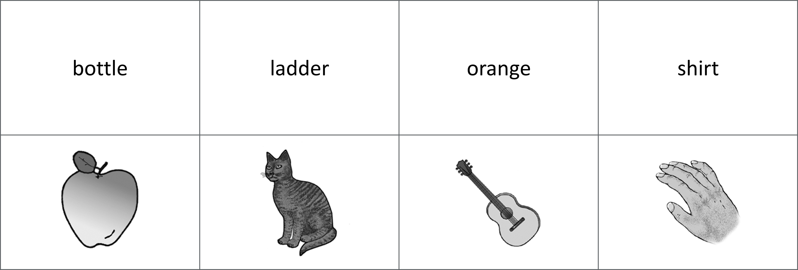

---
output:
  #word_document:
  #  toc: yes
  #  toc_depth: '4'
  pdf_document:
    toc: yes
    toc_depth: 4
    number_sections: no
    fig_caption: yes
    latex_engine: xelatex
mainfont: Helvetica
font-family: Helvetica Neue
fontsize: 11pt
geometry: left=35mm, right=20mm, top=30mm, bottom=30mm
bibliography: resources/refs.bib
csl: resources/apa.csl
subparagraph: yes
header-includes:
- \usepackage{setspace}
- \doublespacing
- \usepackage{fancyhdr}
- \pagestyle{fancy}
- \renewcommand{\headrulewidth}{1.5pt}
- \setlength{\headheight}{13.59999pt}
- \renewcommand{\href}[2]{#2\footnote{\url{#1}}}
- \usepackage{pdflscape}
- \newcommand{\blandscape}{\begin{landscape}}
- \newcommand{\elandscape}{\end{landscape}}
- \usepackage{titlesec}
- \titlespacing{\section}{0pt}{12pt plus 2pt minus 1pt}{0pt plus 1pt minus 1pt}
- \titlespacing{\subsection}{0pt}{12pt plus 2pt minus 1pt}{0pt plus 1pt minus 1pt}
- \titlespacing{\subsubsection}{0pt}{12pt plus 2pt minus 1pt}{0pt plus 1pt minus 1pt}
---

```{r load-packages, include=FALSE, cache=FALSE}
##  Clear environment and list required packages:
    rm(list=ls())  
    required_packages <- c("tidyverse", "dplyr", "captioner", "tinytex", "kableExtra", "formattable", 
                           "readr", "irr", "psycho", "afex", "emmeans", "janitor", "psych", "rstatix", 
                           "ggpubr", "ggridges", "gridExtra")
    packages_to_install <- required_packages[!(required_packages %in% installed.packages()[,"Package"])]
    if(length(packages_to_install)) install.packages(packages_to_install)
    invisible(suppressPackageStartupMessages(lapply(required_packages, library, character.only = TRUE)))
##  Define own function (used for tidying):
    coalesce_by_column <- function(df) {return(dplyr::coalesce(!!! as.list(df)))}
##  Captioner:
    figure_numbering <- captioner()
    table_numbering <- captioner(prefix = "Table")
```

\newpage
# Chapter 1
## Lit Review

Hamilton and Geraci (2006)

IMPLICIT MEMORY: 
PSE results from conceptual processing of a picture’s distinctive features (rather than semantic information). 
General semantic task:
‘‘What is a used car sometimes called?’’
No PSE.
Distinctive conceptual information task:
‘‘What fruit is egg shaped?’’
PSE. 

EXPLICIT RECOGNITION:
PSE always evident? 


############

aMCI
Show larger PSE effects than controls. 

Impaired REC, so this PSE must rely on FAM? 

Mixed findings whether fam is intact in aMCI.
Intact - generally use picture stim.
Impaired - generally use verbal stim. 

Is PSE in aMCI driven by intact FAM for pictures, but impaired FAM for words?
Yes (Embree, Budson, & Ally, 2012):
aMCI - Picture FAM - same as healthy OAs
aMCI - Word FAM - impaired compared to healthy OAs 

Ally, McKeever, 2009:
Examined early frontal old/new effect (FAM) in aMCI:
Intact for pictures.
Impaired for words.
BUT, P did not provide subjective Rec/Fam reports. 

Embree, Budson, & Ally, 2012:
Deep encoding (verbal like/dislike response). 
Modified Old/New (6-point rating scale):
6. Certain the item is old - to -  1. Certain the item is new.
	

Both used the same picture stim - colour photos.


\newpage
# Chapter 2
## Experiment 1 (Proof of concept)
Research into recognition memory often focuses on methods of estimating recollection and familiarity - two independent processes theorised to support the successful recognition of previously encountered material [@yonelinas2002; schoemaker2014]. Recollection typically refers to the conscious recall of encoded information, whereby successful recognition is facilitated by contextual details surrounding a previous encounter with the stimulus. Familiarity, on the other hand, is a term used to describe recognition that occurs via an unsubstantiated feeling of having encountered the stimulus previously (despite the inability to retrieve any associated contextual information). While this dual-process model of recognition [@paivio1971; @paivio1972]

there remains a disagreement throughout the literature regarding the extent to which recollection and
familiarity are independent processes, and the methods used to measure them most effectively. 

Experimental paradigms are generally categorized into two broad groups: task-dissociation and process-estimation methods. Task-dissociation methods combine two different task formats (e.g. old/new recognition paired with forced-choice recognition), and make comparisons in an attempt to isolate either recollection or familiarity [yonelinas2002]. Old/new recognition tests are thought to isolate recollection; stimuli are presented individually and participants attempt to make an accurate judgement about items they previously studied (targets) when presented amongst novel items with highly similar characteristics (lures). Forced-choice recognition paradigms, on the other hand, can rely on recollection or familiarity; discrimination between previously studied targets and highly similar lures is again required, however, recognition trials present target-lure pairs at the same time and require that participants select between them.


The wide range of studies utilising process-estimation methods generally use one of three main procedures. First, the process-dissociation procedure [PDP; @jacoby1991] is commonly used in recognition memory to separately estimate the contributions of recollection and familiarity by assessing whether participants are able to determine when and where an item was previously studied  [yonelinas2002].


Receiver Operating Characteristic (ROC) curves. 


Third, and arguably the most commonly used process-estimation method is the Remember/Know (RK) paradigm - a task endorsed by a wide body of literature [@tulving1985; @yonelinas1995; @gardiner2000; @jacoby1991; @jacoby1997]. In a typical RK procedure, participants are generally tasked with making an ‘old’ vs. ‘new’ recognition decision, before introspectively categorising any recognised items (old) as either ‘Remember’ when recognition is accompanied by recollection, or as ‘Know’ when recognition is not accompanied by recollection, but instead is accompanied by a feeling of familiarity or certainty. Often a ‘Guess’ option is also provided to allow for uncertainty (RKG), in an effort to avoid biasing the total number of R and K responses (@belleville2011; @gardiner2008; @gardiner2002). 

A large body of literature also reports that the RK procedure produces reliable estimations of recollection and familiarity in clinical populations [@lombardi2016]; for example, those with Mild Cognitive Impairment (MCI) typically show recollection impairments but intact familiarity compared to healthy older adults [@belleville2011; @wang2013; @lombardi2016; @hudon2009; @serra2010].


A second method of measurement is to ask participants to make confidence judgements
or ratings and interpret high confidence as indicating recollection and low confidence as
indicating familiarity. Instead of confidence, some researchers ask participants to make specific
ratings of the amount of recollection and familiarity they have for each item they recognise on
the memory test; here, rather than a binary Remember-Know judgement which means that the
processes of recollection and familiarity are seen as mutually exclusive, in this method
recollection and familiarity are viewed as processes that can occur conjointly. Finally, a forth
method which uses judgements but permits participants to report that they have both recollection
and familiarity for an item is the Recollect-Familiar-Both judgement task.
The objective of my research is to better understand what these different methodologies can tell
us about the underlying processes of recollection and familiarity. In order to achieve this
objective my proposed research will compare different methodologies against each other in
different ways:
1. How to define the response options to participants: The way the ‘Know’ response is
defined to participants can differ across researchers – some emphasise a feeling of ‘just
knowing’ or ‘certainty’, whereas other labs use definitions that emphasise a ‘feeling of
familiarity’. I want to know whether how we are defining ‘Knowing’ to participants when
we use Remember-Know recognition tests changes how they use the response options.
2. Are ratings tasks better than judgement tasks: Recollection and familiarity or
confidence ratings allow for a more fine-grained examination of memory processes but
perhaps they are more complicated for participants to use and perhaps they are no more
‘accurate’ than more standard RK judgement tasks? I want to examine how patterns of
responding differ across these methodologies.


The RK procedure has been criticized for its reliance on participants’ subjective understanding of the provided instructions [@schoemaker2014], and the introspective nature of recognition judgements make it difficult to confirm whether all participants have understood the definitions (and thus responded) similarly [@lombardi2016]. Indeed, slight differences in the experimental definition of “knowing” across studies and the way in which the subjective memory states are defined may affect the achieved pattern of results [@geraci2009; @williams2015]. 


The picture superiority effect (PSE) – stimuli presented as pictures are markedly better remembered on tests of recall or recognition than stimuli presented as words (Shepard, 1967). 


Studies agree that pictures enhance recollection compared to words in healthy younger and older adults:

Ally & Budson (2007); Ally et al. (2008); Curran & Doyle (2011); Rajaram (1996). 


Is the magnitude of this enhanced recollection for pictures 
consistent across RFG, RFBG, and RFRatings in healthy Ps?


May further demonstrate how the different response options are affecting how people respond (e.g. may reveal if certain conditions over- or under-estimate recollection?)

Are familiarity ratings also better for pics across the 3 conditions? 

Is the achieved pattern also evident in healthy older? 

What actually is magnitude? Difference between rec for words and rec for pics taken for each group (healthy vs. MCI), and then the difference of those compared??


The magnitude of the PSE is greater in aMCI and AD patients when compared to healthy older (Embree, Budson, & Ally, 2012). Understanding this phenomenon helps to conceptualise how memory breaks down in AD.

However, it has been demonstrated that certain methodological factors can mediate the PSE, at least in certain populations; findings generally show intact familiarity for individuals with aMCI when *pictures* are shown during recognition memory paradigm, but impaired familiarity when word stimuli are utilised [@embree2012; @ally2009; @ally2009a; @wolk2008; @algarabel2009; @anderson2008; @hudon2009; @oconnor2010; @serra2010; @westerberg2006]. 

Illustrative


The objective of Experiment 1 was to establish baseline PSE response patterns in younger adults, and examine how PSE magnitudes differ across the three response option conditions (RF-judgements / RFB-judgements / RF-Ratings). A 2x3 mixed factorial design was utilised, consisting of a within-subjects variable of stimulus type (words / greyscale line-drawings) and a between-subjects variable of response option (RF-judgements / RFBG-judgements / RF-Ratings).


```{r experiment-1-main, include=FALSE, warning = FALSE, message=FALSE, cache=TRUE}
###################################################################################################################
##    Experiment 1 - Data processing:                                                                            ##
###################################################################################################################
##    Import unique image URLs (to identify each stim):
      exp1__image_urls <- read_csv("./resources/experiment_1/image_urls.csv") %>%
          mutate(url = str_replace(url,
                            "https:\\/\\/keelepsych.co1.qualtrics.com\\/ControlPanel\\/Graphic.php\\?IM=IM_", ""))
##    Import study data (which contains demographics info):                            
      exp1__participant_info <- read_csv(
        "./resources/experiment_1/experiment_1_data/Jamie - RFG Images (1) - STUDY_January 13, 2021_08.21.csv") %>%
          select(-"StartDate", -"EndDate", -"Status", -"Duration (in seconds)", -"Finished",
                 -"RecipientLastName", -"RecipientFirstName", -"RecipientEmail", -"ExternalReference",
                 -"LocationLatitude", -"LocationLongitude", -"DistributionChannel", -"UserLanguage", -"Q1.3",
                 -"Q1.4", -"Q100", -"Q101", -contains("Last Click"), -contains("Page Submit"), 
                 -contains("Click Count"), -contains("Q4.5"), -contains("Q5.5"), -contains("Q6.5"),
                 -contains("Q7.5"), -contains("Q8.5"), -contains("Q9.5"), -contains("Q10.5"), -contains("Q11.5"),
                 -contains("Q12.5"), -contains("Q13.5"), -contains("Q14.5"), -contains("Q15.5"), 
                 -contains("Q16.5"), -contains("Q17.5")) %>%
          row_to_names(row_number = 1) %>%
          slice(-1) %>%
          rename(ip = "IP Address", progress = "Progress", recorded_date = "Recorded Date", 
                 study_id = "Response ID", age = "Your age:", gender = "Your gender:",
                 eng_first_lang = "Is English your first language?", source = "Source") %>%
          select(study_id, ip, recorded_date, progress, age, gender, eng_first_lang, source, 8:143, 164:571) %>%
          mutate(study_id = str_remove_all(study_id, "R_")) %>%
          mutate_all(tolower) %>%
          group_by(study_id) %>%
          gather(., "question", "response", -study_id) %>%
          arrange(study_id) %>%
          drop_na(response) %>%
          mutate(question = str_remove(question, 
                 "Timing - https:\\/\\/keelepsych.co1.qualtrics.com\\/ControlPanel\\/Graphic.php\\?IM=IM_")) %>%
          mutate(question = str_remove(question, "- Timing - First Click")) %>%
          mutate(question = str_remove(question, 
                  "https:\\/\\/keelepsych.co1.qualtrics.com\\/ControlPanel\\/Graphic.php\\?IM=IM_")) %>%
          mutate(question = str_remove(question, "\ .+")) %>%
          mutate(question = str_trim(question))
##  Temporarily extract demographics info:
      exp1__demographics <- exp1__participant_info %>%
          filter(question == "ip" | question == "recorded_date" | question == "progress" |
                 question == "age" | question == "gender" | question == "eng_first_lang" |
                 question == "source") %>%
          spread(question, response) %>%
##    Tidy exp1__demographics a bit:
          rename(study_end_time = "recorded_date") %>%
          mutate(study_end_time = str_replace_all(study_end_time, "-", "_")) %>%
          mutate(study_end_time = str_replace_all(study_end_time, " ", "_")) %>%
          mutate(gender = str_replace(gender, "^f$", "female")) %>%
          mutate(gender = str_replace(gender, "woman", "female")) %>%
          mutate(gender = str_replace(gender, "^m$", "male")) %>%
          mutate(gender = str_replace(gender, "5a6f51ec46f0230001ce445f", "unspecified")) %>%
          mutate(gender = replace_na(gender, "unspecified")) %>%
          mutate(age = as.double(age)) %>%
          mutate(age = na_if(age, 100))

##    Temporarily extract study data (so we can reshape and put RTs on the same row as responses).
      exp1__study_data <- exp1__participant_info %>%
          filter(question != "ip" & question != "recorded_date" & question != "progress" &
                 question != "age" & question != "gender" & question != "eng_first_lang" &
                 question != "source") %>%
          mutate(temp_index = as.double(response)) %>%
          mutate(index = ifelse(is.na(temp_index),'response','rt')) %>%
          select(-temp_index) %>%
          as.data.frame()
      exp1__study_data <- reshape(exp1__study_data, idvar=c('study_id','question'), timevar='index',
                                  direction="wide") %>%
          as_tibble(exp1__study_data, .name_repair) %>%
          rename(study_rt = "response.rt", study_response = "response.response") %>%
          group_by(study_id) %>%
##    We also do study calculations here, as it's easier when separated from exp1__demographics.
##    First we merge with 'exp1__image_urls' to get proper item names:
          merge(., exp1__image_urls, by.x="question", by.y="url") %>%
          group_by(study_id) %>%
          select(-question) %>%
          arrange(study_id, study_list, stim) %>%
          filter(!str_detect(study_list, 'FILLER')) %>%
##    Split the 'stim' column up, so item name and stimuli format are seperate:
          separate(stim, c("item_name", "stim_format")) %>%
##    Clearly show which lists were studied as words and pics: 
          mutate(studied_words = ifelse(stim_format == "word", study_list, NA)) %>%
          mutate(studied_pics = ifelse(stim_format == "picture", study_list, NA)) %>%
          select(-study_list) %>%
##    Count total study responses (should be 60):
          add_tally(stim_format == "word" | stim_format == "picture", sort = FALSE, 
                    name = "study_responses_total") %>%
##    Count total study responses by stim-format (should be 30 each):
          add_tally(stim_format == "word", sort = FALSE, name = "study_total_word_resp") %>%
          add_tally(stim_format == "picture", sort = FALSE, name = "study_total_pic_resp") %>%
##    Count total *correct* word responses (should be 30):
          add_tally(stim_format == "word" & study_response == "word", sort = FALSE, 
                    name = "study_correct_word") %>%
##    Count total *correct* pic responses (should be 30):
          add_tally(stim_format == "picture" & study_response == "picture", sort = FALSE, 
                    name = "study_correct_pic") %>%
##    Count total *correct* responses (should be 60):
          mutate(study_correct = study_correct_word + study_correct_pic) %>%
##    Convert total *correct* responses to proportion:
          mutate(study_correct_percent = study_correct*(100/study_responses_total)) %>%
##    Calculate mean overall reaction time:
          mutate(study_rt = as.double(study_rt)) %>%
          mutate(mean_study_rt_total = mean(study_rt)) %>%
##    Calculate mean word reaction time (correct responses):
          mutate(mean_study_rt_corr_word = mean(study_rt[stim_format == "word" & study_response == "word"])) %>%
##    Calculate mean pic reaction time (correct responses):
          mutate(mean_study_rt_corr_pic = mean(study_rt[stim_format == "picture" & 
                                                        study_response == "picture"])) %>%
##    Remove columns with multiple unique values now we've done the totals:
          select(-study_rt, -study_response, -item_name, -stim_format) %>%
##    Reduce data so we have one row per participant:
          summarise_all(coalesce_by_column)
##    Overwrite 'exp1__participant_info' with 'exp1__study_data' joined with 'exp1__demographics':
      exp1__participant_info <- right_join(exp1__demographics, exp1__study_data, by = "study_id") %>%
##    Remove participants that have no study total (ie, did exp1__demographics but did not start study):
          drop_na("study_responses_total") %>%
          mutate_all(tolower)
###################################################################################################################
##    Import and tidy test data:                                                                                 ##
###################################################################################################################
##    Import test data files (output from Qualtrics was too big and would fail, so has to be in 2 parts!).
##    We have to do some quick tidying to each before joining (colnames are the same right now (e.g. Q1.1),
##    but are different after we use row_to_names.
      exp1__full_data1 <- read_csv(
        "./resources/experiment_1/experiment_1_data/ AC_P_January 13, 2021_08.23.csv") %>%
          select(-"EndDate", -"Status", -"Duration (in seconds)", -"Finished", -"RecipientLastName", 
                 -"RecipientFirstName", -"RecipientEmail", -"ExternalReference", -"LocationLatitude",
                 -"LocationLongitude", -"DistributionChannel", -"UserLanguage", -contains("Last Click"),
                 -contains("Page Submit"), -contains("Click Count"), -contains("Q3.8"), -contains("Q4.8"),
                 -contains("Q5.8"), -contains("Q6.8"), -contains("Q7.8"), -contains("Q8.8"), 
                 -contains("Q11.9"), -contains("Q12.9")) %>%
##    Merge justification columns from across the three response option conditions:
          unite("rec_justification", "Q5.2_1", "Q9.2_1", "Q13.2_1", na.rm = TRUE, remove = TRUE) %>%
          unite("fam_justification", "Q5.2_2", "Q9.2_2", "Q13.2_2", na.rm = TRUE, remove = TRUE) %>%
          unite("both_justification", "Q9.2_3", "Q13.2_3", na.rm = TRUE, remove = TRUE) %>%
          unite("guess_justification", "Q5.2_3", "Q9.2_4", "Q13.2_4", na.rm = TRUE, remove = TRUE)
##    Add column identifiers to the lower rows (since we still have the Qualtrics 3x header rows here):
      exp1__full_data1$rec_justification[1:2] <- "rec_justification"
      exp1__full_data1$fam_justification[1:2] <- "fam_justification"
      exp1__full_data1$both_justification[1:2] <- "both_justification"
      exp1__full_data1$guess_justification[1:2] <- "guess_justification"
##    Set correct row for rownames (Qualtrics outputs with 3 header rows - we only want one): 
      exp1__full_data1 <- exp1__full_data1 %>% row_to_names(row_number = 1) %>% clean_names() %>% slice(-1) %>%
##    Rename some columns:       
          rename(ip = "ip_address", test_id = "response_id", 
                 comments = "if_you_have_any_comments_about_this_experiment_please_include_them_below") %>%
##    Reorder columns:    
          select(test_id, ip, start_date, rec_justification, fam_justification, 
                 both_justification, guess_justification, comments, 5:516, 520:1031, 1033:1672) %>%
##    Set ID as the grouping variable:
          mutate(test_id = str_remove_all(test_id, "R_")) %>%
          mutate_all(tolower) %>%
          group_by(test_id) %>%
##    Reformat from long to wide:
          gather(., "question", "response", -test_id) %>%
          arrange(test_id)
#------------------------------------------------------------------------------------------------------------------
      exp1__full_data2 <- 
        read_csv("./resources/experiment_1/experiment_1_data/ BD_P_January 13, 2021_08.22.csv") %>%
          select(-"EndDate", -"Status", -"Duration (in seconds)", -"Finished", -"RecipientLastName", 
                 -"RecipientFirstName", -"RecipientEmail", -"ExternalReference", -"LocationLatitude",
                 -"LocationLongitude", -"DistributionChannel", -"UserLanguage", -contains("Last Click"),
                  -contains("Page Submit"), -contains("Click Count"), -contains("Q3.8"), -contains("Q4.8"),
                 -contains("Q5.8"), -contains("Q6.8"), -contains("Q7.8"), -contains("Q8.8"), 
                 -contains("Q11.9"), -contains("Q12.9")) %>%
##    Merge justification columns from across the three response option conditions:
          unite("rec_justification", "Q5.2_1", "Q9.2_1", "Q13.2_1", na.rm = TRUE, remove = TRUE) %>%
          unite("fam_justification", "Q5.2_2", "Q9.2_2", "Q13.2_2", na.rm = TRUE, remove = TRUE) %>%
          unite("both_justification", "Q9.2_3", "Q13.2_3", na.rm = TRUE, remove = TRUE) %>%
          unite("guess_justification", "Q5.2_3", "Q9.2_4", "Q13.2_4", na.rm = TRUE, remove = TRUE)
##    Add column identifiers to the lower rows (since we still have the Qualtrics 3x header rows here):
      exp1__full_data2$rec_justification[1:2] <- "rec_justification"
      exp1__full_data2$fam_justification[1:2] <- "fam_justification"
      exp1__full_data2$both_justification[1:2] <- "both_justification"
      exp1__full_data2$guess_justification[1:2] <- "guess_justification"
##    Set correct row for rownames (Qualtrics outputs with 3 header rows - we only want one): 
      exp1__full_data2 <- exp1__full_data2 %>% row_to_names(row_number = 1) %>% 
          clean_names() %>% slice(-1) %>%
##    Rename some columns:       
          rename(ip = "ip_address", test_id = "response_id",
                 comments = "if_you_have_any_comments_about_this_experiment_please_include_them_below") %>%
##    Reorder columns:    
          select(test_id, ip, start_date, rec_justification, fam_justification, 
                 both_justification, guess_justification, comments, 5:516, 520:1031, 1033:1672) %>%
##    Set ID as the grouping variable:
          mutate(test_id = str_remove_all(test_id, "R_")) %>%
          mutate_all(tolower) %>%
          group_by(test_id) %>%
##    Reformat from long to wide:
          gather(., "question", "response", -test_id) %>%
          arrange(test_id)
#------------------------------------------------------------------------------------------------------------------
      exp1__full_data <- exp1__full_data1 %>%
          bind_rows(exp1__full_data2) %>%
          drop_na(response)
##    Temporarily extract justifications:
      exp1__justifications <- exp1__full_data %>%
          filter(question == "ip" | question == "start_date" | question == "progress" |
                   question == "rec_justification" | question == "fam_justification" |
                   question == "both_justification" | question == "guess_justification" |
                   question == "comments") %>%
          spread(question, response)
##    Tidy test data:
      exp1__full_data <- exp1__full_data %>%
          filter(question != "ip" & question != "start_date" & question != "progress" &
                   question != "rec_justification" & question != "fam_justification" &
                   question != "both_justification" & question != "guess_justification" & 
                   question != "comments") %>%
          mutate(rfr_resp_type = question) %>%
          mutate(rfr_resp_type = str_remove(rfr_resp_type, ".*_")) %>%
          mutate(rfr_resp_type = ifelse(rfr_resp_type == "recollection" | rfr_resp_type == "familiarity",
                                        rfr_resp_type, "")) %>%
          mutate(question = str_remove(question,
                                "timing_https_keelepsych_co1_qualtrics_com_control_panel_graphic_php_im_im_")) %>%
          mutate(question = str_remove(question,
                                "https_keelepsych_co1_qualtrics_com_control_panel_graphic_php_im_im_")) %>%
          mutate(question = str_remove_all(question, "_")) %>%
          mutate(question_number = question) %>%
          mutate(question = str_remove(question, "(?<=.{15}).+")) %>%
          mutate(question_number = str_remove(question_number, "^.{0,15}")) %>%
          mutate(question = str_trim(question)) %>%
          mutate(resp_option = case_when(str_detect(question_number, "q3") ~ "rfg",
                                         str_detect(question_number, "q4") ~ "rfg",
                                         str_detect(question_number, "q7") ~ "rfbg",
                                         str_detect(question_number, "q8") ~ "rfbg",
                                         str_detect(question_number, "q11") ~ "rf_ratings",
                                         str_detect(question_number, "q12") ~ "rf_ratings",
                                         str_detect(question_number, "recollection") ~ "rf_ratings",
                                         str_detect(question_number, "familiarity") ~ "rf_ratings")) %>%
          fill(resp_option, .direction = "updown") %>%
##    Reshape to put RTs on the same row as responses):
          mutate(temp_index = as.double(response)) %>%
          mutate(index = ifelse((is.na(temp_index) & resp_option == "rfg") & 
                                  (response == "old" | response == "new"), 'rfg_old_new','rt')) %>%
          mutate(index = ifelse((is.na(temp_index) & resp_option == "rfbg") & 
                                  (response == "old" | response == "new"), 'rfbg_old_new', index)) %>%
          mutate(index = ifelse((is.na(temp_index) & resp_option == "rf_ratings") & 
                                  (response == "old" | response == "new"), 'rf_ratings_old_new', index)) %>%
          mutate(index = ifelse((is.na(temp_index) & resp_option == "rfg") & 
                                  (response != "old" & response != "new"), 'rfg', index)) %>%
          mutate(index = ifelse((is.na(temp_index) & resp_option == "rfbg") & 
                                  (response != "old" & response != "new"), 'rfbg', index)) %>%
          mutate(index = ifelse((is.na(temp_index) & 
                                   resp_option == "rf_ratings" & rfr_resp_type == "recollection") & 
                                  (response != "old" & response != "new"), 'rec_rating', index)) %>%
          mutate(index = ifelse((is.na(temp_index) & 
                                   resp_option == "rf_ratings" & rfr_resp_type == "familiarity") & 
                                  (response != "old" & response != "new"), 'fam_rating', index)) %>%
          select(-rfr_resp_type, -temp_index, -question_number) %>%
          as.data.frame()
#------------------------------------------------------------------------------------------------------------------
      exp1__full_data <- reshape(exp1__full_data, idvar=c('test_id','question'), timevar='index', 
                                 direction="wide") %>%
          as_tibble(exp1__study_data, .name_repair) %>%
          unite("old_new", response.rfg_old_new, response.rfbg_old_new, 
                response.rf_ratings_old_new, remove = TRUE, na.rm = TRUE) %>%
          select(-resp_option.rfg_old_new, -resp_option.rfg, -resp_option.rf_ratings_old_new, 
                 -resp_option.rec_rating, -resp_option.fam_rating, -resp_option.rfbg_old_new, 
                 -resp_option.rfbg) %>%
##    Recode RF-Ratings responses to better show rec/fam:
          mutate(response.rec_rating = str_remove_all(response.rec_rating, " ")) %>%
          mutate(response.rec_rating = str_remove_all(response.rec_rating, "(?<=.{1}).+")) %>%
          mutate(response.rec_rating = str_c("rec_", response.rec_rating)) %>%
          mutate(response.fam_rating = str_remove_all(response.fam_rating, " ")) %>%
          mutate(response.fam_rating = str_remove_all(response.fam_rating, "(?<=.{1}).+")) %>%
          mutate(response.fam_rating = str_c("fam_", response.fam_rating)) %>%
##    Unite columns of the same response type:
          unite("recfam_1", response.rfg, response.rfbg, response.rec_rating, remove = TRUE, na.rm = TRUE) %>%
          mutate(recfam_1 = na_if(recfam_1, "")) %>%
          rename(recfam_2 = "response.fam_rating")
##    Merge with 'exp1__image_urls' to get proper item names:
      exp1__image_urls <- exp1__image_urls %>%
          mutate_all(tolower)
      exp1__full_data <- exp1__full_data %>%
          merge(., exp1__image_urls, by.x="question", by.y="url") %>%
          group_by(test_id) %>%
          select(-question) %>%
          arrange(test_id, study_list, stim) %>%
          rename(old_new_rt = "response.rt", resp_option = "resp_option.rt", 
                 belong_to_study_list = "study_list") %>%
##    Remove filler items:
          filter(!str_detect(belong_to_study_list, 'filler')) %>%
##    Split the 'stim' column up, so item name and stimuli format are seperate:
          separate(stim, c("item_name", "stim_format")) %>%
##    Count total test responses (should be 120):
          add_tally(stim_format == "word" | stim_format == "picture", sort = FALSE, name = "test_total_resp") %>%
##    Count total test responses by stim-format (should be 60 each):
          add_tally(stim_format == "word", sort = FALSE, name = "test_total_word_resp") %>%
          add_tally(stim_format == "picture", sort = FALSE, name = "test_total_pic_resp") %>%
##    Calculate mean overall reaction time:
          mutate(old_new_rt = as.double(old_new_rt)) %>%
          mutate(mean_old_new_rt_total = mean(old_new_rt)) %>%
##    Calculate mean word reaction time (all responses):
          mutate(mean_test_rt_word = mean(old_new_rt[stim_format == "word"])) %>%
##    Calculate mean pic reaction time (all responses):
          mutate(mean_test_rt_pic = mean(old_new_rt[stim_format == "picture"]))
##    Add justifications back in: 
      exp1__full_data <- exp1__full_data %>%
          merge(., exp1__justifications, by = "test_id") %>%
          select(test_id, ip, start_date, rec_justification, fam_justification, both_justification,
                 guess_justification, comments, resp_option, item_name, stim_format, belong_to_study_list, 
                 old_new, old_new_rt, recfam_1, recfam_2, test_total_resp, test_total_word_resp, 
                 test_total_pic_resp, mean_old_new_rt_total, mean_test_rt_word, mean_test_rt_pic) %>%
          mutate_if(is.character, list(~na_if(., ""))) %>%
          rename( test_start_time = "start_date")
##    Remove Ps with incomplete test data:
      exp1__incomplete_exp1__full_data <- exp1__full_data %>%
          select(test_id, test_total_resp) %>%
          distinct(test_id, .keep_all = TRUE) %>%
          filter(test_total_resp != 120) %>%
          pull(test_id)
      exp1__full_data <- exp1__full_data %>%
          filter(!test_id %in% exp1__incomplete_exp1__full_data)
###################################################################################################################
##    Match study across seperate study and test files:                                                          ##
###################################################################################################################
##    List all the unique participants we have in 'participant info': 
      exp1__unique_p_at_study <- exp1__participant_info %>%
          select(study_id, ip, study_end_time) %>%
          rename(time = "study_end_time") %>%
          mutate(time = str_remove(time , "...$")) %>%
          arrange(ip, time)
##    List all unique participants we have in 'exp1__full_data', and format test_start_time to simplified version:
      exp1__unique_p_at_test <- exp1__full_data %>%
          select(test_id, ip, test_start_time) %>%
          distinct(test_id, .keep_all = TRUE) %>%
          rename(time = "test_start_time") %>%
          mutate(time = as.character(time)) %>%
##    Remove seconds precision from time data. Study and test times won't match *exactly* because it took a 
##    couple of seconds for them to redirect from the study project to the test project on Qualtrics, so here 
##    we remove some precision:
          mutate(time = str_remove(time , "...$")) %>%        
          mutate(time = str_replace(time , " ", "_")) %>%
          mutate(time = str_replace_all(time , "-", "_")) %>%
          arrange(ip, time)
##    Here we join 'exp1__unique_p_at_study' with 'exp1__unique_p_at_test' by ip and time. 
      exp1__all_participants <- exp1__unique_p_at_study %>%
          full_join(exp1__unique_p_at_test, by = c("ip", "time"))
##    However, we're left with a few NA rows where no match was found. We now separate those P to investigate,
##    and determine whether they do match or not (i.e. did the time change by 1-minute whilst P were 
##    transferring from study > test, hence why a match was not found. 
      exp1__unmatched <- exp1__all_participants %>%
          filter(is.na(study_id) | is.na(test_id))
##    First we see which IPs match (if theres an IP match between a 'study_id' NA row and a 'test_id' NA row,
##    and their times look similar, it's almost certainly the same person). 
      exp1__duplicate_ips <- exp1__unmatched %>%
          group_by(ip) %>% 
          filter(n()>1)
##    4 out of 5 duplicate IPs have a very similar times between study and test, and are therefore almost 
##    certainly the same people. We'll join these rows in 'exp1__all_participants':
      exp1__all_participants <- exp1__all_participants %>%
          mutate(test_id = replace(test_id, study_id == "3sbkutkpbz0t7y1", "uenhxpj5gjopn4t")) %>%
          mutate(test_id = replace(test_id, study_id == "1i3sv43b6k977mc", "3p3jpgswhnvaycz")) %>%
          mutate(test_id = replace(test_id, study_id == "3i69jnaz1wrx4fq", "247estlk1nx9ljy")) %>%
          mutate(test_id = replace(test_id, study_id == "pfexrfarjkpsygf", "2fwc8n0fuonvta3")) %>%
##    After removing the no-longer-needed duplicate rows (because we copied the relevant test_ids into one row), 
##    we're left with 11 participants that cannot be reconciled. We will exclude these participants, as they are
##    either missing test data or study data. 
          drop_na() %>%
          select(-ip, -time) %>%
##    Assign new, simpler P ids:
          rowid_to_column(., "id") %>%
          mutate(id = as.character(id))
      exp1__all_participants$id <- str_pad(exp1__all_participants$id, width=3, side="left", pad="0")
##    Join study and test data for our 'complete' participants:
      exp1__participant_info <- exp1__participant_info %>%
          filter(study_id %in% exp1__all_participants$study_id)
      exp1__full_data <- exp1__full_data %>%
          filter(test_id %in% exp1__all_participants$test_id)
      exp1__full_data <- exp1__all_participants %>%
          full_join(exp1__participant_info, by = "study_id") %>%
          full_join(exp1__full_data, by = "test_id") %>%    
###################################################################################################################
##    Calculations:                                                                                              ##
###################################################################################################################
##    Total hits and misses:
          add_tally(studied_words == belong_to_study_list & stim_format == "word" & old_new == "old",
                    name = "word_hit") %>%
          add_tally(studied_words == belong_to_study_list & stim_format == "word" & old_new == "new", 
                    name = "word_miss") %>%
          add_tally(studied_pics == belong_to_study_list & stim_format == "picture" & old_new == "old", 
                    name = "pic_hit") %>%
          add_tally(studied_pics == belong_to_study_list & stim_format == "picture" & old_new == "new", 
                    name = "pic_miss") %>%
          mutate(total_hit = word_hit + pic_hit) %>%
          mutate(total_miss = word_miss + pic_miss) %>%
##    Total FA and CR:
          add_tally(studied_words != belong_to_study_list & stim_format == "word" & old_new == "old",
                    name = "word_FA") %>%
          add_tally(studied_words != belong_to_study_list & stim_format == "word" & old_new == "new", 
                    name = "word_CR") %>%
          add_tally(studied_pics != belong_to_study_list & stim_format == "picture" & old_new == "old", 
                    name = "pic_FA") %>%
          add_tally(studied_pics != belong_to_study_list & stim_format == "picture" & old_new == "new", 
                    name = "pic_CR") %>%
          mutate(total_FA = word_FA + pic_FA) %>%
          mutate(total_CR = word_CR + pic_CR) %>%
##    Rec/fam hits: 
          add_tally((studied_words == belong_to_study_list & stim_format == "word") & 
                      ((resp_option != "rf_ratings" & recfam_1 == "recollection") |
                         (resp_option == "rf_ratings" & recfam_1 == "rec_3" | 
                            recfam_1 == "rec_4" | recfam_1 == "rec_5")), name = "word_hit_rec") %>%
          add_tally((studied_words == belong_to_study_list & stim_format == "word") & 
                      ((resp_option != "rf_ratings" & recfam_1 == "familiarity") |
                         (resp_option == "rf_ratings" & recfam_2 == "fam_3" | 
                            recfam_2 == "fam_4" | recfam_2 == "fam_5")), name = "word_hit_fam") %>%
          add_tally((studied_words == belong_to_study_list & stim_format == "word") & 
                      recfam_1 == "both", name = "word_hit_both") %>%
          add_tally((studied_words == belong_to_study_list & stim_format == "word") & 
                      ((resp_option != "rf_ratings" & recfam_1 == "guessing") |
                         (resp_option == "rf_ratings" & (recfam_1 == "rec_0" & recfam_2 == "fam_0"))),
                            name = "word_hit_guess") %>%
          add_tally((studied_pics == belong_to_study_list & stim_format == "picture") & 
                      ((resp_option != "rf_ratings" & recfam_1 == "recollection") |
                         (resp_option == "rf_ratings" & recfam_1 == "rec_3" | 
                            recfam_1 == "rec_4" | recfam_1 == "rec_5")), name = "pic_hit_rec") %>%
          add_tally((studied_pics == belong_to_study_list & stim_format == "picture") & 
                      ((resp_option != "rf_ratings" & recfam_1 == "familiarity") |
                         (resp_option == "rf_ratings" & recfam_2 == "fam_3" | 
                            recfam_2 == "fam_4" | recfam_2 == "fam_5")), name = "pic_hit_fam") %>%
          add_tally((studied_pics == belong_to_study_list & stim_format == "picture") & 
                      recfam_1 == "both", name = "pic_hit_both") %>%
          add_tally((studied_pics == belong_to_study_list & stim_format == "picture") & 
                      ((resp_option != "rf_ratings" & recfam_1 == "guessing") |
                         (resp_option == "rf_ratings" & (recfam_1 == "rec_0" & recfam_2 == "fam_0"))),
                            name = "pic_hit_guess") %>%
##    Rec/fam FA: 
          add_tally((studied_words != belong_to_study_list & stim_format == "word") & 
                      ((resp_option != "rf_ratings" & recfam_1 == "recollection") |
                         (resp_option == "rf_ratings" & recfam_1 == "rec_3" | 
                            recfam_1 == "rec_4" | recfam_1 == "rec_5")), name = "word_FA_rec") %>%
          add_tally((studied_words != belong_to_study_list & stim_format == "word") & 
                      ((resp_option != "rf_ratings" & recfam_1 == "familiarity") |
                         (resp_option == "rf_ratings" & recfam_2 == "fam_3" | 
                            recfam_2 == "fam_4" | recfam_2 == "fam_5")), name = "word_FA_fam") %>%
          add_tally((studied_words != belong_to_study_list & stim_format == "word") & 
                      recfam_1 == "both", name = "word_FA_both") %>%
          add_tally((studied_words != belong_to_study_list & stim_format == "word") & 
                      ((resp_option != "rf_ratings" & recfam_1 == "guessing") |
                         (resp_option == "rf_ratings" & (recfam_1 == "rec_0" & recfam_2 == "fam_0"))),
                            name = "word_FA_guess") %>%
          add_tally((studied_pics != belong_to_study_list & stim_format == "picture") & 
                      ((resp_option != "rf_ratings" & recfam_1 == "recollection") |
                         (resp_option == "rf_ratings" & recfam_1 == "rec_3" | 
                            recfam_1 == "rec_4" | recfam_1 == "rec_5")), name = "pic_FA_rec") %>%
          add_tally((studied_pics != belong_to_study_list & stim_format == "picture") & 
                      ((resp_option != "rf_ratings" & recfam_1 == "familiarity") |
                         (resp_option == "rf_ratings" & recfam_2 == "fam_3" | 
                            recfam_2 == "fam_4" | recfam_2 == "fam_5")), name = "pic_FA_fam") %>%
          add_tally((studied_pics != belong_to_study_list & stim_format == "picture") & 
                      recfam_1 == "both", name = "pic_FA_both") %>%
          add_tally((studied_pics != belong_to_study_list & stim_format == "picture") & 
                      ((resp_option != "rf_ratings" & recfam_1 == "guessing") |
                         (resp_option == "rf_ratings" & (recfam_1 == "rec_0" & recfam_2 == "fam_0"))),
                            name = "pic_FA_guess") %>%
          na_if(., 0) %>%
          select(-item_name, -old_new, -old_new_rt, -recfam_1, -recfam_2) %>%
          summarise_all(coalesce_by_column) %>%
          mutate_all(~replace_na(., 0)) %>%
          arrange(id) %>%
##    Total prop hits and misses:
          mutate(prop_word_hit = word_hit / (word_hit + word_miss)) %>%
          mutate(prop_word_miss = word_miss / (word_hit + word_miss)) %>%
          mutate(prop_pic_hit = pic_hit / (pic_hit + pic_miss)) %>% 
          mutate(prop_pic_miss = pic_miss / (pic_hit + pic_miss)) %>%
##    Total prop FA and CR:
          mutate(prop_word_FA = word_FA / (word_FA + word_CR)) %>%
          mutate(prop_word_CR = word_CR / (word_FA + word_CR)) %>%
          mutate(prop_pic_FA = pic_FA / (pic_FA + pic_CR)) %>% 
          mutate(prop_pic_CR = pic_CR / (pic_FA + pic_CR)) %>% 
##    Prop rec/fam hits:
          mutate(prop_word_hit_rec = word_hit_rec / word_hit) %>%
          mutate(prop_word_hit_fam = word_hit_fam / word_hit) %>%
          mutate(prop_word_hit_both = word_hit_both / word_hit) %>%
          mutate(prop_word_hit_guess = word_hit_guess / word_hit) %>%
          mutate(prop_pic_hit_rec = pic_hit_rec / pic_hit) %>%
          mutate(prop_pic_hit_fam = pic_hit_fam / pic_hit) %>%
          mutate(prop_pic_hit_both = pic_hit_both / pic_hit) %>%
          mutate(prop_pic_hit_guess = pic_hit_guess / pic_hit) %>%
##    TOTAL prop: 
          mutate(total_prop_word_hit_rec = ifelse(resp_option == "rfbg", prop_word_hit_rec + prop_word_hit_both, 
                                                  prop_word_hit_rec)) %>%
          mutate(total_prop_word_hit_fam = ifelse(resp_option == "rfbg", prop_word_hit_fam + prop_word_hit_both, 
                                                  prop_word_hit_fam)) %>%
          mutate(total_prop_pic_hit_rec = ifelse(resp_option == "rfbg", prop_pic_hit_rec + prop_pic_hit_both, 
                                                 prop_pic_hit_rec)) %>%
          mutate(total_prop_pic_hit_fam = ifelse(resp_option == "rfbg", prop_pic_hit_fam + prop_pic_hit_both, 
                                                 prop_pic_hit_fam)) %>%
##    Prop rec/fam FA:
          mutate(prop_word_FA_rec = word_FA_rec / word_FA) %>%
          mutate(prop_word_FA_fam = word_FA_fam / word_FA) %>%
          mutate(prop_word_FA_both = word_FA_both / word_FA) %>%
          mutate(prop_word_FA_guess = word_FA_guess / word_FA) %>%
          mutate(prop_pic_FA_rec = pic_FA_rec / pic_FA) %>%
          mutate(prop_pic_FA_fam = pic_FA_fam / pic_FA) %>%
          mutate(prop_pic_FA_both = pic_FA_both / pic_FA) %>%
          mutate(prop_pic_FA_guess = pic_FA_guess / pic_FA) %>%
##    TOTAL prop: 
          mutate(total_prop_word_FA_rec = ifelse(resp_option == "rfbg", prop_word_FA_rec + prop_word_FA_both, 
                                                 prop_word_FA_rec)) %>%
          mutate(total_prop_word_FA_fam = ifelse(resp_option == "rfbg", prop_word_FA_fam + prop_word_FA_both, 
                                                 prop_word_FA_fam)) %>%
          mutate(total_prop_pic_FA_rec = ifelse(resp_option == "rfbg", prop_pic_FA_rec + prop_pic_FA_both, 
                                                prop_pic_FA_rec)) %>%
          mutate(total_prop_pic_FA_fam = ifelse(resp_option == "rfbg", prop_pic_FA_fam + prop_pic_FA_both, 
                                                prop_pic_FA_fam)) %>%
##    Recog: 
          mutate(word_recog = prop_word_hit - prop_word_FA) %>%
          mutate(pic_recog = prop_pic_hit - prop_pic_FA) %>%
##    Classic z-score calculations (take Ps score, subtract the mean, and divide the difference by the SD): 
##    mutate(classic_z_hit_word = (word_hit - mean(word_hit)) / sd(word_hit)) %>%
##    mutate(classic_z_FA_word = (word_FA - mean(word_FA)) / sd(word_FA)) %>%
##    mutate(classic_z_hit_picture = (pic_hit - mean(pic_hit)) / sd(pic_hit)) %>%
##    mutate(classic_z_FA_picture = (pic_FA - mean(pic_FA)) / sd(pic_FA)) %>%
##    z-scores (how we previously calculated them in Excel:                                                     
##    (=NORMSINV((ES8+0.5) / SUM(ES8:ET8,1)). "qnorm" is the r equivelant of "=NORMSINV": Inverse of the 
##    standard normal cumulative distribution, with a probability of x (the value we calculated).)
          mutate("z_word_hit" = qnorm((word_hit + 0.5) / (word_hit + word_miss + 1))) %>%
          mutate("z_word_FA" = qnorm((word_FA + 0.5) / (word_FA + word_CR + 1))) %>%  
          mutate("z_pic_hit" = qnorm((pic_hit + 0.5) / (pic_hit + pic_miss + 1))) %>%
          mutate("z_pic_FA" = qnorm((pic_FA + 0.5) / (pic_FA + pic_CR + 1))) %>%
##    Accuracy:
          mutate(word_accuracy_rec_raw = word_hit_rec / (word_hit_rec + word_FA_rec)) %>%
          mutate(word_accuracy_fam_raw = word_hit_fam / (word_hit_fam + word_FA_fam)) %>%
          mutate(word_accuracy_both_raw = word_hit_both / (word_hit_both + word_FA_both)) %>%
          mutate(word_accuracy_guessing_raw = word_hit_guess / (word_hit_guess + word_FA_guess)) %>%
          mutate(pic_accuracy_rec_raw = pic_hit_rec / (pic_hit_rec + pic_FA_rec)) %>%
          mutate(pic_accuracy_fam_raw = pic_hit_fam / (pic_hit_fam + pic_FA_fam)) %>%
          mutate(pic_accuracy_both_raw = pic_hit_both / (pic_hit_both + pic_FA_both)) %>%
          mutate(pic_accuracy_guessing_raw = pic_hit_guess / (pic_hit_guess + pic_FA_guess)) %>%
##    Accuracy totals:
          mutate(total_acc_word_hit_rec = ifelse(resp_option == "rfbg", ((word_hit_rec + word_hit_both) /
                                                                           (word_hit_rec + word_hit_both +
                                                                              word_FA_rec + word_FA_both)),
                                                                                word_accuracy_rec_raw)) %>%
          mutate(total_acc_word_hit_fam = ifelse(resp_option == "rfbg", ((word_hit_fam + word_hit_both) / 
                                                                           (word_hit_fam + word_hit_both +
                                                                              word_FA_fam + word_FA_both)),
                                                                                word_accuracy_fam_raw)) %>%
          mutate(total_acc_pic_hit_rec = ifelse(resp_option == "rfbg", ((pic_hit_rec + pic_hit_both) / 
                                                                          (pic_hit_rec + pic_hit_both + 
                                                                             pic_FA_rec + pic_FA_both)),
                                                                                pic_accuracy_rec_raw)) %>%
          mutate(total_acc_pic_hit_fam = ifelse(resp_option == "rfbg", ((pic_hit_fam + pic_hit_both) /
                                                                          (pic_hit_fam + pic_hit_both + 
                                                                             pic_FA_fam + pic_FA_both)),
                                                                                pic_accuracy_fam_raw)) %>%
##    d'prime (calculated in the same way we did in Excel):
          mutate("old_word_d_prime" = z_word_hit - z_word_FA) %>%
          mutate("old_picture_d_prime" = z_pic_hit - z_pic_FA)
##    d'prime (calculated by R package):
      exp1__participant_IDs <- unique(exp1__full_data$id)
##    word d'prime (calculated by R package):
      exp1__word_d_prime <- tibble()
          for (i in exp1__participant_IDs) {
              exp1__temp <- exp1__full_data %>%
                  filter(id == i) %>%
                  select(id, word_hit, word_FA, word_miss, word_CR)
              exp1__temp_d_prime <- (as.tibble(dprime(n_hit = exp1__temp$word_hit,
                                                      n_fa = exp1__temp$word_FA,
                                                      n_miss = exp1__temp$word_miss,
                                                      n_cr = exp1__temp$word_CR,
                                                      n_targets = 60,
                                                      n_distractors = 60,
                                                      adjusted = TRUE))) %>%
##    Adjustments for extreme values are made following the recommandations of Hautus (1995).
                  mutate("id" = i)
              exp1__temp <- exp1__temp %>% inner_join(exp1__temp_d_prime, by = "id")
              exp1__word_d_prime <- bind_rows(exp1__word_d_prime, exp1__temp) }
              exp1__word_d_prime <- exp1__word_d_prime %>%
                  select(id, dprime, beta, aprime, bppd, c) %>%
                  rename(exp1__word_d_prime = "dprime", word_beta = "beta", word_a_prime = "aprime",
                         word_bppd = "bppd", word_c = "c")
##    Picture d'prime (calculated by R package):
      exp1__pic_d_prime <- tibble()
          for (i in exp1__participant_IDs) {
              exp1__temp <- exp1__full_data %>%
                  filter(id == i) %>%
                  select(id, pic_hit, pic_FA, pic_miss, pic_CR)
              exp1__temp_d_prime <- (as.tibble(dprime(n_hit = exp1__temp$pic_hit,
                                                      n_fa = exp1__temp$pic_FA,
                                                      n_miss = exp1__temp$pic_miss,
                                                      n_cr = exp1__temp$pic_CR,
                                                      n_targets = 60,
                                                      n_distractors = 60,
                                                      adjusted = TRUE))) %>%                                      
                  mutate("id" = i)                                                                          
              exp1__temp <- exp1__temp %>% inner_join(exp1__temp_d_prime, by = "id")
              exp1__pic_d_prime <- bind_rows(exp1__pic_d_prime, exp1__temp) }
              exp1__pic_d_prime <- exp1__pic_d_prime %>%
                  select(id, dprime, beta, aprime, bppd, c) %>%
                  rename(exp1__pic_d_prime = "dprime", pic_beta = "beta", pic_a_prime = "aprime",
                         pic_bppd = "bppd", pic_c = "c")

##    Add new d'prime calculations to "exp1__full_data" df: 
      exp1__full_data <- exp1__full_data %>%
          right_join(exp1__word_d_prime, by = "id") %>%
          right_join(exp1__pic_d_prime, by = "id") %>%
          rename(ResponseOption = "resp_option") %>%
          mutate(ResponseOption = toupper(ResponseOption)) %>%
          mutate(ResponseOption = str_replace(ResponseOption, "RF_RATINGS", "RF_Ratings")) %>%
          mutate(age = na_if(age, 0)) %>%
          mutate_at(vars(age, study_responses_total, study_total_word_resp, study_total_pic_resp,
                         study_correct_word, study_correct_pic, study_correct, study_correct_percent,
                         mean_study_rt_total, mean_study_rt_corr_word, mean_study_rt_corr_pic), as.numeric)
###################################################################################################################
##    Apply exclusion criteria:                                                                                  ##
###################################################################################################################
##    Anyone with less than 90% toward encoding questions:
      exp1__exclude1 <- exp1__full_data %>%
          filter(study_correct_percent < 90)
##    Anyone + or - 3.0 z-score for total hits:
      exp1__exclude2 <- exp1__full_data %>%
          mutate("z_total_hit" = qnorm((total_hit + 0.5) / (total_hit + total_miss + 1))) %>%
          filter(z_total_hit >= 3.0 | z_total_hit <= -3.0)
##    Anyone + or - 3.0 z-score for total FAs:
      exp1__exclude3 <- exp1__full_data %>%
          mutate("z_total_FA" = qnorm((total_FA + 0.5) / (total_FA + total_CR + 1))) %>%
          filter(z_total_FA >= 3.0 | z_total_FA <= -3.0)
##    Anyone + or - 3.0 z-score for total recognition:
      exp1__exclude4 <- exp1__full_data %>%
          mutate("prop_total_hit" = total_hit / (total_hit + total_miss)) %>%
          mutate("prop_total_FA" = total_FA / (total_FA + total_CR)) %>%
          mutate("total_recog" = prop_total_hit - prop_total_FA) %>%
          mutate("z_recog" = (total_recog - mean(total_recog)) / sd(total_recog)) %>%
          filter(z_recog >= 3.0 | z_recog <= -3.0)
##    Join all to-be-excluded participants into single df:
      exp1__all_exclude <- exp1__exclude1 %>%
          bind_rows(exp1__exclude2, exp1__exclude3, exp1__exclude4)
##    Extract just the id's of to-be-excluded participants:
      exp1__p_to_exclude <- exp1__all_exclude$id
##    Remove these participants from 'exp1__full_data':
      exp1__full_data <- exp1__full_data %>%
          filter(!id %in% exp1__p_to_exclude) %>%
          mutate(age = na_if(age, 0))
```


```{r, echo=FALSE, cache=TRUE}
###################################################################################################################
##    Experiment 1 - Demographics:                                                                               ##
###################################################################################################################
    exp1__age_gender <- exp1__full_data %>% select (age, gender)
    exp1__age_gender_table <- tribble(
          ~"Gender", ~N, ~Age, ~"",
          "Female", 
          exp1__age_gender %>% filter(gender == "female") %>% nrow(),
          exp1__age_gender %>% filter(gender == "female") %>% summarise(mean(age, na.rm = TRUE)) %>% 
              pull() %>% round (2),
          str_c("(",exp1__age_gender %>% filter(gender == "female") %>% summarise(sd(age, na.rm = TRUE)) %>% 
                  pull() %>% round (2) %>% as.character(), ")"),
          "Male",
          exp1__age_gender %>% filter(gender == "male") %>% nrow(),
          exp1__age_gender %>% filter(gender == "male") %>% summarise(mean(age, na.rm = TRUE)) %>% 
            pull() %>% round (2),
          str_c("(",exp1__age_gender %>% filter(gender == "male") %>% summarise(sd(age, na.rm = TRUE))
                %>% pull() %>% round (2) %>% as.character(), ")"),
          "Non-binary",
          exp1__age_gender %>% filter(gender == "non-binary") %>% nrow(),
          exp1__age_gender %>% filter(gender == "non-binary") %>% summarise(mean(age, na.rm = TRUE)) %>% 
            pull() %>% round (2),
          str_c("(",exp1__age_gender %>% filter(gender == "non-binary") %>% summarise(sd(age, na.rm = TRUE))
                %>% pull() %>% round (2) %>% as.character(), ")"),
          "Unspecified",
          exp1__age_gender %>% filter(gender == "unspecified") %>% nrow(),
          exp1__age_gender %>% filter(gender == "unspecified") %>% summarise(mean(age, na.rm = TRUE)) %>% 
            pull() %>% round (2),
          str_c("(0)"),
          "Total",
          exp1__age_gender %>% nrow(),
          exp1__age_gender %>% summarise(mean(age, na.rm = TRUE)) %>% pull() %>% round (2),
          str_c("(",exp1__age_gender %>% summarise(sd(age, na.rm = TRUE)) %>% pull() %>% round (2) %>%
                  as.character(),")"))

  exp1__age.sd <- exp1__age_gender %>% summarise(sd(age, na.rm = TRUE)) %>% pull() %>% round (2)
  exp1__min.age <- min(exp1__full_data$age, na.rm = TRUE)
  exp1__max.age <- max(exp1__full_data$age, na.rm = TRUE)
  exp1__n_prolific <- nrow(exp1__full_data %>% filter(source == "pa"))
  exp1__n_prolific <- round((exp1__n_prolific / nrow(exp1__full_data)) * 100, 2)
  exp1__n_rpt <- 
    nrow(exp1__full_data %>% filter(source == "rpt-a" | source == "rpt-b" | source == "rpt-c" | source == "rpt-d"))
  exp1__n_rpt <- round((exp1__n_rpt / nrow(exp1__full_data)) * 100, 2)
  exp1__n_facebook <- nrow(exp1__full_data %>% filter(source == "fb"))
  exp1__n_facebook <- round((exp1__n_facebook / nrow(exp1__full_data)) * 100, 2)
  exp1__n_reddit <- nrow(exp1__full_data %>% filter(source == "rdt"))
  exp1__n_reddit <- round((exp1__n_reddit / nrow(exp1__full_data)) * 100, 2)
  exp1__n_c4p <- nrow(exp1__full_data %>% filter(source == "c4p"))
  exp1__n_c4p <- round((exp1__n_c4p / nrow(exp1__full_data)) * 100, 2)
  exp1__n_unspecified <- nrow(exp1__full_data %>% filter(source == "0"))
  exp1__n_unspecified <- round((exp1__n_unspecified / nrow(exp1__full_data)) * 100, 2)
  exp1__n_eng_lang <- nrow(exp1__full_data %>% filter(eng_first_lang == "yes"))
  exp1__n_eng_lang <- round((exp1__n_eng_lang / nrow(exp1__full_data)) * 100, 2)
```

## Method

```{r, echo=FALSE, results = FALSE, cache=FALSE}
    table_numbering(name = "exp1--age-gender--tablecaption", 
                     caption = "Gender and age (*SD*) of the current sample.")
```
### Participants
A total of `r nrow(exp1__full_data)` subjects completed the online experiment (*M* = `r exp1__age_gender_table[5,3]` years (*SD* = `r exp1__age.sd` years; see `r table_numbering("exp1--age-gender--tablecaption", display = "cite")` for a comprehensive breakdown of the sample). The current sample was primarily comprised of participants sourced from voluntary participation websites such as \href{https://www.prolific.co/}{Prolific Academic} (`r exp1__n_prolific`%)
(where they received payment at the rate of £5/hr) and via the in-school \href{https://keelepsychology.sona-systems.com/}{research participation system} (where they received course participation credits; `r exp1__n_rpt`%). A small number of participants were also recruited from social media and other online sources (Facebook: `r exp1__n_facebook`%; Call For Participants: `r exp1__n_c4p`%; Reddit: `r exp1__n_reddit`%; unspecified: `r exp1__n_unspecified`%). To meet our YA requirements, all participants were required to be between 18-59 years of age (actual range: `r exp1__min.age`-`r exp1__max.age`). As our experiment involved English word stimuli, we also asked subjects whether English was their first language; the vast majority (`r exp1__n_eng_lang`%) reported that English was indeed their first language.  

`r table_numbering("exp1--age-gender--tablecaption")`
```{r, echo=FALSE, cache=TRUE}
    exp1__age_gender_table %>%
        kable("latex", booktabs = T) %>%
        kable_styling(latex_options = "hold_position") %>%
        column_spec(2, italic = TRUE) %>%
        column_spec(4, italic = TRUE) %>%
        row_spec(5, bold = TRUE)
```

### Materials

Pictures of innocuous, everyday objects (e.g. clock, rabbit, shoe) and their written-word names were sourced from @rossion2004. The picture stimuli consisted of greyscale line-drawn illustrations (containing shaded surface details), while word stimuli were simply the written-word names of each object presented in a clear Sans-serif typeface. A total of 136 unique items were randomly selected for use in the current experiment, from a pool consisting of: i) items with a written name between 4 and 7 letters; ii) items that would conjure the same intended concept in our UK-based sample (e.g. "ladder" should be universally understood across English-speaking cultures, whereas "wagon" or "pants" can be interpreted differently); iii) items that were not unknown, or uncommon, for our sample (e.g. Americanisms such as "wrench"); and iv) non-specific concepts such as "bird" (since the pool of items already contained specific exemplars of birds, such as "peacock" and "penguin"). As the current experiment involved memorising word stimuli, a single item ("glass") was also removed as it shared too many letters with another item ("glasses"). Selected items were split into four separate lists for counterbalancing purposes; using the normative data provided by @rossion2004, each list was balanced based on the length of the written name, as well as scores of naming accuracy, familiarity, visual complexity, and mental imagery agreement. A series of independent samples t-tests confirmed that no list was significantly different from another on any of the aforementioned criteria. 

The picture stimuli utilised in the current study were created in Photoshop CC (20.0.04 Release), by importing the greyscale, surface-shaded, line-drawings onto a plain 250x250px white canvas. Written word stimuli were created using the Calibri sans-serif typeface on the same size canvas (see `r figure_numbering("exp1__stim_examples", display = "cite")` for example stimuli). All items were exported as .pngs files for presentation by the online survey platform.

```{r, echo=FALSE, results = FALSE, cache=FALSE}
    figure_numbering(name = "exp1__stim_examples",
                     caption = "Example word and picture stimuli from the current study.")
```
&nbsp;
&nbsp;
```{r echo=FALSE, out.width = '100%', cache=TRUE}
    
```
&nbsp;
&nbsp;
`r figure_numbering("exp1__stim_examples")`
&nbsp;
&nbsp;


### Design
The current study utilised a mixed design, with a 2-level within-subjects factor of stimuli format (words, drawings), and a 3-level between-subjects factor of response option (RFG, RFBG, RF-Ratings). Subjects completed two study blocks - one consisting only of word stimuli, the other consisting only of picture stimuli - before completing a single mixed format recognition test, where previously studied word and picture items were randomly shown among new, unseen items. Subjects passed through 2 levels of blocked randomization during the experiment (equally sized, predetermined blocks). First, subjects were randomly allocated into one of two study block orders, which determined the order in which they were presented with the picture and word blocks at study. Second, subjects were assigned into one of three possible recognition tests (identical aside from the response options available when categorising recognition experiences): 1) RFG: “Recollection”, “Familiarity”,“Guessing”; 2) RFBG: “Recollection”, “Familiarity”, “Guessing”, “Both”, or 3) RF-Ratings: two independent 0-5 rating scales to separately report the contribution of Recollection and Familiarity. These randomisation processes were completed automatically by the experiment software using balanced methods.

### Procedure
Data collection was conducted via the online survey platform \href{https://www.qualtrics.com/uk/}{Qualtrics}. Subjects initially completed an encoding block, where target words and pictures were randomly presented one-at-a-time on-screen. To ensure attention was directed to the presented stimuli, participants were required to respond to a simple encoding question toward each item at study: "Is this a picture or a word?". This question allowed for the assessment of performance during the study block (to determine whether participants were concentrating at study), whilst also avoiding potential levels-of-processing effects that can accompany deeper encoding judgements (e.g. pleasantness ratings). The encoding phase was followed by a short distractor task comprised of 20 multiplication sums. Finally, subjects completed the recognition task, where they were again randomly presented with word and picture items one-at-a-time on-screen, and were required to respond "Old"/"New" depending on whether they recognised the item or not. "Old" responses were succeeded by a follow-up screen whereby participants were asked to report their recognition experience for the current item; the response options available during this follow-up response page differed between participants, with random allocation into either the RFG, RFBG, or RF-Ratings response option conditions. Recollection and Familiarity were defined identically across conditions, and the only deviations in instructions were: i) to define the additional "Both" response option in the RFBG condition; and ii) explain how certain responses should be reported in the RF-Ratings condition (i.e. subjects could still report a "Guess" in this condition by providing a 0-rating on both of the scales). 

### Data processing
Measured variables included the total number of hits and FAs, and the total number of hits and FAs assigned to each of the available response options (RFG, RFBG, and RF Ratings). In order to create a common dependant variable, proportions were calculated from these variables in slightly different ways depending on the response option group. In the RFG-judgement group, simple proportions were created from the total number of R responses and the total number of F responses. In the RFBG condition, similar proportions were calculated by separately adding the proportion of Both responses to the proportion of R and proportion of F responses. In the RF-Ratings group, proportions of R and F were calculated based on the number of responses scoring +>3; a response was classified R when subjects rated between 3-5 on the "Recollection" scale (regardless of the Familiarity rating), and a response was classified F when subjects rated between 3-5 on the "Familiarity" scale (regardless of the Recollection rating). The scales therefore allowed for pure R responses (R=3-5 + F=0-2), pure F responses (F=3-5 + R=0-2), both responses (R=3-5 + F=3-5) and Guessing responses (R=0 + F=0). Additional DVs included: i) d’ (d-prime, a signal detection measure of sensitivity); ii) c-value (a measure of response bias); iii) overall accuracy (hits / (hits + FAs)); iv) reaction times for all responses.

A series of exclusion criteria were defined before analysis. First, subjects were to be excluded from analysis if they showed poor performance during the encoding task; the relative ease of reporting whether each item was shown as a word or picture prompted a performance cut off of 90% accuracy. This would allow for some accidental clicks, though subjects scoring less than 90% were to be excluded on the assumption they did not dedicate their full attention to the task. Second, subjects would be considered outliers (and thus excluded from analysis) if they presented extreme z-scores of +/- 3 for total hits, total FAs, or overall recognition (hits minus FAs). However, no subjects were found to meet any of these criteria. 

## Results
```{r, include=FALSE, warning = FALSE, message=FALSE, cache=TRUE}
        RFG__totals <- exp1__full_data %>% 
            filter (ResponseOption == "RFG") %>% 
            select(total_hit, total_miss, total_FA, total_CR) %>%
            mutate(prop_RFG_hit = total_hit / (total_hit + total_miss)) %>%
            mutate(prop_RFG_FA = total_FA / (total_FA + total_CR)) %>%
            mutate(prop_RFG_recog = prop_RFG_hit - prop_RFG_FA)
        RFBG__totals <- exp1__full_data %>% 
            filter (ResponseOption == "RFBG") %>% 
            select(total_hit, total_miss, total_FA, total_CR) %>%
            mutate(prop_RFBG_hit = total_hit / (total_hit + total_miss)) %>%
            mutate(prop_RFBG_FA = total_FA / (total_FA + total_CR)) %>%
            mutate(prop_RFBG_recog = prop_RFBG_hit - prop_RFBG_FA)
        RFR__totals <- exp1__full_data %>% 
            filter (ResponseOption == "RF_Ratings") %>% 
            select(total_hit, total_miss, total_FA, total_CR) %>%
            mutate(prop_RFR_hit = total_hit / (total_hit + total_miss)) %>%
            mutate(prop_RFR_FA = total_FA / (total_FA + total_CR)) %>%
            mutate(prop_RFR_recog = prop_RFR_hit - prop_RFR_FA)

        exp1__hit.FA.recog.table <- tribble(
          ~"Stim", ~Hits,  ~FAs, ~"Overall recognition",
          "Words", mean(exp1__full_data$prop_word_hit), 
                      mean(exp1__full_data$prop_word_FA),
                          mean(exp1__full_data$word_recog),
          "Pictures", mean(exp1__full_data$prop_pic_hit), 
                          mean(exp1__full_data$prop_pic_FA),
                              mean(exp1__full_data$pic_recog),
          "RFG", mean(RFG__totals$prop_RFG_hit), 
                    mean(RFG__totals$prop_RFG_FA),
                    mean(RFG__totals$prop_RFG_recog),
          "RFBG", mean(RFBG__totals$prop_RFBG_hit), 
                    mean(RFBG__totals$prop_RFBG_FA),
                    mean(RFBG__totals$prop_RFBG_recog),
          "RF Ratings", mean(RFR__totals$prop_RFR_hit), 
                    mean(RFR__totals$prop_RFR_FA),
                    mean(RFR__totals$prop_RFR_recog)) %>%
          mutate_if(is.numeric, round, 2) %>%
          column_to_rownames(var = "Stim")
```

```{r, echo=FALSE, results = FALSE, cache=FALSE}
      table_numbering("exp1__hit.FA.recog.table", "Mean proportion of hits and FAs
                      by stimuli-format and response-option condition.", display = FALSE)
```

### Picture superiority
To establish baseline picture superiority effects in the current paradigm, and assess whether there were any interactions with the availability of different response options at test, a series of 2 (stimuli format: words, pictures) x 3 (response option condition: RFG-judgements, RFBG-judgements, RF-ratings) mixed ANOVAs were conducted on a number of outcome variables. Namely, the proportion of overall hits, false alarms (FAs), and overall recognition (hits - FAs) [see `r table_numbering("exp1__hit.FA.recog.table", display = "cite")`]. To further examine response patterns between pictures and words, ANOVAs were also run on the signal detection measures of *d'* (measure of sensitivity) and *c* (decision criterion). Significant main effects and interaction effects were followed-up with Bonferroni-adjusted pairwise comparisons.

`r table_numbering("exp1__hit.FA.recog.table")`
```{r, echo=FALSE, cache=TRUE}
    exp1__hit.FA.recog.table %>%
        kable("latex", booktabs = T, align = "lccc") %>%
        kable_styling(latex_options = "hold_position") %>%
        pack_rows("Stimuli-format", 1, 2) %>%
        pack_rows("Response-option", 3, 5) %>%
        column_spec(1, width = "3.6cm") %>%
        column_spec(2, width = "1cm") %>%
        column_spec(3, width = "1cm") %>%
        column_spec(4, width = "2cm")
```

```{r, include=FALSE, warning = FALSE, message=FALSE, cache=TRUE}
###################################################################################################################
##    Analysis - Prop Hits ANOVA:                                                                                ##
###################################################################################################################
      exp1__hit_anova_data <- exp1__full_data %>%
          select(id, ResponseOption, prop_pic_hit, prop_word_hit) %>%
          rename(picture = "prop_pic_hit", word = "prop_word_hit") %>%
          gather(key = "StimuliFormat", value = "hit", picture, word) %>%
          ungroup() %>%
          mutate_at(vars("id", "ResponseOption", "StimuliFormat"), factor) %>%
          mutate(StimuliFormat = str_replace(StimuliFormat, "word", "Words")) %>%
          mutate(StimuliFormat = str_replace(StimuliFormat, "picture", "Pictures")) %>%
          transform(StimuliFormat = factor(StimuliFormat, levels=c("Words","Pictures"))) %>%
          transform(ResponseOption = factor(ResponseOption, levels=c("RFG","RFBG", "RF_Ratings")))
##    2-way mixed ANOVA:
      exp1__anova_prop_hit <- aov_ez("id", "hit", exp1__hit_anova_data, 
                                     between = "ResponseOption", within = "StimuliFormat")
##    Post-hoc contrasts:
##    Stimuli-format:
      exp1__anova_prop_hit_stim_format_emmeans <- emmeans(exp1__anova_prop_hit, ~ StimuliFormat)
      exp1__anova_prop_hit_stim_format_pairwise <- pairs(exp1__anova_prop_hit_stim_format_emmeans)
##    Response option:
      exp1__anova_prop_hit_resp_option_emmeans <- emmeans(exp1__anova_prop_hit, ~ ResponseOption)
      exp1__anova_prop_hit_resp_option_pairwise <- pairs(exp1__anova_prop_hit_resp_option_emmeans)
##    Interaction means (for figure): 
      exp1__anova_prop_hit_interaction_emmeans <- 
        emmeans(exp1__anova_prop_hit, c("ResponseOption", "StimuliFormat"))
#------------------------------------------------------------------------------------------------------------------
#   Format results for report:
#------------------------------------------------------------------------------------------------------------------
      exp1__apa_anova_prop_hit <- papaja:::apa_print.afex_aov(exp1__anova_prop_hit)
##    Main effects:
      exp1__apa_anova_prop_hit$full$StimuliFormat <- exp1__apa_anova_prop_hit$full$StimuliFormat
      exp1__apa_anova_prop_hit$full$ResponseOption <- exp1__apa_anova_prop_hit$full$ResponseOption
      exp1__apa_anova_prop_hit$full$ResponseOption_StimuliFormat <-
          exp1__apa_anova_prop_hit$full$ResponseOption_StimuliFormat
##    Pairwise (stim-format):
      exp1__apa_anova_prop_hit_stim_format_emmeans <- 
          papaja:::apa_print.emmGrid(exp1__anova_prop_hit_stim_format_emmeans)
      exp1__pics_prop_hit_mean <- exp1__apa_anova_prop_hit_stim_format_emmeans$estimate$Pictures %>%
          str_remove("\\,.*")
      exp1__words_prop_hit_mean <- exp1__apa_anova_prop_hit_stim_format_emmeans$estimate$Words %>%
          str_remove("\\,.*")
      exp1__apa_anova_prop_hit_stim_format_pairwise <- 
          papaja:::apa_print.emmGrid(exp1__anova_prop_hit_stim_format_pairwise)
      exp1__pics_words_hit_ttest <- exp1__apa_anova_prop_hit_stim_format_pairwise$full %>%
          str_remove("^[\\w\\W]+?(?=\\$t)")      
##    Pairwise (resp-option):
      exp1__apa_anova_prop_hit_resp_option_emmeans <-
          papaja:::apa_print.emmGrid(exp1__anova_prop_hit_resp_option_emmeans)
      exp1__rfg_prop_hit_mean <- exp1__apa_anova_prop_hit_resp_option_emmeans$estimate$RFG %>%
          str_remove("\\,.*")
      exp1__rfbg_prop_hit_mean <- exp1__apa_anova_prop_hit_resp_option_emmeans$estimate$RFBG %>%
          str_remove("\\,.*")
      exp1__rfratings_prop_hit_mean <- exp1__apa_anova_prop_hit_resp_option_emmeans$estimate$RF_Ratings %>%
          str_remove("\\,.*")
      exp1__apa_anova_prop_hit_resp_option_pairwise <- 
          papaja:::apa_print.emmGrid(exp1__anova_prop_hit_resp_option_pairwise)
      exp1__rfg_rfr_hit_ttest <- exp1__apa_anova_prop_hit_resp_option_pairwise$full$RFG_RF_Ratings %>%
          str_remove("^[\\w\\W]+?(?=\\$t)")      
###################################################################################################################
##    Analysis - Prop FA ANOVA:                                                                                  ##
###################################################################################################################
      exp1__FA_anova_data <- exp1__full_data %>%
          select(id, ResponseOption, prop_pic_FA, prop_word_FA) %>%
          rename(picture = "prop_pic_FA", word = "prop_word_FA") %>%
          gather(key = "StimuliFormat", value = "FA", picture, word) %>%
          ungroup() %>%
          mutate_at(vars("id", "ResponseOption", "StimuliFormat"), factor) %>% 
          mutate(StimuliFormat = str_replace(StimuliFormat, "word", "Words")) %>%
          mutate(StimuliFormat = str_replace(StimuliFormat, "picture", "Pictures")) %>%
          transform(StimuliFormat = factor(StimuliFormat, levels=c("Words","Pictures"))) %>%
          transform(ResponseOption = factor(ResponseOption, levels=c("RFG","RFBG", "RF_Ratings")))
##    2-way mixed ANOVA:
      exp1__anova_prop_FA <- aov_ez("id", "FA", exp1__FA_anova_data, 
                                    between = "ResponseOption", within = "StimuliFormat")
##    Post-hoc contrasts:
##    Stimuli-format:
      exp1__anova_prop_FA_stim_format_emmeans <- emmeans(exp1__anova_prop_FA, ~ StimuliFormat)
      exp1__anova_prop_FA_stim_format_pairwise <- pairs(exp1__anova_prop_FA_stim_format_emmeans)
#------------------------------------------------------------------------------------------------------------------
#   Format results for report:
#------------------------------------------------------------------------------------------------------------------
      exp1__apa_anova_prop_FA <- papaja:::apa_print.afex_aov(exp1__anova_prop_FA)
##    Main effects:
      exp1__apa_anova_prop_FA$full$StimuliFormat <- exp1__apa_anova_prop_FA$full$StimuliFormat
      exp1__apa_anova_prop_FA$full$ResponseOption <- exp1__apa_anova_prop_FA$full$ResponseOption
      exp1__apa_anova_prop_FA$full$ResponseOption_StimuliFormat <- 
          exp1__apa_anova_prop_FA$full$ResponseOption_StimuliFormat
##    Pairwise (stim-format):
      exp1__apa_anova_prop_FA_stim_format_emmeans <- 
          papaja:::apa_print.emmGrid(exp1__anova_prop_FA_stim_format_emmeans)
      exp1__pics_prop_FA_mean <- exp1__apa_anova_prop_FA_stim_format_emmeans$estimate$Pictures %>% 
          str_remove("\\,.*")
      exp1__words_prop_FA_mean <- exp1__apa_anova_prop_FA_stim_format_emmeans$estimate$Words %>% 
          str_remove("\\,.*")
      exp1__apa_anova_prop_FA_stim_format_pairwise <- 
          papaja:::apa_print.emmGrid(exp1__anova_prop_FA_stim_format_pairwise)
      exp1__pics_words_FA_ttest <- exp1__apa_anova_prop_FA_stim_format_pairwise$full %>% 
          str_remove("^[\\w\\W]+?(?=\\$t)")      
###################################################################################################################
##    Analysis - Overall recognition:                                                                            ##
###################################################################################################################
      exp1__overall_recog_anova_data <- exp1__full_data %>%
          select(id, ResponseOption, pic_recog, word_recog) %>%
          rename(picture = "pic_recog", word = "word_recog") %>%
          gather(key = "StimuliFormat", value = "recog", picture, word) %>%
          ungroup() %>%
          mutate_at(vars("id", "ResponseOption", "StimuliFormat"), factor) %>%
          mutate(StimuliFormat = str_replace(StimuliFormat, "word", "Words")) %>%
          mutate(StimuliFormat = str_replace(StimuliFormat, "picture", "Pictures")) %>%
          transform(StimuliFormat = factor(StimuliFormat, levels=c("Words","Pictures"))) %>%
          transform(ResponseOption = factor(ResponseOption, levels=c("RFG","RFBG", "RF_Ratings")))
##    2-way mixed ANOVA:
      exp1__anova_prop_recog <- aov_ez("id", "recog", exp1__overall_recog_anova_data, 
                                       between = "ResponseOption", within = "StimuliFormat")
##    Post-hoc contrasts:
##    Stimuli-format:
      exp1__anova_prop_recog_stim_format_emmeans <- emmeans(exp1__anova_prop_recog, ~ StimuliFormat)
      exp1__anova_prop_recog_stim_format_pairwise <- pairs(exp1__anova_prop_recog_stim_format_emmeans)
#------------------------------------------------------------------------------------------------------------------
#   Format results for report:
#------------------------------------------------------------------------------------------------------------------
      exp1__apa_anova_prop_recog <- papaja:::apa_print.afex_aov(exp1__anova_prop_recog)
##    Main effects:
      exp1__apa_anova_prop_recog$full$StimuliFormat <- exp1__apa_anova_prop_recog$full$StimuliFormat
      exp1__apa_anova_prop_recog$full$ResponseOption <- exp1__apa_anova_prop_recog$full$ResponseOption
      exp1__apa_anova_prop_recog$full$ResponseOption_StimuliFormat <- 
          exp1__apa_anova_prop_recog$full$ResponseOption_StimuliFormat

##    Pairwise (stim-format):
      exp1__apa_anova_prop_recog_stim_format_emmeans <- 
          papaja:::apa_print.emmGrid(exp1__anova_prop_recog_stim_format_emmeans)
      exp1__pics_prop_recog_mean <- exp1__apa_anova_prop_recog_stim_format_emmeans$estimate$Pictures %>% 
          str_remove("\\,.*")
      exp1__words_prop_recog_mean <- exp1__apa_anova_prop_recog_stim_format_emmeans$estimate$Words %>% 
          str_remove("\\,.*")
      exp1__apa_anova_prop_recog_stim_format_pairwise <- 
          papaja:::apa_print.emmGrid(exp1__anova_prop_recog_stim_format_pairwise)
      exp1__pics_words_recog_ttest <- exp1__apa_anova_prop_recog_stim_format_pairwise$full %>% 
          str_remove("^[\\w\\W]+?(?=\\$t)")      
```     

The ANOVA on the proportion of hits demonstrated a significant main effect of stimuli-format, `r exp1__apa_anova_prop_hit$full$StimuliFormat`; a PSE was evident, with pictures (`r exp1__pics_prop_hit_mean`) showing a higher number of overall hits compared to words (`r exp1__words_prop_hit_mean`), `r exp1__pics_words_hit_ttest`. Similarly, the ANOVA on the proportion of FAs also supported a PSE; a significant main effect of stimuli-format `r exp1__apa_anova_prop_FA$full$StimuliFormat` showed that words (`r exp1__words_prop_FA_mean`) produced more FAs than pictures (`r exp1__pics_prop_FA_mean`), `r exp1__pics_words_FA_ttest`. Overall recognition performance (taking into account hits and FAs) offered further support for a PSE in the current paradigm; a significant main effect of stimuli-format `r exp1__apa_anova_prop_recog$full$StimuliFormat` showed pictures (`r exp1__pics_prop_recog_mean`) produced better overall task performance compared to words (`r exp1__words_prop_recog_mean`), `r exp1__pics_words_recog_ttest`. No interaction effects were found between stimuli format and response option for the proportion of hits, FAs, or overall recognition. Taken together, the findings demonstrate a replication of the PSE in the current memory paradigm, and suggest stimuli format plays a key role in memorability that is independent of response option.

```{r, include=FALSE, warning = FALSE, message=FALSE, cache=TRUE}
###################################################################################################################
##    Analysis - d':                                                                                             ##
###################################################################################################################
      exp1__dprime_anova_data <- exp1__full_data %>%
          select(id, ResponseOption, exp1__pic_d_prime, exp1__word_d_prime) %>%
          rename(picture = "exp1__pic_d_prime", word = "exp1__word_d_prime") %>%
          gather(key = "StimuliFormat", value = "dprime", picture, word) %>%
          ungroup() %>%
          mutate_at(vars("id", "ResponseOption", "StimuliFormat"), factor) %>%
          mutate(StimuliFormat = str_replace(StimuliFormat, "word", "Words")) %>%
          mutate(StimuliFormat = str_replace(StimuliFormat, "picture", "Pictures")) %>%
          transform(StimuliFormat = factor(StimuliFormat, levels=c("Words","Pictures"))) %>%
          transform(ResponseOption = factor(ResponseOption, levels=c("RFG","RFBG", "RF_Ratings")))
##    2-way mixed ANOVA:
      exp1__anova_prop_dprime <- aov_ez("id", "dprime", exp1__dprime_anova_data, 
                                        between = "ResponseOption", within = "StimuliFormat")
##    Post-hoc contrasts:
##    Stimuli-format:
      exp1__anova_prop_dprime_stim_format_emmeans <- emmeans(exp1__anova_prop_dprime, ~ StimuliFormat)
      exp1__anova_prop_dprime_stim_format_pairwise <- pairs(exp1__anova_prop_dprime_stim_format_emmeans)
       exp1__c_anova_data <- exp1__full_data %>%
          select(id, ResponseOption, pic_c, word_c) %>%
          rename(picture = "pic_c", word = "word_c") %>%
          gather(key = "StimuliFormat", value = "c", picture, word) %>%
          ungroup() %>%
          mutate_at(vars("id", "ResponseOption", "StimuliFormat"), factor) %>%
          mutate(StimuliFormat = str_replace(StimuliFormat, "word", "Words")) %>%
          mutate(StimuliFormat = str_replace(StimuliFormat, "picture", "Pictures")) %>%
          transform(StimuliFormat = factor(StimuliFormat, levels=c("Words","Pictures"))) %>%
          transform(ResponseOption = factor(ResponseOption, levels=c("RFG","RFBG", "RF_Ratings")))
#------------------------------------------------------------------------------------------------------------------
#   Format results for report:
#------------------------------------------------------------------------------------------------------------------
      exp1__apa_anova_prop_dprime <- papaja:::apa_print.afex_aov(exp1__anova_prop_dprime)
##    Main effects:
      exp1__apa_anova_prop_dprime$full$StimuliFormat <- exp1__apa_anova_prop_dprime$full$StimuliFormat
      exp1__apa_anova_prop_dprime$full$ResponseOption <- exp1__apa_anova_prop_dprime$full$ResponseOption
      exp1__apa_anova_prop_dprime$full$ResponseOption_StimuliFormat <- 
          exp1__apa_anova_prop_dprime$full$ResponseOption_StimuliFormat
##    Pairwise (stim-format):
      exp1__apa_anova_prop_dprime_stim_format_emmeans <- 
          papaja:::apa_print.emmGrid(exp1__anova_prop_dprime_stim_format_emmeans)
      exp1__pics_prop_dprime_mean <- exp1__apa_anova_prop_dprime_stim_format_emmeans$estimate$Pictures %>% 
          str_remove("\\,.*")
      exp1__words_prop_dprime_mean <- exp1__apa_anova_prop_dprime_stim_format_emmeans$estimate$Words %>% 
          str_remove("\\,.*")
      exp1__apa_anova_prop_dprime_stim_format_pairwise <- 
          papaja:::apa_print.emmGrid(exp1__anova_prop_dprime_stim_format_pairwise)
      exp1__pics_words_dprime_ttest <- exp1__apa_anova_prop_dprime_stim_format_pairwise$full %>% 
          str_remove("^[\\w\\W]+?(?=\\$t)")
###################################################################################################################
##    Analysis - C:                                                                                             ##
###################################################################################################################
##    2-way mixed ANOVA:
      exp1__anova_prop_c <- aov_ez("id", "c", exp1__c_anova_data, 
                                   between = "ResponseOption", within = "StimuliFormat")
##    Post-hoc contrasts:
##    Stimuli-format:
      exp1__anova_prop_c_resp_option_emmeans <- emmeans(exp1__anova_prop_c, ~ ResponseOption)
      exp1__anova_prop_c_resp_option_pairwise <- pairs(exp1__anova_prop_c_resp_option_emmeans)
#------------------------------------------------------------------------------------------------------------------
#   Format results for report:
#------------------------------------------------------------------------------------------------------------------
      exp1__apa_anova_prop_c <- papaja:::apa_print.afex_aov(exp1__anova_prop_c)
##    Main effects:
      exp1__apa_anova_prop_c$full$StimuliFormat <- exp1__apa_anova_prop_c$full$StimuliFormat
      exp1__apa_anova_prop_c$full$ResponseOption <- exp1__apa_anova_prop_c$full$ResponseOption
      exp1__apa_anova_prop_c$full$ResponseOption_StimuliFormat <- 
          exp1__apa_anova_prop_c$full$ResponseOption_StimuliFormat
##    Pairwise (resp-option):
      exp1__apa_anova_prop_c_resp_option_emmeans <- 
          papaja:::apa_print.emmGrid(exp1__anova_prop_c_resp_option_emmeans)
      exp1__rfg_c_mean <- exp1__apa_anova_prop_c_resp_option_emmeans$estimate$RFG %>% str_remove("\\,.*")
      exp1__rfbg_c_mean <- exp1__apa_anova_prop_c_resp_option_emmeans$estimate$RFBG %>% str_remove("\\,.*")
      exp1__rfr_c_mean <- exp1__apa_anova_prop_c_resp_option_emmeans$estimate$RF_Ratings %>% str_remove("\\,.*")
      exp1__apa_anova_prop_c_resp_option_pairwise <- 
          papaja:::apa_print.emmGrid(exp1__anova_prop_c_resp_option_pairwise)
      exp1__rfg_rfr_c_ttest <- exp1__apa_anova_prop_c_resp_option_pairwise$full$RFG_RF_Ratings %>% 
          str_remove("^[\\w\\W]+?(?=\\$t)")      
```
 
The ANOVA on *d'* scores produced findings consistent with those found for hits, FAs, and overall recognition; there was a significant main effect of stimuli-format, `r exp1__apa_anova_prop_dprime$full$StimuliFormat`, whereby pictures (`r exp1__pics_prop_dprime_mean`) facilitated better discrimination between hits and FAs than words (`r exp1__words_prop_dprime_mean`), `r exp1__pics_words_dprime_ttest`. *C* scores, however, showed no significant main effect of stimuli-format, `r exp1__apa_anova_prop_c$full$StimuliFormat`, suggesting response biases were similarly conservative/liberal between pictures and words. Neither the ANOVA on *d'* or *C* scores showed any significant interaction effects. 

### Response option availability
In the ANOVAs on the proportion of hits, FAs, and overall recognition, the main effects of response option were also examined to determine whether the availability of different response option had an impact on task performance. There was a significant main effect of response option only in the ANOVA for the proportion of hits, `r exp1__apa_anova_prop_hit$full$ResponseOption`, with the RFG group (`r exp1__rfg_prop_hit_mean`) showing more hits than the RF-Ratings group (`r exp1__rfratings_prop_hit_mean`), `r exp1__rfg_rfr_hit_ttest`. The ANOVAs on the proportion of FAs and overall recognition showed no significant main effect of response option. This finding might indicate fewer available response options facilitate accurate recognition compared to more response options - however, the absence of a main effect for overall recognition (a measure that takes into account both hits and FAs) suggests this interpretation should be treated with caution. 

Discriminability (*d'*) between hits and FAs showed no significant main effect of response option, however, scores of response bias (*C*) did, `r exp1__apa_anova_prop_c$full$ResponseOption`; those in the RF-Ratings condition (`r exp1__rfr_c_mean`) showed higher c-scores (and thus a more conservative response bias) than those in the RFG condition (`r exp1__rfg_c_mean`), `r exp1__rfg_rfr_c_ttest`. This indicates subjects were less likely to respond "Old" when they were required to provide more detailed follow-up recognition judgements (i.e., using separate 0-5 scales for R and F), compared to simply selecting one of three options (R,F, or G). 

```{r, include=FALSE, warning = FALSE, message=FALSE, cache=TRUE}
###################################################################################################################
##    Analysis - Prop Rec hits ANOVA:                                                                            ##
###################################################################################################################
      exp1__rec_hit_anova_data <- exp1__full_data %>%
          select(id, ResponseOption, total_prop_pic_hit_rec, total_prop_word_hit_rec) %>%
          rename(picture = "total_prop_pic_hit_rec", word = "total_prop_word_hit_rec") %>%
          gather(key = "StimuliFormat", value = "rec_hit", picture, word) %>%
          ungroup() %>%
          mutate_at(vars("id", "ResponseOption", "StimuliFormat"), factor) %>%
          mutate(StimuliFormat = str_replace(StimuliFormat, "word", "Words")) %>%
          mutate(StimuliFormat = str_replace(StimuliFormat, "picture", "Pictures")) %>%
          transform(StimuliFormat = factor(StimuliFormat, levels=c("Words","Pictures"))) %>%
          transform(ResponseOption = factor(ResponseOption, levels=c("RFG","RFBG", "RF_Ratings")))
##    2-way mixed ANOVA:
      exp1__anova_prop_rec_hit <- aov_ez("id", "rec_hit", exp1__rec_hit_anova_data, between = "ResponseOption",
                                         within = "StimuliFormat")
##    Post-hoc contrasts:
##    Stimuli-format:
      exp1__anova_prop_rec_hit_stim_format_emmeans <- emmeans(exp1__anova_prop_rec_hit, ~ StimuliFormat)
      exp1__anova_prop_rec_hit_stim_format_pairwise <- pairs(exp1__anova_prop_rec_hit_stim_format_emmeans)
##    Response-options:
      exp1__anova_prop_rec_hit_resp_option_emmeans <- emmeans(exp1__anova_prop_rec_hit, ~ ResponseOption)
      exp1__anova_prop_rec_hit_resp_option_pairwise <- pairs(exp1__anova_prop_rec_hit_resp_option_emmeans)
##    Interaction: 
      exp1__anova_prop_rec_hit_interaction_emmeans <- 
        emmeans(exp1__anova_prop_rec_hit, c("ResponseOption", "StimuliFormat"))
      exp1__anova_prop_rec_hit_interaction_pairwise_respoption <- 
          emmeans(exp1__anova_prop_rec_hit, "ResponseOption", by = "StimuliFormat")
      exp1__anova_prop_rec_hit_interaction_pairwise_respoption <- 
          pairs(exp1__anova_prop_rec_hit_interaction_pairwise_respoption)
      exp1__anova_prop_rec_hit_interaction_pairwise_stimformat <- 
          emmeans(exp1__anova_prop_rec_hit, "StimuliFormat", by = "ResponseOption")
      exp1__anova_prop_rec_hit_interaction_pairwise_stimformat <- 
          pairs(exp1__anova_prop_rec_hit_interaction_pairwise_stimformat)
#------------------------------------------------------------------------------------------------------------------
#   Format results for report:
#------------------------------------------------------------------------------------------------------------------
      exp1__apa_anova_prop_rec_hit <- papaja:::apa_print.afex_aov(exp1__anova_prop_rec_hit)
##    Main effects:
      exp1__apa_anova_prop_rec_hit$full$StimuliFormat <- exp1__apa_anova_prop_rec_hit$full$StimuliFormat
      exp1__apa_anova_prop_rec_hit$full$ResponseOption <- exp1__apa_anova_prop_rec_hit$full$ResponseOption
      exp1__apa_anova_prop_rec_hit$full$ResponseOption_StimuliFormat <-
          exp1__apa_anova_prop_rec_hit$full$ResponseOption_StimuliFormat
##    Pairwise (stim-format):
      exp1__apa_anova_prop_rec_hit_stim_format_emmeans <- 
          papaja:::apa_print.emmGrid(exp1__anova_prop_rec_hit_stim_format_emmeans)
      exp1__pics_prop_rec_hit_mean <- exp1__apa_anova_prop_rec_hit_stim_format_emmeans$estimate$Pictures %>% 
          str_remove("\\,.*")
      exp1__words_prop_rec_hit_mean <- exp1__apa_anova_prop_rec_hit_stim_format_emmeans$estimate$Words %>% 
          str_remove("\\,.*")
      exp1__apa_anova_prop_rec_hit_stim_format_pairwise <- 
          papaja:::apa_print.emmGrid(exp1__anova_prop_rec_hit_stim_format_pairwise)
      exp1__pics_words_rec_hit_ttest <- exp1__apa_anova_prop_rec_hit_stim_format_pairwise$full %>% 
          str_remove("^(?:[^\\$]*\\$){6}([^\\$]*)")
##    Pairwise (resp-option):
      exp1__apa_anova_prop_rec_hit_resp_option_emmeans <- 
          papaja:::apa_print.emmGrid(exp1__anova_prop_rec_hit_resp_option_emmeans)
      exp1__rfg_rec_hit_mean <- exp1__apa_anova_prop_rec_hit_resp_option_emmeans$estimate$RFG %>% 
          str_remove("\\,.*")
      exp1__rfbg_rec_hit_mean <- exp1__apa_anova_prop_rec_hit_resp_option_emmeans$estimate$RFBG %>% 
          str_remove("\\,.*")
      exp1__rfr_rec_hit_mean <- exp1__apa_anova_prop_rec_hit_resp_option_emmeans$estimate$RF_Ratings %>% 
          str_remove("\\,.*")
      exp1__apa_anova_prop_rec_hit_resp_option_pairwise <- 
          papaja:::apa_print.emmGrid(exp1__anova_prop_rec_hit_resp_option_pairwise)
      exp1__rfg_rfbg_rec_hit_ttest <- exp1__apa_anova_prop_rec_hit_resp_option_pairwise$full$RFG_RFBG %>%
          str_remove("^(?:[^\\$]*\\$){6}([^\\$]*)")
      exp1__rfg_rfr_rec_hit_ttest <- exp1__apa_anova_prop_rec_hit_resp_option_pairwise$full$RFG_RF_Ratings %>%
          str_remove("^(?:[^\\$]*\\$){6}([^\\$]*)")
      exp1__rfbg_rfr_rec_hit_ttest <- exp1__apa_anova_prop_rec_hit_resp_option_pairwise$full$RFBG_RF_Ratings %>%
          str_remove("^(?:[^\\$]*\\$){6}([^\\$]*)")
      exp1__rec_hit_figure_data <- as.tibble(exp1__anova_prop_rec_hit_interaction_emmeans) %>%
          select(-df, -lower.CL, -upper.CL)
###################################################################################################################
##    Analysis - Prop Fam hits ANOVA:                                                                            ##
###################################################################################################################
      exp1__fam_hit_anova_data <- exp1__full_data %>%
          select(id, ResponseOption, total_prop_pic_hit_fam, total_prop_word_hit_fam) %>%
          rename(picture = "total_prop_pic_hit_fam", word = "total_prop_word_hit_fam") %>%
          gather(key = "StimuliFormat", value = "fam_hit", picture, word) %>%
          ungroup() %>%
          mutate_at(vars("id", "ResponseOption", "StimuliFormat"), factor) %>%
          mutate(StimuliFormat = str_replace(StimuliFormat, "word", "Words")) %>%
          mutate(StimuliFormat = str_replace(StimuliFormat, "picture", "Pictures")) %>%
          transform(StimuliFormat = factor(StimuliFormat, levels=c("Words","Pictures"))) %>%
          transform(ResponseOption = factor(ResponseOption, levels=c("RFG","RFBG", "RF_Ratings")))
##    2-way mixed ANOVA:
      exp1__anova_prop_fam_hit <- aov_ez("id", "fam_hit", exp1__fam_hit_anova_data, 
                                         between = "ResponseOption", within = "StimuliFormat")
##    Post-hoc contrasts:
##    Stimuli-format:
      exp1__anova_prop_fam_hit_stim_format_emmeans <- emmeans(exp1__anova_prop_fam_hit, ~ StimuliFormat)
      exp1__anova_prop_fam_hit_stim_format_pairwise <- pairs(exp1__anova_prop_fam_hit_stim_format_emmeans)
##    Response-options:
      exp1__anova_prop_fam_hit_resp_option_emmeans <- emmeans(exp1__anova_prop_fam_hit, ~ ResponseOption)
      exp1__anova_prop_fam_hit_resp_option_pairwise <- pairs(exp1__anova_prop_fam_hit_resp_option_emmeans)
##    Interaction: 
      exp1__anova_prop_fam_hit_interaction_emmeans <- 
          emmeans(exp1__anova_prop_fam_hit, c("ResponseOption", "StimuliFormat"))
      exp1__anova_prop_fam_hit_interaction_pairwise_respoption <- 
          emmeans(exp1__anova_prop_fam_hit, "ResponseOption", by = "StimuliFormat")
      exp1__anova_prop_fam_hit_interaction_pairwise_respoption <- 
          pairs(exp1__anova_prop_fam_hit_interaction_pairwise_respoption)
      exp1__anova_prop_fam_hit_interaction_pairwise_stimformat <- 
          emmeans(exp1__anova_prop_fam_hit, "StimuliFormat", by = "ResponseOption")
      exp1__anova_prop_fam_hit_interaction_pairwise_stimformat <- 
          pairs(exp1__anova_prop_fam_hit_interaction_pairwise_stimformat)
#------------------------------------------------------------------------------------------------------------------
#   Format results for report:
#------------------------------------------------------------------------------------------------------------------
      exp1__apa_anova_prop_fam_hit <- papaja:::apa_print.afex_aov(exp1__anova_prop_fam_hit)
##    Main effects:
      exp1__apa_anova_prop_fam_hit$full$StimuliFormat <- exp1__apa_anova_prop_fam_hit$full$StimuliFormat
      exp1__apa_anova_prop_fam_hit$full$ResponseOption <- exp1__apa_anova_prop_fam_hit$full$ResponseOption
      exp1__apa_anova_prop_fam_hit$full$ResponseOption_StimuliFormat <- 
          exp1__apa_anova_prop_fam_hit$full$ResponseOption_StimuliFormat
##    Pairwise (stim-format):
      exp1__apa_anova_prop_fam_hit_stim_format_emmeans <- 
          papaja:::apa_print.emmGrid(exp1__anova_prop_fam_hit_stim_format_emmeans)
      exp1__pics_prop_fam_hit_mean <- exp1__apa_anova_prop_fam_hit_stim_format_emmeans$estimate$Pictures %>% 
          str_remove("\\,.*")
      exp1__words_prop_fam_hit_mean <- exp1__apa_anova_prop_fam_hit_stim_format_emmeans$estimate$Words %>% 
          str_remove("\\,.*")
      exp1__apa_anova_prop_fam_hit_stim_format_pairwise <- 
          papaja:::apa_print.emmGrid(exp1__anova_prop_fam_hit_stim_format_pairwise)
      exp1__pics_words_fam_hit_ttest <- exp1__apa_anova_prop_fam_hit_stim_format_pairwise$full %>% 
          str_remove("^(?:[^\\$]*\\$){6}([^\\$]*)")
##    Pairwise (resp-option):
      exp1__apa_anova_prop_fam_hit_resp_option_emmeans <- 
          papaja:::apa_print.emmGrid(exp1__anova_prop_fam_hit_resp_option_emmeans)
      exp1__rfg_fam_hit_mean <- exp1__apa_anova_prop_fam_hit_resp_option_emmeans$estimate$RFG %>% 
          str_remove("\\,.*")
      exp1__rfbg_fam_hit_mean <- exp1__apa_anova_prop_fam_hit_resp_option_emmeans$estimate$RFBG %>% 
          str_remove("\\,.*")
      exp1__rfr_fam_hit_mean <- exp1__apa_anova_prop_fam_hit_resp_option_emmeans$estimate$RF_Ratings %>% 
          str_remove("\\,.*")
      exp1__apa_anova_prop_fam_hit_resp_option_pairwise <- 
          papaja:::apa_print.emmGrid(exp1__anova_prop_fam_hit_resp_option_pairwise)
      exp1__rfg_rfbg_fam_hit_ttest <- exp1__apa_anova_prop_fam_hit_resp_option_pairwise$full$RFG_RFBG %>%
          str_remove("^(?:[^\\$]*\\$){6}([^\\$]*)")
      exp1__rfg_rfr_fam_hit_ttest <- exp1__apa_anova_prop_fam_hit_resp_option_pairwise$full$RFG_RF_Ratings %>%
          str_remove("^(?:[^\\$]*\\$){6}([^\\$]*)")
      exp1__rfbg_rfr_fam_hit_ttest <- exp1__apa_anova_prop_fam_hit_resp_option_pairwise$full$RFBG_RF_Ratings %>%
          str_remove("^(?:[^\\$]*\\$){6}([^\\$]*)")  
##    Pairwise (interaction):
      exp1__apa_anova_prop_fam_hit_interaction_emmeans <- 
          papaja:::apa_print.emmGrid(exp1__anova_prop_fam_hit_interaction_emmeans)
      exp1__rfg_words_fam_hit_mean <- exp1__apa_anova_prop_fam_hit_interaction_emmeans$estimate$RFG_Words %>% 
          str_remove("\\,.*")
      exp1__rfg_pics_fam_hit_mean <- exp1__apa_anova_prop_fam_hit_interaction_emmeans$estimate$RFG_Pictures %>% 
          str_remove("\\,.*")
      exp1__rfbg_words_fam_hit_mean <- exp1__apa_anova_prop_fam_hit_interaction_emmeans$estimate$RFBG_Words %>% 
          str_remove("\\,.*")
      exp1__rfbg_pics_fam_hit_mean <- exp1__apa_anova_prop_fam_hit_interaction_emmeans$estimate$RFBG_Pictures %>% 
          str_remove("\\,.*")
      exp1__rfr_words_fam_hit_mean <- 
          exp1__apa_anova_prop_fam_hit_interaction_emmeans$estimate$RF_Ratings_Words %>% 
          str_remove("\\,.*")
      exp1__rfr_pics_fam_hit_mean <- 
          exp1__apa_anova_prop_fam_hit_interaction_emmeans$estimate$RF_Ratings_Pictures %>% 
          str_remove("\\,.*")
      exp1__apa_anova_prop_fam_hit_interaction_pairwise_stimformat <-
          papaja:::apa_print.emmGrid(exp1__anova_prop_fam_hit_interaction_pairwise_stimformat)
      exp1__apa_anova_prop_fam_hit_interaction_pairwise_respoption <-
          papaja:::apa_print.emmGrid(exp1__anova_prop_fam_hit_interaction_pairwise_respoption)
#------------------------------------------------------------------------------------------------------------------
#   Interaction figure:
#------------------------------------------------------------------------------------------------------------------
      exp1__fam_hit_figure_data <- as.tibble(exp1__anova_prop_fam_hit_interaction_emmeans) %>%
          select(-df, -lower.CL, -upper.CL)
##    Labels (replaces plot legend):
      exp1__fam_hit_interaction_figure_labels <- exp1__fam_hit_figure_data %>%
          select(StimuliFormat, ResponseOption, emmean) %>%
          filter(StimuliFormat == "Pictures") %>%
          mutate(label = case_when(
              ResponseOption == "RFG" ~ "RFG",
              ResponseOption == "RFBG" ~ "RFBG",
              ResponseOption == "RF_Ratings" ~ "RF Ratings")) %>%
          group_by(StimuliFormat, ResponseOption, label)
##    Figure:
      exp1__fam_hit_interaction_figure <- exp1__fam_hit_figure_data %>%
          ggplot() +
          aes(x = StimuliFormat, color = ResponseOption, group = ResponseOption, y = emmean) +
          stat_summary(fun.y = mean, geom = "point", size = 2.4, shape = 15) +
          stat_summary(fun.y = mean, geom = "line", size = 1.2) +
          geom_text(size = 4, aes(label = label, color = ResponseOption), nudge_x = 0.08, hjust = 0,
                    data = exp1__fam_hit_interaction_figure_labels) +
          scale_color_manual(values = c('#8ec6c5', '#7d9ab5', '#8566aa')) +
          labs(x = "Stimuli-format", y = "Mean proportion of hits assigned:  'Familiarity'") +
          scale_y_continuous(limits = c(0, 1),
                             breaks = c(0, 0.10, 0.20, 0.30, 0.40, 0.50, 0.60, 0.70, 0.80, 0.90, 1),
                             expand = c(0, 0)) +
          theme_classic() +
          theme(legend.position = "none",
                axis.title.x = element_text(size = 10, vjust = -4),
                axis.text.x = element_text(size = 10),
                axis.title.y = element_text(size = 10, vjust = 6),
                axis.text.y = element_text(size = 10),
                plot.background = element_rect(size = 0.5, linetype = 'solid', colour = "black"),
                plot.margin = margin(20, 20, 24, 30))
###################################################################################################################
##    Analysis - Prop Guess hits ANOVA:                                                                          ##
###################################################################################################################
      exp1__guess_hit_anova_data <- exp1__full_data %>%
          select(id, ResponseOption, prop_pic_hit_guess, prop_word_hit_guess) %>%
          rename(picture = "prop_pic_hit_guess", word = "prop_word_hit_guess") %>%
          gather(key = "StimuliFormat", value = "guess_hit", picture, word) %>%
          ungroup() %>%
          mutate_at(vars("id", "ResponseOption", "StimuliFormat"), factor) %>%
          mutate(StimuliFormat = str_replace(StimuliFormat, "word", "Words")) %>%
          mutate(StimuliFormat = str_replace(StimuliFormat, "picture", "Pictures")) %>%
          transform(StimuliFormat = factor(StimuliFormat, levels=c("Words","Pictures"))) %>%
          transform(ResponseOption = factor(ResponseOption, levels=c("RFG","RFBG", "RF_Ratings")))
##    2-way mixed ANOVA:
      exp1__anova_prop_guess_hit <- aov_ez("id", "guess_hit", exp1__guess_hit_anova_data, 
                                           between = "ResponseOption", within = "StimuliFormat")
##    Post-hoc contrasts:
##    Stimuli-format:
      exp1__anova_prop_guess_hit_stim_format_emmeans <- emmeans(exp1__anova_prop_guess_hit, ~ StimuliFormat)
      exp1__anova_prop_guess_hit_stim_format_pairwise <- pairs(exp1__anova_prop_guess_hit_stim_format_emmeans)
##    Response-options:
      exp1__anova_prop_guess_hit_resp_option_emmeans <- emmeans(exp1__anova_prop_guess_hit, ~ ResponseOption)
      exp1__anova_prop_guess_hit_resp_option_pairwise <- pairs(exp1__anova_prop_guess_hit_resp_option_emmeans)
##    Interaction (not significant, but used in bar chart):
      exp1__anova_prop_guess_hit_interaction_emmeans <- 
          emmeans(exp1__anova_prop_guess_hit, c("ResponseOption", "StimuliFormat"))
      exp1__anova_prop_guess_hit_interaction_pairwise_respoption <- 
          emmeans(exp1__anova_prop_guess_hit, "ResponseOption", by = "StimuliFormat")
      exp1__anova_prop_guess_hit_interaction_pairwise_respoption <- 
          pairs(exp1__anova_prop_guess_hit_interaction_pairwise_respoption)
      exp1__anova_prop_guess_hit_interaction_pairwise_stimformat <- 
          emmeans(exp1__anova_prop_guess_hit, "StimuliFormat", by = "ResponseOption")
      exp1__anova_prop_guess_hit_interaction_pairwise_stimformat <- 
          pairs(exp1__anova_prop_guess_hit_interaction_pairwise_stimformat)
#------------------------------------------------------------------------------------------------------------------
#   Format results for report:
#------------------------------------------------------------------------------------------------------------------
      exp1__apa_anova_prop_guess_hit <- papaja:::apa_print.afex_aov(exp1__anova_prop_guess_hit)
##    Main effects:
      exp1__apa_anova_prop_guess_hit$full$StimuliFormat <- exp1__apa_anova_prop_guess_hit$full$StimuliFormat
      exp1__apa_anova_prop_guess_hit$full$ResponseOption <- exp1__apa_anova_prop_guess_hit$full$ResponseOption
      exp1__apa_anova_prop_guess_hit$full$ResponseOption_StimuliFormat <- 
          exp1__apa_anova_prop_guess_hit$full$ResponseOption_StimuliFormat
##    Pairwise (stim-format):
      exp1__apa_anova_prop_guess_hit_stim_format_emmeans <- 
          papaja:::apa_print.emmGrid(exp1__anova_prop_guess_hit_stim_format_emmeans)
      exp1__pics_prop_guess_hit_mean <- exp1__apa_anova_prop_guess_hit_stim_format_emmeans$estimate$Pictures %>%
          str_remove("\\,.*")
      exp1__words_prop_guess_hit_mean <- exp1__apa_anova_prop_guess_hit_stim_format_emmeans$estimate$Words %>%
          str_remove("\\,.*")
      exp1__apa_anova_prop_guess_hit_stim_format_pairwise <- 
          papaja:::apa_print.emmGrid(exp1__anova_prop_guess_hit_stim_format_pairwise)
      exp1__pics_words_guess_hit_ttest <- exp1__apa_anova_prop_guess_hit_stim_format_pairwise$full %>%
          str_remove("^(?:[^\\$]*\\$){6}([^\\$]*)")
##    Pairwise (resp-option):
      exp1__apa_anova_prop_guess_hit_resp_option_emmeans <- 
          papaja:::apa_print.emmGrid(exp1__anova_prop_guess_hit_resp_option_emmeans)
      exp1__rfg_guess_hit_mean <- exp1__apa_anova_prop_guess_hit_resp_option_emmeans$estimate$RFG %>% 
          str_remove("\\,.*")
      exp1__rfbg_guess_hit_mean <- exp1__apa_anova_prop_guess_hit_resp_option_emmeans$estimate$RFBG %>% 
          str_remove("\\,.*")
      exp1__rfr_guess_hit_mean <- exp1__apa_anova_prop_guess_hit_resp_option_emmeans$estimate$RF_Ratings %>% 
          str_remove("\\,.*")
      exp1__apa_anova_prop_guess_hit_resp_option_pairwise <- 
          papaja:::apa_print.emmGrid(exp1__anova_prop_guess_hit_resp_option_pairwise)
      exp1__rfg_rfbg_guess_hit_ttest <- exp1__apa_anova_prop_guess_hit_resp_option_pairwise$full$RFG_RFBG %>%
          str_remove("^(?:[^\\$]*\\$){6}([^\\$]*)")
      exp1__rfg_rfr_guess_hit_ttest <- exp1__apa_anova_prop_guess_hit_resp_option_pairwise$full$RFG_RF_Ratings %>%
          str_remove("^(?:[^\\$]*\\$){6}([^\\$]*)")
      exp1__rfbg_rfr_guess_hit_ttest <- 
          exp1__apa_anova_prop_guess_hit_resp_option_pairwise$full$RFBG_RF_Ratings %>% 
          str_remove("^(?:[^\\$]*\\$){6}([^\\$]*)")  
##    Pairwise (interaction):
      exp1__apa_anova_prop_guess_hit_interaction_emmeans <- 
          papaja:::apa_print.emmGrid(exp1__anova_prop_guess_hit_interaction_emmeans)
      exp1__rfg_words_guess_hit_mean <- exp1__apa_anova_prop_guess_hit_interaction_emmeans$estimate$RFG_Words %>% 
          str_remove("\\,.*")
      exp1__rfg_pics_guess_hit_mean <- exp1__apa_anova_prop_guess_hit_interaction_emmeans$estimate$RFG_Pictures %>% 
          str_remove("\\,.*")
      exp1__rfbg_words_guess_hit_mean <- exp1__apa_anova_prop_guess_hit_interaction_emmeans$estimate$RFBG_Words %>% 
          str_remove("\\,.*")
      exp1__rfbg_pics_guess_hit_mean <- 
          exp1__apa_anova_prop_guess_hit_interaction_emmeans$estimate$RFBG_Pictures %>% str_remove("\\,.*")
      exp1__rfr_words_guess_hit_mean <- 
          exp1__apa_anova_prop_guess_hit_interaction_emmeans$estimate$RF_Ratings_Words %>% str_remove("\\,.*")
      exp1__rfr_pics_guess_hit_mean <- 
          exp1__apa_anova_prop_guess_hit_interaction_emmeans$estimate$RF_Ratings_Pictures %>% str_remove("\\,.*")
      exp1__apa_anova_prop_guess_hit_interaction_pairwise_stimformat <-
          papaja:::apa_print.emmGrid(exp1__anova_prop_guess_hit_interaction_pairwise_stimformat)
      exp1__apa_anova_prop_guess_hit_interaction_pairwise_respoption <-
          papaja:::apa_print.emmGrid(exp1__anova_prop_guess_hit_interaction_pairwise_respoption)
#------------------------------------------------------------------------------------------------------------------
#   Interaction figure:
#------------------------------------------------------------------------------------------------------------------
      exp1__guess_hit_figure_data <- as.tibble(exp1__anova_prop_guess_hit_interaction_emmeans) %>%
          select(-df, -lower.CL, -upper.CL)
##    Labels (replaces plot legend):
      exp1__guess_hit_interaction_figure_labels <- exp1__guess_hit_figure_data %>%
          select(StimuliFormat, ResponseOption, emmean) %>%
          filter(StimuliFormat == "Pictures") %>%
          mutate(label = case_when(
              ResponseOption == "RFG" ~ "RFG",
              ResponseOption == "RFBG" ~ "RFBG",
              ResponseOption == "RF_Ratings" ~ "RF Ratings")) %>%
          group_by(StimuliFormat, ResponseOption, label)
##    Figure:
      exp1__guess_hit_interaction_figure <- exp1__guess_hit_figure_data %>%
          ggplot() +
          aes(x = StimuliFormat, color = ResponseOption, group = ResponseOption, y = emmean) +
          stat_summary(fun.y = mean, geom = "point", size = 2.4, shape = 15) +
          stat_summary(fun.y = mean, geom = "line", size = 1.2) +
          geom_text(size = 4, aes(label = label, color = ResponseOption), nudge_x = 0.08, hjust = 0,
                    data = exp1__guess_hit_interaction_figure_labels) +
          scale_color_manual(values = c('#8ec6c5', '#7d9ab5', '#8566aa')) +
          labs(x = "Stimuli-format", y = "Mean proportion of hits assigned:  'Guessing'") +
          scale_y_continuous(limits = c(0, 1),
                             breaks = c(0, 0.10, 0.20, 0.30, 0.40, 0.50, 0.60, 0.70, 0.80, 0.90, 1),
                             expand = c(0, 0)) +
          theme_classic() +
          theme(legend.position = "none",
                axis.title.x = element_text(size = 10, vjust = -4),
                axis.text.x = element_text(size = 10),
                axis.title.y = element_text(size = 10, vjust = 6),
                axis.text.y = element_text(size = 10),
                plot.background = element_rect(size = 0.5, linetype = 'solid', colour = "black"),
                plot.margin = margin(20, 20, 24, 30))
###################################################################################################################
##    Analysis - Prop Rec FA ANOVA:                                                                              ##
###################################################################################################################
      exp1__anova_prop_rec_FA <- exp1__full_data %>%
          select(id, ResponseOption, total_prop_pic_FA_rec, total_prop_word_FA_rec) %>%
          rename(picture = "total_prop_pic_FA_rec", word = "total_prop_word_FA_rec") %>%
          gather(key = "StimuliFormat", value = "rec_FA", picture, word) %>%
          ungroup() %>%
          mutate_at(vars("id", "ResponseOption", "StimuliFormat"), factor) %>%
          mutate(StimuliFormat = str_replace(StimuliFormat, "word", "Words")) %>%
          mutate(StimuliFormat = str_replace(StimuliFormat, "picture", "Pictures")) %>%
          transform(StimuliFormat = factor(StimuliFormat, levels=c("Words","Pictures"))) %>%
          transform(ResponseOption = factor(ResponseOption, levels=c("RFG","RFBG", "RF_Ratings")))
##    2-way mixed ANOVA:
      exp1__anova_prop_rec_FA <- aov_ez("id", "rec_FA", exp1__anova_prop_rec_FA, 
                                        between = "ResponseOption", within = "StimuliFormat")
##    Post-hoc contrasts:
##    Response-options:
      exp1__anova_prop_rec_FA_resp_option_emmeans <- emmeans(exp1__anova_prop_rec_FA, ~ ResponseOption)
      exp1__anova_prop_rec_FA_resp_option_pairwise <- pairs(exp1__anova_prop_rec_FA_resp_option_emmeans)
##    Interaction:
      exp1__anova_prop_rec_FA_interaction_emmeans <- 
          emmeans(exp1__anova_prop_rec_FA, c("ResponseOption", "StimuliFormat"))
      exp1__anova_prop_rec_FA_interaction_pairwise <- pairs(exp1__anova_prop_rec_FA_interaction_emmeans)
      exp1__anova_prop_rec_FA_interaction_emmeans <- 
          emmeans(exp1__anova_prop_rec_FA, c("ResponseOption", "StimuliFormat"))
      exp1__anova_prop_rec_FA_interaction_pairwise_respoption <- 
          emmeans(exp1__anova_prop_rec_FA, "ResponseOption", by = "StimuliFormat")
      exp1__anova_prop_rec_FA_interaction_pairwise_respoption <-
          pairs(exp1__anova_prop_rec_FA_interaction_pairwise_respoption)
      exp1__anova_prop_rec_FA_interaction_pairwise_stimformat <- 
          emmeans(exp1__anova_prop_rec_FA, "StimuliFormat", by = "ResponseOption")
      exp1__anova_prop_rec_FA_interaction_pairwise_stimformat <-
          pairs(exp1__anova_prop_rec_FA_interaction_pairwise_stimformat)
#------------------------------------------------------------------------------------------------------------------
#   Format results for report:
#------------------------------------------------------------------------------------------------------------------
      exp1__apa_anova_prop_rec_FA <- papaja:::apa_print.afex_aov(exp1__anova_prop_rec_FA)
##    Main effects:
      exp1__apa_anova_prop_rec_FA$full$StimuliFormat <- exp1__apa_anova_prop_rec_FA$full$StimuliFormat
      exp1__apa_anova_prop_rec_FA$full$ResponseOption <- exp1__apa_anova_prop_rec_FA$full$ResponseOption
      exp1__apa_anova_prop_rec_FA$full$ResponseOption_StimuliFormat <- 
          exp1__apa_anova_prop_rec_FA$full$ResponseOption_StimuliFormat
##    Pairwise (resp-option):
      exp1__apa_anova_prop_rec_FA_resp_option_emmeans <- 
          papaja:::apa_print.emmGrid(exp1__anova_prop_rec_FA_resp_option_emmeans)
      exp1__rfg_rec_FA_mean <- exp1__apa_anova_prop_rec_FA_resp_option_emmeans$estimate$RFG %>% str_remove("\\,.*")
      exp1__rfbg_rec_FA_mean <- exp1__apa_anova_prop_rec_FA_resp_option_emmeans$estimate$RFBG %>% 
          str_remove("\\,.*")
      exp1__rfr_rec_FA_mean <- exp1__apa_anova_prop_rec_FA_resp_option_emmeans$estimate$RF_Ratings %>% 
          str_remove("\\,.*")
      exp1__apa_anova_prop_rec_FA_resp_option_pairwise <- 
          papaja:::apa_print.emmGrid(exp1__anova_prop_rec_FA_resp_option_pairwise)
    
      exp1__rfg_rfbg_rec_FA_ttest <- exp1__apa_anova_prop_rec_FA_resp_option_pairwise$full$RFG_RFBG %>%
          str_remove("^(?:[^\\$]*\\$){6}([^\\$]*)")  # T-test.
      exp1__rfg_rfr_rec_FA_ttest <- exp1__apa_anova_prop_rec_FA_resp_option_pairwise$full$RFG_RF_Ratings %>%
          str_remove("^(?:[^\\$]*\\$){6}([^\\$]*)")
      exp1__rfbg_rfr_rec_FA_ttest <- exp1__apa_anova_prop_rec_FA_resp_option_pairwise$full$RFBG_RF_Ratings %>%
          str_remove("^(?:[^\\$]*\\$){6}([^\\$]*)")      
###################################################################################################################
##    Analysis - Prop Fam FA ANOVA:                                                                              ##
###################################################################################################################
      exp1__anova_prop_fam_FA <- exp1__full_data %>%
          select(id, ResponseOption, total_prop_pic_FA_fam, total_prop_word_FA_fam) %>%
          rename(picture = "total_prop_pic_FA_fam", word = "total_prop_word_FA_fam") %>%
          gather(key = "StimuliFormat", value = "fam_FA", picture, word) %>%
          ungroup() %>%
          mutate_at(vars("id", "ResponseOption", "StimuliFormat"), factor) %>%
          mutate(StimuliFormat = str_replace(StimuliFormat, "word", "Words")) %>%
          mutate(StimuliFormat = str_replace(StimuliFormat, "picture", "Pictures")) %>%
          transform(StimuliFormat = factor(StimuliFormat, levels=c("Words","Pictures"))) %>%
          transform(ResponseOption = factor(ResponseOption, levels=c("RFG","RFBG", "RF_Ratings")))
##    2-way mixed ANOVA:
      exp1__anova_prop_fam_FA <- aov_ez("id", "fam_FA", exp1__anova_prop_fam_FA, 
                                        between = "ResponseOption", within = "StimuliFormat")
##    Interaction:
      exp1__anova_prop_fam_FA_interaction_emmeans <- 
          emmeans(exp1__anova_prop_fam_FA, c("ResponseOption", "StimuliFormat"))
      exp1__anova_prop_fam_FA_interaction_pairwise <- pairs(exp1__anova_prop_fam_FA_interaction_emmeans)
#------------------------------------------------------------------------------------------------------------------
#   Format results for report:
#------------------------------------------------------------------------------------------------------------------
      exp1__apa_anova_prop_fam_FA <- papaja:::apa_print.afex_aov(exp1__anova_prop_fam_FA)
##    Main effects:
      exp1__apa_anova_prop_fam_FA$full$StimuliFormat <- exp1__apa_anova_prop_fam_FA$full$StimuliFormat
      exp1__apa_anova_prop_fam_FA$full$ResponseOption <- exp1__apa_anova_prop_fam_FA$full$ResponseOption
      exp1__apa_anova_prop_fam_FA$full$ResponseOption_StimuliFormat <-
          exp1__apa_anova_prop_fam_FA$full$ResponseOption_StimuliFormat
###################################################################################################################
##    Analysis - Prop Guess FA ANOVA:                                                                            ##
###################################################################################################################
      exp1__anova_prop_guess_FA <- exp1__full_data %>%
          select(id, ResponseOption, prop_pic_FA_guess, prop_word_FA_guess) %>%
          rename(picture = "prop_pic_FA_guess", word = "prop_word_FA_guess") %>% 
          gather(key = "StimuliFormat", value = "guess_FA", picture, word) %>%
          ungroup() %>%
          mutate_at(vars("id", "ResponseOption", "StimuliFormat"), factor) %>%
          mutate(StimuliFormat = str_replace(StimuliFormat, "word", "Words")) %>%
          mutate(StimuliFormat = str_replace(StimuliFormat, "picture", "Pictures")) %>%
          transform(StimuliFormat = factor(StimuliFormat, levels=c("Words","Pictures"))) %>%
          transform(ResponseOption = factor(ResponseOption, levels=c("RFG","RFBG", "RF_Ratings"))) 

##    2-way mixed ANOVA:
      exp1__anova_prop_guess_FA <- aov_ez("id", "guess_FA", exp1__anova_prop_guess_FA,
                                          between = "ResponseOption", within = "StimuliFormat")
##    Post-hoc contrasts:
##    Response-option:
      exp1__anova_prop_guess_FA_resp_option_emmeans <- emmeans(exp1__anova_prop_guess_FA, ~ ResponseOption)
      exp1__anova_prop_guess_FA_resp_option_pairwise <- pairs(exp1__anova_prop_guess_FA_resp_option_emmeans)
##    Interaction:
      exp1__anova_prop_guess_FA_interaction_emmeans <- 
          emmeans(exp1__anova_prop_guess_FA, c("ResponseOption", "StimuliFormat"))
      exp1__anova_prop_guess_FA_interaction_pairwise <- pairs(exp1__anova_prop_guess_FA_interaction_emmeans)
#------------------------------------------------------------------------------------------------------------------
#   Format results for report:
#------------------------------------------------------------------------------------------------------------------
      exp1__apa_anova_prop_guess_FA <- papaja:::apa_print.afex_aov(exp1__anova_prop_guess_FA)
##    Main effects:
      exp1__apa_anova_prop_guess_FA$full$StimuliFormat <- exp1__apa_anova_prop_guess_FA$full$StimuliFormat
      exp1__apa_anova_prop_guess_FA$full$ResponseOption <- exp1__apa_anova_prop_guess_FA$full$ResponseOption
      exp1__apa_anova_prop_guess_FA$full$ResponseOption_StimuliFormat <- 
          exp1__apa_anova_prop_guess_FA$full$ResponseOption_StimuliFormat
##    Pairwise (resp-option):
      exp1__apa_anova_prop_guess_FA_resp_option_emmeans <- 
          papaja:::apa_print.emmGrid(exp1__anova_prop_guess_FA_resp_option_emmeans)
      exp1__rfg_guess_FA_mean <- exp1__apa_anova_prop_guess_FA_resp_option_emmeans$estimate$RFG %>% 
          str_remove("\\,.*")
      exp1__rfbg_guess_FA_mean <- exp1__apa_anova_prop_guess_FA_resp_option_emmeans$estimate$RFBG %>% 
          str_remove("\\,.*")
      exp1__rfr_guess_FA_mean <- exp1__apa_anova_prop_guess_FA_resp_option_emmeans$estimate$RF_Ratings %>% 
          str_remove("\\,.*")
      exp1__apa_anova_prop_guess_FA_resp_option_pairwise <- 
          papaja:::apa_print.emmGrid(exp1__anova_prop_guess_FA_resp_option_pairwise)               
      exp1__rfg_rfbg_guess_FA_ttest <- exp1__apa_anova_prop_guess_FA_resp_option_pairwise$full$RFG_RFBG %>%
          str_remove("^(?:[^\\$]*\\$){6}([^\\$]*)")
      exp1__rfg_rfr_guess_FA_ttest <- exp1__apa_anova_prop_guess_FA_resp_option_pairwise$full$RFG_RF_Ratings %>%
          str_remove("^(?:[^\\$]*\\$){6}([^\\$]*)")
      exp1__rfbg_rfr_guess_FA_ttest <- exp1__apa_anova_prop_guess_FA_resp_option_pairwise$full$RFBG_RF_Ratings %>%
          str_remove("^(?:[^\\$]*\\$){6}([^\\$]*)")
      
###################################################################################################################
##    Rec / Fam / Guess hits figure:                                                                             ##
###################################################################################################################
      exp1__hit_figure_data <- tribble(~"ResponseOption", ~"StimuliFormat", ~"rfg", ~"emmean", ~"SE",
          as.character(pull(exp1__rec_hit_figure_data[1,1])), 
          as.character(pull(exp1__rec_hit_figure_data[1,2])), "Recollection",
          as.double(pull(exp1__rec_hit_figure_data[1,3])), as.double(pull(exp1__rec_hit_figure_data[1,4])),
          as.character(pull(exp1__rec_hit_figure_data[2,1])), 
          as.character(pull(exp1__rec_hit_figure_data[2,2])), "Recollection",
          as.double(pull(exp1__rec_hit_figure_data[2,3])), as.double(pull(exp1__rec_hit_figure_data[2,4])),
          as.character(pull(exp1__rec_hit_figure_data[3,1])), 
          as.character(pull(exp1__rec_hit_figure_data[3,2])), "Recollection",
          as.double(pull(exp1__rec_hit_figure_data[3,3])), as.double(pull(exp1__rec_hit_figure_data[3,4])),
          as.character(pull(exp1__rec_hit_figure_data[4,1])), 
          as.character(pull(exp1__rec_hit_figure_data[4,2])), "Recollection",
          as.double(pull(exp1__rec_hit_figure_data[4,3])), as.double(pull(exp1__rec_hit_figure_data[4,4])),
          as.character(pull(exp1__rec_hit_figure_data[5,1])), 
          as.character(pull(exp1__rec_hit_figure_data[5,2])), "Recollection",
          as.double(pull(exp1__rec_hit_figure_data[5,3])), as.double(pull(exp1__rec_hit_figure_data[5,4])),
          as.character(pull(exp1__rec_hit_figure_data[6,1])), 
          as.character(pull(exp1__rec_hit_figure_data[6,2])), "Recollection",
          as.double(pull(exp1__rec_hit_figure_data[6,3])), as.double(pull(exp1__rec_hit_figure_data[6,4])),
          as.character(pull(exp1__fam_hit_figure_data[1,1])), 
          as.character(pull(exp1__fam_hit_figure_data[1,2])), "Familiarity",
          as.double(pull(exp1__fam_hit_figure_data[1,3])), as.double(pull(exp1__fam_hit_figure_data[1,4])),
          as.character(pull(exp1__fam_hit_figure_data[2,1])), 
          as.character(pull(exp1__fam_hit_figure_data[2,2])), "Familiarity",
          as.double(pull(exp1__fam_hit_figure_data[2,3])), as.double(pull(exp1__fam_hit_figure_data[2,4])),
          as.character(pull(exp1__fam_hit_figure_data[3,1])), 
          as.character(pull(exp1__fam_hit_figure_data[3,2])), "Familiarity",
          as.double(pull(exp1__fam_hit_figure_data[3,3])), as.double(pull(exp1__fam_hit_figure_data[3,4])),
          as.character(pull(exp1__fam_hit_figure_data[4,1])), 
          as.character(pull(exp1__fam_hit_figure_data[4,2])), "Familiarity",
          as.double(pull(exp1__fam_hit_figure_data[4,3])), as.double(pull(exp1__fam_hit_figure_data[4,4])),
          as.character(pull(exp1__fam_hit_figure_data[5,1])), 
          as.character(pull(exp1__fam_hit_figure_data[5,2])), "Familiarity",
          as.double(pull(exp1__fam_hit_figure_data[5,3])), as.double(pull(exp1__fam_hit_figure_data[5,4])),
          as.character(pull(exp1__fam_hit_figure_data[6,1])), 
          as.character(pull(exp1__fam_hit_figure_data[6,2])), "Familiarity",
          as.double(pull(exp1__fam_hit_figure_data[6,3])), as.double(pull(exp1__fam_hit_figure_data[6,4])),
          as.character(pull(exp1__guess_hit_figure_data[1,1])),
          as.character(pull(exp1__guess_hit_figure_data[1,2])), "Guessing",
          as.double(pull(exp1__guess_hit_figure_data[1,3])), as.double(pull(exp1__guess_hit_figure_data[1,4])),
          as.character(pull(exp1__guess_hit_figure_data[2,1])),
          as.character(pull(exp1__guess_hit_figure_data[2,2])), "Guessing",
          as.double(pull(exp1__guess_hit_figure_data[2,3])), as.double(pull(exp1__guess_hit_figure_data[2,4])),
          as.character(pull(exp1__guess_hit_figure_data[3,1])),
          as.character(pull(exp1__guess_hit_figure_data[3,2])), "Guessing",
          as.double(pull(exp1__guess_hit_figure_data[3,3])), as.double(pull(exp1__guess_hit_figure_data[3,4])),
          as.character(pull(exp1__guess_hit_figure_data[4,1])),
          as.character(pull(exp1__guess_hit_figure_data[4,2])), "Guessing",
          as.double(pull(exp1__guess_hit_figure_data[4,3])), as.double(pull(exp1__guess_hit_figure_data[4,4])),
          as.character(pull(exp1__guess_hit_figure_data[5,1])),
          as.character(pull(exp1__guess_hit_figure_data[5,2])), "Guessing",
          as.double(pull(exp1__guess_hit_figure_data[5,3])), as.double(pull(exp1__guess_hit_figure_data[5,4])),
          as.character(pull(exp1__guess_hit_figure_data[6,1])),
          as.character(pull(exp1__guess_hit_figure_data[6,2])), "Guessing",
          as.double(pull(exp1__guess_hit_figure_data[6,3])), as.double(pull(exp1__guess_hit_figure_data[6,4]))) %>%
          transform(ResponseOption = factor(ResponseOption, levels=c("RFG","RFBG","RF_Ratings"))) %>%
          transform(rfg = factor(rfg, levels=c("Recollection","Familiarity","Guessing"))) %>%
          transform(StimuliFormat = factor(StimuliFormat, levels=c("Words","Pictures")))
##    Hit figure:
      exp1__hit_figure <- ggplot(exp1__hit_figure_data, aes(x = StimuliFormat, y = emmean, fill = rfg)) +
          scale_fill_manual("legend", values = c("Recollection" = "#1B4251", "Familiarity" = "#6A6C93",
                                                 "Guessing" = "#D491CA")) + 
          geom_col(position = position_dodge()) +
          geom_errorbar(aes(ymin = pmax(emmean-SE, 0), ymax = emmean+SE), width = 0.2, size = 0.3, 
                        position = position_dodge(0.9)) +
          facet_wrap(~ResponseOption, strip.position = "bottom") +
          labs(x = "Response-option condition", y = "Mean proportion of hits") +
          scale_y_continuous(expand = c(0, 0), limits = c(0, 1)) +
          theme_classic() +    # Removes grey background and grid lines. 
          theme(
              strip.placement = "outside",
              strip.background = element_rect(fill = "white", size = 0.5, linetype = "solid", colour = "black"),
              axis.title.x = element_text(vjust=-4),    # Move x-axis label further away from the figure.
              axis.title.y = element_text(vjust=6),     # Move y-axis label further away from the figure.
              axis.text.x = element_text(size = 9),
              axis.text.y = element_text(size = 9),
              legend.background = element_rect(fill = "white", size = 0.2, linetype = "solid", colour = "black"),
              legend.title = element_blank(),
              legend.position = c(0.5, 0.896),
              legend.margin = margin(6, 6, 6, 6),
              legend.spacing.y = unit(-1, "pt"),
              plot.background = element_rect(size = 0.5, linetype = 'solid', colour = "black"),
              plot.margin = margin(20, 20, 24, 30))
###################################################################################################################
##    Rec / Fam / Guess FAs figure:                                                                              ##
###################################################################################################################
      exp1__rec_FA_figure_data <- as.tibble(exp1__anova_prop_rec_FA_interaction_emmeans) %>%
          select(-df, -lower.CL, -upper.CL)
      exp1__fam_FA_figure_data <- as.tibble(exp1__anova_prop_fam_FA_interaction_emmeans) %>%
          select(-df, -lower.CL, -upper.CL)
      exp1__guess_FA_figure_data <- as.tibble(exp1__anova_prop_guess_FA_interaction_emmeans) %>%
          select(-df, -lower.CL, -upper.CL)
  
      exp1__FA_figure_data <- tribble(~"ResponseOption", ~"StimuliFormat", ~"rfg", ~"emmean", ~"SE",
          as.character(pull(exp1__rec_FA_figure_data[1,1])), 
          as.character(pull(exp1__rec_FA_figure_data[1,2])), "Recollection",
          as.double(pull(exp1__rec_FA_figure_data[1,3])), as.double(pull(exp1__rec_FA_figure_data[1,4])),
          as.character(pull(exp1__rec_FA_figure_data[2,1])), 
          as.character(pull(exp1__rec_FA_figure_data[2,2])), "Recollection",
          as.double(pull(exp1__rec_FA_figure_data[2,3])), as.double(pull(exp1__rec_FA_figure_data[2,4])),
          as.character(pull(exp1__rec_FA_figure_data[3,1])), 
          as.character(pull(exp1__rec_FA_figure_data[3,2])), "Recollection",
          as.double(pull(exp1__rec_FA_figure_data[3,3])), as.double(pull(exp1__rec_FA_figure_data[3,4])),
          as.character(pull(exp1__rec_FA_figure_data[4,1])), 
          as.character(pull(exp1__rec_FA_figure_data[4,2])), "Recollection",
          as.double(pull(exp1__rec_FA_figure_data[4,3])), as.double(pull(exp1__rec_FA_figure_data[4,4])),
          as.character(pull(exp1__rec_FA_figure_data[5,1])), 
          as.character(pull(exp1__rec_FA_figure_data[5,2])), "Recollection",
          as.double(pull(exp1__rec_FA_figure_data[5,3])), as.double(pull(exp1__rec_FA_figure_data[5,4])),
          as.character(pull(exp1__rec_FA_figure_data[6,1])), 
          as.character(pull(exp1__rec_FA_figure_data[6,2])), "Recollection",
          as.double(pull(exp1__rec_FA_figure_data[6,3])), as.double(pull(exp1__rec_FA_figure_data[6,4])),
          as.character(pull(exp1__fam_FA_figure_data[1,1])), 
          as.character(pull(exp1__fam_FA_figure_data[1,2])), "Familiarity",
          as.double(pull(exp1__fam_FA_figure_data[1,3])), as.double(pull(exp1__fam_FA_figure_data[1,4])),
          as.character(pull(exp1__fam_FA_figure_data[2,1])), 
          as.character(pull(exp1__fam_FA_figure_data[2,2])), "Familiarity",
          as.double(pull(exp1__fam_FA_figure_data[2,3])), as.double(pull(exp1__fam_FA_figure_data[2,4])),
          as.character(pull(exp1__fam_FA_figure_data[3,1])), 
          as.character(pull(exp1__fam_FA_figure_data[3,2])), "Familiarity",
          as.double(pull(exp1__fam_FA_figure_data[3,3])), as.double(pull(exp1__fam_FA_figure_data[3,4])),
          as.character(pull(exp1__fam_FA_figure_data[4,1])), 
          as.character(pull(exp1__fam_FA_figure_data[4,2])), "Familiarity",
          as.double(pull(exp1__fam_FA_figure_data[4,3])), as.double(pull(exp1__fam_FA_figure_data[4,4])),
          as.character(pull(exp1__fam_FA_figure_data[5,1])), 
          as.character(pull(exp1__fam_FA_figure_data[5,2])), "Familiarity",
          as.double(pull(exp1__fam_FA_figure_data[5,3])), as.double(pull(exp1__fam_FA_figure_data[5,4])),
          as.character(pull(exp1__fam_FA_figure_data[6,1])), 
          as.character(pull(exp1__fam_FA_figure_data[6,2])), "Familiarity",
          as.double(pull(exp1__fam_FA_figure_data[6,3])), as.double(pull(exp1__fam_FA_figure_data[6,4])),
          as.character(pull(exp1__guess_FA_figure_data[1,1])), 
          as.character(pull(exp1__guess_FA_figure_data[1,2])), "Guessing",
          as.double(pull(exp1__guess_FA_figure_data[1,3])), as.double(pull(exp1__guess_FA_figure_data[1,4])),
          as.character(pull(exp1__guess_FA_figure_data[2,1])), 
          as.character(pull(exp1__guess_FA_figure_data[2,2])), "Guessing",
          as.double(pull(exp1__guess_FA_figure_data[2,3])), as.double(pull(exp1__guess_FA_figure_data[2,4])),
          as.character(pull(exp1__guess_FA_figure_data[3,1])), 
          as.character(pull(exp1__guess_FA_figure_data[3,2])), "Guessing",
          as.double(pull(exp1__guess_FA_figure_data[3,3])), as.double(pull(exp1__guess_FA_figure_data[3,4])),
          as.character(pull(exp1__guess_FA_figure_data[4,1])), 
          as.character(pull(exp1__guess_FA_figure_data[4,2])), "Guessing",
          as.double(pull(exp1__guess_FA_figure_data[4,3])), as.double(pull(exp1__guess_FA_figure_data[4,4])),
          as.character(pull(exp1__guess_FA_figure_data[5,1])), 
          as.character(pull(exp1__guess_FA_figure_data[5,2])), "Guessing",
          as.double(pull(exp1__guess_FA_figure_data[5,3])), as.double(pull(exp1__guess_FA_figure_data[5,4])),
          as.character(pull(exp1__guess_FA_figure_data[6,1])), 
          as.character(pull(exp1__guess_FA_figure_data[6,2])), "Guessing",
          as.double(pull(exp1__guess_FA_figure_data[6,3])), as.double(pull(exp1__guess_FA_figure_data[6,4]))) %>%
          transform(ResponseOption = factor(ResponseOption, levels=c("RFG","RFBG","RF_Ratings"))) %>%
          transform(rfg = factor(rfg, levels=c("Recollection","Familiarity","Guessing"))) %>%
          transform(StimuliFormat = factor(StimuliFormat, levels=c("Words","Pictures")))
              
      exp1__FA_figure <- ggplot(exp1__FA_figure_data, aes(x = StimuliFormat, y = emmean, fill = rfg)) +
          scale_fill_manual("legend", values = c("Recollection" = "#1B4251", "Familiarity" = "#6A6C93", 
                                                 "Guessing" = "#D491CA")) + 
          geom_col(position = position_dodge()) +
          geom_errorbar(aes(ymin = emmean-SE, ymax = emmean+SE), width = 0.2, size = 0.3, 
                        position = position_dodge(0.9)) +
          facet_wrap(~ResponseOption, strip.position = "bottom") +
          labs(x = "Response-option condition", y = "Mean proportion of FAs") +
          scale_y_continuous(expand = c(0, 0), limits = c(0, 1)) + 
          theme_classic() +
          theme(
              strip.placement = "outside",
              strip.background = element_rect(fill = "white", size = 0.5, linetype = "solid", colour = "black"),
              axis.title.x = element_text(vjust=-4),    # Move x-axis label further away from the figure.
              axis.title.y = element_text(vjust=6),     # Move y-axis label further away from the figure.
              axis.text.x = element_text(size = 9),
              axis.text.y = element_text(size = 9),
              legend.background = element_rect(fill = "white", size = 0.2, linetype = "solid", colour = "black"),
              legend.title = element_blank(),
              legend.position = c(0.5, 0.896),
              legend.margin = margin(6, 6, 6, 6),
              legend.spacing.y = unit(-1, "pt"),
              plot.background = element_rect(size = 0.5, linetype = 'solid', colour = "black"),
              plot.margin = margin(20, 20, 24, 30))
```          
          
### Recollection and Familiarity
To determine whether stimuli format, or the availability of different response options, had an impact on rates of R and F, additional a series of 2 (words, pictures) x 3 (RFG-judgements, RFBG-judgements, RF-ratings) mixed ANOVAs were conducted on the mean proportion of hits and FAs assigned R, F, and G. 

```{r echo=FALSE, results = FALSE, cache=FALSE}
      figure_numbering("exp1__prop_hit_caption", "Proportion of hits assigned 
                       Recollection, Familiarity, and Guessing, by stimuli-format and 
                       response-option condition.", display = FALSE)
```

```{r, fig.height=5, width=3, echo=FALSE}
      exp1__hit_figure
```
`r figure_numbering("exp1__prop_hit_caption")`

***Recollection:*** For R hits, there was a significant main effect of stimuli-format, `r exp1__apa_anova_prop_rec_hit$full$StimuliFormat`, with pictures (`r exp1__pics_prop_rec_hit_mean`) showing a higher proportion of Recollected hits than words (`r exp1__words_prop_rec_hit_mean`), `r exp1__pics_words_rec_hit_ttest`. There was also a significant main effect of response-option, `r exp1__apa_anova_prop_rec_hit$full$ResponseOption`; the RF-Ratings group (`r exp1__rfr_rec_hit_mean`) showed significantly more Recollected hits compared to both the RFG-group (`r exp1__rfg_rec_hit_mean`), `r exp1__rfg_rfr_rec_hit_ttest`, and the RFBG-group (`r exp1__rfbg_rec_hit_mean`), `r exp1__rfbg_rfr_rec_hit_ttest`. There were no significant interaction effects, `r exp1__apa_anova_prop_rec_hit$full$ResponseOption_StimuliFormat`. In the ANOVA on Recollection FAs, there was no significant main effect of stimuli-format, `r exp1__apa_anova_prop_rec_FA$full$StimuliFormat`, but there was for response-option, `r exp1__apa_anova_prop_rec_FA$full$ResponseOption`, with those in the RF-ratings group (`r exp1__rfr_rec_FA_mean`) showing more Recollection FAs than both the RFG-group (`r exp1__rfg_rec_FA_mean`), `r exp1__rfg_rfr_rec_FA_ttest`, and RFBG-group (`r exp1__rfbg_rec_FA_mean`), `r exp1__rfbg_rfr_rec_FA_ttest`). This could indicate that when subjects were required to individually report Recollection and Familiarity on two 0-5 rating scales, they were more likely to experience (or report) false recognition (accompanied by non-existent contextual details) than when only three (RFG) or four (RFBG) response-options were provided. There were no significant interaction effects, `r exp1__apa_anova_prop_rec_FA$full$ResponseOption_StimuliFormat`.

***Familiarity:*** F hits demonstrated a significant interaction between stimuli format and response option, 
`r exp1__apa_anova_prop_fam_hit$full$ResponseOption_StimuliFormat` (see `r figure_numbering("exp1__fam_hit_interaction_figure_caption", display = "cite")`). Within response-option conditions, words resulted in more Familiarity hits than pictures in both the RFG group (words: `r exp1__rfg_words_fam_hit_mean`; pictures: `r exp1__rfg_pics_fam_hit_mean`, `r exp1__apa_anova_prop_fam_hit_interaction_pairwise_stimformat$statistic$RFG_Words_Pictures`) and RFBG group (words: `r exp1__rfbg_words_fam_hit_mean`; pictures: `r exp1__rfbg_pics_fam_hit_mean`, `r exp1__apa_anova_prop_fam_hit_interaction_pairwise_stimformat$statistic$RFBG_Words_Pictures`). Conversely, the RF-Ratings group showed the opposite pattern, with more Familiarity hits produced for pictures (`r exp1__rfr_pics_fam_hit_mean`) than words (`r exp1__rfr_words_fam_hit_mean`), `r exp1__apa_anova_prop_fam_hit_interaction_pairwise_stimformat$statistic$RF_Ratings_Words_Pictures`. The ANOVA on Familiarity FAs did not yield any significant results; with no significant main effect of stimuli-format, `r exp1__apa_anova_prop_fam_FA$full$StimuliFormat`, no significant main effect of response-option, `r exp1__apa_anova_prop_fam_FA$full$ResponseOption`, and no significant interaction effects, `r exp1__apa_anova_prop_fam_FA$full$ResponseOption_StimuliFormat`. 

Between response-option conditions, word stimuli produced significantly more Familiarity hits in the RF-Ratings group (`r exp1__rfr_words_fam_hit_mean`) compared to the RFG group (`r exp1__rfg_words_fam_hit_mean`), `r exp1__apa_anova_prop_fam_hit_interaction_pairwise_respoption$statistic$Words_RFG_RF_Ratings`. For pictures, a higher number of Familiarity hits was evident in the RF-Ratings group (`r exp1__rfr_pics_fam_hit_mean`) compared to both the RFG group (`r exp1__rfg_pics_fam_hit_mean`), `r exp1__apa_anova_prop_fam_hit_interaction_pairwise_respoption$statistic$Pictures_RFG_RF_Ratings` and RFBG group (`r exp1__rfbg_pics_fam_hit_mean`), `r exp1__apa_anova_prop_fam_hit_interaction_pairwise_respoption$statistic$Pictures_RFBG_RF_Ratings`. The RFBG group (`r exp1__rfbg_pics_fam_hit_mean`) also showed a significantly higher number of Familiarity hits compared to the RFG group (`r exp1__rfg_pics_fam_hit_mean`), `r exp1__apa_anova_prop_fam_hit_interaction_pairwise_respoption$statistic$Pictures_RFG_RFBG`.

```{r echo=FALSE, results = FALSE, cache=FALSE}
    figure_numbering("exp1__fam_hit_interaction_figure_caption", "Interaction plot 
                     between stimuli-format and response-option condition for the 
                     mean proportion of hits assigned 'Familiarity'.", 
                     display = FALSE)
```

```{r fig.width=7, fig.height=5.5, echo=FALSE}
    exp1__fam_hit_interaction_figure
```
`r figure_numbering("exp1__fam_hit_interaction_figure_caption")`

***Guessing:*** The ANOVA on Guessing hits also showed a significant interaction between stimuli format and response option,`r exp1__apa_anova_prop_guess_hit$full$ResponseOption_StimuliFormat`, (see `r figure_numbering("exp1__guess_hit_interaction_figure_caption", display = "cite")`). Within response-option conditions, words resulted in more Guessing hits than pictures in both the RFG group (words: `r exp1__rfg_words_guess_hit_mean`; pictures: `r exp1__rfg_pics_guess_hit_mean`), `r exp1__apa_anova_prop_guess_hit_interaction_pairwise_stimformat$statistic$RFG_Words_Pictures`; and RFBG group (words: `r exp1__rfbg_words_guess_hit_mean`; pictures: `r exp1__rfbg_pics_guess_hit_mean`), `r exp1__apa_anova_prop_guess_hit_interaction_pairwise_stimformat$statistic$RFBG_Words_Pictures`. 

Between response-option conditions, word stimuli produced significantly fewer Guessing hits in the RF-Ratings group (`r exp1__rfr_words_guess_hit_mean`) compared to both the RFG group (`r exp1__rfg_words_guess_hit_mean`), `r exp1__apa_anova_prop_guess_hit_interaction_pairwise_respoption$statistic$Words_RFG_RF_Ratings`, and the RFBG group (`r exp1__rfbg_words_guess_hit_mean`), `r exp1__apa_anova_prop_guess_hit_interaction_pairwise_respoption$statistic$Words_RFBG_RF_Ratings`. A similar pattern was also evident for pictures, with significantly fewer of Guessing hits in the RF-Ratings group (`r exp1__rfr_pics_guess_hit_mean`) compared to both the RFG group (`r exp1__rfg_pics_guess_hit_mean`), `r exp1__apa_anova_prop_guess_hit_interaction_pairwise_respoption$statistic$Pictures_RFG_RF_Ratings` and RFBG group (`r exp1__rfbg_pics_guess_hit_mean`), `r exp1__apa_anova_prop_guess_hit_interaction_pairwise_respoption$statistic$Pictures_RFBG_RF_Ratings`.

```{r echo=FALSE, results = FALSE, cache=FALSE}
    figure_numbering("exp1__guess_hit_interaction_figure_caption", "Interaction plot
                     between stimuli-format and response-option condition for the 
                     mean proportion of hits assigned 'Guessing'.", display = FALSE)
```

```{r fig.width=7, fig.height=5.5, echo=FALSE}
    exp1__guess_hit_interaction_figure
```
`r figure_numbering("exp1__guess_hit_interaction_figure_caption")`

Finally, the ANOVA on Guessing FAs also showed no significant main effect of stimuli-format, `r exp1__apa_anova_prop_guess_FA$full$StimuliFormat`, but there was a significant main effect of response-option, `r exp1__apa_anova_prop_guess_FA$full$ResponseOption`, with the with the RF-ratings group (`r exp1__rfr_guess_FA_mean`) showing significantly fewer Guessing FAs than both the RFG (`r exp1__rfg_guess_FA_mean`), `r exp1__rfg_rfr_guess_FA_ttest`, and RFBG groups (`r exp1__rfbg_guess_FA_mean`), `r exp1__rfbg_rfr_guess_FA_ttest`. This again aligns with previous results, suggesting that those in the RF-Ratings group were less likely to report guesses than the other groups, whether accurate or not. There were no significant interaction effects, `r exp1__apa_anova_prop_guess_FA$full$ResponseOption_StimuliFormat`. 

```{r echo=FALSE, results = FALSE, cache=FALSE}
      figure_numbering("exp1__prop_FA_caption", "Proportion of FAs assigned 
                       Recollection, Familiarity, and Guessing, by stimuli-format and 
                       response-option condition.", display = FALSE)
```

```{r, fig.height=5, width=4, echo=FALSE}
      exp1__FA_figure
```
`r figure_numbering("exp1__prop_FA_caption")`


## Discussion

How do colour (vs. greyscale), and illustrations (vs. photographs) 
differentially affect responses across RFG, RFBG, and RF Ratings?

“perhaps the current study stimulus set of high-resolution colour images may have helped patients overcome visual processing deficits, and use distinctive information to improve memory for pictures over words” - (Ally, Gold, & Budson, 2009) – expected visual processing deficits to manifest as reduced PSE in MCI, but as the results did not support this, suggest the colour images may have helped to bypass this. 
“Future studies can perhaps examine whether increasing the amount of detail present in a picture enhances discrimination” 

Suzuki & Takahashi (1997): recognition performance was highest when colour pictures were used in both the study and test phases (compared with black and white).


Taken together, these findings  with expected PSE 
are consistent with the notion that pictures offer an enhanced memorability in comparison to words. 
When they were correctly recognised, words were not recognised in the the same context-rich nature as pictures, evidenced by a higher proportion of F responses. 
Despite 'Guessing' responses being permissable in any of the response-option groups, it seems when two independent rating scales were required participants were less likely to report a "Guess". This could be because those in the RF-Ratings condition selected "New" more often than "Old" when they were having a complete guess, or instead, subjects might have opted to report lower levels of Recollection and Familiarity ratings (i.e., 1-3), rather than responding 0 on both scales. 


\newpage
# Chapter 3
## Experiment 2 (Image Norms)
## Development of a new set of standardised photographic stimuli

The Picture Superiority Effect (PSE) is a highly robust and replicable phenomenon. In recognition memory paradigms, the PSE has been shown to manifest as both increased recollection and familiarity [@rajaram1993; @rajaram1996; @dewhurst1994; @wagner1997; @yonelinas2002]. The effect is present in children, adolescents and healthy older adults [@whitehouse2006], though perhaps more striking is the fact that patients with Alzheimer’s disease or those presenting early isolated memory impairments, known as amnestic mild cognitive impairment (aMCI), also show memorial benefits toward pictures [@ally2012]. This is supported by ERP studies demonstrating comparable enhancements to recollection-based ERP components between healthy older and aMCI groups when pictures, rather than words, are utilised [@ally2009]. There is debate within the literature attempting to characterise the nature of memory deficits in aMCI, whereby despite general agreement that recollection processes are impaired in such individuals, findings show great inconsistency with regard to familiarity [@algarabel2012; @belleville2011; @pitarque2016; @wolk2013; @wolk2011]. The PSE may have been largely overlooked as an area for further research in an effort to help settle this debate, despite recent reviews highlighting methodological differences across studies as the potential source of inconsistent findings [@koen2014; @migo2012; @schoemaker2014]. The level at which stimuli distinctiveness impacts successful recognition is currently unclear, and there is little consistency across studies with regard to what is considered a 'picture'.

Many experiments utilise illustrations for their picture stimuli [@vandermeulen2012; @westerberg2013; @wolk2011], with a standardised set of items published by @snodgrass1980 among the most-used illustrated picture stimuli within the domain of memory research [@weldon1987; @weldon1989; @wagner1997; @mcbride2002; @martins2006; @whitehouse2006; @hockley2008; @schmitter-edgecombe2009; @vandermeulen2012; @deason2015; @wammes2016; @bermudez-margaretto2018; @meade2019]. The set consists of 260 line drawings of common, everyday objects (in black ink), along with their written word counterpart (e.g. "shoe"). Items were selected on the basis of exemplifying a number of semantic categories, including animals, furniture, fruit, etc., and a range of normative data was collected for each item; indices of naming agreement, mental imagery agreement, visual complexity, and familiarity were all recorded for each drawing. The normative data for the @snodgrass1980 items has been continually revisited, with a number of studies gathering culturally-appropriate norms (e.g. in Spanish [@sanfeliu1996], Chinese [@yoon2004], and Russian [@tsaparina2011], and additional testing of the relationship between reaction time and naming agreement [@szekely2003]. There are multiple theories of object recognition; the recognition-by-components theory proposed by @biederman1987 identifies shape as the most crucial factor for successful recognition, in which case, the object outlines found in the set by @snodgrass1980 should be more than sufficient for experimental cognitive research. Other theories, however, posit that surface details such as colour and texture are just as crucial in forming object representations [@tanaka2001; @tarr1998]. The wide-ranging applicability of the @snodgrass1980 items throughout a number of cognitive disciplines has led to a more recent revision of the items by @rossion2004. This revision consists of the exact same objects, digitally re-drawn to include surface textures and shading. Additionally, this set provides greyscale and colour versions for all items, as opposed to the greyscale-only items found in the @snodgrass1980 set (see `r figure_numbering("stim-examples--caption", display = "cite")` for example items contained in the @snodgrass1980 and @rossion2004 stimuli sets). The @rossion2004 revision now appears to be favoured over the original @snodgrass1980 set among many cognitive researchers [@stenberg2006; @wolk2008; @rollins2018, @ensor2019], almost certainly attributable to the increased detail and ability to choose whether colour is a necessary condition.

Despite their widespread use, line drawings have been criticised for their relative simplicity and lack of realism (@viggiano2004), with many researchers favouring the use of photographs as experimental stimuli [@embree2012; @pitarque2016; @troyer2012; @troyer2016; @wang2013a]. Photographs of faces are especially useful in research examining emotion and face recognition [@bowen2019; @cui2016; @herzmann2018; @barba1997], though a number of common-object photograph sets have also emerged as ecological alternatives to line-drawn items [@viggiano2004; @moreno-martinez2012; @adlington2009]. While the published sets of photographs are undoubtedly useful in a range of cognitive domains, they do not allow us to specifically examine stimuli format as a factor on its own, as the concepts depicted are unique to the set they derive from. In order to make such comparisons, and ensure any differences in performance (e.g. recognition memory ability) are indeed attributable to stimuli format, the objects depicted must be consistent across stimuli formats. The current study presents a new set of photographic stimuli that extend the set of words and drawings provided by @rossion2004, wherein each of the concepts depicted has been carefully matched across formats. These new stimuli will be utilised throughout a number of planned recognition experiments that aim to systematically compare measures of recognition against different ‘levels’ of stimuli. The curation of a new set of photographs - carefully matched to other formats - allows investigation into whether picture superiority magnitudes are mediated by the format pictures are presented in. The inconsistent use of different formats across studies has previously made it difficult to reconcile effects obtained in response to drawings with those obtained in response to photographs - an inherent problem when concepts are not matched across format. Normative data for the new set of photographs is also presented, allowing others who also wish to use our photograph stimuli to filter items by measures of naming agreement, mental imagery agreement, familiarity, visual complexity, and colour diagnosticity. 

```{r exp2--stim-examples--caption, echo=FALSE, results = FALSE, cache=FALSE}
    figure_numbering(name = "exp2__stim_examples",
                     caption = "Examples of matching pictures across @snodgrass1980, @rossion2004, and 
                     photographs from the current study. Greyscale versions of the drawings and photographs are 
                     not presented in this example.")
```
&nbsp;
&nbsp;
```{r echo=FALSE, out.width = '100%', cache=TRUE}
    knitr::include_graphics("./resources/images/exp2__stim_examples.png")
```
&nbsp;
&nbsp;
`r figure_numbering("exp2__stim_examples")`
&nbsp;
&nbsp;

```{r experiment-2-main, include=FALSE, warning = FALSE, message=FALSE, cache=TRUE}
#################################################################################################################
##    EXPERIMENT 2:                                                                                            ##
#################################################################################################################
    exp2__raw_data_files <- list.files(path = "./resources/experiment_2/experiment_2_data/")
##  Create 'do not import' list: 
    exp2__do_not_import <-
##  Experimenter test files: 
        c("PARTICIPANT_Subjective judgements for Photographic Stimuli --- 06_2019-08-31_17h24.58.448.csv",
          "PARTICIPANT_Subjective judgements for Photographic Stimuli --- 05_2019-08-31_13h50.57.226.csv",
          "PARTICIPANT_Subjective judgements for Photographic Stimuli --- 05_2019-08-31_09h35.46.685.csv",
          "PARTICIPANT_Subjective judgements for Photographic Stimuli --- 04_2019-08-30_20h05.24.009.csv",
          "PARTICIPANT_Subjective judgements for Photographic Stimuli --- 04_2019-08-30_17h30.37.570.csv",
          "PARTICIPANT_Subjective judgements for Photographic Stimuli --- 04_2019-08-30_13h36.33.493.csv",
          "PARTICIPANT_Subjective judgements for Photographic Stimuli --- 03_2019-08-29_14h09.45.628.csv",
          "PARTICIPANT_Subjective judgements for Photographic Stimuli --- 03_2019-08-29_07h36.38.588.csv",
          "PARTICIPANT_Subjective judgements for Photographic Stimuli --- 03_2019-08-28_20h37.19.421.csv",
          "PARTICIPANT_Subjective judgements for Photographic Stimuli --- 03_2019-08-28_18h14.42.370.csv",
          "PARTICIPANT_Subjective judgements for Photographic Stimuli --- 02_2019-08-28_14h09.34.697.csv",
          "PARTICIPANT_Subjective judgements for Photographic Stimuli --- 02_2019-08-28_10h10.14.072.csv",
          "PARTICIPANT_Subjective judgements for Photographic Stimuli --- 02_2019-08-27_15h57.08.388.csv",
          "PARTICIPANT_Subjective judgements for Photographic Stimuli --- 01_2019-08-27_10h48.32.252.csv",
          "PARTICIPANT_Subjective judgements for Photographic Stimuli --- 01_2019-08-26_12h12.26.753.csv",
          "PARTICIPANT_Subjective judgements for Photographic Stimuli --- 05_2019-08-30_21h07.28.268.csv",
          "PARTICIPANT_Subjective judgements for Photographic Stimuli --- 02_2019-08-28_08h22.14.369.csv",
          "PARTICIPANT_Subjective judgements for Photographic Stimuli --- 06_2019-09-27_16h13.04.980.csv",
          "PARTICIPANT_Subjective judgements for Photographic Stimuli --- 02_2019-11-22_09h27.37.994.csv",
          "PARTICIPANT_Subjective judgements for Photographic Stimuli --- 06_2019-09-27_16h09.53.591.csv",
          "PARTICIPANT_Subjective judgements for Photographic Stimuli --- 06_2019-09-27_16h03.22.229.csv",
          "PARTICIPANT_Subjective judgements for Photographic Stimuli --- 06_2019-09-27_15h43.07.191.csv",
          "PARTICIPANT_Subjective judgements for Photographic Stimuli --- 06_2019-09-27_15h40.03.881.csv",
          "PARTICIPANT_Subjective judgements for Photographic Stimuli --- 06_2019-09-27_15h35.42.080.csv",
          "PARTICIPANT_Subjective judgements for Photographic Stimuli --- 06_2019-09-27_14h57.35.053.csv",
          "PARTICIPANT_Subjective judgements for Photographic Stimuli --- 06_2019-09-27_14h53.19.091.csv",
          "PARTICIPANT_Subjective judgements for Photographic Stimuli --- 06_2019-09-27_14h48.27.823.csv",
          "PARTICIPANT_Subjective judgements for Photographic Stimuli --- 06_2019-09-27_14h33.54.515.csv",
          "PARTICIPANT_Subjective judgements for Photographic Stimuli --- 06_2019-09-27_14h03.09.719.csv",
          "PARTICIPANT_Subjective judgements for Photographic Stimuli --- 06_2019-09-27_13h22.22.702.csv",
          "PARTICIPANT_Subjective judgements for Photographic Stimuli --- 06_2019-09-27_12h52.34.761.csv",
          "PARTICIPANT_Subjective judgements for Photographic Stimuli --- 06_2019-09-27_12h47.34.512.csv",
          "PARTICIPANT_Subjective judgements for Photographic Stimuli --- 06_2019-09-27_12h43.06.244.csv",
          "PARTICIPANT_Subjective judgements for Photographic Stimuli --- 06_2019-09-27_12h40.35.211.csv",
##  Empty / incomplete data (not even a single block fully completed):
          "PARTICIPANT_Subjective judgements for Photographic Stimuli --- 06_2019-10-01_09h15.14.507.csv",
          "PARTICIPANT_Subjective judgements for Photographic Stimuli --- 05_2019-08-31_11h18.21.623.csv",   
##  Experimental error: image stim P were responding to not recorded:
          "PARTICIPANT_Subjective judgements for Photographic Stimuli --- 06_2019-09-25_17h56.51.111.csv",
          "PARTICIPANT_Subjective judgements for Photographic Stimuli --- 06_2019-09-26_13h36.14.194.csv",
          "PARTICIPANT_Subjective judgements for Photographic Stimuli --- 06_2019-09-27_02h30.16.689.csv",
##  2nd datasets of participants who took part more than once: 
          "PARTICIPANT_Subjective judgements for Photographic Stimuli --- 06_2019-08-31_22h19.30.823.csv",
          "PARTICIPANT_Subjective judgements for Photographic Stimuli --- 06_2019-08-31_20h34.25.233.csv",  
          "PARTICIPANT_Subjective judgements for Photographic Stimuli --- 06_2019-08-31_13h14.17.240.csv",
          "PARTICIPANT_Subjective judgements for Photographic Stimuli --- 06_2019-08-31_20h34.56.054.csv",
          "PARTICIPANT_Subjective judgements for Photographic Stimuli --- 06_2019-08-31_20h34.37.530.csv",
          "PARTICIPANT_Subjective judgements for Photographic Stimuli --- 06_2019-08-31_16h52.46.376.csv",
          "PARTICIPANT_Subjective judgements for Photographic Stimuli --- 06_2019-08-31_20h34.56.887.csv",
          "PARTICIPANT_Subjective judgements for Photographic Stimuli --- 05_2019-08-31_14h23.39.423.csv")
##  Remove 'do not import' items from the to-be-imported "csv_file_list".
    exp2__raw_data_files <- exp2__raw_data_files[!(exp2__raw_data_files %in% exp2__do_not_import)] %>%
##  Add folder location to the start of each file name:
        str_replace("PARTICIPANT", "./resources/experiment_2/experiment_2_data/PARTICIPANT")    
##  Create raw df from the above files, but only get the following columns:
    exp2__raw_data <- map_dfr(exp2__raw_data_files,~read_csv(.x, col_types = cols_only("date"='c',"expName"='c',
                        "Prolific_ID"='c',"Age"='c',"Gender"='c',"EnglishFirstLang"='c',"Ethnicity"='c',
                        "EthnicityOther"='c',"UsingMac"='c',"RetinaScreen"='c',"DidYouHearBeep"='c',
                        "Debrief_Comments"='c',"B1__DoYouUnderstand"='c',"B2__DoYouUnderstand"='c',
                        "B3__DoYouUnderstand"='c',"Order"='c',"images1"='c',"images2"='c',"images3"='c',
                        "images4"='c',"images5"='c',"images6"='c',"Naming_Response"='c',"Naming_RT"='c',
                        "Familiarity"='c',"FamResp__Mouse.time"='c',"VisualComplexity"='c',
                        "VisCom__Mouse.time"='c',"ColourDiagnosticity"='c',"ColDia__Mouse.time"='c',
                        "MentalImageryAgreement"='c',"MenIma__Mouse.time"='c'))) %>%
##  Merge columns containing the same type of data, but were originally split into different columns:
        unite(stim,  "images1", "images2", "images3", "images4", "images5", "images6", remove = TRUE,
              na.rm = TRUE) %>%
        rename_with(., tolower) %>%
        mutate_all(tolower) %>%
        rename(id = "prolific_id", exp_ver = "expname", fam_rt = "famresp__mouse.time", 
             viscom_rt = "viscom__mouse.time", coldia_rt = "coldia__mouse.time", 
             menima_rt = "menima__mouse.time") %>%
        select(id, date, exp_ver, usingmac,	retinascreen, age, gender, englishfirstlang, ethnicity,
               ethnicityother, didyouhearbeep, debrief_comments, b1__doyouunderstand,b2__doyouunderstand,
               b3__doyouunderstand,order, stim, naming_response, familiarity, visualcomplexity, 
               colourdiagnosticity,mentalimageryagreement, naming_rt, fam_rt, viscom_rt, coldia_rt, 
               menima_rt) %>%
        group_by(id) %>%
        arrange(id) %>%
        mutate(id = str_remove_all(id, "<br /><br /><span style=\"font-size:16px;\">")) %>%
        mutate(id = str_remove_all(id, "<br><br><span style=\"font-size:16px;\">")) %>%
        mutate(id = str_remove_all(id, "<(.*)")) %>%
        mutate(exp_ver = str_remove_all(exp_ver, "subjective judgements for photographic stimuli --- 0")) %>%
        mutate(usingmac = str_remove_all(usingmac, " (.*)")) %>%
        mutate(retinascreen = str_remove_all(retinascreen, " (.*)")) %>%
        mutate(retinascreen = str_replace(retinascreen, "not", "not_sure"))%>%
        mutate(ethnicity = str_remove_all(ethnicity, "<span style=\"font-size:16px;\"><strong>")) %>%
        mutate(ethnicity = str_remove_all(ethnicity, "<(.*)")) %>%
        mutate(ethnicityother = str_remove_all(ethnicityother, "<span style=\"font-size:16px;\"><strong>")) %>%
        mutate(ethnicityother = str_remove_all(ethnicityother, "<(.*)")) %>%
        mutate(stim = str_remove_all(stim, "images/stimuli/photos/")) %>%
        mutate(stim = str_remove_all(stim, ".png")) %>%
        mutate(gender = str_replace(gender, "^m$", "male")) %>%
        mutate(gender = str_replace(gender, "^cis male$", "male")) %>%
        mutate(gender = str_replace(gender, "^f$", "female")) %>%
        mutate(gender = str_replace(gender, "^femal$", "female")) %>%
        mutate(gender = str_replace(gender, "^nonbinary$", "non-binary")) %>%
##  When P did not provide gender, the software populated this column with their age instead:
        mutate(gender = str_replace(gender, "^21$", "unspecified")) %>%
        mutate(gender = str_replace(gender, "^28$", "unspecified")) %>%
        mutate(gender = str_replace(gender, "^28$", "unspecified")) %>%
        mutate(gender = str_replace(gender, "^29$", "unspecified")) %>%
        mutate(gender = str_replace(gender, "^31$", "unspecified")) %>%
        mutate(gender = str_replace(gender, "^38$", "unspecified")) %>%
##  Some P were not automatically assigned an id. Populate with another subject-unique value (date):
        mutate(id = str_replace(id, "\\{\\{%prolific_pid%\\}\\}", date)) %>%
##  Two items had a number at the end of their name in some conditions, remove this: 
        mutate(stim = str_replace(stim, "skunk3-photo-grey1.png", "skunk3-photo-grey.png")) %>%
        mutate(stim = str_replace(stim, "skunk3-photo-colour1.png", "skunk3-photo-colour")) %>%
##  An error in the experiment meant 'Order' column was not created for first 20p (all of whom did 'A'): 
        mutate(order = ifelse(id == "5cd3a546fe890a00014dedd1" | id == "5ba2de5c962418000113e3c8" |
                              id == "5d5ef53ea55e6a0016d2cae4" | id == "5d2945a4bc573b00185c8eed" |
                              id == "56e6a66af6ed900006a5867c" | id == "5d39c8b48087000019f3e573" |
                              id == "5bddd72b18f1b9000174109e" | id == "5aca4e27a3ba7a0001b4d415" |
                              id == "5d3302e067a8ff0015dbff86" | id == "56ce42d9465e580006846f57" |
                              id == "5bd2ddf325b7190001553305" | id == "5c81872942ff490016c7dc3f" |
                              id == "5b9f7e3d00815d00010323f6" | id == "595e7974af78da0001a21c3a" |
                              id == "5c90bb590d21a20017ec455d" | id == "593533d4ed2e9a0001d37c0b" |
                              id == "5cd9dd09c8e37500018ab627" | id == "59d11f1519d3170001b1d679" |
                              id == "59d65ad8e2762800015eb51b" | id == "5c03b6681a20110001e996a5" , 
                              "A", order)) %>%
##  Remove empty / unimportant rows:
        mutate(stim = na_if(stim, "")) %>%
        drop_na(stim) %>%
        distinct(stim, .keep_all = TRUE) %>%
        arrange(id, stim) %>%
##  Add response counts (so we can exclude people that didn't finish a section):
        mutate(naming_count = sum(!is.na(naming_response))) %>%
        mutate(familiarity_count = sum(!is.na(familiarity))) %>%
        mutate(viscom_count = sum(!is.na(visualcomplexity))) %>%
        mutate(coldia_count = sum(!is.na(colourdiagnosticity))) %>%
        mutate(menima_count = sum(!is.na(mentalimageryagreement)))
    
################################################################################################################
##    Participant summary:                                                                                    ##
################################################################################################################
    exp2__participants <- exp2__raw_data %>%
        select(id, age, gender, englishfirstlang, ethnicity, ethnicityother) %>%
        summarise_all(coalesce_by_column)
    
################################################################################################################
##    RTs for all vars except naming:                                                                         ##
################################################################################################################
    exp2__all_rts <- exp2__raw_data %>%
        ungroup() %>%
        select(stim, fam_rt, viscom_rt, coldia_rt, menima_rt) %>%
        mutate(fam_rt = str_remove(fam_rt, "\\[")) %>%
        mutate(fam_rt = str_remove(fam_rt, "\\]")) %>%
        mutate(viscom_rt = str_remove(viscom_rt, "\\[")) %>%
        mutate(viscom_rt = str_remove(viscom_rt, "\\]")) %>%
        mutate(coldia_rt = str_remove(coldia_rt, "\\[")) %>%
        mutate(coldia_rt = str_remove(coldia_rt, "\\]")) %>%
        mutate(menima_rt = str_remove(menima_rt, "\\[")) %>%
        mutate(menima_rt = str_remove(menima_rt, "\\]")) %>%
        mutate_at(vars(fam_rt, viscom_rt, coldia_rt, menima_rt), as.numeric) %>%
        group_by(stim) %>%
        arrange(stim)
    
################################################################################################################
##    NAMING:                                                                                                 ##
################################################################################################################
    exp2__naming <- exp2__raw_data %>%
        filter(naming_count == 44 | naming_count == 48) %>%
        ungroup() %>%
        select(stim, naming_response, naming_rt) %>%
        drop_na(naming_response) %>%
        group_by(stim) %>%                      
        arrange (stim, naming_response) %>%
        mutate(correct_name = str_remove_all(stim, "[1-3](.*)")) %>%
##  Spelling corrections:
##  "No" responses:
        mutate(naming_response = str_replace(naming_response, "^idk$", "no")) %>%
        mutate(naming_response = str_replace(naming_response, "^none$", "no")) %>%
        mutate(naming_response = str_replace(naming_response, "^a$", "no")) %>%
##  General spelling errors:
        mutate(naming_response = str_replace(naming_response, "^anker$", "anchor")) %>%         
        mutate(naming_response = str_replace(naming_response, "^ancher$", "anchor")) %>%
        mutate(naming_response = str_replace(naming_response, "^anchore$", "anchor")) %>%
        mutate(naming_response = str_replace(naming_response, "^ancor$", "anchor")) %>%
        mutate(naming_response = str_replace(naming_response, "^ashtry$", "ashtray")) %>%
        mutate(naming_response = str_replace(naming_response, "^;ashtray$", "ashtray")) %>%
        mutate(naming_response = str_replace(naming_response, "^aparagus$", "asparagus")) %>%
        mutate(naming_response = str_replace(naming_response, "^ballon$", "balloon")) %>%
        mutate(naming_response = str_replace(naming_response, "^baloon$", "balloon")) %>%
        mutate(naming_response = str_replace(naming_response, "^ballone$", "balloon")) %>%
        mutate(naming_response = str_replace(naming_response, "^ballun$", "balloon")) %>%
        mutate(naming_response = str_replace(naming_response, "^balloone$", "balloon")) %>%
        mutate(naming_response = str_replace(naming_response, "^bannan$", "banana")) %>%
        mutate(naming_response = str_replace(naming_response, "^bamnna$", "banana")) %>%
        mutate(naming_response = str_replace(naming_response, "^bananna$", "banana")) %>%
        mutate(naming_response = str_replace(naming_response, "^bannana$", "banana")) %>%
        mutate(naming_response = str_replace(naming_response, "^bananaa$", "banana")) %>%
        mutate(naming_response = str_replace(naming_response, "^barrell$", "barrel")) %>%
        mutate(naming_response = str_replace(naming_response, "^barrle$", "barrel")) %>%
        mutate(naming_response = str_replace(naming_response, "^barel$", "barrel")) %>%
        mutate(naming_response = str_replace(naming_response, "^barrow$", "barrel")) %>%
        mutate(naming_response = str_replace(naming_response, "^busket$", "basket")) %>%
        mutate(naming_response = str_replace(naming_response, "^bellpepp34$", "bellpepper")) %>%
        mutate(naming_response = str_replace(naming_response, "^beatle$", "beetle")) %>%
        mutate(naming_response = str_replace(naming_response, "^bettle$", "beetle")) %>%
        mutate(naming_response = str_replace(naming_response, "^blueberrys$", "blueberries")) %>%
        mutate(naming_response = str_replace(naming_response, "^bycycle$", "bicycle")) %>%
        mutate(naming_response = str_replace(naming_response, "^bicucle$", "bicycle")) %>%
        mutate(naming_response = str_replace(naming_response, "^bicyle$", "bicycle")) %>%
        mutate(naming_response = str_replace(naming_response, "^bootle$", "bottle")) %>%
        mutate(naming_response = str_replace(naming_response, "^bolw$", "bowl")) %>%
        mutate(naming_response = str_replace(naming_response, "^broon$", "broom")) %>%
        mutate(naming_response = str_replace(naming_response, "^broon$", "broom")) %>%
        mutate(naming_response = str_replace(naming_response, "^brum$", "broom")) %>%
        mutate(naming_response = str_replace(naming_response, "^camal$", "camel")) %>%
        mutate(naming_response = str_replace(naming_response, "^canddle$", "candle")) %>%
        mutate(naming_response = str_replace(naming_response, "^canle$", "candle")) %>%
        mutate(naming_response = str_replace(naming_response, "^canon$", "cannon")) %>%
        mutate(naming_response = str_replace(naming_response, "^carrott$", "carrot")) %>%
        mutate(naming_response = str_replace(naming_response, "^carott$", "carrot")) %>%
        mutate(naming_response = str_replace(naming_response, "^cerlery$", "celery")) %>%
        mutate(naming_response = str_replace(naming_response, "^celary$", "celery")) %>%
        mutate(naming_response = str_replace(naming_response, "^cellary$", "celery")) %>%
        mutate(naming_response = str_replace(naming_response, "^celeary$", "celery")) %>%
        mutate(naming_response = str_replace(naming_response, "^chain2$", "chain")) %>%
        mutate(naming_response = str_replace(naming_response, "^cockrel$", "cockerel")) %>%
        mutate(naming_response = str_replace(naming_response, "^cockaroach$", "cockroach")) %>%
        mutate(naming_response = str_replace(naming_response, "^cochroach$", "cockroach")) %>%
        mutate(naming_response = str_replace(naming_response, "^chissel$", "chisel")) %>%
        mutate(naming_response = str_replace(naming_response, "^chizel$", "chisel")) %>%
        mutate(naming_response = str_replace(naming_response, "^chestofdraws$", "chestofdrawers")) %>%
        mutate(naming_response = str_replace(naming_response, "^chestofdrawerserss$", "chestofdrawers")) %>%
        mutate(naming_response = str_replace(naming_response, "^chisle$", "chisel")) %>%
        mutate(naming_response = str_replace(naming_response, "^claranet$", "clarinet")) %>%
        mutate(naming_response = str_replace(naming_response, "^combe$", "comb")) %>%
        mutate(naming_response = str_replace(naming_response, "^dear$", "deer")) %>%
        mutate(naming_response = str_replace(naming_response, "^deere$", "deer")) %>%
        mutate(naming_response = str_replace(naming_response, "^draws$", "drawers")) %>%
        mutate(naming_response = str_replace(naming_response, "^doormouse$", "dormouse")) %>%
        mutate(naming_response = str_replace(naming_response, "^eagal$", "eagle")) %>%
        mutate(naming_response = str_replace(naming_response, "^eeagle$", "eagle")) %>%
        mutate(naming_response = str_replace(naming_response, "^eclipses$", "eclipse")) %>%
        mutate(naming_response = str_replace(naming_response, "^eclipes$", "eclipse")) %>%
        mutate(naming_response = str_replace(naming_response, "^eclipsse$", "eclipse")) %>%
        mutate(naming_response = str_replace(naming_response, "^falg$", "flag")) %>%
        mutate(naming_response = str_replace(naming_response, "^footstall$", "footstool")) %>%
        mutate(naming_response = str_replace(naming_response, "^fott$", "foot")) %>%
        mutate(naming_response = str_replace(naming_response, "^frog/$", "frog")) %>%
        mutate(naming_response = str_replace(naming_response, "^girafffe$", "giraffe")) %>%
        mutate(naming_response = str_replace(naming_response, "^giraffee$", "giraffe")) %>%
        mutate(naming_response = str_replace(naming_response, "^girrafe$", "giraffe")) %>%
        mutate(naming_response = str_replace(naming_response, "^girafe$", "giraffe")) %>%
        mutate(naming_response = str_replace(naming_response, "^giraff$", "giraffe")) %>%
        mutate(naming_response = str_replace(naming_response, "^giaffee$", "giraffe")) %>%
        mutate(naming_response = str_replace(naming_response, "^girraffe$", "giraffe")) %>%
        mutate(naming_response = str_replace(naming_response, "^giaraffe$", "giraffe")) %>%
        mutate(naming_response = str_replace(naming_response, "^glases$", "glasses")) %>%
        mutate(naming_response = str_replace(naming_response, "^gutair$", "guitar")) %>%
        mutate(naming_response = str_replace(naming_response, "^gitaur$", "guitar")) %>%
        mutate(naming_response = str_replace(naming_response, "^gitter$", "guitar")) %>%
        mutate(naming_response = str_replace(naming_response, "^hemmar$", "hammer")) %>%
        mutate(naming_response = str_replace(naming_response, "^hand5$", "hand")) %>%
        mutate(naming_response = str_replace(naming_response, "^hamp$", "harp")) %>%
        mutate(naming_response = str_replace(naming_response, "^kacket$", "jacket")) %>%
        mutate(naming_response = str_replace(naming_response, "^kangroo$", "kangaroo")) %>%
        mutate(naming_response = str_replace(naming_response, "^lader$", "ladder")) %>%
        mutate(naming_response = str_replace(naming_response, "^latter$", "ladder")) %>%
        mutate(naming_response = str_replace(naming_response, "^leafe$", "leaf")) %>%
        mutate(naming_response = str_replace(naming_response, "^lettace$", "lettuce")) %>%
        mutate(naming_response = str_replace(naming_response, "^leamon$", "lemon")) %>%
        mutate(naming_response = str_replace(naming_response, "^leema$", "lemur")) %>%
        mutate(naming_response = str_replace(naming_response, "^olobster$", "lobster")) %>%
        mutate(naming_response = str_replace(naming_response, "^maledear$", "maledeer")) %>%
        mutate(naming_response = str_replace(naming_response, "^mortle$", "mortar")) %>%        
        mutate(naming_response = str_replace(naming_response, "^monkeybut$", "monkeynut")) %>%  
        mutate(naming_response = str_replace(naming_response, "^mousse$", "moose")) %>%
        mutate(naming_response = str_replace(naming_response, "^neddle$", "needle")) %>%
        mutate(naming_response = str_replace(naming_response, "^nectarinee$", "nectarine")) %>%
        mutate(naming_response = str_replace(naming_response, "^ostrage$", "ostrich")) %>%
        mutate(naming_response = str_replace(naming_response, "^osterich$", "ostrich")) %>%
        mutate(naming_response = str_replace(naming_response, "^ostrige$", "ostrich")) %>%
        mutate(naming_response = str_replace(naming_response, "^ostrisge$", "ostrich")) %>%
        mutate(naming_response = str_replace(naming_response, "^ostritch$", "ostrich")) %>%
        mutate(naming_response = str_replace(naming_response, "^ostridge$", "ostrich")) %>%
        mutate(naming_response = str_replace(naming_response, "^apricorte$", "apricot")) %>%
        mutate(naming_response = str_replace(naming_response, "^nectarin$", "nectarine")) %>%
        mutate(naming_response = str_replace(naming_response, "^nectrine$", "nectarine")) %>%
        mutate(naming_response = str_replace(naming_response, "^pecock$", "peacock")) %>%
        mutate(naming_response = str_replace(naming_response, "^peacck$", "peacock")) %>%
        mutate(naming_response = str_replace(naming_response, "^pair$", "pear")) %>%
        mutate(naming_response = str_replace(naming_response, "^oencil$", "pencil")) %>%
        mutate(naming_response = str_replace(naming_response, "^pengiuin$", "penguin")) %>%
        mutate(naming_response = str_replace(naming_response, "^pengiun$", "penguin")) %>%
        mutate(naming_response = str_replace(naming_response, "^penguine$", "penguin")) %>%
        mutate(naming_response = str_replace(naming_response, "^penquin$", "penguin")) %>%
        mutate(naming_response = str_replace(naming_response, "^peguin$", "penguin")) %>%
        mutate(naming_response = str_replace(naming_response, "^peper$", "pepper")) %>%
        mutate(naming_response = str_replace(naming_response, "^pestleandmorter$", "pestleandmortar")) %>%
        mutate(naming_response = str_replace(naming_response, "^tabaccopipe$", "tobaccopipe")) %>%
        mutate(naming_response = str_replace(naming_response, "^piccalo$", "piccolo")) %>%
        mutate(naming_response = str_replace(naming_response, "^pliars$", "pliers")) %>%
        mutate(naming_response = str_replace(naming_response, "^plier$", "pliers")) %>%
        mutate(naming_response = str_replace(naming_response, "^plyers$", "pliers")) %>%
        mutate(naming_response = str_replace(naming_response, "^pilers$", "pliers")) %>%
        mutate(naming_response = str_replace(naming_response, "^pliyers$", "pliers")) %>%
        mutate(naming_response = str_replace(naming_response, "^vicescripts$", "vicegrips")) %>%
        mutate(naming_response = str_replace(naming_response, "^usplug$", "plug")) %>%  ##  United States plug? 
        mutate(naming_response = str_replace(naming_response, "^potatoe$", "potato")) %>%
        mutate(naming_response = str_replace(naming_response, "^pottato$", "potato")) %>%
        mutate(naming_response = str_replace(naming_response, "^pumkin$", "pumpkin")) %>%
        mutate(naming_response = str_replace(naming_response, "^pumpkim$", "pumpkin")) %>%
        mutate(naming_response = str_replace(naming_response, "^punpkin$", "pumpkin")) %>%
        mutate(naming_response = str_replace(naming_response, "^rabit$", "rabbit")) %>%
        mutate(naming_response = str_replace(naming_response, "^racoon$", "raccoon")) %>%
        mutate(naming_response = str_replace(naming_response, "^mercat$", "meerkat")) %>%
        mutate(naming_response = str_replace(naming_response, "^meercat$", "meerkat")) %>%
        mutate(naming_response = str_replace(naming_response, "^acoop$", "scoop")) %>%
        mutate(naming_response = str_replace(naming_response, "^eele$", "seal")) %>%
        mutate(naming_response = str_replace(naming_response, "^seel$", "seal")) %>%
        mutate(naming_response = str_replace(naming_response, "^snakw$", "snake")) %>%
        mutate(naming_response = str_replace(naming_response, "^ssnowman$", "snowman")) %>%
        mutate(naming_response = str_replace(naming_response, "^showel$", "shovel")) %>%
        mutate(naming_response = str_replace(naming_response, "^soak$", "socks")) %>%
        mutate(naming_response = str_replace(naming_response, "^spon$", "spoon")) %>%
        mutate(naming_response = str_replace(naming_response, "^steplader$", "stepladder")) %>%
        mutate(naming_response = str_replace(naming_response, "^sterss$", "step")) %>%
        mutate(naming_response = str_replace(naming_response, "^sweetcirn$", "sweetcorn")) %>%
        mutate(naming_response = str_replace(naming_response, "^rubarb$", "rhubarb")) %>%
        mutate(naming_response = str_replace(naming_response, "^thinbell$", "thimble")) %>%
        mutate(naming_response = str_replace(naming_response, "^thmble$", "thimble")) %>%
        mutate(naming_response = str_replace(naming_response, "^timble$", "thimble")) %>%
        mutate(naming_response = str_replace(naming_response, "^timbil$", "thimble")) %>%
        mutate(naming_response = str_replace(naming_response, "^thunb$", "thumb")) %>%
        mutate(naming_response = str_replace(naming_response, "^toitouse$", "tortoise")) %>%
        mutate(naming_response = str_replace(naming_response, "^tomatoe$", "tomato")) %>%
        mutate(naming_response = str_replace(naming_response, "^tomoato$", "tomato")) %>%
        mutate(naming_response = str_replace(naming_response, "^tortiste$", "tortoise")) %>%
        mutate(naming_response = str_replace(naming_response, "^tortise$", "tortoise")) %>%
        mutate(naming_response = str_replace(naming_response, "^tortus$", "tortoise")) %>%
        mutate(naming_response = str_replace(naming_response, "^volion$", "violin")) %>%
        mutate(naming_response = str_replace(naming_response, "^vioin$", "violin")) %>%
        mutate(naming_response = str_replace(naming_response, "^violen$", "violin")) %>%
        mutate(naming_response = str_replace(naming_response, "^valture$", "vulture")) %>%
        mutate(naming_response = str_replace(naming_response, "^waistcoast$", "waistcoat")) %>%
        mutate(naming_response = str_replace(naming_response, "^wastecoat$", "waistcoat")) %>%
        mutate(naming_response = str_replace(naming_response, "^wale$", "well")) %>%
        mutate(naming_response = str_replace(naming_response, "^whistel$", "whistle")) %>%
        mutate(naming_response = str_replace(naming_response, "^whsitle$", "whistle")) %>%
        mutate(naming_response = str_replace(naming_response, "^whisell$", "whistle")) %>%
        mutate(naming_response = str_replace(naming_response, "^whitle$", "whistle")) %>%
        mutate(naming_response = str_replace(naming_response, "^windown$", "window")) %>%
        mutate(naming_response = str_replace(naming_response, "^peneut$", "peanut")) %>%
##  Sensible word responses, but based on the picture P were responding to, were probably typos: 
        mutate(naming_response = str_replace(naming_response, "^beer$", "bear")) %>%
        mutate(naming_response = str_replace(naming_response, "^dock$", "duck")) %>%        ## Item: swan.
        mutate(naming_response = str_replace(naming_response,  "^frock$", "frog")) %>%
        mutate(naming_response = str_replace(naming_response,  "^glass$", "glasses")) %>%
        mutate(naming_response = str_replace(naming_response,  "^glassesbottle$", "bottle")) %>%
        mutate(naming_response = str_replace(naming_response,  "^hose$", "house")) %>%
        mutate(naming_response = str_replace(naming_response,  "^noise$", "nose")) %>%
        mutate(naming_response = str_replace(naming_response,  "^paper$", "pepper")) %>%
        mutate(naming_response = str_replace(naming_response,  "^harper$", "hamper")) %>%
        mutate(naming_response = str_replace(naming_response,  "^muscat$", "muskrat")) %>%  ## Item: raccoon.
##  'bittle' appeared for both beetle and bottle. Check which item P were responding to before correcting:
        mutate(naming_response = ifelse(naming_response == "bittle" & correct_name == "bottle", "bottle",
                                 ifelse(naming_response == "bittle" & correct_name == "beetle", "beetle",
                                        naming_response))) %>%   
##  Plural to singular: 
        mutate(naming_response = str_replace(naming_response,  "^carrots$", "carrot")) %>%   
        mutate(naming_response = str_replace(naming_response,  "^clouds$", "cloud")) %>%
        mutate(naming_response = str_replace(naming_response,  "^draw$", "drawers")) %>%
        mutate(naming_response = str_replace(naming_response,  "^drawer$", "drawers")) %>%
        mutate(naming_response = str_replace(naming_response,  "^drums$", "drum")) %>%
        mutate(naming_response = str_replace(naming_response,  "^feet$", "foot")) %>%
        mutate(naming_response = str_replace(naming_response,  "^geese$", "goose")) %>%
        mutate(naming_response = str_replace(naming_response,  "^gloves$", "glove")) %>%
        mutate(naming_response = str_replace(naming_response,  "^grape$", "grapes")) %>%
        mutate(naming_response = str_replace(naming_response,  "^ladders$", "ladder")) %>%
        mutate(naming_response = str_replace(naming_response,  "^lip$", "lips")) %>%
        mutate(naming_response = str_replace(naming_response,  "^mice$", "mouse")) %>%
        mutate(naming_response = str_replace(naming_response,  "^mittens$", "mitten")) %>%
        mutate(naming_response = str_replace(naming_response,  "^onions$", "onion")) %>%
        mutate(naming_response = str_replace(naming_response,  "^onions$", "onion")) %>%
        mutate(naming_response = str_replace(naming_response,  "^peanuts$", "peanut")) %>%
        mutate(naming_response = str_replace(naming_response,  "^pears$", "pear")) %>%
        mutate(naming_response = str_replace(naming_response,  "^peppers$", "pepper")) %>%
        mutate(naming_response = str_replace(naming_response,  "^pumpkins$", "pumpkin")) %>%
        mutate(naming_response = str_replace(naming_response,  "^shoes$", "shoe")) %>%
        mutate(naming_response = str_replace(naming_response,  "^sock$", "socks")) %>%
        mutate(naming_response = str_replace(naming_response,  "^steps$", "step")) %>%
        mutate(naming_response = str_replace(naming_response,  "^babydoll$", "doll")) %>%
        mutate(naming_response = str_replace(naming_response,  "^broomstick$", "broom")) %>%
        mutate(naming_response = str_replace(naming_response,  "^cock$", "cockerel")) %>%
        mutate(naming_response = str_replace(naming_response,  "^cycle$", "bicycle")) %>%
        mutate(naming_response = str_replace(naming_response,  "^dolly$", "doll")) %>%
        mutate(naming_response = str_replace(naming_response,  "^eyeglass$", "eyeglasses")) %>%
        mutate(naming_response = str_replace(naming_response,  "^fencing$", "fence")) %>%
        mutate(naming_response = str_replace(naming_response,  "^haircomb$", "comb")) %>%
        mutate(naming_response = str_replace(naming_response,  "^longdress$", "dress")) %>%
        mutate(naming_response = str_replace(naming_response,  "^mit$", "mitten")) %>%
        mutate(naming_response = str_replace(naming_response,  "^plugin$", "plug")) %>%
        mutate(naming_response = str_replace(naming_response,  "^rule$", "ruler")) %>%
        mutate(naming_response = str_replace(naming_response,  "^specs$", "spectacles")) %>%
        mutate(naming_response = str_replace(naming_response,  "^teakettle$", "kettle")) %>%
          
################################################################################################################
##    Naming totals:                                                                                          ##
################################################################################################################
        add_count(stim, name = "total_responses") %>%
        add_count(naming_response, name = "resp_count") %>%
        mutate(naming_rt = as.double(naming_rt)) %>%
        mutate(mean_rt = mean(naming_rt)) %>%
        mutate(prop_resp = (resp_count / total_responses)) %>%
        mutate(no_count = sum(naming_response == "no")) %>%    
        mutate(prop_no = (no_count / total_responses)) %>%
        mutate(correct_count = sum(naming_response == correct_name)) %>%
        mutate(prop_correct = (correct_count / total_responses)) %>%
        mutate(incorrect_count = sum(naming_response != correct_name)) %>%
        mutate(prop_incorrect = (incorrect_count / total_responses)) %>%
        select(-total_responses) %>%
        distinct(naming_response, .keep_all = TRUE)
    exp2__naming_rt <- exp2__naming %>%
        select(stim, mean_rt) %>%
        distinct(stim, .keep_all = TRUE)
##  - - - - - - - - - - - - - - - - - - - - - - - - - - - - - - - - - - - - - - - - - - - - - - - - - - - - - - -
##  Selecting items to take forward:
##  - - - - - - - - - - - - - - - - - - - - - - - - - - - - - - - - - - - - - - - - - - - - - - - - - - - - - - -
##  Criteria 1: items with a “don’t know” score over 20%:
    exp2__exclusion_1 <- exp2__naming %>% 
        filter(prop_no >= 0.2) %>%    
        distinct(stim, .keep_all = TRUE)
##  Criteria 2: items incorrectly named by the majority of subjects (prop_correct equals .50 or lower).
    exp2__exclusion_2 <- exp2__naming %>%
        filter(prop_correct <= 0.5) %>%
        distinct(stim, .keep_all = TRUE)
##  Criteria 3: items where only 20% (or fewer) subjects named the object similarly (poor naming agreement). 
    exp2__exclusion_3 <- exp2__naming %>%                                              
        filter(prop_resp == max(prop_resp)) %>%     ##  Get the highest agreed upon name for each object.
        filter(prop_resp <= 0.2)                    ##  Filter to see if any items received <20% agreement.
##  Combine all to-be-excluded items into a single df:
    exp2__all_exclusion <- bind_rows(exp2__exclusion_1, exp2__exclusion_2, exp2__exclusion_3) %>%
        arrange(stim)                                                                 
##  Simplified list of to-be-excluded item names (colour/greyscale taken out):       
    exp2__items_to_exclude <- c(exp2__all_exclusion$stim) %>%
##  It's not really important whether the grey or colour version of an item did not meet the inclusion criteria.
##  Regardless of which is flagged, we remove both grey and colour (we need both versions going forward).
        str_remove_all("[-](.*)") %>%
        unique()
##  Drop these items from naming data:
    exp2__naming <- exp2__naming %>%
        mutate(temp_stim = str_remove_all(stim, "[-](.*)")) %>%
        filter(!temp_stim %in% exp2__items_to_exclude) %>%
        select(-temp_stim)
##  - - - - - - - - - - - - - - - - - - - - - - - - - - - - - - - - - - - - - - - - - - - - - - - - - - - - - - -
##  Identify items with least difference between colour and grey:
##  - - - - - - - - - - - - - - - - - - - - - - - - - - - - - - - - - - - - - - - - - - - - - - - - - - - - - - -
    exp2__grey <- exp2__naming %>%
        select(stim, prop_correct) %>%
        filter(str_detect(stim, "grey$")) %>%
        distinct(stim, .keep_all = TRUE) %>%
        rename(grey_correct = prop_correct) %>%
        mutate(stim = str_remove_all(stim, "[-](.*)"))
    exp2__col <- exp2__naming %>%
        select(stim, prop_correct) %>%
        filter(str_detect(stim, "colour$")) %>%
        distinct(stim, .keep_all = TRUE) %>%
        rename(col_correct = prop_correct) %>%
        mutate(stim = str_remove_all(stim, "[-](.*)"))
    exp2__col_and_grey <- right_join(exp2__grey, exp2__col, by = 'stim') %>%
        mutate(difference = abs(col_correct - grey_correct))
##  For each of the object names, give us the version with the least 'difference' (of % correct) between colour ##  and greyscale.
##  List all object names to loop through:
    exp2__item_names <- exp2__col_and_grey %>%
        select(stim) %>%
        mutate(stim = str_remove_all(stim, "[0-3]")) %>%
        distinct(stim) %>%
        pull()
    exp2__selected_stimuli <- tibble()                ##  Create empty df to store results of for loop. 
 
##  Define function that selects appropriate row(s), depending on whether items share the same difference value.
    my_function <- function(i){
        if (i[1,5] == 1) {        ##  If top row of "tally_difference_values" == 1,
            i %>% .[1,] }         ##  that's the lowest difference, so only keep only that row.
        else if (i[1,5] == 2) {   ##  If top row of "tally_difference_values" == 2,
            i %>% .[1:2,] }       ##  then the lowest difference is shared by two rows, so keep both.
        else if (i[1,5] == 3) {   ##  If top row of "tally_difference_values" == 3,
            i %>% .[1:3,] }}      ##  then the lowest difference is shared by all 3 rows, so keep all.
##  Run loop: 
    for (i in exp2__item_names) {                                   ##  For each item (i) in exp2__item_names;
        i <- exp2__col_and_grey %>%                                 ##  i equals the data from exp2__col_and_grey;
            filter(str_detect(stim, i)) %>%                   ##  filter by each item separately;
            group_by(difference) %>%                          ##  group by 'difference' col;
            add_count(difference, 
                      name = "tally_difference_values") %>%   ##  add column counting unique difference values;
            arrange(difference) %>%                           ##  sort difference values (ascending);
            my_function()                                     ##  Run above function.
        exp2__selected_stimuli <- bind_rows(exp2__selected_stimuli, i) }  ##  Add row to exp2__selected_stimuli df before looping.
    exp2__selected_stimuli <- exp2__selected_stimuli %>%
        distinct(stim, .keep_all = TRUE) %>%
        arrange(stim)
##  - - - - - - - - - - - - - - - - - - - - - - - - - - - - - - - - - - - - - - - - - - - - - - - - - - - - - - -
##  Inter-rater selections:
##  - - - - - - - - - - - - - - - - - - - - - - - - - - - - - - - - - - - - - - - - - - - - - - - - - - - - - - -
##  For objects where >1 variation remains (no difference between col/greyscale variations), we must manually
##  select the variation we think is the best to be taken forward to the final stimuli set. 
    exp2__inter_rater <- exp2__selected_stimuli %>%
        select(stim, tally_difference_values) %>%
        filter(tally_difference_values >1)
##  The "exp2__inter_rater" df was exported here so each rater could give their independent rankings for each object.
##  Import rating data: 
    exp2__rater_1 <- read_csv("./resources/experiment_2/rater_1.csv", col_types = list(col_character(), col_double())) %>%
        rename(exp2__rater_1 = rating)
    exp2__rater_2 <- read_csv("./resources/experiment_2/rater_2.csv", col_types = list(col_character(), col_double())) %>%
        rename(exp2__rater_2 = rating)
    exp2__agreements <- merge(exp2__rater_1, exp2__rater_2) %>%
        group_by(stim) %>%
        filter(exp2__rater_1 == 1 & exp2__rater_2 == 1) %>%
        mutate(stim_raw = str_remove(stim, "[1-3]"))
##  For all the items where there was disagreement, we need to just select one of the options at random:
        exp2__agree_items <- exp2__agreements %>%
        pull(stim_raw)
    exp2__disagreements <- merge(exp2__rater_1, exp2__rater_2) %>%
        rename(disagreed = "stim") %>%
        mutate(stim_raw = str_remove(disagreed, "[1-3]")) %>%
        filter(!stim_raw %in% exp2__agree_items) %>%
        filter(exp2__rater_1 != exp2__rater_2) %>%
        group_by(stim_raw)
##  The following code as used to randomise (but running this again would give different results!):
        #exp2__randomised_disagree_items <- sample_n(disagreements, 1) %>%
            #ungroup() %>%
            #select(disagreed) %>%
            #rename(stim = "disagreed")
        #write.csv(exp2__randomised_disagree_items,'~/Desktop/exp2__randomised_disagree_items.csv', row.names = FALSE)
##  Since we wrote our original randomised selection to .csv, we import that to get the same results.
    exp2__randomised_disagree_items <- read_csv("./resources/experiment_2/randomised_disagree_items.csv", 
                                          col_types = list(col_character()))
    exp2__inter_rater_items <- exp2__agreements %>%
        select(stim) %>%
        bind_rows(exp2__randomised_disagree_items) %>%
        arrange(stim) 

##  We want to add these items back into the "exp2__selected_stimuli" df, so we have a complete list of final stim.
##  First remove all variations of these items from "exp2__selected_stimuli" before adding "exp2__inter_rater_items" back in.
    exp2__inter_rater_items_raw <- exp2__inter_rater_items %>%
        pull(stim) %>%
        str_remove("[1-3]")
    exp2__final_stim_list <- exp2__selected_stimuli %>%
        select(stim) %>%
        mutate(stim_raw = str_remove(stim, "[1-3]")) %>%
        filter(!stim_raw %in% exp2__inter_rater_items_raw) %>%
        select(-stim_raw) %>%
        bind_rows(exp2__inter_rater_items) %>%
        arrange(stim)
##  - - - - - - - - - - - - - - - - - - - - - - - - - - - - - - - - - - - - - - - - - - - - - - - - - - - - - - -
##  H stat (naming agreement):
##  - - - - - - - - - - - - - - - - - - - - - - - - - - - - - - - - - - - - - - - - - - - - - - - - - - - - - - -
    exp2__H_stat_all_items <- exp2__naming %>%
        select(stim, naming_response, prop_resp, prop_correct) %>% 
        filter(!naming_response == "no") %>%    ##  "Don't know" responses cannot be included in H calculations.
        rename(pi = "prop_resp") %>%            ##  pi = proportion of subjects producing the i-th name.
        mutate(one_divided_by_pi = 1 / pi) %>%
        mutate(log_two = log2(one_divided_by_pi)) %>%     ##  Log of base 2 of 1 / prop.
        mutate(multiplied = pi*log_two) %>%               ##  pi multiplied by 'log of base 2' of 1 / prop.
        mutate(H = sum(multiplied)) %>%                   ##  Sum multiplied values for each item = H. 
        arrange(stim, desc(pi)) %>%
        select(stim, naming_response, prop_correct, H)%>%
        distinct(stim, .keep_all = TRUE) %>%
        rename(most_freq_name = naming_response) %>%
        mutate_at(c("prop_correct", "H"), round, 2) %>%
##  Two items still had a number at the end of their name in some conditions, remove this: 
        mutate(stim = str_replace(stim, "skunk3-photo-grey1", "skunk3-photo-grey")) %>%
        mutate(stim = str_replace(stim, "skunk3-photo-colour1", "skunk3-photo-colour"))
##  - - - - - - - - - - - - - - - - - - - - - - - - - - - - - - - - - - - - - - - - - - - - - - - - - - - - - - -
##  Krippendorff's alpha (reliability coefficient) stat:
##  - - - - - - - - - - - - - - - - - - - - - - - - - - - - - - - - - - - - - - - - - - - - - - - - - - - - - - -
    exp2__kripp_exp2__rater_1 <- exp2__rater_1 %>%
        spread(stim, exp2__rater_1)
    exp2__kripp_exp2__rater_2 <- exp2__rater_2 %>%
        spread(stim, exp2__rater_2)
    exp2__kripp_ratings <- bind_rows(exp2__kripp_exp2__rater_1, exp2__kripp_exp2__rater_2)
##  Loop that runs through each of the rated objects and individually calculates kripps alpha: 
    exp2__kripps_alpha <- tibble()                  ##  Create empty df to store results of for loop. 
    for (i in exp2__inter_rater_items_raw) {
        exp2__kripp_calc <- exp2__kripp_ratings %>%
            select(contains(i)) %>%                           ##  Select all ratings for each item in turn (i).
            as.matrix() %>%                                   ##  Tibble to matrix, so "kripp.alpha" can run.
            kripp.alpha("ordinal")                            ##  Run Krippendorff's Alpha calculation.
        exp2__kripp_calc <- as.tibble(exp2__kripp_calc[c(2,3,5)]) %>%     ##  Convert result from "irrlist" to tibble. 
            mutate(object = i)                                ##  Re-insert the object name.
        exp2__kripps_alpha <- bind_rows(exp2__kripps_alpha, exp2__kripp_calc) }
##  Final edits: 
    exp2__kripps_alpha <- exp2__kripps_alpha %>%
        mutate_at(c("value"), round, 2) %>%
        select(object, subjects, value) %>%
        rename("krippendorffs_alpha" = value, "variations" = subjects, "concept" = object)
##  - - - - - - - - - - - - - - - - - - - - - - - - - - - - - - - - - - - - - - - - - - - - - - - - - - - - - - -
##  Naming norms:
##  - - - - - - - - - - - - - - - - - - - - - - - - - - - - - - - - - - - - - - - - - - - - - - - - - - - - - - - 
##  Naming accuracy:    
    exp2__naming_acc <- exp2__H_stat_all_items %>%
        select(stim, prop_correct) %>%
        ungroup()
    exp2__grey_naming_acc <- exp2__naming_acc %>%
        filter(str_detect(stim, "grey")) %>%
        mutate(stim = str_remove_all(stim, "[-](.*)")) %>%
        rename("grey_naming_acc" = "prop_correct") %>%
        select(-stim)
    exp2__col_naming_acc <- exp2__naming_acc %>%
        filter(str_detect(stim, "colour")) %>%
        mutate(stim = str_remove_all(stim, "[-](.*)")) %>%
        rename("col_naming_acc" = "prop_correct") %>%
        select(-stim)
    exp2__naming_acc__ttest <- t.test(exp2__grey_naming_acc, exp2__col_naming_acc)
    exp2__apa__naming_acc__ttest <- papaja:::apa_print(exp2__naming_acc__ttest)
    exp2__mean_naming_acc <- exp2__naming_acc %>% pull() %>% mean() %>% round(2) 
    exp2__mean_grey_naming_acc <- exp2__grey_naming_acc %>% pull() %>% mean() %>% round(2) 
    exp2__mean_col_naming_acc <- exp2__col_naming_acc %>% pull() %>% mean() %>% round(2)
    
##  H stat:
    exp2__H_stat <- exp2__H_stat_all_items %>%
        select(stim, H) %>%
        ungroup()
    exp2__grey_H_stat <- exp2__H_stat %>%
        filter(str_detect(stim, "grey")) %>%
        mutate(stim = str_remove_all(stim, "[-](.*)")) %>%
        rename("grey_H" = "H") %>%
        select(-stim)
    exp2__col_H_stat <- exp2__H_stat %>%
        filter(str_detect(stim, "colour")) %>%
        mutate(stim = str_remove_all(stim, "[-](.*)")) %>%
        rename("col_H" = "H") %>%
        select(-stim)
    exp2__H_stat__ttest <- t.test(exp2__grey_H_stat, exp2__col_H_stat)
    exp2__apa__H_stat__ttest <- papaja:::apa_print(exp2__H_stat__ttest)
    exp2__mean_H_stat <- exp2__H_stat %>% pull() %>% mean() %>% round(2) 
    exp2__mean_grey_H_stat <- exp2__grey_H_stat %>% pull() %>% mean() %>% round(2) 
    exp2__mean_col_H_stat <- exp2__col_H_stat %>% pull() %>% mean() %>% round(2)

##  Naming RTs:    
    exp2__grey_naming_rt <- exp2__naming_rt %>%
        filter(str_detect(stim, "grey")) %>%
        ungroup() %>%
        select(-stim)
    exp2__col_naming_rt <- exp2__naming_rt %>%
        filter(str_detect(stim, "colour")) %>%
        ungroup() %>%
        select(-stim)
    exp2__naming_rt__ttest <- t.test(exp2__grey_naming_rt, exp2__col_naming_rt)
    exp2__apa__naming_rt__ttest <- papaja:::apa_print(exp2__naming_rt__ttest)
    exp2__mean_naming_rt <- exp2__naming_rt$mean_rt %>% mean(., na.rm = TRUE) %>% round(2)
    exp2__mean_grey_naming_rt <- exp2__grey_naming_rt %>% pull() %>% mean(., na.rm = TRUE) %>% round(2) 
    exp2__mean_col_naming_rt <- exp2__col_naming_rt %>% pull() %>% mean(., na.rm = TRUE) %>% round(2)
    
    exp2__grey_naming_norms <- exp2__H_stat_all_items %>%
        ungroup() %>%
        filter(str_detect(stim, "grey")) %>%
        mutate(grey_naming_acc_mean = mean(prop_correct)) %>%
        mutate(grey_naming_acc_sd = sd(prop_correct)) %>%
        mutate(grey_H_mean = mean(H)) %>%
        mutate(grey_H_sd = sd(H)) %>%
        select(grey_naming_acc_mean, grey_naming_acc_sd, grey_H_mean, grey_H_sd) %>%
        distinct()
    exp2__col_naming_norms <- exp2__H_stat_all_items %>%
        ungroup() %>%
        filter(str_detect(stim, "colour")) %>%
        mutate(exp2__col_naming_acc_mean = mean(prop_correct)) %>%
        mutate(exp2__col_naming_acc_sd = sd(prop_correct)) %>%
        mutate(col_H_mean = mean(H)) %>%
        mutate(col_H_sd = sd(H)) %>%
        select(exp2__col_naming_acc_mean, exp2__col_naming_acc_sd, col_H_mean, col_H_sd) %>%
        distinct()
    
################################################################################################################
##   Familiarity:                                                                                             ##
################################################################################################################
    exp2__fam_norms <- exp2__raw_data %>%
        ungroup() %>%
        mutate(stim = str_replace(stim, "colour1", "colour")) %>%
        mutate(stim = str_replace(stim, "grey1", "grey")) %>%
        select(stim, familiarity, fam_rt) %>%
        drop_na(familiarity) %>%
        group_by(stim) %>%                      
        arrange (stim, familiarity) %>%
        mutate(fam_rt = str_remove(fam_rt, "\\[")) %>%
        mutate(fam_rt = str_remove(fam_rt, "\\]")) %>%
        mutate(fam_rt = str_remove(fam_rt, "\\,.*")) %>%
        mutate(familiarity = str_remove(familiarity, "fam_")) %>%
        mutate_at(vars(familiarity, fam_rt), as.numeric) %>%
        group_by(stim) %>%
        summarise_all(tibble::lst(mean), na.rm = TRUE)
##  Grey photographs:
    exp2__grey_fam_means <- exp2__fam_norms %>%
        filter(str_detect(stim, "grey")) %>%
        mutate(grey_fam_mean = mean(familiarity_mean)) %>%
        mutate(grey_fam_sd = sd(familiarity_mean)) %>%
        mutate(grey_fam_mean_rt = mean(fam_rt_mean)) %>%
        mutate(grey_fam_sd_rt = sd(fam_rt_mean)) %>%
        select(grey_fam_mean, grey_fam_sd, grey_fam_mean_rt, grey_fam_sd_rt) %>%
        distinct()
##  Colour photographs:
    exp2__col_fam_means <- exp2__fam_norms %>%
        filter(str_detect(stim, "col")) %>%
        mutate(col_fam_mean = mean(familiarity_mean)) %>%
        mutate(col_fam_sd = sd(familiarity_mean)) %>%
        mutate(col_fam_mean_rt = mean(fam_rt_mean)) %>%
        mutate(col_fam_sd_rt = sd(fam_rt_mean)) %>%
        select(col_fam_mean, col_fam_sd, col_fam_mean_rt, col_fam_sd_rt) %>%
        distinct()
##  - - - - - - - - - - - - - - - - - - - - - - - - - - - - - - - - - - - - - - - - - - - - - - - - - - - - - - -
##  Familiarity analysis:
##  - - - - - - - - - - - - - - - - - - - - - - - - - - - - - - - - - - - - - - - - - - - - - - - - - - - - - - -
    exp2__fam <- exp2__fam_norms %>%
        select(stim, familiarity_mean, fam_rt_mean) %>%
        ungroup()
    exp2__mean_fam <- exp2__fam$familiarity_mean %>% mean() %>% round(2)
    exp2__mean_fam_rt <- exp2__fam$fam_rt_mean %>% mean() %>% round(2)

    exp2__grey_fam <- exp2__fam_norms %>%
        filter(str_detect(stim, "grey")) %>%
        mutate(stim = str_remove_all(stim, "[-](.*)")) %>%
        rename("grey_fam" = "familiarity_mean") %>%
        rename("grey_fam_rt" = "fam_rt_mean") %>%
        select(-stim)
    exp2__mean_grey_fam <- exp2__grey_fam$grey_fam %>% mean() %>% round(2) 
    exp2__mean_grey_fam_rt <- exp2__grey_fam$grey_fam_rt %>% mean() %>% round(2) 

    exp2__col_fam <- exp2__fam_norms %>%
        filter(str_detect(stim, "colour")) %>%
        mutate(stim = str_remove_all(stim, "[-](.*)")) %>%
        rename("col_fam" = "familiarity_mean") %>%
        rename("col_fam_rt" = "fam_rt_mean") %>%
        select(-stim)
    exp2__mean_col_fam <- exp2__col_fam$col_fam %>% mean() %>% round(2)
    exp2__mean_col_fam_rt <- exp2__col_fam$col_fam_rt %>% mean() %>% round(2)

    exp2__fam__ttest <- t.test(exp2__grey_fam$grey_fam, exp2__col_fam$col_fam)
    exp2__apa__fam__ttest <- papaja:::apa_print(exp2__fam__ttest)
    exp2__fam_rt__ttest <- t.test(exp2__grey_fam$grey_fam_rt, exp2__col_fam$col_fam_rt)
    exp2__apa__fam_rt__ttest <- papaja:::apa_print(exp2__fam_rt__ttest)
################################################################################################################
##   Visual Complexity:                                                                                       ##
################################################################################################################
    exp2__vis_com_norms <- exp2__raw_data %>%
        ungroup() %>%
        mutate(stim = str_replace(stim, "colour1", "colour")) %>%
        mutate(stim = str_replace(stim, "grey1", "grey")) %>%
        select(stim, visualcomplexity, viscom_rt) %>%
        drop_na(visualcomplexity) %>%
        group_by(stim) %>%                      
        arrange (stim, visualcomplexity) %>%
        mutate(viscom_rt = str_remove(viscom_rt, "\\[")) %>%
        mutate(viscom_rt = str_remove(viscom_rt, "\\]")) %>%
        mutate(viscom_rt = str_remove(viscom_rt, "\\,.*")) %>%
        mutate(visualcomplexity = str_remove(visualcomplexity, "viscom_")) %>%
        mutate_at(vars(visualcomplexity, viscom_rt), as.numeric) %>%
        group_by(stim) %>%
        summarise_all(tibble::lst(mean), na.rm = TRUE)
##  Grey photographs:
    exp2__grey_vis_com_means <- exp2__vis_com_norms %>%
        filter(str_detect(stim, "grey")) %>%
        mutate(exp2__grey_vis_com_mean = mean(visualcomplexity_mean)) %>%
        mutate(exp2__grey_vis_com_sd = sd(visualcomplexity_mean)) %>%
        mutate(exp2__grey_vis_com_mean_rt = mean(viscom_rt_mean)) %>%
        mutate(exp2__grey_vis_com_sd_rt = sd(viscom_rt_mean)) %>%
        select(exp2__grey_vis_com_mean, exp2__grey_vis_com_sd, exp2__grey_vis_com_mean_rt, exp2__grey_vis_com_sd_rt) %>%
        distinct()
##  Colour photographs:
    exp2__col_vis_com_means <- exp2__vis_com_norms %>%
        filter(str_detect(stim, "col")) %>%
        mutate(exp2__col_vis_com_mean = mean(visualcomplexity_mean)) %>%
        mutate(exp2__col_vis_com_sd = sd(visualcomplexity_mean)) %>%
        mutate(exp2__col_vis_com_mean_rt = mean(viscom_rt_mean)) %>%
        mutate(exp2__col_vis_com_sd_rt = sd(viscom_rt_mean)) %>%
        select(exp2__col_vis_com_mean, exp2__col_vis_com_sd, exp2__col_vis_com_mean_rt, exp2__col_vis_com_sd_rt) %>%
        distinct()
##  - - - - - - - - - - - - - - - - - - - - - - - - - - - - - - - - - - - - - - - - - - - - - - - - - - - - - - -
##  Visual Complexity analysis:
##  - - - - - - - - - - - - - - - - - - - - - - - - - - - - - - - - - - - - - - - - - - - - - - - - - - - - - - -
    exp2__vis_com <- exp2__vis_com_norms %>%
        select(stim, visualcomplexity_mean, viscom_rt_mean) %>%
        ungroup()
    exp2__mean_viscom_rt <- exp2__vis_com$visualcomplexity_mean %>% mean() %>% round(2)
    exp2__mean_viscom_rt <- exp2__vis_com$viscom_rt_mean %>% mean() %>% round(2)

    exp2__grey_vis_com <- exp2__vis_com_norms %>%
        filter(str_detect(stim, "grey")) %>%
        mutate(stim = str_remove_all(stim, "[-](.*)")) %>%
        rename("exp2__grey_vis_com" = "visualcomplexity_mean") %>%
        rename("grey_viscom_rt" = "viscom_rt_mean") %>%
        select(-stim)
    exp2__mean_grey_vis_com <- exp2__grey_vis_com$exp2__grey_vis_com %>% mean() %>% round(2) 
    exp2__mean_grey_viscom_rt <- exp2__grey_vis_com$grey_viscom_rt %>% mean() %>% round(2) 

    exp2__col_vis_com <- exp2__vis_com_norms %>%
        filter(str_detect(stim, "colour")) %>%
        mutate(stim = str_remove_all(stim, "[-](.*)")) %>%
        rename("exp2__col_vis_com" = "visualcomplexity_mean") %>%
        rename("col_viscom_rt" = "viscom_rt_mean") %>%
        select(-stim)
    exp2__mean_col_vis_com <- exp2__col_vis_com$exp2__col_vis_com %>% mean() %>% round(2)
    exp2__mean_col_viscom_rt <- exp2__col_vis_com$col_viscom_rt %>% mean() %>% round(2)

    exp2__vis_com__ttest <- t.test(exp2__grey_vis_com$exp2__grey_vis_com,
                                   exp2__col_vis_com$exp2__col_vis_com)
    exp2__apa__vis_com__ttest <- papaja:::apa_print(exp2__vis_com__ttest)
    exp2__vis_com_rt__ttest <- t.test(exp2__grey_vis_com$grey_viscom_rt, exp2__col_vis_com$col_viscom_rt)
    exp2__apa__vis_com_rt__ttest <- papaja:::apa_print(exp2__vis_com_rt__ttest)    
    
################################################################################################################
##   Mental imagery agreement:                                                                                ##
################################################################################################################
    exp2__men_ima_norms <- exp2__raw_data %>%
##  Software error: these participants were asked ColDia question for grey and colour stim. This must have been
##  confusing, so we remove their ColDia data completely.  
        filter(id != "56a3211edbe850000bfcedc6" | id != "55b567fbfdf99b4a11df33b9" |
               id != "59b59d59f69f340001867454" | id != "59e46feb16ecc200016fef61" |
               id != "5bebd4111296920001d55c5a" | id != "5c6205a724b1fc00019db2de" |
               id != "5d0651c57c37bf001a987dc2" | id != "5d29c671bc573b00165c9014" |
               id != "5d51c0efbbb1aa00170db6c8" | id != "5d542c3a5af5900019bc80c4") %>%
        ungroup() %>%
        mutate(stim = str_replace(stim, "colour1", "colour")) %>%
        mutate(stim = str_replace(stim, "grey1", "grey")) %>%
        select(stim, mentalimageryagreement, menima_rt) %>%
        drop_na(mentalimageryagreement) %>%
        group_by(stim) %>%                      
        arrange (stim, mentalimageryagreement) %>%
        mutate(menima_rt = str_remove(menima_rt, "\\[")) %>%
        mutate(menima_rt = str_remove(menima_rt, "\\]")) %>%
        mutate(menima_rt = str_remove(menima_rt, "\\,.*")) %>%
        mutate(mentalimageryagreement = str_remove(mentalimageryagreement, "menima_")) %>%
        mutate_at(vars(mentalimageryagreement, menima_rt), as.numeric) %>%
        group_by(stim) %>%
        summarise_all(tibble::lst(mean), na.rm = TRUE)
##  Grey photographs:
    exp2__grey_men_ima_means <- exp2__men_ima_norms %>%
        filter(str_detect(stim, "grey")) %>%
        mutate(grey_menima_mean = mean(mentalimageryagreement_mean)) %>%
        mutate(grey_menima_sd = sd(mentalimageryagreement_mean)) %>%
        mutate(grey_menima_mean_rt = mean(menima_rt_mean)) %>%
        mutate(grey_menima_sd_rt = sd(menima_rt_mean)) %>%
        select(grey_menima_mean, grey_menima_sd, grey_menima_mean_rt, grey_menima_sd_rt) %>%
        distinct()
##  Colour photographs:
    exp2__col_exp2__men_ima_means <- exp2__men_ima_norms %>%
        filter(str_detect(stim, "colour")) %>%
        mutate(col_menima_mean = mean(mentalimageryagreement_mean)) %>%
        mutate(col_menima_sd = sd(mentalimageryagreement_mean)) %>%
        mutate(col_menima_mean_rt = mean(menima_rt_mean)) %>%
        mutate(col_menima_sd_rt = sd(menima_rt_mean)) %>%
        select(col_menima_mean, col_menima_sd, col_menima_mean_rt, col_menima_sd_rt) %>%
        distinct()
##  - - - - - - - - - - - - - - - - - - - - - - - - - - - - - - - - - - - - - - - - - - - - - - - - - - - - - - -
##  Mental imagery analysis:
##  - - - - - - - - - - - - - - - - - - - - - - - - - - - - - - - - - - - - - - - - - - - - - - - - - - - - - - -
    exp2__men_ima <- exp2__men_ima_norms %>%
        select(stim, mentalimageryagreement_mean, menima_rt_mean) %>%
        ungroup()
    exp2__mean_men_ima <- exp2__men_ima$mentalimageryagreement_mean %>% mean() %>% round(2)
    exp2__mean_men_ima_rt <- exp2__men_ima$menima_rt_mean %>% mean() %>% round(2)

    exp2__grey_men_ima <- exp2__men_ima_norms %>%
        filter(str_detect(stim, "grey")) %>%
        mutate(stim = str_remove_all(stim, "[-](.*)")) %>%
        rename("exp2__grey_men_ima" = "mentalimageryagreement_mean") %>%
        rename("exp2__grey_men_ima_rt" = "menima_rt_mean") %>%
        select(-stim)
    exp2__mean_grey_men_ima <- exp2__grey_men_ima$exp2__grey_men_ima %>% mean() %>% round(2) 
    exp2__mean_grey_men_ima_rt <- exp2__grey_men_ima$exp2__grey_men_ima_rt %>% mean() %>% round(2) 

    exp2__col_exp2__men_ima <- exp2__men_ima_norms %>%
        filter(str_detect(stim, "colour")) %>%
        mutate(stim = str_remove_all(stim, "[-](.*)")) %>%
        rename("col_exp2__men_ima" = "mentalimageryagreement_mean") %>%
        rename("col_exp2__men_ima_rt" = "menima_rt_mean") %>%
        select(-stim)
    exp2__mean_col_men_ima <- exp2__col_exp2__men_ima$col_exp2__men_ima %>% mean() %>% round(2)
    exp2__mean_col_men_ima_rt <- exp2__col_exp2__men_ima$col_exp2__men_ima_rt %>% mean() %>% round(2)

    exp2__men_ima__ttest <- t.test(exp2__grey_men_ima$exp2__grey_men_ima, exp2__col_exp2__men_ima$col_exp2__men_ima)
    exp2__apa__exp2__men_ima__ttest <- papaja:::apa_print(exp2__men_ima__ttest)
    exp2__men_ima_rt__ttest <- t.test(exp2__grey_men_ima$exp2__grey_men_ima_rt, exp2__col_exp2__men_ima$col_exp2__men_ima_rt)
    exp2__apa__exp2__men_ima_rt__ttest <- papaja:::apa_print(exp2__men_ima_rt__ttest)
    
################################################################################################################
##   Colour diagnosticity:                                                                                    ##
################################################################################################################
    exp2__col_dia_norms <- exp2__raw_data %>%
        ungroup() %>%
        mutate(stim = str_replace(stim, "colour1", "colour")) %>%
        mutate(stim = str_replace(stim, "grey1", "grey")) %>%
        select(stim, colourdiagnosticity, coldia_rt) %>%
        drop_na(colourdiagnosticity) %>%
        group_by(stim) %>%                      
        arrange (stim, colourdiagnosticity) %>%
        mutate(coldia_rt = str_remove(coldia_rt, "\\[")) %>%
        mutate(coldia_rt = str_remove(coldia_rt, "\\]")) %>%
        mutate(coldia_rt = str_remove(coldia_rt, "\\,.*")) %>%
        mutate(colourdiagnosticity = str_remove(colourdiagnosticity, "coldia_")) %>%
        mutate_at(vars(colourdiagnosticity, coldia_rt), as.numeric) %>%
        group_by(stim) %>%
        summarise_all(tibble::lst(mean), na.rm = TRUE)
##  Colour photographs:
    exp2__col_dia_means <- exp2__col_dia_norms %>%
        filter(str_detect(stim, "colour")) %>%
        mutate(col_coldia_mean = mean(colourdiagnosticity_mean)) %>%
        mutate(col_coldia_sd = sd(colourdiagnosticity_mean)) %>%
        mutate(col_coldia_mean_rt = mean(coldia_rt_mean)) %>%
        mutate(col_coldia_sd_rt = sd(coldia_rt_mean)) %>%
        select(col_coldia_mean, col_coldia_sd, col_coldia_mean_rt, col_coldia_sd_rt) %>%
        distinct()
##  - - - - - - - - - - - - - - - - - - - - - - - - - - - - - - - - - - - - - - - - - - - - - - - - - - - - - - -
##  Colour diagnosticity analysis:
##  - - - - - - - - - - - - - - - - - - - - - - - - - - - - - - - - - - - - - - - - - - - - - - - - - - - - - - -
    exp2__col_dia <- exp2__col_dia_norms %>%
        select(stim, colourdiagnosticity_mean, coldia_rt_mean) %>%
        ungroup()
    exp2__mean_col_dia <- exp2__col_dia$colourdiagnosticity_mean %>% mean() %>% round(2)
    exp2__mean_col_dia_rt <- exp2__col_dia$coldia_rt_mean %>% mean() %>% round(2)
```

\newpage
## Method
```{r exp2--age-gender--tablecaption, echo=FALSE, results = FALSE, cache=FALSE}
    table_numbering(name = "exp2--age-gender--tablecaption", 
                     caption = "Gender and age (*SD*) of the current sample.")
```
### Participants
A total of `r nrow(exp2__participants)` subjects completed the online experiment (see `r table_numbering("exp2--age-gender--tablecaption", display = "cite")` for a breakdown of the gender and age of the sample). This sample size provided 20 data points for each of the five response types, while also ensuring the experiment did not last too long for participants (approx 25-mins). Subjects were recruited from both voluntary participation websites such as \href{https://www.prolific.co/}{Prolific Academic} (where they received payment at the rate of £5/hr), and via the in-school \href{https://keelepsychology.sona-systems.com/}{research participation system} (where they received course participation credits).

```{r exp2-age-gend-table-data, include=FALSE, cache=TRUE}
exp2__age_gender <- exp2__participants %>%
  select(age, gender) %>%
  mutate(age = as.double(age))

exp2__age_gender_table <- tribble(
  ~"Gender", ~N, ~Age, ~"",
  "Female",
  exp2__age_gender %>% filter(gender == "female") %>% nrow(),
  exp2__age_gender %>% filter(gender == "female") %>% summarise(mean(age)) %>% pull() %>% round (2),
  str_c("(",exp2__age_gender %>% filter(gender == "female") %>% summarise(sd(age)) %>% pull()
        %>% round (2) %>% as.character(), ")"),
  "Male",
  exp2__age_gender %>% filter(gender == "male") %>% nrow(),
  exp2__age_gender %>% filter(gender == "male") %>% summarise(mean(age)) %>% pull() %>% round (2),
  str_c("(",exp2__age_gender %>% filter(gender == "male") %>% summarise(sd(age)) %>% pull()
        %>% round (2) %>% as.character(), ")"),
  "Non-binary",
  exp2__age_gender %>% filter(gender == "non-binary") %>% nrow(),
  exp2__age_gender %>% filter(gender == "non-binary") %>% summarise(mean(age)) %>% pull(),
  "(-)",
  "Unspecified",
  exp2__age_gender %>% filter(gender == "unspecified") %>% nrow(),
  exp2__age_gender %>% filter(gender == "unspecified") %>% summarise(mean(age)) %>% pull(),
  str_c("(",exp2__age_gender %>% filter(gender == "unspecified") %>% summarise(sd(age)) %>% pull()
        %>% round (2) %>% as.character(), ")"),
  "Total",
  exp2__age_gender %>% nrow(),
  exp2__age_gender %>% summarise(mean(age)) %>% pull() %>% round (2),
  str_c("(",exp2__age_gender %>% summarise(sd(age)) %>% pull() %>% round (2) %>% as.character(),")"))

exp2__n_eng_lang <- nrow(exp2__participants %>% filter(englishfirstlang == "yes"))
exp2__n_eng_lang <- round((exp2__n_eng_lang / nrow(exp2__participants)) * 100, 2)
```

`r table_numbering("exp2--age-gender--tablecaption")`
```{r exp2-age-gend-table, echo=FALSE, cache=TRUE}
exp2__age_gender_table %>%
  kable("latex", booktabs = T) %>%
  kable_styling(latex_options = "hold_position") %>%
  column_spec(2, italic = TRUE) %>%
  column_spec(4, italic = TRUE) %>%
  row_spec(5, bold = TRUE)
```

To meet our YA requirements, all participants were required to be aged between 18-59 years (actual obtained range: `r min(exp2__participants$age, na.rm = TRUE)`-`r max(exp2__participants$age, na.rm = TRUE)` years). As our experiment involved typing the English labels for a range of image stimuli, subjects were also asked whether English was their first language; all but one participant indicated that English was indeed their first language (`r exp2__n_eng_lang`%). 

### Materials
A pool of 136 line drawings [@rossion2004] - depicting common, everyday objects - were brought forward from the previous experiment. These items (along with their written-word labels) would form two of the unique stimuli formats that would be used in future recognition experiments (words and drawings). In this study, the drawings from @rossion2004 were simply used as a reference in the photograph matching process. Corresponding photographs were obtained online with the aim of depicting the everyday objects in a similar manner to the drawings. The inherent subjectivity involved in this process may have led to images that were not a reliable ‘match’ to the concepts they were selected to depict (for example, the photograph chosen to depict the concept “bottle” may inadvertently provoke the majority of participants to give the label "wine", thus indicating that this particular photograph fails to accurately depict the intended concept). To address this issue, and ensure all photographs more objectively depict the same concepts as the line drawings, three different photograph variations were found for each everyday object, with the aim of taking the best ‘match’ forward. An emphasis was placed on variety across these variations, with the aim of obtaining at least one photograph that very closely resembled the line-drawn depiction, and another offering a more modern depiction. Some items were substituted due to unique restrictions that meant they could not easily be translated into photographic format (for example, the shapes "arrow" and "star" can not be represented similarly as photographs). Photo stimuli were obtained by searching open-source, copyright-free image websites (e.g. \href{https://unsplash.com/}{Unsplash}; \href{https://www.pexels.com/}{Pexels}) for photographs that depicted the same everyday objects as the line drawings (see Appendix B for the full list of image references). 

The matching process produced a total of 408 unique photographs. All were imported into Adobe Photoshop (20.0.04 Release), where the background was removed to isolate the object of interest from other potentially distracting visual details. This was completed manually using the magnetic lasso and polygonal lasso tools (edges were either feathered by 1px or left un-feathered). The orientation of isolated objects was adjusted to ensure they matched as closely as possible with their line-drawn counterpart (e.g. all photograph variations of the item 'boot' were adjusted so the toe was facing left and the heel facing right, as in the line drawing); this was often achieved by flipping or mirroring the object to 'correct' the direction.

```{r define-photo-manipulation-caption, echo=FALSE, results = FALSE, cache=FALSE}
    figure_numbering(name = "photo-manipulation-examples",
                     caption = "Examples of background and text removal in photograph items.")
```

Despite isolating objects from their background, a small number of photographs still contained irrelevant and potentially distracting details. For example, in one photograph variation of the item 'piano', there was a sign on the object that may have impacted how the item was named or rated. Such details were removed as best as possible using the clone stamp and content-aware fill tools. Any obvious text (e.g. brand names) and numbers were also removed from photographs using the same method (see `r figure_numbering("photo-manipulation-examples", display = "cite")`). The primary aim of the current study was to obtain photographs that could be clearly distinguished as a unique stimuli format among words and line drawings; it is conceivable that combining these formats (i.e. inadvertently including photographs that also contain written words) might affect recognition performance in ways that are not directly comparable to items defined only by a single category. Any text in our photographs was therefore removed, apart from a couple of exceptions whereby such details happened to be integral to the depiction of the object (e.g. the numbers found on a ruler or clock).

All photographs were exported from Photoshop in “.png” format in both their original colour and in greyscale (by setting saturation levels to 0). Final edits were completed in Adobe Lightroom (Classic, 8.2 Release): exposure (brightness) adjustments were made on images that appeared too light or too dark; highlights were decreased if some areas were too bright compared to the rest of the photograph; shadows were raised if some areas were too dark compared to the rest of the photograph; noise reduction was applied to some items after isolating the subject had inadvertently made unwanted noise/grain more visible. The changes made to each image were systematically applied to both the colour and greyscale versions (e.g. if one variation of "shoe" had an exposure increase of .010 for the colour version, the greyscale version also received an exposure increase of .010). Some colour-specific adjustments were made to the colour photographs only, however; common photo artefacts such as chromatic aberration (purple fringing) were corrected, along with white balance normalisation. Finally, all photographs were placed on a 600x600 pixel white background, and made to fill this frame as much as possible (i.e. some items were restrained by height, whilst others were restrained by width).

&nbsp;
&nbsp;
```{r photo-manipulation-examples-image, echo=FALSE, out.width = '100%', cache=TRUE}
    knitr::include_graphics("./resources/images/photo-manipulation-examples.png")
#\begin{figure}[H]
#\centering
#\includegraphics[width=\textwidth]{photo-manipulation-exmaples}
#\caption{`r figure_numbering("photo-manipulation-examples")`}\label{photo-manipulation-exmaples}
#\end{figure}
```
&nbsp;
&nbsp;
`r figure_numbering("photo-manipulation-examples")`
&nbsp;
&nbsp;

### Design
This was a descriptive study; a mix of qualitative and quantitative data were gathered. Across three blocks, all participants provided five types of response toward photograph stimuli: i) Naming; ii) Familiarity; iii) Visual Complexity, iv) Colour Diagnosticity; and v) Mental Imagery Agreement. Excluding the Naming task (consisting of a typed single-word answer), all responses were provided on a 5-point ordinal scale. Within participants, the maximum number of response type provided for any one item was two; Naming and Familiarity responses were paired in one block, Visual Complexity and Colour Diagnosticity responses were paired in another, and Mental Imagery Agreement responses were always presented in a separate block. The order of these three blocks was counterbalanced across participants. Toward each individual photograph, participants made only one or two types of response before moving on to the next item, and the same items were not repeated to participants. For each photograph, the five types of required data were obtained by counterbalancing between participants (e.g. for the first variation of the "cat" photograph, the Naming and Familiarity data was obtained from one participant, the Visual Complexity and Colour Diagnosticity data was obtained from another, and the Mental Imagery Agreement data was obtained from another). 

### Procedure
Data collection was conducted via two online platforms; i) \href{https://www.qualtrics.com/uk/}{Qualtrics} - a survey platform that allowed for straightforward collection of consent, demographics, and computer compatibility data, and ii) \href{https://pavlovia.org/}{Pavlovia} - an open-source experiment hosting platform for studies programmed in Javascript [@peirce2019].

In the Naming and Familiarity block, participants were first asked "What is the name of the item depicted?". Subjects were instructed to name each photograph as briefly and unambiguously as possible, with one name only, and respond by typing their answer into the response box. If they did not know the name of an item, or had a tip-of-the-tongue experience, participants were instructed to type "no" for their answer (the term "don't know" was avoided so as not to encourage subjects to deviate from single-word responses, as instructed).Following the naming judgement, with the same photograph still present on-screen, participants were next asked "How familiar is the item depicted?". Subjects were instructed to judge each photo according to how usual or unusual the item was in their realm of experience; specifically, familiarity was defined as "the degree to which you come in contact with, or think about, the concept", and encouraged participants to rate the concept itself rather than the particular way it was currently shown. Participants selected one value from the 5-point scale, ranging from very unfamiliar (1) to very familiar (5), and were encouraged to use the full range of the scale throughout the set of photographs. 

In the Visual Complexity and Colour Diagnosticity block, participants were first instructed to respond to the question "How visually complex is this picture?" using a 5-point scale that ranged from "very simple" (1) to "very complex" (5). Complexity was defined to subjects as "the amount of detail in the picture"; in contrast to the familiarity ratings, participants were encouraged here to rate the complexity of the picture itself, rather than the real-life item. If the photograph shown was greyscale, subjects would simply move on to the next item. If the item shown was in colour, however, participants were also required to make a colour diagnosticity judgement. This concept was defined as "how typical / normal the colour of the item is", instructing subjects to rate on a 5-point scale ranging from "Not at all diagnostic (i.e. this item could be in any other colour equally well)" (1) to "Highly diagnostic (i.e. this item appears only in this colour in real life). Participants were instructed to utilise the full range of options on the scale when making visual complexity and colour diagnosticity judgements. After making these ratings, a fixation cross was presented during a 1s interstimulus interval. 
 
Due to the slight change in procedure and increased task complexity, Mental Imagery Agreement ratings were always acquired in an individual block (i.e. not alongside any other response types). First, participants were presented with a written label for 3s (e.g. "cat") and told to focus their attention on the word. Once the written word disappeared, a beep tone was played alongside the instruction "close your eyes and imagine this item" (subjects were encouraged to close their eyes and begin imagining the item as soon as they heard the tone, but the written instruction were included as a further prompt). After 3s a second beep tone sounded to alert subjects to open their eyes, where they were presented with a photograph of the item they had been instructed to imagine. On a 5-point scale, participants were asked to "rate the agreement between your mental image and the picture", from "low agreement" (1) to "high agreement" (5). The degree of agreement was defined as "how similar your mental image of the item is to the picture shown". A fixation cross was displayed for 1s before the next word item was shown.

All responses were self-paced; the timing was only controlled during the study/imagine section of the Mental Imagery Agreement block.

```{r define-men-ima-procedure-caption, echo=FALSE, results = FALSE, cache=FALSE}
    figure_numbering(name = "exp2__men_ima_procedure",
                     caption = "Data collection procedure for Mental Imagery Agreement responses.")
```

&nbsp;
&nbsp;
```{r men-ima-procedure-image, echo=FALSE, out.width = '100%', cache=TRUE}
    
```
&nbsp;
&nbsp;
`r figure_numbering("exp2__men_ima_procedure")`
&nbsp;
&nbsp;

### Data processing
The naming responses for each photograph item were manually assessed for spelling and typing errors. Automatic spell checking software was avoided in an effort to avoid inadvertently introducing unique names that were not actually given by participants. The vast majority of errors were unambiguous and easy to correct (e.g. "anker" = "anchor", "peguin" = "penguin", "ssnowman" = "snowman"), or consisted of transforming plural words to singular (or vice versa, depending on the form of the intended label - e.g. "sock" to "socks"). Some responses were a little more ambiguous, and necessitated comparison to the photographs they were in response to for additional clarity (e.g. a photograph depicting a plug that would fit into North American electrical sockets was labelled as "usplug" - given the nature of our UK-based sample, it's likely the subject was responding: "U.S. (i.e. United States) plug". 

There were instances where subjects provided a sensible and correctly spelled English word, but that were clearly typos when examined against the photograph they were in response to (e.g. "dock" for a photograph depicting a duck, "frock" for a frog, and "beer" for a "bear", etc). The most ambiguous spelling error to correct was "bittle", which was provided by more than one participant and to more than one item; separate inspections of the photographs participants were responding to made this easy to correct though, with one participant clearly meaning to respond "bottle", whilst the other meant to respond "beetle". Though participants were instructed to only give a single label for each item, some multiple word responses were found (without spaces) during the spell checking process. On such occasions, a judgement was made regarding whether multiple words were retained, or whether the response could be shortened into a single word. A general rule was applied whereby if the other words provided additional information, they were retained (e.g."maledear" - presumably "male deer" - was kept as a two-word answer). Multiple word responses were generally shortened into a single word when the intended label for the item was clearly present, and no information was lost in the process (e.g. "haircomb" was shortened to the intended answer "comb"). It is noted that there was some inherent subjectivity in this process, though as such items were not common among straightforward responses, their overall effects are estimated to be negligible.

Finally, there were some responses that were changed to "no" as they were clearly intended to signify that the responder did not know the name of the item shown; the experiment instructed participants to type "no" in these instances, though the labels "none" and "idk" (common abbreviation for "I don't know) were provided instead. There was also a single response that was manually changed to "no", as the provided label was a single letter and thus entirely unclear what the intended answer should be (see Appendix A for full list of manipulations to naming responses). This process yielded data that could be used to determine which photograph variation best matched the intended concepts (e.g. 100% of participants labelled the object “bottle”, indicating a perfect match), and which did not (e.g. only 50% of participants labelled the item “bottle”, whilst the other 50% gave the label “wine”, indicating a poor match). Photographs showing poor agreement across participant-generated labels, or those where the majority of labels differed from the intended concept, could be replaced with the variation demonstrating the most accurate depiction. 

### Analysis preperation
A number of variables were calculated prior to analysis. For familiarity, visual complexity, colour diagnosticity, and mental imagery agreement, mean ratings were calculated for each (see Appendix B). Mean reaction times (RTs) were also calculated for each photograph / response variable, including naming responses. For naming responses, accuracy was defined as the proportion of subjects reporting the correct/intended label for any given item (e.g. 80% of subjects correctly labelled a photograph of the moon as "moon"). Percentage agreement was also calculated (i.e. the proportion of subjects providing the most frequent name, regardless of whether it matched the correct/intended label) in order to compute *H* values for each item. The *H* statistic also reflects naming agreement, but it takes into account the total number of unique labels given for an item. This is especially useful for comparing similar items, as it captures information not provided by simple agreement proportions. For instance, if the first variation of the photo moon ('moon-1') demonstrated 90% naming agreement among subjects, and the second variation ('moon-2') also demonstrated 90% naming agreement, it would appear as if both versions offer the same level of agreement among participants. However, 'moon-1' may have received a total of 2 unique names (e.g. moon, planet), while 'moon-2' received a total of 4 unique names (e.g. moon, planet, earth, comet). *H* values utilise this useful information to determine which item shows the best naming agreement (in other words, the item with the least number of unique names). The original formula by @snodgrass1980 was used to calculate *H* values:

```{r echo=FALSE, out.width = '50%', fig.pos="h"}
    knitr::include_graphics("./resources/images/h_calculation.png")
```

A *H* value of 0 indicates perfect naming agreement (all subjects responded with the same label for that item). Items showing a *H* value of 1 signify two unique names were provided, with identical proportions (e.g. 10 subjects responded "moon" and 10 subjects responded "planet"). As the *H* value increases, overall naming agreement decreases.

```{r naming-data, include=FALSE, cache=TRUE}
##  Create norms table:
    exp2__colvsgreynorms <- tribble( ~"Variable",
                               ~"lines", ~"grey_shaded", ~"col_shaded", ~"grey_photo", ~"col_photo",
        "Naming accuracy",
            88.2, 89.2, 90.3, exp2__grey_naming_norms$grey_naming_acc_mean, exp2__col_naming_norms$exp2__col_naming_acc_mean,
        "SD - Naming accuracy",
            17.1, 17.2, 16.9, exp2__grey_naming_norms$grey_naming_acc_sd, exp2__col_naming_norms$exp2__col_naming_acc_sd,
        "Naming agreement (H)",
            0.44, 0.38, 0.32, exp2__grey_naming_norms$grey_H_mean, exp2__col_naming_norms$col_H_mean,
        "SD - Naming agreement (H)",
            0.56, 0.52, 0.46, exp2__grey_naming_norms$grey_H_sd, exp2__col_naming_norms$col_H_sd,
        "padding",
            NA, NA, NA, NA, NA,
        "Mental imagery agreement",
            3.73, 3.76, 3.74, exp2__grey_men_ima_means$grey_menima_mean, exp2__col_exp2__men_ima_means$col_menima_mean,
        "SD - Mental imagery agreement",
            0.48, 0.55, 0.63, exp2__grey_men_ima_means$grey_menima_sd, exp2__col_exp2__men_ima_means$col_menima_sd,
        "padding2",
            NA, NA, NA, NA, NA,
        "Familiarity",
            3.59, 3.52, 3.44, exp2__grey_fam_means$grey_fam_mean, exp2__col_fam_means$col_fam_mean,
        "SD - Familiarity",
            0.94, 1.01, 1.01, exp2__grey_fam_means$grey_fam_sd, exp2__col_fam_means$col_fam_sd,
        "padding3",
            NA, NA, NA, NA, NA,
        "Visual complexity",
            2.76, 2.88, 2.70, exp2__grey_vis_com_means$exp2__grey_vis_com_mean, exp2__col_vis_com_means$exp2__col_vis_com_mean,
        "SD - Visual complexity",
            1.03, 1.03, 0.94, exp2__grey_vis_com_means$exp2__grey_vis_com_sd, exp2__col_vis_com_means$exp2__col_vis_com_sd,
        "padding4",
            NA, NA, NA, NA, NA,
        "Colour diagnosticity",
            NA, NA, NA, NA, exp2__col_dia_means$col_coldia_mean,
        "SD - Colour diagnosticity",
            NA, NA, NA, NA, exp2__col_dia_means$col_coldia_sd)
    
    exp2__colvsgreynorms_table <- exp2__colvsgreynorms %>%
        mutate_if(is.numeric, ~round(., 2)) %>%
        mutate_all(as.character) %>%
        mutate(lines = 
            ifelse(Variable == "SD - Naming accuracy", str_c("(", lines, ")"),
            ifelse(Variable == "SD - Naming agreement (H)", str_c("(", lines, ")"), 
            ifelse(Variable == "SD - Mental imagery agreement", str_c("(", lines, ")"), 
            ifelse(Variable == "SD - Familiarity", str_c("(", lines, ")"), 
            ifelse(Variable == "SD - Visual complexity", str_c("(", lines, ")"), 
            ifelse(Variable == "SD - Colour diagnosticity", str_c("(", lines, ")"), lines))))))) %>%
        mutate(grey_shaded = 
            ifelse(Variable == "SD - Naming accuracy", str_c("(", grey_shaded, ")"),
            ifelse(Variable == "SD - Naming agreement (H)", str_c("(", grey_shaded, ")"), 
            ifelse(Variable == "SD - Mental imagery agreement", str_c("(", grey_shaded, ")"), 
            ifelse(Variable == "SD - Familiarity", str_c("(", grey_shaded, ")"), 
            ifelse(Variable == "SD - Visual complexity", str_c("(", grey_shaded, ")"), 
            ifelse(Variable == "SD - Colour diagnosticity", str_c("(", grey_shaded, ")"), grey_shaded))))))) %>%
        mutate(col_shaded = 
            ifelse(Variable == "SD - Naming accuracy", str_c("(", col_shaded, ")"),
            ifelse(Variable == "SD - Naming agreement (H)", str_c("(", col_shaded, ")"), 
            ifelse(Variable == "SD - Mental imagery agreement", str_c("(", col_shaded, ")"), 
            ifelse(Variable == "SD - Familiarity", str_c("(", col_shaded, ")"), 
            ifelse(Variable == "SD - Visual complexity", str_c("(", col_shaded, ")"), 
            ifelse(Variable == "SD - Colour diagnosticity", str_c("(", col_shaded, ")"), col_shaded))))))) %>%
        mutate(grey_photo = 
            ifelse(Variable == "SD - Naming accuracy", str_c("(", grey_photo, ")"),
            ifelse(Variable == "SD - Naming agreement (H)", str_c("(", grey_photo, ")"), 
            ifelse(Variable == "SD - Mental imagery agreement", str_c("(", grey_photo, ")"), 
            ifelse(Variable == "SD - Familiarity", str_c("(", grey_photo, ")"), 
            ifelse(Variable == "SD - Visual complexity", str_c("(", grey_photo, ")"), 
            ifelse(Variable == "SD - Colour diagnosticity", str_c("(", grey_photo, ")"), grey_photo))))))) %>%
        mutate(col_photo = 
            ifelse(Variable == "SD - Naming accuracy", str_c("(", col_photo, ")"),
            ifelse(Variable == "SD - Naming agreement (H)", str_c("(", col_photo, ")"), 
            ifelse(Variable == "SD - Mental imagery agreement", str_c("(", col_photo, ")"), 
            ifelse(Variable == "SD - Familiarity", str_c("(", col_photo, ")"), 
            ifelse(Variable == "SD - Visual complexity", str_c("(", col_photo, ")"), 
            ifelse(Variable == "SD - Colour diagnosticity", str_c("(", col_photo, ")"), col_photo))))))) %>%
        mutate(lines = replace_na(lines, "-")) %>%
        mutate(grey_shaded = replace_na(grey_shaded, "-")) %>%
        mutate(col_shaded = replace_na(col_shaded, "-")) %>%
        mutate(grey_photo = replace_na(grey_photo, "-")) %>%
        mutate(col_photo = replace_na(col_photo, "-")) %>%
        mutate(Variable = 
            ifelse(Variable == "SD - Naming accuracy" | Variable == "SD - Naming agreement (H)" |
                   Variable == "SD - Mental imagery agreement" | Variable == "SD - Familiarity" |
                   Variable == "SD - Visual complexity" | Variable == "SD - Colour diagnosticity" |
                   Variable == "padding" | Variable == "padding2" | Variable == "padding3" |
                   Variable == "padding4","", Variable)) %>%
        rename(" " = "Variable", "S&V lines" = "lines", "Grey shaded" = "grey_shaded",
               "Colour shaded" = "col_shaded", "Grey photos" = "grey_photo", 
               "Colour photos" = "col_photo") %>%
        mutate("  " = "") %>%
        select(" ", "S&V lines", "Grey shaded", "Colour shaded", "  ", "Grey photos", "Colour photos")
    
    exp2__colvsgreynorms_table[5,2] <- ""
    exp2__colvsgreynorms_table[5,3] <- ""
    exp2__colvsgreynorms_table[5,4] <- ""
    exp2__colvsgreynorms_table[5,6] <- ""
    exp2__colvsgreynorms_table[5,7] <- ""
    
    exp2__colvsgreynorms_table[8,2] <- ""
    exp2__colvsgreynorms_table[8,3] <- ""
    exp2__colvsgreynorms_table[8,4] <- ""
    exp2__colvsgreynorms_table[8,6] <- ""
    exp2__colvsgreynorms_table[8,7] <- ""
    
    exp2__colvsgreynorms_table[11,2] <- ""
    exp2__colvsgreynorms_table[11,3] <- ""
    exp2__colvsgreynorms_table[11,4] <- ""
    exp2__colvsgreynorms_table[11,6] <- ""
    exp2__colvsgreynorms_table[11,7] <- ""
    
```

## Results
Summary statistics (mean and *SD*) for each of the measured variables are shown in `r table_numbering("exp2__colvsgreynorms--tablecaption", display = "cite")`. Data for the grey and colour photographs are presented alongside previously obtained normative values for a number of other stimuli formats (all obtained from @rossion2004, who published revised norms for @snodgrass1980's (S&V) original line drawings, as well as their own re-drawn versions that contained shading and texture detail). The data from previous studies were not used in any statistical analyses. To examine whether the grey and colour photographs from the current study demonstrated any differences, a series of independent samples t-tests were run on each variable, as well as their corresponding reaction times (excluding scores of colour diagnosticity, which were obtained only in response to the colour items and thus cannot be compared). Mean (and *SD*) values for all x816 unique photograph items are presented in Appendix B. 

```{r , echo=FALSE, results = FALSE, cache=FALSE}
    table_numbering(name = "exp2__colvsgreynorms--tablecaption",
                     caption = "Summary statistics for each of the measured variables. Mean values are presented 
                                in bold (SDs are shown in parentheses).")
```

### *Naming*
Naming accuracy was very high for all photographs (*M* = `r exp2__mean_naming_acc`), indicating that overall, the selected items closely depicted the intended concepts. Compared with the other stimuli formats, there appears to be a steady increase in accuracy as items become more distinctive (see `r table_numbering("exp2__colvsgreynorms--tablecaption", display = "cite")`). Accuracy rates did not differ between the grey (*M* = `r exp2__mean_grey_naming_acc`) and colour (*M* = `r exp2__mean_col_naming_acc`) versions of the photographs [`r exp2__apa__naming_acc__ttest$statistic`].

*H* values were also low across all items (*M* = `r exp2__mean_H_stat`), showing that subjects generally agreed on how the items should be named. Similar to naming accuracy, naming agreement also appears to steadily increase as items become more distinctive (as indicated by decreasing H values - see `r table_numbering("exp2__colvsgreynorms--tablecaption", display = "cite")`. While @rossion2004 observed significantly better naming agreement for their colour - rather than greyscale - items, this pattern did not reach significance with the current set of photographs; *H* values did not differ between the grey (*M* = `r exp2__mean_grey_H_stat`) and colour (*M* = `r exp2__mean_col_H_stat`) photographs [`r exp2__apa__H_stat__ttest$statistic`].

A mean reaction time (RT) of (`r exp2__mean_naming_rt`s) was observed for naming responses. While this was of little interest on its own, and could not be compared to those obtained in response to the other stimuli formats as our methodology was slightly different (RTs were only recorded when subjects had typed their response *and* clicked the mouse to signify they had finished), they were useful for marking comparisons between the grey and colour items (though no difference was observed [*M* grey = `r exp2__mean_grey_naming_rt`s, *M* colour = `r exp2__mean_col_naming_rt`s, `r exp2__apa__naming_rt__ttest$statistic`]). Overall, these analyses suggest that the current photographs closely resemble the drawings they were designed to match, with high levels of naming accuracy and agreement among subjects. The absence of any colour differences indicates there were no naming advantages when photographs were made even more distinctive through the addition of colour. 

`r table_numbering("exp2__colvsgreynorms--tablecaption")`
```{r, echo=FALSE, cache=TRUE}
  exp2__colvsgreynorms_table %>%
      kable("latex", booktabs = T, align = "lcccccc") %>%
      kable_styling(latex_options = c("hold_position", "condensed")) %>%
      add_header_above(c(" " = 1, "Rossion & Pourtois (2004)" = 3, " " = 1, "Current study" = 2)) %>%
      column_spec(1, width = "13em") %>%
      column_spec(2:4, width = "3.8em") %>%
      column_spec(5, width = "2em") %>%
      column_spec(6:7, width = "3.8em") %>%
      row_spec(c(1,3,6,9,12,15), bold = TRUE) %>%
      row_spec(c(2,4,7,10,13,16), italic = TRUE)
```

### *Mental imagery agreement*
Scores of mental imagery agreement were moderate across all items (*M* = `r exp2__mean_men_ima`). While no colour differences were previously observed between stimuli formats, the grey (*M* = `r exp2__mean_grey_men_ima`) photographs in the current study showed significantly lower mental imagery agreement scores than the colour (*M* = `r exp2__mean_col_men_ima`) items [`r exp2__apa__exp2__men_ima__ttest$statistic`]. Comparisons with previous normative data also highlight how the grey photographs exhibited uniquely poorer mental imagery agreement scores than any of the other stimuli formats (see `r table_numbering("exp2__colvsgreynorms--tablecaption", display = "cite")`). RTs between the grey (*M* = `r exp2__mean_grey_men_ima_rt`) and colour (*M* = `r exp2__mean_col_men_ima_rt`) items did not significantly differ [`r exp2__apa__exp2__men_ima_rt__ttest$statistic`].

### *Familiarity*
Familiarity scores were high overall (*M* = `r exp2__mean_fam`), and like previous findings, there was no difference between the grey (*M* = `r exp2__mean_grey_fam`) and colour (*M* = `r exp2__mean_col_fam`) items [`r exp2__apa__fam__ttest$statistic`]. However, familiarity scores for the current set of photographs were higher than those obtained for any of the other stimuli formats, and while there previously appeared to be a decline in familiarity as stimuli become more distinctive (from line drawings, to grey shaded, to colour shaded), such a pattern was not evident with the current photographs (see `r table_numbering("exp2__colvsgreynorms--tablecaption", display = "cite")`). RTs between the grey (*M* = `r exp2__mean_grey_fam_rt`) and colour (*M* = `r exp2__mean_col_fam_rt`) items did not significantly differ [`r exp2__apa__fam_rt__ttest$statistic`].

### *Visual complexity*
Visual complexity ratings were moderate across all of the items (*M* = `r exp2__mean_viscom_rt`). Colour (*M* = `r exp2__mean_col_vis_com`) photographs showed significantly higher scores of visual complexity than grey (*M* = `r exp2__mean_grey_vis_com`) photographs [`r exp2__apa__vis_com__ttest$statistic`]. This finding is further demonstrated when compared to the scores from the other stimuli formats (see `r table_numbering("exp2__colvsgreynorms--tablecaption", display = "cite")`); where grey photographs show comparable levels of visual complexity, the colour photographs show higher scores than all of the other formats. There was no significant difference between the RTs of grey (*M* = `r exp2__mean_grey_viscom_rt`) and colour (*M* = `r exp2__mean_col_viscom_rt`) items [`r exp2__apa__vis_com_rt__ttest$statistic`].

### *Selection of final items*
For each concept represented in the photographs, one variation (e.g. shoe-1, shoe-2, or shoe-3) was selected for inclusion in a final list of stimuli that would be taken forward into subsequent recognition experiments. The normative naming data was assessed to establish which version best matched the existing line-drawn depictions of the concepts [@rossion2004]. Naming was favoured over all of the other variables as, if an item was found to primarily convey a different concept than was intended during the naming task (e.g. if a photograph of the fruit 'orange' was labelled 'grapefruit' by the majority of subjects), then it could not be sufficiently compared to its line-drawn (and written-word) counterpart during recognition studies. 

At least 20 unique naming responses were collected for each of the 816 photographs (408 grey items and 408 colour items). The proportion of 'correct' responses (i.e. names that were congruent with the intended concept) and the proportion of 'don't know' responses were calculated for each item. Photographs were excluded if they:

1. received a high proportion of "don't know" responses (20%; all of the photographs depicted common, everyday objects, and so if a number of subjects were unable to name the item, that particular photograph was considered to be a poor representation of the item);
2. were incorrectly named by the majority of subjects (i.e. if the proportion of correct responses equalled ≤ 50%, since it was essential for the photographs to depict the same concepts as those found in the line drawings and word stimuli);
3. had particularly poor naming agreement (≤ 20% subjects named the object similarly). Items may not have been flagged by the second criteria (e.g. if it received 4 different names, each with a 25% ratio), but could still be considered poor representations of the intended concepts.

54 photographs were found to meet at least one of the above criteria, and therefore excluded. Regardless of whether these items were grey or colour, it was also necessary to remove its grey or colour partner (since both versions were needed to make comparisons across recognition experiments). Thus, a total of 64 items (32 grey / 32 colour) were excluded at this stage (many items already had both grey and colour versions flagged by the original criteria). 

Next, the proportion of correct responses were compared between grey and colour photographs in order to identify items showing the lowest difference. In order to manipulate colour in later recognition experiments, it was important to select items where naming was congruent across colour/grey items; in other words, it would be difficult to attribute particular recognition response patterns to the addition of colour (if a difference were found) when the grey version could not be identified (or encoded) similarly. Variations exhibiting the least difference between colour and grey items (for the proportion of correct responses) were taken forward, while the rest were excluded. In a number of instances, multiple variations for the same object had the same 'difference' score. For example, all three variations of the item "balloon" exhibited perfect naming agreement, irrespective of whether they were presented in colour or grey (and thus "balloon1", "balloon2", and "balloon3" had a difference score of 0). For items where more than 1 variation remained, manual rankings were obtained from two of the researchers to determine which variation best depicted the intended concept. For each item, the researchers independently studied the remaining variations and provided a rank of which they thought was best (1) to worst (2 or 3, depending on the number of variations that remained). The ratings from both researchers were collated; items where there was agreement as to which variation best depicted the intended concept were selected for inclusion in the final stimuli list. For all the items where there was disagreement between the researchers rankings, one of the variations was simply selected at random.

## Discussion
### *The role of colour*
For naming responses (accuracy, agreement [*H*], and RTs), no differences were observed between the grey and colour photographs. Such a result was expected for accuracy and agreement scores; the addition/absence of colour should not alter how participants identify (and thus label) items, except in rare instances whereby a lack of colour may lead to the misidentification of an object (e.g. incorrectly labelling a greyscale photograph of an orange as 'grapefruit'). The data indicates, however, that this was not common, with the grey set of photographs exhibiting equally high levels of naming accuracy as the colour photographs. The absence of RT differences between the colour and greyscale sets was not expected for naming responses. It is reasonable to assume that colour photographs - with an additional layer of contextual information compared to grey items - would be identified (and therefore named) quicker than grey photographs (e.g. a colour photograph of an orange should avoid the potential ambiguity that might accompany a greyscale depiction, which could initially be confused for another type of fruit). Indeed, @rossion2004 demonstrated RTs consistent with this hypotheses, with colour drawings showing significantly quicker RTs than grey items. The lack of difference in the current data could be attributable to ceiling effects, whereby all photographs were sufficiently unambiguous, and were quickly identified irrespective of whether they were presented in greyscale or colour. Examination of the other naming data, showing similarly high levels of accuracy and agreement across grey and colour, supports this notion.

Scores of mental imagery agreement produced particularly interesting results between the grey and colour items. 
Grey photographs exhibited a significantly poorer match with subjects imagined presentation of the objects than the colour items. Colour differences were not observed previously between drawings [@rossion2004], and comparing the current data with that obtained in other studies (see `r table_numbering("exp2__colvsgreynorms--tablecaption", display = "cite")`) demonstrates how the greyscale photographs show uniquely lower mental imagery agreement scores compared with any of the other stimuli formats. To imagine the objects, it seems likely that subjects would conjure an image of how they naturally see the item in their everyday lives - which for the majority of subjects, would presumably be a colour representation. Therefore, when presented with greyscale depictions, subjects may have been more inclined to report that that item did not align quite as well as those presented in colour. However, it is unclear why a similar pattern is not also evident when comparing grey and colour drawings [@rossion2004]. It may be that photographs promote stricter internal criteria when subjects must decide whether an item is a good match to their mental image. With line-drawn / illustrated items, subjects may simply accept that the items are baseline depictions, and that they will only able to match their real-world mental images to a certain degree - thus leading to a generally more liberal response bias throughout. The addition of colour may therefore do very little to further reconcile the match between the drawing and real-world mental representation. When subjects are responding only to photographs, the ecological nature of the items may facilitate deeper critical evaluation of whether they offer a good match to mental images, and thus promote a more conservative response bias. Colour may therefore be a far more important factor in photographs than it is in line drawings for allowing participants to decide whether an item matches well with their mental image. 

There were no colour differences in familiarity scores. This result was expected - participants were asked to rate the degree to which they came in contact with, or think about, the concept itself rather than the particular depiction shown, and there is no apparent reason why colour should influence such ratings. Visual complexity, on the other hand, where participants were required to directly rate the amount of detail in the picture, did show an expected difference. Colour photographs were rated as significantly more visually complex than grey items, presumably due to their additional layer of contextual information. When compared to the previous data obtained for drawings, the greyscale photographs showed comparable levels of visual complexity, while the colour photographs showed higher levels than any of the other formats. It is unclear why the photographs of the current study showed colour differences, when grey and colour drawings did not differ, though it may tie in with the hypotheses proposed to explain the mental imagery agreement data. Subjects may apply stricter internal criteria when rating stimuli that are perceived as being closer to how they would be experienced in real life - when viewing a colour photograph of a rabbit, it is difficult to see how we could make the item any more visually complex than it already is (at least in a 2D medium). It's probable that subjects notice the absence of colour when viewing the greyscale items, since they depict the items in a way that they are not usually seen, and thus determine that these items could be made more complex if they were shown in colour (and so give lower visual complexity ratings as a result). 

### *Establishing a new set of stimuli*
The objective of the current study was to establish a new set of ecological photograph stimuli to be taken forward into subsequent recognition memory experiments. Matching items with previously established drawings (and words) would allow for the effects of stimuli-format on recognition response patterns to be directly examined. A range of normative data was collected for 816 unique photograph items. These items may prove useful for a range of cognitive researchers that wish to utilise a set of high quality and realistic object stimuli, especially given the flexibility of items that can be filtered based on colour, naming agreement, familiarity, etc. For the needs of the current body of research, the naming data was used to determine which photographs best matched the intended concepts among a number of possible variations. This allowed for the systematic comparison of recognition memory performance toward three distinct stimuli formats (words, drawings, and photographs) in the following study, in an effort to establish how stimuli of varying perceptual distinctiveness may affect recognition response patterns. Such comparisons might help to reconcile the inconsistencies present across recognition memory research, such as those attempted to determine whether familiarity processes are preserved in those with amnestic Mild Cognitive Impairment (aMCI).

## Experiment 3 (Grey drawings + photos)
## Effect of stimuli format and response option on recognition memory judgements.

For the recognition memory experiment, everyday objects were presented in three stimuli formats: i) words (written in simple, black ink); ii) drawings (shaded line-drawn illustrations); and iii) photographs (detail rich exemplars of the real world object). @rossion2004 demonstrated that naming agreement could be improved by adding surface texture and shading to the original @snodgrass1980 items; however, it is unclear how manipulations to distinctiveness actually impact performance in recognition memory paradigms. As well as general inconsistencies regarding the type of stimuli used in recognition memory experiments, there is also much variability in the response options available to participants when reporting their recognition, for example: Remember/Know (@lombardi2016), Recollection/Familiarity (???), or Low/Med/High confidence (???). In the current experiment, the availability of different response options when reporting recognition will also be examined by randomly assigning participants into a paradigm with three response options (Recollection / Familiarity / Guessing) or four response options (RFG + Both). 

Based on the results of Experiment 1, which compared recognition to for words and drawings only, a number of hypotheses are proposed as to the potential effects of adding a third stimuli format (highly distinctive photograph stimuli). As stimuli become increasingly distinctive (from words, to drawings, to photographs), it seems likely that the number of hits (correctly recognised items) will increase, and the number of false alarms (FAs) will decrease. RFG responses are expected to show a similar pattern, with the most detailed stimuli showing the highest number of hits assigned  “Recollection”, while the less detailed formats show increasing levels of "Familiarity" and "Guessing" hits. Whilst we expect the overall number of FAs to increase as stimuli become less distinctive (i.e. words will show the highest rate of FAs), there is no reason to believe that these FAs will be biased toward any particular RFG judgement across formats. It is also hypothesised that the rates of reported Recollection and Familiarity will differ across response option conditions (RFG / RFBG), though the direction of this difference is currently unclear. 

```{r experiment-3-main, include=FALSE, warning = FALSE, message=FALSE, cache=TRUE}
#################################################################################################################
##    EXPERIMENT 3:                                                                                            ##
#################################################################################################################
##  Import demographics, RFG justifications, and RFBG justifications:                       
exp3and4__p_info_files <-
  ##  SONA - colour + grey (v123):
  c("./resources/experiment_3_and_4/experiment_3_and_4_data/data_exp_10169-v123_questionnaire-hq4r.csv",
    "./resources/experiment_3_and_4/experiment_3_and_4_data/data_exp_10169-v123_questionnaire-aaj1.csv",
    "./resources/experiment_3_and_4/experiment_3_and_4_data/data_exp_10169-v123_questionnaire-n6oe.csv",
    ##  Prolific - colour (v127):
    "./resources/experiment_3_and_4/experiment_3_and_4_data/data_exp_10169-v127_questionnaire-hq4r.csv",
    "./resources/experiment_3_and_4/experiment_3_and_4_data/data_exp_10169-v127_questionnaire-aaj1.csv",
    "./resources/experiment_3_and_4/experiment_3_and_4_data/data_exp_10169-v127_questionnaire-n6oe.csv",
    ##  Prolific - colour (v128):
    "./resources/experiment_3_and_4/experiment_3_and_4_data/data_exp_10169-v128_questionnaire-hq4r.csv",
    "./resources/experiment_3_and_4/experiment_3_and_4_data/data_exp_10169-v128_questionnaire-aaj1.csv",
    "./resources/experiment_3_and_4/experiment_3_and_4_data/data_exp_10169-v128_questionnaire-n6oe.csv",
    ##  Prolific - grey (v131):
    "./resources/experiment_3_and_4/experiment_3_and_4_data/data_exp_10169-v131_questionnaire-hq4r.csv",
    "./resources/experiment_3_and_4/experiment_3_and_4_data/data_exp_10169-v131_questionnaire-aaj1.csv",
    "./resources/experiment_3_and_4/experiment_3_and_4_data/data_exp_10169-v131_questionnaire-n6oe.csv",
    ##  Hanover - grey (v4):
    "./resources/experiment_3_and_4/experiment_3_and_4_data/data_exp_19134-v4_questionnaire-hq4r.csv",
    "./resources/experiment_3_and_4/experiment_3_and_4_data/data_exp_19134-v4_questionnaire-aaj1.csv",
    "./resources/experiment_3_and_4/experiment_3_and_4_data/data_exp_19134-v4_questionnaire-n6oe.csv")

##  Create raw df from the above files, but only get the following columns:
exp3and4__participant_info <- map_dfr(exp3and4__p_info_files,~read_csv(.x, col_types = cols_only("Participant Private ID"='c', 
                                                                             "Participant Public ID"='c',"UTC Date"='c',"Participant OS"='c',
                                                                             "Participant Browser"='c',"Participant Monitor Size"='c',"randomiser-hr2x"='c',
                                                                             "randomiser-r7fb"='c',"randomiser-hr9o"='c',"randomiser-8myq"='c', 
                                                                             "randomiser-uhe4"='c',"randomiser-z5ou"='c',"randomiser-kdpl"='c',
                                                                             "randomiser-fslx"='c',"randomiser-1ls2"='c',"checkpoint-cks2"='c', 
                                                                             "checkpoint-lpef"='c',"checkpoint-n8cs"='c',"checkpoint-8p6q"='c',
                                                                             "checkpoint-jk6r"='c',"checkpoint-j7fq"='c',"checkpoint-n8cs"='c', 
                                                                             "Question Key"='c',"Response"='c'))) %>%
  ##  Merge columns that contain the same type of data, but were originally split into different columns:
  unite(study_list, "randomiser-r7fb", "randomiser-hr9o", remove = TRUE, na.rm = TRUE) %>%
  unite(test_list, "checkpoint-cks2", "checkpoint-lpef", "checkpoint-n8cs", "checkpoint-8p6q",
        "checkpoint-jk6r", "checkpoint-j7fq", "checkpoint-n8cs", remove = TRUE,
        na.rm = TRUE) %>%
  unite(resp_option, "randomiser-kdpl", "randomiser-8myq", "randomiser-z5ou", "randomiser-uhe4",
        "randomiser-fslx", "randomiser-1ls2", remove = TRUE, na.rm = TRUE) %>%
  ##  Rename some columns:    
  rename(id = "Participant Private ID", prolific_id = "Participant Public ID", date = "UTC Date", 
         system = "Participant OS", browser = "Participant Browser", monitor = "Participant Monitor Size", 
         col_or_grey = "randomiser-hr2x", question = "Question Key", response = "Response") %>%   
  ##  Reorder columns:    
  select(id, prolific_id, date, system, browser, monitor, col_or_grey, resp_option, study_list, 
         test_list, question, response) %>%
  ##  Set participant ID as the grouping variable, and arrange data by participant ID:
  group_by(id) %>%
  arrange(id) %>%
  ##  Remove empty / unimportant rows:
  drop_na(id) %>%
  filter(question != "BEGIN QUESTIONNAIRE") %>%    
  filter(question != "END QUESTIONNAIRE") %>%
  ##  Reformat from long to wide:
  spread(key = question, value = response) %>%
  ##  Remove unimportant columns:    
  select(-"age-quantised", -"attention_check-quantised", -"EngFirstLang-quantised", -"ethnicity-quantised",
         -"ethnicity2-quantised", -"ethnicity3-quantised", -"mem_skills_1-quantised",
         -"mem_skills_2-quantised", -"response-6-quantised", -"response-9-quantised") %>%
  ##  Merge multiple rows into one (per participant):
  summarise_all(coalesce_by_column) %>%
  ##  Rename more columns:
  rename(white = "ethnicity", mixed = "ethnicity2", asian = "ethnicity3", eng_first_lang = "EngFirstLang",
         mixed_other = "response-4", asian_other = "response-15", black = "response-6", 
         black_other = "response-7", other_ethnic = "response-9", 
         other_ethnic_specified = "response-4") %>%
  ##  Reorder columns again:   
  select(id, prolific_id, date, system, browser, monitor, col_or_grey, resp_option, study_list, test_list, 
         age, gender, eng_first_lang, white, white_other, mixed, mixed_other, asian, asian_other, black, 
         black_other, other_ethnic, other_ethnic_specified, rec_justification, fam_justification,
         both_justification, guess_justification, mem_skills_1, mem_skills_2, attention_check) %>%
  ##  Recode attention check to show pass or fail:
  mutate(attention_check = str_replace(attention_check, "a lot better", "pass")) %>%
  mutate(attention_check = str_replace_all(attention_check, c("a lot worse" = "fail", 
                                                              "a little worse" = "fail", 
                                                              "the same" = "fail", 
                                                              "a little better" = "fail"))) %>%
  ##  Tidy up responses for clarity:
  mutate_all(., tolower) %>%
  mutate(col_or_grey = str_remove_all(col_or_grey, "^(.*?)__")) %>%
  mutate(resp_option = str_remove_all(resp_option, "^(.*?)_")) %>%
  mutate(study_list = str_remove_all(study_list, "[^0-9]+")) %>%
  mutate(test_list = str_remove_all(test_list, "\\_.+")) %>%
  mutate(system = str_remove_all(system, "\\ .+")) %>%
  mutate(browser = str_remove_all(browser, "\\ .+")) %>%
  mutate(mixed = str_remove_all(mixed, "\\ .+")) %>%
  mutate(asian = str_remove_all(asian, "\\ .+")) %>%
  mutate(black = str_remove_all(black, "\\ .+")) %>%
  mutate(gender = str_replace(gender, "^f$", "female")) %>%
  mutate(gender = str_replace(gender, "femle", "female")) %>%
  mutate(gender = str_replace(gender, "femal", "female")) %>%
  mutate(gender = str_replace(gender, "femalee", "female")) %>%
  mutate(gender = str_replace(gender, "woman", "female")) %>%
  mutate(gender = str_replace(gender, "^m$", "male")) %>%
  mutate(gender = str_replace(gender, "malw", "male")) %>%
  mutate(gender = str_replace(gender, "mle", "male")) %>%
  mutate(gender = str_replace(gender, "^[0-9]*$", "unspecified")) %>%
  mutate(gender = replace_na(gender, "unspecified")) %>%
  arrange(col_or_grey, desc(resp_option), study_list, test_list)

##  Calculate how many items P got correct during study:
##  Import study data:
##  SONA - colour + grey (v123):
exp3and4__study_files <- c("./resources/experiment_3_and_4/experiment_3_and_4_data/data_exp_10169-v123_task-hqih.csv", # Study_1_Grey
                 "./resources/experiment_3_and_4/experiment_3_and_4_data/data_exp_10169-v123_task-iwo1.csv", # Study_2_Grey
                 "./resources/experiment_3_and_4/experiment_3_and_4_data/data_exp_10169-v123_task-zde5.csv", # Study_3_Grey
                 "./resources/experiment_3_and_4/experiment_3_and_4_data/data_exp_10169-v123_task-gb72.csv", # Study_4_Grey
                 "./resources/experiment_3_and_4/experiment_3_and_4_data/data_exp_10169-v123_task-6xh1.csv", # Study_5_Grey
                 "./resources/experiment_3_and_4/experiment_3_and_4_data/data_exp_10169-v123_task-6t6c.csv", # Study_6_Grey
                 "./resources/experiment_3_and_4/experiment_3_and_4_data/data_exp_10169-v123_task-hjvs.csv", # Study_1_Col
                 "./resources/experiment_3_and_4/experiment_3_and_4_data/data_exp_10169-v123_task-ijsc.csv", # Study_2_Col
                 "./resources/experiment_3_and_4/experiment_3_and_4_data/data_exp_10169-v123_task-rxq8.csv", # Study_3_Col
                 "./resources/experiment_3_and_4/experiment_3_and_4_data/data_exp_10169-v123_task-41u6.csv", # Study_4_Col
                 "./resources/experiment_3_and_4/experiment_3_and_4_data/data_exp_10169-v123_task-xfbn.csv", # Study_5_Col
                 "./resources/experiment_3_and_4/experiment_3_and_4_data/data_exp_10169-v123_task-qw7d.csv", # Study_6_Col
                 ##  Prolific - colour (v127):
                 "./resources/experiment_3_and_4/experiment_3_and_4_data/data_exp_10169-v127_task-hjvs.csv", # Study_1_Grey
                 "./resources/experiment_3_and_4/experiment_3_and_4_data/data_exp_10169-v127_task-ijsc.csv", # Study_2_Grey
                 "./resources/experiment_3_and_4/experiment_3_and_4_data/data_exp_10169-v127_task-rxq8.csv", # Study_3_Grey
                 "./resources/experiment_3_and_4/experiment_3_and_4_data/data_exp_10169-v127_task-41u6.csv", # Study_4_Grey
                 "./resources/experiment_3_and_4/experiment_3_and_4_data/data_exp_10169-v127_task-xfbn.csv", # Study_5_Grey
                 "./resources/experiment_3_and_4/experiment_3_and_4_data/data_exp_10169-v127_task-qw7d.csv", # Study_6_Grey
                 ##  Prolific - colour (v128):
                 "./resources/experiment_3_and_4/experiment_3_and_4_data/data_exp_10169-v128_task-hjvs.csv", # Study_1_Col
                 "./resources/experiment_3_and_4/experiment_3_and_4_data/data_exp_10169-v128_task-ijsc.csv", # Study_2_Col
                 "./resources/experiment_3_and_4/experiment_3_and_4_data/data_exp_10169-v128_task-rxq8.csv", # Study_3_Col
                 "./resources/experiment_3_and_4/experiment_3_and_4_data/data_exp_10169-v128_task-41u6.csv", # Study_4_Col
                 "./resources/experiment_3_and_4/experiment_3_and_4_data/data_exp_10169-v128_task-xfbn.csv", # Study_5_Col
                 "./resources/experiment_3_and_4/experiment_3_and_4_data/data_exp_10169-v128_task-qw7d.csv", # Study_6_Col
                 ##  Prolific - grey (v131):
                 "./resources/experiment_3_and_4/experiment_3_and_4_data/data_exp_10169-v131_task-hqih.csv", # Study_1_Grey
                 "./resources/experiment_3_and_4/experiment_3_and_4_data/data_exp_10169-v131_task-iwo1.csv", # Study_2_Grey
                 "./resources/experiment_3_and_4/experiment_3_and_4_data/data_exp_10169-v131_task-zde5.csv", # Study_3_Grey
                 "./resources/experiment_3_and_4/experiment_3_and_4_data/data_exp_10169-v131_task-gb72.csv", # Study_4_Grey
                 "./resources/experiment_3_and_4/experiment_3_and_4_data/data_exp_10169-v131_task-6xh1.csv", # Study_5_Grey
                 "./resources/experiment_3_and_4/experiment_3_and_4_data/data_exp_10169-v131_task-6t6c.csv", # Study_6_Grey 
                 ##  Hanover - grey (v4):
                 "./resources/experiment_3_and_4/experiment_3_and_4_data/data_exp_19134-v4_task-hqih.csv",   # Study_1_Grey
                 "./resources/experiment_3_and_4/experiment_3_and_4_data/data_exp_19134-v4_task-iwo1.csv",   # Study_2_Grey
                 "./resources/experiment_3_and_4/experiment_3_and_4_data/data_exp_19134-v4_task-zde5.csv",   # Study_3_Grey
                 "./resources/experiment_3_and_4/experiment_3_and_4_data/data_exp_19134-v4_task-gb72.csv",   # Study_4_Grey
                 "./resources/experiment_3_and_4/experiment_3_and_4_data/data_exp_19134-v4_task-6xh1.csv",   # Study_5_Grey
                 "./resources/experiment_3_and_4/experiment_3_and_4_data/data_exp_19134-v4_task-6t6c.csv")   # Study_6_Grey

##  Create raw df from the above files, but only get the following columns:
exp3and4__study_data <- map_dfr(exp3and4__study_files,~read_csv(.x, col_types = cols_only("Participant Private ID" = 'c',
                                                                      "Participant Public ID"='c',
                                                                      "Experiment Version" = 'c',
                                                                      "Screen Name" = 'c', 
                                                                      "stim" = 'c', "correct_answer" = 'c',
                                                                      "Response" = 'c',
                                                                      "Reaction Time" = col_double()))) %>%
  ##  Rename some columns:
  rename(id = "Participant Private ID", prolific_id = "Participant Public ID", 
         exp_ver = "Experiment Version",screen = "Screen Name", rt = "Reaction Time", 
         response = "Response") %>%
  ##  Reorder columns:    
  select(id, prolific_id, exp_ver, screen, stim, correct_answer, response, rt) %>%
  ##  Set participant ID as the grouping variable, and arrange data by participant ID:
  group_by(id) %>%
  arrange(id) %>%  
  ##  Remove empty / unimportant rows:
  drop_na(screen) %>%
  filter(screen != "check") %>%
  filter(screen != "fixation") %>%
  filter(screen != "filler_start_fixation") %>%
  filter(screen != "filler_start_stim") %>%
  filter(screen != "filler_end_fixation") %>%
  filter(screen != "filler_end_stim") %>%
  add_count(screen, name = "total_resp")
##  Calculate how many responses were correct for each stimuli format, then join these together:
exp3and4__word <- exp3and4__study_data %>%
  filter(correct_answer == "word.png") %>%
  add_count(screen, name = "study_word_resps") %>%
  filter(response == "word.png") %>%
  add_count(screen, name = "study_word_correct") %>%
  distinct(id, .keep_all = TRUE) %>%
  select(id, exp_ver, study_word_resps, study_word_correct)
exp3and4__drawing <- exp3and4__study_data %>%
  filter(correct_answer == "line-drawing.png") %>%
  add_count(screen, name = "study_drawing_resps") %>%
  filter(response == "line-drawing.png") %>%
  add_count(screen, name = "study_drawing_correct") %>%
  distinct(id, .keep_all = TRUE) %>%
  select(id, exp_ver, study_drawing_resps, study_drawing_correct)
exp3and4__photo <- exp3and4__study_data %>%
  filter(correct_answer == "photograph.png") %>%
  add_count(screen, name = "study_photo_resps") %>%
  filter(response == "photograph.png") %>%
  add_count(screen, name = "study_photo_correct") %>%
  distinct(id, .keep_all = TRUE) %>%
  select(id, exp_ver, study_photo_resps, study_photo_correct)
exp3and4__study_totals <- right_join(exp3and4__word, exp3and4__drawing, by = "id") %>%
  right_join(exp3and4__photo, by = "id")
##  Add 'exp3and4__study_totals' to 'exp3and4__participant_info' df:
exp3and4__participant_info <- exp3and4__participant_info %>%
  right_join(exp3and4__study_totals, by = "id") %>%
  mutate(study_responses_total = study_word_resps + study_drawing_resps + study_photo_resps) %>%
  mutate(study_correct = study_word_correct + study_drawing_correct + study_photo_correct) %>%
  mutate(study_correct_percent = study_correct*(100/study_responses_total)) %>%
  mutate(study_error = study_responses_total - study_correct) %>%
  mutate(study_error_percent = study_error*(100/study_responses_total)) %>%
  arrange(col_or_grey, desc(resp_option), study_list, test_list) %>%
  mutate(col_or_grey = str_replace(col_or_grey, "greyscale", "grey")) %>%
  mutate(col_or_grey = str_replace(col_or_grey, "colour", "col")) %>%
  select(-exp_ver.x, -exp_ver.y) %>%
  select(id, prolific_id, exp_ver, everything())
#################################################################################################################
##    Define study lists:                                                                                      ##
#################################################################################################################
##  Define all possible study lists, so we can later calculate Hits, Misses, FA, CRs.  
exp3and4__study_1_grey_list <- c("grey_photo_ashtray3","grey_photo_balloon3","grey_photo_barrel3","grey_photo_bear2",
                       "grey_photo_bowl2","grey_photo_brush2","grey_photo_camel3","grey_photo_clock3",
                       "grey_photo_deer2","grey_photo_door3","grey_photo_drum1","grey_photo_fence3",
                       "grey_photo_nail3","grey_photo_needle3","grey_photo_nose3","grey_photo_pear1",
                       "grey_photo_pliers2","grey_photo_rabbit3","grey_photo_skunk2","grey_photo_table2",
                       "grey_photo_watch1","word_banana","word_boot","word_celery","word_chair","word_cloud",
                       "word_ladder","word_lips","word_peach","word_peacock","word_pencil","word_pepper",
                       "word_piano","word_pipe","word_pumpkin","word_ring","word_seal","word_sheep",
                       "word_snail","word_spider","word_tiger","word_train","grey_drawing_basket",
                       "grey_drawing_book","grey_drawing_bottle","grey_drawing_broom","grey_drawing_cherry",
                       "grey_drawing_chicken","grey_drawing_comb","grey_drawing_eagle","grey_drawing_flute",
                       "grey_drawing_goat","grey_drawing_iron","grey_drawing_moon","grey_drawing_mouse",
                       "grey_drawing_ostrich","grey_drawing_socks","grey_drawing_stool","grey_drawing_thumb",
                       "grey_drawing_toaster","grey_drawing_tree","grey_drawing_violin","grey_drawing_well")

exp3and4__study_2_grey_list <- c("word_ashtray","word_balloon","word_barrel","word_bear","word_bowl","word_brush",
                       "word_camel","word_clock","word_deer","word_door","word_drum","word_fence",
                       "word_nail","word_needle","word_nose","word_pear","word_pliers","word_rabbit",
                       "word_skunk","word_table","word_watch","grey_drawing_banana","grey_drawing_boot",
                       "grey_drawing_celery","grey_drawing_chair","grey_drawing_cloud","grey_drawing_ladder",
                       "grey_drawing_lips","grey_drawing_peach","grey_drawing_peacock","grey_drawing_pencil",
                       "grey_drawing_pepper","grey_drawing_piano","grey_drawing_pipe","grey_drawing_pumpkin",
                       "grey_drawing_ring","grey_drawing_seal","grey_drawing_sheep","grey_drawing_snail",
                       "grey_drawing_spider","grey_drawing_tiger","grey_drawing_train","grey_photo_basket2",
                       "grey_photo_book1","grey_photo_bottle2","grey_photo_broom2","grey_photo_cherry1",
                       "grey_photo_chicken2","grey_photo_comb2","grey_photo_eagle1","grey_photo_flute1",
                       "grey_photo_goat2","grey_photo_iron2","grey_photo_moon3","grey_photo_mouse2",
                       "grey_photo_ostrich3","grey_photo_socks1","grey_photo_stool2","grey_photo_thumb1",
                       "grey_photo_toaster1","grey_photo_tree1","grey_photo_violin1","grey_photo_well2")

exp3and4__study_3_grey_list <- c("grey_drawing_ashtray","grey_drawing_balloon","grey_drawing_barrel",
                       "grey_drawing_bear","grey_drawing_bowl","grey_drawing_brush","grey_drawing_camel",
                       "grey_drawing_clock","grey_drawing_deer","grey_drawing_door","grey_drawing_drum",
                       "grey_drawing_fence","grey_drawing_nail","grey_drawing_needle","grey_drawing_nose",
                       "grey_drawing_pear","grey_drawing_pliers","grey_drawing_rabbit","grey_drawing_skunk",
                       "grey_drawing_table","grey_drawing_watch","grey_photo_banana1","grey_photo_boot3",
                       "grey_photo_celery1","grey_photo_chair3","grey_photo_cloud2","grey_photo_ladder2",
                       "grey_photo_lips2","grey_photo_peach1","grey_photo_peacock3","grey_photo_pencil1",
                       "grey_photo_pepper2","grey_photo_piano3","grey_photo_pipe1","grey_photo_pumpkin3",
                       "grey_photo_ring1","grey_photo_seal2","grey_photo_sheep1","grey_photo_snail3",
                       "grey_photo_spider3","grey_photo_tiger2","grey_photo_train1","word_basket",
                       "word_book","word_bottle","word_broom","word_cherry","word_chicken","word_comb",
                       "word_eagle","word_flute","word_goat","word_iron","word_moon","word_mouse",
                       "word_ostrich","word_socks","word_stool","word_thumb","word_toaster","word_tree",
                       "word_violin","word_well")

exp3and4__study_4_grey_list <- c("grey_photo_anchor3","grey_photo_apple3","grey_photo_bell1","grey_photo_bread1",
                       "grey_photo_button3","grey_photo_carrot3","grey_photo_chain1","grey_photo_corn1",
                       "grey_photo_crown2","grey_photo_fish2","grey_photo_glasses1","grey_photo_hammer2",
                       "grey_photo_horse3","grey_photo_house3","grey_photo_jacket2","grey_photo_lion2",
                       "grey_photo_orange2","grey_photo_raccoon2","grey_photo_swing2","grey_photo_thimble1",
                       "grey_photo_zebra3","word_doll","word_foot","word_frog","word_hand","word_kettle",
                       "word_kite","word_knife","word_lemon","word_lobster","word_lock","word_penguin",
                       "word_plug","word_potato","word_shirt","word_shoe","word_skirt","word_snake",
                       "word_snowman","word_spoon","word_tomato","word_trumpet","grey_drawing_belt",
                       "grey_drawing_cake","grey_drawing_candle","grey_drawing_cannon","grey_drawing_duck",
                       "grey_drawing_flag","grey_drawing_flower","grey_drawing_giraffe",
                       "grey_drawing_grapes","grey_drawing_guitar","grey_drawing_harp","grey_drawing_lamp",
                       "grey_drawing_leaf","grey_drawing_mitten","grey_drawing_monkey","grey_drawing_onion",
                       "grey_drawing_peanut","grey_drawing_screw","grey_drawing_swan","grey_drawing_whistle",
                       "grey_drawing_window")

exp3and4__study_5_grey_list <- c("word_anchor","word_apple","word_bell","word_bread","word_button","word_carrot",
                       "word_chain","word_corn","word_crown","word_fish","word_glasses","word_hammer",
                       "word_horse","word_house","word_jacket","word_lion","word_orange","word_raccoon",
                       "word_swing","word_thimble","word_zebra","grey_drawing_doll","grey_drawing_foot",
                       "grey_drawing_frog","grey_drawing_hand","grey_drawing_kettle","grey_drawing_kite",
                       "grey_drawing_knife","grey_drawing_lemon","grey_drawing_lobster","grey_drawing_lock",
                       "grey_drawing_penguin","grey_drawing_plug","grey_drawing_potato","grey_drawing_shirt",
                       "grey_drawing_shoe","grey_drawing_skirt","grey_drawing_snake","grey_drawing_snowman",
                       "grey_drawing_spoon","grey_drawing_tomato","grey_drawing_trumpet","grey_photo_belt2",
                       "grey_photo_cake3","grey_photo_candle2","grey_photo_cannon2","grey_photo_duck2",
                       "grey_photo_flag3","grey_photo_flower3","grey_photo_giraffe1","grey_photo_grapes1",
                       "grey_photo_guitar1","grey_photo_harp2","grey_photo_lamp2","grey_photo_leaf2",
                       "grey_photo_mitten2","grey_photo_monkey1","grey_photo_onion1","grey_photo_peanut3",
                       "grey_photo_screw3","grey_photo_swan3","grey_photo_whistle1","grey_photo_window3")

exp3and4__study_6_grey_list <- c("grey_drawing_anchor","grey_drawing_apple","grey_drawing_bell","grey_drawing_bread",
                       "grey_drawing_button","grey_drawing_carrot","grey_drawing_chain","grey_drawing_corn",
                       "grey_drawing_crown","grey_drawing_fish","grey_drawing_glasses","grey_drawing_hammer",
                       "grey_drawing_horse","grey_drawing_house","grey_drawing_jacket","grey_drawing_lion",
                       "grey_drawing_orange","grey_drawing_raccoon","grey_drawing_swing",
                       "grey_drawing_thimble","grey_drawing_zebra","grey_photo_doll1","grey_photo_foot1",
                       "grey_photo_frog2","grey_photo_hand1","grey_photo_kettle2","grey_photo_kite1",
                       "grey_photo_knife2","grey_photo_lemon3","grey_photo_lobster2","grey_photo_lock3",
                       "grey_photo_penguin1","grey_photo_plug2","grey_photo_potato1","grey_photo_shirt1",
                       "grey_photo_shoe1","grey_photo_skirt3","grey_photo_snake3","grey_photo_snowman3",
                       "grey_photo_spoon2","grey_photo_tomato1","grey_photo_trumpet3","word_belt",
                       "word_cake","word_candle","word_cannon","word_duck","word_flag","word_flower",
                       "word_giraffe","word_grapes","word_guitar","word_harp","word_lamp","word_leaf",
                       "word_mitten","word_monkey","word_onion","word_peanut","word_screw","word_swan",
                       "word_whistle","word_window")    

exp3and4__study_1_col_list <- c("col_photo_ashtray3","col_photo_balloon3","col_photo_barrel3","col_photo_bear2",
                      "col_photo_bowl2","col_photo_brush2","col_photo_camel3","col_photo_clock3",
                      "col_photo_deer2","col_photo_door3","col_photo_drum1","col_photo_fence3",
                      "col_photo_nail3","col_photo_needle3","col_photo_nose3","col_photo_pear1",
                      "col_photo_pliers2","col_photo_rabbit3","col_photo_skunk2","col_photo_table2",
                      "col_photo_watch1","word_banana","word_boot","word_celery","word_chair","word_cloud",
                      "word_ladder","word_lips","word_peach","word_peacock","word_pencil","word_pepper",
                      "word_piano","word_pipe","word_pumpkin","word_ring","word_seal","word_sheep",
                      "word_snail","word_spider","word_tiger","word_train","col_drawing_basket",
                      "col_drawing_book","col_drawing_bottle","col_drawing_broom","col_drawing_cherry",
                      "col_drawing_chicken","col_drawing_comb","col_drawing_eagle","col_drawing_flute",
                      "col_drawing_goat","col_drawing_iron","col_drawing_moon","col_drawing_mouse",
                      "col_drawing_ostrich","col_drawing_socks","col_drawing_stool","col_drawing_thumb",
                      "col_drawing_toaster","col_drawing_tree","col_drawing_violin","col_drawing_well")

exp3and4__study_2_col_list <- c("word_ashtray","word_balloon","word_barrel","word_bear","word_bowl","word_brush",
                      "word_camel","word_clock","word_deer","word_door","word_drum","word_fence","word_nail",
                      "word_needle","word_nose","word_pear","word_pliers","word_rabbit","word_skunk",
                      "word_table","word_watch","col_drawing_banana","col_drawing_boot","col_drawing_celery",
                      "col_drawing_chair","col_drawing_cloud","col_drawing_ladder","col_drawing_lips",
                      "col_drawing_peach","col_drawing_peacock","col_drawing_pencil","col_drawing_pepper",
                      "col_drawing_piano","col_drawing_pipe","col_drawing_pumpkin","col_drawing_ring",
                      "col_drawing_seal","col_drawing_sheep","col_drawing_snail","col_drawing_spider",
                      "col_drawing_tiger","col_drawing_train","col_photo_basket2","col_photo_book1",
                      "col_photo_bottle2","col_photo_broom2","col_photo_cherry1","col_photo_chicken2",
                      "col_photo_comb2","col_photo_eagle1","col_photo_flute1","col_photo_goat2",
                      "col_photo_iron2","col_photo_moon3","col_photo_mouse2","col_photo_ostrich3",
                      "col_photo_socks1","col_photo_stool2","col_photo_thumb1","col_photo_toaster1",
                      "col_photo_tree1","col_photo_violin1","col_photo_well2")

exp3and4__study_3_col_list <- c("col_drawing_ashtray","col_drawing_balloon","col_drawing_barrel","col_drawing_bear",
                      "col_drawing_bowl","col_drawing_brush","col_drawing_camel","col_drawing_clock",
                      "col_drawing_deer","col_drawing_door","col_drawing_drum","col_drawing_fence",
                      "col_drawing_nail","col_drawing_needle","col_drawing_nose","col_drawing_pear",
                      "col_drawing_pliers","col_drawing_rabbit","col_drawing_skunk","col_drawing_table",
                      "col_drawing_watch","col_photo_banana1","col_photo_boot3","col_photo_celery1",
                      "col_photo_chair3","col_photo_cloud2","col_photo_ladder2","col_photo_lips2",
                      "col_photo_peach1","col_photo_peacock3","col_photo_pencil1","col_photo_pepper2",
                      "col_photo_piano3","col_photo_pipe1","col_photo_pumpkin3","col_photo_ring1",
                      "col_photo_seal2","col_photo_sheep1","col_photo_snail3","col_photo_spider3",
                      "col_photo_tiger2","col_photo_train1","word_basket","word_book","word_bottle",
                      "word_broom","word_cherry","word_chicken","word_comb","word_eagle","word_flute",
                      "word_goat","word_iron","word_moon","word_mouse","word_ostrich","word_socks",
                      "word_stool","word_thumb","word_toaster","word_tree","word_violin","word_well")

exp3and4__study_4_col_list <- c("col_photo_anchor3","col_photo_apple3","col_photo_bell1","col_photo_bread1",
                      "col_photo_button3","col_photo_carrot3","col_photo_chain1","col_photo_corn1",
                      "col_photo_crown2","col_photo_fish2","col_photo_glasses1","col_photo_hammer2",
                      "col_photo_horse3","col_photo_house3","col_photo_jacket2","col_photo_lion2",
                      "col_photo_orange2","col_photo_raccoon2","col_photo_swing2","col_photo_thimble1",
                      "col_photo_zebra3","word_doll","word_foot","word_frog","word_hand","word_kettle",
                      "word_kite","word_knife","word_lemon","word_lobster","word_lock","word_penguin",
                      "word_plug","word_potato","word_shirt","word_shoe","word_skirt","word_snake",
                      "word_snowman","word_spoon","word_tomato","word_trumpet","col_drawing_belt",
                      "col_drawing_cake","col_drawing_candle","col_drawing_cannon","col_drawing_duck",
                      "col_drawing_flag","col_drawing_flower","col_drawing_giraffe","col_drawing_grapes",
                      "col_drawing_guitar","col_drawing_harp","col_drawing_lamp","col_drawing_leaf",
                      "col_drawing_mitten","col_drawing_monkey","col_drawing_onion","col_drawing_peanut",
                      "col_drawing_screw","col_drawing_swan","col_drawing_whistle","col_drawing_window")

exp3and4__study_5_col_list <- c("word_anchor","word_apple","word_bell","word_bread","word_button","word_carrot",
                      "word_chain","word_corn","word_crown","word_fish","word_glasses","word_hammer",
                      "word_horse","word_house","word_jacket","word_lion","word_orange","word_raccoon",
                      "word_swing","word_thimble","word_zebra","col_drawing_doll","col_drawing_foot",
                      "col_drawing_frog","col_drawing_hand","col_drawing_kettle","col_drawing_kite",
                      "col_drawing_knife","col_drawing_lemon","col_drawing_lobster","col_drawing_lock",
                      "col_drawing_penguin","col_drawing_plug","col_drawing_potato","col_drawing_shirt",
                      "col_drawing_shoe","col_drawing_skirt","col_drawing_snake","col_drawing_snowman",
                      "col_drawing_spoon","col_drawing_tomato","col_drawing_trumpet","col_photo_belt2",
                      "col_photo_cake3","col_photo_candle2","col_photo_cannon2","col_photo_duck2",
                      "col_photo_flag3","col_photo_flower3","col_photo_giraffe1","col_photo_grapes1",
                      "col_photo_guitar1","col_photo_harp2","col_photo_lamp2","col_photo_leaf2",
                      "col_photo_mitten2","col_photo_monkey1","col_photo_onion1","col_photo_peanut3",
                      "col_photo_screw3","col_photo_swan3","col_photo_whistle1","col_photo_window3")

exp3and4__study_6_col_list <- c("col_drawing_anchor","col_drawing_apple","col_drawing_bell","col_drawing_bread",
                      "col_drawing_button","col_drawing_carrot","col_drawing_chain","col_drawing_corn",
                      "col_drawing_crown","col_drawing_fish","col_drawing_glasses","col_drawing_hammer",
                      "col_drawing_horse","col_drawing_house","col_drawing_jacket","col_drawing_lion",
                      "col_drawing_orange","col_drawing_raccoon","col_drawing_swing","col_drawing_thimble",
                      "col_drawing_zebra","col_photo_doll1","col_photo_foot1","col_photo_frog2",
                      "col_photo_hand1","col_photo_kettle2","col_photo_kite1","col_photo_knife2",
                      "col_photo_lemon3","col_photo_lobster2","col_photo_lock3","col_photo_penguin1",
                      "col_photo_plug2","col_photo_potato1","col_photo_shirt1","col_photo_shoe1",
                      "col_photo_skirt3","col_photo_snake3","col_photo_snowman3","col_photo_spoon2",
                      "col_photo_tomato1","col_photo_trumpet3","word_belt","word_cake","word_candle",
                      "word_cannon","word_duck","word_flag","word_flower","word_giraffe","word_grapes",
                      "word_guitar","word_harp","word_lamp","word_leaf","word_mitten","word_monkey",
                      "word_onion","word_peanut","word_screw","word_swan","word_whistle","word_window")

#################################################################################################################
##    Test data:                                                                                               ##
#################################################################################################################
##  Import test data:
##  SONA - colour + grey (v123):
exp3and4__test_files <- c("./resources/experiment_3_and_4/experiment_3_and_4_data/data_exp_10169-v123_task-7jjs.csv", # Grey-A-RFG
                "./resources/experiment_3_and_4/experiment_3_and_4_data/data_exp_10169-v123_task-z4vm.csv", # Grey-A-RFBG
                "./resources/experiment_3_and_4/experiment_3_and_4_data/data_exp_10169-v123_task-7l32.csv", # Grey-B-RFG
                "./resources/experiment_3_and_4/experiment_3_and_4_data/data_exp_10169-v123_task-fniu.csv", # Grey-B-RFBG
                "./resources/experiment_3_and_4/experiment_3_and_4_data/data_exp_10169-v123_task-3bwq.csv", # Grey-C-RFG
                "./resources/experiment_3_and_4/experiment_3_and_4_data/data_exp_10169-v123_task-zkjc.csv", # Grey-C-RFBG
                "./resources/experiment_3_and_4/experiment_3_and_4_data/data_exp_10169-v123_task-q6iu.csv", # Colour-A-RFG
                "./resources/experiment_3_and_4/experiment_3_and_4_data/data_exp_10169-v123_task-elbt.csv", # Colour-A-RFBG
                "./resources/experiment_3_and_4/experiment_3_and_4_data/data_exp_10169-v123_task-xfoj.csv", # Colour-B-RFG
                "./resources/experiment_3_and_4/experiment_3_and_4_data/data_exp_10169-v123_task-hkci.csv", # Colour-B-RFBG
                "./resources/experiment_3_and_4/experiment_3_and_4_data/data_exp_10169-v123_task-kckb.csv", # Colour-C-RFG
                "./resources/experiment_3_and_4/experiment_3_and_4_data/data_exp_10169-v123_task-6jyy.csv", # Colour-C-RFBG
                ##  Prolific - colour (v127):
                "./resources/experiment_3_and_4/experiment_3_and_4_data/data_exp_10169-v127_task-q6iu.csv", # Colour-A-RFG
                "./resources/experiment_3_and_4/experiment_3_and_4_data/data_exp_10169-v127_task-elbt.csv", # Colour-A-RFBG
                "./resources/experiment_3_and_4/experiment_3_and_4_data/data_exp_10169-v127_task-xfoj.csv", # Colour-B-RFG
                "./resources/experiment_3_and_4/experiment_3_and_4_data/data_exp_10169-v127_task-hkci.csv", # Colour-B-RFBG
                "./resources/experiment_3_and_4/experiment_3_and_4_data/data_exp_10169-v127_task-kckb.csv", # Colour-C-RFG
                "./resources/experiment_3_and_4/experiment_3_and_4_data/data_exp_10169-v127_task-6jyy.csv", # Colour-C-RFBG
                ##  Prolific - colour (v128):
                "./resources/experiment_3_and_4/experiment_3_and_4_data/data_exp_10169-v128_task-q6iu.csv", # Colour-A-RFG
                "./resources/experiment_3_and_4/experiment_3_and_4_data/data_exp_10169-v128_task-elbt.csv", # Colour-A-RFBG
                "./resources/experiment_3_and_4/experiment_3_and_4_data/data_exp_10169-v128_task-xfoj.csv", # Colour-B-RFG
                "./resources/experiment_3_and_4/experiment_3_and_4_data/data_exp_10169-v128_task-hkci.csv", # Colour-B-RFBG
                "./resources/experiment_3_and_4/experiment_3_and_4_data/data_exp_10169-v128_task-kckb.csv", # Colour-C-RFG
                "./resources/experiment_3_and_4/experiment_3_and_4_data/data_exp_10169-v128_task-6jyy.csv", # Colour-C-RFBG
                ##  Prolific - grey (v131):
                "./resources/experiment_3_and_4/experiment_3_and_4_data/data_exp_10169-v131_task-7jjs.csv", # Grey-A-RFG
                "./resources/experiment_3_and_4/experiment_3_and_4_data/data_exp_10169-v131_task-z4vm.csv", # Grey-A-RFBG
                "./resources/experiment_3_and_4/experiment_3_and_4_data/data_exp_10169-v131_task-7l32.csv", # Grey-B-RFG
                "./resources/experiment_3_and_4/experiment_3_and_4_data/data_exp_10169-v131_task-fniu.csv", # Grey-B-RFBG
                "./resources/experiment_3_and_4/experiment_3_and_4_data/data_exp_10169-v131_task-3bwq.csv", # Grey-C-RFG
                "./resources/experiment_3_and_4/experiment_3_and_4_data/data_exp_10169-v131_task-zkjc.csv", # Grey-C-RFBG       ##  Hanover - grey (v4):
                "./resources/experiment_3_and_4/experiment_3_and_4_data/data_exp_19134-v4_task-7jjs.csv",   # Grey-A-RFG
                "./resources/experiment_3_and_4/experiment_3_and_4_data/data_exp_19134-v4_task-z4vm.csv",   # Grey-A-RFBG
                "./resources/experiment_3_and_4/experiment_3_and_4_data/data_exp_19134-v4_task-7l32.csv",   # Grey-B-RFG
                "./resources/experiment_3_and_4/experiment_3_and_4_data/data_exp_19134-v4_task-fniu.csv",   # Grey-B-RFBG
                "./resources/experiment_3_and_4/experiment_3_and_4_data/data_exp_19134-v4_task-3bwq.csv",   # Grey-C-RFG
                "./resources/experiment_3_and_4/experiment_3_and_4_data/data_exp_19134-v4_task-zkjc.csv")   # Grey-C-RFBG


##  Create raw df from the above files, but only get the following columns:
exp3and4__test_data <- map_dfr(exp3and4__test_files,~read_csv(.x, col_types = cols_only("Participant Private ID" = 'c',
                                                                    "Participant Public ID"='c',
                                                                    "Experiment Version"='c',
                                                                    "Task Name" = 'c',
                                                                    "Screen Name" = 'c',
                                                                    "randomiser-hr9o" = 'c',
                                                                    "randomiser-r7fb" = 'c',
                                                                    "stim" = 'c', 
                                                                    "Response" = 'c', 
                                                                    "Reaction Time" = col_double()))) %>%
  ##  Merge columns that contain the same type of data, but were originally split into different columns:
  unite(study_list,  "randomiser-hr9o", "randomiser-r7fb", remove = TRUE, na.rm = TRUE) %>% 
  ##  Rename some columns:    
  rename(id = "Participant Private ID", prolific_id = "Participant Public ID", exp_ver = "Experiment Version",
         test_list = "Task Name", screen = "Screen Name", response = "Response", rt = "Reaction Time") %>%
  ##  Reorder columns:    
  select(id, prolific_id, exp_ver, study_list, test_list, screen, stim, response, rt) %>%
  ##  Set participant ID as the grouping variable, and arrange data by participant ID:
  group_by(id) %>%
  arrange(id) %>%
  ##  Remove empty / unimportant rows:
  drop_na(screen) %>%
  filter(screen != "check") %>% 
  filter(screen != "Screen 1") %>% 
  filter(screen != "Fixation") %>% 
  filter(response != "old.png") %>%
  ##  Tidy up responses for clarity:
  mutate_all(., tolower) %>%
  mutate(study_list = str_remove_all(study_list, "[^0-9]+")) %>%
  mutate(stim = str_remove_all(stim, ".png")) %>%
  mutate(response = str_remove_all(response, ".png")) %>%
  mutate(test_list = str_remove_all(test_list, "^(.*?) ")) %>%
  mutate(stim = str_replace(stim, "line", "drawing")) %>%
  separate(test_list, c("resp_option", "test_list", "col_or_grey"), sep = "([_?:])") %>%
  arrange(id, response, stim)
##  Remove filler responses:
exp3and4__filler_stim <- c("word_chisel", "word_dress", "grey_drawing_pitcher", "col_drawing_pitcher",
                 "grey_drawing_ruler", "col_drawing_ruler", "grey_drawing_turtle",
                 "col_drawing_turtle", "grey_photo_bicycle1", "col_photo_bicycle1", 
                 "grey_photo_donkey3", "col_photo_donkey3", "grey_photo_dresser3",
                 "col_photo_dresser3")
exp3and4__test_data <- exp3and4__test_data %>%
  filter(!stim %in% exp3and4__filler_stim)

#################################################################################################################
##    Hit and miss calculations:                                                                               ##
#################################################################################################################
##  Define our own function that calculates hit and miss totals. 
exp3and4__hit_and_miss_calc_function <- function(x){
  ##  Count general totals:
  x <- x %>%
    add_tally(response != "new", sort = FALSE, name = "total_hits") %>%
    add_tally(response == "new", sort = FALSE, name = "total_miss") %>%
    add_tally(response == "recollection", sort = FALSE, name = "r_hit") %>%
    add_tally(response == "familiarity", sort = FALSE, name = "f_hit") %>%
    add_tally(response == "both", sort = FALSE, name = "b_hit") %>%
    add_tally(response == "guessing", sort = FALSE, name = "g_hit") %>%
    ##  Count stim-format totals:
    add_tally(str_detect(stim, "^word") & response != "new", sort = FALSE, name = "total_word_hit") %>%
    add_tally(str_detect(stim, "^word") & response == "new", sort = FALSE, name = "total_word_miss") %>%
    add_tally((str_detect(stim, "^grey_drawing") | str_detect(stim, "^col_drawing"))
              & response != "new", sort = FALSE, name = "total_drawing_hit") %>%
    add_tally((str_detect(stim, "^grey_drawing") | str_detect(stim, "^col_drawing"))
              & response == "new", sort = FALSE, name = "total_drawing_miss") %>%
    add_tally((str_detect(stim, "^grey_photo") | str_detect(stim, "^col_photo"))
              & response != "new", sort = FALSE, name = "total_photo_hit") %>%
    add_tally((str_detect(stim, "^grey_photo") | str_detect(stim, "^col_photo"))
              & response == "new", sort = FALSE, name = "total_photo_miss") %>%
    ##  Count stim-format totals by response option: 
    add_tally(str_detect(stim, "^word") & response == "recollection", sort = FALSE, 
              name = "word_hit_rec") %>%
    add_tally(str_detect(stim, "^word") & response == "familiarity", sort = FALSE, 
              name = "word_hit_fam") %>%
    add_tally(str_detect(stim, "^word") & response == "both", sort = FALSE, 
              name = "word_hit_both") %>%
    add_tally(str_detect(stim, "^word") & response == "guessing", sort = FALSE, 
              name = "word_hit_guess") %>%
    add_tally((str_detect(stim, "^grey_drawing") | str_detect(stim, "^col_drawing"))
              & response == "recollection", sort = FALSE, name = "drawing_hit_rec") %>%
    add_tally((str_detect(stim, "^grey_drawing") | str_detect(stim, "^col_drawing"))
              & response == "familiarity", sort = FALSE, name = "drawing_hit_fam") %>%
    add_tally((str_detect(stim, "^grey_drawing") | str_detect(stim, "^col_drawing"))
              & response == "both", sort = FALSE, name = "drawing_hit_both") %>%
    add_tally((str_detect(stim, "^grey_drawing") | str_detect(stim, "^col_drawing"))
              & response == "guessing", sort = FALSE, name = "drawing_hit_guess") %>%
    add_tally((str_detect(stim, "^grey_photo") | str_detect(stim, "^col_photo"))
              & response == "recollection", sort = FALSE, name = "photo_hit_rec") %>%
    add_tally((str_detect(stim, "^grey_photo") | str_detect(stim, "^col_photo"))
              & response == "familiarity", sort = FALSE, name = "photo_hit_fam") %>%
    add_tally((str_detect(stim, "^grey_photo") | str_detect(stim, "^col_photo"))
              & response == "both", sort = FALSE, name = "photo_hit_both") %>%
    add_tally((str_detect(stim, "^grey_photo") | str_detect(stim, "^col_photo"))
              & response == "guessing", sort = FALSE, name = "photo_hit_guess")
}
#################################################################################################################
##  Filter 'exp3and4__test_data' by each study list, one-at-a-time, resulting in x12 df (x6 grey + x6 col).              ##
##  For each, run our function that calculates the hit and miss totals, then rejoin into one df.               ##
#################################################################################################################
##    Study 1 Grey:                                                                                            ##
#################################################################################################################
exp3and4__hit_miss_study_1_grey <- exp3and4__test_data %>%
  filter(study_list == "1" & col_or_grey == "grey") %>%     # Lures are still here after this step.
  filter(stim %in% exp3and4__study_1_grey_list) %>%                   # Remove lures (new) items.
  exp3and4__hit_and_miss_calc_function()
#################################################################################################################
##    Study 2 Grey:                                                                                            ##
#################################################################################################################
exp3and4__hit_miss_study_2_grey <- exp3and4__test_data %>%
  filter(study_list == "2" & col_or_grey == "grey") %>%
  filter(stim %in% exp3and4__study_2_grey_list) %>%
  exp3and4__hit_and_miss_calc_function()
#################################################################################################################
##    Study 3 Grey:                                                                                            ##
#################################################################################################################
exp3and4__hit_miss_study_3_grey <- exp3and4__test_data %>%
  filter(study_list == "3" & col_or_grey == "grey") %>%
  filter(stim %in% exp3and4__study_3_grey_list) %>%
  exp3and4__hit_and_miss_calc_function()
#################################################################################################################
##    Study 4 Grey:                                                                                            ##
#################################################################################################################
exp3and4__hit_miss_study_4_grey <- exp3and4__test_data %>%
  filter(study_list == "4" & col_or_grey == "grey") %>%
  filter(stim %in% exp3and4__study_4_grey_list) %>%
  exp3and4__hit_and_miss_calc_function()
#################################################################################################################
##    Study 5 Grey:                                                                                            ##
#################################################################################################################
exp3and4__hit_miss_study_5_grey <- exp3and4__test_data %>%
  filter(study_list == "5" & col_or_grey == "grey") %>%
  filter(stim %in% exp3and4__study_5_grey_list) %>%
  exp3and4__hit_and_miss_calc_function()
#################################################################################################################
##    Study 6 Grey:                                                                                            ##
#################################################################################################################
exp3and4__hit_miss_study_6_grey <- exp3and4__test_data %>%
  filter(study_list == "6" & col_or_grey == "grey") %>%
  filter(stim %in% exp3and4__study_6_grey_list) %>%
  exp3and4__hit_and_miss_calc_function()
#################################################################################################################
##    Study 1 Colour:                                                                                          ##
#################################################################################################################
exp3and4__hit_miss_study_1_col <- exp3and4__test_data %>%
  filter(study_list == "1" & col_or_grey == "col") %>%
  filter(stim %in% exp3and4__study_1_col_list) %>%
  exp3and4__hit_and_miss_calc_function()
#################################################################################################################
##    Study 2 Colour:                                                                                          ##
#################################################################################################################
exp3and4__hit_miss_study_2_col <- exp3and4__test_data %>%
  filter(study_list == "2" & col_or_grey == "col") %>%
  filter(stim %in% exp3and4__study_2_col_list) %>%
  exp3and4__hit_and_miss_calc_function()
#################################################################################################################
##    Study 3 Colour:                                                                                          ##
#################################################################################################################
exp3and4__hit_miss_study_3_col <- exp3and4__test_data %>%
  filter(study_list == "3" & col_or_grey == "col") %>%
  filter(stim %in% exp3and4__study_3_col_list) %>%
  exp3and4__hit_and_miss_calc_function()
#################################################################################################################
##    Study 4 Colour:                                                                                          ##
#################################################################################################################
exp3and4__hit_miss_study_4_col <- exp3and4__test_data %>%
  filter(study_list == "4" & col_or_grey == "col") %>%
  filter(stim %in% exp3and4__study_4_col_list) %>%
  exp3and4__hit_and_miss_calc_function()
#################################################################################################################
##    Study 5 Colour:                                                                                          ##
#################################################################################################################
exp3and4__hit_miss_study_5_col <- exp3and4__test_data %>%
  filter(study_list == "5" & col_or_grey == "col") %>%
  filter(stim %in% exp3and4__study_5_col_list) %>%
  exp3and4__hit_and_miss_calc_function()
#################################################################################################################
##    Study 6 Colour:                                                                                          ##
#################################################################################################################
exp3and4__hit_miss_study_6_col <- exp3and4__test_data %>%
  filter(study_list == "6" & col_or_grey == "col") %>%
  filter(stim %in% exp3and4__study_6_col_list) %>%
  exp3and4__hit_and_miss_calc_function()
#################################################################################################################
##    Combine into one df:                                                                                     ##
#################################################################################################################
exp3and4__hit_and_miss <- bind_rows(exp3and4__hit_miss_study_1_grey, exp3and4__hit_miss_study_2_grey, exp3and4__hit_miss_study_3_grey,
                          exp3and4__hit_miss_study_4_grey, exp3and4__hit_miss_study_5_grey, exp3and4__hit_miss_study_6_grey,
                          exp3and4__hit_miss_study_1_col, exp3and4__hit_miss_study_2_col, exp3and4__hit_miss_study_3_col,
                          exp3and4__hit_miss_study_4_col, exp3and4__hit_miss_study_5_col, exp3and4__hit_miss_study_6_col) %>%
  ##  Merge multiple rows into one (per participant):
  summarise_all(coalesce_by_column) %>%
  ##  Remove redundant rows: 
  select(-screen, -stim, -response, -rt)

#################################################################################################################
##    FA and CR calculations:                                                                                  ##
#################################################################################################################
##  Define our own function that calculates FA and CR totals. 
exp3and4__FA_and_CR_calc_function <- function(x){
  ##  Count general totals:
  x <- x %>%
    ##  Count general totals:
    add_tally(response != "new", sort = FALSE, name = "total_FA") %>%
    add_tally(response == "new", sort = FALSE, name = "total_CR") %>%
    add_tally(response == "recollection", sort = FALSE, name = "r_FA") %>%
    add_tally(response == "familiarity", sort = FALSE, name = "f_FA") %>%
    add_tally(response == "both", sort = FALSE, name = "b_FA") %>%
    add_tally(response == "guessing", sort = FALSE, name = "g_FA") %>%   
    ##  Count stim-format totals:
    add_tally(str_detect(stim, "^word") & response != "new", sort = FALSE, name = "total_word_FA") %>%
    add_tally(str_detect(stim, "^word") & response == "new", sort = FALSE, name = "total_word_CR") %>%
    add_tally((str_detect(stim, "^grey_drawing") | str_detect(stim, "^col_drawing"))
              & response != "new", sort = FALSE, name = "total_drawing_FA") %>%
    add_tally((str_detect(stim, "^grey_drawing") | str_detect(stim, "^col_drawing"))
              & response == "new", sort = FALSE, name = "total_drawing_CR") %>%
    add_tally((str_detect(stim, "^grey_photo") | str_detect(stim, "^col_photo"))
              & response != "new", sort = FALSE, name = "total_photo_FA") %>%
    add_tally((str_detect(stim, "^grey_photo") | str_detect(stim, "^col_photo"))
              & response == "new", sort = FALSE, name = "total_photo_CR") %>%
    ##  Count stim-format totals by response option: 
    add_tally(str_detect(stim, "^word") & response == "recollection", sort = FALSE, 
              name = "word_FA_rec") %>%
    add_tally(str_detect(stim, "^word") & response == "familiarity", sort = FALSE, 
              name = "word_FA_fam") %>%
    add_tally(str_detect(stim, "^word") & response == "both", sort = FALSE, 
              name = "word_FA_both") %>%
    add_tally(str_detect(stim, "^word") & response == "guessing", sort = FALSE, 
              name = "word_FA_guess") %>%
    add_tally((str_detect(stim, "^grey_drawing") | str_detect(stim, "^col_drawing"))
              & response == "recollection", sort = FALSE, name = "drawing_FA_rec") %>%
    add_tally((str_detect(stim, "^grey_drawing") | str_detect(stim, "^col_drawing"))
              & response == "familiarity", sort = FALSE, name = "drawing_FA_fam") %>%
    add_tally((str_detect(stim, "^grey_drawing") | str_detect(stim, "^col_drawing"))
              & response == "both", sort = FALSE, name = "drawing_FA_both") %>%
    add_tally((str_detect(stim, "^grey_drawing") | str_detect(stim, "^col_drawing"))
              & response == "guessing", sort = FALSE, name = "drawing_FA_guess") %>%
    add_tally((str_detect(stim, "^grey_photo") | str_detect(stim, "^col_photo"))
              & response == "recollection", sort = FALSE, name = "photo_FA_rec") %>%
    add_tally((str_detect(stim, "^grey_photo") | str_detect(stim, "^col_photo"))
              & response == "familiarity", sort = FALSE, name = "photo_FA_fam") %>%
    add_tally((str_detect(stim, "^grey_photo") | str_detect(stim, "^col_photo"))
              & response == "both", sort = FALSE, name = "photo_FA_both") %>%
    add_tally((str_detect(stim, "^grey_photo") | str_detect(stim, "^col_photo"))
              & response == "guessing", sort = FALSE, name = "photo_FA_guess")
}
#################################################################################################################
##  Filter 'exp3and4__test_data' by each study list, one-at-a-time, resulting in x12 df (x6 grey + x6 col).              ##
##  For each, run our function that calculates the FA and CR totals, then rejoin into one df.                  ##
#################################################################################################################
##    Study 1 Grey:                                                                                            ##
#################################################################################################################
exp3and4__FA_CR_study_1_grey <- exp3and4__test_data %>%
  filter(study_list == "1" & col_or_grey == "grey") %>%
  filter(stim %in% exp3and4__study_4_grey_list) %>%
  exp3and4__FA_and_CR_calc_function()
#################################################################################################################
##    Study 2 Grey:                                                                                            ##
#################################################################################################################
exp3and4__FA_CR_study_2_grey <- exp3and4__test_data %>%
  filter(study_list == "2" & col_or_grey == "grey") %>%
  filter(stim %in% exp3and4__study_5_grey_list) %>%
  exp3and4__FA_and_CR_calc_function()
#################################################################################################################
##    Study 3 Grey:                                                                                            ##
#################################################################################################################
exp3and4__FA_CR_study_3_grey <- exp3and4__test_data %>%
  filter(study_list == "3" & col_or_grey == "grey") %>%
  filter(stim %in% exp3and4__study_6_grey_list) %>%
  exp3and4__FA_and_CR_calc_function()
#################################################################################################################
##    Study 4 Grey:                                                                                            ##
#################################################################################################################
exp3and4__FA_CR_study_4_grey <- exp3and4__test_data %>%
  filter(study_list == "4" & col_or_grey == "grey") %>%
  filter(stim %in% exp3and4__study_1_grey_list) %>%
  exp3and4__FA_and_CR_calc_function()
#################################################################################################################
##    Study 5 Grey:                                                                                            ##
#################################################################################################################
exp3and4__FA_CR_study_5_grey <- exp3and4__test_data %>%
  filter(study_list == "5" & col_or_grey == "grey") %>%
  filter(stim %in% exp3and4__study_2_grey_list) %>%
  exp3and4__FA_and_CR_calc_function()
#################################################################################################################
##    Study 6 Grey:                                                                                            ##
#################################################################################################################
exp3and4__FA_CR_study_6_grey <- exp3and4__test_data %>%
  filter(study_list == "6" & col_or_grey == "grey") %>%
  filter(stim %in% exp3and4__study_3_grey_list) %>%
  exp3and4__FA_and_CR_calc_function()
#################################################################################################################
##    Study 1 Colour:                                                                                          ##
#################################################################################################################
exp3and4__FA_CR_study_1_col <- exp3and4__test_data %>%
  filter(study_list == "1" & col_or_grey == "col") %>%
  filter(stim %in% exp3and4__study_4_col_list) %>%
  exp3and4__FA_and_CR_calc_function()
#################################################################################################################
##    Study 2 Colour:                                                                                          ##
#################################################################################################################
exp3and4__FA_CR_study_2_col <- exp3and4__test_data %>%
  filter(study_list == "2" & col_or_grey == "col") %>%
  filter(stim %in% exp3and4__study_5_col_list) %>%
  exp3and4__FA_and_CR_calc_function()
#################################################################################################################
##    Study 3 Colour:                                                                                          ##
#################################################################################################################
exp3and4__FA_CR_study_3_col <- exp3and4__test_data %>%
  filter(study_list == "3" & col_or_grey == "col") %>%
  filter(stim %in% exp3and4__study_6_col_list) %>%
  exp3and4__FA_and_CR_calc_function()
#################################################################################################################
##    Study 4 Colour:                                                                                          ##
#################################################################################################################
exp3and4__FA_CR_study_4_col <- exp3and4__test_data %>%
  filter(study_list == "4" & col_or_grey == "col") %>%
  filter(stim %in% exp3and4__study_1_col_list) %>%
  exp3and4__FA_and_CR_calc_function()
#################################################################################################################
##    Study 5 Colour:                                                                                          ##
#################################################################################################################
exp3and4__FA_CR_study_5_col <- exp3and4__test_data %>%
  filter(study_list == "5" & col_or_grey == "col") %>%
  filter(stim %in% exp3and4__study_2_col_list) %>%
  exp3and4__FA_and_CR_calc_function()
#################################################################################################################
##    Study 6 Colour:                                                                                          ##
#################################################################################################################
exp3and4__FA_CR_study_6_col <- exp3and4__test_data %>%
  filter(study_list == "6" & col_or_grey == "col") %>%
  filter(stim %in% exp3and4__study_3_col_list) %>%
  exp3and4__FA_and_CR_calc_function()
##  Combine into one df:
exp3and4__FA_and_CR <- bind_rows(exp3and4__FA_CR_study_1_grey, exp3and4__FA_CR_study_2_grey, exp3and4__FA_CR_study_3_grey,
                       exp3and4__FA_CR_study_4_grey, exp3and4__FA_CR_study_5_grey, exp3and4__FA_CR_study_6_grey,
                       exp3and4__FA_CR_study_1_col, exp3and4__FA_CR_study_2_col, exp3and4__FA_CR_study_3_col,
                       exp3and4__FA_CR_study_4_col, exp3and4__FA_CR_study_5_col, exp3and4__FA_CR_study_6_col) %>%
  ##  Merge multiple rows into one (per participant):
  summarise_all(coalesce_by_column) %>%
  ##  Remove redundant rows: 
  select(-screen, -stim, -response, -rt)
#################################################################################################################
##    Proportions, z-scores, d', c:                                                                            ##
#################################################################################################################
##  Join 'exp3and4__hit_and_miss' and 'exp3and4__FA_and_CR' dfs:
exp3and4__test_stats <- exp3and4__hit_and_miss %>%
  right_join(exp3and4__FA_and_CR) %>%
##  Calculate hit proportions:
#################################################################################################################
##    Words:                                                                                                   ##
#################################################################################################################
##  Proportion of word hits: total number of word items (word hits + word miss) / word hits:
mutate(prop_word_hit = total_word_hit / (total_word_hit + total_word_miss)) %>%
  ##  Proportion of total_word misses: total number of total_word items
  ##  (total_word hits + total_word miss) / total_word misses:
  mutate(prop_word_miss = total_word_miss / (total_word_hit + total_word_miss)) %>%
  ##  Out of all total_word hits, what proportion were Rec:
  mutate(prop_word_hit_rec = word_hit_rec / total_word_hit) %>%
  ##  Out of all total_word hits, what proportion were Fam:
  mutate(prop_word_hit_fam = word_hit_fam / total_word_hit) %>%
  ##  Out of all total_word hits, what proportion were Both:
  mutate(prop_word_hit_both = word_hit_both / total_word_hit) %>%
  ##  Out of all total_word hits, what proportion were Guessing:
  mutate(prop_word_hit_guess = word_hit_guess / total_word_hit) %>%
  ##  Out of all total_word hits, what proportion were Rec (including Both responses):
  mutate(prop_word_hit_rec_total = prop_word_hit_rec + prop_word_hit_both) %>%
  ##  Out of all total_word hits, what proportion were Fam (including Both responses):
  mutate(prop_word_hit_fam_total = prop_word_hit_fam + prop_word_hit_both) %>%
  #################################################################################################################
##    Drawings:                                                                                                ##
#################################################################################################################
##  Proportion of drawing hits: total number of drawing items (drawing hits + drawing miss) / drawing hits:
mutate(prop_drawing_hit = total_drawing_hit / (total_drawing_hit + total_drawing_miss)) %>%
  ##  Proportion of total_drawing misses: total number of total_drawing items 
  ##  (total_drawing hits + total_drawing miss) / total_drawing misses:
  mutate(prop_drawing_miss = total_drawing_miss / (total_drawing_hit + total_drawing_miss)) %>%
  ##  Out of all total_drawing hits, what proportion were Rec:
  mutate(prop_drawing_hit_rec = drawing_hit_rec / total_drawing_hit) %>%
  ##  Out of all total_drawing hits, what proportion were Fam:
  mutate(prop_drawing_hit_fam = drawing_hit_fam / total_drawing_hit) %>%
  ##  Out of all total_drawing hits, what proportion were Both:
  mutate(prop_drawing_hit_both = drawing_hit_both / total_drawing_hit) %>%
  ##  Out of all total_drawing hits, what proportion were Guessing:
  mutate(prop_drawing_hit_guess = drawing_hit_guess / total_drawing_hit) %>%
  ##  Out of all total_drawing hits, what proportion were Rec (including Both responses):
  mutate(prop_drawing_hit_rec_total = prop_drawing_hit_rec + prop_drawing_hit_both) %>%
  ## Out of all total_drawing hits, what proportion were Fam (including Both responses):
  mutate(prop_drawing_hit_fam_total = prop_drawing_hit_fam + prop_drawing_hit_both) %>%
  #################################################################################################################
##    Photos:                                                                                                  ##
################################################################################################################# 
##  Proportion of photo hits: total number of photo items (photo hits + photo miss) / photo hits:
mutate(prop_photo_hit = total_photo_hit / (total_photo_hit + total_photo_miss)) %>%
  ##  Proportion of total_photo misses: total number:. 
  mutate(prop_photo_miss = total_photo_miss / (total_photo_hit + total_photo_miss)) %>%
  ##  Out of all total_photo hits, what proportion were Rec:
  mutate(prop_photo_hit_rec = photo_hit_rec / total_photo_hit) %>%
  ##  Out of all total_photo hits, what proportion were Fam:
  mutate(prop_photo_hit_fam = photo_hit_fam / total_photo_hit) %>%
  ##  Out of all total_photo hits, what proportion were Both:
  mutate(prop_photo_hit_both = photo_hit_both / total_photo_hit) %>%
  ##  Out of all total_photo hits, what proportion were Guessing:
  mutate(prop_photo_hit_guess = photo_hit_guess / total_photo_hit) %>%
  ##  Out of all total_photo hits, what proportion were Rec (including Both responses):
  mutate(prop_photo_hit_rec_total = prop_photo_hit_rec + prop_photo_hit_both) %>%
  ##  Out of all total_photo hits, what proportion were Fam (including Both responses):
  mutate(prop_photo_hit_fam_total = prop_photo_hit_fam + prop_photo_hit_both) %>%
#################################################################################################################
##    Calculate FA proportions:                                                                                ##
#################################################################################################################
#################################################################################################################
##    Words:                                                                                                   ##
#################################################################################################################
##  Proportion of word FAs: total number of word items (word FAs + word CR) / word FAs:    
mutate(prop_word_FA = total_word_FA / (total_word_FA + total_word_CR)) %>%
  ##  Proportion of total_word CRs: total number of total_word items
  ##  (total_word FAs + total_word CR) / total_word CRs:
  mutate(prop_word_CR = total_word_CR / (total_word_FA + total_word_CR)) %>%
  ##  Out of all total_word FAs, what proportion were Rec:
  mutate(prop_word_FA_rec = word_FA_rec / total_word_FA) %>%
  ##  Out of all total_word FAs, what proportion were Fam:
  mutate(prop_word_FA_fam = word_FA_fam / total_word_FA) %>%
  ##  Out of all total_word FAs, what proportion were Both:
  mutate(prop_word_FA_both = word_FA_both / total_word_FA) %>%
  ##  Out of all total_word FAs, what proportion were Guessing:
  mutate(prop_word_FA_guess = word_FA_guess / total_word_FA) %>%
  ##  Replace nan with 0:   
  mutate_at(vars(prop_word_FA_rec, prop_word_FA_fam, prop_word_FA_both, prop_word_FA_guess), 
            ~replace(., is.nan(.), 0)) %>%
  ##  Out of all total_word FAs, what proportion were Rec (including Both responses):
  mutate(prop_word_FA_rec_total = prop_word_FA_rec + prop_word_FA_both) %>%
  ##  Out of all total_word FAs, what proportion were Fam (including Both responses):
  mutate(prop_word_FA_fam_total = prop_word_FA_fam + prop_word_FA_both) %>%
#################################################################################################################
##    Drawings:                                                                                                ##
#################################################################################################################
##  Proportion of drawing FAs: total number of drawing items (drawing FAs + drawing CR) / drawing FAs. 
mutate(prop_drawing_FA = total_drawing_FA / (total_drawing_FA + total_drawing_CR)) %>%
  ##  Proportion of total_drawing CRs: total number of total_drawing items 
  ##  (total_drawing FAs + total_drawing CR) / total_drawing CRs. 
  mutate(prop_drawing_CR = total_drawing_CR / (total_drawing_FA + total_drawing_CR)) %>%
  ##  Out of all total_drawing FAs, what proportion were Rec:
  mutate(prop_drawing_FA_rec = drawing_FA_rec / total_drawing_FA) %>%
  ##  Out of all total_drawing FAs, what proportion were Fam:
  mutate(prop_drawing_FA_fam = drawing_FA_fam / total_drawing_FA) %>%
  ##  Out of all total_drawing FAs, what proportion were Both:
  mutate(prop_drawing_FA_both = drawing_FA_both / total_drawing_FA) %>%
  ##  Out of all total_drawing FAs, what proportion were Guessing:
  mutate(prop_drawing_FA_guess = drawing_FA_guess / total_drawing_FA) %>%
  ##  Replace nan with 0:
  mutate_at(vars(prop_drawing_FA_rec, prop_drawing_FA_fam, prop_drawing_FA_both, prop_drawing_FA_guess), 
            ~replace(., is.nan(.), 0)) %>%
  ##  Out of all total_drawing FAs, what proportion were Rec (including Both responses):
  mutate(prop_drawing_FA_rec_total = prop_drawing_FA_rec + prop_drawing_FA_both) %>%
  ##  Out of all total_drawing FAs, what proportion were Fam (including Both responses):
  mutate(prop_drawing_FA_fam_total = prop_drawing_FA_fam + prop_drawing_FA_both) %>%
#################################################################################################################
##    Photos:                                                                                                  ##
#################################################################################################################
##  Proportion of photo FAs: total number of photo items (photo FAs + photo CR) / photo FAs:
mutate(prop_photo_FA = total_photo_FA / (total_photo_FA + total_photo_CR)) %>%
  ##  Proportion of total_photo CRs: total number of total_photo items
  ##  (total_photo FAs + total_photo CR) / total_photo CRs:
  mutate(prop_photo_CR = total_photo_CR / (total_photo_FA + total_photo_CR)) %>%
  ##  Out of all total_photo FAs, what proportion were Rec:
  mutate(prop_photo_FA_rec = photo_FA_rec / total_photo_FA) %>%
  ##  Out of all total_photo FAs, what proportion were Fam:
  mutate(prop_photo_FA_fam = photo_FA_fam / total_photo_FA) %>%
  ##  Out of all total_photo FAs, what proportion were Both:
  mutate(prop_photo_FA_both = photo_FA_both / total_photo_FA) %>%
  ##  Out of all total_photo FAs, what proportion were Guessing:
  mutate(prop_photo_FA_guess = photo_FA_guess / total_photo_FA) %>%
  ##  Replace nan with 0:
  mutate_at(vars(prop_photo_FA_rec, prop_photo_FA_fam, prop_photo_FA_both, prop_photo_FA_guess), 
            ~replace(., is.nan(.), 0)) %>%
  ##  Out of all total_photo FAs, what proportion were Rec (including Both responses):
  mutate(prop_photo_FA_rec_total = prop_photo_FA_rec + prop_photo_FA_both) %>%
  ##  Out of all total_photo FAs, what proportion were Fam (including Both responses):
  mutate(prop_photo_FA_fam_total = prop_photo_FA_fam + prop_photo_FA_both) %>%
  
  ##  Calculate overall recognition:
  ##  HITS - FAs = overall measure of recognition:
  mutate(photo_recog = prop_photo_hit - prop_photo_FA) %>%
  mutate(drawing_recog = prop_drawing_hit - prop_drawing_FA) %>%
  mutate(word_recog = prop_word_hit - prop_word_FA) %>%
  ##  Classic z-score calculations (take Ps score, subtract the mean, and divide the difference by the SD). 
  #mutate(classic_z_hit_word = (total_word_hit - mean(total_word_hit)) / sd(total_word_hit)) %>%
  #mutate(classic_z_FA_word = (total_word_FA - mean(total_word_FA)) / sd(total_word_FA)) %>%
  #mutate(classic_z_hit_drawing = (total_drawing_hit - mean(total_drawing_hit)) / sd(total_drawing_hit))%>%
  #mutate(classic_z_FA_drawing = (total_drawing_FA - mean(total_drawing_FA)) / sd(total_drawing_FA)) %>%
  #mutate(classic_z_hit_photo = (total_photo_hit - mean(total_photo_hit)) / sd(total_photo_hit)) %>%
  #mutate(classic_z_FA_photo = (total_photo_FA - mean(total_photo_FA)) / sd(total_photo_FA)) %>%
  ##  z-scores (how we previously calculated them in Excel (=NORMSINV((ES8+0.5) / SUM(ES8:ET8,1)). "qnorm" is the 
  ##  r equivelant of "=NORMSINV": Inverse of the standard normal cumulative distribution, with a probability of 
  ##  x (the value we calculated).):
  mutate("z_total_word_hit" = qnorm((total_word_hit + 0.5) / 
                                      (total_word_hit + total_word_miss + 1))) %>%
  mutate("z_total_word_FA" = qnorm((total_word_FA + 0.5) / 
                                     (total_word_FA + total_word_CR + 1))) %>%         
  mutate("z_total_drawing_hit" = qnorm((total_drawing_hit + 0.5) / 
                                         (total_drawing_hit + total_drawing_miss + 1))) %>%
  mutate("z_total_drawing_FA" = qnorm((total_drawing_FA + 0.5) / 
                                        (total_drawing_FA + total_drawing_CR + 1))) %>%    
  mutate("z_total_photo_hit" = qnorm((total_photo_hit + 0.5) / 
                                       (total_photo_hit + total_photo_miss + 1))) %>%
  mutate("z_total_photo_FA" = qnorm((total_photo_FA + 0.5) / 
                                      (total_photo_FA + total_photo_CR + 1))) %>%
  ##  Word accuracy:
  mutate(word_accuracy_rec_raw = word_hit_rec / (word_hit_rec + word_FA_rec)) %>%
  mutate(word_accuracy_fam_raw = word_hit_fam / (word_hit_fam + word_FA_fam)) %>%
  mutate(word_accuracy_both_raw = word_hit_both / (word_hit_both + word_FA_both)) %>%
  mutate(word_accuracy_guessing_raw = word_hit_guess / (word_hit_guess + word_FA_guess)) %>%
  ##  Drawing accuracy:
  mutate(drawing_accuracy_rec_raw = drawing_hit_rec / (drawing_hit_rec + drawing_FA_rec)) %>%
  mutate(drawing_accuracy_fam_raw = drawing_hit_fam / (drawing_hit_fam + drawing_FA_fam)) %>%
  mutate(drawing_accuracy_both_raw = drawing_hit_both / (drawing_hit_both + drawing_FA_both)) %>%
  mutate(drawing_accuracy_guessing_raw = drawing_hit_guess / (drawing_hit_guess + drawing_FA_guess)) %>%
  ##  Photo accuracy:
  mutate(photo_accuracy_rec_raw = photo_hit_rec / (photo_hit_rec + photo_FA_rec)) %>%
  mutate(photo_accuracy_fam_raw = photo_hit_fam / (photo_hit_fam + photo_FA_fam)) %>%
  mutate(photo_accuracy_both_raw = photo_hit_both / (photo_hit_both + photo_FA_both)) %>%
  mutate(photo_accuracy_guessing_raw = photo_hit_guess / (photo_hit_guess + photo_FA_guess))
##  RFG accuracy (have to create seperate dfs to calculate, then rejoin with 'exp3and4__test_stats':
exp3and4__rfg_accuracy_totals <- exp3and4__test_stats %>%
  filter(resp_option == "rfg") %>%
  mutate(photo_accuracy_rec_total = photo_accuracy_rec_raw) %>%
  mutate(photo_accuracy_fam_total = photo_accuracy_fam_raw) %>%
  mutate(drawing_accuracy_rec_total = drawing_accuracy_rec_raw) %>%
  mutate(drawing_accuracy_fam_total = drawing_accuracy_fam_raw) %>%
  mutate(word_accuracy_rec_total = word_accuracy_rec_raw) %>%
  mutate(word_accuracy_fam_total = word_accuracy_fam_raw) %>%
  select(id, photo_accuracy_rec_total, photo_accuracy_fam_total, 
         drawing_accuracy_rec_total, drawing_accuracy_fam_total,
         word_accuracy_rec_total, word_accuracy_fam_total)
##  RFBG accuracy totals:
exp3and4__rfbg_accuracy_totals <- exp3and4__test_stats %>%
  filter(resp_option == "rfbg") %>%
  mutate(photo_accuracy_rec_total = (photo_hit_rec + photo_hit_both) / 
           (photo_hit_rec + photo_hit_both + photo_FA_rec + photo_FA_both)) %>%
  mutate(photo_accuracy_fam_total = (photo_hit_fam + photo_hit_both) /
           (photo_hit_fam + photo_hit_both + photo_FA_fam + photo_FA_both)) %>%
  mutate(drawing_accuracy_rec_total = (drawing_hit_rec + drawing_hit_both) / 
           (drawing_hit_rec + drawing_hit_both + drawing_FA_rec + drawing_FA_both)) %>%
  mutate(drawing_accuracy_fam_total = (drawing_hit_fam + drawing_hit_both) /
           (drawing_hit_fam + drawing_hit_both + drawing_FA_fam + drawing_FA_both)) %>%
  mutate(word_accuracy_rec_total = (word_hit_rec + word_hit_both) / 
           (word_hit_rec + word_hit_both + word_FA_rec + word_FA_both)) %>%
  mutate(word_accuracy_fam_total = (word_hit_fam + word_hit_both) /
           (word_hit_fam + word_hit_both + word_FA_fam + word_FA_both)) %>%
  select(id, photo_accuracy_rec_total, photo_accuracy_fam_total, drawing_accuracy_rec_total,
         drawing_accuracy_fam_total, word_accuracy_rec_total, word_accuracy_fam_total)
##  Join accuracy totals together, and add to "grey_calculations" df: 
exp3and4__accuracy_totals <- bind_rows(exp3and4__rfg_accuracy_totals, exp3and4__rfbg_accuracy_totals)
exp3and4__test_stats <- exp3and4__test_stats %>%
  right_join(exp3and4__accuracy_totals) %>%
  ##  d'prime (calculated in the same way as we did previously in Excel):
  mutate("old_word_d_prime" = z_total_word_hit - z_total_word_FA) %>%
  mutate("old_drawing_d_prime" = z_total_drawing_hit - z_total_drawing_FA) %>%
  mutate("old_photo_d_prime" = z_total_photo_hit - z_total_photo_FA)
##  d'prime (calculated by R package):
# List unique participant IDs to loop through:
exp3and4__participant_IDs <- unique(exp3and4__test_stats$id)
##  word d'prime (calculated by R package):
# Create empty df to store word dprime calculations:
exp3and4__word_d_prime <- tibble()
# Initiate for loop that iterates through exp3and4__participant_IDs:
for (i in exp3and4__participant_IDs) {
  # Create a temporary df (that gets overwritten each time the loop iterates), with data from 
  # "exp3and4__test_stats":
  exp3and4__temp <- exp3and4__test_stats %>%
    # Filter "grey_calculations" data by the currently iterated participant id:
    filter(id == i) %>%     
    # Select only the columns necessary for dprime calculations:
    select(id, total_word_hit, total_word_FA, total_word_miss, total_word_CR)
  
  exp3and4__temp_d_prime <- (as_tibble(dprime(n_hit = exp3and4__temp$total_word_hit,    ##  Get number of hits;
                                         n_fa = exp3and4__temp$total_word_FA,      ##  Get number of FAs;
                                         n_miss = exp3and4__temp$total_word_miss,  ##  Get number of misses;
                                         n_cr = exp3and4__temp$total_word_CR,      ##  Get number of CRs;
                                         n_targets = 63,                 ##  Always 63;
                                         n_distractors = 63,             ##  Always 63;
                                         adjusted = TRUE))) %>%          ##  Adjustments for extreme values 
    ##  are made following the 
    ##  recommendations ofHautus(1995).
    mutate("id" = i)                                    ##  Add current participant ID to "exp3and4__temp_d_prime"
  exp3and4__temp <- exp3and4__temp %>% inner_join(exp3and4__temp_d_prime, by = "id")      ##  join "exp3and4__temp" and "exp3and4__temp_d_prime" by id into one                                                                 ##  df / single row.
  exp3and4__word_d_prime <- bind_rows(exp3and4__word_d_prime, exp3and4__temp) }           ##  Add this row to the "exp3and4__word_d_prime" df. Loop 
##  again, until we've gone through each P. 
##  Additional tidying:     
exp3and4__word_d_prime <- exp3and4__word_d_prime %>%                                        
  select(id, dprime, beta, aprime, bppd, c) %>%                       ##  Select only the new columns. 
  rename(word_d_prime = "dprime", word_beta = "beta",                 ##  Rename these columns to  
         word_a_prime = "aprime", word_bppd = "bppd", word_c = "c")   ##  reflect the stim format. 

##  Drawing d'prime (calculated by R package):
exp3and4__drawing_d_prime <- tibble()
for (i in exp3and4__participant_IDs) {
  exp3and4__temp <- exp3and4__test_stats %>%
    filter(id == i) %>%
    select(id, total_drawing_hit, total_drawing_FA, total_drawing_miss, total_drawing_CR)
  exp3and4__temp_d_prime <- (as_tibble(dprime(n_hit = exp3and4__temp$total_drawing_hit,
                                         n_fa = exp3and4__temp$total_drawing_FA,
                                         n_miss = exp3and4__temp$total_drawing_miss,
                                         n_cr = exp3and4__temp$total_drawing_CR,
                                         n_targets = 63,
                                         n_distractors = 63,
                                         adjusted = TRUE))) %>%
    mutate("id" = i)
  exp3and4__temp <- exp3and4__temp %>% inner_join(exp3and4__temp_d_prime, by = "id")
  exp3and4__drawing_d_prime <- bind_rows(exp3and4__drawing_d_prime, exp3and4__temp) }
##  Additional tidying:
exp3and4__drawing_d_prime <- exp3and4__drawing_d_prime %>%
  select(id, dprime, beta, aprime, bppd, c) %>%
  rename(drawing_d_prime = "dprime", drawing_beta = "beta", drawing_a_prime = "aprime",
         drawing_bppd = "bppd", drawing_c = "c")

##  Photo d'prime (calculated by R package):
exp3and4__photo_d_prime <- tibble()
for (i in exp3and4__participant_IDs) {
  exp3and4__temp <- exp3and4__test_stats %>%
    filter(id == i) %>%
    select(id, total_photo_hit, total_photo_FA, total_photo_miss, total_photo_CR)
  exp3and4__temp_d_prime <- (as_tibble(dprime(n_hit = exp3and4__temp$total_photo_hit,
                                         n_fa = exp3and4__temp$total_photo_FA,
                                         n_miss = exp3and4__temp$total_photo_miss,
                                         n_cr = exp3and4__temp$total_photo_CR,
                                         n_targets = 63,
                                         n_distractors = 63,
                                         adjusted = TRUE))) %>%
    mutate("id" = i)
  exp3and4__temp <- exp3and4__temp %>% inner_join(exp3and4__temp_d_prime, by = "id")
  exp3and4__photo_d_prime <- bind_rows(exp3and4__photo_d_prime, exp3and4__temp) }
##  Additional tidying:
exp3and4__photo_d_prime <- exp3and4__photo_d_prime %>%
  select(id, dprime, beta, aprime, bppd, c) %>%
  rename(photo_d_prime = "dprime", photo_beta = "beta", photo_a_prime = "aprime",
         photo_bppd = "bppd", photo_c = "c")

##  Add new d'prime calculations to 'exp3and4__test_stats' df: 
exp3and4__test_stats <- exp3and4__test_stats %>%
  right_join(exp3and4__word_d_prime) %>%
  right_join(exp3and4__drawing_d_prime) %>%
  right_join(exp3and4__photo_d_prime)

##  Merge 'exp3and4__participant_info' and 'exp3and4__test_stats' to create final tidy df: 
exp3and4__final_data <- exp3and4__participant_info %>%
  right_join(exp3and4__test_stats) %>%
  arrange(col_or_grey, resp_option, prolific_id, study_list, test_list)
#################################################################################################################
##    Apply exclusion criteria:                                                                                ##
#################################################################################################################
##  Anyone with less than 90% toward encoding questions:
exp3and4__exclude1 <- exp3and4__final_data %>%
  filter(study_correct_percent < 90)
##  Anyone + or - 3.0 z-score for total hits:
exp3and4__exclude2 <- exp3and4__final_data %>%
  mutate("z_total_hit" = qnorm((total_hits + 0.5) / (total_hits + total_miss + 1))) %>%
  filter(z_total_hit >= 3.0 | z_total_hit <= -3.0)
##  Anyone + or - 3.0 z-score for total FAs:
exp3and4__exclude3 <- exp3and4__final_data %>%
  mutate("z_total_FA" = qnorm((total_FA + 0.5) / (total_FA + total_CR + 1))) %>%
  filter(z_total_FA >= 3.0 | z_total_FA <= -3.0)
##  Anyone + or - 3.0 z-score for total recognition:
exp3and4__exclude4 <- exp3and4__final_data %>%
  mutate("prop_total_hit" = total_hits / (total_hits + total_miss)) %>%
  mutate("prop_total_FA" = total_FA / (total_FA + total_CR)) %>%
  mutate("total_recog" = prop_total_hit - prop_total_FA) %>%
  mutate("z_recog" = (total_recog - mean(total_recog)) / sd(total_recog)) %>%
  filter(z_recog >= 3.0 | z_recog <= -3.0)
##  Join all to-be-excluded participants into single df:
exp3and4__all_exclude <- exp3and4__exclude1 %>%
  bind_rows(exp3and4__exclude2, exp3and4__exclude3, exp3and4__exclude4)
##  Just get the id's for the to-be-excluded participants:
exp3and4__p_to_exclude <- exp3and4__all_exclude$id
##  Remove these participants from 'exp3and4__final_data':
exp3and4__final_data <- exp3and4__final_data %>%
  filter(!id %in% exp3and4__p_to_exclude) %>%
  mutate(resp_option = toupper(resp_option)) %>%
  mutate(age = na_if(age, 0))
##    Experiment 3 (grey):
exp3__grey_data <- exp3and4__final_data %>%
  filter(col_or_grey == "grey")
##    Experiment 4 (colour):
exp4__colour_data <- exp3and4__final_data %>%
  filter(col_or_grey == "col")
#################################################################################################################
##    Reaction times:                                                                                          ##
#################################################################################################################
exp3and4__reaction_times <- exp3and4__test_data %>%
  select(id, rt) %>%
  mutate(rt = as.double(rt)) %>%
  mutate(mean = mean(rt)) %>%
  distinct(id, mean) %>%
  rename(rt = "mean") %>%
  mutate(rt = round(rt, digits=-1))

ggplot(exp3and4__reaction_times, aes(rt)) +
  geom_histogram(aes(x=rt, y=..density..), bins=20) +
  stat_function(fun=dnorm, args = list(mean=mean(exp3and4__reaction_times$rt), sd=sd(exp3and4__reaction_times$rt)), color="red")
```

```{r, echo=FALSE, cache=TRUE}
  exp3__grey_age_gender <- exp3__grey_data %>%
      select(age, gender) %>%
      mutate(age = as.double(age))

  exp3__grey_age_gender_table <- tribble(
      ~"Gender", ~N, ~Age, ~SD,
      "Female",
            exp3__grey_age_gender %>% filter(gender == "female") %>% nrow(),
            exp3__grey_age_gender %>% filter(gender == "female") %>% summarise(mean(age)) %>% pull() %>% round (2),
            exp3__grey_age_gender %>% filter(gender == "female") %>% summarise(sd(age)) %>% pull() %>% round (2),
      "Male",
            exp3__grey_age_gender %>% filter(gender == "male") %>% nrow(),
            exp3__grey_age_gender %>% filter(gender == "male") %>% summarise(mean(age)) %>% pull() %>% round (2),
            exp3__grey_age_gender %>% filter(gender == "male") %>% summarise(sd(age)) %>% pull() %>% round (2),
      "Questioning",
            exp3__grey_age_gender %>% filter(gender == "questioning") %>% nrow(),
            exp3__grey_age_gender %>% filter(gender == "questioning") %>% summarise(mean(age)) %>% pull(),
            0,
      "Unspecified",
            exp3__grey_age_gender %>% filter(gender == "unspecified") %>% nrow(),
            exp3__grey_age_gender %>% filter(gender == "unspecified") %>% summarise(mean(age)) %>% pull(),
            exp3__grey_age_gender %>% filter(gender == "unspecified") %>% summarise(sd(age)) %>% pull() %>% 
                round (2),
      "Total",
            exp3__grey_age_gender %>% nrow(),
            exp3__grey_age_gender %>% summarise(mean(age)) %>% pull() %>% round (2),
            exp3__grey_age_gender %>% summarise(sd(age)) %>% pull() %>% round (2))

    exp3__grey_participant_source <- as_tibble(exp3__grey_data$prolific_id)
    exp3__grey_participant_source <- exp3__grey_participant_source %>%
        mutate(length = str_length(value)) %>%
        mutate(source = ifelse(length == 4, "sona",
                          ifelse(length == 5, "sona",
                            ifelse(length == 6, "sona",
                              ifelse(length == 8, "hanover",
                                ifelse(length == 24, "prolific", value))))))
    
    exp3__grey_n_prolific <- nrow(exp3__grey_participant_source %>% filter(source == "prolific"))
    exp3__grey_n_prolific <- round((exp3__grey_n_prolific / nrow(exp3__grey_participant_source)) * 100, 2)
    
    exp3__grey_n_sona <- nrow(exp3__grey_participant_source %>% filter(source == "sona"))
    exp3__grey_n_sona <- round((exp3__grey_n_sona / nrow(exp3__grey_participant_source)) * 100, 2)
    
    exp3__grey_n_hanover <- nrow(exp3__grey_participant_source %>% filter(source == "hanover"))
    exp3__grey_n_hanover <- round((exp3__grey_n_hanover / nrow(exp3__grey_participant_source)) * 100, 2)
    
    exp3__grey_n_eng_lang <- nrow(exp3__grey_data %>% filter(eng_first_lang == "yes"))
    exp3__grey_n_eng_lang <- round((exp3__grey_n_eng_lang / nrow(exp3__grey_data)) * 100, 2)
```

```{r exp3__age-gender--tablecaption, echo=FALSE, results = FALSE, cache=FALSE}
    table_numbering(name = "exp3__age-gender--tablecaption", 
                     caption = "Gender and age (*SD*) of the current sample.")
```

## Method
### Participants
A total of `r nrow(exp3__grey_data)` subjects completed the online experiment (see `r table_numbering("exp3__age-gender--tablecaption", display = "cite")` for a breakdown of the gender and age of the sample). To meet our YA requirements, all participants were required to be between 18-59 years of age (actual range: `r min(exp3__grey_data$age, na.rm = TRUE)`-`r max(exp3__grey_data$age, na.rm = TRUE)`). As our experiment involved English word stimuli, we also asked subjects whether English was their first language; the vast majority (`r exp3__grey_n_eng_lang`%) reported that English was indeed their first language. Subjects were recruited from voluntary participation websites such as \href{https://www.prolific.co/}{Prolific Academic} (`r exp3__grey_n_prolific`%), where payment at the rate of £5/hr was given, and via the in-school \href{https://keelepsychology.sona-systems.com/}{research participation system} (`r exp3__grey_n_sona`%), where they received course participation credits. A small number of participants were also recruited from \href{https://psych.hanover.edu/research/exponnet.html}{Psychological Research on the Net} (`r exp3__grey_n_hanover`%). In order to detect a medium effect size of Cohen’s *f* = 0.25 with 80% power (*α* = .05, two-tailed), G*Power indicated that we would need 79 participants per group (*N* = 158) in a 3x2 mixed ANOVA.

`r table_numbering("exp3__age-gender--tablecaption")`
```{r, echo=FALSE, cache=TRUE}
  exp3__grey_age_gender_table %>%
      mutate(Age = round(Age,2)) %>%
      mutate(SD = round(SD,2)) %>%
      mutate(" " = str_c("(", SD, ")")) %>%
      select(-SD) %>%
      kable("latex", booktabs = T) %>%
      kable_styling(latex_options = "hold_position") %>%
      column_spec(2, italic = TRUE) %>%
      column_spec(4, italic = TRUE) %>%
      row_spec(5, bold = TRUE)
```

### Materials
A total of 126 innocuous, everyday objects (e.g. clock, rabbit, shoe) were presented across three individual stimuli formats: written words, line drawings, and photographs. The line drawings were obtained from @rossion2004, and consisted of greyscale shaded illustrations that contained some surface details. The word stimuli were simply the written word names of the line-drawn objects, presented in a clear Sans-serif typeface. The photograph stimuli were curated in the previous study; high quality photographs were sourced to similarly depict the same everyday objects as the line drawings. All objects in the photographs were isolated from their original background, converted to greyscale, and rotated to match the orientations shown in the line-drawn items.

### Design
The current study utilised a mixed design, with a 3-level within-subjects factor of stimuli format (words, drawings, photographs), and a 2-level between-subjects factor of response option (RFG, RFBG). Subjects passed through 2 levels of blocked randomization (equally sized, predetermined blocks); first, participants were randomly assigned one of six possible study lists (of equal length, and containing an even number of word, drawing, and photograph items) for counterbalancing purposes. Subjects were then either assigned into a recognition test with three possible response options (RFG: “Recollection”, “Familiarity”,“Guessing”), or four possible response options (RFBG: “Recollection”, “Familiarity”, “Guessing”, “Both”). These randomisation processes were completed automatically by the experiment software using balanced methods.

```{r echo=FALSE, results = FALSE, cache=FALSE}
    figure_numbering(name = "exp3__stim_examples",
                     caption = "Example stimuli from the three formats.")
```

&nbsp;
&nbsp;
```{r echo=FALSE, out.width = '100%', cache=TRUE}
    
```
&nbsp;
&nbsp;
`r figure_numbering("exp3__stim_examples")`
&nbsp;
&nbsp;

### Procedure
Data was collected online using \href{https://gorilla.sc/}{Gorilla} - a platform for the building and hosting of online experiments. The experiment consisted of three self-paced phases: i) study phase, ii) distractor task, and iii) recognition test. In the study phase, an even mix of word, drawing, and photograph stimuli were presented one-at-a-time on the computer screen. Subjects were instructed to learn the items in preparation for a later memory test. To ensure attention was directed to the presented stimuli, subjects were required to report whether each item was shown as a word, drawing, or photograph using the computer mouse. Following the study phase, participants completed some simple multiple choice mathematical questions (e.g. 6 x 4 = ?) as a distractor. Finally, participants memory of the previously studied items was testing in the recognition task. An even mix of word, drawing, and photograph stimuli were again presented one-at-a-time on the screen; half of the test items had been shown previously in the study phase, while the other half were new (and were not on the study list). For each item, subjects were instructed to press "Old" if they believed it was an item they had studied earlier, and "New" if they had not. "Old" responses led to a follow-up judgement, where participants reported whether they had experienced recognition through "Recollection", "Familiarity", or were simply taking an uninformed "Guess". Participants that had been randomised into the RFBG test condition had a fourth option here, whereby they could report that they had experienced Recollection and Familiarity simultaneously ("Both"). Stimuli format was congruent across the study and test blocks (e.g. items presented as photos at study were also presented as photos at test). For each concept depicted across the three stimuli formats, subjects were only presented with one variation (in other words, if a subject saw a photograph for the item "shoe", they did not see the word or line-drawn version of "shoe"). 

### Data processing
Measured variables included the total number of hits and FAs, and the total number of hits and FAs assigned to each of the available response options (R/F/G and R/F/B/G). In order to create a common dependant variable, proportions were calculated from these variables slightly differently depending on the response option group. In the RFG-judgement group, simple proportions were created from the total number of R responses and the total number of F responses. In the RFBG condition, however, the proportion of Both responses was separately added to R proportions and F proportions. Additional DVs included: i) d’ (d-prime, a signal detection measure of sensitivity); ii) c-value (a measure of response bias); iii) overall accuracy (hits / (hits + FAs)); iv) reaction times for all responses.

Participants were excluded from analysis if they showed poor performance during the encoding task; the relative ease of reporting whether each item was shown as a word, drawing, or photograph prompted a performance cut off of 90% accuracy. This allowed for some accidental clicks / incorrect responses toward potentially ambiguous items, though subjects scoring less than 90% were excluded on the assumption they did not dedicate their full attention to the task. Subjects with extreme z-scores were also excluded from analysis; those presenting z-scores of +/- 3 (for total hits, total FAs, or overall recognition [hits minus FAs]) were considered outliers. These criteria resulted in the exclusion of `r exp3and4__all_exclude %>% filter(col_or_grey == "grey") %>% nrow()` datasets. 

## Results
A series of 3x2 repeated measures ANOVAs were conducted on each of the DVs using a within-subjects factor of stimuli format (photographs / drawings / words) and a between-subjects factor of response option (RFG / RFBG). Significant main effects and interaction effects were followed-up with Bonferroni-adjusted pairwise comparisons.

### Overall hits, false alarms (FAs), and recognition
```{r, echo=FALSE, results = FALSE, message=FALSE, warning=FALSE, cache=TRUE, fig.show='hide'}
#################################################################################################################
##    Experiment 3 - Prop hits:                                                                                ##
################################################################################################################# ##    Prep data for analysis:                                                 
      exp3__grey__anova__PROP.HITS_data <- exp3__grey_data %>%
          select(id, resp_option, prop_word_hit, prop_drawing_hit, prop_photo_hit) %>%
          rename(word = "prop_word_hit", drawing = "prop_drawing_hit", photo = "prop_photo_hit") %>%
          gather(key = "stim_format", value = "hit", word, drawing, photo) %>%
          mutate_at(vars("id", "resp_option", "stim_format"), factor) %>%
          mutate(stim_format = str_replace(stim_format, "word", "Words")) %>%
          mutate(stim_format = str_replace(stim_format, "drawing", "Drawings")) %>%
          mutate(stim_format = str_replace(stim_format, "photo", "Photographs")) %>%
          transform(stim_format = factor(stim_format, levels=c("Words","Drawings","Photographs"))) %>%
          transform(resp_option = factor(resp_option, levels=c("RFG","RFBG")))
#---------------------------------------------------------------------------------------------------------------#
##    Run 2-way mixed ANOVA:
      exp3__grey__anova__PROP.HITS <- aov_ez("id", "hit", exp3__grey__anova__PROP.HITS_data,
                                             between = "resp_option", within = "stim_format")

##  Format ANOVA main effects for use in report:  
exp3__apa__grey__anova__PROP.HITS <- papaja:::apa_print.afex_aov(exp3__grey__anova__PROP.HITS) 
exp3__apa__grey__anova__PROP.HITS__stim.format.main.effect <- exp3__apa__grey__anova__PROP.HITS$full$stim_format 
exp3__apa__grey__anova__PROP.HITS__resp.option.main.effect <- exp3__apa__grey__anova__PROP.HITS$full$resp_option 

exp3__apa__grey__anova__PROP.HITS__interaction.main.effect <- exp3__apa__grey__anova__PROP.HITS$full$resp_option_stim_format
#---------------------------------------------------------------------------------------------------------------#
#  Run post-hoc contrasts                                                                                         
#---------------------------------------------------------------------------------------------------------------#
#-  -  -  -  -  -  -  -  -  -  -  -  -  -  -  -  -  -  -  -  -  -  -  -  -  -  -  -  -  -  -  -  -  -  -  -  -  #
##  Response option:  Not significant.
#-  -  -  -  -  -  -  -  -  -  -  -  -  -  -  -  -  -  -  -  -  -  -  -  -  -  -  -  -  -  -  -  -  -  -  -  -  #
##  Stimuli format:
exp3__grey__anova__PROP.HITS__stim.format.means <- emmeans(exp3__grey__anova__PROP.HITS, ~ stim_format)
exp3__grey__anova__PROP.HITS__stim.format.pairwise <- pairs(exp3__grey__anova__PROP.HITS__stim.format.means, 
                                                      adjust = "bonferroni")

##  Format pairwise results for use in report:  
exp3__apa__grey__anova__PROP.HITS__stim.format.means <- 
  papaja:::apa_print.emmGrid(exp3__grey__anova__PROP.HITS__stim.format.means) 
exp3__apa__grey__anova__PROP.HITS__words.mean <- 
  exp3__apa__grey__anova__PROP.HITS__stim.format.means$estimate$Words %>%
  str_remove("\\,.*")
exp3__apa__grey__anova__PROP.HITS__drawings.mean <- 
  exp3__apa__grey__anova__PROP.HITS__stim.format.means$estimate$Drawings %>%
  str_remove("\\,.*")
exp3__apa__grey__anova__PROP.HITS__photographs.mean <- 
  exp3__apa__grey__anova__PROP.HITS__stim.format.means$estimate$Photographs %>%
  str_remove("\\,.*")
exp3__apa__grey__anova__PROP.HITS__stim.format.pairwise <- 
  papaja:::apa_print.emmGrid(exp3__grey__anova__PROP.HITS__stim.format.pairwise)

exp3__apa__grey__anova__PROP.HITS__words.vs.drawings.pairwise <-
  exp3__apa__grey__anova__PROP.HITS__stim.format.pairwise$full$Words_Drawings %>% 
  str_remove("^(?:[^\\$]*\\$){6}([^\\$]*)")
exp3__apa__grey__anova__PROP.HITS__words.vs.photographs.pairwise <-
  exp3__apa__grey__anova__PROP.HITS__stim.format.pairwise$full$Words_Photographs %>% 
  str_remove("^(?:[^\\$]*\\$){6}([^\\$]*)")
exp3__apa__grey__anova__PROP.HITS__drawings.vs.photographs.pairwise <-
  exp3__apa__grey__anova__PROP.HITS__stim.format.pairwise$full$Drawings_Photographs %>% 
  str_remove("^(?:[^\\$]*\\$){6}([^\\$]*)")
#-  -  -  -  -  -  -  -  -  -  -  -  -  -  -  -  -  -  -  -  -  -  -  -  -  -  -  -  -  -  -  -  -  -  -  -  -  #
##  Interaction:  Not significant.
#---------------------------------------------------------------------------------------------------------------#
##  Prep data for figure:
exp3__grey__anova__PROP.HITS__all.means <- emmeans(exp3__grey__anova__PROP.HITS, c("resp_option", "stim_format"))
exp3__grey__anova__PROP.HITS__figure.data <- as_tibble(exp3__grey__anova__PROP.HITS__all.means) %>%
  select(-df, -lower.CL, -upper.CL)

##  Prep data for table:  
exp3__grey__anova__PROP.HITS__rfg.totals <- exp3__grey_data %>%
  filter(resp_option == "RFG") %>%
  mutate(total_hit = total_word_hit + total_drawing_hit + total_photo_hit) %>%
  mutate(total_FA = total_word_FA + total_drawing_FA + total_photo_FA)
exp3__grey__anova__PROP.HITS__rfbg.totals <- exp3__grey_data %>%
  filter(resp_option == "RFBG") %>%
  mutate(total_hit = total_word_hit + total_drawing_hit + total_photo_hit) %>%
  mutate(total_FA = total_word_FA + total_drawing_FA + total_photo_FA)

exp3__grey__anova__PROP.HITS__table <- tribble(
  ~"Stim", ~Hits,  ~FAs,
  "Words", mean(exp3__grey_data$prop_word_hit), mean(exp3__grey_data$prop_word_FA),
  "Drawings", mean(exp3__grey_data$prop_drawing_hit), mean(exp3__grey_data$prop_drawing_FA),
  "Photographs", mean(exp3__grey_data$prop_photo_hit), mean(exp3__grey_data$prop_photo_FA),
  "RFG",  mean(exp3__grey__anova__PROP.HITS__rfg.totals$total_hit) / 60,
  mean(exp3__grey__anova__PROP.HITS__rfg.totals$total_FA) / 60,
  "RFBG", mean(exp3__grey__anova__PROP.HITS__rfbg.totals$total_hit) / 60,
  mean(exp3__grey__anova__PROP.HITS__rfbg.totals$total_FA) / 60) %>%
  mutate_if(is.numeric, round, 2) %>%
  column_to_rownames(var = "Stim")
```

```{r exp3__prop-hits-and-FAs--tablecaption, echo=FALSE, results = FALSE, cache=FALSE}
    table_numbering(name = "exp3__prop-hits-and-FAs--tablecaption",
                     caption = "Mean proportion of hits and FAs by stimuli format and response option condition.")
```
Separate 3 (stimuli format: words, drawings, photographs) x 2 (response option condition: RFG-judgements, RFBG-judgements) mixed ANOVAs were conducted on the mean proportion of hits and false alarms (FAs; see `r table_numbering("exp3__prop-hits-and-FAs--tablecaption", display = "cite")`).

\newpage
`r table_numbering("exp3__prop-hits-and-FAs--tablecaption")`
```{r, echo=FALSE, cache=TRUE}
exp3__grey__anova__PROP.HITS__table %>%
      kable("latex", booktabs = T) %>%
        kable_styling(latex_options = "hold_position") %>%
        pack_rows("Stimuli format", 1, 3) %>%
        pack_rows("Response option", 4, 5) %>%
        column_spec(1, width = "4cm")
```
&nbsp;

For the proportion of total hits, there was a significant main effect of stimuli format [`r exp3__apa__grey__anova__PROP.HITS__stim.format.main.effect`]. The interaction effect was not significant [`r exp3__apa__grey__anova__PROP.HITS__interaction.main.effect`]. Post-hoc comparisons for the main effect of stimuli format showed that photographs (`r exp3__apa__grey__anova__PROP.HITS__photographs.mean`) produced a significantly higher proportion of hits than both words (`r exp3__apa__grey__anova__PROP.HITS__words.mean`) [`r exp3__apa__grey__anova__PROP.HITS__words.vs.photographs.pairwise`] and drawings (`r exp3__apa__grey__anova__PROP.HITS__drawings.mean`) [`r exp3__apa__grey__anova__PROP.HITS__drawings.vs.photographs.pairwise`]. Drawings (`r exp3__apa__grey__anova__PROP.HITS__drawings.mean`) also produced a significantly higher proportion of hits compared to words (`r exp3__apa__grey__anova__PROP.HITS__words.mean`) [`r exp3__apa__grey__anova__PROP.HITS__words.vs.drawings.pairwise`]. 

```{r, echo=FALSE, results = FALSE, message=FALSE, warning=FALSE, cache=TRUE, fig.show='hide'}
#################################################################################################################
##    Experiment 3 - Prop FAs:                                                                                 ##
#################################################################################################################
# Prep data for analysis:                                             
exp3__grey__anova__PROP.FA_data <- exp3__grey_data %>%
  select(id, resp_option, prop_word_FA, prop_drawing_FA, prop_photo_FA) %>%
  rename(word = "prop_word_FA", drawing = "prop_drawing_FA", photo = "prop_photo_FA") %>%
  gather(key = "stim_format", value = "FA", word, drawing, photo) %>%
  mutate_at(vars("id", "resp_option", "stim_format"), factor) %>%
  mutate(stim_format = str_replace(stim_format, "word", "Words")) %>%
  mutate(stim_format = str_replace(stim_format, "drawing", "Drawings")) %>%
  mutate(stim_format = str_replace(stim_format, "photo", "Photographs")) %>%
  transform(stim_format = factor(stim_format, levels=c("Words","Drawings","Photographs"))) %>%
  transform(resp_option = factor(resp_option, levels=c("RFG","RFBG")))
#---------------------------------------------------------------------------------------------------------------#
##  Run 2-way mixed ANOVA:
exp3__grey__anova__PROP.FA <- aov_ez("id", "FA", exp3__grey__anova__PROP.FA_data,
                               between = "resp_option", within = "stim_format")

##  Format ANOVA main effects for use in report:  
exp3__apa__grey__anova__PROP.FA <- papaja:::apa_print.afex_aov(exp3__grey__anova__PROP.FA) 
exp3__apa__grey__anova__PROP.FA__stim.format.main.effect <- exp3__apa__grey__anova__PROP.FA$full$stim_format
exp3__apa__grey__anova__PROP.FA__resp.option.main.effect <- exp3__apa__grey__anova__PROP.FA$full$resp_option
exp3__apa__grey__anova__PROP.FA__interaction.main.effect <- 
  exp3__apa__grey__anova__PROP.FA$full$resp_option_stim_format
#---------------------------------------------------------------------------------------------------------------#
#  Run post-hoc contrasts                                                                                         
#---------------------------------------------------------------------------------------------------------------#
#-  -  -  -  -  -  -  -  -  -  -  -  -  -  -  -  -  -  -  -  -  -  -  -  -  -  -  -  -  -  -  -  -  -  -  -  -  #
##  Response option:  Not significant.
#-  -  -  -  -  -  -  -  -  -  -  -  -  -  -  -  -  -  -  -  -  -  -  -  -  -  -  -  -  -  -  -  -  -  -  -  -  #
##  Stimuli format:
exp3__grey__anova__PROP.FA__stim.format.means <- emmeans(exp3__grey__anova__PROP.FA, ~ stim_format)
exp3__grey__anova__PROP.FA__stim.format.pairwise <- pairs(exp3__grey__anova__PROP.FA__stim.format.means, 
                                                    adjust = "bonferroni")
##  Format pairwise results for use in report:  
exp3__apa__grey__anova__PROP.FA__stim.format.means <- papaja:::apa_print.emmGrid(exp3__grey__anova__PROP.FA__stim.format.means)
exp3__apa__grey__anova__PROP.FA__words.mean <- 
  exp3__apa__grey__anova__PROP.FA__stim.format.means$estimate$Words %>%
  str_remove("\\,.*")
exp3__apa__grey__anova__PROP.FA__drawings.mean <- 
  exp3__apa__grey__anova__PROP.FA__stim.format.means$estimate$Drawings %>%
  str_remove("\\,.*")
exp3__apa__grey__anova__PROP.FA__photographs.mean <- 
  exp3__apa__grey__anova__PROP.FA__stim.format.means$estimate$Photographs %>%
  str_remove("\\,.*")
exp3__apa__grey__anova__PROP.FA__stim.format.pairwise <- 
  papaja:::apa_print.emmGrid(exp3__grey__anova__PROP.FA__stim.format.pairwise)

exp3__apa__grey__anova__PROP.FA__words.vs.drawings.pairwise <-
  exp3__apa__grey__anova__PROP.FA__stim.format.pairwise$full$Words_Drawings %>% 
  str_remove("^(?:[^\\$]*\\$){6}([^\\$]*)")
exp3__apa__grey__anova__PROP.FA__words.vs.photographs.pairwise <-
  exp3__apa__grey__anova__PROP.FA__stim.format.pairwise$full$Words_Photographs %>%
  str_remove("^(?:[^\\$]*\\$){6}([^\\$]*)")
exp3__apa__grey__anova__PROP.FA__drawings.vs.photographs.pairwise <-
  exp3__apa__grey__anova__PROP.FA__stim.format.pairwise$full$Drawings_Photographs %>% 
  str_remove("^(?:[^\\$]*\\$){6}([^\\$]*)")
#-  -  -  -  -  -  -  -  -  -  -  -  -  -  -  -  -  -  -  -  -  -  -  -  -  -  -  -  -  -  -  -  -  -  -  -  -  #
##  Interaction:  Not significant.
```

There was also a significant main effect of stimuli format for the proportion of total FAs [`r exp3__apa__grey__anova__PROP.FA__stim.format.main.effect`]; photographs (`r exp3__apa__grey__anova__PROP.FA__photographs.mean`) produced a significantly lower proportion of FAs than both 
words (`rexp3_ apa__grey__anova__PROP.FA__words.mean`) [`r exp3__apa__grey__anova__PROP.FA__words.vs.photographs.pairwise`] 
and drawings (`r exp3__apa__grey__anova__PROP.FA__drawings.mean`) [`r exp3__apa__grey__anova__PROP.FA__drawings.vs.photographs.pairwise`]; drawings (`r exp3__apa__grey__anova__PROP.FA__drawings.mean`) produced a significantly lower proportion of FAs compared to 
words (`r exp3__apa__grey__anova__PROP.FA__words.mean`) [`r exp3__apa__grey__anova__PROP.FA__words.vs.drawings.pairwise`].  The interaction effect was not significant [`r exp3__apa__grey__anova__PROP.FA__interaction.main.effect`].

```{r, echo=FALSE, results = FALSE, message=FALSE, warning=FALSE, cache=TRUE, fig.show='hide'}
#################################################################################################################
##    Experiment 3 - RECOG:                                                                                    ##
#################################################################################################################
## Prep data for analysis:                                              
exp3__grey__anova__RECOG_data <- exp3__grey_data %>%
  select(id, resp_option, word_recog, drawing_recog, photo_recog) %>%
  rename(word = "word_recog", drawing = "drawing_recog", photo = "photo_recog") %>%
  gather(key = "stim_format", value = "recog", word, drawing, photo) %>%
  mutate_at(vars("id", "resp_option", "stim_format"), factor) %>%
  mutate(stim_format = str_replace(stim_format, "word", "Words")) %>%
  mutate(stim_format = str_replace(stim_format, "drawing", "Drawings")) %>%
  mutate(stim_format = str_replace(stim_format, "photo", "Photographs")) %>%
  transform(stim_format = factor(stim_format, levels=c("Words","Drawings","Photographs"))) %>%
  transform(resp_option = factor(resp_option, levels=c("RFG","RFBG")))
#---------------------------------------------------------------------------------------------------------------#
##  Run 2-way mixed ANOVA:
exp3__grey__anova__RECOG <- aov_ez("id", "recog", exp3__grey__anova__RECOG_data,
                             between = "resp_option", within = "stim_format")

##  Format ANOVA main effects for use in report:  
exp3__apa__grey__anova__RECOG <- papaja:::apa_print.afex_aov(exp3__grey__anova__RECOG) 
exp3__apa__grey__anova__RECOG__stim.format.main.effect <- exp3__apa__grey__anova__RECOG$full$stim_format
exp3__apa__grey__anova__RECOG__resp.option.main.effect <- exp3__apa__grey__anova__RECOG$full$resp_option
exp3__apa__grey__anova__RECOG__interaction.main.effect <- 
  exp3__apa__grey__anova__RECOG$full$resp_option_stim_format
#---------------------------------------------------------------------------------------------------------------#
#  Run post-hoc contrasts                                                                                         
#---------------------------------------------------------------------------------------------------------------#
#-  -  -  -  -  -  -  -  -  -  -  -  -  -  -  -  -  -  -  -  -  -  -  -  -  -  -  -  -  -  -  -  -  -  -  -  -  #
##  Response option:  Not significant.
#-  -  -  -  -  -  -  -  -  -  -  -  -  -  -  -  -  -  -  -  -  -  -  -  -  -  -  -  -  -  -  -  -  -  -  -  -  #
##  Stimuli format:
exp3__grey__anova__RECOG__stim.format.means <- emmeans(exp3__grey__anova__RECOG, ~ stim_format)
exp3__grey__anova__RECOG__stim.format.pairwise <- pairs(exp3__grey__anova__RECOG__stim.format.means, 
                                                  adjust = "bonferroni")
##  Format pairwise results for use in report:  
exp3__apa__grey__anova__RECOG__stim.format.means <- papaja:::apa_print.emmGrid(exp3__grey__anova__RECOG__stim.format.means)
exp3__apa__grey__anova__RECOG__words.mean <- exp3__apa__grey__anova__RECOG__stim.format.means$estimate$Words %>%
  str_remove("\\,.*")
exp3__apa__grey__anova__RECOG__drawings.mean <- 
  exp3__apa__grey__anova__RECOG__stim.format.means$estimate$Drawings %>% str_remove("\\,.*")
exp3__apa__grey__anova__RECOG__photographs.mean <- 
  exp3__apa__grey__anova__RECOG__stim.format.means$estimate$Photographs %>% str_remove("\\,.*")
exp3__apa__grey__anova__RECOG__stim.format.pairwise <- papaja:::apa_print.emmGrid(exp3__grey__anova__RECOG__stim.format.pairwise)

exp3__apa__grey__anova__RECOG__words.vs.drawings.pairwise <-
  exp3__apa__grey__anova__RECOG__stim.format.pairwise$full$Words_Drawings %>%
  str_remove("^(?:[^\\$]*\\$){6}([^\\$]*)")
exp3__apa__grey__anova__RECOG__words.vs.photographs.pairwise <-
  exp3__apa__grey__anova__RECOG__stim.format.pairwise$full$Words_Photographs %>%
  str_remove("^(?:[^\\$]*\\$){6}([^\\$]*)")
exp3__apa__grey__anova__RECOG__drawings.vs.photographs.pairwise <-
  exp3__apa__grey__anova__RECOG__stim.format.pairwise$full$Drawings_Photographs %>% 
  str_remove("^(?:[^\\$]*\\$){6}([^\\$]*)")
#-  -  -  -  -  -  -  -  -  -  -  -  -  -  -  -  -  -  -  -  -  -  -  -  -  -  -  -  -  -  -  -  -  -  -  -  -  #
##  Interaction:  Not significant.
```

For overall performance accuracy, there was a significant main effect of stimuli format [`r exp3__apa__grey__anova__RECOG__stim.format.main.effect`]. The interaction effect was not significant [`r exp3__apa__grey__anova__RECOG__interaction.main.effect`]. Post-hoc comparisons for the main effect of stimuli format showed that 
photographs (`r exp3__apa__grey__anova__RECOG__photographs.mean`) produced significantly better performance accuracy than both 
words (`r exp3__apa__grey__anova__RECOG__words.mean`) [`r exp3__apa__grey__anova__RECOG__words.vs.photographs.pairwise`] and drawings (`r exp3__apa__grey__anova__RECOG__drawings.mean`) [`r exp3__apa__grey__anova__RECOG__drawings.vs.photographs.pairwise`]. Drawings (`r exp3__apa__grey__anova__RECOG__drawings.mean`) also produced significantly better performance accuracy compared to 
words (`r exp3__apa__grey__anova__RECOG__words.mean`) [`r exp3__apa__grey__anova__RECOG__words.vs.drawings.pairwise`].

### Discrimination (d') and response bias (c)
```{r, echo=FALSE, results = FALSE, message=FALSE, warning=FALSE, cache=TRUE, fig.show='hide'}
#################################################################################################################
##    Experiment 3 - d':                                                                                       ##
#################################################################################################################
##  Prep data for analysis:                                           
exp3__grey__anova__D.PRIME_data <- exp3__grey_data %>%
  select(id, resp_option, word_d_prime, drawing_d_prime, photo_d_prime) %>%
  rename(word = "word_d_prime", drawing = "drawing_d_prime", photo = "photo_d_prime") %>%
  gather(key = "stim_format", value = "d.prime", word, drawing, photo) %>%
  mutate_at(vars("id", "resp_option", "stim_format"), factor) %>%
  mutate(stim_format = str_replace(stim_format, "word", "Words")) %>%
  mutate(stim_format = str_replace(stim_format, "drawing", "Drawings")) %>%
  mutate(stim_format = str_replace(stim_format, "photo", "Photographs")) %>%
  transform(stim_format = factor(stim_format, levels=c("Words","Drawings","Photographs"))) %>%
  transform(resp_option = factor(resp_option, levels=c("RFG","RFBG")))
#---------------------------------------------------------------------------------------------------------------#
##  Run 2-way mixed ANOVA:
exp3__grey__anova__D.PRIME <- aov_ez("id", "d.prime", exp3__grey__anova__D.PRIME_data,
                               between = "resp_option", within = "stim_format")

##  Format ANOVA main effects for use in report:  
exp3__apa__grey__anova__D.PRIME <- papaja:::apa_print.afex_aov(exp3__grey__anova__D.PRIME) 
exp3__apa__grey__anova__D.PRIME__stim.format.main.effect <- exp3__apa__grey__anova__D.PRIME$full$stim_format
exp3__apa__grey__anova__D.PRIME__resp.option.main.effect <- exp3__apa__grey__anova__D.PRIME$full$resp_option
exp3__apa__grey__anova__D.PRIME__interaction.main.effect <- 
  exp3__apa__grey__anova__D.PRIME$full$resp_option_stim_format
#---------------------------------------------------------------------------------------------------------------#
#  Run post-hoc contrasts                                                                                         
#---------------------------------------------------------------------------------------------------------------#
##  Interaction:
exp3__grey__anova__D.PRIME__interaction.means <- emmeans(exp3__grey__anova__D.PRIME, ~ resp_option:stim_format)
exp3__grey__anova__D.PRIME__interaction.pairwise <- pairs(exp3__grey__anova__D.PRIME__interaction.means, 
                                                    adjust = "bonferroni")

##  Format pairwise results for use in report:  
exp3__apa__grey__anova__D.PRIME__interaction.means <- 
  papaja:::apa_print.emmGrid(exp3__grey__anova__D.PRIME__interaction.means)
exp3__apa__grey__anova__D.PRIME__interaction.full.pairwise <- 
  papaja:::apa_print.emmGrid(exp3__grey__anova__D.PRIME__interaction.pairwise)
##  Prep data for figure:  
exp3__grey__D.PRIME__interaction.figure.data <- as.tibble(exp3__grey__anova__D.PRIME__interaction.means) %>%
  select(-df, -lower.CL, -upper.CL)
##  Create labels for figure (replaces plot legend):
exp3__grey__D.PRIME__interaction.figure.labels <- exp3__grey__D.PRIME__interaction.figure.data %>%
  select(stim_format, resp_option, emmean) %>%
  filter(stim_format == "Photographs") %>%
  mutate(label = case_when(
    resp_option == "RFG" ~ "RFG",
    resp_option == "RFBG" ~ "RFBG")) %>%
  group_by(stim_format, resp_option, label)
##  Interaction figure:
exp3__grey__D.PRIME__interaction.figure <- exp3__grey__D.PRIME__interaction.figure.data %>%
  ggplot() +
  aes(x = stim_format, color = resp_option, group = resp_option, y = emmean) +
  stat_summary(fun.y = mean, geom = "point", size = 2.4, shape = 15) +
  stat_summary(fun.y = mean, geom = "line", size = 1.2) +
  geom_text(size = 4, aes(label = label, color = resp_option), nudge_x = 0.08, hjust = 0,
            data = exp3__grey__D.PRIME__interaction.figure.labels) +
  scale_color_manual(values = c('#8ec6c5', '#7d9ab5', '#8566aa')) +
  labs(x = "Stimuli-format", y = "Mean d' scores") +
  scale_y_continuous(limits = c(0, 3),
                     breaks = c(0, 0.5, 1.0, 1.5, 2.0, 2.5, 3.0),
                     expand = c(0, 0)) +
  theme_classic() +
  theme(legend.position = "none",
        axis.title.x = element_text(size = 10, vjust = -4),
        axis.text.x = element_text(size = 10),
        axis.title.y = element_text(size = 10, vjust = 6),
        axis.text.y = element_text(size = 10),
        plot.background = element_rect(size = 0.5, linetype = 'solid', colour = "black"),
        plot.margin = margin(20, 20, 24, 30))
#---------------------------------------------------------------------------------------------------------------#
##  Prep data for table:  
exp3__grey__anova__D.PRIME__rfg.totals <- exp3__grey_data %>%
  filter(resp_option == "RFG") %>%
  mutate(total_d_prime = word_d_prime + drawing_d_prime + photo_d_prime) %>%
  mutate(total_c = word_c + drawing_c + photo_c)
exp3__grey__anova__D.PRIME__rfbg.totals <- exp3__grey_data %>%
  filter(resp_option == "RFBG") %>%
  mutate(total_d_prime = word_d_prime + drawing_d_prime + photo_d_prime) %>%
  mutate(total_c = word_c + drawing_c + photo_c)

exp3__grey__anova__D.PRIME__table <- tribble(
  ~"Stim", ~"d'",  ~c,
  "Words", mean(exp3__grey_data$word_d_prime), mean(exp3__grey_data$word_c),
  "Drawings", mean(exp3__grey_data$drawing_d_prime), mean(exp3__grey_data$drawing_c),
  "Photographs", mean(exp3__grey_data$photo_d_prime), mean(exp3__grey_data$photo_c),
  "RFG",  mean(exp3__grey__anova__D.PRIME__rfg.totals$total_d_prime) / 60,
  mean(exp3__grey__anova__D.PRIME__rfg.totals$total_c) / 60,
  "RFBG", mean(exp3__grey__anova__D.PRIME__rfg.totals$total_d_prime) / 60,
  mean(exp3__grey__anova__D.PRIME__rfg.totals$total_c) / 60) %>%
  mutate_if(is.numeric, round, 2) %>%
  column_to_rownames(var = "Stim")
```

```{r echo=FALSE, results = FALSE, cache=FALSE}
    table_numbering(name = "exp3__mean-d-and-c--tablecaption",
                     caption = "d' and c values by stimuli format and response option condition.")
```

To assess the roles of discrimination and response bias, separate 3 (stimuli format: words, drawings, photographs) x 2 (response option condition: RFG-judgements, RFBG-judgements) mixed ANOVAs were conducted on the values of d’ (d-prime; measure of sensitivity) and c (decision criterion; see `r table_numbering("exp3__mean-d-and-c--tablecaption", display = "cite")`).

`r table_numbering("exp3__mean-d-and-c--tablecaption")`
```{r, echo=FALSE, cache=TRUE}
    exp3__grey__anova__D.PRIME__table %>%
        kable("latex", booktabs = T) %>%
        kable_styling(latex_options = "hold_position") %>%
        pack_rows("Stimuli format", 1, 3) %>%
        pack_rows("Response option", 4, 5) %>%
        column_spec(1, width = "4cm")
```
&nbsp;

For d' scores, there was a significant interaction between stimuli format and response option [`r exp3__apa__grey__anova__D.PRIME__interaction.main.effect`] (see `r figure_numbering("exp3__grey__dprime_interaction_figure_caption", display = "cite")`). Photographs
(`r exp3__apa__grey__anova__D.PRIME__interaction.means$estimate$RFG_Photographs %>% str_remove("\\,.*")`)
facilitated better discrimination between hits / FAs than both words (`r exp3__apa__grey__anova__D.PRIME__interaction.means$estimate$RFG_Words %>% str_remove("\\,.*")`) [`r exp3__apa__grey__anova__D.PRIME__interaction.full.pairwise$statistic$RFGWords_RFGPhotographs`] and drawings (`r exp3__apa__grey__anova__D.PRIME__interaction.means$estimate$RFG_Drawings %>% str_remove("\\,.*")`) [`r exp3__apa__grey__anova__D.PRIME__interaction.full.pairwise$statistic$RFGDrawings_RFGPhotographs`] in the RFG group. Drawings (`r exp3__apa__grey__anova__D.PRIME__interaction.means$estimate$RFG_Drawings %>% str_remove("\\,.*")`) also showed significantly higher d' scores compared to words (`r exp3__apa__grey__anova__D.PRIME__interaction.means$estimate$RFG_Words %>% str_remove("\\,.*")`) [`r exp3__apa__grey__anova__D.PRIME__interaction.full.pairwise$statistic$RFGWords_RFGDrawings`]. In the RFBG group, the same pattern was evident; photographs (`r exp3__apa__grey__anova__D.PRIME__interaction.means$estimate$RFBG_Photographs %>% str_remove("\\,.*")`) facilitated better discrimination than both words (`r exp3__apa__grey__anova__D.PRIME__interaction.means$estimate$RFBG_Words %>% str_remove("\\,.*")`) [`r exp3__apa__grey__anova__D.PRIME__interaction.full.pairwise$statistic$RFBGWords_RFBGPhotographs`] and drawings (`r exp3__apa__grey__anova__D.PRIME__interaction.means$estimate$RFBG_Drawings %>% str_remove("\\,.*")`) [`r exp3__apa__grey__anova__D.PRIME__interaction.full.pairwise$statistic$RFBGDrawings_RFBGPhotographs`]. Again, drawings (`r exp3__apa__grey__anova__D.PRIME__interaction.means$estimate$RFBG_Drawings %>% str_remove("\\,.*")`) also showed significantly higher d' scores than words (`r exp3__apa__grey__anova__D.PRIME__interaction.means$estimate$RFBG_Words %>% str_remove("\\,.*")`) [`r exp3__apa__grey__anova__D.PRIME__interaction.full.pairwise$statistic$RFBGWords_RFGDrawings`].

Comparisons of stimuli format across the response option groups showed that d' scores for photographs did not significantly differ between the RFG (`r exp3__apa__grey__anova__D.PRIME__interaction.means$estimate$RFG_Photographs %>% str_remove("\\,.*")`) and RFBG (`r exp3__apa__grey__anova__D.PRIME__interaction.means$estimate$RFBG_Photographs %>% str_remove("\\,.*")`) conditions [`r exp3__apa__grey__anova__D.PRIME__interaction.full.pairwise$statistic$RFGPhotographs_RFBGPhotographs`], nor for drawings (RFG: `r exp3__apa__grey__anova__D.PRIME__interaction.means$estimate$RFG_Drawings %>% str_remove("\\,.*")`, RFBG: `r exp3__apa__grey__anova__D.PRIME__interaction.means$estimate$RFBG_Drawings %>% str_remove("\\,.*")`, [`r exp3__apa__grey__anova__D.PRIME__interaction.full.pairwise$statistic$RFGDrawings_RFBGDrawings`], nor for words (RFG: `r exp3__apa__grey__anova__D.PRIME__interaction.means$estimate$RFG_Words %>% str_remove("\\,.*")`, RFBG: `r exp3__apa__grey__anova__D.PRIME__interaction.means$estimate$RFBG_Words %>% str_remove("\\,.*")`, [`r exp3__apa__grey__anova__D.PRIME__interaction.full.pairwise$statistic$RFGWords_RFBGWords`]). 

&nbsp;
```{r exp3__dprime-interaction--figurecaption, echo=FALSE, results = FALSE, cache=FALSE}
    figure_numbering(name = "exp3__dprime-interaction--figurecaption",
                     caption = "Interaction plot between stimuli format and response option for d' scores.")
```

```{r fig.width=7, fig.height=5.5, echo=FALSE, cache=TRUE}
    exp3__grey__D.PRIME__interaction.figure
```
`r figure_numbering("exp3__dprime-interaction--figurecaption")`

```{r, echo=FALSE, results = FALSE, message=FALSE, warning=FALSE, cache=TRUE, fig.show='hide'}
#################################################################################################################
##    Experiment 3 - c':                                                                                       ##
#################################################################################################################

## Prep data for analysis:                                               
    exp3__grey__anova__C.SCORES_data <- exp3__grey_data %>%
  select(id, resp_option, word_c, drawing_c, photo_c) %>%
  rename(word = "word_c", drawing = "drawing_c", photo = "photo_c") %>%
  gather(key = "stim_format", value = "C.SCORES", word, drawing, photo) %>%
  mutate_at(vars("id", "resp_option", "stim_format"), factor) %>%
  mutate(stim_format = str_replace(stim_format, "word", "Words")) %>%
  mutate(stim_format = str_replace(stim_format, "drawing", "Drawings")) %>%
  mutate(stim_format = str_replace(stim_format, "photo", "Photographs")) %>%
  transform(stim_format = factor(stim_format, levels=c("Words","Drawings","Photographs"))) %>%
  transform(resp_option = factor(resp_option, levels=c("RFG","RFBG")))
#---------------------------------------------------------------------------------------------------------------#
##  Run 2-way mixed ANOVA:
exp3__grey__anova__C.SCORES <- aov_ez("id", "C.SCORES", exp3__grey__anova__C.SCORES_data,
                                between = "resp_option", within = "stim_format")

##  Format ANOVA main effects for use in report:  
exp3__apa__grey__anova__C.SCORES <- papaja:::apa_print.afex_aov(exp3__grey__anova__C.SCORES) 
exp3__apa__grey__anova__C.SCORES__stim.format.main.effect <- exp3__apa__grey__anova__C.SCORES$full$stim_format
exp3__apa__grey__anova__C.SCORES__resp.option.main.effect <- exp3__apa__grey__anova__C.SCORES$full$resp_option
exp3__apa__grey__anova__C.SCORES__interaction.main.effect <-
  exp3__apa__grey__anova__C.SCORES$full$resp_option_stim_format
#---------------------------------------------------------------------------------------------------------------#
#  Run post-hoc contrasts                                                                                         
#---------------------------------------------------------------------------------------------------------------#
#-  -  -  -  -  -  -  -  -  -  -  -  -  -  -  -  -  -  -  -  -  -  -  -  -  -  -  -  -  -  -  -  -  -  -  -  -  #
##  Response option:
exp3__grey__anova__C.SCORES__resp.option.means <- emmeans(exp3__grey__anova__C.SCORES, ~ resp_option)
exp3__grey__anova__C.SCORES__resp.option.pairwise <- pairs(exp3__grey__anova__C.SCORES__resp.option.means, 
                                                     adjust = "bonferroni")  
#-  -  -  -  -  -  -  -  -  -  -  -  -  -  -  -  -  -  -  -  -  -  -  -  -  -  -  -  -  -  -  -  -  -  -  -  -  #
##  Stimuli format:
exp3__grey__anova__C.SCORES__stim.format.means <- emmeans(exp3__grey__anova__C.SCORES, ~ stim_format)
exp3__grey__anova__C.SCORES__stim.format.pairwise <- pairs(exp3__grey__anova__C.SCORES__stim.format.means, 
                                                     adjust = "bonferroni")

##  Format pairwise results for use in report:  
exp3__apa__grey__anova__C.SCORES__stim.format.means <-     
  papaja:::apa_print.emmGrid(exp3__grey__anova__C.SCORES__stim.format.means)
exp3__apa__grey__anova__C.SCORES__words.mean <- 
  exp3__apa__grey__anova__C.SCORES__stim.format.means$estimate$Words %>% str_remove("\\,.*")
exp3__apa__grey__anova__C.SCORES__drawings.mean <- 
  exp3__apa__grey__anova__C.SCORES__stim.format.means$estimate$Drawings %>% str_remove("\\,.*")
exp3__apa__grey__anova__C.SCORES__photographs.mean <- 
  exp3__apa__grey__anova__C.SCORES__stim.format.means$estimate$Photographs %>% str_remove("\\,.*")
exp3__apa__grey__anova__C.SCORES__stim.format.pairwise <- 
  papaja:::apa_print.emmGrid(exp3__grey__anova__C.SCORES__stim.format.pairwise)

exp3__apa__grey__anova__C.SCORES__words.vs.drawings.pairwise <-
  exp3__apa__grey__anova__C.SCORES__stim.format.pairwise$full$Words_Drawings %>% 
  str_remove("^(?:[^\\$]*\\$){6}([^\\$]*)")
exp3__apa__grey__anova__C.SCORES__words.vs.photographs.pairwise <-
  exp3__apa__grey__anova__C.SCORES__stim.format.pairwise$full$Words_Photographs %>% 
  str_remove("^(?:[^\\$]*\\$){6}([^\\$]*)")
exp3__apa__grey__anova__C.SCORES__drawings.vs.photographs.pairwise <-
  exp3__apa__grey__anova__C.SCORES__stim.format.pairwise$full$Drawings_Photographs %>%
  str_remove("^(?:[^\\$]*\\$){6}([^\\$]*)")
#-  -  -  -  -  -  -  -  -  -  -  -  -  -  -  -  -  -  -  -  -  -  -  -  -  -  -  -  -  -  -  -  -  -  -  -  -  #
##  Interaction:  Not significant.
#---------------------------------------------------------------------------------------------------------------#
```

c-scores showed a significant main effect of stimuli format [`r exp3__apa__grey__anova__C.SCORES__stim.format.main.effect`], with photographs (`r exp3__apa__grey__anova__C.SCORES__photographs.mean`) demonstrating significantly lower c-scores (and thus a less conservative response bias) than words (`r exp3__apa__grey__anova__C.SCORES__words.mean`) [`r exp3__apa__grey__anova__C.SCORES__words.vs.photographs.pairwise`] and drawings (`r exp3__apa__grey__anova__C.SCORES__drawings.mean`) [`r exp3__apa__grey__anova__C.SCORES__drawings.vs.photographs.pairwise`]. Photographs may have uniquely provided subjects with additional confidence that their old/new response was correct in comparison to the other stimuli formats; there was no difference in c-scores between drawings (`r exp3__apa__grey__anova__C.SCORES__drawings.mean`) and words (`r exp3__apa__grey__anova__C.SCORES__words.mean`) [`r exp3__apa__grey__anova__C.SCORES__words.vs.drawings.pairwise`]. There were no significant interaction effects [`r exp3__apa__grey__anova__C.SCORES__interaction.main.effect`]. 

```{r, echo=FALSE, results = FALSE, message=FALSE, warning=FALSE, cache=TRUE, fig.show='hide'}
#################################################################################################################
##    PROP REC HITS:                                                                                           ##
#################################################################################################################
##  Prep data for analysis:                                               
exp3__grey__anova__PROP.REC.HITS_data <- exp3__grey_data %>%
  select(id, resp_option, prop_word_hit_rec_total, prop_drawing_hit_rec_total, 
         prop_photo_hit_rec_total) %>%
  rename(word = "prop_word_hit_rec_total", 
         drawing = "prop_drawing_hit_rec_total",
         photo = "prop_photo_hit_rec_total") %>%
  gather(key = "stim_format", value = "PROP.REC.HITS", word, drawing, photo) %>%
  mutate_at(vars("id", "resp_option", "stim_format"), factor) %>%
  mutate(stim_format = str_replace(stim_format, "word", "Words")) %>%
  mutate(stim_format = str_replace(stim_format, "drawing", "Drawings")) %>%
  mutate(stim_format = str_replace(stim_format, "photo", "Photographs")) %>%
  transform(stim_format = factor(stim_format, levels=c("Words","Drawings","Photographs"))) %>%
  transform(resp_option = factor(resp_option, levels=c("RFG","RFBG")))
#---------------------------------------------------------------------------------------------------------------#
##  Run 2-way mixed ANOVA:
exp3__grey__anova__PROP.REC.HITS <- aov_ez("id", "PROP.REC.HITS", exp3__grey__anova__PROP.REC.HITS_data,
                                     between = "resp_option", within = "stim_format")

##  Format ANOVA main effects for use in report:  
exp3__apa__grey__anova__PROP.REC.HITS <- papaja:::apa_print.afex_aov(exp3__grey__anova__PROP.REC.HITS) 
exp3__apa__grey__anova__PROP.REC.HITS__stim.format.main.effect <-
  exp3__apa__grey__anova__PROP.REC.HITS$full$stim_format
exp3__apa__grey__anova__PROP.REC.HITS__resp.option.main.effect <-
  exp3__apa__grey__anova__PROP.REC.HITS$full$resp_option
exp3__apa__grey__anova__PROP.REC.HITS__interaction.main.effect <-
  exp3__apa__grey__anova__PROP.REC.HITS$full$resp_option_stim_format
#---------------------------------------------------------------------------------------------------------------#
#  Run post-hoc contrasts                                                                                         
#---------------------------------------------------------------------------------------------------------------#
##  Interaction:
exp3__grey__anova__PROP.REC.HITS__interaction.means <- 
  emmeans(exp3__grey__anova__PROP.REC.HITS, ~ resp_option:stim_format)
exp3__grey__anova__PROP.REC.HITS__interaction.pairwise <- pairs(exp3__grey__anova__PROP.REC.HITS__interaction.means,
                                                          adjust = "bonferroni")

##  Format pairwise results for use in report:  
exp3__apa__grey__anova__PROP.REC.HITS__interaction.means <- 
  papaja:::apa_print.emmGrid(exp3__grey__anova__PROP.REC.HITS__interaction.means)
exp3__apa__grey__anova__PROP.REC.HITS__interaction.full.pairwise <- 
  papaja:::apa_print.emmGrid(exp3__grey__anova__PROP.REC.HITS__interaction.pairwise)

##  Prep data for figure:  
exp3__grey__PROP.REC.HITS__interaction.figure.data <- 
  as.tibble(exp3__grey__anova__PROP.REC.HITS__interaction.means) %>% select(-df, -lower.CL, -upper.CL)
##  Create labels for figure (replaces plot legend):
exp3__grey__PROP.REC.HITS__interaction.figure.labels <- exp3__grey__PROP.REC.HITS__interaction.figure.data %>%
  select(stim_format, resp_option, emmean) %>%
  filter(stim_format == "Photographs") %>%
  mutate(label = case_when(
    resp_option == "RFG" ~ "RFG",
    resp_option == "RFBG" ~ "RFBG")) %>%
  group_by(stim_format, resp_option, label)
##  Interaction figure:
exp3__grey__PROP.REC.HITS__interaction.figure <- exp3__grey__PROP.REC.HITS__interaction.figure.data %>%
  ggplot() +
  aes(x = stim_format, colour = resp_option, group = resp_option, y = emmean) +
  stat_summary(fun.y = mean, geom = "point", size = 2.4, shape = 15) +
  stat_summary(fun.y = mean, geom = "line", size = 1.2) +
  geom_text(size = 4, aes(label = label, colour = resp_option), nudge_x = 0.08, hjust = 0,
            data = exp3__grey__PROP.REC.HITS__interaction.figure.labels) +
  scale_colour_manual(values = c('#8ec6c5', '#7d9ab5', '#8566aa')) +
  labs(x = "Stimuli-format", y = "Mean proportion of hits assigned:  'Familiarity'") +
  scale_y_continuous(limits = c(0, 1),
                     breaks = c(0, 0.10, 0.20, 0.30, 0.40, 0.50, 0.60, 0.70, 0.80, 0.90, 1),
                     expand = c(0, 0)) +
  theme_classic() +
  theme(legend.position = "none",
        axis.title.x = element_text(size = 10, vjust = -4),
        axis.text.x = element_text(size = 10),
        axis.title.y = element_text(size = 10, vjust = 6),
        axis.text.y = element_text(size = 10),
        plot.background = element_rect(size = 0.5, linetype = 'solid', colour = "black"),
        plot.margin = margin(20, 20, 24, 30))
#################################################################################################################
##    PROP FAM HITS:                                                                                           ##
#################################################################################################################
## Prep data for analysis:                                               
exp3__grey__anova__PROP.FAM.HITS_data <- exp3__grey_data %>%
  select(id, resp_option, prop_word_hit_fam_total, prop_drawing_hit_fam_total,
         prop_photo_hit_fam_total) %>%
  rename(word = "prop_word_hit_fam_total",
         drawing = "prop_drawing_hit_fam_total",
         photo = "prop_photo_hit_fam_total") %>%
  gather(key = "stim_format", value = "PROP.FAM.HITS", word, drawing, photo) %>%
  mutate_at(vars("id", "resp_option", "stim_format"), factor) %>%
  mutate(stim_format = str_replace(stim_format, "word", "Words")) %>%
  mutate(stim_format = str_replace(stim_format, "drawing", "Drawings")) %>%
  mutate(stim_format = str_replace(stim_format, "photo", "Photographs")) %>%
  transform(stim_format = factor(stim_format, levels=c("Words","Drawings","Photographs"))) %>%
  transform(resp_option = factor(resp_option, levels=c("RFG","RFBG")))
#---------------------------------------------------------------------------------------------------------------#
##  Run 2-way mixed ANOVA:
exp3__grey__anova__PROP.FAM.HITS <- aov_ez("id", "PROP.FAM.HITS", exp3__grey__anova__PROP.FAM.HITS_data,
                                     between = "resp_option", within = "stim_format")

##  Format ANOVA main effects for use in report:  
exp3__apa__grey__anova__PROP.FAM.HITS <- papaja:::apa_print.afex_aov(exp3__grey__anova__PROP.FAM.HITS) 
exp3__apa__grey__anova__PROP.FAM.HITS__stim.format.main.effect <-
  exp3__apa__grey__anova__PROP.FAM.HITS$full$stim_format
exp3__apa__grey__anova__PROP.FAM.HITS__resp.option.main.effect <-
  exp3__apa__grey__anova__PROP.FAM.HITS$full$resp_option
exp3__apa__grey__anova__PROP.FAM.HITS__interaction.main.effect <-
  exp3__apa__grey__anova__PROP.FAM.HITS$full$resp_option_stim_format
#---------------------------------------------------------------------------------------------------------------#
##  Run post-hoc contrasts:
#---------------------------------------------------------------------------------------------------------------#
##  Interaction:
exp3__grey__anova__PROP.FAM.HITS__interaction.means <- 
  emmeans(exp3__grey__anova__PROP.FAM.HITS, ~ resp_option:stim_format)
exp3__grey__anova__PROP.FAM.HITS__interaction.pairwise <- pairs(exp3__grey__anova__PROP.FAM.HITS__interaction.means,
                                                          adjust = "bonferroni")

##  Format pairwise results for use in report:  
exp3__apa__grey__anova__PROP.FAM.HITS__interaction.means <- 
  papaja:::apa_print.emmGrid(exp3__grey__anova__PROP.FAM.HITS__interaction.means)
exp3__apa__grey__anova__PROP.FAM.HITS__interaction.full.pairwise <- 
  papaja:::apa_print.emmGrid(exp3__grey__anova__PROP.FAM.HITS__interaction.pairwise)

##  Prep data for figure:  
exp3__grey__PROP.FAM.HITS__interaction.figure.data <- 
  as.tibble(exp3__grey__anova__PROP.FAM.HITS__interaction.means) %>% select(-df, -lower.CL, -upper.CL)
##  Create labels for figure (replaces plot legend):
exp3__grey__PROP.FAM.HITS__interaction.figure.labels <- exp3__grey__PROP.FAM.HITS__interaction.figure.data %>%
  select(stim_format, resp_option, emmean) %>%
  filter(stim_format == "Photographs") %>%
  mutate(label = case_when(
    resp_option == "RFG" ~ "RFG",
    resp_option == "RFBG" ~ "RFBG")) %>%
  group_by(stim_format, resp_option, label)
##  Interaction figure:
exp3__grey__PROP.FAM.HITS__interaction.figure <- exp3__grey__PROP.FAM.HITS__interaction.figure.data %>%
  ggplot() +
  aes(x = stim_format, colour = resp_option, group = resp_option, y = emmean) +
  stat_summary(fun.y = mean, geom = "point", size = 2.4, shape = 15) +
  stat_summary(fun.y = mean, geom = "line", size = 1.2) +
  geom_text(size = 4, aes(label = label, colour = resp_option), nudge_x = 0.08, hjust = 0,
            data = exp3__grey__PROP.FAM.HITS__interaction.figure.labels) +
  scale_colour_manual(values = c('#8ec6c5', '#7d9ab5', '#8566aa')) +
  labs(x = "Stimuli-format", y = "Mean proportion of hits assigned:  'Familiarity'") +
  scale_y_continuous(limits = c(0, 1),
                     breaks = c(0, 0.10, 0.20, 0.30, 0.40, 0.50, 0.60, 0.70, 0.80, 0.90, 1),
                     expand = c(0, 0)) +
  theme_classic() +
  theme(legend.position = "none",
        axis.title.x = element_text(size = 10, vjust = -4),
        axis.text.x = element_text(size = 10),
        axis.title.y = element_text(size = 10, vjust = 6),
        axis.text.y = element_text(size = 10),
        plot.background = element_rect(size = 0.5, linetype = 'solid', colour = "black"),
        plot.margin = margin(20, 20, 24, 30))
#################################################################################################################
##    PROP GUESS HITS:                                                                                         ##
#################################################################################################################
## Prep data for analysis:                                               
exp3__grey__anova__PROP.GUESS.HITS_data <- exp3__grey_data %>%
  select(id, resp_option, prop_word_hit_guess, prop_drawing_hit_guess, prop_photo_hit_guess) %>%
  rename(word = "prop_word_hit_guess",
         drawing = "prop_drawing_hit_guess",
         photo = "prop_photo_hit_guess") %>%
  gather(key = "stim_format", value = "PROP.GUESS.HITS", word, drawing, photo) %>%
  mutate_at(vars("id", "resp_option", "stim_format"), factor) %>%
  mutate(stim_format = str_replace(stim_format, "word", "Words")) %>%
  mutate(stim_format = str_replace(stim_format, "drawing", "Drawings")) %>%
  mutate(stim_format = str_replace(stim_format, "photo", "Photographs")) %>%
  transform(stim_format = factor(stim_format, levels=c("Words","Drawings","Photographs"))) %>%
  transform(resp_option = factor(resp_option, levels=c("RFG","RFBG")))
#---------------------------------------------------------------------------------------------------------------#
##  Run 2-way mixed ANOVA:
exp3__grey__anova__PROP.GUESS.HITS <- aov_ez("id", "PROP.GUESS.HITS", exp3__grey__anova__PROP.GUESS.HITS_data,
                                       between = "resp_option", within = "stim_format")

##  Format ANOVA main effects for use in report:  
exp3__apa__grey__anova__PROP.GUESS.HITS <- papaja:::apa_print.afex_aov(exp3__grey__anova__PROP.GUESS.HITS) 
exp3__apa__grey__anova__PROP.GUESS.HITS__stim.format.main.effect <- 
  exp3__apa__grey__anova__PROP.GUESS.HITS$full$stim_format
exp3__apa__grey__anova__PROP.GUESS.HITS__resp.option.main.effect <- 
  exp3__apa__grey__anova__PROP.GUESS.HITS$full$resp_option
exp3__apa__grey__anova__PROP.GUESS.HITS__interaction.main.effect <-
  exp3__apa__grey__anova__PROP.GUESS.HITS$full$resp_option_stim_format
#---------------------------------------------------------------------------------------------------------------#
##  Run post-hoc contrasts:
#---------------------------------------------------------------------------------------------------------------#
#-  -  -  -  -  -  -  -  -  -  -  -  -  -  -  -  -  -  -  -  -  -  -  -  -  -  -  -  -  -  -  -  -  -  -  -  -  #
##  Response option:  Not significant.
#-  -  -  -  -  -  -  -  -  -  -  -  -  -  -  -  -  -  -  -  -  -  -  -  -  -  -  -  -  -  -  -  -  -  -  -  -  #
##  Stimuli format:
exp3__grey__anova__PROP.GUESS.HITS__stim.format.means <- emmeans(exp3__grey__anova__PROP.GUESS.HITS, ~ stim_format)
exp3__grey__anova__PROP.GUESS.HITS__stim.format.pairwise <- 
  pairs(exp3__grey__anova__PROP.GUESS.HITS__stim.format.means, adjust = "bonferroni")

##  Format pairwise results for use in report:  
exp3__apa__grey__anova__PROP.GUESS.HITS__stim.format.means <-   
  papaja:::apa_print.emmGrid(exp3__grey__anova__PROP.GUESS.HITS__stim.format.means)
exp3__apa__grey__anova__PROP.GUESS.HITS__words.mean <- 
  exp3__apa__grey__anova__PROP.GUESS.HITS__stim.format.means$estimate$Words %>% str_remove("\\,.*")
exp3__apa__grey__anova__PROP.GUESS.HITS__drawings.mean <- 
  exp3__apa__grey__anova__PROP.GUESS.HITS__stim.format.means$estimate$Drawings %>% str_remove("\\,.*")
exp3__apa__grey__anova__PROP.GUESS.HITS__photographs.mean <-
  exp3__apa__grey__anova__PROP.GUESS.HITS__stim.format.means$estimate$Photographs %>% str_remove("\\,.*")
exp3__apa__grey__anova__PROP.GUESS.HITS__stim.format.pairwise <-
  papaja:::apa_print.emmGrid(exp3__grey__anova__PROP.GUESS.HITS__stim.format.pairwise)

exp3__apa__grey__anova__PROP.GUESS.HITS__words.vs.drawings.pairwise <-
  exp3__apa__grey__anova__PROP.GUESS.HITS__stim.format.pairwise$full$Words_Drawings %>% 
  str_remove("^(?:[^\\$]*\\$){6}([^\\$]*)")
exp3__apa__grey__anova__PROP.GUESS.HITS__words.vs.photographs.pairwise <-
  exp3__apa__grey__anova__PROP.GUESS.HITS__stim.format.pairwise$full$Words_Photographs %>% 
  str_remove("^(?:[^\\$]*\\$){6}([^\\$]*)")
exp3__apa__grey__anova__PROP.GUESS.HITS__drawings.vs.photographs.pairwise <-
  exp3__apa__grey__anova__PROP.GUESS.HITS__stim.format.pairwise$full$Drawings_Photographs %>%
  str_remove("^(?:[^\\$]*\\$){6}([^\\$]*)")
#-  -  -  -  -  -  -  -  -  -  -  -  -  -  -  -  -  -  -  -  -  -  -  -  -  -  -  -  -  -  -  -  -  -  -  -  -  #
##  Interaction:  Not significant.
#################################################################################################################
##    HITS FIGURE:                                                                                             ##
#################################################################################################################
##  Prep data for figures:  
exp3__grey__PROP.REC.HITS__figure.data <- 
  as.tibble(emmeans(exp3__grey__anova__PROP.REC.HITS, ~ resp_option:stim_format)) %>%
  select(-df, -lower.CL, -upper.CL)
exp3__grey__PROP.FAM.HITS__figure.data <- 
  as.tibble(emmeans(exp3__grey__anova__PROP.FAM.HITS, ~ resp_option:stim_format)) %>%
  select(-df, -lower.CL, -upper.CL)
exp3__grey__PROP.GUESS.HITS__figure.data <- 
  as.tibble(emmeans(exp3__grey__anova__PROP.GUESS.HITS, ~ resp_option:stim_format)) %>%
  select(-df, -lower.CL, -upper.CL)

exp3__grey__PROP.REC.FAM.GUESS.HITS__figure.data <- 
  tribble(~"resp_option", ~"stim_format", ~"rfg", ~"emmean", ~"SE",
          as.character(pull(exp3__grey__PROP.REC.HITS__figure.data[1,1])), ... = 
            as.character(pull(exp3__grey__PROP.REC.HITS__figure.data[1,2])), "Recollection",
          as.double(pull(exp3__grey__PROP.REC.HITS__figure.data[1,3])), 
          as.double(pull(exp3__grey__PROP.REC.HITS__figure.data[1,4])),
          as.character(pull(exp3__grey__PROP.REC.HITS__figure.data[2,1])), 
          as.character(pull(exp3__grey__PROP.REC.HITS__figure.data[2,2])), "Recollection",
          as.double(pull(exp3__grey__PROP.REC.HITS__figure.data[2,3])), 
          as.double(pull(exp3__grey__PROP.REC.HITS__figure.data[2,4])),
          as.character(pull(exp3__grey__PROP.REC.HITS__figure.data[3,1])), 
          as.character(pull(exp3__grey__PROP.REC.HITS__figure.data[3,2])), "Recollection",
          as.double(pull(exp3__grey__PROP.REC.HITS__figure.data[3,3])), 
          as.double(pull(exp3__grey__PROP.REC.HITS__figure.data[3,4])),
          as.character(pull(exp3__grey__PROP.REC.HITS__figure.data[4,1])), 
          as.character(pull(exp3__grey__PROP.REC.HITS__figure.data[4,2])), "Recollection",
          as.double(pull(exp3__grey__PROP.REC.HITS__figure.data[4,3])), 
          as.double(pull(exp3__grey__PROP.REC.HITS__figure.data[4,4])),
          as.character(pull(exp3__grey__PROP.REC.HITS__figure.data[5,1])), 
          as.character(pull(exp3__grey__PROP.REC.HITS__figure.data[5,2])), "Recollection",
          as.double(pull(exp3__grey__PROP.REC.HITS__figure.data[5,3])), 
          as.double(pull(exp3__grey__PROP.REC.HITS__figure.data[5,4])),
          as.character(pull(exp3__grey__PROP.REC.HITS__figure.data[6,1])), 
          as.character(pull(exp3__grey__PROP.REC.HITS__figure.data[6,2])), "Recollection",
          as.double(pull(exp3__grey__PROP.REC.HITS__figure.data[6,3])), 
          as.double(pull(exp3__grey__PROP.REC.HITS__figure.data[6,4])),
          as.character(pull(exp3__grey__PROP.FAM.HITS__figure.data[1,1])), 
          as.character(pull(exp3__grey__PROP.FAM.HITS__figure.data[1,2])), "Familiarity",
          as.double(pull(exp3__grey__PROP.FAM.HITS__figure.data[1,3])), 
          as.double(pull(exp3__grey__PROP.FAM.HITS__figure.data[1,4])),
          as.character(pull(exp3__grey__PROP.FAM.HITS__figure.data[2,1])), 
          as.character(pull(exp3__grey__PROP.FAM.HITS__figure.data[2,2])), "Familiarity",
          as.double(pull(exp3__grey__PROP.FAM.HITS__figure.data[2,3])), 
          as.double(pull(exp3__grey__PROP.FAM.HITS__figure.data[2,4])),
          as.character(pull(exp3__grey__PROP.FAM.HITS__figure.data[3,1])), 
          as.character(pull(exp3__grey__PROP.FAM.HITS__figure.data[3,2])), "Familiarity",
          as.double(pull(exp3__grey__PROP.FAM.HITS__figure.data[3,3])), 
          as.double(pull(exp3__grey__PROP.FAM.HITS__figure.data[3,4])),
          as.character(pull(exp3__grey__PROP.FAM.HITS__figure.data[4,1])), 
          as.character(pull(exp3__grey__PROP.FAM.HITS__figure.data[4,2])), "Familiarity",
          as.double(pull(exp3__grey__PROP.FAM.HITS__figure.data[4,3])), 
          as.double(pull(exp3__grey__PROP.FAM.HITS__figure.data[4,4])),
          as.character(pull(exp3__grey__PROP.FAM.HITS__figure.data[5,1])), 
          as.character(pull(exp3__grey__PROP.FAM.HITS__figure.data[5,2])), "Familiarity",
          as.double(pull(exp3__grey__PROP.FAM.HITS__figure.data[5,3])), 
          as.double(pull(exp3__grey__PROP.FAM.HITS__figure.data[5,4])),
          as.character(pull(exp3__grey__PROP.FAM.HITS__figure.data[6,1])), 
          as.character(pull(exp3__grey__PROP.FAM.HITS__figure.data[6,2])), "Familiarity",
          as.double(pull(exp3__grey__PROP.FAM.HITS__figure.data[6,3])), 
          as.double(pull(exp3__grey__PROP.FAM.HITS__figure.data[6,4])),
          as.character(pull(exp3__grey__PROP.GUESS.HITS__figure.data[1,1])), 
          as.character(pull(exp3__grey__PROP.GUESS.HITS__figure.data[1,2])), "Guessing",
          as.double(pull(exp3__grey__PROP.GUESS.HITS__figure.data[1,3])), 
          as.double(pull(exp3__grey__PROP.GUESS.HITS__figure.data[1,4])),
          as.character(pull(exp3__grey__PROP.GUESS.HITS__figure.data[2,1])), 
          as.character(pull(exp3__grey__PROP.GUESS.HITS__figure.data[2,2])), "Guessing",
          as.double(pull(exp3__grey__PROP.GUESS.HITS__figure.data[2,3])), 
          as.double(pull(exp3__grey__PROP.GUESS.HITS__figure.data[2,4])),
          as.character(pull(exp3__grey__PROP.GUESS.HITS__figure.data[3,1])), 
          as.character(pull(exp3__grey__PROP.GUESS.HITS__figure.data[3,2])), "Guessing",
          as.double(pull(exp3__grey__PROP.GUESS.HITS__figure.data[3,3])), 
          as.double(pull(exp3__grey__PROP.GUESS.HITS__figure.data[3,4])),
          as.character(pull(exp3__grey__PROP.GUESS.HITS__figure.data[4,1])), 
          as.character(pull(exp3__grey__PROP.GUESS.HITS__figure.data[4,2])), "Guessing",
          as.double(pull(exp3__grey__PROP.GUESS.HITS__figure.data[4,3])), 
          as.double(pull(exp3__grey__PROP.GUESS.HITS__figure.data[4,4])),
          as.character(pull(exp3__grey__PROP.GUESS.HITS__figure.data[5,1])), 
          as.character(pull(exp3__grey__PROP.GUESS.HITS__figure.data[5,2])), "Guessing",
          as.double(pull(exp3__grey__PROP.GUESS.HITS__figure.data[5,3])), 
          as.double(pull(exp3__grey__PROP.GUESS.HITS__figure.data[5,4])),
          as.character(pull(exp3__grey__PROP.GUESS.HITS__figure.data[6,1])), 
          as.character(pull(exp3__grey__PROP.GUESS.HITS__figure.data[6,2])), "Guessing",
          as.double(pull(exp3__grey__PROP.GUESS.HITS__figure.data[6,3])), 
          as.double(pull(exp3__grey__PROP.GUESS.HITS__figure.data[6,4]))) %>%
  transform(resp_option = factor(resp_option, levels=c("RFG","RFBG"))) %>%
  transform(rfg = factor(rfg, levels=c("Recollection","Familiarity","Guessing"))) %>%
  transform(stim_format = factor(stim_format, levels=c("Words","Drawings", "Photographs")))

##  Prep data for figures:  
exp3__grey__PROP.REC.FAM.GUESS.HITS__figure <-
  ggplot(exp3__grey__PROP.REC.FAM.GUESS.HITS__figure.data, aes(x = stim_format, y = emmean, fill = rfg)) +
  scale_fill_manual("legend", values = c("Recollection" = "#1B4251", 
                                         "Familiarity" = "#6A6C93", 
                                         "Guessing" = "#D491CA")) + 
  geom_col(position = position_dodge()) +
  geom_errorbar(aes(ymin = pmax(emmean-SE, 0), ymax = emmean+SE), 
                width = 0.2, size = 0.3, position = position_dodge(0.9)) +
  facet_wrap(~resp_option, strip.position = "bottom") +
  labs(x = "Response option condition", y = "Mean proportion of hits") +
  scale_y_continuous(expand = c(0, 0), limits = c(0, 1)) +
  theme_classic() +    # Removes grey background and grid lines. 
  theme(
    strip.placement = "outside",
    strip.background = element_rect(fill = "white", size = 0.5, linetype = "solid", colour = "black"),
    axis.title.x = element_text(vjust=-4),    # Move x-axis label further away from the figure.
    axis.title.y = element_text(vjust=6),     # Move y-axis label further away from the figure.
    axis.text.x = element_text(size = 9),
    axis.text.y = element_text(size = 9),
    legend.background = element_rect(fill = "white", size = 0.2, linetype = "solid", colour = "black"),
    legend.title = element_blank(),
    legend.position = c(0.5, 0.896),
    legend.margin = margin(6, 6, 6, 6),
    legend.spacing.y = unit(-1, "pt"),
    plot.background = element_rect(size = 0.5, linetype = 'solid', colour = "black"),
    plot.margin = margin(20, 20, 24, 30))
```

```{r exp3__prop-rec-fam-guess-hits--figurecaption, echo=FALSE, results = FALSE, cache=FALSE}
    figure_numbering(name = "exp3__prop-rec-fam-guess-hits--figurecaption",
                     caption = "Proportion of hits assigned Recollection, Familiarity, and Guessing, by stimuli format and response option condition.")
```

### Hits assigned Recollection, Familiarity, and Guessing
To determine the effects of stimuli format and response option on accurate recognition memory judgements, separate 3 (stimuli format: words, drawings, photographs) x 2 (response option condition: RFG-judgements, RFBG-judgements) mixed ANOVAs were conducted on the mean proportion of hits assigned Recollection, Familiarity, and Guessing (see `r figure_numbering("exp3__prop-rec-fam-guess-hits--figurecaption", display = "cite")`).

```{r fig.width=7, fig.height=5.5, echo=FALSE, cache=TRUE}
exp3__grey__PROP.REC.FAM.GUESS.HITS__figure
```
`r figure_numbering("exp3__prop-rec-fam-guess-hits--figurecaption")`


```{r exp3__prop-rec-hits--figurecaption, echo=FALSE, results = FALSE, cache=FALSE}
    figure_numbering(name = "exp3__prop-rec-hits--figurecaption",
                     caption = "Interaction plot between stimuli format and response option for the mean 
                     proportion of hits assigned Recollection.")
```

#### Recollection (hits)
For hits assigned Recollection, there was a significant interaction effect [`r exp3__apa__grey__anova__PROP.REC.HITS__interaction.main.effect`] (see `r figure_numbering("exp3__prop-rec-hits--figurecaption", display = "cite")`). Photographs (`r exp3__apa__grey__anova__PROP.REC.HITS__interaction.means$estimate$RFG_Photographs %>% str_remove("\\,.*")`) resulted in more Recollection hits than both words (`r exp3__apa__grey__anova__PROP.REC.HITS__interaction.means$estimate$RFG_Words %>% str_remove("\\,.*")`) [`r exp3__apa__grey__anova__PROP.REC.HITS__interaction.full.pairwise$statistic$RFGWords_RFGPhotographs`] 
and drawings (`r exp3__apa__grey__anova__PROP.REC.HITS__interaction.means$estimate$RFG_Drawings %>% str_remove("\\,.*")`) [`r exp3__apa__grey__anova__PROP.REC.HITS__interaction.full.pairwise$statistic$RFGDrawings_RFGPhotographs`] in the RFG group. Drawings (`r exp3__apa__grey__anova__PROP.REC.HITS__interaction.means$estimate$RFG_Drawings %>% str_remove("\\,.*")`) also resulted in more Recollection hits than words (`r exp3__apa__grey__anova__PROP.REC.HITS__interaction.means$estimate$RFG_Words %>% str_remove("\\,.*")`) 
[`r exp3__apa__grey__anova__PROP.REC.HITS__interaction.full.pairwise$statistic$RFGWords_RFGDrawings`] in the RFG group. In the RFBG group, there was an identical pattern; photographs (`r exp3__apa__grey__anova__PROP.REC.HITS__interaction.means$estimate$RFBG_Photographs %>% str_remove("\\,.*")`) resulted in more Recollection hits than both words (`r exp3__apa__grey__anova__PROP.REC.HITS__interaction.means$estimate$RFBG_Words %>% str_remove("\\,.*")`) [`r exp3__apa__grey__anova__PROP.REC.HITS__interaction.full.pairwise$statistic$RFBGWords_RFBGPhotographs`] and drawings (`r exp3__apa__grey__anova__PROP.REC.HITS__interaction.means$estimate$RFBG_Drawings %>% str_remove("\\,.*")`) [`r exp3__apa__grey__anova__PROP.REC.HITS__interaction.full.pairwise$statistic$RFBGDrawings_RFBGPhotographs`]. Drawings (`r exp3__apa__grey__anova__PROP.REC.HITS__interaction.means$estimate$RFBG_Drawings %>% str_remove("\\,.*")`) also resulted in more Recollection hits than words (`r exp3__apa__grey__anova__PROP.REC.HITS__interaction.means$estimate$RFBG_Words %>% str_remove("\\,.*")`) 
[`r exp3__apa__grey__anova__PROP.REC.HITS__interaction.full.pairwise$statistic$RFBGWords_RFBGDrawings`] in the RFBG group. 
Comparisons of stimuli format across the response option groups showed no difference in the number of Recollection hits for photograph stimuli between the RFG (`r exp3__apa__grey__anova__PROP.REC.HITS__interaction.means$estimate$RFG_Photographs %>% str_remove("\\,.*")`) and RFBG (`r exp3__apa__grey__anova__PROP.REC.HITS__interaction.means$estimate$RFBG_Photographs %>% str_remove("\\,.*")`) conditions [`r exp3__apa__grey__anova__PROP.REC.HITS__interaction.full.pairwise$statistic$RFGPhotographs_RFBGPhotographs`]. The same pattern was evident for drawings (RFG: `r exp3__apa__grey__anova__PROP.REC.HITS__interaction.means$estimate$RFG_Drawings %>% str_remove("\\,.*")`, RFBG: `r exp3__apa__grey__anova__PROP.REC.HITS__interaction.means$estimate$RFBG_Drawings %>% str_remove("\\,.*")` [`r exp3__apa__grey__anova__PROP.REC.HITS__interaction.full.pairwise$statistic$RFGDrawings_RFBGDrawings`]). Word stimuli, however, produced significantly more Recollection hits in the RFBG group (`r exp3__apa__grey__anova__PROP.REC.HITS__interaction.means$estimate$RFBG_Words %>% str_remove("\\,.*")`) compared to the RFG (`r exp3__apa__grey__anova__PROP.REC.HITS__interaction.means$estimate$RFG_Words %>% str_remove("\\,.*")`) group [`r exp3__apa__grey__anova__PROP.REC.HITS__interaction.full.pairwise$statistic$RFGWords_RFBGWords`].

&nbsp;

```{r fig.width=7, fig.height=5.5, echo=FALSE, cache=TRUE}
    exp3__grey__PROP.REC.HITS__interaction.figure
```
`r figure_numbering("exp3__prop-rec-hits--figurecaption")`

```{r exp3__prop-fam-hits--figurecaption, echo=FALSE, results = FALSE, cache=FALSE}
    figure_numbering(name = "exp3__prop-fam-hits--figurecaption",
                     caption = "Interaction plot between stimuli format and response option for the mean 
                     proportion of hits assigned 'Familiarity'.")
```

#### Familiarity (hits)
For hits assigned Familiarity, there was a significant interaction between stimuli format and response option [`r exp3__apa__grey__anova__PROP.FAM.HITS__interaction.main.effect`] (see `r figure_numbering("exp3__prop-fam-hits--figurecaption", display = "cite")`). Within the RFG condition, words (`r exp3__apa__grey__anova__PROP.FAM.HITS__interaction.means$estimate$RFG_Words %>% str_remove("\\,.*")`) resulted in more Familiarity hits than both drawings (`r exp3__apa__grey__anova__PROP.FAM.HITS__interaction.means$estimate$RFG_Drawings %>% str_remove("\\,.*")`) [`r exp3__apa__grey__anova__PROP.FAM.HITS__interaction.full.pairwise$statistic$RFGWords_RFGDrawings`] and photographs (`r exp3__apa__grey__anova__PROP.FAM.HITS__interaction.means$estimate$RFG_Photographs %>% str_remove("\\,.*")`) [`r exp3__apa__grey__anova__PROP.FAM.HITS__interaction.full.pairwise$statistic$RFGWords_RFGPhotographs`]. Drawings (`r exp3__apa__grey__anova__PROP.FAM.HITS__interaction.means$estimate$RFG_Drawings %>% str_remove("\\,.*")`) also produced more Familiarity hits compared to photographs (`r exp3__apa__grey__anova__PROP.FAM.HITS__interaction.means$estimate$RFG_Photographs %>% str_remove("\\,.*")`) [`r exp3__apa__grey__anova__PROP.FAM.HITS__interaction.full.pairwise$statistic$RFGDrawings_RFGPhotographs`]. 

Within the RFBG condition, words (`r exp3__apa__grey__anova__PROP.FAM.HITS__interaction.means$estimate$RFBG_Words %>% str_remove("\\,.*")`) still produced more Familiarity hits than photographs (`r exp3__apa__grey__anova__PROP.FAM.HITS__interaction.means$estimate$RFBG_Photographs %>% str_remove("\\,.*")`) [`r exp3__apa__grey__anova__PROP.FAM.HITS__interaction.full.pairwise$statistic$RFBGWords_RFBGPhotographs`]. However, there was no difference in the number of Familiarity hits when comparing words (`r exp3__apa__grey__anova__PROP.FAM.HITS__interaction.means$estimate$RFBG_Words %>% str_remove("\\,.*")`) to drawings (`r exp3__apa__grey__anova__PROP.FAM.HITS__interaction.means$estimate$RFBG_Drawings %>% str_remove("\\,.*")`) [`r exp3__apa__grey__anova__PROP.FAM.HITS__interaction.full.pairwise$statistic$RFBGWords_RFBGDrawings`]. Another difference from the within-RFG findings is the number of Familiarity hits for drawings (`r exp3__apa__grey__anova__PROP.FAM.HITS__interaction.means$estimate$RFBG_Drawings %>% str_remove("\\,.*")`) did not differ from photographs (`r exp3__apa__grey__anova__PROP.FAM.HITS__interaction.means$estimate$RFBG_Photographs %>% str_remove("\\,.*")`) in the RFBG condition [`r exp3__apa__grey__anova__PROP.FAM.HITS__interaction.full.pairwise$statistic$RFBGDrawings_RFBGPhotographs`].

Comparisons across response option conditions showed that drawings produced significantly more Familiarity hits in the RFBG (`r exp3__apa__grey__anova__PROP.FAM.HITS__interaction.means$estimate$RFBG_Drawings %>% str_remove("\\,.*")`) condition compared to RFG (`r exp3__apa__grey__anova__PROP.FAM.HITS__interaction.means$estimate$RFG_Drawings %>% str_remove("\\,.*")`) [`r exp3__apa__grey__anova__PROP.FAM.HITS__interaction.full.pairwise$statistic$RFGDrawings_RFBGDrawings`]. A similar pattern was also evident for photographs (RFG: `r exp3__apa__grey__anova__PROP.FAM.HITS__interaction.means$estimate$RFG_Photographs %>% str_remove("\\,.*")`, RFBG: `r exp3__apa__grey__anova__PROP.FAM.HITS__interaction.means$estimate$RFBG_Photographs %>% str_remove("\\,.*")` [`r exp3__apa__grey__anova__PROP.FAM.HITS__interaction.full.pairwise$statistic$RFGPhotographs_RFBGPhotographs`]). Words, however, showed no difference in the number of Familiarity hits between the RFG (`r exp3__apa__grey__anova__PROP.FAM.HITS__interaction.means$estimate$RFG_Words %>% str_remove("\\,.*")`) and RFBG (`r exp3__apa__grey__anova__PROP.FAM.HITS__interaction.means$estimate$RFBG_Words %>% str_remove("\\,.*")`) conditions [`r exp3__apa__grey__anova__PROP.FAM.HITS__interaction.full.pairwise$statistic$RFGWords_RFBGWords`].

&nbsp;

```{r fig.width=7, fig.height=5.5, echo=FALSE, cache=TRUE}
    exp3__grey__PROP.FAM.HITS__interaction.figure
```
`r figure_numbering("exp3__prop-fam-hits--figurecaption")`

#### Guessing (hits)
For hits assigned Guessing, there was a significant main effect of stimuli format [`r exp3__apa__grey__anova__PROP.GUESS.HITS__stim.format.main.effect`]. The interaction effect was not significant [`r exp3__apa__grey__anova__PROP.GUESS.HITS__interaction.main.effect`]. Post-hoc comparisons for the main effect of stimuli format showed that words (`r exp3__apa__grey__anova__PROP.GUESS.HITS__words.mean`) produced significantly more Guessing hits than both drawings (`r exp3__apa__grey__anova__PROP.GUESS.HITS__drawings.mean`) [`r exp3__apa__grey__anova__PROP.GUESS.HITS__words.vs.drawings.pairwise`] and photographs (`r exp3__apa__grey__anova__PROP.GUESS.HITS__photographs.mean`) [`r exp3__apa__grey__anova__PROP.GUESS.HITS__words.vs.photographs.pairwise`]. Drawings (`r exp3__apa__grey__anova__PROP.GUESS.HITS__drawings.mean`) also produced significantly more Guessing hits compared to photographs (`r exp3__apa__grey__anova__PROP.GUESS.HITS__photographs.mean`) [`r exp3__apa__grey__anova__PROP.GUESS.HITS__drawings.vs.photographs.pairwise`].

```{r, echo=FALSE, results = FALSE, message=FALSE, warning=FALSE, cache=TRUE, fig.show='hide'}
#################################################################################################################
##    PROP REC FA:                                                                                             ##
#################################################################################################################
##  Prep data for analysis:                                               
exp3__grey__anova__PROP.REC.FA_data <- exp3__grey_data %>%
  select(id, resp_option, prop_word_FA_rec_total, prop_drawing_FA_rec_total, prop_photo_FA_rec_total) %>%
  rename(word = "prop_word_FA_rec_total", 
         drawing = "prop_drawing_FA_rec_total", 
         photo = "prop_photo_FA_rec_total") %>%
  gather(key = "stim_format", value = "PROP.REC.FA", word, drawing, photo) %>%
  mutate_at(vars("id", "resp_option", "stim_format"), factor) %>%
  mutate(stim_format = str_replace(stim_format, "word", "Words")) %>%
  mutate(stim_format = str_replace(stim_format, "drawing", "Drawings")) %>%
  mutate(stim_format = str_replace(stim_format, "photo", "Photographs")) %>%
  transform(stim_format = factor(stim_format, levels=c("Words","Drawings","Photographs"))) %>%
  transform(resp_option = factor(resp_option, levels=c("RFG","RFBG")))
#---------------------------------------------------------------------------------------------------------------#
##  Run 2-way mixed ANOVA:
exp3__grey__anova__PROP.REC.FA <- aov_ez("id", "PROP.REC.FA", exp3__grey__anova__PROP.REC.FA_data,
                                   between = "resp_option", within = "stim_format")

##  Format ANOVA main effects for use in report:  
exp3__apa__grey__anova__PROP.REC.FA <- papaja:::apa_print.afex_aov(exp3__grey__anova__PROP.REC.FA) 
exp3__apa__grey__anova__PROP.REC.FA__stim.format.main.effect <-
  exp3__apa__grey__anova__PROP.REC.FA$full$stim_format
exp3__apa__grey__anova__PROP.REC.FA__resp.option.main.effect <-
  exp3__apa__grey__anova__PROP.REC.FA$full$resp_option
exp3__apa__grey__anova__PROP.REC.FA__interaction.main.effect <-
  exp3__apa__grey__anova__PROP.REC.FA$full$resp_option_stim_format
#---------------------------------------------------------------------------------------------------------------#
##  Run post-hoc contrasts:
#-  -  -  -  -  -  -  -  -  -  -  -  -  -  -  -  -  -  -  -  -  -  -  -  -  -  -  -  -  -  -  -  -  -  -  -  -  #
##  Response option:  Not significant.
#-  -  -  -  -  -  -  -  -  -  -  -  -  -  -  -  -  -  -  -  -  -  -  -  -  -  -  -  -  -  -  -  -  -  -  -  -  #
##  Stimuli format:  Not significant.
#-  -  -  -  -  -  -  -  -  -  -  -  -  -  -  -  -  -  -  -  -  -  -  -  -  -  -  -  -  -  -  -  -  -  -  -  -  #
##  Interaction:  Not significant.

#################################################################################################################
##    PROP FAM FA:                                                                                             ##
#################################################################################################################
## Prep data for analysis:                                               
exp3__grey__anova__PROP.FAM.FA_data <- exp3__grey_data %>%
  select(id, resp_option, prop_word_FA_fam_total, prop_drawing_FA_fam_total, prop_photo_FA_fam_total) %>%
  rename(word = "prop_word_FA_fam_total",
         drawing = "prop_drawing_FA_fam_total",
         photo = "prop_photo_FA_fam_total") %>%
  gather(key = "stim_format", value = "PROP.FAM.FA", word, drawing, photo) %>%
  mutate_at(vars("id", "resp_option", "stim_format"), factor) %>%
  mutate(stim_format = str_replace(stim_format, "word", "Words")) %>%
  mutate(stim_format = str_replace(stim_format, "drawing", "Drawings")) %>%
  mutate(stim_format = str_replace(stim_format, "photo", "Photographs")) %>%
  transform(stim_format = factor(stim_format, levels=c("Words","Drawings","Photographs"))) %>%
  transform(resp_option = factor(resp_option, levels=c("RFG","RFBG")))
#---------------------------------------------------------------------------------------------------------------#
##  Run 2-way mixed ANOVA:
exp3__grey__anova__PROP.FAM.FA <- aov_ez("id", "PROP.FAM.FA", exp3__grey__anova__PROP.FAM.FA_data,
                                   between = "resp_option", within = "stim_format")

##  Format ANOVA main effects for use in report:  
exp3__apa__grey__anova__PROP.FAM.FA <- papaja:::apa_print.afex_aov(exp3__grey__anova__PROP.FAM.FA) 
exp3__apa__grey__anova__PROP.FAM.FA__stim.format.main.effect <-
  exp3__apa__grey__anova__PROP.FAM.FA$full$stim_format
exp3__apa__grey__anova__PROP.FAM.FA__resp.option.main.effect <-
  exp3__apa__grey__anova__PROP.FAM.FA$full$resp_option
exp3__apa__grey__anova__PROP.FAM.FA__interaction.main.effect <-
  exp3__apa__grey__anova__PROP.FAM.FA$full$resp_option_stim_format
#---------------------------------------------------------------------------------------------------------------#
##  Run post-hoc contrasts:
##  Interaction:
exp3__grey__anova__PROP.FAM.FA__interaction.means <- 
  emmeans(exp3__grey__anova__PROP.FAM.FA, ~ resp_option:stim_format)
exp3__grey__anova__PROP.FAM.FA__interaction.pairwise <- pairs(exp3__grey__anova__PROP.FAM.FA__interaction.means,
                                                        adjust = "bonferroni")

##  Format pairwise results for use in report:  
exp3__apa__grey__anova__PROP.FAM.FA__interaction.means <- 
  papaja:::apa_print.emmGrid(exp3__grey__anova__PROP.FAM.FA__interaction.means)
exp3__apa__grey__anova__PROP.FAM.FA__interaction.full.pairwise <- 
  papaja:::apa_print.emmGrid(exp3__grey__anova__PROP.FAM.FA__interaction.pairwise)

##  Prep data for figure:  
exp3__grey__PROP.FAM.FA__interaction.figure.data <- as.tibble(exp3__grey__anova__PROP.FAM.FA__interaction.means) %>%
  select(-df, -lower.CL, -upper.CL)
##  Create labels for figure (replaces plot legend):
exp3__grey__PROP.FAM.FA__interaction.figure.labels <- exp3__grey__PROP.FAM.FA__interaction.figure.data %>%
  select(stim_format, resp_option, emmean) %>%
  filter(stim_format == "Photographs") %>%
  mutate(label = case_when(
    resp_option == "RFG" ~ "RFG",
    resp_option == "RFBG" ~ "RFBG")) %>%
  group_by(stim_format, resp_option, label)
##  Interaction figure:
exp3__grey__PROP.FAM.FA__interaction.figure <- exp3__grey__PROP.FAM.FA__interaction.figure.data %>%
  ggplot() +
  aes(x = stim_format, colour = resp_option, group = resp_option, y = emmean) +
  stat_summary(fun.y = mean, geom = "point", size = 2.4, shape = 15) +
  stat_summary(fun.y = mean, geom = "line", size = 1.2) +
  geom_text(size = 4, aes(label = label, colour = resp_option), nudge_x = 0.08, hjust = 0,
            data = exp3__grey__PROP.FAM.FA__interaction.figure.labels) +
  scale_colour_manual(values = c('#8ec6c5', '#7d9ab5', '#8566aa')) +
  labs(x = "Stimuli-format", y = "Mean proportion of FA assigned:  'Familiarity'") +
  scale_y_continuous(limits = c(0, 1),
                     breaks = c(0, 0.10, 0.20, 0.30, 0.40, 0.50, 0.60, 0.70, 0.80, 0.90, 1),
                     expand = c(0, 0)) +
  theme_classic() +
  theme(legend.position = "none",
        axis.title.x = element_text(size = 10, vjust = -4),
        axis.text.x = element_text(size = 10),
        axis.title.y = element_text(size = 10, vjust = 6),
        axis.text.y = element_text(size = 10),
        plot.background = element_rect(size = 0.5, linetype = 'solid', colour = "black"),
        plot.margin = margin(20, 20, 24, 30))
#################################################################################################################
##    PROP GUESS FA:                                                                                           ##
#################################################################################################################
## Prep data for analysis:                                               
exp3__grey__anova__PROP.GUESS.FA_data <- exp3__grey_data %>%
  select(id, resp_option, prop_word_FA_guess, prop_drawing_FA_guess, prop_photo_FA_guess) %>%
  rename(word = "prop_word_FA_guess", drawing = "prop_drawing_FA_guess", photo = "prop_photo_FA_guess") %>%
  gather(key = "stim_format", value = "PROP.GUESS.FA", word, drawing, photo) %>%
  mutate_at(vars("id", "resp_option", "stim_format"), factor) %>%
  mutate(stim_format = str_replace(stim_format, "word", "Words")) %>%
  mutate(stim_format = str_replace(stim_format, "drawing", "Drawings")) %>%
  mutate(stim_format = str_replace(stim_format, "photo", "Photographs")) %>%
  transform(stim_format = factor(stim_format, levels=c("Words","Drawings","Photographs"))) %>%
  transform(resp_option = factor(resp_option, levels=c("RFG","RFBG")))
#---------------------------------------------------------------------------------------------------------------#
##  Run 2-way mixed ANOVA:
exp3__grey__anova__PROP.GUESS.FA <- aov_ez("id", "PROP.GUESS.FA", exp3__grey__anova__PROP.GUESS.FA_data,
                                     between = "resp_option", within = "stim_format")

##  Format ANOVA main effects for use in report:  
exp3__apa__grey__anova__PROP.GUESS.FA <- papaja:::apa_print.afex_aov(exp3__grey__anova__PROP.GUESS.FA) 
exp3__apa__grey__anova__PROP.GUESS.FA__stim.format.main.effect <-
  exp3__apa__grey__anova__PROP.GUESS.FA$full$stim_format
exp3__apa__grey__anova__PROP.GUESS.FA__resp.option.main.effect <-
  exp3__apa__grey__anova__PROP.GUESS.FA$full$resp_option
exp3__apa__grey__anova__PROP.GUESS.FA__interaction.main.effect <-
  exp3__apa__grey__anova__PROP.GUESS.FA$full$resp_option_stim_format
#---------------------------------------------------------------------------------------------------------------#
##  Run post-hoc contrasts:
#-  -  -  -  -  -  -  -  -  -  -  -  -  -  -  -  -  -  -  -  -  -  -  -  -  -  -  -  -  -  -  -  -  -  -  -  -  #
##  Response option:  Not significant.
#-  -  -  -  -  -  -  -  -  -  -  -  -  -  -  -  -  -  -  -  -  -  -  -  -  -  -  -  -  -  -  -  -  -  -  -  -  #
##  Stimuli format:
exp3__grey__anova__PROP.GUESS.FA__stim.format.means <- emmeans(exp3__grey__anova__PROP.GUESS.FA, ~ stim_format)
exp3__grey__anova__PROP.GUESS.FA__stim.format.pairwise <- pairs(exp3__grey__anova__PROP.GUESS.FA__stim.format.means,
                                                          adjust = "bonferroni")
##  Format pairwise results for use in report:  
exp3__apa__grey__anova__PROP.GUESS.FA__stim.format.means <- 
  papaja:::apa_print.emmGrid(exp3__grey__anova__PROP.GUESS.FA__stim.format.means)
exp3__apa__grey__anova__PROP.GUESS.FA__words.mean <- 
  exp3__apa__grey__anova__PROP.GUESS.FA__stim.format.means$estimate$Words %>% str_remove("\\,.*")
exp3__apa__grey__anova__PROP.GUESS.FA__drawings.mean <- 
  exp3__apa__grey__anova__PROP.GUESS.FA__stim.format.means$estimate$Drawings %>% str_remove("\\,.*")
exp3__apa__grey__anova__PROP.GUESS.FA__photographs.mean <-
  exp3__apa__grey__anova__PROP.GUESS.FA__stim.format.means$estimate$Photographs %>% str_remove("\\,.*")
exp3__apa__grey__anova__PROP.GUESS.FA__stim.format.pairwise <- 
  papaja:::apa_print.emmGrid(exp3__grey__anova__PROP.GUESS.FA__stim.format.pairwise)

exp3__apa__grey__anova__PROP.GUESS.FA__words.vs.drawings.pairwise <-
  exp3__apa__grey__anova__PROP.GUESS.FA__stim.format.pairwise$full$Words_Drawings %>% 
  str_remove("^(?:[^\\$]*\\$){6}([^\\$]*)")
exp3__apa__grey__anova__PROP.GUESS.FA__words.vs.photographs.pairwise <-
  exp3__apa__grey__anova__PROP.GUESS.FA__stim.format.pairwise$full$Words_Photographs %>% 
  str_remove("^(?:[^\\$]*\\$){6}([^\\$]*)")
exp3__apa__grey__anova__PROP.GUESS.FA__drawings.vs.photographs.pairwise <-
  exp3__apa__grey__anova__PROP.GUESS.FA__stim.format.pairwise$full$Drawings_Photographs %>%
  str_remove("^(?:[^\\$]*\\$){6}([^\\$]*)")
#-  -  -  -  -  -  -  -  -  -  -  -  -  -  -  -  -  -  -  -  -  -  -  -  -  -  -  -  -  -  -  -  -  -  -  -  -  #
##  Interaction:  Not significant.
#################################################################################################################
##    FA FIGURE:                                                                                               ##
#################################################################################################################
##  Prep data for figures:  
exp3__grey__PROP.REC.FA__figure.data <- 
  as.tibble(emmeans(exp3__grey__anova__PROP.REC.FA, ~ resp_option:stim_format)) %>%
  select(-df, -lower.CL, -upper.CL)
exp3__grey__PROP.FAM.FA__figure.data <- 
  as.tibble(emmeans(exp3__grey__anova__PROP.FAM.FA, ~ resp_option:stim_format)) %>%
  select(-df, -lower.CL, -upper.CL)
exp3__grey__PROP.GUESS.FA__figure.data <- 
  as.tibble(emmeans(exp3__grey__anova__PROP.GUESS.FA, ~ resp_option:stim_format)) %>%
  select(-df, -lower.CL, -upper.CL)

exp3__grey__PROP.REC.FAM.GUESS.FA__figure.data <- 
  tribble(~"resp_option", ~"stim_format", ~"rfg", ~"emmean", ~"SE",
          as.character(pull(exp3__grey__PROP.REC.FA__figure.data[1,1])),
          as.character(pull(exp3__grey__PROP.REC.FA__figure.data[1,2])), "Recollection",
          as.double(pull(exp3__grey__PROP.REC.FA__figure.data[1,3])),
          as.double(pull(exp3__grey__PROP.REC.FA__figure.data[1,4])),
          as.character(pull(exp3__grey__PROP.REC.FA__figure.data[2,1])),
          as.character(pull(exp3__grey__PROP.REC.FA__figure.data[2,2])), "Recollection",
          as.double(pull(exp3__grey__PROP.REC.FA__figure.data[2,3])),
          as.double(pull(exp3__grey__PROP.REC.FA__figure.data[2,4])),
          as.character(pull(exp3__grey__PROP.REC.FA__figure.data[3,1])),
          as.character(pull(exp3__grey__PROP.REC.FA__figure.data[3,2])), "Recollection",
          as.double(pull(exp3__grey__PROP.REC.FA__figure.data[3,3])),
          as.double(pull(exp3__grey__PROP.REC.FA__figure.data[3,4])),
          as.character(pull(exp3__grey__PROP.REC.FA__figure.data[4,1])),
          as.character(pull(exp3__grey__PROP.REC.FA__figure.data[4,2])), "Recollection",
          as.double(pull(exp3__grey__PROP.REC.FA__figure.data[4,3])),
          as.double(pull(exp3__grey__PROP.REC.FA__figure.data[4,4])),
          as.character(pull(exp3__grey__PROP.REC.FA__figure.data[5,1])),
          as.character(pull(exp3__grey__PROP.REC.FA__figure.data[5,2])), "Recollection",
          as.double(pull(exp3__grey__PROP.REC.FA__figure.data[5,3])),
          as.double(pull(exp3__grey__PROP.REC.FA__figure.data[5,4])),
          as.character(pull(exp3__grey__PROP.REC.FA__figure.data[6,1])),
          as.character(pull(exp3__grey__PROP.REC.FA__figure.data[6,2])), "Recollection",
          as.double(pull(exp3__grey__PROP.REC.FA__figure.data[6,3])),
          as.double(pull(exp3__grey__PROP.REC.FA__figure.data[6,4])),
          as.character(pull(exp3__grey__PROP.FAM.FA__figure.data[1,1])),
          as.character(pull(exp3__grey__PROP.FAM.FA__figure.data[1,2])), "Familiarity",
          as.double(pull(exp3__grey__PROP.FAM.FA__figure.data[1,3])),
          as.double(pull(exp3__grey__PROP.FAM.FA__figure.data[1,4])),
          as.character(pull(exp3__grey__PROP.FAM.FA__figure.data[2,1])),
          as.character(pull(exp3__grey__PROP.FAM.FA__figure.data[2,2])), "Familiarity",
          as.double(pull(exp3__grey__PROP.FAM.FA__figure.data[2,3])),
          as.double(pull(exp3__grey__PROP.FAM.FA__figure.data[2,4])),
          as.character(pull(exp3__grey__PROP.FAM.FA__figure.data[3,1])),
          as.character(pull(exp3__grey__PROP.FAM.FA__figure.data[3,2])), "Familiarity",
          as.double(pull(exp3__grey__PROP.FAM.FA__figure.data[3,3])),
          as.double(pull(exp3__grey__PROP.FAM.FA__figure.data[3,4])),
          as.character(pull(exp3__grey__PROP.FAM.FA__figure.data[4,1])),
          as.character(pull(exp3__grey__PROP.FAM.FA__figure.data[4,2])), "Familiarity",
          as.double(pull(exp3__grey__PROP.FAM.FA__figure.data[4,3])),
          as.double(pull(exp3__grey__PROP.FAM.FA__figure.data[4,4])),
          as.character(pull(exp3__grey__PROP.FAM.FA__figure.data[5,1])),
          as.character(pull(exp3__grey__PROP.FAM.FA__figure.data[5,2])), "Familiarity",
          as.double(pull(exp3__grey__PROP.FAM.FA__figure.data[5,3])),
          as.double(pull(exp3__grey__PROP.FAM.FA__figure.data[5,4])),
          as.character(pull(exp3__grey__PROP.FAM.FA__figure.data[6,1])),
          as.character(pull(exp3__grey__PROP.FAM.FA__figure.data[6,2])), "Familiarity",
          as.double(pull(exp3__grey__PROP.FAM.FA__figure.data[6,3])),
          as.double(pull(exp3__grey__PROP.FAM.FA__figure.data[6,4])),
          as.character(pull(exp3__grey__PROP.GUESS.FA__figure.data[1,1])),
          as.character(pull(exp3__grey__PROP.GUESS.FA__figure.data[1,2])), "Guessing",
          as.double(pull(exp3__grey__PROP.GUESS.FA__figure.data[1,3])),
          as.double(pull(exp3__grey__PROP.GUESS.FA__figure.data[1,4])),
          as.character(pull(exp3__grey__PROP.GUESS.FA__figure.data[2,1])),
          as.character(pull(exp3__grey__PROP.GUESS.FA__figure.data[2,2])), "Guessing",
          as.double(pull(exp3__grey__PROP.GUESS.FA__figure.data[2,3])),
          as.double(pull(exp3__grey__PROP.GUESS.FA__figure.data[2,4])),
          as.character(pull(exp3__grey__PROP.GUESS.FA__figure.data[3,1])),
          as.character(pull(exp3__grey__PROP.GUESS.FA__figure.data[3,2])), "Guessing",
          as.double(pull(exp3__grey__PROP.GUESS.FA__figure.data[3,3])),
          as.double(pull(exp3__grey__PROP.GUESS.FA__figure.data[3,4])),
          as.character(pull(exp3__grey__PROP.GUESS.FA__figure.data[4,1])),
          as.character(pull(exp3__grey__PROP.GUESS.FA__figure.data[4,2])), "Guessing",
          as.double(pull(exp3__grey__PROP.GUESS.FA__figure.data[4,3])),
          as.double(pull(exp3__grey__PROP.GUESS.FA__figure.data[4,4])),
          as.character(pull(exp3__grey__PROP.GUESS.FA__figure.data[5,1])),
          as.character(pull(exp3__grey__PROP.GUESS.FA__figure.data[5,2])), "Guessing",
          as.double(pull(exp3__grey__PROP.GUESS.FA__figure.data[5,3])),
          as.double(pull(exp3__grey__PROP.GUESS.FA__figure.data[5,4])),
          as.character(pull(exp3__grey__PROP.GUESS.FA__figure.data[6,1])),
          as.character(pull(exp3__grey__PROP.GUESS.FA__figure.data[6,2])), "Guessing",
          as.double(pull(exp3__grey__PROP.GUESS.FA__figure.data[6,3])),
          as.double(pull(exp3__grey__PROP.GUESS.FA__figure.data[6,4]))) %>%
  transform(resp_option = factor(resp_option, levels=c("RFG","RFBG"))) %>%
  transform(rfg = factor(rfg, levels=c("Recollection","Familiarity","Guessing"))) %>%
  transform(stim_format = factor(stim_format, levels=c("Words","Drawings", "Photographs")))

##  Prep data for figures:  
exp3__grey__PROP.REC.FAM.GUESS.FA__figure <-
  ggplot(exp3__grey__PROP.REC.FAM.GUESS.FA__figure.data, aes(x = stim_format, y = emmean, fill = rfg)) +
  scale_fill_manual("legend",values = c("Recollection" = "#1B4251", 
                                        "Familiarity" = "#6A6C93", 
                                        "Guessing" = "#D491CA")) + 
  geom_col(position = position_dodge()) +
  geom_errorbar(aes(ymin = pmax(emmean-SE, 0), ymax = emmean+SE), 
                width = 0.2, size = 0.3, position = position_dodge(0.9)) +
  facet_wrap(~resp_option, strip.position = "bottom") +
  labs(x = "Response option condition", y = "Mean proportion of FAs") +
  scale_y_continuous(expand = c(0, 0), limits = c(0, 1)) +
  theme_classic() +    # Removes grey background and grid lines. 
  theme(
    strip.placement = "outside",
    strip.background = element_rect(fill = "white", size = 0.5, linetype = "solid", colour = "black"),
    axis.title.x = element_text(vjust=-4),    # Move x-axis label further away from the figure.
    axis.title.y = element_text(vjust=6),     # Move y-axis label further away from the figure.
    axis.text.x = element_text(size = 9),
    axis.text.y = element_text(size = 9),
    legend.background = element_rect(fill = "white", size = 0.2, linetype = "solid", colour = "black"),
    legend.title = element_blank(),
    legend.position = c(0.5, 0.896),
    legend.margin = margin(6, 6, 6, 6),
    legend.spacing.y = unit(-1, "pt"),
    plot.background = element_rect(size = 0.5, linetype = 'solid', colour = "black"),
    plot.margin = margin(20, 20, 24, 30))
```

```{r exp3__prop-rec-fam-guess-FA--figurecaption, echo=FALSE, results = FALSE, cache=FALSE}
    figure_numbering(name = "exp3__prop-rec-fam-guess-FA--figurecaption",
                     caption = "Proportion of FAs assigned Recollection, Familiarity, and Guessing, by stimuli 
                     format and response option condition.")
```

### FAs assigned Recollection, Familiarity, and Guessing
To determine the effects of stimuli format and response option on false alarms, separate 3 (stimuli format: words, drawings, photographs) x 2 (response option condition: RFG-judgements, RFBG-judgements) mixed ANOVAs were conducted on the mean proportion of FAs assigned Recollection, Familiarity, and Guessing (see `r figure_numbering("exp3__prop-rec-fam-guess-FA--figurecaption", display = "cite")`).

```{r fig.width=7, fig.height=5.5, echo=FALSE, cache=TRUE}
    exp3__grey__PROP.REC.FAM.GUESS.FA__figure
```
`r figure_numbering("exp3__prop-rec-fam-guess-FA--figurecaption")`

#### Recollection (FAs)
For FAs assigned Recollection, there was no significant main effect of stimuli format [`r exp3__apa__grey__anova__PROP.REC.FA__stim.format.main.effect`] or interaction [`r exp3__apa__grey__anova__PROP.REC.FA__interaction.main.effect`].

```{r exp3__prop-fam-FA--figurecaption, echo=FALSE, results = FALSE, cache=FALSE}
    figure_numbering(name = "exp3__prop-fam-FA--figurecaption",
                     caption = "Interaction plot between stimuli format and response option for the mean 
                     proportion of FAs assigned 'Familiarity'.")
```
#### Familiarity (FAs)
For FAs assigned Familiarity, there was a significant interaction between stimuli format and response option [`r exp3__apa__grey__anova__PROP.FAM.FA__interaction.main.effect`] (see `r figure_numbering("exp3__prop-fam-FA--figurecaption", display = "cite")`). Within the RFG condition, words (`r exp3__apa__grey__anova__PROP.FAM.FA__interaction.means$estimate$RFG_Words %>% str_remove("\\,.*")`) resulted in more Familiarity FAs than photographs (`r exp3__apa__grey__anova__PROP.FAM.FA__interaction.means$estimate$RFG_Photographs %>% str_remove("\\,.*")`) [`r exp3__apa__grey__anova__PROP.FAM.FA__interaction.full.pairwise$statistic$RFGWords_RFGPhotographs`], but not drawings (`r exp3__apa__grey__anova__PROP.FAM.FA__interaction.means$estimate$RFG_Drawings %>% str_remove("\\,.*")`) [`r exp3__apa__grey__anova__PROP.FAM.FA__interaction.full.pairwise$statistic$RFGWords_RFGDrawings`]. The number of Familiarity FAs did not differ between drawings (`r exp3__apa__grey__anova__PROP.FAM.FA__interaction.means$estimate$RFG_Drawings %>% str_remove("\\,.*")`) and photographs (`r exp3__apa__grey__anova__PROP.FAM.FA__interaction.means$estimate$RFG_Photographs %>% str_remove("\\,.*")`) [`r exp3__apa__grey__anova__PROP.FAM.FA__interaction.full.pairwise$statistic$RFGDrawings_RFGPhotographs`] in the RFG condition.

Within the RFBG condition, words (`r exp3__apa__grey__anova__PROP.FAM.FA__interaction.means$estimate$RFBG_Words %>% str_remove("\\,.*")`) again produced more Familiarity FAs than photographs (`r exp3__apa__grey__anova__PROP.FAM.FA__interaction.means$estimate$RFBG_Photographs %>% str_remove("\\,.*")`) [`r exp3__apa__grey__anova__PROP.FAM.FA__interaction.full.pairwise$statistic$RFBGWords_RFBGPhotographs`]. However, words (`r exp3__apa__grey__anova__PROP.FAM.FA__interaction.means$estimate$RFBG_Words %>% str_remove("\\,.*")`) also produced more Familiarity FAs than drawings(`r exp3__apa__grey__anova__PROP.FAM.FA__interaction.means$estimate$RFBG_Drawings %>% str_remove("\\,.*")`) [`r exp3__apa__grey__anova__PROP.FAM.FA__interaction.full.pairwise$statistic$RFBGWords_RFBGDrawings`]. As before, the number of Familiarity FAs did not differ between drawings (`r exp3__apa__grey__anova__PROP.FAM.FA__interaction.means$estimate$RFBG_Drawings %>% str_remove("\\,.*")`) and photographs (`r exp3__apa__grey__anova__PROP.FAM.FA__interaction.means$estimate$RFBG_Photographs %>% str_remove("\\,.*")`) in the RFBG condition [`r exp3__apa__grey__anova__PROP.FAM.FA__interaction.full.pairwise$statistic$RFBGDrawings_RFBGPhotographs`].

Comparisons across response option conditions showed no differences in the number of Familiarity FAs, for any stimuli format: words (RFG: `r exp3__apa__grey__anova__PROP.FAM.FA__interaction.means$estimate$RFG_Words %>% str_remove("\\,.*")`, RFBG: `r exp3__apa__grey__anova__PROP.FAM.FA__interaction.means$estimate$RFBG_Words %>% str_remove("\\,.*")` [`r exp3__apa__grey__anova__PROP.FAM.FA__interaction.full.pairwise$statistic$RFGWords_RFBGWords`]); drawings (RFG: `r exp3__apa__grey__anova__PROP.FAM.FA__interaction.means$estimate$RFG_Drawings %>% str_remove("\\,.*")`, RFBG: `r exp3__apa__grey__anova__PROP.FAM.FA__interaction.means$estimate$RFBG_Drawings %>% str_remove("\\,.*")` [`r exp3__apa__grey__anova__PROP.FAM.FA__interaction.full.pairwise$statistic$RFGDrawings_RFBGDrawings`]; photographs (RFG: `r exp3__apa__grey__anova__PROP.FAM.FA__interaction.means$estimate$RFG_Photographs %>% str_remove("\\,.*")`, RFBG: `r exp3__apa__grey__anova__PROP.FAM.FA__interaction.means$estimate$RFBG_Photographs %>% str_remove("\\,.*")` [`r exp3__apa__grey__anova__PROP.FAM.FA__interaction.full.pairwise$statistic$RFGPhotographs_RFBGPhotographs`]). 

&nbsp;

```{r fig.width=7, fig.height=5.5, echo=FALSE, cache=TRUE}
    exp3__grey__PROP.FAM.FA__interaction.figure
```
`r figure_numbering("exp3__prop-fam-FA--figurecaption")`

####  Guessing (FAs)
For FAs assigned Guessing, there was a significant main effect of stimuli format [`r exp3__apa__grey__anova__PROP.GUESS.FA__stim.format.main.effect`]. The interaction effect was not significant [`r exp3__apa__grey__anova__PROP.GUESS.FA__interaction.main.effect`]. Post-hoc comparisons for the main effect of stimuli format showed that words (`r exp3__apa__grey__anova__PROP.GUESS.FA__words.mean`) produced significantly more Guessing FAs than both drawings (`r exp3__apa__grey__anova__PROP.GUESS.FA__drawings.mean`) [`r exp3__apa__grey__anova__PROP.GUESS.FA__words.vs.drawings.pairwise`] and photographs (`r exp3__apa__grey__anova__PROP.GUESS.FA__photographs.mean`) [`r exp3__apa__grey__anova__PROP.GUESS.FA__words.vs.photographs.pairwise`]. There was no difference in the proportion of FAs assigned Guessing between drawings (`r exp3__apa__grey__anova__PROP.GUESS.FA__drawings.mean`) and photographs (`r exp3__apa__grey__anova__PROP.GUESS.FA__photographs.mean`) [`r exp3__apa__grey__anova__PROP.GUESS.FA__drawings.vs.photographs.pairwise`].

## Discussion

Across a range of performance variables, the results show a clear effect of stimuli distinctiveness. As distinctiveness increased (from words, to drawings, to photographs), this produced more hits, less FAs, better overall recognition, and better discrimination between hits / FAs. The absence of any interaction effects across these variables demonstrates that the availability of different response options (i.e. the addition of a Both option) had little impact on overall performance. RF(B)G responses for accurate recognition displayed a similar pattern; as distinctiveness increased, the number of Recollected hits also increased, while the number of Familiarity and Guessing hits decreased. The rate of both Familiarity FAs and Guessing FAs was also highest for the least distinctive stimuli (words).

```{r echo=FALSE, cache=TRUE}
# photos - significantly lower c-scores (and thus a less conservative response bias) than words and drawings
```

\newpage

# Chapter 4 (Addition of colour)
```{r, echo=FALSE, cache=TRUE}
  exp4__colour_age_gender <- exp4__colour_data %>%
      select(age, gender) %>%
      mutate(age = as.double(age))

  exp4__colour_age_gender_table <- tribble(
      ~"Gender", ~N, ~Age, ~SD,
      "Female",
            exp4__colour_age_gender %>% filter(gender == "female") %>% nrow(),
            exp4__colour_age_gender %>% filter(gender == "female") %>% summarise(mean(age)) %>% pull() %>% 
                round (2),
            exp4__colour_age_gender %>% filter(gender == "female") %>% summarise(sd(age)) %>% pull() %>% round (2),
      "Male",
            exp4__colour_age_gender %>% filter(gender == "male") %>% nrow(),
            exp4__colour_age_gender %>% filter(gender == "male") %>% summarise(mean(age)) %>% pull() %>% round (2),
            exp4__colour_age_gender %>% filter(gender == "male") %>% summarise(sd(age)) %>% pull() %>% round (2),
      "Transgender",
            exp4__colour_age_gender %>% filter(gender == "transgender") %>% nrow(),
            exp4__colour_age_gender %>% filter(gender == "transgender") %>% summarise(mean(age)) %>% pull() %>%
                round (2),
            0,
      "Non-binary",
            exp4__colour_age_gender %>% filter(gender == "non-binary") %>% nrow(),
            exp4__colour_age_gender %>% filter(gender == "non-binary") %>% summarise(mean(age)) %>% pull() %>%
                round (2),
            0,
      "Unspecified",
            exp4__colour_age_gender %>% filter(gender == "unspecified") %>% nrow(),
            exp4__colour_age_gender %>% filter(gender == "unspecified") %>% summarise(mean(age)) %>% pull(),
            exp4__colour_age_gender %>% filter(gender == "unspecified") %>% summarise(sd(age)) %>% pull() %>% 
                round (2),
      "Total",
            exp4__colour_age_gender %>% nrow(),
            exp4__colour_age_gender %>% summarise(mean(age)) %>% pull() %>% round (2),
            exp4__colour_age_gender %>% summarise(sd(age)) %>% pull() %>% round (2))

    exp4__colour_participant_source <- as_tibble(exp4__colour_data$prolific_id)
    exp4__colour_participant_source <- exp4__colour_participant_source %>%
        mutate(length = str_length(value)) %>%
        mutate(source = ifelse(length == 4, "sona",
                          ifelse(length == 5, "sona",
                            ifelse(length == 6, "sona",
                              ifelse(length == 8, "hanover",
                                ifelse(length == 24, "prolific", value))))))
    
    exp4__colour_n_prolific <- nrow(exp4__colour_participant_source %>% filter(source == "prolific"))
    exp4__colour_n_prolific <- round((exp4__colour_n_prolific / nrow(exp4__colour_participant_source)) * 100, 2)
    
    exp4__colour_n_sona <- nrow(exp4__colour_participant_source %>% filter(source == "sona"))
    exp4__colour_n_sona <- round((exp4__colour_n_sona / nrow(exp4__colour_participant_source)) * 100, 2)
    
    exp4__colour_n_eng_lang <- nrow(exp4__colour_data %>% filter(eng_first_lang == "yes"))
    exp4__colour_n_eng_lang <- round((exp4__colour_n_eng_lang / nrow(exp4__colour_data)) * 100, 2)
```

```{r, echo=FALSE, results = FALSE, cache=FALSE}
    table_numbering(name = "exp4__age-gender--tablecaption", 
                     caption = "Gender and age (*SD*) of the current sample.")
```

## Method
### Participants
`r nrow(exp4__colour_data)` participants completed the experiment online (see `r table_numbering("exp4__age-gender--tablecaption", display = "cite")` for a breakdown of the age/gender of the current sample). All participants were required to be between the age of 18-59 years in order to meet our YA criteria (actual range: `r min(exp4__colour_data$age, na.rm = TRUE)`-`r max(exp4__colour_data$age, na.rm = TRUE)`). As our experiment involved written words as to-be-remembered stimuli, we also asked that subjects first language be English; the vast majority (`r exp4__colour_n_eng_lang`%) reported that English was indeed their first language. Subjects were recruited from the voluntary participation website \href{https://www.prolific.co/}{*Prolific Academic*} (`r exp4__colour_n_prolific`%), where payment at the rate of £5/hr was given, and via the in-school \href{https://keelepsychology.sona-systems.com/}{research participation system} (`r exp4__colour_n_sona`%), where they received course participation credits. *G\*Power* software was used to calculate an appropriate sample size; to detect a medium effect size of Cohen’s *f* = 0.25 with 80% power (*α* = .05, two-tailed), 79 subjects were necessary per group (*N* = 158) in a 3x2 mixed ANOVA.

`r table_numbering("exp4__age-gender--tablecaption")`
```{r, echo=FALSE, cache=TRUE}
  exp4__colour_age_gender_table %>%
      mutate(Age = round(Age,2)) %>%
      mutate(SD = round(SD,2)) %>%
      mutate(" " = str_c("(", SD, ")")) %>%
      select(-SD) %>%
      kable("latex", booktabs = T) %>%
      kable_styling(latex_options = "hold_position") %>%
      column_spec(2, italic = TRUE) %>%
      column_spec(4, italic = TRUE) %>%
      row_spec(6, bold = TRUE)
```

### Materials
Stimuli were the same as those utilised in *Experiment 3*, only with the greyscale drawings and photographs substituted for their colour versions. Items consisted of 126 innocuous, everyday objects (e.g. clock, rabbit, shoe), presented across three individual stimuli formats: written words, line drawings, and photographs. Words and line drawings were sourced from @rossion2004; the drawings consisted of shaded, colour illustrations, and the words were simply the written names of the depicted objects (these were presented in a clear Sans-serif typeface in the current experiment). A matching set of photograph stimuli were curated in *Experiment 2*; high quality photographs were sourced to similarly depict the same everyday objects as those found in the @rossion2004 line drawings. In each photograph, the object of interest was isolated from its' original background and rotated to match the orientations shown in the line-drawn items. See `r figure_numbering("exp4__stim_examples", display = "cite")` for examples of each stimuli format. 

### Design
A mixed 3x2 design was utilised, consisting of a within-subjects factor of stimuli format (words, drawings, photographs) and a between-subjects factor of response option (RFG, RFBG). Blocked randomisation presented participants with: 1) one of six possible study lists (equal length, with the same number of words, drawings, and photographs); 2) one of two possible recognition tests (either RFG: “Recollection”, “Familiarity”, “Guessing”), or RFBG: “Recollection”, “Familiarity”, “Guessing”, “Both”). All routes were of equal length, and subjects were randomly assigned into blocks according to balanced methods.

```{r echo=FALSE, results = FALSE, cache=FALSE}
    figure_numbering(name = "exp4__stim_examples",
                     caption = "Example word, drawing, and photograph stimuli.")
```

&nbsp;
&nbsp;
```{r echo=FALSE, out.width = '100%', cache=TRUE}
    knitr::include_graphics("./resources/images/exp4__stim_examples.png")
```
&nbsp;
&nbsp;
`r figure_numbering("exp4__stim_examples")`
&nbsp;
&nbsp;

### Procedure
The procedure was identical to that of *Experiment 3*; data collection was conducted online using the experiment platform \href{https://gorilla.sc/}{Gorilla}. All subjects completed three self-paced phases: i) study phase, ii) distractor task, and iii) recognition test. At study, subjects were instructed to learn each of the word, drawing, and photograph items (shown at random, one-at-a-time) in preparation for a later memory test. For each item, participants were required to report whether the current format was a word, drawing, or photograph - an encoding judgement that ensured attention was directed to the to-be-remembered stimuli. Next, subjects completed some simple multiple choice mathematical questions (e.g. 6 x 4 = ?) as a distractor task. Finally, participants were presented with the recognition test; word, drawing, and photograph items were once again shown one-at-a-time at random. Half of the test items had been shown previously in the study phase, while the other half were new (not shown at study). Subjects were fist required to make an "Old" / "New" judgement, based on whether they believed they had studied the item earlier or not. While "New" judgements simply led to the next item, "Old" judgements led to a follow-up screen where participants were asked whether they had recognised the item via "Recollection", "Familiarity", or were simply taking a "Guess" that it was old. Those in the RFBG response option condition had an additional "Both" option at this stage, where they could report that they had experienced Recollection and Familiarity simultaneously. Stimuli format stayed the same across study and test (e.g. if they item "penguin" was shown as a word at study, it was also shown as a word at test), and same concepts were not repeated across the other formats within-subjects (e.g. if the item "penguin" was shown as a word, that subject would not view the drawing or photo version). 

### Data processing
The primary DVs consisted of the proportion of total hits, false alarms (FAs), and the total number of hits and FAs assigned to each of the available response options (R/F/G and R/F/B/G). Proportions of Recollection and Familiarity were calculated slightly differently depending on the response option condition; in the RFG-judgement group, simple proportions were created from the total number of R responses and the total number of F responses. In the RFBG condition, Both responses was separately added to R proportions and F proportions. Additional DVs included: i) d’ (d-prime, a signal detection measure of sensitivity); ii) c-value (a measure of response bias); iii) overall accuracy (hits / (hits + FAs)); iv) reaction times for all responses.

Subjects were excluded according to a two key criteria; 1) less than 90% accuracy during the encoding task ("Is this a word, drawing, or photograph?"); 2) extreme z-scores (those presenting z-scores of +/- 3 for total hits, total FAs, or overall recognition [hits minus FAs]). A total of `r exp3and4__all_exclude %>% filter(col_or_grey == "col") %>% nrow()` participants were found to meet (at least) one of such criteria, and were thus considered outliers and excluded from analysis.

\newpage
## Results
```{r, include=FALSE, warning = FALSE, message=FALSE, cache=TRUE}
        exp4__RFG__totals <- exp4__colour_data %>% 
            filter(resp_option == "RFG") %>% 
            select(total_hits, total_miss, total_FA, total_CR) %>%
            mutate(prop_RFG_hit = total_hits / (total_hits + total_miss)) %>%
            mutate(prop_RFG_FA = total_FA / (total_FA + total_CR)) %>%
            mutate(prop_RFG_recog = prop_RFG_hit - prop_RFG_FA)
        exp4__RFBG__totals <- exp4__colour_data %>% 
            filter (resp_option == "RFBG") %>% 
            select(total_hits, total_miss, total_FA, total_CR) %>%
            mutate(prop_RFBG_hit = total_hits / (total_hits + total_miss)) %>%
            mutate(prop_RFBG_FA = total_FA / (total_FA + total_CR)) %>%
            mutate(prop_RFBG_recog = prop_RFBG_hit - prop_RFBG_FA)
        
      exp4__hit.FA.recog.table <- tribble(
          ~"Stim", ~Hits,  ~FAs, ~"Overall recognition",
          "Words",        mean(exp4__colour_data$prop_word_hit), 
                          mean(exp4__colour_data$prop_word_FA),
                          mean(exp4__colour_data$word_recog),
          "Drawings",     mean(exp4__colour_data$prop_drawing_hit), 
                          mean(exp4__colour_data$prop_drawing_FA),
                          mean(exp4__colour_data$drawing_recog),
          "Photographs",  mean(exp4__colour_data$prop_photo_hit), 
                          mean(exp4__colour_data$prop_photo_FA),
                          mean(exp4__colour_data$photo_recog),
          "RFG",          mean(exp4__RFG__totals$prop_RFG_hit),
                          mean(exp4__RFG__totals$prop_RFG_FA),
                          mean(exp4__RFG__totals$prop_RFG_recog),
          "RFBG",         mean(exp4__RFBG__totals$prop_RFBG_hit),
                          mean(exp4__RFBG__totals$prop_RFBG_FA),
                          mean(exp4__RFBG__totals$prop_RFBG_recog)) %>%
          mutate_if(is.numeric, round, 2) %>%
          column_to_rownames(var = "Stim")
```

```{r echo=FALSE, results = FALSE, cache=FALSE}
      table_numbering(name = "exp4__hit.FA.recog.table", caption = "Mean proportion of hits, FAs, and overall recognition, by stimuli format and response option condition.")
```

### Distinctiveness
To determine whether colour photographs were more distinctive than colour drawings, and examine any potential interactions with response-option condition, a series of 2 (stimuli format: words, pictures) x 3 (response option condition: RFG-judgements, RFBG-judgements, RF-ratings) mixed ANOVAs were conducted on the proportion of overall hits, false alarms (FAs), and overall recognition (hits - FAs) [see `r table_numbering("exp4__hit.FA.recog.table", display = "cite")`]. To further examine response patterns between the stimuli formats, 2x3 mixed ANOVAs were also run on the signal detection measures of *d'* (sensitivity) and *c* (decision criterion). Significant main effects were followed up with single pairwise comparisons (drawings vs. photographs).

&nbsp;
&nbsp;
`r table_numbering("exp4__hit.FA.recog.table")`
```{r, echo=FALSE, cache=TRUE}
      exp4__hit.FA.recog.table %>%
          kable("latex", booktabs = T, align = "lccc") %>%
          kable_styling(latex_options = "hold_position") %>%
          pack_rows("Stimuli format", 1, 3) %>%
          pack_rows("Response option", 4, 5) %>%
          column_spec(1, width = "3.6cm") %>%
          column_spec(2, width = "1cm") %>%
          column_spec(3, width = "1cm") %>%
          column_spec(4, width = "2cm")
```
&nbsp;

```{r, include=FALSE, warning = FALSE, message=FALSE, cache=TRUE}
###################################################################################################################
##    Analysis - Prop Hits ANOVA:                                                                                ##
###################################################################################################################
      exp4__hit_anova_data <- exp4__colour_data %>%
          select(id, resp_option, prop_word_hit, prop_drawing_hit, prop_photo_hit) %>%
          rename(word = "prop_word_hit", drawing = "prop_drawing_hit", photo = "prop_photo_hit") %>%
          gather(key = "stim_format", value = "hit", word, drawing, photo) %>%
          mutate_at(vars("id", "resp_option", "stim_format"), factor) %>%
          mutate(stim_format = str_replace(stim_format, "word", "Words")) %>%
          mutate(stim_format = str_replace(stim_format, "drawing", "Drawings")) %>%
          mutate(stim_format = str_replace(stim_format, "photo", "Photographs")) %>%
          transform(stim_format = factor(stim_format, levels=c("Words","Drawings","Photographs"))) %>%
          transform(resp_option = factor(resp_option, levels=c("RFG","RFBG")))
##    2-way mixed ANOVA:
      exp4__anova_prop_hit <- aov_ez("id", "hit", exp4__hit_anova_data,
                                               between = "resp_option", within = "stim_format")
##    Post-hoc contrasts:
##    Stimuli format:
      exp4__anova_prop_hit_stim_format_emmeans <- emmeans(exp4__anova_prop_hit, ~ stim_format)
      exp4__anova_prop_hit_drawing_photo_emmeans <- exp4__anova_prop_hit_stim_format_emmeans[2:3]
      exp4__anova_prop_hit_drawing_photo_pairwise <- pairs(exp4__anova_prop_hit_drawing_photo_emmeans,
                                                           adjust = "bonferroni")
##    Interaction means (for figure): 
      exp4__anova_prop_hit_interaction_emmeans <- 
        emmeans(exp4__anova_prop_hit, ~ resp_option:stim_format)
#------------------------------------------------------------------------------------------------------------------
#   Format results for report:
#------------------------------------------------------------------------------------------------------------------
      exp4__apa_anova_prop_hit <- papaja:::apa_print.afex_aov(exp4__anova_prop_hit)
##    Main effects:
      exp4__apa_anova_prop_hit__stim_format <- exp4__apa_anova_prop_hit$full_result$stim_format
      exp4__apa_anova_prop_hit__resp_option <- exp4__apa_anova_prop_hit$full_result$resp_option
      exp4__apa_anova_prop_hit__interaction <- exp4__apa_anova_prop_hit$full_result$resp_option_stim_format
##    Stim format pairwise:
      exp4__apa_anova_prop_hit_stim_format_emmeans <- papaja:::apa_print.emmGrid(
                                                     exp4__anova_prop_hit_stim_format_emmeans)
      exp4__drawings_prop_hit_mean <- exp4__apa_anova_prop_hit_stim_format_emmeans$estimate$Drawings %>%
                                      str_remove("\\,.*")
      exp4__photos_prop_hit_mean <- exp4__apa_anova_prop_hit_stim_format_emmeans$estimate$Photographs %>%
                                      str_remove("\\,.*")
      exp4__apa_anova_prop_hit_drawing_photo_pairwise <- 
          papaja:::apa_print.emmGrid(exp4__anova_prop_hit_drawing_photo_pairwise)
      exp4__drawings_photo_hit_ttest <- 
          exp4__apa_anova_prop_hit_drawing_photo_pairwise$statistic$Drawings_Photographs
###################################################################################################################
##    Analysis - Prop FA ANOVA:                                                                                  ##
###################################################################################################################
      exp4__FA_anova_data <- exp4__colour_data %>%
          select(id, resp_option, prop_word_FA, prop_drawing_FA, prop_photo_FA) %>%
          rename(word = "prop_word_FA", drawing = "prop_drawing_FA", photo = "prop_photo_FA") %>%
          gather(key = "stim_format", value = "FA", word, drawing, photo) %>%
          mutate_at(vars("id", "resp_option", "stim_format"), factor) %>%
          mutate(stim_format = str_replace(stim_format, "word", "Words")) %>%
          mutate(stim_format = str_replace(stim_format, "drawing", "Drawings")) %>%
          mutate(stim_format = str_replace(stim_format, "photo", "Photographs")) %>%
          transform(stim_format = factor(stim_format, levels=c("Words","Drawings","Photographs"))) %>%
          transform(resp_option = factor(resp_option, levels=c("RFG","RFBG")))
##    2-way mixed ANOVA:
      exp4__anova_prop_FA <- aov_ez("id", "FA", exp4__FA_anova_data,
                                               between = "resp_option", within = "stim_format")
##    Post-hoc contrasts:
##    Stimuli format:
      exp4__anova_prop_FA_stim_format_emmeans <- emmeans(exp4__anova_prop_FA, ~ stim_format)
      exp4__anova_prop_FA_drawing_photo_emmeans <- exp4__anova_prop_FA_stim_format_emmeans[2:3]
      exp4__anova_prop_FA_drawing_photo_pairwise <- pairs(exp4__anova_prop_FA_drawing_photo_emmeans,
                                                           adjust = "bonferroni")
      
##    Response option:
      exp4__anova_prop_FA_resp_option_emmeans <- emmeans(exp4__anova_prop_FA, ~ resp_option)
      exp4__anova_prop_FA_resp_option_pairwise <-pairs(exp4__anova_prop_FA_resp_option_emmeans, 
                                                        adjust = "bonferroni")
##    Interaction means (for figure): 
      exp4__anova_prop_FA_interaction_emmeans <- 
        emmeans(exp4__anova_prop_FA, ~ resp_option:stim_format)
#------------------------------------------------------------------------------------------------------------------
#   Format results for report:
#------------------------------------------------------------------------------------------------------------------
      exp4__apa_anova_prop_FA <- papaja:::apa_print.afex_aov(exp4__anova_prop_FA)
##    Main effects:
      exp4__apa_anova_prop_FA__stim_format <- exp4__apa_anova_prop_FA$full_result$stim_format
      exp4__apa_anova_prop_FA__resp_option <- exp4__apa_anova_prop_FA$full_result$resp_option
      exp4__apa_anova_prop_FA__interaction <- exp4__apa_anova_prop_FA$full_result$resp_option_stim_format
##    Stim format pairwise:
      exp4__apa_anova_prop_FA_stim_format_emmeans <- papaja:::apa_print.emmGrid(
                                                    exp4__anova_prop_FA_stim_format_emmeans)
      exp4__drawings_prop_FA_mean <- exp4__apa_anova_prop_FA_stim_format_emmeans$estimate$Drawings %>%
                                      str_remove("\\,.*")
      exp4__photos_prop_FA_mean <- exp4__apa_anova_prop_FA_stim_format_emmeans$estimate$Photographs %>%
                                      str_remove("\\,.*")
      exp4__apa_anova_prop_FA_drawing_photo_pairwise <- 
          papaja:::apa_print.emmGrid(exp4__anova_prop_FA_drawing_photo_pairwise)
      exp4__drawings_photo_FA_ttest <- 
          exp4__apa_anova_prop_FA_drawing_photo_pairwise$statistic$Drawings_Photographs
##    Resp option pairwise:
      exp4__apa_anova_prop_FA_resp_option_emmeans <- 
          papaja:::apa_print.emmGrid(exp4__anova_prop_FA_resp_option_emmeans)
      exp4__RFG_prop_FA_mean <- exp4__apa_anova_prop_FA_resp_option_emmeans$estimate$RFG %>% str_remove("\\,.*")
      exp4__RFBG_prop_FA_mean <- exp4__apa_anova_prop_FA_resp_option_emmeans$estimate$RFBG %>% str_remove("\\,.*")
      exp4__apa_anova_prop_FA_resp_option_pairwise <- 
          papaja:::apa_print.emmGrid(exp4__anova_prop_FA_resp_option_pairwise)
      exp4__RFG_RFBG_FA_ttest <- exp4__apa_anova_prop_FA_resp_option_pairwise$statistic$RFG_RFBG
###################################################################################################################
##    Analysis - Overall recognition ANOVA:                                                                      ##
###################################################################################################################
      exp4__recog_anova_data <- exp4__colour_data %>%
          select(id, resp_option, word_recog, drawing_recog, photo_recog) %>%
          rename(word = "word_recog", drawing = "drawing_recog", photo = "photo_recog") %>%
          gather(key = "stim_format", value = "recog", word, drawing, photo) %>%
          mutate_at(vars("id", "resp_option", "stim_format"), factor) %>%
          mutate(stim_format = str_replace(stim_format, "word", "Words")) %>%
          mutate(stim_format = str_replace(stim_format, "drawing", "Drawings")) %>%
          mutate(stim_format = str_replace(stim_format, "photo", "Photographs")) %>%
          transform(stim_format = factor(stim_format, levels=c("Words","Drawings","Photographs"))) %>%
          transform(resp_option = factor(resp_option, levels=c("RFG","RFBG")))
##    2-way mixed ANOVA:
      exp4__anova_recog <- aov_ez("id", "recog", exp4__recog_anova_data,
                                               between = "resp_option", within = "stim_format")
##    Post-hoc contrasts:
##    Stimuli format:
      exp4__anova_recog_stim_format_emmeans <- emmeans(exp4__anova_recog, ~ stim_format)
      exp4__anova_recog_drawing_photo_emmeans <- exp4__anova_recog_stim_format_emmeans[2:3]
      exp4__anova_recog_drawing_photo_pairwise <- pairs(exp4__anova_recog_drawing_photo_emmeans,
                                                           adjust = "bonferroni")
##    Interaction means (for figure): 
      exp4__anova_recog_interaction_emmeans <- 
        emmeans(exp4__anova_recog, ~ resp_option:stim_format)
#------------------------------------------------------------------------------------------------------------------
#   Format results for report:
#------------------------------------------------------------------------------------------------------------------
      exp4__apa_anova_recog <- papaja:::apa_print.afex_aov(exp4__anova_recog)
##    Main effects:
      exp4__apa_anova_recog__stim_format <- exp4__apa_anova_recog$full_result$stim_format
      exp4__apa_anova_recog__resp_option <- exp4__apa_anova_recog$full_result$resp_option
      exp4__apa_anova_recog__interaction <- exp4__apa_anova_recog$full_result$resp_option_stim_format
##    Stim format pairwise:
      exp4__apa_anova_recog_stim_format_emmeans <- papaja:::apa_print.emmGrid(
                                                    exp4__anova_recog_stim_format_emmeans)
      exp4__drawings_recog_mean <- exp4__apa_anova_recog_stim_format_emmeans$estimate$Drawings %>%
                                      str_remove("\\,.*")
      exp4__photos_recog_mean <- exp4__apa_anova_recog_stim_format_emmeans$estimate$Photographs %>%
                                      str_remove("\\,.*")
      exp4__apa_anova_recog_drawing_photo_pairwise <- 
          papaja:::apa_print.emmGrid(exp4__anova_recog_drawing_photo_pairwise)
      exp4__drawings_photo_recog_ttest <- 
          exp4__apa_anova_recog_drawing_photo_pairwise$statistic$Drawings_Photographs
```

Visual inspection of the data (`r table_numbering("exp4__hit.FA.recog.table", display = "cite")`) shows some expected patterns with regard to stimuli distinctiveness. As the intended distinctiveness increases across the formats (from words, to drawings, to photographs), the mean proportion of hits increases, the mean proportion of FAs decreases, and overall scores of recognition (hits - FAs) also increases. These patterns support the notion that distinctiveness plays a key role in the memorability of stimuli, and also that the current stimuli indeed appear to capture different 'levels' of stimuli distinctiveness. The ANOVA on the proportion of hits demonstrated a significant main effect of stimuli-format, `r exp4__apa_anova_prop_hit__stim_format`; a distinctiveness effect was apparent, with colour photographs (`r exp4__photos_prop_hit_mean`) showing a higher number of overall hits compared to colour drawings (`r exp4__drawings_prop_hit_mean`), `r exp4__drawings_photo_hit_ttest`. Similarly, the ANOVA on the proportion of FAs also supported a distinctiveness effect; a significant main effect of stimuli-format `r exp4__apa_anova_prop_FA__stim_format` showed that drawings (`r exp4__drawings_prop_FA_mean`) produced more FAs than photographs (`r exp4__photos_prop_FA_mean`), `r exp4__drawings_photo_FA_ttest`. Overall recognition performance (taking into account hits and FAs) offered further support for a distinctiveness effect; a significant main effect of stimuli-format `r exp4__apa_anova_recog__stim_format` showed photographs (`r exp4__photos_recog_mean`) produced better overall task performance compared to drawings (`r exp4__drawings_recog_mean`), `r exp4__drawings_photo_recog_ttest`. Taken together, the findings support the distinctiveness hypothesis, in that colour photographs were recognised better than colour drawings. 

```{r, include=FALSE, warning = FALSE, message=FALSE, cache=TRUE}
###################################################################################################################
##    Analysis - d' and c:                                                                                       ##
###################################################################################################################
      exp4__d_prime_anova_data <- exp4__colour_data %>%
          select(id, resp_option, word_d_prime, drawing_d_prime, photo_d_prime) %>%
          rename(word = "word_d_prime", drawing = "drawing_d_prime", photo = "photo_d_prime") %>%
          gather(key = "stim_format", value = "d_prime", word, drawing, photo) %>%
          mutate_at(vars("id", "resp_option", "stim_format"), factor) %>%
          mutate(stim_format = str_replace(stim_format, "word", "Words")) %>%
          mutate(stim_format = str_replace(stim_format, "drawing", "Drawings")) %>%
          mutate(stim_format = str_replace(stim_format, "photo", "Photographs")) %>%
          transform(stim_format = factor(stim_format, levels=c("Words","Drawings","Photographs"))) %>%
          transform(resp_option = factor(resp_option, levels=c("RFG","RFBG")))
##    2-way mixed ANOVA:
      exp4__anova_d_prime <- aov_ez("id", "d_prime", exp4__d_prime_anova_data,
                                    between = "resp_option", within = "stim_format")
##    Post-hoc contrasts:
##    Stimuli format:
      exp4__anova_d_prime_stim_format_emmeans <- emmeans(exp4__anova_d_prime, ~ stim_format)
      exp4__anova_d_prime_drawing_photo_emmeans <- exp4__anova_d_prime_stim_format_emmeans[2:3]
      exp4__anova_d_prime_drawing_photo_pairwise <- pairs(exp4__anova_d_prime_drawing_photo_emmeans,
                                                          adjust = "bonferroni")      
##    Interaction means (for figure): 
      exp4__anova_d_prime_interaction_emmeans <- 
        emmeans(exp4__anova_d_prime, ~ resp_option:stim_format)
#------------------------------------------------------------------------------------------------------------------
#   Format results for report:
#------------------------------------------------------------------------------------------------------------------
      exp4__apa_anova_d_prime <- papaja:::apa_print.afex_aov(exp4__anova_d_prime)
##    Main effects:
      exp4__apa_anova_d_prime__stim_format <- exp4__apa_anova_d_prime$full_result$stim_format
      exp4__apa_anova_d_prime__resp_option <- exp4__apa_anova_d_prime$full_result$resp_option
      exp4__apa_anova_d_prime__interaction <- exp4__apa_anova_d_prime$full_result$resp_option_stim_format
##    Stim format pairwise:
      exp4__apa_anova_d_prime_stim_format_emmeans <- papaja:::apa_print.emmGrid(
                                                     exp4__anova_d_prime_stim_format_emmeans)
      exp4__drawings_d_prime_mean <- exp4__apa_anova_d_prime_stim_format_emmeans$estimate$Drawings %>%
                                      str_remove("\\,.*")
      exp4__photos_d_prime_mean <- exp4__apa_anova_d_prime_stim_format_emmeans$estimate$Photographs %>%
                                      str_remove("\\,.*")
      exp4__apa_anova_d_prime_drawing_photo_pairwise <- 
          papaja:::apa_print.emmGrid(exp4__anova_d_prime_drawing_photo_pairwise)
      exp4__drawings_photo_d_prime_ttest <- 
          exp4__apa_anova_d_prime_drawing_photo_pairwise$statistic$Drawings_Photographs
#------------------------------------------------------------------------------------------------------------------
#   c:
#------------------------------------------------------------------------------------------------------------------
      exp4__c_anova_data <- exp4__colour_data %>%
          select(id, resp_option, word_c, drawing_c, photo_c) %>%
          rename(word = "word_c", drawing = "drawing_c", photo = "photo_c") %>%
          gather(key = "stim_format", value = "c", word, drawing, photo) %>%
          mutate_at(vars("id", "resp_option", "stim_format"), factor) %>%
          mutate(stim_format = str_replace(stim_format, "word", "Words")) %>%
          mutate(stim_format = str_replace(stim_format, "drawing", "Drawings")) %>%
          mutate(stim_format = str_replace(stim_format, "photo", "Photographs")) %>%
          transform(stim_format = factor(stim_format, levels=c("Words","Drawings","Photographs"))) %>%
          transform(resp_option = factor(resp_option, levels=c("RFG","RFBG")))
##    2-way mixed ANOVA:
      exp4__anova_c <- aov_ez("id", "c", exp4__c_anova_data, between = "resp_option", within = "stim_format")
##    Post-hoc contrasts:
##    Stimuli format:
      exp4__anova_c_stim_format_emmeans <- emmeans(exp4__anova_c, ~ stim_format)
      exp4__anova_c_drawing_photo_emmeans <- exp4__anova_c_stim_format_emmeans[2:3]
      exp4__anova_c_drawing_photo_pairwise <- pairs(exp4__anova_c_drawing_photo_emmeans, adjust = "bonferroni")   
##    Response option:
      exp4__anova_c_resp_option_emmeans <- emmeans(exp4__anova_c, ~ resp_option)
      exp4__anova_c_resp_option_pairwise <- pairs(exp4__anova_c_resp_option_emmeans, adjust = "bonferroni")      
##    Interaction means (for figure): 
      exp4__anova_c_interaction_emmeans <- emmeans(exp4__anova_c, ~ resp_option:stim_format)
#------------------------------------------------------------------------------------------------------------------
#   Format results for report:
#------------------------------------------------------------------------------------------------------------------
      exp4__apa_anova_c <- papaja:::apa_print.afex_aov(exp4__anova_c)
##    Main effects:
      exp4__apa_anova_c__stim_format <- exp4__apa_anova_c$full_result$stim_format
      exp4__apa_anova_c__resp_option <- exp4__apa_anova_c$full_result$resp_option
      exp4__apa_anova_c__interaction <- exp4__apa_anova_c$full_result$resp_option_stim_format
##    Stim format pairwise:
      exp4__apa_anova_c_stim_format_emmeans <- papaja:::apa_print.emmGrid(exp4__anova_c_stim_format_emmeans)
      exp4__drawings_c_mean <- exp4__apa_anova_c_stim_format_emmeans$estimate$Drawings %>% str_remove("\\,.*")
      exp4__photos_c_mean <- exp4__apa_anova_c_stim_format_emmeans$estimate$Photographs %>% str_remove("\\,.*")
      exp4__apa_anova_c_drawing_photo_pairwise <- papaja:::apa_print.emmGrid(exp4__anova_c_drawing_photo_pairwise)
      exp4__drawings_photo_c_ttest <- exp4__apa_anova_c_drawing_photo_pairwise$statistic$Drawings_Photographs      
##    Resp option pairwise:
      exp4__apa_anovac_resp_option_emmeans <- papaja:::apa_print.emmGrid(exp4__anova_c_resp_option_emmeans)
      exp4__RFG_c_mean <- exp4__apa_anovac_resp_option_emmeans$estimate$RFG %>% str_remove("\\,.*")
      exp4__RFBG_c_mean <- exp4__apa_anovac_resp_option_emmeans$estimate$RFBG %>% str_remove("\\,.*")
      exp4__apa_anova_c_resp_option_pairwise <- papaja:::apa_print.emmGrid(exp4__anova_c_resp_option_pairwise)
      exp4__RFG_RFBG_c_ttest <- exp4__apa_anova_c_resp_option_pairwise$statistic$RFG_RFBG
```

The ANOVA on *d'*-scores produced findings consistent with those found for hits, FAs, and overall recognition; there was a significant main effect of stimuli-format, `r exp4__apa_anova_d_prime__stim_format`, whereby photographs (`r exp4__photos_d_prime_mean`) facilitated better discrimination between hits and FAs than drawings (`r exp4__drawings_d_prime_mean`), `r exp4__drawings_photo_d_prime_ttest`. *c*-scores also showed a significant main effect of stimuli-format, `r exp4__apa_anova_c__stim_format`, with drawings (`r exp4__drawings_c_mean`) showing higher *c*-scores (and thus a more conservative response bias) than photographs (`r exp4__photos_c_mean`),
`r exp4__drawings_photo_c_ttest`. 

### Response option
In each of the previously discussed ANOVAs, the role of response option was also assessed. However, there were no significant interaction effects between stimuli format and response option for any of the examined DVs: i) proportion of hits; ii) proportion of FAs; iii) overall recognition; iv) *d'*-scores; v) *c*-scores. There was only a significant main effect of response option in the ANOVA on the mean proportion of FAs, `r exp4__apa_anova_prop_FA__resp_option` (with the RFG group, `r exp4__RFG_prop_FA_mean`, showing more FAs than the RFBG group, `r exp4__RFBG_prop_FA_mean`, `r exp4__RFG_RFBG_FA_ttest`), and the ANOVA on *c*-scores, `r exp4__apa_anova_c__resp_option` (with the RFBG group, `r exp4__RFBG_c_mean`, showing a more conservative response bias than the RFG group, `r exp4__RFG_c_mean`, `r exp4__RFG_RFBG_c_ttest`)

```{r, include=FALSE, warning = FALSE, message=FALSE, cache=TRUE}
##    Prep data for figures:  
      exp3__hits__data <- as.tibble(emmeans(exp3__grey__anova__PROP.HITS, ~ stim_format)) %>%
          select(stim_format, emmean, SE) %>%
          filter(stim_format != "Words") %>%
          mutate(stim_format = str_replace(stim_format, "Drawings", "Grey Drawings")) %>%
          mutate(stim_format = str_replace(stim_format, "Photographs", "Grey Photographs"))
      exp4__hits__data <- as.tibble(emmeans(exp4__anova_prop_hit, ~ stim_format)) %>%
          select(stim_format, emmean, SE) %>%
          filter(stim_format != "Words") %>%
          mutate(stim_format = str_replace(stim_format, "Drawings", "Colour Drawings")) %>%
          mutate(stim_format = str_replace(stim_format, "Photographs", "Colour Photographs"))
      exp3.and.exp4__hits__data <- bind_rows(exp3__hits__data, exp4__hits__data) %>%
          mutate(DV = "Hits")
      
      exp3__FA__data <- as.tibble(emmeans(exp3__grey__anova__PROP.FA, ~ stim_format)) %>%
          select(stim_format, emmean, SE) %>%
          filter(stim_format != "Words") %>%
          mutate(stim_format = str_replace(stim_format, "Drawings", "Grey Drawings")) %>%
          mutate(stim_format = str_replace(stim_format, "Photographs", "Grey Photographs"))
      exp4__FA__data <- as.tibble(emmeans(exp4__anova_prop_FA, ~ stim_format)) %>%
          select(stim_format, emmean, SE) %>%
          filter(stim_format != "Words") %>%
          mutate(stim_format = str_replace(stim_format, "Drawings", "Colour Drawings")) %>%
          mutate(stim_format = str_replace(stim_format, "Photographs", "Colour Photographs"))
      exp3.and.exp4__FA__data <- bind_rows(exp3__FA__data, exp4__FA__data) %>%
          mutate(DV = "FAs")
      
      exp3__recog__data <- as.tibble(emmeans(exp3__grey__anova__RECOG, ~ stim_format)) %>%
          select(stim_format, emmean, SE) %>%
          filter(stim_format != "Words") %>%
          mutate(stim_format = str_replace(stim_format, "Drawings", "Grey Drawings")) %>%
          mutate(stim_format = str_replace(stim_format, "Photographs", "Grey Photographs"))
      exp4__recog__data <- as.tibble(emmeans(exp4__anova_recog, ~ stim_format)) %>%
          select(stim_format, emmean, SE) %>%
          filter(stim_format != "Words") %>%
          mutate(stim_format = str_replace(stim_format, "Drawings", "Colour Drawings")) %>%
          mutate(stim_format = str_replace(stim_format, "Photographs", "Colour Photographs"))
      exp3.and.exp4__recog__data <- bind_rows(exp3__recog__data, exp4__recog__data) %>%
          mutate(DV = "Overall recognition accuracy")
    
      exp3.and.exp4__figure.data <- bind_rows(exp3.and.exp4__hits__data, 
                                              exp3.and.exp4__FA__data, 
                                              exp3.and.exp4__recog__data) %>%
          separate(., stim_format, into = c("Distinctiveness", "stim_format"), sep = "\\s", extra = "merge") %>%
          transform(DV = factor(DV, levels=c("Hits","FAs", "Overall recognition accuracy"))) %>%
          transform(stim_format = factor(stim_format, levels=c("Drawings", "Photographs"))) %>%
          transform(Distinctiveness = factor(Distinctiveness, levels=c("Grey","Colour")))
      
      exp3.and.exp4__figure <-
          ggplot(exp3.and.exp4__figure.data, aes(x = stim_format, y = emmean, fill = Distinctiveness)) +
          scale_fill_manual("legend", values = c("Grey" = "#CCCCCC", 
                                                 "Colour" = "#6A6C93")) + 
          geom_col(position = position_dodge()) +
          geom_errorbar(aes(ymin = pmax(emmean-SE, 0), ymax = emmean+SE), 
                        width = 0.2, size = 0.3, position = position_dodge(0.9)) +
          facet_wrap(~DV, strip.position = "bottom") +
          labs(x = "DV", y = "Mean proportion") +
          scale_y_continuous(expand = c(0, 0), limits = c(0, 1)) +
          theme_classic() +    # Removes grey background and grid lines. 
          theme(
            strip.placement = "outside",
            strip.background = element_rect(fill = "white", size = 0.5, linetype = "solid", colour = "black"),
            axis.title.x = element_text(vjust=-4),    # Move x-axis label further away from the figure.
            axis.title.y = element_text(vjust=6),     # Move y-axis label further away from the figure.
            axis.text.x = element_text(size = 9),
            axis.text.y = element_text(size = 9),
            legend.background = element_rect(fill = "white", size = 0.2, linetype = "solid", colour = "black"),
            legend.title = element_blank(),
            legend.position = c(0.5, 0.896),
            legend.margin = margin(6, 6, 6, 6),
            legend.spacing.y = unit(-1, "pt"),
            plot.background = element_rect(size = 0.5, linetype = 'solid', colour = "black"),
            plot.margin = margin(20, 20, 24, 30))
```

### Role of colour
Visual inspection of the data from *Experiment 3*, which used greyscale drawings and photographs, alongside that obtained in the current study (`r figure_numbering("exp3.and.exp4__figure", display = "cite")`) suggests the effects of colour on distinctiveness are negligible. Performance, in terms of the proportion of hits, FAs, and overall recognition accuracy, appears the same irrespective of whether greyscale or colour pictures were used. 

```{r echo=FALSE, results = FALSE, cache=FALSE}
    figure_numbering(name = "exp3.and.exp4__figure",
                     caption = "Grey vs. colour")
```

```{r fig.width=7, fig.height=5.5, echo=FALSE, cache=TRUE}
    exp3.and.exp4__figure
```
`r figure_numbering("exp3.and.exp4__figure")`

In turn, this further implicates the stimuli format as the 

```{r, include=FALSE, warning = FALSE, message=FALSE, cache=TRUE}

    exp3__prop_drawing_hit_rec <- exp3__grey_data %>%
        select(prop_drawing_hit_rec) %>%
        rename(Grey = "prop_drawing_hit_rec") %>%
        gather(key = "Response", value = "Hits")
    exp4__prop_drawing_hit_rec <- exp4__colour_data %>%
        select(prop_drawing_hit_rec) %>%
        rename(Colour = "prop_drawing_hit_rec") %>%
        gather(key = "Response", value = "Hits")
    rec_data <- bind_rows(exp3__prop_drawing_hit_rec, exp4__prop_drawing_hit_rec)
    exp3__prop_drawing_hit_fam <- exp3__grey_data %>%
        select(prop_drawing_hit_fam) %>%
        rename(Grey = "prop_drawing_hit_fam") %>%
        gather(key = "Response", value = "Hits")
    exp4__prop_drawing_hit_fam <- exp4__colour_data %>%
        select(prop_drawing_hit_fam) %>%
        rename(Colour = "prop_drawing_hit_fam") %>%
        gather(key = "Response", value = "Hits")
    fam_data <- bind_rows(exp3__prop_drawing_hit_fam, exp4__prop_drawing_hit_fam)
    
  
    rec <- ggplot(rec_data, aes(x=Hits,y=Response,fill = Response))+
        geom_density_ridges(scale = 3, alpha=0.8) + 
        theme_ridges() +
        scale_fill_manual("legend", values = c("Grey" = "#CCCCCC", "Colour" = "#6A6C93")) + 
        labs(x = "Mean proportion of Familiarity hits", y = "Stimuli format") +
        #ggtitle("Density estimation of circumference of different types of Trees") +
        theme(
            legend.position = "none",
            strip.placement = "outside",
            strip.background = element_rect(fill = "white", size = 0.5, linetype = "solid", colour = "black"),
            #plot.title = element_text(vjust= 6, hjust = 0.5),
            axis.title.x = element_text(vjust=-2, hjust = 0.5),
            axis.title.y = element_text(vjust=4, hjust = 0.5),
            axis.text.x = element_text(size = 9),
            axis.text.y = element_text(size = 9),
            plot.background = element_rect(size = 0.5, linetype = 'solid', colour = "black"),
            plot.margin = margin(20, 20, 24, 30))
    fam <- ggplot(fam_data, aes(x=Hits,y=Response,fill = Response))+
        geom_density_ridges(scale = 3, alpha=0.8) + 
        theme_ridges() +
        scale_fill_manual("legend", values = c("Grey" = "#CCCCCC", "Colour" = "#6A6C93")) + 
        labs(x = "Mean proportion of Familiarity hits", y = "Stimuli format") +
        #ggtitle("Density estimation of circumference of different types of Trees") +
        theme(
            legend.position = "none",
            strip.placement = "outside",
            strip.background = element_rect(fill = "white", size = 0.5, linetype = "solid", colour = "black"),
            #plot.title = element_text(vjust= 6, hjust = 0.5),
            axis.title.x = element_text(vjust=-2, hjust = 0.5),
            axis.title.y = element_text(vjust=4, hjust = 0.5),
            axis.text.x = element_text(size = 9),
            axis.text.y = element_text(size = 9),
            plot.background = element_rect(size = 0.5, linetype = 'solid', colour = "black"),
            plot.margin = margin(20, 20, 24, 30))
    
grid.arrange(rec, fam, ncol=2)
```

## Discussion


# Chapter 5 (Distinctive words)
## Method
All stimuli were presented as 500x500px image files at their actual size (i.e. without scaling) to ensure consistency across participants. Adobe Photoshop 2021 (22.0.0 Release) was used to create the image files, all on a plain white canvas. The Rossion and Pourtois (2004) line-drawings were sourced directly from the authors, and were trimmed of any preexisting background before being resized to fit the 500x500px canvas (for some items this was determined by a maximum width of 500px, whilst for others it was determined by a maximum height of 500px). 

word stimuli 
were created in 
Roboto (light, 54pt)


Planned comparisons:


Distinctive words     vs. grey words          (are they actually more distinctive?)

                      vs. grey drawings       (are they as distinctive as grey drawings?)
                      vs. grey photos         (are they as distinctive as grey photos?)
                      
                      vs. colour drawings     (are they as distinctive as colour drawings?)
                      vs. colour photos       (are they as distinctive as colour photos?)


```{r, echo=FALSE, results = FALSE, message=FALSE, warning=FALSE, cache=TRUE, fig.show='hide'}
#################################################################################################################
##    Participant info:                                                                                        ##
#################################################################################################################
##    Import demographics, RFG justifications, and RFBG justifications:
      exp5__p_info_files <- c(
        "./resources/experiment_5/experiment_5_data/data_exp_30809-v11_questionnaire-z6yh.csv", # Demog (v11)
        "./resources/experiment_5/experiment_5_data/data_exp_30809-v12_questionnaire-z6yh.csv", # Demog (v12)
        "./resources/experiment_5/experiment_5_data/data_exp_30809-v14_questionnaire-z6yh.csv", # Demog (v14)
        "./resources/experiment_5/experiment_5_data/data_exp_30809-v15_questionnaire-z6yh.csv", # Demog (v15)
        "./resources/experiment_5/experiment_5_data/data_exp_30809-v16_questionnaire-z6yh.csv", # Demog (v16)
        "./resources/experiment_5/experiment_5_data/data_exp_30809-v18_questionnaire-z6yh.csv", # Demog (v18)
        "./resources/experiment_5/experiment_5_data/data_exp_37334-v2_questionnaire-z6yh.csv",  # Demog (v2)
        "./resources/experiment_5/experiment_5_data/data_exp_37334-v3_questionnaire-z6yh.csv",  # Demog (v3)

        "./resources/experiment_5/experiment_5_data/data_exp_30809-v11_questionnaire-h32i.csv", # RFG just (v11)
        "./resources/experiment_5/experiment_5_data/data_exp_30809-v12_questionnaire-h32i.csv", # RFG just (v12)
        "./resources/experiment_5/experiment_5_data/data_exp_30809-v14_questionnaire-h32i.csv", # RFG just (v14)
        "./resources/experiment_5/experiment_5_data/data_exp_30809-v15_questionnaire-h32i.csv", # RFG just (v15)
        "./resources/experiment_5/experiment_5_data/data_exp_30809-v16_questionnaire-h32i.csv", # RFG just (v16)
        "./resources/experiment_5/experiment_5_data/data_exp_30809-v18_questionnaire-h32i.csv", # RFG just (v18)
        "./resources/experiment_5/experiment_5_data/data_exp_37334-v2_questionnaire-h32i.csv",  # RFG just (v2)
        "./resources/experiment_5/experiment_5_data/data_exp_37334-v3_questionnaire-h32i.csv")  # RFG just (v3)


##    Create raw df from the above files, but only get the following columns:
      exp5__participant_info <- map_dfr(exp5__p_info_files,~read_csv(.x, col_types = cols_only(
          "Participant Private ID"='c', "Participant Public ID"='c', "UTC Date"='c', "Participant OS"='c',
          "Participant Browser"='c', "Participant Monitor Size"='c', "branch-ebg9"='c', "randomiser-6j1g"='c',
          "randomiser-rj7w"='c', "randomiser-enay"='c', "randomiser-gw7n"='c', "randomiser-uc11"='c',
          "randomiser-hpp5"='c', "Question Key"='c', "Response"='c'))) %>%
##    Merge columns that contain the same type of data, but were originally split into different columns:
          unite(study_list, "randomiser-6j1g", "randomiser-rj7w", "randomiser-enay", "randomiser-gw7n",
                "randomiser-uc11", "randomiser-hpp5", remove = TRUE, na.rm = TRUE) %>%
##    Rename some columns:    
          rename(id = "Participant Private ID", prolific_id = "Participant Public ID", date = "UTC Date", 
                 system = "Participant OS", browser = "Participant Browser", 
                 monitor = "Participant Monitor Size", test_list = "branch-ebg9", question = "Question Key",
                 response = "Response") %>%   
##    Reorder columns:    
          select(id, prolific_id, date, system, browser, monitor, study_list, test_list, question,
                 response) %>%
##    Set participant ID as the grouping variable, and arrange data by participant ID:
          group_by(id) %>%
          arrange(id) %>%
##    Remove empty / unimportant rows:
          drop_na(id) %>%
          filter(question != "BEGIN QUESTIONNAIRE") %>%    
          filter(question != "END QUESTIONNAIRE") %>%
##    Reformat from long to wide:
          spread(key = question, value = response) %>%
##    Remove unimportant columns:    
          select(-"age-quantised", -"attention_check-quantised", -"EngFirstLang-quantised",
                 -"ethnicity-quantised", -"ethnicity2-quantised", -"ethnicity3-quantised",
                 -"mem_skills_1-quantised", -"mem_skills_2-quantised", -"response-6-quantised",
                 -"response-9-quantised") %>%
##    Merge multiple rows into one (per participant):
          summarise_all(coalesce_by_column) %>%
##    Rename more columns:
          rename(white = "ethnicity", mixed = "ethnicity2", asian = "ethnicity3", 
                 eng_first_lang = "EngFirstLang", mixed_other = "response-4", asian_other = "response-15",
                 black = "response-6", black_other = "response-7", other_ethnic = "response-9",
                 other_ethnic_specified = "response-4") %>%
##    Reorder columns again:   
          select(id, prolific_id, date, system, browser, monitor, study_list, test_list, age, gender, 
                 eng_first_lang, white, white_other, mixed, mixed_other, asian, asian_other, black, 
                 black_other, other_ethnic, other_ethnic_specified, rec_justification, fam_justification,
                 guess_justification, mem_skills_1, mem_skills_2, attention_check) %>% 
##    Recode attention check to show pass or fail:
          mutate(attention_check = str_replace(attention_check, "a lot better", "pass")) %>%
          mutate(attention_check = str_replace_all(attention_check, c("a lot worse" = "fail", 
                                                                      "a little worse" = "fail", 
                                                                      "the same" = "fail", 
                                                                      "a little better" = "fail"))) %>%
##    Tidy up responses for clarity:
          mutate_all(., tolower) %>%
          mutate(system = str_remove_all(system, "\\ .+")) %>%
          mutate(browser = str_remove_all(browser, "\\ .+")) %>%
          mutate(mixed = str_remove_all(mixed, "\\ .+")) %>%
          mutate(asian = str_remove_all(asian, "\\ .+")) %>%
          mutate(black = str_remove_all(black, "\\ .+")) %>%
          mutate(gender = str_replace(gender, "^f$", "female")) %>%
          mutate(gender = str_replace(gender, "femle", "female")) %>%
          mutate(gender = str_replace(gender, "femal", "female")) %>%
          mutate(gender = str_replace(gender, "femalee", "female")) %>%
          mutate(gender = str_replace(gender, "woman", "female")) %>%
          mutate(gender = str_replace(gender, "^m$", "male")) %>%
          mutate(gender = str_replace(gender, "malw", "male")) %>%
          mutate(gender = str_replace(gender, "mle", "male")) %>%
          mutate(gender = str_replace(gender, "^[0-9]*$", "unspecified")) %>%
          mutate(gender = replace_na(gender, "unspecified")) %>%
          arrange(study_list, test_list)
    
##    Calculate how many items P got correct during study:
##    Import study data:
      exp5__study_files <- c(
        "./resources/experiment_5/experiment_5_data/data_exp_37334-v2_task-4uo8.csv",  # Study Red A (v2)
        "./resources/experiment_5/experiment_5_data/data_exp_37334-v3_task-4uo8.csv",  # Study Red A (v3)
        "./resources/experiment_5/experiment_5_data/data_exp_30809-v11_task-4uo8.csv", # Study Red A (v11)
        "./resources/experiment_5/experiment_5_data/data_exp_30809-v12_task-4uo8.csv", # Study Red A (v12)
        "./resources/experiment_5/experiment_5_data/data_exp_30809-v14_task-4uo8.csv", # Study Red A (v14)
        "./resources/experiment_5/experiment_5_data/data_exp_30809-v15_task-4uo8.csv", # Study Red A (v15)
        "./resources/experiment_5/experiment_5_data/data_exp_30809-v16_task-4uo8.csv", # Study Red A (v16)
        "./resources/experiment_5/experiment_5_data/data_exp_30809-v18_task-4uo8.csv", # Study Red A (v18)

        "./resources/experiment_5/experiment_5_data/data_exp_37334-v2_task-j366.csv",  # Study Red B (v2)
        "./resources/experiment_5/experiment_5_data/data_exp_37334-v3_task-j366.csv",  # Study Red B (v3)
        "./resources/experiment_5/experiment_5_data/data_exp_30809-v11_task-j366.csv", # Study Red B (v11)
        "./resources/experiment_5/experiment_5_data/data_exp_30809-v12_task-j366.csv", # Study Red B (v12)
        "./resources/experiment_5/experiment_5_data/data_exp_30809-v14_task-j366.csv", # Study Red B (v14)
        "./resources/experiment_5/experiment_5_data/data_exp_30809-v15_task-j366.csv", # Study Red B (v15)
        "./resources/experiment_5/experiment_5_data/data_exp_30809-v16_task-j366.csv", # Study Red B (v16)
        "./resources/experiment_5/experiment_5_data/data_exp_30809-v18_task-j366.csv", # Study Red B (v18)

        "./resources/experiment_5/experiment_5_data/data_exp_37334-v2_task-25hn.csv",  # Study Green A (v2)
        "./resources/experiment_5/experiment_5_data/data_exp_37334-v3_task-25hn.csv",  # Study Green A (v3)
        "./resources/experiment_5/experiment_5_data/data_exp_30809-v11_task-25hn.csv", # Study Green A (v11)
        "./resources/experiment_5/experiment_5_data/data_exp_30809-v12_task-25hn.csv", # Study Green A (v12)
        "./resources/experiment_5/experiment_5_data/data_exp_30809-v14_task-25hn.csv", # Study Green A (v14)
        "./resources/experiment_5/experiment_5_data/data_exp_30809-v15_task-25hn.csv", # Study Green A (v15)
        "./resources/experiment_5/experiment_5_data/data_exp_30809-v16_task-25hn.csv", # Study Green A (v16)
        "./resources/experiment_5/experiment_5_data/data_exp_30809-v18_task-25hn.csv", # Study Green A (v18)

        "./resources/experiment_5/experiment_5_data/data_exp_37334-v2_task-qamv.csv",  # Study Green B (v2)
        "./resources/experiment_5/experiment_5_data/data_exp_37334-v3_task-qamv.csv",  # Study Green B (v3)
        "./resources/experiment_5/experiment_5_data/data_exp_30809-v11_task-qamv.csv", # Study Green B (v11)
        "./resources/experiment_5/experiment_5_data/data_exp_30809-v12_task-qamv.csv", # Study Green B (v12)
        "./resources/experiment_5/experiment_5_data/data_exp_30809-v14_task-qamv.csv", # Study Green B (v14)
        "./resources/experiment_5/experiment_5_data/data_exp_30809-v15_task-qamv.csv", # Study Green B (v15)
        "./resources/experiment_5/experiment_5_data/data_exp_30809-v16_task-qamv.csv", # Study Green B (v16)
        "./resources/experiment_5/experiment_5_data/data_exp_30809-v18_task-qamv.csv", # Study Green B (v18)

        "./resources/experiment_5/experiment_5_data/data_exp_37334-v2_task-wynt.csv",  # Study Blue A (v2)
        "./resources/experiment_5/experiment_5_data/data_exp_37334-v3_task-wynt.csv",  # Study Blue A (v3)
        "./resources/experiment_5/experiment_5_data/data_exp_30809-v11_task-wynt.csv", # Study Blue A (v11)
        "./resources/experiment_5/experiment_5_data/data_exp_30809-v12_task-wynt.csv", # Study Blue A (v12)
        "./resources/experiment_5/experiment_5_data/data_exp_30809-v14_task-wynt.csv", # Study Blue A (v14)
        "./resources/experiment_5/experiment_5_data/data_exp_30809-v15_task-wynt.csv", # Study Blue A (v15)
        "./resources/experiment_5/experiment_5_data/data_exp_30809-v16_task-wynt.csv", # Study Blue A (v16)
        "./resources/experiment_5/experiment_5_data/data_exp_30809-v18_task-wynt.csv", # Study Blue A (v18)

        "./resources/experiment_5/experiment_5_data/data_exp_37334-v2_task-x6zh.csv",  # Study Blue B (v2)
        "./resources/experiment_5/experiment_5_data/data_exp_37334-v3_task-x6zh.csv",  # Study Blue B (v3)
        "./resources/experiment_5/experiment_5_data/data_exp_30809-v11_task-x6zh.csv", # Study Blue B (v11)
        "./resources/experiment_5/experiment_5_data/data_exp_30809-v12_task-x6zh.csv", # Study Blue B (v12)
        "./resources/experiment_5/experiment_5_data/data_exp_30809-v14_task-x6zh.csv", # Study Blue B (v14)
        "./resources/experiment_5/experiment_5_data/data_exp_30809-v15_task-x6zh.csv", # Study Blue B (v15)
        "./resources/experiment_5/experiment_5_data/data_exp_30809-v16_task-x6zh.csv", # Study Blue B (v16)
        "./resources/experiment_5/experiment_5_data/data_exp_30809-v18_task-x6zh.csv", # Study Blue B (v18)

        "./resources/experiment_5/experiment_5_data/data_exp_37334-v2_task-peds.csv",  # Study Purple A (v2)
        "./resources/experiment_5/experiment_5_data/data_exp_37334-v3_task-peds.csv",  # Study Purple A (v3)
        "./resources/experiment_5/experiment_5_data/data_exp_30809-v11_task-peds.csv", # Study Purple A (v11)
        "./resources/experiment_5/experiment_5_data/data_exp_30809-v12_task-peds.csv", # Study Purple A (v12)
        "./resources/experiment_5/experiment_5_data/data_exp_30809-v14_task-peds.csv", # Study Purple A (v14)
        "./resources/experiment_5/experiment_5_data/data_exp_30809-v15_task-peds.csv", # Study Purple A (v15)
        "./resources/experiment_5/experiment_5_data/data_exp_30809-v16_task-peds.csv", # Study Purple A (v16)
        "./resources/experiment_5/experiment_5_data/data_exp_30809-v18_task-peds.csv", # Study Purple A (v18)

        "./resources/experiment_5/experiment_5_data/data_exp_37334-v2_task-tk6j.csv",  # Study Purple B (v2)
        "./resources/experiment_5/experiment_5_data/data_exp_37334-v3_task-tk6j.csv",  # Study Purple B (v3)
        "./resources/experiment_5/experiment_5_data/data_exp_30809-v11_task-tk6j.csv", # Study Purple B (v11)
        "./resources/experiment_5/experiment_5_data/data_exp_30809-v12_task-tk6j.csv", # Study Purple B (v12)
        "./resources/experiment_5/experiment_5_data/data_exp_30809-v14_task-tk6j.csv", # Study Purple B (v14)
        "./resources/experiment_5/experiment_5_data/data_exp_30809-v15_task-tk6j.csv", # Study Purple B (v15)
        "./resources/experiment_5/experiment_5_data/data_exp_30809-v16_task-tk6j.csv", # Study Purple B (v16)
        "./resources/experiment_5/experiment_5_data/data_exp_30809-v18_task-tk6j.csv", # Study Purple B (v18)

        "./resources/experiment_5/experiment_5_data/data_exp_37334-v2_task-u4ig.csv",  # Study Orange A (v2)
        "./resources/experiment_5/experiment_5_data/data_exp_37334-v3_task-u4ig.csv",  # Study Orange A (v3)
        "./resources/experiment_5/experiment_5_data/data_exp_30809-v11_task-u4ig.csv", # Study Orange A (v11)
        "./resources/experiment_5/experiment_5_data/data_exp_30809-v12_task-u4ig.csv", # Study Orange A (v12)
        "./resources/experiment_5/experiment_5_data/data_exp_30809-v14_task-u4ig.csv", # Study Orange A (v14)
        "./resources/experiment_5/experiment_5_data/data_exp_30809-v15_task-u4ig.csv", # Study Orange A (v15)
        "./resources/experiment_5/experiment_5_data/data_exp_30809-v16_task-u4ig.csv", # Study Orange A (v16)
        "./resources/experiment_5/experiment_5_data/data_exp_30809-v18_task-u4ig.csv", # Study Orange A (v18)
        
        "./resources/experiment_5/experiment_5_data/data_exp_37334-v2_task-d4d8.csv",  # Study Orange B (v2)
        "./resources/experiment_5/experiment_5_data/data_exp_37334-v3_task-d4d8.csv",  # Study Orange B (v3)
        "./resources/experiment_5/experiment_5_data/data_exp_30809-v11_task-d4d8.csv", # Study Orange B (v11)
        "./resources/experiment_5/experiment_5_data/data_exp_30809-v12_task-d4d8.csv", # Study Orange B (v12)
        "./resources/experiment_5/experiment_5_data/data_exp_30809-v14_task-d4d8.csv", # Study Orange B (v14)
        "./resources/experiment_5/experiment_5_data/data_exp_30809-v15_task-d4d8.csv", # Study Orange B (v15)
        "./resources/experiment_5/experiment_5_data/data_exp_30809-v16_task-d4d8.csv", # Study Orange B (v16)
        "./resources/experiment_5/experiment_5_data/data_exp_30809-v18_task-d4d8.csv", # Study Orange B (v18)

        "./resources/experiment_5/experiment_5_data/data_exp_37334-v2_task-t98p.csv",  # Study Yellow A (v2)
        "./resources/experiment_5/experiment_5_data/data_exp_37334-v3_task-t98p.csv",  # Study Yellow A (v3)
        "./resources/experiment_5/experiment_5_data/data_exp_30809-v11_task-t98p.csv", # Study Yellow A (v11)
        "./resources/experiment_5/experiment_5_data/data_exp_30809-v12_task-t98p.csv", # Study Yellow A (v12)
        "./resources/experiment_5/experiment_5_data/data_exp_30809-v14_task-t98p.csv", # Study Yellow A (v14)
        "./resources/experiment_5/experiment_5_data/data_exp_30809-v15_task-t98p.csv", # Study Yellow A (v15)
        "./resources/experiment_5/experiment_5_data/data_exp_30809-v16_task-t98p.csv", # Study Yellow A (v16)
        "./resources/experiment_5/experiment_5_data/data_exp_30809-v18_task-t98p.csv", # Study Yellow A (v18)
        
        "./resources/experiment_5/experiment_5_data/data_exp_37334-v2_task-u43z.csv",  # Study Yellow B (v2)
        "./resources/experiment_5/experiment_5_data/data_exp_37334-v3_task-u43z.csv",  # Study Yellow B (v3)
        "./resources/experiment_5/experiment_5_data/data_exp_30809-v11_task-u43z.csv", # Study Yellow B (v11)
        "./resources/experiment_5/experiment_5_data/data_exp_30809-v12_task-u43z.csv", # Study Yellow B (v12)
        "./resources/experiment_5/experiment_5_data/data_exp_30809-v14_task-u43z.csv", # Study Yellow B (v14)
        "./resources/experiment_5/experiment_5_data/data_exp_30809-v15_task-u43z.csv", # Study Yellow B (v15)
        "./resources/experiment_5/experiment_5_data/data_exp_30809-v16_task-u43z.csv", # Study Yellow B (v16)
        "./resources/experiment_5/experiment_5_data/data_exp_30809-v18_task-u43z.csv") # Study Yellow B (v18)


##    Create raw df from the above files, but only get the following columns:
      exp5__study_data <- map_dfr(exp5__study_files,~read_csv(.x, col_types = cols_only(
        "Participant Private ID" = 'c', "Participant Public ID"='c', "Screen Name" = 'c', "stim" = 'c',
        "correct_answer" = 'c', "Response" = 'c',"Reaction Time" = col_double()))) %>%
##    Rename some columns:
          rename(id = "Participant Private ID", prolific_id = "Participant Public ID", screen = "Screen Name",
                 rt = "Reaction Time", response = "Response") %>%
##    Reorder columns:    
          select(id, prolific_id, screen, stim, correct_answer, response, rt) %>%
##    Set participant ID as the grouping variable, and arrange data by participant ID:
          group_by(id) %>%
          arrange(id) %>%         
##    Remove empty / unimportant rows:
          drop_na(screen) %>%
          filter(screen != "check") %>%
          filter(screen != "fixation") %>%
          filter(screen != "filler_start_fixation") %>%
          filter(screen != "filler_start_stim") %>%
          filter(screen != "filler_end_fixation") %>%
          filter(screen != "filler_end_stim") %>%
          add_count(screen, name = "total_resp")
##    Calculate how many responses were correct for each stimuli format, then join these together:
      exp5__grey_word <- exp5__study_data %>%
          filter(str_detect(stim, "grey-word") & correct_answer == "word.png") %>%
          add_count(screen, name = "study_grey_word_resps") %>%
          filter(response == "word.png") %>%
          add_count(screen, name = "study_grey_word_correct") %>%
          distinct(id, .keep_all = TRUE) %>%
          select(id, study_grey_word_resps, study_grey_word_correct)
      exp5__distinctive_word <- exp5__study_data %>%
          filter(str_detect(stim, "distinctive-word") & correct_answer == "word.png") %>%
          add_count(screen, name = "study_distinctive_word_resps") %>%
          filter(response == "word.png") %>%
          add_count(screen, name = "study_distinctive_word_correct") %>%
          distinct(id, .keep_all = TRUE) %>%
          select(id, study_distinctive_word_resps, study_distinctive_word_correct)
      exp5__grey_drawing <- exp5__study_data %>%
          filter(str_detect(stim, "grey-drawing") & correct_answer == "drawing.png") %>%
          add_count(screen, name = "study_grey_drawing_resps") %>%
          filter(response == "drawing.png") %>%
          add_count(screen, name = "study_grey_drawing_correct") %>%
          distinct(id, .keep_all = TRUE) %>%
          select(id, study_grey_drawing_resps, study_grey_drawing_correct)
      exp5__col_drawing <- exp5__study_data %>%
          filter(str_detect(stim, "col-drawing") & correct_answer == "drawing.png") %>%
          add_count(screen, name = "study_col_drawing_resps") %>%
          filter(response == "drawing.png") %>%
          add_count(screen, name = "study_col_drawing_correct") %>%
          distinct(id, .keep_all = TRUE) %>%
          select(id, study_col_drawing_resps, study_col_drawing_correct)
      exp5__grey_photo <- exp5__study_data %>%
          filter(str_detect(stim, "grey-photo") & correct_answer == "photo.png") %>%
          add_count(screen, name = "study_grey_photo_resps") %>%
          filter(response == "photo.png") %>%
          add_count(screen, name = "study_grey_photo_correct") %>%
          distinct(id, .keep_all = TRUE) %>%
          select(id, study_grey_photo_resps, study_grey_photo_correct)
      exp5__col_photo <- exp5__study_data %>%
          filter(str_detect(stim, "col-photo") & correct_answer == "photo.png") %>%
          add_count(screen, name = "study_col_photo_resps") %>%
          filter(response == "photo.png") %>%
          add_count(screen, name = "study_col_photo_correct") %>%
          distinct(id, .keep_all = TRUE) %>%
          select(id, study_col_photo_resps, study_col_photo_correct)
      exp5__study_totals <- right_join(exp5__grey_word, exp5__distinctive_word, by = "id") %>%
          right_join(exp5__grey_drawing, by = "id") %>%
          right_join(exp5__col_drawing, by = "id") %>%
          right_join(exp5__grey_photo, by = "id") %>%
          right_join(exp5__col_photo, by = "id")
##    Add 'exp5__study_totals' to 'exp5__participant_info' df:
      exp5__participant_info <- exp5__participant_info %>%
          right_join(exp5__study_totals, by = "id") %>%
          mutate(study_responses_total = study_grey_word_resps + study_distinctive_word_resps +
                                         study_grey_drawing_resps + study_col_drawing_resps +
                                         study_grey_photo_resps + study_col_photo_resps) %>%
          mutate(study_correct = study_grey_word_correct + study_distinctive_word_correct +
                                 study_grey_drawing_correct + study_col_drawing_correct +
                                 study_grey_photo_correct + study_col_photo_correct) %>%
          mutate(study_correct_percent = study_correct*(100/study_responses_total)) %>%
          mutate(study_error = study_responses_total - study_correct) %>%
          mutate(study_error_percent = study_error*(100/study_responses_total)) %>%
          arrange(study_list, test_list) %>%
          select(id, prolific_id, everything())
#################################################################################################################
##    Define study lists:                                                                                      ##
#################################################################################################################
##    Define all possible study lists, so we can later calculate Hits, Misses, FA, CRs.  
      exp5__red_a_study_list <- c("ashtray--grey-drawing","balloon--distinctive-word","banana--grey-photo",
                            "bear--grey-photo","belt--col-photo","bottle--col-photo","broom--col-photo",
                            "brush--grey-word","cake--grey-word","cannon--col-drawing",
                            "carrot--grey-drawing","celery--col-photo","chair--col-drawing","cloud--grey-photo",
                            "crown--col-photo","deer--col-drawing","drum--distinctive-word","duck--grey-photo",
                            "eagle--grey-word","fence--col-drawing","flower--grey-photo","flute--col-photo",
                            "foot--col-photo","frog--grey-word","goat--grey-drawing","grapes--grey-drawing",
                            "guitar--grey-photo","hammer--col-photo","horse--grey-drawing","iron--grey-drawing",
                            "jacket--grey-drawing","kettle--grey-word","knife--distinctive-word",
                            "ladder--col-photo","lion--grey-photo","lips--col-photo","lobster--grey-word",
                            "moon--grey-word","mouse--grey-word","needle--distinctive-word","nose--grey-drawing",
                            "orange--grey-drawing","ostrich--col-drawing","peach--col-drawing",
                            "peanut--col-drawing","pencil--col-drawing","penguin--grey-photo","pipe--grey-word",
                            "pliers--col-drawing","plug--distinctive-word","pumpkin--grey-drawing",
                            "rabbit--col-drawing","ring--distinctive-word","skunk--grey-word",
                            "spoon--distinctive-word","stool--distinctive-word","swing--grey-drawing",
                            "thimble--distinctive-word","toaster--grey-photo","tomato--distinctive-word",
                            "train--grey-photo","tree--col-photo","trumpet--distinctive-word",
                            "window--grey-word")

      exp5__red_b_study_list <- c("anchor--col-drawing","ashtray--grey-drawing","barrel--grey-drawing",
                            "basket--distinctive-word","bell--grey-word","book--col-photo","boot--grey-photo",
                            "bowl--grey-word","bread--col-drawing","broom--col-photo","button--grey-drawing",
                            "cake--grey-word","camel--grey-word","chain--col-drawing","cherry--col-drawing",
                            "chicken--grey-word","clock--distinctive-word","comb--grey-photo","corn--col-photo",
                            "doll--distinctive-word","door--col-drawing","fish--col-drawing","flag--col-photo",
                            "giraffe--col-photo","glasses--col-photo","hand--grey-drawing","harp--col-drawing",
                            "house--grey-word","kite--distinctive-word","lamp--grey-photo","leaf--col-drawing",
                            "lemon--col-photo","lock--grey-drawing","mitten--grey-photo","monkey--grey-word",
                            "nail--grey-photo","onion--col-drawing","peacock--grey-photo","pear--col-photo",
                            "pepper--grey-photo","piano--grey-drawing","potato--distinctive-word",
                            "racoon--grey-word","screw--grey-drawing","seal--grey-photo","sheep--grey-word",
                            "shirt--distinctive-word","shoe--grey-drawing","skirt--distinctive-word",
                            "snail--grey-drawing","snake--grey-photo","snowman--col-photo","socks--grey-word",
                            "spider--grey-photo","stool--distinctive-word","swan--distinctive-word",
                            "table--grey-drawing","thumb--col-drawing","tiger--col-photo",
                            "violin--distinctive-word","watch--grey-word","well--distinctive-word",
                            "whistle--grey-drawing","zebra--col-photo")
      
      exp5__green_a_study_list <- c("ashtray--col-drawing","barrel--distinctive-word","bell--col-photo",
                              "belt--grey-photo","book--grey-photo","boot--col-drawing","broom--grey-word",
                              "brush--col-photo","cake--distinctive-word","camel--col-photo",
                              "cannon--grey-photo", "chain--grey-drawing","chair--grey-drawing",
                              "cherry--grey-drawing", "clock--grey-photo","comb--col-drawing","corn--grey-photo",
                              "crown--grey-photo","doll--grey-word","door--grey-drawing","eagle--col-photo",
                              "fence--grey-drawing","fish--grey-drawing","flower--col-drawing",
                              "foot--grey-photo","goat--distinctive-word","hand--distinctive-word",
                              "horse--distinctive-word","iron--distinctive-word","kettle--col-photo",
                              "kite--grey-word","knife--grey-word","ladder--grey-photo","lamp--col-drawing",
                              "leaf--grey-drawing","lobster--col-photo","lock--distinctive-word",
                              "mouse--col-photo","onion--grey-drawing","peach--grey-drawing",
                              "penguin--col-drawing","pepper--col-drawing","piano--distinctive-word",
                              "pipe--col-photo","plug--grey-word","potato--grey-word","rabbit--grey-drawing",
                              "screw--distinctive-word","seal--col-drawing","sheep--col-photo",
                              "shirt--grey-word","shoe--distinctive-word","skirt--grey-word",
                              "snail--distinctive-word","snake--col-drawing","spider--col-drawing",
                              "spoon--grey-word","stool--grey-drawing","tiger--grey-photo",
                              "toaster--col-drawing","tomato--grey-word","well--grey-word","whistle--col-photo",
                              "zebra--grey-photo")
      
      exp5__green_b_study_list <- c("anchor--grey-drawing","ashtray--col-drawing","balloon--grey-word",
                              "banana--col-drawing","basket--grey-word","bear--col-drawing","bottle--grey-photo",
                              "bowl--col-photo","bread--grey-drawing","broom--grey-word",
                              "button--distinctive-word","cake--distinctive-word","carrot--distinctive-word",
                              "celery--grey-photo","chicken--col-photo","cloud--col-drawing",
                              "deer--grey-drawing","drum--grey-word","duck--col-drawing",
                              "flag--grey-photo","flute--grey-word","frog--distinctive-word",
                              "giraffe--grey-photo","glasses--grey-photo","grapes--distinctive-word",
                              "guitar--col-drawing","hammer--grey-photo","harp--grey-drawing","house--col-photo",
                              "jacket--distinctive-word","lemon--grey-photo","lion--col-drawing",
                              "lips--grey-photo","mitten--col-drawing","monkey--col-photo","moon--col-photo",
                              "nail--col-drawing","needle--grey-word","nose--distinctive-word",
                              "orange--distinctive-word","ostrich--grey-drawing","peacock--col-drawing",
                              "peanut--grey-drawing","pear--grey-photo","pencil--grey-drawing",
                              "pliers--grey-drawing","pumpkin--distinctive-word","racoon--col-photo",
                              "ring--grey-word","skunk--col-photo","snowman--grey-photo","socks--col-photo",
                              "stool--grey-drawing","swan--grey-word","swing--distinctive-word",
                              "table--distinctive-word","thimble--grey-word","thumb--grey-drawing",
                              "train--col-drawing","tree--grey-drawing","trumpet--grey-word",
                              "violin--grey-word","watch--col-photo","window--col-photo")
      
      
      exp5__blue_a_study_list <- c("anchor--distinctive-word","ashtray--grey-photo","balloon--col-photo",
                             "bell--grey-photo","boot--grey-drawing","bottle--col-drawing","bowl--grey-photo",
                             "broom--distinctive-word","cake--grey-drawing","camel--grey-photo",
                             "cannon--grey-word","cherry--distinctive-word","clock--col-photo",
                             "cloud--grey-drawing","comb--grey-drawing","corn--col-drawing","doll--col-photo",
                             "door--distinctive-word","eagle--grey-photo","fence--distinctive-word",
                             "fish--distinctive-word","flag--col-drawing","flower--grey-drawing",
                             "flute--grey-photo","frog--col-photo","giraffe--col-drawing","grapes--grey-word",
                             "guitar--grey-drawing","hand--grey-word","house--grey-photo","jacket--grey-word",
                             "knife--col-photo","lamp--grey-drawing","leaf--distinctive-word",
                             "lemon--col-drawing","lips--col-drawing","lobster--grey-photo","lock--grey-word",
                             "mitten--grey-drawing","nail--grey-drawing","needle--col-photo","orange--grey-word",
                             "peach--distinctive-word","pear--grey-word","pencil--distinctive-word",
                             "penguin--grey-drawing","piano--grey-word","pipe--grey-photo",
                             "pliers--distinctive-word","pumpkin--col-drawing","rabbit--distinctive-word",
                             "shirt--col-photo","skirt--col-photo","snail--grey-word","snowman--col-drawing",
                             "spider--grey-drawing","stool--col-drawing","swan--col-photo","tiger--col-drawing",
                             "tree--col-drawing","violin--col-photo","watch--grey-photo","whistle--grey-word",
                             "window--grey-photo")
      
      exp5__blue_b_study_list <- c("ashtray--grey-photo","banana--grey-drawing","barrel--grey-word",
                                   "basket--col-photo","bear--grey-drawing","belt--col-drawing",
                                   "book--col-drawing","bread--distinctive-word","broom--distinctive-word",
                                   "brush--grey-photo","button--grey-word","cake--grey-drawing",
                                   "carrot--grey-word","celery--col-drawing","chain--distinctive-word",
                                   "chair--distinctive-word","chicken--grey-photo","crown--col-drawing",
                                   "deer--distinctive-word","drum--col-photo","duck--grey-drawing",
                                   "foot--col-drawing","glasses--col-drawing","goat--grey-word",
                                   "hammer--col-drawing","harp--distinctive-word","horse--grey-word",
                                   "iron--col-drawing","kettle--grey-photo","kite--col-photo",
                                   "ladder--col-drawing","lion--grey-drawing","monkey--grey-photo",
                                   "moon--grey-photo","mouse--grey-photo","nose--grey-word",
                                   "onion--distinctive-word","ostrich--distinctive-word","peacock--grey-drawing",
                                   "peanut--distinctive-word","pepper--grey-drawing","plug--col-photo",
                                   "potato--col-photo","racoon--distinctive-word","ring--grey-photo",
                                   "screw--grey-word","seal--grey-drawing","sheep--grey-photo",
                                   "shoe--grey-word","skunk--grey-photo","snake--grey-drawing",
                                   "socks--grey-photo","spoon--col-photo","stool--col-drawing",
                                   "swing--grey-word","table--grey-word","thimble--col-photo",
                                   "thumb--distinctive-word","toaster--grey-drawing","tomato--col-photo",
                                   "train--grey-drawing","trumpet--col-photo","well--col-photo",
                                   "zebra--col-drawing")
      
      exp5__purple_a_study_list <- c("ashtray--col-photo","balloon--grey-photo","banana--distinctive-word",
                               "barrel--col-photo","basket--grey-photo","bottle--grey-drawing",
                               "broom--grey-drawing","brush--col-drawing","cake--col-drawing",
                               "cannon--grey-drawing","carrot--col-photo","celery--grey-drawing",
                               "chain--grey-word","chicken--col-drawing","comb--col-photo","corn--grey-drawing",
                               "crown--grey-drawing","deer--grey-word","door--grey-word","drum--grey-photo",
                               "duck--distinctive-word","fish--grey-word","flag--grey-drawing",
                               "flute--col-drawing","giraffe--grey-drawing","glasses--grey-drawing",
                               "grapes--col-photo","guitar--distinctive-word","harp--grey-word",
                               "horse--col-photo","iron--col-photo","kettle--col-drawing","kite--grey-photo",
                               "knife--grey-photo","ladder--grey-drawing","lamp--distinctive-word",
                               "lion--distinctive-word","nail--distinctive-word","needle--grey-photo",
                               "nose--col-photo","onion--grey-word","orange--col-photo","ostrich--grey-word",
                               "peach--grey-word","pepper--distinctive-word","pipe--col-drawing",
                               "pliers--grey-word","potato--grey-photo","pumpkin--col-photo","ring--col-drawing",
                               "sheep--col-drawing","skunk--col-drawing","snake--distinctive-word",
                               "snowman--grey-drawing","socks--col-drawing","spider--distinctive-word",
                               "spoon--grey-photo","stool--grey-photo","swing--col-photo",
                               "toaster--distinctive-word","train--grey-word","violin--grey-photo",
                               "watch--col-drawing","well--grey-photo")
        
      exp5__purple_b_study_list <- c("anchor--grey-word","ashtray--col-photo","bear--distinctive-word",
                               "bell--col-drawing","belt--grey-drawing","book--grey-drawing",
                               "boot--distinctive-word","bowl--col-drawing","bread--grey-word",
                               "broom--grey-drawing","button--col-photo","cake--col-drawing",
                               "camel--col-drawing","chair--grey-word","cherry--grey-word","clock--grey-drawing",
                               "cloud--distinctive-word","doll--grey-photo","eagle--col-drawing",
                               "fence--grey-word","flower--distinctive-word","foot--grey-drawing",
                               "frog--grey-photo","goat--col-photo","hammer--grey-drawing","hand--col-photo",
                               "house--col-drawing","jacket--col-photo","leaf--grey-word","lemon--grey-drawing",
                               "lips--grey-drawing","lobster--col-drawing","lock--col-photo",
                               "mitten--distinctive-word","monkey--col-drawing","moon--col-drawing",
                               "mouse--col-drawing","peacock--distinctive-word","peanut--grey-word",
                               "pear--grey-drawing","pencil--grey-word","penguin--distinctive-word",
                               "piano--col-photo","plug--grey-photo","rabbit--grey-word","racoon--grey-photo",
                               "screw--col-photo","seal--distinctive-word","shirt--grey-photo","shoe--col-photo",
                               "skirt--grey-photo","snail--col-photo","stool--grey-photo","swan--grey-photo",
                               "table--col-photo","thimble--grey-photo","thumb--grey-word","tiger--grey-drawing",
                               "tomato--grey-photo","tree--distinctive-word","trumpet--grey-photo",
                               "whistle--distinctive-word","window--col-drawing","zebra--grey-drawing")
      
      exp5__orange_a_study_list <- c("anchor--col-photo","ashtray--grey-word","barrel--grey-photo",
                               "belt--distinctive-word","boot--grey-word","broom--col-drawing",
                               "brush--grey-drawing","button--grey-photo","cake--grey-photo",
                               "camel--grey-drawing","celery--distinctive-word","chain--col-photo",
                               "chair--col-photo","chicken--grey-drawing","corn--distinctive-word",
                               "crown--distinctive-word","deer--col-photo","doll--col-drawing","duck--grey-word",
                               "fence--col-photo","fish--col-photo","flag--distinctive-word","flower--grey-word",
                               "flute--grey-drawing","frog--col-drawing","giraffe--distinctive-word",
                               "goat--grey-photo","hand--grey-photo","horse--grey-photo","house--grey-drawing",
                               "iron--grey-photo","kettle--grey-drawing","knife--col-drawing",
                               "ladder--distinctive-word","lamp--grey-word","lion--grey-word",
                               "lips--distinctive-word","lock--grey-photo","monkey--grey-drawing",
                               "moon--grey-drawing","nail--grey-word","onion--col-photo","ostrich--col-photo",
                               "peacock--grey-word","peanut--col-photo","pear--distinctive-word",
                               "penguin--grey-word","pipe--grey-drawing","plug--col-drawing",
                               "pumpkin--grey-photo","snake--grey-word","snowman--distinctive-word",
                               "socks--grey-drawing","spoon--col-drawing","stool--col-photo","swan--col-drawing",
                               "table--grey-photo","thimble--col-drawing","thumb--col-photo","tomato--col-drawing",
                               "tree--grey-word","trumpet--col-drawing","violin--col-drawing","whistle--grey-photo")
      
      exp5__orange_b_study_list <- c("ashtray--grey-word","balloon--col-drawing","banana--grey-word",
                               "basket--col-drawing","bear--grey-word","bell--grey-drawing",
                               "book--distinctive-word","bottle--distinctive-word","bowl--grey-drawing",
                               "bread--col-photo","broom--col-drawing","cake--grey-photo",
                               "cannon--distinctive-word","carrot--grey-photo","cherry--col-photo",
                               "clock--grey-word","cloud--grey-word","comb--distinctive-word","door--col-photo",
                               "drum--col-drawing","eagle--grey-drawing","foot--distinctive-word",
                               "glasses--distinctive-word","grapes--grey-photo","guitar--grey-word",
                               "hammer--distinctive-word","harp--col-photo","jacket--grey-photo",
                               "kite--col-drawing","leaf--col-photo","lemon--distinctive-word",
                               "lobster--grey-drawing","mitten--grey-word","mouse--grey-drawing",
                               "needle--col-drawing","nose--grey-photo","orange--grey-photo","peach--col-photo",
                               "pencil--col-photo","pepper--grey-word","piano--grey-photo","pliers--col-photo",
                               "potato--col-drawing","rabbit--col-photo","racoon--col-drawing",
                               "ring--grey-drawing","screw--grey-photo","seal--grey-word","sheep--grey-drawing",
                               "shirt--col-drawing","shoe--grey-photo","skirt--col-drawing","skunk--grey-drawing",
                               "snail--grey-photo","spider--grey-word","stool--col-photo","swing--grey-photo",
                               "tiger--distinctive-word","toaster--grey-word","train--col-photo",
                               "watch--grey-drawing","well--col-drawing","window--grey-drawing",
                               "zebra--distinctive-word")
        
      exp5__yellow_a_study_list <- c("anchor--grey-photo","ashtray--distinctive-word","banana--col-photo",
                               "bell--distinctive-word","boot--col-photo","bottle--grey-word",
                               "bread--grey-photo","broom--grey-photo","cake--col-photo","cannon--col-photo",
                               "carrot--col-drawing","chair--grey-photo","chicken--distinctive-word",
                               "corn--grey-word","crown--grey-word","deer--grey-photo","doll--grey-drawing",
                               "door--grey-photo","drum--grey-drawing","duck--col-photo","fence--grey-photo",
                               "flute--distinctive-word","foot--grey-word","frog--grey-drawing",
                               "giraffe--grey-word","goat--col-drawing","guitar--col-photo","hammer--grey-word",
                               "hand--col-drawing","harp--grey-photo","house--distinctive-word","iron--grey-word",
                               "jacket--col-drawing","kettle--distinctive-word","knife--grey-drawing",
                               "ladder--grey-word","lamp--col-photo","monkey--distinctive-word","nail--col-photo",
                               "needle--grey-drawing","peach--grey-photo","peacock--col-photo","pepper--col-photo",
                               "piano--col-drawing","pipe--distinctive-word","plug--grey-drawing",
                               "pumpkin--grey-word","racoon--grey-drawing","screw--col-drawing",
                               "shirt--grey-drawing","shoe--col-drawing","skunk--distinctive-word",
                               "snail--col-drawing","socks--distinctive-word","spider--col-photo",
                               "spoon--grey-drawing","stool--grey-word","swing--col-drawing",
                               "table--col-drawing","thumb--grey-photo","train--distinctive-word",
                               "tree--grey-photo","trumpet--grey-drawing","zebra--grey-word")
      
      exp5__yellow_b_study_list <- c("ashtray--distinctive-word","balloon--grey-drawing","barrel--col-drawing",
                               "basket--grey-drawing","bear--col-photo","belt--grey-word","book--grey-word",
                               "bowl--distinctive-word","broom--grey-photo","brush--distinctive-word",
                               "button--col-drawing","cake--col-photo","camel--distinctive-word",
                               "celery--grey-word","chain--grey-photo","cherry--grey-photo","clock--col-drawing",
                               "cloud--col-photo","comb--grey-word","eagle--distinctive-word","fish--grey-photo",
                               "flag--grey-word","flower--col-photo","glasses--grey-word","grapes--col-drawing",
                               "horse--col-drawing","kite--grey-drawing","leaf--grey-photo","lemon--grey-word",
                               "lion--col-photo","lips--grey-word","lobster--distinctive-word",
                               "lock--col-drawing","mitten--col-photo","moon--distinctive-word",
                               "mouse--distinctive-word","nose--col-drawing","onion--grey-photo",
                               "orange--col-drawing","ostrich--grey-photo","peanut--grey-photo","pear--col-drawing",
                               "pencil--grey-photo","penguin--col-photo","pliers--grey-photo",
                               "potato--grey-drawing","rabbit--grey-photo","ring--col-photo","seal--col-photo",
                               "sheep--distinctive-word","skirt--grey-drawing","snake--col-photo",
                               "snowman--grey-word","stool--grey-word","swan--grey-drawing",
                               "thimble--grey-drawing","tiger--grey-word","toaster--col-photo",
                               "tomato--grey-drawing","violin--grey-drawing","watch--distinctive-word",
                               "well--grey-drawing","whistle--col-drawing","window--distinctive-word")
#################################################################################################################
##    Test data:                                                                                               ##
#################################################################################################################
    ##  Import test data:
    exp5__test_files <- c("./resources/experiment_5/experiment_5_data/data_exp_37334-v2_task-yxhp.csv", # Red
                          "./resources/experiment_5/experiment_5_data/data_exp_37334-v3_task-yxhp.csv",
                          "./resources/experiment_5/experiment_5_data/data_exp_30809-v11_task-yxhp.csv",
                          "./resources/experiment_5/experiment_5_data/data_exp_30809-v12_task-yxhp.csv",
                          "./resources/experiment_5/experiment_5_data/data_exp_30809-v14_task-yxhp.csv",
                          "./resources/experiment_5/experiment_5_data/data_exp_30809-v15_task-yxhp.csv",
                          "./resources/experiment_5/experiment_5_data/data_exp_30809-v16_task-yxhp.csv",
                          "./resources/experiment_5/experiment_5_data/data_exp_30809-v18_task-yxhp.csv",

                          "./resources/experiment_5/experiment_5_data/data_exp_37334-v2_task-6vny.csv", # Green
                          "./resources/experiment_5/experiment_5_data/data_exp_37334-v3_task-6vny.csv",
                          "./resources/experiment_5/experiment_5_data/data_exp_30809-v11_task-6vny.csv",
                          "./resources/experiment_5/experiment_5_data/data_exp_30809-v12_task-6vny.csv",
                          "./resources/experiment_5/experiment_5_data/data_exp_30809-v14_task-6vny.csv",
                          "./resources/experiment_5/experiment_5_data/data_exp_30809-v15_task-6vny.csv",
                          "./resources/experiment_5/experiment_5_data/data_exp_30809-v16_task-6vny.csv",
                          "./resources/experiment_5/experiment_5_data/data_exp_30809-v18_task-6vny.csv",

                          "./resources/experiment_5/experiment_5_data/data_exp_37334-v2_task-kh1z.csv", # Blue
                          "./resources/experiment_5/experiment_5_data/data_exp_37334-v3_task-kh1z.csv",
                          "./resources/experiment_5/experiment_5_data/data_exp_30809-v11_task-kh1z.csv",
                          "./resources/experiment_5/experiment_5_data/data_exp_30809-v12_task-kh1z.csv",
                          "./resources/experiment_5/experiment_5_data/data_exp_30809-v14_task-kh1z.csv",
                          "./resources/experiment_5/experiment_5_data/data_exp_30809-v15_task-kh1z.csv",
                          "./resources/experiment_5/experiment_5_data/data_exp_30809-v16_task-kh1z.csv",
                          "./resources/experiment_5/experiment_5_data/data_exp_30809-v18_task-kh1z.csv",

                          "./resources/experiment_5/experiment_5_data/data_exp_37334-v2_task-267u.csv", # Purple
                          "./resources/experiment_5/experiment_5_data/data_exp_37334-v3_task-267u.csv",
                          "./resources/experiment_5/experiment_5_data/data_exp_30809-v11_task-267u.csv",
                          "./resources/experiment_5/experiment_5_data/data_exp_30809-v12_task-267u.csv",
                          "./resources/experiment_5/experiment_5_data/data_exp_30809-v14_task-267u.csv",
                          "./resources/experiment_5/experiment_5_data/data_exp_30809-v15_task-267u.csv",
                          "./resources/experiment_5/experiment_5_data/data_exp_30809-v16_task-267u.csv",
                          "./resources/experiment_5/experiment_5_data/data_exp_30809-v18_task-267u.csv",
                    
                          "./resources/experiment_5/experiment_5_data/data_exp_37334-v2_task-fzx3.csv", # Orange
                          "./resources/experiment_5/experiment_5_data/data_exp_37334-v3_task-fzx3.csv",
                          "./resources/experiment_5/experiment_5_data/data_exp_30809-v11_task-fzx3.csv",
                          "./resources/experiment_5/experiment_5_data/data_exp_30809-v12_task-fzx3.csv",
                          "./resources/experiment_5/experiment_5_data/data_exp_30809-v14_task-fzx3.csv",
                          "./resources/experiment_5/experiment_5_data/data_exp_30809-v15_task-fzx3.csv",
                          "./resources/experiment_5/experiment_5_data/data_exp_30809-v16_task-fzx3.csv",
                          "./resources/experiment_5/experiment_5_data/data_exp_30809-v18_task-fzx3.csv",

                          "./resources/experiment_5/experiment_5_data/data_exp_37334-v2_task-vyg3.csv", # Yellow
                          "./resources/experiment_5/experiment_5_data/data_exp_37334-v3_task-vyg3.csv",
                          "./resources/experiment_5/experiment_5_data/data_exp_30809-v11_task-vyg3.csv",
                          "./resources/experiment_5/experiment_5_data/data_exp_30809-v12_task-vyg3.csv",
                          "./resources/experiment_5/experiment_5_data/data_exp_30809-v14_task-vyg3.csv",
                          "./resources/experiment_5/experiment_5_data/data_exp_30809-v15_task-vyg3.csv",
                          "./resources/experiment_5/experiment_5_data/data_exp_30809-v16_task-vyg3.csv",
                          "./resources/experiment_5/experiment_5_data/data_exp_30809-v18_task-vyg3.csv")

##    Create raw df from the above files, but only get the following columns:
      exp5__test_data <- map_dfr(exp5__test_files,~read_csv(.x, col_types = cols_only(
        "Participant Private ID" = 'c', "Participant Public ID"='c', "Task Name" = 'c', "Screen Name" = 'c',
        "randomiser-6j1g"='c', "randomiser-rj7w"='c', "randomiser-enay"='c', "randomiser-gw7n"='c',
        "randomiser-uc11"='c', "randomiser-hpp5"='c', "stim" = 'c', "Response" = 'c', 
        "Reaction Time" = col_double()))) %>%
##    Merge columns that contain the same type of data, but were originally split into different columns:
          unite(study_list,  "randomiser-6j1g", "randomiser-rj7w", "randomiser-enay",
                "randomiser-gw7n", "randomiser-uc11", "randomiser-hpp5", remove = TRUE, na.rm = TRUE) %>% 
##    Rename some columns:    
          rename(id = "Participant Private ID", prolific_id = "Participant Public ID", test_list = "Task Name", 
                 screen = "Screen Name", response = "Response", rt = "Reaction Time") %>%
##    Reorder columns:    
          select(id, prolific_id, study_list, test_list, screen, stim, response, rt) %>%
##    Set participant ID as the grouping variable, and arrange data by participant ID:
          group_by(id) %>%
          arrange(id) %>%
##    Remove empty / unimportant rows:
          drop_na(screen) %>%
          filter(screen != "check") %>% 
          filter(screen != "Screen 1") %>% 
          filter(screen != "Fixation") %>% 
          filter(response != "old.png") %>%
##    Tidy up responses for clarity:
          mutate_all(., tolower) %>%
          mutate(stim = str_remove_all(stim, ".png")) %>%
          mutate(response = str_remove_all(response, ".png")) %>%
          arrange(id, response, stim) %>%
          mutate(test_list= str_remove_all(test_list, " test"))
    
##    Remove filler responses:
      exp5__filler_stim <- c("apple--col-drawing","apple--col-photo","apple--distinctive-word",
                             "apple--grey-drawing","apple--grey-photo","apple--grey-word",
                             "ashtray--col-drawing","ashtray--col-photo","ashtray--distinctive-word",
                             "ashtray--grey-drawing","ashtray--grey-photo","ashtray--grey-word",
                             "bicycle--col-drawing","bicycle--col-photo","bicycle--distinctive-word",
                             "bicycle--grey-drawing","bicycle--grey-photo","bicycle--grey-word",
                             "broom--col-drawing","broom--col-photo","broom--distinctive-word",
                             "broom--grey-drawing","broom--grey-photo","broom--grey-word","cake--col-drawing",
                             "cake--col-photo","cake--distinctive-word","cake--grey-drawing","cake--grey-photo",
                             "cake--grey-word","candle--col-drawing","candle--col-photo",
                             "candle--distinctive-word","candle--grey-drawing","candle--grey-photo",
                             "candle--grey-word","dresser--col-drawing","dresser--col-photo",
                             "dresser--distinctive-word","dresser--grey-drawing","dresser--grey-photo",
                             "dresser--grey-word","stool--col-drawing","stool--col-photo",
                             "stool--distinctive-word","stool--grey-drawing","stool--grey-photo",
                             "stool--grey-word")
      exp5__test_data <- exp5__test_data %>%
          filter(!stim %in% exp5__filler_stim)
#################################################################################################################
##    Hit and miss calculations:                                                                               ##
#################################################################################################################
##    Define our own function that calculates hit and miss totals. 
      exp5__hit_and_miss_calc_function <- function(x){
##    Count general totals:
          x <- x %>%
              add_tally(response != "new", sort = FALSE, name = "total_hits") %>%
              add_tally(response == "new", sort = FALSE, name = "total_miss") %>%
              add_tally(response == "recollection", sort = FALSE, name = "r_hit") %>%
              add_tally(response == "familiarity", sort = FALSE, name = "f_hit") %>%
              add_tally(response == "guessing", sort = FALSE, name = "g_hit") %>%
##    Count stim-format totals:
          ##  Grey words:
              add_tally(str_detect(stim, "grey-word") & response != "new", sort = FALSE, 
                        name = "total_grey_word_hit") %>%
              add_tally(str_detect(stim, "grey-word") & response == "new", sort = FALSE, 
                        name = "total_grey_word_miss") %>%
          ##  Distinctive words:
              add_tally(str_detect(stim, "distinctive-word") & response != "new",
                        sort = FALSE, name = "total_distinctive_word_hit") %>%
              add_tally(str_detect(stim, "distinctive-word") & response == "new",
                        sort = FALSE, name = "total_distinctive_word_miss") %>%
          ##  Grey drawings:
              add_tally(str_detect(stim, "grey-drawing") & response != "new",
                        sort = FALSE, name = "total_grey_drawing_hit") %>%
              add_tally(str_detect(stim, "grey-drawing") & response == "new",
                        sort = FALSE, name = "total_grey_drawing_miss") %>%
          ##  Col drawings:
              add_tally(str_detect(stim, "col-drawing") & response != "new",
                        sort = FALSE, name = "total_col_drawing_hit") %>%
              add_tally(str_detect(stim, "col-drawing") & response == "new",
                        sort = FALSE, name = "total_col_drawing_miss") %>%
          ##  Grey photos:
              add_tally(str_detect(stim, "grey-photo") & response != "new",
                        sort = FALSE, name = "total_grey_photo_hit") %>%
              add_tally(str_detect(stim, "grey-photo") & response == "new",
                        sort = FALSE, name = "total_grey_photo_miss") %>%
          ##  Col photos:
              add_tally(str_detect(stim, "col-photo") & response != "new",
                        sort = FALSE, name = "total_col_photo_hit") %>%
              add_tally(str_detect(stim, "col-photo") & response == "new",
                        sort = FALSE, name = "total_col_photo_miss") %>%
          
##    Count stim-format totals by response option:
          ##  Grey words:
              add_tally(str_detect(stim, "grey-word") & response == "recollection", sort = FALSE, 
                        name = "grey_word_hit_rec") %>%
              add_tally(str_detect(stim, "grey-word") & response == "familiarity", sort = FALSE, 
                        name = "grey_word_hit_fam") %>%
              add_tally(str_detect(stim, "grey-word") & response == "guessing", sort = FALSE, 
                        name = "grey_word_hit_guess") %>%
          ##  Distinctive words:
              add_tally(str_detect(stim, "distinctive-word") & 
                          response == "recollection", sort = FALSE, name = "distinctive_word_hit_rec") %>%
              add_tally(str_detect(stim, "distinctive-word") & 
                          response == "familiarity", sort = FALSE, name = "distinctive_word_hit_fam") %>%
              add_tally(str_detect(stim, "distinctive-word") & 
                          response == "guessing", sort = FALSE, name = "distinctive_word_hit_guess") %>%
          ##  Grey drawings:
              add_tally(str_detect(stim, "grey-drawing") & response == "recollection", sort = FALSE, 
                        name = "grey_drawing_hit_rec") %>%
              add_tally(str_detect(stim, "grey-drawing") & response == "familiarity", sort = FALSE, 
                        name = "grey_drawing_hit_fam") %>%
              add_tally(str_detect(stim, "grey-drawing") & response == "guessing", sort = FALSE, 
                        name = "grey_drawing_hit_guess") %>%
          ##  Col drawings:
              add_tally(str_detect(stim, "col-drawing") & response == "recollection", sort = FALSE, 
                        name = "col_drawing_hit_rec") %>%
              add_tally(str_detect(stim, "col-drawing") & response == "familiarity", sort = FALSE, 
                        name = "col_drawing_hit_fam") %>%
              add_tally(str_detect(stim, "col-drawing") & response == "guessing", sort = FALSE, 
                        name = "col_drawing_hit_guess") %>%
          ##  Grey photos:
              add_tally(str_detect(stim, "grey-photo") & response == "recollection", sort = FALSE, 
                        name = "grey_photo_hit_rec") %>%
              add_tally(str_detect(stim, "grey-photo") & response == "familiarity", sort = FALSE, 
                        name = "grey_photo_hit_fam") %>%
              add_tally(str_detect(stim, "grey-photo") & response == "guessing", sort = FALSE, 
                        name = "grey_photo_hit_guess") %>%
          ##  Col photos:
              add_tally(str_detect(stim, "col-photo") & response == "recollection", sort = FALSE, 
                        name = "col_photo_hit_rec") %>%
              add_tally(str_detect(stim, "col-photo") & response == "familiarity", sort = FALSE, 
                        name = "col_photo_hit_fam") %>%
              add_tally(str_detect(stim, "col-photo") & response == "guessing", sort = FALSE, 
                        name = "col_photo_hit_guess")}
      
##  Filter 'exp5__test_data' by each study list, one-at-a-time, resulting in x12 df (x2 red, green, blue, 
##  purple, orange, yellow).
##  For each, run our function that calculates the hit and miss totals, then rejoin into one df.
      
#################################################################################################################
##    Study Red A:                                                                                             ##
#################################################################################################################
      exp5__hit_miss_study_red_a <- exp5__test_data %>%
          filter(study_list == "red_a") %>%         # Lures are still here after this step.
          filter(stim %in% exp5__red_a_study_list) %>%    # Remove lures (new) items.
          exp5__hit_and_miss_calc_function
#################################################################################################################
##    Study Red B:                                                                                             ##
#################################################################################################################
      exp5__hit_miss_study_red_b <- exp5__test_data %>%
          filter(study_list == "red_b") %>%         # Lures are still here after this step.
          filter(stim %in% exp5__red_b_study_list) %>%    # Remove lures (new) items.
          exp5__hit_and_miss_calc_function()    
#################################################################################################################
##    Study Green A:                                                                                           ##
#################################################################################################################
      exp5__hit_miss_study_green_a <- exp5__test_data %>%
          filter(study_list == "green_a") %>%         # Lures are still here after this step.
          filter(stim %in% exp5__green_a_study_list) %>%    # Remove lures (new) items.
          exp5__hit_and_miss_calc_function()    
#################################################################################################################
##    Study Green B:                                                                                           ##
#################################################################################################################
      exp5__hit_miss_study_green_b <- exp5__test_data %>%
          filter(study_list == "green_b") %>%         # Lures are still here after this step.
          filter(stim %in% exp5__green_b_study_list) %>%    # Remove lures (new) items.
          exp5__hit_and_miss_calc_function()        
#################################################################################################################
##    Study Blue A:                                                                                            ##
#################################################################################################################
      exp5__hit_miss_study_blue_a <- exp5__test_data %>%
          filter(study_list == "blue_a") %>%         # Lures are still here after this step.
          filter(stim %in% exp5__blue_a_study_list) %>%    # Remove lures (new) items.
          exp5__hit_and_miss_calc_function()       
#################################################################################################################
##    Study Blue B:                                                                                            ##
#################################################################################################################
      exp5__hit_miss_study_blue_b <- exp5__test_data %>%
          filter(study_list == "blue_b") %>%         # Lures are still here after this step.
          filter(stim %in% exp5__blue_b_study_list) %>%    # Remove lures (new) items.
          exp5__hit_and_miss_calc_function()         
#################################################################################################################
##    Study Purple A:                                                                                          ##
#################################################################################################################
      exp5__hit_miss_study_purple_a <- exp5__test_data %>%
          filter(study_list == "purple_a") %>%         # Lures are still here after this step.
          filter(stim %in% exp5__purple_a_study_list) %>%    # Remove lures (new) items.
          exp5__hit_and_miss_calc_function()     
#################################################################################################################
##    Study Purple B:                                                                                          ##
#################################################################################################################
      exp5__hit_miss_study_purple_b <- exp5__test_data %>%
          filter(study_list == "purple_b") %>%         # Lures are still here after this step.
          filter(stim %in% exp5__purple_b_study_list) %>%    # Remove lures (new) items.
          exp5__hit_and_miss_calc_function()       
#################################################################################################################
##    Study Orange A:                                                                                          ##
#################################################################################################################
      exp5__hit_miss_study_orange_a <- exp5__test_data %>%
          filter(study_list == "orange_a") %>%         # Lures are still here after this step.
          filter(stim %in% exp5__orange_a_study_list) %>%    # Remove lures (new) items.
          exp5__hit_and_miss_calc_function()   
#################################################################################################################
##    Study Orange B:                                                                                          ##
#################################################################################################################
      exp5__hit_miss_study_orange_b <- exp5__test_data %>%
          filter(study_list == "orange_b") %>%         # Lures are still here after this step.
          filter(stim %in% exp5__orange_b_study_list) %>%    # Remove lures (new) items.
          exp5__hit_and_miss_calc_function()       
#################################################################################################################
##    Study Yellow A:                                                                                          ##
#################################################################################################################
      exp5__hit_miss_study_yellow_a <- exp5__test_data %>%
          filter(study_list == "yellow_a") %>%         # Lures are still here after this step.
          filter(stim %in% exp5__yellow_a_study_list) %>%    # Remove lures (new) items.
          exp5__hit_and_miss_calc_function()
#################################################################################################################
##    Study Yellow B:                                                                                          ##
#################################################################################################################
      exp5__hit_miss_study_yellow_b <- exp5__test_data %>%
          filter(study_list == "yellow_b") %>%         # Lures are still here after this step.
          filter(stim %in% exp5__yellow_b_study_list) %>%    # Remove lures (new) items.
          exp5__hit_and_miss_calc_function()
#################################################################################################################
##    Combine into one df:                                                                                     ##
#################################################################################################################
      exp5__hit_and_miss <- bind_rows(exp5__hit_miss_study_red_a, exp5__hit_miss_study_red_b,
                                exp5__hit_miss_study_green_a, exp5__hit_miss_study_green_b,
                                exp5__hit_miss_study_blue_a, exp5__hit_miss_study_blue_b,
                                exp5__hit_miss_study_purple_a, exp5__hit_miss_study_purple_b,
                                exp5__hit_miss_study_orange_a, exp5__hit_miss_study_orange_b,
                                exp5__hit_miss_study_yellow_a, exp5__hit_miss_study_yellow_b) %>%
##    Merge multiple rows into one (per participant):
          summarise_all(coalesce_by_column) %>%
##    Remove redundant rows: 
          select(-screen, -stim, -response, -rt)
#################################################################################################################
##    FA and CR calculations:                                                                                  ##
#################################################################################################################
##    Define our own function that calculates FA and CR totals. 
      exp5__FA_and_CR_calc_function <- function(x){
    ##  Count general totals:
          x <- x %>%
              add_tally(response != "new", sort = FALSE, name = "total_FA") %>%
              add_tally(response == "new", sort = FALSE, name = "total_CR") %>%
              add_tally(response == "recollection", sort = FALSE, name = "r_FA") %>%
              add_tally(response == "familiarity", sort = FALSE, name = "f_FA") %>%
              add_tally(response == "guessing", sort = FALSE, name = "g_FA") %>%   
    ##  Count stim-format totals:
          ##  Grey words:
              add_tally(str_detect(stim, "grey-word") & response != "new", sort = FALSE, 
                        name = "total_grey_word_FA") %>%
              add_tally(str_detect(stim, "grey-word") & response == "new", sort = FALSE, 
                        name = "total_grey_word_CR") %>%
          ##  Distinctive words:
              add_tally(str_detect(stim, "distinctive-word") & response != "new",
                        sort = FALSE, name = "total_distinctive_word_FA") %>%
              add_tally(str_detect(stim, "distinctive-word") & response == "new",
                        sort = FALSE, name = "total_distinctive_word_CR") %>%
          ##  Grey drawings:
              add_tally(str_detect(stim, "grey-drawing") & response != "new",
                        sort = FALSE, name = "total_grey_drawing_FA") %>%
              add_tally(str_detect(stim, "grey-drawing") & response == "new",
                        sort = FALSE, name = "total_grey_drawing_CR") %>%
          ##  Col drawings:
              add_tally(str_detect(stim, "col-drawing") & response != "new",
                        sort = FALSE, name = "total_col_drawing_FA") %>%
              add_tally(str_detect(stim, "col-drawing") & response == "new",
                        sort = FALSE, name = "total_col_drawing_CR") %>%
          ##  Grey photos:
              add_tally(str_detect(stim, "grey-photo") & response != "new",
                        sort = FALSE, name = "total_grey_photo_FA") %>%
              add_tally(str_detect(stim, "grey-photo") & response == "new",
                        sort = FALSE, name = "total_grey_photo_CR") %>%
          ##  Col photos:
              add_tally(str_detect(stim, "col-photo") & response != "new",
                        sort = FALSE, name = "total_col_photo_FA") %>%
              add_tally(str_detect(stim, "col-photo") & response == "new",
                        sort = FALSE, name = "total_col_photo_CR") %>%
          
      ##  Count stim-format totals by response option:
          ##  Grey words:
              add_tally(str_detect(stim, "grey-word") & response == "recollection", sort = FALSE,
                        name = "grey_word_FA_rec") %>%
              add_tally(str_detect(stim, "grey-word") & response == "familiarity", sort = FALSE,
                        name = "grey_word_FA_fam") %>%
              add_tally(str_detect(stim, "grey-word") & response == "guessing", sort = FALSE,
                        name = "grey_word_FA_guess") %>%
          ##  Distinctive words:
              add_tally(str_detect(stim, "distinctive-word") & 
                          response == "recollection", sort = FALSE, name = "distinctive_word_FA_rec") %>%
              add_tally(str_detect(stim, "distinctive-word") & 
                          response == "familiarity", sort = FALSE, name = "distinctive_word_FA_fam") %>%
              add_tally(str_detect(stim, "distinctive-word") & 
                          response == "guessing", sort = FALSE, name = "distinctive_word_FA_guess") %>%
          ##  Grey drawings:
              add_tally(str_detect(stim, "grey-drawing") & response == "recollection", sort = FALSE,
                        name = "grey_drawing_FA_rec") %>%
              add_tally(str_detect(stim, "grey-drawing") & response == "familiarity", sort = FALSE,
                        name = "grey_drawing_FA_fam") %>%
              add_tally(str_detect(stim, "grey-drawing") & response == "guessing", sort = FALSE,
                        name = "grey_drawing_FA_guess") %>%
          ##  Col drawings:
              add_tally(str_detect(stim, "col-drawing") & response == "recollection", sort = FALSE,
                        name = "col_drawing_FA_rec") %>%
              add_tally(str_detect(stim, "col-drawing") & response == "familiarity", sort = FALSE,
                        name = "col_drawing_FA_fam") %>%
              add_tally(str_detect(stim, "col-drawing") & response == "guessing", sort = FALSE,
                        name = "col_drawing_FA_guess") %>%
          ##  Grey photos:
              add_tally(str_detect(stim, "grey-photo") & response == "recollection", sort = FALSE,
                        name = "grey_photo_FA_rec") %>%
              add_tally(str_detect(stim, "grey-photo") & response == "familiarity", sort = FALSE,
                        name = "grey_photo_FA_fam") %>%
              add_tally(str_detect(stim, "grey-photo") & response == "guessing", sort = FALSE,
                        name = "grey_photo_FA_guess") %>%
          ##  Col photos:
              add_tally(str_detect(stim, "col-photo") & response == "recollection", sort = FALSE,
                        name = "col_photo_FA_rec") %>%
              add_tally(str_detect(stim, "col-photo") & response == "familiarity", sort = FALSE,
                        name = "col_photo_FA_fam") %>%
              add_tally(str_detect(stim, "col-photo") & response == "guessing", sort = FALSE,
                        name = "col_photo_FA_guess")}  
 
##  Filter 'exp5__test_data' by each study list, one-at-a-time, resulting in x12 df (x2 red, green, blue, 
##  purple, orange, yellow).
##  For each, run our function that calculates the FA and CR totals, then rejoin into one df.
#################################################################################################################
##    Study Red A:                                                                                             ##
#################################################################################################################
      exp5__FA_CR_study_red_a <- exp5__test_data %>%
          filter(study_list == "red_a") %>%         # Lures are still here after this step.
          filter(stim %in% exp5__red_b_study_list) %>%    # Remove lures (new) items.
          exp5__FA_and_CR_calc_function()
#################################################################################################################
##    Study Red B:                                                                                             ##
#################################################################################################################
      exp5__FA_CR_study_red_b <- exp5__test_data %>%
          filter(study_list == "red_b") %>%         # Lures are still here after this step.
          filter(stim %in% exp5__red_a_study_list) %>%    # Remove lures (new) items.
          exp5__FA_and_CR_calc_function()
#################################################################################################################
##    Study Green A:                                                                                           ##
#################################################################################################################
      exp5__FA_CR_study_green_a <- exp5__test_data %>%
          filter(study_list == "green_a") %>%         # Lures are still here after this step.
          filter(stim %in% exp5__green_b_study_list) %>%    # Remove lures (new) items.
          exp5__FA_and_CR_calc_function()    
#################################################################################################################
##    Study Green B:                                                                                           ##
#################################################################################################################
      exp5__FA_CR_study_green_b <- exp5__test_data %>%
          filter(study_list == "green_b") %>%         # Lures are still here after this step.
          filter(stim %in% exp5__green_a_study_list) %>%    # Remove lures (new) items.
          exp5__FA_and_CR_calc_function()        
#################################################################################################################
##    Study Blue A:                                                                                            ##
#################################################################################################################
      exp5__FA_CR_study_blue_a <- exp5__test_data %>%
          filter(study_list == "blue_a") %>%         # Lures are still here after this step.
          filter(stim %in% exp5__blue_b_study_list) %>%    # Remove lures (new) items.
          exp5__FA_and_CR_calc_function()       
#################################################################################################################
##    Study Blue B:                                                                                            ##
#################################################################################################################
      exp5__FA_CR_study_blue_b <- exp5__test_data %>%
          filter(study_list == "blue_b") %>%         # Lures are still here after this step.
          filter(stim %in% exp5__blue_a_study_list) %>%    # Remove lures (new) items.
          exp5__FA_and_CR_calc_function()         
#################################################################################################################
##    Study Purple A:                                                                                          ##
#################################################################################################################
      exp5__FA_CR_study_purple_a <- exp5__test_data %>%
          filter(study_list == "purple_a") %>%         # Lures are still here after this step.
          filter(stim %in% exp5__purple_b_study_list) %>%    # Remove lures (new) items.
          exp5__FA_and_CR_calc_function()     
#################################################################################################################
##    Study Purple B:                                                                                          ##
#################################################################################################################
      exp5__FA_CR_study_purple_b <- exp5__test_data %>%
          filter(study_list == "purple_b") %>%         # Lures are still here after this step.
          filter(stim %in% exp5__purple_a_study_list) %>%    # Remove lures (new) items.
          exp5__FA_and_CR_calc_function()       
#################################################################################################################
##    Study Orange A:                                                                                          ##
#################################################################################################################
      exp5__FA_CR_study_orange_a <- exp5__test_data %>%
          filter(study_list == "orange_a") %>%         # Lures are still here after this step.
          filter(stim %in% exp5__orange_b_study_list) %>%    # Remove lures (new) items.
          exp5__FA_and_CR_calc_function()   
#################################################################################################################
##    Study Orange B:                                                                                          ##
#################################################################################################################
      exp5__FA_CR_study_orange_b <- exp5__test_data %>%
          filter(study_list == "orange_b") %>%         # Lures are still here after this step.
          filter(stim %in% exp5__orange_a_study_list) %>%    # Remove lures (new) items.
          exp5__FA_and_CR_calc_function()       
#################################################################################################################
##    Study Yellow A:                                                                                          ##
#################################################################################################################
      exp5__FA_CR_study_yellow_a <- exp5__test_data %>%
          filter(study_list == "yellow_a") %>%         # Lures are still here after this step.
          filter(stim %in% exp5__yellow_b_study_list) %>%    # Remove lures (new) items.
          exp5__FA_and_CR_calc_function()
#################################################################################################################
##    Study Yellow B:                                                                                          ##
#################################################################################################################
      exp5__FA_CR_study_yellow_b <- exp5__test_data %>%
          filter(study_list == "yellow_b") %>%         # Lures are still here after this step.
          filter(stim %in% exp5__yellow_a_study_list) %>%    # Remove lures (new) items.
          exp5__FA_and_CR_calc_function()
#################################################################################################################
##    Combine into one df:                                                                                     ##
#################################################################################################################
      exp5__FA_and_CR <- bind_rows(exp5__FA_CR_study_red_a, exp5__FA_CR_study_red_b,
                                exp5__FA_CR_study_green_a, exp5__FA_CR_study_green_b,
                                exp5__FA_CR_study_blue_a, exp5__FA_CR_study_blue_b,
                                exp5__FA_CR_study_purple_a, exp5__FA_CR_study_purple_b,
                                exp5__FA_CR_study_orange_a, exp5__FA_CR_study_orange_b,
                                exp5__FA_CR_study_yellow_a, exp5__FA_CR_study_yellow_b) %>%
##    Merge multiple rows into one (per participant):
          summarise_all(coalesce_by_column) %>%
##    Remove redundant rows: 
          select(-screen, -stim, -response, -rt)
#################################################################################################################
##    Proportions, z-scores, d', c:                                                                            ##
#################################################################################################################
##    Join 'exp5__hit_and_miss' and 'exp5__FA_and_CR' dfs:
      exp5__test_stats <- exp5__hit_and_miss %>%
          right_join(exp5__FA_and_CR) %>%
##    Calculate hit proportions:
##    Grey words:
          mutate(prop_grey_word_hit = total_grey_word_hit / (total_grey_word_hit + total_grey_word_miss)) %>%
          mutate(prop_grey_word_miss = total_grey_word_miss / (total_grey_word_hit + total_grey_word_miss)) %>%
          mutate(prop_grey_word_hit_rec = grey_word_hit_rec / total_grey_word_hit) %>%
          mutate(prop_grey_word_hit_fam = grey_word_hit_fam / total_grey_word_hit) %>%
          mutate(prop_grey_word_hit_guess = grey_word_hit_guess / total_grey_word_hit) %>%
##    Distinctive words:
          mutate(prop_distinctive_word_hit = total_distinctive_word_hit / 
                   (total_distinctive_word_hit + total_distinctive_word_miss)) %>%
          mutate(prop_distinctive_word_miss = total_distinctive_word_miss / 
                   (total_distinctive_word_hit + total_distinctive_word_miss)) %>%
          mutate(prop_distinctive_word_hit_rec = distinctive_word_hit_rec / total_distinctive_word_hit) %>%
          mutate(prop_distinctive_word_hit_fam = distinctive_word_hit_fam / total_distinctive_word_hit) %>%
          mutate(prop_distinctive_word_hit_guess = distinctive_word_hit_guess / total_distinctive_word_hit) %>%
##    Grey drawings:
          mutate(prop_grey_drawing_hit = total_grey_drawing_hit / 
                   (total_grey_drawing_hit + total_grey_drawing_miss)) %>%
          mutate(prop_grey_drawing_miss = total_grey_drawing_miss / 
                   (total_grey_drawing_hit + total_grey_drawing_miss)) %>%
          mutate(prop_grey_drawing_hit_rec = grey_drawing_hit_rec / total_grey_drawing_hit) %>%
          mutate(prop_grey_drawing_hit_fam = grey_drawing_hit_fam / total_grey_drawing_hit) %>%
          mutate(prop_grey_drawing_hit_guess = grey_drawing_hit_guess / total_grey_drawing_hit) %>%   
##    Col drawings:
          mutate(prop_col_drawing_hit = total_col_drawing_hit / 
                   (total_col_drawing_hit + total_col_drawing_miss)) %>%
          mutate(prop_col_drawing_miss = total_col_drawing_miss / 
                   (total_col_drawing_hit + total_col_drawing_miss)) %>%
          mutate(prop_col_drawing_hit_rec = col_drawing_hit_rec / total_col_drawing_hit) %>%
          mutate(prop_col_drawing_hit_fam = col_drawing_hit_fam / total_col_drawing_hit) %>%
          mutate(prop_col_drawing_hit_guess = col_drawing_hit_guess / total_col_drawing_hit) %>%      
##    Grey photos:
          mutate(prop_grey_photo_hit = total_grey_photo_hit / 
                   (total_grey_photo_hit + total_grey_photo_miss)) %>%
          mutate(prop_grey_photo_miss = total_grey_photo_miss / 
                   (total_grey_photo_hit + total_grey_photo_miss)) %>%
          mutate(prop_grey_photo_hit_rec = grey_photo_hit_rec / total_grey_photo_hit) %>%
          mutate(prop_grey_photo_hit_fam = grey_photo_hit_fam / total_grey_photo_hit) %>%
          mutate(prop_grey_photo_hit_guess = grey_photo_hit_guess / total_grey_photo_hit) %>%      
##    Col photos:
          mutate(prop_col_photo_hit = total_col_photo_hit / (total_col_photo_hit + total_col_photo_miss)) %>%
          mutate(prop_col_photo_miss = total_col_photo_miss / (total_col_photo_hit + total_col_photo_miss)) %>%
          mutate(prop_col_photo_hit_rec = col_photo_hit_rec / total_col_photo_hit) %>%
          mutate(prop_col_photo_hit_fam = col_photo_hit_fam / total_col_photo_hit) %>%
          mutate(prop_col_photo_hit_guess = col_photo_hit_guess / total_col_photo_hit) %>%
#################################################################################################################
##    Calculate FA proportions:                                                                                ##
#################################################################################################################
##    Grey words:
          mutate(prop_grey_word_FA = total_grey_word_FA / (total_grey_word_FA + total_grey_word_CR)) %>%
          mutate(prop_grey_word_CR = total_grey_word_CR / (total_grey_word_FA + total_grey_word_CR)) %>%
          mutate(prop_grey_word_FA_rec = grey_word_FA_rec / total_grey_word_FA) %>%
          mutate(prop_grey_word_FA_fam = grey_word_FA_fam / total_grey_word_FA) %>%
          mutate(prop_grey_word_FA_guess = grey_word_FA_guess / total_grey_word_FA) %>%
##    Distinctive words:
          mutate(prop_distinctive_word_FA = total_distinctive_word_FA / 
                 (total_distinctive_word_FA + total_distinctive_word_CR)) %>%
          mutate(prop_distinctive_word_CR = total_distinctive_word_CR / 
                 (total_distinctive_word_FA + total_distinctive_word_CR)) %>%
          mutate(prop_distinctive_word_FA_rec = distinctive_word_FA_rec / total_distinctive_word_FA) %>%
          mutate(prop_distinctive_word_FA_fam = distinctive_word_FA_fam / total_distinctive_word_FA) %>%
          mutate(prop_distinctive_word_FA_guess = distinctive_word_FA_guess / total_distinctive_word_FA) %>%
##    Grey drawings:
          mutate(prop_grey_drawing_FA = total_grey_drawing_FA / 
                 (total_grey_drawing_FA + total_grey_drawing_CR)) %>%
          mutate(prop_grey_drawing_CR = total_grey_drawing_CR / 
                 (total_grey_drawing_FA + total_grey_drawing_CR)) %>%
          mutate(prop_grey_drawing_FA_rec = grey_drawing_FA_rec / total_grey_drawing_FA) %>%
          mutate(prop_grey_drawing_FA_fam = grey_drawing_FA_fam / total_grey_drawing_FA) %>%
          mutate(prop_grey_drawing_FA_guess = grey_drawing_FA_guess / total_grey_drawing_FA) %>%
##    Col drawings:
          mutate(prop_col_drawing_FA = total_col_drawing_FA / (total_col_drawing_FA + total_col_drawing_CR)) %>%
          mutate(prop_col_drawing_CR = total_col_drawing_CR / (total_col_drawing_FA + total_col_drawing_CR)) %>%
          mutate(prop_col_drawing_FA_rec = col_drawing_FA_rec / total_col_drawing_FA) %>%
          mutate(prop_col_drawing_FA_fam = col_drawing_FA_fam / total_col_drawing_FA) %>%
          mutate(prop_col_drawing_FA_guess = col_drawing_FA_guess / total_col_drawing_FA) %>%
##    Grey photos:
          mutate(prop_grey_photo_FA = total_grey_photo_FA / (total_grey_photo_FA + total_grey_photo_CR)) %>%
          mutate(prop_grey_photo_CR = total_grey_photo_CR / (total_grey_photo_FA + total_grey_photo_CR)) %>%
          mutate(prop_grey_photo_FA_rec = grey_photo_FA_rec / total_grey_photo_FA) %>%
          mutate(prop_grey_photo_FA_fam = grey_photo_FA_fam / total_grey_photo_FA) %>%
          mutate(prop_grey_photo_FA_guess = grey_photo_FA_guess / total_grey_photo_FA) %>%
##    Col photos:
          mutate(prop_col_photo_FA = total_col_photo_FA / (total_col_photo_FA + total_col_photo_CR)) %>%
          mutate(prop_col_photo_CR = total_col_photo_CR / (total_col_photo_FA + total_col_photo_CR)) %>%
          mutate(prop_col_photo_FA_rec = col_photo_FA_rec / total_col_photo_FA) %>%
          mutate(prop_col_photo_FA_fam = col_photo_FA_fam / total_col_photo_FA) %>%
          mutate(prop_col_photo_FA_guess = col_photo_FA_guess / total_col_photo_FA) %>%
#################################################################################################################
##    Calculate overall recognition:                                                                           ##
#################################################################################################################
##    HITS - FAs = overall measure of recognition:
          mutate(grey_word_recog = prop_grey_word_hit - prop_grey_word_FA) %>%
          mutate(distinctive_word_recog = prop_distinctive_word_hit - prop_distinctive_word_FA) %>%
          mutate(grey_drawing_recog = prop_grey_drawing_hit - prop_grey_drawing_FA) %>%
          mutate(col_drawing_recog = prop_col_drawing_hit - prop_col_drawing_FA) %>%
          mutate(grey_photo_recog = prop_grey_photo_hit - prop_grey_photo_FA) %>%
          mutate(col_photo_recog = prop_col_photo_hit - prop_col_photo_FA) %>%
##    Classic z-score calculations (take Ps score, subtract the mean, and divide the difference by the SD). 
          #mutate(classic_z_hit_word = (total_word_hit - mean(total_word_hit)) / sd(total_word_hit)) %>%
          #mutate(classic_z_FA_word = (total_word_FA - mean(total_word_FA)) / sd(total_word_FA)) %>%
          #mutate(classic_z_hit_drawing = (total_drawing_hit - mean(total_drawing_hit)) / 
          #sd(total_drawing_hit)) %>%
          #mutate(classic_z_FA_drawing = (total_drawing_FA - mean(total_drawing_FA)) / sd(total_drawing_FA)) %>%
          #mutate(classic_z_hit_photo = (total_photo_hit - mean(total_photo_hit)) / sd(total_photo_hit)) %>%
          #mutate(classic_z_FA_photo = (total_photo_FA - mean(total_photo_FA)) / sd(total_photo_FA)) %>%
##    z-scores (how we previously calculated them in Excel (=NORMSINV((ES8+0.5) / SUM(ES8:ET8,1)). "qnorm" is the ##    r equivelant of "=NORMSINV": Inverse of the standard normal cumulative distribution, with a probability of ##    x (the value we calculated).):
          mutate("z_total_grey_word_hit" = qnorm((total_grey_word_hit + 0.5) / 
                                                 (total_grey_word_hit + total_grey_word_miss + 1))) %>%
          mutate("z_total_grey_word_FA" = qnorm((total_grey_word_FA + 0.5) / 
                                                (total_grey_word_FA + total_grey_word_CR + 1))) %>%
          mutate("z_total_distinctive_word_hit" = qnorm((total_distinctive_word_hit + 0.5) / 
                (total_distinctive_word_hit + total_distinctive_word_miss + 1))) %>%
          mutate("z_total_distinctive_word_FA" = qnorm((total_distinctive_word_FA + 0.5) / 
                (total_distinctive_word_FA + total_distinctive_word_CR + 1))) %>%
          mutate("z_total_grey_drawing_hit" = qnorm((total_grey_drawing_hit + 0.5) / 
                                                 (total_grey_drawing_hit + total_grey_drawing_miss + 1))) %>%
          mutate("z_total_grey_drawing_FA" = qnorm((total_grey_drawing_FA + 0.5) / 
                                                (total_grey_drawing_FA + total_grey_drawing_CR + 1))) %>%
          mutate("z_total_col_drawing_hit" = qnorm((total_col_drawing_hit + 0.5) / 
                                                 (total_col_drawing_hit + total_col_drawing_miss + 1))) %>%
          mutate("z_total_col_drawing_FA" = qnorm((total_col_drawing_FA + 0.5) / 
                                                (total_col_drawing_FA + total_col_drawing_CR + 1))) %>%
          mutate("z_total_grey_photo_hit" = qnorm((total_grey_photo_hit + 0.5) / 
                                               (total_grey_photo_hit + total_grey_photo_miss + 1))) %>%
          mutate("z_total_grey_photo_FA" = qnorm((total_grey_photo_FA + 0.5) / 
                                              (total_grey_photo_FA + total_grey_photo_CR + 1))) %>%
          mutate("z_total_col_photo_hit" = qnorm((total_col_photo_hit + 0.5) / 
                                               (total_col_photo_hit + total_col_photo_miss + 1))) %>%
          mutate("z_total_col_photo_FA" = qnorm((total_col_photo_FA + 0.5) / 
                                              (total_col_photo_FA + total_col_photo_CR + 1))) %>%
##    Grey word accuracy:
          mutate(grey_word_accuracy_rec_raw = grey_word_hit_rec / (grey_word_hit_rec + grey_word_FA_rec)) %>%
          mutate(grey_word_accuracy_fam_raw = grey_word_hit_fam / (grey_word_hit_fam + grey_word_FA_fam)) %>%
          mutate(grey_word_accuracy_guessing_raw = grey_word_hit_guess / 
                   (grey_word_hit_guess + grey_word_FA_guess)) %>%
##    Distinctive word accuracy:
          mutate(distinctive_word_accuracy_rec_raw = distinctive_word_hit_rec / 
                   (distinctive_word_hit_rec + distinctive_word_FA_rec)) %>%
          mutate(distinctive_word_accuracy_fam_raw = distinctive_word_hit_fam / 
                   (distinctive_word_hit_fam + distinctive_word_FA_fam)) %>%
          mutate(distinctive_word_accuracy_guessing_raw = distinctive_word_hit_guess / 
                   (distinctive_word_hit_guess + distinctive_word_FA_guess)) %>%          
##    Grey drawing accuracy:
          mutate(grey_drawing_accuracy_rec_raw = grey_drawing_hit_rec / 
                   (grey_drawing_hit_rec + grey_drawing_FA_rec)) %>%
          mutate(grey_drawing_accuracy_fam_raw = grey_drawing_hit_fam / 
                   (grey_drawing_hit_fam + grey_drawing_FA_fam)) %>%
          mutate(grey_drawing_accuracy_guessing_raw = grey_drawing_hit_guess / 
                   (grey_drawing_hit_guess + grey_drawing_FA_guess)) %>%
##    Grey drawing accuracy:
          mutate(col_drawing_accuracy_rec_raw = col_drawing_hit_rec / 
                   (col_drawing_hit_rec + col_drawing_FA_rec)) %>%
          mutate(col_drawing_accuracy_fam_raw = col_drawing_hit_fam / 
                   (col_drawing_hit_fam + col_drawing_FA_fam)) %>%
          mutate(col_drawing_accuracy_guessing_raw = col_drawing_hit_guess / 
                   (col_drawing_hit_guess + col_drawing_FA_guess)) %>%
##    Grey photo accuracy:
          mutate(grey_photo_accuracy_rec_raw = grey_photo_hit_rec / (grey_photo_hit_rec + grey_photo_FA_rec)) %>%
          mutate(grey_photo_accuracy_fam_raw = grey_photo_hit_fam / (grey_photo_hit_fam + grey_photo_FA_fam)) %>%
          mutate(grey_photo_accuracy_guessing_raw = grey_photo_hit_guess / 
                   (grey_photo_hit_guess + grey_photo_FA_guess)) %>%
##    Col photo accuracy:
          mutate(col_photo_accuracy_rec_raw = col_photo_hit_rec / (col_photo_hit_rec + col_photo_FA_rec)) %>%
          mutate(col_photo_accuracy_fam_raw = col_photo_hit_fam / (col_photo_hit_fam + col_photo_FA_fam)) %>%
          mutate(col_photo_accuracy_guessing_raw = col_photo_hit_guess / 
                   (col_photo_hit_guess + col_photo_FA_guess)) %>%  
##    d'prime (calculated in the same way as we did previously in Excel):
          mutate("old_grey_word_d_prime" = z_total_grey_word_hit - z_total_grey_word_FA) %>%
          mutate("old_distinctive_word_d_prime" = z_total_distinctive_word_hit - z_total_distinctive_word_FA) %>%
          mutate("old_grey_drawing_d_prime" = z_total_grey_drawing_hit - z_total_grey_drawing_FA) %>%
          mutate("old_col_drawing_d_prime" = z_total_col_drawing_hit - z_total_col_drawing_FA) %>%
          mutate("old_grey_photo_d_prime" = z_total_grey_photo_hit - z_total_grey_photo_FA) %>%
          mutate("old_col_photo_d_prime" = z_total_col_photo_hit - z_total_col_photo_FA)
##    d'prime (calculated by R package):
    ##  List unique participant IDs to loop through:
        exp5__participant_IDs <- unique(exp5__test_stats$id)
#---------------------------------------------------------------------------------------------------------------#
##    Grey word d'prime (calculated by R package):
    ##  Create empty df to store word dprime calculations:
        exp5__grey_word_d_prime <- tibble()
        ##  Initiate for loop that iterates through exp5__participant_IDs:
            for (i in exp5__participant_IDs) {
            ##  Create a exp5__temporary df (that gets overwritten each time the loop iterates), with data from
            ##  "exp5__test_stats":
                exp5__temp <- exp5__test_stats %>%
                ##  Filter "grey_calculations" data by the currently iterated participant id:
                    filter(id == i) %>%     
                ##  Select only the columns necessary for dprime calculations:
                    select(id, total_grey_word_hit, total_grey_word_FA, total_grey_word_miss, total_grey_word_CR)
            
                    exp5__temp_d_prime <- (as_tibble(dprime(n_hit = exp5__temp$total_grey_word_hit,
                                                            n_fa = exp5__temp$total_grey_word_FA,
                                                            n_miss = exp5__temp$total_grey_word_miss,
                                                            n_cr = exp5__temp$total_grey_word_CR,
                                                            n_targets = 10,
                                                            n_distractors = 10,
                                                            adjusted = TRUE))) %>%
                    mutate("id" = i)
                exp5__temp <- exp5__temp %>% inner_join(exp5__temp_d_prime, by = "id")
                exp5__grey_word_d_prime <- bind_rows(exp5__grey_word_d_prime, exp5__temp) }
    ##  Additional tidying:     
        exp5__grey_word_d_prime <- exp5__grey_word_d_prime %>%                                        
            select(id, dprime, beta, aprime, bppd, c) %>%                       # Select only the new columns. 
            rename(exp5__grey_word_d_prime = "dprime", grey_word_beta = "beta", # Rename these columns to reflect
                   grey_word_a_prime = "aprime", grey_word_bppd = "bppd",   # the stimulus format.     
                   grey_word_c = "c")
#---------------------------------------------------------------------------------------------------------------#
##    Distinctive word d'prime (calculated by R package):
##    Create empty df to store word dprime calculations:
      exp5__distinctive_word_d_prime <- tibble()
##  Initiate for loop that iterates through exp5__participant_IDs:
          for (i in exp5__participant_IDs) {
            ##  Create a exp5__temporary df (that gets overwritten each time the loop iterates), with data 
            ##  from "exp5__test_stats":
              exp5__temp <- exp5__test_stats %>%
                ##  Filter "grey_calculations" data by the currently iterated participant id:
                  filter(id == i) %>%     
                ##  Select only the columns necessary for dprime calculations:
                  select(id, total_distinctive_word_hit, total_distinctive_word_FA, total_distinctive_word_miss,
                         total_distinctive_word_CR)
            
              exp5__temp_d_prime <- (as_tibble(dprime(n_hit = exp5__temp$total_distinctive_word_hit,
                                                      n_fa = exp5__temp$total_distinctive_word_FA,
                                                      n_miss = exp5__temp$total_distinctive_word_miss,
                                                      n_cr = exp5__temp$total_distinctive_word_CR,
                                                      n_targets = 10,
                                                      n_distractors = 10,
                                                      adjusted = TRUE))) %>%
                  mutate("id" = i)
              exp5__temp <- exp5__temp %>% inner_join(exp5__temp_d_prime, by = "id")
              exp5__distinctive_word_d_prime <- bind_rows(exp5__distinctive_word_d_prime, exp5__temp) }
    ##  Additional tidying:     
        exp5__distinctive_word_d_prime <- exp5__distinctive_word_d_prime %>%
            select(id, dprime, beta, aprime, bppd, c) %>%
            rename(exp5__distinctive_word_d_prime = "dprime", distinctive_word_beta = "beta",
                   distinctive_word_a_prime = "aprime", distinctive_word_bppd = "bppd",
                   distinctive_word_c = "c")
#---------------------------------------------------------------------------------------------------------------#
##    Grey drawing d'prime (calculated by R package):
    ##  Create empty df to store word dprime calculations:
        exp5__grey_drawing_d_prime <- tibble()
        # Initiate for loop that iterates through exp5__participant_IDs:
          for (i in exp5__participant_IDs) {
            # Create a exp5__temporary df (that gets overwritten each time the loop iterates), with data from "exp5__test_stats":
            exp5__temp <- exp5__test_stats %>%
                # Filter "grey_calculations" data by the currently iterated participant id:
                filter(id == i) %>%     
                # Select only the columns necessary for dprime calculations:
                select(id, total_grey_drawing_hit, total_grey_drawing_FA, total_grey_drawing_miss, total_grey_drawing_CR)
            
                exp5__temp_d_prime <- (as_tibble(dprime(n_hit = exp5__temp$total_grey_drawing_hit,
                                                  n_fa = exp5__temp$total_grey_drawing_FA,
                                                  n_miss = exp5__temp$total_grey_drawing_miss,
                                                  n_cr = exp5__temp$total_grey_drawing_CR,
                                                  n_targets = 10,
                                                  n_distractors = 10,
                                                  adjusted = TRUE))) %>%
                    mutate("id" = i)
            exp5__temp <- exp5__temp %>% inner_join(exp5__temp_d_prime, by = "id")
            exp5__grey_drawing_d_prime <- bind_rows(exp5__grey_drawing_d_prime, exp5__temp) }
    ##    Additional tidying:     
          exp5__grey_drawing_d_prime <- exp5__grey_drawing_d_prime %>%                                        
              select(id, dprime, beta, aprime, bppd, c) %>%
              rename(exp5__grey_drawing_d_prime = "dprime", grey_drawing_beta = "beta",
                   grey_drawing_a_prime = "aprime", grey_drawing_bppd = "bppd",
                   grey_drawing_c = "c")
#---------------------------------------------------------------------------------------------------------------###    Colour drawing d'prime (calculated by R package):
    ##  Create empty df to store word dprime calculations:
        exp5__col_drawing_d_prime <- tibble()
        # Initiate for loop that iterates through exp5__participant_IDs:
          for (i in exp5__participant_IDs) {
            # Create a exp5__temporary df (that gets overwritten each time the loop iterates), with data from "exp5__test_stats":
            exp5__temp <- exp5__test_stats %>%
                # Filter "grey_calculations" data by the currently iterated participant id:
                filter(id == i) %>%     
                # Select only the columns necessary for dprime calculations:
                select(id, total_col_drawing_hit, total_col_drawing_FA, total_col_drawing_miss, total_col_drawing_CR)
            
                exp5__temp_d_prime <- (as_tibble(dprime(n_hit = exp5__temp$total_col_drawing_hit,
                                                  n_fa = exp5__temp$total_col_drawing_FA,
                                                  n_miss = exp5__temp$total_col_drawing_miss,
                                                  n_cr = exp5__temp$total_col_drawing_CR,
                                                  n_targets = 10,
                                                  n_distractors = 10,
                                                  adjusted = TRUE))) %>%
                mutate("id" = i)
            exp5__temp <- exp5__temp %>% inner_join(exp5__temp_d_prime, by = "id")
            exp5__col_drawing_d_prime <- bind_rows(exp5__col_drawing_d_prime, exp5__temp) }
##    Additional tidying:     
        exp5__col_drawing_d_prime <- exp5__col_drawing_d_prime %>%                                        
            select(id, dprime, beta, aprime, bppd, c) %>%
            rename(exp5__col_drawing_d_prime = "dprime", col_drawing_beta = "beta",
                   col_drawing_a_prime = "aprime", col_drawing_bppd = "bppd",
                   col_drawing_c = "c")
#---------------------------------------------------------------------------------------------------------------###  Grey photo d'prime (calculated by R package):
    # Create empty df to store word dprime calculations:
        exp5__grey_photo_d_prime <- tibble()
        # Initiate for loop that iterates through exp5__participant_IDs:
          for (i in exp5__participant_IDs) {
            # Create a exp5__temporary df (that gets overwritten each time the loop iterates), with data from "exp5__test_stats":
            exp5__temp <- exp5__test_stats %>%
                # Filter "grey_calculations" data by the currently iterated participant id:
                filter(id == i) %>%     
                # Select only the columns necessary for dprime calculations:
                select(id, total_grey_photo_hit, total_grey_photo_FA, total_grey_photo_miss, total_grey_photo_CR)
            
                exp5__temp_d_prime <- (as_tibble(dprime(n_hit = exp5__temp$total_grey_photo_hit,
                                                  n_fa = exp5__temp$total_grey_photo_FA,
                                                  n_miss = exp5__temp$total_grey_photo_miss,
                                                  n_cr = exp5__temp$total_grey_photo_CR,
                                                  n_targets = 10,
                                                  n_distractors = 10,
                                                  adjusted = TRUE))) %>%
                mutate("id" = i)
            exp5__temp <- exp5__temp %>% inner_join(exp5__temp_d_prime, by = "id")
            exp5__grey_photo_d_prime <- bind_rows(exp5__grey_photo_d_prime, exp5__temp) }
    ##  Additional tidying:     
        exp5__grey_photo_d_prime <- exp5__grey_photo_d_prime %>%                                        
            select(id, dprime, beta, aprime, bppd, c) %>% 
            rename(exp5__grey_photo_d_prime = "dprime", grey_photo_beta = "beta",
                   grey_photo_a_prime = "aprime", grey_photo_bppd = "bppd",    
                   grey_photo_c = "c")
#---------------------------------------------------------------------------------------------------------------###    Colour photo d'prime (calculated by R package):
##    Create empty df to store word dprime calculations:
      exp5__col_photo_d_prime <- tibble()
##    Initiate for loop that iterates through exp5__participant_IDs:
          for (i in exp5__participant_IDs) {
##    Create a exp5__temporary df (gets overwritten each time the loop iterates), from "exp5__test_stats":
      exp5__temp <- exp5__test_stats %>%
##    Filter "grey_calculations" data by the currently iterated participant id:
          filter(id == i) %>%     
##    Select only the columns necessary for dprime calculations:
          select(id, total_col_photo_hit, total_col_photo_FA, total_col_photo_miss, total_col_photo_CR)
      exp5__temp_d_prime <- (as_tibble(dprime(n_hit = exp5__temp$total_col_photo_hit,
                                              n_fa = exp5__temp$total_col_photo_FA,
                                              n_miss = exp5__temp$total_col_photo_miss,
                                              n_cr = exp5__temp$total_col_photo_CR,
                                              n_targets = 10,
                                              n_distractors = 10,
                                              adjusted = TRUE))) %>% mutate("id" = i)
      exp5__temp <- exp5__temp %>% inner_join(exp5__temp_d_prime, by = "id")
      exp5__col_photo_d_prime <- bind_rows(exp5__col_photo_d_prime, exp5__temp) }
##    Additional tidying:     
      exp5__col_photo_d_prime <- exp5__col_photo_d_prime %>%                                        
          select(id, dprime, beta, aprime, bppd, c) %>%
          rename(exp5__col_photo_d_prime = "dprime", col_photo_beta = "beta", col_photo_a_prime = "aprime",
                 col_photo_bppd = "bppd", col_photo_c = "c")
##    Add new d'prime calculations to 'exp5__test_stats' df: 
      exp5__test_stats <- exp5__test_stats %>%
          right_join(exp5__grey_word_d_prime) %>%
          right_join(exp5__distinctive_word_d_prime) %>%
          right_join(exp5__grey_drawing_d_prime) %>%
          right_join(exp5__col_drawing_d_prime) %>%
          right_join(exp5__grey_photo_d_prime) %>%
          right_join(exp5__col_photo_d_prime)
##    Merge 'exp5__participant_info' and 'exp5__test_stats' to create final tidy df: 
      exp5__final_data <- exp5__participant_info %>%
          right_join(exp5__test_stats) %>%
          arrange(prolific_id, study_list, test_list)
#################################################################################################################
##    Apply exclusion criteria:                                                                                ##
#################################################################################################################
##    Anyone with less than 90% toward encoding questions:
      exp5__exclude1 <- exp5__final_data %>%
          filter(study_correct_percent < 90)
##    Anyone + or - 3.0 z-score for total hits:
      exp5__exclude2 <- exp5__final_data %>%
          mutate("z_total_hit" = qnorm((total_hits + 0.5) / (total_hits + total_miss + 1))) %>%
          filter(z_total_hit >= 3.0 | z_total_hit <= -3.0)
##    Anyone + or - 3.0 z-score for total FAs:
      exp5__exclude3 <- exp5__final_data %>%
          mutate("z_total_FA" = qnorm((total_FA + 0.5) / (total_FA + total_CR + 1))) %>%
          filter(z_total_FA >= 3.0 | z_total_FA <= -3.0)
##    Anyone + or - 3.0 z-score for total recognition:
      exp5__exclude4 <- exp5__final_data %>%
          mutate("prop_total_hit" = total_hits / (total_hits + total_miss)) %>%
          mutate("prop_total_FA" = total_FA / (total_FA + total_CR)) %>%
          mutate("total_recog" = prop_total_hit - prop_total_FA) %>%
          mutate("z_recog" = (total_recog - mean(total_recog)) / sd(total_recog)) %>%
          filter(z_recog >= 3.0 | z_recog <= -3.0)
##    Join all to-be-excluded participants into single df:
      exp5__all_exclude <- exp5__exclude1 %>%
          bind_rows(exp5__exclude2, exp5__exclude3, exp5__exclude4)
##    Just get the id's for the to-be-excluded participants:
      exp5__p_to_exclude <- exp5__all_exclude$id
##    Remove these participants from 'exp5__final_data':
      exp5__final_data <- exp5__final_data %>%
          filter(!id %in% exp5__p_to_exclude) %>%
          arrange(test_list, study_list) %>%
          mutate_at(vars(prop_grey_word_hit:prop_col_photo_FA_guess), ~replace_na(., 0))
      write.csv(exp5__final_data,'~/Desktop/exp5__final_data.csv', row.names = FALSE)
```


```{r, echo=FALSE, results = FALSE, message=FALSE, warning=FALSE, cache=TRUE, fig.show='hide'}

##    Prep data for table:  
      exp5__prop_hit <- exp5__final_data %>%
          select(prop_grey_word_hit, prop_distinctive_word_hit, prop_grey_drawing_hit, 
                 prop_col_drawing_hit, prop_grey_photo_hit, prop_col_photo_hit) %>%
          summarise_each(mean)
  
      exp5__prop_hit__table <- tribble(
          ~" ", ~"Grey Words", ~"Distinctive Words", ~"Grey Drawings", 
               ~"Colour Drawings", ~"Grey Photos", ~"Colour Photos",
          "Hits", exp5__prop_hit$prop_grey_word_hit, 
              exp5__prop_hit$prop_distinctive_word_hit,
              exp5__prop_hit$prop_grey_drawing_hit,
              exp5__prop_hit$prop_col_drawing_hit,
              exp5__prop_hit$prop_grey_photo_hit,
              exp5__prop_hit$prop_col_photo_hit) %>%
          mutate_if(is.numeric, round, 2)
```


```{r, echo=FALSE, results = FALSE, message=FALSE, warning=FALSE, cache=TRUE, fig.show='hide'}
#################################################################################################################
##    Experiment 5 - Prop hits:                                                                                ##
################################################################################################################# 
#----------------------------------------------------------------------------------------------------------------
#   Prep data for analysis:
#----------------------------------------------------------------------------------------------------------------
      exp5__anova__PROP.HITS_data <- exp5__final_data %>%
            select(id, prop_grey_word_hit, prop_distinctive_word_hit, prop_grey_drawing_hit, 
                   prop_col_drawing_hit, prop_grey_photo_hit, prop_col_photo_hit) %>%
            rename("Grey words" = "prop_grey_word_hit", "Distinctive words" = "prop_distinctive_word_hit",
                   "Grey drawings" = "prop_grey_drawing_hit", "Colour drawings" = "prop_col_drawing_hit",
                   "Grey photos" = "prop_grey_photo_hit", "Colour photos" = "prop_col_photo_hit") %>%
            gather(key = "stim_format", value = "hit", "Grey words", "Distinctive words", "Grey drawings", 
                   "Colour drawings", "Grey photos", "Colour photos") %>%
            mutate(distinctiveness = ifelse(str_detect(stim_format, "^Grey"), "Low", 
                                            ifelse(str_detect(stim_format, "^Distinctive"), "High", 
                                                   ifelse(str_detect(stim_format, "^Colour"), "High", "")))) %>%
            mutate(stim_format = str_replace(stim_format, "Grey words", "Words")) %>%
            mutate(stim_format = str_replace(stim_format, "Distinctive words", "Words")) %>%
            mutate(stim_format = str_replace(stim_format, "Grey drawings", "Drawings")) %>%
            mutate(stim_format = str_replace(stim_format, "Colour drawings", "Drawings")) %>%
            mutate(stim_format = str_replace(stim_format, "Grey photos", "Photos")) %>%
            mutate(stim_format = str_replace(stim_format, "Colour photos", "Photos")) %>%
            arrange(id) %>%
            transform(stim_format = factor(stim_format, levels=c("Words", "Drawings", "Photos"))) %>%
            transform(distinctiveness = factor(distinctiveness, levels=c("Low", "High"))) %>%
            transform(id = factor(id))
#----------------------------------------------------------------------------------------------------------------
#   Summary stats:
#----------------------------------------------------------------------------------------------------------------
        exp5__anova__PROP.HITS_data_summary <- exp5__anova__PROP.HITS_data %>%
            group_by(stim_format, distinctiveness) %>%
            get_summary_stats(hit, type = "mean_sd")
#----------------------------------------------------------------------------------------------------------------
#   Run two-way repeated measures ANOVA:
#----------------------------------------------------------------------------------------------------------------
        exp5__anova__PROP.HITS <- aov_car(hit ~ stim_format*distinctiveness 
                                          + Error(id / stim_format*distinctiveness), 
                                          data = exp5__anova__PROP.HITS_data)
# We need to specify an error term that accounts for natural variation from participant to participant. We do 
# this with the Error() function: specifically, we are saying that we want to control for that 
# between-participant variation over all of our within-subjects variables.
#----------------------------------------------------------------------------------------------------------------
#   Contrasts:
#----------------------------------------------------------------------------------------------------------------
      exp5__anova__PROP.HITS__stim.format.means <- emmeans(exp5__anova__PROP.HITS, ~ stim_format)
      exp5__anova__PROP.HITS__distinctiveness.means <- emmeans(exp5__anova__PROP.HITS, ~ distinctiveness)
      exp5__anova__PROP.HITS__interaction.means <- emmeans(exp5__anova__PROP.HITS, ~ stim_format:distinctiveness)

      exp5__anova__PROP.HITS__stim.format.pairwise <- 
          pairs(exp5__anova__PROP.HITS__stim.format.means, adjust = "bonferroni")
#----------------------------------------------------------------------------------------------------------------
#   Format results for use in report:
#----------------------------------------------------------------------------------------------------------------
##    Main effects:
      exp5__apa__anova__PROP.HITS <- papaja:::apa_print.afex_aov(exp5__anova__PROP.HITS)
      exp5__apa__anova__PROP.HITS__stim.format.main.effect <-
          exp5__apa__anova__PROP.HITS$full$stim_format
      exp5__apa__anova__PROP.HITS__distinctiveness.main.effect <-
          exp5__apa__anova__PROP.HITS$full$distinctiveness
      exp5__apa__anova__PROP.HITS__interaction.main.effect <-
          exp5__apa__anova__PROP.HITS$full$stim_format_distinctiveness
##    Contrasts:
      exp5__apa__anova__PROP.HITS__stim.format.means <- 
          papaja:::apa_print.emmGrid(exp5__anova__PROP.HITS__stim.format.means) 
      
      exp5__apa__anova__PROP.HITS__words.mean <-
          exp5__apa__anova__PROP.HITS__stim.format.means$estimate$Words %>% str_remove("\\,.*")
      exp5__apa__anova__PROP.HITS__drawings.mean <-
          exp5__apa__anova__PROP.HITS__stim.format.means$estimate$Drawings %>% str_remove("\\,.*")
      exp5__apa__anova__PROP.HITS__photos.mean <-
          exp5__apa__anova__PROP.HITS__stim.format.means$estimate$Photos %>% str_remove("\\,.*")
```

# Proportion of total hits
```{r, echo=FALSE, cache=FALSE}
    exp5__anova__PROP.HITS_data_summary %>%
      kable("latex", booktabs = T) %>%
      kable_styling(latex_options = "hold_position") %>%
      column_spec(1:6, width = "2cm")

      knitr::kable(nice(exp5__anova__PROP.HITS))
```

Significant main effect of stimuli format: `r exp5__apa__anova__PROP.HITS__stim.format.main.effect`. 

No main effect of distinctiveness: `r exp5__apa__anova__PROP.HITS__distinctiveness.main.effect`.

No interaction effects: `r exp5__apa__anova__PROP.HITS__interaction.main.effect`. 


\newpage
```{r, echo=FALSE, results = FALSE, message=FALSE, warning=FALSE, cache=TRUE, fig.show='hide'} 
#----------------------------------------------------------------------------------------------------------------
#   Prep data for analysis:
#----------------------------------------------------------------------------------------------------------------
exp5__anova__PROP.FA_data <- exp5__final_data %>%
  select(id, prop_grey_word_FA, prop_distinctive_word_FA, prop_grey_drawing_FA, 
         prop_col_drawing_FA, prop_grey_photo_FA, prop_col_photo_FA) %>%
  rename("Grey words" = "prop_grey_word_FA", "Distinctive words" = "prop_distinctive_word_FA",
         "Grey drawings" = "prop_grey_drawing_FA", "Colour drawings" = "prop_col_drawing_FA",
         "Grey photos" = "prop_grey_photo_FA", "Colour photos" = "prop_col_photo_FA") %>%
  gather(key = "stim_format", value = "FA", "Grey words", "Distinctive words", "Grey drawings", 
         "Colour drawings", "Grey photos", "Colour photos") %>%
  mutate(distinctiveness = ifelse(str_detect(stim_format, "^Grey"), "Low", 
                                  ifelse(str_detect(stim_format, "^Distinctive"), "High", 
                                         ifelse(str_detect(stim_format, "^Colour"), "High", "")))) %>%
  mutate(stim_format = str_replace(stim_format, "Grey words", "Words")) %>%
  mutate(stim_format = str_replace(stim_format, "Distinctive words", "Words")) %>%
  mutate(stim_format = str_replace(stim_format, "Grey drawings", "Drawings")) %>%
  mutate(stim_format = str_replace(stim_format, "Colour drawings", "Drawings")) %>%
  mutate(stim_format = str_replace(stim_format, "Grey photos", "Photos")) %>%
  mutate(stim_format = str_replace(stim_format, "Colour photos", "Photos")) %>%
  arrange(id) %>%
  transform(stim_format = factor(stim_format, levels=c("Words", "Drawings", "Photos"))) %>%
  transform(distinctiveness = factor(distinctiveness, levels=c("Low", "High"))) %>%
  transform(id = factor(id))
#----------------------------------------------------------------------------------------------------------------
#   Summary stats:
#----------------------------------------------------------------------------------------------------------------
exp5__anova__PROP.FA_data_summary <- exp5__anova__PROP.FA_data %>%
  group_by(stim_format, distinctiveness) %>%
  get_summary_stats(FA, type = "mean_sd")
#----------------------------------------------------------------------------------------------------------------
#   Run two-way repeated measures ANOVA:
#----------------------------------------------------------------------------------------------------------------
exp5__anova__PROP.FA <- aov_car(FA ~ stim_format*distinctiveness 
                                  + Error(id / stim_format*distinctiveness), 
                                  data = exp5__anova__PROP.FA_data)
# We need to specify an error term that accounts for natural variation from participant to participant. We do 
# this with the Error() function: specifically, we are saying that we want to control for that 
# between-participant variation over all of our within-subjects variables.
#----------------------------------------------------------------------------------------------------------------
#   Contrasts:
#----------------------------------------------------------------------------------------------------------------
      exp5__anova__PROP.FA__stim.format.means <- emmeans(exp5__anova__PROP.FA, ~ stim_format)
      exp5__anova__PROP.FA__distinctiveness.means <- emmeans(exp5__anova__PROP.FA, ~ distinctiveness)
      exp5__anova__PROP.FA__interaction.means <- emmeans(exp5__anova__PROP.FA, ~ stim_format:distinctiveness)

      exp5__anova__PROP.FA__stim.format.pairwise <- 
          pairs(exp5__anova__PROP.FA__stim.format.means, adjust = "bonferroni")
      exp5__anova__PROP.FA__distinctiveness.pairwise <- 
          pairs(exp5__anova__PROP.FA__distinctiveness.means, adjust = "bonferroni")
#----------------------------------------------------------------------------------------------------------------
#   Format results for use in report:
#----------------------------------------------------------------------------------------------------------------
##    Main effects:
      exp5__apa__anova__PROP.FA <- papaja:::apa_print.afex_aov(exp5__anova__PROP.FA)
      exp5__apa__anova__PROP.FA__stim.format.main.effect <-
          exp5__apa__anova__PROP.FA$full$stim_format
      exp5__apa__anova__PROP.FA__distinctiveness.main.effect <- 
          exp5__apa__anova__PROP.FA$full$distinctiveness
      exp5__apa__anova__PROP.FA__interaction.main.effect <- 
          exp5__apa__anova__PROP.FA$full$stim_format_distinctiveness
##    Contrasts:
      exp5__apa__anova__PROP.FA__stim.format.means <- 
          papaja:::apa_print.emmGrid(exp5__anova__PROP.FA__stim.format.means) 
      exp5__apa__anova__PROP.FA__distinctiveness.means <- 
          papaja:::apa_print.emmGrid(exp5__anova__PROP.FA__distinctiveness.means) 
      exp5__apa__anova__PROP.FA__interaction.means <- 
          papaja:::apa_print.emmGrid(exp5__anova__PROP.FA__interaction.means) 
      
      exp5__apa__anova__PROP.FA__words.mean <-
          exp5__apa__anova__PROP.FA__stim.format.means$estimate$Words %>% str_remove("\\,.*")
      exp5__apa__anova__PROP.FA__drawings.mean <-
          exp5__apa__anova__PROP.FA__stim.format.means$estimate$Drawings %>% str_remove("\\,.*")
      exp5__apa__anova__PROP.FA__photos.mean <-
          exp5__apa__anova__PROP.FA__stim.format.means$estimate$Photos %>% str_remove("\\,.*")

      exp5__apa__anova__PROP.FA__low_dist.mean <-
          exp5__apa__anova__PROP.FA__distinctiveness.means$estimate$Low %>% str_remove("\\,.*")
      exp5__apa__anova__PROP.FA__high_dist.mean <-
          exp5__apa__anova__PROP.FA__distinctiveness.means$estimate$High %>% str_remove("\\,.*")
```

# Proportion of total FA
```{r, echo=FALSE, cache=FALSE}
exp5__anova__PROP.FA_data_summary %>%
  kable("latex", booktabs = T) %>%
  kable_styling(latex_options = "hold_position")

knitr::kable(nice(exp5__anova__PROP.FA))
```

\newpage
```{r, echo=FALSE, results = FALSE, message=FALSE, warning=FALSE, cache=TRUE, fig.show='hide'} 
#----------------------------------------------------------------------------------------------------------------
#   Prep data for analysis:
#----------------------------------------------------------------------------------------------------------------
exp5__anova__PROP.RECOG_data <- exp5__final_data %>%
  select(id, grey_word_recog, distinctive_word_recog, grey_drawing_recog, 
         col_drawing_recog, grey_photo_recog, col_photo_recog) %>%
  rename("Grey words" = "grey_word_recog", "Distinctive words" = "distinctive_word_recog",
         "Grey drawings" = "grey_drawing_recog", "Colour drawings" = "col_drawing_recog",
         "Grey photos" = "grey_photo_recog", "Colour photos" = "col_photo_recog") %>%
  gather(key = "stim_format", value = "recog", "Grey words", "Distinctive words", "Grey drawings", 
         "Colour drawings", "Grey photos", "Colour photos") %>%
  mutate(distinctiveness = ifelse(str_detect(stim_format, "^Grey"), "Low", 
                                  ifelse(str_detect(stim_format, "^Distinctive"), "High", 
                                         ifelse(str_detect(stim_format, "^Colour"), "High", "")))) %>%
  mutate(stim_format = str_replace(stim_format, "Grey words", "Words")) %>%
  mutate(stim_format = str_replace(stim_format, "Distinctive words", "Words")) %>%
  mutate(stim_format = str_replace(stim_format, "Grey drawings", "Drawings")) %>%
  mutate(stim_format = str_replace(stim_format, "Colour drawings", "Drawings")) %>%
  mutate(stim_format = str_replace(stim_format, "Grey photos", "Photos")) %>%
  mutate(stim_format = str_replace(stim_format, "Colour photos", "Photos")) %>%
  arrange(id) %>%
  transform(stim_format = factor(stim_format, levels=c("Words", "Drawings", "Photos"))) %>%
  transform(distinctiveness = factor(distinctiveness, levels=c("Low", "High"))) %>%
  transform(id = factor(id))
#----------------------------------------------------------------------------------------------------------------
#   Summary stats:
#----------------------------------------------------------------------------------------------------------------
exp5__anova__PROP.RECOG_data_summary <- exp5__anova__PROP.RECOG_data %>%
  group_by(stim_format, distinctiveness) %>%
  get_summary_stats(recog, type = "mean_sd")
#----------------------------------------------------------------------------------------------------------------
#   Run two-way repeated measures ANOVA:
#----------------------------------------------------------------------------------------------------------------
exp5__anova__PROP.RECOG <- aov_car(recog ~ stim_format*distinctiveness 
                                + Error(id / stim_format*distinctiveness), 
                                data = exp5__anova__PROP.RECOG_data)
# We need to specify an error term that accounts for natural variation from participant to participant. We do 
# this with the Error() function: specifically, we are saying that we want to control for that 
# between-participant variation over all of our within-subjects variables.
#----------------------------------------------------------------------------------------------------------------
#   Contrasts:
#----------------------------------------------------------------------------------------------------------------
      exp5__anova__PROP.RECOG__stim.format.means <- emmeans(exp5__anova__PROP.RECOG, ~ stim_format)
      exp5__anova__PROP.RECOG__distinctiveness.means <- emmeans(exp5__anova__PROP.RECOG, ~ distinctiveness)
      exp5__anova__PROP.RECOG__interaction.means <- emmeans(exp5__anova__PROP.RECOG, ~ stim_format:distinctiveness)

      exp5__anova__PROP.RECOG__stim.format.pairwise <- 
          pairs(exp5__anova__PROP.RECOG__stim.format.means, adjust = "bonferroni")
      exp5__anova__PROP.RECOG__distinctiveness.pairwise <- 
          pairs(exp5__anova__PROP.RECOG__distinctiveness.means, adjust = "bonferroni")
#----------------------------------------------------------------------------------------------------------------
#   Format results for use in report:
#----------------------------------------------------------------------------------------------------------------
##    Main effects:
      exp5__apa__anova__PROP.RECOG <- papaja:::apa_print.afex_aov(exp5__anova__PROP.RECOG)
      exp5__apa__anova__PROP.RECOG__stim.format.main.effect <-
          exp5__apa__anova__PROP.RECOG$full$stim_format
      exp5__apa__anova__PROP.RECOG__distinctiveness.main.effect <- 
          exp5__apa__anova__PROP.RECOG$full$distinctiveness
      exp5__apa__anova__PROP.RECOG__interaction.main.effect <- 
          exp5__apa__anova__PROP.RECOG$full$stim_format_distinctiveness
##    Contrasts:
      exp5__apa__anova__PROP.RECOG__stim.format.means <- 
          papaja:::apa_print.emmGrid(exp5__anova__PROP.RECOG__stim.format.means) 
      exp5__apa__anova__PROP.RECOG__distinctiveness.means <- 
          papaja:::apa_print.emmGrid(exp5__anova__PROP.RECOG__distinctiveness.means) 
      exp5__apa__anova__PROP.RECOG__interaction.means <- 
          papaja:::apa_print.emmGrid(exp5__anova__PROP.RECOG__interaction.means) 
      
      exp5__apa__anova__PROP.RECOG__words.mean <-
          exp5__apa__anova__PROP.RECOG__stim.format.means$estimate$Words %>% str_remove("\\,.*")
      exp5__apa__anova__PROP.RECOG__drawings.mean <-
          exp5__apa__anova__PROP.RECOG__stim.format.means$estimate$Drawings %>% str_remove("\\,.*")
      exp5__apa__anova__PROP.RECOG__photos.mean <-
          exp5__apa__anova__PROP.RECOG__stim.format.means$estimate$Photos %>% str_remove("\\,.*")

      exp5__apa__anova__PROP.RECOG__low_dist.mean <-
          exp5__apa__anova__PROP.RECOG__distinctiveness.means$estimate$Low %>% str_remove("\\,.*")
      exp5__apa__anova__PROP.RECOG__high_dist.mean <-
          exp5__apa__anova__PROP.RECOG__distinctiveness.means$estimate$High %>% str_remove("\\,.*")
```

# Overall recognition:
```{r, echo=FALSE, cache=FALSE}
exp5__anova__PROP.RECOG_data_summary %>%
  kable("latex", booktabs = T) %>%
  kable_styling(latex_options = "hold_position")

knitr::kable(nice(exp5__anova__PROP.RECOG))
```

\newpage
```{r, echo=FALSE, results = FALSE, message=FALSE, warning=FALSE, cache=TRUE, fig.show='hide'} 
#----------------------------------------------------------------------------------------------------------------
#   Prep data for analysis:
#----------------------------------------------------------------------------------------------------------------
exp5__anova__PROP.D.PRIME_data <- exp5__final_data %>%
  select(id, exp5__grey_word_d_prime, exp5__distinctive_word_d_prime, exp5__grey_drawing_d_prime, 
         exp5__col_drawing_d_prime, exp5__grey_photo_d_prime, exp5__col_photo_d_prime) %>%
  rename("Grey words" = "exp5__grey_word_d_prime", "Distinctive words" = "exp5__distinctive_word_d_prime",
         "Grey drawings" = "exp5__grey_drawing_d_prime", "Colour drawings" = "exp5__col_drawing_d_prime",
         "Grey photos" = "exp5__grey_photo_d_prime", "Colour photos" = "exp5__col_photo_d_prime") %>%
  gather(key = "stim_format", value = "d.prime", "Grey words", "Distinctive words", "Grey drawings", 
         "Colour drawings", "Grey photos", "Colour photos") %>%
  mutate(distinctiveness = ifelse(str_detect(stim_format, "^Grey"), "Low", 
                                  ifelse(str_detect(stim_format, "^Distinctive"), "High", 
                                         ifelse(str_detect(stim_format, "^Colour"), "High", "")))) %>%
  mutate(stim_format = str_replace(stim_format, "Grey words", "Words")) %>%
  mutate(stim_format = str_replace(stim_format, "Distinctive words", "Words")) %>%
  mutate(stim_format = str_replace(stim_format, "Grey drawings", "Drawings")) %>%
  mutate(stim_format = str_replace(stim_format, "Colour drawings", "Drawings")) %>%
  mutate(stim_format = str_replace(stim_format, "Grey photos", "Photos")) %>%
  mutate(stim_format = str_replace(stim_format, "Colour photos", "Photos")) %>%
  arrange(id) %>%
  transform(stim_format = factor(stim_format, levels=c("Words", "Drawings", "Photos"))) %>%
  transform(distinctiveness = factor(distinctiveness, levels=c("Low", "High"))) %>%
  transform(id = factor(id))
#----------------------------------------------------------------------------------------------------------------
#   Summary stats:
#----------------------------------------------------------------------------------------------------------------
exp5__anova__PROP.D.PRIME_data_summary <- exp5__anova__PROP.D.PRIME_data %>%
  group_by(stim_format, distinctiveness) %>%
  get_summary_stats(d.prime, type = "mean_sd")
#----------------------------------------------------------------------------------------------------------------
#   Run two-way repeated measures ANOVA:
#----------------------------------------------------------------------------------------------------------------
exp5__anova__PROP.D.PRIME <- aov_car(d.prime ~ stim_format*distinctiveness 
                                + Error(id / stim_format*distinctiveness), 
                                data = exp5__anova__PROP.D.PRIME_data)
# We need to specify an error term that accounts for natural variation from participant to participant. We do 
# this with the Error() function: specifically, we are saying that we want to control for that 
# between-participant variation over all of our within-subjects variables.
#----------------------------------------------------------------------------------------------------------------
#   Contrasts:
#----------------------------------------------------------------------------------------------------------------
      exp5__anova__PROP.D.PRIME__stim.format.means <- emmeans(exp5__anova__PROP.D.PRIME, ~ stim_format)
      exp5__anova__PROP.D.PRIME__distinctiveness.means <- emmeans(exp5__anova__PROP.D.PRIME, ~ distinctiveness)
      exp5__anova__PROP.D.PRIME__interaction.means <- emmeans(exp5__anova__PROP.D.PRIME, ~ stim_format:distinctiveness)

      exp5__anova__PROP.D.PRIME__stim.format.pairwise <- 
          pairs(exp5__anova__PROP.D.PRIME__stim.format.means, adjust = "bonferroni")
      exp5__anova__PROP.D.PRIME__distinctiveness.pairwise <- 
          pairs(exp5__anova__PROP.D.PRIME__distinctiveness.means, adjust = "bonferroni")
#----------------------------------------------------------------------------------------------------------------
#   Format results for use in report:
#----------------------------------------------------------------------------------------------------------------
##    Main effects:
      exp5__apa__anova__PROP.D.PRIME <- papaja:::apa_print.afex_aov(exp5__anova__PROP.D.PRIME)
      exp5__apa__anova__PROP.D.PRIME__stim.format.main.effect <-
          exp5__apa__anova__PROP.D.PRIME$full$stim_format
      exp5__apa__anova__PROP.D.PRIME__distinctiveness.main.effect <- 
          exp5__apa__anova__PROP.D.PRIME$full$distinctiveness
      exp5__apa__anova__PROP.D.PRIME__interaction.main.effect <- 
          exp5__apa__anova__PROP.D.PRIME$full$stim_format_distinctiveness
##    Contrasts:
      exp5__apa__anova__PROP.D.PRIME__stim.format.means <- 
          papaja:::apa_print.emmGrid(exp5__anova__PROP.D.PRIME__stim.format.means) 
      exp5__apa__anova__PROP.D.PRIME__distinctiveness.means <- 
          papaja:::apa_print.emmGrid(exp5__anova__PROP.D.PRIME__distinctiveness.means) 
      exp5__apa__anova__PROP.D.PRIME__interaction.means <- 
          papaja:::apa_print.emmGrid(exp5__anova__PROP.D.PRIME__interaction.means) 
      
      exp5__apa__anova__PROP.D.PRIME__words.mean <-
          exp5__apa__anova__PROP.D.PRIME__stim.format.means$estimate$Words %>% str_remove("\\,.*")
      exp5__apa__anova__PROP.D.PRIME__drawings.mean <-
          exp5__apa__anova__PROP.D.PRIME__stim.format.means$estimate$Drawings %>% str_remove("\\,.*")
      exp5__apa__anova__PROP.D.PRIME__photos.mean <-
          exp5__apa__anova__PROP.D.PRIME__stim.format.means$estimate$Photos %>% str_remove("\\,.*")

      exp5__apa__anova__PROP.D.PRIME__low_dist.mean <-
          exp5__apa__anova__PROP.D.PRIME__distinctiveness.means$estimate$Low %>% str_remove("\\,.*")
      exp5__apa__anova__PROP.D.PRIME__high_dist.mean <-
          exp5__apa__anova__PROP.D.PRIME__distinctiveness.means$estimate$High %>% str_remove("\\,.*")
```

# d' scores
```{r, echo=FALSE, cache=FALSE}
exp5__anova__PROP.D.PRIME_data_summary %>%
  kable("latex", booktabs = T) %>%
  kable_styling(latex_options = "hold_position")

knitr::kable(nice(exp5__anova__PROP.D.PRIME))
```

\newpage
```{r, echo=FALSE, results = FALSE, message=FALSE, warning=FALSE, cache=TRUE, fig.show='hide'} 
#----------------------------------------------------------------------------------------------------------------
#   Prep data for analysis:
#----------------------------------------------------------------------------------------------------------------
exp5__anova__PROP.C_data <- exp5__final_data %>%
  select(id, grey_word_c, distinctive_word_c, grey_drawing_c, 
         col_drawing_c, grey_photo_c, col_photo_c) %>%
  rename("Grey words" = "grey_word_c", "Distinctive words" = "distinctive_word_c",
         "Grey drawings" = "grey_drawing_c", "Colour drawings" = "col_drawing_c",
         "Grey photos" = "grey_photo_c", "Colour photos" = "col_photo_c") %>%
  gather(key = "stim_format", value = "c", "Grey words", "Distinctive words", "Grey drawings", 
         "Colour drawings", "Grey photos", "Colour photos") %>%
  mutate(distinctiveness = ifelse(str_detect(stim_format, "^Grey"), "Low", 
                                  ifelse(str_detect(stim_format, "^Distinctive"), "High", 
                                         ifelse(str_detect(stim_format, "^Colour"), "High", "")))) %>%
  mutate(stim_format = str_replace(stim_format, "Grey words", "Words")) %>%
  mutate(stim_format = str_replace(stim_format, "Distinctive words", "Words")) %>%
  mutate(stim_format = str_replace(stim_format, "Grey drawings", "Drawings")) %>%
  mutate(stim_format = str_replace(stim_format, "Colour drawings", "Drawings")) %>%
  mutate(stim_format = str_replace(stim_format, "Grey photos", "Photos")) %>%
  mutate(stim_format = str_replace(stim_format, "Colour photos", "Photos")) %>%
  arrange(id) %>%
  transform(stim_format = factor(stim_format, levels=c("Words", "Drawings", "Photos"))) %>%
  transform(distinctiveness = factor(distinctiveness, levels=c("Low", "High"))) %>%
  transform(id = factor(id))
#----------------------------------------------------------------------------------------------------------------
#   Summary stats:
#----------------------------------------------------------------------------------------------------------------
exp5__anova__PROP.C_data_summary <- exp5__anova__PROP.C_data %>%
  group_by(stim_format, distinctiveness) %>%
  get_summary_stats(c, type = "mean_sd")
#----------------------------------------------------------------------------------------------------------------
#   Run two-way repeated measures ANOVA:
#----------------------------------------------------------------------------------------------------------------
exp5__anova__PROP.C <- aov_car(c ~ stim_format*distinctiveness 
                                   + Error(id / stim_format*distinctiveness), 
                                   data = exp5__anova__PROP.C_data)
# We need to specify an error term that accounts for natural variation from participant to participant. We do 
# this with the Error() function: specifically, we are saying that we want to control for that 
# between-participant variation over all of our within-subjects variables.
#----------------------------------------------------------------------------------------------------------------
#   Contrasts:
#----------------------------------------------------------------------------------------------------------------
      exp5__anova__PROP.C__stim.format.means <- emmeans(exp5__anova__PROP.C, ~ stim_format)
      exp5__anova__PROP.C__distinctiveness.means <- emmeans(exp5__anova__PROP.C, ~ distinctiveness)
      exp5__anova__PROP.C__interaction.means <- emmeans(exp5__anova__PROP.C, ~ stim_format:distinctiveness)

      exp5__anova__PROP.C__stim.format.pairwise <- 
          pairs(exp5__anova__PROP.C__stim.format.means, adjust = "bonferroni")
      exp5__anova__PROP.C__distinctiveness.pairwise <- 
          pairs(exp5__anova__PROP.C__distinctiveness.means, adjust = "bonferroni")
#----------------------------------------------------------------------------------------------------------------
#   Format results for use in report:
#----------------------------------------------------------------------------------------------------------------
##    Main effects:
      exp5__apa__anova__PROP.C <- papaja:::apa_print.afex_aov(exp5__anova__PROP.C)
      exp5__apa__anova__PROP.C__stim.format.main.effect <-
          exp5__apa__anova__PROP.C$full$stim_format
      exp5__apa__anova__PROP.C__distinctiveness.main.effect <- 
          exp5__apa__anova__PROP.C$full$distinctiveness
      exp5__apa__anova__PROP.C__interaction.main.effect <- 
          exp5__apa__anova__PROP.C$full$stim_format_distinctiveness
##    Contrasts:
      exp5__apa__anova__PROP.C__stim.format.means <- 
          papaja:::apa_print.emmGrid(exp5__anova__PROP.C__stim.format.means) 
      exp5__apa__anova__PROP.C__distinctiveness.means <- 
          papaja:::apa_print.emmGrid(exp5__anova__PROP.C__distinctiveness.means) 
      exp5__apa__anova__PROP.C__interaction.means <- 
          papaja:::apa_print.emmGrid(exp5__anova__PROP.C__interaction.means) 
      
      exp5__apa__anova__PROP.C__words.mean <-
          exp5__apa__anova__PROP.C__stim.format.means$estimate$Words %>% str_remove("\\,.*")
      exp5__apa__anova__PROP.C__drawings.mean <-
          exp5__apa__anova__PROP.C__stim.format.means$estimate$Drawings %>% str_remove("\\,.*")
      exp5__apa__anova__PROP.C__photos.mean <-
          exp5__apa__anova__PROP.C__stim.format.means$estimate$Photos %>% str_remove("\\,.*")

      exp5__apa__anova__PROP.C__low_dist.mean <-
          exp5__apa__anova__PROP.C__distinctiveness.means$estimate$Low %>% str_remove("\\,.*")
      exp5__apa__anova__PROP.C__high_dist.mean <-
          exp5__apa__anova__PROP.C__distinctiveness.means$estimate$High %>% str_remove("\\,.*")
```

# C scores:
```{r, echo=FALSE, cache=FALSE}
exp5__anova__PROP.C_data_summary %>%
  kable("latex", booktabs = T) %>%
  kable_styling(latex_options = "hold_position")

knitr::kable(nice(exp5__anova__PROP.C))
```

\newpage
```{r, echo=FALSE, results = FALSE, message=FALSE, warning=FALSE, cache=TRUE, fig.show='hide'} 
#----------------------------------------------------------------------------------------------------------------
#   Prep data for analysis:
#----------------------------------------------------------------------------------------------------------------
exp5__anova__PROP.REC.HIT_data <- exp5__final_data %>%
  select(id, prop_grey_word_hit_rec, prop_distinctive_word_hit_rec, prop_grey_drawing_hit_rec, 
         prop_col_drawing_hit_rec, prop_grey_photo_hit_rec, prop_col_photo_hit_rec) %>%
  rename("Grey words" = "prop_grey_word_hit_rec", "Distinctive words" = "prop_distinctive_word_hit_rec",
         "Grey drawings" = "prop_grey_drawing_hit_rec", "Colour drawings" = "prop_col_drawing_hit_rec",
         "Grey photos" = "prop_grey_photo_hit_rec", "Colour photos" = "prop_col_photo_hit_rec") %>%
  gather(key = "stim_format", value = "rec_hit", "Grey words", "Distinctive words", "Grey drawings", 
         "Colour drawings", "Grey photos", "Colour photos") %>%
  mutate(distinctiveness = ifelse(str_detect(stim_format, "^Grey"), "Low", 
                                  ifelse(str_detect(stim_format, "^Distinctive"), "High", 
                                         ifelse(str_detect(stim_format, "^Colour"), "High", "")))) %>%
  mutate(stim_format = str_replace(stim_format, "Grey words", "Words")) %>%
  mutate(stim_format = str_replace(stim_format, "Distinctive words", "Words")) %>%
  mutate(stim_format = str_replace(stim_format, "Grey drawings", "Drawings")) %>%
  mutate(stim_format = str_replace(stim_format, "Colour drawings", "Drawings")) %>%
  mutate(stim_format = str_replace(stim_format, "Grey photos", "Photos")) %>%
  mutate(stim_format = str_replace(stim_format, "Colour photos", "Photos")) %>%
  arrange(id) %>%
  transform(stim_format = factor(stim_format, levels=c("Words", "Drawings", "Photos"))) %>%
  transform(distinctiveness = factor(distinctiveness, levels=c("Low", "High"))) %>%
  transform(id = factor(id))
#----------------------------------------------------------------------------------------------------------------
#   Summary stats:
#----------------------------------------------------------------------------------------------------------------
exp5__anova__PROP.REC.HIT_data_summary <- exp5__anova__PROP.REC.HIT_data %>%
  group_by(stim_format, distinctiveness) %>%
  get_summary_stats(rec_hit, type = "mean_sd")
#----------------------------------------------------------------------------------------------------------------
#   Run two-way repeated measures ANOVA:
#----------------------------------------------------------------------------------------------------------------
exp5__anova__PROP.REC.HIT <- aov_car(rec_hit ~ stim_format*distinctiveness 
                                   + Error(id / stim_format*distinctiveness), 
                                   data = exp5__anova__PROP.REC.HIT_data)
# We need to specify an error term that accounts for natural variation from participant to participant. We do 
# this with the Error() function: specifically, we are saying that we want to control for that 
# between-participant variation over all of our within-subjects variables.
#----------------------------------------------------------------------------------------------------------------
#   Contrasts:
#----------------------------------------------------------------------------------------------------------------
      exp5__anova__PROP.REC.HIT__stim.format.means <- emmeans(exp5__anova__PROP.REC.HIT, ~ stim_format)
      exp5__anova__PROP.REC.HIT__distinctiveness.means <- emmeans(exp5__anova__PROP.REC.HIT, ~ distinctiveness)
      exp5__anova__PROP.REC.HIT__interaction.means <- emmeans(exp5__anova__PROP.REC.HIT, ~ stim_format:distinctiveness)

      exp5__anova__PROP.REC.HIT__stim.format.pairwise <- 
          pairs(exp5__anova__PROP.REC.HIT__stim.format.means, adjust = "bonferroni")
      exp5__anova__PROP.REC.HIT__distinctiveness.pairwise <- 
          pairs(exp5__anova__PROP.REC.HIT__distinctiveness.means, adjust = "bonferroni")
#----------------------------------------------------------------------------------------------------------------
#   Format results for use in report:
#----------------------------------------------------------------------------------------------------------------
##    Main effects:
      exp5__apa__anova__PROP.REC.HIT <- papaja:::apa_print.afex_aov(exp5__anova__PROP.REC.HIT)
      exp5__apa__anova__PROP.REC.HIT__stim.format.main.effect <-
          exp5__apa__anova__PROP.REC.HIT$full$stim_format
      exp5__apa__anova__PROP.REC.HIT__distinctiveness.main.effect <- 
          exp5__apa__anova__PROP.REC.HIT$full$distinctiveness
      exp5__apa__anova__PROP.REC.HIT__interaction.main.effect <- 
          exp5__apa__anova__PROP.REC.HIT$full$stim_format_distinctiveness
##    Contrasts:
      exp5__apa__anova__PROP.REC.HIT__stim.format.means <- 
          papaja:::apa_print.emmGrid(exp5__anova__PROP.REC.HIT__stim.format.means) 
      exp5__apa__anova__PROP.REC.HIT__distinctiveness.means <- 
          papaja:::apa_print.emmGrid(exp5__anova__PROP.REC.HIT__distinctiveness.means) 
      exp5__apa__anova__PROP.REC.HIT__interaction.means <- 
          papaja:::apa_print.emmGrid(exp5__anova__PROP.REC.HIT__interaction.means) 
      
      exp5__apa__anova__PROP.REC.HIT__words.mean <-
          exp5__apa__anova__PROP.REC.HIT__stim.format.means$estimate$Words %>% str_remove("\\,.*")
      exp5__apa__anova__PROP.REC.HIT__drawings.mean <-
          exp5__apa__anova__PROP.REC.HIT__stim.format.means$estimate$Drawings %>% str_remove("\\,.*")
      exp5__apa__anova__PROP.REC.HIT__photos.mean <-
          exp5__apa__anova__PROP.REC.HIT__stim.format.means$estimate$Photos %>% str_remove("\\,.*")

      exp5__apa__anova__PROP.REC.HIT__low_dist.mean <-
          exp5__apa__anova__PROP.REC.HIT__distinctiveness.means$estimate$Low %>% str_remove("\\,.*")
      exp5__apa__anova__PROP.REC.HIT__high_dist.mean <-
          exp5__apa__anova__PROP.REC.HIT__distinctiveness.means$estimate$High %>% str_remove("\\,.*")
```

# Prop Rec hit:
```{r, echo=FALSE, cache=FALSE}
exp5__anova__PROP.REC.HIT_data_summary %>%
  kable("latex", booktabs = T) %>%
  kable_styling(latex_options = "hold_position")

knitr::kable(nice(exp5__anova__PROP.REC.HIT))
```

\newpage
```{r, echo=FALSE, results = FALSE, message=FALSE, warning=FALSE, cache=TRUE, fig.show='hide'} 
#----------------------------------------------------------------------------------------------------------------
#   Prep data for analysis:
#----------------------------------------------------------------------------------------------------------------
exp5__anova__PROP.FAM.HIT_data <- exp5__final_data %>%
  select(id, prop_grey_word_hit_fam, prop_distinctive_word_hit_fam, prop_grey_drawing_hit_fam, 
         prop_col_drawing_hit_fam, prop_grey_photo_hit_fam, prop_col_photo_hit_fam) %>%
  rename("Grey words" = "prop_grey_word_hit_fam", "Distinctive words" = "prop_distinctive_word_hit_fam",
         "Grey drawings" = "prop_grey_drawing_hit_fam", "Colour drawings" = "prop_col_drawing_hit_fam",
         "Grey photos" = "prop_grey_photo_hit_fam", "Colour photos" = "prop_col_photo_hit_fam") %>%
  gather(key = "stim_format", value = "fam_hit", "Grey words", "Distinctive words", "Grey drawings", 
         "Colour drawings", "Grey photos", "Colour photos") %>%
  mutate(distinctiveness = ifelse(str_detect(stim_format, "^Grey"), "Low", 
                                  ifelse(str_detect(stim_format, "^Distinctive"), "High", 
                                         ifelse(str_detect(stim_format, "^Colour"), "High", "")))) %>%
  mutate(stim_format = str_replace(stim_format, "Grey words", "Words")) %>%
  mutate(stim_format = str_replace(stim_format, "Distinctive words", "Words")) %>%
  mutate(stim_format = str_replace(stim_format, "Grey drawings", "Drawings")) %>%
  mutate(stim_format = str_replace(stim_format, "Colour drawings", "Drawings")) %>%
  mutate(stim_format = str_replace(stim_format, "Grey photos", "Photos")) %>%
  mutate(stim_format = str_replace(stim_format, "Colour photos", "Photos")) %>%
  arrange(id) %>%
  transform(stim_format = factor(stim_format, levels=c("Words", "Drawings", "Photos"))) %>%
  transform(distinctiveness = factor(distinctiveness, levels=c("Low", "High"))) %>%
  transform(id = factor(id))
#----------------------------------------------------------------------------------------------------------------
#   Summary stats:
#----------------------------------------------------------------------------------------------------------------
exp5__anova__PROP.FAM.HIT_data_summary <- exp5__anova__PROP.FAM.HIT_data %>%
  group_by(stim_format, distinctiveness) %>%
  get_summary_stats(fam_hit, type = "mean_sd")
#----------------------------------------------------------------------------------------------------------------
#   Run two-way repeated measures ANOVA:
#----------------------------------------------------------------------------------------------------------------
exp5__anova__PROP.FAM.HIT <- aov_car(fam_hit ~ stim_format*distinctiveness 
                                     + Error(id / stim_format*distinctiveness), 
                                     data = exp5__anova__PROP.FAM.HIT_data)
# We need to specify an error term that accounts for natural variation from participant to participant. We do 
# this with the Error() function: specifically, we are saying that we want to control for that 
# between-participant variation over all of our within-subjects variables.
#----------------------------------------------------------------------------------------------------------------
#   Contrasts:
#----------------------------------------------------------------------------------------------------------------
      exp5__anova__PROP.FAM.HIT__stim.format.means <- emmeans(exp5__anova__PROP.FAM.HIT, ~ stim_format)
      exp5__anova__PROP.FAM.HIT__distinctiveness.means <- emmeans(exp5__anova__PROP.FAM.HIT, ~ distinctiveness)
      exp5__anova__PROP.FAM.HIT__interaction.means <- emmeans(exp5__anova__PROP.FAM.HIT, ~ stim_format:distinctiveness)

      exp5__anova__PROP.FAM.HIT__stim.format.pairwise <- 
          pairs(exp5__anova__PROP.FAM.HIT__stim.format.means, adjust = "bonferroni")
      exp5__anova__PROP.FAM.HIT__distinctiveness.pairwise <- 
          pairs(exp5__anova__PROP.FAM.HIT__distinctiveness.means, adjust = "bonferroni")
#----------------------------------------------------------------------------------------------------------------
#   Format results for use in report:
#----------------------------------------------------------------------------------------------------------------
##    Main effects:
      exp5__apa__anova__PROP.FAM.HIT <- papaja:::apa_print.afex_aov(exp5__anova__PROP.FAM.HIT)
      exp5__apa__anova__PROP.FAM.HIT__stim.format.main.effect <-
          exp5__apa__anova__PROP.FAM.HIT$full$stim_format
      exp5__apa__anova__PROP.FAM.HIT__distinctiveness.main.effect <- 
          exp5__apa__anova__PROP.FAM.HIT$full$distinctiveness
      exp5__apa__anova__PROP.FAM.HIT__interaction.main.effect <- 
          exp5__apa__anova__PROP.FAM.HIT$full$stim_format_distinctiveness
##    Contrasts:
      exp5__apa__anova__PROP.FAM.HIT__stim.format.means <- 
          papaja:::apa_print.emmGrid(exp5__anova__PROP.FAM.HIT__stim.format.means) 
      exp5__apa__anova__PROP.FAM.HIT__distinctiveness.means <- 
          papaja:::apa_print.emmGrid(exp5__anova__PROP.FAM.HIT__distinctiveness.means) 
      exp5__apa__anova__PROP.FAM.HIT__interaction.means <- 
          papaja:::apa_print.emmGrid(exp5__anova__PROP.FAM.HIT__interaction.means) 
      
      exp5__apa__anova__PROP.FAM.HIT__words.mean <-
          exp5__apa__anova__PROP.FAM.HIT__stim.format.means$estimate$Words %>% str_remove("\\,.*")
      exp5__apa__anova__PROP.FAM.HIT__drawings.mean <-
          exp5__apa__anova__PROP.FAM.HIT__stim.format.means$estimate$Drawings %>% str_remove("\\,.*")
      exp5__apa__anova__PROP.FAM.HIT__photos.mean <-
          exp5__apa__anova__PROP.FAM.HIT__stim.format.means$estimate$Photos %>% str_remove("\\,.*")

      exp5__apa__anova__PROP.FAM.HIT__low_dist.mean <-
          exp5__apa__anova__PROP.FAM.HIT__distinctiveness.means$estimate$Low %>% str_remove("\\,.*")
      exp5__apa__anova__PROP.FAM.HIT__high_dist.mean <-
          exp5__apa__anova__PROP.FAM.HIT__distinctiveness.means$estimate$High %>% str_remove("\\,.*")
```

# Prop FAM hit:
```{r, echo=FALSE, cache=FALSE}
exp5__anova__PROP.FAM.HIT_data_summary %>%
  kable("latex", booktabs = T) %>%
  kable_styling(latex_options = "hold_position")

knitr::kable(nice(exp5__anova__PROP.FAM.HIT))
```

\newpage
```{r, echo=FALSE, results = FALSE, message=FALSE, warning=FALSE, cache=TRUE, fig.show='hide'} 
#----------------------------------------------------------------------------------------------------------------
#   Prep data for analysis:
#----------------------------------------------------------------------------------------------------------------
exp5__anova__PROP.GUESS.HIT_data <- exp5__final_data %>%
  select(id, prop_grey_word_hit_guess, prop_distinctive_word_hit_guess, prop_grey_drawing_hit_guess, 
         prop_col_drawing_hit_guess, prop_grey_photo_hit_guess, prop_col_photo_hit_guess) %>%
  rename("Grey words" = "prop_grey_word_hit_guess", "Distinctive words" = "prop_distinctive_word_hit_guess",
         "Grey drawings" = "prop_grey_drawing_hit_guess", "Colour drawings" = "prop_col_drawing_hit_guess",
         "Grey photos" = "prop_grey_photo_hit_guess", "Colour photos" = "prop_col_photo_hit_guess") %>%
  gather(key = "stim_format", value = "guess_hit", "Grey words", "Distinctive words", "Grey drawings", 
         "Colour drawings", "Grey photos", "Colour photos") %>%
  mutate(distinctiveness = ifelse(str_detect(stim_format, "^Grey"), "Low", 
                                  ifelse(str_detect(stim_format, "^Distinctive"), "High", 
                                         ifelse(str_detect(stim_format, "^Colour"), "High", "")))) %>%
  mutate(stim_format = str_replace(stim_format, "Grey words", "Words")) %>%
  mutate(stim_format = str_replace(stim_format, "Distinctive words", "Words")) %>%
  mutate(stim_format = str_replace(stim_format, "Grey drawings", "Drawings")) %>%
  mutate(stim_format = str_replace(stim_format, "Colour drawings", "Drawings")) %>%
  mutate(stim_format = str_replace(stim_format, "Grey photos", "Photos")) %>%
  mutate(stim_format = str_replace(stim_format, "Colour photos", "Photos")) %>%
  arrange(id) %>%
  transform(stim_format = factor(stim_format, levels=c("Words", "Drawings", "Photos"))) %>%
  transform(distinctiveness = factor(distinctiveness, levels=c("Low", "High"))) %>%
  transform(id = factor(id))
#----------------------------------------------------------------------------------------------------------------
#   Summary stats:
#----------------------------------------------------------------------------------------------------------------
exp5__anova__PROP.GUESS.HIT_data_summary <- exp5__anova__PROP.GUESS.HIT_data %>%
  group_by(stim_format, distinctiveness) %>%
  get_summary_stats(guess_hit, type = "mean_sd")
#----------------------------------------------------------------------------------------------------------------
#   Run two-way repeated measures ANOVA:
#----------------------------------------------------------------------------------------------------------------
exp5__anova__PROP.GUESS.HIT <- aov_car(guess_hit ~ stim_format*distinctiveness 
                                     + Error(id / stim_format*distinctiveness), 
                                     data = exp5__anova__PROP.GUESS.HIT_data)
# We need to specify an error term that accounts for natural variation from participant to participant. We do 
# this with the Error() function: specifically, we are saying that we want to control for that 
# between-participant variation over all of our within-subjects variables.
#----------------------------------------------------------------------------------------------------------------
#   Contrasts:
#----------------------------------------------------------------------------------------------------------------
      exp5__anova__PROP.GUESS.HIT__stim.format.means <- emmeans(exp5__anova__PROP.GUESS.HIT, ~ stim_format)
      exp5__anova__PROP.GUESS.HIT__distinctiveness.means <- emmeans(exp5__anova__PROP.GUESS.HIT, ~ distinctiveness)
      exp5__anova__PROP.GUESS.HIT__interaction.means <- emmeans(exp5__anova__PROP.GUESS.HIT, ~ stim_format:distinctiveness)

      exp5__anova__PROP.GUESS.HIT__stim.format.pairwise <- 
          pairs(exp5__anova__PROP.GUESS.HIT__stim.format.means, adjust = "bonferroni")
      exp5__anova__PROP.GUESS.HIT__distinctiveness.pairwise <- 
          pairs(exp5__anova__PROP.GUESS.HIT__distinctiveness.means, adjust = "bonferroni")
#----------------------------------------------------------------------------------------------------------------
#   Format results for use in report:
#----------------------------------------------------------------------------------------------------------------
##    Main effects:
      exp5__apa__anova__PROP.GUESS.HIT <- papaja:::apa_print.afex_aov(exp5__anova__PROP.GUESS.HIT)
      exp5__apa__anova__PROP.GUESS.HIT__stim.format.main.effect <-
          exp5__apa__anova__PROP.GUESS.HIT$full$stim_format
      exp5__apa__anova__PROP.GUESS.HIT__distinctiveness.main.effect <- 
          exp5__apa__anova__PROP.GUESS.HIT$full$distinctiveness
      exp5__apa__anova__PROP.GUESS.HIT__interaction.main.effect <- 
          exp5__apa__anova__PROP.GUESS.HIT$full$stim_format_distinctiveness
##    Contrasts:
      exp5__apa__anova__PROP.GUESS.HIT__stim.format.means <- 
          papaja:::apa_print.emmGrid(exp5__anova__PROP.GUESS.HIT__stim.format.means) 
      exp5__apa__anova__PROP.GUESS.HIT__distinctiveness.means <- 
          papaja:::apa_print.emmGrid(exp5__anova__PROP.GUESS.HIT__distinctiveness.means) 
      exp5__apa__anova__PROP.GUESS.HIT__interaction.means <- 
          papaja:::apa_print.emmGrid(exp5__anova__PROP.GUESS.HIT__interaction.means) 
      
      exp5__apa__anova__PROP.GUESS.HIT__words.mean <-
          exp5__apa__anova__PROP.GUESS.HIT__stim.format.means$estimate$Words %>% str_remove("\\,.*")
      exp5__apa__anova__PROP.GUESS.HIT__drawings.mean <-
          exp5__apa__anova__PROP.GUESS.HIT__stim.format.means$estimate$Drawings %>% str_remove("\\,.*")
      exp5__apa__anova__PROP.GUESS.HIT__photos.mean <-
          exp5__apa__anova__PROP.GUESS.HIT__stim.format.means$estimate$Photos %>% str_remove("\\,.*")

      exp5__apa__anova__PROP.GUESS.HIT__low_dist.mean <-
          exp5__apa__anova__PROP.GUESS.HIT__distinctiveness.means$estimate$Low %>% str_remove("\\,.*")
      exp5__apa__anova__PROP.GUESS.HIT__high_dist.mean <-
          exp5__apa__anova__PROP.GUESS.HIT__distinctiveness.means$estimate$High %>% str_remove("\\,.*")
```

# Prop GUESS hit:
```{r, echo=FALSE, cache=FALSE}
exp5__anova__PROP.GUESS.HIT_data_summary %>%
  kable("latex", booktabs = T) %>%
  kable_styling(latex_options = "hold_position")

knitr::kable(nice(exp5__anova__PROP.GUESS.HIT))
```

\newpage
```{r, echo=FALSE, results = FALSE, message=FALSE, warning=FALSE, cache=TRUE, fig.show='hide'} 
#----------------------------------------------------------------------------------------------------------------
#   Prep data for analysis:
#----------------------------------------------------------------------------------------------------------------
exp5__anova__PROP.REC.FA_data <- exp5__final_data %>%
  select(id, prop_grey_word_FA_rec, prop_distinctive_word_FA_rec, prop_grey_drawing_FA_rec, 
         prop_col_drawing_FA_rec, prop_grey_photo_FA_rec, prop_col_photo_FA_rec) %>%
  rename("Grey words" = "prop_grey_word_FA_rec", "Distinctive words" = "prop_distinctive_word_FA_rec",
         "Grey drawings" = "prop_grey_drawing_FA_rec", "Colour drawings" = "prop_col_drawing_FA_rec",
         "Grey photos" = "prop_grey_photo_FA_rec", "Colour photos" = "prop_col_photo_FA_rec") %>%
  gather(key = "stim_format", value = "rec_FA", "Grey words", "Distinctive words", "Grey drawings", 
         "Colour drawings", "Grey photos", "Colour photos") %>%
  mutate(distinctiveness = ifelse(str_detect(stim_format, "^Grey"), "Low", 
                                  ifelse(str_detect(stim_format, "^Distinctive"), "High", 
                                         ifelse(str_detect(stim_format, "^Colour"), "High", "")))) %>%
  mutate(stim_format = str_replace(stim_format, "Grey words", "Words")) %>%
  mutate(stim_format = str_replace(stim_format, "Distinctive words", "Words")) %>%
  mutate(stim_format = str_replace(stim_format, "Grey drawings", "Drawings")) %>%
  mutate(stim_format = str_replace(stim_format, "Colour drawings", "Drawings")) %>%
  mutate(stim_format = str_replace(stim_format, "Grey photos", "Photos")) %>%
  mutate(stim_format = str_replace(stim_format, "Colour photos", "Photos")) %>%
  arrange(id) %>%
  transform(stim_format = factor(stim_format, levels=c("Words", "Drawings", "Photos"))) %>%
  transform(distinctiveness = factor(distinctiveness, levels=c("Low", "High"))) %>%
  transform(id = factor(id))
#----------------------------------------------------------------------------------------------------------------
#   Summary stats:
#----------------------------------------------------------------------------------------------------------------
exp5__anova__PROP.REC.FA_data_summary <- exp5__anova__PROP.REC.FA_data %>%
  group_by(stim_format, distinctiveness) %>%
  get_summary_stats(rec_FA, type = "mean_sd")
#----------------------------------------------------------------------------------------------------------------
#   Run two-way repeated measures ANOVA:
#----------------------------------------------------------------------------------------------------------------
exp5__anova__PROP.REC.FA <- aov_car(rec_FA ~ stim_format*distinctiveness 
                                     + Error(id / stim_format*distinctiveness), 
                                     data = exp5__anova__PROP.REC.FA_data)
# We need to specify an error term that accounts for natural variation from participant to participant. We do 
# this with the Error() function: specifically, we are saying that we want to control for that 
# between-participant variation over all of our within-subjects variables.
#----------------------------------------------------------------------------------------------------------------
#   Contrasts:
#----------------------------------------------------------------------------------------------------------------
      exp5__anova__PROP.REC.FA__stim.format.means <- emmeans(exp5__anova__PROP.REC.FA, ~ stim_format)
      exp5__anova__PROP.REC.FA__distinctiveness.means <- emmeans(exp5__anova__PROP.REC.FA, ~ distinctiveness)
      exp5__anova__PROP.REC.FA__interaction.means <- emmeans(exp5__anova__PROP.REC.FA, ~ stim_format:distinctiveness)

      exp5__anova__PROP.REC.FA__stim.format.pairwise <- 
          pairs(exp5__anova__PROP.REC.FA__stim.format.means, adjust = "bonferroni")
      exp5__anova__PROP.REC.FA__distinctiveness.pairwise <- 
          pairs(exp5__anova__PROP.REC.FA__distinctiveness.means, adjust = "bonferroni")
#----------------------------------------------------------------------------------------------------------------
#   Format results for use in report:
#----------------------------------------------------------------------------------------------------------------
##    Main effects:
      exp5__apa__anova__PROP.REC.FA <- papaja:::apa_print.afex_aov(exp5__anova__PROP.REC.FA)
      exp5__apa__anova__PROP.REC.FA__stim.format.main.effect <-
          exp5__apa__anova__PROP.REC.FA$full$stim_format
      exp5__apa__anova__PROP.REC.FA__distinctiveness.main.effect <- 
          exp5__apa__anova__PROP.REC.FA$full$distinctiveness
      exp5__apa__anova__PROP.REC.FA__interaction.main.effect <- 
          exp5__apa__anova__PROP.REC.FA$full$stim_format_distinctiveness
##    Contrasts:
      exp5__apa__anova__PROP.REC.FA__stim.format.means <- 
          papaja:::apa_print.emmGrid(exp5__anova__PROP.REC.FA__stim.format.means) 
      exp5__apa__anova__PROP.REC.FA__distinctiveness.means <- 
          papaja:::apa_print.emmGrid(exp5__anova__PROP.REC.FA__distinctiveness.means) 
      exp5__apa__anova__PROP.REC.FA__interaction.means <- 
          papaja:::apa_print.emmGrid(exp5__anova__PROP.REC.FA__interaction.means) 
      
      exp5__apa__anova__PROP.REC.FA__words.mean <-
          exp5__apa__anova__PROP.REC.FA__stim.format.means$estimate$Words %>% str_remove("\\,.*")
      exp5__apa__anova__PROP.REC.FA__drawings.mean <-
          exp5__apa__anova__PROP.REC.FA__stim.format.means$estimate$Drawings %>% str_remove("\\,.*")
      exp5__apa__anova__PROP.REC.FA__photos.mean <-
          exp5__apa__anova__PROP.REC.FA__stim.format.means$estimate$Photos %>% str_remove("\\,.*")

      exp5__apa__anova__PROP.REC.FA__low_dist.mean <-
          exp5__apa__anova__PROP.REC.FA__distinctiveness.means$estimate$Low %>% str_remove("\\,.*")
      exp5__apa__anova__PROP.REC.FA__high_dist.mean <-
          exp5__apa__anova__PROP.REC.FA__distinctiveness.means$estimate$High %>% str_remove("\\,.*")
```

# Prop REC FA:
```{r, echo=FALSE, cache=FALSE}
exp5__anova__PROP.REC.FA_data_summary %>%
  kable("latex", booktabs = T) %>%
  kable_styling(latex_options = "hold_position")

knitr::kable(nice(exp5__anova__PROP.REC.FA))
```

\newpage
```{r, echo=FALSE, results = FALSE, message=FALSE, warning=FALSE, cache=TRUE, fig.show='hide'} 
#----------------------------------------------------------------------------------------------------------------
#   Prep data for analysis:
#----------------------------------------------------------------------------------------------------------------
exp5__anova__PROP.FAM.FA_data <- exp5__final_data %>%
  select(id, prop_grey_word_FA_fam, prop_distinctive_word_FA_fam, prop_grey_drawing_FA_fam, 
         prop_col_drawing_FA_fam, prop_grey_photo_FA_fam, prop_col_photo_FA_fam) %>%
  rename("Grey words" = "prop_grey_word_FA_fam", "Distinctive words" = "prop_distinctive_word_FA_fam",
         "Grey drawings" = "prop_grey_drawing_FA_fam", "Colour drawings" = "prop_col_drawing_FA_fam",
         "Grey photos" = "prop_grey_photo_FA_fam", "Colour photos" = "prop_col_photo_FA_fam") %>%
  gather(key = "stim_format", value = "fam_FA", "Grey words", "Distinctive words", "Grey drawings", 
         "Colour drawings", "Grey photos", "Colour photos") %>%
  mutate(distinctiveness = ifelse(str_detect(stim_format, "^Grey"), "Low", 
                                  ifelse(str_detect(stim_format, "^Distinctive"), "High", 
                                         ifelse(str_detect(stim_format, "^Colour"), "High", "")))) %>%
  mutate(stim_format = str_replace(stim_format, "Grey words", "Words")) %>%
  mutate(stim_format = str_replace(stim_format, "Distinctive words", "Words")) %>%
  mutate(stim_format = str_replace(stim_format, "Grey drawings", "Drawings")) %>%
  mutate(stim_format = str_replace(stim_format, "Colour drawings", "Drawings")) %>%
  mutate(stim_format = str_replace(stim_format, "Grey photos", "Photos")) %>%
  mutate(stim_format = str_replace(stim_format, "Colour photos", "Photos")) %>%
  arrange(id) %>%
  transform(stim_format = factor(stim_format, levels=c("Words", "Drawings", "Photos"))) %>%
  transform(distinctiveness = factor(distinctiveness, levels=c("Low", "High"))) %>%
  transform(id = factor(id))
#----------------------------------------------------------------------------------------------------------------
#   Summary stats:
#----------------------------------------------------------------------------------------------------------------
exp5__anova__PROP.FAM.FA_data_summary <- exp5__anova__PROP.FAM.FA_data %>%
  group_by(stim_format, distinctiveness) %>%
  get_summary_stats(fam_FA, type = "mean_sd")
#----------------------------------------------------------------------------------------------------------------
#   Run two-way repeated measures ANOVA:
#----------------------------------------------------------------------------------------------------------------
exp5__anova__PROP.FAM.FA <- aov_car(fam_FA ~ stim_format*distinctiveness 
                                     + Error(id / stim_format*distinctiveness), 
                                     data = exp5__anova__PROP.FAM.FA_data)
# We need to specify an error term that accounts for natural variation from participant to participant. We do 
# this with the Error() function: specifically, we are saying that we want to control for that 
# between-participant variation over all of our within-subjects variables.
#----------------------------------------------------------------------------------------------------------------
#   Contrasts:
#----------------------------------------------------------------------------------------------------------------
      exp5__anova__PROP.FAM.FA__stim.format.means <- emmeans(exp5__anova__PROP.FAM.FA, ~ stim_format)
      exp5__anova__PROP.FAM.FA__distinctiveness.means <- emmeans(exp5__anova__PROP.FAM.FA, ~ distinctiveness)
      exp5__anova__PROP.FAM.FA__interaction.means <- emmeans(exp5__anova__PROP.FAM.FA, ~ stim_format:distinctiveness)

      exp5__anova__PROP.FAM.FA__stim.format.pairwise <- 
          pairs(exp5__anova__PROP.FAM.FA__stim.format.means, adjust = "bonferroni")
      exp5__anova__PROP.FAM.FA__distinctiveness.pairwise <- 
          pairs(exp5__anova__PROP.FAM.FA__distinctiveness.means, adjust = "bonferroni")
#----------------------------------------------------------------------------------------------------------------
#   Format results for use in report:
#----------------------------------------------------------------------------------------------------------------
##    Main effects:
      exp5__apa__anova__PROP.FAM.FA <- papaja:::apa_print.afex_aov(exp5__anova__PROP.FAM.FA)
      exp5__apa__anova__PROP.FAM.FA__stim.format.main.effect <-
          exp5__apa__anova__PROP.FAM.FA$full$stim_format
      exp5__apa__anova__PROP.FAM.FA__distinctiveness.main.effect <- 
          exp5__apa__anova__PROP.FAM.FA$full$distinctiveness
      exp5__apa__anova__PROP.FAM.FA__interaction.main.effect <- 
          exp5__apa__anova__PROP.FAM.FA$full$stim_format_distinctiveness
##    Contrasts:
      exp5__apa__anova__PROP.FAM.FA__stim.format.means <- 
          papaja:::apa_print.emmGrid(exp5__anova__PROP.FAM.FA__stim.format.means) 
      exp5__apa__anova__PROP.FAM.FA__distinctiveness.means <- 
          papaja:::apa_print.emmGrid(exp5__anova__PROP.FAM.FA__distinctiveness.means) 
      exp5__apa__anova__PROP.FAM.FA__interaction.means <- 
          papaja:::apa_print.emmGrid(exp5__anova__PROP.FAM.FA__interaction.means) 
      
      exp5__apa__anova__PROP.FAM.FA__words.mean <-
          exp5__apa__anova__PROP.FAM.FA__stim.format.means$estimate$Words %>% str_remove("\\,.*")
      exp5__apa__anova__PROP.FAM.FA__drawings.mean <-
          exp5__apa__anova__PROP.FAM.FA__stim.format.means$estimate$Drawings %>% str_remove("\\,.*")
      exp5__apa__anova__PROP.FAM.FA__photos.mean <-
          exp5__apa__anova__PROP.FAM.FA__stim.format.means$estimate$Photos %>% str_remove("\\,.*")

      exp5__apa__anova__PROP.FAM.FA__low_dist.mean <-
          exp5__apa__anova__PROP.FAM.FA__distinctiveness.means$estimate$Low %>% str_remove("\\,.*")
      exp5__apa__anova__PROP.FAM.FA__high_dist.mean <-
          exp5__apa__anova__PROP.FAM.FA__distinctiveness.means$estimate$High %>% str_remove("\\,.*")
```

# Prop FAM FA:
```{r, echo=FALSE, cache=FALSE}
exp5__anova__PROP.FAM.FA_data_summary %>%
  kable("latex", booktabs = T) %>%
  kable_styling(latex_options = "hold_position")

knitr::kable(nice(exp5__anova__PROP.FAM.FA))
```

\newpage
```{r, echo=FALSE, results = FALSE, message=FALSE, warning=FALSE, cache=TRUE, fig.show='hide'} 
#----------------------------------------------------------------------------------------------------------------
#   Prep data for analysis:
#----------------------------------------------------------------------------------------------------------------
exp5__anova__PROP.GUESS.FA_data <- exp5__final_data %>%
  select(id, prop_grey_word_FA_guess, prop_distinctive_word_FA_guess, prop_grey_drawing_FA_guess, 
         prop_col_drawing_FA_guess, prop_grey_photo_FA_guess, prop_col_photo_FA_guess) %>%
  rename("Grey words" = "prop_grey_word_FA_guess", "Distinctive words" = "prop_distinctive_word_FA_guess",
         "Grey drawings" = "prop_grey_drawing_FA_guess", "Colour drawings" = "prop_col_drawing_FA_guess",
         "Grey photos" = "prop_grey_photo_FA_guess", "Colour photos" = "prop_col_photo_FA_guess") %>%
  gather(key = "stim_format", value = "guess_FA", "Grey words", "Distinctive words", "Grey drawings", 
         "Colour drawings", "Grey photos", "Colour photos") %>%
  mutate(distinctiveness = ifelse(str_detect(stim_format, "^Grey"), "Low", 
                                  ifelse(str_detect(stim_format, "^Distinctive"), "High", 
                                         ifelse(str_detect(stim_format, "^Colour"), "High", "")))) %>%
  mutate(stim_format = str_replace(stim_format, "Grey words", "Words")) %>%
  mutate(stim_format = str_replace(stim_format, "Distinctive words", "Words")) %>%
  mutate(stim_format = str_replace(stim_format, "Grey drawings", "Drawings")) %>%
  mutate(stim_format = str_replace(stim_format, "Colour drawings", "Drawings")) %>%
  mutate(stim_format = str_replace(stim_format, "Grey photos", "Photos")) %>%
  mutate(stim_format = str_replace(stim_format, "Colour photos", "Photos")) %>%
  arrange(id) %>%
  transform(stim_format = factor(stim_format, levels=c("Words", "Drawings", "Photos"))) %>%
  transform(distinctiveness = factor(distinctiveness, levels=c("Low", "High"))) %>%
  transform(id = factor(id))
#----------------------------------------------------------------------------------------------------------------
#   Summary stats:
#----------------------------------------------------------------------------------------------------------------
exp5__anova__PROP.GUESS.FA_data_summary <- exp5__anova__PROP.GUESS.FA_data %>%
  group_by(stim_format, distinctiveness) %>%
  get_summary_stats(guess_FA, type = "mean_sd")
#----------------------------------------------------------------------------------------------------------------
#   Run two-way repeated measures ANOVA:
#----------------------------------------------------------------------------------------------------------------
exp5__anova__PROP.GUESS.FA <- aov_car(guess_FA ~ stim_format*distinctiveness 
                                     + Error(id / stim_format*distinctiveness), 
                                     data = exp5__anova__PROP.GUESS.FA_data)
# We need to specify an error term that accounts for natural variation from participant to participant. We do 
# this with the Error() function: specifically, we are saying that we want to control for that 
# between-participant variation over all of our within-subjects variables.
#----------------------------------------------------------------------------------------------------------------
#   Contrasts:
#----------------------------------------------------------------------------------------------------------------
      exp5__anova__PROP.GUESS.FA__stim.format.means <- emmeans(exp5__anova__PROP.GUESS.FA, ~ stim_format)
      exp5__anova__PROP.GUESS.FA__distinctiveness.means <- emmeans(exp5__anova__PROP.GUESS.FA, ~ distinctiveness)
      exp5__anova__PROP.GUESS.FA__interaction.means <- emmeans(exp5__anova__PROP.GUESS.FA, ~ stim_format:distinctiveness)

      exp5__anova__PROP.GUESS.FA__stim.format.pairwise <- 
          pairs(exp5__anova__PROP.GUESS.FA__stim.format.means, adjust = "bonferroni")
      exp5__anova__PROP.GUESS.FA__distinctiveness.pairwise <- 
          pairs(exp5__anova__PROP.GUESS.FA__distinctiveness.means, adjust = "bonferroni")
      exp5__anova__PROP.GUESS.FA__interaction.pairwise <- 
          pairs(exp5__anova__PROP.GUESS.FA__interaction.means, adjust = "bonferroni")
      
#----------------------------------------------------------------------------------------------------------------
#   Format results for use in report:
#----------------------------------------------------------------------------------------------------------------
##    Main effects:
      exp5__apa__anova__PROP.GUESS.FA <- papaja:::apa_print.afex_aov(exp5__anova__PROP.GUESS.FA)
      exp5__apa__anova__PROP.GUESS.FA__stim.format.main.effect <-
          exp5__apa__anova__PROP.GUESS.FA$full$stim_format
      exp5__apa__anova__PROP.GUESS.FA__distinctiveness.main.effect <- 
          exp5__apa__anova__PROP.GUESS.FA$full$distinctiveness
      exp5__apa__anova__PROP.GUESS.FA__interaction.main.effect <- 
          exp5__apa__anova__PROP.GUESS.FA$full$stim_format_distinctiveness
##    Contrasts:
      exp5__apa__anova__PROP.GUESS.FA__stim.format.means <- 
          papaja:::apa_print.emmGrid(exp5__anova__PROP.GUESS.FA__stim.format.means) 
      exp5__apa__anova__PROP.GUESS.FA__distinctiveness.means <- 
          papaja:::apa_print.emmGrid(exp5__anova__PROP.GUESS.FA__distinctiveness.means) 
      exp5__apa__anova__PROP.GUESS.FA__interaction.means <- 
          papaja:::apa_print.emmGrid(exp5__anova__PROP.GUESS.FA__interaction.means) 
      
      exp5__apa__anova__PROP.GUESS.FA__words.mean <-
          exp5__apa__anova__PROP.GUESS.FA__stim.format.means$estimate$Words %>% str_remove("\\,.*")
      exp5__apa__anova__PROP.GUESS.FA__drawings.mean <-
          exp5__apa__anova__PROP.GUESS.FA__stim.format.means$estimate$Drawings %>% str_remove("\\,.*")
      exp5__apa__anova__PROP.GUESS.FA__photos.mean <-
          exp5__apa__anova__PROP.GUESS.FA__stim.format.means$estimate$Photos %>% str_remove("\\,.*")

      exp5__apa__anova__PROP.GUESS.FA__low_dist.mean <-
          exp5__apa__anova__PROP.GUESS.FA__distinctiveness.means$estimate$Low %>% str_remove("\\,.*")
      exp5__apa__anova__PROP.GUESS.FA__high_dist.mean <-
          exp5__apa__anova__PROP.GUESS.FA__distinctiveness.means$estimate$High %>% str_remove("\\,.*")
```

# Prop GUESS FA:
```{r, echo=FALSE, cache=FALSE}
exp5__anova__PROP.GUESS.FA_data_summary %>%
  kable("latex", booktabs = T) %>%
  kable_styling(latex_options = "hold_position")

knitr::kable(nice(exp5__anova__PROP.GUESS.FA))
```


\newpage
## Results
### Manipulation check
To examine whether the distinctiveness manipulation for word stimuli was effective, a series of two-way repeated measures ANOVAs (Greenhouse-Geisser corrected) were run on the mean proportion of hits, mean proportion of false alarms (FAs), and overall recognition scores (hits - FAs). 

While there was no significant main effect of distinctiveness in the ANOVA on the mean proportion of hits [`r exp5__apa__anova__PROP.HITS__distinctiveness.main.effect`], significant effects were demonstrated in the ANOVA on the mean proportion of FAs [`r exp5__apa__anova__PROP.FA__distinctiveness.main.effect`] and overall recognition scores [`r exp5__apa__anova__PROP.RECOG__distinctiveness.main.effect`].


\newpage


\newpage
# References
\setlength{\parindent}{-0.2in}
\setlength{\leftskip}{0.2in}
\setlength{\parskip}{8pt}
\noindent

<div id="refs"></div>
  
\newpage
\blandscape
# Appendices
## Appendix A
```{r exp2__spelling-corrections--tablecaption, echo=FALSE, results = FALSE, cache=FALSE}
    table_numbering(name = "exp2__spelling-corrections--tablecaption", 
                     caption = "Spelling corrections / manipulations to naming responses.")
```

```{r include=FALSE, cache=TRUE}
    exp2__spelling_corrections <- read_csv("./resources/experiment_2/spelling_corrections.csv") %>%
        mutate(Response = replace_na(Response, "")) %>%
        mutate(Correction = replace_na(Correction, "")) %>%
        mutate(Response_1 = replace_na(Response_1, "")) %>%
        mutate(Correction_1 = replace_na(Correction_1, "")) %>%
        mutate(Response_2 = replace_na(Response_2, "")) %>%
        mutate(Correction_2 = replace_na(Correction_2, "")) %>%
        rename("Response " = "Response_1", "Correction " = "Correction_1",
               "Response  " = "Response_2", "Correction  " = "Correction_2")
```
`r table_numbering("exp2__spelling-corrections--tablecaption")`
```{r spelling-corrections-table, echo=FALSE, cache=TRUE}
    exp2__spelling_corrections %>%
        kable("latex", longtable = T, booktabs = T) %>%
        kable_styling(bootstrap_options = c("striped","condensed")) %>%
        kable_styling(latex_options = c("repeat_header"), font_size = 7) %>%
        column_spec(1, width = "2.6cm") %>%
        column_spec(2, width = "2.3cm", border_right = T) %>%
        column_spec(3, width = "2.6cm") %>%
        column_spec(4, width = "2.3cm", border_right = T) %>%
        column_spec(5, width = "2.6cm") %>%
        column_spec(6, width = "2.6cm")
```
\elandscape
\newpage
## Appendix B
```{r echo=FALSE, results = FALSE, cache=FALSE}
    table_numbering(name = "exp2__full-norms-data--tablecaption", 
                     caption = "Normative data for all photograph items.")
```

`r table_numbering("exp2__full-norms-data--tablecaption")`
```{r norms-table, include=FALSE, warning = FALSE, message=FALSE, cache=FALSE}
    exp2__norms <- exp2__raw_data %>%
        ungroup() %>% 
        select(stim, familiarity, visualcomplexity, colourdiagnosticity, mentalimageryagreement) %>%
        mutate(stim = str_replace(stim, "colour1", "colour")) %>%
        mutate(stim = str_replace(stim, "grey1", "grey")) %>%
        mutate(familiarity = str_remove(familiarity, "fam_")) %>%
        mutate(visualcomplexity = str_remove(visualcomplexity, "viscom_")) %>%
        mutate(colourdiagnosticity = str_remove(colourdiagnosticity, "coldia_")) %>%
        mutate(mentalimageryagreement = str_remove(mentalimageryagreement, "menima_")) %>%
        mutate(familiarity = as.double(familiarity)) %>%
        mutate(visualcomplexity = as.double(visualcomplexity)) %>%
        mutate(colourdiagnosticity = as.double(colourdiagnosticity)) %>%
        mutate(mentalimageryagreement = as.double(mentalimageryagreement)) %>%
        group_by(stim) %>%
        summarise_all(tibble::lst(mean, sd), na.rm = TRUE) %>%
        rename(Photograph = "stim", Fam_Mean = "familiarity_mean", Fam_SD = "familiarity_sd",   
               VisCom_Mean = "visualcomplexity_mean", VisCom_SD = "visualcomplexity_sd",
               ColDia_Mean = "colourdiagnosticity_mean", ColDia_SD = "colourdiagnosticity_sd", 
               MenIma_Mean = "mentalimageryagreement_mean", MenIma_SD = "mentalimageryagreement_sd") %>%
        select(Photograph, Fam_Mean, Fam_SD, VisCom_Mean, VisCom_SD, ColDia_Mean, 
               ColDia_SD, MenIma_Mean, MenIma_SD) %>%
        mutate_at(c("Fam_Mean", "Fam_SD", "VisCom_Mean", "VisCom_SD", "ColDia_Mean", 
                    "ColDia_SD", "MenIma_Mean", "MenIma_SD"), round, 2) %>%
        mutate_all(as.character) %>%
        mutate(Fam_SD = str_c("(", Fam_SD, ")")) %>%
        mutate(VisCom_SD = str_c("(", VisCom_SD, ")")) %>%
        mutate(ColDia_SD = str_c("(", ColDia_SD, ")")) %>%
        mutate(MenIma_SD = str_c("(", MenIma_SD, ")")) %>%
        unite("Familiarity", Fam_Mean:Fam_SD, sep = " ", remove = TRUE) %>%
        unite("Visual Complexity", VisCom_Mean:VisCom_SD, sep = " ", remove = TRUE) %>%
        unite("Mental Imagery", MenIma_Mean:MenIma_SD, sep = " ", remove = TRUE) %>%
        unite("Colour_Diagnosticity", ColDia_Mean:ColDia_SD, sep = " ", remove = TRUE) %>%
        mutate(Colour_Diagnosticity = str_replace(Colour_Diagnosticity, "NaN NA", "")) %>%
        rename("Colour Diagnosticity" = "Colour_Diagnosticity")
#image_refs <- read_csv("./resources/experiment_2/image_refs.csv")
#        norms2 <- (bind_cols(norms, image_refs))
```

```{r echo=FALSE, cache=TRUE}
    exp2__norms %>%
        kable("latex", longtable = T, booktabs = T) %>%
        kable_styling(bootstrap_options = c("striped","condensed")) %>%
        kable_styling(latex_options = c("repeat_header"), font_size = 8) %>%
        pack_rows(index = table(gsub("[0-9].*", "", exp2__norms$Photograph))) %>%
        column_spec(1, width = "4cm") %>%
        column_spec(2, width = "2cm") %>%
        column_spec(3, width = "2cm") %>%
        column_spec(4, width = "2cm") %>%
        column_spec(5, width = "2cm")
```
