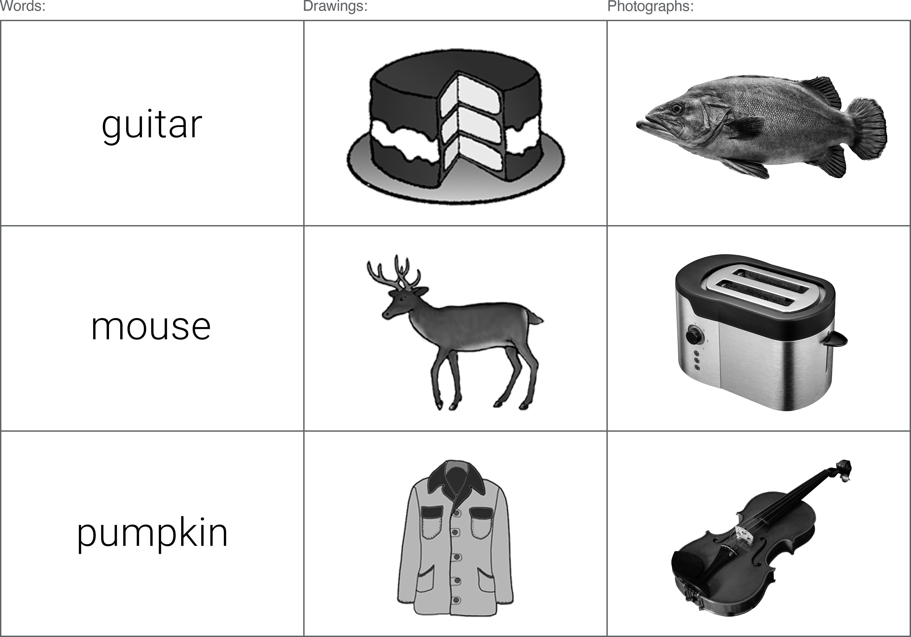

```{r load-packages, include=FALSE, cache=FALSE}
##  Clear environment and list required packages:
    rm(list=ls())  
    required_packages <- c("tidyverse", "dplyr", "captioner", "tinytex", "kableExtra", "formattable", 
                           "readr", "irr", "psycho", "afex", "emmeans", "janitor")
    packages_to_install <- required_packages[!(required_packages %in% installed.packages()[,"Package"])]
    if(length(packages_to_install)) install.packages(packages_to_install)
    invisible(suppressPackageStartupMessages(lapply(required_packages, library, character.only = TRUE)))
##  Define own function:
    coalesce_by_column <- function(df) {return(dplyr::coalesce(!!! as.list(df)))}
##  Captioner:
    figure_numbering <- captioner()
    table_numbering <- captioner(prefix = "Table")
```


# Experiment 3 (Grey drawings + photos)
## Effect of stimuli format and response option on recognition memory judgments.

For the recognition memory experiment, everyday objects were presented in three stimuli formats: i) words (written in simple, black ink); ii) drawings (shaded line-drawn illustrations); and iii) photographs (detail rich exemplars of the real world object). @rossion2004 demonstrated that naming agreement could be improved by adding surface texture and shading to the original @snodgrass1980 items; however, it is unclear how manipulations to distinctiveness actually impact performance in recognition memory paradigms. As well as general inconsistencies regarding the type of stimuli used in recognition memory experiments, there is also much variability in the response options available to participants when reporting their recognition, for example: Remember/Know (@lombardi2016), Recollection/Familiarity (???), or Low/Med/High confidence (???). In the current experiment, the availability of different response options when reporting recognition will also be examined by randomly assigning participants into a paradigm with three response options (Recollection / Familiarity / Guessing) or four response options (RFG + Both). 

Based on the results of Experiment 1, which compared recognition to for words and drawings only, a number of hypotheses are proposed as to the potential effects of adding a third stimuli format (highly distinctive photograph stimuli). As stimuli become increasingly distinctive (from words, to drawings, to photographs), it seems likely that the number of hits (correctly recognised items) will increase, and the number of false alarms (FAs) will decrease. RFG responses are expected to show a similar pattern, with the most detailed stimuli showing the highest number of hits assigned  “Recollection”, while the less detailed formats show increasing levels of "Familiarity" and "Guessing" hits. Whilst we expect the overall number of FAs to increase as stimuli become less distinctive (i.e. words will show the highest rate of FAs), there is no reason to believe that these FAs will be biased toward any particular RFG judgement across formats. It is also hypothesised that the rates of reported Recollection and Familiarity will differ across response option conditions (RFG / RFBG), though the direction of this difference is currently unclear. 

```{r experiment-3-main, include=FALSE, warning = FALSE, message=FALSE, cache=TRUE}
#################################################################################################################
##    EXPERIMENT 3:                                                                                            ##
#################################################################################################################
##  Import demographics, RFG justifications, and RFBG justifications:                       
exp3and4__p_info_files <-
  ##  SONA - colour + grey (v123):
  c("./resources/experiment_3_and_4/experiment_3_and_4_data/data_exp_10169-v123_questionnaire-hq4r.csv",
    "./resources/experiment_3_and_4/experiment_3_and_4_data/data_exp_10169-v123_questionnaire-aaj1.csv",
    "./resources/experiment_3_and_4/experiment_3_and_4_data/data_exp_10169-v123_questionnaire-n6oe.csv",
    ##  Prolific - colour (v127):
    "./resources/experiment_3_and_4/experiment_3_and_4_data/data_exp_10169-v127_questionnaire-hq4r.csv",
    "./resources/experiment_3_and_4/experiment_3_and_4_data/data_exp_10169-v127_questionnaire-aaj1.csv",
    "./resources/experiment_3_and_4/experiment_3_and_4_data/data_exp_10169-v127_questionnaire-n6oe.csv",
    ##  Prolific - colour (v128):
    "./resources/experiment_3_and_4/experiment_3_and_4_data/data_exp_10169-v128_questionnaire-hq4r.csv",
    "./resources/experiment_3_and_4/experiment_3_and_4_data/data_exp_10169-v128_questionnaire-aaj1.csv",
    "./resources/experiment_3_and_4/experiment_3_and_4_data/data_exp_10169-v128_questionnaire-n6oe.csv",
    ##  Prolific - grey (v131):
    "./resources/experiment_3_and_4/experiment_3_and_4_data/data_exp_10169-v131_questionnaire-hq4r.csv",
    "./resources/experiment_3_and_4/experiment_3_and_4_data/data_exp_10169-v131_questionnaire-aaj1.csv",
    "./resources/experiment_3_and_4/experiment_3_and_4_data/data_exp_10169-v131_questionnaire-n6oe.csv",
    ##  Hanover - grey (v4):
    "./resources/experiment_3_and_4/experiment_3_and_4_data/data_exp_19134-v4_questionnaire-hq4r.csv",
    "./resources/experiment_3_and_4/experiment_3_and_4_data/data_exp_19134-v4_questionnaire-aaj1.csv",
    "./resources/experiment_3_and_4/experiment_3_and_4_data/data_exp_19134-v4_questionnaire-n6oe.csv")

##  Create raw df from the above files, but only get the following columns:
exp3and4__participant_info <- map_dfr(exp3and4__p_info_files,~read_csv(.x, col_types = cols_only("Participant Private ID"='c', 
                                                                             "Participant Public ID"='c',"UTC Date"='c',"Participant OS"='c',
                                                                             "Participant Browser"='c',"Participant Monitor Size"='c',"randomiser-hr2x"='c',
                                                                             "randomiser-r7fb"='c',"randomiser-hr9o"='c',"randomiser-8myq"='c', 
                                                                             "randomiser-uhe4"='c',"randomiser-z5ou"='c',"randomiser-kdpl"='c',
                                                                             "randomiser-fslx"='c',"randomiser-1ls2"='c',"checkpoint-cks2"='c', 
                                                                             "checkpoint-lpef"='c',"checkpoint-n8cs"='c',"checkpoint-8p6q"='c',
                                                                             "checkpoint-jk6r"='c',"checkpoint-j7fq"='c',"checkpoint-n8cs"='c', 
                                                                             "Question Key"='c',"Response"='c'))) %>%
  ##  Merge columns that contain the same type of data, but were originally split into different columns:
  unite(study_list, "randomiser-r7fb", "randomiser-hr9o", remove = TRUE, na.rm = TRUE) %>%
  unite(test_list, "checkpoint-cks2", "checkpoint-lpef", "checkpoint-n8cs", "checkpoint-8p6q",
        "checkpoint-jk6r", "checkpoint-j7fq", "checkpoint-n8cs", remove = TRUE,
        na.rm = TRUE) %>%
  unite(resp_option, "randomiser-kdpl", "randomiser-8myq", "randomiser-z5ou", "randomiser-uhe4",
        "randomiser-fslx", "randomiser-1ls2", remove = TRUE, na.rm = TRUE) %>%
  ##  Rename some columns:    
  rename(id = "Participant Private ID", prolific_id = "Participant Public ID", date = "UTC Date", 
         system = "Participant OS", browser = "Participant Browser", monitor = "Participant Monitor Size", 
         col_or_grey = "randomiser-hr2x", question = "Question Key", response = "Response") %>%   
  ##  Reorder columns:    
  select(id, prolific_id, date, system, browser, monitor, col_or_grey, resp_option, study_list, 
         test_list, question, response) %>%
  ##  Set participant ID as the grouping variable, and arrange data by participant ID:
  group_by(id) %>%
  arrange(id) %>%
  ##  Remove empty / unimportant rows:
  drop_na(id) %>%
  filter(question != "BEGIN QUESTIONNAIRE") %>%    
  filter(question != "END QUESTIONNAIRE") %>%
  ##  Reformat from long to wide:
  spread(key = question, value = response) %>%
  ##  Remove unimportant columns:    
  select(-"age-quantised", -"attention_check-quantised", -"EngFirstLang-quantised", -"ethnicity-quantised",
         -"ethnicity2-quantised", -"ethnicity3-quantised", -"mem_skills_1-quantised",
         -"mem_skills_2-quantised", -"response-6-quantised", -"response-9-quantised") %>%
  ##  Merge multiple rows into one (per participant):
  summarise_all(coalesce_by_column) %>%
  ##  Rename more columns:
  rename(white = "ethnicity", mixed = "ethnicity2", asian = "ethnicity3", eng_first_lang = "EngFirstLang",
         mixed_other = "response-4", asian_other = "response-15", black = "response-6", 
         black_other = "response-7", other_ethnic = "response-9", 
         other_ethnic_specified = "response-4") %>%
  ##  Reorder columns again:   
  select(id, prolific_id, date, system, browser, monitor, col_or_grey, resp_option, study_list, test_list, 
         age, gender, eng_first_lang, white, white_other, mixed, mixed_other, asian, asian_other, black, 
         black_other, other_ethnic, other_ethnic_specified, rec_justification, fam_justification,
         both_justification, guess_justification, mem_skills_1, mem_skills_2, attention_check) %>%
  ##  Recode attention check to show pass or fail:
  mutate(attention_check = str_replace(attention_check, "a lot better", "pass")) %>%
  mutate(attention_check = str_replace_all(attention_check, c("a lot worse" = "fail", 
                                                              "a little worse" = "fail", 
                                                              "the same" = "fail", 
                                                              "a little better" = "fail"))) %>%
  ##  Tidy up responses for clarity:
  mutate_all(., tolower) %>%
  mutate(col_or_grey = str_remove_all(col_or_grey, "^(.*?)__")) %>%
  mutate(resp_option = str_remove_all(resp_option, "^(.*?)_")) %>%
  mutate(study_list = str_remove_all(study_list, "[^0-9]+")) %>%
  mutate(test_list = str_remove_all(test_list, "\\_.+")) %>%
  mutate(system = str_remove_all(system, "\\ .+")) %>%
  mutate(browser = str_remove_all(browser, "\\ .+")) %>%
  mutate(mixed = str_remove_all(mixed, "\\ .+")) %>%
  mutate(asian = str_remove_all(asian, "\\ .+")) %>%
  mutate(black = str_remove_all(black, "\\ .+")) %>%
  mutate(gender = str_replace(gender, "^f$", "female")) %>%
  mutate(gender = str_replace(gender, "femle", "female")) %>%
  mutate(gender = str_replace(gender, "femal", "female")) %>%
  mutate(gender = str_replace(gender, "femalee", "female")) %>%
  mutate(gender = str_replace(gender, "woman", "female")) %>%
  mutate(gender = str_replace(gender, "^m$", "male")) %>%
  mutate(gender = str_replace(gender, "malw", "male")) %>%
  mutate(gender = str_replace(gender, "mle", "male")) %>%
  mutate(gender = str_replace(gender, "^[0-9]*$", "unspecified")) %>%
  mutate(gender = replace_na(gender, "unspecified")) %>%
  arrange(col_or_grey, desc(resp_option), study_list, test_list)

##  Calculate how many items P got correct during study:
##  Import study data:
##  SONA - colour + grey (v123):
exp3and4__study_files <- c("./resources/experiment_3_and_4/experiment_3_and_4_data/data_exp_10169-v123_task-hqih.csv", # Study_1_Grey
                 "./resources/experiment_3_and_4/experiment_3_and_4_data/data_exp_10169-v123_task-iwo1.csv", # Study_2_Grey
                 "./resources/experiment_3_and_4/experiment_3_and_4_data/data_exp_10169-v123_task-zde5.csv", # Study_3_Grey
                 "./resources/experiment_3_and_4/experiment_3_and_4_data/data_exp_10169-v123_task-gb72.csv", # Study_4_Grey
                 "./resources/experiment_3_and_4/experiment_3_and_4_data/data_exp_10169-v123_task-6xh1.csv", # Study_5_Grey
                 "./resources/experiment_3_and_4/experiment_3_and_4_data/data_exp_10169-v123_task-6t6c.csv", # Study_6_Grey
                 "./resources/experiment_3_and_4/experiment_3_and_4_data/data_exp_10169-v123_task-hjvs.csv", # Study_1_Col
                 "./resources/experiment_3_and_4/experiment_3_and_4_data/data_exp_10169-v123_task-ijsc.csv", # Study_2_Col
                 "./resources/experiment_3_and_4/experiment_3_and_4_data/data_exp_10169-v123_task-rxq8.csv", # Study_3_Col
                 "./resources/experiment_3_and_4/experiment_3_and_4_data/data_exp_10169-v123_task-41u6.csv", # Study_4_Col
                 "./resources/experiment_3_and_4/experiment_3_and_4_data/data_exp_10169-v123_task-xfbn.csv", # Study_5_Col
                 "./resources/experiment_3_and_4/experiment_3_and_4_data/data_exp_10169-v123_task-qw7d.csv", # Study_6_Col
                 ##  Prolific - colour (v127):
                 "./resources/experiment_3_and_4/experiment_3_and_4_data/data_exp_10169-v127_task-hjvs.csv", # Study_1_Grey
                 "./resources/experiment_3_and_4/experiment_3_and_4_data/data_exp_10169-v127_task-ijsc.csv", # Study_2_Grey
                 "./resources/experiment_3_and_4/experiment_3_and_4_data/data_exp_10169-v127_task-rxq8.csv", # Study_3_Grey
                 "./resources/experiment_3_and_4/experiment_3_and_4_data/data_exp_10169-v127_task-41u6.csv", # Study_4_Grey
                 "./resources/experiment_3_and_4/experiment_3_and_4_data/data_exp_10169-v127_task-xfbn.csv", # Study_5_Grey
                 "./resources/experiment_3_and_4/experiment_3_and_4_data/data_exp_10169-v127_task-qw7d.csv", # Study_6_Grey
                 ##  Prolific - colour (v128):
                 "./resources/experiment_3_and_4/experiment_3_and_4_data/data_exp_10169-v128_task-hjvs.csv", # Study_1_Col
                 "./resources/experiment_3_and_4/experiment_3_and_4_data/data_exp_10169-v128_task-ijsc.csv", # Study_2_Col
                 "./resources/experiment_3_and_4/experiment_3_and_4_data/data_exp_10169-v128_task-rxq8.csv", # Study_3_Col
                 "./resources/experiment_3_and_4/experiment_3_and_4_data/data_exp_10169-v128_task-41u6.csv", # Study_4_Col
                 "./resources/experiment_3_and_4/experiment_3_and_4_data/data_exp_10169-v128_task-xfbn.csv", # Study_5_Col
                 "./resources/experiment_3_and_4/experiment_3_and_4_data/data_exp_10169-v128_task-qw7d.csv", # Study_6_Col
                 ##  Prolific - grey (v131):
                 "./resources/experiment_3_and_4/experiment_3_and_4_data/data_exp_10169-v131_task-hqih.csv", # Study_1_Grey
                 "./resources/experiment_3_and_4/experiment_3_and_4_data/data_exp_10169-v131_task-iwo1.csv", # Study_2_Grey
                 "./resources/experiment_3_and_4/experiment_3_and_4_data/data_exp_10169-v131_task-zde5.csv", # Study_3_Grey
                 "./resources/experiment_3_and_4/experiment_3_and_4_data/data_exp_10169-v131_task-gb72.csv", # Study_4_Grey
                 "./resources/experiment_3_and_4/experiment_3_and_4_data/data_exp_10169-v131_task-6xh1.csv", # Study_5_Grey
                 "./resources/experiment_3_and_4/experiment_3_and_4_data/data_exp_10169-v131_task-6t6c.csv", # Study_6_Grey 
                 ##  Hanover - grey (v4):
                 "./resources/experiment_3_and_4/experiment_3_and_4_data/data_exp_19134-v4_task-hqih.csv",   # Study_1_Grey
                 "./resources/experiment_3_and_4/experiment_3_and_4_data/data_exp_19134-v4_task-iwo1.csv",   # Study_2_Grey
                 "./resources/experiment_3_and_4/experiment_3_and_4_data/data_exp_19134-v4_task-zde5.csv",   # Study_3_Grey
                 "./resources/experiment_3_and_4/experiment_3_and_4_data/data_exp_19134-v4_task-gb72.csv",   # Study_4_Grey
                 "./resources/experiment_3_and_4/experiment_3_and_4_data/data_exp_19134-v4_task-6xh1.csv",   # Study_5_Grey
                 "./resources/experiment_3_and_4/experiment_3_and_4_data/data_exp_19134-v4_task-6t6c.csv")   # Study_6_Grey

##  Create raw df from the above files, but only get the following columns:
exp3and4__study_data <- map_dfr(exp3and4__study_files,~read_csv(.x, col_types = cols_only("Participant Private ID" = 'c',
                                                                      "Participant Public ID"='c',
                                                                      "Experiment Version" = 'c',
                                                                      "Screen Name" = 'c', 
                                                                      "stim" = 'c', "correct_answer" = 'c',
                                                                      "Response" = 'c',
                                                                      "Reaction Time" = col_double()))) %>%
  ##  Rename some columns:
  rename(id = "Participant Private ID", prolific_id = "Participant Public ID", 
         exp_ver = "Experiment Version",screen = "Screen Name", rt = "Reaction Time", 
         response = "Response") %>%
  ##  Reorder columns:    
  select(id, prolific_id, exp_ver, screen, stim, correct_answer, response, rt) %>%
  ##  Set participant ID as the grouping variable, and arrange data by participant ID:
  group_by(id) %>%
  arrange(id) %>%  
  ##  Remove empty / unimportant rows:
  drop_na(screen) %>%
  filter(screen != "check") %>%
  filter(screen != "fixation") %>%
  filter(screen != "filler_start_fixation") %>%
  filter(screen != "filler_start_stim") %>%
  filter(screen != "filler_end_fixation") %>%
  filter(screen != "filler_end_stim") %>%
  add_count(screen, name = "total_resp")
##  Calculate how many responses were correct for each stimuli format, then join these together:
exp3and4__word <- exp3and4__study_data %>%
  filter(correct_answer == "word.png") %>%
  add_count(screen, name = "study_word_resps") %>%
  filter(response == "word.png") %>%
  add_count(screen, name = "study_word_correct") %>%
  distinct(id, .keep_all = TRUE) %>%
  select(id, exp_ver, study_word_resps, study_word_correct)
exp3and4__drawing <- exp3and4__study_data %>%
  filter(correct_answer == "line-drawing.png") %>%
  add_count(screen, name = "study_drawing_resps") %>%
  filter(response == "line-drawing.png") %>%
  add_count(screen, name = "study_drawing_correct") %>%
  distinct(id, .keep_all = TRUE) %>%
  select(id, exp_ver, study_drawing_resps, study_drawing_correct)
exp3and4__photo <- exp3and4__study_data %>%
  filter(correct_answer == "photograph.png") %>%
  add_count(screen, name = "study_photo_resps") %>%
  filter(response == "photograph.png") %>%
  add_count(screen, name = "study_photo_correct") %>%
  distinct(id, .keep_all = TRUE) %>%
  select(id, exp_ver, study_photo_resps, study_photo_correct)
exp3and4__study_totals <- right_join(exp3and4__word, exp3and4__drawing, by = "id") %>%
  right_join(exp3and4__photo, by = "id")
##  Add 'exp3and4__study_totals' to 'exp3and4__participant_info' df:
exp3and4__participant_info <- exp3and4__participant_info %>%
  right_join(exp3and4__study_totals, by = "id") %>%
  mutate(study_responses_total = study_word_resps + study_drawing_resps + study_photo_resps) %>%
  mutate(study_correct = study_word_correct + study_drawing_correct + study_photo_correct) %>%
  mutate(study_correct_percent = study_correct*(100/study_responses_total)) %>%
  mutate(study_error = study_responses_total - study_correct) %>%
  mutate(study_error_percent = study_error*(100/study_responses_total)) %>%
  arrange(col_or_grey, desc(resp_option), study_list, test_list) %>%
  mutate(col_or_grey = str_replace(col_or_grey, "greyscale", "grey")) %>%
  mutate(col_or_grey = str_replace(col_or_grey, "colour", "col")) %>%
  select(-exp_ver.x, -exp_ver.y) %>%
  select(id, prolific_id, exp_ver, everything())
#################################################################################################################
##    Define study lists:                                                                                      ##
#################################################################################################################
##  Define all possible study lists, so we can later calculate Hits, Misses, FA, CRs.  
exp3and4__study_1_grey_list <- c("grey_photo_ashtray3","grey_photo_balloon3","grey_photo_barrel3","grey_photo_bear2",
                       "grey_photo_bowl2","grey_photo_brush2","grey_photo_camel3","grey_photo_clock3",
                       "grey_photo_deer2","grey_photo_door3","grey_photo_drum1","grey_photo_fence3",
                       "grey_photo_nail3","grey_photo_needle3","grey_photo_nose3","grey_photo_pear1",
                       "grey_photo_pliers2","grey_photo_rabbit3","grey_photo_skunk2","grey_photo_table2",
                       "grey_photo_watch1","word_banana","word_boot","word_celery","word_chair","word_cloud",
                       "word_ladder","word_lips","word_peach","word_peacock","word_pencil","word_pepper",
                       "word_piano","word_pipe","word_pumpkin","word_ring","word_seal","word_sheep",
                       "word_snail","word_spider","word_tiger","word_train","grey_drawing_basket",
                       "grey_drawing_book","grey_drawing_bottle","grey_drawing_broom","grey_drawing_cherry",
                       "grey_drawing_chicken","grey_drawing_comb","grey_drawing_eagle","grey_drawing_flute",
                       "grey_drawing_goat","grey_drawing_iron","grey_drawing_moon","grey_drawing_mouse",
                       "grey_drawing_ostrich","grey_drawing_socks","grey_drawing_stool","grey_drawing_thumb",
                       "grey_drawing_toaster","grey_drawing_tree","grey_drawing_violin","grey_drawing_well")

exp3and4__study_2_grey_list <- c("word_ashtray","word_balloon","word_barrel","word_bear","word_bowl","word_brush",
                       "word_camel","word_clock","word_deer","word_door","word_drum","word_fence",
                       "word_nail","word_needle","word_nose","word_pear","word_pliers","word_rabbit",
                       "word_skunk","word_table","word_watch","grey_drawing_banana","grey_drawing_boot",
                       "grey_drawing_celery","grey_drawing_chair","grey_drawing_cloud","grey_drawing_ladder",
                       "grey_drawing_lips","grey_drawing_peach","grey_drawing_peacock","grey_drawing_pencil",
                       "grey_drawing_pepper","grey_drawing_piano","grey_drawing_pipe","grey_drawing_pumpkin",
                       "grey_drawing_ring","grey_drawing_seal","grey_drawing_sheep","grey_drawing_snail",
                       "grey_drawing_spider","grey_drawing_tiger","grey_drawing_train","grey_photo_basket2",
                       "grey_photo_book1","grey_photo_bottle2","grey_photo_broom2","grey_photo_cherry1",
                       "grey_photo_chicken2","grey_photo_comb2","grey_photo_eagle1","grey_photo_flute1",
                       "grey_photo_goat2","grey_photo_iron2","grey_photo_moon3","grey_photo_mouse2",
                       "grey_photo_ostrich3","grey_photo_socks1","grey_photo_stool2","grey_photo_thumb1",
                       "grey_photo_toaster1","grey_photo_tree1","grey_photo_violin1","grey_photo_well2")

exp3and4__study_3_grey_list <- c("grey_drawing_ashtray","grey_drawing_balloon","grey_drawing_barrel",
                       "grey_drawing_bear","grey_drawing_bowl","grey_drawing_brush","grey_drawing_camel",
                       "grey_drawing_clock","grey_drawing_deer","grey_drawing_door","grey_drawing_drum",
                       "grey_drawing_fence","grey_drawing_nail","grey_drawing_needle","grey_drawing_nose",
                       "grey_drawing_pear","grey_drawing_pliers","grey_drawing_rabbit","grey_drawing_skunk",
                       "grey_drawing_table","grey_drawing_watch","grey_photo_banana1","grey_photo_boot3",
                       "grey_photo_celery1","grey_photo_chair3","grey_photo_cloud2","grey_photo_ladder2",
                       "grey_photo_lips2","grey_photo_peach1","grey_photo_peacock3","grey_photo_pencil1",
                       "grey_photo_pepper2","grey_photo_piano3","grey_photo_pipe1","grey_photo_pumpkin3",
                       "grey_photo_ring1","grey_photo_seal2","grey_photo_sheep1","grey_photo_snail3",
                       "grey_photo_spider3","grey_photo_tiger2","grey_photo_train1","word_basket",
                       "word_book","word_bottle","word_broom","word_cherry","word_chicken","word_comb",
                       "word_eagle","word_flute","word_goat","word_iron","word_moon","word_mouse",
                       "word_ostrich","word_socks","word_stool","word_thumb","word_toaster","word_tree",
                       "word_violin","word_well")

exp3and4__study_4_grey_list <- c("grey_photo_anchor3","grey_photo_apple3","grey_photo_bell1","grey_photo_bread1",
                       "grey_photo_button3","grey_photo_carrot3","grey_photo_chain1","grey_photo_corn1",
                       "grey_photo_crown2","grey_photo_fish2","grey_photo_glasses1","grey_photo_hammer2",
                       "grey_photo_horse3","grey_photo_house3","grey_photo_jacket2","grey_photo_lion2",
                       "grey_photo_orange2","grey_photo_raccoon2","grey_photo_swing2","grey_photo_thimble1",
                       "grey_photo_zebra3","word_doll","word_foot","word_frog","word_hand","word_kettle",
                       "word_kite","word_knife","word_lemon","word_lobster","word_lock","word_penguin",
                       "word_plug","word_potato","word_shirt","word_shoe","word_skirt","word_snake",
                       "word_snowman","word_spoon","word_tomato","word_trumpet","grey_drawing_belt",
                       "grey_drawing_cake","grey_drawing_candle","grey_drawing_cannon","grey_drawing_duck",
                       "grey_drawing_flag","grey_drawing_flower","grey_drawing_giraffe",
                       "grey_drawing_grapes","grey_drawing_guitar","grey_drawing_harp","grey_drawing_lamp",
                       "grey_drawing_leaf","grey_drawing_mitten","grey_drawing_monkey","grey_drawing_onion",
                       "grey_drawing_peanut","grey_drawing_screw","grey_drawing_swan","grey_drawing_whistle",
                       "grey_drawing_window")

exp3and4__study_5_grey_list <- c("word_anchor","word_apple","word_bell","word_bread","word_button","word_carrot",
                       "word_chain","word_corn","word_crown","word_fish","word_glasses","word_hammer",
                       "word_horse","word_house","word_jacket","word_lion","word_orange","word_raccoon",
                       "word_swing","word_thimble","word_zebra","grey_drawing_doll","grey_drawing_foot",
                       "grey_drawing_frog","grey_drawing_hand","grey_drawing_kettle","grey_drawing_kite",
                       "grey_drawing_knife","grey_drawing_lemon","grey_drawing_lobster","grey_drawing_lock",
                       "grey_drawing_penguin","grey_drawing_plug","grey_drawing_potato","grey_drawing_shirt",
                       "grey_drawing_shoe","grey_drawing_skirt","grey_drawing_snake","grey_drawing_snowman",
                       "grey_drawing_spoon","grey_drawing_tomato","grey_drawing_trumpet","grey_photo_belt2",
                       "grey_photo_cake3","grey_photo_candle2","grey_photo_cannon2","grey_photo_duck2",
                       "grey_photo_flag3","grey_photo_flower3","grey_photo_giraffe1","grey_photo_grapes1",
                       "grey_photo_guitar1","grey_photo_harp2","grey_photo_lamp2","grey_photo_leaf2",
                       "grey_photo_mitten2","grey_photo_monkey1","grey_photo_onion1","grey_photo_peanut3",
                       "grey_photo_screw3","grey_photo_swan3","grey_photo_whistle1","grey_photo_window3")

exp3and4__study_6_grey_list <- c("grey_drawing_anchor","grey_drawing_apple","grey_drawing_bell","grey_drawing_bread",
                       "grey_drawing_button","grey_drawing_carrot","grey_drawing_chain","grey_drawing_corn",
                       "grey_drawing_crown","grey_drawing_fish","grey_drawing_glasses","grey_drawing_hammer",
                       "grey_drawing_horse","grey_drawing_house","grey_drawing_jacket","grey_drawing_lion",
                       "grey_drawing_orange","grey_drawing_raccoon","grey_drawing_swing",
                       "grey_drawing_thimble","grey_drawing_zebra","grey_photo_doll1","grey_photo_foot1",
                       "grey_photo_frog2","grey_photo_hand1","grey_photo_kettle2","grey_photo_kite1",
                       "grey_photo_knife2","grey_photo_lemon3","grey_photo_lobster2","grey_photo_lock3",
                       "grey_photo_penguin1","grey_photo_plug2","grey_photo_potato1","grey_photo_shirt1",
                       "grey_photo_shoe1","grey_photo_skirt3","grey_photo_snake3","grey_photo_snowman3",
                       "grey_photo_spoon2","grey_photo_tomato1","grey_photo_trumpet3","word_belt",
                       "word_cake","word_candle","word_cannon","word_duck","word_flag","word_flower",
                       "word_giraffe","word_grapes","word_guitar","word_harp","word_lamp","word_leaf",
                       "word_mitten","word_monkey","word_onion","word_peanut","word_screw","word_swan",
                       "word_whistle","word_window")    

exp3and4__study_1_col_list <- c("col_photo_ashtray3","col_photo_balloon3","col_photo_barrel3","col_photo_bear2",
                      "col_photo_bowl2","col_photo_brush2","col_photo_camel3","col_photo_clock3",
                      "col_photo_deer2","col_photo_door3","col_photo_drum1","col_photo_fence3",
                      "col_photo_nail3","col_photo_needle3","col_photo_nose3","col_photo_pear1",
                      "col_photo_pliers2","col_photo_rabbit3","col_photo_skunk2","col_photo_table2",
                      "col_photo_watch1","word_banana","word_boot","word_celery","word_chair","word_cloud",
                      "word_ladder","word_lips","word_peach","word_peacock","word_pencil","word_pepper",
                      "word_piano","word_pipe","word_pumpkin","word_ring","word_seal","word_sheep",
                      "word_snail","word_spider","word_tiger","word_train","col_drawing_basket",
                      "col_drawing_book","col_drawing_bottle","col_drawing_broom","col_drawing_cherry",
                      "col_drawing_chicken","col_drawing_comb","col_drawing_eagle","col_drawing_flute",
                      "col_drawing_goat","col_drawing_iron","col_drawing_moon","col_drawing_mouse",
                      "col_drawing_ostrich","col_drawing_socks","col_drawing_stool","col_drawing_thumb",
                      "col_drawing_toaster","col_drawing_tree","col_drawing_violin","col_drawing_well")

exp3and4__study_2_col_list <- c("word_ashtray","word_balloon","word_barrel","word_bear","word_bowl","word_brush",
                      "word_camel","word_clock","word_deer","word_door","word_drum","word_fence","word_nail",
                      "word_needle","word_nose","word_pear","word_pliers","word_rabbit","word_skunk",
                      "word_table","word_watch","col_drawing_banana","col_drawing_boot","col_drawing_celery",
                      "col_drawing_chair","col_drawing_cloud","col_drawing_ladder","col_drawing_lips",
                      "col_drawing_peach","col_drawing_peacock","col_drawing_pencil","col_drawing_pepper",
                      "col_drawing_piano","col_drawing_pipe","col_drawing_pumpkin","col_drawing_ring",
                      "col_drawing_seal","col_drawing_sheep","col_drawing_snail","col_drawing_spider",
                      "col_drawing_tiger","col_drawing_train","col_photo_basket2","col_photo_book1",
                      "col_photo_bottle2","col_photo_broom2","col_photo_cherry1","col_photo_chicken2",
                      "col_photo_comb2","col_photo_eagle1","col_photo_flute1","col_photo_goat2",
                      "col_photo_iron2","col_photo_moon3","col_photo_mouse2","col_photo_ostrich3",
                      "col_photo_socks1","col_photo_stool2","col_photo_thumb1","col_photo_toaster1",
                      "col_photo_tree1","col_photo_violin1","col_photo_well2")

exp3and4__study_3_col_list <- c("col_drawing_ashtray","col_drawing_balloon","col_drawing_barrel","col_drawing_bear",
                      "col_drawing_bowl","col_drawing_brush","col_drawing_camel","col_drawing_clock",
                      "col_drawing_deer","col_drawing_door","col_drawing_drum","col_drawing_fence",
                      "col_drawing_nail","col_drawing_needle","col_drawing_nose","col_drawing_pear",
                      "col_drawing_pliers","col_drawing_rabbit","col_drawing_skunk","col_drawing_table",
                      "col_drawing_watch","col_photo_banana1","col_photo_boot3","col_photo_celery1",
                      "col_photo_chair3","col_photo_cloud2","col_photo_ladder2","col_photo_lips2",
                      "col_photo_peach1","col_photo_peacock3","col_photo_pencil1","col_photo_pepper2",
                      "col_photo_piano3","col_photo_pipe1","col_photo_pumpkin3","col_photo_ring1",
                      "col_photo_seal2","col_photo_sheep1","col_photo_snail3","col_photo_spider3",
                      "col_photo_tiger2","col_photo_train1","word_basket","word_book","word_bottle",
                      "word_broom","word_cherry","word_chicken","word_comb","word_eagle","word_flute",
                      "word_goat","word_iron","word_moon","word_mouse","word_ostrich","word_socks",
                      "word_stool","word_thumb","word_toaster","word_tree","word_violin","word_well")

exp3and4__study_4_col_list <- c("col_photo_anchor3","col_photo_apple3","col_photo_bell1","col_photo_bread1",
                      "col_photo_button3","col_photo_carrot3","col_photo_chain1","col_photo_corn1",
                      "col_photo_crown2","col_photo_fish2","col_photo_glasses1","col_photo_hammer2",
                      "col_photo_horse3","col_photo_house3","col_photo_jacket2","col_photo_lion2",
                      "col_photo_orange2","col_photo_raccoon2","col_photo_swing2","col_photo_thimble1",
                      "col_photo_zebra3","word_doll","word_foot","word_frog","word_hand","word_kettle",
                      "word_kite","word_knife","word_lemon","word_lobster","word_lock","word_penguin",
                      "word_plug","word_potato","word_shirt","word_shoe","word_skirt","word_snake",
                      "word_snowman","word_spoon","word_tomato","word_trumpet","col_drawing_belt",
                      "col_drawing_cake","col_drawing_candle","col_drawing_cannon","col_drawing_duck",
                      "col_drawing_flag","col_drawing_flower","col_drawing_giraffe","col_drawing_grapes",
                      "col_drawing_guitar","col_drawing_harp","col_drawing_lamp","col_drawing_leaf",
                      "col_drawing_mitten","col_drawing_monkey","col_drawing_onion","col_drawing_peanut",
                      "col_drawing_screw","col_drawing_swan","col_drawing_whistle","col_drawing_window")

exp3and4__study_5_col_list <- c("word_anchor","word_apple","word_bell","word_bread","word_button","word_carrot",
                      "word_chain","word_corn","word_crown","word_fish","word_glasses","word_hammer",
                      "word_horse","word_house","word_jacket","word_lion","word_orange","word_raccoon",
                      "word_swing","word_thimble","word_zebra","col_drawing_doll","col_drawing_foot",
                      "col_drawing_frog","col_drawing_hand","col_drawing_kettle","col_drawing_kite",
                      "col_drawing_knife","col_drawing_lemon","col_drawing_lobster","col_drawing_lock",
                      "col_drawing_penguin","col_drawing_plug","col_drawing_potato","col_drawing_shirt",
                      "col_drawing_shoe","col_drawing_skirt","col_drawing_snake","col_drawing_snowman",
                      "col_drawing_spoon","col_drawing_tomato","col_drawing_trumpet","col_photo_belt2",
                      "col_photo_cake3","col_photo_candle2","col_photo_cannon2","col_photo_duck2",
                      "col_photo_flag3","col_photo_flower3","col_photo_giraffe1","col_photo_grapes1",
                      "col_photo_guitar1","col_photo_harp2","col_photo_lamp2","col_photo_leaf2",
                      "col_photo_mitten2","col_photo_monkey1","col_photo_onion1","col_photo_peanut3",
                      "col_photo_screw3","col_photo_swan3","col_photo_whistle1","col_photo_window3")

exp3and4__study_6_col_list <- c("col_drawing_anchor","col_drawing_apple","col_drawing_bell","col_drawing_bread",
                      "col_drawing_button","col_drawing_carrot","col_drawing_chain","col_drawing_corn",
                      "col_drawing_crown","col_drawing_fish","col_drawing_glasses","col_drawing_hammer",
                      "col_drawing_horse","col_drawing_house","col_drawing_jacket","col_drawing_lion",
                      "col_drawing_orange","col_drawing_raccoon","col_drawing_swing","col_drawing_thimble",
                      "col_drawing_zebra","col_photo_doll1","col_photo_foot1","col_photo_frog2",
                      "col_photo_hand1","col_photo_kettle2","col_photo_kite1","col_photo_knife2",
                      "col_photo_lemon3","col_photo_lobster2","col_photo_lock3","col_photo_penguin1",
                      "col_photo_plug2","col_photo_potato1","col_photo_shirt1","col_photo_shoe1",
                      "col_photo_skirt3","col_photo_snake3","col_photo_snowman3","col_photo_spoon2",
                      "col_photo_tomato1","col_photo_trumpet3","word_belt","word_cake","word_candle",
                      "word_cannon","word_duck","word_flag","word_flower","word_giraffe","word_grapes",
                      "word_guitar","word_harp","word_lamp","word_leaf","word_mitten","word_monkey",
                      "word_onion","word_peanut","word_screw","word_swan","word_whistle","word_window")

#################################################################################################################
##    Test data:                                                                                               ##
#################################################################################################################
##  Import test data:
##  SONA - colour + grey (v123):
exp3and4__test_files <- c("./resources/experiment_3_and_4/experiment_3_and_4_data/data_exp_10169-v123_task-7jjs.csv", # Grey-A-RFG
                "./resources/experiment_3_and_4/experiment_3_and_4_data/data_exp_10169-v123_task-z4vm.csv", # Grey-A-RFBG
                "./resources/experiment_3_and_4/experiment_3_and_4_data/data_exp_10169-v123_task-7l32.csv", # Grey-B-RFG
                "./resources/experiment_3_and_4/experiment_3_and_4_data/data_exp_10169-v123_task-fniu.csv", # Grey-B-RFBG
                "./resources/experiment_3_and_4/experiment_3_and_4_data/data_exp_10169-v123_task-3bwq.csv", # Grey-C-RFG
                "./resources/experiment_3_and_4/experiment_3_and_4_data/data_exp_10169-v123_task-zkjc.csv", # Grey-C-RFBG
                "./resources/experiment_3_and_4/experiment_3_and_4_data/data_exp_10169-v123_task-q6iu.csv", # Colour-A-RFG
                "./resources/experiment_3_and_4/experiment_3_and_4_data/data_exp_10169-v123_task-elbt.csv", # Colour-A-RFBG
                "./resources/experiment_3_and_4/experiment_3_and_4_data/data_exp_10169-v123_task-xfoj.csv", # Colour-B-RFG
                "./resources/experiment_3_and_4/experiment_3_and_4_data/data_exp_10169-v123_task-hkci.csv", # Colour-B-RFBG
                "./resources/experiment_3_and_4/experiment_3_and_4_data/data_exp_10169-v123_task-kckb.csv", # Colour-C-RFG
                "./resources/experiment_3_and_4/experiment_3_and_4_data/data_exp_10169-v123_task-6jyy.csv", # Colour-C-RFBG
                ##  Prolific - colour (v127):
                "./resources/experiment_3_and_4/experiment_3_and_4_data/data_exp_10169-v127_task-q6iu.csv", # Colour-A-RFG
                "./resources/experiment_3_and_4/experiment_3_and_4_data/data_exp_10169-v127_task-elbt.csv", # Colour-A-RFBG
                "./resources/experiment_3_and_4/experiment_3_and_4_data/data_exp_10169-v127_task-xfoj.csv", # Colour-B-RFG
                "./resources/experiment_3_and_4/experiment_3_and_4_data/data_exp_10169-v127_task-hkci.csv", # Colour-B-RFBG
                "./resources/experiment_3_and_4/experiment_3_and_4_data/data_exp_10169-v127_task-kckb.csv", # Colour-C-RFG
                "./resources/experiment_3_and_4/experiment_3_and_4_data/data_exp_10169-v127_task-6jyy.csv", # Colour-C-RFBG
                ##  Prolific - colour (v128):
                "./resources/experiment_3_and_4/experiment_3_and_4_data/data_exp_10169-v128_task-q6iu.csv", # Colour-A-RFG
                "./resources/experiment_3_and_4/experiment_3_and_4_data/data_exp_10169-v128_task-elbt.csv", # Colour-A-RFBG
                "./resources/experiment_3_and_4/experiment_3_and_4_data/data_exp_10169-v128_task-xfoj.csv", # Colour-B-RFG
                "./resources/experiment_3_and_4/experiment_3_and_4_data/data_exp_10169-v128_task-hkci.csv", # Colour-B-RFBG
                "./resources/experiment_3_and_4/experiment_3_and_4_data/data_exp_10169-v128_task-kckb.csv", # Colour-C-RFG
                "./resources/experiment_3_and_4/experiment_3_and_4_data/data_exp_10169-v128_task-6jyy.csv", # Colour-C-RFBG
                ##  Prolific - grey (v131):
                "./resources/experiment_3_and_4/experiment_3_and_4_data/data_exp_10169-v131_task-7jjs.csv", # Grey-A-RFG
                "./resources/experiment_3_and_4/experiment_3_and_4_data/data_exp_10169-v131_task-z4vm.csv", # Grey-A-RFBG
                "./resources/experiment_3_and_4/experiment_3_and_4_data/data_exp_10169-v131_task-7l32.csv", # Grey-B-RFG
                "./resources/experiment_3_and_4/experiment_3_and_4_data/data_exp_10169-v131_task-fniu.csv", # Grey-B-RFBG
                "./resources/experiment_3_and_4/experiment_3_and_4_data/data_exp_10169-v131_task-3bwq.csv", # Grey-C-RFG
                "./resources/experiment_3_and_4/experiment_3_and_4_data/data_exp_10169-v131_task-zkjc.csv", # Grey-C-RFBG       ##  Hanover - grey (v4):
                "./resources/experiment_3_and_4/experiment_3_and_4_data/data_exp_19134-v4_task-7jjs.csv",   # Grey-A-RFG
                "./resources/experiment_3_and_4/experiment_3_and_4_data/data_exp_19134-v4_task-z4vm.csv",   # Grey-A-RFBG
                "./resources/experiment_3_and_4/experiment_3_and_4_data/data_exp_19134-v4_task-7l32.csv",   # Grey-B-RFG
                "./resources/experiment_3_and_4/experiment_3_and_4_data/data_exp_19134-v4_task-fniu.csv",   # Grey-B-RFBG
                "./resources/experiment_3_and_4/experiment_3_and_4_data/data_exp_19134-v4_task-3bwq.csv",   # Grey-C-RFG
                "./resources/experiment_3_and_4/experiment_3_and_4_data/data_exp_19134-v4_task-zkjc.csv")   # Grey-C-RFBG


##  Create raw df from the above files, but only get the following columns:
exp3and4__test_data <- map_dfr(exp3and4__test_files,~read_csv(.x, col_types = cols_only("Participant Private ID" = 'c',
                                                                    "Participant Public ID"='c',
                                                                    "Experiment Version"='c',
                                                                    "Task Name" = 'c',
                                                                    "Screen Name" = 'c',
                                                                    "randomiser-hr9o" = 'c',
                                                                    "randomiser-r7fb" = 'c',
                                                                    "stim" = 'c', 
                                                                    "Response" = 'c', 
                                                                    "Reaction Time" = col_double()))) %>%
  ##  Merge columns that contain the same type of data, but were originally split into different columns:
  unite(study_list,  "randomiser-hr9o", "randomiser-r7fb", remove = TRUE, na.rm = TRUE) %>% 
  ##  Rename some columns:    
  rename(id = "Participant Private ID", prolific_id = "Participant Public ID", exp_ver = "Experiment Version",
         test_list = "Task Name", screen = "Screen Name", response = "Response", rt = "Reaction Time") %>%
  ##  Reorder columns:    
  select(id, prolific_id, exp_ver, study_list, test_list, screen, stim, response, rt) %>%
  ##  Set participant ID as the grouping variable, and arrange data by participant ID:
  group_by(id) %>%
  arrange(id) %>%
  ##  Remove empty / unimportant rows:
  drop_na(screen) %>%
  filter(screen != "check") %>% 
  filter(screen != "Screen 1") %>% 
  filter(screen != "Fixation") %>% 
  filter(response != "old.png") %>%
  ##  Tidy up responses for clarity:
  mutate_all(., tolower) %>%
  mutate(study_list = str_remove_all(study_list, "[^0-9]+")) %>%
  mutate(stim = str_remove_all(stim, ".png")) %>%
  mutate(response = str_remove_all(response, ".png")) %>%
  mutate(test_list = str_remove_all(test_list, "^(.*?) ")) %>%
  mutate(stim = str_replace(stim, "line", "drawing")) %>%
  separate(test_list, c("resp_option", "test_list", "col_or_grey"), sep = "([_?:])") %>%
  arrange(id, response, stim)
##  Remove filler responses:
exp3and4__filler_stim <- c("word_chisel", "word_dress", "grey_drawing_pitcher", "col_drawing_pitcher",
                 "grey_drawing_ruler", "col_drawing_ruler", "grey_drawing_turtle",
                 "col_drawing_turtle", "grey_photo_bicycle1", "col_photo_bicycle1", 
                 "grey_photo_donkey3", "col_photo_donkey3", "grey_photo_dresser3",
                 "col_photo_dresser3")
exp3and4__test_data <- exp3and4__test_data %>%
  filter(!stim %in% exp3and4__filler_stim)

#################################################################################################################
##    Hit and miss calculations:                                                                               ##
#################################################################################################################
##  Define our own function that calculates hit and miss totals. 
exp3and4__hit_and_miss_calc_function <- function(x){
  ##  Count general totals:
  x <- x %>%
    add_tally(response != "new", sort = FALSE, name = "total_hits") %>%
    add_tally(response == "new", sort = FALSE, name = "total_miss") %>%
    add_tally(response == "recollection", sort = FALSE, name = "r_hit") %>%
    add_tally(response == "familiarity", sort = FALSE, name = "f_hit") %>%
    add_tally(response == "both", sort = FALSE, name = "b_hit") %>%
    add_tally(response == "guessing", sort = FALSE, name = "g_hit") %>%
    ##  Count stim-format totals:
    add_tally(str_detect(stim, "^word") & response != "new", sort = FALSE, name = "total_word_hit") %>%
    add_tally(str_detect(stim, "^word") & response == "new", sort = FALSE, name = "total_word_miss") %>%
    add_tally((str_detect(stim, "^grey_drawing") | str_detect(stim, "^col_drawing"))
              & response != "new", sort = FALSE, name = "total_drawing_hit") %>%
    add_tally((str_detect(stim, "^grey_drawing") | str_detect(stim, "^col_drawing"))
              & response == "new", sort = FALSE, name = "total_drawing_miss") %>%
    add_tally((str_detect(stim, "^grey_photo") | str_detect(stim, "^col_photo"))
              & response != "new", sort = FALSE, name = "total_photo_hit") %>%
    add_tally((str_detect(stim, "^grey_photo") | str_detect(stim, "^col_photo"))
              & response == "new", sort = FALSE, name = "total_photo_miss") %>%
    ##  Count stim-format totals by response-option: 
    add_tally(str_detect(stim, "^word") & response == "recollection", sort = FALSE, 
              name = "word_hit_rec") %>%
    add_tally(str_detect(stim, "^word") & response == "familiarity", sort = FALSE, 
              name = "word_hit_fam") %>%
    add_tally(str_detect(stim, "^word") & response == "both", sort = FALSE, 
              name = "word_hit_both") %>%
    add_tally(str_detect(stim, "^word") & response == "guessing", sort = FALSE, 
              name = "word_hit_guess") %>%
    add_tally((str_detect(stim, "^grey_drawing") | str_detect(stim, "^col_drawing"))
              & response == "recollection", sort = FALSE, name = "drawing_hit_rec") %>%
    add_tally((str_detect(stim, "^grey_drawing") | str_detect(stim, "^col_drawing"))
              & response == "familiarity", sort = FALSE, name = "drawing_hit_fam") %>%
    add_tally((str_detect(stim, "^grey_drawing") | str_detect(stim, "^col_drawing"))
              & response == "both", sort = FALSE, name = "drawing_hit_both") %>%
    add_tally((str_detect(stim, "^grey_drawing") | str_detect(stim, "^col_drawing"))
              & response == "guessing", sort = FALSE, name = "drawing_hit_guess") %>%
    add_tally((str_detect(stim, "^grey_photo") | str_detect(stim, "^col_photo"))
              & response == "recollection", sort = FALSE, name = "photo_hit_rec") %>%
    add_tally((str_detect(stim, "^grey_photo") | str_detect(stim, "^col_photo"))
              & response == "familiarity", sort = FALSE, name = "photo_hit_fam") %>%
    add_tally((str_detect(stim, "^grey_photo") | str_detect(stim, "^col_photo"))
              & response == "both", sort = FALSE, name = "photo_hit_both") %>%
    add_tally((str_detect(stim, "^grey_photo") | str_detect(stim, "^col_photo"))
              & response == "guessing", sort = FALSE, name = "photo_hit_guess")
}
#################################################################################################################
##  Filter 'exp3and4__test_data' by each study list, one-at-a-time, resulting in x12 df (x6 grey + x6 col).              ##
##  For each, run our function that calculates the hit and miss totals, then rejoin into one df.               ##
#################################################################################################################
##    Study 1 Grey:                                                                                            ##
#################################################################################################################
exp3and4__hit_miss_study_1_grey <- exp3and4__test_data %>%
  filter(study_list == "1" & col_or_grey == "grey") %>%     # Lures are still here after this step.
  filter(stim %in% exp3and4__study_1_grey_list) %>%                   # Remove lures (new) items.
  exp3and4__hit_and_miss_calc_function()
#################################################################################################################
##    Study 2 Grey:                                                                                            ##
#################################################################################################################
exp3and4__hit_miss_study_2_grey <- exp3and4__test_data %>%
  filter(study_list == "2" & col_or_grey == "grey") %>%
  filter(stim %in% exp3and4__study_2_grey_list) %>%
  exp3and4__hit_and_miss_calc_function()
#################################################################################################################
##    Study 3 Grey:                                                                                            ##
#################################################################################################################
exp3and4__hit_miss_study_3_grey <- exp3and4__test_data %>%
  filter(study_list == "3" & col_or_grey == "grey") %>%
  filter(stim %in% exp3and4__study_3_grey_list) %>%
  exp3and4__hit_and_miss_calc_function()
#################################################################################################################
##    Study 4 Grey:                                                                                            ##
#################################################################################################################
exp3and4__hit_miss_study_4_grey <- exp3and4__test_data %>%
  filter(study_list == "4" & col_or_grey == "grey") %>%
  filter(stim %in% exp3and4__study_4_grey_list) %>%
  exp3and4__hit_and_miss_calc_function()
#################################################################################################################
##    Study 5 Grey:                                                                                            ##
#################################################################################################################
exp3and4__hit_miss_study_5_grey <- exp3and4__test_data %>%
  filter(study_list == "5" & col_or_grey == "grey") %>%
  filter(stim %in% exp3and4__study_5_grey_list) %>%
  exp3and4__hit_and_miss_calc_function()
#################################################################################################################
##    Study 6 Grey:                                                                                            ##
#################################################################################################################
exp3and4__hit_miss_study_6_grey <- exp3and4__test_data %>%
  filter(study_list == "6" & col_or_grey == "grey") %>%
  filter(stim %in% exp3and4__study_6_grey_list) %>%
  exp3and4__hit_and_miss_calc_function()
#################################################################################################################
##    Study 1 Colour:                                                                                          ##
#################################################################################################################
exp3and4__hit_miss_study_1_col <- exp3and4__test_data %>%
  filter(study_list == "1" & col_or_grey == "col") %>%
  filter(stim %in% exp3and4__study_1_col_list) %>%
  exp3and4__hit_and_miss_calc_function()
#################################################################################################################
##    Study 2 Colour:                                                                                          ##
#################################################################################################################
exp3and4__hit_miss_study_2_col <- exp3and4__test_data %>%
  filter(study_list == "2" & col_or_grey == "col") %>%
  filter(stim %in% exp3and4__study_2_col_list) %>%
  exp3and4__hit_and_miss_calc_function()
#################################################################################################################
##    Study 3 Colour:                                                                                          ##
#################################################################################################################
exp3and4__hit_miss_study_3_col <- exp3and4__test_data %>%
  filter(study_list == "3" & col_or_grey == "col") %>%
  filter(stim %in% exp3and4__study_3_col_list) %>%
  exp3and4__hit_and_miss_calc_function()
#################################################################################################################
##    Study 4 Colour:                                                                                          ##
#################################################################################################################
exp3and4__hit_miss_study_4_col <- exp3and4__test_data %>%
  filter(study_list == "4" & col_or_grey == "col") %>%
  filter(stim %in% exp3and4__study_4_col_list) %>%
  exp3and4__hit_and_miss_calc_function()
#################################################################################################################
##    Study 5 Colour:                                                                                          ##
#################################################################################################################
exp3and4__hit_miss_study_5_col <- exp3and4__test_data %>%
  filter(study_list == "5" & col_or_grey == "col") %>%
  filter(stim %in% exp3and4__study_5_col_list) %>%
  exp3and4__hit_and_miss_calc_function()
#################################################################################################################
##    Study 6 Colour:                                                                                          ##
#################################################################################################################
exp3and4__hit_miss_study_6_col <- exp3and4__test_data %>%
  filter(study_list == "6" & col_or_grey == "col") %>%
  filter(stim %in% exp3and4__study_6_col_list) %>%
  exp3and4__hit_and_miss_calc_function()
#################################################################################################################
##    Combine into one df:                                                                                     ##
#################################################################################################################
exp3and4__hit_and_miss <- bind_rows(exp3and4__hit_miss_study_1_grey, exp3and4__hit_miss_study_2_grey, exp3and4__hit_miss_study_3_grey,
                          exp3and4__hit_miss_study_4_grey, exp3and4__hit_miss_study_5_grey, exp3and4__hit_miss_study_6_grey,
                          exp3and4__hit_miss_study_1_col, exp3and4__hit_miss_study_2_col, exp3and4__hit_miss_study_3_col,
                          exp3and4__hit_miss_study_4_col, exp3and4__hit_miss_study_5_col, exp3and4__hit_miss_study_6_col) %>%
  ##  Merge multiple rows into one (per participant):
  summarise_all(coalesce_by_column) %>%
  ##  Remove redundant rows: 
  select(-screen, -stim, -response, -rt)

#################################################################################################################
##    FA and CR calculations:                                                                                  ##
#################################################################################################################
##  Define our own function that calculates FA and CR totals. 
exp3and4__FA_and_CR_calc_function <- function(x){
  ##  Count general totals:
  x <- x %>%
    ##  Count general totals:
    add_tally(response != "new", sort = FALSE, name = "total_FA") %>%
    add_tally(response == "new", sort = FALSE, name = "total_CR") %>%
    add_tally(response == "recollection", sort = FALSE, name = "r_FA") %>%
    add_tally(response == "familiarity", sort = FALSE, name = "f_FA") %>%
    add_tally(response == "both", sort = FALSE, name = "b_FA") %>%
    add_tally(response == "guessing", sort = FALSE, name = "g_FA") %>%   
    ##  Count stim-format totals:
    add_tally(str_detect(stim, "^word") & response != "new", sort = FALSE, name = "total_word_FA") %>%
    add_tally(str_detect(stim, "^word") & response == "new", sort = FALSE, name = "total_word_CR") %>%
    add_tally((str_detect(stim, "^grey_drawing") | str_detect(stim, "^col_drawing"))
              & response != "new", sort = FALSE, name = "total_drawing_FA") %>%
    add_tally((str_detect(stim, "^grey_drawing") | str_detect(stim, "^col_drawing"))
              & response == "new", sort = FALSE, name = "total_drawing_CR") %>%
    add_tally((str_detect(stim, "^grey_photo") | str_detect(stim, "^col_photo"))
              & response != "new", sort = FALSE, name = "total_photo_FA") %>%
    add_tally((str_detect(stim, "^grey_photo") | str_detect(stim, "^col_photo"))
              & response == "new", sort = FALSE, name = "total_photo_CR") %>%
    ##  Count stim-format totals by response-option: 
    add_tally(str_detect(stim, "^word") & response == "recollection", sort = FALSE, 
              name = "word_FA_rec") %>%
    add_tally(str_detect(stim, "^word") & response == "familiarity", sort = FALSE, 
              name = "word_FA_fam") %>%
    add_tally(str_detect(stim, "^word") & response == "both", sort = FALSE, 
              name = "word_FA_both") %>%
    add_tally(str_detect(stim, "^word") & response == "guessing", sort = FALSE, 
              name = "word_FA_guess") %>%
    add_tally((str_detect(stim, "^grey_drawing") | str_detect(stim, "^col_drawing"))
              & response == "recollection", sort = FALSE, name = "drawing_FA_rec") %>%
    add_tally((str_detect(stim, "^grey_drawing") | str_detect(stim, "^col_drawing"))
              & response == "familiarity", sort = FALSE, name = "drawing_FA_fam") %>%
    add_tally((str_detect(stim, "^grey_drawing") | str_detect(stim, "^col_drawing"))
              & response == "both", sort = FALSE, name = "drawing_FA_both") %>%
    add_tally((str_detect(stim, "^grey_drawing") | str_detect(stim, "^col_drawing"))
              & response == "guessing", sort = FALSE, name = "drawing_FA_guess") %>%
    add_tally((str_detect(stim, "^grey_photo") | str_detect(stim, "^col_photo"))
              & response == "recollection", sort = FALSE, name = "photo_FA_rec") %>%
    add_tally((str_detect(stim, "^grey_photo") | str_detect(stim, "^col_photo"))
              & response == "familiarity", sort = FALSE, name = "photo_FA_fam") %>%
    add_tally((str_detect(stim, "^grey_photo") | str_detect(stim, "^col_photo"))
              & response == "both", sort = FALSE, name = "photo_FA_both") %>%
    add_tally((str_detect(stim, "^grey_photo") | str_detect(stim, "^col_photo"))
              & response == "guessing", sort = FALSE, name = "photo_FA_guess")
}
#################################################################################################################
##  Filter 'exp3and4__test_data' by each study list, one-at-a-time, resulting in x12 df (x6 grey + x6 col).              ##
##  For each, run our function that calculates the FA and CR totals, then rejoin into one df.                  ##
#################################################################################################################
##    Study 1 Grey:                                                                                            ##
#################################################################################################################
exp3and4__FA_CR_study_1_grey <- exp3and4__test_data %>%
  filter(study_list == "1" & col_or_grey == "grey") %>%
  filter(stim %in% exp3and4__study_4_grey_list) %>%
  exp3and4__FA_and_CR_calc_function()
#################################################################################################################
##    Study 2 Grey:                                                                                            ##
#################################################################################################################
exp3and4__FA_CR_study_2_grey <- exp3and4__test_data %>%
  filter(study_list == "2" & col_or_grey == "grey") %>%
  filter(stim %in% exp3and4__study_5_grey_list) %>%
  exp3and4__FA_and_CR_calc_function()
#################################################################################################################
##    Study 3 Grey:                                                                                            ##
#################################################################################################################
exp3and4__FA_CR_study_3_grey <- exp3and4__test_data %>%
  filter(study_list == "3" & col_or_grey == "grey") %>%
  filter(stim %in% exp3and4__study_6_grey_list) %>%
  exp3and4__FA_and_CR_calc_function()
#################################################################################################################
##    Study 4 Grey:                                                                                            ##
#################################################################################################################
exp3and4__FA_CR_study_4_grey <- exp3and4__test_data %>%
  filter(study_list == "4" & col_or_grey == "grey") %>%
  filter(stim %in% exp3and4__study_1_grey_list) %>%
  exp3and4__FA_and_CR_calc_function()
#################################################################################################################
##    Study 5 Grey:                                                                                            ##
#################################################################################################################
exp3and4__FA_CR_study_5_grey <- exp3and4__test_data %>%
  filter(study_list == "5" & col_or_grey == "grey") %>%
  filter(stim %in% exp3and4__study_2_grey_list) %>%
  exp3and4__FA_and_CR_calc_function()
#################################################################################################################
##    Study 6 Grey:                                                                                            ##
#################################################################################################################
exp3and4__FA_CR_study_6_grey <- exp3and4__test_data %>%
  filter(study_list == "6" & col_or_grey == "grey") %>%
  filter(stim %in% exp3and4__study_3_grey_list) %>%
  exp3and4__FA_and_CR_calc_function()
#################################################################################################################
##    Study 1 Colour:                                                                                          ##
#################################################################################################################
exp3and4__FA_CR_study_1_col <- exp3and4__test_data %>%
  filter(study_list == "1" & col_or_grey == "col") %>%
  filter(stim %in% exp3and4__study_4_col_list) %>%
  exp3and4__FA_and_CR_calc_function()
#################################################################################################################
##    Study 2 Colour:                                                                                          ##
#################################################################################################################
exp3and4__FA_CR_study_2_col <- exp3and4__test_data %>%
  filter(study_list == "2" & col_or_grey == "col") %>%
  filter(stim %in% exp3and4__study_5_col_list) %>%
  exp3and4__FA_and_CR_calc_function()
#################################################################################################################
##    Study 3 Colour:                                                                                          ##
#################################################################################################################
exp3and4__FA_CR_study_3_col <- exp3and4__test_data %>%
  filter(study_list == "3" & col_or_grey == "col") %>%
  filter(stim %in% exp3and4__study_6_col_list) %>%
  exp3and4__FA_and_CR_calc_function()
#################################################################################################################
##    Study 4 Colour:                                                                                          ##
#################################################################################################################
exp3and4__FA_CR_study_4_col <- exp3and4__test_data %>%
  filter(study_list == "4" & col_or_grey == "col") %>%
  filter(stim %in% exp3and4__study_1_col_list) %>%
  exp3and4__FA_and_CR_calc_function()
#################################################################################################################
##    Study 5 Colour:                                                                                          ##
#################################################################################################################
exp3and4__FA_CR_study_5_col <- exp3and4__test_data %>%
  filter(study_list == "5" & col_or_grey == "col") %>%
  filter(stim %in% exp3and4__study_2_col_list) %>%
  exp3and4__FA_and_CR_calc_function()
#################################################################################################################
##    Study 6 Colour:                                                                                          ##
#################################################################################################################
exp3and4__FA_CR_study_6_col <- exp3and4__test_data %>%
  filter(study_list == "6" & col_or_grey == "col") %>%
  filter(stim %in% exp3and4__study_3_col_list) %>%
  exp3and4__FA_and_CR_calc_function()
##  Combine into one df:
exp3and4__FA_and_CR <- bind_rows(exp3and4__FA_CR_study_1_grey, exp3and4__FA_CR_study_2_grey, exp3and4__FA_CR_study_3_grey,
                       exp3and4__FA_CR_study_4_grey, exp3and4__FA_CR_study_5_grey, exp3and4__FA_CR_study_6_grey,
                       exp3and4__FA_CR_study_1_col, exp3and4__FA_CR_study_2_col, exp3and4__FA_CR_study_3_col,
                       exp3and4__FA_CR_study_4_col, exp3and4__FA_CR_study_5_col, exp3and4__FA_CR_study_6_col) %>%
  ##  Merge multiple rows into one (per participant):
  summarise_all(coalesce_by_column) %>%
  ##  Remove redundant rows: 
  select(-screen, -stim, -response, -rt)
#################################################################################################################
##    Proportions, z-scores, d', c:                                                                            ##
#################################################################################################################
##  Join 'exp3and4__hit_and_miss' and 'exp3and4__FA_and_CR' dfs:
exp3and4__test_stats <- exp3and4__hit_and_miss %>%
  right_join(exp3and4__FA_and_CR) %>%
  ##  Calculate hit proportions:
  #################################################################################################################
##    Words:                                                                                                   ##
#################################################################################################################
##  Proportion of word hits: total number of word items (word hits + word miss) / word hits:
mutate(prop_word_hit = total_word_hit / (total_word_hit + total_word_miss)) %>%
  ##  Proportion of total_word misses: total number of total_word items
  ##  (total_word hits + total_word miss) / total_word misses:
  mutate(prop_word_miss = total_word_miss / (total_word_hit + total_word_miss)) %>%
  ##  Out of all total_word hits, what proportion were Rec:
  mutate(prop_word_hit_rec = word_hit_rec / total_word_hit) %>%
  ##  Out of all total_word hits, what proportion were Fam:
  mutate(prop_word_hit_fam = word_hit_fam / total_word_hit) %>%
  ##  Out of all total_word hits, what proportion were Both:
  mutate(prop_word_hit_both = word_hit_both / total_word_hit) %>%
  ##  Out of all total_word hits, what proportion were Guessing:
  mutate(prop_word_hit_guess = word_hit_guess / total_word_hit) %>%
  ##  Out of all total_word hits, what proportion were Rec (including Both responses):
  mutate(prop_word_hit_rec_total = prop_word_hit_rec + prop_word_hit_both) %>%
  ##  Out of all total_word hits, what proportion were Fam (including Both responses):
  mutate(prop_word_hit_fam_total = prop_word_hit_fam + prop_word_hit_both) %>%
  #################################################################################################################
##    Drawings:                                                                                                ##
#################################################################################################################
##  Proportion of drawing hits: total number of drawing items (drawing hits + drawing miss) / drawing hits:
mutate(prop_drawing_hit = total_drawing_hit / (total_drawing_hit + total_drawing_miss)) %>%
  ##  Proportion of total_drawing misses: total number of total_drawing items 
  ##  (total_drawing hits + total_drawing miss) / total_drawing misses:
  mutate(prop_drawing_miss = total_drawing_miss / (total_drawing_hit + total_drawing_miss)) %>%
  ##  Out of all total_drawing hits, what proportion were Rec:
  mutate(prop_drawing_hit_rec = drawing_hit_rec / total_drawing_hit) %>%
  ##  Out of all total_drawing hits, what proportion were Fam:
  mutate(prop_drawing_hit_fam = drawing_hit_fam / total_drawing_hit) %>%
  ##  Out of all total_drawing hits, what proportion were Both:
  mutate(prop_drawing_hit_both = drawing_hit_both / total_drawing_hit) %>%
  ##  Out of all total_drawing hits, what proportion were Guessing:
  mutate(prop_drawing_hit_guess = drawing_hit_guess / total_drawing_hit) %>%
  ##  Out of all total_drawing hits, what proportion were Rec (including Both responses):
  mutate(prop_drawing_hit_rec_total = prop_drawing_hit_rec + prop_drawing_hit_both) %>%
  ## Out of all total_drawing hits, what proportion were Fam (including Both responses):
  mutate(prop_drawing_hit_fam_total = prop_drawing_hit_fam + prop_drawing_hit_both) %>%
  #################################################################################################################
##    Photos:                                                                                                  ##
################################################################################################################# 
##  Proportion of photo hits: total number of photo items (photo hits + photo miss) / photo hits:
mutate(prop_photo_hit = total_photo_hit / (total_photo_hit + total_photo_miss)) %>%
  ##  Proportion of total_photo misses: total number:. 
  mutate(prop_photo_miss = total_photo_miss / (total_photo_hit + total_photo_miss)) %>%
  ##  Out of all total_photo hits, what proportion were Rec:
  mutate(prop_photo_hit_rec = photo_hit_rec / total_photo_hit) %>%
  ##  Out of all total_photo hits, what proportion were Fam:
  mutate(prop_photo_hit_fam = photo_hit_fam / total_photo_hit) %>%
  ##  Out of all total_photo hits, what proportion were Both:
  mutate(prop_photo_hit_both = photo_hit_both / total_photo_hit) %>%
  ##  Out of all total_photo hits, what proportion were Guessing:
  mutate(prop_photo_hit_guess = photo_hit_guess / total_photo_hit) %>%
  ##  Out of all total_photo hits, what proportion were Rec (including Both responses):
  mutate(prop_photo_hit_rec_total = prop_photo_hit_rec + prop_photo_hit_both) %>%
  ##  Out of all total_photo hits, what proportion were Fam (including Both responses):
  mutate(prop_photo_hit_fam_total = prop_photo_hit_fam + prop_photo_hit_both) %>%
  #################################################################################################################
##    Calculate FA proportions:                                                                                ##
#################################################################################################################
#################################################################################################################
##    Words:                                                                                                   ##
#################################################################################################################
##  Proportion of word FAs: total number of word items (word FAs + word CR) / word FAs:    
mutate(prop_word_FA = total_word_FA / (total_word_FA + total_word_CR)) %>%
  ##  Proportion of total_word CRs: total number of total_word items
  ##  (total_word FAs + total_word CR) / total_word CRs:
  mutate(prop_word_CR = total_word_CR / (total_word_FA + total_word_CR)) %>%
  ##  Out of all total_word FAs, what proportion were Rec:
  mutate(prop_word_FA_rec = word_FA_rec / total_word_FA) %>%
  ##  Out of all total_word FAs, what proportion were Fam:
  mutate(prop_word_FA_fam = word_FA_fam / total_word_FA) %>%
  ##  Out of all total_word FAs, what proportion were Both:
  mutate(prop_word_FA_both = word_FA_both / total_word_FA) %>%
  ##  Out of all total_word FAs, what proportion were Guessing:
  mutate(prop_word_FA_guess = word_FA_guess / total_word_FA) %>%
  ##  Replace nan with 0:   
  mutate_at(vars(prop_word_FA_rec, prop_word_FA_fam, prop_word_FA_both, prop_word_FA_guess), 
            ~replace(., is.nan(.), 0)) %>%
  ##  Out of all total_word FAs, what proportion were Rec (including Both responses):
  mutate(prop_word_FA_rec_total = prop_word_FA_rec + prop_word_FA_both) %>%
  ##  Out of all total_word FAs, what proportion were Fam (including Both responses):
  mutate(prop_word_FA_fam_total = prop_word_FA_fam + prop_word_FA_both) %>%
  #################################################################################################################
##    Drawings:                                                                                                ##
#################################################################################################################
##  Proportion of drawing FAs: total number of drawing items (drawing FAs + drawing CR) / drawing FAs. 
mutate(prop_drawing_FA = total_drawing_FA / (total_drawing_FA + total_drawing_CR)) %>%
  ##  Proportion of total_drawing CRs: total number of total_drawing items 
  ##  (total_drawing FAs + total_drawing CR) / total_drawing CRs. 
  mutate(prop_drawing_CR = total_drawing_CR / (total_drawing_FA + total_drawing_CR)) %>%
  ##  Out of all total_drawing FAs, what proportion were Rec:
  mutate(prop_drawing_FA_rec = drawing_FA_rec / total_drawing_FA) %>%
  ##  Out of all total_drawing FAs, what proportion were Fam:
  mutate(prop_drawing_FA_fam = drawing_FA_fam / total_drawing_FA) %>%
  ##  Out of all total_drawing FAs, what proportion were Both:
  mutate(prop_drawing_FA_both = drawing_FA_both / total_drawing_FA) %>%
  ##  Out of all total_drawing FAs, what proportion were Guessing:
  mutate(prop_drawing_FA_guess = drawing_FA_guess / total_drawing_FA) %>%
  ##  Replace nan with 0:
  mutate_at(vars(prop_drawing_FA_rec, prop_drawing_FA_fam, prop_drawing_FA_both, prop_drawing_FA_guess), 
            ~replace(., is.nan(.), 0)) %>%
  ##  Out of all total_drawing FAs, what proportion were Rec (including Both responses):
  mutate(prop_drawing_FA_rec_total = prop_drawing_FA_rec + prop_drawing_FA_both) %>%
  ##  Out of all total_drawing FAs, what proportion were Fam (including Both responses):
  mutate(prop_drawing_FA_fam_total = prop_drawing_FA_fam + prop_drawing_FA_both) %>%
  #################################################################################################################
##    Photos:                                                                                                  ##
#################################################################################################################
##  Proportion of photo FAs: total number of photo items (photo FAs + photo CR) / photo FAs:
mutate(prop_photo_FA = total_photo_FA / (total_photo_FA + total_photo_CR)) %>%
  ##  Proportion of total_photo CRs: total number of total_photo items
  ##  (total_photo FAs + total_photo CR) / total_photo CRs:
  mutate(prop_photo_CR = total_photo_CR / (total_photo_FA + total_photo_CR)) %>%
  ##  Out of all total_photo FAs, what proportion were Rec:
  mutate(prop_photo_FA_rec = photo_FA_rec / total_photo_FA) %>%
  ##  Out of all total_photo FAs, what proportion were Fam:
  mutate(prop_photo_FA_fam = photo_FA_fam / total_photo_FA) %>%
  ##  Out of all total_photo FAs, what proportion were Both:
  mutate(prop_photo_FA_both = photo_FA_both / total_photo_FA) %>%
  ##  Out of all total_photo FAs, what proportion were Guessing:
  mutate(prop_photo_FA_guess = photo_FA_guess / total_photo_FA) %>%
  ##  Replace nan with 0:
  mutate_at(vars(prop_photo_FA_rec, prop_photo_FA_fam, prop_photo_FA_both, prop_photo_FA_guess), 
            ~replace(., is.nan(.), 0)) %>%
  ##  Out of all total_photo FAs, what proportion were Rec (including Both responses):
  mutate(prop_photo_FA_rec_total = prop_photo_FA_rec + prop_photo_FA_both) %>%
  ##  Out of all total_photo FAs, what proportion were Fam (including Both responses):
  mutate(prop_photo_FA_fam_total = prop_photo_FA_fam + prop_photo_FA_both) %>%
  
  ##  Calculate overall recognition:
  ##  HITS - FAs = overall measure of recognition:
  mutate(photo_recog = prop_photo_hit - prop_photo_FA) %>%
  mutate(drawing_recog = prop_drawing_hit - prop_drawing_FA) %>%
  mutate(word_recog = prop_word_hit - prop_word_FA) %>%
  ##  Classic z-score calculations (take Ps score, subtract the mean, and divide the difference by the SD). 
  #mutate(classic_z_hit_word = (total_word_hit - mean(total_word_hit)) / sd(total_word_hit)) %>%
  #mutate(classic_z_FA_word = (total_word_FA - mean(total_word_FA)) / sd(total_word_FA)) %>%
  #mutate(classic_z_hit_drawing = (total_drawing_hit - mean(total_drawing_hit)) / sd(total_drawing_hit))%>%
  #mutate(classic_z_FA_drawing = (total_drawing_FA - mean(total_drawing_FA)) / sd(total_drawing_FA)) %>%
  #mutate(classic_z_hit_photo = (total_photo_hit - mean(total_photo_hit)) / sd(total_photo_hit)) %>%
  #mutate(classic_z_FA_photo = (total_photo_FA - mean(total_photo_FA)) / sd(total_photo_FA)) %>%
  ##  z-scores (how we previously calculated them in Excel (=NORMSINV((ES8+0.5) / SUM(ES8:ET8,1)). "qnorm" is the 
  ##  r equivelant of "=NORMSINV": Inverse of the standard normal cumulative distribution, with a probability of 
  ##  x (the value we calculated).):
  mutate("z_total_word_hit" = qnorm((total_word_hit + 0.5) / 
                                      (total_word_hit + total_word_miss + 1))) %>%
  mutate("z_total_word_FA" = qnorm((total_word_FA + 0.5) / 
                                     (total_word_FA + total_word_CR + 1))) %>%         
  mutate("z_total_drawing_hit" = qnorm((total_drawing_hit + 0.5) / 
                                         (total_drawing_hit + total_drawing_miss + 1))) %>%
  mutate("z_total_drawing_FA" = qnorm((total_drawing_FA + 0.5) / 
                                        (total_drawing_FA + total_drawing_CR + 1))) %>%    
  mutate("z_total_photo_hit" = qnorm((total_photo_hit + 0.5) / 
                                       (total_photo_hit + total_photo_miss + 1))) %>%
  mutate("z_total_photo_FA" = qnorm((total_photo_FA + 0.5) / 
                                      (total_photo_FA + total_photo_CR + 1))) %>%
  ##  Word accuracy:
  mutate(word_accuracy_rec_raw = word_hit_rec / (word_hit_rec + word_FA_rec)) %>%
  mutate(word_accuracy_fam_raw = word_hit_fam / (word_hit_fam + word_FA_fam)) %>%
  mutate(word_accuracy_both_raw = word_hit_both / (word_hit_both + word_FA_both)) %>%
  mutate(word_accuracy_guessing_raw = word_hit_guess / (word_hit_guess + word_FA_guess)) %>%
  ##  Drawing accuracy:
  mutate(drawing_accuracy_rec_raw = drawing_hit_rec / (drawing_hit_rec + drawing_FA_rec)) %>%
  mutate(drawing_accuracy_fam_raw = drawing_hit_fam / (drawing_hit_fam + drawing_FA_fam)) %>%
  mutate(drawing_accuracy_both_raw = drawing_hit_both / (drawing_hit_both + drawing_FA_both)) %>%
  mutate(drawing_accuracy_guessing_raw = drawing_hit_guess / (drawing_hit_guess + drawing_FA_guess)) %>%
  ##  Photo accuracy:
  mutate(photo_accuracy_rec_raw = photo_hit_rec / (photo_hit_rec + photo_FA_rec)) %>%
  mutate(photo_accuracy_fam_raw = photo_hit_fam / (photo_hit_fam + photo_FA_fam)) %>%
  mutate(photo_accuracy_both_raw = photo_hit_both / (photo_hit_both + photo_FA_both)) %>%
  mutate(photo_accuracy_guessing_raw = photo_hit_guess / (photo_hit_guess + photo_FA_guess))
##  RFG accuracy (have to create seperate dfs to calculate, then rejoin with 'exp3and4__test_stats':
exp3and4__rfg_accuracy_totals <- exp3and4__test_stats %>%
  filter(resp_option == "rfg") %>%
  mutate(photo_accuracy_rec_total = photo_accuracy_rec_raw) %>%
  mutate(photo_accuracy_fam_total = photo_accuracy_fam_raw) %>%
  mutate(drawing_accuracy_rec_total = drawing_accuracy_rec_raw) %>%
  mutate(drawing_accuracy_fam_total = drawing_accuracy_fam_raw) %>%
  mutate(word_accuracy_rec_total = word_accuracy_rec_raw) %>%
  mutate(word_accuracy_fam_total = word_accuracy_fam_raw) %>%
  select(id, photo_accuracy_rec_total, photo_accuracy_fam_total, 
         drawing_accuracy_rec_total, drawing_accuracy_fam_total,
         word_accuracy_rec_total, word_accuracy_fam_total)
##  RFBG accuracy totals:
exp3and4__rfbg_accuracy_totals <- exp3and4__test_stats %>%
  filter(resp_option == "rfbg") %>%
  mutate(photo_accuracy_rec_total = (photo_hit_rec + photo_hit_both) / 
           (photo_hit_rec + photo_hit_both + photo_FA_rec + photo_FA_both)) %>%
  mutate(photo_accuracy_fam_total = (photo_hit_fam + photo_hit_both) /
           (photo_hit_fam + photo_hit_both + photo_FA_fam + photo_FA_both)) %>%
  mutate(drawing_accuracy_rec_total = (drawing_hit_rec + drawing_hit_both) / 
           (drawing_hit_rec + drawing_hit_both + drawing_FA_rec + drawing_FA_both)) %>%
  mutate(drawing_accuracy_fam_total = (drawing_hit_fam + drawing_hit_both) /
           (drawing_hit_fam + drawing_hit_both + drawing_FA_fam + drawing_FA_both)) %>%
  mutate(word_accuracy_rec_total = (word_hit_rec + word_hit_both) / 
           (word_hit_rec + word_hit_both + word_FA_rec + word_FA_both)) %>%
  mutate(word_accuracy_fam_total = (word_hit_fam + word_hit_both) /
           (word_hit_fam + word_hit_both + word_FA_fam + word_FA_both)) %>%
  select(id, photo_accuracy_rec_total, photo_accuracy_fam_total, drawing_accuracy_rec_total,
         drawing_accuracy_fam_total, word_accuracy_rec_total, word_accuracy_fam_total)
##  Join accuracy totals together, and add to "grey_calculations" df: 
exp3and4__accuracy_totals <- bind_rows(exp3and4__rfg_accuracy_totals, exp3and4__rfbg_accuracy_totals)
exp3and4__test_stats <- exp3and4__test_stats %>%
  right_join(exp3and4__accuracy_totals) %>%
  ##  d'prime (calculated in the same way as we did previously in Excel):
  mutate("old_word_d_prime" = z_total_word_hit - z_total_word_FA) %>%
  mutate("old_drawing_d_prime" = z_total_drawing_hit - z_total_drawing_FA) %>%
  mutate("old_photo_d_prime" = z_total_photo_hit - z_total_photo_FA)
##  d'prime (calculated by R package):
# List unique participant IDs to loop through:
exp3and4__participant_IDs <- unique(exp3and4__test_stats$id)
##  word d'prime (calculated by R package):
# Create empty df to store word dprime calculations:
exp3and4__word_d_prime <- tibble()
# Initiate for loop that iterates through exp3and4__participant_IDs:
for (i in exp3and4__participant_IDs) {
  # Create a temporary df (that gets overwritten each time the loop iterates), with data from 
  # "exp3and4__test_stats":
  exp3and4__temp <- exp3and4__test_stats %>%
    # Filter "grey_calculations" data by the currently iterated participant id:
    filter(id == i) %>%     
    # Select only the columns necessary for dprime calculations:
    select(id, total_word_hit, total_word_FA, total_word_miss, total_word_CR)
  
  exp3and4__temp_d_prime <- (as_tibble(dprime(n_hit = exp3and4__temp$total_word_hit,    ##  Get number of hits;
                                         n_fa = exp3and4__temp$total_word_FA,      ##  Get number of FAs;
                                         n_miss = exp3and4__temp$total_word_miss,  ##  Get number of misses;
                                         n_cr = exp3and4__temp$total_word_CR,      ##  Get number of CRs;
                                         n_targets = 63,                 ##  Always 63;
                                         n_distractors = 63,             ##  Always 63;
                                         adjusted = TRUE))) %>%          ##  Adjustments for extreme values 
    ##  are made following the 
    ##  recommendations ofHautus(1995).
    mutate("id" = i)                                    ##  Add current participant ID to "exp3and4__temp_d_prime"
  exp3and4__temp <- exp3and4__temp %>% inner_join(exp3and4__temp_d_prime, by = "id")      ##  join "exp3and4__temp" and "exp3and4__temp_d_prime" by id into one                                                                 ##  df / single row.
  exp3and4__word_d_prime <- bind_rows(exp3and4__word_d_prime, exp3and4__temp) }           ##  Add this row to the "exp3and4__word_d_prime" df. Loop 
##  again, until we've gone through each P. 
##  Additional tidying:     
exp3and4__word_d_prime <- exp3and4__word_d_prime %>%                                        
  select(id, dprime, beta, aprime, bppd, c) %>%                       ##  Select only the new columns. 
  rename(word_d_prime = "dprime", word_beta = "beta",                 ##  Rename these columns to  
         word_a_prime = "aprime", word_bppd = "bppd", word_c = "c")   ##  reflect the stim format. 

##  Drawing d'prime (calculated by R package):
exp3and4__drawing_d_prime <- tibble()
for (i in exp3and4__participant_IDs) {
  exp3and4__temp <- exp3and4__test_stats %>%
    filter(id == i) %>%
    select(id, total_drawing_hit, total_drawing_FA, total_drawing_miss, total_drawing_CR)
  exp3and4__temp_d_prime <- (as_tibble(dprime(n_hit = exp3and4__temp$total_drawing_hit,
                                         n_fa = exp3and4__temp$total_drawing_FA,
                                         n_miss = exp3and4__temp$total_drawing_miss,
                                         n_cr = exp3and4__temp$total_drawing_CR,
                                         n_targets = 63,
                                         n_distractors = 63,
                                         adjusted = TRUE))) %>%
    mutate("id" = i)
  exp3and4__temp <- exp3and4__temp %>% inner_join(exp3and4__temp_d_prime, by = "id")
  exp3and4__drawing_d_prime <- bind_rows(exp3and4__drawing_d_prime, exp3and4__temp) }
##  Additional tidying:
exp3and4__drawing_d_prime <- exp3and4__drawing_d_prime %>%
  select(id, dprime, beta, aprime, bppd, c) %>%
  rename(drawing_d_prime = "dprime", drawing_beta = "beta", drawing_a_prime = "aprime",
         drawing_bppd = "bppd", drawing_c = "c")

##  Photo d'prime (calculated by R package):
exp3and4__photo_d_prime <- tibble()
for (i in exp3and4__participant_IDs) {
  exp3and4__temp <- exp3and4__test_stats %>%
    filter(id == i) %>%
    select(id, total_photo_hit, total_photo_FA, total_photo_miss, total_photo_CR)
  exp3and4__temp_d_prime <- (as_tibble(dprime(n_hit = exp3and4__temp$total_photo_hit,
                                         n_fa = exp3and4__temp$total_photo_FA,
                                         n_miss = exp3and4__temp$total_photo_miss,
                                         n_cr = exp3and4__temp$total_photo_CR,
                                         n_targets = 63,
                                         n_distractors = 63,
                                         adjusted = TRUE))) %>%
    mutate("id" = i)
  exp3and4__temp <- exp3and4__temp %>% inner_join(exp3and4__temp_d_prime, by = "id")
  exp3and4__photo_d_prime <- bind_rows(exp3and4__photo_d_prime, exp3and4__temp) }
##  Additional tidying:
exp3and4__photo_d_prime <- exp3and4__photo_d_prime %>%
  select(id, dprime, beta, aprime, bppd, c) %>%
  rename(photo_d_prime = "dprime", photo_beta = "beta", photo_a_prime = "aprime",
         photo_bppd = "bppd", photo_c = "c")

##  Add new d'prime calculations to 'exp3and4__test_stats' df: 
exp3and4__test_stats <- exp3and4__test_stats %>%
  right_join(exp3and4__word_d_prime) %>%
  right_join(exp3and4__drawing_d_prime) %>%
  right_join(exp3and4__photo_d_prime)

##  Merge 'exp3and4__participant_info' and 'exp3and4__test_stats' to create final tidy df: 
exp3and4__final_data <- exp3and4__participant_info %>%
  right_join(exp3and4__test_stats) %>%
  arrange(col_or_grey, resp_option, prolific_id, study_list, test_list)
#################################################################################################################
##    Apply exclusion criteria:                                                                                ##
#################################################################################################################
##  Anyone with less than 90% toward encoding questions:
exp3and4__exclude1 <- exp3and4__final_data %>%
  filter(study_correct_percent < 90)
##  Anyone + or - 3.0 z-score for total hits:
exp3and4__exclude2 <- exp3and4__final_data %>%
  mutate("z_total_hit" = qnorm((total_hits + 0.5) / (total_hits + total_miss + 1))) %>%
  filter(z_total_hit >= 3.0 | z_total_hit <= -3.0)
##  Anyone + or - 3.0 z-score for total FAs:
exp3and4__exclude3 <- exp3and4__final_data %>%
  mutate("z_total_FA" = qnorm((total_FA + 0.5) / (total_FA + total_CR + 1))) %>%
  filter(z_total_FA >= 3.0 | z_total_FA <= -3.0)
##  Anyone + or - 3.0 z-score for total recognition:
exp3and4__exclude4 <- exp3and4__final_data %>%
  mutate("prop_total_hit" = total_hits / (total_hits + total_miss)) %>%
  mutate("prop_total_FA" = total_FA / (total_FA + total_CR)) %>%
  mutate("total_recog" = prop_total_hit - prop_total_FA) %>%
  mutate("z_recog" = (total_recog - mean(total_recog)) / sd(total_recog)) %>%
  filter(z_recog >= 3.0 | z_recog <= -3.0)
##  Join all to-be-excluded participants into single df:
exp3and4__all_exclude <- exp3and4__exclude1 %>%
  bind_rows(exp3and4__exclude2, exp3and4__exclude3, exp3and4__exclude4)
##  Just get the id's for the to-be-excluded participants:
exp3and4__p_to_exclude <- exp3and4__all_exclude$id
##  Remove these participants from 'exp3and4__final_data':
exp3and4__final_data <- exp3and4__final_data %>%
  filter(!id %in% exp3and4__p_to_exclude) %>%
  mutate(resp_option = toupper(resp_option)) %>%
  mutate(age = na_if(age, 0))
##    Experiment 3 (grey):
exp3__grey_data <- exp3and4__final_data %>%
  filter(col_or_grey == "grey")
##    Experiment 4 (colour):
exp4__colour_data <- exp3and4__final_data %>%
  filter(col_or_grey == "col")
#################################################################################################################
##    Reaction times:                                                                                          ##
#################################################################################################################
exp3and4__reaction_times <- exp3and4__test_data %>%
  select(id, rt) %>%
  mutate(rt = as.double(rt)) %>%
  mutate(mean = mean(rt)) %>%
  distinct(id, mean) %>%
  rename(rt = "mean") %>%
  mutate(rt = round(rt, digits=-1))

ggplot(exp3and4__reaction_times, aes(rt)) +
  geom_histogram(aes(x=rt, y=..density..), bins=20) +
  stat_function(fun=dnorm, args = list(mean=mean(exp3and4__reaction_times$rt), sd=sd(exp3and4__reaction_times$rt)), color="red")
```

```{r, echo=FALSE, cache=TRUE}
  exp3__grey_age_gender <- exp3__grey_data %>%
      select(age, gender) %>%
      mutate(age = as.double(age))

  exp3__grey_age_gender_table <- tribble(
      ~"Gender", ~N, ~Age, ~SD,
      "Female",
            exp3__grey_age_gender %>% filter(gender == "female") %>% nrow(),
            exp3__grey_age_gender %>% filter(gender == "female") %>% summarise(mean(age)) %>% pull() %>% round (2),
            exp3__grey_age_gender %>% filter(gender == "female") %>% summarise(sd(age)) %>% pull() %>% round (2),
      "Male",
            exp3__grey_age_gender %>% filter(gender == "male") %>% nrow(),
            exp3__grey_age_gender %>% filter(gender == "male") %>% summarise(mean(age)) %>% pull() %>% round (2),
            exp3__grey_age_gender %>% filter(gender == "male") %>% summarise(sd(age)) %>% pull() %>% round (2),
      "Questioning",
            exp3__grey_age_gender %>% filter(gender == "questioning") %>% nrow(),
            exp3__grey_age_gender %>% filter(gender == "questioning") %>% summarise(mean(age)) %>% pull(),
            0,
      "Unspecified",
            exp3__grey_age_gender %>% filter(gender == "unspecified") %>% nrow(),
            exp3__grey_age_gender %>% filter(gender == "unspecified") %>% summarise(mean(age)) %>% pull(),
            exp3__grey_age_gender %>% filter(gender == "unspecified") %>% summarise(sd(age)) %>% pull() %>% round (2),
      "Total",
            exp3__grey_age_gender %>% nrow(),
            exp3__grey_age_gender %>% summarise(mean(age)) %>% pull() %>% round (2),
            exp3__grey_age_gender %>% summarise(sd(age)) %>% pull() %>% round (2))

    exp3__grey_participant_source <- as_tibble(exp3__grey_data$prolific_id)
    exp3__grey_participant_source <- exp3__grey_participant_source %>%
        mutate(length = str_length(value)) %>%
        mutate(source = ifelse(length == 4, "sona",
                          ifelse(length == 5, "sona",
                            ifelse(length == 6, "sona",
                              ifelse(length == 8, "hanover",
                                ifelse(length == 24, "prolific", value))))))
    
    exp3__grey_n_prolific <- nrow(exp3__grey_participant_source %>% filter(source == "prolific"))
    exp3__grey_n_prolific <- round((exp3__grey_n_prolific / nrow(exp3__grey_participant_source)) * 100, 2)
    
    exp3__grey_n_sona <- nrow(exp3__grey_participant_source %>% filter(source == "sona"))
    exp3__grey_n_sona <- round((exp3__grey_n_sona / nrow(exp3__grey_participant_source)) * 100, 2)
    
    exp3__grey_n_hanover <- nrow(exp3__grey_participant_source %>% filter(source == "hanover"))
    exp3__grey_n_hanover <- round((exp3__grey_n_hanover / nrow(exp3__grey_participant_source)) * 100, 2)
    
    exp3__grey_n_eng_lang <- nrow(exp3__grey_data %>% filter(eng_first_lang == "yes"))
    exp3__grey_n_eng_lang <- round((exp3__grey_n_eng_lang / nrow(exp3__grey_data)) * 100, 2)
```

```{r exp3__age-gender--tablecaption, echo=FALSE, results = FALSE, cache=FALSE}
    table_numbering(name = "exp3__age-gender--tablecaption", 
                     caption = "Gender and age (*SD*) of the current sample.")
```

## Method
### Participants
A total of `r nrow(exp3__grey_data)` subjects completed the online experiment (see `r table_numbering("exp3__age-gender--tablecaption", display = "cite")` for a breakdown of the gender and age of the sample). To meet our YA requirements, all participants were required to be between 18-59 years of age (actual range: `r min(exp3__grey_data$age, na.rm = TRUE)`-`r max(exp3__grey_data$age, na.rm = TRUE)`). As our experiment involved English word stimuli, we also asked subjects whether English was their first language; the vast majority (`r exp3__grey_n_eng_lang`%) reported that English was indeed their first language. Subjects were recruited from voluntary participation websites such as \href{https://www.prolific.co/}{Prolific Academic} (`r exp3__grey_n_prolific`%), where payment at the rate of £5/hr was given, and via the in-school \href{https://keelepsychology.sona-systems.com/}{research participation system} (`r exp3__grey_n_sona`%), where they received course participation credits. A small number of participants were also recruited from \href{https://psych.hanover.edu/research/exponnet.html}{Psychological Research on the Net} (`r exp3__grey_n_hanover`%). In order to detect a medium effect size of Cohen’s f = 0.25 with 80% power (alpha = .05, two-tailed), G*Power indicated that we would need 79 participants per group (N = 158) in a 3x2 mixed ANOVA.

`r table_numbering("exp3__age-gender--tablecaption")`
```{r, echo=FALSE, cache=TRUE}
  exp3__grey_age_gender_table %>%
      mutate(Age = round(Age,2)) %>%
      mutate(SD = round(SD,2)) %>%
      mutate(" " = str_c("(", SD, ")")) %>%
      select(-SD) %>%
      kable("latex", booktabs = T) %>%
      kable_styling(latex_options = "hold_position") %>%
      column_spec(2, italic = TRUE) %>%
      column_spec(4, italic = TRUE) %>%
      row_spec(5, bold = TRUE)
```

### Materials
A total of 126 innocuous, everyday objects (e.g. clock, rabbit, shoe) were presented across three individual stimuli formats: written words, line drawings, and photographs. The line drawings were obtained from @rossion2004, and consisted of greyscale shaded illustrations that contained some surface details. The word stimuli were simply the written word names of the line-drawn objects, presented in a clear Sans-serif typeface. The photograph stimuli were curated in the previous study; high quality photographs were sourced to similarly depict the same everyday objects as the line drawings. All objects in the photographs were isolated from their original background, converted to greyscale, and rotated to match the orientations shown in the line-drawn items.

### Design
The current study utilised a mixed design, with a 3-level within-subjects factor of stimuli format (words, drawings, photographs), and a 2-level between-subjects factor of response option (RFG, RFBG). Subjects passed through 2 levels of blocked randomization (equally sized, predetermined blocks); first, participants were randomly assigned one of six possible study lists (of equal length, and containing an even number of word, drawing, and photograph items) for counterbalancing purposes. Subjects were then either assigned into a recognition test with three possible response options (RFG: “Recollection”, “Familiarity”,“Guessing”), or four possible response options (RFBG: “Recollection”, “Familiarity”, “Guessing”, “Both”). These randomisation processes were completed automatically by the experiment software using balanced methods.

```{r echo=FALSE, results = FALSE, cache=FALSE}
    figure_numbering(name = "exp3__stimuli_examples",
                     caption = "Example stimuli from the three formats.")
```

&nbsp;
&nbsp;
```{r echo=FALSE, out.width = '100%', cache=TRUE}
    
```
&nbsp;
&nbsp;
`r figure_numbering("exp3__stimuli_examples")`
&nbsp;
&nbsp;

### Procedure
Data was collected online using \href{https://gorilla.sc/}{Gorilla} - a platform for the building and hosting of online experiments. The experiment consisted of three self-paced phases: i) study phase, ii) distractor task, and iii) recognition test. In the study phase, an even mix of word, drawing, and photograph stimuli were presented one-at-a-time on the computer screen. Subjects were instructed to learn the items in preparation for a later memory test. To ensure attention was directed to the presented stimuli, subjects were required to report whether each item was shown as a word, drawing, or photograph using the computer mouse. Following the study phase, participants completed some simple multiple choice mathematical questions (e.g. 6 x 4 = ?) as a distractor. Finally, participants memory of the previously studied items was testing in the recognition task. An even mix of word, drawing, and photograph stimuli were again presented one-at-a-time on the screen; half of the test items had been shown previously in the study phase, while the other half were new (and were not on the study list). For each item, subjects were instructed to press "Old" if they believed it was an item they had studied earlier, and "New" if they had not. "Old" responses led to a follow-up judgement, where participants reported whether they had experienced recognition through "Recollection", "Familiarity", or were simply taking an uninformed "Guess". Participants that had been randomised into the RFBG test condition had a fourth option here, whereby they could report that they had experienced Recollection and Familiarity simultaneously ("Both"). Stimuli format was congruent across the study and test blocks (e.g. items presented as photos at study were also presented as photos at test). For each concept depicted across the three stimuli formats, subjects were only presented with one variation (in other words, if a subject saw a photograph for the item "shoe", they did not see the word or line-drawn version of "shoe"). 

### Data processing
Measured variables included the total number of hits and FAs, and the total number of hits and FAs assigned to each of the available response options (R/F/G and R/F/B/G). In order to create a common dependant variable, proportions were calculated from these variables slightly differently depending on the response option group. In the RFG-judgement group, simple proportions were created from the total number of R responses and the total number of F responses. In the RFBG condition, however, the proportion of Both responses was separately added to R proportions and F proportions. Additional DVs included: i) d’ (d-prime, a signal detection measure of sensitivity); ii) c-value (a measure of response bias); iii) overall accuracy (hits / (hits + FAs)); iv) reaction times for all responses.

Participants were excluded from analysis if they showed poor performance during the encoding task; the relative ease of reporting whether each item was shown as a word, drawing, or photograph prompted a performance cut off of 90% accuracy. This allowed for some accidental clicks / incorrect responses toward potentially ambiguous items, though subjects scoring less than 90% were excluded on the assumption they did not dedicate their full attention to the task. Subjects with extreme z-scores were also excluded from analysis; those presenting z-scores of +/- 3 (for total hits, total FAs, or overall recognition [hits minus FAs]) were considered outliers. These criteria resulted in the exclusion of 14 datasets. 

## Results
A series of 3x2 repeated measures ANOVAs were conducted on each of the DVs using a within-subjects factor of stimuli format (photographs / drawings / words) and a between-subjects factor of response option (RFG / RFBG). Significant main effects and interaction effects were followed-up with Bonferroni-adjusted pairwise comparisons.

### Overall hits, false alarms (FAs), and recognition
```{r, echo=FALSE, results = FALSE, message=FALSE, warning=FALSE, cache=TRUE, fig.show='hide'}
##    Experiment 3 - Prop hits:                                                                                  
##  Prep data for analysis:                                                 
exp3__grey__anova__PROP.HITS_data <- exp3__grey_data %>%
  select(id, resp_option, prop_word_hit, prop_drawing_hit, prop_photo_hit) %>%
  rename(word = "prop_word_hit", drawing = "prop_drawing_hit", photo = "prop_photo_hit") %>%
  gather(key = "stim_format", value = "hit", word, drawing, photo) %>%
  mutate_at(vars("id", "resp_option", "stim_format"), factor) %>%
  mutate(stim_format = str_replace(stim_format, "word", "Words")) %>%
  mutate(stim_format = str_replace(stim_format, "drawing", "Drawings")) %>%
  mutate(stim_format = str_replace(stim_format, "photo", "Photographs")) %>%
  transform(stim_format = factor(stim_format, levels=c("Words","Drawings","Photographs"))) %>%
  transform(resp_option = factor(resp_option, levels=c("RFG","RFBG")))
#---------------------------------------------------------------------------------------------------------------#
##  Run 2-way mixed ANOVA:
exp3__grey__anova__PROP.HITS <- aov_ez("id", "hit", exp3__grey__anova__PROP.HITS_data,
                                 between = "resp_option", within = "stim_format")

##  Format ANOVA main effects for use in report:  
exp3__apa__exp3__grey__anova__PROP.HITS <- papaja:::apa_print.afex_aov(exp3__grey__anova__PROP.HITS) 
exp3__apa__exp3__grey__anova__PROP.HITS__stim.format.main.effect <- exp3__apa__exp3__grey__anova__PROP.HITS$full$stim_format %>%
  str_extract("^(?:[^\\,]*\\,){3}([^\\,]*)")
exp3__apa__exp3__grey__anova__PROP.HITS__resp.option.main.effect <- exp3__apa__exp3__grey__anova__PROP.HITS$full$resp_option %>%
  str_extract("^(?:[^\\,]*\\,){3}([^\\,]*)")
exp3__apa__exp3__grey__anova__PROP.HITS__interaction.main.effect <- exp3__apa__exp3__grey__anova__PROP.HITS$full$resp_option_stim_format %>%
  str_extract("^(?:[^\\,]*\\,){3}([^\\,]*)")
#---------------------------------------------------------------------------------------------------------------#
#  Run post-hoc contrasts                                                                                         
#---------------------------------------------------------------------------------------------------------------#
#-  -  -  -  -  -  -  -  -  -  -  -  -  -  -  -  -  -  -  -  -  -  -  -  -  -  -  -  -  -  -  -  -  -  -  -  -  #
##  Response-option:  Not significant.
#-  -  -  -  -  -  -  -  -  -  -  -  -  -  -  -  -  -  -  -  -  -  -  -  -  -  -  -  -  -  -  -  -  -  -  -  -  #
##  Stimuli format:
exp3__grey__anova__PROP.HITS__stim.format.means <- emmeans(exp3__grey__anova__PROP.HITS, ~ stim_format)
exp3__grey__anova__PROP.HITS__stim.format.pairwise <- pairs(exp3__grey__anova__PROP.HITS__stim.format.means, 
                                                      adjust = "bonferroni")

##  Format pairwise results for use in report:  
exp3__apa__exp3__grey__anova__PROP.HITS__stim.format.means <- 
  papaja:::apa_print.emmGrid(exp3__grey__anova__PROP.HITS__stim.format.means) 
exp3__apa__exp3__grey__anova__PROP.HITS__words.mean <- 
  exp3__apa__exp3__grey__anova__PROP.HITS__stim.format.means$estimate$Words %>%
  str_remove("\\,.*")
exp3__apa__exp3__grey__anova__PROP.HITS__drawings.mean <- 
  exp3__apa__exp3__grey__anova__PROP.HITS__stim.format.means$estimate$Drawings %>%
  str_remove("\\,.*")
exp3__apa__exp3__grey__anova__PROP.HITS__photographs.mean <- 
  exp3__apa__exp3__grey__anova__PROP.HITS__stim.format.means$estimate$Photographs %>%
  str_remove("\\,.*")
exp3__apa__exp3__grey__anova__PROP.HITS__stim.format.pairwise <- 
  papaja:::apa_print.emmGrid(exp3__grey__anova__PROP.HITS__stim.format.pairwise)

exp3__apa__exp3__grey__anova__PROP.HITS__words.vs.drawings.pairwise <-
  exp3__apa__exp3__grey__anova__PROP.HITS__stim.format.pairwise$full$Words_Drawings %>% 
  str_remove("^(?:[^\\$]*\\$){6}([^\\$]*)")
exp3__apa__exp3__grey__anova__PROP.HITS__words.vs.photographs.pairwise <-
  exp3__apa__exp3__grey__anova__PROP.HITS__stim.format.pairwise$full$Words_Photographs %>% 
  str_remove("^(?:[^\\$]*\\$){6}([^\\$]*)")
exp3__apa__exp3__grey__anova__PROP.HITS__drawings.vs.photographs.pairwise <-
  exp3__apa__exp3__grey__anova__PROP.HITS__stim.format.pairwise$full$Drawings_Photographs %>% 
  str_remove("^(?:[^\\$]*\\$){6}([^\\$]*)")
#-  -  -  -  -  -  -  -  -  -  -  -  -  -  -  -  -  -  -  -  -  -  -  -  -  -  -  -  -  -  -  -  -  -  -  -  -  #
##  Interaction:  Not significant.
#---------------------------------------------------------------------------------------------------------------#
##  Prep data for figure:
exp3__grey__anova__PROP.HITS__all.means <- emmeans(exp3__grey__anova__PROP.HITS, c("resp_option", "stim_format"))
exp3__grey__anova__PROP.HITS__figure.data <- as_tibble(exp3__grey__anova__PROP.HITS__all.means) %>%
  select(-df, -lower.CL, -upper.CL)

##  Prep data for table:  
exp3__grey__anova__PROP.HITS__rfg.totals <- exp3__grey_data %>%
  filter(resp_option == "RFG") %>%
  mutate(total_hit = total_word_hit + total_drawing_hit + total_photo_hit) %>%
  mutate(total_FA = total_word_FA + total_drawing_FA + total_photo_FA)
exp3__grey__anova__PROP.HITS__rfbg.totals <- exp3__grey_data %>%
  filter(resp_option == "RFBG") %>%
  mutate(total_hit = total_word_hit + total_drawing_hit + total_photo_hit) %>%
  mutate(total_FA = total_word_FA + total_drawing_FA + total_photo_FA)

exp3__grey__anova__PROP.HITS__table <- tribble(
  ~"Stim", ~Hits,  ~FAs,
  "Words", mean(exp3__grey_data$prop_word_hit), mean(exp3__grey_data$prop_word_FA),
  "Drawings", mean(exp3__grey_data$prop_drawing_hit), mean(exp3__grey_data$prop_drawing_FA),
  "Photographs", mean(exp3__grey_data$prop_photo_hit), mean(exp3__grey_data$prop_photo_FA),
  "RFG",  mean(exp3__grey__anova__PROP.HITS__rfg.totals$total_hit) / 60,
  mean(exp3__grey__anova__PROP.HITS__rfg.totals$total_FA) / 60,
  "RFBG", mean(exp3__grey__anova__PROP.HITS__rfbg.totals$total_hit) / 60,
  mean(exp3__grey__anova__PROP.HITS__rfbg.totals$total_FA) / 60) %>%
  mutate_if(is.numeric, round, 2) %>%
  column_to_rownames(var = "Stim")
```

```{r exp3__prop-hits-and-FAs--tablecaption, echo=FALSE, results = FALSE, cache=FALSE}
    table_numbering(name = "exp3__prop-hits-and-FAs--tablecaption",
                     caption = "Mean proportion of hits and FAs by stimuli format and response-option condition.")
```
Separate 3 (stimuli format: words, drawings, photographs) x 2 (response-option condition: RFG-judgments, RFBG-judgements) mixed ANOVAs were conducted on the mean proportion of hits and false alarms (FAs; see `r table_numbering("exp3__prop-hits-and-FAs--tablecaption", display = "cite")`).

\newpage
`r table_numbering("exp3__prop-hits-and-FAs--tablecaption")`
```{r, echo=FALSE, cache=TRUE}
exp3__grey__anova__PROP.HITS__table %>%
      kable("latex", booktabs = T) %>%
        kable_styling(latex_options = "hold_position") %>%
        pack_rows("Stimuli format", 1, 3) %>%
        pack_rows("Response option", 4, 5) %>%
        column_spec(1, width = "4cm")
```
&nbsp;

For the proportion of total hits, there was a significant main effect of stimuli format [`r exp3__apa__grey__anova__PROP.HITS__stim.format.main.effect`]. The interaction effect was not significant [`r exp3__apa__grey__anova__PROP.HITS__interaction.main.effect`]. Post-hoc comparisons for the main effect of stimuli format showed that photographs (`r exp3__apa__grey__anova__PROP.HITS__photographs.mean`) produced a significantly higher proportion of hits than both words (`r exp3__apa__grey__anova__PROP.HITS__words.mean`) [`r exp3__apa__grey__anova__PROP.HITS__words.vs.photographs.pairwise`] and drawings (`r exp3__apa__grey__anova__PROP.HITS__drawings.mean`) [`r exp3__apa__grey__anova__PROP.HITS__drawings.vs.photographs.pairwise`]. Drawings (`r exp3__apa__grey__anova__PROP.HITS__drawings.mean`) also produced a significantly higher proportion of hits compared to words (`r exp3__apa__grey__anova__PROP.HITS__words.mean`) [`r exp3__apa__grey__anova__PROP.HITS__words.vs.drawings.pairwise`]. 

```{r, echo=FALSE, results = FALSE, message=FALSE, warning=FALSE, cache=TRUE, fig.show='hide'}
#################################################################################################################
##    Experiment 3 - Prop FAs:                                                                                 ##
#################################################################################################################
# Prep data for analysis:                                             
exp3__grey__anova__PROP.FA_data <- exp3__grey_data %>%
  select(id, resp_option, prop_word_FA, prop_drawing_FA, prop_photo_FA) %>%
  rename(word = "prop_word_FA", drawing = "prop_drawing_FA", photo = "prop_photo_FA") %>%
  gather(key = "stim_format", value = "FA", word, drawing, photo) %>%
  mutate_at(vars("id", "resp_option", "stim_format"), factor) %>%
  mutate(stim_format = str_replace(stim_format, "word", "Words")) %>%
  mutate(stim_format = str_replace(stim_format, "drawing", "Drawings")) %>%
  mutate(stim_format = str_replace(stim_format, "photo", "Photographs")) %>%
  transform(stim_format = factor(stim_format, levels=c("Words","Drawings","Photographs"))) %>%
  transform(resp_option = factor(resp_option, levels=c("RFG","RFBG")))
#---------------------------------------------------------------------------------------------------------------#
##  Run 2-way mixed ANOVA:
exp3__grey__anova__PROP.FA <- aov_ez("id", "FA", exp3__grey__anova__PROP.FA_data,
                               between = "resp_option", within = "stim_format")

##  Format ANOVA main effects for use in report:  
exp3__apa__grey__anova__PROP.FA <- papaja:::apa_print.afex_aov(exp3__grey__anova__PROP.FA) 
exp3__apa__grey__anova__PROP.FA__stim.format.main.effect <- exp3__apa__grey__anova__PROP.FA$full$stim_format %>%
  str_extract("^(?:[^\\,]*\\,){3}([^\\,]*)")
exp3__apa__grey__anova__PROP.FA__resp.option.main.effect <- exp3__apa__grey__anova__PROP.FA$full$resp_option %>%
  str_extract("^(?:[^\\,]*\\,){3}([^\\,]*)")
exp3__apa__grey__anova__PROP.FA__interaction.main.effect <- 
  exp3__apa__grey__anova__PROP.FA$full$resp_option_stim_format %>%
  str_extract("^(?:[^\\,]*\\,){3}([^\\,]*)")
#---------------------------------------------------------------------------------------------------------------#
#  Run post-hoc contrasts                                                                                         
#---------------------------------------------------------------------------------------------------------------#
#-  -  -  -  -  -  -  -  -  -  -  -  -  -  -  -  -  -  -  -  -  -  -  -  -  -  -  -  -  -  -  -  -  -  -  -  -  #
##  Response-option:  Not significant.
#-  -  -  -  -  -  -  -  -  -  -  -  -  -  -  -  -  -  -  -  -  -  -  -  -  -  -  -  -  -  -  -  -  -  -  -  -  #
##  Stimuli format:
exp3__grey__anova__PROP.FA__stim.format.means <- emmeans(exp3__grey__anova__PROP.FA, ~ stim_format)
exp3__grey__anova__PROP.FA__stim.format.pairwise <- pairs(exp3__grey__anova__PROP.FA__stim.format.means, 
                                                    adjust = "bonferroni")
##  Format pairwise results for use in report:  
exp3__apa__grey__anova__PROP.FA__stim.format.means <- papaja:::apa_print.emmGrid(exp3__grey__anova__PROP.FA__stim.format.means)
exp3__apa__grey__anova__PROP.FA__words.mean <- 
  exp3__apa__grey__anova__PROP.FA__stim.format.means$estimate$Words %>%
  str_remove("\\,.*")
exp3__apa__grey__anova__PROP.FA__drawings.mean <- 
  exp3__apa__grey__anova__PROP.FA__stim.format.means$estimate$Drawings %>%
  str_remove("\\,.*")
exp3__apa__grey__anova__PROP.FA__photographs.mean <- 
  exp3__apa__grey__anova__PROP.FA__stim.format.means$estimate$Photographs %>%
  str_remove("\\,.*")
exp3__apa__grey__anova__PROP.FA__stim.format.pairwise <- 
  papaja:::apa_print.emmGrid(exp3__grey__anova__PROP.FA__stim.format.pairwise)

exp3__apa__grey__anova__PROP.FA__words.vs.drawings.pairwise <-
  exp3__apa__grey__anova__PROP.FA__stim.format.pairwise$full$Words_Drawings %>% 
  str_remove("^(?:[^\\$]*\\$){6}([^\\$]*)")
exp3__apa__grey__anova__PROP.FA__words.vs.photographs.pairwise <-
  exp3__apa__grey__anova__PROP.FA__stim.format.pairwise$full$Words_Photographs %>%
  str_remove("^(?:[^\\$]*\\$){6}([^\\$]*)")
exp3__apa__grey__anova__PROP.FA__drawings.vs.photographs.pairwise <-
  exp3__apa__grey__anova__PROP.FA__stim.format.pairwise$full$Drawings_Photographs %>% 
  str_remove("^(?:[^\\$]*\\$){6}([^\\$]*)")
#-  -  -  -  -  -  -  -  -  -  -  -  -  -  -  -  -  -  -  -  -  -  -  -  -  -  -  -  -  -  -  -  -  -  -  -  -  #
##  Interaction:  Not significant.
```

There was also a significant main effect of stimuli format for the proportion of total FAs [`r exp3__apa__grey__anova__PROP.FA__stim.format.main.effect`]; photographs (`r exp3__apa__grey__anova__PROP.FA__photographs.mean`) produced a significantly lower proportion of FAs than both 
words (`rexp3_ apa__grey__anova__PROP.FA__words.mean`) [`r exp3__apa__grey__anova__PROP.FA__words.vs.photographs.pairwise`] 
and drawings (`r exp3__apa__grey__anova__PROP.FA__drawings.mean`) [`r exp3__apa__grey__anova__PROP.FA__drawings.vs.photographs.pairwise`]; drawings (`r exp3__apa__grey__anova__PROP.FA__drawings.mean`) produced a significantly lower proportion of FAs compared to 
words (`r exp3__apa__grey__anova__PROP.FA__words.mean`) [`r exp3__apa__grey__anova__PROP.FA__words.vs.drawings.pairwise`].  The interaction effect was not significant [`r exp3__apa__grey__anova__PROP.FA__interaction.main.effect`].

```{r, echo=FALSE, results = FALSE, message=FALSE, warning=FALSE, cache=TRUE, fig.show='hide'}
#################################################################################################################
##    Experiment 3 - RECOG:                                                                                    ##
#################################################################################################################
## Prep data for analysis:                                              
exp3__grey__anova__RECOG_data <- exp3__grey_data %>%
  select(id, resp_option, word_recog, drawing_recog, photo_recog) %>%
  rename(word = "word_recog", drawing = "drawing_recog", photo = "photo_recog") %>%
  gather(key = "stim_format", value = "recog", word, drawing, photo) %>%
  mutate_at(vars("id", "resp_option", "stim_format"), factor) %>%
  mutate(stim_format = str_replace(stim_format, "word", "Words")) %>%
  mutate(stim_format = str_replace(stim_format, "drawing", "Drawings")) %>%
  mutate(stim_format = str_replace(stim_format, "photo", "Photographs")) %>%
  transform(stim_format = factor(stim_format, levels=c("Words","Drawings","Photographs"))) %>%
  transform(resp_option = factor(resp_option, levels=c("RFG","RFBG")))
#---------------------------------------------------------------------------------------------------------------#
##  Run 2-way mixed ANOVA:
exp3__grey__anova__RECOG <- aov_ez("id", "recog", exp3__grey__anova__RECOG_data,
                             between = "resp_option", within = "stim_format")

##  Format ANOVA main effects for use in report:  
exp3__apa__grey__anova__RECOG <- papaja:::apa_print.afex_aov(exp3__grey__anova__RECOG) 
exp3__apa__grey__anova__RECOG__stim.format.main.effect <- exp3__apa__grey__anova__RECOG$full$stim_format %>%
  str_extract("^(?:[^\\,]*\\,){3}([^\\,]*)")
exp3__apa__grey__anova__RECOG__resp.option.main.effect <- exp3__apa__grey__anova__RECOG$full$resp_option %>%
  str_extract("^(?:[^\\,]*\\,){3}([^\\,]*)")
exp3__apa__grey__anova__RECOG__interaction.main.effect <- 
  exp3__apa__grey__anova__RECOG$full$resp_option_stim_format %>% str_extract("^(?:[^\\,]*\\,){3}([^\\,]*)")
#---------------------------------------------------------------------------------------------------------------#
#  Run post-hoc contrasts                                                                                         
#---------------------------------------------------------------------------------------------------------------#
#-  -  -  -  -  -  -  -  -  -  -  -  -  -  -  -  -  -  -  -  -  -  -  -  -  -  -  -  -  -  -  -  -  -  -  -  -  #
##  Response-option:  Not significant.
#-  -  -  -  -  -  -  -  -  -  -  -  -  -  -  -  -  -  -  -  -  -  -  -  -  -  -  -  -  -  -  -  -  -  -  -  -  #
##  Stimuli format:
exp3__grey__anova__RECOG__stim.format.means <- emmeans(exp3__grey__anova__RECOG, ~ stim_format)
exp3__grey__anova__RECOG__stim.format.pairwise <- pairs(exp3__grey__anova__RECOG__stim.format.means, 
                                                  adjust = "bonferroni")
##  Format pairwise results for use in report:  
exp3__apa__grey__anova__RECOG__stim.format.means <- papaja:::apa_print.emmGrid(exp3__grey__anova__RECOG__stim.format.means)
exp3__apa__grey__anova__RECOG__words.mean <- exp3__apa__grey__anova__RECOG__stim.format.means$estimate$Words %>%
  str_remove("\\,.*")
exp3__apa__grey__anova__RECOG__drawings.mean <- 
  exp3__apa__grey__anova__RECOG__stim.format.means$estimate$Drawings %>% str_remove("\\,.*")
exp3__apa__grey__anova__RECOG__photographs.mean <- 
  exp3__apa__grey__anova__RECOG__stim.format.means$estimate$Photographs %>% str_remove("\\,.*")
exp3__apa__grey__anova__RECOG__stim.format.pairwise <- papaja:::apa_print.emmGrid(exp3__grey__anova__RECOG__stim.format.pairwise)

exp3__apa__grey__anova__RECOG__words.vs.drawings.pairwise <-
  exp3__apa__grey__anova__RECOG__stim.format.pairwise$full$Words_Drawings %>%
  str_remove("^(?:[^\\$]*\\$){6}([^\\$]*)")
exp3__apa__grey__anova__RECOG__words.vs.photographs.pairwise <-
  exp3__apa__grey__anova__RECOG__stim.format.pairwise$full$Words_Photographs %>%
  str_remove("^(?:[^\\$]*\\$){6}([^\\$]*)")
exp3__apa__grey__anova__RECOG__drawings.vs.photographs.pairwise <-
  exp3__apa__grey__anova__RECOG__stim.format.pairwise$full$Drawings_Photographs %>% 
  str_remove("^(?:[^\\$]*\\$){6}([^\\$]*)")
#-  -  -  -  -  -  -  -  -  -  -  -  -  -  -  -  -  -  -  -  -  -  -  -  -  -  -  -  -  -  -  -  -  -  -  -  -  #
##  Interaction:  Not significant.
```

For overall performance accuracy, there was a significant main effect of stimuli format [`r exp3__apa__grey__anova__RECOG__stim.format.main.effect`]. The interaction effect was not significant [`r exp3__apa__grey__anova__RECOG__interaction.main.effect`]. Post-hoc comparisons for the main effect of stimuli format showed that 
photographs (`r exp3__apa__grey__anova__RECOG__photographs.mean`) produced significantly better performance accuracy than both 
words (`r exp3__apa__grey__anova__RECOG__words.mean`) [`r exp3__apa__grey__anova__RECOG__words.vs.photographs.pairwise`] and drawings (`r exp3__apa__grey__anova__RECOG__drawings.mean`) [`r exp3__apa__grey__anova__RECOG__drawings.vs.photographs.pairwise`]. Drawings (`r exp3__apa__grey__anova__RECOG__drawings.mean`) also produced significantly better performance accuracy compared to 
words (`r exp3__apa__grey__anova__RECOG__words.mean`) [`r exp3__apa__grey__anova__RECOG__words.vs.drawings.pairwise`].

### Discrimination (d') and response bias (c)
```{r, echo=FALSE, results = FALSE, message=FALSE, warning=FALSE, cache=TRUE, fig.show='hide'}
#################################################################################################################
##    Experiment 3 - d':                                                                                       ##
#################################################################################################################
##  Prep data for analysis:                                           
exp3__grey__anova__D.PRIME_data <- exp3__grey_data %>%
  select(id, resp_option, word_d_prime, drawing_d_prime, photo_d_prime) %>%
  rename(word = "word_d_prime", drawing = "drawing_d_prime", photo = "photo_d_prime") %>%
  gather(key = "stim_format", value = "d.prime", word, drawing, photo) %>%
  mutate_at(vars("id", "resp_option", "stim_format"), factor) %>%
  mutate(stim_format = str_replace(stim_format, "word", "Words")) %>%
  mutate(stim_format = str_replace(stim_format, "drawing", "Drawings")) %>%
  mutate(stim_format = str_replace(stim_format, "photo", "Photographs")) %>%
  transform(stim_format = factor(stim_format, levels=c("Words","Drawings","Photographs"))) %>%
  transform(resp_option = factor(resp_option, levels=c("RFG","RFBG")))
#---------------------------------------------------------------------------------------------------------------#
##  Run 2-way mixed ANOVA:
exp3__grey__anova__D.PRIME <- aov_ez("id", "d.prime", exp3__grey__anova__D.PRIME_data,
                               between = "resp_option", within = "stim_format")

##  Format ANOVA main effects for use in report:  
exp3__apa__grey__anova__D.PRIME <- papaja:::apa_print.afex_aov(exp3__grey__anova__D.PRIME) 
exp3__apa__grey__anova__D.PRIME__stim.format.main.effect <- exp3__apa__grey__anova__D.PRIME$full$stim_format %>%
  str_extract("^(?:[^\\,]*\\,){3}([^\\,]*)")
exp3__apa__grey__anova__D.PRIME__resp.option.main.effect <- exp3__apa__grey__anova__D.PRIME$full$resp_option %>%
  str_extract("^(?:[^\\,]*\\,){3}([^\\,]*)")
exp3__apa__grey__anova__D.PRIME__interaction.main.effect <- 
  exp3__apa__grey__anova__D.PRIME$full$resp_option_stim_format %>%
  str_extract("^(?:[^\\,]*\\,){3}([^\\,]*)")
#---------------------------------------------------------------------------------------------------------------#
#  Run post-hoc contrasts                                                                                         
#---------------------------------------------------------------------------------------------------------------#
##  Interaction:
exp3__grey__anova__D.PRIME__interaction.means <- emmeans(exp3__grey__anova__D.PRIME, ~ resp_option:stim_format)
exp3__grey__anova__D.PRIME__interaction.pairwise <- pairs(exp3__grey__anova__D.PRIME__interaction.means, 
                                                    adjust = "bonferroni")

##  Format pairwise results for use in report:  
exp3__apa__grey__anova__D.PRIME__interaction.means <- 
  papaja:::apa_print.emmGrid(exp3__grey__anova__D.PRIME__interaction.means)
exp3__apa__grey__anova__D.PRIME__interaction.full.pairwise <- 
  papaja:::apa_print.emmGrid(exp3__grey__anova__D.PRIME__interaction.pairwise)
##  Prep data for figure:  
exp3__grey__D.PRIME__interaction.figure.data <- as.tibble(exp3__grey__anova__D.PRIME__interaction.means) %>%
  select(-df, -lower.CL, -upper.CL)
##  Create labels for figure (replaces plot legend):
exp3__grey__D.PRIME__interaction.figure.labels <- exp3__grey__D.PRIME__interaction.figure.data %>%
  select(stim_format, resp_option, emmean) %>%
  filter(stim_format == "Photographs") %>%
  mutate(label = case_when(
    resp_option == "RFG" ~ "RFG",
    resp_option == "RFBG" ~ "RFBG")) %>%
  group_by(stim_format, resp_option, label)
##  Interaction figure:
exp3__grey__D.PRIME__interaction.figure <- exp3__grey__D.PRIME__interaction.figure.data %>%
  ggplot() +
  aes(x = stim_format, color = resp_option, group = resp_option, y = emmean) +
  stat_summary(fun.y = mean, geom = "point", size = 2.4, shape = 15) +
  stat_summary(fun.y = mean, geom = "line", size = 1.2) +
  geom_text(size = 4, aes(label = label, color = resp_option), nudge_x = 0.08, hjust = 0,
            data = exp3__grey__D.PRIME__interaction.figure.labels) +
  scale_color_manual(values = c('#8ec6c5', '#7d9ab5', '#8566aa')) +
  labs(x = "Stimuli-format", y = "Mean d' scores") +
  scale_y_continuous(limits = c(0, 3),
                     breaks = c(0, 0.5, 1.0, 1.5, 2.0, 2.5, 3.0),
                     expand = c(0, 0)) +
  theme_classic() +
  theme(legend.position = "none",
        axis.title.x = element_text(size = 10, vjust = -4),
        axis.text.x = element_text(size = 10),
        axis.title.y = element_text(size = 10, vjust = 6),
        axis.text.y = element_text(size = 10),
        plot.background = element_rect(size = 0.5, linetype = 'solid', colour = "black"),
        plot.margin = margin(20, 20, 24, 30))
#---------------------------------------------------------------------------------------------------------------#
##  Prep data for table:  
exp3__grey__anova__D.PRIME__rfg.totals <- exp3__grey_data %>%
  filter(resp_option == "RFG") %>%
  mutate(total_d_prime = word_d_prime + drawing_d_prime + photo_d_prime) %>%
  mutate(total_c = word_c + drawing_c + photo_c)
exp3__grey__anova__D.PRIME__rfbg.totals <- exp3__grey_data %>%
  filter(resp_option == "RFBG") %>%
  mutate(total_d_prime = word_d_prime + drawing_d_prime + photo_d_prime) %>%
  mutate(total_c = word_c + drawing_c + photo_c)

exp3__grey__anova__D.PRIME__table <- tribble(
  ~"Stim", ~"d'",  ~c,
  "Words", mean(exp3__grey_data$word_d_prime), mean(exp3__grey_data$word_c),
  "Drawings", mean(exp3__grey_data$drawing_d_prime), mean(exp3__grey_data$drawing_c),
  "Photographs", mean(exp3__grey_data$photo_d_prime), mean(exp3__grey_data$photo_c),
  "RFG",  mean(exp3__grey__anova__D.PRIME__rfg.totals$total_d_prime) / 60,
  mean(exp3__grey__anova__D.PRIME__rfg.totals$total_c) / 60,
  "RFBG", mean(exp3__grey__anova__D.PRIME__rfg.totals$total_d_prime) / 60,
  mean(exp3__grey__anova__D.PRIME__rfg.totals$total_c) / 60) %>%
  mutate_if(is.numeric, round, 2) %>%
  column_to_rownames(var = "Stim")
```

```{r echo=FALSE, results = FALSE, cache=FALSE}
    table_numbering(name = "exp3__mean-d-and-c--tablecaption",
                     caption = "d' and c values by stimuli format and response-option condition.")
```

To assess the roles of discrimination and response bias, separate 3 (stimuli format: words, drawings, photographs) x 2 (response-option condition: RFG-judgements, RFBG-judgements) mixed ANOVAs were conducted on the values of d’ (d-prime; measure of sensitivity) and c (decision criterion; see `r table_numbering("exp3__mean-d-and-c--tablecaption", display = "cite")`).

`r table_numbering("exp3__mean-d-and-c--tablecaption")`
```{r, echo=FALSE, cache=TRUE}
    exp3__grey__anova__D.PRIME__table %>%
        kable("latex", booktabs = T) %>%
        kable_styling(latex_options = "hold_position") %>%
        pack_rows("Stimuli format", 1, 3) %>%
        pack_rows("Response option", 4, 5) %>%
        column_spec(1, width = "4cm")
```
&nbsp;

For d' scores, there was a significant interaction between stimuli format and response-option [`r exp3__apa__grey__anova__D.PRIME__interaction.main.effect`] (see `r figure_numbering("exp3__grey__dprime_interaction_figure_caption", display = "cite")`). Photographs
(`r exp3__apa__grey__anova__D.PRIME__interaction.means$estimate$RFG_Photographs %>% str_remove("\\,.*")`)
facilitated better discrimination between hits / FAs than both words (`r exp3__apa__grey__anova__D.PRIME__interaction.means$estimate$RFG_Words %>% str_remove("\\,.*")`) [`r exp3__apa__grey__anova__D.PRIME__interaction.full.pairwise$statistic$RFGWords_RFGPhotographs`] and drawings (`r exp3__apa__grey__anova__D.PRIME__interaction.means$estimate$RFG_Drawings %>% str_remove("\\,.*")`) [`r exp3__apa__grey__anova__D.PRIME__interaction.full.pairwise$statistic$RFGDrawings_RFGPhotographs`] in the RFG group. Drawings (`r exp3__apa__grey__anova__D.PRIME__interaction.means$estimate$RFG_Drawings %>% str_remove("\\,.*")`) also showed significantly higher d' scores compared to words (`r exp3__apa__grey__anova__D.PRIME__interaction.means$estimate$RFG_Words %>% str_remove("\\,.*")`) [`r exp3__apa__grey__anova__D.PRIME__interaction.full.pairwise$statistic$RFGWords_RFGDrawings`]. In the RFBG group, the same pattern was evident; photographs (`r exp3__apa__grey__anova__D.PRIME__interaction.means$estimate$RFBG_Photographs %>% str_remove("\\,.*")`) facilitated better discrimination than both words (`r exp3__apa__grey__anova__D.PRIME__interaction.means$estimate$RFBG_Words %>% str_remove("\\,.*")`) [`r exp3__apa__grey__anova__D.PRIME__interaction.full.pairwise$statistic$RFBGWords_RFBGPhotographs`] and drawings (`r exp3__apa__grey__anova__D.PRIME__interaction.means$estimate$RFBG_Drawings %>% str_remove("\\,.*")`) [`r exp3__apa__grey__anova__D.PRIME__interaction.full.pairwise$statistic$RFBGDrawings_RFBGPhotographs`]. Again, drawings (`r exp3__apa__grey__anova__D.PRIME__interaction.means$estimate$RFBG_Drawings %>% str_remove("\\,.*")`) also showed significantly higher d' scores than words (`r exp3__apa__grey__anova__D.PRIME__interaction.means$estimate$RFBG_Words %>% str_remove("\\,.*")`) [`r exp3__apa__grey__anova__D.PRIME__interaction.full.pairwise$statistic$RFBGWords_RFGDrawings`].

Comparisons of stimuli format across the response-option groups showed that d' scores for photographs did not significantly differ between the RFG (`r exp3__apa__grey__anova__D.PRIME__interaction.means$estimate$RFG_Photographs %>% str_remove("\\,.*")`) and RFBG (`r exp3__apa__grey__anova__D.PRIME__interaction.means$estimate$RFBG_Photographs %>% str_remove("\\,.*")`) conditions [`r exp3__apa__grey__anova__D.PRIME__interaction.full.pairwise$statistic$RFGPhotographs_RFBGPhotographs`], nor for drawings (RFG: `r exp3__apa__grey__anova__D.PRIME__interaction.means$estimate$RFG_Drawings %>% str_remove("\\,.*")`, RFBG: `r exp3__apa__grey__anova__D.PRIME__interaction.means$estimate$RFBG_Drawings %>% str_remove("\\,.*")`, [`r exp3__apa__grey__anova__D.PRIME__interaction.full.pairwise$statistic$RFGDrawings_RFBGDrawings`], nor for words (RFG: `r exp3__apa__grey__anova__D.PRIME__interaction.means$estimate$RFG_Words %>% str_remove("\\,.*")`, RFBG: `r exp3__apa__grey__anova__D.PRIME__interaction.means$estimate$RFBG_Words %>% str_remove("\\,.*")`, [`r exp3__apa__grey__anova__D.PRIME__interaction.full.pairwise$statistic$RFGWords_RFBGWords`]). 

&nbsp;
```{r exp3__dprime-interaction--figurecaption, echo=FALSE, results = FALSE, cache=FALSE}
    figure_numbering(name = "exp3__dprime-interaction--figurecaption",
                     caption = "Interaction plot between stimuli format and response-option for d' scores.")
```

```{r fig.width=7, fig.height=5.5, echo=FALSE, cache=TRUE}
    exp3__grey__D.PRIME__interaction.figure
```
`r figure_numbering("exp3__dprime-interaction--figurecaption")`

```{r, echo=FALSE, results = FALSE, message=FALSE, warning=FALSE, cache=TRUE, fig.show='hide'}
#################################################################################################################
##    Experiment 3 - c':                                                                                       ##
#################################################################################################################

## Prep data for analysis:                                               
    exp3__grey__anova__C.SCORES_data <- exp3__grey_data %>%
  select(id, resp_option, word_c, drawing_c, photo_c) %>%
  rename(word = "word_c", drawing = "drawing_c", photo = "photo_c") %>%
  gather(key = "stim_format", value = "C.SCORES", word, drawing, photo) %>%
  mutate_at(vars("id", "resp_option", "stim_format"), factor) %>%
  mutate(stim_format = str_replace(stim_format, "word", "Words")) %>%
  mutate(stim_format = str_replace(stim_format, "drawing", "Drawings")) %>%
  mutate(stim_format = str_replace(stim_format, "photo", "Photographs")) %>%
  transform(stim_format = factor(stim_format, levels=c("Words","Drawings","Photographs"))) %>%
  transform(resp_option = factor(resp_option, levels=c("RFG","RFBG")))
#---------------------------------------------------------------------------------------------------------------#
##  Run 2-way mixed ANOVA:
exp3__grey__anova__C.SCORES <- aov_ez("id", "C.SCORES", exp3__grey__anova__C.SCORES_data,
                                between = "resp_option", within = "stim_format")

##  Format ANOVA main effects for use in report:  
exp3__apa__grey__anova__C.SCORES <- papaja:::apa_print.afex_aov(exp3__grey__anova__C.SCORES) 
exp3__apa__grey__anova__C.SCORES__stim.format.main.effect <- exp3__apa__grey__anova__C.SCORES$full$stim_format %>%
  str_extract("^(?:[^\\,]*\\,){3}([^\\,]*)")
exp3__apa__grey__anova__C.SCORES__resp.option.main.effect <- exp3__apa__grey__anova__C.SCORES$full$resp_option %>%
  str_extract("^(?:[^\\,]*\\,){3}([^\\,]*)")
exp3__apa__grey__anova__C.SCORES__interaction.main.effect <-
  exp3__apa__grey__anova__C.SCORES$full$resp_option_stim_format %>%
  str_extract("^(?:[^\\,]*\\,){3}([^\\,]*)")
#---------------------------------------------------------------------------------------------------------------#
#  Run post-hoc contrasts                                                                                         
#---------------------------------------------------------------------------------------------------------------#
#-  -  -  -  -  -  -  -  -  -  -  -  -  -  -  -  -  -  -  -  -  -  -  -  -  -  -  -  -  -  -  -  -  -  -  -  -  #
##  Response-option:
exp3__grey__anova__C.SCORES__resp.option.means <- emmeans(exp3__grey__anova__C.SCORES, ~ resp_option)
exp3__grey__anova__C.SCORES__resp.option.pairwise <- pairs(exp3__grey__anova__C.SCORES__resp.option.means, 
                                                     adjust = "bonferroni")  
#-  -  -  -  -  -  -  -  -  -  -  -  -  -  -  -  -  -  -  -  -  -  -  -  -  -  -  -  -  -  -  -  -  -  -  -  -  #
##  Stimuli format:
exp3__grey__anova__C.SCORES__stim.format.means <- emmeans(exp3__grey__anova__C.SCORES, ~ stim_format)
exp3__grey__anova__C.SCORES__stim.format.pairwise <- pairs(exp3__grey__anova__C.SCORES__stim.format.means, 
                                                     adjust = "bonferroni")

##  Format pairwise results for use in report:  
exp3__apa__grey__anova__C.SCORES__stim.format.means <-     
  papaja:::apa_print.emmGrid(exp3__grey__anova__C.SCORES__stim.format.means)
exp3__apa__grey__anova__C.SCORES__words.mean <- 
  exp3__apa__grey__anova__C.SCORES__stim.format.means$estimate$Words %>% str_remove("\\,.*")
exp3__apa__grey__anova__C.SCORES__drawings.mean <- 
  exp3__apa__grey__anova__C.SCORES__stim.format.means$estimate$Drawings %>% str_remove("\\,.*")
exp3__apa__grey__anova__C.SCORES__photographs.mean <- 
  exp3__apa__grey__anova__C.SCORES__stim.format.means$estimate$Photographs %>% str_remove("\\,.*")
exp3__apa__grey__anova__C.SCORES__stim.format.pairwise <- 
  papaja:::apa_print.emmGrid(exp3__grey__anova__C.SCORES__stim.format.pairwise)

exp3__apa__grey__anova__C.SCORES__words.vs.drawings.pairwise <-
  exp3__apa__grey__anova__C.SCORES__stim.format.pairwise$full$Words_Drawings %>% 
  str_remove("^(?:[^\\$]*\\$){6}([^\\$]*)")
exp3__apa__grey__anova__C.SCORES__words.vs.photographs.pairwise <-
  exp3__apa__grey__anova__C.SCORES__stim.format.pairwise$full$Words_Photographs %>% 
  str_remove("^(?:[^\\$]*\\$){6}([^\\$]*)")
exp3__apa__grey__anova__C.SCORES__drawings.vs.photographs.pairwise <-
  exp3__apa__grey__anova__C.SCORES__stim.format.pairwise$full$Drawings_Photographs %>%
  str_remove("^(?:[^\\$]*\\$){6}([^\\$]*)")
#-  -  -  -  -  -  -  -  -  -  -  -  -  -  -  -  -  -  -  -  -  -  -  -  -  -  -  -  -  -  -  -  -  -  -  -  -  #
##  Interaction:  Not significant.
#---------------------------------------------------------------------------------------------------------------#
```

c-scores showed a significant main effect of stimuli format [`r exp3__apa__grey__anova__C.SCORES__stim.format.main.effect`], with photographs (`r exp3__apa__grey__anova__C.SCORES__photographs.mean`) demonstrating significantly lower c-scores (and thus a less conservative response bias) than words (`r exp3__apa__grey__anova__C.SCORES__words.mean`) [`r exp3__apa__grey__anova__C.SCORES__words.vs.photographs.pairwise`] and drawings (`r exp3__apa__grey__anova__C.SCORES__drawings.mean`) [`r exp3__apa__grey__anova__C.SCORES__drawings.vs.photographs.pairwise`]. Photographs may have uniquely provided subjects with additional confidence that their old/new response was correct in comparison to the other stimuli formats; there was no difference in c-scores between drawings (`r exp3__apa__grey__anova__C.SCORES__drawings.mean`) and words (`r exp3__apa__grey__anova__C.SCORES__words.mean`) [`r exp3__apa__grey__anova__C.SCORES__words.vs.drawings.pairwise`]. There were no significant interaction effects [`r exp3__apa__grey__anova__C.SCORES__interaction.main.effect`]. 

```{r, echo=FALSE, results = FALSE, message=FALSE, warning=FALSE, cache=TRUE, fig.show='hide'}
#################################################################################################################
##    PROP REC HITS:                                                                                           ##
#################################################################################################################
##  Prep data for analysis:                                               
exp3__grey__anova__PROP.REC.HITS_data <- exp3__grey_data %>%
  select(id, resp_option, prop_word_hit_rec_total, prop_drawing_hit_rec_total, 
         prop_photo_hit_rec_total) %>%
  rename(word = "prop_word_hit_rec_total", 
         drawing = "prop_drawing_hit_rec_total",
         photo = "prop_photo_hit_rec_total") %>%
  gather(key = "stim_format", value = "PROP.REC.HITS", word, drawing, photo) %>%
  mutate_at(vars("id", "resp_option", "stim_format"), factor) %>%
  mutate(stim_format = str_replace(stim_format, "word", "Words")) %>%
  mutate(stim_format = str_replace(stim_format, "drawing", "Drawings")) %>%
  mutate(stim_format = str_replace(stim_format, "photo", "Photographs")) %>%
  transform(stim_format = factor(stim_format, levels=c("Words","Drawings","Photographs"))) %>%
  transform(resp_option = factor(resp_option, levels=c("RFG","RFBG")))
#---------------------------------------------------------------------------------------------------------------#
##  Run 2-way mixed ANOVA:
exp3__grey__anova__PROP.REC.HITS <- aov_ez("id", "PROP.REC.HITS", exp3__grey__anova__PROP.REC.HITS_data,
                                     between = "resp_option", within = "stim_format")

##  Format ANOVA main effects for use in report:  
exp3__apa__grey__anova__PROP.REC.HITS <- papaja:::apa_print.afex_aov(exp3__grey__anova__PROP.REC.HITS) 
exp3__apa__grey__anova__PROP.REC.HITS__stim.format.main.effect <-
  exp3__apa__grey__anova__PROP.REC.HITS$full$stim_format %>% str_extract("^(?:[^\\,]*\\,){3}([^\\,]*)")
exp3__apa__grey__anova__PROP.REC.HITS__resp.option.main.effect <-
  exp3__apa__grey__anova__PROP.REC.HITS$full$resp_option %>% str_extract("^(?:[^\\,]*\\,){3}([^\\,]*)")
exp3__apa__grey__anova__PROP.REC.HITS__interaction.main.effect <-
  exp3__apa__grey__anova__PROP.REC.HITS$full$resp_option_stim_format %>%
  str_extract("^(?:[^\\,]*\\,){3}([^\\,]*)")
#---------------------------------------------------------------------------------------------------------------#
#  Run post-hoc contrasts                                                                                         
#---------------------------------------------------------------------------------------------------------------#
##  Interaction:
exp3__grey__anova__PROP.REC.HITS__interaction.means <- 
  emmeans(exp3__grey__anova__PROP.REC.HITS, ~ resp_option:stim_format)
exp3__grey__anova__PROP.REC.HITS__interaction.pairwise <- pairs(exp3__grey__anova__PROP.REC.HITS__interaction.means,
                                                          adjust = "bonferroni")

##  Format pairwise results for use in report:  
exp3__apa__grey__anova__PROP.REC.HITS__interaction.means <- 
  papaja:::apa_print.emmGrid(exp3__grey__anova__PROP.REC.HITS__interaction.means)
exp3__apa__grey__anova__PROP.REC.HITS__interaction.full.pairwise <- 
  papaja:::apa_print.emmGrid(exp3__grey__anova__PROP.REC.HITS__interaction.pairwise)

##  Prep data for figure:  
exp3__grey__PROP.REC.HITS__interaction.figure.data <- 
  as.tibble(exp3__grey__anova__PROP.REC.HITS__interaction.means) %>% select(-df, -lower.CL, -upper.CL)
##  Create labels for figure (replaces plot legend):
exp3__grey__PROP.REC.HITS__interaction.figure.labels <- exp3__grey__PROP.REC.HITS__interaction.figure.data %>%
  select(stim_format, resp_option, emmean) %>%
  filter(stim_format == "Photographs") %>%
  mutate(label = case_when(
    resp_option == "RFG" ~ "RFG",
    resp_option == "RFBG" ~ "RFBG")) %>%
  group_by(stim_format, resp_option, label)
##  Interaction figure:
exp3__grey__PROP.REC.HITS__interaction.figure <- exp3__grey__PROP.REC.HITS__interaction.figure.data %>%
  ggplot() +
  aes(x = stim_format, colour = resp_option, group = resp_option, y = emmean) +
  stat_summary(fun.y = mean, geom = "point", size = 2.4, shape = 15) +
  stat_summary(fun.y = mean, geom = "line", size = 1.2) +
  geom_text(size = 4, aes(label = label, colour = resp_option), nudge_x = 0.08, hjust = 0,
            data = exp3__grey__PROP.REC.HITS__interaction.figure.labels) +
  scale_colour_manual(values = c('#8ec6c5', '#7d9ab5', '#8566aa')) +
  labs(x = "Stimuli-format", y = "Mean proportion of hits assigned:  'Familiarity'") +
  scale_y_continuous(limits = c(0, 1),
                     breaks = c(0, 0.10, 0.20, 0.30, 0.40, 0.50, 0.60, 0.70, 0.80, 0.90, 1),
                     expand = c(0, 0)) +
  theme_classic() +
  theme(legend.position = "none",
        axis.title.x = element_text(size = 10, vjust = -4),
        axis.text.x = element_text(size = 10),
        axis.title.y = element_text(size = 10, vjust = 6),
        axis.text.y = element_text(size = 10),
        plot.background = element_rect(size = 0.5, linetype = 'solid', colour = "black"),
        plot.margin = margin(20, 20, 24, 30))
#################################################################################################################
##    PROP FAM HITS:                                                                                           ##
#################################################################################################################
## Prep data for analysis:                                               
exp3__grey__anova__PROP.FAM.HITS_data <- exp3__grey_data %>%
  select(id, resp_option, prop_word_hit_fam_total, prop_drawing_hit_fam_total,
         prop_photo_hit_fam_total) %>%
  rename(word = "prop_word_hit_fam_total",
         drawing = "prop_drawing_hit_fam_total",
         photo = "prop_photo_hit_fam_total") %>%
  gather(key = "stim_format", value = "PROP.FAM.HITS", word, drawing, photo) %>%
  mutate_at(vars("id", "resp_option", "stim_format"), factor) %>%
  mutate(stim_format = str_replace(stim_format, "word", "Words")) %>%
  mutate(stim_format = str_replace(stim_format, "drawing", "Drawings")) %>%
  mutate(stim_format = str_replace(stim_format, "photo", "Photographs")) %>%
  transform(stim_format = factor(stim_format, levels=c("Words","Drawings","Photographs"))) %>%
  transform(resp_option = factor(resp_option, levels=c("RFG","RFBG")))
#---------------------------------------------------------------------------------------------------------------#
##  Run 2-way mixed ANOVA:
exp3__grey__anova__PROP.FAM.HITS <- aov_ez("id", "PROP.FAM.HITS", exp3__grey__anova__PROP.FAM.HITS_data,
                                     between = "resp_option", within = "stim_format")

##  Format ANOVA main effects for use in report:  
exp3__apa__grey__anova__PROP.FAM.HITS <- papaja:::apa_print.afex_aov(exp3__grey__anova__PROP.FAM.HITS) 
exp3__apa__grey__anova__PROP.FAM.HITS__stim.format.main.effect <-
  exp3__apa__grey__anova__PROP.FAM.HITS$full$stim_format %>% str_extract("^(?:[^\\,]*\\,){3}([^\\,]*)")
exp3__apa__grey__anova__PROP.FAM.HITS__resp.option.main.effect <-
  exp3__apa__grey__anova__PROP.FAM.HITS$full$resp_option %>% str_extract("^(?:[^\\,]*\\,){3}([^\\,]*)")
exp3__apa__grey__anova__PROP.FAM.HITS__interaction.main.effect <-
  exp3__apa__grey__anova__PROP.FAM.HITS$full$resp_option_stim_format %>%   
  str_extract("^(?:[^\\,]*\\,){3}([^\\,]*)")
#---------------------------------------------------------------------------------------------------------------#
##  Run post-hoc contrasts:
#---------------------------------------------------------------------------------------------------------------#
##  Interaction:
exp3__grey__anova__PROP.FAM.HITS__interaction.means <- 
  emmeans(exp3__grey__anova__PROP.FAM.HITS, ~ resp_option:stim_format)
exp3__grey__anova__PROP.FAM.HITS__interaction.pairwise <- pairs(exp3__grey__anova__PROP.FAM.HITS__interaction.means,
                                                          adjust = "bonferroni")

##  Format pairwise results for use in report:  
exp3__apa__grey__anova__PROP.FAM.HITS__interaction.means <- 
  papaja:::apa_print.emmGrid(exp3__grey__anova__PROP.FAM.HITS__interaction.means)
exp3__apa__grey__anova__PROP.FAM.HITS__interaction.full.pairwise <- 
  papaja:::apa_print.emmGrid(exp3__grey__anova__PROP.FAM.HITS__interaction.pairwise)

##  Prep data for figure:  
exp3__grey__PROP.FAM.HITS__interaction.figure.data <- 
  as.tibble(exp3__grey__anova__PROP.FAM.HITS__interaction.means) %>% select(-df, -lower.CL, -upper.CL)
##  Create labels for figure (replaces plot legend):
exp3__grey__PROP.FAM.HITS__interaction.figure.labels <- exp3__grey__PROP.FAM.HITS__interaction.figure.data %>%
  select(stim_format, resp_option, emmean) %>%
  filter(stim_format == "Photographs") %>%
  mutate(label = case_when(
    resp_option == "RFG" ~ "RFG",
    resp_option == "RFBG" ~ "RFBG")) %>%
  group_by(stim_format, resp_option, label)
##  Interaction figure:
exp3__grey__PROP.FAM.HITS__interaction.figure <- exp3__grey__PROP.FAM.HITS__interaction.figure.data %>%
  ggplot() +
  aes(x = stim_format, colour = resp_option, group = resp_option, y = emmean) +
  stat_summary(fun.y = mean, geom = "point", size = 2.4, shape = 15) +
  stat_summary(fun.y = mean, geom = "line", size = 1.2) +
  geom_text(size = 4, aes(label = label, colour = resp_option), nudge_x = 0.08, hjust = 0,
            data = exp3__grey__PROP.FAM.HITS__interaction.figure.labels) +
  scale_colour_manual(values = c('#8ec6c5', '#7d9ab5', '#8566aa')) +
  labs(x = "Stimuli-format", y = "Mean proportion of hits assigned:  'Familiarity'") +
  scale_y_continuous(limits = c(0, 1),
                     breaks = c(0, 0.10, 0.20, 0.30, 0.40, 0.50, 0.60, 0.70, 0.80, 0.90, 1),
                     expand = c(0, 0)) +
  theme_classic() +
  theme(legend.position = "none",
        axis.title.x = element_text(size = 10, vjust = -4),
        axis.text.x = element_text(size = 10),
        axis.title.y = element_text(size = 10, vjust = 6),
        axis.text.y = element_text(size = 10),
        plot.background = element_rect(size = 0.5, linetype = 'solid', colour = "black"),
        plot.margin = margin(20, 20, 24, 30))
#################################################################################################################
##    PROP GUESS HITS:                                                                                         ##
#################################################################################################################
## Prep data for analysis:                                               
exp3__grey__anova__PROP.GUESS.HITS_data <- exp3__grey_data %>%
  select(id, resp_option, prop_word_hit_guess, prop_drawing_hit_guess, prop_photo_hit_guess) %>%
  rename(word = "prop_word_hit_guess",
         drawing = "prop_drawing_hit_guess",
         photo = "prop_photo_hit_guess") %>%
  gather(key = "stim_format", value = "PROP.GUESS.HITS", word, drawing, photo) %>%
  mutate_at(vars("id", "resp_option", "stim_format"), factor) %>%
  mutate(stim_format = str_replace(stim_format, "word", "Words")) %>%
  mutate(stim_format = str_replace(stim_format, "drawing", "Drawings")) %>%
  mutate(stim_format = str_replace(stim_format, "photo", "Photographs")) %>%
  transform(stim_format = factor(stim_format, levels=c("Words","Drawings","Photographs"))) %>%
  transform(resp_option = factor(resp_option, levels=c("RFG","RFBG")))
#---------------------------------------------------------------------------------------------------------------#
##  Run 2-way mixed ANOVA:
exp3__grey__anova__PROP.GUESS.HITS <- aov_ez("id", "PROP.GUESS.HITS", exp3__grey__anova__PROP.GUESS.HITS_data,
                                       between = "resp_option", within = "stim_format")

##  Format ANOVA main effects for use in report:  
exp3__apa__grey__anova__PROP.GUESS.HITS <- papaja:::apa_print.afex_aov(exp3__grey__anova__PROP.GUESS.HITS) 
exp3__apa__grey__anova__PROP.GUESS.HITS__stim.format.main.effect <- 
  exp3__apa__grey__anova__PROP.GUESS.HITS$full$stim_format %>% str_extract("^(?:[^\\,]*\\,){3}([^\\,]*)")
exp3__apa__grey__anova__PROP.GUESS.HITS__resp.option.main.effect <- 
  exp3__apa__grey__anova__PROP.GUESS.HITS$full$resp_option %>% str_extract("^(?:[^\\,]*\\,){3}([^\\,]*)")
exp3__apa__grey__anova__PROP.GUESS.HITS__interaction.main.effect <-
  exp3__apa__grey__anova__PROP.GUESS.HITS$full$resp_option_stim_format %>% 
  str_extract("^(?:[^\\,]*\\,){3}([^\\,]*)")
#---------------------------------------------------------------------------------------------------------------#
##  Run post-hoc contrasts:
#---------------------------------------------------------------------------------------------------------------#
#-  -  -  -  -  -  -  -  -  -  -  -  -  -  -  -  -  -  -  -  -  -  -  -  -  -  -  -  -  -  -  -  -  -  -  -  -  #
##  Response-option:  Not significant.
#-  -  -  -  -  -  -  -  -  -  -  -  -  -  -  -  -  -  -  -  -  -  -  -  -  -  -  -  -  -  -  -  -  -  -  -  -  #
##  Stimuli format:
exp3__grey__anova__PROP.GUESS.HITS__stim.format.means <- emmeans(exp3__grey__anova__PROP.GUESS.HITS, ~ stim_format)
exp3__grey__anova__PROP.GUESS.HITS__stim.format.pairwise <- 
  pairs(exp3__grey__anova__PROP.GUESS.HITS__stim.format.means, adjust = "bonferroni")

##  Format pairwise results for use in report:  
exp3__apa__grey__anova__PROP.GUESS.HITS__stim.format.means <-   
  papaja:::apa_print.emmGrid(exp3__grey__anova__PROP.GUESS.HITS__stim.format.means)
exp3__apa__grey__anova__PROP.GUESS.HITS__words.mean <- 
  exp3__apa__grey__anova__PROP.GUESS.HITS__stim.format.means$estimate$Words %>% str_remove("\\,.*")
exp3__apa__grey__anova__PROP.GUESS.HITS__drawings.mean <- 
  exp3__apa__grey__anova__PROP.GUESS.HITS__stim.format.means$estimate$Drawings %>% str_remove("\\,.*")
exp3__apa__grey__anova__PROP.GUESS.HITS__photographs.mean <-
  exp3__apa__grey__anova__PROP.GUESS.HITS__stim.format.means$estimate$Photographs %>% str_remove("\\,.*")
exp3__apa__grey__anova__PROP.GUESS.HITS__stim.format.pairwise <-
  papaja:::apa_print.emmGrid(exp3__grey__anova__PROP.GUESS.HITS__stim.format.pairwise)

exp3__apa__grey__anova__PROP.GUESS.HITS__words.vs.drawings.pairwise <-
  exp3__apa__grey__anova__PROP.GUESS.HITS__stim.format.pairwise$full$Words_Drawings %>% 
  str_remove("^(?:[^\\$]*\\$){6}([^\\$]*)")
exp3__apa__grey__anova__PROP.GUESS.HITS__words.vs.photographs.pairwise <-
  exp3__apa__grey__anova__PROP.GUESS.HITS__stim.format.pairwise$full$Words_Photographs %>% 
  str_remove("^(?:[^\\$]*\\$){6}([^\\$]*)")
exp3__apa__grey__anova__PROP.GUESS.HITS__drawings.vs.photographs.pairwise <-
  exp3__apa__grey__anova__PROP.GUESS.HITS__stim.format.pairwise$full$Drawings_Photographs %>%
  str_remove("^(?:[^\\$]*\\$){6}([^\\$]*)")
#-  -  -  -  -  -  -  -  -  -  -  -  -  -  -  -  -  -  -  -  -  -  -  -  -  -  -  -  -  -  -  -  -  -  -  -  -  #
##  Interaction:  Not significant.
#################################################################################################################
##    HITS FIGURE:                                                                                             ##
#################################################################################################################
##  Prep data for figures:  
exp3__grey__PROP.REC.HITS__figure.data <- 
  as.tibble(emmeans(exp3__grey__anova__PROP.REC.HITS, ~ resp_option:stim_format)) %>%
  select(-df, -lower.CL, -upper.CL)
exp3__grey__PROP.FAM.HITS__figure.data <- 
  as.tibble(emmeans(exp3__grey__anova__PROP.FAM.HITS, ~ resp_option:stim_format)) %>%
  select(-df, -lower.CL, -upper.CL)
exp3__grey__PROP.GUESS.HITS__figure.data <- 
  as.tibble(emmeans(exp3__grey__anova__PROP.GUESS.HITS, ~ resp_option:stim_format)) %>%
  select(-df, -lower.CL, -upper.CL)

exp3__grey__PROP.REC.FAM.GUESS.HITS__figure.data <- 
  tribble(~"resp_option", ~"stim_format", ~"rfg", ~"emmean", ~"SE",
          as.character(pull(exp3__grey__PROP.REC.HITS__figure.data[1,1])), ... = 
            as.character(pull(exp3__grey__PROP.REC.HITS__figure.data[1,2])), "Recollection",
          as.double(pull(exp3__grey__PROP.REC.HITS__figure.data[1,3])), 
          as.double(pull(exp3__grey__PROP.REC.HITS__figure.data[1,4])),
          as.character(pull(exp3__grey__PROP.REC.HITS__figure.data[2,1])), 
          as.character(pull(exp3__grey__PROP.REC.HITS__figure.data[2,2])), "Recollection",
          as.double(pull(exp3__grey__PROP.REC.HITS__figure.data[2,3])), 
          as.double(pull(exp3__grey__PROP.REC.HITS__figure.data[2,4])),
          as.character(pull(exp3__grey__PROP.REC.HITS__figure.data[3,1])), 
          as.character(pull(exp3__grey__PROP.REC.HITS__figure.data[3,2])), "Recollection",
          as.double(pull(exp3__grey__PROP.REC.HITS__figure.data[3,3])), 
          as.double(pull(exp3__grey__PROP.REC.HITS__figure.data[3,4])),
          as.character(pull(exp3__grey__PROP.REC.HITS__figure.data[4,1])), 
          as.character(pull(exp3__grey__PROP.REC.HITS__figure.data[4,2])), "Recollection",
          as.double(pull(exp3__grey__PROP.REC.HITS__figure.data[4,3])), 
          as.double(pull(exp3__grey__PROP.REC.HITS__figure.data[4,4])),
          as.character(pull(exp3__grey__PROP.REC.HITS__figure.data[5,1])), 
          as.character(pull(exp3__grey__PROP.REC.HITS__figure.data[5,2])), "Recollection",
          as.double(pull(exp3__grey__PROP.REC.HITS__figure.data[5,3])), 
          as.double(pull(exp3__grey__PROP.REC.HITS__figure.data[5,4])),
          as.character(pull(exp3__grey__PROP.REC.HITS__figure.data[6,1])), 
          as.character(pull(exp3__grey__PROP.REC.HITS__figure.data[6,2])), "Recollection",
          as.double(pull(exp3__grey__PROP.REC.HITS__figure.data[6,3])), 
          as.double(pull(exp3__grey__PROP.REC.HITS__figure.data[6,4])),
          as.character(pull(exp3__grey__PROP.FAM.HITS__figure.data[1,1])), 
          as.character(pull(exp3__grey__PROP.FAM.HITS__figure.data[1,2])), "Familiarity",
          as.double(pull(exp3__grey__PROP.FAM.HITS__figure.data[1,3])), 
          as.double(pull(exp3__grey__PROP.FAM.HITS__figure.data[1,4])),
          as.character(pull(exp3__grey__PROP.FAM.HITS__figure.data[2,1])), 
          as.character(pull(exp3__grey__PROP.FAM.HITS__figure.data[2,2])), "Familiarity",
          as.double(pull(exp3__grey__PROP.FAM.HITS__figure.data[2,3])), 
          as.double(pull(exp3__grey__PROP.FAM.HITS__figure.data[2,4])),
          as.character(pull(exp3__grey__PROP.FAM.HITS__figure.data[3,1])), 
          as.character(pull(exp3__grey__PROP.FAM.HITS__figure.data[3,2])), "Familiarity",
          as.double(pull(exp3__grey__PROP.FAM.HITS__figure.data[3,3])), 
          as.double(pull(exp3__grey__PROP.FAM.HITS__figure.data[3,4])),
          as.character(pull(exp3__grey__PROP.FAM.HITS__figure.data[4,1])), 
          as.character(pull(exp3__grey__PROP.FAM.HITS__figure.data[4,2])), "Familiarity",
          as.double(pull(exp3__grey__PROP.FAM.HITS__figure.data[4,3])), 
          as.double(pull(exp3__grey__PROP.FAM.HITS__figure.data[4,4])),
          as.character(pull(exp3__grey__PROP.FAM.HITS__figure.data[5,1])), 
          as.character(pull(exp3__grey__PROP.FAM.HITS__figure.data[5,2])), "Familiarity",
          as.double(pull(exp3__grey__PROP.FAM.HITS__figure.data[5,3])), 
          as.double(pull(exp3__grey__PROP.FAM.HITS__figure.data[5,4])),
          as.character(pull(exp3__grey__PROP.FAM.HITS__figure.data[6,1])), 
          as.character(pull(exp3__grey__PROP.FAM.HITS__figure.data[6,2])), "Familiarity",
          as.double(pull(exp3__grey__PROP.FAM.HITS__figure.data[6,3])), 
          as.double(pull(exp3__grey__PROP.FAM.HITS__figure.data[6,4])),
          as.character(pull(exp3__grey__PROP.GUESS.HITS__figure.data[1,1])), 
          as.character(pull(exp3__grey__PROP.GUESS.HITS__figure.data[1,2])), "Guessing",
          as.double(pull(exp3__grey__PROP.GUESS.HITS__figure.data[1,3])), 
          as.double(pull(exp3__grey__PROP.GUESS.HITS__figure.data[1,4])),
          as.character(pull(exp3__grey__PROP.GUESS.HITS__figure.data[2,1])), 
          as.character(pull(exp3__grey__PROP.GUESS.HITS__figure.data[2,2])), "Guessing",
          as.double(pull(exp3__grey__PROP.GUESS.HITS__figure.data[2,3])), 
          as.double(pull(exp3__grey__PROP.GUESS.HITS__figure.data[2,4])),
          as.character(pull(exp3__grey__PROP.GUESS.HITS__figure.data[3,1])), 
          as.character(pull(exp3__grey__PROP.GUESS.HITS__figure.data[3,2])), "Guessing",
          as.double(pull(exp3__grey__PROP.GUESS.HITS__figure.data[3,3])), 
          as.double(pull(exp3__grey__PROP.GUESS.HITS__figure.data[3,4])),
          as.character(pull(exp3__grey__PROP.GUESS.HITS__figure.data[4,1])), 
          as.character(pull(exp3__grey__PROP.GUESS.HITS__figure.data[4,2])), "Guessing",
          as.double(pull(exp3__grey__PROP.GUESS.HITS__figure.data[4,3])), 
          as.double(pull(exp3__grey__PROP.GUESS.HITS__figure.data[4,4])),
          as.character(pull(exp3__grey__PROP.GUESS.HITS__figure.data[5,1])), 
          as.character(pull(exp3__grey__PROP.GUESS.HITS__figure.data[5,2])), "Guessing",
          as.double(pull(exp3__grey__PROP.GUESS.HITS__figure.data[5,3])), 
          as.double(pull(exp3__grey__PROP.GUESS.HITS__figure.data[5,4])),
          as.character(pull(exp3__grey__PROP.GUESS.HITS__figure.data[6,1])), 
          as.character(pull(exp3__grey__PROP.GUESS.HITS__figure.data[6,2])), "Guessing",
          as.double(pull(exp3__grey__PROP.GUESS.HITS__figure.data[6,3])), 
          as.double(pull(exp3__grey__PROP.GUESS.HITS__figure.data[6,4]))) %>%
  transform(resp_option = factor(resp_option, levels=c("RFG","RFBG"))) %>%
  transform(rfg = factor(rfg, levels=c("Recollection","Familiarity","Guessing"))) %>%
  transform(stim_format = factor(stim_format, levels=c("Words","Drawings", "Photographs")))

##  Prep data for figures:  
exp3__grey__PROP.REC.FAM.GUESS.HITS__figure <-
  ggplot(exp3__grey__PROP.REC.FAM.GUESS.HITS__figure.data, aes(x = stim_format, y = emmean, fill = rfg)) +
  scale_fill_manual("legend", values = c("Recollection" = "#1B4251", 
                                         "Familiarity" = "#6A6C93", 
                                         "Guessing" = "#D491CA")) + 
  geom_col(position = position_dodge()) +
  geom_errorbar(aes(ymin = pmax(emmean-SE, 0), ymax = emmean+SE), 
                width = 0.2, size = 0.3, position = position_dodge(0.9)) +
  facet_wrap(~resp_option, strip.position = "bottom") +
  labs(x = "Response-option condition", y = "Mean proportion of hits") +
  scale_y_continuous(expand = c(0, 0), limits = c(0, 1)) +
  theme_classic() +    # Removes grey background and grid lines. 
  theme(
    strip.placement = "outside",
    strip.background = element_rect(fill = "white", size = 0.5, linetype = "solid", colour = "black"),
    axis.title.x = element_text(vjust=-4),    # Move x-axis label further away from the figure.
    axis.title.y = element_text(vjust=6),     # Move y-axis label further away from the figure.
    axis.text.x = element_text(size = 9),
    axis.text.y = element_text(size = 9),
    legend.background = element_rect(fill = "white", size = 0.2, linetype = "solid", colour = "black"),
    legend.title = element_blank(),
    legend.position = c(0.5, 0.896),
    legend.margin = margin(6, 6, 6, 6),
    legend.spacing.y = unit(-1, "pt"),
    plot.background = element_rect(size = 0.5, linetype = 'solid', colour = "black"),
    plot.margin = margin(20, 20, 24, 30))
```

```{r exp3__prop-rec-fam-guess-hits--figurecaption, echo=FALSE, results = FALSE, cache=FALSE}
    figure_numbering(name = "exp3__prop-rec-fam-guess-hits--figurecaption",
                     caption = "Proportion of hits assigned Recollection, Familiarity, and Guessing, by stimuli format and response-option condition.")
```

### Hits assigned Recollection, Familiarity, and Guessing
To determine the effects of stimuli format and response-option on accurate recognition memory judgements, separate 3 (stimuli format: words, drawings, photographs) x 2 (response-option condition: RFG-judgements, RFBG-judgements) mixed ANOVAs were conducted on the mean proportion of hits assigned Recollection, Familiarity, and Guessing (see `r figure_numbering("exp3__prop-rec-fam-guess-hits--figurecaption", display = "cite")`).

```{r fig.width=7, fig.height=5.5, echo=FALSE, cache=TRUE}
exp3__grey__PROP.REC.FAM.GUESS.HITS__figure
```
`r figure_numbering("exp3__prop-rec-fam-guess-hits--figurecaption")`


```{r exp3__prop-rec-hits--figurecaption, echo=FALSE, results = FALSE, cache=FALSE}
    figure_numbering(name = "exp3__prop-rec-hits--figurecaption",
                     caption = "Interaction plot between stimuli format and response-option for the mean 
                     proportion of hits assigned Recollection.")
```

#### Recollection (hits)
For hits assigned Recollection, there was a significant interaction effect [`r exp3__apa__grey__anova__PROP.REC.HITS__interaction.main.effect`] (see `r figure_numbering("exp3__prop-rec-hits--figurecaption", display = "cite")`). Photographs (`r exp3__apa__grey__anova__PROP.REC.HITS__interaction.means$estimate$RFG_Photographs %>% str_remove("\\,.*")`) resulted in more Recollection hits than both words (`r exp3__apa__grey__anova__PROP.REC.HITS__interaction.means$estimate$RFG_Words %>% str_remove("\\,.*")`) [`r exp3__apa__grey__anova__PROP.REC.HITS__interaction.full.pairwise$statistic$RFGWords_RFGPhotographs`] 
and drawings (`r exp3__apa__grey__anova__PROP.REC.HITS__interaction.means$estimate$RFG_Drawings %>% str_remove("\\,.*")`) [`r exp3__apa__grey__anova__PROP.REC.HITS__interaction.full.pairwise$statistic$RFGDrawings_RFGPhotographs`] in the RFG group. Drawings (`r exp3__apa__grey__anova__PROP.REC.HITS__interaction.means$estimate$RFG_Drawings %>% str_remove("\\,.*")`) also resulted in more Recollection hits than words (`r exp3__apa__grey__anova__PROP.REC.HITS__interaction.means$estimate$RFG_Words %>% str_remove("\\,.*")`) 
[`r exp3__apa__grey__anova__PROP.REC.HITS__interaction.full.pairwise$statistic$RFGWords_RFGDrawings`] in the RFG group. In the RFBG group, there was an identical pattern; photographs (`r exp3__apa__grey__anova__PROP.REC.HITS__interaction.means$estimate$RFBG_Photographs %>% str_remove("\\,.*")`) resulted in more Recollection hits than both words (`r exp3__apa__grey__anova__PROP.REC.HITS__interaction.means$estimate$RFBG_Words %>% str_remove("\\,.*")`) [`r exp3__apa__grey__anova__PROP.REC.HITS__interaction.full.pairwise$statistic$RFBGWords_RFBGPhotographs`] and drawings (`r exp3__apa__grey__anova__PROP.REC.HITS__interaction.means$estimate$RFBG_Drawings %>% str_remove("\\,.*")`) [`r exp3__apa__grey__anova__PROP.REC.HITS__interaction.full.pairwise$statistic$RFBGDrawings_RFBGPhotographs`]. Drawings (`r exp3__apa__grey__anova__PROP.REC.HITS__interaction.means$estimate$RFBG_Drawings %>% str_remove("\\,.*")`) also resulted in more Recollection hits than words (`r exp3__apa__grey__anova__PROP.REC.HITS__interaction.means$estimate$RFBG_Words %>% str_remove("\\,.*")`) 
[`r exp3__apa__grey__anova__PROP.REC.HITS__interaction.full.pairwise$statistic$RFBGWords_RFBGDrawings`] in the RFBG group. 
Comparisons of stimuli format across the response-option groups showed no difference in the number of Recollection hits for photograph stimuli between the RFG (`r exp3__apa__grey__anova__PROP.REC.HITS__interaction.means$estimate$RFG_Photographs %>% str_remove("\\,.*")`) and RFBG (`r exp3__apa__grey__anova__PROP.REC.HITS__interaction.means$estimate$RFBG_Photographs %>% str_remove("\\,.*")`) conditions [`r exp3__apa__grey__anova__PROP.REC.HITS__interaction.full.pairwise$statistic$RFGPhotographs_RFBGPhotographs`]. The same pattern was evident for drawings (RFG: `r exp3__apa__grey__anova__PROP.REC.HITS__interaction.means$estimate$RFG_Drawings %>% str_remove("\\,.*")`, RFBG: `r exp3__apa__grey__anova__PROP.REC.HITS__interaction.means$estimate$RFBG_Drawings %>% str_remove("\\,.*")` [`r exp3__apa__grey__anova__PROP.REC.HITS__interaction.full.pairwise$statistic$RFGDrawings_RFBGDrawings`]). Word stimuli, however, produced significantly more Recollection hits in the RFBG group (`r exp3__apa__grey__anova__PROP.REC.HITS__interaction.means$estimate$RFBG_Words %>% str_remove("\\,.*")`) compared to the RFG (`r exp3__apa__grey__anova__PROP.REC.HITS__interaction.means$estimate$RFG_Words %>% str_remove("\\,.*")`) group [`r exp3__apa__grey__anova__PROP.REC.HITS__interaction.full.pairwise$statistic$RFGWords_RFBGWords`].

&nbsp;

```{r fig.width=7, fig.height=5.5, echo=FALSE, cache=TRUE}
    exp3__grey__PROP.REC.HITS__interaction.figure
```
`r figure_numbering("exp3__prop-rec-hits--figurecaption")`

```{r exp3__prop-fam-hits--figurecaption, echo=FALSE, results = FALSE, cache=FALSE}
    figure_numbering(name = "exp3__prop-fam-hits--figurecaption",
                     caption = "Interaction plot between stimuli format and response-option for the mean 
                     proportion of hits assigned 'Familiarity'.")
```

#### Familiarity (hits)
For hits assigned Familiarity, there was a significant interaction between stimuli format and response-option [`r exp3__apa__grey__anova__PROP.FAM.HITS__interaction.main.effect`] (see `r figure_numbering("exp3__prop-fam-hits--figurecaption", display = "cite")`). Within the RFG condition, words (`r exp3__apa__grey__anova__PROP.FAM.HITS__interaction.means$estimate$RFG_Words %>% str_remove("\\,.*")`) resulted in more Familiarity hits than both drawings (`r exp3__apa__grey__anova__PROP.FAM.HITS__interaction.means$estimate$RFG_Drawings %>% str_remove("\\,.*")`) [`r exp3__apa__grey__anova__PROP.FAM.HITS__interaction.full.pairwise$statistic$RFGWords_RFGDrawings`] and photographs (`r exp3__apa__grey__anova__PROP.FAM.HITS__interaction.means$estimate$RFG_Photographs %>% str_remove("\\,.*")`) [`r exp3__apa__grey__anova__PROP.FAM.HITS__interaction.full.pairwise$statistic$RFGWords_RFGPhotographs`]. Drawings (`r exp3__apa__grey__anova__PROP.FAM.HITS__interaction.means$estimate$RFG_Drawings %>% str_remove("\\,.*")`) also produced more Familiarity hits compared to photographs (`r exp3__apa__grey__anova__PROP.FAM.HITS__interaction.means$estimate$RFG_Photographs %>% str_remove("\\,.*")`) [`r exp3__apa__grey__anova__PROP.FAM.HITS__interaction.full.pairwise$statistic$RFGDrawings_RFGPhotographs`]. 

Within the RFBG condition, words (`r exp3__apa__grey__anova__PROP.FAM.HITS__interaction.means$estimate$RFBG_Words %>% str_remove("\\,.*")`) still produced more Familiarity hits than photographs (`r exp3__apa__grey__anova__PROP.FAM.HITS__interaction.means$estimate$RFBG_Photographs %>% str_remove("\\,.*")`) [`r exp3__apa__grey__anova__PROP.FAM.HITS__interaction.full.pairwise$statistic$RFBGWords_RFBGPhotographs`]. However, there was no difference in the number of Familiarity hits when comparing words (`r exp3__apa__grey__anova__PROP.FAM.HITS__interaction.means$estimate$RFBG_Words %>% str_remove("\\,.*")`) to drawings (`r exp3__apa__grey__anova__PROP.FAM.HITS__interaction.means$estimate$RFBG_Drawings %>% str_remove("\\,.*")`) [`r exp3__apa__grey__anova__PROP.FAM.HITS__interaction.full.pairwise$statistic$RFBGWords_RFBGDrawings`]. Another difference from the within-RFG findings is the number of Familiarity hits for drawings (`r exp3__apa__grey__anova__PROP.FAM.HITS__interaction.means$estimate$RFBG_Drawings %>% str_remove("\\,.*")`) did not differ from photographs (`r exp3__apa__grey__anova__PROP.FAM.HITS__interaction.means$estimate$RFBG_Photographs %>% str_remove("\\,.*")`) in the RFBG condition [`r exp3__apa__grey__anova__PROP.FAM.HITS__interaction.full.pairwise$statistic$RFBGDrawings_RFBGPhotographs`].

Comparisons across response-option conditions showed that drawings produced significantly more Familiarity hits in the RFBG (`r exp3__apa__grey__anova__PROP.FAM.HITS__interaction.means$estimate$RFBG_Drawings %>% str_remove("\\,.*")`) condition compared to RFG (`r exp3__apa__grey__anova__PROP.FAM.HITS__interaction.means$estimate$RFG_Drawings %>% str_remove("\\,.*")`) [`r exp3__apa__grey__anova__PROP.FAM.HITS__interaction.full.pairwise$statistic$RFGDrawings_RFBGDrawings`]. A similar pattern was also evident for photographs (RFG: `r exp3__apa__grey__anova__PROP.FAM.HITS__interaction.means$estimate$RFG_Photographs %>% str_remove("\\,.*")`, RFBG: `r exp3__apa__grey__anova__PROP.FAM.HITS__interaction.means$estimate$RFBG_Photographs %>% str_remove("\\,.*")` [`r exp3__apa__grey__anova__PROP.FAM.HITS__interaction.full.pairwise$statistic$RFGPhotographs_RFBGPhotographs`]). Words, however, showed no difference in the number of Familiarity hits between the RFG (`r exp3__apa__grey__anova__PROP.FAM.HITS__interaction.means$estimate$RFG_Words %>% str_remove("\\,.*")`) and RFBG (`r exp3__apa__grey__anova__PROP.FAM.HITS__interaction.means$estimate$RFBG_Words %>% str_remove("\\,.*")`) conditions [`r exp3__apa__grey__anova__PROP.FAM.HITS__interaction.full.pairwise$statistic$RFGWords_RFBGWords`].

&nbsp;

```{r fig.width=7, fig.height=5.5, echo=FALSE, cache=TRUE}
    exp3__grey__PROP.FAM.HITS__interaction.figure
```
`r figure_numbering("exp3__prop-fam-hits--figurecaption")`

#### Guessing (hits)
For hits assigned Guessing, there was a significant main effect of stimuli format [`r exp3__apa__grey__anova__PROP.GUESS.HITS__stim.format.main.effect`]. The interaction effect was not significant [`r exp3__apa__grey__anova__PROP.GUESS.HITS__interaction.main.effect`]. Post-hoc comparisons for the main effect of stimuli format showed that words (`r exp3__apa__grey__anova__PROP.GUESS.HITS__words.mean`) produced significantly more Guessing hits than both drawings (`r apa__grey__anova__PROP.GUESS.HITS__drawings.mean`) [`r exp3__apa__grey__anova__PROP.GUESS.HITS__words.vs.drawings.pairwise`] and photographs (`r exp3__apa__grey__anova__PROP.GUESS.HITS__photographs.mean`) [`r exp3__apa__grey__anova__PROP.GUESS.HITS__words.vs.photographs.pairwise`]. Drawings (`r exp3__apa__grey__anova__PROP.GUESS.HITS__drawings.mean`) also produced significantly more Guessing hits compared to photographs (`r exp3__apa__grey__anova__PROP.GUESS.HITS__photographs.mean`) [`r exp3__apa__grey__anova__PROP.GUESS.HITS__drawings.vs.photographs.pairwise`].

```{r, echo=FALSE, results = FALSE, message=FALSE, warning=FALSE, cache=TRUE, fig.show='hide'}
#################################################################################################################
##    PROP REC FA:                                                                                             ##
#################################################################################################################
##  Prep data for analysis:                                               
exp3__grey__anova__PROP.REC.FA_data <- exp3__grey_data %>%
  select(id, resp_option, prop_word_FA_rec_total, prop_drawing_FA_rec_total, prop_photo_FA_rec_total) %>%
  rename(word = "prop_word_FA_rec_total", 
         drawing = "prop_drawing_FA_rec_total", 
         photo = "prop_photo_FA_rec_total") %>%
  gather(key = "stim_format", value = "PROP.REC.FA", word, drawing, photo) %>%
  mutate_at(vars("id", "resp_option", "stim_format"), factor) %>%
  mutate(stim_format = str_replace(stim_format, "word", "Words")) %>%
  mutate(stim_format = str_replace(stim_format, "drawing", "Drawings")) %>%
  mutate(stim_format = str_replace(stim_format, "photo", "Photographs")) %>%
  transform(stim_format = factor(stim_format, levels=c("Words","Drawings","Photographs"))) %>%
  transform(resp_option = factor(resp_option, levels=c("RFG","RFBG")))
#---------------------------------------------------------------------------------------------------------------#
##  Run 2-way mixed ANOVA:
exp3__grey__anova__PROP.REC.FA <- aov_ez("id", "PROP.REC.FA", exp3__grey__anova__PROP.REC.FA_data,
                                   between = "resp_option", within = "stim_format")

##  Format ANOVA main effects for use in report:  
exp3__apa__grey__anova__PROP.REC.FA <- papaja:::apa_print.afex_aov(exp3__grey__anova__PROP.REC.FA) 
exp3__apa__grey__anova__PROP.REC.FA__stim.format.main.effect <-
  exp3__apa__grey__anova__PROP.REC.FA$full$stim_format %>% str_extract("^(?:[^\\,]*\\,){3}([^\\,]*)")
exp3__apa__grey__anova__PROP.REC.FA__resp.option.main.effect <-
  exp3__apa__grey__anova__PROP.REC.FA$full$resp_option %>% str_extract("^(?:[^\\,]*\\,){3}([^\\,]*)")
exp3__apa__grey__anova__PROP.REC.FA__interaction.main.effect <-
  exp3__apa__grey__anova__PROP.REC.FA$full$resp_option_stim_format %>% 
  str_extract("^(?:[^\\,]*\\,){3}([^\\,]*)")
#---------------------------------------------------------------------------------------------------------------#
##  Run post-hoc contrasts:
#-  -  -  -  -  -  -  -  -  -  -  -  -  -  -  -  -  -  -  -  -  -  -  -  -  -  -  -  -  -  -  -  -  -  -  -  -  #
##  Response-option:  Not significant.
#-  -  -  -  -  -  -  -  -  -  -  -  -  -  -  -  -  -  -  -  -  -  -  -  -  -  -  -  -  -  -  -  -  -  -  -  -  #
##  Stimuli format:  Not significant.
#-  -  -  -  -  -  -  -  -  -  -  -  -  -  -  -  -  -  -  -  -  -  -  -  -  -  -  -  -  -  -  -  -  -  -  -  -  #
##  Interaction:  Not significant.

#################################################################################################################
##    PROP FAM FA:                                                                                             ##
#################################################################################################################
## Prep data for analysis:                                               
exp3__grey__anova__PROP.FAM.FA_data <- exp3__grey_data %>%
  select(id, resp_option, prop_word_FA_fam_total, prop_drawing_FA_fam_total, prop_photo_FA_fam_total) %>%
  rename(word = "prop_word_FA_fam_total",
         drawing = "prop_drawing_FA_fam_total",
         photo = "prop_photo_FA_fam_total") %>%
  gather(key = "stim_format", value = "PROP.FAM.FA", word, drawing, photo) %>%
  mutate_at(vars("id", "resp_option", "stim_format"), factor) %>%
  mutate(stim_format = str_replace(stim_format, "word", "Words")) %>%
  mutate(stim_format = str_replace(stim_format, "drawing", "Drawings")) %>%
  mutate(stim_format = str_replace(stim_format, "photo", "Photographs")) %>%
  transform(stim_format = factor(stim_format, levels=c("Words","Drawings","Photographs"))) %>%
  transform(resp_option = factor(resp_option, levels=c("RFG","RFBG")))
#---------------------------------------------------------------------------------------------------------------#
##  Run 2-way mixed ANOVA:
exp3__grey__anova__PROP.FAM.FA <- aov_ez("id", "PROP.FAM.FA", exp3__grey__anova__PROP.FAM.FA_data,
                                   between = "resp_option", within = "stim_format")

##  Format ANOVA main effects for use in report:  
exp3__apa__grey__anova__PROP.FAM.FA <- papaja:::apa_print.afex_aov(exp3__grey__anova__PROP.FAM.FA) 
exp3__apa__grey__anova__PROP.FAM.FA__stim.format.main.effect <-
  exp3__apa__grey__anova__PROP.FAM.FA$full$stim_format %>% str_extract("^(?:[^\\,]*\\,){3}([^\\,]*)")
exp3__apa__grey__anova__PROP.FAM.FA__resp.option.main.effect <-
  exp3__apa__grey__anova__PROP.FAM.FA$full$resp_option %>% str_extract("^(?:[^\\,]*\\,){3}([^\\,]*)")
exp3__apa__grey__anova__PROP.FAM.FA__interaction.main.effect <-
  exp3__apa__grey__anova__PROP.FAM.FA$full$resp_option_stim_format %>%   
  str_extract("^(?:[^\\,]*\\,){3}([^\\,]*)")
#---------------------------------------------------------------------------------------------------------------#
##  Run post-hoc contrasts:
##  Interaction:
exp3__grey__anova__PROP.FAM.FA__interaction.means <- 
  emmeans(exp3__grey__anova__PROP.FAM.FA, ~ resp_option:stim_format)
exp3__grey__anova__PROP.FAM.FA__interaction.pairwise <- pairs(exp3__grey__anova__PROP.FAM.FA__interaction.means,
                                                        adjust = "bonferroni")

##  Format pairwise results for use in report:  
exp3__apa__grey__anova__PROP.FAM.FA__interaction.means <- 
  papaja:::apa_print.emmGrid(exp3__grey__anova__PROP.FAM.FA__interaction.means)
exp3__apa__grey__anova__PROP.FAM.FA__interaction.full.pairwise <- 
  papaja:::apa_print.emmGrid(exp3__grey__anova__PROP.FAM.FA__interaction.pairwise)

##  Prep data for figure:  
exp3__grey__PROP.FAM.FA__interaction.figure.data <- as.tibble(exp3__grey__anova__PROP.FAM.FA__interaction.means) %>%
  select(-df, -lower.CL, -upper.CL)
##  Create labels for figure (replaces plot legend):
exp3__grey__PROP.FAM.FA__interaction.figure.labels <- exp3__grey__PROP.FAM.FA__interaction.figure.data %>%
  select(stim_format, resp_option, emmean) %>%
  filter(stim_format == "Photographs") %>%
  mutate(label = case_when(
    resp_option == "RFG" ~ "RFG",
    resp_option == "RFBG" ~ "RFBG")) %>%
  group_by(stim_format, resp_option, label)
##  Interaction figure:
exp3__grey__PROP.FAM.FA__interaction.figure <- exp3__grey__PROP.FAM.FA__interaction.figure.data %>%
  ggplot() +
  aes(x = stim_format, colour = resp_option, group = resp_option, y = emmean) +
  stat_summary(fun.y = mean, geom = "point", size = 2.4, shape = 15) +
  stat_summary(fun.y = mean, geom = "line", size = 1.2) +
  geom_text(size = 4, aes(label = label, colour = resp_option), nudge_x = 0.08, hjust = 0,
            data = exp3__grey__PROP.FAM.FA__interaction.figure.labels) +
  scale_colour_manual(values = c('#8ec6c5', '#7d9ab5', '#8566aa')) +
  labs(x = "Stimuli-format", y = "Mean proportion of FA assigned:  'Familiarity'") +
  scale_y_continuous(limits = c(0, 1),
                     breaks = c(0, 0.10, 0.20, 0.30, 0.40, 0.50, 0.60, 0.70, 0.80, 0.90, 1),
                     expand = c(0, 0)) +
  theme_classic() +
  theme(legend.position = "none",
        axis.title.x = element_text(size = 10, vjust = -4),
        axis.text.x = element_text(size = 10),
        axis.title.y = element_text(size = 10, vjust = 6),
        axis.text.y = element_text(size = 10),
        plot.background = element_rect(size = 0.5, linetype = 'solid', colour = "black"),
        plot.margin = margin(20, 20, 24, 30))
#################################################################################################################
##    PROP GUESS FA:                                                                                           ##
#################################################################################################################
## Prep data for analysis:                                               
exp3__grey__anova__PROP.GUESS.FA_data <- exp3__grey_data %>%
  select(id, resp_option, prop_word_FA_guess, prop_drawing_FA_guess, prop_photo_FA_guess) %>%
  rename(word = "prop_word_FA_guess", drawing = "prop_drawing_FA_guess", photo = "prop_photo_FA_guess") %>%
  gather(key = "stim_format", value = "PROP.GUESS.FA", word, drawing, photo) %>%
  mutate_at(vars("id", "resp_option", "stim_format"), factor) %>%
  mutate(stim_format = str_replace(stim_format, "word", "Words")) %>%
  mutate(stim_format = str_replace(stim_format, "drawing", "Drawings")) %>%
  mutate(stim_format = str_replace(stim_format, "photo", "Photographs")) %>%
  transform(stim_format = factor(stim_format, levels=c("Words","Drawings","Photographs"))) %>%
  transform(resp_option = factor(resp_option, levels=c("RFG","RFBG")))
#---------------------------------------------------------------------------------------------------------------#
##  Run 2-way mixed ANOVA:
exp3__grey__anova__PROP.GUESS.FA <- aov_ez("id", "PROP.GUESS.FA", exp3__grey__anova__PROP.GUESS.FA_data,
                                     between = "resp_option", within = "stim_format")

##  Format ANOVA main effects for use in report:  
exp3__apa__grey__anova__PROP.GUESS.FA <- papaja:::apa_print.afex_aov(exp3__grey__anova__PROP.GUESS.FA) 
exp3__apa__grey__anova__PROP.GUESS.FA__stim.format.main.effect <-
  exp3__apa__grey__anova__PROP.GUESS.FA$full$stim_format %>% str_extract("^(?:[^\\,]*\\,){3}([^\\,]*)")
exp3__apa__grey__anova__PROP.GUESS.FA__resp.option.main.effect <-
  exp3__apa__grey__anova__PROP.GUESS.FA$full$resp_option %>% str_extract("^(?:[^\\,]*\\,){3}([^\\,]*)")
exp3__apa__grey__anova__PROP.GUESS.FA__interaction.main.effect <-
  exp3__apa__grey__anova__PROP.GUESS.FA$full$resp_option_stim_format %>%
  str_extract("^(?:[^\\,]*\\,){3}([^\\,]*)")
#---------------------------------------------------------------------------------------------------------------#
##  Run post-hoc contrasts:
#-  -  -  -  -  -  -  -  -  -  -  -  -  -  -  -  -  -  -  -  -  -  -  -  -  -  -  -  -  -  -  -  -  -  -  -  -  #
##  Response-option:  Not significant.
#-  -  -  -  -  -  -  -  -  -  -  -  -  -  -  -  -  -  -  -  -  -  -  -  -  -  -  -  -  -  -  -  -  -  -  -  -  #
##  Stimuli format:
exp3__grey__anova__PROP.GUESS.FA__stim.format.means <- emmeans(exp3__grey__anova__PROP.GUESS.FA, ~ stim_format)
exp3__grey__anova__PROP.GUESS.FA__stim.format.pairwise <- pairs(exp3__grey__anova__PROP.GUESS.FA__stim.format.means,
                                                          adjust = "bonferroni")
##  Format pairwise results for use in report:  
exp3__apa__grey__anova__PROP.GUESS.FA__stim.format.means <- 
  papaja:::apa_print.emmGrid(exp3__grey__anova__PROP.GUESS.FA__stim.format.means)
exp3__apa__grey__anova__PROP.GUESS.FA__words.mean <- 
  exp3__apa__grey__anova__PROP.GUESS.FA__stim.format.means$estimate$Words %>% str_remove("\\,.*")
exp3__apa__grey__anova__PROP.GUESS.FA__drawings.mean <- 
  exp3__apa__grey__anova__PROP.GUESS.FA__stim.format.means$estimate$Drawings %>% str_remove("\\,.*")
exp3__apa__grey__anova__PROP.GUESS.FA__photographs.mean <-
  exp3__apa__grey__anova__PROP.GUESS.FA__stim.format.means$estimate$Photographs %>% str_remove("\\,.*")
exp3__apa__grey__anova__PROP.GUESS.FA__stim.format.pairwise <- 
  papaja:::apa_print.emmGrid(exp3__grey__anova__PROP.GUESS.FA__stim.format.pairwise)

exp3__apa__grey__anova__PROP.GUESS.FA__words.vs.drawings.pairwise <-
  exp3__apa__grey__anova__PROP.GUESS.FA__stim.format.pairwise$full$Words_Drawings %>% 
  str_remove("^(?:[^\\$]*\\$){6}([^\\$]*)")
exp3__apa__grey__anova__PROP.GUESS.FA__words.vs.photographs.pairwise <-
  exp3__apa__grey__anova__PROP.GUESS.FA__stim.format.pairwise$full$Words_Photographs %>% 
  str_remove("^(?:[^\\$]*\\$){6}([^\\$]*)")
exp3__apa__grey__anova__PROP.GUESS.FA__drawings.vs.photographs.pairwise <-
  exp3__apa__grey__anova__PROP.GUESS.FA__stim.format.pairwise$full$Drawings_Photographs %>%
  str_remove("^(?:[^\\$]*\\$){6}([^\\$]*)")
#-  -  -  -  -  -  -  -  -  -  -  -  -  -  -  -  -  -  -  -  -  -  -  -  -  -  -  -  -  -  -  -  -  -  -  -  -  #
##  Interaction:  Not significant.
#################################################################################################################
##    FA FIGURE:                                                                                               ##
#################################################################################################################
##  Prep data for figures:  
exp3__grey__PROP.REC.FA__figure.data <- 
  as.tibble(emmeans(exp3__grey__anova__PROP.REC.FA, ~ resp_option:stim_format)) %>%
  select(-df, -lower.CL, -upper.CL)
exp3__grey__PROP.FAM.FA__figure.data <- 
  as.tibble(emmeans(exp3__grey__anova__PROP.FAM.FA, ~ resp_option:stim_format)) %>%
  select(-df, -lower.CL, -upper.CL)
exp3__grey__PROP.GUESS.FA__figure.data <- 
  as.tibble(emmeans(exp3__grey__anova__PROP.GUESS.FA, ~ resp_option:stim_format)) %>%
  select(-df, -lower.CL, -upper.CL)

exp3__grey__PROP.REC.FAM.GUESS.FA__figure.data <- 
  tribble(~"resp_option", ~"stim_format", ~"rfg", ~"emmean", ~"SE",
          as.character(pull(exp3__grey__PROP.REC.FA__figure.data[1,1])),
          as.character(pull(exp3__grey__PROP.REC.FA__figure.data[1,2])), "Recollection",
          as.double(pull(exp3__grey__PROP.REC.FA__figure.data[1,3])),
          as.double(pull(exp3__grey__PROP.REC.FA__figure.data[1,4])),
          as.character(pull(exp3__grey__PROP.REC.FA__figure.data[2,1])),
          as.character(pull(exp3__grey__PROP.REC.FA__figure.data[2,2])), "Recollection",
          as.double(pull(exp3__grey__PROP.REC.FA__figure.data[2,3])),
          as.double(pull(exp3__grey__PROP.REC.FA__figure.data[2,4])),
          as.character(pull(exp3__grey__PROP.REC.FA__figure.data[3,1])),
          as.character(pull(exp3__grey__PROP.REC.FA__figure.data[3,2])), "Recollection",
          as.double(pull(exp3__grey__PROP.REC.FA__figure.data[3,3])),
          as.double(pull(exp3__grey__PROP.REC.FA__figure.data[3,4])),
          as.character(pull(exp3__grey__PROP.REC.FA__figure.data[4,1])),
          as.character(pull(exp3__grey__PROP.REC.FA__figure.data[4,2])), "Recollection",
          as.double(pull(exp3__grey__PROP.REC.FA__figure.data[4,3])),
          as.double(pull(exp3__grey__PROP.REC.FA__figure.data[4,4])),
          as.character(pull(exp3__grey__PROP.REC.FA__figure.data[5,1])),
          as.character(pull(exp3__grey__PROP.REC.FA__figure.data[5,2])), "Recollection",
          as.double(pull(exp3__grey__PROP.REC.FA__figure.data[5,3])),
          as.double(pull(exp3__grey__PROP.REC.FA__figure.data[5,4])),
          as.character(pull(exp3__grey__PROP.REC.FA__figure.data[6,1])),
          as.character(pull(exp3__grey__PROP.REC.FA__figure.data[6,2])), "Recollection",
          as.double(pull(exp3__grey__PROP.REC.FA__figure.data[6,3])),
          as.double(pull(exp3__grey__PROP.REC.FA__figure.data[6,4])),
          as.character(pull(exp3__grey__PROP.FAM.FA__figure.data[1,1])),
          as.character(pull(exp3__grey__PROP.FAM.FA__figure.data[1,2])), "Familiarity",
          as.double(pull(exp3__grey__PROP.FAM.FA__figure.data[1,3])),
          as.double(pull(exp3__grey__PROP.FAM.FA__figure.data[1,4])),
          as.character(pull(exp3__grey__PROP.FAM.FA__figure.data[2,1])),
          as.character(pull(exp3__grey__PROP.FAM.FA__figure.data[2,2])), "Familiarity",
          as.double(pull(exp3__grey__PROP.FAM.FA__figure.data[2,3])),
          as.double(pull(exp3__grey__PROP.FAM.FA__figure.data[2,4])),
          as.character(pull(exp3__grey__PROP.FAM.FA__figure.data[3,1])),
          as.character(pull(exp3__grey__PROP.FAM.FA__figure.data[3,2])), "Familiarity",
          as.double(pull(exp3__grey__PROP.FAM.FA__figure.data[3,3])),
          as.double(pull(exp3__grey__PROP.FAM.FA__figure.data[3,4])),
          as.character(pull(exp3__grey__PROP.FAM.FA__figure.data[4,1])),
          as.character(pull(exp3__grey__PROP.FAM.FA__figure.data[4,2])), "Familiarity",
          as.double(pull(exp3__grey__PROP.FAM.FA__figure.data[4,3])),
          as.double(pull(exp3__grey__PROP.FAM.FA__figure.data[4,4])),
          as.character(pull(exp3__grey__PROP.FAM.FA__figure.data[5,1])),
          as.character(pull(exp3__grey__PROP.FAM.FA__figure.data[5,2])), "Familiarity",
          as.double(pull(exp3__grey__PROP.FAM.FA__figure.data[5,3])),
          as.double(pull(exp3__grey__PROP.FAM.FA__figure.data[5,4])),
          as.character(pull(exp3__grey__PROP.FAM.FA__figure.data[6,1])),
          as.character(pull(exp3__grey__PROP.FAM.FA__figure.data[6,2])), "Familiarity",
          as.double(pull(exp3__grey__PROP.FAM.FA__figure.data[6,3])),
          as.double(pull(exp3__grey__PROP.FAM.FA__figure.data[6,4])),
          as.character(pull(exp3__grey__PROP.GUESS.FA__figure.data[1,1])),
          as.character(pull(exp3__grey__PROP.GUESS.FA__figure.data[1,2])), "Guessing",
          as.double(pull(exp3__grey__PROP.GUESS.FA__figure.data[1,3])),
          as.double(pull(exp3__grey__PROP.GUESS.FA__figure.data[1,4])),
          as.character(pull(exp3__grey__PROP.GUESS.FA__figure.data[2,1])),
          as.character(pull(exp3__grey__PROP.GUESS.FA__figure.data[2,2])), "Guessing",
          as.double(pull(exp3__grey__PROP.GUESS.FA__figure.data[2,3])),
          as.double(pull(exp3__grey__PROP.GUESS.FA__figure.data[2,4])),
          as.character(pull(exp3__grey__PROP.GUESS.FA__figure.data[3,1])),
          as.character(pull(exp3__grey__PROP.GUESS.FA__figure.data[3,2])), "Guessing",
          as.double(pull(exp3__grey__PROP.GUESS.FA__figure.data[3,3])),
          as.double(pull(exp3__grey__PROP.GUESS.FA__figure.data[3,4])),
          as.character(pull(exp3__grey__PROP.GUESS.FA__figure.data[4,1])),
          as.character(pull(exp3__grey__PROP.GUESS.FA__figure.data[4,2])), "Guessing",
          as.double(pull(exp3__grey__PROP.GUESS.FA__figure.data[4,3])),
          as.double(pull(exp3__grey__PROP.GUESS.FA__figure.data[4,4])),
          as.character(pull(exp3__grey__PROP.GUESS.FA__figure.data[5,1])),
          as.character(pull(exp3__grey__PROP.GUESS.FA__figure.data[5,2])), "Guessing",
          as.double(pull(exp3__grey__PROP.GUESS.FA__figure.data[5,3])),
          as.double(pull(exp3__grey__PROP.GUESS.FA__figure.data[5,4])),
          as.character(pull(exp3__grey__PROP.GUESS.FA__figure.data[6,1])),
          as.character(pull(exp3__grey__PROP.GUESS.FA__figure.data[6,2])), "Guessing",
          as.double(pull(exp3__grey__PROP.GUESS.FA__figure.data[6,3])),
          as.double(pull(exp3__grey__PROP.GUESS.FA__figure.data[6,4]))) %>%
  transform(resp_option = factor(resp_option, levels=c("RFG","RFBG"))) %>%
  transform(rfg = factor(rfg, levels=c("Recollection","Familiarity","Guessing"))) %>%
  transform(stim_format = factor(stim_format, levels=c("Words","Drawings", "Photographs")))

##  Prep data for figures:  
exp3__grey__PROP.REC.FAM.GUESS.FA__figure <-
  ggplot(exp3__grey__PROP.REC.FAM.GUESS.FA__figure.data, aes(x = stim_format, y = emmean, fill = rfg)) +
  scale_fill_manual("legend",values = c("Recollection" = "#1B4251", 
                                        "Familiarity" = "#6A6C93", 
                                        "Guessing" = "#D491CA")) + 
  geom_col(position = position_dodge()) +
  geom_errorbar(aes(ymin = pmax(emmean-SE, 0), ymax = emmean+SE), 
                width = 0.2, size = 0.3, position = position_dodge(0.9)) +
  facet_wrap(~resp_option, strip.position = "bottom") +
  labs(x = "Response-option condition", y = "Mean proportion of FAs") +
  scale_y_continuous(expand = c(0, 0), limits = c(0, 1)) +
  theme_classic() +    # Removes grey background and grid lines. 
  theme(
    strip.placement = "outside",
    strip.background = element_rect(fill = "white", size = 0.5, linetype = "solid", colour = "black"),
    axis.title.x = element_text(vjust=-4),    # Move x-axis label further away from the figure.
    axis.title.y = element_text(vjust=6),     # Move y-axis label further away from the figure.
    axis.text.x = element_text(size = 9),
    axis.text.y = element_text(size = 9),
    legend.background = element_rect(fill = "white", size = 0.2, linetype = "solid", colour = "black"),
    legend.title = element_blank(),
    legend.position = c(0.5, 0.896),
    legend.margin = margin(6, 6, 6, 6),
    legend.spacing.y = unit(-1, "pt"),
    plot.background = element_rect(size = 0.5, linetype = 'solid', colour = "black"),
    plot.margin = margin(20, 20, 24, 30))
```

```{r exp3__prop-rec-fam-guess-FA--figurecaption, echo=FALSE, results = FALSE, cache=FALSE}
    figure_numbering(name = "exp3__prop-rec-fam-guess-FA--figurecaption",
                     caption = "Proportion of FAs assigned Recollection, Familiarity, and Guessing, by stimuli 
                     format and response-option condition.")
```

### FAs assigned Recollection, Familiarity, and Guessing
To determine the effects of stimuli format and response-option on false alarms, separate 3 (stimuli format: words, drawings, photographs) x 2 (response-option condition: RFG-judgements, RFBG-judgements) mixed ANOVAs were conducted on the mean proportion of FAs assigned Recollection, Familiarity, and Guessing (see `r figure_numbering("exp3__prop-rec-fam-guess-FA--figurecaption", display = "cite")`).

```{r fig.width=7, fig.height=5.5, echo=FALSE, cache=TRUE}
    exp3__grey__PROP.REC.FAM.GUESS.FA__figure
```
`r figure_numbering("exp3__prop-rec-fam-guess-FA--figurecaption")`

#### Recollection (FAs)
For FAs assigned Recollection, there was no significant main effect of stimuli format [`r exp3__apa__grey__anova__PROP.REC.FA__stim.format.main.effect`] or interaction [`r exp3__apa__grey__anova__PROP.REC.FA__interaction.main.effect`].

```{r exp3__prop-fam-FA--figurecaption, echo=FALSE, results = FALSE, cache=FALSE}
    figure_numbering(name = "exp3__prop-fam-FA--figurecaption",
                     caption = "Interaction plot between stimuli format and response-option for the mean 
                     proportion of FAs assigned 'Familiarity'.")
```
#### Familiarity (FAs)
For FAs assigned Familiarity, there was a significant interaction between stimuli format and response-option [`r exp3__apa__grey__anova__PROP.FAM.FA__interaction.main.effect`] (see `r figure_numbering("exp3__prop-fam-FA--figurecaption", display = "cite")`). Within the RFG condition, words (`r exp3__apa__grey__anova__PROP.FAM.FA__interaction.means$estimate$RFG_Words %>% str_remove("\\,.*")`) resulted in more Familiarity FAs than photographs (`r exp3__apa__grey__anova__PROP.FAM.FA__interaction.means$estimate$RFG_Photographs %>% str_remove("\\,.*")`) [`r exp3__apa__grey__anova__PROP.FAM.FA__interaction.full.pairwise$statistic$RFGWords_RFGPhotographs`], but not drawings (`r exp3__apa__grey__anova__PROP.FAM.FA__interaction.means$estimate$RFG_Drawings %>% str_remove("\\,.*")`) [`r exp3__apa__grey__anova__PROP.FAM.FA__interaction.full.pairwise$statistic$RFGWords_RFGDrawings`]. The number of Familiarity FAs did not differ between drawings (`r exp3__apa__grey__anova__PROP.FAM.FA__interaction.means$estimate$RFG_Drawings %>% str_remove("\\,.*")`) and photographs (`r exp3__apa__grey__anova__PROP.FAM.FA__interaction.means$estimate$RFG_Photographs %>% str_remove("\\,.*")`) [`r exp3__apa__grey__anova__PROP.FAM.FA__interaction.full.pairwise$statistic$RFGDrawings_RFGPhotographs`] in the RFG condition.

Within the RFBG condition, words (`r exp3__apa__grey__anova__PROP.FAM.FA__interaction.means$estimate$RFBG_Words %>% str_remove("\\,.*")`) again produced more Familiarity FAs than photographs (`r exp3__apa__grey__anova__PROP.FAM.FA__interaction.means$estimate$RFBG_Photographs %>% str_remove("\\,.*")`) [`r exp3__apa__grey__anova__PROP.FAM.FA__interaction.full.pairwise$statistic$RFBGWords_RFBGPhotographs`]. However, words (`r exp3__apa__grey__anova__PROP.FAM.FA__interaction.means$estimate$RFBG_Words %>% str_remove("\\,.*")`) also produced more Familiarity FAs than drawings(`r exp3__apa__grey__anova__PROP.FAM.FA__interaction.means$estimate$RFBG_Drawings %>% str_remove("\\,.*")`) [`r exp3__apa__grey__anova__PROP.FAM.FA__interaction.full.pairwise$statistic$RFBGWords_RFBGDrawings`]. As before, the number of Familiarity FAs did not differ between drawings (`r exp3__apa__grey__anova__PROP.FAM.FA__interaction.means$estimate$RFBG_Drawings %>% str_remove("\\,.*")`) and photographs (`r exp3__apa__grey__anova__PROP.FAM.FA__interaction.means$estimate$RFBG_Photographs %>% str_remove("\\,.*")`) in the RFBG condition [`r exp3__apa__grey__anova__PROP.FAM.FA__interaction.full.pairwise$statistic$RFBGDrawings_RFBGPhotographs`].

Comparisons across response-option conditions showed no differences in the number of Familiarity FAs, for any stimuli format: words (RFG: `r exp3__apa__grey__anova__PROP.FAM.FA__interaction.means$estimate$RFG_Words %>% str_remove("\\,.*")`, RFBG: `r exp3__apa__grey__anova__PROP.FAM.FA__interaction.means$estimate$RFBG_Words %>% str_remove("\\,.*")` [`r exp3__apa__grey__anova__PROP.FAM.FA__interaction.full.pairwise$statistic$RFGWords_RFBGWords`]); drawings (RFG: `r exp3__apa__grey__anova__PROP.FAM.FA__interaction.means$estimate$RFG_Drawings %>% str_remove("\\,.*")`, RFBG: `r exp3__apa__grey__anova__PROP.FAM.FA__interaction.means$estimate$RFBG_Drawings %>% str_remove("\\,.*")` [`r exp3__apa__grey__anova__PROP.FAM.FA__interaction.full.pairwise$statistic$RFGDrawings_RFBGDrawings`]; photographs (RFG: `r exp3__apa__grey__anova__PROP.FAM.FA__interaction.means$estimate$RFG_Photographs %>% str_remove("\\,.*")`, RFBG: `r exp3__apa__grey__anova__PROP.FAM.FA__interaction.means$estimate$RFBG_Photographs %>% str_remove("\\,.*")` [`r exp3__apa__grey__anova__PROP.FAM.FA__interaction.full.pairwise$statistic$RFGPhotographs_RFBGPhotographs`]). 

&nbsp;

```{r fig.width=7, fig.height=5.5, echo=FALSE, cache=TRUE}
    exp3__grey__PROP.FAM.FA__interaction.figure
```
`r figure_numbering("exp3__prop-fam-FA--figurecaption")`

####  Guessing (FAs)
For FAs assigned Guessing, there was a significant main effect of stimuli format [`r exp3__apa__grey__anova__PROP.GUESS.FA__stim.format.main.effect`]. The interaction effect was not significant [`r exp3__apa__grey__anova__PROP.GUESS.FA__interaction.main.effect`]. Post-hoc comparisons for the main effect of stimuli format showed that words (`r exp3__apa__grey__anova__PROP.GUESS.FA__words.mean`) produced significantly more Guessing FAs than both drawings (`r exp3__apa__grey__anova__PROP.GUESS.FA__drawings.mean`) [`r exp3__apa__grey__anova__PROP.GUESS.FA__words.vs.drawings.pairwise`] and photographs (`r exp3__apa__grey__anova__PROP.GUESS.FA__photographs.mean`) [`r exp3__apa__grey__anova__PROP.GUESS.FA__words.vs.photographs.pairwise`]. There was no difference in the proportion of FAs assigned Guessing between drawings (`r exp3__apa__grey__anova__PROP.GUESS.FA__drawings.mean`) and photographs (`r exp3__apa__grey__anova__PROP.GUESS.FA__photographs.mean`) [`r exp3__apa__grey__anova__PROP.GUESS.FA__drawings.vs.photographs.pairwise`].

## Discussion

Across a range of performance variables, the results show a clear effect of stimuli distinctiveness. As distinctiveness increased (from words, to drawings, to photographs), this produced more hits, less FAs, better overall recognition, and better discrimination between hits / FAs. The absence of any interaction effects across these variables demonstrates that the availability of different response options (i.e. the addition of a Both option) had little impact on overall performance. RF(B)G responses for accurate recognition displayed a similar pattern; as distinctiveness increased, the number of Recollected hits also increased, while the number of Familiarity and Guessing hits decreased. The rate of both Familiarity FAs and Guessing FAs was also highest for the least distinctive stimuli (words).

```{r echo=FALSE, cache=TRUE}
# photos - significantly lower c-scores (and thus a less conservative response bias) than words and drawings
```

\newpage
